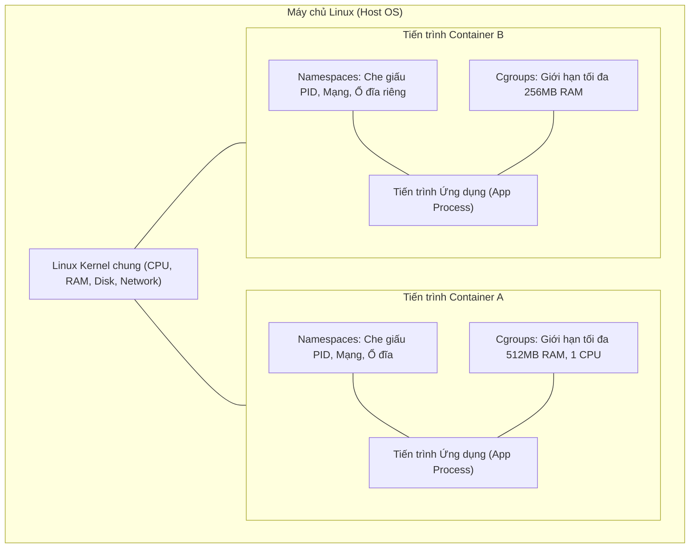

# Bài 01: Linux cơ bản cho Container: Namespace & Cgroups

## 1. Thông tin bài học
* **Tên bài:** Bài 01: Linux cơ bản cho Container: Namespace & Cgroups
* **Mục tiêu học:** Hiểu rõ bản chất container không phải một chiếc máy ảo độc lập mà là tiến trình Linux thông thường được cô lập tầm nhìn bằng Namespace và giới hạn tài nguyên bằng Cgroups; tự tay dùng dòng lệnh Linux để giam giữ một tiến trình.
* **Thời lượng ước tính:** 120 phút (60 phút đọc hiểu lý thuyết, 60 phút thực hành lab)
* **Kiến thức cần có trước:** Thao tác dòng lệnh cơ bản trong PowerShell và lệnh Linux cơ bản (`ls`, `ps`, `cd`, `mkdir`).
* **Liên quan kỳ thi:** CKA, CKS (Nền tảng về kiến trúc container runtime và bảo mật cô lập tiến trình).

---

## 2. Bảng thuật ngữ

| Thuật ngữ | Giải thích đơn giản | Ví dụ / Ẩn dụ đời thường |
| :--- | :--- | :--- |
| **Tiến trình (Process)** | Một chương trình đang chạy trong hệ điều hành, có mã định danh và bộ nhớ riêng. | Một người nhân viên đang ngồi làm việc tại bàn của mình trong công ty. |
| **Nhân hệ điều hành (Kernel)** | Trái tim của Linux, trực tiếp điều khiển phần cứng (CPU, RAM, ổ đĩa) và phân phối cho các ứng dụng. | Người quản lý tòa nhà, nắm toàn bộ chìa khóa, đồng hồ điện nước và phân chia tài nguyên cho cư dân. |
| **Linux Namespace** | Tính năng của Kernel giúp che giấu và giới hạn những gì một tiến trình **được nhìn thấy**. | Đeo kính râm ngựa đua: tiến trình chỉ nhìn thấy những thứ được chỉ định, tưởng rằng cả máy chủ chỉ có mỗi mình nó. |
| **Control Groups (Cgroups)** | Tính năng của Kernel giúp kiểm soát và giới hạn lượng tài nguyên (CPU, RAM, I/O) mà tiến trình **được sử dụng**. | Aptomat (cầu dao) tự ngắt điện nếu gia đình dùng quá công suất cho phép. |
| **PID (Process ID)** | Mã số định danh duy nhất của mỗi tiến trình đang chạy trong hệ thống. | Số căn cước công dân của một người trong xã hội. |
| **OOM-Killer (Out Of Memory Killer)** | Cơ chế tự vệ của Linux Kernel, tự động bắn hạ tiến trình tiêu thụ quá nhiều RAM để cứu sống toàn bộ hệ thống. | Bảo vệ quán bar lôi cổ vị khách gây rối, uống cạn thùng bia ra khỏi quán để quán không bị vỡ trận. |

---

## 3. Bức tranh lớn: Vấn đề thực tế và ẩn dụ đời thường

### Nhắc lại bài trước
Đây là bài học mở đầu trong toàn bộ lộ trình Kubernetes. Trước khi học cách điều phối hàng ngàn ứng dụng, chúng ta bắt buộc phải hiểu viên gạch cơ bản nhất: một container thực sự được cấu tạo từ những gì bên trong lòng hệ điều hành Linux.

### Tại sao cần cái này ở production? (Vấn đề thực tế)
Hãy tưởng tượng vào năm 2005, công ty của bạn mua một máy chủ vật lý cấu hình khủng: 64 nhân CPU, 128GB RAM. Bạn triển khai trực tiếp 3 ứng dụng lên chiếc máy chủ này: một trang web bán hàng (Node.js), một ứng dụng phân tích dữ liệu (Python), và một cơ sở dữ liệu (MySQL).

Một đêm nọ, code Python dính lỗi rò rỉ bộ nhớ (memory leak). Nó âm thầm ăn hết 100% dung lượng RAM của máy chủ. Hậu quả là gì? Hệ điều hành Linux rơi vào trạng thái tê liệt, dịch vụ MySQL bị treo cứng, và trang web bán hàng sập hoàn toàn. Khách hàng không thể thanh toán, giám đốc công ty gọi điện đánh thức bạn lúc 2 giờ sáng.

Chưa hết, nếu ứng dụng Python bị hacker khai thác lỗ hổng thực thi mã từ xa, hacker có thể dễ dàng gõ lệnh liệt kê toàn bộ tiến trình trên máy, đọc trộm file cấu hình của MySQL và nắm toàn bộ mật khẩu cơ sở dữ liệu. 

Vấn đề cốt lõi ở đây là: **thiếu sự cô lập tầm nhìn và thiếu sự kiểm soát tài nguyên giữa các ứng dụng chạy chung một máy chủ**.

### Ẩn dụ đời thường
Hãy tưởng tượng sự khác biệt giữa 3 mô hình sinh sống:

1. **Chạy trực tiếp không cô lập (Bare-metal):** Giống như 10 người xa lạ ở chung trong một căn phòng tập thể không có vách ngăn. Một người bật nhạc ầm ĩ (ngốn CPU), xả nước ngập phòng (ngốn RAM) thì 9 người còn lại phải chịu đựng. Một người bị kẻ trộm móc túi thì toàn bộ đồ đạc của những người khác trong phòng đều bị nhìn thấy hết.
2. **Máy ảo truyền thống (Virtual Machine):** Giống như đập đi xây lại từng ngôi nhà riêng biệt trên mảnh đất. Mỗi ngôi nhà phải có móng riêng, cột riêng, máy phát điện riêng (mỗi VM phải gánh nguyên một hệ điều hành khách - Guest OS nặng vài GB). Cách này cô lập cực kỳ an toàn, nhưng quá tốn kém và nặng nề, khởi động mất cả phút.
3. **Container (Namespace + Cgroups):** Giống như một tòa nhà chung cư hiện đại. Tất cả các căn hộ dùng chung nền móng, hệ thống khung dầm chịu lực và máy bơm nước của tòa nhà (dùng chung Linux Kernel). Tuy nhiên:
   - Mỗi căn hộ có tường ngăn cách và cửa khóa riêng: người ở căn hộ 101 không nhìn thấy người ở căn hộ 102 đang làm gì, không thể đi sang lục lọi đồ đạc của phòng khác $\rightarrow$ Đây chính là **Namespace**.
   - Mỗi căn hộ có một công tơ điện nước riêng với hạn mức cố định: nếu căn 101 bật lò sưởi vượt quá công suất đăng ký, aptomat riêng của căn đó sẽ nhảy $\rightarrow$ Đây chính là **Cgroups**.

Nhờ đó, cư dân (ứng dụng) vừa sống biệt lập, an toàn, vừa tiết kiệm chi phí tối đa vì không cần phải xây riêng một nhà máy phát điện cho từng người.

---

## 4. Giải thích khái niệm theo từng bước

Nhiều người mới bắt đầu thường nghĩ "Container" là một cái hộp vô hình hay một công nghệ giả lập phần cứng thần kỳ. Nhưng sự thật kỹ thuật chỉ có một câu:

> **"Không hề có thứ gì gọi là Container tồn tại trong Linux Kernel. Container thực chất chỉ là một tiến trình Linux bình thường, nhưng được gắn thêm hai chiếc cùm của Kernel: Namespace và Cgroups."**



### Bước 1: Linux Namespaces - Giới hạn những gì tiến trình NHÌN THẤY
Linux Kernel cung cấp nhiều loại Namespace khác nhau, mỗi loại chịu trách nhiệm che mắt một khía cạnh của hệ thống:

1. **PID Namespace (Process ID):** Cô lập danh sách tiến trình. Khi một tiến trình được đưa vào một PID Namespace mới, nó sẽ nhìn thấy chính nó là tiến trình số 1 (`PID 1` - tiến trình cha quyền lực nhất trong không gian đó), và hoàn toàn không thấy các tiến trình khác của máy chủ bên ngoài.
2. **NET Namespace (Network):** Cung cấp cho tiến trình một card mạng ảo riêng, bảng định tuyến (routing table) riêng, và dải cổng mạng (port) riêng. Nhờ đó, hai container trên cùng một máy chủ đều có thể mở cổng `80` mà không hề bị xung đột cổng (port conflict).
3. **MNT Namespace (Mount):** Cô lập cây thư mục và các điểm gắn ổ đĩa. Tiến trình trong container chỉ nhìn thấy cây thư mục của riêng nó (root filesystem riêng), không thể truy cập vào thư mục `/etc` hay `/var` của máy chủ gốc.
4. **UTS Namespace (UNIX Timesharing System):** Cho phép container tự đặt tên máy chủ (`hostname`) và domain riêng mà không làm đổi tên của máy chủ thật.
5. **IPC Namespace (Inter-Process Communication):** Ngăn chặn các tiến trình ở container khác đọc trộm bộ nhớ chia sẻ (shared memory) hoặc hàng đợi thông điệp.
6. **USER Namespace:** Cho phép một người dùng là tài khoản thông thường (không có quyền root) ở máy chủ thật lại đóng vai trò là `root` (UID 0) bên trong container, gia tăng mức độ an toàn.

### Bước 2: Control Groups (Cgroups) - Giới hạn những gì tiến trình ĐƯỢC DÙNG
Nếu Namespace là tấm rèm che mắt, thì Cgroups là chiếc vòng kim cô thắt chặt tài nguyên. 

Hiện nay các hệ điều hành Linux hiện đại đều đã chuyển sang chuẩn **cgroups v2** (thay thế cgroups v1 cũ kỹ). Trong cgroups v2, Kernel coi mỗi nhóm tài nguyên như một thư mục nằm trong `/sys/fs/cgroup`.

Muốn giới hạn tài nguyên của một nhóm tiến trình, Kernel chỉ đơn giản là:
1. Tạo một thư mục mới trong `/sys/fs/cgroup/` (ví dụ: `/sys/fs/cgroup/my-app/`).
2. Ghi giới hạn bộ nhớ mong muốn vào file `memory.max` (ví dụ ghi `104857600` nghĩa là 100MB).
3. Ghi PID của tiến trình cần kiểm soát vào file `cgroup.procs`.

Kể từ khoảnh khắc đó, nếu tiến trình đó cố tình xin cấp phát bộ nhớ vượt quá 100MB, Linux Kernel sẽ kích hoạt cơ chế OOM-Killer và lập tức hạ sát tiến trình đó để bảo vệ phần còn lại của hệ thống.

---

## 5. Thực hành (Lab)

Chúng ta sẽ sử dụng Docker Desktop trên Windows PowerShell để tạo một container Ubuntu 24.04 nhẹ nhàng làm bãi thử nghiệm (sandbox). Bên trong môi trường Linux này, chúng ta sẽ tự tay thực hiện hai thí nghiệm:
1. Tự tạo **PID Namespace** độc lập bằng lệnh `unshare`.
2. Tự tạo **Cgroup** giới hạn RAM và chứng kiến tận mắt OOM-Killer tiêu diệt tiến trình vi phạm.

* **Môi trường:** PowerShell trên Windows $\rightarrow$ chạy vào container sandbox Ubuntu 24.04 qua Docker.
* **Mức RAM ước tính:** ~80MB đến 120MB RAM (hoàn toàn an toàn trong hạn mức 4GB của WSL).
* **Lưu ý ổ đĩa:** Sử dụng image Ubuntu chính thức, tải thẳng vào ổ D của Docker, không ảnh hưởng đến dung lượng ổ C.

### Bước 1: Khởi động môi trường thực hành Linux Sandbox
Mở PowerShell trên máy tính của bạn và chạy lệnh sau:

```powershell
# Chạy container ubuntu với cờ --privileged để có quyền can thiệp vào cgroups và namespaces
docker run --privileged -it --rm --name lab-linux ubuntu:24.04 bash
```

**Kết quả mong đợi (Expected Output):**
```text
root@5a3f2b1c8d9e:/# 
```
*(Bạn đã ở bên trong dấu nhắc lệnh `bash` của Linux).*

Cài đặt hai công cụ nhỏ để phục vụ thí nghiệm:
```bash
# Cài đặt htop và procps để kiểm tra tiến trình
apt-get update -y && apt-get install -y procps
```

### Bước 2: Thử nghiệm cách ly tiến trình bằng PID Namespace
Trước hết, hãy xem danh sách tiến trình hiện tại:
```bash
ps aux
```
Bạn sẽ thấy một danh sách các tiến trình đang chạy. Bây giờ, hãy dùng lệnh `unshare` để tạo ra một PID Namespace hoàn toàn mới, đồng thời gắn lại hệ thống `/proc` riêng cho nó:

```bash
# Lệnh unshare: tạo PID namespace mới, tách biệt mount và gắn /proc mới
unshare --pid --fork --mount-proc bash
```

Sau khi gõ lệnh trên, bạn đã bước vào một "không gian vũ trụ song song". Hãy kiểm tra lại:
```bash
ps aux
```

**Kết quả mong đợi (Expected Output):**
```text
USER       PID %CPU %MEM    VSZ   RSS TTY      STAT START   TIME COMMAND
root         1  0.0  0.0   4624  3968 pts/0    S    03:15   0:00 bash
root         2  0.0  0.0   7060  1536 pts/0    R+   03:15   0:00 ps aux
```

> **Giải thích điều kỳ diệu vừa xảy ra:** 
> Tiến trình `bash` của bạn bây giờ mang `PID 1`! Nó không còn nhìn thấy bất kỳ tiến trình nào khác của hệ thống bên ngoài. Bạn vừa tự tay tạo ra cốt lõi của một Container bằng chính dòng lệnh gốc của Linux!

Gõ `exit` để thoát khỏi namespace này và quay lại shell ban đầu:
```bash
exit
```

### Bước 3: Thử nghiệm giới hạn RAM bằng Cgroups v2
Kiểm tra xem hệ thống có đang chạy cgroups v2 hay không:
```bash
# Nếu file này tồn tại thì hệ thống đang hỗ trợ cgroups v2 chuẩn mực
ls /sys/fs/cgroup/cgroup.controllers
```

Bây giờ, chúng ta sẽ tự tạo một cgroup tên là `gioi-han-ram` và đặt giới hạn bộ nhớ tối đa là **50 MegaBytes (52428800 bytes)**:

```bash
# 1. Tạo thư mục cgroup mới
mkdir -p /sys/fs/cgroup/gioi-han-ram

# 2. Đặt giới hạn 50MB RAM vào file memory.max
echo "52428800" > /sys/fs/cgroup/gioi-han-ram/memory.max

# 3. Đưa chính phiên làm việc bash hiện tại vào cgroup này
echo $$ > /sys/fs/cgroup/gioi-han-ram/cgroup.procs
```

### Bước 4: Kiểm chứng tính năng - Kích hoạt OOM-Killer
Bây giờ, phiên làm việc `bash` này bị khóa chặt trong giới hạn 50MB. Chúng ta sẽ cố tình chạy một lệnh Python/Perl hoặc dùng lệnh ghi dữ liệu vào RAM ảo để ép nó vượt quá 50MB.

Chạy lệnh đọc và nạp 100MB dữ liệu rác vào bộ nhớ đệm:
```bash
# Chạy một tiến trình cố tình ngốn 100MB RAM (vượt hạn mức 50MB)
python3 -c "a = 'x' * 100000000" 2>/dev/null || perl -e '$x = "a" x (100 * 1024 * 1024);'
```

Nếu máy chưa cài python hay perl, bạn có thể kiểm chứng đơn giản bằng lệnh `tail`:
```bash
tail /dev/zero
```

**Kết quả mong đợi (Expected Output):**
```text
Killed
```
Hoặc:
```text
Out of memory: Killed process ... (tail)
```

Kiểm tra số lần OOM-Killer đã ra tay trong cgroup này:
```bash
cat /sys/fs/cgroup/gioi-han-ram/memory.events
```

**Kết quả mong đợi (Expected Output):**
```text
low 0
high 0
max 1
oom 1
oom_kill 1
```

> **Kết luận:** File thống kê báo rõ `oom_kill 1`. Linux Kernel đã phát hiện tiến trình cố tình vượt rào 50MB và ngay lập tức "bắn hạ" nó mà không làm ảnh hưởng đến các tiến trình khác của máy chủ. Đây chính là cách Kubernetes bảo vệ node khi một Pod bị quá tải bộ nhớ!

### Bước 5: Dọn dẹp tài nguyên (Cleanup)
Gõ lệnh thoát khỏi container sandbox trên PowerShell:
```bash
exit
```
Vì lúc chạy chúng ta dùng cờ `--rm`, container `lab-linux` sẽ tự động bị xóa sổ hoàn toàn khỏi máy tính, toàn bộ RAM và tiến trình rác biến mất sạch sẽ, giải phóng 100% tài nguyên cho Windows.

---

## 6. Lỗi thường gặp và cách debug

### Lỗi 1: `unshare: unshare failed: Operation not permitted`
* **Dấu hiệu:** Khi gõ lệnh `unshare` trong container, terminal báo lỗi quyền truy cập bị từ chối.
* **Nguyên nhân:** Mặc định Docker chạy container với quyền hạn chế để bảo vệ máy host. Nó không cho phép tiến trình bên trong tự tạo Namespace mới hoặc can thiệp sâu vào kernel.
* **Cách sửa:** Luôn thêm cờ `--privileged` khi khởi động container sandbox thí nghiệm (ví dụ: `docker run --privileged ...`).

### Lỗi 2: Gõ `ps aux` trong Namespace mới nhưng vẫn thấy toàn bộ tiến trình của máy chủ
* **Dấu hiệu:** Sau khi dùng `unshare --pid bash`, gõ `ps aux` vẫn thấy hàng chục tiến trình của host.
* **Nguyên nhân:** Lệnh `ps` không đọc dữ liệu trực tiếp từ kernel mà đọc từ thư mục ảo `/proc`. Mặc dù PID Namespace đã mới, nhưng thư mục `/proc` vẫn đang trỏ về `/proc` của hệ thống cũ.
* **Cách sửa:** Bắt buộc phải thêm cờ `--mount-proc` để Linux tự động mount lại thư mục `/proc` mới dành riêng cho namespace đó: `unshare --pid --fork --mount-proc bash`.

### Lỗi 3: Không tìm thấy file `memory.max` trong thư mục `/sys/fs/cgroup/`
* **Dấu hiệu:** Báo lỗi `No such file or directory` khi `echo` vào `memory.max`.
* **Nguyên nhân:** Hệ thống Linux của bạn có thể vẫn đang chạy **cgroups v1** cũ. Ở v1, file tương ứng có tên là `memory.limit_in_bytes`.
* **Cách debug:** Kiểm tra bằng lệnh `mount | grep cgroup`. Nếu thấy có dòng `cgroup2 on /sys/fs/cgroup type cgroup2`, bạn đang ở v2. Các bản Linux và Kubernetes hiện đại từ 2022 trở lại đây (kể cả Docker Desktop WSL 2) đều dùng mặc định cgroups v2.

---

## 7. Góc nhìn Senior

### 1. Sự đánh đổi (Trade-offs)
Container không phải là "viên đạn bạc" giải quyết được mọi bài toán:
* **Ưu điểm vượt trội:** Tốc độ khởi động tính bằng mili-giây, tiêu tốn cực ít tài nguyên (overhead gần như bằng 0) vì dùng chung một Linux Kernel duy nhất.
* **Điểm yếu cốt tử:** **Mức độ cô lập yếu hơn Máy ảo (VM).** Vì dùng chung Kernel, nếu Kernel bị dính một lỗ hổng bảo mật nghiêm trọng (ví dụ như lỗ hổng leo thang đặc quyền `Dirty COW` hay lỗi rò rỉ bộ nhớ nhân), một tiến trình trong container có thể tấn công trực tiếp vào Kernel và chiếm quyền điều khiển toàn bộ máy chủ vật lý (**Container Escape**). 
* **Khi nào không nên dùng container thuần túy:** Khi chạy các đoạn mã không đáng tin cậy của khách hàng bên ngoài (multi-tenant untrusted code). Trong trường hợp đó, các kỹ sư Senior thường sử dụng các giải pháp như **gVisor** (Google) hoặc **Kata Containers** (micro-VM) để bọc thêm một lớp bảo vệ.

### 2. Best practices tại production
* **Tuyệt đối không bao giờ chạy container với cờ `--privileged` trên production:** Cờ này trao toàn bộ quyền can thiệp phần cứng cho container, biến mọi bức tường bảo vệ của Namespace và Cgroups thành vô nghĩa.
* **Luôn đặt giới hạn bộ nhớ (Memory Limit):** Nếu một lập trình viên vô tình viết code dính memory leak mà không cấu hình memory limit, Kernel có thể sẽ kích hoạt OOM-Killer bắn hạ nhầm các tiến trình quan trọng khác (như tiến trình `sshd` hoặc `kubelet`).
* **Hiểu bản chất của CPU Throttling vs OOM-Killer:** Vượt giới hạn RAM sẽ bị **giết chết lập tức** (OOM-Kill), nhưng vượt giới hạn CPU thì chỉ bị **bóp nghẹt tốc độ** (CPU Throttling) chứ không bị tắt tiến trình.

### 3. Câu hỏi phỏng vấn Senior
* **Câu hỏi 1:** *"Dưới góc nhìn của Linux Kernel, Container thực chất là gì? Khác biệt cơ bản giữa một Container và một Process thông thường là gì?"*
  * **Gợi ý trả lời:** Dưới góc nhìn của Kernel, không có đối tượng dữ liệu nào tên là Container. Một container thực chất là một tiến trình bình thường trong bảng quản lý tiến trình (`task_struct`), nhưng trường thuộc tính của nó được trỏ tới các cấu trúc `nsproxy` (để cô lập Namespace) và thuộc về các nhóm `cgroups` (để giới hạn tài nguyên).
* **Câu hỏi 2:** *"Tại sao trong một Kubernetes Pod, hai container khác nhau có thể gọi cho nhau thông qua `localhost`?"*
  * **Gợi ý trả lời:** Bởi vì Kubernetes cho phép các container trong cùng một Pod chia sẻ chung một **Network Namespace**. Khi dùng chung Network Namespace, chúng dùng chung card mạng ảo `lo` (loopback) và cùng nhìn thấy các cổng mạng của nhau như các tiến trình chạy trên cùng một máy cục bộ.

---

## 8. Tóm tắt bài học
* 📌 **1.** Container không phải máy ảo; bản chất của container chỉ là tiến trình Linux thông thường được quản lý đặc biệt.
* 📌 **2.** **Namespace** quyết định tiến trình **nhìn thấy gì** (cô lập danh sách PID, cổng mạng, tên máy, cây thư mục).
* 📌 **3.** **Cgroups** quyết định tiến trình **được dùng bao nhiêu** (áp đặt trần giới hạn cho CPU, RAM, I/O).
* 📌 **4.** Khi tiến trình tiêu thụ RAM vượt quá ngưỡng quy định của Cgroup, Linux Kernel sẽ gọi **OOM-Killer** để lập tức tiêu diệt nó.
* 📌 **5.** Container chia sẻ chung Kernel với máy host, do đó khởi động cực nhanh nhưng tiềm ẩn rủi ro nếu có lỗ hổng Kernel.

---

## 9. Bài tập tự làm

* 🟢 **Mức Dễ:** Khởi động container Ubuntu sandbox, tạo một UTS Namespace mới bằng lệnh `unshare --uts bash`, sau đó đổi hostname thành `may-chu-bi-mat`. Kiểm tra xem hostname bên ngoài container có bị thay đổi theo hay không.
* 🟡 **Mức Vừa:** Tạo một Cgroup v2 giới hạn RAM ở mức 30MB. Viết một script bash nhỏ chạy vòng lặp tạo biến dữ liệu tăng dần và ghi nhận chính xác thời điểm tiến trình bị OOM-Killer tiêu diệt.
* 🔴 **Mức Khó (Troubleshooting):** Giả sử bạn vào một máy chủ Linux và thấy một tiến trình liên tục bị chết với mã thoát `137`. Hãy sử dụng lệnh `dmesg` hoặc đọc file log của hệ thống để chứng minh tiến trình này chết là do dính đòn của Linux OOM-Killer chứ không phải do lỗi code ứng dụng.

---

## 10. Câu hỏi tự kiểm tra

1. Nếu một tiến trình chạy trong PID Namespace riêng, khi nó tự gọi lệnh `ps aux`, tiến trình chính nó thường mang mã PID là bao nhiêu?
2. Điều gì sẽ xảy ra nếu một container dùng vượt mức CPU cho phép? Nó có bị tắt giống như khi vượt mức RAM không?
3. Loại Namespace nào cho phép hai container chạy trên cùng một máy chủ vật lý có thể cùng lắng nghe (listen) trên cổng 80 mà không xung đột?
4. Thư mục nào trên hệ thống Linux lưu trữ toàn bộ cây cấu trúc của Cgroups v2?
5. Tại sao việc gán cờ `--privileged` cho một container ở môi trường production lại bị coi là hành vi cực kỳ nguy hiểm?

<details>
<summary>👉 Bấm vào đây để xem đáp án câu hỏi tự kiểm tra</summary>

* **Đáp án 1:** Mang `PID 1`. Trong PID Namespace của riêng nó, nó đóng vai trò là tiến trình gốc đầu tiên.
* **Đáp án 2:** Không bị tắt. Vượt mức CPU chỉ khiến tiến trình bị điều tiết (CPU Throttling) - tức là Kernel sẽ tạm thời không phân phối chu kỳ xung nhịp CPU cho nó trong một khoảng thời gian ngắn, khiến ứng dụng phản hồi chậm đi. Chỉ có vượt RAM mới bị OOM-Killer tiêu diệt.
* **Đáp án 3:** **Network Namespace (NET Namespace)**. Mỗi container có một card mạng và bảng cổng mạng riêng biệt.
* **Đáp án 4:** Thư mục `/sys/fs/cgroup/`.
* **Đáp án 5:** Vì cờ `--privileged` sẽ gỡ bỏ gần như toàn bộ ranh giới cô lập của Namespace, trao toàn bộ Linux Capabilities và quyền truy cập vào tất cả thiết bị phần cứng của host, biến container thành tiến trình có toàn quyền trên máy chủ.
</details>

---

## 11. Tài liệu đọc thêm và bài tiếp theo

### Tài liệu tham khảo
* [Tài liệu man-page chính thức về namespaces(7) trên Linux](https://man7.org/linux/man-pages/man7/namespaces.7.html)
* [Tài liệu chính thức về cgroups(7) trên Linux Kernel](https://man7.org/linux/man-pages/man7/cgroups.7.html)
* [Tài liệu Kubernetes: Giới thiệu về Container Runtimes](https://kubernetes.io/docs/setup/production-environment/container-runtimes/)

### Bài tiếp theo
👉 **Bài 02: Container & Docker từ bản chất: Image, Layer & CRI**

---

## PHỤ LỤC: ĐÁP ÁN GỢI Ý BÀI TẬP TỰ LÀM (MỤC 9)

### Đáp án Mức Dễ
```bash
# 1. Chạy bash với UTS namespace riêng biệt
unshare --uts bash

# 2. Đổi hostname trong namespace này
hostname may-chu-bi-mat

# 3. Kiểm tra hostname hiện tại
hostname
# Kết quả: may-chu-bi-mat

# 4. Thoát ra ngoài shell gốc
exit

# 5. Kiểm tra hostname của máy host
hostname
# Kết quả: Hostname ban đầu vẫn giữ nguyên, không hề bị ảnh hưởng!
```

### Đáp án Mức Vừa
```bash
# Tạo Cgroup 30MB
mkdir -p /sys/fs/cgroup/test-ram
echo "31457280" > /sys/fs/cgroup/test-ram/memory.max

# Mở một subshell gán vào cgroup này và ngốn RAM
bash -c '
echo $$ > /sys/fs/cgroup/test-ram/cgroup.procs
str=""
while true; do
    str="$str$(head -c 1048576 < /dev/zero | tr "\0" "a")"
    echo "Đang cấp phát thêm 1MB..."
done
'
# Kết quả: Script in ra đến khoảng 28-30MB là bị dòng chữ "Killed" xuất hiện tức thì.
```

### Đáp án Mức Khó
Mã thoát (Exit Code) `137` trong Linux = `128 + 9` (tương đương tín hiệu `SIGKILL` - signal 9). Tín hiệu này thường do Kernel gửi tới khi tiến trình bị ép dừng đột ngột.

Để chứng minh do OOM-Killer gây ra, ta chạy lệnh kiểm tra nhật ký nhân:
```bash
dmesg -T | grep -i -E "oom|killed process"
```
Nếu output hiển thị thông báo có dạng:
`Out of memory: Killed process 12345 (my-app) total-vm:..., anon-rss:...`
thì đó chính là bằng chứng xác thực rằng tiến trình đã bị hạ sát bởi cơ chế bảo vệ bộ nhớ của Linux Kernel.
