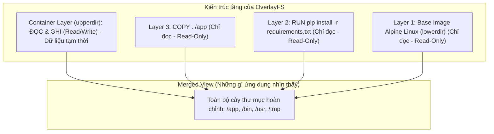
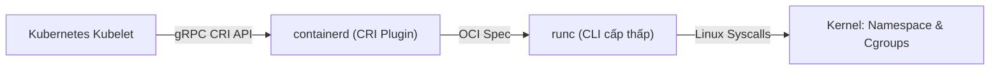

# Bài 02: Container & Docker từ bản chất: Image, Layer & CRI

## 1. Thông tin bài học
* **Tên bài:** Bài 02: Container & Docker từ bản chất: Image, Layer & CRI
* **Mục tiêu học:** Hiểu bản chất Container Image là một chồng đĩa chỉ đọc (Union Filesystem); nắm vững cơ chế Copy-on-Write (CoW); phân tích được cấu trúc Dockerfile tối ưu đa tầng (Multi-stage build); và hiểu rõ tại sao Kubernetes sử dụng chuẩn CRI (Container Runtime Interface) thay vì gắn chặt với Docker.
* **Thời lượng ước tính:** 150 phút (75 phút lý thuyết, 75 phút thực hành)
* **Kiến thức cần có trước:** Bài 01: Linux cơ bản cho Container: Namespace & Cgroups.
* **Liên quan kỳ thi:** CKAD (Kỹ năng xây dựng, kiểm tra và tối ưu Container Image), CKA (Hiểu kiến trúc Container Runtime trên Worker Node).

---

## 2. Bảng thuật ngữ

| Thuật ngữ | Giải thích đơn giản | Ví dụ / Ẩn dụ đời thường |
| :--- | :--- | :--- |
| **Container Image** | Bản thiết kế đóng gói toàn bộ mã nguồn, thư viện, và hệ điều hành mini cần thiết để chạy ứng dụng. Trạng thái chỉ đọc (Read-Only). | Một đĩa DVD cài đặt trò chơi được đóng gói niêm phong. Bạn chỉ có thể đọc dữ liệu từ đĩa, không thể ghi đè lên đĩa. |
| **Image Layer** | Một tầng dữ liệu bất biến được sinh ra từ một chỉ thị trong Dockerfile. Nhiều layer xếp chồng lên nhau tạo thành Image hoàn chỉnh. | Từng lớp bánh trong một chiếc bánh gato nhiều tầng (lớp cốt bánh, lớp kem, lớp mứt). |
| **Union Filesystem (OverlayFS)** | Hệ thống tệp đặc biệt cho phép xếp chồng nhiều thư mục lên nhau và hiển thị cho người dùng như một cây thư mục duy nhất. | Đặt nhiều tấm phim trong suốt có vẽ hình lên nhau; khi nhìn từ trên xuống, ta thấy một bức tranh hoàn chỉnh. |
| **Copy-on-Write (CoW)** | Cơ chế tiết kiệm bộ nhớ: chỉ khi nào bạn sửa đổi một tệp có sẵn, hệ thống mới sao chép tệp đó lên lớp riêng để sửa, còn lại đều dùng chung. | Khi cả lớp dùng chung một cuốn sách mẫu; nếu bạn muốn sửa bài tập, bạn photo trang đó ra rồi viết lên bản photo của mình. |
| **Container Runtime** | Phần mềm chịu trách nhiệm tải image, thiết lập Namespace/Cgroups và khởi chạy tiến trình container. | Người thợ làm bánh trực tiếp lấy công thức (Image) ra nướng thành chiếc bánh ăn được (Container). |
| **CRI (Container Runtime Interface)** | Chuẩn giao tiếp chung của Kubernetes giúp nó nói chuyện được với mọi loại Container Runtime mà không cần quan tâm hãng sản xuất. | Cổng cắm sạc chuẩn Type-C: cắm được cho điện thoại Samsung, Xiaomi, iPhone mà không cần đầu nối riêng của từng hãng. |
| **Multi-stage Build** | Kỹ thuật dùng nhiều bước `FROM` trong Dockerfile để loại bỏ hoàn toàn các công cụ biên dịch thừa thãi, chỉ giữ lại sản phẩm cuối cùng. | Nhà bếp làm bánh: sơ chế và nhào bột ở khu vực bếp phụ, khi xong chỉ bưng chiếc bánh sạch sẽ sang phòng ăn bày tiệc. |

---

## 3. Bức tranh lớn: Vấn đề thực tế và ẩn dụ đời thường

### Nhắc lại bài trước
Ở Bài 01, chúng ta đã khám phá bí mật bên dưới nắp ca-pô của Linux: một container thực chất chỉ là một tiến trình bình thường bị che mắt bởi **Namespace** và bị khống chế tài nguyên bởi **Cgroups**. Tuy nhiên, câu hỏi lớn vẫn còn: làm sao để đóng gói toàn bộ thư viện và file hệ thống để tiến trình đó có thể mang đi chạy ở bất kỳ máy tính nào mà không bao giờ bị lỗi "chạy được trên máy em nhưng lỗi trên server"?

### Tại sao cần cái này ở production? (Vấn đề thực tế)
Trước khi Docker và Container Image bùng nổ, việc triển khai ứng dụng lên máy chủ production là một cơn ác mộng có tên gọi "Ma trận phụ thuộc" (Dependency Hell):
1. Bạn viết code Python 3.11 trên máy cá nhân (dùng bản thư viện `openssl 3.0`).
2. Khi đưa lên máy chủ Linux của công ty, máy chủ lại đang cài sẵn Python 3.8 và thư viện `openssl 1.1` để phục vụ một hệ thống kế toán cũ.
3. Nếu bạn cập nhật thư viện trên máy chủ để chạy app của mình, hệ thống kế toán sẽ sập. Nếu bạn không cập nhật, code của bạn không chạy được.
4. Lập trình viên phải viết tài liệu dài 20 trang hướng dẫn quản trị viên: *"Cài gói A, sửa file cấu hình B, tải bản vá C"*. Một thao tác gõ nhầm lệnh trên terminal máy chủ có thể khiến việc bàn giao thất bại hoàn toàn.

Chưa hết, khi công nghệ container ra đời, nhiều người mắc lỗi tạo ra những Container Image nặng tới **2GB đến 3GB**. Khi hệ thống gặp sự cố cần scale-up khẩn cấp thêm 10 bản sao, mạng nội bộ bị nghẽn vì phải kéo hàng chục gigabyte dữ liệu qua mạng; ổ đĩa máy chủ cạn kiệt dung lượng; và hình ảnh chứa đầy rác bảo mật (trình biên dịch, công cụ gỡ lỗi) trở thành mồi ngon cho hacker.

Chúng ta cần một định dạng đóng gói **bất biến, nhẹ nhàng, tái sử dụng cao và một chuẩn giao tiếp mở** để chạy các gói này. Đó là lý do Container Image, OverlayFS và CRI ra đời.

### Ẩn dụ đời thường
1. **Container Image vs Container:**
   * **Container Image** giống như một **công thức nấu ăn in trên giấy**. Nó là văn bản tĩnh, bất biến, bạn không thể ăn tờ giấy đó.
   * **Container** là **món ăn nóng hổi được nấu ra từ công thức**. Từ một công thức duy nhất, đầu bếp có thể nấu ra 1 đĩa hay 100 đĩa giống hệt nhau. Nếu bạn rắc thêm tiêu vào đĩa ăn của mình, tờ giấy công thức gốc vẫn không hề bị dính hạt tiêu nào.

2. **Union Filesystem (OverlayFS) và cơ chế Layer:**
   * Hãy tưởng tượng bạn là một họa sĩ vẽ phim hoạt hình.
   * Lớp dưới cùng (**Base Layer**): Tấm kính vẽ nền trời xanh và bãi cỏ.
   * Lớp tiếp theo (**Middle Layer**): Tấm kính vẽ ngôi nhà tĩnh.
   * Lớp trên cùng (**Container Layer - Read/Write**): Tấm kính vẽ nhân vật đang di chuyển.
   * Khi nhìn từ trên xuống, bạn thấy một bức tranh hoàn chỉnh gồm bầu trời, ngôi nhà và nhân vật. 
   * Nếu bạn muốn xóa một cái cây ở lớp nền, bạn không thể cạo tấm kính nền (vì nó là Read-Only). Bạn chỉ cần lấy bút xóa màu trắng dán đè lên vị trí cái cây đó trên tấm kính trên cùng (**Copy-on-Write**). Nhìn từ trên xuống, cái cây biến mất!

3. **Docker vs containerd vs CRI:**
   * **Docker** ban đầu giống như một chiếc xe hơi gia đình đầy đủ tiện nghi: có máy lạnh, loa nghe nhạc, ghế bọc da cao cấp, cốp đựng đồ dã ngoại.
   * Khi đưa vào trường đua chuyên nghiệp F1 (Kubernetes production), người ta không cần máy lạnh hay ghế da; những thứ đó chỉ làm xe nặng nề và dễ hỏng vặt. Người ta chỉ cần cái động cơ mạnh mẽ và 4 bánh xe để chạy.
   * Động cơ thuần túy đó chính là **containerd** (hoặc **CRI-O**).
   * **CRI** chính là chiếc vô-lăng và bàn đạp phanh chuẩn hóa: bất kể đội đua gắn động cơ Ferrari hay Mercedes vào, tay đua (Kubernetes Kubelet) đều điều khiển được thông qua các bàn đạp chuẩn CRI đó.

---

## 4. Giải thích khái niệm theo từng bước

### Bước 1: Cấu trúc của Container Image và OverlayFS
Khi bạn kéo một image (ví dụ `ubuntu:24.04` hay `python:3.11-alpine`), Docker không tải về một file nén khổng lồ duy nhất, mà tải về từng **Layer** riêng biệt dưới dạng các file nén `.tar`.

Mỗi dòng lệnh làm thay đổi hệ thống tệp trong Dockerfile (`RUN`, `COPY`, `ADD`) sẽ sinh ra một layer mới.

Khi container khởi chạy, nhân Linux sử dụng driver **OverlayFS** để gộp các layer này lại:



* **lowerdir (Các layer chỉ đọc):** Tất cả các layer của Image. Chúng không bao giờ bị thay đổi. Hàng trăm container tạo ra từ cùng một Image đều dùng chung các `lowerdir` này trong RAM và ổ cứng, giúp tiết kiệm dung lượng khủng khiếp!
* **upperdir (Container layer):** Lớp mỏng trên cùng dành riêng cho container. Khi container ghi file mới, file nằm ở đây.
* **mergeddir:** Điểm gắn (mount point) kết hợp tất cả các tầng lại để tiến trình nhìn thấy.

### Bước 2: Cơ chế Copy-on-Write (CoW) hoạt động thế nào?
1. **Đọc file:** Tiến trình tìm kiếm từ tầng trên cùng xuống dưới. Thấy file ở layer nào thì đọc nội dung ở layer đó.
2. **Tạo file mới:** File mới được tạo trực tiếp trên `upperdir`.
3. **Sửa file có sẵn từ Image:** Vì các layer bên dưới là chỉ đọc, Linux Kernel sẽ **sao chép (copy)** file đó từ layer dưới lên `upperdir` trước khi cho phép tiến trình ghi đè nội dung mới (**Write**). File gốc ở layer dưới hoàn toàn nguyên vẹn!
4. **Xóa file:** Kernel tạo ra một file đặc biệt gọi là **Whiteout device** trên `upperdir` để che đi file ở tầng dưới. Ứng dụng sẽ thấy file đó như đã bị xóa.

### Bước 3: Kỹ thuật Multi-stage Build (Xây dựng đa tầng)
Tại sao chúng ta không nên dùng một image duy nhất để vừa biên dịch code vừa chạy code?
* Để biên dịch mã nguồn (như Golang, C++, hoặc cài thư viện Python), bạn cần trình biên dịch như `gcc`, `g++`, gói thư viện `python-dev`, mã nguồn gốc. Tổng dung lượng có thể lên tới **800MB - 1GB**.
* Khi chạy ở production, bạn chỉ cần duy nhất file nhị phân (binary) đã biên dịch hoặc các bytecode đã đóng gói, dung lượng chỉ cần **20MB - 50MB**.
* **Multi-stage Build** cho phép bạn định nghĩa nhiều giai đoạn `FROM` trong cùng một Dockerfile. Giai đoạn sau có thể copy sản phẩm từ giai đoạn trước thông qua lệnh `COPY --from=builder ...`.

### Bước 4: Từ Docker đến chuẩn CRI (Container Runtime Interface)
Lịch sử phát triển kiến trúc của Kubernetes:
1. **Thời kỳ đầu (K8s < v1.24):** Kubernetes Kubelet nói chuyện trực tiếp với Docker Daemon thông qua một khối mã trung gian tích hợp sẵn gọi là **dockershim**. Docker lại gọi `containerd`, containerd lại gọi `runc` để tạo container. Kiến trúc này cồng kềnh, dư thừa và phụ thuộc chặt chẽ vào một công ty phần mềm (Docker Inc.).
2. **Chuẩn hóa CRI:** Kubernetes tạo ra đặc tả **CRI (Container Runtime Interface)** dựa trên gRPC. Bất kỳ phần mềm nào đáp ứng được giao diện này đều có thể cắm trực tiếp vào Kubelet.
3. **Loại bỏ dockershim (K8s v1.24+):** Kubernetes chính thức gỡ bỏ `dockershim`. Giờ đây, Kubelet nói chuyện trực tiếp với **containerd** hoặc **CRI-O** qua socket CRI.



> **Lưu ý quan trọng:** Việc Kubernetes "bỏ Docker" chỉ có nghĩa là nó không dùng Docker Engine để quản lý container trên server nữa. Toàn bộ các **Docker Image** bạn build bằng lệnh `docker build` vẫn chạy hoàn toàn bình thường 100% trên Kubernetes, vì chúng đều tuân theo chuẩn mở **OCI (Open Container Initiative)**.

---

## 5. Thực hành (Lab)

Trong bài lab này, chúng ta sẽ phân tích và thực hành trên microservice thực tế **`emailservice`** nằm trong kho dự án Online Boutique (`microservices-demo\src\emailservice`).

* **Môi trường:** Máy tính Windows, PowerShell, Docker Desktop.
* **Mức RAM ước tính:** ~100MB đến 150MB trong lúc build image (hoàn toàn an toàn với giới hạn 4GB của WSL).

### Bước 1: Khám phá Dockerfile của `emailservice`
Mở PowerShell và chuyển vào thư mục dự án `emailservice`:

```powershell
cd d:\LEARN\kubernetes\microservices-demo\src\emailservice
Get-Content Dockerfile -TotalCount 35
```

Hãy quan sát cách các kỹ sư Google viết Dockerfile cho service này:
```dockerfile
# Giai đoạn 1: Base image siêu nhẹ dùng Alpine Linux
FROM python:3.14.7-alpine AS base

# Giai đoạn 2: Builder - Cài đặt trình biên dịch g++ để cài thư viện nặng
FROM base AS builder
RUN apk update && apk add --no-cache g++ linux-headers
COPY requirements.txt .
RUN pip install -r requirements.txt

# Giai đoạn 3: Runtime - Bỏ lại toàn bộ g++ và compiler thừa thãi
FROM base
WORKDIR /email_server
# Chỉ copy thư viện Python đã cài sẵn từ giai đoạn builder sang!
COPY --from=builder /usr/local/lib/python3.14/ /usr/local/lib/python3.14/
COPY . .
ENTRYPOINT [ "python", "email_server.py" ]
```

> **Nhận xét của Senior:** Bạn thấy điều gì ở đây? Giai đoạn `builder` cài `g++` để biên dịch các thư viện C, nhưng sang giai đoạn cuối, image chỉ copy thư mục thư viện `/usr/local/lib/` chứ không hề mang theo `g++`. Nhờ đó, kích thước image giảm đi hàng trăm megabytes!

### Bước 2: Thực hành xây dựng image và quan sát Layer Cache
Tiến hành build image thử nghiệm cho `emailservice` bằng PowerShell:

```powershell
# Thực hiện build image và đặt tên là boutique-email:v1
docker build -t boutique-email:v1 .
```

**Kết quả mong đợi (Expected Output):**
```text
[+] Building 12.4s (15/15) FINISHED
 => [internal] load build definition from Dockerfile
 => => transferring dockerfile: ...
 => [base 1/1] FROM docker.io/library/python:3.14.7-alpine
 => [builder 2/4] RUN apk update && apk add --no-cache g++ linux-headers
 => [builder 4/4] RUN pip install -r requirements.txt
 => [stage-2 4/5] COPY --from=builder /usr/local/lib/python3.14/ /usr/local/lib/python3.14/
 => [stage-2 5/5] COPY . .
 => exporting to image
 => => naming to docker.io/library/boutique-email:v1
```

Bây giờ, hãy thử chạy lại lệnh build một lần nữa:
```powershell
docker build -t boutique-email:v1 .
```

**Kết quả mong đợi (Expected Output):**
```text
[+] Building 0.4s (15/15) FINISHED
 => CACHED [builder 2/4] RUN apk update && apk add --no-cache g++ linux-headers
 => CACHED [builder 4/4] RUN pip install -r requirements.txt
 => CACHED [stage-2 5/5] COPY . .
```

> **Giải thích:** Thời gian build giảm từ hơn 10 giây xuống chỉ còn **0.4 giây** nhờ dòng chữ `CACHED`! Docker nhận ra các file và câu lệnh không hề thay đổi, nên nó tái sử dụng lại các layer đã tạo trước đó mà không phải tải hay tính toán lại.

### Bước 3: Soi từng Layer bên trong Image bằng `docker history`
Hãy mổ xẻ xem image này gồm những layer nào và layer nào ngốn dung lượng:

```powershell
docker history boutique-email:v1
```

**Kết quả mong đợi (Expected Output):**
```text
IMAGE          CREATED         CREATED BY                                      SIZE      COMMENT
5f9b1c2e3d4a   2 minutes ago   ENTRYPOINT ["python" "email_server.py"]         0B        buildkit.dockerfile.v0
<missing>      2 minutes ago   EXPOSE map[8080/tcp:{}]                         0B        buildkit.dockerfile.v0
<missing>      2 minutes ago   COPY . .                                        35.4kB    buildkit.dockerfile.v0
<missing>      2 minutes ago   COPY --from=builder /usr/local/lib/python3.1…   48.2MB    buildkit.dockerfile.v0
<missing>      2 minutes ago   WORKDIR /email_server                           0B        buildkit.dockerfile.v0
<missing>      2 minutes ago   RUN /bin/sh -c apk update && apk add --no-ca…   8.12MB    buildkit.dockerfile.v0
<missing>      5 days ago      /bin/sh -c #(nop)  CMD ["python3"]              0B
<missing>      5 days ago      /bin/sh -c set -eux; apk add --no-cache ...     45.1MB
```

> **Phân tích:** 
> 1. Các lệnh metadata như `ENTRYPOINT`, `EXPOSE`, `WORKDIR` tốn đúng **0 Bytes**.
> 2. Lệnh `COPY . .` (mã nguồn ứng dụng Python của bạn) chỉ tốn **35.4 Kilobytes**.
> 3. Toàn bộ thư viện đã cài đặt chỉ tốn **48.2 Megabytes**. Tổng thể image chưa tới 110MB, cực kỳ nhỏ gọn!

### Bước 4: Kiểm chứng tính bất biến của Image Layer
Chạy một container từ image vừa tạo và thử sửa đổi file bên trong:

```powershell
# Chạy container ở chế độ nền
docker run -d --name test-email boutique-email:v1

# Tạo một file mới bên trong container
docker exec test-email touch /email_server/file_moi_tao.txt

# Kiểm tra thay đổi của container so với image gốc bằng docker diff
docker diff test-email
```

**Kết quả mong đợi (Expected Output):**
```text
C /email_server
A /email_server/file_moi_tao.txt
```
*(Ký hiệu `C` nghĩa là Changed - thư mục bị thay đổi; `A` nghĩa là Added - tệp mới được thêm vào lớp `upperdir` của container).*

File `file_moi_tao.txt` chỉ tồn tại trong container `test-email`. Image gốc `boutique-email:v1` hoàn toàn không bị ảnh hưởng.

### Bước 5: Dọn dẹp tài nguyên (Cleanup)
Xóa container và image thử nghiệm để trả lại dung lượng ổ cứng và RAM:

```powershell
docker rm -f test-email
docker rmi boutique-email:v1
```

**Kết quả mong đợi (Expected Output):**
```text
test-email
Untagged: boutique-email:v1
Deleted: sha256:...
```

---

## 6. Lỗi thường gặp và cách debug

### Lỗi 1: Đặt `COPY . .` trước khi cài đặt thư viện làm vỡ Layer Cache
* **Dấu hiệu:** Mỗi lần chỉ sửa một dòng code nhỏ trong file `.py` hay `.js`, nhưng khi chạy `docker build`, hệ thống lại mất vài phút để tải lại và cài đặt toàn bộ thư viện từ đầu.
* **Nguyên nhân:** Docker kiểm tra tính hợp lệ của cache theo thứ tự từ trên xuống dưới. Nếu một layer bị thay đổi, **toàn bộ các layer phía sau nó đều bị hủy cache (cache invalidated)**. Khi bạn đặt `COPY . .` lên trên `pip install` hoặc `npm install`, mỗi lần bạn sửa code, dòng `COPY . .` bị đổi mã hash, khiến dòng cài thư viện bên dưới bị buộc phải chạy lại từ đầu.
* **Cách khắc phục chuẩn:** Luôn tách việc copy file khai báo thư viện ra trước:
  ```dockerfile
  # ĐÚNG: Tận dụng cache triệt để
  COPY requirements.txt .
  RUN pip install -r requirements.txt
  COPY . .   # Chỉ copy code sau khi đã cài xong thư viện
  ```

### Lỗi 2: Không dùng file `.dockerignore` khiến image phình to bất thường
* **Dấu hiệu:** Image phình to hàng trăm megabyte một cách khó hiểu; hoặc vô tình đóng gói cả thư mục `.git`, file môi trường `.env` chứa mật khẩu bí mật vào trong image.
* **Nguyên nhân:** Lệnh `COPY . .` sẽ gửi toàn bộ thư mục hiện tại (Build Context) vào Docker daemon, bao gồm cả thư mục ẩn `.git`, file log rác, và môi trường ảo cục bộ `venv` hay `node_modules`.
* **Cách khắc phục:** Luôn tạo file `.dockerignore` đặt cạnh `Dockerfile` với nội dung tối thiểu:
  ```text
  .git
  __pycache__
  *.pyc
  .env
  node_modules
  venv
  ```

### Lỗi 3: Ứng dụng dính lỗi crash kỳ lạ khi dùng Alpine Linux (`musl libc`)
* **Dấu hiệu:** Ứng dụng Python hoặc Node.js chạy bình thường trên Ubuntu nhưng khi đóng gói vào `python:alpine` thì báo lỗi `Error relocating ...: symbol not found` hoặc hiệu năng giảm sút 3-5 lần.
* **Nguyên nhân:** Alpine Linux sử dụng bộ thư viện chuẩn C là **`musl libc`** thay vì **`glibc`** truyền thống của Debian/Ubuntu. Một số thư viện tối ưu hóa hiệu năng cao viết bằng C/C++ (như `grpcio`, `numpy`, `cryptography`) không có sẵn bản pre-compiled wheel cho `musl`, dẫn đến việc phải biên dịch lại từ đầu hoặc xung đột hàm hệ thống.
* **Cách khắc phục:** Nếu gặp lỗi này, hãy chuyển sang dùng các base image dạng **`python:3.11-slim`** (dựa trên Debian tối giản, vẫn dùng `glibc`, chỉ nặng khoảng 40MB - 60MB).

---

## 7. Góc nhìn Senior

### 1. Sự đánh đổi (Trade-offs)
* **Alpine vs Debian Slim vs Distroless:**
  * **Alpine Linux (~5MB):** Ưu điểm là siêu nhẹ, diện tích tấn công (attack surface) nhỏ. Nhược điểm: dính vấn đề `musl libc`, thiếu nhiều công cụ gỡ lỗi khi cần cứu hộ khẩn cấp.
  * **Debian Slim (~50MB):** Tính tương thích thư viện gần như 100%, an toàn cho các ứng dụng dùng nhiều native extensions. Là lựa chọn cân bằng tốt nhất cho phần lớn ứng dụng web.
  * **Google Distroless Image (<20MB):** Image không chứa shell (`bash`/`sh`), không có trình quản lý gói (`apt`/`apk`). Hacker chiếm được code cũng không thể mở shell để gõ lệnh tải mã độc. Nhược điểm: cực kỳ khó debug trực tiếp nếu không dùng ephemeral debug containers.
* **Số lượng Layer trong Image:** Ngày trước, người ta khuyên gộp tối đa các lệnh `RUN` bằng dấu `&& \` để giảm số layer. Tuy nhiên với BuildKit hiện đại, việc chia nhỏ layer hợp lý lại giúp tận dụng song song hóa và chia sẻ cache tốt hơn. Đừng ám ảnh việc phải ép toàn bộ Dockerfile vào đúng 1 layer duy nhất.

### 2. Best practices tại production
* **Tuyệt đối không dùng tag `:latest` ở môi trường production:** Tag `latest` không có nghĩa là phiên bản mới nhất, mà chỉ là tag mặc định khi không khai báo tag. Nó làm mất tính tất định (non-deterministic). Hôm nay deploy `latest` chạy tốt, ngày mai Pod restart kéo lại `latest` mới có thể làm sập toàn bộ cụm. Luôn dùng tag phiên bản cụ thể (ví dụ `:v1.4.2`) hoặc dùng trực tiếp **SHA256 digest** (`@sha256:...`).
* **Luôn chạy ứng dụng dưới quyền Non-root User:** Mặc định trong Dockerfile nếu không khai báo `USER`, container sẽ chạy với quyền `root` (UID 0). Mặc dù có Namespace cô lập, nhưng nếu container bị khai thác lỗ hổng kernel breakout, hacker sẽ ngay lập tức có quyền root của máy chủ vật lý. Hãy tạo user riêng:
  ```dockerfile
  RUN adduser -D -u 10001 appuser
  USER appuser
  ```
* **Không bao giờ lưu Secret trong Image:** Không ghi API key, token, mật khẩu DB vào Dockerfile hay biến `ENV`. Bất kỳ ai có quyền `docker pull` đều có thể dùng lệnh `docker history` để đọc sạch các giá trị này.

### 3. Câu hỏi phỏng vấn Senior
* **Câu hỏi 1:** *"Tại sao Kubernetes quyết định loại bỏ dockershim từ phiên bản 1.24? Thay đổi này tác động thế nào đến quy trình CI/CD và các Docker image hiện tại của doanh nghiệp?"*
  * **Gợi ý trả lời chuẩn:** Kubernetes loại bỏ dockershim vì việc duy trì mã nguồn kết nối riêng cho Docker Engine trong lõi Kubelet gây phình to mã nguồn và tốn công bảo trì, trong khi Docker bản thân nó cũng chỉ là một wrapper bọc ngoài `containerd`. Về mặt tác động: **Không ảnh hưởng gì đến các Docker image đã build**. Kubernetes chuyển sang gọi trực tiếp `containerd` hoặc `CRI-O` thông qua chuẩn CRI. Cả Docker và containerd đều tuân thủ đặc tả OCI (Open Container Initiative), nên các image do Docker đóng gói vẫn chạy hoàn hảo trên K8s. Điểm ảnh hưởng duy nhất là nếu quy trình CI/CD cũ cố tình mount socket `/var/run/docker.sock` từ node vào để build image (Docker-in-Docker), kỹ sư sẽ cần chuyển sang các công cụ build image không cần daemon như **Kaniko** hoặc **Buildah**.
* **Câu hỏi 2:** *"Giải thích cơ chế hoạt động của OverlayFS và nguyên lý Copy-on-Write khi hai container cùng chạy chung một Base Image."*
  * **Gợi ý trả lời chuẩn:** OverlayFS kết hợp hai thư mục: `lowerdir` (chứa các layer của image, ở trạng thái read-only) và `upperdir` (container layer riêng biệt, ở trạng thái read-write) để tạo thành `mergeddir`. Khi hai container chạy chung một base image, chúng cùng đọc chung các file trên `lowerdir` mà không hề tốn thêm dung lượng đĩa hay RAM. Chỉ khi một container thực hiện thao tác ghi/sửa một file có sẵn, kernel mới thực hiện cơ chế Copy-on-Write: sao chép file đó từ `lowerdir` lên `upperdir` của riêng container đó rồi mới chỉnh sửa. Nhờ đó, container kia hoàn toàn không bị ảnh hưởng và dữ liệu gốc luôn được bảo toàn.

---

## 8. Tóm tắt bài học
* 📌 **1.** Container Image là tập hợp các **Layer chỉ đọc (Read-Only)** xếp chồng lên nhau nhờ hệ thống tệp **OverlayFS**.
* 📌 **2.** Cơ chế **Copy-on-Write (CoW)** đảm bảo dữ liệu gốc của Image không bao giờ bị biến đổi; mọi thay đổi chỉ ghi vào lớp mỏng tạm thời của container.
* 📌 **3.** Kỹ thuật **Multi-stage Build** giúp phân tách hoàn toàn môi trường biên dịch nặng nề khỏi môi trường chạy thực tế, giúp giảm kích thước image tới 90%.
* 📌 **4.** Tận dụng **Layer Caching** bằng cách đưa các lệnh ít thay đổi (cài đặt dependencies) lên trên và lệnh hay thay đổi (copy mã nguồn) xuống dưới trong Dockerfile.
* 📌 **5.** Kubernetes sử dụng chuẩn **CRI** để giao tiếp với các runtime tinh gọn như `containerd`, chấm dứt sự phụ thuộc trực tiếp vào Docker daemon mà vẫn đảm bảo tính tương thích chuẩn OCI.

---

## 9. Bài tập tự làm

* 🟢 **Mức Dễ:** Viết một file `.dockerignore` hoàn chỉnh cho một dự án Node.js hoặc Python gồm các mục loại bỏ: file tài liệu markdown, thư mục git, các file log đuôi `.log`, và thư mục chứa dependencies cục bộ.
* 🟡 **Mức Vừa:** Soi file Dockerfile của dịch vụ `productcatalogservice` nằm trong thư mục `microservices-demo\src\productcatalogservice`. Viết lại Dockerfile đó bằng kỹ thuật Multi-stage build (nếu chưa có) và giải thích tại sao file nhị phân của Go lại không cần bất kỳ runtime nào đi kèm.
* 🔴 **Mức Khó (Troubleshooting):** Một kỹ sư đóng gói ứng dụng bằng lệnh `RUN git clone https://... && make install`. Trong layer tiếp theo, kỹ sư đó gõ lệnh `RUN rm -rf source-code`. Tuy nhiên khi kiểm tra bằng `docker images`, kích thước của image vẫn không hề giảm đi mà thậm chí còn tăng lên. Hãy giải thích nguyên nhân dựa trên bản chất của Image Layer và sửa lại câu lệnh cho đúng.

---

## 10. Câu hỏi tự kiểm tra

1. Tại sao các dòng lệnh metadata như `EXPOSE 8080` hay `WORKDIR /app` lại có kích thước là `0B` trong `docker history`?
2. Nếu bạn thay đổi một dòng comment trong file `requirements.txt`, các layer nằm bên dưới câu lệnh `RUN pip install -r requirements.txt` có được sử dụng lại cache không?
3. File Whiteout trong OverlayFS có nhiệm vụ gì?
4. Chuẩn OCI viết tắt của từ gì và nó sinh ra để giải quyết vấn đề gì?
5. Khi bạn chạy 10 container từ cùng một image `nginx:alpine` nặng 25MB, tổng dung lượng ổ đĩa tiêu thụ cho 10 container này xấp xỉ là bao nhiêu?
6. Kubelet trong Kubernetes giao tiếp với Container Runtime thông qua giao thức nào?

<details>
<summary>👉 Bấm vào đây để xem đáp án câu hỏi tự kiểm tra</summary>

* **Đáp án 1:** Vì chúng không tạo ra hoặc sửa đổi bất kỳ tệp tin vật lý nào trên hệ thống tệp. Chúng chỉ ghi thông tin cấu hình vào file JSON metadata của image.
* **Đáp án 2:** **Không**. Khi `requirements.txt` bị thay đổi (dù chỉ là 1 byte), mã hash của file thay đổi, layer `COPY requirements.txt` mất cache, dẫn đến toàn bộ các layer tiếp theo phía sau nó đều bị hủy cache và phải chạy lại từ đầu.
* **Đáp án 3:** File Whiteout là tệp đặc biệt được tạo ra ở `upperdir` để che đi một tệp ở `lowerdir`, khiến ứng dụng tưởng rằng tệp đó đã bị xóa mà không cần can thiệp vào các layer chỉ đọc bên dưới.
* **Đáp án 4:** **Open Container Initiative**. Đây là chuẩn mở công nghiệp định nghĩa quy cách chuẩn của Container Image và Container Runtime, giúp đảm bảo image được tạo ra bởi bất kỳ công cụ nào (Docker, Podman, Buildah) đều có thể chạy trên bất kỳ runtime nào (runc, containerd, CRI-O).
* **Đáp án 5:** Xấp xỉ **25MB** (chứ không phải 250MB)! Nhờ kiến trúc OverlayFS, cả 10 container đều đọc chung một tập hợp `lowerdir` duy nhất nặng 25MB trên ổ đĩa. Mỗi container chỉ tiêu tốn thêm vài Kilobytes cho lớp `upperdir` trống ban đầu của riêng nó.
* **Đáp án 6:** Giao thức **gRPC** thông qua Unix Domain Socket cục bộ trên worker node.
</details>

---

## 11. Tài liệu đọc thêm và bài tiếp theo

### Tài liệu tham khảo
* [Tài liệu chính thức Docker: Best practices for writing Dockerfiles](https://docs.docker.com/develop/develop-images/dockerfile_best-practices/)
* [Tài liệu chính thức Linux Kernel: Overlay Filesystem Documentation](https://www.kernel.org/doc/Documentation/filesystems/overlayfs.txt)
* [Tài liệu Kubernetes: Container Runtimes và kiến trúc CRI](https://kubernetes.io/docs/setup/production-environment/container-runtimes/)
* [Đặc tả chuẩn mở Open Container Initiative (OCI)](https://opencontainers.org/)

### Bài tiếp theo
👉 **Bài 03: Tại sao cần Kubernetes? Bài toán Orchestration**

---

## PHỤ LỤC: ĐÁP ÁN GỢI Ý BÀI TẬP TỰ LÀM (MỤC 9)

### Đáp án Mức Dễ
Nội dung file `.dockerignore`:
```text
# Bỏ qua git metadata
.git
.gitignore

# Bỏ qua tài liệu hướng dẫn
*.md
docs/

# Bỏ qua file log và môi trường
*.log
.env*

# Bỏ qua dependencies cục bộ
node_modules/
__pycache__/
*.pyc
venv/
```

### Đáp án Mức Vừa
Dịch vụ `productcatalogservice` được viết bằng ngôn ngữ Golang.
Golang có đặc tính tuyệt vời là có thể biên dịch mã nguồn thành một file thực thi nhị phân độc lập duy nhất (statically linked binary) không phụ thuộc vào bất kỳ thư viện C hay môi trường runtime nào.

Cấu trúc Dockerfile tối ưu đa tầng cho Go:
```dockerfile
# Giai đoạn 1: Biên dịch bằng image Golang đầy đủ
FROM golang:1.22-alpine AS builder
WORKDIR /src
COPY go.mod go.sum ./
RUN go mod download
COPY . .
# Tắt CGO để tạo static binary hoàn toàn
RUN CGO_ENABLED=0 go build -o /bin/server .

# Giai đoạn 2: Runtime siêu nhỏ (scratch hoặc alpine)
FROM scratch
COPY --from=builder /bin/server /server
EXPOSE 3550
ENTRYPOINT ["/server"]
```
*Giải thích:* Khi dùng base image `scratch` (image rỗng 0 bytes), kích thước của image cuối cùng bằng đúng dung lượng của file nhị phân `/server` (khoảng 10MB - 15MB), không hề chứa bất kỳ file thừa thãi nào của hệ điều hành!

### Đáp án Mức Khó
* **Nguyên nhân:** Trong Docker, mỗi dòng lệnh `RUN` tạo ra một layer độc lập và **vĩnh viễn bất biến**. Lệnh `RUN git clone ...` đã ghi toàn bộ mã nguồn vào Layer A. Khi bạn gõ `RUN rm -rf source-code` ở dòng tiếp theo, lệnh này chỉ tạo ra thêm một Layer B chứa các file Whiteout để "che" mã nguồn lại, chứ không hề xóa bỏ dữ liệu thực tế đã nằm trong Layer A. Do đó, dung lượng image bằng Dung lượng Layer A + Dung lượng Layer B (thậm chí còn phình to hơn!).
* **Cách sửa đúng:** Phải thực hiện việc tải, cài đặt và dọn dẹp **trong cùng một câu lệnh `RUN` duy nhất** để dữ liệu rác không bị đóng băng vào layer:
  ```dockerfile
  RUN git clone https://... \
      && cd source-code \
      && make install \
      && cd .. \
      && rm -rf source-code
  ```
  Hoặc sử dụng kỹ thuật **Multi-stage Build** như đã học trong bài này.

