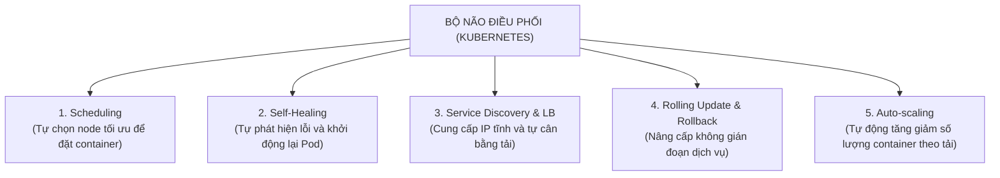

# Bài 03: Tại sao cần Kubernetes? Bài toán Orchestration

## 1. Thông tin bài học
* **Tên bài:** Bài 03: Tại sao cần Kubernetes? Bài toán Orchestration
* **Mục tiêu học:** Thấy rõ những giới hạn cốt tử của việc quản lý container thủ công bằng Docker đơn lẻ khi bước vào môi trường sản xuất (production); hiểu sâu sắc 5 bài toán sống còn mà một công cụ điều phối (Container Orchestrator) giải quyết; và phân biệt được ranh giới khi nào nên và không nên dùng Kubernetes.
* **Thời lượng ước tính:** 90 phút (45 phút đọc hiểu lý thuyết, 45 phút thực hành lab)
* **Kiến thức cần có trước:** Bài 01 (Linux Namespaces & Cgroups), Bài 02 (Container Image, Layer & CRI).
* **Liên quan kỳ thi:** Nền tảng tư duy cốt lõi cho cả 3 kỳ thi CKA, CKAD, CKS và các buổi phỏng vấn vị trí Platform / SRE / DevOps Engineer.

---

## 2. Bảng thuật ngữ

| Thuật ngữ | Giải thích đơn giản | Ví dụ / Ẩn dụ đời thường |
| :--- | :--- | :--- |
| **Container Orchestration** | Việc tự động hóa toàn bộ quy trình triển khai, quản lý, mở rộng và bảo vệ mạng lưới các container. | Một vị nhạc trưởng tài ba điều khiển nhịp điệu cho toàn bộ dàn nhạc giao hưởng 100 nhạc công. |
| **Orchestrator** | Phần mềm đóng vai trò "bộ não" điều phối hệ thống (Kubernetes chính là một Orchestrator). | Cảng trưởng tại bến cảng quốc tế, chỉ đạo vị trí bốc dỡ của từng chiếc container. |
| **Tự phục hồi (Self-healing)** | Khả năng tự động phát hiện container bị lỗi hoặc chết để khởi động lại hoặc thay thế bằng container mới mà không cần con người can thiệp. | Thằn lằn tự mọc lại chiếc đuôi mới ngay sau khi bị đứt. |
| **Cân bằng tải (Load Balancing)** | Kỹ thuật chia đều lượng truy cập của người dùng cho nhiều bản sao ứng dụng để không có máy nào bị quá tải. | Một ngân hàng mở 5 quầy giao dịch và có nhân viên bảo vệ đứng điều phối khách vào quầy đang vắng. |
| **Khám phá dịch vụ (Service Discovery)** | Cơ chế tự động tìm thấy địa chỉ mạng của nhau giữa các dịch vụ dù địa chỉ IP có liên tục thay đổi. | Danh bạ điện thoại tự động cập nhật số mới của bạn bè khi họ đổi SIM mà bạn không cần hỏi lại. |
| **Rolling Update** | Kỹ thuật nâng cấp ứng dụng từng phần: bật bản mới lên trước, kiểm tra chạy tốt rồi mới tắt bản cũ, đảm bảo người dùng không bị gián đoạn. | Thay lốp xe đua F1 từng bánh một trong khi chiếc xe vẫn tiếp tục lăn bánh trên đường. |
| **Lập lịch (Scheduling)** | Việc tính toán xem container nào nên được đặt lên máy chủ vật lý nào dựa trên lượng CPU/RAM còn trống. | Người xếp hành lý tính toán nhét vừa vặn từng kiện vali vào khoang chứa máy bay mà không làm lệch trọng tâm máy bay. |

---

## 3. Bức tranh lớn: Vấn đề thực tế và ẩn dụ đời thường

### Nhắc lại bài trước
Ở Bài 02, chúng ta đã nắm vững bản chất của **Container Image** với cấu trúc xếp tầng OverlayFS, cơ chế Copy-on-Write và chuẩn giao tiếp CRI. Chúng ta đã tự tay đóng gói microservice `emailservice` của Google Online Boutique thành một image siêu nhẹ có thể chạy độc lập ở bất kỳ đâu.

### Tại sao cần cái này ở production? (Vấn đề thực tế)
Chạy một container đơn lẻ trên máy cá nhân bằng lệnh `docker run` là một trải nghiệm tuyệt vời. Mọi thứ khởi động trong chớp mắt. Nhưng hãy tưởng tượng bạn bước chân vào vận hành hệ thống **Google Online Boutique** thực tế gồm **11 microservices khác nhau**:
* `frontend` tiếp nhận khách hàng mua sắm.
* `cartservice` lưu trữ giỏ hàng.
* `productcatalogservice` hiển thị danh mục sản phẩm.
* `paymentservice` xử lý thanh toán thẻ tín dụng.
* `emailservice` gửi hóa đơn...

Hôm nay là sự kiện mua sắm lớn nhất năm (Black Friday). Hàng triệu người đổ xô vào trang web. Lúc này, nếu bạn chỉ có công cụ Docker đơn lẻ, hàng loạt thảm kịch sau đây sẽ xảy ra:

1. **Thảm kịch sập nguồn lúc nửa đêm:** Lúc 2 giờ sáng, một máy chủ chứa container `paymentservice` bị chập điện sập nguồn. Docker chạy trên máy đó chết cùng máy chủ. Không có ai tự động phát hiện ra điều này. Khách hàng bấm thanh toán đều nhận lỗi "500 Internal Server Error". Sáng hôm sau thức dậy, công ty thiệt hại hàng tỷ đồng.
2. **Cơn ác mộng mở rộng (Scaling):** Lượng truy cập tăng gấp 10 lần, một container `frontend` bắt đầu quá tải, CPU nhảy lên 100%. Bạn phải làm gì? Mở terminal SSH vào từng máy chủ, gõ lệnh `docker run` thêm 9 container nữa, rồi mở file cấu hình Nginx sửa tay từng địa chỉ IP của 9 container đó để chia tải. Đến khi bạn sửa xong thì khách hàng đã bực mình bỏ đi hết.
3. **Địa chỉ IP "ma" (IP Churn):** Mỗi lần một container bị khởi động lại, Docker cấp cho nó một địa chỉ IP nội bộ hoàn toàn ngẫu nhiên mới. `frontend` không biết làm cách nào để tìm ra `cartservice` đang nằm ở IP nào nếu bạn không liên tục sửa lại file cấu hình.
4. **Cập nhật phiên bản gây gián đoạn (Downtime):** Đội ngũ lập trình viên vừa fix một lỗi nghiêm trọng và muốn đẩy phiên bản v2 lên. Để cập nhật bằng Docker, bạn phải: `docker stop` bản v1 (khách hàng bị ngắt kết nối ngay lập tức), kéo bản v2 về, rồi `docker run`. Trong khoảng thời gian 30 giây đến 1 phút đó, toàn bộ người dùng đang giao dịch đều bị văng ra ngoài.

Một kỹ sư quản trị hệ thống không thể thức 24/7 để làm "bảo mẫu" đi canh từng container, gõ từng dòng lệnh khởi động lại hay liên tục sửa file cấu hình mạng. **Chúng ta cần một hệ điều hành thông minh dành riêng cho toàn bộ cụm máy chủ.** Đó chính là lý do **Kubernetes** ra đời.

### Ẩn dụ đời thường
Hãy hình dung hai mô hình sau:

1. **Docker đơn lẻ giống như một nghệ sĩ độc tấu vĩ cầm:**
   * Một người nghệ sĩ chơi đàn vĩ cầm có thể tạo ra âm thanh rất tuyệt vời. Nhưng họ chỉ chơi được một bản nhạc đơn giản cho một nhóm nhỏ khán giả nghe.
2. **Kubernetes giống như một Dàn nhạc giao hưởng 100 người cùng vị Nhạc trưởng tài ba:**
   * Để biểu diễn một bản giao hưởng hoành tráng (hệ thống microservices), bạn cần 20 cây vĩ cầm, 10 cây kèn trumpet, 5 chiếc trống và nhiều nhạc cụ khác.
   * Nếu không có **Nhạc trưởng (Orchestrator)** đứng ở giữa vung đũa chỉ huy:
     * Nhạc công thổi kèn sẽ lấn át tiếng đàn vĩ cầm (một app chiếm hết CPU/RAM của app khác).
     * Khi nghệ sĩ chơi đàn bị ngất xỉu giữa buổi diễn, cả dàn nhạc sẽ vỡ trận (container chết làm sập hệ thống).
   * Vị Nhạc trưởng có nhiệm vụ:
     * Điều tiết nhịp độ: Ai chơi to, ai chơi nhỏ (**Quản lý tài nguyên Requests/Limits**).
     * Khi có một nhạc công bị chuột rút, lập tức ra hiệu cho một nhạc công dự bị bước vào sân khấu thay thế mà bản nhạc không hề ngắt quãng một giây nào (**Tự phục hồi - Self-healing**).
     * Giữ cho toàn bộ 100 con người phối hợp nhịp nhàng thành một thể thống nhất (**Khám phá dịch vụ & Cân bằng tải**).

---

## 4. Giải thích khái niệm theo từng bước

### Bước 1: Năm bài toán sống còn mà Orchestrator giải quyết
Một công cụ điều phối container chuẩn Enterprise như Kubernetes bắt buộc phải tự động hóa 5 tác vụ cốt lõi sau:



1. **Lập lịch thông minh (Scheduling):** Khi bạn yêu cầu chạy một container cần 2GB RAM và 1 CPU, bạn không cần quan tâm cụm có 5 máy hay 500 máy. Kubernetes tự động quét toàn bộ các máy chủ (Node), tìm ra máy nào còn đủ chỗ và ít tải nhất để thả container vào đó.
2. **Tự chữa lành (Self-Healing):** Kubernetes liên tục so sánh giữa **Trạng thái mong muốn (Desired State)** và **Trạng thái thực tế (Actual State)**. Nếu bạn khai báo "Tôi luôn muốn có 3 bản sao của frontend", mà một bản sao bị chết do lỗi code, Kubernetes sẽ lập tức sinh ra một bản sao mới trong vòng vài giây để bù đắp.
3. **Khám phá dịch vụ & Cân bằng tải (Service Discovery & Load Balancing):** Kubernetes cấp cho nhóm container một cái tên và một địa chỉ IP ảo cố định duy nhất (gọi là Service). Khi các container bên dưới chết đi sống lại và đổi IP liên tục, các dịch vụ khác vẫn chỉ cần gọi đến cái tên đó mà không bao giờ mất dấu.
4. **Nâng cấp và Lùi phiên bản tự động (Rolling Updates & Rollbacks):** Nâng cấp từng container một theo kiểu cuốn chiếu. Nếu phiên bản mới khởi động bị lỗi (crash), Kubernetes lập tức dừng quá trình nâng cấp và tự động quay ngược về phiên bản cũ (Rollback) an toàn.
5. **Tự động co giãn (Auto-scaling):** Khi lượng truy cập tăng vọt, hệ thống tự động nhân bản thêm container (**Horizontal Pod Autoscaler - HPA**). Khi đêm xuống vắng khách, hệ thống tự động tiêu hủy bớt container để tiết kiệm chi phí thuê máy chủ.

### Bước 2: Tại sao các giải pháp "tự chế" (DIY Scripts) thất bại?
Nhiều kỹ sư khi mới tiếp cận container thường nghĩ: *"Tại sao phải học Kubernetes cho phức tạp? Tôi chỉ cần viết vài script Bash/PowerShell kết hợp lệnh `cronjob` kiểm tra `docker ps`, nếu thấy chết thì `docker run` lại là xong!"*.

Thực tế đã chứng minh cách làm này luôn dẫn đến thảm họa vì hàng loạt "bẫy" kỹ thuật (edge cases):
* **Bài toán kiểm tra sức khỏe nông (Shallow Health Check):** Tiến trình bên trong container chưa chết (vẫn hiện `Up` trong `docker ps`), nhưng vòng lặp trong code bị deadlock hoặc rò rỉ bộ nhớ khiến nó không thể phản hồi request của người dùng. Script `docker ps` đơn giản sẽ hoàn toàn bị lừa và tưởng rằng ứng dụng vẫn sống khỏe!
* **Bài toán phân tán (Distributed State):** Khi bạn có 10 máy chủ, script của bạn phải chạy ở đâu? Nếu máy chủ chạy script bị mất mạng thì ai giám sát 9 máy còn lại? Làm sao để đồng bộ danh sách IP giữa 10 máy trong thời gian thực?
* **Hiện tượng Split-Brain (Phân liệt):** Khi kết nối mạng giữa 2 cụm máy chủ bị đứt đoạn, cả hai bên đều tưởng bên kia đã chết và tự động nhân bản thêm ứng dụng, dẫn đến xung đột dữ liệu nghiêm trọng trong database.

Kubernetes giải quyết triệt để những vấn đề này bằng cách áp dụng các thuật toán đồng thuận phân tán chuẩn mực (như **Raft Consensus** trong etcd) và cơ chế kiểm tra sức khỏe chuyên sâu (**Liveness/Readiness Probes**).

### Bước 3: So sánh Docker Compose, Docker Swarm và Kubernetes

| Tiêu chí | Docker Compose | Docker Swarm | Kubernetes (K8s) |
| :--- | :--- | :--- | :--- |
| **Quy mô hoạt động** | **Chỉ trên 1 máy đơn lẻ** | Cụm nhiều máy nhỏ (vài chục node) | **Cụm khổng lồ (hàng ngàn node)** |
| **Mục đích chính** | Phục vụ môi trường Development trên máy cá nhân | Triển khai nhanh cho dự án vừa và nhỏ | **Chuẩn mực công nghiệp cho Production Enterprise** |
| **Khả năng tự phục hồi** | Cơ bản (chỉ trên máy đó) | Khá tốt | **Cực kỳ mạnh mẽ & linh hoạt** |
| **Hệ sinh thái & Cộng đồng** | Nhỏ, phụ thuộc Docker Inc. | Kém phát triển, ít cập nhật | **Hùng mạnh nhất thế giới (do CNCF quản lý)** |
| **Độ phức tạp khi học** | Rất thấp (học trong 30 phút) | Thấp (học trong 1 ngày) | **Cao (cần học có lộ trình bài bản)** |

---

## 5. Thực hành (Lab)

Trong bài lab này, chúng ta sẽ mô phỏng tình huống sự cố thực tế: chạy một microservice bằng Docker đơn lẻ, chứng kiến sự bế tắc khi container đột tử, và thử nghiệm viết một kịch bản giám sát tự chế để hiểu tại sao cần đến Kubernetes.

* **Môi trường:** Máy tính Windows, PowerShell, Docker Desktop.
* **Mức RAM ước tính:** ~80MB đến 100MB RAM (hoàn toàn an toàn trong giới hạn 4GB WSL).

### Bước 1: Khởi chạy một microservice bằng Docker đơn lẻ
Chúng ta sẽ chạy một web server Nginx đóng vai trò giả lập một microservice của hệ thống:

```powershell
# Chạy container giả lập microservice đặt tên là app-don-le
docker run -d --name app-don-le -p 8085:80 nginx:alpine
```

**Kết quả mong đợi (Expected Output):**
```text
c8f1d2e3... (Mã Container ID)
```

Kiểm tra xem dịch vụ đã hoạt động hay chưa bằng PowerShell:
```powershell
curl.exe -I http://localhost:8085
```

**Kết quả mong đợi (Expected Output):**
```text
HTTP/1.1 200 OK
Server: nginx/...
```

### Bước 2: Giả lập sự cố container bị chết đột ngột lúc nửa đêm
Bây giờ, hãy đóng vai trò là một sự cố ngoài ý muốn (tiến trình bị crash, code dính lỗi cú pháp hoặc bị hết RAM):

```powershell
# Tiêu diệt tiến trình container ngay lập tức
docker stop app-don-le
```

Bây giờ, hãy thử gửi request lại dịch vụ:
```powershell
curl.exe -I http://localhost:8085
```

**Kết quả mong đợi (Expected Output):**
```text
curl: (7) Failed to connect to localhost port 8085... Connection refused
```

> **Hiện thực cay đắng:** Dịch vụ của bạn đã chết hoàn toàn! Người dùng không thể truy cập. Nếu lúc này bạn đang ngủ, hệ thống sẽ tiếp tục nằm chết cho đến khi bạn thức dậy vào sáng hôm sau để gõ lệnh `docker start app-don-le`.

### Bước 3: Thử nghiệm giải pháp `--restart always` và thấy điểm nghẽn
Nhiều bạn sẽ thắc mắc: *"Docker có cờ `--restart always`, sao không dùng?"*. Hãy thử xem:

```powershell
# Chạy lại container với cờ tự động khởi động lại
docker rm -f app-don-le
docker run -d --name app-don-le --restart always -p 8085:80 nginx:alpine
```

Bây giờ nếu bạn chạy lệnh giết tiến trình bên trong container:
```powershell
docker exec app-don-le kill 1
```

Kiểm tra lại sau 2 giây:
```powershell
docker ps --filter "name=app-don-le"
```
Container quả thực được Docker khởi động lại! 

**NHƯNG ĐÂY LÀ ĐIỂM NGHẼN CHẾT NGƯỜI:**
* Cờ `--restart always` chỉ hoạt động khi **Docker daemon còn sống** và **máy chủ đó còn sống**.
* Nếu toàn bộ chiếc máy tính/máy ảo đó bị hỏng phần cứng hoặc sập nguồn, Docker trên máy đó cũng chết theo. Cờ `--restart always` hoàn toàn vô dụng vì nó không thể tự bốc ứng dụng sang một máy chủ khác đang còn sống!
* Nó cũng không thể tự động nhận biết ứng dụng có đang bị treo hay không nếu tiến trình vẫn chưa thoát.

### Bước 4: Trải nghiệm sự bất lực của kịch bản giám sát tự chế
Hãy chạy một đoạn script PowerShell nhỏ mô phỏng việc bạn tự viết code giám sát:

```powershell
# Script kiểm tra sức khỏe thủ công đơn giản
$status = docker inspect -f '{{.State.Running}}' app-don-le
if ($status -eq "true") {
    Write-Host "Trạng thái: Ứng dụng vẫn chạy tốt!" -ForegroundColor Green
} else {
    Write-Host "CẢNH BÁO: Ứng dụng đã chết, đang khởi động lại..." -ForegroundColor Red
    docker start app-don-le
}
```

Script này chỉ kiểm tra được biến cờ nông `State.Running`. Nó không giải quyết được:
* Cân bằng tải sang máy khác.
* Cấp phát IP mới và cập nhật DNS nội bộ.
* Giới hạn tài nguyên ngăn tràn bộ nhớ sang app bên cạnh.

Đó là lý do các kỹ sư thế giới đã ngừng viết các script vụn vặt và quy tụ về chuẩn mực chung: **Kubernetes**.

### Bước 5: Dọn dẹp tài nguyên (Cleanup)
Dọn dẹp container thử nghiệm trên PowerShell:

```powershell
docker rm -f app-don-le
```

---

## 6. Lỗi thường gặp và cách debug

### Lỗi 1: Nhầm lẫn tai hại giữa Docker Compose và Kubernetes
* **Dấu hiệu:** Cố gắng triển khai file `docker-compose.yml` lên cụm nhiều máy chủ production và kỳ vọng nó sẽ tự động cân bằng tải và chịu lỗi đa máy chủ.
* **Nguyên nhân:** Docker Compose sinh ra chỉ để định nghĩa và chạy các ứng dụng đa container trên **đúng 1 máy chủ vật lý duy nhất**. Nó không có khái niệm cụm (Cluster), không có bộ lập lịch phân tán (Distributed Scheduler), và không thể chuyển container sang máy khác khi máy hiện tại gặp sự cố.
* **Cách hiểu đúng:** Dùng Docker Compose cho môi trường phát triển cục bộ (Local Development) trên laptop. Dùng Kubernetes cho môi trường Staging và Production đa máy chủ.

### Lỗi 2: Cố gắng "Kubernetes hóa" một ứng dụng Monolith truyền thống không phù hợp
* **Dấu hiệu:** Đóng gói một ứng dụng cũ ghi file trực tiếp vào ổ cứng cục bộ (`C:\uploads` hoặc `/var/data`) hoặc lưu session người dùng trực tiếp trong RAM của một máy duy nhất, sau đó đem lên Kubernetes và bật scale 5 bản sao. Kết quả: người dùng liên tục bị văng đăng nhập và mất dữ liệu tải lên.
* **Nguyên nhân:** Để chạy tốt trên một Orchestrator linh hoạt như Kubernetes, ứng dụng phải tuân theo nguyên lý **Stateless (Phi trạng thái)** của chuẩn **12-Factor App**. Dữ liệu bền vững phải đẩy vào Database hoặc Object Storage (S3/MinIO), còn session phải lưu ở Redis tập trung.

---

## 7. Góc nhìn Senior

### 1. Sự đánh đổi (Trade-offs)
Kubernetes là một cỗ máy phi thường, nhưng nó đi kèm một cái giá rất đắt:
* **Chi phí học tập và vận hành khổng lồ (Steep Learning Curve & Operational Overhead):** Cụm Kubernetes đòi hỏi kiến thức chuyên sâu về mạng phân tán, lưu trữ, bảo mật chứng chỉ TLS, và giám sát hạ tầng.
* **Tiêu tốn tài nguyên hạ tầng (Control Plane Overhead):** Bản thân các thành phần đầu não của Kubernetes (API Server, etcd, Controller Manager...) đã ngốn ít nhất 2 CPU và 4GB RAM chỉ để duy trì trạng thái của cluster, kể cả khi bạn chưa chạy một ứng dụng nào.
* **Khi nào TUYỆT ĐỐI KHÔNG NÊN dùng Kubernetes:**
  * Công ty chỉ có 1–2 dịch vụ web đơn giản, lượng truy cập vài ngàn lượt/ngày.
  * Đội ngũ kỹ thuật chỉ có 1–2 lập trình viên, không có chuyên gia hạ tầng/DevOps.
  * Trong các trường hợp này, việc sử dụng các dịch vụ PaaS đơn giản (như AWS App Runner, Heroku, Render) hoặc một máy ảo VPS chạy Docker Compose đơn giản sẽ tiết kiệm chi phí gấp 10 lần và giúp công ty tập trung vào sản phẩm thay vì sa lầy vào việc bảo trì cluster.

### 2. Best practices tại production
* **Tư duy Desired State (Trạng thái mong muốn):** Không bao giờ ra lệnh theo kiểu mệnh lệnh trực tiếp (*"Hãy chạy container này cho tôi ngay bây giờ"*). Luôn mô tả trạng thái cuối cùng bạn mong muốn dưới dạng văn bản khai báo (**Declarative Configuration - file YAML**) và để Orchestrator tự tính toán con đường đạt được trạng thái đó.
* **Nguyên lý Gia súc vs Thú cưng (Cattle vs. Pets):**
  * Trong mô hình truyền thống (Pets), máy chủ và ứng dụng giống như thú cưng: được đặt tên riêng, khi bị ốm thì đội ngũ kỹ sư phải xúm vào chữa trị, nâng niu từng ly từng tí.
  * Trong thế giới Kubernetes (Cattle), container và node giống như đàn gia súc: được đánh số thứ tự, nếu một con bị bệnh thì lập tức loại bỏ và thay thế bằng một con khác khỏe mạnh trong chớp mắt mà không hề tiếc nuối.

### 3. Câu hỏi phỏng vấn Senior
* **Câu hỏi 1:** *"Tại sao Kubernetes lại giành chiến thắng tuyệt đối trước Docker Swarm và Apache Mesos trong cuộc chiến Container Orchestration từ năm 2017 đến nay?"*
  * **Gợi ý trả lời chuẩn:** Docker Swarm rất đơn giản và dễ dùng nhưng quá hạn chế về khả năng tùy biến, mở rộng và thiếu các cơ chế kiểm soát chính sách phức tạp cho doanh nghiệp lớn. Apache Mesos thì cực kỳ mạnh mẽ về mặt hạ tầng quy mô siêu lớn nhưng lại quá phức tạp để cài đặt và sử dụng cho người làm ứng dụng. Kubernetes (được Google đúc kết từ 15 năm kinh nghiệm vận hành hệ thống nội bộ Borg) đã tìm ra điểm cân bằng hoàn hảo:
    1. **Kiến trúc mở và mở rộng tuyệt đối:** Toàn bộ hệ thống được xây dựng xoay quanh RESTful API, cho phép cộng đồng dễ dàng viết thêm Custom Resource Definitions (CRD) và Operator để mở rộng tính năng.
    2. **Mô hình khai báo (Declarative Model) và Vòng lặp hòa giải (Reconciliation Loop):** Đảm bảo hệ thống luôn tự phục hồi về trạng thái mong muốn một cách nhất quán.
    3. **Sự hậu thuẫn của tổ chức trung lập CNCF (Cloud Native Computing Foundation):** Ngăn chặn sự độc quyền của một công ty duy nhất, thu hút mọi ông lớn công nghệ (Google, Microsoft, RedHat, Amazon, VMware) cùng chung tay đóng góp.
* **Câu hỏi 2:** *"Kể tên 3 tình huống hỏng hóc (failure scenarios) mà Docker đơn lẻ hoàn toàn bất lực nhưng Kubernetes có thể tự động xử lý mà không cần con người can thiệp."*
  * **Gợi ý trả lời chuẩn:**
    1. **Worker Node chết hoàn toàn phần cứng:** Docker trên node đó chết theo. Kubernetes phát hiện node không gửi tín hiệu nhịp tim (heartbeat), lập tức trục xuất (evict) các Pod trên node hỏng và tái tạo chúng trên các worker node khác còn khỏe mạnh.
    2. **Ứng dụng bị treo vòng lặp vô tận (Deadlock/Hang):** Tiến trình vẫn chạy (`docker ps` vẫn thấy `Up`) nhưng không xử lý được HTTP request. Cơ chế **Liveness Probe** của Kubernetes gửi HTTP check định kỳ, phát hiện timeout liên tục và tự động khởi động lại container.
    3. **Nâng cấp ứng dụng bị lỗi runtime:** Bản cập nhật v2 dính lỗi crash ngay khi vừa bật. Kubernetes phát hiện container mới không vượt qua được kiểm tra **Readiness Probe**, lập tức dừng việc tắt các container v1 cũ, giữ cho dịch vụ luôn thông suốt và gửi cảnh báo về cho đội phát triển.

---

## 8. Tóm tắt bài học
* 📌 **1.** Docker giúp giải quyết bài toán đóng gói và chạy một container đơn lẻ; **Kubernetes giải quyết bài toán điều phối cả mạng lưới container trên một cụm máy chủ lớn**.
* 📌 **2.** 5 chức năng sống còn của Orchestrator gồm: **Scheduling (Lập lịch), Self-healing (Tự phục hồi), Service Discovery & Load Balancing (Kết nối mạng), Rolling Update (Cập nhật không gián đoạn), và Auto-scaling (Tự co giãn)**.
* 📌 **3.** Cơ chế cốt lõi của Kubernetes là **Declarative Management (Quản lý khai báo)**: liên tục đối chiếu và kéo **Actual State** về bằng với **Desired State**.
* 📌 **4.** Không dùng Kubernetes khi hệ thống quá nhỏ hoặc đội ngũ chưa đủ năng lực vận hành, vì chi phí phức tạp sẽ lớn hơn lợi ích mang lại.
* 📌 **5.** Ứng dụng muốn chạy tốt trên Kubernetes phải được thiết kế theo tư duy **Stateless (Phi trạng thái)** và chuẩn **12-Factor App**.

---

## 9. Bài tập tự làm

* 🟢 **Mức Dễ:** Liệt kê 3 dịch vụ trong dự án Google Online Boutique (`microservices-demo`) có thể chạy theo mô hình Stateless (phi trạng thái) và 1 dịch vụ bắt buộc phải có Stateful (có lưu trữ dữ liệu).
* 🟡 **Mức Vừa:** Giả sử bạn có 3 máy chủ vật lý: Máy A (còn trống 1 CPU, 2GB RAM), Máy B (còn trống 4 CPU, 8GB RAM), Máy C (còn trống 0.5 CPU, 512MB RAM). Bạn muốn triển khai một dịch vụ yêu cầu tối thiểu 2 CPU và 4GB RAM. Hãy đóng vai trò là bộ lập lịch (Scheduler) của Kubernetes và giải thích máy nào sẽ được chọn và tại sao.
* 🔴 **Mức Khó (Tình huống kiến trúc):** Một công ty thương mại điện tử đang chạy toàn bộ hệ thống trên một máy chủ ảo duy nhất dùng Docker Compose. Giám đốc muốn chuyển toàn bộ sang Kubernetes ngay trong tuần tới vì nghe nói Kubernetes rất "hot". Với tư cách là một kỹ sư Senior, hãy viết một bản đề xuất ngắn (3-4 luận điểm) phân tích các rủi ro và điều kiện cần chuẩn bị trước khi quyết định di chuyển.

---

## 10. Câu hỏi tự kiểm tra

1. Sự khác biệt căn bản nhất giữa phương pháp quản lý mệnh lệnh (Imperative) và phương pháp khai báo (Declarative) là gì?
2. Tại sao cờ `--restart always` của Docker không thể thay thế được tính năng Self-healing của Kubernetes?
3. Khi một container mới được sinh ra trong cụm, làm thế nào các dịch vụ khác biết được IP mới của nó mà không cần người quản trị can thiệp thủ công?
4. Thuật ngữ "Bin-packing" trong lập lịch tài nguyên của Kubernetes có nghĩa là gì?
5. Nếu ứng dụng của bạn lưu trữ file ảnh đại diện của người dùng trực tiếp vào ổ cứng cục bộ của container, điều gì sẽ xảy ra khi Kubernetes thực hiện cơ chế Rolling Update?
6. Tổ chức nào hiện đang trực tiếp quản lý và phát triển dự án mã nguồn mở Kubernetes?

<details>
<summary>👉 Bấm vào đây để xem đáp án câu hỏi tự kiểm tra</summary>

* **Đáp án 1:** Phương pháp mệnh lệnh (Imperative) chỉ định từng bước phải làm (*"Hãy bật 3 container, sau đó mở cổng 80, sau đó tạo file"*). Phương pháp khai báo (Declarative) chỉ nêu kết quả mong muốn cuối cùng (*"Tôi muốn luôn có 3 bản sao của ứng dụng này chạy trên cổng 80"*), hệ thống sẽ tự tính toán cách thực hiện.
* **Đáp án 2:** Vì `--restart always` chỉ chạy cục bộ trên một máy chủ duy nhất. Nếu máy chủ đó bị sập nguồn hoặc đứt cáp mạng, Docker không thể tự di tản container sang máy chủ khác, trong khi Kubernetes có thể tự động tái tạo container trên một worker node hoàn toàn khác.
* **Đáp án 3:** Thông qua cơ chế **Service Discovery**: Kubernetes tự động cập nhật bản ghi DNS nội bộ và bảng định tuyến của đối tượng Service ngay khi container mới sẵn sàng nhận traffic.
* **Đáp án 4:** Là thuật toán xếp đồ vào thùng: gom và nhét các container có kích thước tài nguyên khác nhau vào các máy chủ sao cho tối ưu hóa số lượng máy cần dùng, tránh tình trạng lãng phí tài nguyên thừa thãi của cụm.
* **Đáp án 5:** Toàn bộ ảnh đại diện vừa tải lên sẽ bị **mất vĩnh viễn**! Bởi vì khi Rolling Update, container cũ chứa ảnh sẽ bị tiêu hủy hoàn toàn, và container mới được tạo ra từ image gốc sạch sẽ không hề có những file ảnh đó.
* **Đáp án 6:** Tổ chức **CNCF (Cloud Native Computing Foundation)**, một nhánh trực thuộc The Linux Foundation.
</details>

---

## 11. Tài liệu đọc thêm và bài tiếp theo

### Tài liệu tham khảo
* [Tài liệu chính thức Kubernetes: What is Kubernetes?](https://kubernetes.io/docs/concepts/overview/)
* [Tài liệu chính thức: The Twelve-Factor App Methodology](https://12factor.net/)
* [Bài viết lịch sử kiến trúc Borg của Google: Large-scale cluster management at Google with Borg](https://research.google/pubs/pub43438/)

### Bài tiếp theo
👉 **Bài 04: Thiết lập môi trường Lab thực chiến: KinD & kubectl**

---

## PHỤ LỤC: ĐÁP ÁN GỢI Ý BÀI TẬP TỰ LÀM (MỤC 9)

### Đáp án Mức Dễ
Trong dự án `microservices-demo`:
* **3 dịch vụ Stateless (Phi trạng thái):**
  1. `frontend`: Chỉ nhận HTTP request từ khách, gọi API xuống các service phía sau và render HTML trả về. Không lưu bất kỳ dữ liệu nào vào đĩa.
  2. `emailservice`: Nhận yêu cầu gửi email qua gRPC, gửi email đi rồi kết thúc tác vụ.
  3. `productcatalogservice`: Đọc danh mục sản phẩm từ file JSON tĩnh có sẵn trong image và trả về kết quả tìm kiếm.
* **1 dịch vụ Stateful (Có trạng thái):**
  * `redis-cart`: Cơ sở dữ liệu Redis dùng để lưu trữ giỏ hàng của từng khách hàng. Nếu container này chết mà không có ổ đĩa lưu trữ bền vững (Persistent Volume), toàn bộ giỏ hàng của khách sẽ bốc hơi.

### Đáp án Mức Vừa
* **Kết quả:** Scheduler sẽ chọn **Máy B**.
* **Giải thích:**
  * Dịch vụ yêu cầu: `CPU: 2`, `RAM: 4GB`.
  * **Máy A:** Chỉ còn trống 1 CPU $\rightarrow$ Bị loại ngay ở bước Lọc (Filter) do không đủ CPU.
  * **Máy C:** Chỉ còn 0.5 CPU và 512MB RAM $\rightarrow$ Bị loại do thiếu cả CPU lẫn RAM.
  * **Máy B:** Còn 4 CPU và 8GB RAM $\rightarrow$ Hoàn toàn thỏa mãn yêu cầu tài nguyên, do đó Kubernetes sẽ lập lịch cho container chạy trên Máy B.

### Đáp án Mức Khó
Bản đề xuất phản biện của Kỹ sư Senior gửi Ban Giám đốc:
1. **Đánh giá mức độ cần thiết:** Hiện tại hệ thống chạy trên 1 VPS với Docker Compose có đang bị quá tải không? Nếu doanh nghiệp chưa đối mặt với vấn đề mở rộng đa máy chủ (Multi-node scaling) và lượng truy cập ổn định, việc duy trì Docker Compose vẫn là giải pháp hiệu quả và tiết kiệm nhất.
2. **Khoảng trống về kỹ năng (Skill Gap):** Đội ngũ hiện tại đã thành thạo việc viết YAML cho K8s, quản lý mạng CNI, Ingress, và xử lý sự cố khi cluster gặp nạn chưa? Nếu chưa, việc chuyển vội vã sẽ biến sự cố nhỏ thành thảm họa downtime kéo dài nhiều giờ.
3. **Cấu trúc ứng dụng:** Mã nguồn hiện tại đã chuẩn bị cho kiến trúc Stateless chưa? Có còn lưu file tải lên trực tiếp vào ổ cứng cục bộ không? Cần hoàn thành việc tách file sang Object Storage (S3) và cấu hình logging/metrics tập trung trước khi chuyển đổi.
4. **Lộ trình khuyến nghị:** Không chuyển đổi toàn bộ trong 1 tuần. Khuyến nghị chạy thử nghiệm môi trường Staging trên Kubernetes trong 1 tháng, thực hiện diễn tập giả lập sự cố (Chaos testing) trước khi chính thức chuyển đổi môi trường Production.
