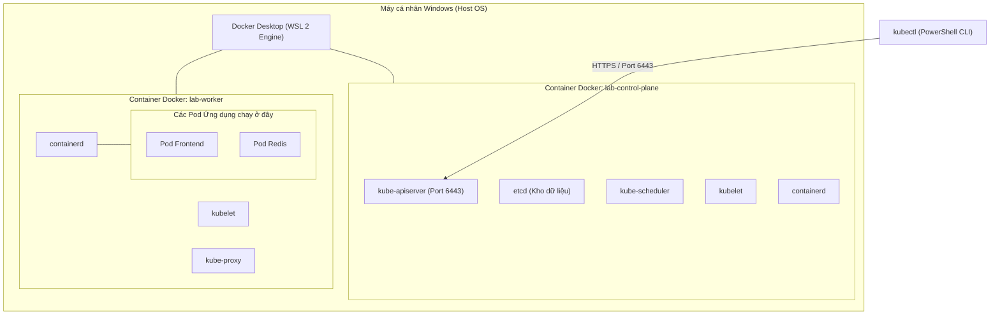

# Bài 04: Thiết lập môi trường Lab thực chiến: KinD & kubectl

## 1. Thông tin bài học
* **Tên bài:** Bài 04: Thiết lập môi trường Lab thực chiến: KinD & kubectl
* **Mục tiêu học:** Tự tay dựng một cụm Kubernetes đa node (1 Control Plane + 1 Worker) hoàn chỉnh trên máy cá nhân bằng công cụ KinD (Kubernetes in Docker) sử dụng file cấu hình chuẩn `k8s\kind-config.yaml`; thành thạo việc kiểm tra cụm máy chủ, hiểu cấu trúc file `kubeconfig` và thiết lập các phím tắt (alias) trong PowerShell để tối ưu tốc độ gõ lệnh phục vụ cho kỳ thi CKA/CKAD.
* **Thời lượng ước tính:** 120 phút (45 phút đọc hiểu lý thuyết, 75 phút thực hành lab)
* **Kiến thức cần có trước:** Bài 02 (Container Image & CRI), Bài 03 (Orchestration).
* **Liên quan kỳ thi:** CKA, CKAD (Kỹ năng cốt lõi bắt buộc: cấu hình context, quản lý kết nối cluster qua kubeconfig, thao tác thành thạo dòng lệnh kubectl).

---

## 2. Bảng thuật ngữ

| Thuật ngữ | Giải thích đơn giản | Ví dụ / Ẩn dụ đời thường |
| :--- | :--- | :--- |
| **KinD (Kubernetes in Docker)** | Công cụ giúp chạy toàn bộ cụm Kubernetes bằng cách biến mỗi máy chủ (Node) thành một Docker Container. | Một chiếc sa bàn thu nhỏ: thay vì dựng cả một thành phố thật, bạn dựng mô hình lego trên bàn làm việc nhưng mọi chi tiết hoạt động y hệt thật. |
| **Control Plane** | Đầu não trung ương chỉ huy toàn bộ cụm Kubernetes (nơi đặt API Server, Scheduler, etcd). | Phòng điều hành tháp không lưu của sân bay, chỉ đạo lịch cất cánh và hạ cánh của các chuyến bay. |
| **Worker Node** | Máy chủ công nhân, nơi trực tiếp gánh vác và chạy các container ứng dụng của bạn. | Đường băng và bãi đỗ nơi máy bay thực sự đậu và hành khách lên xuống. |
| **kubectl** | Công cụ dòng lệnh chính thức để người quản trị trò chuyện và ra lệnh cho Kubernetes. | Chiếc remote điều khiển TV hoặc bàn phím điều khiển hệ thống. |
| **Kubeconfig** | File cấu hình lưu thông tin địa chỉ các cluster, chứng chỉ bảo mật và tài khoản đăng nhập của bạn. | Chiếc chìa khóa xe thông minh kiêm hộ chiếu giúp bạn vào được đúng nhà ga của mình. |
| **Context (Ngữ cảnh)** | Một bộ ghép nối gồm: Bạn là ai (User) + Bạn đang kết nối vào cụm nào (Cluster) + Bạn đang đứng ở không gian nào (Namespace). | Trạng thái chuyển vùng cuộc gọi: bạn đang nói chuyện với tổng đài chi nhánh Hà Nội hay chi nhánh Sài Gòn. |
| **Node Status (Ready / NotReady)** | Trạng thái sức khỏe của một node, cho biết node đó đã sẵn sàng tiếp nhận container hay chưa. | Bác sĩ khám sức khỏe báo bạn "Đủ điều kiện làm việc" (Ready) hay "Đang ốm cần nghỉ ngơi" (NotReady). |

---

## 3. Bức tranh lớn: Vấn đề thực tế và ẩn dụ đời thường

### Nhắc lại bài trước
Ở Bài 03, chúng ta đã hiểu tại sao thế giới bắt buộc phải cần đến một Orchestrator như Kubernetes để giải quyết 5 bài toán sinh tử: Tự phục hồi (Self-healing), Lập lịch (Scheduling), Cân bằng tải & Khám phá dịch vụ (Service Discovery), Cập nhật không downtime (Rolling Update) và Tự co giãn (Autoscaling). Chúng ta cũng đã thấy Docker đơn lẻ bất lực thế nào khi máy chủ bị sập lúc nửa đêm.

### Tại sao cần cái này ở production? (Vấn đề thực tế)
Để học và làm chủ Kubernetes, bạn không thể chỉ "học vẹt" trên giấy. Bạn bắt buộc phải có một cụm Kubernetes thực tế để gõ lệnh, làm hỏng nó, sửa nó và chứng kiến các hành vi tự phục hồi.

Tuy nhiên, người mới bắt đầu thường gặp 2 rào cản cực lớn:
1. **Rào cản chi phí Cloud:** Nếu lên Google Cloud (GKE), Amazon AWS (EKS) hay Microsoft Azure (AKS) để thuê cụm máy chủ, bạn sẽ tốn từ $70 đến $150 mỗi tháng chỉ riêng tiền phí duy trì Control Plane và máy ảo, chưa tính tiền băng thông mạng. Quên tắt cluster vài ngày là tài khoản ngân hàng bốc hơi.
2. **Rào cản môi trường giả lập 1 node:** Các công cụ cũ như Minikube hay Docker Desktop K8s mặc định chỉ tạo đúng **1 node duy nhất** (Control Plane và Worker gộp chung làm một). Trên môi trường 1 node, bạn sẽ **hoàn toàn mù tịt** về các bài toán phân tán: Làm sao Pod nhảy từ máy A sang máy B? Làm sao rải đều ứng dụng chống sập máy chủ vật lý? Làm sao cô lập tài nguyên giữa đầu não điều khiển và tải ứng dụng?

Chúng ta cần một giải pháp: **chạy được nhiều node thật sự (Multi-node), tiêu tốn cực ít tài nguyên (chạy mượt trên máy cá nhân RAM 8GB), khởi động trong 45 giây và hoàn toàn miễn phí 100%**.

Giải pháp chuẩn mực của cộng đồng mã nguồn mở Kubernetes chính là **KinD (Kubernetes in Docker)**.

### Ẩn dụ đời thường
1. **KinD giống như Buồng lái mô phỏng phi công (Flight Simulator):**
   * Để đào tạo phi công lái máy bay chở khách Boeing 787, người ta không giao ngay một chiếc máy bay thật trị giá 300 triệu USD ra đường băng. Phi công sẽ ngồi vào buồng lái mô phỏng 3D.
   * Buồng lái mô phỏng tái hiện chính xác 100% từng cần gạt, đồng hồ đo gió, hệ thống lái tự động và kịch bản gặp bão tuyết.
   * Khi bạn dùng KinD trên laptop, từng câu lệnh `kubectl`, từng file manifest YAML bạn viết đều hành xử **chính xác 100%** như khi bạn đang vận hành một cụm Kubernetes thật trên Amazon EKS hay hạ tầng On-premise của ngân hàng.
2. **`kubectl` và `kubeconfig` giống như Bộ đàm và Mật khẩu tác chiến:**
   * Cụm Kubernetes là một doanh trại quân đội nằm ở xa.
   * `kubectl` là chiếc máy bộ đàm trên tay bạn.
   * `kubeconfig` là cuốn sổ tay chứa tần số sóng bí mật (địa chỉ IP của API Server) và mật khẩu xác thực (chứng chỉ TLS Client Certificate). Khi bạn cầm bộ đàm bấm nút nói: *"Hãy báo cáo danh sách quân số"* (`kubectl get nodes`), bộ đàm sẽ mã hóa lời nói của bạn, gửi qua sóng vô tuyến tới sở chỉ huy, và nhận kết quả phản hồi về màn hình của bạn.

---

## 4. Giải thích khái niệm theo từng bước

### Bước 1: Bí mật kỹ thuật của KinD - "Container lồng trong Container"
Tại sao KinD có thể tạo ra nhiều Node Kubernetes ngay trên một chiếc laptop chạy Windows?

Nhớ lại Bài 01 và Bài 02: Node của Kubernetes thực chất là một hệ điều hành Linux chạy các tiến trình nền (`kubelet`, `containerd`).
Thay vì phải tạo 2 máy ảo VirtualBox/VMware nặng nề (mỗi máy ngốn 2GB RAM và 20GB ổ đĩa), KinD làm một điều kỳ diệu:
* Nó khởi chạy **mỗi Kubernetes Node dưới dạng một Docker Container** dựa trên image `kindest/node`.
* Bên trong Docker Container đó, KinD cài sẵn `containerd`, `kubelet`, `systemd` và các thành phần cốt lõi của Kubernetes.
* Khi bạn tạo một Pod trong Kubernetes, Pod đó thực chất là một container con chạy bên trong container mẹ của Node (**Docker-in-Docker**).



### Bước 2: Giải phẫu file cấu hình KinD Cluster (`kind-config.yaml`)
Để định nghĩa một cụm máy chủ nhiều node, chúng ta sử dụng một file khai báo YAML. Hãy quan sát file `k8s\kind-config.yaml` có sẵn trong dự án:

```yaml
# Định nghĩa loại tài nguyên của công cụ KinD
kind: Cluster
# Phiên bản API của KinD
apiVersion: kind.x-k8s.io/v1alpha4
# Tên cụm cluster muốn tạo
name: lab
# Danh sách các node trong cụm
nodes:
  # Node thứ nhất: Đóng vai trò làm bộ não điều khiển (Control Plane)
  - role: control-plane
  # Node thứ hai: Đóng vai trò làm công nhân chạy ứng dụng (Worker Node)
  - role: worker
```

Chỉ với 6 dòng cấu hình đơn giản này, KinD sẽ tự động phối hợp với Docker để dựng lên một cụm phân tán hoàn chỉnh gồm 2 máy chủ độc lập nói chuyện với nhau qua mạng ảo bridge.

### Bước 3: Cỗ máy điều phối `kubectl` và cấu trúc file `~/.kube/config`
`kubectl` không có trí thông minh nhân tạo, nó chỉ là một **REST Client** gửi các HTTP request (JSON) tới máy chủ.

Để biết phải gửi request đi đâu và bằng quyền gì, `kubectl` luôn tự động tìm file cấu hình tại đường dẫn:
`C:\Users\<Tên_User>\.kube\config`

File này gồm 3 khối dữ liệu cơ bản:
1. **clusters:** Chứa danh sách các cụm máy chủ và địa chỉ URL của API Server (ví dụ: `server: https://127.0.0.1:51234`) kèm chứng chỉ CA của cụm (`certificate-authority-data`).
2. **users:** Chứa danh tính và chứng chỉ đăng nhập của bạn (`client-certificate-data`, `client-key-data`).
3. **contexts:** Ghép nối một user cụ thể với một cluster cụ thể. Khối `current-context` cho biết hiện tại `kubectl` đang nhắm lệnh vào cụm máy chủ nào.

---

## 5. Thực hành (Lab)

* **Môi trường yêu cầu:** Máy tính Windows, PowerShell, Docker Desktop (WSL 2).
* **Mức RAM ước tính:** Khoảng **450MB đến 600MB RAM** cho toàn bộ 2 node của cụm KinD (cực kỳ nhẹ nhàng, chiếm chưa đầy 15% trong hạn mức 4GB của WSL).
* **Vị trí file cấu hình:** `d:\LEARN\kubernetes\microservices-demo\k8s\kind-config.yaml`.

### Bước 1: Kiểm tra trạng thái Docker và file cấu hình
Mở PowerShell và chuyển vào thư mục dự án:

```powershell
cd d:\LEARN\kubernetes\microservices-demo
Get-Content .\k8s\kind-config.yaml
```

**Kết quả mong đợi (Expected Output):**
```yaml
kind: Cluster
apiVersion: kind.x-k8s.io/v1alpha4
name: lab
nodes:
  - role: control-plane
  - role: worker
```

### Bước 2: Khởi tạo Cụm Kubernetes bằng KinD
Thực thi lệnh khởi tạo cluster với file cấu hình trên:

```powershell
# Lệnh tạo cluster từ file cấu hình YAML
kind create cluster --config .\k8s\kind-config.yaml
```

**Kết quả mong đợi (Expected Output):**
```text
Creating cluster "lab" ...
 • Ensuring node image (kindest/node:v1.33.1) 🖼
 • Preparing nodes 📦 📦  
 • Writing configuration 📜 
 • Starting control-plane 🕹️ 
 • Installing CNI 🔌 
 • Installing StorageClass 💾 
 • Joining worker nodes 🚜 
Set kubectl context to "kind-lab"
You can now use your cluster with:

kubectl cluster-info --context kind-lab
```

> **Giải thích những gì vừa diễn ra:**
> 1. KinD kéo image hệ điều hành node (khoảng vài trăm MB lưu tại ổ D của Docker).
> 2. Khởi tạo 2 container tương ứng với 2 node: `lab-control-plane` và `lab-worker`.
> 3. Cài đặt mạng nội bộ CNI (`kindnet`) để các node kết nối được với nhau.
> 4. Cài đặt hệ thống cấp phát ổ cứng `StorageClass` mặc định.
> 5. Tự động ghi thông tin kết nối và chuyển `current-context` của `kubectl` sang cụm mới tạo (`kind-lab`).

### Bước 3: Kiểm tra trạng thái cụm máy chủ bằng `kubectl`
Hãy kiểm tra xem hai node của chúng ta đã sẵn sàng làm việc chưa:

```powershell
# Kiểm tra danh sách node trong cluster
kubectl get nodes -o wide
```

**Kết quả mong đợi (Expected Output):**
```text
NAME                STATUS   ROLES           AGE   VERSION   INTERNAL-IP   OS-IMAGE                         KERNEL-VERSION   CONTAINER-RUNTIME
lab-control-plane   Ready    control-plane   65s   v1.33.1   172.18.0.3    Ubuntu 24.04.2 LTS               ...              containerd://2.0.2
lab-worker          Ready    <none>          42s   v1.33.1   172.18.0.2    Ubuntu 24.04.2 LTS               ...              containerd://2.0.2
```

> **Tuyệt vời!** 
> * Cả hai node đều đang ở trạng thái **`Ready`**!
> * Bạn có 1 node mang vai trò `control-plane` và 1 node công nhân `lab-worker`.
> * Cột `CONTAINER-RUNTIME` hiển thị rõ **`containerd`** (đúng chuẩn CRI mà chúng ta đã học ở Bài 02).

Kiểm tra thông tin điểm cuối (endpoint) của API Server:
```powershell
kubectl cluster-info
```

**Kết quả mong đợi (Expected Output):**
```text
Kubernetes control plane is running at https://127.0.0.1:xxxxx
CoreDNS is running at https://127.0.0.1:xxxxx/api/v1/namespaces/kube-system/services/kube-dns:dns/proxy
```

### Bước 4: Thiết lập phím tắt `k` (Alias) trên PowerShell tăng tốc độ gõ lệnh
Trong kỳ thi thực hành CKA và CKAD, thời gian là vàng bạc. Bạn không thể gõ chữ `kubectl` hàng trăm lần. Các kỹ sư Senior luôn tạo alias ngắn gọn là chữ `k`.

Hãy kiểm tra xem file cấu hình PowerShell Profile của bạn đã có chưa, nếu chưa hãy tạo và thêm alias:

```powershell
# Kiểm tra và tạo profile nếu chưa tồn tại
if (!(Test-Path -Path $PROFILE)) {
    New-Item -ItemType File -Path $PROFILE -Force
}

# Thêm alias k = kubectl vào profile
Add-Content -Path $PROFILE -Value "`nSet-Alias -Name k -Value kubectl"

# Tải lại profile ngay lập tức trong phiên làm việc hiện tại
. $PROFILE
```

Bây giờ, hãy thử kiểm tra sức khỏe cụm máy chủ chỉ bằng 1 chữ cái:
```powershell
k get nodes
```

**Kết quả mong đợi (Expected Output):**
```text
NAME                STATUS   ROLES           AGE     VERSION
lab-control-plane   Ready    control-plane   3m12s   v1.33.1
lab-worker          Ready    <none>          2m49s   v1.33.1
```

### Bước 5: Chạy thử nghiệm một Pod đầu tiên trên cụm
Hãy tạo một Pod chạy Nginx để kiểm tra xem hệ thống phân phối Pod lên node nào:

```powershell
# Chạy một Pod mang tên test-nginx
k run test-nginx --image=nginx:alpine

# Chờ 5 giây và kiểm tra vị trí của Pod với cờ -o wide
k get pod test-nginx -o wide
```

**Kết quả mong đợi (Expected Output):**
```text
NAME         READY   STATUS    RESTARTS   AGE   IP           NODE         NOMINATED NODE   READINESS GATES
test-nginx   1/1     Running   0          12s   10.244.1.2   lab-worker   <none>           <none>
```

> **Quan sát của Senior:** Nhìn vào cột **`NODE`**! Bạn thấy gì? Pod được bộ lập lịch (Scheduler) tự động đặt lên máy **`lab-worker`**, hoàn toàn tránh node `lab-control-plane` để bảo vệ tài nguyên đầu não. Đây chính là minh chứng thực tế cho bài toán Lập lịch (Scheduling) mà chúng ta đã học ở Bài 03!

### Bước 6: Quản lý vòng đời cụm Lab (Dừng, Bật lại, Dọn dẹp)
* **Khi bạn muốn tạm nghỉ học để tắt máy tính:** Bạn không cần xóa cluster. Hãy dừng 2 container lại để giải phóng RAM:
  ```powershell
  docker stop lab-control-plane lab-worker
  ```
* **Khi bạn muốn học tiếp:** Chỉ cần bật lại:
  ```powershell
  docker start lab-control-plane lab-worker
  ```
* **Khi muốn dọn dẹp xóa sạch toàn bộ cụm:**
  ```powershell
  # Xóa Pod thử nghiệm trước
  k delete pod test-nginx

  # Lệnh xóa hoàn toàn cluster (chỉ dùng khi muốn reset từ đầu)
  # kind delete cluster --name lab
  ```
*(Trong suốt lộ trình học tiếp theo, chúng ta sẽ giữ cụm cluster `lab` này hoạt động để làm lab cho các bài sau).*

---

## 6. Lỗi thường gặp và cách debug

### Lỗi 1: `The connection to the server 127.0.0.1:xxxxx was refused`
* **Dấu hiệu:** Gõ `kubectl get nodes` bị báo lỗi từ chối kết nối.
* **Nguyên nhân 1:** Ứng dụng Docker Desktop trên Windows chưa được khởi động. Vì các node nằm trong Docker container, nếu Docker tắt, API Server sẽ chết theo.
* **Nguyên nhân 2:** Các container của KinD đang ở trạng thái `Exited` (do máy tính vừa khởi động lại).
* **Cách khắc phục:** 
  1. Mở Docker Desktop và chờ biểu tượng cá voi chuyển sang màu xanh (Engine running).
  2. Gõ lệnh `docker start lab-control-plane lab-worker` để đánh thức cụm máy chủ.

### Lỗi 2: Node rơi vào trạng thái `NotReady` kéo dài hơn 2 phút
* **Dấu hiệu:** Sau khi tạo cụm, cột `STATUS` của node hiện `NotReady` thay vì `Ready`.
* **Nguyên nhân:** CNI (Container Network Interface - plugin mạng nội bộ của cụm) chưa khởi động xong, hoặc máy tính đang bị nghẽn CPU/RAM do mở quá nhiều ứng dụng nặng khác trên Windows.
* **Cách debug:**
  Kiểm tra xem các Pod hệ thống trong namespace `kube-system` có đang gặp lỗi không:
  ```powershell
  k get pods -n kube-system
  ```
  Nếu thấy Pod `kindnet` hoặc `coredns` đang ở trạng thái `ContainerCreating`, hãy chờ thêm 30–60 giây để hệ thống hoàn tất cấu hình card mạng ảo.

### Lỗi 3: Lỗi khi chạy lệnh Profile PowerShell: `File ... cannot be loaded because running scripts is disabled`
* **Dấu hiệu:** Khi gõ lệnh tải profile PowerShell, Windows chặn lại và báo vi phạm chính sách bảo mật thực thi script (`ExecutionPolicy`).
* **Nguyên nhân:** Mặc định Windows đặt chính sách `Restricted` cấm chạy script PowerShell không có chữ ký số.
* **Cách sửa chuẩn:** Mở PowerShell dưới quyền Administrator và chạy lệnh cho phép chạy script cục bộ:
  ```powershell
  Set-ExecutionPolicy -ExecutionPolicy RemoteSigned -Scope CurrentUser
  ```

---

## 7. Góc nhìn Senior

### 1. Sự đánh đổi (Trade-offs)
Các công cụ lab Kubernetes phổ biến và sự đánh đổi của từng loại:
* **KinD (Lựa chọn của chúng ta):**
  * *Ưu điểm:* Cực kỳ nhẹ, tạo cụm Multi-node chỉ trong 45 giây, tiêu tốn ít RAM nhất, cấu hình mạng nhất quán. Là công cụ chính thức được đội ngũ Kubernetes dùng để chạy kiểm thử tự động (e2e testing).
  * *Nhược điểm:* Chạy trên Docker bridge network nên việc phơi bày cổng mạng (expose port) ra ngoài máy host đòi hỏi cấu hình `extraPortMappings` từ trước trong file YAML của KinD.
* **Minikube:**
  * *Ưu điểm:* Thân thiện với người mới bắt đầu, có sẵn nhiều tiện ích bổ sung (addon) như Ingress, Dashboard bật bằng 1 lệnh click.
  * *Nhược điểm:* Nặng nề hơn KinD, hỗ trợ multi-node kém linh hoạt hơn.
* **K3s (Rancher):**
  * *Ưu điểm:* Phiên bản Kubernetes siêu nhẹ đã loại bỏ các driver cloud cũ kỹ, cực kỳ phù hợp cho môi trường Edge Computing, Raspberry Pi hoặc máy chủ mini.

### 2. Best practices tại production
* **Tuyệt đối không lưu trữ file `kubeconfig` chứa quyền `cluster-admin` trên máy cá nhân không được mã hóa:** File `kubeconfig` chứa chứng chỉ Client Certificate có quyền tối cao (Root của cụm K8s). Nếu máy tính của kỹ sư bị dính mã độc, hacker chỉ cần copy file `~/.kube/config` là chiếm toàn bộ quyền kiểm soát hạ tầng đám mây.
* **Sử dụng công cụ quản lý Context chuyên nghiệp (`kubectx` và `kubens`):** Khi làm việc ở quy mô production, một kỹ sư Senior phải quản lý cùng lúc 5 đến 10 cluster (Dev, QA, Staging, Prod-US, Prod-EU). Việc gõ lệnh dài dòng `kubectl config use-context ...` rất dễ dẫn đến tai họa: **tưởng đang gõ lệnh xóa ở cluster Dev nhưng thực chất đang đứng ở cluster Production!** Công cụ `kubectx` giúp chuyển đổi ngữ cảnh an toàn và hiển thị cảnh báo màu sắc rõ ràng trên terminal.

### 3. Câu hỏi phỏng vấn Senior
* **Câu hỏi 1:** *"Trình bày chi tiết luồng xử lý bên dưới của hệ thống khi bạn gõ câu lệnh `kubectl get pods` từ máy tính cá nhân tới khi nhận được kết quả hiển thị trên terminal."*
  * **Gợi ý trả lời chuẩn:**
    1. **Client-side parsing & Authentication:** `kubectl` đọc file `~/.kube/config` để lấy địa chỉ API Server và chứng chỉ số TLS (Client Certificate) hoặc Bearer Token của người dùng.
    2. **HTTPS Request:** `kubectl` đóng gói một HTTP GET request chuẩn RESTful gửi tới đường dẫn: `https://<api-server-ip>:6443/api/v1/namespaces/default/pods`.
    3. **Authentication (Xác thực):** Kube-APIServer giải mã chứng chỉ TLS, đối chiếu với CA để xác minh danh tính người gửi (User/Group).
    4. **Authorization (Phân quyền RBAC):** API Server kiểm tra xem User này có quyền `list` trên tài nguyên `pods` ở namespace tương ứng hay không.
    5. **Truy vấn etcd:** Nếu hợp lệ, API Server gửi truy vấn xuống cơ sở dữ liệu `etcd` để lấy danh sách Pod hiện tại.
    6. **Phản hồi:** API Server chuyển đổi dữ liệu thô từ etcd thành định dạng JSON/Table và trả về qua kết nối HTTPS cho `kubectl` hiển thị lên màn hình console.
* **Câu hỏi 2:** *"Làm thế nào để hợp nhất (merge) nhiều file kubeconfig từ các nhà cung cấp Cloud khác nhau (AWS EKS, GCP GKE, Azure AKS) thành một file duy nhất trên máy làm việc?"*
  * **Gợi ý trả lời chuẩn:** Chúng ta tận dụng cơ chế đọc biến môi trường `KUBECONFIG` của `kubectl`.
    Đặt đường dẫn của các file cấu hình phân tách bằng dấu chấm phẩy trên Windows (hoặc hai chấm trên Linux):
    `$env:KUBECONFIG = "C:\path\config-eks;C:\path\config-gke"`
    Sau đó chạy lệnh:
    `kubectl config view --flatten > $HOME\.kube\config`
    Cờ `--flatten` sẽ tự động hợp nhất tất cả các khối `clusters`, `users`, và `contexts` thành một file duy nhất mà không bị trùng lặp.

---

## 8. Tóm tắt bài học
* 📌 **1.** **KinD** giúp tạo cụm Kubernetes nhiều node thực thụ bằng cách chạy mỗi node như một Docker Container, tiết kiệm tối đa RAM và CPU.
* 📌 **2.** File cấu hình `k8s\kind-config.yaml` định nghĩa rõ ràng sự phân tách giữa **Control Plane** (đầu não) và **Worker Node** (công nhân).
* 📌 **3.** **`kubectl`** là công cụ dòng lệnh giao tiếp với **Kube-APIServer** qua giao thức HTTPS REST API dựa trên thông tin định tuyến trong file **`~/.kube/config`**.
* 📌 **4.** Trạng thái **`Ready`** của node khẳng định các thành phần nền tảng (`kubelet`, `containerd`, `CNI network`) đã sẵn sàng tiếp nhận Pod.
* 📌 **5.** Thiết lập **phím tắt `k` (Alias)** trong PowerShell là kỹ năng thực chiến bắt buộc giúp tiết kiệm thời gian vận hành và thi chứng chỉ CKA/CKAD.

---

## 9. Bài tập tự làm

* 🟢 **Mức Dễ:** Sử dụng lệnh `k cluster-info dump` hoặc `k get nodes -o json` để trích xuất địa chỉ IP nội bộ (`InternalIP`) của node `lab-worker`.
* 🟡 **Mức Vừa:** Chạy một Pod mới tên là `nginx-worker` bằng lệnh `k run nginx-worker --image=nginx:alpine`. Sử dụng lệnh `k describe pod nginx-worker` và phân tích phần `Events:` ở cuối output để xem Scheduler đã gán Pod vào node nào và Kubelet đã kéo image mất bao nhiêu giây.
* 🔴 **Mức Khó (Kỹ năng Kubeconfig):** Tìm file `config` trong thư mục `C:\Users\<User>\.kube\`. Mở file đó ra xem (bằng VS Code hoặc Notepad), xác định chính xác tên của cụm cluster đang kết nối, địa chỉ cổng HTTPS của API Server, và giải thích tại sao dữ liệu chứng chỉ lại được mã hóa dưới dạng chuỗi Base64 dài ngoằng.

---

## 10. Câu hỏi tự kiểm tra

1. Trong cụm KinD, mỗi Node của Kubernetes thực chất đang chạy dưới hình thức nào trên máy tính Windows của bạn?
2. Tại sao chúng ta nên học trên cụm máy chủ có tối thiểu 1 Control Plane và 1 Worker Node thay vì cụm 1 node duy nhất?
3. File cấu hình mặc định mà `kubectl` luôn tìm kiếm khi thực thi lệnh nằm ở đường dẫn nào trên hệ điều hành Windows?
4. Nếu cả hai container `lab-control-plane` và `lab-worker` đều bị `docker stop`, điều gì sẽ xảy ra khi bạn gõ lệnh `kubectl get pods`?
5. Cột `ROLES` trong kết quả lệnh `kubectl get nodes` hiển thị `<none>` đối với node `lab-worker` có ý nghĩa là gì?
6. Lệnh nào trong KinD cho phép liệt kê toàn bộ các cluster đang tồn tại trên máy tính?

<details>
<summary>👉 Bấm vào đây để xem đáp án câu hỏi tự kiểm tra</summary>

* **Đáp án 1:** Mỗi Node thực chất là một **Docker Container** độc lập chạy trên nền tảng Docker Desktop WSL 2.
* **Đáp án 2:** Để phân tách rõ ràng trách nhiệm giữa việc điều phối quản trị (Control Plane) và việc gánh tải ứng dụng (Worker Node), giúp người học quan sát được hành vi lập lịch thực tế của Scheduler và các cơ chế chịu lỗi phân tán.
* **Đáp án 3:** Đường dẫn: `C:\Users\<Tên_User>\.kube\config` (hoặc `$HOME\.kube\config`).
* **Đáp án 4:** Bạn sẽ nhận được thông báo lỗi kết nối: `The connection to the server 127.0.0.1:xxxxx was refused`, vì tiến trình API Server nằm bên trong container đã ngừng hoạt động.
* **Đáp án 5:** Có nghĩa là node đó không nắm giữ các vai trò quản trị đầu não (Control Plane); nó chỉ là một **Worker Node** thông thường chuyên dùng để nhận lệnh và chạy các Pod ứng dụng của người dùng.
* **Đáp án 6:** Câu lệnh: `kind get clusters`.
</details>

---

## 11. Tài liệu đọc thêm và bài tiếp theo

### Tài liệu tham khảo
* [Tài liệu chính thức của KinD: Quick Start Guide](https://kind.sigs.k8s.io/docs/user/quick-start/)
* [Tài liệu chính thức Kubernetes: kubectl Cheat Sheet](https://kubernetes.io/docs/reference/kubectl/cheatsheet/)
* [Tài liệu chính thức Kubernetes: Organizing Cluster Access Using kubeconfig Files](https://kubernetes.io/docs/concepts/configuration/organize-cluster-access-kubeconfig/)

### Bài tiếp theo
👉 **Bài 05: Kiến trúc Kubernetes: Control Plane, Worker Node & Vòng lặp hòa giải**

---

## PHỤ LỤC: ĐÁP ÁN GỢI Ý BÀI TẬP TỰ LÀM (MỤC 9)

### Đáp án Mức Dễ
Sử dụng câu lệnh lọc JSONPath trên PowerShell:
```powershell
k get node lab-worker -o jsonpath='{.status.addresses[?(@.type=="InternalIP")].address}'
```
Kết quả sẽ trả về địa chỉ IP nội bộ của node worker trong dải mạng docker bridge (thường là `172.18.0.2`).

### Đáp án Mức Vừa
```powershell
k run nginx-worker --image=nginx:alpine
k describe pod nginx-worker
```
Ở phần cuối output trong mục `Events:`, bạn sẽ thấy nhật ký hoạt động tuần tự cực kỳ rõ ràng:
1. `Scheduled`: `default-scheduler successfully assigned default/nginx-worker to lab-worker` (Bộ lập lịch đã gán Pod vào node `lab-worker`).
2. `Pulling`: `Pulling image "nginx:alpine"` (Kubelet trên worker node bắt đầu kéo image).
3. `Pulled`: `Successfully pulled image ... in 2.34s` (Thời gian kéo image mất khoảng hơn 2 giây).
4. `Created`: `Created container nginx-worker` (Container được tạo thông qua CRI).
5. `Started`: `Started container nginx-worker` (Tiến trình chính thức chạy).

### Đáp án Mức Khó
Mở file `C:\Users\<User>\.kube\config`:
1. **Tên cluster:** Nằm trong mục `clusters.name`, có giá trị là `kind-lab`.
2. **Địa chỉ API Server:** Nằm trong mục `cluster.server`, ví dụ `https://127.0.0.1:51432`.
3. **Tại sao dữ liệu chứng chỉ lại ở dạng Base64?**
   * Chứng chỉ số TLS (`client-certificate-data` và `client-key-data`) bản chất là các chuỗi nhị phân (binary/PEM) chứa nhiều ký tự đặc biệt và ký tự xuống dòng.
   * Để có thể lưu trữ gọn gàng và toàn vẹn bên trong một file định dạng văn bản YAML duy nhất mà không bị lỗi cú pháp thụt dòng, Kubernetes tiến hành mã hóa toàn bộ nội dung file chứng chỉ sang chuẩn văn bản **Base64**. Khi `kubectl` đọc file, nó sẽ tự động giải mã ngược lại Base64 thành chứng chỉ gốc để giao tiếp với API Server.
