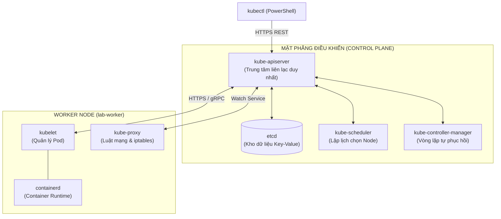
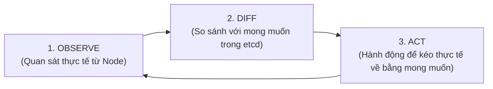
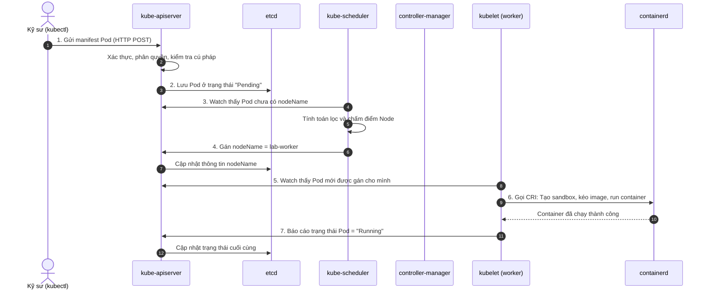

# Bài 05: Kiến trúc Kubernetes: Control Plane, Worker Node & Vòng lặp hòa giải

## 1. Thông tin bài học
* **Tên bài:** Bài 05: Kiến trúc Kubernetes: Control Plane, Worker Node & Vòng lặp hòa giải
* **Mục tiêu học:** Nắm vững vai trò và cơ chế phối hợp của 4 thành phần đầu não trên Control Plane (`kube-apiserver`, `etcd`, `kube-scheduler`, `kube-controller-manager`) và 3 thành phần trên Worker Node (`kubelet`, `kube-proxy`, `containerd`); hiểu sâu sắc nguyên lý cốt lõi **Vòng lặp hòa giải (Reconciliation Loop)**; truy vết chính xác hành trình của một yêu cầu triển khai ứng dụng từ lúc gõ lệnh đến khi container khởi chạy.
* **Thời lượng ước tính:** 150 phút (75 phút đọc hiểu lý thuyết, 75 phút thực hành lab)
* **Kiến thức cần có trước:** Bài 04 (Thiết lập môi trường Lab thực chiến: KinD & kubectl).
* **Liên quan kỳ thi:** CKA (Kiến thức sống còn: chiếm ~25% câu hỏi về Cluster Architecture, quản lý thành phần Control Plane và xử lý sự cố node).

---

## 2. Bảng thuật ngữ

| Thuật ngữ | Giải thích đơn giản | Ví dụ / Ẩn dụ đời thường |
| :--- | :--- | :--- |
| **Control Plane** | Nhóm các thành phần đóng vai trò "bộ não" chỉ huy, lưu trữ trạng thái và ra quyết định cho toàn bộ cluster. | Tòa thị chính và ban lãnh đạo điều hành thành phố. |
| **kube-apiserver** | Cổng giao tiếp trung tâm duy nhất của cụm; tiếp nhận mọi mệnh lệnh từ người dùng và điều phối các phòng ban nội bộ. | Bàn tiếp dân tại Tòa thị chính: mọi giấy tờ, hồ sơ đều phải nộp qua đây, không ai được tự ý đi cửa sau. |
| **etcd** | Cơ sở dữ liệu phân tán dạng Key-Value, là "cuốn sổ cái" duy nhất lưu giữ toàn bộ thông tin trạng thái của cả cluster. | Két sắt lưu trữ hồ sơ công chứng đất đai tối mật của thành phố; chỉ duy nhất nhân viên bàn tiếp dân có chìa khóa mở. |
| **kube-scheduler** | Thành phần tính toán xem Pod mới nên được gán cho Worker Node nào dựa trên tài nguyên và các ràng buộc. | Phòng Quy hoạch đô thị: xem bản đồ thành phố để tìm mảnh đất trống phù hợp nhất cho dự án xây dựng mới. |
| **kube-controller-manager** | Tập hợp các tiến trình kiểm soát liên tục so sánh trạng thái thực tế với trạng thái mong muốn để khắc phục sai lệch. | Ban Thanh tra trật tự đô thị: liên tục tuần tra xem thực tế có đúng với giấy phép quy hoạch không để xử lý. |
| **kubelet** | Tiến trình đại diện của Kubernetes chạy trên từng Worker Node, chịu trách nhiệm nhận lệnh và chăm sóc các Pod. | Đội trưởng công nhân tại công trường: trực tiếp đốc thúc thợ thi công và báo cáo tình hình về Tòa thị chính. |
| **kube-proxy** | Thành phần quản lý mạng trên từng Node, phụ trách điều hướng lưu lượng truy cập tới đúng Pod đích. | Cảnh sát giao thông đứng ở ngã tư điều phối các làn xe đi đúng cổng công trường. |
| **Vòng lặp hòa giải (Reconciliation Loop)** | Vòng lặp vô tận: Quan sát thực tế $\rightarrow$ So sánh với mong muốn $\rightarrow$ Hành động để kéo thực tế về bằng mong muốn. | Hệ thống điều hòa nhiệt độ: cảm biến đo 30°C, bạn cài đặt 25°C, điều hòa tự bật máy nén làm lạnh cho tới khi đạt đúng 25°C. |

---

## 3. Bức tranh lớn: Vấn đề thực tế và ẩn dụ đời thường

### Nhắc lại bài trước
Ở Bài 04, chúng ta đã tự tay dựng thành công một cụm Kubernetes gồm 2 node (1 Control Plane + 1 Worker) bằng KinD và thiết lập phím tắt `k` trong PowerShell. Chúng ta đã thấy một Pod tự động được đặt lên worker node, nhưng chưa hề biết cỗ máy bên trong đã phối hợp ra sao để làm được điều kỳ diệu đó.

### Tại sao cần cái này ở production? (Vấn đề thực tế)
Khi bạn vận hành Kubernetes ở quy mô production với hàng trăm máy chủ và hàng ngàn Pod, sự cố xảy ra là điều chắc chắn. Một buổi sáng đẹp trời, hệ thống gặp trục trặc:
* Các Pod mới tạo cứ đứng yên ở trạng thái `Pending` hàng giờ liền mà không chạy.
* Bạn gõ lệnh `kubectl get nodes` nhưng terminal treo cứng 30 giây rồi báo lỗi Timeout.
* Một Pod bị xóa nhưng không thấy tự sinh lại bản sao mới để bù đắp.

Nếu bạn chỉ học Kubernetes theo kiểu "học vẹt" vài câu lệnh bề mặt, bạn sẽ hoàn toàn bất lực như người mù đi trong đêm. Bạn sẽ hoảng loạn khởi động lại bừa bãi các máy chủ vật lý, vô tình làm hỏng dữ liệu của cơ sở dữ liệu `etcd` và biến một sự cố nhỏ thành thảm họa sập toàn bộ hệ thống công ty.

Ngược lại, một Senior Platform Engineer khi nhìn vào các triệu chứng trên sẽ biết chính xác:
* Pod bị `Pending` nghĩa là **`kube-scheduler`** đang gặp vấn đề hoặc các Node hết tài nguyên.
* `kubectl` bị Timeout nghĩa là **`kube-apiserver`** hoặc **`etcd`** đang bị quá tải I/O ổ đĩa.
* Pod không tự tái sinh nghĩa là **`kube-controller-manager`** đang bị treo.

Hiểu rõ cấu tạo giải phẫu của Kubernetes giúp bạn chuyển từ tư duy "đoán mò cầu may" sang tư duy "chẩn đoán lâm sàng chính xác trong 2 phút".

### Ẩn dụ đời thường: Tòa thị chính và Công trường xây dựng
Hãy hình dung toàn bộ cụm Kubernetes giống như một đại công trường xây dựng được quản lý bởi Tòa thị chính thành phố:

1. **Người dân (`kubectl`):** Bạn muốn xây một ngôi nhà (chạy một Pod), bạn mang tập hồ sơ bản vẽ (file YAML) đến nộp tại **Bàn tiếp dân (`kube-apiserver`)**.
2. **Bàn tiếp dân (`kube-apiserver`):** Kiểm tra giấy tờ tùy thân của bạn (Authentication), kiểm tra xem bạn có quyền xây nhà ở khu vực này không (Authorization). Nếu hợp lệ, nhân viên cất bản vẽ vào **Két sắt hồ sơ (`etcd`)**.
3. **Phòng Quy hoạch (`kube-scheduler`):** Thấy trong két sắt có một hồ sơ xây nhà mới nhưng chưa có địa chỉ đất. Phòng quy hoạch mở bản đồ các quận huyện (**Worker Nodes**) ra xem: Quận A đã hết chỗ, Quận B còn mảnh đất trống đủ diện tích. Họ đóng dấu: *"Xây tại Quận B"* và gửi lại cho Bàn tiếp dân ghi vào sổ cái `etcd`.
4. **Đội trưởng công trường (`kubelet` tại Quận B):** Liên tục gọi điện cho Bàn tiếp dân để hỏi: *"Hôm nay Quận B có dự án nào mới không?"*. Khi thấy có dự án xây nhà trên địa bàn mình quản lý, Đội trưởng lập tức gọi thợ phụ trách máy móc (**Container Runtime - containerd**) mang vật liệu về đào móng dựng nhà (tạo container).
5. **Ban Thanh tra trật tự (`kube-controller-manager`):** Cứ 5 giây một lần lật sổ hồ sơ ra đếm: *"Quy hoạch ghi rõ công viên này phải có 3 chiếc ghế đá. Sao thực tế tôi chỉ đếm được 2 chiếc? Chiếc thứ 3 bị ai phá hỏng rồi?"*. Ban thanh tra lập tức ký quyết định gửi Bàn tiếp dân yêu cầu Đội trưởng công trường dựng ngay một chiếc ghế đá mới.

Nhờ sự phân công rành mạch này, dù thành phố có mở rộng từ 2 quận lên 2000 quận, bộ máy vẫn vận hành trơn tru mà không ai bị dẫm chân lên việc của nhau.

---

## 4. Giải thích khái niệm theo từng bước

Hệ thống Kubernetes được chia tách tuyệt đối thành hai phân vùng kiến trúc: **Mặt phẳng điều khiển (Control Plane)** và **Các nút công nhân (Worker Nodes)**.



### Bước 1: Các cơ quan đầu não trên Control Plane
1. **`kube-apiserver` (Trái tim liên lạc):**
   * Là thành phần duy nhất mở cổng mạng ra ngoài cho người dùng và các thành phần khác kết nối tới (mặc định cổng HTTPS `6443`).
   * Là thành phần **phi trạng thái (Stateless)**, có thể dễ dàng mở rộng chạy song song nhiều bản sao để tăng tính sẵn sàng cao (High Availability).
   * **Nguyên tắc vàng:** Không bất kỳ thành phần nào khác (`scheduler`, `kubelet`, `etcd`) được phép nói chuyện trực tiếp với nhau. **Mọi luồng dữ liệu bắt buộc phải đi xuyên qua `kube-apiserver`**.
2. **`etcd` (Bộ nhớ bất biến):**
   * Được viết bằng Golang, sử dụng thuật toán đồng thuận phân tán **Raft Consensus**.
   * Chỉ lưu trữ dữ liệu dạng khóa - giá trị (Key - Value). Mọi tài nguyên trong K8s (Pod, Service, Node) đều được lưu thành các đường dẫn trong etcd (ví dụ: `/registry/pods/default/my-app`).
   * **Nguyên tắc bảo mật:** Chỉ duy nhất `kube-apiserver` có chứng chỉ số TLS để đọc/ghi vào `etcd`. Tuyệt đối không cho phép bất kỳ ai khác truy cập thẳng vào etcd.
3. **`kube-scheduler` (Bộ não xếp chỗ):**
   * Hoạt động theo quy trình 2 bước: **Lọc (Filtering / Predicates)** loại bỏ các node không đủ RAM/CPU hoặc bị vướng ràng buộc, sau đó **Chấm điểm (Scoring / Priorities)** các node còn lại để chọn ra node có điểm số cao nhất.
   * Nhiệm vụ duy nhất của Scheduler là gán tên node vào trường `spec.nodeName` của Pod rồi gửi lại cho API Server. Scheduler **không trực tiếp chạy container**!
4. **`kube-controller-manager` (Người gác đền hòa giải):**
   * Đóng gói hàng loạt bộ điều khiển nhỏ trong một tiến trình duy nhất:
     * *Node Controller:* Phát hiện khi một node bị mất liên lạc (chết sau 40 giây).
     * *Replication Controller:* Đảm bảo số lượng Pod thực tế luôn bằng số lượng Pod khai báo.
     * *Endpoints Controller:* Cập nhật danh sách IP của Pod vào Service.

### Bước 2: Các cơ quan thực thi trên Worker Node
1. **`kubelet` (Đội trưởng hiện trường):**
   * Chạy như một tiến trình dịch vụ thông thường của hệ điều hành Linux (`systemd service`), không chạy trong container.
   * Giao tiếp với API Server qua cơ chế **Watch**: liên tục lắng nghe xem có Pod nào được gán cho node của mình không.
   * Giao tiếp với Container Runtime (`containerd`) qua chuẩn **CRI** để tạo/xóa container; định kỳ thăm khám sức khỏe Pod (**Probes**) và báo cáo tài nguyên của node về cho API Server.
2. **`kube-proxy` (Cảnh sát giao thông mạng):**
   * Theo dõi các đối tượng `Service` và `Endpoints` từ API Server.
   * Trực tiếp thao tác với nhân Linux trên node để ghi các luật định tuyến mạng bằng **iptables**, **IPVS**, hoặc gần đây là **eBPF**. Đảm bảo khi một request gửi vào IP của Service, nó sẽ được chuyển hướng chính xác đến IP của một trong các Pod đích.

### Bước 3: Nguyên lý cốt lõi: Vòng lặp hòa giải (Reconciliation Loop)
Linh hồn làm nên sức mạnh tự phục hồi của Kubernetes nằm ở khái niệm toán học đơn giản:

$$\text{Action} = f(\text{Desired State} - \text{Actual State})$$



* **Desired State (Trạng thái mong muốn):** Được ghi trong file YAML của bạn và lưu trong `etcd` (Ví dụ: "Tôi muốn có 3 Pods").
* **Actual State (Trạng thái thực tế):** Được `kubelet` báo cáo từ các node về (Ví dụ: "Hiện tại chỉ có 2 Pods đang chạy vì 1 Pod vừa bị lỗi crash").
* **Controller** phát hiện độ lệch ($3 - 2 = 1$), nó không hề hoảng sợ mà bình tĩnh gửi lệnh tạo thêm đúng 1 Pod mới. Khi số lượng trở về 3, độ lệch bằng 0, Controller quay lại chế độ nghỉ ngơi và tiếp tục quan sát.

### Bước 4: Truy vết hành trình 7 bước của một lệnh `kubectl apply`



---

## 5. Thực hành (Lab)

Chúng ta sẽ sử dụng cụm KinD `lab` 2 node đã thiết lập ở Bài 04 để trực tiếp "mổ xẻ" các thành phần bên trong Control Plane và Worker Node.

* **Môi trường:** Cluster kind `lab` (1 control-plane + 1 worker).
* **Mức RAM ước tính:** Sử dụng cụm có sẵn, tiêu tốn **~500MB RAM** (không tốn thêm tài nguyên mới).

### Bước 1: Khám phá các thành phần Control Plane đang chạy
Trong cụm KinD (và đa số các cụm production chuẩn kubeadm), các thành phần của Control Plane được đóng gói thành các **Static Pods** chạy trong namespace đặc biệt `kube-system`.

Mở PowerShell và gõ lệnh:

```powershell
k get pods -n kube-system -o wide
```

**Kết quả mong đợi (Expected Output):**
```text
NAME                                        READY   STATUS    RESTARTS   AGE   IP           NODE
coredns-7c65d6cfc9-xxxxx                    1/1     Running   0          25m   10.244.0.2   lab-control-plane
etcd-lab-control-plane                      1/1     Running   0          25m   172.18.0.3   lab-control-plane
kindnet-6w7x8                               1/1     Running   0          25m   172.18.0.3   lab-control-plane
kindnet-9p2q4                               1/1     Running   0          25m   172.18.0.2   lab-worker
kube-apiserver-lab-control-plane            1/1     Running   0          25m   172.18.0.3   lab-control-plane
kube-controller-manager-lab-control-plane   1/1     Running   0          25m   172.18.0.3   lab-control-plane
kube-proxy-8k4m2                            1/1     Running   0          25m   172.18.0.3   lab-control-plane
kube-proxy-v9x7l                            1/1     Running   0          25m   172.18.0.2   lab-worker
kube-scheduler-lab-control-plane            1/1     Running   0          25m   172.18.0.3   lab-control-plane
```

> **Phân tích của Senior:**
> 1. Toàn bộ "bộ tứ đầu não": `kube-apiserver`, `etcd`, `kube-controller-manager`, `kube-scheduler` đều đang chạy trên node **`lab-control-plane`**!
> 2. `kube-proxy` và `kindnet` (CNI mạng) chạy trên **cả 2 node** để quản lý giao thông.
> 3. Tuyệt nhiên không có tiến trình `kubelet` xuất hiện ở đây. Tại sao? Vì `kubelet` là tiến trình chạy trực tiếp trên hệ điều hành host, chính nó là người khởi tạo các Pod ở trên!

### Bước 2: Tận mắt nhìn thấy "Tủ hồ sơ" Static Pod Manifests
Làm thế nào Kubelet biết phải chạy API Server hay etcd khi mà cụm còn chưa khởi động? Nó đọc từ một thư mục bí mật trên máy chủ Control Plane: `/etc/kubernetes/manifests`.

Hãy dùng Docker để "chui" vào bên trong container `lab-control-plane` kiểm tra:

```powershell
docker exec -it lab-control-plane ls -la /etc/kubernetes/manifests
```

**Kết quả mong đợi (Expected Output):**
```text
total 24
drwxr-xr-x 2 root root 4096 ... .
drwxr-xr-x 4 root root 4096 ... ..
-rw------- 1 root root 2384 ... etcd.yaml
-rw------- 1 root root 3871 ... kube-apiserver.yaml
-rw------- 1 root root 3392 ... kube-controller-manager.yaml
-rw------- 1 root root 1453 ... kube-scheduler.yaml
```

> **Bí mật được bật mí:** 4 file YAML này chính là "hạt nhân vũ trụ" của Kubernetes! Khi máy chủ Control Plane khởi động, tiến trình `kubelet` quét thư mục này, thấy có 4 file YAML, nó tự động nạp vào `containerd` để khởi chạy 4 thành phần đầu não.

### Bước 3: Quan sát hành trình tạo Pod theo thời gian thực (Truy vết 7 bước)
Hãy mở một cửa sổ quan sát các sự kiện (Events) của cluster:

```powershell
# Chạy một lệnh tạo Pod mới tên là trace-pod
k run trace-pod --image=nginx:alpine

# Xem lại nhật ký sự kiện của Pod vừa tạo
k describe pod trace-pod
```

Cuộn xuống phần cuối cùng **`Events:`**:

**Kết quả mong đợi (Expected Output):**
```text
Events:
  Type    Reason     Age   From               Message
  ----    ------     ----  ----               -------
  Normal  Scheduled  18s   default-scheduler  Successfully assigned default/trace-pod to lab-worker
  Normal  Pulling    17s   kubelet            Pulling image "nginx:alpine"
  Normal  Pulled     14s   kubelet            Successfully pulled image "nginx:alpine" in 2.8s
  Normal  Created    14s   kubelet            Created container trace-pod
  Normal  Started    14s   kubelet            Started container trace-pod
```

> **Đối chiếu lý thuyết:**
> * Dòng 1: **`default-scheduler`** ra quyết định gán Pod cho `lab-worker`.
> * Dòng 2 đến 5: **`kubelet`** trên `lab-worker` tiếp nhận, gọi CRI kéo image, tạo container và khởi động tiến trình. Đúng 100% như sơ đồ Sequence Diagram ở Mục 4!

### Bước 4: Kiểm chứng Vòng lặp hòa giải bằng thực tế
Hãy tạo một Deployment nhỏ gồm 2 bản sao để quan sát Controller Manager làm việc:

```powershell
# Tạo một Deployment tên web-demo với 2 replicas
k create deployment web-demo --image=nginx:alpine --replicas=2

# Kiểm tra danh sách Pod
k get pods -l app=web-demo
```

**Kết quả mong đợi:** Thấy 2 Pod đang chạy.

Bây giờ, hãy thử đóng vai trò kẻ phá hoại, xóa đi 1 Pod:
```powershell
# Lấy tên của 1 Pod bất kỳ và xóa nó
$podName = (k get pods -l app=web-demo -o jsonpath='{.items[0].metadata.name}')
Write-Host "Đang tiêu diệt Pod: $podName"
k delete pod $podName

# Ngay lập tức kiểm tra lại danh sách Pod
k get pods -l app=web-demo
```

**Kết quả mong đợi (Expected Output):**
```text
NAME                        READY   STATUS              RESTARTS   AGE
web-demo-7f89d5b4c-abcde    1/1     Running             0          45s
web-demo-7f89d5b4c-xyz99    0/1     ContainerCreating   0          2s
```

> **Giải thích:** Bạn vừa chứng kiến **Vòng lặp hòa giải** bằng xương bằng thịt! Ngay khi bạn xóa Pod cũ, `kube-controller-manager` phát hiện thực tế chỉ còn 1 Pod, trong khi `etcd` ghi Desired State là 2 Pod. Nó lập tức phát lệnh tạo ra một Pod mới tinh (`ContainerCreating 2s`) để bù đắp lại trong vòng chưa đầy nửa giây!

### Bước 5: Dọn dẹp tài nguyên (Cleanup)
Xóa tài nguyên thử nghiệm để giữ cho cluster sạch sẽ và tiết kiệm tài nguyên:

```powershell
k delete pod trace-pod
k delete deployment web-demo
```

---

## 6. Lỗi thường gặp và cách debug

### Lỗi 1: Pod rơi vào trạng thái `Pending` vô thời hạn
* **Dấu hiệu:** Gõ `kubectl get pods` thấy Pod có `STATUS: Pending`, chạy lệnh `describe pod` thấy không có dòng event nào từ `default-scheduler`.
* **Nguyên nhân 1:** `kube-scheduler` bị chết hoặc mất kết nối với API Server.
* **Nguyên nhân 2:** Scheduler vẫn sống, nhưng sau bước lọc (Filtering), tất cả các Node trong cluster đều không đủ CPU/RAM hoặc dính Taints mà Pod không dung thứ được.
* **Cách debug:**
  ```powershell
  k describe pod <ten-pod>
  # Đọc dòng cảnh báo Warning FailedScheduling ở cuối output để thấy lý do (ví dụ: Insufficient memory).
  ```

### Lỗi 2: Lỗi `etcdserver: request timed out` hoặc API Server phản hồi siêu chậm
* **Dấu hiệu:** `kubectl` thỉnh thoảng bị đơ, log của `kube-apiserver` in ra nhiều lỗi liên quan đến etcd timeout.
* **Nguyên nhân cốt lõi ở production:** Ổ cứng chứa dữ liệu của `etcd` bị nghẽn I/O. `etcd` sử dụng thuật toán Raft, yêu cầu ghi tuần tự (fsync) xuống đĩa cực kỳ khắt khe (thường yêu cầu độ trễ ghi < 10ms). Nếu chạy etcd chung trên ổ cứng chậm hoặc ổ HDD truyền thống, etcd sẽ bị rớt nhịp tim giữa các node, dẫn đến bầu lại leader liên tục và làm tê liệt API Server.
* **Cách khắc phục:** Trên production, bắt buộc phải đặt thư mục dữ liệu của etcd trên ổ SSD NVMe chuyên dụng có IOPS cao.

### Lỗi 3: Node chuyển sang trạng thái `NotReady`
* **Dấu hiệu:** Cột `STATUS` trong `kubectl get nodes` hiển thị `NotReady`.
* **Nguyên nhân:** Tiến trình `kubelet` trên worker node đó đã ngừng hoạt động (bị crash do hết RAM, hoặc mất kết nối mạng tới API Server quá 40 giây).
* **Cách debug:**
  Truy cập vào máy chủ worker node đó và kiểm tra trạng thái dịch vụ hệ thống:
  ```bash
  systemctl status kubelet
  journalctl -u kubelet -n 50 --no-pager
  ```

---

## 7. Góc nhìn Senior

### 1. Sự đánh đổi (Trade-offs)
* **Tính nhất quán mạnh (Strong Consistency) vs Hiệu năng ghi của etcd:**
  * `etcd` chọn nguyên lý **CP (Consistency + Partition Tolerance)** theo định lý CAP. Nó thà từ chối phục vụ chứ quyết không bao giờ để xảy ra tình trạng sai lệch dữ liệu trạng thái.
  * Đánh đổi: Tốc độ ghi của etcd không thể nhanh như Redis hay Cassandra. Nó không được thiết kế để lưu trữ lượng dữ liệu khổng lồ (kích thước tối đa của cơ sở dữ liệu etcd được khuyến nghị không vượt quá **8GB**). Không bao giờ lưu file ảnh hay dữ liệu nghiệp vụ vào etcd.
* **Tại sao Kubernetes không dùng MySQL hoặc PostgreSQL làm database mặc định?**
  * PostgreSQL rất mạnh nhưng cơ chế nhân bản (replication) mặc định là bất đối xứng (asynchronous) hoặc đòi hỏi cấu hình cụm phức tạp. `etcd` tích hợp sẵn cơ chế **Watch API** dựa trên HTTP/2 gRPC streams, cho phép hàng ngàn client cùng theo dõi biến động tài nguyên trong thời gian thực mà không cần liên tục gửi query thăm dò (polling), điều mà các RDBMS truyền thống xử lý rất kém hiệu quả.

### 2. Best practices tại production
* **Luôn thiết lập số lượng node etcd là SỐ LẺ (3 hoặc 5 node):**
  * Để đạt được sự đồng thuận trong thuật toán Raft, hệ thống cần đa số phiếu bầu (**Quorum**):
    $$\text{Quorum} = \lfloor N/2 \rfloor + 1$$
  * Cụm 3 node chịu được tối đa **1 node chết** ($Quorum = 2$).
  * Cụm 4 node cũng chỉ chịu được tối đa **1 node chết** ($Quorum = 3$). Dùng 4 node tốn thêm tài nguyên mà không tăng thêm khả năng chịu lỗi so với 3 node, thậm chí còn tăng nguy cơ chậm trễ mạng khi biểu quyết!
* **Bảo vệ tuyệt đối các node Control Plane bằng Taints:**
  * Mặc định trên các cụm production, Control Plane luôn được gắn một "vết nhơ" (Taint) dạng `node-role.kubernetes.io/control-plane:NoSchedule`. Điều này ngăn không cho các lập trình viên vô tình deploy Pod ứng dụng nặng nề lên máy chủ đầu não, tránh nguy cơ cạn kiệt CPU làm sập API Server.

### 3. Câu hỏi phỏng vấn Senior
* **Câu hỏi 1:** *"Giả sử toàn bộ 3 máy chủ Control Plane của cụm Kubernetes bị sập nguồn đột ngột và mất mạng hoàn toàn trong suốt 30 phút. Các Pod và microservices đang chạy trên Worker Nodes có tiếp tục phục vụ khách hàng được không? Điều gì vẫn hoạt động và điều gì KHÔNG THỂ hoạt động trong 30 phút đó?"*
  * **Gợi ý trả lời chuẩn:**
    * **Những gì VẪN HOẠT ĐỘNG BÌNH THƯỜNG:** Toàn bộ các Pod và container đang chạy trên Worker Node vẫn tiếp tục chạy và xử lý traffic của khách hàng bình thường! Lưu lượng mạng bên ngoài đi qua Load Balancer/Ingress vào `kube-proxy` vẫn hoạt động vì các luật `iptables` đã được ghi sẵn trên worker node. Dữ liệu trong container không bị ảnh hưởng.
    * **Những gì KHÔNG THỂ HOẠT ĐỘNG:** Toàn bộ tầng quản trị bị tê liệt hoàn toàn. Lệnh `kubectl` không kết nối được; không thể deploy ứng dụng mới; không thể scale-up/scale-down; và quan trọng nhất: **tính năng tự phục hồi (Self-healing) bị vô hiệu hóa**. Nếu trong 30 phút đó có một Pod trên worker node bị crash, sẽ không có Controller Manager nào ra lệnh tạo lại Pod đó.
* **Câu hỏi 2:** *"Trình bày cơ chế hoạt động của tính năng Watch API trong Kube-APIServer và giải thích tại sao nó giúp hệ thống mở rộng lên tới hàng chục ngàn node mà không làm nghẽn mạng."*
  * **Gợi ý trả lời chuẩn:** Thay vì hàng ngàn Kubelet liên tục gửi request dạng thăm dò tuần tự (HTTP Polling: *"Có việc gì mới không?"* cứ mỗi giây một lần - gây nghẽn băng thông và ngốn CPU của API Server), Kube-APIServer sử dụng giao thức **HTTP/2 gRPC Streaming**. Kubelet chỉ cần mở một kết nối dài (Long-lived connection) kèm theo một chỉ số phiên bản (`resourceVersion`). Khi etcd có bất kỳ thay đổi nào vượt qua chỉ số đó, API Server sẽ chủ động "đẩy" (Push) một gói tin sự kiện nhỏ (`ADDED`, `MODIFIED`, `DELETED`) tới đúng Kubelet đang lắng nghe. Cơ chế hướng sự kiện (Event-driven) này triệt tiêu hoàn toàn lưu lượng mạng thừa thãi.

---

## 8. Tóm tắt bài học
* 📌 **1.** **`kube-apiserver`** là cửa ngõ duy nhất tiếp nhận mọi liên lạc; không một thành phần nào được phép đi cửa sau vào `etcd`.
* 📌 **2.** **`etcd`** là kho lưu trữ trạng thái duy nhất của cluster, yêu cầu ổ cứng tốc độ cao và số lượng node luôn là số lẻ (3 hoặc 5).
* 📌 **3.** **`kube-scheduler`** chỉ làm nhiệm vụ tính toán và gán tên node cho Pod; **`kubelet`** trên worker node mới là người thực sự ra lệnh cho containerd chạy container.
* 📌 **4.** **Vòng lặp hòa giải (Reconciliation Loop)** là cơ chế cốt lõi giúp Kubernetes liên tục kéo trạng thái thực tế về bằng với trạng thái mong muốn trong khai báo.
* 📌 **5.** Khi Control Plane bị sập tạm thời, các ứng dụng đang chạy trên Worker Node **vẫn tiếp tục phục vụ bình thường**, chỉ có các thao tác quản trị và tự phục hồi bị đóng băng.

---

## 9. Bài tập tự làm

* 🟢 **Mức Dễ:** Sử dụng lệnh `k get pods -n kube-system` và kiểm tra số lần khởi động lại (`RESTARTS`) của các Pod `kube-apiserver` và `etcd` trên cụm KinD của bạn.
* 🟡 **Mức Vừa:** Dùng lệnh `k describe node lab-control-plane` và tìm mục `Taints:`. Hãy phân tích ý nghĩa của giá trị taint đang được đặt trên node điều khiển này.
* 🔴 **Mức Khó (Mổ xẻ etcd):** Sử dụng lệnh `docker exec -it lab-control-plane crictl ps` để xem danh sách các container hệ thống cấp thấp do containerd quản lý. Tìm container `etcd`, đọc log của nó bằng lệnh `docker exec -it lab-control-plane crictl logs <container-id>` và chỉ ra dòng log chứng minh etcd đã hoàn tất việc bầu Leader theo thuật toán Raft.

---

## 10. Câu hỏi tự kiểm tra

1. Thành phần nào là đối tượng duy nhất trong toàn bộ cụm Kubernetes có quyền đọc và ghi trực tiếp vào cơ sở dữ liệu `etcd`?
2. Nếu bạn tắt tiến trình `kube-scheduler`, bạn có thể tạo một Pod mới bằng lệnh `kubectl run` không? Trạng thái của Pod đó sẽ là gì?
3. Tại sao cụm etcd gồm 4 node lại không tốt hơn cụm etcd gồm 3 node về mặt khả năng chịu lỗi?
4. Tiến trình nào trên Worker Node chịu trách nhiệm kiểm tra sức khỏe của ứng dụng (Liveness Probe) và báo cáo về Control Plane?
5. Giao thức mạng và công nghệ kết nối nào được sử dụng giữa Kubelet và API Server để thực hiện tính năng Watch sự kiện theo thời gian thực?
6. Kube-proxy can thiệp vào tầng nào của hệ điều hành Linux để thực hiện việc chuyển hướng lưu lượng mạng tới Pod?

<details>
<summary>👉 Bấm vào đây để xem đáp án câu hỏi tự kiểm tra</summary>

* **Đáp án 1:** Duy nhất **`kube-apiserver`**. Mọi thành phần khác đều bị cấm tuyệt đối.
* **Đáp án 2:** **Có thể tạo được**, nhưng Pod sẽ mãi mãi đứng yên ở trạng thái **`Pending`** vì không có Scheduler tính toán và gán node cho nó.
* **Đáp án 3:** Vì theo công thức đa số Quorum $\lfloor N/2 \rfloor + 1$: cụm 3 node cần 2 phiếu (chịu được 1 node chết); cụm 4 node cần 3 phiếu (cũng chỉ chịu được tối đa 1 node chết). Dùng 4 node tốn thêm tài nguyên phần cứng mà không hề tăng thêm độ sẵn sàng chịu lỗi.
* **Đáp án 4:** Tiến trình **`kubelet`** chạy trực tiếp trên worker node.
* **Đáp án 5:** Giao thức **HTTP/2 gRPC Streaming** (kết nối mở dài - long-lived stream).
* **Đáp án 6:** Can thiệp trực tiếp vào tầng mạng của Linux Kernel thông qua các bảng luật **iptables**, **IPVS** hoặc chương trình **eBPF**.
</details>

---

## 11. Tài liệu đọc thêm và bài tiếp theo

### Tài liệu tham khảo
* [Tài liệu chính thức Kubernetes: Kubernetes Components](https://kubernetes.io/docs/concepts/overview/components/)
* [Tài liệu chuyên sâu Kubernetes: The Kubernetes API](https://kubernetes.io/docs/concepts/overview/kubernetes-api/)
* [Trang chủ dự án etcd: Operating etcd clusters for Kubernetes](https://etcd.io/docs/)
* [Bài viết phân tích thuật toán Raft trực quan: The Secret Lives of Data - Raft](https://thesecretlivesofdata.com/raft/)

### Bài tiếp theo
👉 **Bài 06: Pod: Đơn vị tính toán nguyên tử & Multi-container**

---

## PHỤ LỤC: ĐÁP ÁN GỢI Ý BÀI TẬP TỰ LÀM (MỤC 9)

### Đáp án Mức Dễ
Chạy câu lệnh:
```powershell
k get pods -n kube-system -l tier=control-plane
```
Quan sát cột `RESTARTS`. Trên một cụm vừa khởi tạo ổn định, giá trị này phải bằng `0`. Nếu giá trị này lớn hơn 0, nghĩa là thành phần đó đã từng bị crash và Kubelet đã phải khởi động lại nó.

### Đáp án Mức Vừa
```powershell
k describe node lab-control-plane | Select-String "Taints:" -Context 0,2
```
Kết quả hiển thị:
```text
Taints: node-role.kubernetes.io/control-plane:NoSchedule
```
*Ý nghĩa:* 
* Khóa (Key): `node-role.kubernetes.io/control-plane`.
* Hiệu ứng (Effect): `NoSchedule`.
* Điều này báo cho Scheduler biết: Tuyệt đối không được phép lập lịch cho bất kỳ Pod nào chạy trên node này, trừ khi Pod đó có khai báo dung thứ (Toleration) đặc biệt cho vai trò Control Plane (chỉ các Pod hệ thống như coredns hay cni mới có). Nhờ đó, worker node là nơi duy nhất gánh vác các Pod của người dùng.

### Đáp án Mức Khó
Dùng lệnh liệt kê container trong node qua CRI CLI (`crictl`):
```powershell
# 1. Tìm ID của container etcd
$etcdId = (docker exec lab-control-plane crictl ps --name etcd -q)

# 2. Xem các dòng log đầu tiên khi etcd khởi động
docker exec lab-control-plane crictl logs $etcdId 2>&1 | Select-String "became leader"
```
Kết quả sẽ xuất hiện dòng log có nội dung tương tự:
`raft.node: ... became leader at term 1`
hoặc
`ready to serve client requests`
Điều này chứng minh thuật toán Raft đã hoàn tất việc bầu nút etcd này làm Leader và sẵn sàng tiếp nhận các kết nối ghi dữ liệu từ Kube-APIServer.
