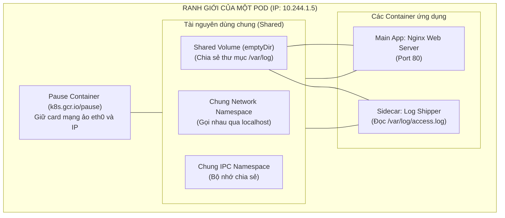
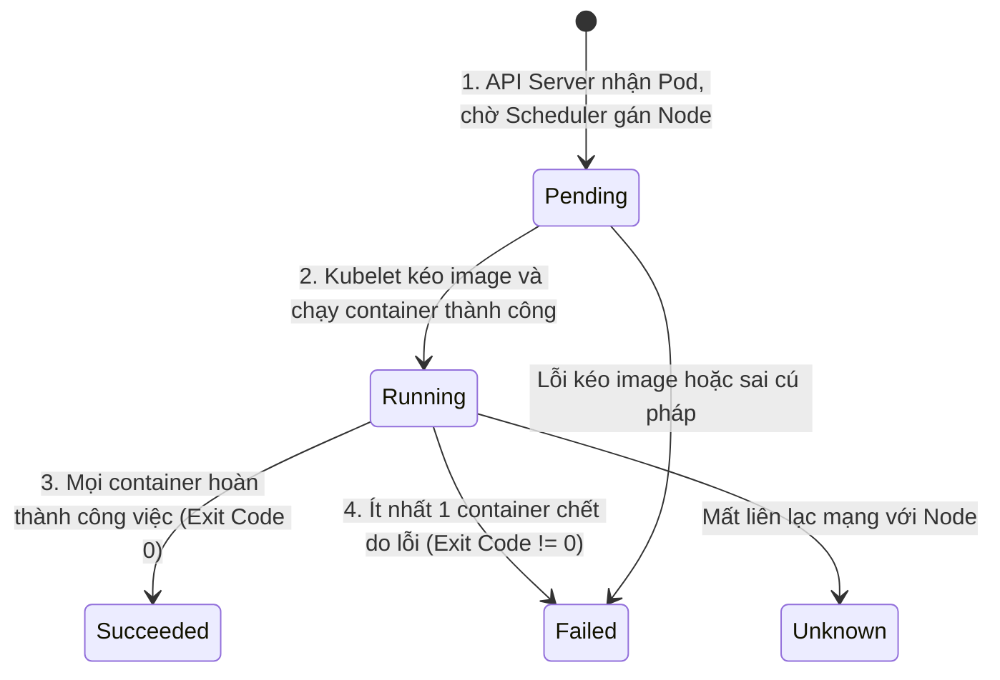

# Bài 06: Pod: Đơn vị tính toán nguyên tử & Multi-container

## 1. Thông tin bài học
* **Tên bài:** Bài 06: Pod: Đơn vị tính toán nguyên tử & Multi-container
* **Mục tiêu học:** Hiểu bản chất tại sao Kubernetes không quản lý container trực tiếp mà bọc trong đối tượng Pod; làm chủ cơ chế chia sẻ tài nguyên bên trong Pod (mạng, bộ nhớ, volume); nắm vững 5 trạng thái vòng đời (Pod Lifecycle) và cờ `restartPolicy`; tự tay viết và vận hành một Multi-container Pod hoàn chỉnh kết hợp cả **Init Container** và **Sidecar Container** theo chuẩn production.
* **Thời lượng ước tính:** 150 phút (75 phút lý thuyết, 75 phút thực hành)
* **Kiến thức cần có trước:** Bài 01 (Linux Namespaces), Bài 05 (Kiến trúc Kubernetes & Vòng lặp hòa giải).
* **Liên quan kỳ thi:** CKAD, CKA (Chiếm tỷ trọng điểm cao trong phần thiết kế Pod, cấu hình Multi-container, Sidecar pattern và gỡ lỗi Init Container).

---

## 2. Bảng thuật ngữ

| Thuật ngữ | Giải thích đơn giản | Ví dụ / Ẩn dụ đời thường |
| :--- | :--- | :--- |
| **Pod** | Đơn vị triển khai nhỏ nhất trong Kubernetes, đóng vai trò như một "chiếc kén" bọc lấy một hoặc nhiều container. | Quả đậu Hà Lan: bên trong lớp vỏ có thể chứa một hoặc nhiều hạt đậu sống chung một buồng. |
| **Pause Container (Infra Container)** | Container vô hình siêu nhẹ chạy ngầm đầu tiên trong mỗi Pod để giữ cố định địa chỉ IP và card mạng ảo. | Chiếc mỏ neo cắm chặt đáy biển giữ vị trí cho con tàu; người trên tàu có đổi ca thì tàu vẫn đứng yên một chỗ. |
| **Multi-container Pod** | Một Pod chứa từ hai container trở lên chạy cộng sinh, cùng chia sẻ địa chỉ mạng và ổ đĩa dữ liệu. | Xe mô tô phân khối lớn gắn thêm thùng xe phụ bên cạnh (Sidecar motorcycle). |
| **Init Container** | Container tiền trạm chạy tuần tự và phải hoàn thành thành công trước khi các container chính được phép khởi động. | Đội dọn dẹp vệ sinh vào chuẩn bị phòng hội nghị tươm tất trước khi buổi họp chính thức bắt đầu. |
| **Sidecar Container** | Container chạy song song bên cạnh container chính để hỗ trợ các tác vụ phụ trợ (ghi log, proxy mạng, đồng bộ file). | Vị trợ lý đắc lực luôn đi sát bên cạnh giám đốc để ghi chép biên bản cuộc họp. |
| **Pod Phase** | Trạng thái tổng quát của Pod trong vòng đời (Pending, Running, Succeeded, Failed, Unknown). | Các giai đoạn đời người: sơ sinh $\rightarrow$ trưởng thành $\rightarrow$ hoàn thành nghĩa vụ. |
| **RestartPolicy** | Quy tắc xác định Kubelet có khởi động lại container khi nó bị dừng hay không (`Always`, `OnFailure`, `Never`). | Hợp đồng bảo hiểm: quy định những trường hợp nào công ty bảo hiểm sẽ cứu trợ bạn. |

---

## 3. Bức tranh lớn: Vấn đề thực tế và ẩn dụ đời thường

### Nhắc lại bài trước
Ở Bài 05, chúng ta đã khám phá "đầu não" Control Plane và các cơ quan thực thi trên Worker Node. Chúng ta đã biết `kube-scheduler` tính toán chọn node và `kubelet` ra lệnh cho `containerd` khởi chạy ứng dụng. Tuy nhiên, đơn vị mà cả hệ thống cùng điều phối và theo dõi không phải là một Docker container đơn lẻ, mà luôn là một **Pod**.

### Tại sao cần cái này ở production? (Vấn đề thực tế)
Nhiều kỹ sư mới chuyển từ Docker sang thường thắc mắc: *"Tại sao Kubernetes phải phức tạp hóa vấn đề bằng cách đẻ ra thêm khái niệm Pod? Sao không quản lý thẳng Docker container cho tiện?"*.

Hãy nhìn vào một bài toán kinh điển ở môi trường production:
Bạn có một ứng dụng web viết bằng Python (như `frontend` của Google Online Boutique). Bạn muốn bổ sung tính năng thu thập log thời gian thực để bắn về hệ thống giám sát tập trung, đồng thời muốn tải trước một file chứng chỉ bảo mật từ trên mạng về trước khi web chạy.

Nếu Kubernetes chỉ quản lý container đơn lẻ theo kiểu Docker:
1. Bạn phải gộp toàn bộ code web, code đẩy log và script tải chứng chỉ vào chung **1 Dockerfile duy nhất**. Điều này vi phạm nghiêm trọng nguyên tắc vàng của Microservices: *"Một container chỉ nên làm tốt một việc duy nhất"* (Single Responsibility). Image bị phình to, khi muốn nâng cấp phiên bản đẩy log thì phải build và deploy lại toàn bộ web app!
2. Nếu bạn tách thành **2 container riêng biệt**:
   * Làm sao container gom log đọc được file log mà container web đang ghi ra ổ cứng? Bạn phải cấu hình mount ổ đĩa mạng phức tạp và chậm chạp.
   * Làm sao chúng gọi nhau an toàn qua `localhost` mà không bị lộ cổng mạng ra ngoài?
   * Khi máy chủ bị quá tải, bộ lập lịch có thể vô tình ném container web sang Máy chủ A, còn container gom log lại bị ném sang Máy chủ B! Mối quan hệ cộng sinh bị đứt gãy hoàn toàn.

Để giải quyết bài toán này, các nhà thiết kế của Kubernetes đã tạo ra **Pod**: một đơn vị bao bọc cho phép **nhiều container có quan hệ mật thiết được gắn chặt vào nhau như hình với bóng (co-located & co-scheduled)**, cùng sống trên một máy chủ, cùng chia sẻ mạng và ổ đĩa dữ liệu mà mã nguồn vẫn hoàn toàn độc lập!

### Ẩn dụ đời thường
1. **Quả đậu Hà Lan (Pea Pod):**
   * Trong tự nhiên, hạt đậu không bay lơ lửng một mình. Chúng nằm gọn gàng bên trong một chiếc vỏ đậu (Pod).
   * Vỏ đậu bảo vệ các hạt đậu bên trong, truyền chung một dòng dinh dưỡng. Khi quả đậu được hái, tất cả các hạt đậu bên trong đều đi cùng nhau.
2. **Xe mô tô phân khối lớn có thùng phụ (Sidecar Motorcycle):**
   * Người lái xe mô tô là **Container chính (Main Container)**: chịu trách nhiệm lái xe chạy trên đường (xử lý nghiệp vụ chính của ứng dụng).
   * Thùng xe phụ gắn bên cạnh là **Sidecar Container**: chở người trợ lý làm nhiệm vụ xem bản đồ GPS và ghi chép hành trình (thu thập log / giám sát).
   * Cả chiếc xe và thùng phụ dùng chung một biển số xe (**chung một địa chỉ IP**), đi chung một làn đường (**chung Network Namespace**), và nếu xe dừng ở trạm xăng nào thì thùng phụ cũng dừng ở đúng trạm xăng đó (**luôn được lập lịch trên cùng một Node**).

---

## 4. Giải thích khái niệm theo từng bước

### Bước 1: Bên trong một Pod thực sự có những gì?
Khi bạn ra lệnh tạo một Pod, Kubernetes sẽ thiết lập một ranh giới cô lập bao quanh các container:



1. **Một địa chỉ IP duy nhất:** Mọi container bên trong Pod đều nhìn thấy chung một card mạng `eth0` và cùng sở hữu một địa chỉ IP duy nhất trong cụm.
2. **Giao tiếp siêu tốc qua `localhost`:** Container A (cổng 8080) có thể gửi request cho Container B (cổng 9090) trực tiếp qua địa chỉ `http://localhost:9090`. Chúng không cần biết IP của nhau!
   > **Cảnh báo xung đột cổng (Port Collision):** Vì dùng chung Network Namespace, hai container trong cùng một Pod **không được phép mở cùng một cổng mạng** (ví dụ cả hai cùng chiếm port 80 sẽ bị crash ngay lập tức).
3. **Bí mật về Pause Container (Infra Container):**
   * Khi bạn yêu cầu chạy một Pod, tiến trình đầu tiên mà Kubelet sinh ra không phải là Nginx hay Python, mà là một container siêu nhỏ tên là **`pause`** (chỉ nặng vài trăm KB, chạy bằng mã C thuần túy).
   * `pause` container thực hiện một cuộc gọi hệ thống Linux (`system call`) để tạo ra Network Namespace và nhận địa chỉ IP từ CNI.
   * Sau đó, Kubelet khởi chạy các container Python/Nginx của bạn với cờ `--net=container:pause`. Nhờ đó, dù các container ứng dụng có bị sập và khởi động lại hàng trăm lần, **địa chỉ IP của Pod vẫn không hề bị thay đổi** vì chiếc mỏ neo `pause` vẫn đang giữ nguyên vị trí!
4. **Chia sẻ hệ thống tệp qua Volume:** Mặc định hệ thống tệp gốc (`rootfs`) của các container là độc lập. Nhưng các container trong cùng một Pod có thể gắn (mount) chung một thư mục chia sẻ (như `emptyDir`) để đọc và ghi file qua lại với tốc độ bộ nhớ RAM/ổ cứng cục bộ.

### Bước 2: Năm trạng thái vòng đời của Pod (Pod Phase)



1. **`Pending`:** API Server đã lưu Pod vào etcd, nhưng Pod chưa thể chạy (đang chờ Scheduler chọn node, hoặc node đang bận tải image về).
2. **`Running`:** Pod đã được gán cho một node và ít nhất một container bên trong đã khởi động thành công (đang chạy hoặc đang khởi động lại).
3. **`Succeeded`:** Toàn bộ các container trong Pod đã hoàn thành nhiệm vụ và tự kết thúc thành công với mã thoát bằng 0 (thường thấy ở các tác vụ tính toán một lần, batch job).
4. **`Failed`:** Tất cả các container đã kết thúc, nhưng có ít nhất một container bị chết do lỗi (mã thoát khác 0) và hệ thống không thể khởi động lại được nữa.
5. **`Unknown`:** Control Plane không thể lấy được thông tin trạng thái của Pod (thường do Worker Node bị mất kết nối mạng với API Server).

### Bước 3: Chính sách khởi động lại (`restartPolicy`)
Trường `spec.restartPolicy` áp dụng cho toàn bộ các container trong Pod, gồm 3 giá trị:
* **`Always` (Mặc định):** Bất kể container dừng vì lý do gì (lỗi hay chạy xong), Kubelet luôn tự động khởi động lại nó. Phù hợp cho các dịch vụ web server chạy liên tục 24/7.
* **`OnFailure`:** Chỉ khởi động lại nếu container bị dừng do lỗi (Exit Code $\neq 0$). Nếu container hoàn thành tốt đẹp (Exit Code = 0) thì để yên.
* **`Never`:** Dù thành công hay thất bại, một khi container dừng lại thì không bao giờ khởi động lại nữa. Phù hợp cho các đoạn script chạy một lần rồi nghỉ.

### Bước 4: Các mẫu thiết kế Multi-container (Sidecar & Init Containers)
1. **Init Containers (`spec.initContainers`):**
   * Chạy **tuần tự từng container một** trước khi các container chính được phép khởi động.
   * Nếu một Init container bị thất bại, Kubelet sẽ liên tục khởi động lại nó cho đến khi thành công (trừ khi `restartPolicy: Never`). Các container ứng dụng chính sẽ bị đóng băng ở trạng thái chờ.
   * *Ứng dụng thực tế:* Kiểm tra xem database PostgreSQL đã sẵn sàng nhận kết nối chưa; tải file cấu hình từ Git về thư mục đệm.
2. **Sidecar Containers (`spec.containers`):**
   * Chạy **song song đồng thời** với container chính từ lúc khởi động cho tới khi kết thúc.
   * *Ứng dụng thực tế:* Thu thập file log; đồng bộ chứng chỉ SSL/TLS; làm proxy bảo mật (mTLS trong Istio Service Mesh).

---

## 5. Thực hành (Lab)

Chúng ta sẽ tự tay viết và triển khai một Multi-container Pod hoàn chỉnh gồm:
1. **Init Container (`init-myservice`):** Tạo ra một file HTML chứa thông điệp chào mừng vào thư mục chia sẻ.
2. **Main Container (`web-server`):** Nginx đọc file HTML từ thư mục chia sẻ để phục vụ khách hàng.
3. **Sidecar Container (`log-sidecar`):** Chạy một tiến trình bash đọc liên tục file `access.log` của Nginx và in ra màn hình console.

* **Môi trường:** Cluster kind `lab` (1 control-plane + 1 worker).
* **Mức RAM ước tính:** Khoảng **~80MB đến 120MB RAM** (hoàn toàn nhẹ nhàng trên máy 8GB).

### Bước 1: Chuẩn bị file cấu hình `multi-pod.yaml`
Tạo một thư mục thực hành nhỏ và viết file YAML hoàn chỉnh:

```yaml
# Định nghĩa tài nguyên Pod cấp v1
apiVersion: v1
kind: Pod
metadata:
  name: multi-container-demo
  labels:
    app: multi-demo
spec:
  # Khối Volume chia sẻ dùng chung bộ nhớ đệm tạm thời
  volumes:
    - name: shared-data
      emptyDir: {}

  # 1. INIT CONTAINER: Chạy trước để chuẩn bị dữ liệu
  initContainers:
    - name: init-html
      image: busybox:1.36
      # Lệnh ghi nội dung vào file index.html trên volume chia sẻ
      command: ['sh', '-c', 'echo "<h1>Chao mung den voi Kubernetes Multi-container Pod!</h1>" > /workdir/index.html']
      volumeMounts:
        - name: shared-data
          mountPath: /workdir

  # 2. CÁC CONTAINER CHÍNH CHẠY SONG SONG
  containers:
    # Container chính: Nginx Web Server
    - name: web-server
      image: nginx:alpine
      ports:
        - containerPort: 80
      volumeMounts:
        - name: shared-data
          # Gắn vào đúng thư mục phục vụ web mặc định của Nginx
          mountPath: /usr/share/nginx/html

    # Sidecar Container: Trợ lý đọc log Nginx
    - name: log-sidecar
      image: busybox:1.36
      # Đọc theo dõi file log và in ra stdout
      command: ['sh', '-c', 'tail -n+1 -F /var/log/nginx/access.log']
      volumeMounts:
        # Trong thực tế có thể chia sẻ log qua volume, ở đây mount thư mục log chung
        - name: shared-data
          mountPath: /var/log/nginx
```

Lưu nội dung trên thành file `multi-pod.yaml` bằng PowerShell:
```powershell
@'
apiVersion: v1
kind: Pod
metadata:
  name: multi-container-demo
  labels:
    app: multi-demo
spec:
  volumes:
    - name: shared-data
      emptyDir: {}
  initContainers:
    - name: init-html
      image: busybox:1.36
      command: ['sh', '-c', 'echo "<h1>Chao mung den voi Kubernetes Multi-container Pod!</h1>" > /workdir/index.html']
      volumeMounts:
        - name: shared-data
          mountPath: /workdir
  containers:
    - name: web-server
      image: nginx:alpine
      ports:
        - containerPort: 80
      volumeMounts:
        - name: shared-data
          mountPath: /usr/share/nginx/html
    - name: log-sidecar
      image: busybox:1.36
      command: ['sh', '-c', 'while true; do echo "[SIDECAR] Heartbeat log monitor $(date)"; sleep 5; done']
'@ | Set-Content -Path .\multi-pod.yaml -Encoding UTF8
```

### Bước 2: Triển khai Pod và quan sát tiến trình khởi động
Thực thi lệnh triển khai lên cluster:

```powershell
k apply -f .\multi-pod.yaml
```

Quan sát trạng thái Pod thay đổi theo thời gian thực:
```powershell
k get pod multi-container-demo -w
```

**Kết quả mong đợi (Expected Output):**
```text
NAME                   READY   STATUS     RESTARTS   AGE
multi-container-demo   0/2     Init:0/1   0          2s
multi-container-demo   0/2     PodInitializing 0     5s
multi-container-demo   2/2     Running    0          8s
```
*(Bấm `Ctrl + C` để thoát khỏi chế độ watch).*

> **Phân tích từng giai đoạn:**
> 1. `Init:0/1`: Init container `init-html` đang chạy để tạo file HTML. Hai container chính chưa hề được bật.
> 2. `PodInitializing`: Init container đã kết thúc thành công với mã 0. Kubelet bắt đầu tải image và khởi động các container chính.
> 3. `Running (READY 2/2)`: Cả **2 container** (`web-server` và `log-sidecar`) đều đã sẵn sàng phục vụ!

### Bước 3: Kiểm chứng tính năng chia sẻ dữ liệu qua Port Forwarding
Dùng tính năng `port-forward` của `kubectl` để ánh xạ cổng từ bên trong Pod ra máy tính Windows của bạn:

```powershell
# Chạy port-forward ở background hoặc mở một tab PowerShell mới
# Ánh xạ cổng 8088 trên máy Windows vào cổng 80 của Pod
k port-forward pod/multi-container-demo 8088:80
```

Mở một tab PowerShell khác và gửi request kiểm tra nội dung web:
```powershell
curl.exe http://localhost:8088
```

**Kết quả mong đợi (Expected Output):**
```html
<h1>Chao mung den voi Kubernetes Multi-container Pod!</h1>
```

> **Chứng minh:** File `index.html` do **Init Container** tạo ra trước đó đã được **Nginx Web Server** đọc và trả về cho người dùng một cách hoàn hảo thông qua ổ đĩa đệm `emptyDir`!

### Bước 4: Kiểm tra log của từng container riêng biệt
Khi một Pod có nhiều container, câu lệnh xem log bắt buộc phải chỉ định tên container bằng cờ `-c`:

```powershell
# Xem log của container chính (web-server)
k logs multi-container-demo -c web-server

# Xem log của container phụ (log-sidecar)
k logs multi-container-demo -c log-sidecar --tail=3
```

**Kết quả mong đợi (Expected Output):**
```text
[SIDECAR] Heartbeat log monitor Fri Oct  9 04:12:30 UTC 2026
[SIDECAR] Heartbeat log monitor Fri Oct  9 04:12:35 UTC 2026
[SIDECAR] Heartbeat log monitor Fri Oct  9 04:12:40 UTC 2026
```

### Bước 5: Dọn dẹp tài nguyên (Cleanup)
Xóa Pod và file cấu hình thử nghiệm:

```powershell
k delete pod multi-container-demo
Remove-Item -Path .\multi-pod.yaml
```

---

## 6. Lỗi thường gặp và cách debug

### Lỗi 1: Pod bị kẹt ở trạng thái `Init:CrashLoopBackOff` hoặc `Init:0/1`
* **Dấu hiệu:** Cột `STATUS` báo `Init:CrashLoopBackOff` và Pod không bao giờ chuyển sang `Running`.
* **Nguyên nhân:** Một trong các Init container bị dính lỗi (lệnh command sai, không tìm thấy file, hoặc script kết thúc với Exit Code khác 0). Vì Init container là điều kiện tiên quyết, Kubelet sẽ từ chối bật ứng dụng chính.
* **Cách debug:**
  Kiểm tra trực tiếp log của Init container bằng cờ `-c`:
  ```powershell
  k logs <ten-pod> -c <ten-init-container>
  k describe pod <ten-pod>
  ```

### Lỗi 2: Xung đột cổng mạng (`address already in use`)
* **Dấu hiệu:** Một trong hai container trong Pod bị crash với log báo lỗi cổng mạng đã bị chiếm dụng.
* **Nguyên nhân:** Hai container trong cùng một Pod cố gắng lắng nghe (listen) trên cùng một cổng TCP/UDP (ví dụ: container A chạy web cổng 80, container B cũng cấu hình nginx phụ mở cổng 80). Nhớ rằng trong Pod, **chúng chia sẻ chung một card mạng duy nhất**.
* **Cách sửa:** Đổi cổng của container thứ hai sang cổng khác (ví dụ: đổi sang 8081).

### Lỗi 3: `CrashLoopBackOff` do Container chính "chạy xong rồi thoát"
* **Dấu hiệu:** Pod vừa bật lên `Running` được 1 giây thì chuyển sang `Completed` rồi dính `CrashLoopBackOff`.
* **Nguyên nhân:** Bạn dùng image như `ubuntu` hay `alpine` nhưng lệnh chạy chỉ là một script ngắn (ví dụ: `echo "Done"`). Container chạy xong script thì tiến trình chính thoát. Nhưng vì `restartPolicy` mặc định là `Always`, Kubelet tưởng container bị lỗi nên cố khởi động lại liên tục, sinh ra lỗi CrashLoop.
* **Cách sửa:** Với container dịch vụ, tiến trình chính phải chạy ở chế độ nền liên tục (foreground process, ví dụ: `nginx -g 'daemon off;'`).

---

## 7. Góc nhìn Senior

### 1. Sự đánh đổi (Trade-offs)
* **Khi nào NÊN dùng Multi-container Pod:**
  * Khi hai tiến trình có quan hệ **cộng sinh mật thiết (Tight Coupling)**: tiến trình phụ sinh ra chỉ để phục vụ riêng cho tiến trình chính (thu thập log, mã hóa proxy, chuyển đổi dữ liệu).
  * Vòng đời của chúng gắn chặt với nhau: nếu app chính chết, tiến trình phụ cũng không còn lý do tồn tại.
* **Khi nào TUYỆT ĐỐI KHÔNG NÊN dùng Multi-container Pod (Anti-pattern):**
  * **Nhét Frontend và Backend vào chung 1 Pod:** Nhiều lập trình viên quen thói quen máy ảo, nhét cả React và Node.js API vào chung 1 Pod. Đây là sai lầm nghiêm trọng! Bạn sẽ không thể scale riêng Frontend lên 10 bản sao khi có nhiều khách truy cập mà vẫn giữ nguyên 2 bản sao Backend. Hãy tách chúng thành 2 Pod riêng biệt và nối mạng bằng **Service**!

### 2. Best practices tại production
* **Tận dụng Native Sidecar Containers (Chuẩn mới từ K8s v1.28+, chính thức GA từ v1.29+):**
  * Trước đây, Sidecar container chỉ là một container thông thường trong mảng `spec.containers`. Điều này gây ra lỗi oái oăm: app chính đã chạy xong nhưng sidecar vẫn chạy mãi khiến Job không bao giờ kết thúc, hoặc app chính bật lên trước khi proxy sidecar kịp sẵn sàng khiến app bị mất kết nối mạng.
  * Hiện nay, Kubernetes cho phép khai báo Sidecar ngay trong mảng `initContainers` kèm theo cờ `restartPolicy: Always`. Kubelet sẽ khởi động Sidecar trước, chờ nó sẵn sàng rồi mới bật app chính; và khi app chính kết thúc, Kubelet sẽ tự động tắt Sidecar!
* **Chia sẻ không gian tiến trình (`shareProcessNamespace: true`):**
  * Mặc định các container trong Pod không nhìn thấy PID của nhau. Nếu bạn muốn Sidecar container có thể gửi tín hiệu `kill -HUP` để reload cấu hình cho app chính mà không cần chạm vào mạng, hãy bật cờ `spec.shareProcessNamespace: true`.

### 3. Câu hỏi phỏng vấn Senior
* **Câu hỏi 1:** *"Trình bày chi tiết vai trò của Pause Container trong kiến trúc của một Kubernetes Pod. Nếu chúng ta tự tay dùng lệnh `docker kill` để giết chết Pause container trên worker node thì chuyện gì sẽ xảy ra?"*
  * **Gợi ý trả lời chuẩn:**
    * **Vai trò:** Pause container đóng vai trò là container gốc (Parent container) khởi tạo và giữ các Linux Namespaces dùng chung (đặc biệt là Network Namespace và IPC Namespace). Nó cũng đóng vai trò là tiến trình PID 1 để gặt hái các tiến trình thây ma (zombie processes) bị bỏ rơi bên trong Pod.
    * **Hậu quả khi bị giết:** Nếu Pause container bị tiêu diệt, Network Namespace bị phá hủy, toàn bộ card mạng ảo `eth0` và địa chỉ IP của Pod biến mất. Kubelet sẽ ngay lập tức phát hiện sự cố này, coi như toàn bộ Pod đã bị phá hủy hoàn toàn, và lập tức tiến hành tiêu diệt tất cả các container ứng dụng còn lại trong Pod để tái tạo lại toàn bộ Pod từ đầu.
* **Câu hỏi 2:** *"Kể tên 3 mẫu thiết kế Multi-container kinh điển (Multi-container Design Patterns) trong Kubernetes và nêu trường hợp ứng dụng thực tế của từng loại."*
  * **Gợi ý trả lời chuẩn:**
    1. **Sidecar Pattern:** Mở rộng và tăng cường chức năng cho container chính mà không can thiệp vào mã nguồn gốc. Ví dụ: Container Envoy Proxy chạy cạnh app trong Istio Service Mesh để tự động mã hóa lưu lượng mTLS.
    2. **Adapter Pattern:** Chuẩn hóa và chuyển đổi định dạng đầu ra của container chính để phù hợp với chuẩn chung của doanh nghiệp. Ví dụ: Chuyển đổi định dạng log phi chuẩn của một ứng dụng cũ (legacy app) thành định dạng JSON chuẩn của Prometheus/Promtail.
    3. **Ambassador Pattern:** Đóng vai trò là đại sứ đại diện cho container chính kết nối ra thế giới bên ngoài. Ví dụ: Ứng dụng chính chỉ cần kết nối tới `localhost:6379`, còn Ambassador container sẽ chịu trách nhiệm phân tích cụm Redis Sharding phức tạp bên ngoài và chuyển tiếp request tới đúng máy chủ Redis đích.

---

## 8. Tóm tắt bài học
* 📌 **1.** **Pod** là đơn vị tính toán nhỏ nhất được Kubernetes lập lịch; container không bao giờ chạy trơ trọi một mình trong K8s.
* 📌 **2.** Mọi container trong cùng một Pod **chia sẻ chung một địa chỉ IP, chung dải cổng mạng (Network Namespace)** và có thể nói chuyện siêu tốc qua `localhost`.
* 📌 **3.** **Pause Container** là chiếc mỏ neo ngầm giữ cố định địa chỉ IP và card mạng cho toàn bộ các container trong Pod.
* 📌 **4.** **Init Container** chạy tuần tự trước ứng dụng chính để chuẩn bị dữ liệu; chỉ khi Init thành công thì container chính mới được khởi động.
* 📌 **5.** Chỉ sử dụng Multi-container khi hai tiến trình có quan hệ **cộng sinh chặt chẽ** (Sidecar/Adapter); tuyệt đối không nhét các microservice độc lập vào chung một Pod.

---

## 9. Bài tập tự làm

* 🟢 **Mức Dễ:** Viết một file manifest YAML tạo một Pod đơn giản tên `my-first-pod` chạy image `alpine:latest`. Cấu hình cờ `restartPolicy: OnFailure` và cho container chạy lệnh `sleep 10`. Quan sát trạng thái của Pod sau khi 10 giây kết thúc.
* 🟡 **Mức Vừa:** Tạo một Pod gồm 2 container: Container A (`writer`) liên tục ghi ngày giờ hiện tại vào file `/shared/date.txt` mỗi 2 giây; Container B (`reader`) liên tục đọc và in nội dung file `/shared/date.txt` ra console. Dùng volume loại `emptyDir` để liên kết chúng.
* 🔴 **Mức Khó (Troubleshooting CKA):** Tạo một Pod có chứa một Init Container làm nhiệm vụ kiểm tra kết nối mạng tới một dịch vụ nội bộ giả lập: `until nc -z -w 2 google.com 80; do echo Chờ kết nối...; sleep 2; done`. Hãy cố tình cấu hình sai tên miền thành `ten-mien-khong-ton-tai-12345.com`, deploy Pod lên cluster và quan sát cách Kubelet phản ứng, đọc log và sự kiện của Pod để chỉ ra nguyên nhân kẹt.

---

## 10. Câu hỏi tự kiểm tra

1. Nếu Container A và Container B cùng nằm trong một Pod, Container A có thể gọi một API do Container B mở trên cổng 3000 bằng URL nào?
2. Điều gì sẽ xảy ra nếu bạn cấu hình hai container trong cùng một Pod đều mở cổng lắng nghe TCP 8080?
3. Khi bạn xóa một Pod bằng lệnh `kubectl delete pod`, dữ liệu nằm trong ổ đĩa chia sẻ `emptyDir` của Pod đó có còn tồn tại không?
4. Khác biệt cơ bản nhất giữa Init Container và Sidecar Container là gì?
5. Nếu một Pod có `restartPolicy: Always`, khi tiến trình bên trong container hoàn thành tốt đẹp với mã thoát `Exit Code 0`, Kubelet sẽ làm gì?
6. Thành phần nào bên trong Worker Node chịu trách nhiệm trực tiếp giám sát vòng đời các container trong Pod và kích hoạt cơ chế restartPolicy?

<details>
<summary>👉 Bấm vào đây để xem đáp án câu hỏi tự kiểm tra</summary>

* **Đáp án 1:** URL là: `http://localhost:3000` (hoặc `http://127.0.0.1:3000`).
* **Đáp án 2:** Container khởi động sau sẽ bị crash ngay lập tức với lỗi `Address already in use` (xung đột cổng mạng), vì cả hai container đều dùng chung một Network Namespace.
* **Đáp án 3:** **Bị xóa vĩnh viễn**. Vòng đời của `emptyDir` gắn liền với vòng đời của Pod. Khi Pod bị tiêu hủy, thư mục tạm này trên node cũng bị xóa sạch.
* **Đáp án 4:** **Init Container** chạy tuần tự và phải hoàn tất trước khi app chính chạy; trong khi **Sidecar Container** chạy song song liên tục cùng lúc với app chính.
* **Đáp án 5:** Kubelet sẽ **ngay lập tức khởi động lại container đó**, vì chính sách `Always` bắt buộc container phải luôn luôn ở trạng thái chạy.
* **Đáp án 6:** Tiến trình **`kubelet`** chạy trên worker node.
</details>

---

## 11. Tài liệu đọc thêm và bài tiếp theo

### Tài liệu tham khảo
* [Tài liệu chính thức Kubernetes: Pod Overview](https://kubernetes.io/docs/concepts/workloads/pods/)
* [Tài liệu chính thức Kubernetes: Init Containers](https://kubernetes.io/docs/concepts/workloads/pods/init-containers/)
* [Tài liệu chính thức Kubernetes: Native Sidecar Containers](https://kubernetes.io/docs/concepts/workloads/pods/sidecar-containers/)
* [Bài viết phân tích chuyên sâu về Pause Container: The Almighty Pause Container](https://www.ianlewis.org/en/almighty-pause-container)

### Bài tiếp theo
👉 **Bài 07: Labels, Selectors & Annotations: Xương sống định tuyến**

---

## PHỤ LỤC: ĐÁP ÁN GỢI Ý BÀI TẬP TỰ LÀM (MỤC 9)

### Đáp án Mức Dễ
```yaml
apiVersion: v1
kind: Pod
metadata:
  name: my-first-pod
spec:
  restartPolicy: OnFailure
  containers:
    - name: sleeper
      image: alpine:latest
      command: ['sh', '-c', 'echo "Dang ngu..."; sleep 10; echo "Thuc day!"']
```
*Hiện tượng quan sát:*
Sau 10 giây, gõ lệnh `k get pod my-first-pod`, bạn sẽ thấy:
`STATUS: Completed` (hoặc Succeeded). Vì container kết thúc với Exit Code 0 và `restartPolicy: OnFailure`, Kubelet sẽ không khởi động lại nó.

### Đáp án Mức Vừa
```yaml
apiVersion: v1
kind: Pod
metadata:
  name: two-containers-shared
spec:
  volumes:
    - name: shared-vol
      emptyDir: {}
  containers:
    - name: writer
      image: busybox:1.36
      command: ['sh', '-c', 'while true; do date >> /shared/date.txt; sleep 2; done']
      volumeMounts:
        - name: shared-vol
          mountPath: /shared
    - name: reader
      image: busybox:1.36
      command: ['sh', '-c', 'tail -f /shared/date.txt']
      volumeMounts:
        - name: shared-vol
          mountPath: /shared
```
Kiểm tra log của container reader:
```powershell
k logs two-containers-shared -c reader -f
```
Bạn sẽ thấy dòng thời gian liên tục được in ra console mỗi 2 giây.

### Đáp án Mức Khó
Khi cấu hình sai tên miền, Init Container chạy lệnh `nc` liên tục thất bại và in ra `Chờ kết nối...`.
Khi gõ `k get pods`, bạn sẽ thấy:
`STATUS: Init:0/1`
Đọc log:
```powershell
k logs <ten-pod> -c <ten-init-container>
```
Đọc Events:
```powershell
k describe pod <ten-pod>
```
Trong phần Events sẽ thấy Kubelet báo container chính chưa bao giờ được tạo vì Init container chưa vượt qua được rào chắn. Đây là kỹ năng kiểm tra bắt buộc khi ứng dụng web bị kẹt không khởi động được do phụ thuộc database chưa sẵn sàng.

