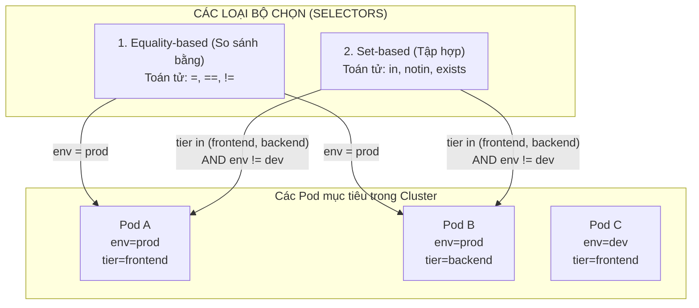

# Bài 07: Labels, Selectors & Annotations: Xương sống định tuyến

## 1. Thông tin bài học
* **Tên bài:** Bài 07: Labels, Selectors & Annotations: Xương sống định tuyến
* **Mục tiêu học:** Hiểu sâu sắc triết lý ghép nối lỏng lẻo (Loose Coupling) trong Kubernetes; làm chủ cách sử dụng `labels` để gắn nhãn metadata định danh; phân biệt thành thạo giữa hai loại bộ chọn **Equality-based** và **Set-based selectors**; phân biệt rạch ròi sự khác nhau giữa `labels` và `annotations`; tự tay gắn nhãn, lọc tìm tài nguyên bằng dòng lệnh và điều phối Pod vào đúng node mong muốn bằng `nodeSelector`.
* **Thời lượng ước tính:** 90 phút (45 phút lý thuyết, 45 phút thực hành)
* **Kiến thức cần có trước:** Bài 04 (Thao tác kubectl cơ bản), Bài 06 (Pod: Đơn vị tính toán nguyên tử).
* **Liên quan kỳ thi:** CKAD, CKA (Kỹ năng cốt lõi xuất hiện trong mọi bài thi: lọc tài nguyên với `-l`, gắn nhãn với `kubectl label`, cấu hình selector cho Service/Deployment, ghim Pod lên node qua `nodeSelector`).

---

## 2. Bảng thuật ngữ

| Thuật ngữ | Giải thích đơn giản | Ví dụ / Ẩn dụ đời thường |
| :--- | :--- | :--- |
| **Labels (Nhãn dán)** | Cặp khóa - giá trị (`key: value`) gắn vào tài nguyên để định danh, phân nhóm và tìm kiếm. | Thẻ tên hoặc nhãn mác dán trên hộp sản phẩm: `loai: sua`, `vi: dau`. |
| **Label Selector (Bộ chọn nhãn)** | Tiêu chí hoặc bộ lọc dùng để gom các tài nguyên có nhãn tương ứng lại với nhau. | Bộ lọc tìm kiếm trên sàn thương mại điện tử: "Tìm các sản phẩm có màu đỏ VÀ giá dưới 500k". |
| **Equality-based Selector** | Bộ chọn dựa trên phép so sánh bằng hoặc khác (`=`, `==`, `!=`). | Bộ lọc: "Chỉ chọn xe có màu BẰNG màu xanh". |
| **Set-based Selector** | Bộ chọn mạnh mẽ hơn, dựa trên phép kiểm tra tập hợp (`in`, `notin`, `exists`). | Bộ lọc: "Chọn những người ở trong TẬP HỢP (Hà Nội, Đà Nẵng, TP.HCM)". |
| **Annotations (Ghi chú)** | Cặp khóa - giá trị dùng để lưu thông tin phi nhận diện (không dùng để lọc), thường chứa cấu hình cho công cụ bên thứ ba. | Mặt sau hộp sữa ghi: thông tin liên hệ nhà máy, mã vạch, số lô sản xuất (người mua không dùng để chọn hàng trên kệ). |
| **Ghép nối lỏng lẻo (Loose Coupling)** | Thiết kế kiến trúc trong đó các thành phần không chỉ định cứng địa chỉ của nhau mà tìm thấy nhau qua nhãn mác trừu tượng. | Khách gọi taxi qua ứng dụng: khách không gọi đích danh tài xế "anh Tuấn biển số 29A", mà chỉ yêu cầu "xe 4 chỗ ở quận Cầu Giấy". |

---

## 3. Bức tranh lớn: Vấn đề thực tế và ẩn dụ đời thường

### Nhắc lại bài trước
Ở Bài 06, chúng ta đã hiểu tại sao Kubernetes không chạy container trần mà bọc trong Pod, cấu tạo bên trong với Pause container giữ IP, và cách các container chia sẻ mạng qua `localhost`. Tuy nhiên, trong một hệ thống thực tế như Google Online Boutique, bạn sẽ có hàng chục, thậm chí hàng ngàn Pod chạy cùng lúc. Các Pod này liên tục sinh ra, chết đi và đổi IP ngẫu nhiên. Làm sao bộ cân bằng tải (Service) biết cần chuyển request đến những Pod nào? Làm sao người quản trị tìm kiếm nhanh một nhóm Pod giữa "rừng" tài nguyên? Câu trả lời nằm ở **Labels & Selectors**.

### Tại sao cần cái này ở production? (Vấn đề thực tế)
Trong các kiến trúc phần mềm cũ, các hệ thống thường liên kết chặt chẽ (Tight Coupling) bằng địa chỉ cứng:
* Web server được cấu hình trỏ cứng tới IP: `192.168.1.50` và `192.168.1.51`.
* Khi một máy chủ bị cháy card mạng hoặc nâng cấp phần cứng, kỹ sư phải mở file cấu hình của hàng chục dịch vụ liên quan để sửa lại IP mới bằng tay.

Trong Kubernetes, Pod có tính chất phù du (ephemeral) - chúng có thể biến mất bất kỳ lúc nào và tái sinh ở một máy chủ khác với một địa chỉ IP hoàn toàn mới. Nếu sử dụng liên kết cứng theo IP hay tên Pod cụ thể, toàn bộ hệ thống phân tán sẽ sụp đổ.

Kubernetes giải quyết triệt để bài toán này bằng cơ chế **Ghép nối lỏng lẻo (Loose Coupling)**:
* Người triển khai chỉ việc dán nhãn lên Pod: `app=frontend, env=production`.
* Bộ cân bằng tải chỉ việc tuyên bố: *"Tôi không quan tâm các bạn là ai, đang mang IP nào, nằm ở máy chủ nào; hễ ai có nhãn `app=frontend` và `env=production` thì tôi sẽ tự động chuyển traffic tới người đó!"*.

Nếu một Pod chết đi, Pod mới sinh ra mang đúng nhãn đó sẽ ngay lập tức được hệ thống tự động nhận diện và hòa mạng trong vòng vài mili-giây mà không cần sửa đổi bất kỳ dòng cấu hình nào!

### Ẩn dụ đời thường: Siêu thị và Thẻ phân loại hành lý

1. **Siêu thị và Nhãn hàng hóa:**
   * Bạn bước vào một siêu thị lớn để mua táo tươi.
   * Bạn không cần biết người nông dân nào đã hái quả táo đó vào thứ mấy, quả táo nằm ở vị trí tọa độ nào trong kho.
   * Bạn chỉ cần nhìn vào **Nhãn mác (Labels)** dán trên bao bì: `loai: hoa-qua`, `ten: tao-my`, `xuat-xu: nhap-khau`.
   * Khách hàng dùng **Bộ lọc (Selector)**: *"Lấy cho tôi tất cả các gói có `loai == hoa-qua` VÀ `xuat-xu == nhap-khau`"*.
   * Còn thông tin chi tiết như: giấy phép kiểm dịch thực vật, số hiệu lô hàng của hải quan (những thứ người mua không dùng để chọn hoa quả nhưng cơ quan kiểm tra cần xem) được in ở mặt đáy thùng hàng $\rightarrow$ Đây chính là **Annotations**.

2. **Thẻ hành lý ở sân bay:**
   * Khi bạn gửi hành lý tại quầy check-in, nhân viên dán lên vali một chiếc thẻ nhỏ ghi: `flight: VN250`, `class: business`.
   * Nhân viên bốc xếp dưới đường băng không cần đọc tên bạn, họ chỉ dùng máy quét (Selector) gom toàn bộ các kiện vali có nhãn `flight = VN250` đưa lên khoang hàng của chuyến bay đó.

---

## 4. Giải thích khái niệm theo từng bước

### Bước 1: Giải phẫu cấu trúc Labels
Một Label là một cặp khóa - giá trị (`key: value`) được khai báo trong khối `metadata.labels` của bất kỳ tài nguyên nào (Pod, Node, Service, v.v.).

```yaml
metadata:
  labels:
    app.kubernetes.io/name: frontend
    environment: production
    tier: web
    version: v1.4.2
```

**Quy chuẩn đặt tên khóa (Key Syntax):**
* Khóa có thể có 2 phần: `[prefix/]name`.
* **Prefix (Tùy chọn):** Phải là một tên miền DNS (tối đa 253 ký tự), ví dụ: `app.kubernetes.io/` hoặc `company.com/`. Các prefix không có tên miền được hiểu là nhãn riêng của người dùng.
* **Name (Bắt buộc):** Tối đa **63 ký tự**, chỉ chứa chữ cái thường, số, dấu gạch ngang (`-`), gạch dưới (`_`), và dấu chấm (`.`), phải bắt đầu và kết thúc bằng chữ hoặc số.
* **Value:** Cũng tối đa 63 ký tự và tuân theo quy tắc như Name.

> **Quy chuẩn nhãn khuyến nghị của Kubernetes (Recommended Labels):**
> Cộng đồng Kubernetes đưa ra bộ nhãn chuẩn bắt đầu bằng tiền tố `app.kubernetes.io/` để các công cụ tự động hóa dễ dàng quản lý:
> * `app.kubernetes.io/name`: Tên ứng dụng (ví dụ: `online-boutique-frontend`).
> * `app.kubernetes.io/instance`: Tên phiên bản triển khai (ví dụ: `frontend-prod-01`).
> * `app.kubernetes.io/version`: Phiên bản ứng dụng (ví dụ: `v2.1.0`).
> * `app.kubernetes.io/component`: Thành phần kiến trúc (ví dụ: `ui`, `database`, `cache`).
> * `app.kubernetes.io/part-of`: Thuộc về hệ thống lớn nào (ví dụ: `e-commerce-system`).

### Bước 2: Hai loại Label Selectors (Bộ chọn nhãn)



#### 1. Equality-based Selector (Dựa trên đẳng thức)
Sử dụng các toán tử: `=`, `==` (bằng), và `!=` (khác).
* `environment = production`: Chọn tài nguyên có nhãn `environment` mang giá trị `production`.
* `tier != frontend`: Chọn tài nguyên có nhãn `tier` khác `frontend` (hoặc không có nhãn `tier`).
* Ghép nhiều điều kiện bằng dấu phẩy (tương đương phép **AND**):
  `environment = production,tier = frontend`

#### 2. Set-based Selector (Dựa trên tập hợp)
Mạnh mẽ hơn, cho phép lọc theo danh sách và sự tồn tại của khóa:
* **`in`:** Khóa phải có giá trị nằm trong tập hợp cho trước.
  Ví dụ: `environment in (production, staging)`
* **`notin`:** Khóa không được có giá trị nằm trong tập hợp.
  Ví dụ: `tier notin (database, cache)`
* **Tồn tại khóa (Key existence):** Chỉ cần có khóa đó xuất hiện, không quan tâm giá trị là gì.
  Ví dụ: `partition` (chọn mọi Pod có gắn nhãn mang tên khóa là `partition`).
* **Không tồn tại khóa:** Dùng dấu chấm than trước khóa.
  Ví dụ: `!canary` (chọn các Pod không hề bị dán nhãn `canary`).

### Bước 3: Phân biệt rõ ràng giữa Labels và Annotations
Nhiều người mới bắt đầu nhầm lẫn giữa hai khái niệm này vì chúng đều khai báo dạng `key: value`. Bảng dưới đây phân định ranh giới rạch ròi:

| Tiêu chí | Labels | Annotations |
| :--- | :--- | :--- |
| **Mục đích chính** | **Định danh, phân nhóm và lọc tìm kiếm** tài nguyên trong cluster. | **Lưu trữ siêu dữ liệu (metadata) phi nhận diện**, dùng để ghi chú hoặc cấu hình công cụ. |
| **Có dùng để lọc được không?** | **CÓ**. Hỗ trợ lọc qua Label Selectors (`kubectl get -l`). | **KHÔNG**. Kubernetes không hỗ trợ tìm kiếm tài nguyên qua Annotations. |
| **Giới hạn kích thước** | Bị siết chặt nghiêm ngặt (tối đa **63 ký tự** cho giá trị). | Dung lượng thoải mái hơn rất nhiều (có thể chứa chuỗi JSON, XML dài hàng chục KB). |
| **Đối tượng sử dụng** | Người quản trị (`kubectl`), Kubernetes Service, Controller, Scheduler. | Công cụ bên thứ ba (Ingress Controller, Prometheus, Istio, GitOps ArgoCD). |
| **Ví dụ thực tế** | `app: frontend`, `env: prod`, `version: v1` | `nginx.ingress.kubernetes.io/proxy-body-size: "50m"`, `git.commit: "a1b2c3d4"`, `contact: "admin@company.com"` |

---

## 5. Thực hành (Lab)

Chúng ta sẽ tạo một nhóm Pod giả lập các microservice của Google Online Boutique với các nhãn môi trường và phiên bản khác nhau, sau đó thực hành lọc tìm và thao tác với Labels/Annotations trên PowerShell.

* **Môi trường:** Cluster kind `lab` (1 control-plane + 1 worker).
* **Mức RAM ước tính:** Khoảng **~80MB RAM** (cực kỳ nhẹ nhàng).

### Bước 1: Triển khai 3 Pod với các nhãn khác nhau
Tạo file manifest `boutique-pods.yaml` chứa 3 Pod:
1. `boutique-frontend-v1`: Nhãn `app=frontend, env=prod, version=v1`
2. `boutique-frontend-canary`: Nhãn `app=frontend, env=canary, version=v2`
3. `boutique-cart`: Nhãn `app=cart, env=prod, tier=backend`

Chạy script tạo file trên PowerShell:
```powershell
@'
apiVersion: v1
kind: Pod
metadata:
  name: boutique-frontend-v1
  labels:
    app: frontend
    env: prod
    version: v1
spec:
  containers:
    - name: web
      image: nginx:alpine
---
apiVersion: v1
kind: Pod
metadata:
  name: boutique-frontend-canary
  labels:
    app: frontend
    env: canary
    version: v2
spec:
  containers:
    - name: web
      image: nginx:alpine
---
apiVersion: v1
kind: Pod
metadata:
  name: boutique-cart
  labels:
    app: cart
    env: prod
    tier: backend
spec:
  containers:
    - name: cart
      image: nginx:alpine
'@ | Set-Content -Path .\boutique-pods.yaml -Encoding UTF8

# Áp dụng manifest vào cluster
k apply -f .\boutique-pods.yaml
```

**Kết quả mong đợi (Expected Output):**
```text
pod/boutique-frontend-v1 created
pod/boutique-frontend-canary created
pod/boutique-cart created
```

### Bước 2: Hiển thị và lọc danh sách Pod theo Labels
Xem toàn bộ Pod kèm theo nhãn của chúng bằng cờ `--show-labels`:

```powershell
k get pods --show-labels
```

**Kết quả mong đợi (Expected Output):**
```text
NAME                       READY   STATUS    RESTARTS   AGE   LABELS
boutique-cart              1/1     Running   0          15s   app=cart,env=prod,tier=backend
boutique-frontend-canary   1/1     Running   0          15s   app=frontend,env=canary,version=v2
boutique-frontend-v1       1/1     Running   0          15s   app=frontend,env=prod,version=v1
```

Bây giờ, hãy thực hành các câu lệnh lọc (Selector) với cờ `-l`:

1. **Lọc Equality-based: Tìm các Pod thuộc ứng dụng frontend:**
   ```powershell
   k get pods -l app=frontend
   ```
   *Kết quả:* Trả về 2 Pod `boutique-frontend-v1` và `boutique-frontend-canary`.

2. **Lọc kết hợp (AND): Tìm frontend chạy ở môi trường production:**
   ```powershell
   k get pods -l "app=frontend,env=prod"
   ```
   *Kết quả:* Chỉ trả về đúng 1 Pod `boutique-frontend-v1`.

3. **Lọc Set-based: Tìm các Pod có môi trường nằm trong tập hợp (prod, canary):**
   ```powershell
   k get pods -l "env in (prod, canary)"
   ```
   *Kết quả:* Cả 3 Pod đều được chọn.

4. **Lọc theo sự tồn tại của khóa: Tìm các Pod có gắn nhãn `tier`:**
   ```powershell
   k get pods -l tier
   ```
   *Kết quả:* Chỉ trả về `boutique-cart` (vì 2 Pod kia không có khóa `tier`).

### Bước 3: Gắn thêm và sửa đổi nhãn trực tiếp bằng dòng lệnh
Trong vận hành thực tế, bạn có thể gắn thêm nhãn cho một Pod đang chạy mà không cần khởi động lại nó:

```powershell
# Gắn thêm nhãn team=sales cho Pod boutique-cart
k label pod boutique-cart team=sales

# Kiểm tra lại nhãn của Pod
k get pod boutique-cart --show-labels
```

Thử sửa đổi một nhãn đã có sẵn mà không có cờ `--overwrite`:
```powershell
# Sửa nhãn env từ prod thành staging
k label pod boutique-cart env=staging
```

**Kết quả mong đợi (Expected Error):**
```text
error: 'env' already has a value (prod), and --overwrite is false
```

> **Cách sửa đúng:** Bắt buộc phải thêm cờ `--overwrite` để xác nhận việc ghi đè:
```powershell
k label pod boutique-cart env=staging --overwrite
```

Để xóa một nhãn, chỉ cần thêm dấu trừ (`-`) vào sau tên khóa:
```powershell
# Xóa nhãn team khỏi Pod
k label pod boutique-cart team-
```

### Bước 4: Thao tác với Annotations
Gắn ghi chú lưu vết mã commit Git và người phụ trách cho Pod `boutique-frontend-v1`:

```powershell
k annotate pod boutique-frontend-v1 build.git.commit="e7f89ab" maintainer="tuan-platform@company.com"
```

Xem nội dung annotations đã gắn bằng lệnh `describe`:
```powershell
k describe pod boutique-frontend-v1 | Select-String "Annotations:" -Context 0,2
```

**Kết quả mong đợi (Expected Output):**
```text
Annotations:      build.git.commit: e7f89ab
                  maintainer: tuan-platform@company.com
```

### Bước 5: Ghim Pod vào Worker Node bằng `nodeSelector`
Đây là tính năng thực chiến cực kỳ quan trọng: điều khiển Scheduler đặt Pod lên đúng máy chủ mong muốn thông qua nhãn của Node!

1. Gắn một nhãn đặc biệt lên node công nhân `lab-worker`:
   ```powershell
   k label node lab-worker disktype=ssd
   ```
2. Tạo một Pod yêu cầu bắt buộc phải chạy trên máy có ổ đĩa SSD bằng file `ssd-pod.yaml`:
   ```powershell
   @'
   apiVersion: v1
   kind: Pod
   metadata:
     name: ssd-app
   spec:
     nodeSelector:
       disktype: ssd
     containers:
       - name: app
         image: nginx:alpine
   '@ | Set-Content -Path .\ssd-pod.yaml -Encoding UTF8

   k apply -f .\ssd-pod.yaml
   ```
3. Kiểm tra xem Pod được đặt lên node nào:
   ```powershell
   k get pod ssd-app -o wide
   ```

**Kết quả mong đợi (Expected Output):**
```text
NAME      READY   STATUS    RESTARTS   AGE   IP           NODE
ssd-app   1/1     Running   0          10s   10.244.1.6   lab-worker
```
Pod `ssd-app` đã được Scheduler tự động chọn và ghim chặt lên đúng node `lab-worker` nhờ bộ chọn `nodeSelector: disktype=ssd`!

### Bước 6: Dọn dẹp tài nguyên (Cleanup)
Xóa toàn bộ các Pod và file thử nghiệm, gỡ nhãn đã gắn trên node:

```powershell
k delete -f .\boutique-pods.yaml
k delete -f .\ssd-pod.yaml
k label node lab-worker disktype-
Remove-Item -Path .\boutique-pods.yaml, .\ssd-pod.yaml
```

---

## 6. Lỗi thường gặp và cách debug

### Lỗi 1: Service không thể chuyển tiếp traffic tới Pod (Endpoints rỗng)
* **Dấu hiệu:** Bạn tạo một Service để cân bằng tải cho các Pod, nhưng khi gọi vào Service thì báo lỗi không có phản hồi. Kiểm tra `kubectl get endpoints <ten-service>` thấy cột `ENDPOINTS` hiển thị `<none>`.
* **Nguyên nhân cốt lõi:** Lỗi đánh máy sai tên nhãn (Typo). Ví dụ Pod khai báo nhãn `app: Frontend` (chữ F viết hoa), nhưng Service Selector lại khai báo `app: frontend` (chữ f viết thường). **Kubernetes phân biệt hoa/thường (case-sensitive) 100%!**
* **Cách debug:**
  Đối chiếu nhãn của Pod và selector của Service:
  ```powershell
  k get pods --show-labels
  k describe service <ten-service> | Select-String "Selector:"
  ```

### Lỗi 2: Nhãn bị từ chối do vi phạm quy chuẩn ký tự
* **Dấu hiệu:** Terminal báo lỗi `spec.metadata.labels: Invalid value: "...": a valid label must be 63 characters or less`.
* **Nguyên nhân:** Đặt tên khóa hoặc giá trị quá 63 ký tự, hoặc chứa các ký tự cấm như khoảng trắng, dấu phẩy, dấu gạch chéo ngược (`\`), `@`, `#`.
* **Cách sửa:** Rút ngắn nhãn dưới 63 ký tự và chỉ sử dụng các ký tự hợp lệ (`a-z`, `0-9`, `-`, `_`, `.`).

### Lỗi 3: Pod bị kẹt ở trạng thái `Pending` do cấu hình sai `nodeSelector`
* **Dấu hiệu:** Pod tạo ra đứng yên ở `Pending`, `k describe pod` báo cảnh báo `0/2 nodes are available: 2 node(s) didn't match Pod's node selector`.
* **Nguyên nhân:** Khối `nodeSelector` yêu cầu một nhãn không hề tồn tại trên bất kỳ node nào trong cluster (ví dụ ghi nhầm `disktype=hhd` thay vì `ssd`).
* **Cách khắc phục:** Kiểm tra lại nhãn của các node bằng lệnh `k get nodes --show-labels` và sửa lại file manifest của Pod cho khớp.

---

## 7. Góc nhìn Senior

### 1. Sự đánh đổi (Trade-offs)
* **Tự do đặt nhãn vs Quản trị phân quyền nhãn (Label Governance):**
  * Nhãn mác trong Kubernetes có tính linh hoạt cực cao, bất kỳ ai có quyền tạo tài nguyên đều có thể tự do đặt nhãn.
  * *Mặt trái tại Production:* Nếu không có quy chuẩn thống nhất toàn công ty, mỗi lập trình viên sẽ đặt nhãn theo một kiểu: người đặt `app: boutique`, người đặt `application: boutique`, người đặt `name: boutique`. Hậu quả là các công cụ giám sát tập trung (Prometheus), công cụ thống kê chi phí đám mây (Kubecost) và hệ thống phân quyền an ninh mạng (NetworkPolicy) sẽ hoàn toàn bị mù, không thể nhóm dữ liệu chính xác.
  * *Giải pháp của Senior:* Ban hành bộ quy chuẩn nhãn bắt buộc (Label Governance Policy) và sử dụng công cụ kiểm duyệt tự động (như **Kyverno** hoặc **OPA Gatekeeper**) để tự động từ chối bất kỳ ai deploy manifest thiếu các nhãn quy định.

### 2. Best practices tại production
* **4 bộ nhãn sống còn bắt buộc phải có cho mọi tài nguyên ở Production:**
  1. **Nhận diện hệ thống:** `app.kubernetes.io/name` và `app.kubernetes.io/version`.
  2. **Môi trường:** `environment: production` hoặc `environment: staging`.
  3. **Quản trị chi phí (FinOps):** `cost-center: e-commerce` hoặc `team: platform`.
  4. **Người chịu trách nhiệm (Ownership):** `owner: team-billing` hoặc `contact: oncall-team`.
* **Sử dụng Annotations để tích hợp công cụ tự động hóa:**
  * Dùng annotation để báo cho Prometheus tự động cào metrics mà không cần cấu hình thủ công:
    `prometheus.io/scrape: "true"`, `prometheus.io/port: "8080"`.
  * Dùng annotation để chỉ đạo Ingress Controller cấp chứng chỉ SSL miễn phí từ Let's Encrypt:
    `cert-manager.io/cluster-issuer: "letsencrypt-prod"`.

### 3. Câu hỏi phỏng vấn Senior
* **Câu hỏi 1:** *"Trong cấu hình Deployment của Kubernetes, giải thích sự khác biệt giữa trường `metadata.labels` và trường `spec.template.metadata.labels`. Điều gì sẽ xảy ra nếu `spec.selector.matchLabels` không khớp với `spec.template.metadata.labels`?"*
  * **Gợi ý trả lời chuẩn:**
    * **`metadata.labels`:** Là nhãn dán cho chính đối tượng Deployment đó (dùng để tìm kiếm Deployment).
    * **`spec.template.metadata.labels`:** Là nhãn sẽ được dán lên **các Pod con** mà Deployment này tạo ra.
    * **Khi không khớp:** Nếu `spec.selector.matchLabels` không khớp hoàn toàn với `spec.template.metadata.labels`, Kube-APIServer sẽ **từ chối yêu cầu ngay lập tức với lỗi Validation Error**. Đây là cơ chế tự bảo vệ của Kubernetes để ngăn chặn tình trạng oái oăm: Deployment vừa sinh ra các Pod con nhưng bộ chọn lại không nhận diện được chúng, dẫn đến việc Deployment liên tục sinh Pod mới trong vô vọng!
* **Câu hỏi 2:** *"So sánh sự khác nhau về mặt ngữ nghĩa và khả năng hỗ trợ giữa `matchLabels` và `matchExpressions` trong cấu hình Pod Selector."*
  * **Gợi ý trả lời chuẩn:**
    * **`matchLabels`:** Thực hiện lọc theo cơ chế **Equality-based**. Nhận vào một danh sách các cặp khóa-giá trị, tương đương với phép so sánh bằng (`key = value`) kết hợp logic `AND`.
    * **`matchExpressions`:** Thực hiện lọc theo cơ chế **Set-based**. Cho phép sử dụng các toán tử tập hợp phức tạp hơn: `In`, `NotIn`, `Exists`, `DoesNotExist`. Ví dụ: cho phép chọn các Pod có nhãn `environment` mang giá trị là `prod` HOẶC `canary` thông qua biểu thức `{key: environment, operator: In, values: [prod, canary]}`.

---

## 8. Tóm tắt bài học
* 📌 **1.** **Labels** là cơ chế định danh duy nhất giúp Kubernetes thực hiện kiến trúc **Ghép nối lỏng lẻo (Loose Coupling)** giữa các đối tượng.
* 📌 **2.** **Label Selectors** gồm 2 loại: **Equality-based** (so sánh bằng/khác `=, !=`) và **Set-based** (tập hợp `in, notin, exists`).
* 📌 **3.** **Labels** dùng để nhận diện và lọc tìm kiếm; trong khi **Annotations** dùng để lưu trữ cấu hình và metadata phi nhận diện cho các công cụ mở rộng.
* 📌 **4.** Dùng lệnh `kubectl label` để gắn nhãn động, nhớ thêm cờ `--overwrite` nếu muốn sửa giá trị nhãn đã có.
* 📌 **5.** **`nodeSelector`** tận dụng nhãn của Worker Node để điều khiển bộ lập lịch Scheduler ghim Pod vào đúng máy chủ phần cứng mong muốn.

---

## 9. Bài tập tự làm

* 🟢 **Mức Dễ:** Khởi động một Pod Nginx bằng lệnh `k run my-web --image=nginx:alpine`. Sau đó dùng dòng lệnh `k label` để gắn 2 nhãn: `env=dev` và `tier=frontend`. Dùng lệnh `k get pods -l env=dev` để kiểm tra kết quả lọc.
* 🟡 **Mức Vừa:** Liệt kê toàn bộ các Pod đang chạy trong namespace `kube-system` mà **KHÔNG** thuộc thành phần `kube-proxy` bằng cách sử dụng toán tử lọc nhãn `!=` hoặc `notin`.
* 🔴 **Mức Khó (Troubleshooting CKA):** Tạo một Pod với `nodeSelector: gpu=true`. Quan sát trạng thái của Pod. Sau đó, không được sửa file cấu hình của Pod, hãy dùng lệnh `kubectl label` thích hợp để "giải cứu" Pod khỏi trạng thái `Pending` và chuyển sang `Running` thành công.

---

## 10. Câu hỏi tự kiểm tra

1. Một nhãn Label trong Kubernetes có thể lưu trữ một chuỗi ký tự văn bản dài 500 ký tự được không? Tại sao?
2. Trong câu lệnh lọc `kubectl get pods -l "env=prod,tier=backend"`, dấu phẩy giữa hai điều kiện biểu thị phép toán logic nào (AND hay OR)?
3. Nếu bạn muốn tìm toàn bộ các Pod có gắn nhãn mang khóa `canary` bất kể giá trị của nó là gì, bạn sẽ dùng cú pháp bộ chọn nào?
4. Tại sao chúng ta không thể dùng lệnh `kubectl get pods` với cờ lọc annotations?
5. Trường nào trong file manifest của Pod cho phép điều hướng Pod chạy trên các node có gắn nhãn cụ thể?
6. Khi bạn dùng lệnh `kubectl label pod my-pod env-`, dấu trừ ở cuối có ý nghĩa là gì?

<details>
<summary>👉 Bấm vào đây để xem đáp án câu hỏi tự kiểm tra</summary>

* **Đáp án 1:** **Không thể**. Giá trị của một Label bị giới hạn tối đa không quá **63 ký tự**. Nếu muốn lưu dữ liệu dài hơn, bắt buộc phải dùng **Annotations**.
* **Đáp án 2:** Biểu thị phép toán logic **AND** (Pod bắt buộc phải thỏa mãn đồng thời cả hai điều kiện).
* **Đáp án 3:** Dùng cú pháp Set-based kiểm tra sự tồn tại của khóa: `kubectl get pods -l canary`.
* **Đáp án 4:** Vì kiến trúc của Kubernetes không lập chỉ mục (index) cho Annotations trong cơ sở dữ liệu `etcd` để phục vụ việc truy vấn lọc; Annotations chỉ được thiết kế để đọc khi tải toàn bộ đối tượng về.
* **Đáp án 5:** Trường **`spec.nodeSelector`**.
* **Đáp án 6:** Có ý nghĩa là **xóa nhãn** `env` khỏi Pod đó.
</details>

---

## 11. Tài liệu đọc thêm và bài tiếp theo

### Tài liệu tham khảo
* [Tài liệu chính thức Kubernetes: Labels and Selectors](https://kubernetes.io/docs/concepts/overview/working-with-objects/labels/)
* [Tài liệu chính thức Kubernetes: Recommended Labels Standard](https://kubernetes.io/docs/concepts/overview/working-with-objects/common-labels/)
* [Tài liệu chính thức Kubernetes: Annotations](https://kubernetes.io/docs/concepts/overview/working-with-objects/annotations/)
* [Tài liệu chính thức Kubernetes: Assigning Pods to Nodes using nodeSelector](https://kubernetes.io/docs/concepts/scheduling-eviction/assign-pod-node/)

### Bài tiếp theo
👉 **Bài 08: ReplicaSet: Đảm bảo số lượng bản sao**

---

## PHỤ LỤC: ĐÁP ÁN GỢI Ý BÀI TẬP TỰ LÀM (MỤC 9)

### Đáp án Mức Dễ
```powershell
# 1. Chạy Pod
k run my-web --image=nginx:alpine

# 2. Gắn nhãn
k label pod my-web env=dev tier=frontend

# 3. Lọc kiểm tra
k get pods -l env=dev --show-labels
```

### Đáp án Mức Vừa
Lọc trong namespace `kube-system` loại trừ `kube-proxy`:
```powershell
k get pods -n kube-system -l 'k8s-app != kube-proxy'
```
Hoặc dùng cú pháp `notin`:
```powershell
k get pods -n kube-system -l 'k8s-app notin (kube-proxy)'
```

### Đáp án Mức Khó
1. Khi tạo Pod yêu cầu `nodeSelector: gpu=true`:
   Pod sẽ bị kẹt ở trạng thái **`Pending`** vì cả 2 node trong cụm (`lab-control-plane` và `lab-worker`) đều không có nhãn `gpu=true`.
2. Để giải cứu Pod mà không sửa file cấu hình của Pod, ta chỉ cần gắn đúng nhãn đó vào worker node:
   ```powershell
   k label node lab-worker gpu=true
   ```
3. Ngay lập tức, `kube-scheduler` nhận diện thấy `lab-worker` đã thỏa mãn điều kiện lọc (Filter), nó lập tức gán Pod vào node này và Pod chuyển sang trạng thái **`Running`**!
   Dọn dẹp: gỡ nhãn node bằng lệnh `k label node lab-worker gpu-`.

