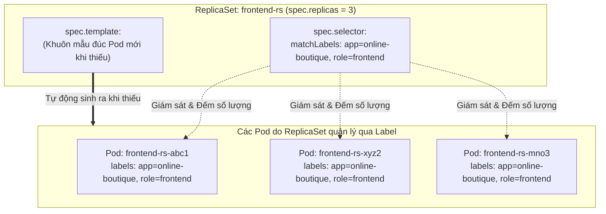

# Bài 08: ReplicaSet: Đảm bảo số lượng bản sao

## 1. Thông tin bài học
* **Tên bài:** Bài 08: ReplicaSet: Đảm bảo số lượng bản sao
* **Mục tiêu học:** Hiểu lý do cốt tử tại sao không bao giờ được chạy Pod trần (Naked Pod) ở môi trường production; nắm vững cấu tạo của tài nguyên ReplicaSet (`replicas`, `selector`, `template`); hiểu sâu sắc cơ chế sở hữu Pod qua nhãn (`ownerReferences`); thành thạo kỹ thuật co giãn số lượng bản sao và kỹ thuật "cách ly Pod" (Quarantine) để phục vụ gỡ lỗi mà không gây gián đoạn dịch vụ.
* **Thời lượng ước tính:** 90 phút (45 phút lý thuyết, 45 phút thực hành)
* **Kiến thức cần có trước:** Bài 06 (Pod: Đơn vị tính toán nguyên tử), Bài 07 (Labels, Selectors & Annotations).
* **Liên quan kỳ thi:** CKAD, CKA (Kiến thức nền móng bắt buộc: cơ chế điều phối bản sao, lệnh `kubectl scale`, hiểu luồng hoạt động của Deployment bên dưới nắp ca-pô).

---

## 2. Bảng thuật ngữ

| Thuật ngữ | Giải thích đơn giản | Ví dụ / Ẩn dụ đời thường |
| :--- | :--- | :--- |
| **ReplicaSet (RS)** | Bộ điều khiển đảm bảo luôn có đúng số lượng bản sao của một Pod đang chạy ở mọi thời điểm. | Người quản kho luôn giữ đúng 5 chiếc bánh dự trữ trên kệ; ai mua mất 1 chiếc thì nướng bù ngay 1 chiếc. |
| **Naked Pod (Pod trần)** | Pod được tạo đơn lẻ trực tiếp mà không được quản lý bởi bất kỳ Controller nào (như ReplicaSet hay Deployment). | Đứa trẻ lang thang không có người giám hộ; khi vấp ngã (bị chết) thì không có ai đến đỡ dậy hay thay thế. |
| **Replicas** | Số lượng bản sao mong muốn của Pod cần duy trì trong cụm. | Số lượng bảo vệ trực ca tối thiểu bắt buộc phải có tại tòa nhà (ví dụ: luôn cần 3 người). |
| **Pod Template** | Khuôn mẫu thiết kế định nghĩa Pod con sẽ trông như thế nào (image gì, port nào, nhãn gì). | Chiếc khuôn đúc bánh quy: dập xuống là cho ra hàng loạt chiếc bánh giống hệt nhau. |
| **OwnerReference** | Thuộc tính siêu dữ liệu gắn vào Pod con để khai báo ai là "cha đẻ" / người sở hữu hợp pháp của nó. | Giấy khai sinh ghi rõ tên cha mẹ của đứa trẻ. |
| **Pod Adoption (Nhận con nuôi)** | Hiện tượng ReplicaSet tự động nhận một Pod có sẵn làm con nếu Pod đó mang nhãn khớp với selector của nó. | Gia đình nhận một đứa trẻ thất lạc vào hộ khẩu vì đứa trẻ đó đeo chiếc thẻ tên gia đình. |

---

## 3. Bức tranh lớn: Vấn đề thực tế và ẩn dụ đời thường

### Nhắc lại bài trước
Ở Bài 07, chúng ta đã nắm vững "xương sống định tuyến" của Kubernetes là Labels & Selectors. Chúng ta đã biết cách dùng nhãn để phân loại tài nguyên và điều phối Pod vào đúng node mong muốn. Tuy nhiên, trong tất cả các bài trước (Bài 04, 06, 07), chúng ta đều tạo các **Pod trần (Naked Pod)**. Một câu hỏi lớn đặt ra: điều gì sẽ xảy ra với các Pod đó nếu máy chủ vật lý bị sập nguồn lúc nửa đêm?

### Tại sao cần cái này ở production? (Vấn đề thực tế)
Hãy hình dung bạn triển khai dịch vụ `frontend` của Google Online Boutique bằng lệnh tạo Pod trần: `kubectl run frontend --image=...`.

Pod này đang chạy vui vẻ trên Worker Node. Bỗng nhiên lúc 3 giờ sáng:
1. Worker Node bị rút nhầm dây nguồn, hoặc tiến trình Linux bên trong bị lỗi tràn bộ nhớ (OOMKilled).
2. Pod `frontend` chết ngắc.
3. Kubelet chết cùng node, API Server đánh dấu node đó là `NotReady`.

Và thảm họa diễn ra: **Không có bất kỳ ai tự động sinh lại Pod đó!** 
Tại sao? Bởi vì bạn chỉ bảo Kubernetes: *"Hãy chạy một Pod này"*, chứ bạn chưa hề ký một "hợp đồng bảo hiểm" yêu cầu: *"Hãy luôn duy trì 1 bản sao của dịch vụ này cho tôi bất kể điều gì xảy ra"*.

Chưa hết, khi mùa mua sắm Black Friday ập đến, lượng khách hàng tăng vọt gấp 5 lần. Với Pod trần, bạn phải tự tay ngồi gõ lệnh tạo thêm `frontend-2`, `frontend-3`, `frontend-4`, rồi khi hết mùa lại tự tay đi xóa từng cái một.

Môi trường production không thể vận hành thủ công như vậy. Chúng ta cần một "người giám hộ" tận tụy 24/7 có khả năng:
* **Tự động bù đắp (Auto-healing):** Nếu 1 bản sao chết, sinh ngay bản sao mới.
* **Tự động dọn dẹp:** Nếu có quá nhiều bản sao thừa thãi, tự động xóa bớt để tiết kiệm RAM/CPU.
* **Co giãn linh hoạt (Scaling):** Tăng từ 3 lên 10 bản sao chỉ bằng một thao tác duy nhất.

Đó chính là sứ mệnh lịch sử của **ReplicaSet**.

### Ẩn dụ đời thường: Khuôn đúc bánh quy và Đội thợ làm bánh

Hãy tưởng tượng bạn là chủ một tiệm bánh ngọt nổi tiếng:

1. **Pod Template** chính là **Chiếc khuôn đúc bánh bằng inox**:
   * Trên khuôn đã khắc sẵn: bánh hình ngôi sao, đường kính 5cm, rắc vừng bên trên (`image: nginx, port: 80, labels: app=frontend`).
2. **Replicas: 3** là mệnh lệnh kinh doanh của bạn:
   * *"Tại quầy trưng bày, trên chiếc đĩa này lúc nào cũng phải có ĐÚNG 3 CHIẾC BÁNH NGÔI SAO!"*.
3. **ReplicaSet Controller** là **Người thợ làm bánh chuyên nghiệp**:
   * Cứ mỗi 1 giây, người thợ lại liếc mắt nhìn vào đĩa (dùng **Label Selector** để đếm số bánh có hình ngôi sao):
     * **Tình huống 1 (Thiếu bánh):** Khách hàng vừa ăn mất 1 chiếc, trên đĩa chỉ còn 2 chiếc ($3 - 2 = 1$). Người thợ lập tức cầm chiếc khuôn inox dập thêm đúng 1 chiếc bánh mới đặt lên đĩa!
     * **Tình huống 2 (Thừa bánh):** Có một người thợ phụ vụng về đặt nhầm 1 chiếc bánh nữa lên đĩa thành 4 chiếc ($3 - 4 = -1$). Người thợ chính lập tức nhấc chiếc bánh thừa vứt vào sọt rác để giữ đúng tiêu chuẩn 3 chiếc!
     * **Tình huống 3 (Bánh bị chuột gặm):** Một chiếc bánh bị hỏng (Pod dính lỗi Crash). Người thợ gạt chiếc bánh hỏng đi và dập ngay chiếc mới thay thế.

Nhờ có người thợ làm bánh (ReplicaSet), quầy hàng của bạn luôn đảm bảo cung ứng liên tục cho khách mà bạn không cần phải đứng canh chừng từng giây.

---

## 4. Giải thích khái niệm theo từng bước

### Bước 1: Giải phẫu cấu trúc Manifest của ReplicaSet
Một ReplicaSet được định nghĩa bằng một file YAML chuẩn thuộc nhóm API `apps/v1`. Nó bao gồm 3 khối cấu tạo không thể tách rời:

```yaml
apiVersion: apps/v1
kind: ReplicaSet
metadata:
  name: frontend-rs
  labels:
    tier: frontend
spec:
  # 1. SỐ LƯỢNG BẢN SAO MONG MUỐN
  replicas: 3

  # 2. BỘ CHỌN (TIÊU CHÍ NHẬN DIỆN POD CON)
  selector:
    matchLabels:
      app: online-boutique
      role: frontend

  # 3. KHUÔN MẪU ĐỂ ĐÚC RA POD MỚI (POD TEMPLATE)
  template:
    metadata:
      labels:
        # BẮT BUỘC: Nhãn ở đây PHẢI khớp hoàn toàn với selector ở trên!
        app: online-boutique
        role: frontend
    spec:
      containers:
        - name: server
          image: nginx:alpine
          ports:
            - containerPort: 80
```



> **QUY TẮC SỐNG CÒN (Golden Rule):**
> Trường `spec.selector.matchLabels` **PHẢI khớp hoàn toàn** với trường `spec.template.metadata.labels`. Nếu bạn khai báo selector tìm `app: frontend` nhưng trong template lại dán nhãn `app: backend`, Kube-APIServer sẽ từ chối file YAML ngay lập tức với lỗi Validation Error để ngăn chặn việc ReplicaSet sinh ra Pod nhưng không nhận diện được chính con của mình.

### Bước 2: Vòng lặp điều hòa của ReplicaSet Controller
Bên trong `kube-controller-manager` (đã học ở Bài 05), có một tiến trình con gọi là **ReplicaSet Controller**. Tiến trình này hoạt động theo công thức toán học cực kỳ đơn giản:

$$\Delta = \text{Desired Replicas} - \text{Actual Matching Pods}$$

1. Nếu $\Delta > 0$ (Thiếu Pod): Controller gọi API Server tạo thêm $\Delta$ Pod mới bằng cách lấy thông tin từ khối `spec.template`.
2. Nếu $\Delta < 0$ (Thừa Pod): Controller chọn $|\Delta|$ Pod đang chạy để gửi lệnh tiêu hủy (ưu tiên tiêu hủy các Pod đang bị lỗi, chưa Ready, hoặc Pod mới sinh ra nhất).
3. Nếu $\Delta = 0$ (Cân bằng): Controller giữ nguyên trạng thái và tiếp tục lắng nghe sự kiện.

### Bước 3: Cơ chế "Nhận con nuôi" (Pod Adoption) & `ownerReferences`
ReplicaSet không quản lý Pod dựa trên tên Pod hay địa chỉ IP, mà **chỉ dựa duy nhất vào Labels**!
* Khi ReplicaSet tạo ra một Pod, nó tự động đóng dấu mã định danh của mình vào trường `metadata.ownerReferences` của Pod đó.
* **Hiện tượng Nhận con nuôi (Adoption):** Nếu có một Pod trần (Naked Pod) đã tồn tại từ trước trên cluster mà vô tình mang nhãn trùng khớp 100% với `matchLabels` của ReplicaSet, ReplicaSet sẽ lập tức "nhận" Pod đó vào đàn của mình, gắn `ownerReferences` vào nó và tính nó vào tổng số bản sao!
* Ngược lại, nếu bạn cố tình sửa nhãn của một Pod con khiến nhãn không còn khớp với selector, ReplicaSet sẽ "từ con" và ngay lập tức đúc một Pod mới để bù vào vị trí trống.

### Bước 4: Tại sao trong thực tế ta ít khi tạo trực tiếp ReplicaSet?
Mặc dù ReplicaSet cực kỳ hoàn hảo trong việc duy trì số lượng bản sao, nó lại có một **tử huyệt**: **Không thể cập nhật phiên bản ứng dụng (No Rolling Update support)**.

Nếu bạn sửa file YAML của ReplicaSet để đổi image từ `nginx:v1` sang `nginx:v2`:
* ReplicaSet sẽ ghi nhận template mới vào etcd.
* **NHƯNG NÓ SẼ KHÔNG LÀM GÌ CẢ với 3 Pod cũ đang chạy!** Vì số lượng Pod trên thực tế vẫn đang là 3, $\Delta = 3 - 3 = 0$. Nó sẽ không tự động tắt Pod v1 để bật Pod v2.
* Bạn phải tự tay xóa từng Pod cũ để nó đúc lại Pod mới theo template mới.

Để tự động hóa hoàn toàn quá trình nâng cấp không gián đoạn này, Kubernetes sinh ra một đối tượng cấp cao hơn đứng trên ReplicaSet: đó chính là **Deployment** (chúng ta sẽ chinh phục ở Bài 09). Tuy nhiên, Deployment thực chất chính là một "nhà quản lý" sai khiến các ReplicaSet bên dưới làm việc. Hiểu sâu ReplicaSet là chìa khóa để làm chủ Deployment!

---

## 5. Thực hành (Lab)

* **Môi trường:** Cluster kind `lab` (1 control-plane + 1 worker).
* **Mức RAM ước tính:** ~90MB đến 130MB RAM cho 3 bản sao Nginx (hoàn toàn an toàn).

### Bước 1: Khởi tạo ReplicaSet gồm 3 bản sao
Tạo file cấu hình `frontend-rs.yaml` trên PowerShell:

```powershell
@'
apiVersion: apps/v1
kind: ReplicaSet
metadata:
  name: boutique-frontend-rs
  labels:
    app: boutique-frontend
spec:
  replicas: 3
  selector:
    matchLabels:
      app: boutique-frontend
  template:
    metadata:
      labels:
        app: boutique-frontend
    spec:
      containers:
        - name: web
          image: nginx:alpine
          ports:
            - containerPort: 80
'@ | Set-Content -Path .\frontend-rs.yaml -Encoding UTF8

# Áp dụng manifest vào cluster
k apply -f .\frontend-rs.yaml
```

**Kết quả mong đợi (Expected Output):**
```text
replicaset.apps/boutique-frontend-rs created
```

Kiểm tra trạng thái của ReplicaSet:
```powershell
k get rs boutique-frontend-rs
```

**Kết quả mong đợi (Expected Output):**
```text
NAME                   DESIRED   CURRENT   READY   AGE
boutique-frontend-rs   3         3         3       15s
```
*(Ý nghĩa: `DESIRED` = 3 (mong muốn 3), `CURRENT` = 3 (hiện có 3), `READY` = 3 (sẵn sàng 3)).*

Kiểm tra 3 Pod do ReplicaSet sinh ra:
```powershell
k get pods -l app=boutique-frontend --show-labels
```

**Kết quả mong đợi (Expected Output):**
```text
NAME                         READY   STATUS    RESTARTS   AGE   LABELS
boutique-frontend-rs-7k8m2   1/1     Running   0          30s   app=boutique-frontend
boutique-frontend-rs-p4x9q   1/1     Running   0          30s   app=boutique-frontend
boutique-frontend-rs-v2j5t   1/1     Running   0          30s   app=boutique-frontend
```

### Bước 2: Khám phá thuộc tính `ownerReferences` của Pod con
Hãy soi sâu vào bên trong một Pod bất kỳ để chứng minh quyền sở hữu:

```powershell
# Lấy tên của 1 Pod con
$firstPod = (k get pods -l app=boutique-frontend -o jsonpath='{.items[0].metadata.name}')

# Xem khối ownerReferences
k get pod $firstPod -o jsonpath='{.metadata.ownerReferences[0]}' | ConvertFrom-Json | Format-List
```

**Kết quả mong đợi (Expected Output):**
```text
apiVersion : apps/v1
kind       : ReplicaSet
name       : boutique-frontend-rs
uid        : 8a1b2c3d-...
controller : True
```
Pod con xác nhận rõ ràng: Cha đẻ của tôi là ReplicaSet `boutique-frontend-rs`!

### Bước 3: Thử nghiệm cơ chế Tự chữa lành (Self-healing)
Hãy đóng vai một sự cố sập container, xóa đi 1 Pod bất kỳ:

```powershell
Write-Host "Đang tiêu diệt Pod: $firstPod"
k delete pod $firstPod

# Ngay lập tức kiểm tra lại danh sách Pod
k get pods -l app=boutique-frontend
```

**Kết quả mong đợi (Expected Output):**
```text
NAME                         READY   STATUS              RESTARTS   AGE
boutique-frontend-rs-p4x9q   1/1     Running             0          2m
boutique-frontend-rs-v2j5t   1/1     Running             0          2m
boutique-frontend-rs-w8z11   0/1     ContainerCreating   0          1s
```
> **Quan sát của Senior:** Pod cũ bị xóa đi, nhưng ngay lập tức một Pod mới toanh mang tên `boutique-frontend-rs-w8z11` được sinh ra ở trạng thái `ContainerCreating 1s` để đảm bảo số lượng bản sao luôn luôn bằng 3!

### Bước 4: Thực hành tuyệt chiêu "Cách ly Pod" (Quarantining) để debug
Đây là kỹ thuật thực chiến cực kỳ đắt giá mà các Senior Platform Engineer hay dùng khi có 1 Pod bị dính lỗi chập chờn trên production:

1. Đổi nhãn của một Pod con sang một nhãn khác:
   ```powershell
   $targetPod = (k get pods -l app=boutique-frontend -o jsonpath='{.items[0].metadata.name}')
   Write-Host "Cách ly Pod: $targetPod"
   k label pod $targetPod app=quarantine-debug --overwrite
   ```
2. Kiểm tra lại danh sách toàn bộ Pod:
   ```powershell
   k get pods --show-labels
   ```

**Kết quả mong đợi (Expected Output):**
```text
NAME                         READY   STATUS              RESTARTS   AGE   LABELS
boutique-frontend-rs-p4x9q   1/1     Running             0          4m    app=boutique-frontend
boutique-frontend-rs-v2j5t   1/1     Running             0          4m    app=boutique-frontend
boutique-frontend-rs-new99   0/1     ContainerCreating   0          2s    app=boutique-frontend
boutique-frontend-rs-w8z11   1/1     Running             0          2m    app=quarantine-debug
```

> **Điều kỳ diệu xảy ra:**
> 1. Pod bị lỗi (`...-w8z11`) **không hề bị xóa**, nó vẫn tiếp tục sống với nhãn `app=quarantine-debug` để bạn thoải mái gõ lệnh `k exec` vào kiểm tra log, mổ xẻ mã nguồn.
> 2. ReplicaSet thấy số lượng Pod mang nhãn `app=boutique-frontend` bị hụt mất 1, nó **tự động sinh ngay một Pod mới tinh (`...-new99`)** để phục vụ khách hàng! Khách hàng không hề nhận thấy sự gián đoạn!

### Bước 5: Co giãn số lượng bản sao (Scaling)
Bạn có thể tăng giảm số lượng bản sao tức thì mà không cần sửa file YAML bằng lệnh `kubectl scale`:

```powershell
# Scale lên 5 bản sao khi có tải cao
k scale rs boutique-frontend-rs --replicas=5
k get rs boutique-frontend-rs
```
*Kết quả:* Cột `DESIRED` và `CURRENT` lập tức nhảy lên 5.

```powershell
# Thu hồi về 2 bản sao để tiết kiệm tài nguyên
k scale rs boutique-frontend-rs --replicas=2
k get rs boutique-frontend-rs
```
*Kết quả:* Hệ thống tự động tiêu hủy 3 Pod thừa thãi, chỉ giữ lại đúng 2 Pods.

### Bước 6: Dọn dẹp tài nguyên (Cleanup)
Xóa ReplicaSet và Pod bị cách ly:

```powershell
k delete -f .\frontend-rs.yaml
k delete pod -l app=quarantine-debug
Remove-Item -Path .\frontend-rs.yaml
```

---

## 6. Lỗi thường gặp và cách debug

### Lỗi 1: `selector does not match template labels`
* **Dấu hiệu:** Khi chạy `kubectl apply`, terminal báo lỗi:
  `error: error validating "frontend-rs.yaml": error validating data: ValidationError(ReplicaSet.spec): selector does not match template labels`
* **Nguyên nhân:** Khối `spec.selector.matchLabels` khai báo một nhãn nhưng khối `spec.template.metadata.labels` lại khai báo một nhãn khác (hoặc bị sai chính tả).
* **Cách khắc phục:** Luôn đảm bảo tất cả các cặp key-value trong `matchLabels` đều xuất hiện chính xác 100% bên trong `template.metadata.labels`.

### Lỗi 2: Hiện tượng "Tranh chấp Pod" (Overlapping Selectors)
* **Dấu hiệu:** Bạn tạo 2 ReplicaSet khác nhau (RS-1 và RS-2), nhưng cả hai liên tục sinh ra rồi xóa Pod của nhau, số lượng Pod nhảy múa hỗn loạn (Pod thrashing).
* **Nguyên nhân cốt lõi:** Cả hai ReplicaSet đều dùng chung một bộ chọn nhãn quá chung chung (ví dụ cả hai đều dùng `matchLabels: {app: web}`). RS-1 thấy thừa Pod nên xóa bớt, RS-2 thấy thiếu Pod nên tạo thêm, tạo ra một cuộc chiến tranh giành quyền sở hữu vô tận!
* **Cách khắc phục:** Luôn phân tách nhãn rõ ràng cho từng tài nguyên cụ thể, kết hợp thêm các nhãn định danh duy nhất như `app.kubernetes.io/instance` hoặc `release`.

### Lỗi 3: Xóa ReplicaSet nhưng muốn giữ lại các Pod con
* **Dấu hiệu:** Muốn xóa đối tượng ReplicaSet nhưng không muốn các Pod con đang phục vụ người dùng bị chết theo.
* **Cách thực hiện:** Sử dụng cờ `--cascade=orphan`:
  ```powershell
  k delete rs boutique-frontend-rs --cascade=orphan
  ```
  Lệnh này sẽ xóa ReplicaSet nhưng "mồ côi hóa" (orphan) toàn bộ các Pod con, biến chúng thành các Naked Pod tiếp tục chạy mà không bị tiêu hủy.

---

## 7. Góc nhìn Senior

### 1. Sự đánh đổi (Trade-offs)
* **ReplicaSet vs Pod trần:**
  * Không có bất kỳ lý do gì để chạy Pod trần ở môi trường Production. Luôn luôn bọc Pod trong một Controller (ReplicaSet/Deployment/StatefulSet).
* **ReplicaSet vs Deployment:**
  * ReplicaSet kiểm soát số lượng cực tốt, nhưng hoàn toàn thụ động trước các thay đổi về phiên bản ứng dụng (image update).
  * Do đó, trong quy trình CI/CD và vận hành hiện đại, **kỹ sư Senior 100% khai báo Deployment thay vì khai báo trực tiếp ReplicaSet**. Deployment sẽ tự động quản lý vòng đời của nhiều ReplicaSet bên dưới để thực hiện các chiến lược cập nhật thông minh như Rolling Update hoặc Canary Release.

### 2. Best practices tại production
* **Luôn cấu hình `PodAntiAffinity` đi kèm với ReplicaSet nhiều bản sao:**
  * Nếu bạn tạo 3 bản sao nhưng cả 3 bản sao đều bị Scheduler ném chung vào một Worker Node duy nhất, thì tính năng Self-healing chẳng có ý nghĩa gì nếu chính chiếc máy chủ đó bị cháy phần cứng!
  * Ở các bài học sau (Bài 26), chúng ta sẽ kết hợp quy tắc chống đồng vị (`PodAntiAffinity`) để ép Kubernetes phải rải đều 3 bản sao sang 3 máy chủ vật lý hoặc 3 vùng khả dụng (Availability Zones) khác nhau.
* **Không bao giờ chỉnh sửa thủ công các Pod do ReplicaSet quản lý:**
  * Mọi thay đổi về cấu hình, biến môi trường, hay image phải được thực hiện trên file manifest ở cấp Controller, không bao giờ dùng lệnh `kubectl edit pod` trực tiếp lên từng Pod con vì mọi thay đổi sẽ bị xóa sổ ngay khi Pod đó được tái sinh.

### 3. Câu hỏi phỏng vấn Senior
* **Câu hỏi 1:** *"Điều gì sẽ xảy ra bên dưới tầng hệ thống khi bạn thực hiện xóa một ReplicaSet với cờ `--cascade=orphan` và sau đó tạo lại một ReplicaSet mới có selector trùng khớp hoàn toàn với nhãn của các Pod cũ?"*
  * **Gợi ý trả lời chuẩn:**
    1. Khi xóa với `--cascade=orphan`, Kube-APIServer xóa đối tượng ReplicaSet nhưng gỡ bỏ trường `metadata.ownerReferences` trên các Pod con, biến chúng thành các Naked Pods độc lập đang chạy bình thường.
    2. Khi bạn tạo lại một ReplicaSet mới có selector trùng khớp, **ReplicaSet Controller mới sẽ kích hoạt cơ chế Pod Adoption (Nhận con nuôi)**. Nó quét toàn bộ cluster, phát hiện các Pod cũ đang mang nhãn khớp với selector của nó và hiện chưa có chủ sở hữu hợp pháp.
    3. Nó lập tức cập nhật `ownerReferences` của các Pod đó trỏ về UID mới của nó, đếm chúng vào danh sách `Current Replicas` và **không cần tạo thêm bất kỳ Pod mới nào** nếu số lượng đã đủ!
* **Câu hỏi 2:** *"Tại sao Kubernetes lại thiết kế tách rời hai tầng trừu tượng Deployment và ReplicaSet riêng biệt thay vì gộp chung vào làm một đối tượng duy nhất?"*
  * **Gợi ý trả lời chuẩn:** Đây là tinh hoa của nguyên lý thiết kế **Đơn nhiệm (Single Responsibility Principle)** và khả năng **Quản lý lịch sử phiên bản (Version History & Rollback)**:
    * **ReplicaSet** chỉ chịu trách nhiệm duy nhất một việc: *Đảm bảo số lượng bản sao chính xác cho một phiên bản cụ thể*.
    * **Deployment** chịu trách nhiệm ở tầng cao hơn: *Quản lý quá trình chuyển giao giữa các phiên bản khác nhau*.
    * Khi bạn nâng cấp từ v1 lên v2, Deployment không xóa ReplicaSet v1. Nó tạo ra ReplicaSet v2, sau đó từ từ scale-down ReplicaSet v1 từ 3 về 0 song song với việc scale-up ReplicaSet v2 từ 0 lên 3. Nhờ giữ lại ReplicaSet v1 cũ ở trạng thái 0 bản sao, khi cần **Rollback khẩn cấp**, Deployment chỉ việc làm ngược lại trong 1 giây mà không cần tính toán lại cấu hình!

---

## 8. Tóm tắt bài học
* 📌 **1.** **Không bao giờ chạy Naked Pod ở Production**; luôn bọc Pod trong một Controller để đảm bảo khả năng tự phục hồi (Self-healing).
* 📌 **2.** **ReplicaSet** liên tục theo dõi và đảm bảo số lượng Pod thực tế luôn bằng số lượng bản sao mong muốn (`replicas`).
* 📌 **3.** Khối `spec.selector.matchLabels` bắt buộc phải **trùng khớp hoàn toàn** với khối `spec.template.metadata.labels`.
* 📌 **4.** Kỹ thuật **cách ly Pod (Quarantining)** bằng cách đổi nhãn giúp giữ lại Pod lỗi để điều tra trong khi ReplicaSet tự động sinh Pod mới thay thế cho người dùng.
* 📌 **5.** ReplicaSet không hỗ trợ Rolling Update; trong thực tế, chúng ta sử dụng **Deployment** để gián tiếp quản lý các ReplicaSet.

---

## 9. Bài tập tự làm

* 🟢 **Mức Dễ:** Viết một file manifest YAML tạo một ReplicaSet tên `cache-rs` chạy image `redis:alpine` với `replicas: 2`. Dùng lệnh `kubectl get rs` và `kubectl get pods` để xác nhận cả 2 Pod đã ở trạng thái `Running`.
* 🟡 **Mức Vừa:** Dùng lệnh `kubectl scale` để tăng số lượng bản sao của `cache-rs` lên 4. Sau đó dùng lệnh `kubectl scale` hạ xuống 1. Quan sát cách các Pod bị tiêu hủy.
* 🔴 **Mức Khó (Hiện tượng Pod Adoption):** 
  1. Tạo trước một Pod trần bằng lệnh `kubectl run orphan-web --image=nginx:alpine --labels="tier=backend,env=test"`.
  2. Viết một file ReplicaSet có `replicas: 2` và `selector.matchLabels` đúng bằng `tier=backend,env=test`.
  3. Deploy ReplicaSet này lên và giải thích tại sao ReplicaSet chỉ tạo thêm đúng 1 Pod mới thay vì tạo 2 Pods. Kiểm tra trường `ownerReferences` của Pod `orphan-web` để chứng minh nó đã được nhận làm con nuôi.

---

## 10. Câu hỏi tự kiểm tra

1. Nếu một Worker Node chứa 2 Pod của một ReplicaSet bị rút nguồn đột ngột, điều gì sẽ xảy ra với 2 Pod đó và ReplicaSet sẽ phản ứng thế nào?
2. Điều gì sẽ xảy ra nếu bạn sửa đổi image trong trường `spec.template` của một ReplicaSet đang chạy từ `nginx:alpine` sang `httpd:alpine`? Các Pod hiện tại có được đổi image không?
3. Tại sao trường `spec.selector.matchLabels` bắt buộc phải khớp với `spec.template.metadata.labels`?
4. Làm thế nào để xóa một ReplicaSet nhưng vẫn giữ nguyên tất cả các Pod con của nó tiếp tục chạy bình thường?
5. Câu lệnh dòng lệnh nào cho phép thay đổi số lượng bản sao của ReplicaSet `my-rs` lên 10 mà không cần sửa file YAML?
6. Trường thông tin nào trong metadata của Pod giúp Kubernetes nhận diện mối quan hệ cha-con giữa ReplicaSet và Pod?

<details>
<summary>👉 Bấm vào đây để xem đáp án câu hỏi tự kiểm tra</summary>

* **Đáp án 1:** Node bị đánh dấu `NotReady`. Sau một khoảng thời gian chờ (mặc định 5 phút hoặc khi node bị loại), Node Controller xác nhận Pod đã chết, ReplicaSet phát hiện thiếu 2 bản sao và lập tức phát lệnh tạo 2 Pod mới trên worker node khác còn sống để bù đắp.
* **Đáp án 2:** Các Pod hiện tại **HOÀN TOÀN KHÔNG BỊ ĐỔI IMAGE**! Chúng vẫn tiếp tục chạy `nginx:alpine`. ReplicaSet không có cơ chế tự cập nhật Pod cũ; template mới chỉ áp dụng cho các Pod được sinh ra trong tương lai.
* **Đáp án 3:** Để ngăn ngừa lỗi logic nghiêm trọng: nếu không khớp, ReplicaSet vừa tạo Pod mới ra sẽ ngay lập tức không nhận diện được Pod đó, dẫn đến việc nó tưởng thiếu Pod và liên tục sinh thêm Pod vô tận làm sập cluster.
* **Đáp án 4:** Sử dụng cờ mồ côi: `kubectl delete rs <ten-rs> --cascade=orphan`.
* **Đáp án 5:** Câu lệnh: `kubectl scale rs my-rs --replicas=10`.
* **Đáp án 6:** Trường **`metadata.ownerReferences`**.
</details>

---

## 11. Tài liệu đọc thêm và bài tiếp theo

### Tài liệu tham khảo
* [Tài liệu chính thức Kubernetes: ReplicaSet](https://kubernetes.io/docs/concepts/workloads/controllers/replicaset/)
* [Tài liệu chính thức Kubernetes: Pod Lifecycle & Controllers](https://kubernetes.io/docs/concepts/workloads/pods/pod-lifecycle/)
* [Hướng dẫn sử dụng kubectl scale: Scaling workloads](https://kubernetes.io/docs/reference/kubectl/generated/kubectl_scale/)

### Bài tiếp theo
👉 **Bài 09: Deployment: Quản lý triển khai và cập nhật không gián đoạn**

---

## PHỤ LỤC: ĐÁP ÁN GỢI Ý BÀI TẬP TỰ LÀM (MỤC 9)

### Đáp án Mức Dễ
```yaml
apiVersion: apps/v1
kind: ReplicaSet
metadata:
  name: cache-rs
spec:
  replicas: 2
  selector:
    matchLabels:
      app: redis-cache
  template:
    metadata:
      labels:
        app: redis-cache
    spec:
      containers:
        - name: redis
          image: redis:alpine
```
Xác nhận bằng lệnh:
```powershell
k get rs cache-rs
k get pods -l app=redis-cache
```

### Đáp án Mức Vừa
```powershell
# Scale lên 4
k scale rs cache-rs --replicas=4
k get pods -l app=redis-cache

# Scale xuống 1
k scale rs cache-rs --replicas=1
k get pods -l app=redis-cache
```

### Đáp án Mức Khó
1. Chạy Pod trần:
   ```powershell
   k run orphan-web --image=nginx:alpine --labels="tier=backend,env=test"
   ```
2. Tạo manifest `adoption-rs.yaml`:
   ```yaml
   apiVersion: apps/v1
   kind: ReplicaSet
   metadata:
     name: adoption-rs
   spec:
     replicas: 2
     selector:
       matchLabels:
         tier: backend
         env: test
     template:
       metadata:
         labels:
           tier: backend
           env: test
       spec:
         containers:
           - name: web
             image: nginx:alpine
   ```
3. Áp dụng vào cluster:
   ```powershell
   k apply -f .\adoption-rs.yaml
   k get pods -l "tier=backend,env=test"
   ```
*Giải thích hiện tượng:* 
ReplicaSet cần 2 bản sao. Khi khởi động, nó dùng selector quét thấy Pod `orphan-web` đã tồn tại sẵn và thỏa mãn nhãn `tier=backend,env=test`. Nó kích hoạt cơ chế **Pod Adoption**, nhận `orphan-web` làm con. Do đó thực tế đã có 1 Pod, nó chỉ cần tạo thêm đúng $2 - 1 = 1$ Pod mới nữa!

Kiểm tra `ownerReferences` của `orphan-web`:
```powershell
k get pod orphan-web -o jsonpath='{.metadata.ownerReferences[0].name}'
```
Kết quả in ra đúng tên: `adoption-rs`!

