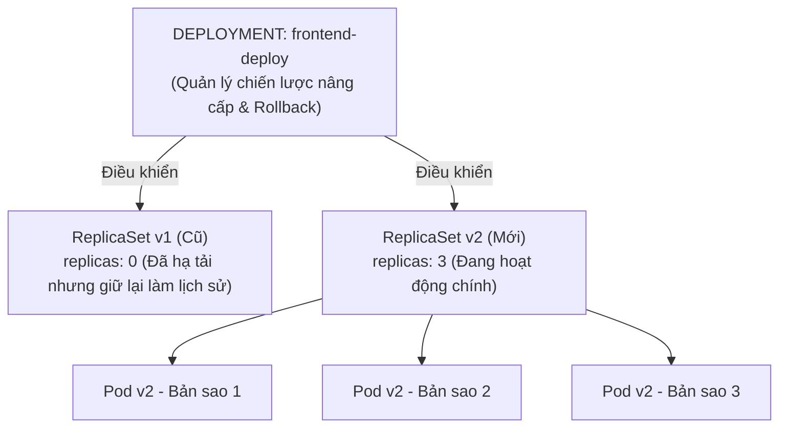

# Bài 09: Deployment: Quản lý triển khai và cập nhật không gián đoạn

## 1. Thông tin bài học
* **Tên bài:** Bài 09: Deployment: Quản lý triển khai và cập nhật không gián đoạn
* **Mục tiêu học:** Hiểu vai trò của đối tượng Deployment như một "vị tướng chỉ huy" điều phối các ReplicaSet bên dưới; làm chủ 2 chiến lược triển khai `RollingUpdate` và `Recreate`; phân tích bản chất toán học của hai tham số `maxSurge` và `maxUnavailable`; thành thạo trọn bộ kỹ năng dòng lệnh quản lý vòng đời phát hành ứng dụng: theo dõi tiến độ (`rollout status`), tra cứu lịch sử (`rollout history`), tạm dừng/tiếp tục (`rollout pause/resume`) và lùi phiên bản khẩn cấp (`rollout undo`).
* **Thời lượng ước tính:** 180 phút (90 phút lý thuyết, 90 phút thực hành)
* **Kiến thức cần có trước:** Bài 07 (Labels & Selectors), Bài 08 (ReplicaSet: Đảm bảo số lượng bản sao).
* **Liên quan kỳ thi:** CKAD, CKA (Chủ đề trọng tâm tuyệt đối: chiếm tới 15–20% bài thi thực hành với các câu hỏi nâng cấp image, sửa đổi rollout strategy, rollback và điều tra lỗi triển khai).

---

## 2. Bảng thuật ngữ

| Thuật ngữ | Giải thích đơn giản | Ví dụ / Ẩn dụ đời thường |
| :--- | :--- | :--- |
| **Deployment** | Đối tượng cấp cao quản lý việc triển khai, nâng cấp và lùi phiên bản của ứng dụng mà không cần can thiệp thủ công vào từng Pod hay ReplicaSet. | Vị Tổng chỉ huy quân đội: ra lệnh kế hoạch tác chiến tổng thể và điều phối các tiểu đoàn bên dưới. |
| **Rolling Update** | Chiến lược nâng cấp ứng dụng kiểu cuốn chiếu: tạo dần Pod mới và xóa dần Pod cũ để dịch vụ không bao giờ bị gián đoạn (Zero Downtime). | Thay lốp xe từng bánh một trong khi chiếc xe tải vẫn từ từ lăn bánh trên đường. |
| **Recreate Strategy** | Chiến lược "đập đi xây lại": tắt toàn bộ Pod cũ trước, sau đó mới bật toàn bộ Pod mới lên (chấp nhận có thời gian chết - downtime). | Đập toàn bộ ngôi nhà cũ để giải tỏa mặt bằng, sau đó mới xây ngôi nhà mới trên nền đất đó. |
| **maxSurge** | Số lượng Pod tối đa được phép vượt quá số lượng bản sao mong muốn (`replicas`) trong lúc đang nâng cấp. | Số lượng ghế phụ được phép kê thêm vào rạp chiếu phim trong giờ cao điểm đổi ca. |
| **maxUnavailable** | Số lượng Pod tối đa được phép tạm thời biến mất (không khả dụng) trong quá trình nâng cấp. | Số lượng nhân viên tối đa được phép đi ăn trưa cùng lúc mà công ty vẫn tiếp khách được. |
| **Revision** | Một mã số phiên bản ghi nhận lại mỗi lần cấu hình Pod Template của Deployment bị thay đổi. | Điểm lưu game (Save point): cho phép bạn quay ngược lại đúng thời điểm đó nếu nhân vật bị chết. |
| **Rollback** | Hành động quay ngược cấu hình của Deployment về một phiên bản ổn định trước đó khi phát hiện phiên bản mới bị lỗi. | Nhấn tổ hợp phím `Ctrl + Z` để hoàn tác lại thao tác sai lầm vừa thực hiện. |

---

## 3. Bức tranh lớn: Vấn đề thực tế và ẩn dụ đời thường

### Nhắc lại bài trước
Ở Bài 08, chúng ta đã hiểu tại sao không bao giờ được chạy Pod trần mà phải dùng ReplicaSet để duy trì số lượng bản sao mong muốn. Tuy nhiên, chúng ta cũng đã vạch trần "tử huyệt" của ReplicaSet: nó hoàn toàn bất lực khi bạn muốn cập nhật phiên bản mới (image update) cho ứng dụng. Để nâng cấp ứng dụng êm ái mà người dùng không bị gián đoạn dù chỉ 1 giây, chúng ta cần đến **Deployment**.

### Tại sao cần cái này ở production? (Vấn đề thực tế)
Hãy tưởng tượng trang web bán hàng Google Online Boutique đang đón hàng chục ngàn khách mua sắm trực tuyến. Đội ngũ phát triển vừa hoàn thành phiên bản `v2` với giao diện giỏ hàng mới lung linh hơn.

Nếu bạn nâng cấp hệ thống theo phương pháp truyền thống:
1. Bạn tắt toàn bộ 4 máy chủ chạy bản `v1`. Khách hàng đang bấm nút "Thanh toán" lập tức nhận về lỗi màn hình trắng xóa `502 Bad Gateway`.
2. Bạn bắt đầu kéo code `v2` về, khởi động lại ứng dụng. Quá trình này mất khoảng 2 phút. Trong 2 phút đó, công ty mất hàng trăm đơn hàng, khách hàng bức xúc bỏ sang đối thủ.
3. **Kịch bản tồi tệ nhất xảy ra:** Vừa bật bản `v2` lên thì phát hiện code có bug chí mạng: cứ khách nào dùng thẻ Visa là bị crash! 
4. Bạn hoảng loạn muốn quay lại bản `v1`. Bạn lại phải tắt `v2`, tải lại `v1`, cấu hình lại từ đầu, chịu thêm 2 phút downtime nữa. Tổng cộng hệ thống sập gần 5 phút, ban giám đốc yêu cầu giải trình sự cố mức độ nghiêm trọng (P1 Incident).

Deployment sinh ra để chấm dứt hoàn toàn nỗi đau này với hai vũ khí tối thượng:
* **Zero-Downtime Rolling Update:** Nâng cấp cuốn chiếu mượt mà. Khách hàng cũ tiếp tục dùng bản v1, khách hàng mới từ từ chuyển sang bản v2, không một ai nhận thấy sự gián đoạn.
* **Instant Rollback:** Nếu bản v2 bị lỗi, chỉ bằng **1 câu lệnh duy nhất gõ trong 2 giây**, toàn bộ hệ thống lập tức quay ngược về bản v1 an toàn tuyệt đối!

### Ẩn dụ đời thường: Đổi ca gác cổng thành và Vị Tổng tư lệnh

1. **Đổi ca gác cổng thành (Rolling Update):**
   * Lâu đài hoàng gia luôn cần duy trì **4 người lính gác** tại cổng thành.
   * **Chiến lược Recreate:** Bắt cả 4 người lính cũ về doanh trại ngủ, cổng thành bị bỏ trống không ai canh gác trong 15 phút, sau đó 4 người lính mới mới bước ra. Trong 15 phút đó kẻ trộm có thể lẻn vào!
   * **Chiến lược Rolling Update:**
     * Người lính mới số 1 bước ra đứng cạnh lính cũ (`maxSurge`). Lúc này cổng thành có 5 người.
     * Khi người lính mới đã sẵn sàng cầm vũ khí, 1 người lính cũ mới rút lui về doanh trại (`maxUnavailable`).
     * Cứ thế lần lượt từng người một đổi ca. Cổng thành **không bao giờ bị bỏ trống dù chỉ 1 giây**!

2. **Mối quan hệ Deployment vs ReplicaSet:**
   * **Deployment là Vị Tổng tư lệnh**: nắm trong tay kế hoạch tác chiến tổng thể.
   * **ReplicaSet là Các Tiểu đoàn lính**:
     * Khi chạy bản v1, Tổng tư lệnh giao quyền cho **Tiểu đoàn v1** (chỉ huy 4 người lính Pod).
     * Khi có lệnh đổi sang bản v2, Tổng tư lệnh không tự đi huấn luyện từng người lính. Ngài thành lập **Tiểu đoàn v2**, ra lệnh cho Tiểu đoàn v2 tuyển dần quân (từ 0 lên 1, 2, 3, 4), đồng thời ra lệnh cho Tiểu đoàn v1 giải ngũ dần quân (từ 4 về 3, 2, 1, 0).
     * Tiểu đoàn v1 sau khi giải ngũ hết quân **vẫn giữ nguyên doanh trại (số quân = 0)** chứ không bị xóa sổ. Khi có lệnh báo động đỏ (Rollback), ngài chỉ việc gọi Tiểu đoàn v1 tái vũ trang lại trong chớp mắt!

---

## 4. Giải thích khái niệm theo từng bước

### Bước 1: Mối quan hệ phân cấp 3 tầng (Kiến trúc chuẩn)



* **Deployment** sở hữu và quản lý các **ReplicaSet**.
* **ReplicaSet** sở hữu và quản lý các **Pods**.
* Khi bạn thay đổi bất kỳ thuộc tính nào trong khối `spec.template` của Deployment (đổi image, đổi biến môi trường, sửa nhãn), Deployment sẽ **tạo ra một ReplicaSet mới toanh** và bắt đầu quá trình dịch chuyển quân.

### Bước 2: Hai chiến lược triển khai (Deployment Strategies)
Trường `spec.strategy.type` quyết định cách thức chuyển giao phiên bản:

1. **`Recreate`:**
   * Tiêu hủy toàn bộ Pod cũ về 0 trước, sau đó mới tạo các Pod mới.
   * *Ưu điểm:* Tiết kiệm tài nguyên (không bao giờ vượt quá số lượng `replicas`); tránh được xung đột khi ứng dụng không cho phép 2 phiên bản chạy song song cùng lúc (ví dụ: ứng dụng khóa file độc quyền trên ổ cứng).
   * *Nhược điểm:* **Chắc chắn có downtime**. Người dùng sẽ bị gián đoạn kết nối trong suốt thời gian chuyển giao.
2. **`RollingUpdate` (Mặc định và Khuyến nghị):**
   * Nâng cấp cuốn chiếu từng phần, đảm bảo dịch vụ luôn phản hồi liên tục.
   * Được điều khiển bởi hai tham số toán học cực kỳ quan trọng: `maxSurge` và `maxUnavailable`.

### Bước 3: Toán học của Rolling Update: `maxSurge` và `maxUnavailable`

Hai tham số này có thể được cấu hình dưới dạng **con số tuyệt đối** (ví dụ: `1`, `2`) hoặc **tỷ lệ phần trăm** (ví dụ: `25%`):

```yaml
spec:
  replicas: 4
  strategy:
    type: RollingUpdate
    rollingUpdate:
      maxSurge: 25%          # Tối đa 25% vượt quá số lượng 4 Pods (= 1 Pod)
      maxUnavailable: 25%    # Tối đa 25% không khả dụng (= 1 Pod)
```

Giả sử `replicas: 4`:
1. **`maxSurge: 25%` (tương đương 1 Pod):**
   * Trong suốt quá trình nâng cấp, tổng số lượng Pod tối đa được phép tồn tại trên cluster là:
     $$\text{Max Pods} = \text{replicas} + \text{maxSurge} = 4 + 1 = 5 \text{ Pods}$$
2. **`maxUnavailable: 25%` (tương đương 1 Pod):**
   * Trong suốt quá trình nâng cấp, số lượng Pod tối thiểu bắt buộc phải luôn ở trạng thái sẵn sàng phục vụ khách là:
     $$\text{Min Available Pods} = \text{replicas} - \text{maxUnavailable} = 4 - 1 = 3 \text{ Pods}$$

**Luồng chuyển dịch diễn ra từng bước:**
* Bước 1: Tạo 1 Pod v2 mới $\rightarrow$ Tổng số Pod là 5 (thỏa mãn trần 5).
* Bước 2: Pod v2 khởi động thành công và Ready.
* Bước 3: Tiêu hủy 1 Pod v1 cũ $\rightarrow$ Số Pod giảm về 4 (gồm 3 cũ, 1 mới). Luôn đảm bảo $\ge 3$ Pod sẵn sàng.
* Bước 4: Lặp lại quá trình cho đến khi toàn bộ 4 Pod đều là v2, và số Pod của v1 về đúng 0!

### Bước 4: Cơ chế quản lý Revision và Lịch sử phát hành
* Mỗi khi bạn thay đổi `spec.template` của Deployment, Kubernetes tự động tăng số hiệu phiên bản (**Revision**) lên 1 đơn vị (Revision 1 $\rightarrow$ Revision 2 $\rightarrow$ Revision 3).
* Thông tin này được ghi vào annotation `deployment.kubernetes.io/revision` của cả Deployment và ReplicaSet tương ứng.
* Bằng cách giữ lại các ReplicaSet cũ ở trạng thái 0 bản sao, Kubernetes có thể thực hiện lệnh `kubectl rollout undo` để quay về bất kỳ Revision nào trong quá khứ chỉ trong vòng 1 giây!

---

## 5. Thực hành (Lab)

Chúng ta sẽ thực hiện kịch bản thực tế: Triển khai microservice `frontend` phiên bản v1, thực hiện nâng cấp không gián đoạn lên v2, giả lập triển khai bản v3 bị lỗi crash và thực hiện giải cứu hệ thống bằng lệnh Rollback khẩn cấp.

* **Môi trường:** Cluster kind `lab` (1 control-plane + 1 worker).
* **Mức RAM ước tính:** Khoảng **~100MB đến 140MB RAM** (hoàn toàn an toàn).

### Bước 1: Khởi tạo Deployment phiên bản v1
Tạo file manifest `boutique-deploy.yaml` trên PowerShell:

```powershell
@'
apiVersion: apps/v1
kind: Deployment
metadata:
  name: boutique-frontend
  labels:
    app: frontend
spec:
  replicas: 3
  strategy:
    type: RollingUpdate
    rollingUpdate:
      maxSurge: 1
      maxUnavailable: 0
  selector:
    matchLabels:
      app: frontend
  template:
    metadata:
      labels:
        app: frontend
    spec:
      containers:
        - name: web
          image: nginx:1.25-alpine
          ports:
            - containerPort: 80
'@ | Set-Content -Path .\boutique-deploy.yaml -Encoding UTF8

# Áp dụng manifest vào cluster
k apply -f .\boutique-deploy.yaml
```

**Kết quả mong đợi (Expected Output):**
```text
deployment.apps/boutique-frontend created
```

Theo dõi quá trình triển khai thành công:
```powershell
k rollout status deployment boutique-frontend
```

**Kết quả mong đợi (Expected Output):**
```text
deployment "boutique-frontend" successfully rolled out
```

Kiểm tra xem Deployment đã tạo ra ReplicaSet nào:
```powershell
k get deployment,rs,pods -l app=frontend
```

**Kết quả mong đợi (Expected Output):**
```text
NAME                                READY   UP-TO-DATE   AVAILABLE   AGE
deployment.apps/boutique-frontend   3/3     3            3           45s

NAME                                           DESIRED   CURRENT   READY   AGE
replicaset.apps/boutique-frontend-7f9b8c6d4    3         3         3       45s

NAME                                     READY   STATUS    RESTARTS   AGE
pod/boutique-frontend-7f9b8c6d4-abc1     1/1     Running   0          45s
pod/boutique-frontend-7f9b8c6d4-xyz2     1/1     Running   0          45s
pod/boutique-frontend-7f9b8c6d4-mno3     1/1     Running   0          45s
```

### Bước 2: Nâng cấp lên phiên bản v2 (Rolling Update)
Bây giờ, hãy nâng cấp image của container `web` từ `nginx:1.25-alpine` lên `nginx:1.26-alpine`. Chúng ta sẽ thêm chú thích lý do thay đổi để sau này dễ tra cứu lịch sử:

```powershell
# Nâng cấp image bằng lệnh kubectl set image
k set image deployment/boutique-frontend web=nginx:1.26-alpine

# Ghi chú lý do thay đổi phiên bản vào annotation
k annotate deployment/boutique-frontend kubernetes.io/change-cause="Nang cap len ban v2 (nginx 1.26)" --overwrite
```

Ngay lập tức, theo dõi luồng chuyển dịch cuốn chiếu:
```powershell
k rollout status deployment boutique-frontend
```

**Kết quả mong đợi (Expected Output):**
```text
Waiting for deployment "boutique-frontend" rollout to finish: 1 out of 3 new replicas have been updated...
Waiting for deployment "boutique-frontend" rollout to finish: 2 out of 3 new replicas have been updated...
Waiting for deployment "boutique-frontend" rollout to finish: 1 old replicas are pending termination...
deployment "boutique-frontend" successfully rolled out
```

Kiểm tra danh sách ReplicaSet sau khi nâng cấp:
```powershell
k get rs -l app=frontend
```

**Kết quả mong đợi (Expected Output):**
```text
NAME                                   DESIRED   CURRENT   READY   AGE
boutique-frontend-7f9b8c6d4            0         0         0       3m    <-- RS cũ (v1) đã về 0
boutique-frontend-5b4c3d2e1            3         3         3       45s   <-- RS mới (v2) đang giữ 3 Pods
```
> **Chứng minh:** ReplicaSet v1 không hề bị xóa! Nó chỉ bị hạ số lượng bản sao về 0 để nhường chỗ cho ReplicaSet v2.

### Bước 3: Tra cứu lịch sử phiên bản (Rollout History)
Xem danh sách các lần phát hành đã ghi nhận:

```powershell
k rollout history deployment boutique-frontend
```

**Kết quả mong đợi (Expected Output):**
```text
REVISION  CHANGE-CAUSE
1         <none>
2         Nang cap len ban v2 (nginx 1.26)
```

### Bước 4: Giả lập thảm họa phiên bản v3 bị lỗi (Image không tồn tại)
Bây giờ, hãy tưởng tượng một lập trình viên gõ nhầm tên tag image khiến image không thể tải về được (`nginx:ban-nay-khong-ton-tai`):

```powershell
k set image deployment/boutique-frontend web=nginx:ban-nay-khong-ton-tai
k annotate deployment/boutique-frontend kubernetes.io/change-cause="Thu nghiem ban loi v3" --overwrite
```

Kiểm tra trạng thái các Pod ngay sau đó:
```powershell
k get pods -l app=frontend
```

**Kết quả mong đợi (Expected Output):**
```text
NAME                                  READY   STATUS         RESTARTS   AGE
boutique-frontend-5b4c3d2e1-abc1      1/1     Running        0          4m   <-- Pod v2 cu van song
boutique-frontend-5b4c3d2e1-xyz2      1/1     Running        0          4m   <-- Pod v2 cu van song
boutique-frontend-5b4c3d2e1-mno3      1/1     Running        0          4m   <-- Pod v2 cu van song
boutique-frontend-999bad888-loi01     0/1     ErrImagePull   0          12s  <-- Pod v3 moi bi loi
```

> **ĐIỂM SÁNG GIÁ CỦA DEPLOYMENT:**
> Vì chúng ta cấu hình `maxUnavailable: 0`, Deployment nhận thấy Pod v3 mới tạo bị dính lỗi `ErrImagePull` (chưa bao giờ đạt trạng thái Ready). Do đó, nó **lập tức dừng toàn bộ quá trình nâng cấp lại**! Nó tuyệt đối không tắt bất kỳ một Pod v2 cũ nào!
> Kết quả: Trang web của khách hàng **vẫn hoạt động bình thường 100% trên phiên bản v2 cũ** mà không hề bị sập!

### Bước 5: Cứu hộ khẩn cấp: Thực hiện Rollback trong 1 giây
Phát hiện bản v3 bị lỗi, kỹ sư trực ca chỉ cần gõ đúng 1 dòng lệnh để cứu vớt hệ thống:

```powershell
# Lệnh quay ngược về phiên bản ổn định liền trước
k rollout undo deployment/boutique-frontend
```

**Kết quả mong đợi (Expected Output):**
```text
deployment.apps/boutique-frontend rolled back
```

Kiểm tra lại trạng thái sau 3 giây:
```powershell
k get pods -l app=frontend
```

**Kết quả mong đợi:** Pod v3 bị lỗi lập tức bị xóa sổ, toàn bộ 3 Pod v2 tiếp tục chạy mượt mà không tì vết. Hệ thống được cứu sống trong chớp mắt!

### Bước 6: Thử nghiệm tính năng Tạm dừng và Tiếp tục (Pause & Resume)
Khi bạn cần thực hiện nhiều thay đổi cấu hình cùng lúc (vừa đổi image, vừa sửa biến môi trường, vừa chỉnh sửa RAM/CPU limit), nếu không tạm dừng, Deployment sẽ kích hoạt 3 lần rollout liên tiếp gây lãng phí tài nguyên.

```powershell
# 1. Tạm dừng rollout
k rollout pause deployment/boutique-frontend

# 2. Thực hiện hàng loạt thay đổi mà không kích hoạt rollout
k set image deployment/boutique-frontend web=nginx:alpine
k set resources deployment/boutique-frontend -c=web --limits=cpu=200m,memory=128Mi

# 3. Tiếp tục và kích hoạt đúng 1 lần rollout duy nhất
k rollout resume deployment/boutique-frontend
k rollout status deployment/boutique-frontend
```

### Bước 7: Dọn dẹp tài nguyên (Cleanup)
Xóa Deployment và file cấu hình thử nghiệm:

```powershell
k delete -f .\boutique-deploy.yaml
Remove-Item -Path .\boutique-deploy.yaml
```

---

## 6. Lỗi thường gặp và cách debug

### Lỗi 1: Rollout bị kẹt vô thời hạn (`ProgressDeadlineExceeded`)
* **Dấu hiệu:** Chạy `kubectl rollout status` thấy terminal bị treo mãi không kết thúc, gõ `describe deployment` thấy dòng: `ProgressDeadlineExceeded: Deployment "..." has timed out progressing`.
* **Nguyên nhân:** Pod mới bị dính lỗi runtime (`CrashLoopBackOff`), lỗi kéo image (`ErrImagePull` / `ImagePullBackOff`), hoặc kiểm tra `readinessProbe` liên tục thất bại khiến Pod không bao giờ đạt trạng thái `Ready`.
* **Cách khắc phục:** 
  1. Kiểm tra Pod bị lỗi bằng `kubectl get pods -l app=...`.
  2. Đọc log và events của Pod lỗi bằng `kubectl describe pod <pod-loi>` và `kubectl logs <pod-loi>`.
  3. Lập tức chạy lệnh `kubectl rollout undo deployment/<ten-deployment>` để đưa hệ thống về phiên bản an toàn trước khi tiến hành sửa code.

### Lỗi 2: Cấu hình `maxUnavailable: 100%` làm mất sạch tính năng Rolling Update
* **Dấu hiệu:** Cứ mỗi lần cập nhật image là khách hàng lại kêu gào bị rớt mạng mất 30 giây.
* **Nguyên nhân:** Cấu hình `maxUnavailable: 100%` (hoặc bằng đúng số lượng `replicas`) cho phép Kubernetes tắt toàn bộ Pod cũ ngay ở giây đầu tiên, biến quá trình RollingUpdate thành chiến lược `Recreate`.
* **Cách khắc phục chuẩn Production:** 
  Luôn cấu hình `maxUnavailable: 0` (đảm bảo không bao giờ bị hụt Pod phục vụ) kết hợp với `maxSurge: 1` hoặc `maxSurge: 25%`.

### Lỗi 3: Lịch sử Rollout không hiển thị lý do thay đổi (`CHANGE-CAUSE: <none>`)
* **Dấu hiệu:** Khi gõ `kubectl rollout history`, cột `CHANGE-CAUSE` chỉ hiện toàn chữ `<none>`.
* **Nguyên nhân:** Bạn không thêm chú thích khi thay đổi manifest. (Cờ `--record` ngày xưa đã bị Kubernetes deprecated từ bản v1.20+).
* **Cách chuẩn hiện nay:** Luôn đính kèm annotation `kubernetes.io/change-cause` trong manifest YAML hoặc gõ lệnh `kubectl annotate deployment/<ten-deploy> kubernetes.io/change-cause="..." --overwrite`.

---

## 7. Góc nhìn Senior

### 1. Sự đánh đổi (Trade-offs)
* **Rolling Update và Bài toán tương thích ngược cơ sở dữ liệu (Database Backward Compatibility):**
  * Trong suốt 2–5 phút diễn ra Rolling Update, **cả hai phiên bản code v1 và v2 đều đang chạy song song và cùng kết nối vào một Database duy nhất**!
  * *Hậu quả chết người nếu không cẩn thận:* Nếu code v2 yêu cầu một cột mới trong bảng cơ sở dữ liệu mà bạn vội vã chạy migration xóa cột cũ, các Pod v1 còn lại sẽ lập tức bị crash hàng loạt!
  * *Nguyên tắc sống còn của Senior:* Mọi thay đổi về cơ sở dữ liệu khi chạy Rolling Update bắt buộc phải tuân theo mô hình **Expand and Contract (Mở rộng trước, Thu hẹp sau)**:
    1. Bước 1: Thêm cột mới vào DB (cột cũ vẫn giữ nguyên).
    2. Bước 2: Deploy code v2 (đọc ghi cả cột mới lẫn cột cũ).
    3. Bước 3: Sau khi v2 chạy ổn định 100%, mới deploy bản v3 để ngừng dùng cột cũ.
    4. Bước 4: Chạy migration xóa cột cũ khỏi DB.
* **Kích thước lưu vết lịch sử (`revisionHistoryLimit`):**
  * Mặc định Kubernetes lưu giữ 10 ReplicaSet cũ cho mỗi Deployment. Nếu bạn có 50 microservices và mỗi service deploy 20 lần/ngày, etcd sẽ phải lưu trữ hàng ngàn ReplicaSet rác. Ở production, các kỹ sư Senior thường cấu hình `revisionHistoryLimit: 3` hoặc `5` để giữ cho cơ sở dữ liệu etcd luôn thanh thoát và nhẹ nhàng.

### 2. Best practices tại production
* **Bắt buộc phải đi kèm Readiness Probe:**
  * Deployment chỉ biết một Pod mới đã "sẵn sàng" dựa trên trạng thái `Ready` của Pod.
  * Nếu bạn không cấu hình `readinessProbe`, Kubelet sẽ đánh dấu Pod là `Ready` ngay khi tiến trình container vừa bật lên, trong khi ứng dụng (ví dụ Java Spring Boot) cần tới 45 giây để nạp cấu hình và kết nối database! Hậu quả là Deployment vội vã tắt Pod cũ, chuyển traffic vào Pod mới chưa kịp ấm chỗ, gây sập dịch vụ toàn tập!
* **Đặt thời gian hết hạn tiến độ (`progressDeadlineSeconds`):**
  * Mặc định là 600 giây (10 phút). Nếu sau 10 phút mà quá trình nâng cấp không thể hoàn thành, Deployment sẽ tự động phát cờ báo động để hệ thống CI/CD (như Jenkins, GitLab, ArgoCD) kích hoạt cơ chế báo động qua Slack hoặc tự động rollback.

### 3. Câu hỏi phỏng vấn Senior
* **Câu hỏi 1:** *"Giả sử một Deployment đang chạy 4 bản sao với cấu hình `maxSurge: 0` và `maxUnavailable: 25%`. Hãy vẽ và giải thích chi tiết luồng thay đổi số lượng Pod của phiên bản cũ và phiên bản mới trong suốt quá trình Rolling Update."*
  * **Gợi ý trả lời chuẩn:**
    * `replicas: 4`.
    * `maxSurge: 0` nghĩa là: **Tổng số Pod không bao giờ được vượt quá 4**.
    * `maxUnavailable: 25%` (1 Pod) nghĩa là: **Số Pod sẵn sàng tối thiểu luôn là 3**.
    * **Luồng diễn ra:**
      1. Vì không được phép vượt quá 4 Pod, Deployment **không thể tạo Pod mới ngay lập tức**.
      2. Nó bắt buộc phải **tiêu hủy 1 Pod cũ trước** $\rightarrow$ Số Pod cũ giảm từ 4 xuống 3 (vẫn đảm bảo tối thiểu 3 Pod sẵn sàng).
      3. Bây giờ tổng số Pod là 3, còn trống 1 chỗ $\rightarrow$ Nó tạo 1 Pod mới v2 (Tổng số Pod = 4).
      4. Chờ Pod v2 mới đạt trạng thái Ready.
      5. Lặp lại bước 2: Tiêu hủy tiếp 1 Pod cũ $\rightarrow$ cũ còn 2, mới có 1. Tạo tiếp 1 Pod mới $\rightarrow$ mới có 2.
      6. Cứ thế cho đến khi toàn bộ 4 Pod đều là v2!
* **Câu hỏi 2:** *"Làm thế nào để quay ngược một Deployment về đúng Revision 3 cụ thể chứ không phải phiên bản liền trước?"*
  * **Gợi ý trả lời chuẩn:** Sử dụng cờ `--to-revision`:
    `kubectl rollout undo deployment/<ten-deploy> --to-revision=3`
    Kubernetes sẽ tìm ReplicaSet gắn liền với Revision 3, lấy cấu hình template của nó và kích hoạt một quá trình Rolling Update mới để đưa trạng thái cụm về đúng cấu hình của Revision 3.

---

## 8. Tóm tắt bài học
* 📌 **1.** **Deployment** là bộ điều khiển cấp cao quản lý vòng đời ứng dụng, gián tiếp điều khiển các **ReplicaSet** bên dưới.
* 📌 **2.** **Rolling Update** đảm bảo cập nhật ứng dụng không gián đoạn dịch vụ (Zero Downtime) bằng cách thay thế Pod theo kiểu cuốn chiếu.
* 📌 **3.** **`maxSurge`** quy định số Pod tối đa được vượt trần; **`maxUnavailable`** quy định số Pod tối đa được phép thiếu hụt trong lúc nâng cấp.
* 📌 **4.** Nếu phiên bản mới bị lỗi hoặc crash, Deployment sẽ **tự động dừng quá trình rollout lại**, bảo vệ các Pod cũ còn sống để giữ vững hệ thống.
* 📌 **5.** Lệnh **`kubectl rollout undo`** cho phép lùi phiên bản khẩn cấp trong 1 giây nhờ việc lưu giữ các ReplicaSet lịch sử trong etcd.

---

## 9. Bài tập tự làm

* 🟢 **Mức Dễ:** Viết file YAML triển khai một Deployment tên `web-app` gồm 2 bản sao chạy image `httpd:2.4-alpine`. Dùng lệnh `kubectl set image` để nâng cấp sang image `httpd:alpine`. Kiểm tra trạng thái bằng `kubectl rollout status`.
* 🟡 **Mức Vừa:** Cấu hình Deployment ở bài trên với chiến lược `RollingUpdate` có `maxSurge: 1` và `maxUnavailable: 0`. Sử dụng lệnh `kubectl rollout pause` để tạm dừng, đổi biến môi trường `ENV=production`, sau đó gõ `kubectl rollout resume` và quan sát quá trình cập nhật.
* 🔴 **Mức Khó (Troubleshooting CKA):** Cố tình cập nhật image của Deployment sang một tag sai hoàn toàn: `httpd:tag-sai-12345`. Quan sát thông báo lỗi từ `kubectl rollout status`. Sau đó dùng lệnh `kubectl rollout history` để xác định Revision của bản ổn định trước đó và thực hiện `kubectl rollout undo` thành công đưa hệ thống về trạng thái bình thường.

---

## 10. Câu hỏi tự kiểm tra

1. Mối quan hệ kiến trúc phân cấp giữa Deployment, Pod và ReplicaSet trong Kubernetes được sắp xếp theo thứ tự nào từ cao xuống thấp?
2. Nếu bạn cấu hình `strategy.type: Recreate` cho một Deployment có 10 bản sao, người dùng có bị gián đoạn dịch vụ khi bạn nâng cấp image không? Tại sao?
3. Khi bạn cập nhật image của một Deployment và quá trình rollout hoàn tất 100%, ReplicaSet cũ có bị xóa khỏi cụm không? Nó ở trạng thái nào?
4. Ý nghĩa thực tế của cấu hình `maxUnavailable: 0` trong chiến lược Rolling Update là gì?
5. Câu lệnh nào cho phép xem danh sách toàn bộ lịch sử các lần cập nhật phiên bản của Deployment `my-deploy`?
6. Tại sao việc đảm bảo tính tương thích ngược của Database (Database Backward Compatibility) lại là điều kiện sống còn khi thực hiện Rolling Update ở Production?

<details>
<summary>👉 Bấm vào đây để xem đáp án câu hỏi tự kiểm tra</summary>

* **Đáp án 1:** Thứ tự từ cao xuống thấp: **Deployment $\rightarrow$ ReplicaSet $\rightarrow$ Pod**.
* **Đáp án 2:** **CÓ DOWNTIME**. Vì chiến lược `Recreate` sẽ xóa sạch toàn bộ 10 Pod cũ về 0 trước khi bắt đầu tạo các Pod mới, khiến không có bất kỳ container nào phục vụ khách trong thời gian chuyển giao.
* **Đáp án 3:** **Không bị xóa**. ReplicaSet cũ vẫn được giữ lại trên cluster nhưng số lượng bản sao mong muốn và thực tế bị hạ về mức **`replicas: 0`** để lưu trữ lịch sử cho tính năng rollback.
* **Đáp án 4:** Đảm bảo **luôn có đủ 100% số lượng Pod phục vụ** ở mọi thời điểm của quá trình nâng cấp, không bao giờ chấp nhận thiếu hụt dù chỉ 1 Pod.
* **Đáp án 5:** Câu lệnh: `kubectl rollout history deployment/my-deploy`.
* **Đáp án 6:** Vì trong quá trình Rolling Update, cả hai phiên bản code cũ và code mới cùng chạy đồng thời và cùng gọi vào một database. Nếu cấu trúc DB bị thay đổi đột ngột làm gãy code cũ, các Pod cũ đang xử lý giao dịch của khách sẽ lập tức bị crash.
</details>

---

## 11. Tài liệu đọc thêm và bài tiếp theo

### Tài liệu tham khảo
* [Tài liệu chính thức Kubernetes: Deployments](https://kubernetes.io/docs/concepts/workloads/controllers/deployment/)
* [Tài liệu chính thức Kubernetes: Performing a Rolling Update](https://kubernetes.io/docs/tutorials/kubernetes-basics/update/update-intro/)
* [Hướng dẫn quản lý Rollout: kubectl rollout commands](https://kubernetes.io/docs/reference/kubectl/generated/kubectl_rollout/)

### Bài tiếp theo
👉 **Bài 10: Service: Cầu nối mạng bền vững (ClusterIP, NodePort, LoadBalancer)**

---

## PHỤ LỤC: ĐÁP ÁN GỢI Ý BÀI TẬP TỰ LÀM (MỤC 9)

### Đáp án Mức Dễ
```powershell
# 1. Tạo Deployment
k create deployment web-app --image=httpd:2.4-alpine --replicas=2

# 2. Nâng cấp image
k set image deployment/web-app httpd=httpd:alpine

# 3. Theo dõi trạng thái
k rollout status deployment/web-app
```

### Đáp án Mức Vừa
```powershell
# Tạm dừng rollout
k rollout pause deployment/web-app

# Cập nhật biến môi trường
k set env deployment/web-app ENV=production

# Tiếp tục rollout
k rollout resume deployment/web-app

# Kiểm tra tiến độ
k rollout status deployment/web-app
```

### Đáp án Mức Khó
1. Cố tình nâng cấp image sai:
   ```powershell
   k set image deployment/web-app httpd=httpd:tag-sai-12345
   ```
2. Kiểm tra tiến độ:
   ```powershell
   k rollout status deployment/web-app
   ```
   *Hiện tượng:* Terminal bị treo ở dòng: `Waiting for deployment "web-app" rollout to finish...`.
   Bấm `Ctrl + C`. Gõ `k get pods -l app=web-app` sẽ thấy 1 Pod mới dính lỗi `ImagePullBackOff`, trong khi 2 Pod cũ vẫn `Running` ổn định.
3. Kiểm tra lịch sử để xác định Revision:
   ```powershell
   k rollout history deployment/web-app
   ```
4. Thực hiện Rollback:
   ```powershell
   k rollout undo deployment/web-app
   ```
   Kiểm tra lại bằng `k get pods -l app=web-app`, Pod lỗi biến mất và toàn bộ 2 Pod đều khỏe mạnh!

