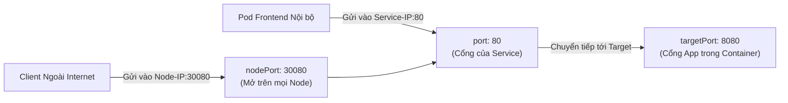

# Bài 10: Service: Cầu nối mạng bền vững (ClusterIP, NodePort, LoadBalancer)

## 1. Thông tin bài học
* **Tên bài:** Bài 10: Service: Cầu nối mạng bền vững (ClusterIP, NodePort, LoadBalancer)
* **Mục tiêu học:** Nắm vững bản chất tại sao IP của Pod luôn là tạm bợ (ephemeral) và cách đối tượng Service cung cấp một địa chỉ cố định kèm khả năng tự cân bằng tải; phân biệt chính xác mối quan hệ giữa `port`, `targetPort` và `nodePort`; làm chủ cơ chế quản lý danh sách `Endpoints` / `EndpointSlice`; thành thạo 3 loại Service kinh điển (`ClusterIP`, `NodePort`, `LoadBalancer`) và tự tay kết nối hai microservices thông qua tên miền nội bộ.
* **Thời lượng ước tính:** 180 phút (90 phút lý thuyết, 90 phút thực hành)
* **Kiến thức cần có trước:** Bài 07 (Labels & Selectors), Bài 09 (Deployment: Quản lý triển khai).
* **Liên quan kỳ thi:** CKAD, CKA (Chiếm 15–20% bài thi: cấu hình Service, phơi bày ứng dụng qua NodePort, kiểm tra Endpoints, sửa lỗi sai lệch cổng mạng).

---

## 2. Bảng thuật ngữ

| Thuật ngữ | Giải thích đơn giản | Ví dụ / Ẩn dụ đời thường |
| :--- | :--- | :--- |
| **Service (Svc)** | Đối tượng cung cấp một địa chỉ IP ảo cố định và tên miền bất biến đại diện cho một nhóm Pods phía sau. | Số điện thoại Hotline tổng đài cố định của một công ty. |
| **ClusterIP** | Loại Service mặc định, chỉ cấp một IP ảo nội bộ trong cụm, chỉ các Pod trong cùng cụm mới gọi được. | Số máy nhánh nội bộ (ví dụ: máy nhánh 101) chỉ nhân viên trong công ty mới bấm gọi được cho nhau. |
| **NodePort** | Loại Service mở một cổng mạng tĩnh trên MỌI node vật lý của cụm để người bên ngoài Internet gọi vào. | Mở một quầy thu ngân phụ hướng ra mặt đường phố để khách vãng lai đi ngang qua có thể ghé mua. |
| **LoadBalancer** | Loại Service tự động gọi API của nhà cung cấp Cloud (AWS, GCP, Azure) để thuê một bộ cân bằng tải công khai có IP thật. | Thuê một công ty bảo vệ chuyên nghiệp đứng trước cổng chính tòa nhà để đón và hướng dẫn khách vào. |
| **Endpoints (EP) / EndpointSlice** | Danh sách các địa chỉ IP thực tế kèm cổng của các Pod khỏe mạnh (Ready) đang sẵn sàng nhận traffic. | Danh sách các nhân viên tư vấn đang online và ngồi sẵn trước máy tính chờ nhận cuộc gọi. |
| **`port`** | Cổng mạng mà Service mở ra bên trong cụm (nơi client gửi request đến). | Số phòng ban in trên danh thiếp của công ty (ví dụ: Phòng kinh doanh số 80). |
| **`targetPort`** | Cổng mạng thực tế mà ứng dụng bên trong Pod đang mở để lắng nghe kết nối. | Số cổng cắm tai nghe thật sự trên chiếc máy tính của nhân viên (ví dụ: cổng 8080). |
| **`nodePort`** | Cổng mở trên tất cả các Worker/Control-plane Node (dải 30000–32767). | Cổng số 30080 ở hàng rào ngoài sân bay dẫn thẳng vào nhà ga. |

---

## 3. Bức tranh lớn: Vấn đề thực tế và ẩn dụ đời thường

### Nhắc lại bài trước
Ở Bài 09, chúng ta đã làm chủ đối tượng Deployment để nâng cấp ứng dụng theo chiến lược Rolling Update và lùi phiên bản trong 1 giây mà không gián đoạn dịch vụ. Tuy nhiên, trong suốt quá trình nâng cấp đó, các Pod cũ liên tục bị tiêu hủy và các Pod mới liên tục sinh ra với những **địa chỉ IP hoàn toàn ngẫu nhiên mới**. Làm thế nào để ứng dụng `frontend` của Google Online Boutique có thể gọi tới `productcatalogservice` một cách bền vững mà không bị mất dấu?

### Tại sao cần cái này ở production? (Vấn đề thực tế)
Hãy nhìn vào tính chất cốt tử của Kubernetes: **Pod có tính chất phù du (Ephemeral)**.
1. Bạn có 3 Pod `productcatalogservice` mang IP lần lượt là: `10.244.1.15`, `10.244.1.16`, `10.244.1.17`.
2. Bạn cấu hình cứng 3 IP này vào code của `frontend`.
3. Một đêm nọ, Worker Node bị khởi động lại, hoặc bạn thực hiện nâng cấp bản v2. Ba Pod cũ bị xóa sổ. Ba Pod mới sinh ra mang IP: `10.244.1.20`, `10.244.1.21`, `10.244.1.22`.
4. Hậu quả: `frontend` tiếp tục gửi request vào 3 IP cũ đã chết $\rightarrow$ Toàn bộ trang web sập, khách hàng không xem được danh mục sản phẩm.

Chưa hết, nếu có 1000 khách cùng truy cập vào `frontend`, làm thế nào để chia đều tải cho 3 Pod `productcatalogservice`? Bạn không thể tự viết một thuật toán Round-Robin trong từng dòng code của ứng dụng.

Kubernetes giải quyết triệt để vấn đề này bằng đối tượng **Service**:
* Cấp một **Virtual IP (ClusterIP)** cố định duy nhất sống trọn đời dự án (ví dụ: `10.96.0.100`).
* Cung cấp một **tên miền DNS nội bộ bất biến** (ví dụ: `http://productcatalogservice`).
* Tự động phát hiện và theo dõi các Pod có nhãn tương ứng. Khi Pod đổi IP, Service tự động cập nhật danh sách đích trong vòng 1/1000 giây.
* Tự động cân bằng tải (Load Balancing) lưu lượng đều cho các Pod đang khỏe mạnh.

### Ẩn dụ đời thường: Số Hotline ngân hàng và 3 loại lối đi

Hãy tưởng tượng một ngân hàng thương mại lớn:

1. **Hotline cố định (Service ClusterIP):**
   * Ngân hàng có 10 nhân viên trực tổng đài (các **Pods**). Mỗi người dùng một số máy bàn di động riêng thay đổi theo ca làm việc (IP của Pod).
   * Khách hàng không bao giờ nhớ số máy bàn của từng nhân viên! Khách hàng chỉ nhớ duy nhất **Số tổng đài Hotline 1900-8888** (**IP của Service**).
   * Khi bạn gọi vào 1900-8888, hệ thống tổng đài tự động chuyển máy đến một nhân viên đang rảnh rỗi (**Cân bằng tải**). Nhân viên nào tan ca đi về (Pod chết), tổng đài tự động gạch tên khỏi danh bạ (**Endpoints**).
2. **Ba loại lối đi vào ngân hàng:**
   * **ClusterIP (Cửa nội bộ):** Lối đi nằm bên trong tòa nhà, chỉ có thẻ nhân viên (các Pod nội bộ trong cụm) mới đi qua được. Người ngoài đường không thể bước vào cửa này.
   * **NodePort (Cửa phụ ngoài vỉa hè):** Ngân hàng mở một ô cửa sổ nhỏ số 30080 ở bức tường ngoài phố. Bất kỳ ai đi ngang qua bất kỳ chi nhánh nào của ngân hàng đều có thể ghé vào ô cửa số 30080 đó để gửi giấy tờ.
   * **LoadBalancer (Đại sảnh có bảo vệ):** Ngân hàng thuê hẳn một công ty dịch vụ mở đại sảnh lớn, có bãi đậu xe hơi và bảo vệ chuyên nghiệp hướng dẫn khách từ khắp mọi nơi trên thế giới bước vào.

---

## 4. Giải thích khái niệm theo từng bước

### Bước 1: Tam giác cổng mạng (`port`, `targetPort`, `nodePort`)
Đây là phần gây lú lẫn nhất cho người mới bắt đầu. Hãy phân biệt rõ ràng:



1. **`port` (Cổng của Service):** Cổng mà bản thân Service mở ra bên trong mạng ảo của cụm. Các Pod khác muốn gọi tới Service thì gửi vào cổng này.
2. **`targetPort` (Cổng của Container):** Cổng thực tế mà tiến trình bên trong container đang mở lắng nghe (ví dụ: Nginx lắng nghe 80, Spring Boot lắng nghe 8080). Gói tin sau khi chạm vào Service `port` sẽ được chuyển tiếp vào `targetPort` này.
   *(Nếu không khai báo, mặc định `targetPort` sẽ nhận giá trị bằng đúng `port`).*
3. **`nodePort` (Cổng của máy chủ):** Chỉ áp dụng khi Service có loại là `NodePort` hoặc `LoadBalancer`. Là cổng vật lý mở trên tất cả các Node (dải mặc định từ `30000` đến `32767`).

### Bước 2: Trái tim bên dưới: `Endpoints` và `EndpointSlice`
Làm thế nào Service biết được phía sau nó đang có những Pod nào còn sống?
Nó không tự tìm kiếm, mà nhờ **Endpoints Controller** (nằm trong `kube-controller-manager` đã học ở Bài 05):

```mermaid
flowchart TD
    Svc["Service: backend-svc\nselector: app=backend\nport: 80"]
    
    subgraph EPController ["Endpoints Controller"]
        Watch["Quét liên tục các Pod có nhãn app=backend\nvà có trạng thái Ready = True"]
    end

    subgraph EPObject ["Endpoints Object: backend-svc"]
        IPList["Danh sách IP:Port thực tế:\n- 10.244.1.5:8080\n- 10.244.1.6:8080"]
    end

    subgraph Pods ["Các Pod phía sau"]
        P1["Pod 1 (Ready) - IP: 10.244.1.5"]
        P2["Pod 2 (Ready) - IP: 10.244.1.6"]
        P3["Pod 3 (CrashLoop / Chưa Ready) - IP: 10.244.1.7"]
    end

    Svc --- EPController
    EPController -->|Cập nhật dữ liệu| EPObject
    EPController -.->|Quản lý| P1
    EPController -.->|Quản lý| P2
    EPController -.->|BỊ LOẠI BỎ (Không đưa vào Endpoints)| P3
```

* Khi một Pod vượt qua bài kiểm tra sức khỏe và đạt `Ready: True`, IP của nó được thêm vào danh sách **`Endpoints`**.
* Nếu một Pod bị crash, bị xóa, hoặc không vượt qua được `readinessProbe`, IP của nó bị **gạch tên ngay lập tức** khỏi danh sách `Endpoints`. Service sẽ không bao giờ chuyển bất kỳ request nào tới Pod đó nữa!
* **EndpointSlice (Từ Kubernetes v1.21+):** Khi cụm mở rộng lên hàng ngàn Pod, việc lưu toàn bộ IP vào một file Endpoints duy nhất sẽ làm quá tải API Server. Kubernetes chia nhỏ danh sách IP thành từng "lát cắt" (Slice, tối đa 100 IP/slice) để cập nhật nhanh như chớp.

### Bước 3: Ba loại Service kinh điển

#### 1. ClusterIP (Mặc định)
* Cấp một Virtual IP chỉ có hiệu lực bên trong cụm.
* Phù hợp: Giao tiếp giữa các microservices nội bộ (ví dụ: `frontend` gọi `cartservice`, `cartservice` gọi `redis-cart`).
* Bên ngoài Internet hoàn toàn không thể truy cập trực tiếp.

#### 2. NodePort
* Được xây dựng dựa trên ClusterIP (nó vẫn có một ClusterIP nội bộ).
* Mở thêm một cổng tĩnh trên **TẤT CẢ các Node** trong cụm.
* Bạn có thể gửi request vào địa chỉ: `http://<Bất_Kỳ_IP_Của_Node_Nào>:<nodePort>` để đi vào ứng dụng.

#### 3. LoadBalancer
* Được xây dựng dựa trên NodePort.
* Dành riêng cho môi trường Cloud (AWS, GCP, Azure).
* Cloud Controller Manager sẽ tự động cấp một Public IP tĩnh của bộ cân bằng tải đám mây (AWS NLB/ALB) chuyển thẳng traffic vào các NodePort của cụm.

---

## 5. Thực hành (Lab)

Chúng ta sẽ mô phỏng kiến trúc microservices thực tế:
1. Tạo Backend Deployment (`productcatalogservice`) gồm 2 bản sao.
2. Tạo một Service **ClusterIP** cho backend.
3. Soi danh sách **Endpoints** xem IP của các Pod được tự động thu thập thế nào.
4. Tạo Frontend Deployment gọi sang backend thông qua tên miền Service nội bộ.
5. Phơi bày Frontend ra máy tính Windows thông qua Service **NodePort**.

* **Môi trường:** Cluster kind `lab` (1 control-plane + 1 worker).
* **Mức RAM ước tính:** Khoảng **~120MB RAM** (hoàn toàn mượt mà).

### Bước 1: Triển khai Backend và Service ClusterIP
Tạo file `backend.yaml` trên PowerShell:

```powershell
@'
apiVersion: apps/v1
kind: Deployment
metadata:
  name: productcatalog-deploy
  labels:
    app: productcatalog
spec:
  replicas: 2
  selector:
    matchLabels:
      app: productcatalog
  template:
    metadata:
      labels:
        app: productcatalog
    spec:
      containers:
        - name: server
          image: hashicorp/http-echo:0.2.3
          args:
            - "-text=Xin chao tu ProductCatalogService!"
          ports:
            - containerPort: 5678
---
apiVersion: v1
kind: Service
metadata:
  name: productcatalog-service
spec:
  type: ClusterIP
  selector:
    app: productcatalog
  ports:
    - name: http
      port: 80          # Cổng của Service mở ra cho các service khác gọi
      targetPort: 5678  # Cổng mà app http-echo bên trong Pod đang chạy
'@ | Set-Content -Path .\backend.yaml -Encoding UTF8

k apply -f .\backend.yaml
```

**Kết quả mong đợi (Expected Output):**
```text
deployment.apps/productcatalog-deploy created
service/productcatalog-service created
```

### Bước 2: Khám phá IP ảo của Service và danh sách Endpoints
Kiểm tra Service vừa tạo:

```powershell
k get svc productcatalog-service
```

**Kết quả mong đợi (Expected Output):**
```text
NAME                     TYPE        CLUSTER-IP      EXTERNAL-IP   PORT(S)   AGE
productcatalog-service   ClusterIP   10.96.185.120   <none>        80/TCP    25s
```
*(Bạn thấy một địa chỉ IP ảo: `10.96.185.120`. Đây là IP vĩnh viễn không bao giờ đổi của Service).*

Bây giờ, hãy kiểm tra danh sách **Endpoints** bên dưới:
```powershell
k get endpoints productcatalog-service
```

**Kết quả mong đợi (Expected Output):**
```text
NAME                     ENDPOINTS                           AGE
productcatalog-service   10.244.1.8:5678,10.244.1.9:5678     45s
```

> **Giải thích của Senior:** Nhìn vào cột `ENDPOINTS`! Bạn thấy 2 địa chỉ IP:Port của chính 2 Pod backend đang chạy. Endpoints Controller đã tự động tìm thấy chúng nhờ nhãn `app=productcatalog`!

### Bước 3: Triển khai Frontend gọi Backend qua tên miền nội bộ
Trong Kubernetes, CoreDNS tự động tạo bản ghi DNS cho mọi Service. Ứng dụng chỉ cần gọi tên Service (ví dụ: `http://productcatalog-service`) là kết nối được!

Tạo file `frontend.yaml` gồm một Frontend Nginx và Service loại **NodePort**:

```powershell
@'
apiVersion: apps/v1
kind: Deployment
metadata:
  name: frontend-deploy
  labels:
    app: frontend
spec:
  replicas: 1
  selector:
    matchLabels:
      app: frontend
  template:
    metadata:
      labels:
        app: frontend
    spec:
      containers:
        - name: web
          image: curlimages/curl:8.6.0
          # Container này liên tục gửi request sang backend mỗi 3 giây và in ra log
          command: ["sh", "-c", "while true; do echo '[FRONTEND GOI BACKEND]:'; curl -s http://productcatalog-service; sleep 3; done"]
---
apiVersion: v1
kind: Service
metadata:
  name: frontend-service
spec:
  type: NodePort
  selector:
    app: frontend
  ports:
    - port: 80
      targetPort: 80
      nodePort: 30088   # Mở cổng tĩnh 30088 trên toàn bộ Node
'@ | Set-Content -Path .\frontend.yaml -Encoding UTF8

k apply -f .\frontend.yaml
```

**Kết quả mong đợi (Expected Output):**
```text
deployment.apps/frontend-deploy created
service/frontend-service created
```

### Bước 4: Kiểm chứng giao tiếp microservices thành công qua DNS
Hãy xem log của Frontend Pod để chứng minh nó đã tìm thấy Backend qua tên Service:

```powershell
k logs -l app=frontend -f --tail=3
```

**Kết quả mong đợi (Expected Output):**
```text
[FRONTEND GOI BACKEND]:
Xin chao tu ProductCatalogService!
[FRONTEND GOI BACKEND]:
Xin chao tu ProductCatalogService!
```
*(Bấm `Ctrl + C` để dừng xem log).*

> **Chiến thắng vang dội!** Frontend không cần biết IP của Backend là gì, nó chỉ gọi `http://productcatalog-service` và Kubernetes đã lo toàn bộ phần định tuyến và phân giải DNS!

### Bước 5: Kiểm chứng tính năng Tự động cân bằng tải và Hồi phục
Hãy thử "giết" một Pod backend để xem Service phản ứng thế nào:

```powershell
$badPod = (k get pods -l app=productcatalog -o jsonpath='{.items[0].metadata.name}')
Write-Host "Xóa một Pod backend: $badPod"
k delete pod $badPod

# Lập tức xem lại Endpoints
k get endpoints productcatalog-service
```

**Kết quả mong đợi:**
* Ngay khi Pod bị xóa, IP của nó biến mất khỏi Endpoints.
* Khi Pod mới được ReplicaSet sinh ra và đạt Ready, IP mới lập tức được nạp lại vào Endpoints.
* Trong suốt quá trình này, log của `frontend` **không hề bị ngắt một nhịp nào** vì Service tự động chuyển toàn bộ request vào Pod backend còn sống!

### Bước 6: Dọn dẹp tài nguyên (Cleanup)
Xóa các manifest và file thực hành:

```powershell
k delete -f .\backend.yaml
k delete -f .\frontend.yaml
Remove-Item -Path .\backend.yaml, .\frontend.yaml
```

---

## 6. Lỗi thường gặp và cách debug

### Lỗi 1: `Endpoints: <none>` (Service không có mục tiêu để chuyển tiếp)
* **Dấu hiệu:** Bạn tạo Service thành công, nhưng khi gửi request thì bị treo hoặc nhận lỗi `503 Service Unavailable`. Kiểm tra `k get endpoints <ten-service>` thấy cột `ENDPOINTS` hiển thị `<none>`.
* **Nguyên nhân 1:** Selector của Service không khớp với Labels của Pod (sai chính tả, thừa khoảng trắng, sai chữ hoa/thường).
* **Nguyên nhân 2:** Các Pod đang bị dính lỗi (`CrashLoopBackOff`, `ContainerCreating`) hoặc chưa vượt qua bài kiểm tra `readinessProbe` nên Kubelet chưa đánh dấu `Ready`.
* **Cách debug chuẩn:**
  ```powershell
  k get pods --show-labels
  k describe service <ten-service>
  # So sánh trường "Selector:" của Service với nhãn của Pod
  ```

### Lỗi 2: Nhầm lẫn giữa `port` và `targetPort`
* **Dấu hiệu:** Gọi vào Service thì bị từ chối kết nối (`Connection refused`).
* **Nguyên nhân:** Khai báo sai `targetPort`. Ví dụ container chạy Nginx mở cổng 80, nhưng trong Service lại khai báo `targetPort: 8080`. Gói tin chuyển vào bên trong Pod bị rơi vào hư không vì không có tiến trình nào lắng nghe cổng 8080.

### Lỗi 3: Không kết nối được vào `nodePort` từ bên ngoài máy host trên cụm KinD
* **Dấu hiệu:** Bạn tạo Service loại NodePort cổng 30080, nhưng mở trình duyệt gõ `http://localhost:30080` lại báo lỗi không thể kết nối.
* **Nguyên nhân ở KinD:** KinD chạy các Node như các Docker container. Cổng `30080` đang mở trên container của Node, chứ chưa được ánh xạ (port-mapping) ra máy thật Windows trừ khi bạn cấu hình khối `extraPortMappings` trong file cấu hình khởi tạo cluster của KinD!
* **Cách cứu hộ nhanh trên KinD:** Dùng lệnh `kubectl port-forward`:
  ```powershell
  k port-forward svc/<ten-service> 8080:80
  ```

---

## 7. Góc nhìn Senior

### 1. Sự đánh đổi (Trade-offs)
* **iptables vs IPVS trong `kube-proxy`:**
  * **iptables mode (Mặc định):** Mỗi Service và Endpoint được biểu diễn bằng một chuỗi quy tắc (rules) trong kernel. Khi cluster có vài chục Service, iptables hoạt động rất tốt. Nhưng khi hệ thống phình to lên **hàng ngàn Service với hàng chục ngàn Pods**, iptables phải duyệt tuần tự $O(N)$ từng rule một cho mỗi gói tin. Điều này làm tăng độ trễ mạng và ngốn CPU của node một cách khủng khiếp.
  * **IPVS mode (IP Virtual Server):** Sử dụng cấu trúc dữ liệu bảng băm (Hash Table) với độ phức tạp tìm kiếm chỉ là $O(1)$. Hoàn toàn không bị suy giảm hiệu năng dù cụm có tới 50,000 Services.
  * **Xu hướng Platform hiện đại:** Các tập đoàn lớn hiện nay chuyển hẳn sang sử dụng **eBPF (thông qua CNI Cilium)** để thay thế hoàn toàn `kube-proxy`, xử lý định tuyến trực tiếp trong socket của nhân Linux ở tốc độ ánh sáng.

### 2. Best practices tại production
* **Luôn sử dụng Tên cổng có định danh (Named Ports):**
  * Thay vì viết cứng các con số `port: 80`, `targetPort: 8080` trong Service, hãy đặt tên cho cổng trong Pod:
    ```yaml
    # Trong Pod:
    ports:
      - name: http-web
        containerPort: 8080
    # Trong Service:
    ports:
      - name: http
        port: 80
        targetPort: http-web
    ```
  * *Lợi ích:* Sau này nếu lập trình viên đổi cổng chạy của code từ 8080 sang 3000, bạn chỉ cần sửa trong Pod mà không cần động chạm gì đến Service!
* **Tuyệt đối không dùng NodePort trực tiếp cho môi trường Production hướng ra ngoài Internet:**
  * NodePort làm lộ các dải cổng lạ lùng (như `31234`), không hỗ trợ quản lý chứng chỉ SSL/TLS tập trung, và không hỗ trợ định tuyến theo đường dẫn URL.
  * Chuẩn mực Production là: Dùng **ClusterIP** cho toàn bộ các service nội bộ, và đặt một **Ingress Controller** hoặc **Gateway API** ở cửa ngõ để tiếp nhận lưu lượng cổng 80/443 (chúng ta sẽ chinh phục ở Bài 20 & 21).

### 3. Câu hỏi phỏng vấn Senior
* **Câu hỏi 1:** *"IP của ClusterIP thực chất là gì dưới góc nhìn của nhân Linux Kernel? Tại sao bạn có thể gửi HTTP request tới IP này nhưng lại không thể dùng lệnh `ping` tới nó?"*
  * **Gợi ý trả lời chuẩn:**
    * **Bản chất:** ClusterIP là một **IP ảo (Virtual IP)**, nó hoàn toàn **không thuộc về bất kỳ card mạng vật lý hay ảo (veth/eth0) nào** trên các máy chủ.
    * **Tại sao không ping được:** Giao thức `ping` sử dụng các gói tin ICMP (Internet Control Message Protocol). `kube-proxy` chỉ ghi các luật trong iptables/IPVS để chuyển hướng cho các gói tin tầng giao vận như **TCP và UDP**. Nó không bắt và không phản hồi các gói tin ICMP. Do đó khi bạn ping vào ClusterIP, gói tin sẽ bị kernel thả rơi (drop), trong khi các kết nối TCP (HTTP, gRPC) vẫn thông suốt bình thường.
* **Câu hỏi 2:** *"Trình bày sự khác biệt giữa `Endpoints` và `EndpointSlice`. Tại sao Kubernetes phải tái cấu trúc và đưa EndpointSlice thành chuẩn mặc định từ phiên bản 1.21?"*
  * **Gợi ý trả lời chuẩn:**
    * Trong mô hình cũ, toàn bộ địa chỉ IP của tất cả các Pod phía sau một Service được nhét chung vào **đúng một đối tượng `Endpoints` duy nhất**. Khi một Service có 5000 Pods, file Endpoints này phình to hàng Megabytes. Chỉ cần 1 Pod duy nhất bị khởi động lại hoặc đổi IP, Kube-APIServer bắt buộc phải ghi lại toàn bộ file khổng lồ đó và phát tán (broadcast) cho hàng ngàn `kube-proxy` trên tất cả các node. Điều này gây nghẽn băng thông mạng nội bộ và làm nghẽn CPU của etcd.
    * **`EndpointSlice`** giải quyết triệt để bài toán này bằng cách phân vùng (sharding): chia nhỏ danh sách thành nhiều lát cắt (mặc định tối đa 100 endpoints/slice). Khi 1 Pod thay đổi, hệ thống chỉ cần cập nhật đúng 1 lát cắt nhỏ chứa Pod đó, giảm tải lưu lượng mạng hơn 90% ở các cụm quy mô lớn.

---

## 8. Tóm tắt bài học
* 📌 **1.** IP của Pod là tạm bợ; **Service cung cấp địa chỉ IP ảo cố định và tên miền DNS bất biến** đại diện cho nhóm Pods.
* 📌 **2.** **`port`** là cổng của Service; **`targetPort`** là cổng của ứng dụng trong Pod; **`nodePort`** là cổng mở trên các node vật lý.
* 📌 **3.** **Endpoints / EndpointSlice** là danh sách các IP thực tế của những Pod khỏe mạnh (Ready) do Endpoints Controller tự động duy trì.
* 📌 **4.** **ClusterIP** dùng cho giao tiếp nội bộ; **NodePort** mở cổng trên node; **LoadBalancer** tích hợp với đám mây công cộng.
* 📌 **5.** Không thể dùng lệnh `ping` tới ClusterIP vì nó chỉ là IP ảo được điều phối bằng các luật iptables/IPVS xử lý tầng TCP/UDP.

---

## 9. Bài tập tự làm

* 🟢 **Mức Dễ:** Tạo một Deployment chạy 2 bản sao Nginx. Tạo một Service loại `ClusterIP` mở cổng 80 trỏ vào cổng 80 của Nginx. Dùng lệnh `kubectl describe svc` và `kubectl get ep` để đối chiếu danh sách IP đích.
* 🟡 **Mức Vừa:** Tạo một Service loại `NodePort` mở cổng `30099` cho Deployment ở trên. Sử dụng lệnh `kubectl run test-client --image=curlimages/curl -it --rm -- curl http://lab-worker:30099` để kiểm tra kết nối từ bên trong cụm tới cổng NodePort.
* 🔴 **Mức Khó (Troubleshooting CKA):** Tạo một Pod với nhãn `app=auth,env=prod` mở cổng 8080. Sau đó tạo một Service có selector `app=auth,env=production`. Hãy dùng các lệnh `kubectl` để chứng minh tại sao Service không nhận diện được Pod (Endpoints rỗng), sau đó sửa lỗi bằng cách gắn lại nhãn cho Pod bằng lệnh `kubectl label` mà không sửa file Service.

---

## 10. Câu hỏi tự kiểm tra

1. Nếu bạn không khai báo trường `spec.type` trong file cấu hình YAML của Service, Kubernetes sẽ áp dụng loại Service mặc định nào?
2. Dải cổng mạng mặc định được phép sử dụng cho `nodePort` trong Kubernetes nằm trong khoảng nào?
3. Điều gì sẽ xảy ra với danh sách Endpoints của một Service nếu toàn bộ các Pod phía sau nó đều bị dính lỗi `CrashLoopBackOff`?
4. Một Pod nằm trong cùng cluster có thể gọi tới một Service mang tên `order-svc` nằm trong cùng namespace bằng URL nào?
5. Tại sao việc gõ lệnh `ping <ClusterIP>` luôn luôn thất bại mặc dù bạn vẫn có thể gửi curl HTTP tới IP đó bình thường?
6. Thành phần nào trên Worker Node chịu trách nhiệm trực tiếp cập nhật các luật iptables hoặc IPVS mỗi khi có sự thay đổi về Service và Endpoints?

<details>
<summary>👉 Bấm vào đây để xem đáp án câu hỏi tự kiểm tra</summary>

* **Đáp án 1:** Loại mặc định là **`ClusterIP`**.
* **Đáp án 2:** Dải cổng mặc định từ **`30000` đến `32767`**.
* **Đáp án 3:** Danh sách Endpoints sẽ trở thành rỗng (**`<none>`**). Service sẽ từ chối toàn bộ kết nối gửi đến vì không có bất kỳ Pod nào ở trạng thái `Ready`.
* **Đáp án 4:** Bằng URL: **`http://order-svc:<port>`** (nhờ cơ chế CoreDNS tự động phân giải tên miền nội bộ).
* **Đáp án 5:** Vì ClusterIP là một IP ảo do kernel quản lý bằng iptables/IPVS cho giao thức TCP/UDP; nó không có card mạng vật lý và không hỗ trợ xử lý gói tin ICMP của lệnh ping.
* **Đáp án 6:** Tiến trình **`kube-proxy`** chạy trên từng node.
</details>

---

## 11. Tài liệu đọc thêm và bài tiếp theo

### Tài liệu tham khảo
* [Tài liệu chính thức Kubernetes: Service Concepts](https://kubernetes.io/docs/concepts/services-networking/service/)
* [Tài liệu chính thức Kubernetes: EndpointSlices](https://kubernetes.io/docs/concepts/services-networking/endpoint-slices/)
* [Tài liệu chính thức Kubernetes: Connecting Applications with Services](https://kubernetes.io/docs/tutorials/services/connect-applications-service/)
* [Bài viết chuyên sâu về kube-proxy: How kube-proxy works](https://kubernetes.io/docs/reference/command-line-tools-reference/kube-proxy/)

### Bài tiếp theo
👉 **Bài 11: Namespace & ResourceQuota cơ bản: Phân chia không gian làm việc**

---

## PHỤ LỤC: ĐÁP ÁN GỢI Ý BÀI TẬP TỰ LÀM (MỤC 9)

### Đáp án Mức Dễ
```powershell
# 1. Tạo Deployment
k create deployment my-nginx --image=nginx:alpine --replicas=2

# 2. Tạo Service ClusterIP nhanh bằng lệnh expose
k expose deployment my-nginx --port=80 --target-port=80 --name=my-nginx-svc

# 3. Kiểm tra đối chiếu
k describe svc my-nginx-svc
k get ep my-nginx-svc
k get pods -l app=my-nginx -o wide
```
Bạn sẽ thấy 2 IP trong kết quả `get ep` khớp chính xác 100% với IP của 2 Pods.

### Đáp án Mức Vừa
```yaml
apiVersion: v1
kind: Service
metadata:
  name: nginx-nodeport
spec:
  type: NodePort
  selector:
    app: my-nginx
  ports:
    - port: 80
      targetPort: 80
      nodePort: 30099
```
Kiểm tra kết nối qua một container tạm thời:
```powershell
k apply -f .\nginx-nodeport.yaml
k run test-client --image=curlimages/curl -it --rm -- curl -I http://lab-worker:30099
```
Kết quả trả về: `HTTP/1.1 200 OK`.

### Đáp án Mức Khó
1. Tạo Pod:
   ```powershell
   k run auth-pod --image=nginx:alpine --labels="app=auth,env=prod" --port=8080
   ```
2. Tạo Service:
   ```powershell
   @'
   apiVersion: v1
   kind: Service
   metadata:
     name: auth-svc
   spec:
     selector:
       app: auth
       env: production
     ports:
       - port: 80
         targetPort: 8080
   '@ | Set-Content -Path .\auth-svc.yaml -Encoding UTF8
   k apply -f .\auth-svc.yaml
   ```
3. Kiểm tra Endpoints:
   ```powershell
   k get ep auth-svc
   ```
   Kết quả: `ENDPOINTS: <none>` vì selector tìm `env=production` nhưng Pod lại mang nhãn `env=prod`.
4. Sửa lỗi bằng dòng lệnh dán lại nhãn mà không sửa Service:
   ```powershell
   k label pod auth-pod env=production --overwrite
   k get ep auth-svc
   ```
   Ngay lập tức, cột `ENDPOINTS` xuất hiện IP của Pod `auth-pod:8080`!

