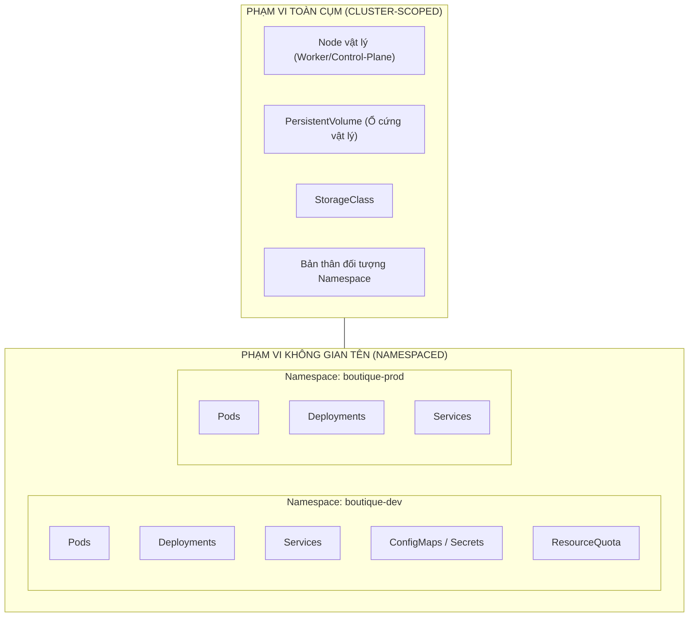

# Bài 11: Namespace & ResourceQuota cơ bản: Phân chia không gian làm việc

## 1. Thông tin bài học
* **Tên bài:** Bài 11: Namespace & ResourceQuota cơ bản: Phân chia không gian làm việc
* **Mục tiêu học:** Hiểu sâu sắc bản chất của Namespace như một cơ chế "cụm ảo" (Virtual Cluster) để phân chia không gian làm việc giữa các nhóm và môi trường; phân biệt rạch ròi những gì Namespace cô lập và KHÔNG cô lập; làm chủ `ResourceQuota` để đặt hạn ngạch tài nguyên ngăn chặn hiện tượng "Hàng xóm ồn ào" (Noisy Neighbor); thành thạo kỹ năng thao tác chuyển đổi namespace trên PowerShell và giao tiếp dịch vụ xuyên Namespace qua FQDN.
* **Thời lượng ước tính:** 120 phút (60 phút lý thuyết, 60 phút thực hành)
* **Kiến thức cần có trước:** Bài 07 (Labels & Selectors), Bài 10 (Service: Cầu nối mạng bền vững).
* **Liên quan kỳ thi:** CKAD, CKA (Kỹ năng cốt lõi bắt buộc: mọi câu hỏi thi CKA/CKAD đều yêu cầu thao tác trên một namespace chỉ định với cờ `-n`, cấu hình ResourceQuota, khắc phục sự cố kẹt namespace).

---

## 2. Bảng thuật ngữ

| Thuật ngữ | Giải thích đơn giản | Ví dụ / Ẩn dụ đời thường |
| :--- | :--- | :--- |
| **Namespace (ns)** | Cơ chế chia một cụm Kubernetes vật lý thành nhiều "cụm ảo" độc lập về mặt không gian tên và phạm vi quản lý. | Các căn hộ hoặc văn phòng riêng biệt trong cùng một tòa nhà chung cư. |
| **ResourceQuota (quota)** | Đối tượng đặt hạn ngạch giới hạn tổng lượng tài nguyên (số Pod, CPU, RAM) mà một Namespace được phép tiêu thụ. | Hạn mức chi tiêu tối đa trên thẻ tín dụng phụ của công ty cấp cho từng phòng ban. |
| **Scope (Phạm vi tài nguyên)** | Ranh giới hoạt động của một đối tượng: thuộc về một Namespace cụ thể (Namespaced) hay bao trùm toàn bộ cụm (Cluster-scoped). | Tài sản riêng của từng căn hộ (bàn, ghế) vs Tài sản chung của cả tòa nhà (thang máy, sân thượng). |
| **FQDN (Fully Qualified Domain Name)** | Tên miền đầy đủ của một dịch vụ trong Kubernetes giúp các Pod ở các Namespace khác nhau tìm thấy nhau. | Địa chỉ gửi thư đầy đủ kèm số phòng, tên tòa nhà, quận và thành phố (ví dụ: `app.dev.svc.cluster.local`). |
| **Noisy Neighbor (Hàng xóm ồn ào)** | Hiện tượng một ứng dụng ngốn sạch tài nguyên phần cứng của máy chủ, làm ảnh hưởng tiêu cực tới các ứng dụng bên cạnh. | Một người thuê nhà bật loa kéo hát karaoke hết công suất làm cả xóm không ngủ được. |
| **Multi-tenancy** | Kiến trúc cho phép nhiều nhóm người dùng hoặc môi trường (Dev, QA, Staging) dùng chung một hạ tầng phần cứng duy nhất. | Khu văn phòng làm việc chung (Co-working space) cho nhiều công ty cùng thuê chỗ ngồi. |

---

## 3. Bức tranh lớn: Vấn đề thực tế và ẩn dụ đời thường

### Nhắc lại bài trước
Ở Bài 10, chúng ta đã nắm vững đối tượng Service như một cầu nối mạng bền vững giúp các microservices tìm thấy nhau thông qua IP ảo cố định và tên miền nội bộ. Nhưng cho đến nay, toàn bộ các Pod, Deployment và Service chúng ta tạo ra đều nằm chung trong một "rổ" mặc định mang tên `default`. Khi công ty phát triển lên hàng chục đội ngũ (Dev, QA, Data, Security) cùng làm việc, điều gì sẽ xảy ra nếu ai cũng ném chung tài nguyên vào một chỗ?

### Tại sao cần cái này ở production? (Vấn đề thực tế)
Chi phí duy trì một cụm Kubernetes quy mô lớn (Control Plane, các máy chủ worker cấu hình mạnh, hệ thống giám sát) là rất đắt đỏ. Không có công ty nào đủ ngân sách để mua riêng mỗi cụm cho từng lập trình viên hay từng dự án nhỏ. Các doanh nghiệp bắt buộc phải áp dụng mô hình **Chia sẻ hạ tầng (Multi-tenancy)**: nhiều đội ngũ cùng dùng chung một cluster.

Nếu mọi người cùng làm việc trong không gian mặc định `default`, hàng loạt thảm họa sau sẽ xảy ra:
1. **Xung đột tên gọi (Naming Collision):** Đội Dự án A muốn đặt tên service là `frontend`. Đội Dự án B cũng muốn đặt tên service của họ là `frontend`. Kubernetes sẽ báo lỗi vì trong cùng một không gian, tên tài nguyên là duy nhất!
2. **Nguy cơ xóa nhầm thảm khốc:** Một kỹ sư intern của đội Thử nghiệm (QA) muốn dọn dẹp các bản test của mình, gõ lệnh `kubectl delete pods --all`. Lệnh này quét sạch toàn bộ Pod của cả công ty đang chạy trên cluster!
3. **Hiệu ứng "Hàng xóm ồn ào" (Noisy Neighbor):** Đội Khoa học dữ liệu (Data Team) chạy một script huấn luyện AI bị rò rỉ bộ nhớ. Nó âm thầm ngốn sạch 100% CPU và RAM của tất cả các Worker Node. Hậu quả là trang web bán hàng của đội Web bị bỏ đói tài nguyên, hàng ngàn khách hàng không thanh toán được đơn hàng.

Kubernetes giải quyết bài toán này bằng bộ đôi:
* **Namespace:** Xây dựng các vách ngăn logic để phân chia không gian làm việc.
* **ResourceQuota:** Đặt hạn ngạch trần ngăn không cho bất kỳ "hàng xóm" nào xài phung phí tài nguyên vượt quá định mức cho phép.

### Ẩn dụ đời thường: Tòa nhà Co-working Space và Ban quản lý

Hãy tưởng tượng toàn bộ cụm Kubernetes giống như một Tòa nhà văn phòng chia sẻ (Co-working Space):

1. **Kubernetes Cluster là Toàn bộ tòa nhà:** Dùng chung móng, cột bê tông, thang máy và hệ thống cấp thoát nước (dùng chung Linux Kernel, mạng CNI và các Worker Nodes).
2. **Namespace là Các văn phòng riêng có khóa cửa:**
   * Tòa nhà chia thành: Văn phòng Kế toán (`namespace: ke-toan`), Văn phòng Công nghệ (`namespace: cong-nghe`), Văn phòng Marketing (`namespace: marketing`).
   * Trong phòng Kế toán có một nhân viên tên là "Tuấn" (`name: frontend`), trong phòng Công nghệ cũng có thể có một nhân viên tên là "Tuấn" (`name: frontend`). Hai người này không hề bị trùng lặp danh tính vì họ thuộc về hai phòng ban khác nhau!
   * Khi trưởng phòng Kế toán yêu cầu: *"Cho toàn bộ nhân viên nghỉ việc"* (`delete pods --all -n ke-toan`), lệnh này chỉ tác động tới người trong phòng Kế toán; nhân viên phòng Công nghệ hoàn toàn bình yên vô sự.
3. **ResourceQuota là Quy định tiêu chuẩn của Ban quản lý tòa nhà:**
   * Ban quản lý cấp cho phòng Kế toán hạn mức: *"Phòng này chỉ được tối đa 5 người ngồi làm việc (`pods: 5`) và công suất điện tiêu thụ tối đa là 10 kW (`limits.cpu: 4`)"*.
   * Nếu phòng Kế toán cố tình tuyển thêm người thứ 6, bảo vệ tòa nhà sẽ chặn ngay ở cửa ra vào!
4. **Giao tiếp xuyên phòng ban (FQDN):**
   * Nếu nhân viên phòng Kế toán muốn nói chuyện với đồng nghiệp cùng phòng, họ chỉ cần gọi: *"Tuấn ơi!"* (`http://frontend`).
   * Nhưng nếu nhân viên phòng Marketing muốn gửi công văn sang cho Tuấn phòng Kế toán, họ phải ghi rõ địa chỉ thư tín đầy đủ: *"Gửi anh Tuấn, Phòng Kế toán, Tòa nhà K8s"* (`http://frontend.ke-toan.svc.cluster.local`).

---

## 4. Giải thích khái niệm theo từng bước

### Bước 1: Khám phá các Namespace mặc định sẵn có
Khi bạn vừa khởi tạo một cụm Kubernetes sạch sẽ (như cụm KinD ở Bài 04), hệ thống đã có sẵn 4 Namespace đặc biệt:

1. **`default`:** Không gian làm việc mặc định của người dùng khi không chỉ định cờ `-n`.
2. **`kube-system`:** Nơi trú ngụ của các thành phần đầu não và hạ tầng cốt lõi (`kube-apiserver`, `etcd`, `coredns`, `kube-proxy`, `kindnet`). Tuyệt đối không tự ý deploy ứng dụng thông thường vào đây!
3. **`kube-public`:** Không gian mở, được thiết kế để chứa các tài nguyên mà bất kỳ ai (kể cả người dùng chưa xác thực) đều có thể đọc được (như thông tin cluster-info).
4. **`kube-node-lease`:** Chứa các đối tượng `Lease` nhỏ ghi nhận tín hiệu nhịp tim (heartbeat) định kỳ của từng Worker Node gửi về Control Plane.

### Bước 2: Phân biệt phạm vi tài nguyên: Namespaced vs Cluster-scoped

Không phải mọi thứ trong Kubernetes đều có thể nhét vào Namespace!



* **Tài nguyên thuộc Namespace (Namespaced):** Là các đối tượng mang tính nghiệp vụ ứng dụng: `Pod`, `Service`, `Deployment`, `ReplicaSet`, `ConfigMap`, `Secret`, `ResourceQuota`. Tên của chúng chỉ cần là duy nhất trong cùng một Namespace.
* **Tài nguyên toàn cụm (Cluster-scoped):** Là các tài nguyên hạ tầng phần cứng hoặc đối tượng quản trị cấp cao: `Node`, `PersistentVolume (PV)`, `StorageClass`, `ClusterRole`, và **chính bản thân đối tượng `Namespace`**. Chúng không thuộc về bất kỳ namespace nào.

> **Mẹo Senior:** Muốn biết một tài nguyên có thuộc namespace hay không, hãy dùng lệnh:
> `kubectl api-resources --namespaced=true` (Xem tài nguyên có namespace)
> `kubectl api-resources --namespaced=false` (Xem tài nguyên toàn cụm)

### Bước 3: Cơ chế gọi dịch vụ xuyên Namespace (FQDN)
Mọi Service trong Kubernetes đều được CoreDNS gán một tên miền chuẩn mực có cấu trúc:

$$\mathbf{<service-name>.<namespace>.svc.cluster.local}$$

1. **Gọi trong cùng Namespace:** Chỉ cần dùng tên ngắn gọn:
   `http://cartservice:7070`
2. **Gọi sang Namespace khác:** Dùng tối thiểu 2 thành phần `<service>.<namespace>`:
   `http://cartservice.boutique-prod:7070`
3. **Gọi chuẩn FQDN đầy đủ:**
   `http://cartservice.boutique-prod.svc.cluster.local:7070`

### Bước 4: Kiểm soát tài nguyên bằng `ResourceQuota`
Đối tượng `ResourceQuota` giúp giới hạn tổng dung lượng tiêu thụ của một Namespace trên 2 khía cạnh:

1. **Hạn ngạch số lượng đối tượng (Object Count Quota):**
   * `count/pods: "5"` (Tối đa 5 Pods).
   * `count/services: "2"` (Tối đa 2 Services).
2. **Hạn ngạch tài nguyên tính toán (Compute Resource Quota):**
   * `requests.cpu: "500m"`, `limits.cpu: "1"` (Tổng CPU xin cấp và trần tối đa).
   * `requests.memory: "512Mi"`, `limits.memory: "1Gi"` (Tổng RAM xin cấp và trần tối đa).

> **ĐIỀU KIỆN TIÊN QUYẾT BẮT BUỘC (Quy tắc thép của ResourceQuota):**
> Một khi bạn đã kích hoạt ResourceQuota giới hạn CPU/RAM cho một Namespace, **bất kỳ ai muốn tạo Pod trong Namespace đó BẮT BUỘC phải khai báo trường `resources.requests` và `resources.limits`** trong file YAML của Pod.
> Nếu Pod không khai báo rõ ràng mình cần bao nhiêu RAM/CPU, Kube-APIServer sẽ **từ chối nộp manifest ngay lập tức**!

---

## 5. Thực hành (Lab)

Chúng ta sẽ mô phỏng tình huống thực tế của Online Boutique:
1. Tạo một Namespace riêng biệt cho môi trường phát triển: `dev-boutique`.
2. Áp đặt một `ResourceQuota` nghiêm ngặt: giới hạn **tối đa 2 Pods** và **512Mi RAM**.
3. Triển khai 2 bản sao frontend thành công.
4. Thử nghiệm scale lên 3 bản sao và chứng kiến Kube-APIServer chặn đứng Pod thứ 3 do vi phạm hạn ngạch.
5. Thử nghiệm gọi Service xuyên Namespace từ namespace `default` vào `dev-boutique` thông qua FQDN.

* **Môi trường:** Cluster kind `lab` (1 control-plane + 1 worker).
* **Mức RAM ước tính:** Khoảng **~80MB RAM** (hoàn toàn nhẹ nhàng).

### Bước 1: Tạo Namespace và ResourceQuota
Tạo file manifest `dev-env.yaml` trên PowerShell:

```powershell
@'
apiVersion: v1
kind: Namespace
metadata:
  name: dev-boutique
  labels:
    env: dev
    team: e-commerce
---
apiVersion: v1
kind: ResourceQuota
metadata:
  name: dev-quota
  namespace: dev-boutique
spec:
  hard:
    pods: "2"                  # Tối đa chỉ được chạy đúng 2 Pods
    requests.memory: "256Mi"   # Tổng RAM yêu cầu tối đa 256MB
    limits.memory: "512Mi"     # Tổng trần RAM tối đa 512MB
'@ | Set-Content -Path .\dev-env.yaml -Encoding UTF8

k apply -f .\dev-env.yaml
```

**Kết quả mong đợi (Expected Output):**
```text
namespace/dev-boutique created
resourcequota/dev-quota created
```

Kiểm tra trạng thái hạn ngạch vừa tạo:
```powershell
k get resourcequota -n dev-boutique
```

**Kết quả mong đợi (Expected Output):**
```text
NAME        AGE   REQUEST                             LIMIT
dev-quota   15s   pods: 0/2, requests.memory: 0/256Mi, limits.memory: 0/512Mi
```
*(Hiện tại mức sử dụng đang là 0).*

### Bước 2: Triển khai Deployment tuân thủ ResourceQuota
Nhớ quy tắc thép: Pod deploy vào đây bắt buộc phải có `resources.requests` và `resources.limits`!

Tạo file `dev-app.yaml`:
```powershell
@'
apiVersion: apps/v1
kind: Deployment
metadata:
  name: dev-frontend
  namespace: dev-boutique
spec:
  replicas: 2
  selector:
    matchLabels:
      app: dev-frontend
  template:
    metadata:
      labels:
        app: dev-frontend
    spec:
      containers:
        - name: web
          image: nginx:alpine
          ports:
            - containerPort: 80
          resources:
            requests:
              memory: "100Mi"
            limits:
              memory: "200Mi"
---
apiVersion: v1
kind: Service
metadata:
  name: dev-frontend-svc
  namespace: dev-boutique
spec:
  type: ClusterIP
  selector:
    app: dev-frontend
  ports:
    - port: 80
      targetPort: 80
'@ | Set-Content -Path .\dev-app.yaml -Encoding UTF8

k apply -f .\dev-app.yaml
```

**Kết quả mong đợi (Expected Output):**
```text
deployment.apps/dev-frontend created
service/dev-frontend-svc created
```

Kiểm tra lại mức sử dụng hạn ngạch:
```powershell
k get resourcequota -n dev-boutique
```

**Kết quả mong đợi (Expected Output):**
```text
NAME        AGE    REQUEST                                   LIMIT
dev-quota   2m5s   pods: 2/2, requests.memory: 200Mi/256Mi   limits.memory: 400Mi/512Mi
```
Hệ thống báo rõ: Đã dùng **2/2 Pods**, hạn ngạch số lượng Pod đã chạm mức tối đa 100%!

### Bước 3: Cố tình vi phạm hạn ngạch - Chứng kiến K8s tự bảo vệ
Hãy thử scale Deployment lên 3 bản sao xem chuyện gì xảy ra:

```powershell
k scale deployment dev-frontend -n dev-boutique --replicas=3
```

Kiểm tra danh sách Pod trong namespace `dev-boutique`:
```powershell
k get pods -n dev-boutique
```

**Kết quả mong đợi (Expected Output):**
```text
NAME                            READY   STATUS    RESTARTS   AGE
dev-frontend-7f9b8c6d4-abc1     1/1     Running   0          90s
dev-frontend-7f9b8c6d4-xyz2     1/1     Running   0          90s
```
*(Ủa, tại sao chỉ có 2 Pods? Pod thứ 3 đâu rồi?)*

Hãy điều tra ReplicaSet bên dưới để tìm thủ phạm:
```powershell
k describe rs -n dev-boutique -l app=dev-frontend
```

Cuộn xuống mục `Events:`, bạn sẽ thấy dòng cảnh báo đắt giá:

**Kết quả mong đợi (Expected Output):**
```text
Events:
  Type     Reason        Age   From                   Message
  ----     ------        ----  ----                   -------
  Warning  FailedCreate  15s   replicaset-controller  (combined from similar events): Error creating: pods "dev-frontend-..." is forbidden: exceeded quota: dev-quota, requested: pods=1, used: pods=2, limited: pods=2
```

> **Giải thích của Senior:** Kube-APIServer đã từ chối yêu cầu tạo Pod thứ 3 với lỗi rõ ràng: `forbidden: exceeded quota: dev-quota`. Đây chính là "lá chắn thép" bảo vệ cluster khỏi việc một nhóm người dùng vô tình chiếm đoạt toàn bộ tài nguyên của cụm!

### Bước 4: Kiểm chứng giao tiếp xuyên Namespace bằng FQDN
Bây giờ, chúng ta đứng từ namespace `default` (mặc định) và gửi request sang Service `dev-frontend-svc` đang nằm ở namespace `dev-boutique`:

```powershell
# Chạy một container curl tạm thời trong namespace default
k run curl-test --image=curlimages/curl:8.6.0 -it --rm -- curl -I http://dev-frontend-svc.dev-boutique.svc.cluster.local
```

**Kết quả mong đợi (Expected Output):**
```text
HTTP/1.1 200 OK
Server: nginx/...
Connection: close
```

Thử nghiệm với tên rút gọn `<service>.<namespace>`:
```powershell
k run curl-test --image=curlimages/curl:8.6.0 -it --rm -- curl -I http://dev-frontend-svc.dev-boutique
```

**Kết quả:** Vẫn trả về `HTTP/1.1 200 OK`!

> **Kết luận:** Mặc định trong Kubernetes, **các Namespace KHÔNG hề bị cô lập về mặt mạng (Network Isolation)**! Các Pod ở namespace `default` vẫn có thể nói chuyện tự do với các Service ở namespace `dev-boutique` thông qua tên miền FQDN. Nếu muốn chặn luồng mạng này, chúng ta bắt buộc phải sử dụng **NetworkPolicy** (sẽ học ở Bài 22).

### Bước 5: Mẹo thực chiến CKA: Đổi Namespace mặc định trên PowerShell
Khi làm bài thi CKA, việc liên tục phải gõ `-n <namespace>` ở mọi câu lệnh rất dễ bị quên và tốn thời gian. Bạn có thể đổi namespace mặc định của context hiện tại bằng 1 lệnh duy nhất:

```powershell
# Đổi namespace mặc định sang dev-boutique
k config set-context --current --namespace=dev-boutique

# Bây giờ không cần gõ -n nữa!
k get pods
```
*Kết quả:* Tự động hiển thị các Pod của `dev-boutique`!

Để quay lại namespace ban đầu:
```powershell
k config set-context --current --namespace=default
```

### Bước 6: Dọn dẹp tài nguyên (Cleanup)
Xóa toàn bộ môi trường thử nghiệm:

```powershell
k delete -f .\dev-app.yaml
k delete -f .\dev-env.yaml
Remove-Item -Path .\dev-env.yaml, .\dev-app.yaml
```

---

## 6. Lỗi thường gặp và cách debug

### Lỗi 1: Pod bị từ chối với lỗi `must specify limits.memory`
* **Dấu hiệu:** `Error from server (Forbidden): error when creating "pod.yaml": pods "my-pod" is forbidden: failed quota: dev-quota: must specify limits.memory, requests.memory`.
* **Nguyên nhân:** Namespace có cấu hình ResourceQuota giới hạn RAM/CPU, nhưng file YAML của Pod lại không khai báo khối `resources.requests` và `resources.limits`.
* **Cách khắc phục:** 
  1. Thêm đầy đủ `resources` vào Pod manifest.
  2. Hoặc tạo thêm một đối tượng **`LimitRange`** trong Namespace đó để tự động gán giá trị CPU/RAM mặc định khi lập trình viên quên khai báo.

### Lỗi 2: Quên chỉ định cờ `-n` khiến terminal báo `No resources found`
* **Dấu hiệu:** Bạn vừa deploy một ứng dụng vào namespace `staging`, nhưng khi gõ `kubectl get pods` thì terminal thông báo: `No resources found in default namespace.`
* **Nguyên nhân:** Lệnh `kubectl` mặc định luôn chỉ tìm kiếm tài nguyên trong namespace `default` nếu không có cờ `-n`.
* **Cách khắc phục:** 
  * Luôn thêm cờ `-n <ten-ns>`, ví dụ: `k get pods -n staging`.
  * Hoặc dùng cờ `-A` (`--all-namespaces`) để quét sạch toàn bộ tài nguyên trên tất cả các namespace trong cụm: `k get pods -A`.

### Lỗi 3: Namespace bị kẹt ở trạng thái `Terminating` vô thời hạn khi xóa
* **Dấu hiệu:** Bạn gõ `kubectl delete ns <ten-ns>`, terminal đứng yên, sau đó gõ `kubectl get ns` thấy cột `STATUS` hiển thị `Terminating` kéo dài hàng giờ không chịu biến mất.
* **Nguyên nhân cốt lõi ở Production:** 
  * Trong Namespace đó vẫn còn tài nguyên con (thường là Custom Resources hoặc PersistentVolumeClaim) chưa được giải phóng sạch.
  * Các tài nguyên này bị khóa bởi một trường gọi là **Finalizers** (cơ chế khóa ngăn xóa cho tới khi dọn dẹp xong dữ liệu bên dưới).
* **Cách debug và xử lý của Senior:**
  1. Kiểm tra xem tài nguyên nào còn sót lại trong namespace:
     ```powershell
     k api-resources --verbs=list --namespaced -o name | ForEach-Object { k get $_ -n <ten-ns> --ignore-not-found }
     ```
  2. Nếu cần xóa cưỡng bức (Force delete), chỉnh sửa file JSON của Namespace để gỡ bỏ mảng `finalizers: []`.

---

## 7. Góc nhìn Senior

### 1. Sự đánh đổi (Trade-offs)
* **Soft Multi-tenancy (Dùng chung cụm bằng Namespace) vs Hard Multi-tenancy (Mỗi team 1 cụm riêng):**
  * **Soft Multi-tenancy (Lựa chọn kinh tế phổ biến):**
    * *Ưu điểm:* Tiết kiệm chi phí tối đa, tận dụng triệt để tài nguyên nhàn rỗi của node, quản trị tập trung một nơi.
    * *Nhược điểm:* **Mức độ cô lập chỉ là cô lập mềm**. Namespace không hề chia tách Linux Kernel. Nếu một container bị dính lỗi Kernel Panic hoặc mã độc phá rào container breakout (đã học ở Bài 01), cả cluster sẽ bị đe dọa.
  * **Hard Multi-tenancy:**
    * Dành riêng cho các khách hàng không tin cậy lẫn nhau (Untrusted Multi-tenant). Bắt buộc phải dựng các cụm Kubernetes hoàn toàn tách biệt về mặt máy chủ vật lý, hoặc sử dụng công cụ ảo hóa cấp vi mô như **vCluster** (Virtual Clusters trong một cluster).

### 2. Best practices tại production
* **Quy chuẩn đặt tên Namespace theo mô hình ma trận:**
  * Luôn đặt tên theo cú pháp: `<ten-du-an>-<moi-truong>`
    * Ví dụ: `boutique-dev`, `boutique-staging`, `boutique-prod`.
  * Tuyệt đối không bao giờ chạy chung ứng dụng Production và Development trong cùng một Namespace!
* **Bắt buộc triển khai cặp bài trùng: ResourceQuota + LimitRange:**
  * `ResourceQuota` đóng vai trò là "chiếc trần nhà" khống chế tổng tài nguyên cả phòng ban.
  * `LimitRange` đóng vai trò là "quy chuẩn từng cá nhân", tự động áp mức tối thiểu/tối đa cho từng Pod đơn lẻ, ngăn một Pod cá biệt ăn trọn toàn bộ hạn ngạch của cả phòng.
* **Tự động hóa dọn dẹp các Namespace tạm thời (Ephemeral Namespaces):**
  * Trong quy trình CI/CD hiện đại, mỗi khi lập trình viên mở một Pull Request (PR), hệ thống tự động tạo một Namespace riêng mang tên PR đó (ví dụ: `pr-1234`) để test. Sau khi merge code hoặc sau 24 giờ, một CronJob sẽ tự động xóa sạch namespace này để không rác cluster.

### 3. Câu hỏi phỏng vấn Senior
* **Câu hỏi 1:** *"Namespace trong Kubernetes có khả năng cô lập mạng (Network Isolation) mặc định giữa các Pod thuộc các namespace khác nhau không? Làm thế nào để ngăn chặn một Pod ở namespace `dev` gửi request tới database ở namespace `prod`?"*
  * **Gợi ý trả lời chuẩn:**
    * **Trả lời:** **HOÀN TOÀN KHÔNG CÔ LẬP MẠNG MẶC ĐỊNH**. Kubernetes tuân theo triết lý mạng phẳng (Flat Network): mọi Pod ở bất kỳ namespace nào đều có thể kết nối trực tiếp tới IP hoặc FQDN của Pod ở namespace khác.
    * **Giải pháp khắc phục:** Bắt buộc phải triển khai đối tượng **`NetworkPolicy`** (yêu cầu CNI hỗ trợ như Calico, Cilium). Chúng ta sẽ áp dụng một chính sách luật mạng `Deny All Ingress` ở namespace `prod` và chỉ cho phép duy nhất các gói tin có nhãn xác thực từ nội bộ namespace `prod` đi vào, từ chối toàn bộ traffic từ `dev`.
* **Câu hỏi 2:** *"Điều gì sẽ xảy ra nếu một kỹ sư gõ lệnh `kubectl delete namespace my-project` trên production? Quá trình xóa diễn ra tuần tự như thế nào?"*
  * **Gợi ý trả lời chuẩn:**
    * **Hậu quả:** Toàn bộ tài nguyên thuộc phạm vi namespace đó (Pods, Deployments, Services, ConfigMaps, Secrets, PVCs) sẽ **bị xóa sạch vĩnh viễn theo hiệu ứng thác đổ (Cascading deletion)**! Dữ liệu không thể cứu vãn nếu không có bản backup etcd từ trước.
    * **Luồng xử lý bên dưới:**
      1. Kube-APIServer đánh dấu Namespace chuyển sang trạng thái `Terminating`.
      2. Namespace Controller bắt đầu phát lệnh tiêu hủy toàn bộ các tài nguyên con bên trong nó theo thứ tự ưu tiên.
      3. Chờ toàn bộ các tiến trình hoàn tất việc giải phóng tài nguyên và dọn dẹp các Finalizers.
      4. Khi không còn bất kỳ tài nguyên con nào, API Server chính thức xóa bỏ bản ghi của Namespace khỏi cơ sở dữ liệu `etcd`.

---

## 8. Tóm tắt bài học
* 📌 **1.** **Namespace** tạo ra các "cụm ảo" logic để phân tách môi trường (dev/prod) và các đội ngũ trên cùng một hạ tầng chia sẻ.
* 📌 **2.** Tài nguyên nghiệp vụ (`Pod, Svc, Deploy`) thuộc phạm vi **Namespaced**; tài nguyên hạ tầng (`Node, PV, StorageClass`) thuộc phạm vi **Cluster-scoped**.
* 📌 **3.** Gọi dịch vụ xuyên Namespace thông qua tên miền **FQDN**: `<service-name>.<namespace>.svc.cluster.local`.
* 📌 **4.** **`ResourceQuota`** kiểm soát số lượng đối tượng và trần dung lượng CPU/RAM, ngăn ngừa hiệu ứng "Hàng xóm ồn ào".
* 📌 **5.** Namespace **không hề cô lập mạng mặc định**; muốn chặn luồng giao tiếp xuyên namespace bắt buộc phải dùng NetworkPolicy.

---

## 9. Bài tập tự làm

* 🟢 **Mức Dễ:** Tạo một namespace mới tên `qa-team`. Tạo một Pod Nginx bên trong namespace này bằng dòng lệnh `kubectl run`. Dùng lệnh `kubectl get pods -n qa-team` và `kubectl get pods -A` để kiểm tra.
* 🟡 **Mức Vừa:** Áp dụng một ResourceQuota lên namespace `qa-team` giới hạn tối đa chỉ được chạy `count/pods: 1`. Thử tạo Pod thứ 2 trong namespace này và quan sát thông báo lỗi từ terminal.
* 🔴 **Mức Khó (Truy vấn FQDN thực chiến):**
  1. Tạo 2 namespace: `alpha` và `beta`.
  2. Trong `alpha`, triển khai một Service Nginx tên `web-svc` mở cổng 80.
  3. Trong `beta`, chạy một container `curlimages/curl` tạm thời. Hãy sử dụng đúng cú pháp FQDN ngắn gọn và đầy đủ để gửi HTTP request từ `beta` sang `alpha` thành công.

---

## 10. Câu hỏi tự kiểm tra

1. Lệnh nào trong `kubectl` cho phép liệt kê toàn bộ các Pod đang chạy trên TẤT CẢ các Namespace trong cluster cùng một lúc?
2. Khi bạn xóa một đối tượng Namespace, các Pod và Service nằm bên trong Namespace đó có tiếp tục tồn tại không?
3. Đối tượng `PersistentVolume (PV)` và đối tượng `Node` thuộc phạm vi tài nguyên nào (Namespaced hay Cluster-scoped)?
4. Cú pháp FQDN đầy đủ để gọi một Service tên `orders` nằm trong namespace `sales` trên cổng 8080 là gì?
5. Nếu một Namespace đã được cấu hình ResourceQuota về CPU và RAM, điều gì sẽ xảy ra nếu lập trình viên nộp một file manifest Pod không hề có khối `resources`?
6. Mặc định trong Kubernetes, một Pod ở namespace `test` có thể gửi gói tin mạng tới một Pod ở namespace `production` được không?

<details>
<summary>👉 Bấm vào đây để xem đáp án câu hỏi tự kiểm tra</summary>

* **Đáp án 1:** Câu lệnh: `kubectl get pods -A` (hoặc `kubectl get pods --all-namespaces`).
* **Đáp án 2:** **KHÔNG**. Toàn bộ tài nguyên bên trong Namespace sẽ bị xóa sạch theo hiệu ứng thác đổ (Cascade deletion).
* **Đáp án 3:** Thuộc phạm vi **Toàn cụm (Cluster-scoped)**. Chúng dùng chung cho toàn bộ cluster chứ không thuộc riêng về namespace nào.
* **Đáp án 4:** Cú pháp: `http://orders.sales.svc.cluster.local:8080`.
* **Đáp án 5:** Kube-APIServer sẽ **từ chối tiếp nhận yêu cầu ngay lập tức với lỗi Forbidden**, yêu cầu bắt buộc phải khai báo `requests` và `limits`.
* **Đáp án 6:** **HOÀN TOÀN ĐƯỢC**. Kubernetes sử dụng mô hình mạng phẳng mặc định giữa các namespace; muốn cấm bắt buộc phải cấu hình NetworkPolicy.
</details>

---

## 11. Tài liệu đọc thêm và bài tiếp theo

### Tài liệu tham khảo
* [Tài liệu chính thức Kubernetes: Namespaces Overview](https://kubernetes.io/docs/concepts/overview/working-with-objects/namespaces/)
* [Tài liệu chính thức Kubernetes: Resource Quotas](https://kubernetes.io/docs/concepts/policy/resource-quotas/)
* [Tài liệu chính thức Kubernetes: Limit Ranges](https://kubernetes.io/docs/concepts/policy/limit-range/)
* [Tài liệu thực hành FQDN & DNS: DNS for Services and Pods](https://kubernetes.io/docs/concepts/services-networking/dns-pod-service/)

### Bài tiếp theo
👉 **Bài 12: ConfigMap: Tách rời cấu hình khỏi mã nguồn**

---

## PHỤ LỤC: ĐÁP ÁN GỢI Ý BÀI TẬP TỰ LÀM (MỤC 9)

### Đáp án Mức Dễ
```powershell
# 1. Tạo namespace
k create namespace qa-team

# 2. Chạy Pod trong namespace qa-team
k run qa-web --image=nginx:alpine -n qa-team

# 3. Kiểm tra
k get pods -n qa-team
k get pods -A | Select-String "qa-team"
```

### Đáp án Mức Vừa
```powershell
# 1. Áp đặt ResourceQuota 1 Pod
@'
apiVersion: v1
kind: ResourceQuota
metadata:
  name: pod-limit
  namespace: qa-team
spec:
  hard:
    count/pods: "1"
'@ | k apply -f -

# 2. Thử tạo Pod thứ 2
k run qa-web-2 --image=nginx:alpine -n qa-team
```
*Kết quả:* Terminal báo lỗi ngay lập tức:
`Error from server (Forbidden): pods "qa-web-2" is forbidden: exceeded quota: pod-limit, requested: count/pods=1, used: count/pods=1, limited: count/pods=1`

### Đáp án Mức Khó
```powershell
# 1. Tạo 2 namespace
k create ns alpha
k create ns beta

# 2. Tạo Service trong alpha
k create deployment web --image=nginx:alpine -n alpha
k expose deployment web --port=80 --name=web-svc -n alpha

# 3. Đứng từ beta gọi sang alpha qua FQDN
# Cách 1: Tên rút gọn <service>.<namespace>
k run curl-client --image=curlimages/curl:8.6.0 -n beta -it --rm -- curl -I http://web-svc.alpha

# Cách 2: Tên FQDN đầy đủ
k run curl-client --image=curlimages/curl:8.6.0 -n beta -it --rm -- curl -I http://web-svc.alpha.svc.cluster.local
```
Cả 2 cách đều nhận về `HTTP/1.1 200 OK` thành công rực rỡ!
Dọn dẹp: `k delete ns alpha beta qa-team`.
