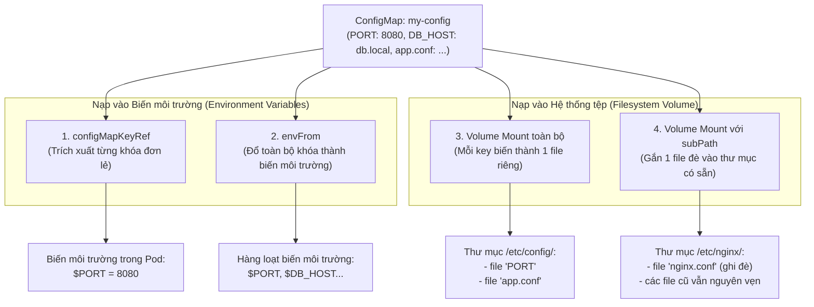

# Bài 12: ConfigMap: Tách rời cấu hình khỏi mã nguồn

## 1. Thông tin bài học
* **Tên bài:** Bài 12: ConfigMap: Tách rời cấu hình khỏi mã nguồn
* **Mục tiêu học:** Hiểu sâu sắc nguyên tắc "Tách biệt cấu hình khỏi mã nguồn" theo chuẩn phương pháp luận 12-Factor App; làm chủ việc lưu trữ cấu hình dưới dạng cặp khóa - giá trị hoặc file hoàn chỉnh bằng ConfigMap; thành thạo 4 kỹ thuật nạp cấu hình vào Pod (`configMapKeyRef`, `envFrom`, `volumeMounts`, và `subPath`); phân tích cơ chế cập nhật tự động (Live Reload) và biết cách tối ưu hóa bảo vệ cluster bằng cờ `immutable: true`.
* **Thời lượng ước tính:** 120 phút (60 phút lý thuyết, 60 phút thực hành)
* **Kiến thức cần có trước:** Bài 06 (Pod: Đơn vị tính toán nguyên tử), Bài 09 (Deployment: Quản lý triển khai).
* **Liên quan kỳ thi:** CKAD, CKA (Chủ đề bắt buộc: chiếm 10–15% bài thi với các yêu cầu tạo ConfigMap từ dòng lệnh/file, truyền biến môi trường vào container, gắn file cấu hình vào thư mục và debug lỗi thiếu config).

---

## 2. Bảng thuật ngữ

| Thuật ngữ | Giải thích đơn giản | Ví dụ / Ẩn dụ đời thường |
| :--- | :--- | :--- |
| **ConfigMap (cm)** | Đối tượng API dùng để lưu trữ các dữ liệu cấu hình phi bí mật dưới dạng cặp khóa - giá trị (`key: value`). | Chiếc thẻ nhớ microSD chứa file nhạc và file cài đặt âm lượng để cắm vào máy nghe nhạc. |
| **12-Factor App** | Bộ 12 nguyên tắc vàng chuẩn mực trong thiết kế ứng dụng đám mây (Cloud-Native), trong đó yếu tố số 3 yêu cầu tách rời cấu hình khỏi code. | Quy chuẩn xây dựng nhà tiền chế: khung nhà đúc sẵn trong xưởng, nội thất trang trí thay đổi tùy gia chủ. |
| **`configMapKeyRef`** | Cơ chế trích xuất giá trị của MỘT khóa đơn lẻ trong ConfigMap để gán vào một biến môi trường cụ thể. | Rút một đồng xu có mệnh giá định sẵn từ trong ống tiền tiết kiệm ra tiêu. |
| **`envFrom`** | Cơ chế đổ TOÀN BỘ các cặp khóa - giá trị của ConfigMap thành hàng loạt biến môi trường trong container cùng một lúc. | Đổ nguyên một xô nước vào bồn mà không cần múc từng gáo. |
| **Volume Mount** | Gắn ConfigMap vào hệ thống tệp của Pod: mỗi khóa biến thành một tên tệp và giá trị biến thành nội dung tệp. | Cắm ổ cứng di động vào máy tính: mỗi thư mục/tệp trong ổ cứng hiện lên trên màn hình. |
| **`subPath`** | Kỹ thuật gắn đè DUY NHẤT MỘT TỆP từ ConfigMap vào thư mục có sẵn mà không làm che khuất các tệp khác trong thư mục đó. | Dán một tờ giấy ghi chú lên mặt tủ lạnh mà không làm rơi các bức ảnh kỷ niệm đã dán trước đó. |
| **Immutable ConfigMap** | Tính năng đóng băng ConfigMap ở trạng thái chỉ đọc, cấm mọi hành vi sửa đổi dữ liệu sau khi tạo. | Tờ di chúc đã được công chứng và ép nhựa plastic vĩnh viễn, không ai được tẩy xóa. |

---

## 3. Bức tranh lớn: Vấn đề thực tế và ẩn dụ đời thường

### Nhắc lại bài trước
Ở Bài 11, chúng ta đã khép lại Giai đoạn 2 bằng việc làm chủ **Namespace** và **ResourceQuota** để phân chia ranh giới làm việc an toàn giữa các nhóm. Tuy nhiên, khi một ứng dụng di chuyển qua các môi trường khác nhau (từ môi trường phát triển `dev`, qua kiểm thử `staging`, tới môi trường sản xuất `prod`), các tham số như cổng dịch vụ, đường dẫn kết nối API, hay cờ bật/tắt tính năng (Feature Flags) chắc chắn phải khác nhau. Làm thế nào để điều chỉnh các tham số này mà không phải "đập đi build lại" Docker Image? Đó là sứ mệnh của **ConfigMap**.

### Tại sao cần cái này ở production? (Vấn đề thực tế)
Trước khi chuẩn 12-Factor App và Kubernetes trở thành tiêu chuẩn công nghiệp, các lập trình viên thường mắc phải một thói quen tai hại: **Ghi cứng (Hardcode) cấu hình trực tiếp vào mã nguồn hoặc file cấu hình đóng gói chết trong Dockerfile**:
```python
# Sai lầm nghiêm trọng ở production:
DATABASE_URL = "http://dev-db.internal:5432"
MAX_CONNECTIONS = 50
```

Hậu quả của cách làm này là một cơn ác mộng:
1. Khi muốn đưa code lên môi trường `staging`, lập trình viên phải sửa lại code thành `DATABASE_URL = "http://staging-db..."`, sau đó ngồi chờ 10 phút để hệ thống CI/CD build ra image `my-app:staging`.
2. Khi đưa lên `production`, lại sửa code một lần nữa để build ra image `my-app:prod`.
3. **Mối nguy hiểm cốt tử:** Image bạn vừa test kỹ lưỡng trên `staging` và image bạn đem chạy trên `production` thực chất là **hai image hoàn toàn khác nhau**! Rất có thể trong lần build cho production, một thư viện bên thứ ba vừa cập nhật bản vá lỗi làm thay đổi hành vi code mà bạn không hề hay biết!
4. Nếu muốn đổi một cờ cấu hình nhỏ (ví dụ đổi thời gian timeout từ 30s lên 60s), bạn phải thực hiện lại toàn bộ quy trình: commit git $\rightarrow$ build image $\rightarrow$ push image lên Registry $\rightarrow$ deploy lại.

**Nguyên tắc vàng của Kubernetes Platform Engineering:**
> **"Một Image duy nhất được phép đi từ Dev qua Staging đến Production mà không bao giờ được build lại (Build Once, Deploy Anywhere). Mọi sự khác biệt giữa các môi trường BẮT BUỘC phải được nạp từ bên ngoài qua ConfigMap!"**

### Ẩn dụ đời thường: Chiếc máy chơi game Console và Đĩa game

1. **Container Image là Chiếc máy chơi game Sony PlayStation:**
   * Chiếc máy PlayStation được sản xuất hàng loạt trong nhà máy, mọi linh kiện phần cứng (CPU, GPU, RAM) được niêm phong cố định (bất biến - Immutable).
   * Bạn không thể đập chiếc máy ra để hàn lại mạch điện mỗi khi muốn chơi trò chơi mới.
2. **ConfigMap là Chiếc đĩa game cắm vào máy:**
   * Hôm nay bạn cắm đĩa game bóng đá FIFA (nạp cấu hình môi trường `dev`), máy chơi game sẽ biến thành sân vận động.
   * Ngày mai bạn cắm đĩa game nhập vai đi cảnh (nạp cấu hình môi trường `prod`), chiếc máy sẽ biến thành thế giới thần thoại.
   * Bản thân chiếc máy console không hề thay đổi một con ốc nào! Bạn chỉ việc thay đổi chiếc đĩa cắm vào khe cắm.

---

## 4. Giải thích khái niệm theo từng bước

### Bước 1: Cấu trúc của một ConfigMap Manifest
Một ConfigMap thuộc nhóm API cốt lõi `apiVersion: v1`. Dữ liệu cấu hình được đặt trong khối `data` dưới dạng các cặp `key: value`:

```yaml
apiVersion: v1
kind: ConfigMap
metadata:
  name: boutique-frontend-config
  namespace: default
data:
  # Dạng 1: Các biến cấu hình đơn lẻ
  PORT: "8080"
  ENABLE_PROFILER: "true"
  PRODUCT_CATALOG_SERVICE_ADDR: "productcatalogservice:3550"

  # Dạng 2: Cả một file cấu hình phức tạp nhiều dòng (dùng dấu gạch đứng |)
  nginx.conf: |
    server {
        listen 80;
        server_name localhost;
        location / {
            proxy_pass http://localhost:8080;
        }
    }
```

> **Lưu ý cú pháp:** Mọi giá trị trong `data` **bắt buộc phải là kiểu chuỗi (string)**. Nếu bạn ghi `PORT: 8080` (kiểu số nguyên) hay `ENABLE_PROFILER: true` (kiểu boolean) mà không bọc trong dấu ngoặc kép `""`, Kubernetes sẽ báo lỗi cú pháp YAML Validation Error!

### Bước 2: Bốn phương pháp nạp ConfigMap vào Pod



#### Phương pháp 1: Trích xuất từng khóa đơn lẻ (`configMapKeyRef`)
Dùng khi bạn chỉ muốn lấy một vài giá trị cụ thể từ ConfigMap và muốn đổi tên biến môi trường trong code cho khác với tên khóa:
```yaml
env:
  - name: APP_PORT             # Tên biến môi trường mà code của bạn đọc
    valueFrom:
      configMapKeyRef:
        name: boutique-frontend-config  # Tên ConfigMap
        key: PORT                       # Khóa cần lấy giá trị
```

#### Phương pháp 2: Nạp toàn bộ các khóa cùng lúc (`envFrom`)
Dùng khi ConfigMap chứa hàng chục biến môi trường và bạn muốn nạp sạch vào container mà không muốn viết lặp đi lặp lại:
```yaml
envFrom:
  - configMapRef:
      name: boutique-frontend-config
```

#### Phương pháp 3: Gắn thành thư mục tệp tin (`Volume Mount`)
Dùng khi ứng dụng của bạn yêu cầu đọc file cấu hình từ ổ đĩa (như `nginx.conf`, `app.properties`, `settings.json`):
```yaml
spec:
  volumes:
    - name: config-volume
      configMap:
        name: boutique-frontend-config
  containers:
    - name: web
      image: nginx:alpine
      volumeMounts:
        - name: config-volume
          mountPath: /etc/config   # Thư mục sẽ xuất hiện trong container
```
*Kết quả:* Bên trong container tại `/etc/config/`, Kubelet sẽ tự động tạo ra các file: `/etc/config/PORT`, `/etc/config/ENABLE_PROFILER` và `/etc/config/nginx.conf`.

#### Phương pháp 4: Kỹ thuật gắn tệp đơn lẻ (`subPath`)
* **Vấn đề của Phương pháp 3:** Khi bạn mount một Volume vào một thư mục đã có sẵn trong image (ví dụ `/etc/nginx/`), Linux sẽ **che khuất (ẩn) toàn bộ các file ban đầu của thư mục đó**! Toàn bộ file mặc định của Nginx sẽ biến mất sạch sẽ.
* **Giải pháp:** Sử dụng cờ `subPath` để chỉ gắn đúng một file duy nhất vào thư mục:
```yaml
volumeMounts:
  - name: config-volume
    mountPath: /etc/nginx/nginx.conf  # Đường dẫn đích đến tận tên file
    subPath: nginx.conf              # Khóa trong ConfigMap cần trích xuất
```

### Bước 3: So sánh cơ chế cập nhật: Biến môi trường vs Volume Mount

| Tiêu chí | Nạp qua Biến môi trường (`env`) | Nạp qua Volume Mount |
| :--- | :--- | :--- |
| **Tốc độ đọc của ứng dụng** | Siêu nhanh (nằm sẵn trong RAM của tiến trình). | Đọc I/O từ ổ đĩa ảo. |
| **Khả năng tự cập nhật (Live Reload)** | **KHÔNG TỰ CẬP NHẬT**. Biến môi trường được gắn cố định vào tiến trình khi container khởi động. Nếu bạn sửa ConfigMap, biến môi trường cũ vẫn giữ nguyên. | **TỰ ĐỘNG CẬP NHẬT NGẦM**. Kubelet định kỳ đồng bộ (khoảng 1–2 phút) nội dung file mới trên ổ đĩa thông qua cơ chế symbolic link (`..data`). |
| **Cách áp dụng cấu hình mới** | Bắt buộc phải khởi động lại Pod (`kubectl rollout restart`). | Nếu ứng dụng có tính năng tự động theo dõi file (Hot-reload như Nginx reload, Prometheus reload), ứng dụng sẽ ăn cấu hình mới ngay lập tức mà **không cần restart Pod**! |

### Bước 4: Tính năng ConfigMap bất biến (`immutable: true`)
Kể từ Kubernetes v1.21+, bạn có thể bổ sung trường `immutable: true` vào manifest của ConfigMap:

```yaml
apiVersion: v1
kind: ConfigMap
metadata:
  name: production-config
immutable: true
data:
  FEATURE_FLAG: "true"
```

**Tại sao Senior Platform Engineer luôn khuyên dùng tính năng này ở Production?**
1. **Bảo vệ an toàn tối đa:** Ngăn chặn tuyệt đối việc một kỹ sư vô tình gõ lệnh `kubectl edit cm` sửa nhầm cấu hình làm ảnh hưởng tới hàng trăm Pod đang chạy.
2. **Tăng tốc hiệu năng cluster:** Kube-APIServer và Kubelet không cần duy trì các luồng theo dõi (Watch stream) để thăm dò sự thay đổi của ConfigMap này, giúp giảm tới 80% tải CPU và bộ nhớ cho Control Plane ở các cụm quy mô lớn.
3. *Quy tắc khi muốn đổi cấu hình:* Tạo một ConfigMap mới với tên phiên bản mới (ví dụ: `production-config-v2`) và cập nhật Deployment.

---

## 5. Thực hành (Lab)

Chúng ta sẽ thực hiện kịch bản thực tế mô phỏng cấu hình của Google Online Boutique:
1. Tạo một ConfigMap chứa các biến môi trường kết nối microservice và một file thông điệp chào mừng `welcome.txt`.
2. Triển khai một Pod nạp ConfigMap theo cả 2 hình thức: vừa nạp biến môi trường vừa mount file đơn lẻ bằng `subPath`.
3. Kiểm chứng biến môi trường và nội dung file bên trong container.
4. Thử nghiệm chỉnh sửa ConfigMap và quan sát sự khác biệt về khả năng tự cập nhật.

* **Môi trường:** Cluster kind `lab` (1 control-plane + 1 worker).
* **Mức RAM ước tính:** Khoảng **~60MB RAM** (hoàn toàn nhẹ nhàng).

### Bước 1: Khởi tạo ConfigMap bằng manifest YAML
Tạo file `app-config.yaml` trên PowerShell:

```powershell
@'
apiVersion: v1
kind: ConfigMap
metadata:
  name: boutique-config
  labels:
    app: online-boutique
data:
  APP_PORT: "8080"
  CURRENCY_CODE: "VND"
  WELCOME_MESSAGE: "Chao mung den voi Google Online Boutique Viet Nam!"
  banner.txt: |
    ===========================================
    *   ONLINE BOUTIQUE PRODUCTION CLUSTER   *
    ===========================================
'@ | Set-Content -Path .\app-config.yaml -Encoding UTF8

k apply -f .\app-config.yaml
```

**Kết quả mong đợi (Expected Output):**
```text
configmap/boutique-config created
```

Kiểm tra nội dung ConfigMap vừa tạo:
```powershell
k describe cm boutique-config
```

**Kết quả mong đợi (Expected Output):**
```text
Name:         boutique-config
Namespace:    default
Labels:       app=online-boutique
Data
====
APP_PORT:
----
8080
CURRENCY_CODE:
----
VND
WELCOME_MESSAGE:
----
Chao mung den voi Google Online Boutique Viet Nam!
banner.txt:
----
===========================================
*   ONLINE BOUTIQUE PRODUCTION CLUSTER   *
===========================================
```

### Bước 2: Triển khai Pod tiêu thụ ConfigMap qua Env và Volume
Tạo file manifest `test-pod.yaml`:

```powershell
@'
apiVersion: v1
kind: Pod
metadata:
  name: config-demo-pod
spec:
  # Khai báo Volume trỏ vào ConfigMap
  volumes:
    - name: banner-volume
      configMap:
        name: boutique-config
  containers:
    - name: app
      image: alpine:latest
      # Giữ container chạy liên tục để kiểm tra
      command: ["sh", "-c", "sleep 3600"]
      # Cách 1: Nạp hàng loạt toàn bộ biến môi trường từ ConfigMap
      envFrom:
        - configMapRef:
            name: boutique-config
      # Cách 2: Gắn một file banner.txt đơn lẻ vào /etc/motd bằng subPath
      volumeMounts:
        - name: banner-volume
          mountPath: /etc/motd
          subPath: banner.txt
'@ | Set-Content -Path .\test-pod.yaml -Encoding UTF8

k apply -f .\test-pod.yaml
```

**Kết quả mong đợi (Expected Output):**
```text
pod/config-demo-pod created
```

Chờ Pod chuyển sang trạng thái `Running`:
```powershell
k get pod config-demo-pod
```

### Bước 3: Kiểm chứng biến môi trường bên trong Container
Sử dụng lệnh `kubectl exec` để in toàn bộ các biến môi trường của container ra màn hình:

```powershell
k exec config-demo-pod -- env | Select-String "CURRENCY_CODE|APP_PORT|WELCOME_MESSAGE"
```

**Kết quả mong đợi (Expected Output):**
```text
APP_PORT=8080
CURRENCY_CODE=VND
WELCOME_MESSAGE=Chao mung den voi Google Online Boutique Viet Nam!
```
Toàn bộ các cặp khóa-giá trị trong ConfigMap đã được Kubelet tự động "bơm" trực tiếp vào biến môi trường của tiến trình ứng dụng!

### Bước 4: Kiểm chứng file được mount qua `subPath`
Kiểm tra xem file `/etc/motd` bên trong container có chứa nội dung banner không:

```powershell
k exec config-demo-pod -- cat /etc/motd
```

**Kết quả mong đợi (Expected Output):**
```text
===========================================
*   ONLINE BOUTIQUE PRODUCTION CLUSTER   *
===========================================
```
Và kiểm tra xem các file hệ thống khác trong `/etc/` có bị mất không:
```powershell
k exec config-demo-pod -- ls /etc/hosts /etc/resolv.conf
```
*Kết quả:* Cả `/etc/hosts` và `/etc/resolv.conf` đều còn nguyên vẹn 100%! Kỹ thuật `subPath` đã hoàn thành xuất sắc nhiệm vụ cắm file mà không phá hoại thư mục cha.

### Bước 5: Cập nhật ConfigMap và chứng kiến hành vi thực tế
Hãy thử sửa đổi biến `CURRENCY_CODE` từ `VND` sang `USD` bằng lệnh `kubectl patch`:

```powershell
k patch cm boutique-config --type merge -p '{"data":{"CURRENCY_CODE":"USD"}}'
```

Bây giờ, kiểm tra lại biến môi trường bên trong Pod:
```powershell
k exec config-demo-pod -- printenv CURRENCY_CODE
```

**Kết quả mong đợi (Expected Output):**
```text
VND
```

> **Hiện thực thực tế:** Mặc dù ConfigMap trên etcd đã đổi thành `USD`, biến môi trường trong container **vẫn là `VND`**! Nó sẽ không bao giờ tự đổi trừ khi bạn khởi động lại Pod.

Để Pod nhận cấu hình mới, nếu dùng Deployment, bạn chỉ cần một lệnh duy nhất:
```powershell
# k rollout restart deployment/<ten-deploy>
```
Với Pod đơn lẻ trong lab, ta xóa Pod và tạo lại để nhận cấu hình mới.

### Bước 6: Dọn dẹp tài nguyên (Cleanup)
Xóa Pod, ConfigMap và file thử nghiệm:

```powershell
k delete pod config-demo-pod
k delete cm boutique-config
Remove-Item -Path .\app-config.yaml, .\test-pod.yaml
```

---

## 6. Lỗi thường gặp và cách debug

### Lỗi 1: Pod bị kẹt ở trạng thái `CreateContainerConfigError`
* **Dấu hiệu:** `k get pods` thấy cột `STATUS` hiển thị `CreateContainerConfigError`.
* **Nguyên nhân:** File YAML của Pod tham chiếu tới một ConfigMap không hề tồn tại, hoặc tham chiếu tới một `key` bị gõ sai tên trong ConfigMap.
* **Cách debug chuẩn:**
  ```powershell
  k describe pod <ten-pod>
  ```
  Nhìn vào mục `Events:` ở cuối, bạn sẽ thấy thông báo:
  `Error: configmap "boutique-config" not found`
  hoặc
  `Error: key "PORT" not found in configmap ...`
* **Mẹo tránh lỗi:** Nếu muốn biến môi trường này là tùy chọn (không bắt buộc có), hãy thêm cờ `optional: true` vào khối tham chiếu:
  ```yaml
  valueFrom:
    configMapKeyRef:
      name: my-config
      key: PORT
      optional: true  # Nếu không tìm thấy khóa PORT, Pod vẫn khởi động bình thường
  ```

### Lỗi 2: Toàn bộ file mặc định của thư mục bị "bốc hơi" khi mount ConfigMap
* **Dấu hiệu:** Ứng dụng Nginx bị crash ngay khi bật lên với lỗi thiếu các module cấu hình mặc định trong `/etc/nginx/`.
* **Nguyên nhân:** Bạn mount một ConfigMap trực tiếp vào đường dẫn `/etc/nginx/` mà quên dùng `subPath`. Linux Kernel đã che giấu toàn bộ hệ sinh thái file gốc của container tại thư mục đó.
* **Cách sửa:** Luôn sử dụng `subPath` khi muốn gắn một file cấu hình đơn lẻ vào thư mục hệ thống có sẵn.

### Lỗi 3: ConfigMap vi phạm giới hạn kích thước tối đa 1 MiB
* **Dấu hiệu:** Cố tình đưa file dữ liệu lớn vào ConfigMap thì API Server báo lỗi `Request entity too large`.
* **Nguyên nhân:** Mọi đối tượng trong Kubernetes đều được lưu trữ trong cơ sở dữ liệu `etcd`. `etcd` giới hạn kích thước tối đa của một bản ghi là **1 MiB** (1048576 bytes).
* **Cách khắc phục:** Tuyệt đối không dùng ConfigMap để lưu trữ dữ liệu lớn (như file zip, file model AI hay video). Hãy lưu trữ chúng trên Object Storage (S3/MinIO) hoặc gắn qua PersistentVolume.

---

## 7. Góc nhìn Senior

### 1. Sự đánh đổi (Trade-offs)
* **Lỗ hổng bảo mật: Dùng nhầm ConfigMap để lưu dữ liệu nhạy cảm (Plaintext Security Risk):**
  * ConfigMap được lưu trữ dưới dạng **văn bản thô (Plaintext)** hoàn toàn không được mã hóa trong etcd và có thể đọc dễ dàng bằng bất kỳ ai có quyền `kubectl get cm`.
  * *Hậu quả ở Production:* Nhiều lập trình viên lười biếng, nhét luôn mật khẩu Database, JWT Secret Key, hoặc AWS Access Key vào ConfigMap. Khi một tài khoản intern hay dịch vụ giám sát có quyền đọc ConfigMap, toàn bộ bí mật của công ty bị lộ sạch!
  * *Nguyên tắc bảo mật của Senior:* **Chỉ dùng ConfigMap cho các dữ liệu phi bí mật.** Mọi thông tin nhạy cảm bắt buộc phải lưu trong **Secret** (Bài 13) hoặc kéo về từ HashiCorp Vault.

### 2. Best practices tại production
* **Chiến lược tạo ConfigMap kèm mã băm (ConfigMap Hash Pattern):**
  * Trong các công cụ GitOps chuyên nghiệp như **Helm** và **Kustomize** (Giai đoạn 8), người ta không bao giờ tạo ConfigMap với tên tĩnh như `frontend-config`.
  * Họ tự động sinh tên kèm mã băm nội dung: `frontend-config-a8f9c1`.
  * *Lợi ích kỳ diệu:* Khi bạn thay đổi cấu hình, một ConfigMap mới mang tên `frontend-config-b2e4d5` được sinh ra. Deployment tự động nhận diện thấy tên ConfigMap bị đổi, **kích hoạt một đợt Rolling Update mượt mà** để thay thế dần các Pod cũ! Nếu bản config mới bị lỗi, bạn có thể **Rollback** về Revision cũ và nạp lại ConfigMap cũ trong 1 giây mà không sợ bị ghi đè!
* **Bật cờ `immutable: true` cho mọi ConfigMap của Production:**
  * Giúp biến cụm máy chủ thành một môi trường bất biến (Immutable Infrastructure), bảo vệ toàn vẹn trạng thái hệ thống trước mọi sai sót của con người.

### 3. Câu hỏi phỏng vấn Senior
* **Câu hỏi 1:** *"Trình bày cơ chế kỹ thuật mà Kubelet sử dụng để tự động cập nhật nội dung file khi ConfigMap được gắn vào Pod qua Volume Mount. Tại sao các file được gắn bằng `subPath` lại KHÔNG THỂ tự động cập nhật?"*
  * **Gợi ý trả lời chuẩn:**
    * **Cơ chế cập nhật qua Volume:** Khi Kubelet gắn ConfigMap thành một thư mục Volume, nó không ghi trực tiếp các file vào thư mục đó. Thay vào đó, nó tạo ra một cấu trúc thư mục trung gian bằng các liên kết tượng trưng (Symbolic Links):
      `/etc/config/my-file` $\rightarrow$ trỏ tới `..data/my-file` $\rightarrow$ trỏ tới một thư mục đánh số phiên bản `..2026_10_09_xxxx/my-file`.
      Khi ConfigMap trên API Server thay đổi, Kubelet tải nội dung mới về một thư mục phiên bản mới (`..2026_10_09_yyyy`) và thực hiện thao tác trỏ lại liên kết tượng trưng `..data` một cách nguyên tử (Atomic Symlink Swap). Nhờ đó, file được cập nhật tức thì mà không bao giờ bị rơi vào trạng thái đọc dở dang (partial read).
    * **Tại sao `subPath` không tự cập nhật:** Khi sử dụng `subPath`, Kubelet sử dụng lệnh mount liên kết trực tiếp (Bind Mount) một file đơn lẻ vào đúng inode của tệp đích trong container. Bind mount của Linux gắn chặt vào inode gốc tại thời điểm khởi động; khi Kubelet trỏ lại symlink ở thư mục cha, liên kết bind mount của tệp con không hề bị thay đổi. Do đó, các file gắn qua `subPath` sẽ bị đóng băng vĩnh viễn và không bao giờ tự cập nhật.
* **Câu hỏi 2:** *"Làm thế nào để khởi động lại toàn bộ các Pod của một Deployment để chúng nạp lại biến môi trường mới từ ConfigMap mà không làm gián đoạn người dùng (Zero Downtime)?"*
  * **Gợi ý trả lời chuẩn:**
    Sử dụng câu lệnh:
    `kubectl rollout restart deployment/<ten-deployment>`
    Lệnh này sẽ cập nhật một annotation mang mốc thời gian (timestamp) vào khối `spec.template` của Deployment. Vì template bị thay đổi, Deployment Controller sẽ tự động kích hoạt một đợt **Rolling Update** chuẩn mực (như đã học ở Bài 09): sinh dần Pod mới nhận biến môi trường mới và tắt dần Pod cũ, đảm bảo hệ thống chuyển đổi mượt mà 100% không downtime.

---

## 8. Tóm tắt bài học
* 📌 **1.** **ConfigMap** giúp tách rời hoàn toàn cấu hình khỏi mã nguồn (Chuẩn 12-Factor App), cho phép một Image duy nhất chạy xuyên suốt mọi môi trường.
* 📌 **2.** Nạp qua **biến môi trường (`env / envFrom`)** thì tĩnh và không tự cập nhật; nạp qua **`volumeMounts`** thì động và có khả năng tự đồng bộ ngầm.
* 📌 **3.** Kỹ thuật **`subPath`** cho phép gắn đè một file cấu hình duy nhất mà không làm che khuất các tệp khác trong thư mục đích.
* 📌 **4.** Kích thước tối đa của một ConfigMap là **1 MiB** (giới hạn của etcd); tuyệt đối **không lưu dữ liệu nhạy cảm** trong ConfigMap.
* 📌 **5.** Cờ **`immutable: true`** giúp khóa cứng ConfigMap chống sửa đổi và giảm tải đáng kể cho Control Plane ở quy mô production.

---

## 9. Bài tập tự làm

* 🟢 **Mức Dễ:** Tạo một ConfigMap nhanh bằng dòng lệnh imperatively: `kubectl create configmap my-settings --from-literal=MAX_USERS=100 --from-literal=ENVIRONMENT=dev`. Dùng lệnh `kubectl get cm my-settings -o yaml` để xem cấu trúc manifest được sinh ra.
* 🟡 **Mức Vừa:** Tạo một file cấu hình Nginx đơn giản trên máy tính tên `simple.conf`. Tạo ConfigMap từ file đó bằng lệnh `kubectl create configmap nginx-cfg --from-file=simple.conf`. Viết manifest Pod chạy `nginx:alpine` mount file đó vào `/etc/nginx/conf.d/` bằng `subPath`.
* 🔴 **Mức Khó (Troubleshooting & CKA):** Tạo một Deployment chạy 2 bản sao tham chiếu tới biến môi trường `FEATURE_X` từ ConfigMap `feature-flags`. Cố tình KHÔNG tạo ConfigMap `feature-flags`. Quan sát mã lỗi của các Pod con. Sau đó, tạo ConfigMap đó bổ sung và chứng minh các Pod tự động hồi phục và chuyển sang `Running` thành công.

---

## 10. Câu hỏi tự kiểm tra

1. Yếu tố số 3 trong phương pháp luận 12-Factor App quy định điều gì về cấu hình của ứng dụng?
2. Tại sao giá trị của các khóa trong khối `data` của ConfigMap bắt buộc phải được khai báo dưới dạng chuỗi (String)?
3. Nếu bạn cập nhật một giá trị trong ConfigMap, các Pod đang nạp giá trị đó thông qua khối `envFrom` có tự động nhận giá trị mới ngay lập tức không?
4. Kỹ thuật nào cho phép bạn gắn một file đơn lẻ từ ConfigMap vào thư mục `/etc/nginx/` mà không làm biến mất file `mime.types` có sẵn trong image?
5. Dung lượng tối đa cho phép của một đối tượng ConfigMap trong Kubernetes là bao nhiêu và giới hạn này xuất phát từ đâu?
6. Lợi ích kỹ thuật của việc thiết lập cờ `immutable: true` cho một ConfigMap ở môi trường production là gì?

<details>
<summary>👉 Bấm vào đây để xem đáp án câu hỏi tự kiểm tra</summary>

* **Đáp án 1:** Quy định: **Tách biệt tuyệt đối cấu hình ra khỏi mã nguồn**, cấu hình phải được lưu trữ trong môi trường và nạp động vào lúc chạy.
* **Đáp án 2:** Vì đặc tả kỹ thuật (API Schema) của Kubernetes quy định trường `data` là một Map nhận giá trị kiểu `string` (chuỗi ký tự thuần túy).
* **Đáp án 3:** **KHÔNG**. Biến môi trường chỉ được nạp một lần duy nhất vào không gian bộ nhớ của tiến trình khi container khởi động; muốn nhận mới bắt buộc phải restart Pod.
* **Đáp án 4:** Sử dụng thuộc tính **`subPath`** trong cấu hình `volumeMounts`.
* **Đáp án 5:** Tối đa là **1 MiB**, xuất phát từ giới hạn kích thước tối đa của một bản ghi dữ liệu trong cơ sở dữ liệu phân tán **`etcd`**.
* **Đáp án 6:** Ngăn chặn việc sửa đổi nhầm lẫn gây mất tính toàn vẹn hệ thống, đồng thời giúp **giảm tải bộ nhớ và CPU cho Kube-APIServer** vì không cần mở luồng Watch theo dõi thay đổi.
</details>

---

## 11. Tài liệu đọc thêm và bài tiếp theo

### Tài liệu tham khảo
* [Tài liệu chính thức Kubernetes: ConfigMaps](https://kubernetes.io/docs/concepts/configuration/configmap/)
* [Phương pháp luận The Twelve-Factor App: III. Config](https://12factor.net/config)
* [Tài liệu cấu hình Pods sử dụng ConfigMap: Configure a Pod to Use a ConfigMap](https://kubernetes.io/docs/tasks/configure-pod-container/configure-pod-configmap/)

### Bài tiếp theo
👉 **Bài 13: Secret: Quản lý thông tin nhạy cảm**

---

## PHỤ LỤC: ĐÁP ÁN GỢI Ý BÀI TẬP TỰ LÀM (MỤC 9)

### Đáp án Mức Dễ
```powershell
# 1. Tạo ConfigMap bằng lệnh trực tiếp
k create configmap my-settings --from-literal=MAX_USERS=100 --from-literal=ENVIRONMENT=dev

# 2. Xem manifest YAML sinh ra
k get cm my-settings -o yaml
```

### Đáp án Mức Vừa
```powershell
# 1. Tạo file cấu hình cục bộ
"server { listen 8080; location / { return 200 'ConfigMap Mounted!'; } }" | Set-Content -Path .\simple.conf -Encoding UTF8

# 2. Tạo ConfigMap từ file
k create configmap nginx-cfg --from-file=simple.conf

# 3. Tạo Pod mount file qua subPath
@'
apiVersion: v1
kind: Pod
metadata:
  name: nginx-subpath-test
spec:
  volumes:
    - name: cfg-vol
      configMap:
        name: nginx-cfg
  containers:
    - name: web
      image: nginx:alpine
      volumeMounts:
        - name: cfg-vol
          mountPath: /etc/nginx/conf.d/simple.conf
          subPath: simple.conf
'@ | k apply -f -

# 4. Kiểm tra
k exec nginx-subpath-test -- cat /etc/nginx/conf.d/simple.conf
```
Dọn dẹp: `Remove-Item .\simple.conf`.

### Đáp án Mức Khó
1. Triển khai Deployment bị thiếu ConfigMap:
   ```powershell
   @'
   apiVersion: apps/v1
   kind: Deployment
   metadata:
     name: feature-deploy
   spec:
     replicas: 2
     selector:
       matchLabels:
         app: feature-app
     template:
       metadata:
         labels:
           app: feature-app
       spec:
         containers:
           - name: app
             image: alpine:latest
             command: ["sleep", "3600"]
             env:
               - name: FEATURE_X
                 valueFrom:
                   configMapKeyRef:
                     name: feature-flags
                     key: FEATURE_X
   '@ | k apply -f -
   ```
2. Kiểm tra trạng thái:
   `k get pods -l app=feature-app`
   *Hiện tượng:* Các Pod bị dính lỗi `CreateContainerConfigError`.
   `k describe pod ...` báo rõ: `configmap "feature-flags" not found`.
3. Giải cứu bằng cách tạo ConfigMap bổ sung:
   ```powershell
   k create configmap feature-flags --from-literal=FEATURE_X=true
   ```
4. Ngay sau vài giây, Kubelet tự động thử lại (Retry loop), phát hiện ConfigMap đã xuất hiện, nó lập tức nạp biến môi trường và cả 2 Pod tự động chuyển sang **`Running`** thành công!
Dọn dẹp: `k delete deployment feature-deploy`, `k delete cm feature-flags, my-settings, nginx-cfg`.
