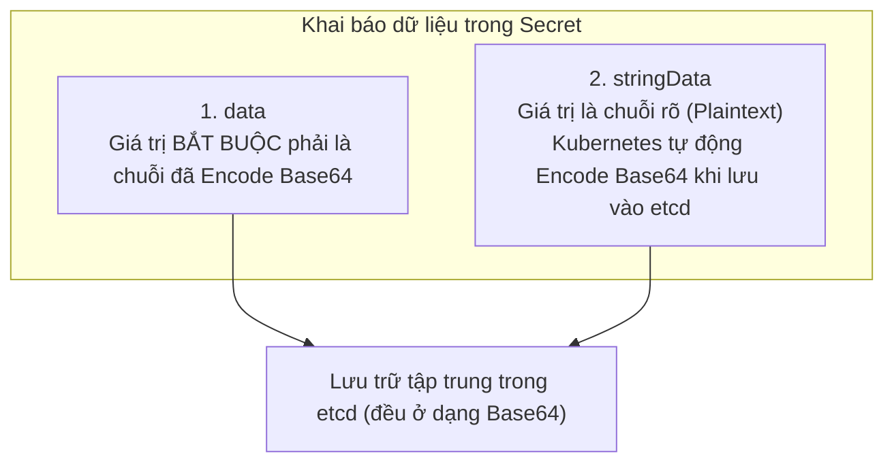
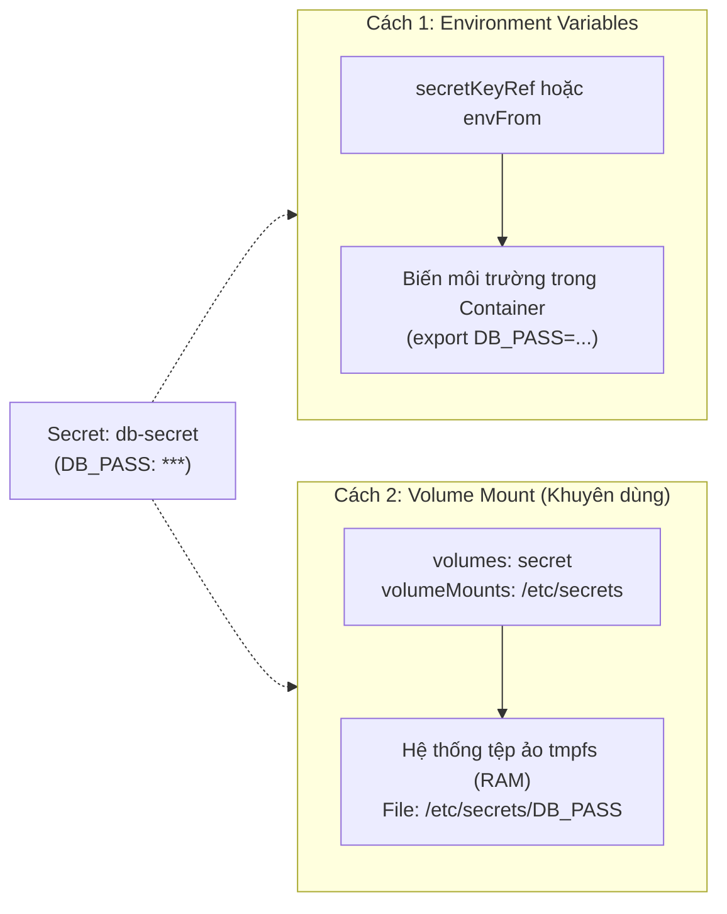

# Bài 13: Secret: Quản lý thông tin nhạy cảm

## 1. Thông tin bài học
* **Tên bài:** Bài 13: Secret: Quản lý thông tin nhạy cảm
* **Mục tiêu học:** Hiểu bản chất thực sự của đối tượng Secret trong Kubernetes; phân biệt rạch ròi sự khác nhau sống còn giữa việc chuyển đổi định dạng (Base64 Encoding) và mã hóa an ninh học (Encryption); làm chủ các loại Secret thông dụng (`Opaque`, `kubernetes.io/tls`, `kubernetes.io/dockerconfigjson`); thành thạo các kỹ thuật nạp dữ liệu nhạy cảm vào Pod qua biến môi trường và Volume Mount (sử dụng hệ thống tệp ảo bộ nhớ `tmpfs`); nhận diện các nguy cơ rò rỉ thông tin mật ở môi trường production và định hình giải pháp phòng vệ chuẩn Senior (Encryption at Rest, Sealed Secrets, External Secrets Operator).
* **Thời lượng ước tính:** 120 phút (60 phút lý thuyết, 60 phút thực hành)
* **Kiến thức cần có trước:** Bài 06 (Pod: Đơn vị tính toán nguyên tử), Bài 09 (Deployment: Quản lý triển khai), Bài 12 (ConfigMap: Tách rời cấu hình khỏi mã nguồn).
* **Liên quan kỳ thi:** CKAD, CKA, CKS (Trọng tâm đặc biệt trong CKS và CKA/CKAD: thao tác tạo Secret từ dòng lệnh và file, giải mã Base64, cấu hình mount Secret an toàn vào Pod, cấu hình Docker Registry secret và debug lỗi cấp phát quyền RBAC cho Secret).

---

## 2. Bảng thuật ngữ

| Thuật ngữ | Giải thích đơn giản | Ví dụ / Ẩn dụ đời thường |
| :--- | :--- | :--- |
| **Secret (sec)** | Đối tượng API dùng để lưu trữ các dữ liệu nhạy cảm (mật khẩu, khóa bảo mật, API token, chứng chỉ TLS) tách biệt khỏi mã nguồn và image. | Chiếc két sắt mini đặt trong phòng khách sạn để khách cất giữ tiền mặt, hộ chiếu và tư trang đắt tiền. |
| **Base64 Encoding** | Chuẩn biến đổi dữ liệu nhị phân hoặc chuỗi ký tự bất kỳ thành tập hợp các ký tự ASCII an toàn cho việc truyền tải; hoàn toàn **KHÔNG** có chức năng bảo mật hay che giấu thông tin. | Dịch vụ bọc màng co nilon trong suốt quanh vali tại sân bay: bảo vệ hành lý không bị trầy xước khi bốc dỡ nhưng bất kỳ ai nhìn qua lớp màng cũng thấy rõ mọi đồ vật bên trong. |
| **Encryption at Rest** | Kỹ thuật mã hóa dữ liệu trước khi lưu trữ xuống đĩa cứng vật lý (cụ thể là cơ sở dữ liệu phân tán `etcd`), chỉ giải mã khi đọc lên bộ nhớ bằng khóa bí mật (KMS). | Khóa toàn bộ hồ sơ kinh doanh vào một thùng thép chống trộm bằng mật mã chuyên dụng; trộm có bê cả thùng đi cũng không thể đọc được chữ nào nếu không có mã số. |
| **`Opaque` Secret** | Loại Secret mặc định phổ biến nhất trong Kubernetes, cho phép lưu trữ bất kỳ cặp khóa - giá trị tùy ý nào do người dùng tự đặt. | Chiếc phong bì dán kín không in tiêu đề, bên trong bạn có thể nhét thẻ ngân hàng, tiền mặt hay chìa khóa dự phòng tùy ý. |
| **`kubernetes.io/tls`** | Loại Secret chuyên dụng được định nghĩa sẵn để lưu chứng chỉ số SSL/TLS, bắt buộc phải có đủ 2 khóa tiêu chuẩn là `tls.crt` và `tls.key`. | Chiếc ví đựng căn cước công dân và hộ chiếu: bắt buộc phải có đủ ảnh chân dung và dấu mộc chứng thực theo đúng quy chuẩn nhà nước. |
| **`tmpfs` (RAM-backed)** | Hệ thống tệp ảo được cấp phát trực tiếp trên bộ nhớ RAM của máy chủ, không bao giờ ghi dữ liệu nhạy cảm xuống ổ đĩa cứng vật lý. | Chiếc bảng viết bằng phấn dạ tự xóa: chỉ cần ngắt nguồn điện hoặc lau nhẹ là toàn bộ dấu vết biến mất hoàn toàn, không để lại vết hằn như viết bút bi lên giấy. |
| **External Secrets Operator (ESO)** | Công cụ Kubernetes mở rộng giúp đồng bộ hóa tự động các secret từ kho bảo mật chuyên dụng bên ngoài (AWS Secrets Manager, HashiCorp Vault, Azure Key Vault) vào K8s. | Đội xe bọc thép chuyên dụng của ngân hàng trung ương định kỳ vận chuyển tiền an toàn từ kho bạc quốc gia nạp vào các cây ATM địa phương. |

---

## 3. Bức tranh lớn: Vấn đề thực tế và ẩn dụ đời thường

### Nhắc lại bài trước
Ở Bài 12, chúng ta đã thành thạo kỹ thuật dùng **ConfigMap** để tách rời các tham số cấu hình ứng dụng ra khỏi Docker Image theo chuẩn 12-Factor App. Tuy nhiên, ConfigMap sinh ra chỉ để chứa các dữ liệu hoàn toàn công khai và vô hại, ví dụ như số cổng mạng `PORT=8080` hay đường dẫn `PRODUCT_CATALOG_SERVICE_ADDR`. Nếu bạn đưa mật khẩu cơ sở dữ liệu, private key của chứng chỉ TLS hoặc thẻ thanh toán ngân hàng vào ConfigMap, bạn đang mở toang cánh cửa cho bất kỳ ai truy cập vào cluster xem được toàn bộ thông tin nhạy cảm. Để giải quyết bài toán bảo vệ dữ liệu nhạy cảm, Kubernetes cung cấp một đối tượng chuyên biệt: **Secret**.

### Tại sao cần cái này ở production? (Vấn đề thực tế)
Trong thực tế vận hành hệ thống microservices, vấn đề bảo vệ thông tin đăng nhập luôn là bài toán sống còn:

1. **Thảm họa commit Git:** Trước đây, các nhóm phát triển thường mắc lỗi lưu chuỗi kết nối chứa mật khẩu (ví dụ `mongodb://admin:SuperSecret123@db:27017`) trực tiếp vào file cấu hình dự án hoặc file Dockerfile. Khi mã nguồn được đẩy lên kho lưu trữ Git (đặc biệt là public repository), các bot tự động trên internet chỉ mất từ 3 đến 5 phút để dò quét, trích xuất thông tin và chiếm quyền điều khiển hạ tầng.
2. **Sai lầm chết người về Base64:** Rất nhiều kỹ sư mới vào nghề lầm tưởng rằng chuỗi ký tự kỳ lạ như `U3VwZXJTZWNyZXQxMjM=` trong file YAML của Secret là "đã được mã hóa rất tinh vi". Thực tế, bất kỳ ai có quyền đọc file YAML đều có thể giải mã nó về nguyên bản chỉ bằng một câu lệnh trong vòng 0.1 giây! Nếu không hiểu bản chất, bạn sẽ có cảm giác an toàn giả tạo.
3. **Phân quyền truy cập theo nguyên tắc tối thiểu (RBAC):** Một cụm Kubernetes thường được dùng chung bởi hàng chục lập trình viên và nhóm vận hành. Lập trình viên thông thường cần quyền xem ConfigMap để biết ứng dụng đang trỏ về môi trường nào, nhưng **tuyệt đối không được phép xem Secret** chứa khóa bí mật của hệ thống thanh toán hay tài khoản quản trị database. Tách rời Secret và ConfigMap là tiền đề bắt buộc để thiết lập cơ chế phân quyền RBAC (Role-Based Access Control) chặt chẽ.

**Nguyên tắc vàng của Kubernetes Security:**
> **"ConfigMap dành cho cấu hình phi bí mật công khai; Secret dành cho dữ liệu nhạy cảm. Nhưng hãy luôn ghi nhớ: Kubernetes Secret mặc định chỉ là một lớp phân loại dữ liệu, không phải là chiếc khiên mã hóa vạn năng nếu bạn không bật Encryption at Rest!"**

### Ẩn dụ đời thường: Bảng nội quy công cộng và Chiếc két sắt khách sạn

Hãy hình dung một khách sạn cao cấp:
1. **ConfigMap là Bảng nội quy và Menu đồ ăn treo trên tường:**
   * Được đóng khung và treo công khai ngay trước cửa phòng khách.
   * Chứa các thông tin thông thường: giờ trả phòng (12:00), mật khẩu Wifi công cộng, danh sách giá các món ăn trong tủ lạnh mini.
   * Bất kỳ ai bước vào phòng (khách thuê, nhân viên dọn dẹp, nhân viên bảo trì) đều có thể nhìn thấy và đọc thoải mái.
2. **Secret là Chiếc két sắt mini gắn chìm trong tủ quần áo:**
   * Chiếc két có bàn phím số mã PIN bảo mật riêng.
   * Dùng để cất giữ hộ chiếu, ví tiền, nhẫn kim cương và tài liệu kinh doanh quan trọng của khách.
   * Nhân viên dọn phòng có thể vào dọn dẹp quanh phòng nhưng không được phép biết mã PIN và không thể mở két. Chỉ người cầm chìa khóa/mã số (ứng dụng có thẩm quyền) mới được phép lấy dữ liệu bên trong ra sử dụng.

---

## 4. Giải thích khái niệm theo từng bước

### Bước 1: Sự thật trần trụi về Base64: Encoding khác Encryption như thế nào?

Nhiều người thường dùng lẫn lộn hai khái niệm này, dẫn đến những lỗ hổng bảo mật nghiêm trọng:

* **Mã hóa an ninh (Encryption):** Là quá trình sử dụng thuật toán toán học phức tạp kết hợp với một **chìa khóa bí mật (Secret Key)** để biến bản rõ (Plaintext) thành bản mã (Ciphertext). Người không có chìa khóa thì dù có siêu máy tính cũng không thể giải mã được. Ví dụ: AES-256, RSA.
* **Mã hóa biểu diễn (Encoding - Base64):** Chỉ đơn thuần là một thuật toán chuyển đổi dữ liệu nhị phân (bytes) thành một chuỗi các ký tự ASCII an toàn (gồm A-Z, a-z, 0-9, `+`, `/`). Mục đích duy nhất của Base64 là giúp dữ liệu không bị biến dạng khi truyền qua các giao thức mạng chỉ hỗ trợ văn bản thuần (như HTTP, SMTP, JSON/YAML). **Bất kỳ ai cũng có thể giải mã Base64 mà không cần bất kỳ chìa khóa nào!**

Hãy kiểm chứng ngay trên máy tính của bạn bằng PowerShell:
```powershell
# Chuyển đổi chuỗi rõ sang Base64 (Encoding)
$plain = "AdminPassword@2026"
$bytes = [System.Text.Encoding]::UTF8.GetBytes($plain)
$encoded = [System.Convert]::ToBase64String($bytes)
Write-Output "Chuỗi Base64: $encoded"
# Kết quả: QWRtaW5QYXNzd29yZEAyMDI2

# Ngay lập tức giải mã ngược lại mà không cần bất kỳ mật mã nào:
$decodedBytes = [System.Convert]::FromBase64String($encoded)
$decoded = [System.Text.Encoding]::UTF8.GetString($decodedBytes)
Write-Output "Bản rõ sau khi giải mã: $decoded"
# Kết quả: AdminPassword@2026
```

> **Kết luận sống còn:** Base64 **không che giấu dữ liệu trước kẻ thù**, nó chỉ che giấu dữ liệu trước những con mắt lơ đễnh nhìn lướt qua màn hình!

### Bước 2: Cấu trúc của một Secret Manifest: `data` và `stringData`

Đối tượng Secret nằm trong nhóm API cốt lõi `apiVersion: v1`. Khi định nghĩa Secret bằng file YAML, Kubernetes cung cấp hai cách khai báo:



#### Ví dụ manifest sử dụng cả hai cách:

```yaml
apiVersion: v1
kind: Secret
metadata:
  name: boutique-db-secret
  namespace: default
type: Opaque  # Loại Secret mặc định (khóa/giá trị tùy ý)
data:
  # Cách 1: Tự encode Base64 trước rồi dán vào đây
  # "postgres" -> cG9zdGdyZXM=
  DB_USERNAME: cG9zdGdyZXM=

stringData:
  # Cách 2: Tiện lợi cho người viết manifest!
  # Kubernetes sẽ tự động encode thành Base64 và chuyển vào trường 'data'
  DB_PASSWORD: "SuperSecurePassword123!"
```

> **Mẹo Senior:** Khi viết manifest thủ công hoặc qua CI/CD, sử dụng `stringData` giúp bạn không phải mất công chạy lệnh encode Base64 cho từng giá trị. Tuy nhiên, lưu ý rằng `stringData` chỉ là trường dạng "chỉ ghi" (write-only). Khi bạn dùng lệnh `kubectl get secret -o yaml`, trường `stringData` sẽ biến mất hoàn toàn và bạn chỉ thấy trường `data` chứa các chuỗi Base64!

### Bước 3: Các loại Secret tích hợp sẵn (Secret Types)

Kubernetes phân loại Secret qua trường `type` để đảm bảo định dạng dữ liệu chuẩn xác cho từng mục đích:

1. **`Opaque` (mặc định):** Dùng để lưu trữ bất kỳ dữ liệu cấu hình nhạy cảm tùy biến nào (API key, mật khẩu, token).
2. **`kubernetes.io/tls`:** Dùng riêng cho chứng chỉ SSL/TLS phục vụ HTTPS. Kubernetes kiểm tra nghiêm ngặt bắt buộc phải có đúng 2 khóa:
   * `tls.crt`: Nội dung chứng chỉ số công khai (Certificate).
   * `tls.key`: Khóa riêng tư bảo mật (Private Key).
3. **`kubernetes.io/dockerconfigjson`:** Dùng để lưu trữ thông tin xác thực (token/mật khẩu) của Docker Registry riêng tư (như Docker Hub trả phí, Google Artifact Registry, AWS ECR, Harbor). Khi Pod cần kéo image từ registry có khóa bảo vệ, bạn gắn Secret này vào trường `imagePullSecrets` của Pod.
4. **`kubernetes.io/service-account-token`:** Dùng để xác thực danh tính của Pod khi giao tiếp với Kubernetes API Server (tự động tạo bởi K8s).

### Bước 4: So sánh 2 cách nạp Secret vào Pod: Biến môi trường vs Volume Mount



| Tiêu chí so sánh | Nạp qua Biến môi trường (`env` / `envFrom`) | Nạp qua Volume Mount (`volumeMounts`) |
| :--- | :--- | :--- |
| **Vị trí lưu trữ trong container** | Nằm trong không gian bộ nhớ của tiến trình (`process environment`). | Nằm trong hệ thống tệp ảo **`tmpfs`** (trên RAM của node host). |
| **Ghi xuống ổ cứng vật lý?** | Không ghi. | **Hoàn toàn không** (chỉ lưu trên RAM, tắt máy là mất). |
| **Nguy cơ rò rỉ qua Log / Crash** | **Rất cao**: Khi ứng dụng sập, các công cụ debug (như Sentry) thường dump toàn bộ biến môi trường ra file log. Lệnh `docker inspect` trên node cũng đọc được. | **Rất thấp**: Dữ liệu nằm trong file độc lập, chỉ tiến trình nào chủ động mở file mới đọc được. |
| **Khả năng tự động cập nhật** | **Không**: Giá trị biến môi trường chỉ nạp 1 lần lúc container sinh ra. Muốn đổi mật khẩu bắt buộc phải restart Pod. | **Có**: Khi bạn cập nhật Secret, Kubelet sẽ tự động cập nhật nội dung file trong thư mục mount sau một khoảng thời gian (khoảng vài chục giây). |
| **Đánh giá từ chuyên gia bảo mật** | ⚠️ Chỉ dùng cho ứng dụng cũ không sửa được code. | 🛡️ **Khuyên dùng tuyệt đối cho mọi hệ thống production.** |

---

## 5. Thực hành (Lab)

* **Môi trường:** Cụm kind (`k8s\kind-config.yaml`) gồm 1 control-plane và 1 worker.
* **Mức RAM ước tính:** ~80 MB (chỉ chạy 1 Pod alpine siêu nhẹ, hoàn toàn nằm trong giới hạn an toàn 4GB WSL).

### Kịch bản thực hành: Bảo mật kết nối giỏ hàng Online Boutique
Trong dự án Online Boutique, dịch vụ `cartservice` cần kết nối tới kho dữ liệu `redis-cart`. Ở môi trường production nghiêm ngặt, Redis bắt buộc phải được kích hoạt mật khẩu xác thực (`REDIS_PASSWORD`). Chúng ta sẽ tạo Secret lưu trữ thông tin này và triển khai một Pod kiểm tra khả năng đọc mật khẩu an toàn qua cả hai cơ chế: Biến môi trường và Volume Mount.

### Bước 1: Chuẩn bị file cấu hình Secret và Pod

Chúng ta tạo một file manifest tích hợp mang tên `cart-secret-lab.yaml` bao gồm cả Secret và Pod thử nghiệm:

```powershell
@'
apiVersion: v1
kind: Secret
metadata:
  name: redis-cart-secret
  namespace: default
type: Opaque
stringData:
  # Dùng stringData để khai báo bản rõ trực tiếp, K8s sẽ tự động encode Base64
  REDIS_PASSWORD: "OnlineBoutique2026SecureCartKey!"
  ADMIN_TOKEN: "Token-xyz-987654321"
---
apiVersion: v1
kind: Pod
metadata:
  name: cartservice-secret-demo
  namespace: default
  labels:
    app: cartservice-demo
spec:
  # 1. Khai báo Volume trỏ tới Secret vừa tạo
  volumes:
    - name: redis-sec-volume
      secret:
        secretName: redis-cart-secret
        items:
          # Chỉ mount riêng khóa REDIS_PASSWORD thành file password.txt
          - key: REDIS_PASSWORD
            path: password.txt
            mode: 256  # Quyền hạn 0400 (chỉ đọc)

  containers:
    - name: cart-checker
      image: alpine:latest
      # Giữ cho container luôn sống để chúng ta vào kiểm tra
      command: ["sh", "-c", "echo 'Container dang chay an toan'; sleep 3600"]
      
      # 2. Cách nạp 1: Biến môi trường (dùng secretKeyRef)
      env:
        - name: ENV_REDIS_PASS
          valueFrom:
            secretKeyRef:
              name: redis-cart-secret
              key: REDIS_PASSWORD

      # 3. Cách nạp 2: Volume Mount (Gắn vào thư mục /var/run/secrets/redis)
      volumeMounts:
        - name: redis-sec-volume
          mountPath: /var/run/secrets/redis
          readOnly: true  # Đảm bảo tiến trình không thể sửa file
'@ | Set-Content -Path .\cart-secret-lab.yaml -Encoding UTF8
```

### Bước 2: Thực thi câu lệnh triển khai

```powershell
# Áp dụng file manifest vào cluster
kubectl apply -f .\cart-secret-lab.yaml

# Theo dõi tiến trình khởi tạo Pod
kubectl get pod cartservice-secret-demo -w
```

### Bước 3: Kết quả mong đợi (Expected Output)

Sau khoảng vài giây kéo image `alpine`, Pod sẽ chuyển sang trạng thái `Running`:
```text
secret/redis-cart-secret created
pod/cartservice-secret-demo created

NAME                      READY   STATUS    RESTARTS   AGE
cartservice-secret-demo   1/1     Running   0          5s
```

### Bước 4: Kiểm chứng tính năng và giải mã dữ liệu

#### 1. Kiểm tra Secret trong Cluster và quan sát Base64
```powershell
# Xem Secret ở định dạng YAML
kubectl get secret redis-cart-secret -o yaml
```

Kết quả trả về cho thấy chuỗi `stringData` đã được K8s tự động chuyển sang `data` dưới dạng Base64:
```text
apiVersion: v1
data:
  ADMIN_TOKEN: VG9rZW4teHl6LTk4NzY1NDMyMQ==
  REDIS_PASSWORD: T25saW5lQm91dGlxdWUyMDI2U2VjdXJlQ2FydEtleSE=
kind: Secret
metadata:
  name: redis-cart-secret
  namespace: default
type: Opaque
```

Giải mã trực tiếp chuỗi `REDIS_PASSWORD` từ terminal PowerShell để kiểm chứng:
```powershell
$b64 = kubectl get secret redis-cart-secret -o jsonpath='{.data.REDIS_PASSWORD}'
[System.Text.Encoding]::UTF8.GetString([System.Convert]::FromBase64String($b64))
```
Kết quả hiển thị chính xác bản rõ:
```text
OnlineBoutique2026SecureCartKey!
```

#### 2. Kiểm chứng cách 1: Đọc mật khẩu từ Biến môi trường
```powershell
kubectl exec cartservice-secret-demo -- sh -c "echo `$ENV_REDIS_PASS"
```
Kết quả:
```text
OnlineBoutique2026SecureCartKey!
```

#### 3. Kiểm chứng cách 2: Đọc mật khẩu từ File mount trong Volume (tmpfs)
```powershell
# Kiểm tra file đã được mount trong thư mục
kubectl exec cartservice-secret-demo -- ls -la /var/run/secrets/redis/
```
Kết quả:
```text
total 4
drwxrwxrwt    3 root     root           140 Oct  9 04:20 .
drwxr-xr-x    3 root     root          4096 Oct  9 04:20 ..
drwxr-xr-x    2 root     root            60 Oct  9 04:20 ..2026_10_09_04_20_15.123456789
lrwxrwxrwx    1 root     root            31 Oct  9 04:20 ..data -> ..2026_10_09_04_20_15.123456789
lrwxrwxrwx    1 root     root            19 Oct  9 04:20 password.txt -> ..data/password.txt
```

> **Chi tiết chuyên sâu:** Bạn có nhận thấy `password.txt` thực chất là một liên kết tượng trưng (symlink) trỏ tới thư mục `..data` không? Đây chính là bí quyết giúp Kubernetes cập nhật nội dung Secret nguyên tử (Atomic Update) mà không làm rách tệp tin đang mở của ứng dụng!

Đọc nội dung file mật khẩu:
```powershell
kubectl exec cartservice-secret-demo -- cat /var/run/secrets/redis/password.txt
```
Kết quả:
```text
OnlineBoutique2026SecureCartKey!
```

#### 4. Chứng minh Volume Secret nằm hoàn toàn trên RAM (`tmpfs`)
```powershell
kubectl exec cartservice-secret-demo -- df -h /var/run/secrets/redis
```
Kết quả trả về:
```text
Filesystem                Size      Used Available Use% Mounted on
tmpfs                     1.9G         0      1.9G   0% /var/run/secrets/redis
```
Dòng `tmpfs` chứng minh 100% dữ liệu nhạy cảm được bảo vệ trực tiếp trên RAM, không một byte dữ liệu nào bị ghi lén xuống đĩa cứng vật lý của máy chủ!

### Bước 5: Dọn dẹp tài nguyên (Cleanup)
Sau khi hoàn thành bài thực hành, hãy xóa ngay Pod và Secret để giải phóng tài nguyên RAM của cụm kind:
```powershell
kubectl delete -f .\cart-secret-lab.yaml
Remove-Item .\cart-secret-lab.yaml
```

---

## 6. Lỗi thường gặp và cách debug

### Lỗi 1: Pod dính trạng thái `CreateContainerConfigError` hoặc `CrashLoopBackOff`
* **Dấu hiệu:** Chạy lệnh `kubectl get pods` thấy Pod không thể chuyển sang `Running`. Cột STATUS hiển thị `CreateContainerConfigError`.
* **Nguyên nhân:** Khai báo sai tên Secret (Secret không tồn tại) hoặc gõ sai tên khóa (`key`) trong khối `secretKeyRef`.
* **Cách debug và sửa:**
  1. Chạy lệnh: `kubectl describe pod <tên-pod>`.
  2. Quan sát phần `Events` ở dưới cùng. Nếu thấy thông báo:
     `Error: secret "redis-cart-secret" not found` $\rightarrow$ Bạn chưa tạo Secret hoặc Secret nằm ở namespace khác!
     `Error: couldn't find key WRONG_KEY in Secret default/redis-cart-secret` $\rightarrow$ Hãy chạy `kubectl get secret <tên-secret> -o yaml` để đối chiếu chính xác tên khóa phân biệt hoa thường.

### Lỗi 2: Lỗi cú pháp khi tạo Secret qua file YAML: `illegal base64 data at input`
* **Dấu hiệu:** Khi chạy `kubectl apply -f secret.yaml`, API Server lập tức từ chối và báo lỗi dạng: `ValidationError(Secret.data.PASSWORD): invalid value: ... illegal base64 data at input byte 4`.
* **Nguyên nhân:** Bạn khai báo chuỗi bản rõ trong trường `data` thay vì dùng chuỗi đã mã hóa Base64, hoặc khi chạy lệnh encode bị dính ký tự xuống dòng (`\n` hoặc `\r\n`).
* **Cách debug và sửa:**
  * Nếu muốn viết chuỗi rõ, hãy đổi tên trường từ `data:` thành `stringData:`.
  * Nếu dùng `data:`, hãy đảm bảo chuỗi Base64 không chứa khoảng trắng hoặc dấu xuống dòng.

### Lỗi 3: Ứng dụng không tự động nhận mật khẩu mới sau khi cập nhật Secret
* **Dấu hiệu:** Bạn đã đổi mật khẩu trong Secret trên cluster, nhưng ứng dụng vẫn báo lỗi xác thực với mật khẩu cũ.
* **Nguyên nhân:**
  * Nếu nạp qua **biến môi trường (`env`)**: Kubernetes không bao giờ cập nhật biến môi trường cho một container đang chạy. Bắt buộc phải thực hiện khởi động lại Pod (`kubectl rollout restart deployment <tên>`).
  * Nếu ứng dụng đọc từ file trong Volume Mount: Mặc dù file trên đĩa `tmpfs` đã được Kubelet cập nhật, nhưng mã nguồn của ứng dụng chỉ đọc file một lần duy nhất lúc khởi động và lưu vào biến tĩnh (Singleton/Static Variable) trong RAM của ứng dụng.
* **Cách debug và sửa:** Thiết kế ứng dụng có cơ chế định kỳ đọc lại file cấu hình (File Watcher), hoặc thực hiện rolling update Pod khi có đợt xoay vòng khóa bí mật (Secret Rotation).

---

## 7. Góc nhìn Senior

### 1. Sự đánh đổi (Trade-offs): Secret nội bộ K8s vs Kho Secret chuyên dụng bên ngoài

| Giải pháp | Ưu điểm | Nhược điểm / Đánh đổi | Khi nào nên dùng? |
| :--- | :--- | :--- | :--- |
| **K8s Native Secret** | Có sẵn trong mọi cụm K8s, không tốn thêm tài nguyên máy chủ, tích hợp native với Pod qua volume và env. | Mặc định chỉ dùng Base64; nếu không cấu hình KMS thì lưu trữ dạng bản rõ trong etcd; khó quản lý xoay vòng khóa tự động trên quy mô lớn. | Môi trường Dev/Test, hệ thống nhỏ gọn, hoặc cụm đã bật sẵn Encryption at Rest và RBAC nghiêm ngặt. |
| **External Secrets (HashiCorp Vault, AWS Secrets Manager)** | Bảo mật cấp độ doanh nghiệp cao nhất; mã hóa dữ liệu tại kho trung tâm; hỗ trợ xoay vòng khóa tự động (Dynamic Secrets); kiểm toán truy vết (Audit Log) chi tiết từng lần đọc. | Chi phí phần cứng và bản quyền cao; kiến trúc phức tạp; phụ thuộc đường truyền mạng tới dịch vụ bên ngoài; cần cài đặt thêm Operator (như ESO) vào cluster. | Doanh nghiệp Fintech, ngân hàng, thương mại điện tử lớn; môi trường Multi-cluster và chuẩn tuân thủ khắt khe (PCI-DSS, SOC2). |

### 2. Best practices tại production

1. **Bắt buộc kích hoạt Encryption at Rest cho `etcd`:**
   Mặc định trong Kubernetes, cơ sở dữ liệu `etcd` lưu trữ đối tượng Secret dưới dạng bản rõ (chỉ encode Base64). Bất kỳ ai có quyền truy cập vào file backup của etcd hoặc đĩa cứng của node Control Plane đều có thể trích xuất toàn bộ mật khẩu của hệ thống! Ở production, Platform Engineer phải cấu hình `EncryptionConfiguration` sử dụng nhà cung cấp mã hóa an toàn (như `aescbc` hoặc tích hợp với KMS đám mây qua plugin KMSv2).
2. **Siết chặt quyền RBAC cho tài nguyên Secret:**
   Tuyệt đối không cấp quyền `get`, `list`, `watch` trên tài nguyên `secrets` cho người dùng thông thường trong cluster. Nếu developer cần debug ứng dụng, chỉ cho phép họ xem log và pod status, không cho phép xem secret.
3. **Cấm lưu file Secret YAML vào Git (Không commit secret lên GitOps):**
   Nếu triển khai theo mô hình GitOps (dùng ArgoCD hoặc Flux), không bao giờ đưa file Secret chứa bản rõ lên kho Git. Hãy sử dụng các giải pháp mã hóa file an toàn như:
   * **Sealed Secrets (Bitnami):** Mã hóa Secret bằng khóa công khai (Public Key) lưu trên Git, chỉ có cụm K8s có khóa riêng (Private Key) mới giải mã được.
   * **External Secrets Operator (ESO):** Chỉ commit file tham chiếu (ExternalSecret YAML), Pod Operator trong cluster sẽ tự kéo mật khẩu thật từ AWS Secrets Manager hoặc Vault về.
4. **Luôn ưu tiên Volume Mount thay vì Biến môi trường:**
   Hạn chế tối đa việc sử dụng `envFrom` để đổ toàn bộ Secret vào biến môi trường, nhằm tránh rò rỉ qua công cụ giám sát, log dump và tiến trình con.

### 3. Câu hỏi phỏng vấn Senior

* **Câu hỏi:** *"Tại sao Kubernetes Secret lại sử dụng Base64 thay vì tự động mã hóa bằng thuật toán mã hóa mạnh ngay từ đầu? Ở môi trường production, bạn làm thế nào để đảm bảo chuỗi vòng đời của một Secret được bảo vệ toàn diện từ lưu trữ đến lúc ứng dụng tiêu thụ?"*
* **Gợi ý trả lời chuẩn:**
  1. **Lý do dùng Base64:** Secret nguyên bản được thiết kế là một **cơ chế phân loại đối tượng API** để Kubernetes có thể áp dụng các chính sách kiểm soát riêng (như phân quyền RBAC, mount qua tmpfs, không in ra khi describe chi tiết). Base64 chỉ đóng vai trò serialization định dạng dữ liệu nhị phân an toàn cho giao thức truyền tải văn bản YAML/JSON. Bản thân Kubernetes không thể tự ý áp đặt một thuật toán mã hóa cứng vì việc quản lý khóa bí mật (Key Management) phụ thuộc hoàn toàn vào hạ tầng của từng doanh nghiệp.
  2. **Chiến lược bảo vệ 3 lớp toàn diện (Defense in Depth):**
     * **Lớp 1 - Dữ liệu tĩnh (At Rest):** Bật `EncryptionConfiguration` tại API Server kết nối với KMS (Key Management Service) của đám mây để mã hóa etcd.
     * **Lớp 2 - Dữ liệu truyền tải (In Transit):** 100% kết nối giữa API Server, Kubelet và các thành phần phải chạy qua mTLS (mutual TLS).
     * **Lớp 3 - Dữ liệu lúc chạy (In Use / Runtime):** Gắn Secret vào Pod bằng **Volume Mount sử dụng `tmpfs`** để đảm bảo dữ liệu chỉ tồn tại trên RAM, thiết lập quyền đọc file giới hạn (`mode: 0400`), kết hợp công cụ quét mã nguồn CI/CD (TruffleHog, Gitleaks) và áp dụng External Secrets Operator để quản lý tập trung ngoài Git.

---

## 8. Tóm tắt bài học

* 📌 **1. Base64 không phải là mã hóa an toàn:** Base64 chỉ là kỹ thuật chuyển đổi định dạng biểu diễn dữ liệu; bất kỳ ai cũng có thể giải mã về bản rõ mà không cần chìa khóa.
* 📌 **2. Tiện ích của `stringData`:** Cho phép viết bản rõ trực tiếp trong manifest YAML; Kubernetes sẽ tự động encode thành Base64 và lưu vào trường `data`.
* 📌 **3. Các loại Secret tiêu chuẩn:** `Opaque` cho dữ liệu tùy biến, `kubernetes.io/tls` cho chứng chỉ HTTPS và `kubernetes.io/dockerconfigjson` để kéo image từ Registry riêng tư.
* 📌 **4. Ưu thế tuyệt đối của Volume Mount:** Gắn Secret qua Volume sẽ lưu dữ liệu trên hệ thống tệp ảo RAM (`tmpfs`), không ghi xuống đĩa và hỗ trợ tự động cập nhật nguyên tử, an toàn hơn nhiều so với biến môi trường.
* 📌 **5. Tiêu chuẩn bảo mật Production:** Bắt buộc kích hoạt Encryption at Rest cho `etcd`, siết chặt RBAC và sử dụng các công cụ chuyên dụng như External Secrets Operator hoặc Sealed Secrets thay vì lưu Secret trần trên Git.

---

## 9. Bài tập tự làm

* 🟢 **Mức Dễ:** Sử dụng lệnh trực tiếp (imperative command) `kubectl create secret generic app-auth` để tạo một Secret chứa hai khóa: `user=guest` và `pass=welcome123`. Sử dụng lệnh `kubectl get secret` và PowerShell để giải mã khóa `pass` về bản rõ.
* 🟡 **Mức Vừa:** Tạo một Secret loại `kubernetes.io/tls` tên là `my-tls-secret` chứa hai khóa tự tạo giả lập `tls.crt` và `tls.key`. Viết một manifest Pod chạy image `nginx:alpine` gắn Secret này vào thư mục `/etc/nginx/certs` và kiểm tra quyền truy cập tệp tin bên trong container.
* 🔴 **Mức Khó (Troubleshooting & CKS):** Tạo một Pod tham chiếu tới khóa `DATABASE_KEY` từ Secret `db-credentials`. Cố tình tạo Secret `db-credentials` nhưng đặt tên khóa bên trong là `DB_KEY` (khác tên). Quan sát mã lỗi trạng thái của Pod bằng `kubectl describe pod`. Sau đó, chỉnh sửa Secret để cứu Pod chuyển sang trạng thái `Running` mà không cần xóa Pod đi tạo lại.

---

## 10. Câu hỏi tự kiểm tra

1. Tại sao nói Base64 Encoding trong Kubernetes Secret không mang lại bất kỳ giá trị bảo mật thực chất nào đối với kẻ tấn công?
2. Khác biệt lớn nhất giữa việc khai báo trường `data` và trường `stringData` trong một Secret manifest là gì?
3. Khi mount một Secret vào thư mục trong Pod qua Volume Mount, dữ liệu nhạy cảm được lưu trữ trên loại hệ thống tệp (Filesystem) nào của máy chủ node?
4. Nêu 2 nguy cơ bảo mật lớn khi đưa thông tin nhạy cảm vào Pod dưới dạng biến môi trường (`envFrom` hoặc `secretKeyRef`) thay vì dùng Volume Mount?
5. Nếu cơ sở dữ liệu `etcd` chưa được cấu hình tính năng Encryption at Rest, dữ liệu của Secret được lưu trong ổ đĩa cứng của node Master dưới hình thức nào?
6. Để cho phép Kubernetes tự động kéo image từ một Private Docker Hub hoặc kho ảnh riêng tư có bảo vệ mật khẩu, bạn cần tạo loại Secret nào và khai báo trường gì trong Pod spec?

<details>
<summary>👉 Bấm vào đây để xem đáp án câu hỏi tự kiểm tra</summary>

* **Đáp án 1:** Vì thuật toán Base64 không sử dụng bất kỳ chìa khóa bảo mật (Secret Key) nào để mã hóa; nó là chuẩn mở công khai và bất kỳ ai có chuỗi ký tự Base64 đều có thể đảo ngược về chuỗi bản rõ ban đầu trong tích tắc.
* **Đáp án 2:** Trường `data` bắt buộc người dùng phải tự chuyển đổi giá trị sang chuỗi Base64 trước khi dán vào; còn trường `stringData` cho phép viết trực tiếp chuỗi bản rõ (Plaintext), Kubernetes sẽ tự động encode Base64 giúp bạn khi tiếp nhận manifest.
* **Đáp án 3:** Được lưu trữ trên hệ thống tệp ảo **`tmpfs`** (Memory-backed filesystem), tức là nằm hoàn toàn trên bộ nhớ RAM của node, không bao giờ ghi xuống đĩa cứng vật lý.
* **Đáp án 4:** Hai nguy cơ: (1) Mọi tiến trình con trong container đều thừa hưởng biến môi trường và dễ bị rò rỉ khi ứng dụng crash dump log; (2) Lệnh `docker inspect` hoặc lệnh kiểm tra tiến trình trên node host có thể xem được giá trị biến môi trường ở dạng rõ.
* **Đáp án 5:** Được lưu trữ dưới dạng **bản rõ thuần túy (Plaintext)** được encode Base64, bất kỳ ai đọc được file cơ sở dữ liệu etcd đều đọc được toàn bộ mật khẩu hệ thống.
* **Đáp án 6:** Cần tạo Secret thuộc loại **`kubernetes.io/dockerconfigjson`** và khai báo tên của Secret này trong trường **`imagePullSecrets`** thuộc khối `spec` của Pod.
</details>

---

## 11. Tài liệu đọc thêm và bài tiếp theo

### Tài liệu tham khảo
* [Tài liệu chính thức Kubernetes: Secrets](https://kubernetes.io/docs/concepts/configuration/secret/)
* [Tài liệu cấu hình Pod sử dụng Secret: Distribute Credentials Securely Using Secrets](https://kubernetes.io/docs/tasks/inject-data-application/distribute-credentials-secure/)
* [Tài liệu bảo mật: Encrypting Confidential Data at Rest](https://kubernetes.io/docs/tasks/administer-cluster/encrypt-data/)
* [Tài liệu External Secrets Operator (ESO)](https://external-secrets.io/)

### Bài tiếp theo
👉 **Bài 14: Ephemeral Volumes: Lưu trữ tạm thời với emptyDir & hostPath**

---

## PHỤ LỤC: ĐÁP ÁN GỢI Ý BÀI TẬP TỰ LÀM (MỤC 9)

### Đáp án Mức Dễ
```powershell
# 1. Tạo Secret bằng lệnh trực tiếp
kubectl create secret generic app-auth --from-literal=user=guest --from-literal=pass=welcome123

# 2. Xem Secret vừa tạo ở định dạng YAML
kubectl get secret app-auth -o yaml

# 3. Trích xuất và giải mã khóa pass bằng PowerShell
$encPass = kubectl get secret app-auth -o jsonpath='{.data.pass}'
[System.Text.Encoding]::UTF8.GetString([System.Convert]::FromBase64String($encPass))
# Output: welcome123

# Dọn dẹp
kubectl delete secret app-auth
```

### Đáp án Mức Vừa
```powershell
# 1. Tạo cặp file chứng chỉ giả lập
"FAKE CERTIFICATE CONTENT" | Set-Content -Path .\tls.crt -Encoding UTF8
"FAKE PRIVATE KEY CONTENT" | Set-Content -Path .\tls.key -Encoding UTF8

# 2. Tạo Secret loại TLS từ file
kubectl create secret tls my-tls-secret --cert=.\tls.crt --key=.\tls.key

# 3. Tạo Pod mount Secret TLS vào /etc/nginx/certs
@'
apiVersion: v1
kind: Pod
metadata:
  name: nginx-tls-test
spec:
  volumes:
    - name: tls-vol
      secret:
        secretName: my-tls-secret
  containers:
    - name: web
      image: nginx:alpine
      volumeMounts:
        - name: tls-vol
          mountPath: /etc/nginx/certs
          readOnly: true
'@ | kubectl apply -f -

# 4. Kiểm tra file bên trong container
kubectl exec nginx-tls-test -- ls -la /etc/nginx/certs/
kubectl exec nginx-tls-test -- cat /etc/nginx/certs/tls.crt

# Dọn dẹp
kubectl delete pod nginx-tls-test
kubectl delete secret my-tls-secret
Remove-Item .\tls.crt, .\tls.key
```

### Đáp án Mức Khó
```powershell
# 1. Cố tình tạo Secret với tên khóa là DB_KEY (sai khác với mong đợi DATABASE_KEY)
kubectl create secret generic db-credentials --from-literal=DB_KEY=SecretDbPass2026

# 2. Tạo Pod tham chiếu tới DATABASE_KEY
@'
apiVersion: v1
kind: Pod
metadata:
  name: broken-secret-pod
spec:
  containers:
    - name: app
      image: alpine:latest
      command: ["sleep", "3600"]
      env:
        - name: DB_PASSWORD
          valueFrom:
            secretKeyRef:
              name: db-credentials
              key: DATABASE_KEY
'@ | kubectl apply -f -

# 3. Quan sát lỗi
kubectl get pods
# STATUS: CreateContainerConfigError

kubectl describe pod broken-secret-pod
# Phần Events sẽ báo rõ: couldn't find key DATABASE_KEY in Secret default/db-credentials

# 4. Giải cứu: Thêm khóa DATABASE_KEY vào Secret mà không cần xóa Pod
# Ta dùng kubectl patch để cập nhật Secret
$encodedVal = [System.Convert]::ToBase64String([System.Text.Encoding]::UTF8.GetBytes("SecretDbPass2026"))
kubectl patch secret db-credentials --type='json' -p="[{'op': 'add', 'path': '/data/DATABASE_KEY', 'value': '$encodedVal'}]"

# 5. Quan sát Pod tự động hồi phục
# Trong vòng vài giây Kubelet retry, Pod tự động chuyển sang Running!
kubectl get pod broken-secret-pod -w

# Dọn dẹp
kubectl delete pod broken-secret-pod
kubectl delete secret db-credentials
```

