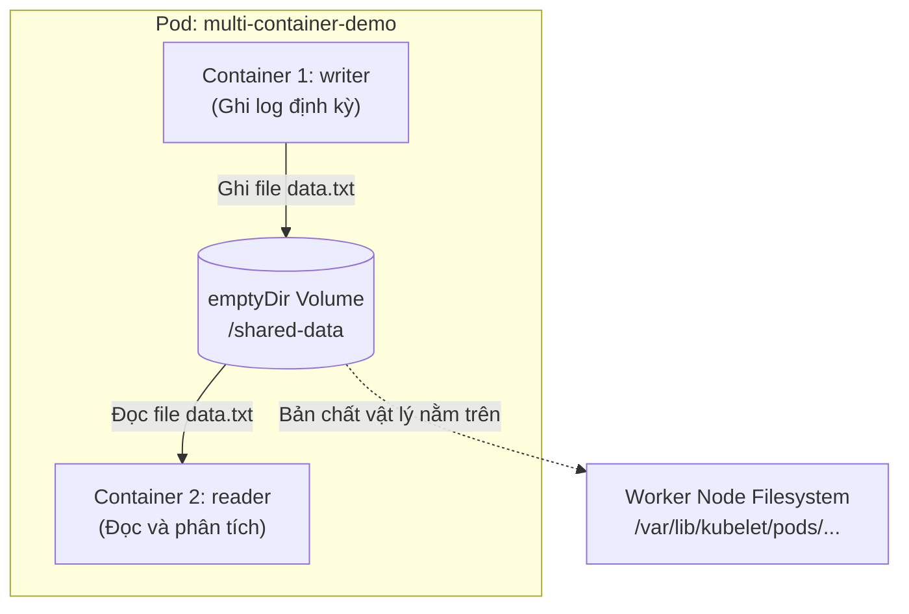
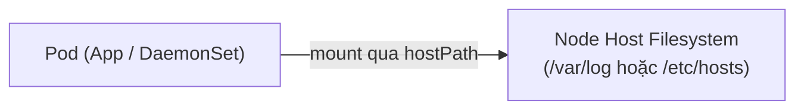

# Bài 14: Ephemeral Volumes: Lưu trữ tạm thời với emptyDir & hostPath

## 1. Thông tin bài học
* **Tên bài:** Bài 14: Ephemeral Volumes: Lưu trữ tạm thời với emptyDir & hostPath
* **Mục tiêu học:** Làm chủ khái niệm Ổ đĩa tạm thời (Ephemeral Volume) gắn liền với vòng đời của Pod; hiểu rõ cơ chế hoạt động, các kịch bản áp dụng và giới hạn an toàn của `emptyDir` để chia sẻ dữ liệu giữa nhiều container trong cùng một Pod (Sidecar Pattern) hoặc làm vùng đệm xử lý tốc độ cao (`medium: Memory`); phân tích sâu bản chất của `hostPath`, các loại kiểm tra đường dẫn (`DirectoryOrCreate`, `File`, `Socket`) và nhận diện các rủi ro bảo mật nghiêm trọng của `hostPath` ở môi trường production.
* **Thời lượng ước tính:** 90 phút (45 phút lý thuyết, 45 phút thực hành)
* **Kiến thức cần có trước:** Bài 01 (Linux Namespaces & Cgroups - Mount namespace), Bài 06 (Pod: Đơn vị tính toán nguyên tử & Multi-container), Bài 12 (ConfigMap) và Bài 13 (Secret).
* **Liên quan kỳ thi:** CKAD, CKA (Chủ đề cốt lõi: chiếm 8–12% nội dung thi với các bài toán chia sẻ ổ đĩa giữa Init Container / App Container / Sidecar Container qua `emptyDir`, thiết lập `sizeLimit`, cấu hình daemon thu thập log từ node qua `hostPath`).

---

## 2. Bảng thuật ngữ

| Thuật ngữ | Giải thích đơn giản | Ví dụ / Ẩn dụ đời thường |
| :--- | :--- | :--- |
| **Ephemeral Volume** | Loại ổ đĩa có vòng đời "ngắn ngủi" tạm thời, sinh ra cùng với Pod và bị xóa sạch hoàn toàn khi Pod kết thúc vòng đời. | Căn phòng trọ cho thuê theo ngày: khách đến thì mở cửa dọn dẹp, khách trả phòng đi nơi khác là dọn sạch toàn bộ đồ đạc để đón người mới. |
| **`emptyDir`** | Ổ đĩa tạm thời rỗng ban đầu được tạo tự động trên Node nơi Pod được lập lịch; mọi container trong cùng một Pod đều có thể đọc/ghi chung vào đây. | Chiếc bảng trắng trong phòng họp nhóm: các thành viên cùng vào phòng họp vẽ sơ đồ, thảo luận xong ra về là bảo vệ xóa sạch bảng. |
| **`medium: Memory`** | Cấu hình yêu cầu Kubernetes tạo `emptyDir` trực tiếp trên bộ nhớ RAM của node (`tmpfs`) thay vì trên ổ cứng vật lý. | Tấm giấy nháp ghi vội bằng bút chì bay màu: viết siêu nhanh nhưng ngắt nguồn điện là biến mất ngay tức thì. |
| **`sizeLimit`** | Tham số giới hạn dung lượng lưu trữ tối đa mà một `emptyDir` được phép sử dụng trên máy chủ. | Chiếc giỏ đựng rác có dung tích cố định: nếu rác tràn ra ngoài sàn nhà, người dọn vệ sinh sẽ phạt tiền ngay lập tức. |
| **`hostPath`** | Kỹ thuật gắn trực tiếp một thư mục hoặc tệp tin có sẵn từ hệ thống tệp của máy chủ Node (Host) vào bên trong container. | Đục một lỗ thông hơi xuyên tường từ trong phòng khách đâm thẳng ra hành lang chung của tòa nhà chung cư. |
| **Volume Mount** | Thao tác khai báo gắn một Volume vào một đường dẫn thư mục cụ thể bên trong hệ thống tệp của container. | Cắm chiếc USB vào cổng máy tính và chọn mở nó tại ổ đĩa `E:\Data`. |

---

## 3. Bức tranh lớn: Vấn đề thực tế và ẩn dụ đời thường

### Nhắc lại bài trước
Ở Bài 12 và Bài 13, chúng ta đã thành thạo kỹ thuật nạp dữ liệu cấu hình vào Pod thông qua **ConfigMap** và **Secret**. Tuy nhiên, cả ConfigMap và Secret khi được mount dưới dạng volume đều có một đặc điểm chung: chúng là các ổ đĩa **chỉ đọc (read-only)**, được thiết kế chuyên biệt cho việc cung cấp thông tin tĩnh từ ngoài vào trong Pod. Trong thực tế phát triển phần mềm, ứng dụng không chỉ "đọc cấu hình" mà còn cần ghi chép dữ liệu tạm thời trong quá trình xử lý. Vậy khi các container cần một không gian đĩa để ghi dữ liệu trung gian, hoặc cần chuyền tay nhau một tệp tin lớn thì chúng ta phải làm thế nào? Đó là lý do Kubernetes sinh ra **Ephemeral Volumes**, với đại diện tiêu biểu nhất là **`emptyDir`** và **`hostPath`**.

### Tại sao cần cái này ở production? (Vấn đề thực tế)

Khi chạy ứng dụng trong container trên môi trường production, bạn sẽ đối mặt với 3 thách thức lớn nếu không sử dụng Ephemeral Volume:

1. **Hiệu năng I/O kém và nguy cơ làm phình Container Layer:**
   Mỗi container khi khởi chạy đều có một lớp ghi tạm gọi là Container Writable Layer dựa trên công nghệ Union File System (như overlayfs ở Bài 02). Nếu ứng dụng của bạn liên tục ghi hàng trăm gigabyte dữ liệu tạm (như giải nén tệp zip, render video, xử lý file log khổng lồ) trực tiếp vào layer này, hiệu năng đọc/ghi I/O sẽ bị suy giảm nghiêm trọng. Nguy hiểm hơn, việc này sẽ làm phình to dung lượng ổ cứng của container runtime và dẫn đến việc Node bị cạn đĩa (`DiskPressure`), khiến Kubelet thẳng tay trục xuất (Evict) hàng loạt Pod trên node đó!
2. **Nhu cầu chia sẻ dữ liệu giữa các Container trong cùng Pod (Multi-container / Sidecar):**
   Ở Bài 06, chúng ta đã biết một Pod có thể chứa nhiều container. Mặc dù các container trong Pod dùng chung Network Namespace (chung địa chỉ IP và localhost), nhưng chúng lại sở hữu **Mount Namespace hoàn toàn tách biệt** (Bài 01). Điều đó có nghĩa là Container A không thể nhìn thấy bất kỳ tệp tin nào nằm trong ổ đĩa của Container B. Nếu Container A làm nhiệm vụ tải dữ liệu từ internet về, còn Container B làm nhiệm vụ nén và mã hóa tệp dữ liệu đó, làm sao hai container này chuyền file cho nhau? Câu trả lời duy nhất: Cả hai phải cùng cắm chung vào một ổ đĩa trung gian `emptyDir`!
3. **Các tác vụ giám sát và can thiệp hạ tầng máy chủ (DaemonSet / Logging):**
   Một số tiến trình quản trị hạ tầng (như bộ gom log Fluentd hoặc bộ thu thập số liệu phần cứng Prometheus Node Exporter) bắt buộc phải đọc được các file log hệ thống nằm tại `/var/log` của máy chủ vật lý, hoặc cần giao tiếp với socket của Container Runtime tại `/var/run/containerd/containerd.sock`. Các ứng dụng này không thể làm được việc đó nếu bị nhốt hoàn toàn trong container, chúng bắt buộc phải dùng `hostPath` để "thò tay" ra ngoài hệ thống tệp của Node.

### Ẩn dụ đời thường: Chiếc bảng trắng phòng họp và Lỗ thông hơi khoét tường

1. **`emptyDir` giống như Chiếc bảng trắng trong phòng họp nhóm:**
   * Khi nhóm dự án bước vào phòng họp (Pod được khởi động), chiếc bảng trắng tinh tươm, hoàn toàn chưa có chữ nào (`empty`).
   * Trong suốt buổi họp, Lập trình viên A (Container 1) cầm bút vẽ sơ đồ kiến trúc hệ thống lên bảng.
   * Ngay lập tức, Chuyên viên kiểm thử B (Container 2) nhìn vào sơ đồ trên bảng đó để viết kịch bản kiểm thử tự động. Cả hai cùng tương tác trên chiếc bảng chung mà không cần gửi email qua lại.
   * Khi cuộc họp kết thúc và cả nhóm rời khỏi phòng (Pod bị xóa), người lao công sẽ lau sạch bóng chiếc bảng. Toàn bộ hình vẽ và chữ viết biến mất hoàn toàn!
2. **`hostPath` giống như Lỗ thông gió khoét xuyên tường ra hành lang chung:**
   * Một căn hộ chung cư khoét một chiếc lỗ xuyên qua tường để kéo đường ống thông gió hoặc thò dây điện ra thẳng hành lang chung của tòa nhà (Node).
   * Rất tiện lợi cho việc thông khí hoặc kiểm tra tình trạng hành lang.
   * Nhưng nguy cơ tiềm ẩn cực lớn: Nếu căn hộ bên cạnh bị cháy hoặc có kẻ trộm đột nhập vào hành lang, kẻ gian có thể chui qua chính chiếc lỗ thông gió đó để đột nhập vào bên trong phòng ngủ của bạn!

---

## 4. Giải thích khái niệm theo từng bước

### Bước 1: Cơ chế vận hành của `emptyDir`

Một `emptyDir` volume được tạo ra ngay thời điểm Pod được gán vào một Worker Node cụ thể. Bản chất vật lý của nó là một thư mục tạm thời do Kubelet tự động tạo ra trên ổ đĩa của Node (thường nằm tại `/var/lib/kubelet/pods/<pod-uid>/volumes/kubernetes.io~empty-dir/<volume-name>`).



#### Các đặc tính sống còn của `emptyDir`:
1. **Sống sót qua các lần container crash:** Nếu một container bên trong Pod bị lỗi chết (OOMKilled hoặc exit code 1) và được Kubernetes tự động khởi động lại (Restart), **dữ liệu trong `emptyDir` hoàn toàn không bị mất!** Dữ liệu chỉ bị hủy khi TOÀN BỘ Pod bị xóa sổ (`kubectl delete pod`) hoặc Pod bị chuyển sang Node khác.
2. **Tùy chọn `medium: Memory` (RAM Disk):**
   Mặc định, `emptyDir` được lưu trữ trên ổ đĩa cứng (HDD/SSD) của node. Nếu bạn khai báo:
   ```yaml
   emptyDir:
     medium: Memory
   ```
   Kubernetes sẽ tạo volume này dưới dạng **`tmpfs`** (hệ thống tệp ảo chạy trực tiếp trên bộ nhớ RAM của Node). Tốc độ đọc/ghi sẽ nhanh hơn ổ cứng từ 10 đến 50 lần! Tuy nhiên, hãy hết sức cẩn thận: dung lượng bạn ghi vào `tmpfs` sẽ được tính gộp trực tiếp vào mức tiêu thụ bộ nhớ RAM của Container (nếu vượt quá `memory.limits` sẽ dính lỗi `OOMKilled` ngay lập tức).
3. **Cấu hình `sizeLimit`:**
   Giúp ngăn ngừa một container ghi bừa bãi làm cạn kiệt toàn bộ ổ đĩa của máy chủ Node. Nếu Pod ghi vượt quá ngưỡng `sizeLimit`, Kubelet sẽ đánh dấu Pod đó và thực hiện trục xuất (Eviction).

### Bước 2: Cơ chế vận hành và các kiểu của `hostPath`

`hostPath` cho phép Pod truy cập trực tiếp vào một tệp hoặc thư mục có sẵn trên hệ điều hành của Worker Node:



#### Các giá trị thường gặp của trường `hostPath.type`:

| Giá trị `type` | Hành vi của Kubernetes | Tình huống sử dụng |
| :--- | :--- | :--- |
| *(để trống)* | Không kiểm tra gì trước khi mount. | Không khuyến khích dùng. |
| **`Directory`** | Đường dẫn trên Node **bắt buộc phải tồn tại từ trước** và phải là thư mục; nếu không có, Pod sẽ bị lỗi không khởi động được. | Đọc thư mục log có sẵn `/var/log`. |
| **`DirectoryOrCreate`** | Nếu thư mục chưa có trên Node, Kubelet sẽ **tự động tạo mới** với quyền `0755` rồi mới mount vào Pod. | Thư mục lưu cache cục bộ dài hạn trên node. |
| **`File`** | Đường dẫn trên Node bắt buộc phải tồn tại và phải là một tệp tin thông thường. | Mount file múi giờ `/etc/localtime`. |
| **`FileOrCreate`** | Nếu file chưa có trên Node, Kubelet sẽ tự động tạo một file rỗng với quyền `0644`. | File cấu hình bổ sung trên node. |
| **`Socket`** | Đường dẫn trên Node bắt buộc phải là một UNIX domain socket đang hoạt động. | Giao tiếp với CRI runtime: `/var/run/containerd/containerd.sock`. |

---

## 5. Thực hành (Lab)

* **Môi trường:** Cụm kind (`k8s\kind-config.yaml`) gồm 1 control-plane và 1 worker.
* **Mức RAM ước tính:** ~120 MB (chỉ chạy các container alpine và busybox siêu nhẹ, tuyệt đối an toàn cho giới hạn 4GB WSL).

### Kịch bản thực hành:
1. **Bài tập 1 (`emptyDir`):** Xây dựng một Pod đa container (Multi-container) mô phỏng dịch vụ `productcatalogservice` của Online Boutique: Container thứ nhất (`generator`) đóng vai trò sinh dữ liệu danh mục sản phẩm vào một tệp JSON trong thư mục chia sẻ; Container thứ hai (`web-viewer`) đọc tệp JSON đó từ `emptyDir` và phục vụ cho người dùng.
2. **Bài tập 2 (`hostPath`):** Tạo một Pod kiểm tra hệ thống có khả năng đọc nhật ký hệ thống của Worker Node tại `/var/log` thông qua `hostPath`.

---

### Phần 1: Thực hành chia sẻ dữ liệu qua `emptyDir`

#### Bước 1: Chuẩn bị file manifest `emptydir-lab.yaml`

```powershell
@'
apiVersion: v1
kind: Pod
metadata:
  name: boutique-catalog-cache-demo
  namespace: default
  labels:
    app: catalog-cache
spec:
  # 1. Khai báo emptyDir volume dùng chung cho toàn Pod
  volumes:
    - name: shared-catalog-data
      emptyDir:
        # Cấu hình lưu trữ trên RAM để đạt tốc độ cao nhất (tmpfs)
        medium: Memory
        # Giới hạn tối đa 64Mi để tránh làm tràn RAM node
        sizeLimit: 64Mi

  containers:
    # Container 1: Đóng vai trò Backend Worker sinh dữ liệu sản phẩm
    - name: catalog-generator
      image: busybox:1.36
      command: ["sh", "-c"]
      args:
        - |
          echo "=== BAT DAU SINH DU LIEU SAN PHAM ==="
          while true; do
            echo "{\"timestamp\": \"$(date)\", \"status\": \"OK\", \"products_count\": 12}" > /cache/products.json
            echo "Da cap nhat cache products.json luc $(date)"
            sleep 5
          done
      volumeMounts:
        - name: shared-catalog-data
          mountPath: /cache

    # Container 2: Đóng vai trò Viewer đọc dữ liệu từ thư mục chung
    - name: catalog-reader
      image: alpine:latest
      command: ["sh", "-c"]
      args:
        - |
          echo "=== BAT DAU DOC DU LIEU SAN PHAM TU CACHE ==="
          sleep 2
          while true; do
            if [ -f /var/data/products.json ]; then
              echo "Reader doc duoc:"
              cat /var/data/products.json
            else
              echo "Chua thay file cache..."
            fi
            sleep 10
          done
      volumeMounts:
        - name: shared-catalog-data
          mountPath: /var/data  # Khác đường dẫn mountPath nhưng chung 1 volume!
          readOnly: true        # Container này chỉ đọc, không được sửa
'@ | Set-Content -Path .\emptydir-lab.yaml -Encoding UTF8
```

#### Bước 2: Triển khai và quan sát kết quả

```powershell
# Áp dụng manifest
kubectl apply -f .\emptydir-lab.yaml

# Kiểm tra trạng thái Pod
kubectl get pod boutique-catalog-cache-demo -w
```

#### Bước 3: Kết quả mong đợi (Expected Output)
```text
pod/boutique-catalog-cache-demo created

NAME                           READY   STATUS    RESTARTS   AGE
boutique-catalog-cache-demo    2/2     Running   0          6s
```
*Ghi chú quan trọng:* Cột `READY` hiển thị `2/2`, nghĩa là cả hai container bên trong Pod đều đang chạy song song khỏe mạnh!

#### Bước 4: Kiểm chứng tính năng chia sẻ dữ liệu

Xem log của container `catalog-reader` để chứng minh nó đọc được file do `catalog-generator` tạo ra:
```powershell
kubectl logs boutique-catalog-cache-demo -c catalog-reader --tail=10
```
Kết quả hiển thị:
```text
=== BAT DAU DOC DU LIEU SAN PHAM TU CACHE ===
Reader doc duoc:
{"timestamp": "Fri Oct  9 04:30:15 UTC 2026", "status": "OK", "products_count": 12}
Reader doc duoc:
{"timestamp": "Fri Oct  9 04:30:25 UTC 2026", "status": "OK", "products_count": 12}
```

Kiểm tra hệ thống tệp trong container `catalog-generator` để xác minh thuộc tính `medium: Memory` (tmpfs):
```powershell
kubectl exec boutique-catalog-cache-demo -c catalog-generator -- df -h /cache
```
Kết quả trả về:
```text
Filesystem                Size      Used Available Use% Mounted on
tmpfs                    64.0M      4.0K     64.0M   0% /cache
```
Rõ ràng thư mục `/cache` có kích thước đúng `64.0M` và kiểu filesystem là `tmpfs`!

---

### Phần 2: Thực hành đọc log từ Node qua `hostPath`

#### Bước 1: Chuẩn bị file manifest `hostpath-lab.yaml`

```powershell
@'
apiVersion: v1
kind: Pod
metadata:
  name: node-log-inspector
  namespace: default
spec:
  volumes:
    - name: host-log-volume
      hostPath:
        path: /var/log
        type: Directory  # Yêu cầu /var/log trên node bắt buộc phải tồn tại

  containers:
    - name: log-tailer
      image: alpine:latest
      command: ["sh", "-c", "echo 'Node log inspector started'; sleep 3600"]
      volumeMounts:
        - name: host-log-volume
          mountPath: /host-node-logs
          readOnly: true  # Rất quan trọng: Chỉ cho phép đọc để bảo vệ an toàn cho Node!
'@ | Set-Content -Path .\hostpath-lab.yaml -Encoding UTF8
```

#### Bước 2: Triển khai và kiểm tra

```powershell
kubectl apply -f .\hostpath-lab.yaml
kubectl wait --for=condition=Ready pod/node-log-inspector --timeout=30s

# Liệt kê các file log thực tế của Worker Node từ bên trong Pod
kubectl exec node-log-inspector -- ls -la /host-node-logs
```

#### Bước 3: Kết quả mong đợi
```text
pod/node-log-inspector created
pod/node-log-inspector condition met

total 24
drwxr-xr-x    6 root     root          4096 Oct  9 04:00 .
drwxr-xr-x    1 root     root          4096 Oct  9 04:32 ..
drwxr-xr-x    2 root     root          4096 Oct  9 04:00 journal
drwxr-xr-x    2 root     root          4096 Oct  9 04:00 pods
...
```
Container trong Pod đã đọc trực tiếp được các thư mục log thực tế của chính Worker Node mà nó đang cư trú!

#### Bước 5: Dọn dẹp tài nguyên (Cleanup)
```powershell
kubectl delete pod boutique-catalog-cache-demo node-log-inspector
Remove-Item .\emptydir-lab.yaml, .\hostpath-lab.yaml
```

---

## 6. Lỗi thường gặp và cách debug

### Lỗi 1: Pod bị Evicted do ghi vượt quá `sizeLimit` của `emptyDir`
* **Dấu hiệu:** Pod đang chạy bình thường bỗng nhiên bị dừng lại. Chạy `kubectl get pods` thấy cột STATUS chuyển thành `Evicted`.
* **Nguyên nhân:** Container bên trong Pod đã ghi khối lượng dữ liệu vượt quá ngưỡng `sizeLimit` đã quy định trong manifest. Kubelet có một tiến trình định kỳ kiểm tra mức sử dụng đĩa của các volume, khi phát hiện vượt hạn ngạch, Kubelet sẽ thẳng tay tiêu diệt (Evict) Pod đó để bảo vệ an toàn cho máy chủ Node.
* **Cách debug và sửa:**
  1. Kiểm tra mô tả lỗi: `kubectl describe pod <tên-pod>`.
  2. Phần `Message` sẽ ghi rõ: `Pod ephemeral local storage usage exceeds the total limit of containers 64Mi`.
  3. Khắc phục: Tăng ngưỡng `sizeLimit` lên phù hợp hoặc điều chỉnh ứng dụng có cơ chế dọn dẹp file tạm thường xuyên (log rotation).

### Lỗi 2: Pod dính `CrashLoopBackOff` hoặc `ContainerCannotRun` vì lỗi quyền ghi (Permission Denied)
* **Dấu hiệu:** Container khởi động thất bại hoặc in ra log: `touch: /cache/data.txt: Permission denied`.
* **Nguyên nhân:** Mặc định, thư mục `emptyDir` hoặc `hostPath` khi được Kubelet tạo ra sẽ thuộc quyền sở hữu của người dùng `root` (UID 0). Nếu container của bạn được cấu hình chạy dưới người dùng không có đặc quyền (Non-root user, ví dụ UID 1000 như các image bảo mật hiện đại), tiến trình sẽ không có quyền tạo tệp tin vào thư mục đó.
* **Cách debug và sửa:**
  Sử dụng khối `securityContext.fsGroup` trong cấu hình Pod. Kubernetes sẽ tự động gán quyền sở hữu nhóm của toàn bộ volume cho GID được chỉ định:
  ```yaml
  spec:
    securityContext:
      fsGroup: 2000  # Mọi volume mount sẽ thuộc quyền sở hữu của group ID 2000
  ```

### Lỗi 3: Pod dùng `hostPath` bị kẹt ở trạng thái `ContainerCreating`
* **Dấu hiệu:** `kubectl get pods` thấy trạng thái `ContainerCreating` kéo dài hàng phút không xong.
* **Nguyên nhân:** Khai báo `type: Directory` hoặc `type: File` nhưng đường dẫn tương ứng trên Worker Node thực tế lại không tồn tại!
* **Cách debug và sửa:**
  Kiểm tra bằng `kubectl describe pod`. Events sẽ báo: `MountVolume.SetUp failed for volume "..." : hostPath type check failed: /path/to/dir is not a directory`. Để Kubelet tự động tạo thư mục nếu chưa có, hãy đổi `type` thành **`DirectoryOrCreate`**.

---

## 7. Góc nhìn Senior

### 1. Sự đánh đổi (Trade-offs): `emptyDir` vs `hostPath` vs `PersistentVolume`

| Loại Volume | Tính bền vững (Persistence) | Tính di động (Portability) | Mức độ rủi ro bảo mật | Khi nào nên dùng? |
| :--- | :--- | :--- | :--- | :--- |
| **`emptyDir`** | ❌ Không (Mất khi Pod bị xóa) | ✅ Rất cao (Chạy trên bất kỳ cụm K8s nào) | 🟢 Rất an toàn (Cô lập trong phạm vi Pod) | Chia sẻ dữ liệu giữa các container trong Pod, vùng đệm tạm, cache RAM tốc độ cao. |
| **`hostPath`** | ⚠️ Bán bền vững (Còn trên node cũ, mất nếu Pod dời sang node mới) | ❌ Rất thấp (Trói chặt Pod vào một Node duy nhất) | 🔴 Cực kỳ nguy hiểm (Dễ bị leo thang đặc quyền để hack Node) | Chỉ dùng cho DaemonSet hạ tầng (thu thập log, giám sát node, CNI/CSI driver). Tuyệt đối cấm dùng cho ứng dụng nghiệp vụ! |
| **`PersistentVolume` (Bài 15)** | ✅ Bền vững vĩnh viễn (Lưu trên Cloud Storage / SAN / NFS) | ✅ Rất cao (Pod đi đâu thì ổ cứng mạng đi theo đó) | 🟢 An toàn (Được quản lý qua StorageClass) | Cơ sở dữ liệu (PostgreSQL, MySQL), Message Queue (Kafka), lưu trữ giỏ hàng Online Boutique. |

### 2. Best practices tại production

1. **Luôn đặt `sizeLimit` cho mọi `emptyDir`:**
   Nếu bạn không đặt `sizeLimit`, một container bị lỗi rò rỉ bộ nhớ hoặc bị ghi log mất kiểm soát có thể nuốt trọn toàn bộ dung lượng ổ đĩa của Worker Node (`/var/lib/kubelet`), khiến toàn bộ các Pod khác chạy chung trên node đó bị ngừng hoạt động vì sự cố đĩa!
2. **Tuyệt đối cấm `hostPath` bằng Pod Security Standards (PSS):**
   Trong môi trường doanh nghiệp chuẩn CKS, chính sách bảo mật Pod Security Standards ở cấp độ `Baseline` hoặc `Restricted` sẽ tự động chặn đứng mọi manifest chứa `hostPath`. Kẻ tấn công có thể lợi dụng `hostPath` để mount `/etc/shadow` của Node để bẻ khóa mật khẩu root, hoặc mount Docker socket để chạy các container đặc quyền bên ngoài tầm kiểm soát của Kubernetes.
3. **Luôn sử dụng `readOnly: true` khi bắt buộc phải dùng `hostPath`:**
   Nếu bạn đang viết một DaemonSet để thu thập log từ node, hãy luôn gắn cờ `readOnly: true` cho `volumeMounts`. Điều này ngăn chặn rủi ro một lỗi lập trình trong tiến trình gom log vô tình xóa sạch nhật ký hệ thống của node máy chủ.

### 3. Câu hỏi phỏng vấn Senior

* **Câu hỏi 1:** *"Khi một container bên trong Pod bị crash và Kubelet khởi động lại container đó, dữ liệu nằm trong `emptyDir` có bị mất không? Dữ liệu này thực sự bị xóa khi nào?"*
* **Gợi ý trả lời chuẩn:**
  Dữ liệu trong `emptyDir` **KHÔNG bị mất** khi container bị crash hoặc khởi động lại. Bởi vì `emptyDir` gắn liền với **vòng đời của Pod**, chứ không gắn liền với vòng đời của từng container đơn lẻ. Dữ liệu chỉ bị xóa sạch khi Pod bị xóa hoàn toàn khỏi cluster (`kubectl delete pod`), Pod hoàn thành xong tác vụ (`Completed` đối với Job), hoặc khi Node gặp sự cố khiến Pod bị trục xuất (Evicted) sang một Node khác.

* **Câu hỏi 2:** *"Tại sao chúng ta không nên dùng `hostPath` để lưu trữ dữ liệu cho một cụm cơ sở dữ liệu (ví dụ Redis hoặc MongoDB) chạy trên Kubernetes?"*
* **Gợi ý trả lời chuẩn:**
  Vì `hostPath` phá vỡ hoàn toàn nguyên lý **Tính di động (Portability)** và tính sẵn sàng cao của Kubernetes. Nếu Node chứa Pod bị hỏng phần cứng hoặc bị bảo trì (drain node), Kubernetes Scheduler sẽ tạo lại Pod trên một Node khác. Khi đó, Pod trên Node mới sẽ trỏ vào một thư mục rỗng và hoàn toàn không thể tiếp cận được dữ liệu cũ đang nằm chết trên ổ đĩa của Node trước. Để lưu trữ bền vững cho database, chuẩn mực bắt buộc là phải sử dụng **PersistentVolume (PV) và PersistentVolumeClaim (PVC)** gắn với các giải pháp lưu trữ mạng hoặc CSI driver.

---

## 8. Tóm tắt bài học

* 📌 **1. Bản chất của Ephemeral Volume:** Là các ổ đĩa tạm thời sinh ra và mất đi cùng vòng đời của Pod, được thiết kế cho nhu cầu lưu trữ ngắn hạn và chia sẻ dữ liệu cục bộ.
* 📌 **2. Sức mạnh của `emptyDir`:** Cho phép các container trong cùng một Pod chia sẻ dữ liệu với nhau một cách an toàn và giữ nguyên vẹn dữ liệu kể cả khi container bị restart.
* 📌 **3. Tối ưu tốc độ với `medium: Memory`:** Biến `emptyDir` thành RAM disk (`tmpfs`) giúp tăng tốc độ đọc ghi vượt trội, nhưng cần đặt `sizeLimit` để không làm cạn RAM của máy chủ.
* 📌 **4. Rủi ro của `hostPath`:** Gắn trực tiếp tệp tin của Node vào Pod; phá vỡ tính di động của workload và tiềm ẩn nguy cơ bảo mật cực lớn nếu bị lạm dụng.
* 📌 **5. Tiêu chuẩn sử dụng ở Production:** Chỉ dùng `emptyDir` cho cache/buffer tạm thời và chỉ dùng `hostPath` có kèm `readOnly: true` cho các DaemonSet quản trị hệ thống cấp thấp.

---

## 9. Bài tập tự làm

* 🟢 **Mức Dễ:** Viết một manifest Pod chạy một container `alpine` duy nhất, mount một volume `emptyDir` thông thường vào đường dẫn `/tmp/scratch`. Dùng lệnh `kubectl exec` tạo một file tại `/tmp/scratch/hello.txt`, sau đó cố tình dùng lệnh `kill 1` để giết tiến trình container và kiểm chứng xem sau khi container tự khởi động lại thì file đó có còn tồn tại không.
* 🟡 **Mức Vừa:** Xây dựng một Pod gồm 2 container sử dụng `emptyDir`: Container 1 (Init Container) chạy trước, tải một file mã nguồn HTML mẫu vào thư mục `/web-data`. Container 2 (Nginx App Container) chạy sau, mount thư mục `/web-data` vào `/usr/share/nginx/html` để phục vụ trang web đó.
* 🔴 **Mức Khó (Troubleshooting & Eviction):** Tạo một Pod có `emptyDir` cấu hình `sizeLimit: 10Mi`. Viết một script bên trong container chạy lệnh `dd if=/dev/zero of=/scratch/bigfile bs=1M count=20` để cố tình ghi vượt quá hạn mức 10MiB. Quan sát sự kiện Kubelet phát hiện vi phạm và trục xuất (`Evicted`) Pod khỏi hệ thống.

---

## 10. Câu hỏi tự kiểm tra

1. Điểm khác biệt căn bản nhất về mặt quyền hạn ghi (Read/Write) giữa một volume tạo từ ConfigMap/Secret so với một volume tạo từ `emptyDir` là gì?
2. Giả sử một Pod có 2 container, một container bị lỗi sập mã nguồn và tự động restart lại 5 lần. Dữ liệu mà nó đã ghi vào `emptyDir` trước đó có bị xóa không?
3. Khi bạn cấu hình `emptyDir.medium: Memory`, dung lượng dữ liệu ghi vào volume này sẽ được tính vào hạn ngạch tài nguyên nào của Pod?
4. Nếu một Worker Node bị sập nguồn hoàn toàn và Kubernetes chuyển Pod sang một Worker Node khác, dữ liệu trong `emptyDir` có được chuyển theo sang Node mới không?
5. Tại sao các chuyên gia an ninh mạng Kubernetes (chuẩn CKS) luôn khuyến cáo cấm lập trình viên sử dụng `hostPath` trong các ứng dụng nghiệp vụ?
6. Loại `hostPath.type` nào sẽ tự động tạo thư mục trên máy chủ Node nếu thư mục đó chưa từng tồn tại trước thời điểm Pod khởi động?

<details>
<summary>👉 Bấm vào đây để xem đáp án câu hỏi tự kiểm tra</summary>

* **Đáp án 1:** Volume từ ConfigMap/Secret mặc định là **chỉ đọc (Read-Only)**; trong khi `emptyDir` là một hệ thống tệp cho phép **đọc và ghi tự do (Read-Write)**.
* **Đáp án 2:** **KHÔNG bị xóa**. `emptyDir` gắn liền với vòng đời của Pod, chừng nào Pod còn tồn tại trên Node thì dữ liệu trong `emptyDir` vẫn được bảo toàn trọn vẹn qua các lần container restart.
* **Đáp án 3:** Sẽ được tính trực tiếp vào **mức tiêu thụ bộ nhớ RAM (Memory usage)** của container, và chịu sự ràng buộc của `resources.limits.memory`.
* **Đáp án 4:** **KHÔNG**. `emptyDir` nằm cục bộ trên đĩa của Node cũ. Khi Pod được lập lịch sang Node mới, một `emptyDir` hoàn toàn mới và rỗng sẽ được khởi tạo lại từ đầu.
* **Đáp án 5:** Vì `hostPath` cho phép container truy cập trực tiếp vào hệ thống tệp của Node, tạo điều kiện cho kẻ tấn công thực hiện hành vi **leo thang đặc quyền (Privilege Escalation)** để đọc dữ liệu nhạy cảm của các Pod khác hoặc phá hoại hệ điều hành máy chủ.
* **Đáp án 6:** Thuộc tính **`DirectoryOrCreate`**.
</details>

---

## 11. Tài liệu đọc thêm và bài tiếp theo

### Tài liệu tham khảo
* [Tài liệu chính thức Kubernetes: Volumes (emptyDir & hostPath)](https://kubernetes.io/docs/concepts/storage/volumes/#emptydir)
* [Tài liệu thực hành: Configure a Pod to Use a Volume for Storage](https://kubernetes.io/docs/tasks/configure-pod-container/configure-volume-storage/)
* [Tài liệu bảo mật: Pod Security Standards](https://kubernetes.io/docs/concepts/security/pod-security-standards/)

### Bài tiếp theo
👉 **Bài 15: PersistentVolume (PV) & PersistentVolumeClaim (PVC)**

---

## PHỤ LỤC: ĐÁP ÁN GỢI Ý BÀI TẬP TỰ LÀM (MỤC 9)

### Đáp án Mức Dễ
```powershell
# 1. Tạo Pod với emptyDir
@'
apiVersion: v1
kind: Pod
metadata:
  name: emptydir-survival-test
spec:
  volumes:
    - name: scratch-vol
      emptyDir: {}
  containers:
    - name: alpine-test
      image: alpine:latest
      command: ["sh", "-c", "sleep 3600"]
      volumeMounts:
        - name: scratch-vol
          mountPath: /tmp/scratch
'@ | kubectl apply -f -

# 2. Tạo file trong volume
kubectl exec emptydir-survival-test -- sh -c "echo 'Du lieu van song!' > /tmp/scratch/hello.txt"

# 3. Giết tiến trình để container bị restart
kubectl exec emptydir-survival-test -- kill 1

# 4. Đợi vài giây để container khởi động lại (RESTARTS tăng lên 1)
Start-Sleep -Seconds 5
kubectl get pod emptydir-survival-test

# 5. Kiểm tra lại nội dung file: File vẫn còn nguyên vẹn!
kubectl exec emptydir-survival-test -- cat /tmp/scratch/hello.txt

# Dọn dẹp
kubectl delete pod emptydir-survival-test
```

### Đáp án Mức Vừa
```powershell
# 1. Tạo Pod kết hợp Init Container và App Container dùng chung emptyDir
@'
apiVersion: v1
kind: Pod
metadata:
  name: init-html-generator
spec:
  volumes:
    - name: web-vol
      emptyDir: {}
  initContainers:
    - name: html-builder
      image: busybox:1.36
      command: ["sh", "-c", "echo '<h1>Trang web duoc tao boi Init Container</h1>' > /web-data/index.html"]
      volumeMounts:
        - name: web-vol
          mountPath: /web-data
  containers:
    - name: nginx-server
      image: nginx:alpine
      volumeMounts:
        - name: web-vol
          mountPath: /usr/share/nginx/html
'@ | kubectl apply -f -

# 2. Kiểm tra trang web phục vụ từ Nginx
Start-Sleep -Seconds 5
kubectl exec init-html-generator -c nginx-server -- wget -qO- http://localhost:80

# Dọn dẹp
kubectl delete pod init-html-generator
```

### Đáp án Mức Khó
```powershell
# 1. Tạo Pod có emptyDir giới hạn 10Mi
@'
apiVersion: v1
kind: Pod
metadata:
  name: eviction-demo
spec:
  volumes:
    - name: limited-vol
      emptyDir:
        sizeLimit: 10Mi
  containers:
    - name: flood-writer
      image: alpine:latest
      command: ["sh", "-c"]
      args:
        - |
          echo "Dang ghi tran bo nho 20Mi..."
          dd if=/dev/zero of=/data/overflow.bin bs=1M count=20
          sleep 3600
      volumeMounts:
        - name: limited-vol
          mountPath: /data
'@ | kubectl apply -f -

# 2. Chờ Kubelet quét định kỳ (khoảng 30-60 giây) và quan sát Pod bị Evicted
kubectl get pod eviction-demo -w

# 3. Xem lý do bị trục xuất
kubectl describe pod eviction-demo | Select-String "Pod ephemeral local storage usage exceeds"

# Dọn dẹp
kubectl delete pod eviction-demo
```

