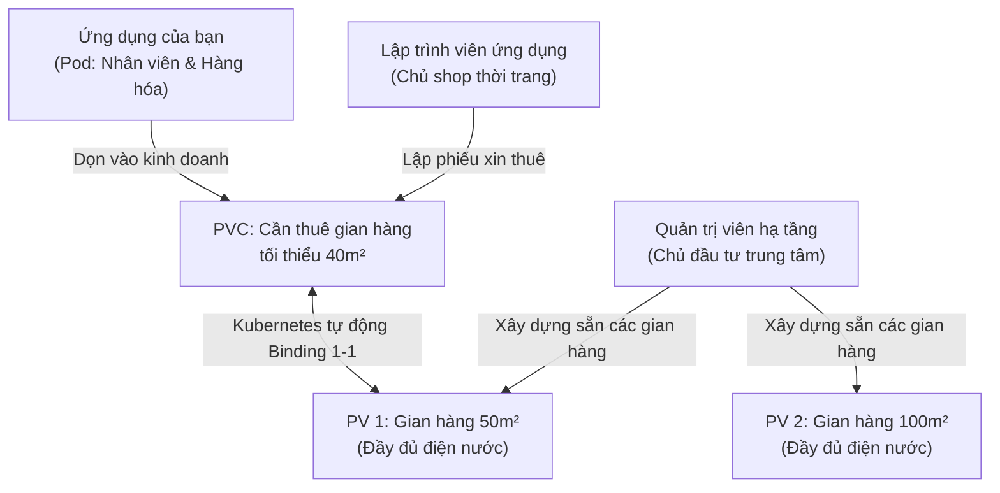
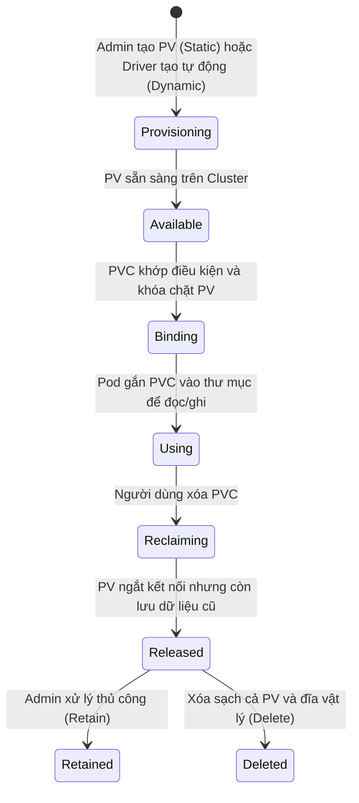

# Bài 15: PersistentVolume (PV) & PersistentVolumeClaim (PVC): Bản hợp đồng lưu trữ bền vững

## 1. Thông tin bài học
* **Tên bài:** Bài 15: PersistentVolume (PV) & PersistentVolumeClaim (PVC): Bản hợp đồng lưu trữ bền vững
* **Mục tiêu học:** Nắm vững triết lý phân tách trách nhiệm giữa Quản trị viên hạ tầng (Cluster Administrator) và Lập trình viên ứng dụng (Developer) thông qua bộ đôi PersistentVolume (PV) và PersistentVolumeClaim (PVC); làm chủ 4 chế độ truy cập (Access Modes: `RWO`, `ROX`, `RWX`, `RWOP`) và 3 chính sách thu hồi (Reclaim Policies: `Retain`, `Delete`, `Recycle`); hiểu sâu quy trình ghép cặp (Binding) 1-1; thực hành cấu hình lưu trữ bền vững (Static Provisioning) cho dịch vụ `redis-cart` trong dự án Online Boutique và chứng minh dữ liệu giỏ hàng sống sót an toàn khi xóa hoàn toàn Pod.
* **Thời lượng ước tính:** 120 phút (60 phút lý thuyết, 60 phút thực hành)
* **Kiến thức cần có trước:** Bài 06 (Pod: Đơn vị tính toán nguyên tử), Bài 10 (Service: Cầu nối mạng bền vững), Bài 14 (Ephemeral Volumes: Lưu trữ tạm thời với emptyDir & hostPath).
* **Liên quan kỳ thi:** CKA, CKAD (Chủ đề bắt buộc chiếm 10–15% bài thi thực hành CKA: cấu hình PV thủ công từ tài nguyên đĩa máy chủ, tạo PVC ghép cặp chính xác theo dung lượng và Access Mode, gắn PVC vào Pod và xử lý sự cố kẹt trạng thái `Pending` do sai lệch ràng buộc).

---

## 2. Bảng thuật ngữ

| Thuật ngữ | Giải thích đơn giản | Ví dụ / Ẩn dụ đời thường |
| :--- | :--- | :--- |
| **PersistentVolume (PV)** | Tài nguyên lưu trữ thực tế trong cluster (ổ cứng mạng, SAN, cloud disk) do Quản trị viên tạo sẵn; tồn tại độc lập hoàn toàn với vòng đời của Pod. | Mảnh đất hoặc gian hàng có sẵn trong trung tâm thương mại do chủ đầu tư quy hoạch và xây dựng sẵn từ trước. |
| **PersistentVolumeClaim (PVC)** | "Phiếu yêu cầu cấp phát" hoặc "Hợp đồng thuê" do Lập trình viên tạo ra để xin một lượng dung lượng đĩa và chế độ truy cập nhất định từ cluster. | Đơn xin thuê mặt bằng của chủ shop thời trang gửi ban quản lý: xin thuê gian hàng diện tích tối thiểu 50m² có lối đi riêng. |
| **Binding (Ghép cặp)** | Quá trình Kubernetes tự động tìm một PV thỏa mãn các tiêu chí của PVC và "gán chặt" hai đối tượng này lại với nhau theo tỷ lệ 1-1. | Ban quản lý ký hợp đồng và trao chìa khóa gian hàng A01 cho chủ shop; từ lúc này gian hàng A01 thuộc quyền sử dụng riêng của shop đó. |
| **Access Modes** | Chế độ truy cập quy định số lượng máy chủ Node và quyền đọc/ghi đồng thời vào ổ đĩa (`ReadWriteOnce`, `ReadOnlyMany`, `ReadWriteMany`, `ReadWriteOncePod`). | Quy định sử dụng phòng: chỉ cho 1 người cầm chìa khóa vào sửa chữa (`RWO`), hay phát thẻ vào cửa cho nhiều người cùng vào đọc sách (`ROX`). |
| **Reclaim Policy** | Chính sách xử lý dữ liệu trên PV sau khi PVC bị người dùng xóa bỏ (`Retain` - giữ lại, `Delete` - xóa vĩnh viễn, `Recycle` - dọn sạch ruột). | Quy định khi khách trả phòng trọ: chủ nhà giữ nguyên hiện trạng chờ kiểm tra (`Retain`), đập bỏ phòng (`Delete`), hay thuê lao công dọn sạch phòng (`Recycle`). |
| **Static Provisioning** | Cơ chế cấp phát thủ công: Quản trị viên phải tạo sẵn các tài nguyên PV từ trước bằng tay, sau đó Lập trình viên mới tạo PVC để ghép cặp. | Khách sạn xây sẵn các phòng cố định 20m², 50m²; khách đến thuê thì chọn phòng đã xây sẵn chứ không thể xây thêm ngay lúc đó. |

---

## 3. Bức tranh lớn: Vấn đề thực tế và ẩn dụ đời thường

### Nhắc lại bài trước
Ở Bài 14, chúng ta đã tìm hiểu hai loại ổ đĩa tạm thời là `emptyDir` và `hostPath`. `emptyDir` hoạt động rất tốt trong việc làm vùng đệm dữ liệu tạm thời (cache) và chia sẻ tệp tin giữa các container trong cùng một Pod. Tuy nhiên, nhược điểm chí mạng của nó là: **Dữ liệu gắn liền với vòng đời của Pod; hễ Pod bị xóa hoặc dời sang node khác là toàn bộ dữ liệu biến mất không dấu vết!** Trong khi đó, `hostPath` lại trói chặt Pod vào một Node vật lý duy nhất và tiềm ẩn nguy cơ bảo mật nghiêm trọng.

### Tại sao cần cái này ở production? (Vấn đề thực tế)

Hãy tưởng tượng bạn đang vận hành dịch vụ giỏ hàng `redis-cart` cho sàn thương mại điện tử Online Boutique trong ngày hội mua sắm Mega Sale:

1. **Thảm họa mất dữ liệu khách hàng (Data Loss):**
   Khách hàng vừa thêm 10 món hàng giá trị cao vào giỏ. Bất ngờ, Worker Node chạy dịch vụ bị quá tải CPU, Kubernetes tự động dời Pod `redis-cart` sang một Node khác. Nếu bạn dùng `emptyDir`, toàn bộ giỏ hàng của hàng chục ngàn khách hàng sẽ bốc hơi trong chớp mắt! Khách hàng quay lại màn hình thanh toán thấy giỏ hàng trống trơn và rời bỏ website.
2. **Sự phụ thuộc hạ tầng làm phá vỡ tính di động (Portability):**
   Nếu Kubernetes cho phép lập trình viên tự gắn trực tiếp thông số ổ đĩa cứng vật lý vào Pod (ví dụ khai báo trực tiếp địa chỉ máy chủ NFS `192.168.1.50:/exports/data` hay mã ổ đĩa AWS EBS `vol-0a1b2c3d4e5f`), thì file manifest Pod đó sẽ **không bao giờ chạy được ở bất kỳ cụm nào khác**! Khi doanh nghiệp chuyển đổi từ hạ tầng máy chủ vật lý On-premise lên đám mây AWS, toàn bộ mã nguồn triển khai sẽ phải đập đi viết lại.
3. **Mâu thuẫn quyền hạn giữa Sysadmin và Developer:**
   Lập trình viên viết mã nguồn cho `cartservice` không cần và không nên biết hạ tầng lưu trữ bên dưới là ổ đĩa thể rắn NVMe cục bộ, hệ thống mạng SAN đắt đỏ của Dell EMC, hay dịch vụ lưu trữ đám mây Google Cloud Persistent Disk. Lập trình viên chỉ cần quan tâm: *"Ứng dụng của tôi cần 10 Gigabyte đĩa và hỗ trợ đọc/ghi một node"*. Ngược lại, Quản trị viên hạ tầng (Sysadmin/Storage Admin) là người nắm ngân sách và quản lý các thiết bị lưu trữ, họ cần quy hoạch dung lượng trước để tránh việc lập trình viên xin cấp phát ổ cứng vô tội vạ làm cạn kiệt ngân sách công ty.

**Giải pháp chuẩn mực của Kubernetes:**
> **"Tách rời bản hợp đồng yêu cầu tài nguyên (PVC) ra khỏi thực thể lưu trữ vật lý (PV). Lập trình viên chỉ làm việc với PVC, còn Quản trị viên chịu trách nhiệm cung cấp PV!"**

### Ẩn dụ đời thường: Hợp đồng Thuê Gian hàng tại Trung tâm Thương mại

Hãy hình dung cách vận hành của một trung tâm thương mại lớn:



1. **PersistentVolume (PV) là Gian hàng do Chủ đầu tư xây sẵn:**
   * Chủ đầu tư bỏ tiền xây dựng một dãy gian hàng: gian số 01 rộng 50m², gian số 02 rộng 100m². Các gian hàng này đứng sừng sững ở đó, bất kể có người thuê hay chưa (`Cluster-scoped`).
2. **PersistentVolumeClaim (PVC) là Phiếu yêu cầu thuê mặt bằng:**
   * Bạn là chủ shop quần áo trẻ em. Bạn không tự đi xây tường hay đổ bê tông. Bạn chỉ nộp một lá đơn: *"Tôi muốn thuê một mặt bằng diện tích tối thiểu 40m²"* (`Namespaced`).
3. **Hành động Binding là Ký hợp đồng cho thuê:**
   * Ban quản lý trung tâm thương mại (Kubernetes Master/Controller) duyệt đơn. Thấy gian hàng số 01 (50m²) còn trống và thỏa mãn yêu cầu (50m² $\ge$ 40m²), ban quản lý lập tức ký hợp đồng và trao chìa khóa gian số 01 cho bạn.
   * Từ thời điểm này, gian số 01 đã thuộc quyền sở hữu riêng của bạn. Không một ai khác được phép thuê gian hàng này nữa (`Tỷ lệ ghép cặp 1-1`).
4. **Pod là Đội ngũ nhân viên và Hàng hóa:**
   * Nhân viên của bạn bước vào gian hàng số 01 để bày bán quần áo (`Volume Mount`). Nếu nhân viên đó nghỉ việc (Pod bị xóa) và bạn thuê nhân viên mới đến thay thế (Pod mới sinh ra), toàn bộ quầy kệ và quần áo trong gian hàng vẫn nằm nguyên vẹn ở đó!

---

## 4. Giải thích khái niệm theo từng bước

### Bước 1: Vòng đời của một Volume lưu trữ bền vững (4 giai đoạn)

Vòng đời của hệ thống lưu trữ bền vững trong Kubernetes trải qua 4 giai đoạn nối tiếp nhau:



1. **Cấp phát (Provisioning):** 
   * *Cấp phát tĩnh (Static Provisioning):* Admin tạo sẵn các đối tượng PV bằng file manifest YAML.
   * *Cấp phát động (Dynamic Provisioning):* Tự động sinh ra PV khi có PVC yêu cầu (sẽ học chi tiết ở Bài 16).
2. **Ghép cặp (Binding):**
   * Người dùng tạo PVC. Bộ điều khiển `pv-controller` trong Control Plane sẽ liên tục rà soát danh sách các PV đang ở trạng thái `Available` để tìm PV phù hợp nhất (khớp dung lượng, khớp Access Mode, khớp StorageClass).
   * Khi tìm thấy, PV và PVC sẽ chuyển trạng thái sang **`Bound`**.
   * **Quy tắc bất biến:** Một PVC chỉ gắn với đúng một PV, và một PV chỉ phục vụ duy nhất một PVC tại một thời điểm!
3. **Sử dụng (Using):**
   * Pod khai báo PVC trong khối `spec.volumes` và mount vào container qua `spec.containers[*].volumeMounts`.
4. **Thu hồi (Reclaiming):**
   * Khi người dùng không còn nhu cầu và thực hiện xóa PVC, PV sẽ chuyển sang trạng thái `Released`. Hành vi tiếp theo phụ thuộc vào chính sách `persistentVolumeReclaimPolicy`.

---

### Bước 2: Bốn chế độ truy cập (Access Modes)

Access Mode quy định cách thức mà ổ đĩa có thể được gắn (mount) vào các máy chủ Worker Node:

| Ký hiệu viết tắt | Tên đầy đủ | Ý nghĩa kỹ thuật | Phù hợp với loại hạ tầng nào? |
| :--- | :--- | :--- | :--- |
| **RWO** | `ReadWriteOnce` | Cho phép **duy nhất MỘT Node** mount ổ đĩa ở chế độ Đọc - Ghi. | Ổ đĩa khối (Block Storage) như AWS EBS, GCP Persistent Disk, local disk. |
| **ROX** | `ReadOnlyMany` | Cho phép **NHIỀU Node** cùng mount ổ đĩa cùng lúc nhưng **chỉ được Đọc**. | Đĩa chứa dữ liệu tĩnh, tài liệu tham khảo, kho ảnh sản phẩm chỉ đọc. |
| **RWX** | `ReadWriteMany` | Cho phép **NHIỀU Node** cùng mount ổ đĩa ở chế độ Đọc - Ghi đồng thời. | Hệ thống tệp mạng phân tán (Network File System) như NFS, CephFS, AWS EFS. |
| **RWOP** | `ReadWriteOncePod` | Cho phép **duy nhất MỘT Pod** trên toàn cụm được mount Đọc - Ghi (tính năng bảo vệ tuyệt đối từ K8s 1.22+). | Các cơ sở dữ liệu nghiêm ngặt không cho phép 2 Pod cùng ghi kể cả khi chạy chung trên 1 node. |

> ⚠️ **Lưu ý sống còn về RWO:** "Once" ở đây nghĩa là **MỘT NODE**, chứ KHÔNG PHẢI một Pod! Nếu bạn có 5 Pod cùng được lập lịch chạy trên cùng một Worker Node, cả 5 Pod đó đều có thể mount và ghi vào cùng một ổ đĩa RWO. Nhưng nếu Pod thứ 6 chạy ở Worker Node khác, nó sẽ bị từ chối ngay lập tức!

---

### Bước 3: Ba chính sách thu hồi (Reclaim Policies)

Khi bạn chạy lệnh `kubectl delete pvc <tên-pvc>`, điều gì sẽ xảy ra với dữ liệu nằm trên ổ đĩa vật lý của PV?

1. **`Retain` (Mặc định cho PV tạo thủ công - Khuyên dùng cho Database):**
   * PV chuyển sang trạng thái `Released`.
   * Toàn bộ dữ liệu trên ổ cứng vật lý **được giữ nguyên vẹn 100%**.
   * Không ai có thể dùng lại PV này ngay lập tức. Quản trị viên phải kiểm tra, sao lưu dữ liệu và can thiệp thủ công (xóa trường `claimRef`) thì PV mới trở lại trạng thái `Available`.
2. **`Delete` (Mặc định cho Dynamic Provisioning):**
   * Ngay khi PVC bị xóa, Kubernetes sẽ lập tức gửi lệnh tới nhà cung cấp hạ tầng để **xóa sổ hoàn toàn cả đối tượng PV lẫn ổ đĩa vật lý** phía sau. Dữ liệu mất vĩnh viễn không thể khôi phục!
3. **`Recycle` (Đã lỗi thời - Deprecated):**
   * Kubernetes sẽ thực thi một tác vụ dọn dẹp cơ bản (`rm -rf /thevolume/*`) để tẩy trắng dữ liệu và đưa PV trở lại trạng thái `Available`. Chính sách này hiện không còn được khuyến khích sử dụng.

---

### Bước 4: Phạm vi cấp độ tài nguyên: Cluster-scoped vs Namespaced

Đây là bẫy tư duy kinh điển khiến nhiều kỹ sư mới gặp lỗi:

* **PersistentVolume (PV)** là tài nguyên cấp **Cụm (Cluster-scoped)**: Nó không thuộc về bất kỳ namespace nào cả (tương tự như đối tượng `Node`). Một PV có thể được gắn vào PVC ở bất kỳ namespace nào.
* **PersistentVolumeClaim (PVC)** là tài nguyên cấp **Không gian tên (Namespaced)**: Nó bị giới hạn chặt chẽ trong namespace nơi nó được tạo ra. Một Pod ở namespace `prod` chỉ có thể mount được PVC nằm trong cùng namespace `prod`, tuyệt đối không thể mount chéo sang PVC của namespace `dev`!

---

## 5. Thực hành (Lab)

* **Môi trường:** Cụm kind (`k8s\kind-config.yaml`) gồm 1 control-plane và 1 worker node.
* **Mức RAM ước tính:** ~130 MB (sử dụng image `redis:7-alpine` siêu nhẹ, hoàn toàn an toàn cho ngưỡng 4GB WSL).

### Kịch bản thực hành: Triển khai lưu trữ bền vững cho `redis-cart`
Chúng ta sẽ mô phỏng việc lưu trữ bền vững giỏ hàng Online Boutique:
1. Tạo một thư mục lưu trữ thực tế trên worker node của kind.
2. Khai báo một `PersistentVolume` tĩnh trỏ vào thư mục này với dung lượng 256Mi, chính sách `Retain`.
3. Khai báo một `PersistentVolumeClaim` xin cấp phát 200Mi.
4. Triển khai Pod `redis-cart` sử dụng PVC này để lưu dữ liệu giỏ hàng.
5. Ghi một dữ liệu giỏ hàng mẫu vào Redis.
6. **Xóa hoàn toàn Pod `redis-cart` khỏi cluster!**
7. Tạo lại một Pod `redis-cart` mới tinh gắn vào cùng PVC đó và kiểm chứng: Dữ liệu giỏ hàng vẫn còn nguyên vẹn 100%!

---

### Bước 1: Chuẩn bị thư mục trên Worker Node của kind

Do kind chạy bằng Docker container, mỗi node của kind là một container. Chúng ta sẽ tạo một thư mục `/mnt/data/redis-cart` trên container worker node:

```powershell
# Tạo thư mục lưu trữ trên node worker của kind (node tên 'lab-worker')
docker exec -it lab-worker mkdir -p /mnt/data/redis-cart
# Cấp quyền đọc ghi cho thư mục
docker exec -it lab-worker chmod 777 /mnt/data/redis-cart
```

---

### Bước 2: Chuẩn bị file cấu hình PV và PVC (`pv-pvc-lab.yaml`)

```powershell
@'
# 1. Định nghĩa PersistentVolume (Tài nguyên cấp Cluster)
apiVersion: v1
kind: PersistentVolume
metadata:
  name: redis-cart-local-pv
  labels:
    type: local-storage
    app: redis-cart
spec:
  capacity:
    storage: 256Mi
  volumeMode: Filesystem
  accessModes:
    - ReadWriteOnce
  persistentVolumeReclaimPolicy: Retain
  storageClassName: manual  # Gán class manual để tránh bị StorageClass mặc định can thiệp
  hostPath:
    path: /mnt/data/redis-cart
    type: DirectoryOrCreate
---
# 2. Định nghĩa PersistentVolumeClaim (Tài nguyên cấp Namespace)
apiVersion: v1
kind: PersistentVolumeClaim
metadata:
  name: redis-cart-pvc
  namespace: default
spec:
  accessModes:
    - ReadWriteOnce
  resources:
    requests:
      storage: 200Mi  # Yêu cầu 200Mi (nhỏ hơn 256Mi của PV -> Hợp lệ!)
  storageClassName: manual
  # Sử dụng selector để đảm bảo bind chính xác vào PV mong muốn
  selector:
    matchLabels:
      app: redis-cart
'@ | Set-Content -Path .\pv-pvc-lab.yaml -Encoding UTF8
```

---

### Bước 3: Triển khai PV, PVC và kiểm tra trạng thái Binding

```powershell
# Áp dụng cấu hình vào cluster
kubectl apply -f .\pv-pvc-lab.yaml

# Kiểm tra trạng thái của PV
kubectl get pv redis-cart-local-pv

# Kiểm tra trạng thái của PVC
kubectl get pvc redis-cart-pvc
```

#### Kết quả mong đợi (Expected Output):
```text
persistentvolume/redis-cart-local-pv created
persistentvolumeclaim/redis-cart-pvc created

NAME                   CAPACITY   ACCESS MODES   RECLAIM POLICY   STATUS   CLAIM                    STORAGECLASS   AGE
redis-cart-local-pv    256Mi      RWO            Retain           Bound    default/redis-cart-pvc   manual         4s

NAME             STATUS   VOLUME                CAPACITY   ACCESS MODES   STORAGECLASS   AGE
redis-cart-pvc   Bound    redis-cart-local-pv   256Mi      RWO            manual         4s
```

> 🎯 **Quan sát quan trọng:** Cả PV và PVC đều chuyển sang cột `STATUS` là **`Bound`**! Trong đó cột `CLAIM` của PV hiển thị rõ `default/redis-cart-pvc`, minh chứng cho sự gắn kết hợp đồng 1-1 thành công rực rỡ!

---

### Bước 4: Triển khai Pod `redis-cart` và ghi dữ liệu giỏ hàng

Tạo file manifest cho Pod `redis-cart`:

```powershell
@'
apiVersion: v1
kind: Pod
metadata:
  name: redis-cart-app
  namespace: default
  labels:
    app: redis-cart
spec:
  volumes:
    - name: redis-storage
      persistentVolumeClaim:
        claimName: redis-cart-pvc  # Trỏ vào PVC đã tạo
  containers:
    - name: redis
      image: redis:7-alpine
      command: ["redis-server", "--appendonly", "yes"]  # Bật chế độ AOF để ghi dữ liệu tức thì xuống đĩa
      ports:
        - containerPort: 6379
      volumeMounts:
        - name: redis-storage
          mountPath: /data  # Thư mục lưu trữ chuẩn của Redis
'@ | Set-Content -Path .\redis-pod.yaml -Encoding UTF8

kubectl apply -f .\redis-pod.yaml
kubectl wait --for=condition=Ready pod/redis-cart-app --timeout=60s
```

#### Ghi dữ liệu mẫu vào Redis:
```powershell
# Giả lập khách hàng thêm 2 món hàng vào giỏ hàng
kubectl exec redis-cart-app -- redis-cli set "cart:user_nguyen_van_a" "2x Vintage Sunglasses, 1x Hipster Watch"

# Lưu dữ liệu tức thì xuống đĩa
kubectl exec redis-cart-app -- redis-cli bgsave

# Đọc thử để xác nhận
kubectl exec redis-cart-app -- redis-cli get "cart:user_nguyen_van_a"
```
Output trả về: `"2x Vintage Sunglasses, 1x Hipster Watch"`.

---

### Bước 5: Thử nghiệm kịch bản sống còn: Xóa hoàn toàn Pod và hồi sinh!

Bây giờ, chúng ta sẽ xóa sổ Pod `redis-cart-app` khỏi cluster để giả lập tình huống Pod bị sập:

```powershell
# Xóa Pod
kubectl delete pod redis-cart-app

# Xác nhận Pod đã biến mất hoàn toàn
kubectl get pod redis-cart-app
# Output: Error from server (NotFound): pods "redis-cart-app" not found
```

Tiếp theo, triển khai lại đúng Pod đó từ file manifest `redis-pod.yaml`:
```powershell
kubectl apply -f .\redis-pod.yaml
kubectl wait --for=condition=Ready pod/redis-cart-app --timeout=60s

# Kiểm tra xem dữ liệu giỏ hàng có còn sống sót không!
kubectl exec redis-cart-app -- redis-cli get "cart:user_nguyen_van_a"
```

#### Kết quả mong đợi:
```text
"2x Vintage Sunglasses, 1x Hipster Watch"
```
🎉 **Thành công tuyệt đối!** Dù Pod cũ đã bị tiêu diệt hoàn toàn, Pod mới sinh ra khi được gắn vào cùng một PVC đã lập tức nhận lại toàn bộ dữ liệu giỏ hàng mà không hề mất đi một ký tự nào!

---

### Bước 6: Dọn dẹp tài nguyên (Cleanup)
```powershell
kubectl delete -f .\redis-pod.yaml
kubectl delete -f .\pv-pvc-lab.yaml
Remove-Item .\redis-pod.yaml, .\pv-pvc-lab.yaml

# Xóa thư mục trên docker worker node
docker exec -it lab-worker rm -rf /mnt/data/redis-cart
```

---

## 6. Lỗi thường gặp và cách debug

### Lỗi 1: PVC bị kẹt vĩnh viễn ở trạng thái `Pending`
* **Dấu hiệu:** Chạy `kubectl get pvc` thấy cột STATUS luôn là `Pending` sau nhiều phút.
* **Nguyên nhân cốt lõi:**
  1. Không có PV nào có dung lượng đủ lớn để đáp ứng (`PV Capacity < PVC Request`).
  2. Access Mode của PVC không trùng khớp với Access Mode khai báo trong PV (ví dụ PV chỉ hỗ trợ `RWO` nhưng PVC lại đòi `RWX`).
  3. Giá trị `storageClassName` giữa PV và PVC không khớp nhau.
  4. Selector của PVC không khớp với nhãn (Labels) của PV.
* **Cách debug và sửa:**
  Chạy lệnh: `kubectl describe pvc <tên-pvc>`.
  Đọc phần `Events` ở cuối:
  * `waiting for a volume to be created, either by the external provisioner or manually created by system administrator`: Không tìm thấy PV phù hợp.
  * Đối chiếu kỹ: Dung lượng (`storage`), `accessModes`, và `storageClassName` giữa 2 bên.

### Lỗi 2: PV ở trạng thái `Released` nhưng PVC mới không thể Bind vào được
* **Dấu hiệu:** Bạn vừa xóa PVC cũ và tạo một PVC mới có cấu hình y hệt, nhưng PVC mới vẫn dính `Pending` dù PV đang hiện diện.
* **Nguyên nhân:** Do chính sách `persistentVolumeReclaimPolicy: Retain`. Khi PVC cũ bị xóa, PV chuyển sang `Released` nhưng bên trong cấu hình của PV vẫn còn lưu vết khóa định danh của PVC cũ trong trường `spec.claimRef`. Kubernetes từ chối bind PVC mới để bảo vệ dữ liệu cũ không bị ghi đè nhầm!
* **Cách sửa:**
  Dùng lệnh sửa PV: `kubectl edit pv <tên-pv>`, tìm đến trường `claimRef:` và xóa toàn bộ khối này đi. Ngay khi xóa xong, PV sẽ lập tức chuyển từ `Released` sang `Available` và bind ngay với PVC mới!

### Lỗi 3: Lỗi `Multi-Attach error for volume` khi cập nhật Deployment
* **Dấu hiệu:** Pod mới không thể khởi động, log báo lỗi: `Multi-Attach error for volume ... Volume is already exclusively attached to one node and can't be attached to another`.
* **Nguyên nhân:** Ổ đĩa của bạn thuộc loại `ReadWriteOnce` (như AWS EBS). Khi Deployment thực hiện Rolling Update, Pod mới được lập lịch trên Node B và cố gắng gắn ổ đĩa vào, trong khi Pod cũ trên Node A vẫn chưa kịp tắt và chưa nhả kết nối với ổ đĩa đó!
* **Cách sửa:** Chuyển chiến lược triển khai của Deployment sang `strategy: type: Recreate` (buộc tắt Pod cũ trước rồi mới tạo Pod mới), hoặc sử dụng **StatefulSet** (sẽ học ở Bài 17).

---

## 7. Góc nhìn Senior

### 1. Sự đánh đổi (Trade-offs): Static Provisioning vs Dynamic Provisioning

| Tiêu chí | Cấp phát tĩnh (Static Provisioning) | Cấp phát động (Dynamic Provisioning - Bài 16) |
| :--- | :--- | :--- |
| **Quy trình vận hành** | Admin phải tự tay tính toán, tạo đĩa trên hạ tầng và viết file PV YAML trước. | Hoàn toàn tự động; lập trình viên tạo PVC đến đâu, StorageClass tự gọi API đám mây tạo đĩa PV đến đó. |
| **Kiểm soát chi phí** | Rất chặt chẽ; admin giới hạn sẵn tổng số lượng đĩa được tạo trong cluster. | Cần đặt hạn ngạch ResourceQuota nghiêm ngặt, nếu không developer tạo bừa bãi sẽ làm phình hóa đơn đám mây. |
| **Tính linh hoạt** | Kém linh hoạt; chậm chạp khi hệ thống cần mở rộng quy mô đột biến. | Cực kỳ linh hoạt, chuẩn mực Cloud-Native hiện đại. |
| **Khi nào nên dùng?** | Cụm On-premise dùng ổ cứng vật lý cố định, môi trường lab kind/minikube, hoặc các phân vùng lưu trữ chuyên dụng cao cấp. | Toàn bộ các hệ thống production chạy trên Public Cloud (AWS, GCP, Azure) hoặc cụm có Ceph/Longhorn. |

### 2. Best practices tại production

1. **Luôn đặt `reclaimPolicy: Retain` cho cơ sở dữ liệu quan trọng:**
   Trong môi trường production, một cú gõ nhầm lệnh `kubectl delete namespace` hoặc `kubectl delete pvc` có thể hủy diệt toàn bộ dữ liệu doanh nghiệp nếu bạn để chính sách `Delete`. Thiết lập `Retain` là chiếc phanh an toàn cuối cùng giúp dữ liệu vật lý sống sót dù đối tượng K8s bị xóa.
2. **Tuyệt đối không dùng chung một ổ đĩa RWO cho nhiều Pod khác chức năng:**
   Kể cả khi 2 Pod chạy chung một node và kỹ thuật cho phép mount chung volume RWO, việc 2 tiến trình khác nhau cùng ghi dữ liệu vào một thư mục không có cơ chế khóa (file locking) sẽ dẫn đến thảm họa rách tệp (file corruption).
3. **Luôn thiết lập Storage ResourceQuota cho từng Namespace:**
   Sử dụng ResourceQuota để giới hạn tổng dung lượng lưu trữ (ví dụ: `requests.storage: 50Gi`) và số lượng PVC tối đa trong namespace của từng đội ngũ phát triển để tránh cạn kiệt tài nguyên lưu trữ của cluster.

### 3. Câu hỏi phỏng vấn Senior

* **Câu hỏi 1:** *"Giả sử trong cluster có một PV dung lượng 100GiB đang ở trạng thái Available. Lập trình viên tạo một PVC chỉ yêu cầu 20GiB. Kubernetes có cho phép ghép cặp (Binding) không? Nếu có, 80GiB còn lại có thể được cấp cho một PVC khác không?"*
* **Gợi ý trả lời chuẩn:**
  Kubernetes **HOÀN TOÀN CHO PHÉP** ghép cặp, vì điều kiện dung lượng của PVC là điều kiện "tối thiểu" (Request $\le$ Capacity: 20GiB $\le$ 100GiB). Tuy nhiên, **80GiB còn lại sẽ BỊ LÃNG PHÍ HOÀN TOÀN** và không thể cấp phát cho bất kỳ ai khác! Lý do là mối quan hệ giữa PV và PVC là **ghép cặp 1-1 (Exclusive One-to-One Binding)**. Một khi PV đã `Bound` với một PVC, nó không thể chia sẻ cho PVC thứ hai, trừ khi sử dụng Dynamic Provisioning để tự động tạo đúng dung lượng yêu cầu.

* **Câu hỏi 2:** *"Access Mode ReadWriteOnce (RWO) có ý nghĩa chính xác là gì? Tại sao tôi vẫn thấy hai container khác nhau ghi đồng thời vào một volume RWO mà Kubernetes không hề báo lỗi?"*
* **Gợi ý trả lời chuẩn:**
  Từ "Once" trong `ReadWriteOnce` đại diện cho **DUY NHẤT MỘT WORKER NODE**, chứ không phải một Container hay một Pod. Do đó, nếu hai container (nằm trong cùng một Pod hoặc nằm ở hai Pod khác nhau) đều được Kube-Scheduler lập lịch chạy trên **cùng một máy chủ Worker Node**, chúng hoàn toàn có thể mount và ghi đồng thời vào volume RWO đó. Nếu muốn ngăn chặn triệt để hành vi này và chỉ cho phép duy nhất một Pod truy cập, từ Kubernetes 1.22+ chúng ta phải sử dụng Access Mode **`ReadWriteOncePod` (RWOP)**.

---

## 8. Tóm tắt bài học

* 📌 **1. Phân tách trách nhiệm triệt để:** PV đại diện cho tài nguyên lưu trữ vật lý do Quản trị viên cấp phát (Cluster-scoped); PVC đại diện cho nhu cầu của Lập trình viên (Namespaced).
* 📌 **2. Nguyên lý Binding 1-1:** Một PVC chỉ ghép cặp với duy nhất một PV thỏa mãn đầy đủ các điều kiện về dung lượng, Access Mode và StorageClass.
* 📌 **3. Bốn Access Modes:** `RWO` (1 Node ghi), `ROX` (Nhiều Node chỉ đọc), `RWX` (Nhiều Node cùng ghi qua mạng) và `RWOP` (Độc quyền duy nhất 1 Pod).
* 📌 **4. Ba Reclaim Policies:** `Retain` (giữ lại đĩa an toàn cho database), `Delete` (xóa vĩnh viễn đĩa) và `Recycle` (đã lỗi thời).
* 📌 **5. Tính bền vững độc lập:** Dữ liệu trong PV tồn tại độc lập hoàn toàn với vòng đời của Pod; Pod bị xóa, dời node hay tạo lại đều không làm mất dữ liệu.

---

## 9. Bài tập tự làm

* 🟢 **Mức Dễ:** Viết manifest tạo một PV dung lượng 500Mi kiểu `hostPath` và một PVC yêu cầu 300Mi sử dụng Access Mode `ReadWriteOnce`. Kiểm tra output của lệnh `kubectl get pvc` để xác nhận trạng thái `Bound`.
* 🟡 **Mức Vừa (Troubleshooting Binding):** Tạo một PV hỗ trợ Access Mode `ReadWriteOnce`. Sau đó tạo một PVC yêu cầu Access Mode `ReadOnlyMany`. Quan sát trạng thái `Pending` của PVC, dùng `kubectl describe pvc` đọc thông báo lỗi và tiến hành sửa lại PVC để hai bên ghép cặp thành công.
* 🔴 **Mức Khó (Tái sinh PV bị Released):** Tạo một cặp PV/PVC với chính sách `Retain`. Sau khi bind thành công, tiến hành xóa PVC để đưa PV về trạng thái `Released`. Sau đó, hãy dùng lệnh `kubectl patch` hoặc `kubectl edit` để xóa trường `claimRef` trong PV, đưa PV trở về trạng thái `Available` và tạo một PVC mới bind thành công vào chính PV đó mà dữ liệu cũ bên trong vẫn được giữ nguyên.

---

## 10. Câu hỏi tự kiểm tra

1. Tại sao trong mô hình Kubernetes, lập trình viên không nên khai báo trực tiếp thông số ổ đĩa vật lý (như IP máy chủ NFS hay ID đĩa AWS EBS) vào file YAML của Pod?
2. Sự khác biệt căn bản nhất về phạm vi quản lý (Scope) giữa đối tượng PersistentVolume và PersistentVolumeClaim là gì?
3. Nếu bạn xóa một Pod đang mount một PVC, dữ liệu được ghi trong volume đó có bị mất không? Dữ liệu chỉ có nguy cơ bị xóa khi hành động nào diễn ra?
4. Một PV có dung lượng 50GiB có thể ghép cặp (Bind) với một PVC yêu cầu 100GiB không? Tại sao?
5. Chế độ truy cập `ReadWriteMany` (RWX) đòi hỏi hạ tầng lưu trữ phía dưới phải có đặc điểm gì mà các dịch vụ đĩa khối như AWS EBS hay GCP Persistent Disk không đáp ứng được?
6. Khi một PV được thiết lập chính sách `persistentVolumeReclaimPolicy: Retain`, điều gì sẽ xảy ra khi người dùng thực hiện lệnh xóa PVC tương ứng?

<details>
<summary>👉 Bấm vào đây để xem đáp án câu hỏi tự kiểm tra</summary>

* **Đáp án 1:** Vì việc đó sẽ làm phá vỡ tính di động (Portability) của ứng dụng qua các môi trường khác nhau, đồng thời vi phạm nguyên tắc phân quyền bảo mật giữa Quản trị viên hạ tầng và Lập trình viên.
* **Đáp án 2:** PersistentVolume là tài nguyên cấp **Cụm (Cluster-scoped)** không thuộc namespace nào; còn PersistentVolumeClaim là tài nguyên cấp **Không gian tên (Namespaced)** gắn liền với một namespace cụ thể.
* **Đáp án 3:** **HOÀN TOÀN KHÔNG BỊ MẤT**. Dữ liệu chỉ có nguy cơ bị xóa khi chính đối tượng PVC bị xóa và chính sách thu hồi của PV được thiết lập là `Delete`.
* **Đáp án 4:** **KHÔNG**. Vì dung lượng của PV (50GiB) nhỏ hơn dung lượng tối thiểu mà PVC yêu cầu (100GiB), điều kiện ghép cặp bị vi phạm.
* **Đáp án 5:** Đòi hỏi hạ tầng phải là **hệ thống tệp chia sẻ qua mạng (Network File System)** cho phép nhiều máy chủ vật lý khác nhau cùng mở kết nối đọc/ghi đồng thời qua giao thức mạng (như NFS, CephFS, CIFS); trong khi Block Storage chỉ có thể gắn vào 1 máy chủ duy nhất tại một thời điểm.
* **Đáp án 6:** PV sẽ chuyển sang trạng thái **`Released`**, dữ liệu trên ổ cứng vật lý được giữ nguyên vẹn 100%, nhưng PV sẽ không cho phép bất kỳ PVC nào khác ghép cặp cho đến khi Quản trị viên can thiệp thủ công.
</details>

---

## 11. Tài liệu đọc thêm và bài tiếp theo

### Tài liệu tham khảo
* [Tài liệu chính thức Kubernetes: Persistent Volumes](https://kubernetes.io/docs/concepts/storage/persistent-volumes/)
* [Hướng dẫn cấu hình: Configure a Pod to Use a PersistentVolume for Storage](https://kubernetes.io/docs/tasks/configure-pod-container/configure-persistent-volume-storage/)
* [Tài liệu API: PersistentVolumeClaimSpec](https://kubernetes.io/docs/reference/kubernetes-api/config-and-storage-resources/persistent-volume-claim-v1/)

### Bài tiếp theo
👉 **Bài 16: StorageClass & Dynamic Volume Provisioning**

---

## PHỤ LỤC: ĐÁP ÁN GỢI Ý BÀI TẬP TỰ LÀM (MỤC 9)

### Đáp án Mức Dễ
```powershell
@'
apiVersion: v1
kind: PersistentVolume
metadata:
  name: pv-easy-500m
spec:
  capacity:
    storage: 500Mi
  accessModes:
    - ReadWriteOnce
  storageClassName: manual
  hostPath:
    path: /tmp/data-easy
---
apiVersion: v1
kind: PersistentVolumeClaim
metadata:
  name: pvc-easy-300m
spec:
  accessModes:
    - ReadWriteOnce
  resources:
    requests:
      storage: 300Mi
  storageClassName: manual
'@ | kubectl apply -f -

# Kiểm tra trạng thái Bound
kubectl get pv pv-easy-500m
kubectl get pvc pvc-easy-300m

# Dọn dẹp
kubectl delete pvc pvc-easy-300m
kubectl delete pv pv-easy-500m
```

### Đáp án Mức Vừa
```powershell
# 1. Tạo PV chỉ có RWO
@'
apiVersion: v1
kind: PersistentVolume
metadata:
  name: pv-mismatch
spec:
  capacity:
    storage: 1Gi
  accessModes:
    - ReadWriteOnce
  storageClassName: manual
  hostPath:
    path: /tmp/mismatch
---
# 2. Tạo PVC đòi hỏi ReadOnlyMany (Gây lỗi!)
apiVersion: v1
kind: PersistentVolumeClaim
metadata:
  name: pvc-mismatch
spec:
  accessModes:
    - ReadOnlyMany
  resources:
    requests:
      storage: 500Mi
  storageClassName: manual
'@ | kubectl apply -f -

# Quan sát lỗi Pending
kubectl get pvc pvc-mismatch
kubectl describe pvc pvc-mismatch

# 3. Sửa lại PVC: Thay ReadOnlyMany thành ReadWriteOnce
kubectl delete pvc pvc-mismatch
@'
apiVersion: v1
kind: PersistentVolumeClaim
metadata:
  name: pvc-mismatch
spec:
  accessModes:
    - ReadWriteOnce
  resources:
    requests:
      storage: 500Mi
  storageClassName: manual
'@ | kubectl apply -f -

# Kiểm tra lại: Trạng thái đã chuyển sang Bound thành công!
kubectl get pvc pvc-mismatch

# Dọn dẹp
kubectl delete pvc pvc-mismatch
kubectl delete pv pv-mismatch
```

### Đáp án Mức Khó
```powershell
# 1. Tạo PV/PVC Retain
@'
apiVersion: v1
kind: PersistentVolume
metadata:
  name: pv-recycle-demo
spec:
  capacity:
    storage: 1Gi
  accessModes:
    - ReadWriteOnce
  persistentVolumeReclaimPolicy: Retain
  storageClassName: manual
  hostPath:
    path: /tmp/recycle-demo
---
apiVersion: v1
kind: PersistentVolumeClaim
metadata:
  name: pvc-recycle-demo
spec:
  accessModes:
    - ReadWriteOnce
  resources:
    requests:
      storage: 500Mi
  storageClassName: manual
'@ | kubectl apply -f -

# Đợi Bound
Start-Sleep -Seconds 3

# 2. Xóa PVC: PV chuyển sang Released
kubectl delete pvc pvc-recycle-demo
kubectl get pv pv-recycle-demo
# STATUS: Released

# 3. Tái sinh PV: Xóa trường claimRef trong PV bằng lệnh kubectl patch
kubectl patch pv pv-recycle-demo --type='json' -p='[{"op": "remove", "path": "/spec/claimRef"}]'

# Kiểm tra: PV đã trở lại Available!
kubectl get pv pv-recycle-demo
# STATUS: Available

# 4. Tạo PVC mới: Ngay lập tức được bind trở lại!
@'
apiVersion: v1
kind: PersistentVolumeClaim
metadata:
  name: pvc-new-tenant
spec:
  accessModes:
    - ReadWriteOnce
  resources:
    requests:
      storage: 500Mi
  storageClassName: manual
'@ | kubectl apply -f -

kubectl get pvc pvc-new-tenant
# STATUS: Bound

# Dọn dẹp
kubectl delete pvc pvc-new-tenant
kubectl delete pv pv-recycle-demo
```

