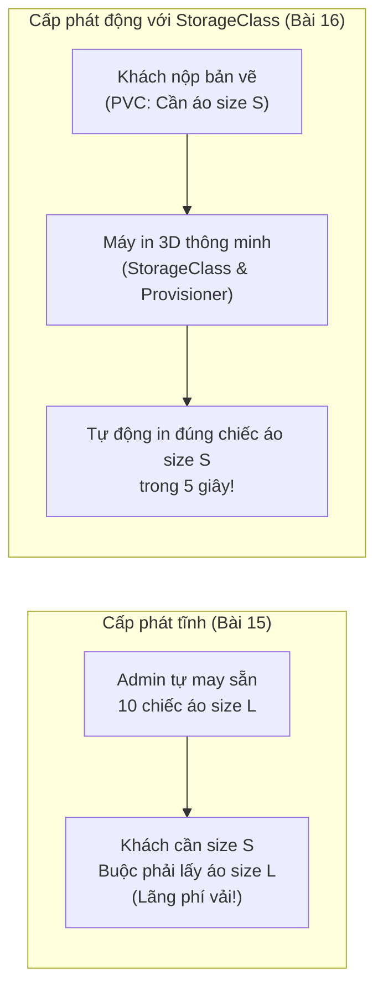
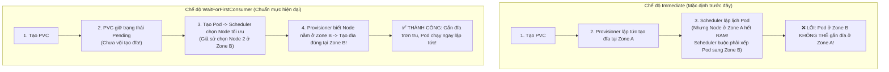
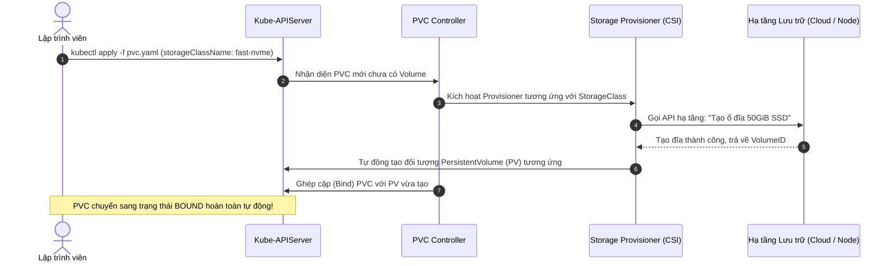

# Bài 16: StorageClass & Dynamic Volume Provisioning: Tự động hóa cấp phát lưu trữ

## 1. Thông tin bài học
* **Tên bài:** Bài 16: StorageClass & Dynamic Volume Provisioning: Tự động hóa cấp phát lưu trữ
* **Mục tiêu học:** Làm chủ đối tượng StorageClass và cơ chế Cấp phát động (Dynamic Volume Provisioning); hiểu rõ vai trò của Storage Provisioner và chuẩn giao tiếp lưu trữ container (CSI - Container Storage Interface); phân tích sâu hai chế độ gán đĩa `volumeBindingMode`: `Immediate` và `WaitForFirstConsumer` để loại bỏ hoàn toàn lỗi xung đột vùng địa lý (Multi-zone Mismatch); thực hành mở rộng dung lượng đĩa trực tuyến (`allowVolumeExpansion`); cấu hình thành thạo StorageClass trên cụm kind để tự động cấp phát PV cho dịch vụ Online Boutique theo yêu cầu mà không cần can thiệp thủ công.
* **Thời lượng ước tính:** 120 phút (60 phút lý thuyết, 60 phút thực hành)
* **Kiến thức cần có trước:** Bài 05 (Kiến trúc Kubernetes - Control Plane & Controller), Bài 06 (Pod), Bài 14 (Ephemeral Volumes), Bài 15 (PersistentVolume & PersistentVolumeClaim).
* **Liên quan kỳ thi:** CKA, CKAD (Chủ đề xuất hiện liên tục trong bài thi CKA: tạo StorageClass mới với các tham số cho trước, đặt một StorageClass làm mặc định (Default), tạo PVC không khai báo tên class để kiểm tra cơ chế fallback, và thực hiện thay đổi dung lượng PVC trực tiếp trên hệ thống).

---

## 2. Bảng thuật ngữ

| Thuật ngữ | Giải thích đơn giản | Ví dụ / Ẩn dụ đời thường |
| :--- | :--- | :--- |
| **StorageClass (sc)** | Bản thiết kế (Blueprint) định nghĩa loại hình lưu trữ, chất lượng đĩa và plugin chịu trách nhiệm tạo ổ đĩa tự động trong cluster. | Khuôn đúc mẫu hoặc loại hợp đồng dịch vụ: quy định rõ bạn muốn thuê căn hộ chung cư cao cấp có thang máy riêng hay phòng trọ giá rẻ bình dân. |
| **Dynamic Provisioning** | Cơ chế tự động hóa hoàn toàn: khi người dùng tạo PVC, Kubernetes sẽ tự động gọi hạ tầng tạo ra một ổ đĩa thực và một PV tương ứng trong tích tắc. | Cây bán nước tự động: bạn nhét tiền và bấm nút chọn lon nước, máy tự động nhả lon nước ra ngay lập tức mà không cần người bán hàng đứng phục vụ. |
| **CSI (Container Storage Interface)** | Chuẩn giao tiếp tiêu chuẩn công nghiệp cho phép các hãng lưu trữ (AWS, Google Cloud, Dell, NetApp, Ceph) viết plugin cắm vào Kubernetes mà không cần sửa mã nguồn lõi của K8s. | Chuẩn cắm USB type-C: cho phép mọi hãng sản xuất chuột, bàn phím, ổ cứng cắm vào bất kỳ máy tính nào cũng nhận ngay lập tức. |
| **`volumeBindingMode: Immediate`** | Chế độ cấp phát ổ đĩa ngay tức khắc thời điểm PVC vừa được tạo ra, bất kể đã có Pod nào sử dụng nó hay chưa. | Mua trước một chiếc vé xem phim ghế VIP vào sáng sớm mà chưa biết tối nay bạn sẽ đi xem ở rạp nào hay có bận việc gì không. |
| **`volumeBindingMode: WaitForFirstConsumer`** | Chế độ trì hoãn việc tạo đĩa: chỉ khi có Pod đầu tiên gắn PVC và được Scheduler chọn được Node cụ thể, ổ đĩa mới được tạo tại đúng Node/Zone đó. | Đến tận rạp chiếu phim, biết chắc phòng chiếu nào còn chỗ và bạn đã ngồi vào ghế rồi mới in vé ra thanh toán. |
| **`allowVolumeExpansion`** | Thuộc tính cho phép người dùng tăng kích thước dung lượng của PVC sau khi đã tạo mà không cần phải xóa đi tạo lại. | Chiếc thắt lưng da có nhiều lỗ đục sẵn: khi vòng eo bạn to ra sau bữa ăn, bạn chỉ cần nới thêm một nấc mà không phải vứt chiếc thắt lưng đi mua cái mới. |
| **Default StorageClass** | Lớp lưu trữ mặc định của cluster; nếu một PVC không khai báo trường `storageClassName`, Kubernetes sẽ tự động dùng lớp này. | Suất cơm văn phòng mặc định của quán ăn: nếu bạn vào quán chỉ nói "Cho một suất cơm" mà không chọn món cụ thể, quán sẽ tự động mang suất cơm sườn mặc định ra. |

---

## 3. Bức tranh lớn: Vấn đề thực tế và ẩn dụ đời thường

### Nhắc lại bài trước
Ở Bài 15, chúng ta đã hiểu rõ tính ưu việt của việc tách rời trách nhiệm giữa Quản trị viên (tạo PV) và Lập trình viên (tạo PVC) thông qua phương pháp **Cấp phát tĩnh (Static Provisioning)**. Tuy nhiên, bạn cũng đã thấy một nhược điểm chí mạng: Mỗi khi một ứng dụng cần lưu trữ, Quản trị viên phải tự tay đăng nhập vào máy chủ, tạo thư mục hoặc vào bảng điều khiển đám mây tạo ổ đĩa, sau đó viết một file YAML định nghĩa PV rồi áp dụng vào cluster. Hãy tưởng tượng nếu doanh nghiệp có 200 lập trình viên và 500 microservices hoạt động, quy trình thủ công này sẽ sụp đổ như thế nào!

### Tại sao cần cái này ở production? (Vấn đề thực tế)

1. **Nghẽn cổ chai vận hành (Operational Bottleneck):**
   Lập trình viên muốn triển khai một dịch vụ cơ sở dữ liệu thử nghiệm lúc 2 giờ sáng. Họ tạo PVC xin 50GiB đĩa, nhưng PVC bị kẹt ở trạng thái `Pending` vì không có PV nào có sẵn. Lập trình viên phải tạo phiếu yêu cầu (ticket) và chờ đến 9 giờ sáng hôm sau khi đội ngũ Sysadmin đi làm mới có người tạo PV. Tính linh hoạt và tốc độ phát triển (Agility) của doanh nghiệp bị kéo lùi nghiêm trọng.
2. **Lãng phí chi phí lưu trữ (Storage Over-provisioning):**
   Với cấp phát tĩnh, để tránh việc lập trình viên phải chờ đợi, quản trị viên thường có xu hướng tạo sẵn hàng loạt PV lớn (ví dụ 10 chiếc PV 100GiB). Khi lập trình viên chỉ cần 10GiB đĩa, họ tạo PVC và Kubernetes vẫn bind vào chiếc PV 100GiB đó (do nguyên tắc ghép cặp 1-1 ở Bài 15). Kết quả là 90GiB dung lượng còn lại bị bỏ hoang hoàn toàn, nhưng công ty vẫn phải trả tiền thuê ổ đĩa 100GiB cho nhà cung cấp đám mây hàng tháng!
3. **Thảm họa xung đột vùng địa lý (Multi-zone Availability Zone Mismatch):**
   Trên các nền tảng đám mây công cộng lớn (AWS, GCP, Azure), một cụm Kubernetes thường trải dài trên nhiều vùng khả dụng (Availability Zones, ví dụ `us-east-1a`, `us-east-1b`, `us-east-1c`). Ổ cứng dạng khối (như AWS EBS) chỉ có thể gắn vào các máy ảo EC2 nằm trong **CÙNG MỘT Availability Zone**. Nếu ổ cứng được tạo ra trước ở Zone `1a`, nhưng sau đó Kube-Scheduler lại quyết định đưa Pod chạy ở Worker Node nằm tại Zone `1b` (do Zone 1a lúc đó hết RAM), Pod sẽ bị kẹt vĩnh viễn ở trạng thái `ContainerCreating` vì ổ cứng không thể kéo dây cắm xuyên qua các tòa nhà trung tâm dữ liệu khác nhau!

**Giải pháp của Kubernetes:**
> **"Sử dụng StorageClass để biến việc cấp phát lưu trữ thành một dịch vụ tự phục vụ hoàn toàn (Self-service Storage). Lập trình viên tạo PVC đến đâu, StorageClass tự động gọi API hạ tầng tạo đĩa và sinh ra PV tương ứng đến đó!"**

### Ẩn dụ đời thường: Cửa hàng may sẵn và Máy in 3D theo yêu cầu



1. **Cấp phát tĩnh (Static Provisioning) là Cửa hàng bán đồ may sẵn:**
   * Thợ may (Sysadmin) phải ngồi may sẵn hàng loạt quần áo với các kích cỡ cố định và treo lên mắc.
   * Khách hàng (Developer) bước vào cửa hàng, nếu khách muốn chiếc áo size 39 mà cửa hàng chỉ còn áo size 44, khách đành phải mặc tạm chiếc áo rộng thùng thình (lãng phí tài nguyên) hoặc quay về tay không.
2. **Cấp phát động (Dynamic Provisioning) là Máy in 3D thông minh:**
   * **StorageClass là Công thức và Loại vật liệu in 3D:** Bạn cấu hình máy in sử dụng loại nhựa siêu cứng cao cấp (SSD NVMe) hay nhựa tiêu chuẩn giá rẻ (HDD).
   * **PVC là Bản thiết kế chi tiết do khách hàng nộp:** Khách hàng chỉ việc ấn nút: *"Tôi muốn in một chiếc cốc hình trụ dung tích đúng 250ml"*.
   * **Provisioner là Cánh tay robot của máy in:** Ngay khi nhận lệnh, cánh tay robot tự động hoạt động, phun nhựa và tạo ra đúng chiếc cốc 250ml trong tích tắc rồi trao cho khách hàng. Không cần bất kỳ người thợ thủ công nào phải túc trực bên cạnh!

---

## 4. Giải thích khái niệm theo từng bước

### Bước 1: Cấu trúc của một StorageClass Manifest

Một `StorageClass` thuộc nhóm API `storage.k8s.io/v1`. Nó là một tài nguyên cấp **Cụm (Cluster-scoped)**:

```yaml
apiVersion: storage.k8s.io/v1
kind: StorageClass
metadata:
  name: fast-nvme-sc
  annotations:
    # Đánh dấu đây là StorageClass mặc định của toàn cụm
    storageclass.kubernetes.io/is-default-class: "false"

# 1. Driver chịu trách nhiệm tạo ổ đĩa thực tế
provisioner: ebs.csi.aws.com  # Ví dụ cho AWS EBS CSI Driver

# 2. Các tham số kỹ thuật riêng biệt của nhà cung cấp hạ tầng
parameters:
  type: gp3
  iops: "3000"
  throughput: "125"
  fsType: ext4

# 3. Chính sách thu hồi khi xóa PVC (mặc định cho Dynamic Provisioning là Delete)
reclaimPolicy: Delete

# 4. Cho phép tăng kích thước đĩa của PVC sau khi đã tạo
allowVolumeExpansion: true

# 5. Chế độ gán đĩa: Trì hoãn việc tạo đĩa cho đến khi Pod được lập lịch
volumeBindingMode: WaitForFirstConsumer
```

#### Phân tích chi tiết từng trường quan trọng:
* **`provisioner`:** Tên của plugin driver điều khiển lưu trữ. Ví dụ: `kubernetes.io/no-provisioner` (dùng cho local storage tĩnh), `rancher.io/local-path` (driver local path mặc định của kind/k3s), `ebs.csi.aws.com` (AWS), `pd.csi.storage.gke.io` (Google Cloud).
* **`parameters`:** Các tham số chuyên sâu gửi thẳng cho nhà cung cấp lưu trữ (loại đĩa SSD hay HDD, chỉ số IOPS, kiểu hệ thống tệp `ext4` hay `xfs`).
* **`allowVolumeExpansion: true`:** Một cờ cực kỳ quan trọng ở production! Nếu bật cờ này, khi đĩa bị đầy, bạn chỉ cần sửa trường `spec.resources.requests.storage` trong PVC từ `50Gi` lên `100Gi`, hệ thống sẽ tự động mở rộng đĩa mà không làm gián đoạn ứng dụng!
* **`volumeBindingMode`:** Kiểm soát thời điểm tạo ổ đĩa vật lý (xem Bước 2 bên dưới).

---

### Bước 2: So sánh cốt tử giữa `Immediate` và `WaitForFirstConsumer`

Đây là chủ đề xuất hiện dày đặc trong các cuộc phỏng vấn Senior và bài thi CKA:



| Tiêu chí | `Immediate` | `WaitForFirstConsumer` |
| :--- | :--- | :--- |
| **Thời điểm tạo đĩa vật lý** | **Ngay lập tức** khi PVC vừa được áp dụng vào cluster. | **Trì hoãn** cho tới khi có Pod đầu tiên gắn PVC được Scheduler phân bổ vào Node. |
| **Trạng thái ban đầu của PVC** | Chuyển sang `Bound` ngay tức khắc. | Nằm ở `Pending` cho tới khi Pod xuất hiện. |
| **Hỗ trợ Multi-zone (Đa vùng)?** | ❌ Kém: Rất dễ dính lỗi lệch Zone giữa Pod và Volume. | ✅ Hoàn hảo: Luôn đảm bảo Volume và Pod nằm chung một máy chủ/vùng địa lý. |
| **Hỗ trợ Local Storage trên Node?** | ❌ Không thể dùng cho local disk. | ✅ Bắt buộc phải dùng (vì phải biết Pod chạy ở node nào mới tạo thư mục trên node đó). |
| **Khuyến nghị ở Production** | Chỉ dùng cho các hệ thống lưu trữ mạng dùng chung toàn cầu (như NFS, EFS). | 🛡️ **Khuyên dùng mặc định cho toàn bộ Block Storage và Local Storage.** |

---

### Bước 3: Luồng hoạt động của Dynamic Volume Provisioning

Khi một lập trình viên triển khai ứng dụng cần ổ đĩa tự động, chuỗi sự kiện diễn ra ngầm định như sau:



---

## 5. Thực hành (Lab)

* **Môi trường:** Cụm kind (`k8s\kind-config.yaml`) gồm 1 control-plane và 1 worker node.
* **Mức RAM ước tính:** ~120 MB (nhẹ nhàng, hoàn toàn trong ngưỡng 4GB WSL).
* **Storage Provisioner có sẵn trên kind:** kind được tích hợp sẵn một provisioner cực kỳ mạnh mẽ mang tên `rancher.io/local-path`. Nó tự động tạo thư mục lưu trữ cục bộ trên node mỗi khi có PVC yêu cầu.

### Kịch bản thực hành:
1. Khám phá StorageClass mặc định có sẵn trên cụm kind.
2. Tạo một StorageClass tùy biến mới mang tên `boutique-fast-storage` với chế độ `volumeBindingMode: WaitForFirstConsumer` và hỗ trợ mở rộng đĩa `allowVolumeExpansion: true`.
3. Tạo một PVC xin 100Mi mà **không hề tạo PV thủ công trước**. Quan sát PVC ở trạng thái `Pending` (đúng theo cơ chế trì hoãn của `WaitForFirstConsumer`).
4. Triển khai Pod `cart-auto-storage` gắn PVC này và chứng kiến PV tự động sinh ra trong tích tắc!
5. Thực hiện mở rộng dung lượng đĩa của PVC từ 100Mi lên 250Mi trực tiếp mà không cần xóa Pod hay PVC!

---

### Bước 1: Khám phá StorageClass trên cụm kind

```powershell
# Liệt kê danh sách StorageClass hiện có
kubectl get storageclass
```

#### Kết quả mong đợi (Expected Output):
```text
NAME                 PROVISIONER             RECLAIMPOLICY   VOLUMEBINDINGMODE      ALLOWVOLUMEEXPANSION   AGE
standard (default)   rancher.io/local-path   Delete          WaitForFirstConsumer   false                  10m
```
*Nhận xét:* kind đã cài sẵn một StorageClass tên là `standard` được đánh dấu `(default)`. Khi bạn tạo PVC mà không ghi `storageClassName`, nó sẽ tự dùng class này. Tuy nhiên, nó có `ALLOWVOLUMEEXPANSION = false`. Chúng ta sẽ tạo một class xịn hơn!

---

### Bước 2: Tạo StorageClass tùy biến `boutique-fast-storage`

Tạo file `custom-storageclass.yaml`:

```powershell
@'
apiVersion: storage.k8s.io/v1
kind: StorageClass
metadata:
  name: boutique-fast-storage
provisioner: rancher.io/local-path
reclaimPolicy: Delete
volumeBindingMode: WaitForFirstConsumer
allowVolumeExpansion: true  # Cho phép mở rộng dung lượng linh hoạt
'@ | Set-Content -Path .\custom-storageclass.yaml -Encoding UTF8

kubectl apply -f .\custom-storageclass.yaml
```

Kiểm tra class mới:
```powershell
kubectl get sc boutique-fast-storage
```
Output hiển thị rõ ràng: `ALLOWVOLUMEEXPANSION = true` và `VOLUMEBINDINGMODE = WaitForFirstConsumer`.

---

### Bước 3: Tạo PVC và quan sát hiện tượng Trì hoãn Cấp phát (Pending)

Tạo file `dynamic-pvc.yaml`:

```powershell
@'
apiVersion: v1
kind: PersistentVolumeClaim
metadata:
  name: boutique-cart-dynamic-pvc
  namespace: default
spec:
  accessModes:
    - ReadWriteOnce
  storageClassName: boutique-fast-storage  # Chỉ định class tùy biến vừa tạo
  resources:
    requests:
      storage: 100Mi
'@ | Set-Content -Path .\dynamic-pvc.yaml -Encoding UTF8

kubectl apply -f .\dynamic-pvc.yaml
```

Kiểm tra trạng thái của PVC:
```powershell
kubectl get pvc boutique-cart-dynamic-pvc
```

#### Kết quả mong đợi:
```text
NAME                        STATUS    VOLUME   CAPACITY   ACCESS MODES   STORAGECLASS            AGE
boutique-cart-dynamic-pvc   Pending                                      boutique-fast-storage   5s
```

> ❓ **Tại sao PVC lại bị `Pending`? Có phải bị lỗi không?**  
> **HOÀN TOÀN KHÔNG LỖI!** Vì StorageClass của chúng ta cài đặt `volumeBindingMode: WaitForFirstConsumer`. Kubernetes đang cố tình **chờ đợi** xem Pod nào sẽ dùng PVC này và Pod đó sẽ được xếp vào Node nào, sau đó mới gọi provisioner tạo đĩa đúng tại Node đó!

Kiểm chứng bằng lệnh `kubectl describe pvc`:
```powershell
kubectl describe pvc boutique-cart-dynamic-pvc | Select-String "WaitForFirstConsumer"
```
Output: `waiting for first consumer to be created before binding`.

---

### Bước 4: Triển khai Pod và chứng kiến sự kỳ diệu của Dynamic Provisioning

Tạo file `cart-pod.yaml` gắn PVC vừa tạo:

```powershell
@'
apiVersion: v1
kind: Pod
metadata:
  name: cart-dynamic-demo
  namespace: default
spec:
  volumes:
    - name: cart-data-vol
      persistentVolumeClaim:
        claimName: boutique-cart-dynamic-pvc
  containers:
    - name: cart-app
      image: alpine:latest
      command: ["sh", "-c"]
      args:
        - |
          echo "Khoi dong ung dung cartservice luu tru dong..."
          echo "Cart Data Item #1" > /data/cart-items.txt
          sleep 3600
      volumeMounts:
        - name: cart-data-vol
          mountPath: /data
'@ | Set-Content -Path .\cart-pod.yaml -Encoding UTF8

kubectl apply -f .\cart-pod.yaml
```

Đợi vài giây và kiểm tra lại trạng thái của Pod, PVC và danh sách PV:
```powershell
kubectl wait --for=condition=Ready pod/cart-dynamic-demo --timeout=30s
kubectl get pvc boutique-cart-dynamic-pvc
kubectl get pv
```

#### Kết quả mong đợi (Expected Output):
```text
pod/cart-dynamic-demo condition met

NAME                        STATUS   VOLUME                                     CAPACITY   ACCESS MODES   STORAGECLASS            AGE
boutique-cart-dynamic-pvc   Bound    pvc-1a2b3c4d-5e6f-7a8b-9c0d-112233445566   100Mi      RWO            boutique-fast-storage   45s

NAME                                       CAPACITY   ACCESS MODES   RECLAIM POLICY   STATUS   CLAIM                               STORAGECLASS            AGE
pvc-1a2b3c4d-5e6f-7a8b-9c0d-112233445566   100Mi      RWO            Delete           Bound    default/boutique-cart-dynamic-pvc   boutique-fast-storage   10s
```

🎉 **Một điều kỳ diệu đã diễn ra:**
Một PersistentVolume có tên dạng `pvc-1a2b3c4d-...` đã được **tự động sinh ra 100%**, có dung lượng đúng `100Mi` và lập tức chuyển sang trạng thái `Bound` mà bạn không hề phải viết một dòng YAML nào cho PV!

Kiểm tra dữ liệu bên trong Pod:
```powershell
kubectl exec cart-dynamic-demo -- cat /data/cart-items.txt
```
Output: `Cart Data Item #1`.

---

### Bước 5: Mở rộng dung lượng đĩa trực tuyến (Live Volume Expansion)

Giả sử sau một thời gian vận hành, dung lượng 100Mi sắp cạn kiệt và bạn muốn tăng lên 250Mi. Nhờ có thuộc tính `allowVolumeExpansion: true`, bạn có thể làm việc này trực tiếp:

```powershell
# Chạy lệnh patch để tăng dung lượng từ 100Mi lên 250Mi
kubectl patch pvc boutique-cart-dynamic-pvc --type='merge' -p='{"spec": {"resources": {"requests": {"storage": "250Mi"}}}}'
```

Kiểm tra lại PVC:
```powershell
kubectl get pvc boutique-cart-dynamic-pvc
```

#### Kết quả mong đợi:
```text
NAME                        STATUS   VOLUME                                     CAPACITY   ACCESS MODES   STORAGECLASS            AGE
boutique-cart-dynamic-pvc   Bound    pvc-1a2b3c4d-5e6f-7a8b-9c0d-112233445566   250Mi      RWO            boutique-fast-storage   2m
```
Cột `CAPACITY` đã nhảy từ `100Mi` lên **`250Mi`** thành công rực rỡ mà không cần phải dừng Pod hay xóa bất kỳ tài nguyên nào!

---

### Bước 6: Dọn dẹp tài nguyên (Cleanup)
```powershell
kubectl delete pod cart-dynamic-demo
kubectl delete pvc boutique-cart-dynamic-pvc
kubectl delete sc boutique-fast-storage
Remove-Item .\custom-storageclass.yaml, .\dynamic-pvc.yaml, .\cart-pod.yaml
```

---

## 6. Lỗi thường gặp và cách debug

### Lỗi 1: PVC bị Pending do gõ sai tên `storageClassName`
* **Dấu hiệu:** Tạo PVC nhưng STATUS mãi mãi là `Pending`.
* **Nguyên nhân:** Khai báo trường `storageClassName: fast-disk`, nhưng trong cluster chỉ có class tên là `fast-ssd` hoặc chưa hề tạo class đó.
* **Cách debug và sửa:**
  1. Chạy `kubectl describe pvc <tên-pvc>`.
  2. Phần sự kiện sẽ báo rõ: `storageclass.storage.k8s.io "fast-disk" not found`.
  3. Chạy `kubectl get sc` để lấy danh sách tên StorageClass chuẩn xác và sửa lại manifest.

### Lỗi 2: Lỗi không thể thu nhỏ dung lượng PVC (Volume Shrinking is Not Supported)
* **Dấu hiệu:** Bạn chạy lệnh sửa dung lượng PVC từ `200Gi` xuống `100Gi` và nhận được thông báo lỗi từ chối của API Server: `The PersistentVolumeClaim "..." is invalid: spec.resources.requests.storage: Forbidden: field can not be less than previous value`.
* **Nguyên nhân:** Hầu hết các hệ thống tệp và nhà cung cấp lưu trữ trên thế giới **chỉ hỗ trợ mở rộng đĩa (Expand), tuyệt đối không hỗ trợ thu nhỏ đĩa (Shrink)** vì nguy cơ làm hỏng bảng phân vùng và mất mát dữ liệu (data corruption).
* **Cách sửa:** Dung lượng đĩa một khi đã tăng thì không thể giảm trên cùng một volume. Muốn giảm, bạn bắt buộc phải tạo một PVC mới nhỏ hơn, sao chép dữ liệu từ volume cũ sang volume mới rồi mới xóa volume cũ.

### Lỗi 3: Không thể mở rộng đĩa do StorageClass thiếu `allowVolumeExpansion: true`
* **Dấu hiệu:** Khi bạn cố gắng sửa tăng dung lượng của PVC, lệnh báo lỗi: `PersistentVolumeClaim is invalid: ... allowVolumeExpansion is false`.
* **Nguyên nhân:** StorageClass quản lý PVC đó không kích hoạt cờ cho phép mở rộng dung lượng.
* **Cách sửa:** Dùng lệnh `kubectl edit sc <tên-sc>` và thêm dòng `allowVolumeExpansion: true`. Sau đó bạn có thể patch lại PVC như bình thường.

---

## 7. Góc nhìn Senior

### 1. Sự đánh đổi (Trade-offs): Quản lý StorageClass ở quy mô lớn

| Tiêu chí | Cấp phát qua CSI Block Storage (AWS gp3, GCP PD) | Cấp phát qua Network File Storage (NFS, AWS EFS) |
| :--- | :--- | :--- |
| **Tốc độ đọc/ghi (I/O Performance)** | Cực nhanh, độ trễ thấp (phù hợp tuyệt đối cho Database). | Chậm hơn do phụ thuộc giao thức mạng và độ trễ đường truyền. |
| **Access Mode hỗ trợ** | Chỉ hỗ trợ `ReadWriteOnce` (`RWO`). | Hỗ trợ chia sẻ đa máy chủ `ReadWriteMany` (`RWX`). |
| **Chi phí** | Phải trả tiền cho toàn bộ dung lượng đĩa được cấp phát (kể cả khi chưa dùng hết). | Thường tính tiền theo dung lượng thực tế ghi vào đĩa (Pay-as-you-go). |
| **Khuyến nghị kiến trúc** | Dùng cho các cơ sở dữ liệu có trạng thái đơn lẻ (PostgreSQL, MySQL, Redis, MongoDB). | Dùng cho ứng dụng CMS (WordPress upload ảnh), chia sẻ tài liệu dùng chung giữa hàng chục container. |

### 2. Best practices tại production

1. **Luôn đặt `volumeBindingMode: WaitForFirstConsumer` làm chuẩn mực mặc định:**
   Trừ khi bạn có lý do kỹ thuật đặc thù, hãy luôn luôn cấu hình `WaitForFirstConsumer` cho mọi StorageClass tạo mới. Điều này giúp loại bỏ 100% nguy cơ xảy ra lỗi xung đột vùng địa lý (Multi-zone Mismatch) và lỗi lập lịch tài nguyên trên cụm Kubernetes phân tán.
2. **Quy hoạch StorageClass theo từng phân khúc hiệu năng (Tiering Strategy):**
   Đừng chỉ tạo duy nhất một StorageClass chung chung. Hãy phân loại rõ ràng:
   * `storageclass-gold`: Đĩa NVMe tốc độ cao, IOPS cao (dành riêng cho Database thanh toán).
   * `storageclass-silver`: Đĩa SSD tiêu chuẩn (dành cho các ứng dụng nghiệp vụ thông thường).
   * `storageclass-bronze`: Đĩa HDD hoặc lưu trữ lạnh giá rẻ (dành cho sao lưu dữ liệu và lưu log dài hạn).
3. **Bắt buộc kết hợp với ResourceQuota để kiểm soát chi phí đám mây:**
   Dynamic Provisioning là con dao hai lưỡi: nó giúp developer làm việc cực nhanh, nhưng nếu một developer sơ suất viết nhầm `storage: 10Ti` thay vì `10Gi`, hệ thống sẽ tự động gọi API AWS tạo ổ đĩa 10 Terabyte và khiến hóa đơn tiền điện toán đám mây cuối tháng tăng vọt hàng ngàn USD! Hãy luôn đặt hạn ngạch trong namespace:
   ```yaml
   apiVersion: v1
   kind: ResourceQuota
   metadata:
     name: storage-quota
   spec:
     hard:
       requests.storage: 500Gi
       boutique-fast-storage.storageclass.storage.k8s.io/requests.storage: 200Gi
   ```

### 3. Câu hỏi phỏng vấn Senior

* **Câu hỏi 1:** *"Trong một cụm Kubernetes có nhiều StorageClass, làm thế nào để cấu hình một StorageClass trở thành Default StorageClass? Nếu trong cụm có đồng thời HAI StorageClass cùng được gắn nhãn mặc định thì điều gì sẽ xảy ra khi người dùng tạo một PVC không khai báo class?"*
* **Gợi ý trả lời chuẩn:**
  1. Để đặt một StorageClass làm mặc định, ta gắn nhãn annotation:  
     `storageclass.kubernetes.io/is-default-class: "true"`.
  2. Nếu vô tình có **HAI (hoặc nhiều hơn)** StorageClass cùng có annotation này, khi một PVC không khai báo trường `storageClassName` được tạo ra, Kubernetes Admission Controller sẽ **từ chối cấp phát (hoặc PVC sẽ bị kẹt vĩnh viễn ở trạng thái Pending)** với cảnh báo trong log sự kiện: phát hiện nhiều hơn một Default StorageClass nên hệ thống không thể tự ý lựa chọn. Vì vậy, nguyên tắc quản trị cụm là luôn đảm bảo duy nhất MỘT StorageClass có cờ này.

* **Câu hỏi 2:** *"Trình bày cơ chế hai bước (Two-step Resize) khi mở rộng một PersistentVolumeClaim trực tuyến (Online Volume Expansion) mà không làm dừng ứng dụng?"*
* **Gợi ý trả lời chuẩn:**
  Quy trình mở rộng đĩa diễn ra qua 2 bước độc lập:
  * **Bước 1 - Mở rộng ổ đĩa vật lý (Cloud/Block Volume Expansion):** CSI Controller gọi API đám mây (ví dụ AWS API `ModifyVolume`) để tăng kích thước phần cứng của ổ đĩa từ 50GiB lên 100GiB.
  * **Bước 2 - Mở rộng hệ thống tệp (Filesystem Expansion):** Kubelet trên máy chủ Worker Node thực thi lệnh mở rộng hệ thống tệp bên dưới (như lệnh `resize2fs` cho ext4 hoặc `xfs_growfs` cho xfs). Bước này đòi hỏi volume phải đang được mount vào một Pod đang chạy thì Kubelet mới có thể tương tác với filesystem của container. Sau khi cả hai bước hoàn tất, dung lượng mới thực sự sẵn sàng cho ứng dụng sử dụng.

---

## 8. Tóm tắt bài học

* 📌 **1. Tự động hóa hoàn toàn với StorageClass:** Thay thế quy trình tạo PV thủ công chậm chạp bằng cơ chế Cấp phát động (Dynamic Provisioning) tự phục vụ theo nhu cầu thực tế.
* 📌 **2. Vai trò của CSI Driver:** Là cầu nối tiêu chuẩn hóa giữa Kubernetes và hạ tầng lưu trữ vật lý của các hãng công nghệ.
* 📌 **3. Đỉnh cao của `WaitForFirstConsumer`:** Trì hoãn việc tạo đĩa vật lý cho đến khi Pod được xếp Node, giải quyết triệt để vấn đề lệch vùng địa lý (Multi-zone Mismatch).
* 📌 **4. Mở rộng đĩa trực tuyến linh hoạt:** Nhờ cờ `allowVolumeExpansion: true`, dung lượng PVC có thể tăng lên dễ dàng mà không cần xóa tài nguyên hay làm gián đoạn hệ thống.
* 📌 **5. Quản trị chi phí ở Production:** Luôn kết hợp Dynamic Provisioning với chính sách phân tầng đĩa (Storage Tiering) và hạn ngạch tài nguyên (ResourceQuota).

---

## 9. Bài tập tự làm

* 🟢 **Mức Dễ:** Sử dụng lệnh `kubectl get sc` để kiểm tra StorageClass mặc định trong cluster của bạn. Viết một manifest PVC yêu cầu 50Mi mà hoàn toàn KHÔNG khai báo trường `storageClassName`. Quan sát xem Kubernetes có tự động gán class mặc định cho nó không.
* 🟡 **Mức Vừa (Chuyển đổi Default StorageClass):** Tạo một StorageClass mới mang tên `company-backup-sc`. Sử dụng lệnh `kubectl annotate` để tước quyền mặc định của StorageClass cũ và phong `company-backup-sc` làm Default StorageClass duy nhất của cụm. Kiểm tra lại bằng lệnh `kubectl get sc`.
* 🔴 **Mức Khó (Troubleshooting Expansion):** Tạo một StorageClass cố tình đặt `allowVolumeExpansion: false`. Tạo một PVC gắn với class này. Thử dùng lệnh `kubectl patch` để tăng dung lượng và ghi nhận lỗi bị từ chối. Sau đó, hãy chỉnh sửa trực tiếp StorageClass để cho phép mở rộng và hoàn tất việc resize PVC thành công.

---

## 10. Câu hỏi tự kiểm tra

1. Sự khác biệt cốt lõi nhất giữa việc cấp phát lưu trữ tĩnh (Static Provisioning) ở Bài 15 và cấp phát lưu trữ động (Dynamic Provisioning) ở Bài 16 là gì?
2. Khi một PVC được áp dụng vào cụm mà không hề khai báo trường `storageClassName`, Kubernetes sẽ xử lý như thế nào?
3. Tại sao ở môi trường Multi-zone Cloud (như AWS EKS có 3 Availability Zones), chúng ta bắt buộc phải sử dụng `volumeBindingMode: WaitForFirstConsumer` thay vì `Immediate`?
4. Chuẩn giao tiếp CSI (Container Storage Interface) giải quyết bài toán gì cho hệ sinh thái Kubernetes?
5. Nếu bạn muốn cho phép lập trình viên tự tăng kích thước ổ đĩa của PVC khi dữ liệu sắp đầy, bạn bắt buộc phải cấu hình thuộc tính nào trong file manifest của StorageClass?
6. Bạn có thể thu nhỏ dung lượng của một PVC (ví dụ từ 500GiB xuống 200GiB) bằng tính năng Volume Expansion không? Tại sao?

<details>
<summary>👉 Bấm vào đây để xem đáp án câu hỏi tự kiểm tra</summary>

* **Đáp án 1:** Cấp phát tĩnh đòi hỏi Quản trị viên phải tạo sẵn các đối tượng PV bằng tay từ trước; trong khi cấp phát động tự động tạo ra cả ổ đĩa vật lý lẫn đối tượng PV ngay khi người dùng nộp yêu cầu PVC.
* **Đáp án 2:** Kubernetes sẽ tự động gán **Default StorageClass** của cụm cho PVC đó (nếu cụm có một StorageClass được đánh dấu annotation `is-default-class: "true"`).
* **Đáp án 3:** Để đảm bảo ổ đĩa được tạo ra tại **chính xác Availability Zone** nơi mà Pod được Kube-Scheduler phân bổ vào, ngăn chặn lỗi Pod ở Zone này nhưng ổ đĩa lại nằm ở Zone khác không thể cắm vào nhau.
* **Đáp án 4:** CSI là chuẩn giao diện mở cho phép các hãng sản xuất thiết bị lưu trữ phát triển plugin driver độc lập bên ngoài mã nguồn lõi của Kubernetes, giúp mở rộng khả năng lưu trữ không giới hạn.
* **Đáp án 5:** Bắt buộc phải cấu hình thuộc tính **`allowVolumeExpansion: true`**.
* **Đáp án 6:** **TUYỆT ĐỐI KHÔNG**. Kubernetes và các hệ thống tệp lưu trữ không hỗ trợ thu nhỏ phân vùng đĩa (Shrink) vì nguy cơ làm hỏng bảng dữ liệu và mất mát dữ liệu nghiêm trọng.
</details>

---

## 11. Tài liệu đọc thêm và bài tiếp theo

### Tài liệu tham khảo
* [Tài liệu chính thức Kubernetes: Storage Classes](https://kubernetes.io/docs/concepts/storage/storage-classes/)
* [Tài liệu Cấp phát động: Dynamic Volume Provisioning](https://kubernetes.io/docs/concepts/storage/dynamic-provisioning/)
* [Mở rộng dung lượng Volume: Resizing an In-Use PersistentVolumeClaim](https://kubernetes.io/docs/concepts/storage/persistent-volumes/#resizing-an-in-use-persistentvolumeclaim)

### Bài tiếp theo
👉 **Bài 17: StatefulSet & Headless Service: Triển khai ứng dụng có trạng thái**

---

## PHỤ LỤC: ĐÁP ÁN GỢI Ý BÀI TẬP TỰ LÀM (MỤC 9)

### Đáp án Mức Dễ
```powershell
# 1. Tạo PVC không khai báo storageClassName
@'
apiVersion: v1
kind: PersistentVolumeClaim
metadata:
  name: default-sc-test-pvc
spec:
  accessModes:
    - ReadWriteOnce
  resources:
    requests:
      storage: 50Mi
'@ | kubectl apply -f -

# 2. Kiểm tra PVC: Cột STORAGECLASS sẽ tự động hiển thị class mặc định của kind (standard)
kubectl get pvc default-sc-test-pvc

# Dọn dẹp
kubectl delete pvc default-sc-test-pvc
```

### Đáp án Mức Vừa
```powershell
# 1. Tạo StorageClass mới
@'
apiVersion: storage.k8s.io/v1
kind: StorageClass
metadata:
  name: company-backup-sc
provisioner: rancher.io/local-path
volumeBindingMode: WaitForFirstConsumer
'@ | kubectl apply -f -

# 2. Tước quyền mặc định của class cũ (standard)
kubectl annotate storageclass standard storageclass.kubernetes.io/is-default-class="false" --overwrite

# 3. Gán quyền mặc định cho class mới (company-backup-sc)
kubectl annotate storageclass company-backup-sc storageclass.kubernetes.io/is-default-class="true" --overwrite

# 4. Kiểm tra lại: company-backup-sc giờ đã có chữ (default) bên cạnh!
kubectl get sc

# Khôi phục lại trạng thái ban đầu cho kind
kubectl annotate storageclass company-backup-sc storageclass.kubernetes.io/is-default-class="false" --overwrite
kubectl annotate storageclass standard storageclass.kubernetes.io/is-default-class="true" --overwrite
kubectl delete sc company-backup-sc
```

### Đáp án Mức Khó
```powershell
# 1. Tạo StorageClass không cho phép mở rộng đĩa
@'
apiVersion: storage.k8s.io/v1
kind: StorageClass
metadata:
  name: no-expand-sc
provisioner: rancher.io/local-path
volumeBindingMode: WaitForFirstConsumer
allowVolumeExpansion: false
'@ | kubectl apply -f -

# 2. Tạo PVC gắn với class này
@'
apiVersion: v1
kind: PersistentVolumeClaim
metadata:
  name: no-expand-pvc
spec:
  accessModes:
    - ReadWriteOnce
  storageClassName: no-expand-sc
  resources:
    requests:
      storage: 50Mi
'@ | kubectl apply -f -

# 3. Cố tình mở rộng đĩa lên 100Mi -> Bị từ chối!
kubectl patch pvc no-expand-pvc --type='merge' -p='{"spec": {"resources": {"requests": {"storage": "100Mi"}}}}'
# Output báo lỗi: PersistentVolumeClaim is invalid: ... allowVolumeExpansion is false

# 4. Giải cứu: Sửa StorageClass bật allowVolumeExpansion thành true
kubectl patch sc no-expand-sc --type='merge' -p='{"allowVolumeExpansion": true}'

# 5. Patch lại PVC -> Thành công rực rỡ!
kubectl patch pvc no-expand-pvc --type='merge' -p='{"spec": {"resources": {"requests": {"storage": "100Mi"}}}}'
kubectl get pvc no-expand-pvc

# Dọn dẹp
kubectl delete pvc no-expand-pvc
kubectl delete sc no-expand-sc
```

