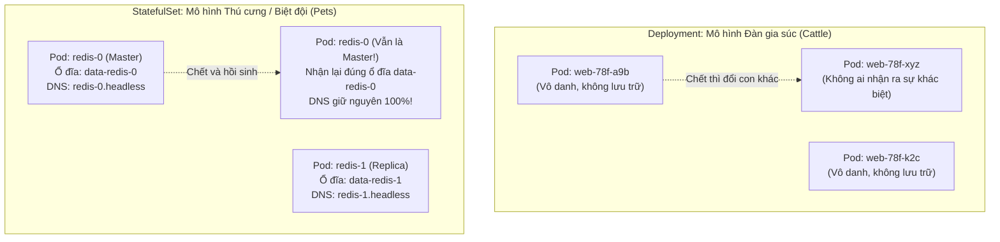
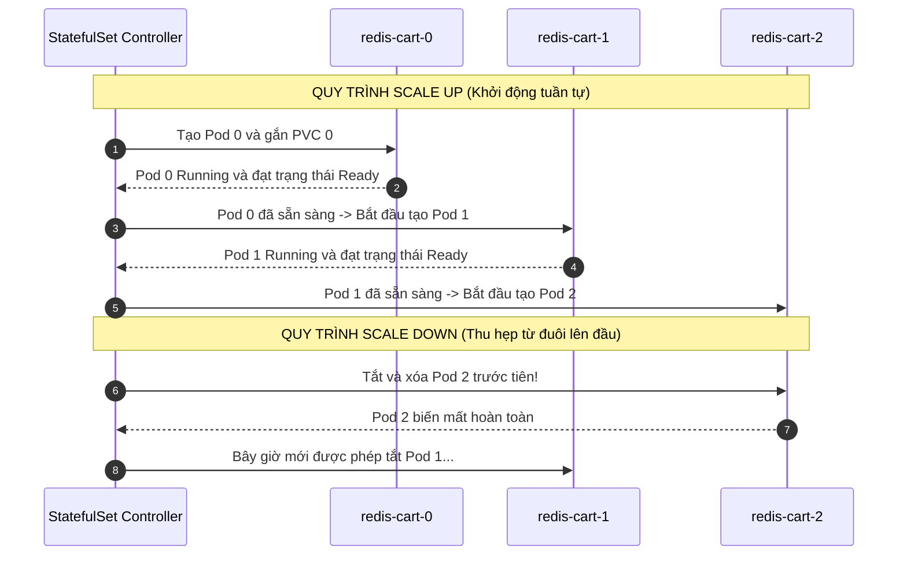

# Bài 17: StatefulSet & Headless Service: Triển khai ứng dụng có trạng thái

## 1. Thông tin bài học
* **Tên bài:** Bài 17: StatefulSet & Headless Service: Triển khai ứng dụng có trạng thái
* **Mục tiêu học:** Phân biệt rạch ròi sự khác nhau giữa ứng dụng Không trạng thái (Stateless) và Có trạng thái (Stateful); hiểu tại sao Deployment và ReplicaSet thất bại khi quản lý các cụm cơ sở dữ liệu phân tán; làm chủ 3 trụ cột sức mạnh của StatefulSet: Định danh thứ tự ổn định (Ordinal Index), Mạng định danh cố định qua Headless Service (`clusterIP: None`), và Cấp phát ổ đĩa độc lập qua `volumeClaimTemplates`; thực hành triển khai cụm lưu trữ giỏ hàng `redis-cart` có trạng thái trên cụm kind và chứng minh tính bảo toàn dữ liệu độc lập của từng bản sao.
* **Thời lượng ước tính:** 120 phút (60 phút lý thuyết, 60 phút thực hành)
* **Kiến thức cần có trước:** Bài 08 (ReplicaSet), Bài 09 (Deployment), Bài 10 (Service: Cầu nối mạng bền vững), Bài 15 (PV & PVC), Bài 16 (StorageClass & Dynamic Provisioning).
* **Liên quan kỳ thi:** CKAD, CKA (Chủ đề bắt buộc trong CKA và CKAD: định nghĩa StatefulSet kết hợp Headless Service, mở rộng/thu hẹp số lượng Pod tuần tự, phân tích cơ chế phân giải DNS độc lập của từng Pod, hiểu rõ hành vi bảo toàn PVC khi scale down).

---

## 2. Bảng thuật ngữ

| Thuật ngữ | Giải thích đơn giản | Ví dụ / Ẩn dụ đời thường |
| :--- | :--- | :--- |
| **StatefulSet (sts)** | Bộ điều khiển chuyên quản lý nhóm Pod có trạng thái, đảm bảo định danh mạng và ổ đĩa cố định cho từng Pod theo thứ tự đánh số. | Đội tuyển bóng đá quốc gia: mỗi cầu thủ có số áo cố định (số 1 là thủ môn, số 9 là tiền đạo), vị trí và trách nhiệm được phân công rõ ràng, không thể thay thế bừa bãi. |
| **Stateless vs Stateful** | Stateless không lưu dữ liệu riêng (thay thế tùy ý); Stateful lưu dữ liệu và trạng thái riêng (mỗi bản sao có dữ liệu và vai trò khác nhau). | Nhân viên trực tổng đài hỗ trợ (gặp ai cũng giải quyết như nhau - Stateless) vs Bác sĩ chuyên khoa điều trị (chỉ bác sĩ đó mới nắm hồ sơ bệnh án riêng của bạn - Stateful). |
| **Headless Service** | Đối tượng Service có cấu hình `clusterIP: None`, không cấp IP ảo cân bằng tải mà trả về trực tiếp danh sách IP của từng Pod qua bản ghi DNS. | Cuốn danh bạ nội bộ công ty ghi rõ số máy bàn của từng cá nhân, thay vì số hotline tổng đài tự động chuyển máy ngẫu nhiên. |
| **`volumeClaimTemplates`** | Khuôn mẫu khai báo trong StatefulSet giúp tự động sinh ra một PVC riêng biệt cho từng Pod, gắn chặt ổ đĩa với số thứ tự của Pod đó. | Quy định mỗi học viên trong ký túc xá có một ngăn tủ cá nhân có khóa riêng gắn đúng mã số phòng (tủ 01 cho phòng 01, tủ 02 cho phòng 02). |
| **Ordinal Index** | Chỉ số thứ tự bằng số nguyên (bắt đầu từ 0 đến N-1) được Kubernetes gắn cứng vào tên của từng Pod trong StatefulSet. | Thứ tự hàng ghế ngồi trên máy bay: ghế 01A, 02A, 03A; ai ngồi đúng ghế nấy. |
| **OrderedReady** | Cơ chế khởi động và tắt Pod tuần tự: Pod 0 sẵn sàng mới tạo tiếp Pod 1; khi tắt thì tắt từ Pod có số lớn nhất lùi về 0. | Đội hình xếp hàng duyệt binh: người thứ nhất bước lên chuẩn chỉnh rồi người thứ hai mới bước tiếp; khi rút lui thì người cuối hàng rút trước. |

---

## 3. Bức tranh lớn: Vấn đề thực tế và ẩn dụ đời thường

### Nhắc lại bài trước
Ở Bài 15 và Bài 16, chúng ta đã nắm vững cách quản lý lưu trữ bền vững với PersistentVolume, PersistentVolumeClaim và StorageClass. Bạn đã biết cách làm thế nào để dữ liệu sống sót khi một Pod đơn lẻ bị khởi động lại. Tuy nhiên, trong kiến trúc vi dịch vụ (Microservices) hiện đại, chúng ta không bao giờ chạy một dịch vụ lưu trữ (như Redis, MongoDB, PostgreSQL, Kafka) dưới dạng một Pod đơn lẻ vì nguy cơ sập toàn hệ thống (Single Point of Failure). Chúng ta cần chạy một cụm phân tán gồm nhiều bản sao (Cluster / Replica Set). Nếu bạn dùng **Deployment** (Bài 09) để nhân bản một dịch vụ lưu trữ lên 3 bản sao, một thảm họa kỹ thuật sẽ lập tức xảy ra!

### Tại sao cần cái này ở production? (Vấn đề thực tế)

1. **Thảm họa chia sẻ chung một ổ đĩa:**
   Khi bạn cấu hình một Deployment có 3 bản sao tham chiếu đến một PVC, cả 3 Pod sẽ cùng tranh chấp **DUY NHẤT MỘT Ổ ĐĨA ĐÓ**. Đối với các ổ đĩa khối (Block Storage) hỗ trợ `ReadWriteOnce` như AWS EBS hay GCP Persistent Disk (Bài 15), chỉ có duy nhất Pod đầu tiên khởi động được, 2 Pod còn lại sẽ bị kẹt vĩnh viễn ở trạng thái `ContainerCreating` vì không thể cắm chung ổ đĩa! Nếu bạn dùng ổ đĩa mạng `ReadWriteMany`, cả 3 tiến trình cơ sở dữ liệu sẽ cùng ghi đè lên các tệp tin dữ liệu của nhau, dẫn đến thảm họa rách dữ liệu (Data Corruption) và phá hủy toàn bộ database!
2. **Sự hỗn loạn về danh tính mạng (Random Identity):**
   Deployment sinh ra các Pod với tên ngẫu nhiên vô nghĩa (ví dụ `redis-deploy-7b8f9c-2x8pl`, `redis-deploy-7b8f9c-km9qs`). Nếu Pod bị sập và tạo lại, nó sẽ mang một cái tên hoàn toàn mới và một địa chỉ IP ngẫu nhiên mới. Trong một cụm cơ sở dữ liệu phân tán, các nút phụ (Slaves/Replicas) bắt buộc phải biết địa chỉ chính xác của nút chính (Master/Leader) để gửi lệnh đồng bộ hóa dữ liệu. Nếu nút Master liên tục đổi tên và đổi địa chỉ IP, toàn bộ cụm phân tán sẽ bị tan vỡ!
3. **Thứ tự khởi động không thể kiểm soát:**
   Trong các hệ thống phân tán, các nút không thể khởi động đồng loạt. Nút Master/Seed phải khởi động trước, nạp dữ liệu xong xuôi và chuyển sang trạng thái sẵn sàng thì các nút Worker/Follower mới được phép khởi động để tham gia vào cụm. Deployment không có khái niệm trật tự; nó sẽ phóng cả 3 Pod lên cùng một lúc, gây ra hiện tượng xung đột dữ liệu (Split-Brain).

**Giải pháp của Kubernetes:**
> **"Deployment dành cho ứng dụng Không trạng thái (Stateless) - nơi các Pod là bản sao vô danh có thể thay thế tùy tiện. StatefulSet dành cho ứng dụng Có trạng thái (Stateful) - nơi mỗi Pod sở hữu một danh tính mạng cố định và một ổ đĩa độc lập không thể thay thế!"**

### Ẩn dụ đời thường: Đàn gia súc vô danh và Biệt đội giải cứu chuyên nghiệp



1. **Deployment giống như Đàn bò trên đồng cỏ:**
   * Một trang trại nuôi 100 con bò để lấy sữa. Mỗi con bò đều ăn cỏ và cho sữa như nhau.
   * Nếu con bò số 1 bị bệnh và mất đi, người chủ trang trại chỉ cần mua một con bò khác về thế chỗ. Không ai quan tâm con bò mới tên là gì, vì sản phẩm sữa tạo ra hoàn toàn đồng nhất.
2. **StatefulSet giống như Biệt đội cứu hộ chuyên nghiệp:**
   * Trong đội cứu hộ:
     * **Đội trưởng (Pod 0):** Cầm bộ đàm chỉ huy và nắm bản đồ cứu nạn.
     * **Chiến sĩ lái xe thang (Pod 1):** Chuyên trách vận hành vòi rồng.
     * **Chiến sĩ cứu thương (Pod 2):** Chuyên trách sơ cứu nạn nhân.
   * Mỗi thành viên có một tủ đồ cá nhân gắn đúng tên mình (`volumeClaimTemplates`), và có một tần số bộ đàm riêng để liên lạc trực tiếp (`Headless Service`).
   * Nếu Đội trưởng không may bị thương và người mới đến thay thế, người mới bắt buộc phải tiếp quản đúng vị trí Đội trưởng (Pod 0), mở đúng tủ đồ của Đội trưởng và dùng đúng tần số bộ đàm chỉ huy. Toàn đội mới có thể tiếp tục phối hợp tác chiến!

---

## 4. Giải thích khái niệm theo từng bước

### Bước 1: Ba trụ cột sức mạnh của StatefulSet

Để quản lý thành công các ứng dụng có trạng thái phức tạp, StatefulSet thiết lập 3 cơ chế bảo vệ nghiêm ngặt:

#### 1. Định danh thứ tự ổn định (Stable Ordinal Index)
Các Pod trong StatefulSet được đặt tên theo quy tắc bất biến:
$$\text{Tên Pod} = \text{Tên StatefulSet} - \text{Chỉ số thứ tự (từ 0 đến N-1)}$$
Ví dụ với StatefulSet tên `redis-cart` có 3 bản sao:
* Pod đầu tiên: `redis-cart-0`
* Pod thứ hai: `redis-cart-1`
* Pod thứ ba: `redis-cart-2`

Khi Pod `redis-cart-1` gặp sự cố và bị xóa, Pod mới được Kubernetes sinh ra để thay thế **BẮT BUỘC phải mang tên `redis-cart-1`**, không bao giờ bị đổi thành một chuỗi ký tự ngẫu nhiên như Deployment!

#### 2. Cấp phát ổ đĩa độc lập với `volumeClaimTemplates`
Thay vì để các Pod dùng chung một PVC, StatefulSet sử dụng khối `volumeClaimTemplates` để tự động sinh ra một PVC riêng biệt cho từng Pod:
$$\text{Tên PVC} = \text{Tên Template} - \text{Tên Pod}$$
* Pod `redis-cart-0` $\rightarrow$ Mount ổ đĩa `redis-data-redis-cart-0`
* Pod `redis-cart-1` $\rightarrow$ Mount ổ đĩa `redis-data-redis-cart-1`

Khi Pod `redis-cart-0` bị dời sang một máy chủ khác, nó sẽ tự động ngắt kết nối với máy chủ cũ và **gắn lại đúng chiếc PVC `redis-data-redis-cart-0`** trên máy chủ mới!

#### 3. Định danh mạng cố định qua Headless Service
Một Service thông thường có một địa chỉ IP ảo (`ClusterIP`) để điều phối tải ngẫu nhiên. Nhưng trong cụm StatefulSet, Pod 1 cần kết nối trực tiếp đến Pod 0.
Để làm được điều này, ta tạo một Service với thuộc tính:
```yaml
spec:
  clusterIP: None  # Định nghĩa Headless Service
```
Khi `clusterIP: None`, Kubernetes CoreDNS sẽ không trả về IP của Service nữa, mà tự động tạo ra một bản ghi DNS A riêng biệt trỏ thẳng vào IP của từng Pod theo định dạng:
$$\text{<tên-pod>}.\text{<tên-headless-service>}.\text{<namespace>}.\text{svc}.\text{cluster}.\text{local}$$
Ví dụ: `redis-cart-0.redis-service.default.svc.cluster.local` luôn phân giải về IP trực tiếp của Pod 0, bất kể Pod 0 có đổi IP bao nhiêu lần!

---

### Bước 2: Quy trình khởi động và thu hẹp tuần tự (OrderedReady)



* **Quy tắc Scale Up:** Bắt đầu từ 0 đến N-1. Pod trước phải đạt trạng thái `Running` và **`Ready`** (vượt qua Readiness Probe) thì Pod tiếp theo mới được phép khởi tạo.
* **Quy tắc Scale Down:** Ngược lại hoàn toàn, bắt đầu từ N-1 lùi dần về 0. Pod có chỉ số cao nhất phải bị tiêu diệt hoàn toàn trước khi Pod phía trước bị chạm vào.

---

### Bước 3: Nguyên tắc vàng về PVC khi Scale Down

> ⚠️ **ĐẶC ĐIỂM SỐNG CÒN CẦN GHI NHỚ:**  
> Khi bạn scale StatefulSet từ 3 bản sao xuống 1 bản sao, hai Pod `redis-cart-2` và `redis-cart-1` sẽ bị tiêu diệt. **TUY NHIÊN, hai PVC `redis-data-redis-cart-2` và `redis-data-redis-cart-1` TUYỆT ĐỐI KHÔNG BỊ XÓA!**

Kubernetes cố tình giữ lại các PVC này trên đĩa để bảo vệ an toàn cho dữ liệu doanh nghiệp của bạn. Nếu bạn scale up trở lại lên 3 bản sao, các Pod mới sinh ra sẽ lập tức nhận lại đúng các PVC cũ này và khôi phục dữ liệu nguyên vẹn!

---

## 5. Thực hành (Lab)

* **Môi trường:** Cụm kind (`k8s\kind-config.yaml`) gồm 1 control-plane và 1 worker.
* **Mức RAM ước tính:** ~140 MB (chạy 2 bản sao Redis 7 Alpine, tuyệt đối an toàn trong giới hạn 4GB WSL).

### Kịch bản thực hành: Triển khai cụm giỏ hàng `redis-cart` có trạng thái
Chúng ta sẽ triển khai cụm giỏ hàng Online Boutique bằng StatefulSet:
1. Tạo Headless Service mang tên `redis-cart-service`.
2. Tạo StatefulSet `redis-cart` gồm 2 bản sao (`replicas: 2`) sử dụng `volumeClaimTemplates` gắn với StorageClass của kind (`standard`).
3. Quan sát quá trình khởi động tuần tự từng Pod.
4. Kiểm tra danh sách PVC được tự động sinh ra riêng biệt cho từng Pod.
5. Kiểm chứng phân giải DNS nội bộ của từng Pod qua Headless Service.
6. Ghi 2 dữ liệu hoàn toàn khác nhau vào Pod 0 và Pod 1 để chứng minh tính độc lập của ổ đĩa.
7. Xóa Pod 0 và chứng minh Pod 0 tái sinh nhận lại đúng ổ đĩa và dữ liệu cũ!

---

### Bước 1: Chuẩn bị file manifest tích hợp (`redis-statefulset-lab.yaml`)

```powershell
@'
# 1. Headless Service: Cung cấp định danh mạng cố định
apiVersion: v1
kind: Service
metadata:
  name: redis-cart-service
  namespace: default
  labels:
    app: redis-cart
spec:
  clusterIP: None  # Điểm mấu chốt để trở thành Headless Service!
  selector:
    app: redis-cart
  ports:
    - port: 6379
      name: redis
---
# 2. StatefulSet: Quản lý vòng đời cụm có trạng thái
apiVersion: apps/v1
kind: StatefulSet
metadata:
  name: redis-cart
  namespace: default
spec:
  serviceName: redis-cart-service  # Bắt buộc phải gắn với tên Headless Service ở trên!
  replicas: 2
  selector:
    matchLabels:
      app: redis-cart
  template:
    metadata:
      labels:
        app: redis-cart
    spec:
      containers:
        - name: redis
          image: redis:7-alpine
          command: ["redis-server", "--appendonly", "yes"]
          ports:
            - containerPort: 6379
              name: redis
          volumeMounts:
            - name: redis-data
              mountPath: /data

  # 3. Khuôn mẫu tự động sinh PVC cho từng Pod
  volumeClaimTemplates:
    - metadata:
        name: redis-data
      spec:
        accessModes: [ "ReadWriteOnce" ]
        resources:
          requests:
            storage: 64Mi
'@ | Set-Content -Path .\redis-statefulset-lab.yaml -Encoding UTF8
```

---

### Bước 2: Triển khai và quan sát thứ tự khởi động tuần tự

```powershell
# Áp dụng cấu hình vào cluster
kubectl apply -f .\redis-statefulset-lab.yaml

# Theo dõi tiến trình sinh Pod
kubectl get pods -l app=redis-cart -w
```

#### Kết quả mong đợi (Expected Output):
```text
service/redis-cart-service created
statefulset.apps/redis-cart created

NAME           READY   STATUS              RESTARTS   AGE
redis-cart-0   0/1     ContainerCreating   0          2s
redis-cart-0   1/1     Running             0          5s
redis-cart-1   0/1     Pending             0          0s
redis-cart-1   0/1     ContainerCreating   0          2s
redis-cart-1   1/1     Running             0          5s
```

> 🎯 **Quan sát quan trọng:** Bạn thấy không? `redis-cart-0` được tạo ra trước và chuyển sang `Running (1/1)`. Chỉ sau khi Pod 0 đã hoàn toàn sẵn sàng, `redis-cart-1` mới bắt đầu được tạo ra! Đây chính là trật tự `OrderedReady` chuẩn mực.

---

### Bước 3: Kiểm tra các PVC được tự động tạo riêng biệt

```powershell
kubectl get pvc -l app=redis-cart
```

#### Kết quả mong đợi:
```text
NAME                      STATUS   VOLUME                                     CAPACITY   ACCESS MODES   STORAGECLASS   AGE
redis-data-redis-cart-0   Bound    pvc-8a7b6c5d-1111-2222-3333-444455556666   64Mi       RWO            standard       45s
redis-data-redis-cart-1   Bound    pvc-9e8d7c6b-5555-6666-7777-888899990000   64Mi       RWO            standard       40s
```
Mỗi Pod sở hữu một chiếc PVC riêng biệt có tên gắn liền với tên của chính Pod đó!

---

### Bước 4: Kiểm chứng phân giải tên miền DNS nội bộ qua Headless Service

Chúng ta sẽ đứng từ bên trong `redis-cart-1` và thực hiện phân giải tên miền để tìm địa chỉ IP của chính nó và của `redis-cart-0`:

```powershell
# Kiểm tra DNS của redis-cart-0
kubectl exec redis-cart-1 -- nslookup redis-cart-0.redis-cart-service

# Kiểm tra DNS của redis-cart-1
kubectl exec redis-cart-0 -- nslookup redis-cart-1.redis-cart-service
```

#### Kết quả mong đợi:
```text
Server:         10.96.0.10
Address:        10.96.0.10:53

Name:   redis-cart-0.redis-cart-service.default.svc.cluster.local
Address: 10.244.1.15
```
Tên miền `redis-cart-0.redis-cart-service` phân giải thẳng về IP mạng của Pod 0! Các thành viên trong cụm có thể giao tiếp trực tiếp với nhau thông qua tên miền cố định này mà không sợ bị đổi IP.

---

### Bước 5: Ghi dữ liệu độc lập vào từng Pod

```powershell
# Ghi dữ liệu vào Pod 0 (Master)
kubectl exec redis-cart-0 -- redis-cli set "role" "I am Master Node"
kubectl exec redis-cart-0 -- redis-cli set "cart:alice" "1x Vintage Camera"
kubectl exec redis-cart-0 -- redis-cli bgsave

# Ghi dữ liệu vào Pod 1 (Replica)
kubectl exec redis-cart-1 -- redis-cli set "role" "I am Replica Node"
kubectl exec redis-cart-1 -- redis-cli set "cart:bob" "3x Coffee Mug"
kubectl exec redis-cart-1 -- redis-cli bgsave
```

Kiểm tra để chắc chắn dữ liệu 2 bên là hoàn toàn độc lập:
```powershell
kubectl exec redis-cart-0 -- redis-cli get "role"
# Output: "I am Master Node"

kubectl exec redis-cart-1 -- redis-cli get "role"
# Output: "I am Replica Node"
```

---

### Bước 6: Thử thách tiêu diệt Pod 0 và chứng minh dữ liệu sống sót

Chúng ta sẽ dùng lệnh xóa Pod `redis-cart-0`:
```powershell
kubectl delete pod redis-cart-0
```

Ngay sau khi lệnh xóa thực thi, Kubernetes sẽ tự động sinh lại một Pod mới mang đúng tên `redis-cart-0`. Hãy đợi Pod mới chuyển sang `Running`:
```powershell
kubectl wait --for=condition=Ready pod/redis-cart-0 --timeout=30s

# Đọc lại dữ liệu từ Pod 0 vừa tái sinh:
kubectl exec redis-cart-0 -- redis-cli get "role"
kubectl exec redis-cart-0 -- redis-cli get "cart:alice"
```

#### Kết quả mong đợi:
```text
"I am Master Node"
"1x Vintage Camera"
```
🎉 **Dữ liệu vẫn còn nguyên vẹn 100%!** Pod 0 sau khi tái sinh đã tự động tìm lại đúng chiếc PVC `redis-data-redis-cart-0` của nó và nạp lại toàn bộ giỏ hàng của khách hàng Alice mà không hề mất đi một byte dữ liệu nào!

---

### Bước 7: Dọn dẹp tài nguyên (Cleanup)
```powershell
# 1. Xóa StatefulSet và Headless Service
kubectl delete -f .\redis-statefulset-lab.yaml

# 2. Xóa các PVC riêng biệt (StatefulSet không tự xóa PVC!)
kubectl delete pvc redis-data-redis-cart-0 redis-data-redis-cart-1

# 3. Xóa file manifest cục bộ
Remove-Item .\redis-statefulset-lab.yaml
```

---

## 6. Lỗi thường gặp và cách debug

### Lỗi 1: Pod 1 bị kẹt mãi ở trạng thái `Pending` do Pod 0 chưa đạt trạng thái `Ready`
* **Dấu hiệu:** `redis-cart-0` ở trạng thái `Running (0/1)` và `redis-cart-1` ở trạng thái `Pending` không chịu khởi động.
* **Nguyên nhân:** Do quy tắc `OrderedReady`, StatefulSet bắt buộc Pod trước phải sẵn sàng (Ready) thì Pod sau mới được tạo. Nếu bạn cấu hình Readiness Probe cho container nhưng ứng dụng không vượt qua được bài kiểm tra sức khỏe (Health Check), toàn bộ tiến trình scale up của StatefulSet sẽ bị đóng băng!
* **Cách debug và sửa:**
  1. Kiểm tra log của Pod 0: `kubectl logs redis-cart-0`.
  2. Kiểm tra sự kiện lỗi: `kubectl describe pod redis-cart-0`.
  3. Sửa lỗi ứng dụng hoặc điều chỉnh lại ngưỡng timeout của Readiness Probe. Ngay khi Pod 0 chuyển sang `1/1 Ready`, Pod 1 sẽ lập tức được khởi động.

### Lỗi 2: Quên khai báo hoặc gõ sai trường `serviceName` trong StatefulSet
* **Dấu hiệu:** Pod khởi tạo thành công nhưng không thể phân giải tên miền DNS dạng `<pod-name>.<service-name>`.
* **Nguyên nhân:** Trường `spec.serviceName` trong manifest của StatefulSet không khớp chính xác từng ký tự với trường `metadata.name` của Headless Service.
* **Cách sửa:** Luôn kiểm tra đối chiếu: Tên của Headless Service phải hoàn toàn trùng khớp với trường `serviceName` trong StatefulSet spec.

### Lỗi 3: Pod bị kẹt ở trạng thái `Terminating` khi máy chủ Worker Node bị sập (Node NotReady)
* **Dấu hiệu:** Một Worker Node bị mất điện hoặc đứt mạng, Pod trên node đó bị kẹt ở trạng thái `Terminating` và không chịu chuyển sang Node khác.
* **Nguyên nhân cốt lõi (Cực kỳ quan trọng ở cấp Senior):** Để bảo vệ tính toàn vẹn của dữ liệu (ngăn chặn hai Pod cùng ghi vào một volume gây rách dữ liệu), Kubernetes **tuyệt đối không tự ý xóa Pod của StatefulSet** nếu nó chưa thể xác nhận chắc chắn rằng Pod trên node cũ đã thực sự ngừng hoạt động!
* **Cách xử lý an toàn:** Chỉ khi bạn đã kiểm tra và tắt máy chủ vật lý cũ thành công, bạn mới được phép dùng lệnh cưỡng chế xóa Pod:  
  `kubectl delete pod <tên-pod> --force --grace-period=0`.

---

## 7. Góc nhìn Senior

### 1. Sự đánh đổi (Trade-offs): StatefulSet trên K8s vs Dịch vụ Đám mây được quản lý (Managed Cloud DB)

| Giải pháp | Ưu điểm | Nhược điểm / Đánh đổi | Khi nào nên dùng? |
| :--- | :--- | :--- | :--- |
| **StatefulSet tự vận hành trên K8s** | Hoàn toàn làm chủ dữ liệu; không bị phụ thuộc nhà cung cấp đám mây (Vendor Lock-in); tiết kiệm chi phí bản quyền lớn; chạy được ở mọi hạ tầng (On-premise / Hybrid). | Phải tự lo liệu toàn bộ việc sao lưu (Backup), khôi phục thảm họa (DR), nâng cấp phiên bản và cấu hình đồng bộ Master-Slave phức tạp. | Hệ thống On-premise, môi trường Dev/Staging, hoặc doanh nghiệp có đội ngũ Platform/DBA chuyên môn rất cao. |
| **Managed DB (AWS RDS, Google Cloud SQL)** | Nhà cung cấp lo từ A-Z: tự động sao lưu hàng ngày, tự động chuyển đổi dự phòng (Multi-AZ Failover) trong 30 giây, tự động vá lỗi bảo mật. | Chi phí thuê rất đắt đỏ; bị khóa chặt vào hệ sinh thái của một nhà cung cấp đám mây duy nhất. | Đa số các ứng dụng nghiệp vụ cốt lõi tại môi trường Production của các doanh nghiệp vừa và lớn. |

### 2. Best practices tại production

1. **Tuyệt đối không tự viết StatefulSet trần cho các hệ thống CSDL phức tạp:**
   Đối với các cơ sở dữ liệu phân tán phức tạp như PostgreSQL High-Availability, Apache Kafka, Elasticsearch, hay MongoDB Sharded Cluster, đừng tự viết StatefulSet thủ công! Hãy sử dụng **Kubernetes Operators** chuyên dụng (ví dụ CloudNativePG Operator cho Postgres, Strimzi Operator cho Kafka). Operator là các chương trình thông minh tự động hóa việc bầu chọn Leader, tự động failover và backup mà StatefulSet thuần túy không thể làm được.
2. **Luôn cấu hình `PodDisruptionBudget` (PDB):**
   Để ngăn chặn việc bảo trì hạ tầng (như lệnh `kubectl drain node`) làm sập quá nhiều bản sao của cụm database cùng lúc, luôn tạo một PDB đảm bảo số lượng bản sao khả dụng tối thiểu:
   ```yaml
   apiVersion: policy/v1
   kind: PodDisruptionBudget
   metadata:
     name: redis-cart-pdb
   spec:
     minAvailable: 1
     selector:
       matchLabels:
         app: redis-cart
   ```
3. **Cấu hình chính sách giữ đĩa `persistentVolumeClaimRetentionPolicy`:**
   Từ Kubernetes 1.27+ (đã chính thức GA ở K8s 1.32+), bạn có thể kiểm soát chính xác việc có tự động xóa PVC hay không khi StatefulSet bị xóa bằng cách khai báo:
   ```yaml
   spec:
     persistentVolumeClaimRetentionPolicy:
       whenDeleted: Retain  # Giữ lại đĩa khi xóa StatefulSet
       whenScaled: Delete   # Tự dọn đĩa khi scale down số lượng replica
   ```

### 3. Câu hỏi phỏng vấn Senior

* **Câu hỏi 1:** *"Headless Service khác gì với Service thông thường về mặt bản ghi DNS trả về cho Client? Tại sao StatefulSet bắt buộc phải sử dụng Headless Service mà không thể dùng Service thông thường?"*
* **Gợi ý trả lời chuẩn:**
  1. **Khác biệt về DNS:** Với Service thông thường có ClusterIP, CoreDNS chỉ trả về **duy nhất một địa chỉ IP ảo (ClusterIP)** đại diện cho toàn bộ service; kube-proxy sẽ ngẫu nhiên chọn một Pod để chuyển tiếp lưu lượng. Với Headless Service (`clusterIP: None`), CoreDNS sẽ **trả về trực tiếp danh sách địa chỉ IP thực của toàn bộ các Pod** đang sẵn sàng, đồng thời tạo ra các bản ghi DNS A riêng biệt cho từng Pod theo định dạng `<pod-name>.<service-name>`.
  2. **Lý do StatefulSet bắt buộc phải dùng:** Trong các hệ thống phân tán có trạng thái (như cụm Redis/Kafka), các nút phụ (Follower) cần phải kết nối chính xác tới địa chỉ mạng cố định của nút chính (Leader) để đồng bộ dữ liệu. Nếu dùng Service thông thường, lưu lượng sẽ bị cân bằng tải ngẫu nhiên sang các nút phụ khác làm sai lệch giao thức đồng bộ. Headless Service cung cấp định danh mạng cá nhân cố định và ổn định (Stable Network Identity) cho từng Pod trong cụm.

* **Câu hỏi 2:** *"Trình bày sự khác biệt giữa hai chế độ `podManagementPolicy: OrderedReady` và `podManagementPolicy: Parallel` trong StatefulSet. Khi nào thì một Platform Engineer nên chuyển sang Parallel?"*
* **Gợi ý trả lời chuẩn:**
  * `OrderedReady` (mặc định): Buộc các Pod phải khởi tạo và kết thúc tuần tự từng Pod một theo thứ tự số nguyên. Chế độ này bắt buộc đối với các cụm cơ sở dữ liệu có tính chất Master-Slave/Primary-Replica cần thứ tự gia nhập cụm nghiêm ngặt.
  * `Parallel`: Cho phép StatefulSet khởi tạo hoặc chấm dứt toàn bộ các Pod **đồng loạt cùng một lúc** mà không cần chờ đợi Pod trước đó Ready.
  * **Trường hợp nên dùng Parallel:** Khi ứng dụng của bạn cần các đặc tính của StatefulSet (như tên Pod cố định và ổ đĩa PVC riêng biệt qua `volumeClaimTemplates`), nhưng bản thân ứng dụng đó là một cụm xử lý song song phân tán (như cụm tính toán khoa học, ZooKeeper/Cassandra đã có sẵn thuật toán đồng thuận nội bộ, hoặc các Batch Worker độc lập) không yêu cầu thứ tự khởi động tuần tự, giúp tăng tốc độ triển khai và phục hồi lên gấp nhiều lần.

---

## 8. Tóm tắt bài học

* 📌 **1. Bản chất của StatefulSet:** Là bộ điều khiển chuyên trách cho ứng dụng có trạng thái, cung cấp định danh số thứ tự (Ordinal Index) không thay đổi từ 0 đến N-1.
* 📌 **2. Cấp phát đĩa riêng với `volumeClaimTemplates`:** Tự động tạo và gán một PVC độc lập cho từng Pod; khi Pod bị xóa và tái sinh, nó tự động nhận lại đúng ổ đĩa cũ của nó.
* 📌 **3. Định danh mạng với Headless Service:** Thiết lập `clusterIP: None` để phân giải DNS trực tiếp tới từng Pod con qua tên miền `<pod-name>.<service-name>`.
* 📌 **4. Quy tắc trật tự `OrderedReady`:** Khởi động tuần tự từ 0 đến N-1 và thu hẹp tuần tự từ N-1 về 0 để bảo vệ tính toàn vẹn của cụm phân tán.
* 📌 **5. Tính an toàn của PVC:** Khi scale down số lượng bản sao, các PVC tương ứng KHÔNG BAO GIỜ bị xóa tự động để bảo vệ an toàn dữ liệu doanh nghiệp.

---

## 9. Bài tập tự làm

* 🟢 **Mức Dễ:** Viết một manifest StatefulSet đơn giản chạy image `nginx:alpine` với 3 bản sao kết hợp một Headless Service. Quan sát tên của 3 Pod sinh ra và kiểm tra trật tự khởi động của chúng.
* 🟡 **Mức Vừa (Scale và bảo toàn PVC):** Thêm khối `volumeClaimTemplates` vào StatefulSet ở mức dễ. Sau khi 3 Pod đã gắn 3 PVC tương ứng, hãy thực hiện lệnh scale down StatefulSet từ 3 bản sao xuống còn 1 bản sao (`kubectl scale sts ... --replicas=1`). Sử dụng lệnh `kubectl get pods` và `kubectl get pvc` để chứng minh rằng 2 Pod đã biến mất nhưng 2 PVC cũ vẫn còn nguyên vẹn trên hệ thống.
* 🔴 **Mức Khó (Troubleshooting Readiness Freeze):** Tạo một StatefulSet gồm 2 bản sao có cấu hình `readinessProbe` kiểm tra sự tồn tại của tệp `/tmp/ready`. Do ban đầu tệp này chưa có, Pod 0 không đạt trạng thái Ready và Pod 1 bị đóng băng không thể khởi động. Hãy dùng lệnh `kubectl exec` tạo tệp `/tmp/ready` bên trong Pod 0 để giải cứu và quan sát Pod 1 tự động được kích hoạt thành công.

---

## 10. Câu hỏi tự kiểm tra

1. Điểm khác biệt mấu chốt giữa cách đặt tên Pod của Deployment và StatefulSet là gì?
2. Tại sao chúng ta không nên dùng Deployment kết hợp với một PersistentVolumeClaim duy nhất để chạy một cụm cơ sở dữ liệu có 3 bản sao?
3. Headless Service được định nghĩa như thế nào trong trường `spec` của Service manifest?
4. Định dạng tên miền DNS nội bộ đầy đủ (FQDN) để truy cập trực tiếp vào Pod `redis-1` thuộc Headless Service `redis-service` trong namespace `default` là gì?
5. Khi bạn chạy lệnh giảm số lượng bản sao của StatefulSet từ 5 xuống 2, điều gì sẽ xảy ra với 3 chiếc PVC tương ứng của các Pod bị xóa?
6. Khi nào bạn nên cân nhắc cấu hình `podManagementPolicy: Parallel` cho một StatefulSet thay vì để mặc định `OrderedReady`?

<details>
<summary>👉 Bấm vào đây để xem đáp án câu hỏi tự kiểm tra</summary>

* **Đáp án 1:** Deployment đặt tên Pod bằng chuỗi ký tự ngẫu nhiên vô nghĩa (Random Hash); còn StatefulSet đặt tên bằng chỉ số thứ tự số nguyên cố định tăng dần từ 0 đến N-1.
* **Đáp án 2:** Vì cả 3 bản sao Pod sẽ cùng mount vào duy nhất một PVC đó, gây ra lỗi tranh chấp ổ đĩa khối RWO không thể khởi động, hoặc gây ra lỗi rách dữ liệu (Data Corruption) nếu cả 3 cùng ghi đè lên chung một thư mục.
* **Đáp án 3:** Được định nghĩa bằng thuộc tính **`clusterIP: None`**.
* **Đáp án 4:** Định dạng là: **`redis-1.redis-service.default.svc.cluster.local`**.
* **Đáp án 5:** Các PVC đó **HOÀN TOÀN KHÔNG BỊ XÓA**; chúng được giữ nguyên vẹn trên hệ thống lưu trữ để bảo vệ an toàn cho dữ liệu.
* **Đáp án 6:** Khi ứng dụng cần tên Pod cố định và ổ đĩa độc lập nhưng bản thân các nút có thể khởi động độc lập song song mà không đòi hỏi trật tự trước sau, giúp rút ngắn thời gian khởi động và scale của cụm.
</details>

---

## 11. Tài liệu đọc thêm và bài tiếp theo

### Tài liệu tham khảo
* [Tài liệu chính thức Kubernetes: StatefulSets](https://kubernetes.io/docs/concepts/workloads/controllers/statefulset/)
* [Khái niệm Headless Services](https://kubernetes.io/docs/concepts/services-networking/service/#headless-services)
* [Hướng dẫn thực hành: Run a Replicated Stateful Application](https://kubernetes.io/docs/tasks/run-application/run-replicated-stateful-application/)

### Bài tiếp theo
👉 **Bài 18: Mô hình mạng phẳng & CNI (Container Network Interface)**

---

## PHỤ LỤC: ĐÁP ÁN GỢI Ý BÀI TẬP TỰ LÀM (MỤC 9)

### Đáp án Mức Dễ
```powershell
@'
apiVersion: v1
kind: Service
metadata:
  name: nginx-headless
spec:
  clusterIP: None
  selector:
    app: nginx-sts
  ports:
    - port: 80
      name: web
---
apiVersion: apps/v1
kind: StatefulSet
metadata:
  name: web-sts
spec:
  serviceName: nginx-headless
  replicas: 3
  selector:
    matchLabels:
      app: nginx-sts
  template:
    metadata:
      labels:
        app: nginx-sts
    spec:
      containers:
        - name: nginx
          image: nginx:alpine
'@ | kubectl apply -f -

# Kiểm tra danh sách Pod tuần tự
kubectl get pods -l app=nginx-sts

# Dọn dẹp
kubectl delete sts web-sts
kubectl delete svc nginx-headless
```

### Đáp án Mức Vừa
```powershell
@'
apiVersion: v1
kind: Service
metadata:
  name: web-pvc-svc
spec:
  clusterIP: None
  selector:
    app: web-pvc
  ports:
    - port: 80
---
apiVersion: apps/v1
kind: StatefulSet
metadata:
  name: web-pvc
spec:
  serviceName: web-pvc-svc
  replicas: 3
  selector:
    matchLabels:
      app: web-pvc
  template:
    metadata:
      labels:
        app: web-pvc
    spec:
      containers:
        - name: nginx
          image: nginx:alpine
          volumeMounts:
            - name: web-vol
              mountPath: /usr/share/nginx/html
  volumeClaimTemplates:
    - metadata:
        name: web-vol
      spec:
        accessModes: [ "ReadWriteOnce" ]
        resources:
          requests:
            storage: 20Mi
'@ | kubectl apply -f -

# Đợi 3 Pod Ready
kubectl wait --for=condition=Ready pod/web-pvc-2 --timeout=60s

# Scale down xuống 1 bản sao
kubectl scale sts web-pvc --replicas=1

# Kiểm tra Pod: Chỉ còn web-pvc-0
kubectl get pods -l app=web-pvc

# Kiểm tra PVC: Cả 3 PVC web-vol-web-pvc-0, 1, 2 đều vẫn còn nguyên!
kubectl get pvc -l app=web-pvc

# Dọn dẹp
kubectl delete sts web-pvc
kubectl delete svc web-pvc-svc
kubectl delete pvc web-vol-web-pvc-0 web-vol-web-pvc-1 web-vol-web-pvc-2
```

### Đáp án Mức Khó
```powershell
# 1. Tạo StatefulSet có readinessProbe kiểm tra file /tmp/ready
@'
apiVersion: v1
kind: Service
metadata:
  name: probe-svc
spec:
  clusterIP: None
  selector:
    app: probe-app
  ports:
    - port: 80
---
apiVersion: apps/v1
kind: StatefulSet
metadata:
  name: probe-sts
spec:
  serviceName: probe-svc
  replicas: 2
  selector:
    matchLabels:
      app: probe-app
  template:
    metadata:
      labels:
        app: probe-app
    spec:
      containers:
        - name: app
          image: alpine:latest
          command: ["sleep", "3600"]
          readinessProbe:
            exec:
              command: ["cat", "/tmp/ready"]
            initialDelaySeconds: 2
            periodSeconds: 3
'@ | kubectl apply -f -

# 2. Quan sát Pod 0 ở trạng thái Running (0/1) và Pod 1 chưa hề được tạo ra!
Start-Sleep -Seconds 5
kubectl get pods -l app=probe-app

# 3. Giải cứu: Tạo file /tmp/ready trong Pod 0
kubectl exec probe-sts-0 -- touch /tmp/ready

# 4. Quan sát: Pod 0 chuyển sang Ready (1/1), ngay sau đó Pod 1 được sinh ra!
kubectl wait --for=condition=Ready pod/probe-sts-0 --timeout=15s
kubectl get pods -l app=probe-app

# Dọn dẹp
kubectl delete sts probe-sts
kubectl delete svc probe-svc
```

