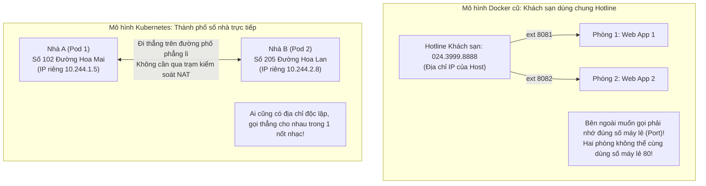
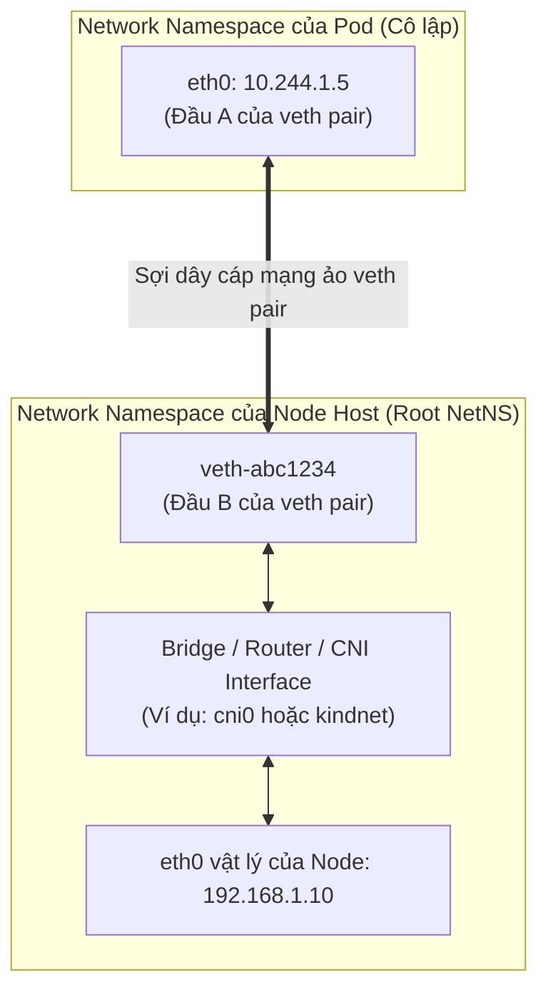
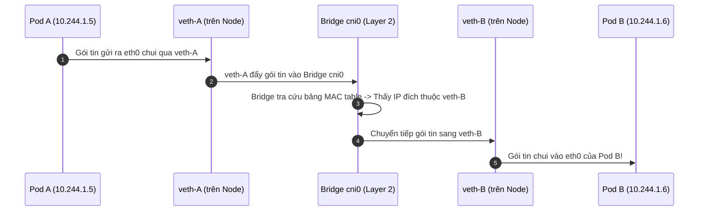
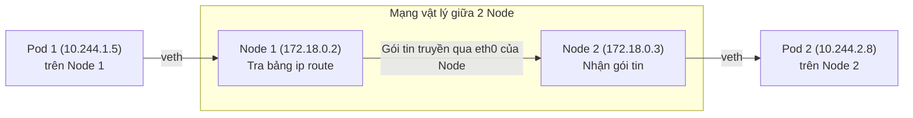
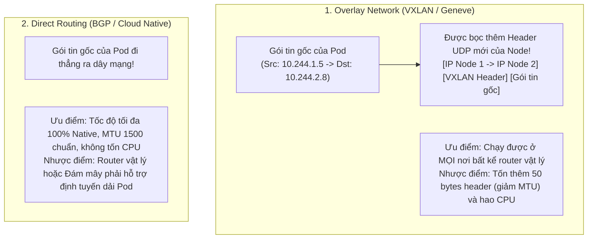

# Bài 18: Mô hình mạng phẳng & CNI (Container Network Interface)

## 1. Thông tin bài học
* **Tên bài:** Bài 18: Mô hình mạng phẳng & CNI (Container Network Interface)
* **Mục tiêu học:** Làm chủ 3 nguyên tắc vàng của mô hình mạng phẳng trong Kubernetes (IP-per-Pod, giao tiếp trực tiếp không qua NAT); hiểu sâu bản chất các khối xây dựng mạng Linux bên dưới nắp ca-pô: Network Namespace, cặp card mạng ảo `veth pair`, Linux Bridge và bảng định tuyến `ip route`; giải mã cơ chế hoạt động của CNI (Container Network Interface) và hệ thống cấp phát IP (IPAM); phân biệt sự khác nhau giữa mạng phủ (Overlay Network - VXLAN) và mạng định tuyến trực tiếp (Underlay / Direct Routing - BGP); thực hành truy vết đường đi thực tế của gói tin giữa các Node trên cụm kind.
* **Thời lượng ước tính:** 150 phút (75 phút lý thuyết, 75 phút thực hành)
* **Kiến thức cần có trước:** Bài 01 (Linux Namespaces - Network Namespace), Bài 04 (Thiết lập môi trường lab kind & kubectl), Bài 06 (Pod: Đơn vị tính toán nguyên tử), Bài 10 (Service: Cầu nối mạng bền vững).
* **Liên quan kỳ thi:** CKA (Trọng tâm cấu hình và gỡ lỗi hạ tầng chiếm 15–20% bài thi CKA: xử lý sự cố Pod kẹt ở `ContainerCreating` do thiếu CNI, cấu hình file trong `/etc/cni/net.d/`, kiểm tra dải mạng `podCIDR` của Node và debug kết nối liên Node).

---

## 2. Bảng thuật ngữ

| Thuật ngữ | Giải thích đơn giản | Ví dụ / Ẩn dụ đời thường |
| :--- | :--- | :--- |
| **Mô hình mạng phẳng (Flat Network)** | Kiến trúc mạng quy định mọi Pod đều có một IP riêng và có thể giao tiếp trực tiếp với mọi Pod khác trong cluster mà không cần chuyển đổi địa chỉ (NAT). | Một ngôi làng mở: mọi ngôi nhà đều có số nhà riêng biệt nằm trên cùng một con đường bằng phẳng; hàng xóm có thể đi thẳng sang nhà nhau mà không cần đi qua trạm gác hay đổi thẻ căn cước. |
| **CNI (Container Network Interface)** | Chuẩn giao tiếp kỹ thuật giữa Container Runtime và các plugin mạng, chịu trách nhiệm "kéo dây mạng ảo" và cấp phát IP mỗi khi Pod được sinh ra hoặc xóa bỏ. | Đội thợ điện - viễn thông chuyên nghiệp: mỗi khi có một ngôi nhà mới xây xong, đội thợ lập tức kéo dây cáp quang, gắn modem và cấp số điện thoại cho ngôi nhà đó. |
| **`veth pair` (Virtual Ethernet Pair)** | Cặp card mạng ảo trong Linux hoạt động như một sợi dây cáp mạng hai đầu: dữ liệu chui vào đầu này sẽ lập tức xuất hiện ở đầu kia. | Một đường ống thở hai đầu: một đầu cắm vào bình khí của thợ lặn (Pod), đầu kia nổi trên mặt nước tàu mẹ (Node máy chủ). |
| **IPAM (IP Address Management)** | Thành phần con trong CNI chịu trách nhiệm quản lý, cấp phát và thu hồi dải địa chỉ IP cho các Pod để tránh xung đột địa chỉ IP. | Ban quản lý hộ khẩu: phát số nhà theo từng khu phố, đảm bảo không có hai ngôi nhà nào trong cùng một thành phố bị trùng số với nhau. |
| **`podCIDR`** | Dải địa chỉ IP mạng con (Subnet) được Kubernetes phân bổ riêng cho từng Worker Node để cấp phát cho các Pod chạy trên node đó. | Đầu số điện thoại theo từng tỉnh thành (Hà Nội là 024, TP.HCM là 028); Node 1 được chia dải `10.244.0.0/24`, Node 2 được chia dải `10.244.1.0/24`. |
| **Overlay Network (Mạng phủ)** | Kỹ thuật đóng gói gói tin của Pod bên trong một gói tin mạng của Node (như VXLAN, Geneve) để truyền qua hạ tầng mạng vật lý mà thiết bị mạng bên ngoài không cần biết về IP của Pod. | Đặt một bức thư nhỏ vào trong một phong bì lớn dán tem bưu điện: người vận chuyển bưu điện chỉ cần đọc địa chỉ phong bì lớn để chuyển phát, không cần mở thư bên trong. |
| **Direct Routing / Underlay** | Mô hình định tuyến trực tiếp dựa vào bảng định tuyến của router/switch vật lý mà không cần đóng gói thêm header (như giao thức BGP trong Calico). | Đi xe thẳng trên đường cao tốc liên tỉnh không cần qua trạm bọc gói hàng: tốc độ nhanh nhất và giảm hao tổn CPU của máy chủ. |

---

## 3. Bức tranh lớn: Vấn đề thực tế và ẩn dụ đời thường

### Nhắc lại bài trước
Ở Bài 17, chúng ta đã khép lại Giai đoạn 3 bằng việc hoàn thiện StatefulSet và Headless Service để quản lý các ứng dụng có trạng thái. Giờ đây, chúng ta chính thức bước sang **Giai đoạn 4: Mạng chuyên sâu trong Kubernetes**. Ở các bài học trước, bạn đã thấy mỗi Pod khi sinh ra đều sở hữu một địa chỉ IP riêng biệt (ví dụ `10.244.1.15`), và các Pod có thể gọi nhau hoặc Service có thể gom các Pod lại bằng selector. Nhưng bạn có bao giờ tự hỏi: **Tại sao một container lại có IP riêng độc lập với máy chủ host? Làm sao một Pod trên Worker Node A có thể gửi gói tin thẳng tới một Pod trên Worker Node B mà không cần cấu hình ánh xạ cổng (Port Mapping) như Docker truyền thống?**

### Tại sao cần cái này ở production? (Vấn đề thực tế)

1. **Cơn ác mộng Port Mapping thời kỳ Docker đơn lẻ:**
   Trước khi Kubernetes ra đời, Docker chạy trên một máy chủ mặc định sử dụng bridge `docker0` và cơ chế NAT (Network Address Translation). Nếu bạn muốn một container bên ngoài truy cập vào, bạn bắt buộc phải ánh xạ cổng (Port Mapping):
   `docker run -p 8081:80 web1`
   `docker run -p 8082:80 web2`
   Khi hệ thống phát triển lên quy mô hàng trăm microservices phân tán trên hàng chục máy chủ, việc quản lý xung đột cổng mạng (Port Conflict) trở thành một thảm họa vận hành! Hai service không thể cùng sử dụng cổng 80 hay cổng 8080 trên cùng một máy chủ. Lập trình viên phải liên tục xin cấp phát cổng và sửa đổi file cấu hình.
2. **Ba nguyên tắc mạng cốt tử của Kubernetes:**
   Để xóa bỏ hoàn toàn sự phức tạp của Port Mapping, Kubernetes đặt ra 3 nguyên tắc bất biến cho mọi giải pháp mạng:
   * **Nguyên tắc 1:** Mọi Pod đều có một địa chỉ IP riêng biệt của chính nó (**IP-per-Pod**).
   * **Nguyên tắc 2:** Mọi Pod có thể giao tiếp với tất cả các Pod khác trên bất kỳ Node nào mà **KHÔNG CẦN NAT**. Gói tin gửi đi từ Pod A mang địa chỉ IP nguồn (Source IP) là gì thì Pod B nhận được chính xác địa chỉ IP nguồn đó!
   * **Nguyên tắc 3:** Địa chỉ IP mà Pod tự nhìn thấy từ bên trong (qua lệnh `ip addr`) chính là địa chỉ IP mà các Pod khác nhìn thấy nó từ bên ngoài.
3. **Bí mật lớn nhất: Kubernetes không có code mạng!**
   Một sự thật khiến nhiều người bất ngờ: **Bản thân mã nguồn lõi của Kubernetes HOÀN TOÀN KHÔNG CHỨA MÃ ĐỊNH TUYẾN MẠNG CHO POD!** Kubernetes chỉ ban hành một bản đặc tả giao tiếp mở mang tên **CNI (Container Network Interface)**. Toàn bộ việc cấp phát IP, tạo card mạng ảo, thiết lập bảng định tuyến và bảo mật mạng được giao phó cho các plugin mạng CNI của bên thứ ba (như Calico, Flannel, Cilium, AWS VPC CNI, hay Kindnet). Nếu bạn khởi tạo một cụm Kubernetes bằng `kubeadm` mà quên cài đặt CNI plugin, toàn bộ các Pod sinh ra sẽ mãi mãi bị kẹt ở trạng thái `ContainerCreating` hoặc `Pending`!

### Ẩn dụ đời thường: Tổng đài khách sạn và Hệ thống số nhà thành phố



1. **Docker truyền thống giống như Khách sạn dùng chung một số Hotline ở quầy lễ tân:**
   * Cả tòa khách sạn chỉ có duy nhất 1 số điện thoại bàn công khai (`Host IP`).
   * Khách từ bên ngoài muốn gọi vào phòng của bạn bắt buộc phải bấm số máy lẻ: `024.3999.8888` nối máy `8081` (Port Mapping).
   * Hai vị khách ở hai phòng khác nhau không thể cùng chọn số máy lẻ `80`.
2. **Kubernetes CNI giống như Thành phố thông minh với số nhà trực tiếp:**
   * Mỗi căn nhà (Pod) khi xây dựng xong đều được đội quy hoạch viễn thông (CNI) kéo thẳng một đường dây cáp quang vào tận phòng (`veth pair`) và gắn một biển số nhà độc lập (`Pod IP`).
   * Dù ngôi nhà nằm ở Quận 1 (Node 1) hay Quận 2 (Node 2), người ở Quận 1 chỉ cần bấm thẳng số điện thoại cá nhân của người ở Quận 2 là chuông reo lập tức. Mọi ngôi nhà nằm trên một mặt phẳng giao thông thông suốt, không cần qua bất kỳ người gác cổng lễ tân nào!

---

## 4. Giải thích khái niệm theo từng bước

### Bước 1: Bên dưới nắp ca-pô: `veth pair` và Linux Network Namespace

Ở Bài 01, chúng ta đã biết Linux sử dụng **Network Namespace (`netns`)** để cô lập hoàn toàn không gian mạng (giao diện mạng, bảng định tuyến, tường lửa) của một tiến trình. Nhưng làm thế nào để một Network Namespace biệt lập bên trong container có thể nói chuyện được với máy chủ vật lý bên ngoài?

Câu trả lời là **`veth pair` (Virtual Ethernet Pair)**:



#### Quy trình nối dây mạng ảo khi Pod khởi động:
1. Kubelet yêu cầu Container Runtime (containerd) tạo một Network Namespace mới tinh cho Pod (thông qua container `pause` ở Bài 06).
2. Kubelet gọi plugin CNI thông qua giao thức chuẩn JSON.
3. CNI thực thi lệnh tạo một cặp card mạng ảo `veth pair` trên nhân Linux:
   * Một đầu được đưa vào bên trong Network Namespace của Pod và đổi tên thành **`eth0`**.
   * CNI gọi module **IPAM** để trích xuất một địa chỉ IP chưa sử dụng trong dải `podCIDR` của node đó (ví dụ `10.244.1.5`) và gán cho `eth0`.
   * Đầu còn lại (thường mang tên dạng `vethxxxxxx`) nằm ở máy chủ Host, được cắm vào một Linux Bridge (như `cni0`) hoặc bảng định tuyến của Node.
4. Mọi byte dữ liệu mà ứng dụng gửi vào `eth0` bên trong Pod sẽ ngay lập tức "chui qua đường ống" và xuất hiện tại đầu `veth` ngoài máy chủ Node!

---

### Bước 2: Đường đi của gói tin giữa 2 Pod trên cùng một Worker Node

Khi Pod A (`10.244.1.5`) gửi gói tin tới Pod B (`10.244.1.6`) nằm trên **CÙNG MỘT Worker Node**:


*Toàn bộ quá trình diễn ra thuần túy ở tầng liên kết dữ liệu (Layer 2) trên cùng một máy chủ thông qua Linux Bridge nội bộ.*

---

### Bước 3: Đường đi của gói tin giữa 2 Pod trên 2 Node khác nhau (Cross-Node)

Khi Pod 1 trên Node 1 (`10.244.1.5`) muốn gửi dữ liệu tới Pod 2 trên Node 2 (`10.244.2.8`):



1. **Tại Node 1:** Gói tin từ Pod 1 đi qua `veth` ra máy chủ Node 1. Kernel của Node 1 tra cứu bảng định tuyến (`ip route`). Bảng định tuyến ghi rõ:  
   `10.244.2.0/24 via 172.18.0.3 dev eth0`  
   *(Mọi gói tin có đích đến là dải 10.244.2.x phải được gửi sang địa chỉ IP của Node 2 là 172.18.0.3).*
2. **Trên đường truyền:** Gói tin được truyền qua card mạng vật lý của Node 1 tới Node 2.
3. **Tại Node 2:** Kernel Node 2 nhận được gói tin, kiểm tra địa chỉ đích `10.244.2.8`, tra bảng định tuyến nội bộ và đẩy thẳng vào đầu `veth` dẫn vào Pod 2.
4. **Bảo toàn Source IP:** Pod 2 mở gói tin ra và thấy địa chỉ người gửi là chính xác `10.244.1.5`, không hề bị biến đổi bởi NAT!

---

### Bước 4: So sánh 2 trường phái mạng: Overlay Network vs Direct Routing (Underlay)

Các plugin CNI giải quyết bài toán định tuyến giữa các Node theo 2 cách tiếp cận chính:



| Tiêu chí | Overlay Network (VXLAN - ví dụ Flannel) | Direct Routing / BGP (ví dụ Calico BGP) |
| :--- | :--- | :--- |
| **Cơ chế truyền dẫn** | Đóng gói (Encapsulation) gói tin Pod vào gói tin UDP của Node. | Định tuyến trực tiếp (Native Routing) qua bảng định tuyến router. |
| **Yêu cầu hạ tầng mạng** | Rất thấp: Chỉ cần các Node ping thấy nhau qua IP mạng thông thường. | Cao hơn: Hạ tầng switch/router phải hỗ trợ giao thức BGP hoặc đám mây hỗ trợ Secondary IP. |
| **Hiệu năng và Băng thông** | Thấp hơn khoảng 5–10% do hao tổn đóng gói/giải nén và giảm kích thước MTU (còn ~1450 bytes). | Đạt 100% hiệu năng tối đa của phần cứng mạng; kích thước MTU chuẩn 1500 bytes. |
| **Khi nào nên dùng?** | Cụm trên đám mây hạn chế cấu hình router, mạng ảo đơn giản, môi trường lab. | Cụm doanh nghiệp On-premise quy mô lớn đòi hỏi độ trễ cực thấp (Low Latency). |

---

### Bước 5: Bảng so sánh 4 CNI Plugin phổ biến nhất hiện nay

| CNI Plugin | Cơ chế định tuyến | Hỗ trợ NetworkPolicy? | Công nghệ cốt lõi | Đánh giá sử dụng |
| :--- | :--- | :--- | :--- | :--- |
| **Kindnet** | Direct routing nội bộ Docker | ❌ Không | iptables + static routes | Siêu nhẹ, tạo sẵn cho cụm kind để học tập và kiểm thử. |
| **Flannel** | Overlay (VXLAN) | ❌ Không | Linux bridge + VXLAN | Rất đơn giản, ổn định, nhưng thiếu tính năng bảo mật NetworkPolicy. |
| **Calico** | Cả Direct Routing (BGP) và Overlay (VXLAN/IPIP) | ✅ Rất mạnh mẽ | iptables + IP sets + BGP Daemon (Bird) | **Tiêu chuẩn công nghiệp phổ biến nhất** trong các cụm production hiện nay. |
| **Cilium** | Direct Routing hoặc Overlay | ✅ Cực mạnh (Layer 3 đến Layer 7) | **Linux eBPF** (Bỏ qua hoàn toàn iptables) | **Công nghệ thế hệ mới đỉnh cao nhất**: tốc độ siêu việt, tích hợp quan sát mạng (Observability) và Service Mesh. |

---

## 5. Thực hành (Lab)

* **Môi trường:** Cụm kind (`k8s\kind-config.yaml`) gồm 1 control-plane (`lab-control-plane`) và 1 worker (`lab-worker`).
* **Mức RAM ước tính:** ~100 MB (chỉ chạy 2 Pod alpine siêu nhẹ, hoàn toàn an toàn cho giới hạn 4GB WSL).

### Kịch bản thực hành:
1. Khám phá file cấu hình CNI thực tế trong thư mục `/etc/cni/net.d/` trên Node.
2. Kiểm tra dải mạng `podCIDR` được Kube-Controller-Manager phân bổ riêng cho từng Node.
3. Triển khai 2 Pod: một Pod cố định chạy trên `lab-control-plane` và một Pod cố định chạy trên `lab-worker`.
4. "Bắt tận tay" sợi dây cáp mạng ảo `veth pair` từ bên trong Pod ra ngoài máy chủ Node.
5. Kiểm chứng gói tin đi xuyên Node từ Pod này sang Pod kia với địa chỉ IP nguyên bản không hề bị NAT.

---

### Bước 1: Khám phá cấu hình CNI và dải `podCIDR` của cụm kind

```powershell
# 1. Kiểm tra dải mạng podCIDR của từng Node trong cụm
kubectl get nodes -o custom-columns=NAME:.metadata.name,POD_CIDR:.spec.podCIDR,INTERNAL_IP:.status.addresses[0].address
```

#### Kết quả mong đợi (Expected Output):
```text
NAME                POD_CIDR        INTERNAL_IP
lab-control-plane   10.244.0.0/24   172.18.0.2
lab-worker          10.244.1.0/24   172.18.0.3
```

> 🎯 **Giải mã kiến trúc:**
> * Toàn bộ các Pod chạy trên Node Control Plane sẽ được cấp IP trong dải `10.244.0.x` (tối đa 254 Pod).
> * Toàn bộ các Pod chạy trên Node Worker sẽ được cấp IP trong dải `10.244.1.x`!
> Hai dải mạng này hoàn toàn tách biệt và không bao giờ bị trùng lặp!

Kiểm tra file cấu hình CNI nằm trong thư mục `/etc/cni/net.d/` của node:
```powershell
docker exec lab-control-plane ls -la /etc/cni/net.d/
```
Output:
```text
-rw-r--r-- 1 root root 288 Oct  9 04:00 10-kindnet.conflist
```
File `10-kindnet.conflist` chính là bản hợp đồng cấu hình CNI mà Kubelet đọc mỗi khi khởi động để biết phải gọi plugin nào!

---

### Bước 2: Triển khai 2 Pod phân bố trên 2 Node khác nhau

Tạo file `cross-node-lab.yaml` sử dụng trường `nodeName` để ghim cứng mỗi Pod vào một Node cụ thể:

```powershell
@'
apiVersion: v1
kind: Pod
metadata:
  name: net-pod-on-control-plane
  namespace: default
spec:
  nodeName: lab-control-plane  # Ép chạy trên control-plane
  containers:
    - name: net-tester
      image: alpine:latest
      command: ["sh", "-c", "sleep 3600"]
---
apiVersion: v1
kind: Pod
metadata:
  name: net-pod-on-worker
  namespace: default
spec:
  nodeName: lab-worker  # Ép chạy trên worker node
  containers:
    - name: net-tester
      image: alpine:latest
      command: ["sh", "-c", "sleep 3600"]
'@ | Set-Content -Path .\cross-node-lab.yaml -Encoding UTF8

kubectl apply -f .\cross-node-lab.yaml
kubectl wait --for=condition=Ready pod/net-pod-on-control-plane pod/net-pod-on-worker --timeout=60s
```

Kiểm tra IP được cấp phát cho 2 Pod:
```powershell
kubectl get pods -o custom-columns=NAME:.metadata.name,NODE:.spec.nodeName,IP:.status.podIP
```

#### Kết quả mong đợi:
```text
NAME                       NODE                IP
net-pod-on-control-plane   lab-control-plane   10.244.0.5
net-pod-on-worker          lab-worker          10.244.1.2
```
Đúng như dự đoán lý thuyết: Pod trên control-plane nhận IP `10.244.0.5`, còn Pod trên worker nhận IP `10.244.1.2`!

---

### Bước 3: Truy vết "sợi dây cáp ảo" `veth pair` trên Node

Bây giờ, chúng ta sẽ tìm đầu dây mạng ảo bên trong Pod và đầu dây tương ứng ngoài máy chủ Node Worker:

```powershell
# 1. Tìm chỉ số giao diện mạng bên trong Pod net-pod-on-worker
kubectl exec net-pod-on-worker -- ip link
```

Output bên trong Pod:
```text
1: lo: <LOOPBACK,UP,LOWER_UP> mtu 65536 ...
2: eth0@if7: <BROADCAST,MULTICAST,UP,LOWER_UP> mtu 1500 ... link/ether 52:84:0a:f4:01:02
```
*Hãy chú ý dòng `eth0@if7`!* Con số `7` nghĩa là card mạng `eth0` bên trong Pod đang được cắm thẳng vào giao diện mạng có chỉ số thứ tự **số 7** ngoài máy chủ Node!

Bây giờ ta kiểm tra giao diện mạng số 7 trên máy chủ `lab-worker`:
```powershell
docker exec lab-worker ip link show
```

Output trên Node `lab-worker`:
```text
...
7: veth5a1b2c3@if2: <BROADCAST,MULTICAST,UP,LOWER_UP> mtu 1500 ...
```
🎉 **Bắt tận tay `veth pair`:**
Giao diện `veth5a1b2c3` ngoài máy chủ Node chính là đầu kia của sợi dây mạng `eth0` bên trong container!

---

### Bước 4: Kiểm tra Bảng định tuyến (IP Route) liên Node

Làm thế nào mà máy chủ `lab-worker` biết cách gửi gói tin tới dải mạng `10.244.0.x` của Node `lab-control-plane`? Hãy xem bảng định tuyến của worker node:

```powershell
docker exec lab-worker ip route
```

#### Kết quả mong đợi:
```text
default via 172.18.0.1 dev eth0
10.244.0.0/24 via 172.18.0.2 dev eth0
10.244.1.0/24 dev eth0 scope link
172.18.0.0/16 dev eth0 proto kernel scope link src 172.18.0.3
```

> 🎯 **Giải thích dòng định tuyến thần thánh:**  
> Dòng: `10.244.0.0/24 via 172.18.0.2 dev eth0`  
> Có nghĩa là: Bất kỳ gói tin nào muốn gửi tới các Pod có IP thuộc dải `10.244.0.x`, hãy đẩy trực tiếp qua card mạng `eth0` tới địa chỉ máy chủ Node Control Plane `172.18.0.2`! Kindnet CNI đã tự động thêm dòng này vào kernel routing table của node.

---

### Bước 5: Kiểm chứng giao tiếp trực tiếp không qua NAT

Đứng từ bên trong `net-pod-on-control-plane`, ping thẳng sang `net-pod-on-worker`:
```powershell
kubectl exec net-pod-on-control-plane -- ping -c 3 10.244.1.2
```

#### Kết quả mong đợi:
```text
PING 10.244.1.2 (10.244.1.2): 56 data bytes
64 bytes from 10.244.1.2: seq=0 ttl=63 time=0.082 ms
64 bytes from 10.244.1.2: seq=1 ttl=63 time=0.075 ms
64 bytes from 10.244.1.2: seq=2 ttl=63 time=0.071 ms

--- 10.244.1.2 ping statistics ---
3 packets transmitted, 3 packets received, 0% packet loss
```
Thời gian phản hồi chỉ `0.07 ms`! Hai Pod nằm trên hai máy chủ hoàn toàn khác nhau nhưng nói chuyện với nhau như thể đang cắm chung một sợi dây mạng trên cùng một switch!

---

### Bước 6: Dọn dẹp tài nguyên (Cleanup)
```powershell
kubectl delete -f .\cross-node-lab.yaml
Remove-Item .\cross-node-lab.yaml
```

---

## 6. Lỗi thường gặp và cách debug

### Lỗi 1: Toàn bộ Pod bị kẹt ở `ContainerCreating` với lỗi `NetworkPluginNotReady`
* **Dấu hiệu:** Bạn vừa dựng một cụm Kubernetes mới bằng `kubeadm`. Tạo Pod nào lên cũng bị kẹt ở `ContainerCreating`. Chạy `kubectl get nodes` thấy toàn bộ Node đều hiển thị trạng thái `NotReady`.
* **Nguyên nhân cốt lõi:** Cụm Kubernetes chưa được cài đặt bất kỳ CNI plugin nào! Kubelet quét thư mục `/etc/cni/net.d/` nhưng thấy trống rỗng nên từ chối đưa Node vào trạng thái Ready và từ chối khởi động Pod.
* **Cách debug và sửa:**
  1. Kiểm tra log của Kubelet: `journalctl -u kubelet -e`.
  2. Sự kiện sẽ in rõ: `cni plugin not initialized: NetworkPluginNotReady message: docker: network plugin is not ready: cni config uninitialized`.
  3. Khắc phục: Cài đặt một CNI plugin tiêu chuẩn (ví dụ apply manifest Calico: `kubectl apply -f https://raw.githubusercontent.com/projectcalico/calico/v3.27.0/manifests/calico.yaml`). Ngay sau 1-2 phút, các Node sẽ lập tức chuyển sang `Ready` và Pod sẽ chạy bình thường.

### Lỗi 2: Lỗi MTU Mismatch gây rớt kết nối mạng ngẫu nhiên (Silent Packet Drop)
* **Dấu hiệu:** Lập trình viên ping giữa 2 Pod thì thành công 100%, gọi các request API nhỏ thì bình thường. Nhưng khi truyền tải file lớn, ảnh nặng hoặc bắt tay mã hóa TLS/HTTPS thì request bị treo (hang) và timeout bí ẩn!
* **Nguyên nhân:** Khi sử dụng Overlay Network (VXLAN), gói tin được bọc thêm một header UDP khoảng 50 bytes. Nếu card mạng vật lý của máy chủ có MTU là 1500, nhưng bạn lại cấu hình MTU của card mạng `veth` trong Pod cũng là 1500, thì tổng kích thước gói tin sau khi bọc header sẽ là $1500 + 50 = 1550$ bytes! Gói tin này vượt quá giới hạn của card mạng vật lý và bị drop âm thầm nếu cờ Don't Fragment (DF) được bật.
* **Cách sửa:** Luôn cấu hình MTU trong CNI plugin nhỏ hơn MTU của card mạng máy chủ ít nhất 50 bytes (thông thường đặt MTU của Pod là **1450** khi MTU của Node là 1500).

### Lỗi 3: Cạn kiệt địa chỉ IP Pod (`no IP addresses available in range`)
* **Dấu hiệu:** Pod mới không thể khởi động, mô tả lỗi báo: `Failed to allocate for range ... no IP addresses available in range`.
* **Nguyên nhân:** Dải `podCIDR` cấp cho Node quá nhỏ (ví dụ chỉ là `/26` - tối đa 62 IP), nhưng số lượng Pod chạy trên node đó kèm theo các Pod cũ bị chết chưa kịp giải phóng IPAM đã vượt quá 62.
* **Cách sửa:** Quy hoạch lại kích thước subnet của Node (chuẩn khuyến nghị là `/24` - 254 IP cho mỗi node) hoặc dọn dẹp các Pod chết/Evicted đang chiếm dụng IP.

---

## 7. Góc nhìn Senior

### 1. Sự đánh đổi (Trade-offs): Lựa chọn CNI cho Production

| Tiêu chí | Calico (iptables / BGP) | Cilium (eBPF) | AWS VPC CNI / Azure CNI |
| :--- | :--- | :--- | :--- |
| **Công nghệ định tuyến** | iptables, Linux IP sets, BGP Daemon | Bỏ qua hoàn toàn iptables, nạp chương trình trực tiếp vào kernel bằng **eBPF** | Tận dụng card mạng phụ Elastic Network Interface (ENI) của Đám mây |
| **Hiệu năng khi cụm scale lớn** | Giảm dần khi số lượng Service vượt quá 10,000 (do bảng iptables quá dài) | Duy trì độ trễ cực thấp O(1) bất kể có 50,000 Services | Native Cloud performance, không cần overlay |
| **Bảo mật mạng** | NetworkPolicy mạnh mẽ ở Layer 3 và Layer 4 | NetworkPolicy toàn diện từ Layer 3, Layer 4 đến **Layer 7 (HTTP path, gRPC, DNS)** | NetworkPolicy phụ thuộc vào plugin bổ sung hoặc Security Group |
| **Độ phức tạp vận hành** | Trung bình, tài liệu phong phú, ổn định cao | Cao hơn, đòi hỏi Kernel Linux mới (>= 5.4) và chuyên môn eBPF sâu | Dễ vận hành nhưng ngốn rất nhiều IP trong dải VPC mạng nội bộ của công ty |

### 2. Best practices tại production

1. **Quy hoạch dải địa chỉ IP ClusterCIDR ngay từ ngày đầu tiên:**
   Một sai lầm kinh điển của các nhóm triển khai mới là chọn dải mạng Pod quá hẹp (ví dụ `/16` chỉ có 65,536 IP). Khi doanh nghiệp mở rộng lên hàng chục cụm và hàng ngàn Pod, việc thay đổi `ClusterCIDR` là một cơn ác mộng đòi hỏi phải đập đi xây lại toàn bộ cụm cluster! Hãy luôn dành riêng dải mạng rộng (như `10.244.0.0/16` hoặc dải mạng riêng) và cấp cho mỗi Worker Node một subnet `/24`.
2. **Kích hoạt tính năng phát hiện MTU tự động (Auto-MTU):**
   Trong các CNI hiện đại như Calico hay Cilium, luôn bật cờ tự động dò quét MTU của card mạng máy chủ (`auto-detect MTU`) để CNI tự động trừ hao số byte header, tránh tuyệt đối lỗi rớt gói tin do phân mảnh.
3. **Bảo mật mạng theo nguyên tắc Zero Trust:**
   Mô hình mạng phẳng của Kubernetes có một nhược điểm bảo mật: **Mặc định, bất kỳ Pod nào cũng có thể gửi gói tin tới bất kỳ Pod nào khác trong cluster!** Một hacker chỉ cần chiếm quyền điều khiển một Pod frontend là có thể quét toàn bộ IP của database backend. Ở production, bạn bắt buộc phải triển khai **NetworkPolicy** (sẽ học chi tiết ở Bài 22) để dựng tường lửa cô lập từng service.

### 3. Câu hỏi phỏng vấn Senior

* **Câu hỏi 1:** *"Hãy giải thích chi tiết chuỗi sự kiện kỹ thuật diễn ra khi Kubelet khởi tạo một Pod: Kubelet phối hợp với Container Runtime Interface (CRI) và Container Network Interface (CNI) như thế nào để cấp phát IP và gắn veth pair vào Network Namespace của Pod?"*
* **Gợi ý trả lời chuẩn:**
  1. **Bước 1 (Lập lịch & Nhận Pod):** Kubelet nhận thông tin Pod từ API Server và gửi yêu cầu qua gRPC tới Container Runtime (CRI - ví dụ containerd).
  2. **Bước 2 (Tạo Sandbox):** containerd tạo một môi trường cách ly (Pod Sandbox) bao gồm việc tạo một Linux Network Namespace mới tinh và khởi chạy container đặc biệt `pause` để giữ namespace này sống.
  3. **Bước 3 (Gọi CNI Plugin):** containerd thực thi CNI plugin (dựa trên cấu hình trong `/etc/cni/net.d/`) bằng lệnh `ADD`, truyền vào đường dẫn file descriptor của Network Namespace vừa tạo.
  4. **Bước 4 (Cấu hình mạng kernel):** CNI plugin gọi IPAM để lấy một IP trống trong dải `podCIDR`, tạo một cặp card mạng ảo `veth pair`, đưa một đầu vào trong Pod namespace và đổi tên thành `eth0`, gán IP và default gateway cho `eth0`. Đầu còn lại được cắm vào Bridge hoặc bảng định tuyến của Node máy chủ.
  5. **Bước 5 (Khởi chạy App Container):** Sau khi CNI trả về kết quả thành công, containerd mới tiến hành khởi chạy các container ứng dụng chính và cho chúng dùng chung Network Namespace với container `pause`.

* **Câu hỏi 2:** *"Tại sao công nghệ eBPF trong Cilium lại có thể thay thế hoàn toàn kube-proxy và iptables, đem lại hiệu năng vượt trội cho các cụm Kubernetes quy mô lớn hàng chục ngàn Service?"*
* **Gợi ý trả lời chuẩn:**
  * **Hạn chế của iptables:** iptables được thiết kế từ nhiều thập kỷ trước dưới dạng một danh sách các quy tắc tuần tự (Linear List). Khi cụm có 10,000 Service với 50,000 Pod, bảng iptables có thể phình to lên tới hàng trăm ngàn dòng. Mỗi khi một gói tin mạng đi qua, Linux kernel phải duyệt tuần tự qua từng dòng với độ phức tạp $O(N)$, làm tiêu tốn rất nhiều CPU và tăng độ trễ mạng đáng kể.
  * **Sức mạnh của eBPF:** eBPF (Extended Berkeley Packet Filter) cho phép chạy các đoạn mã bytecode an toàn trực tiếp ngay bên trong nhân Linux tại tầng mạng thấp nhất (XDP / tc layer) mà không cần gói tin phải đi qua toàn bộ ngăn xếp mạng truyền thống (Network Stack). Cilium sử dụng các bảng băm trong bộ nhớ (**BPF Maps**) để tra cứu dịch vụ với độ phức tạp cố định $O(1)$. Bất kể cụm có 100 hay 100,000 Services, thời gian tra cứu và định tuyến gói tin là hoàn toàn tức thì và không đổi!

---

## 8. Tóm tắt bài học

* 📌 **1. Ba nguyên tắc mạng phẳng:** Mọi Pod đều có IP riêng; giao tiếp trực tiếp không qua NAT; IP nội bộ nhìn từ trong Pod trùng khớp hoàn toàn với IP bên ngoài nhìn thấy.
* 📌 **2. Bản chất của `veth pair`:** Cặp card mạng ảo đóng vai trò như sợi dây cáp mạng nối từ Network Namespace cô lập bên trong Pod ra máy chủ Node.
* 📌 **3. Vai trò của CNI và IPAM:** CNI chịu trách nhiệm kéo dây mạng ảo khi Pod khởi động; IPAM chịu trách nhiệm cấp phát và thu hồi địa chỉ IP từ dải `podCIDR` của từng Node.
* 📌 **4. Overlay vs Direct Routing:** Overlay (VXLAN) linh hoạt chạy trên mọi hạ tầng nhưng tốn CPU và giảm MTU; Direct Routing (BGP) đạt hiệu năng 100% native nhưng yêu cầu hạ tầng mạng hỗ trợ.
* 📌 **5. Kiến trúc hiện đại:** Calico là chuẩn mực công nghiệp phổ biến; Cilium với công nghệ eBPF là xu hướng tương lai thay thế hoàn toàn iptables và kube-proxy.

---

## 9. Bài tập tự làm

* 🟢 **Mức Dễ:** Sử dụng lệnh `kubectl get pods -o wide` để quan sát địa chỉ IP và tên Node của toàn bộ các Pod đang chạy trong namespace `kube-system`. Xác nhận xem các Pod trên cùng một Node có địa chỉ IP thuộc cùng một dải `podCIDR` hay không.
* 🟡 **Mức Vừa (Truy vết veth pair):** Tạo một Pod chạy image `nginx:alpine`. Đăng nhập vào Worker Node của kind, tìm chính xác tên của giao diện mạng `veth` tương ứng của Pod này trên Node host và kiểm tra địa chỉ MAC của hai đầu card mạng ảo.
* 🔴 **Mức Khó (Giả lập sự cố CNI):** Đăng nhập vào Worker Node `lab-worker`, tạm thời đổi tên thư mục `/etc/cni/net.d` thành `/etc/cni/net.d.bak`. Thử tạo một Pod mới trên Worker Node đó và quan sát Pod bị kẹt ở trạng thái `ContainerCreating`. Đọc thông báo lỗi trong `kubectl describe pod`, sau đó đổi lại tên thư mục cũ để giải cứu Pod về trạng thái `Running`.

---

## 10. Câu hỏi tự kiểm tra

1. Ba nguyên tắc vàng trong mô hình mạng của Kubernetes quy định điều gì về việc sử dụng NAT giữa các Pod?
2. Tại sao nếu một cụm Kubernetes chưa được cài đặt bất kỳ CNI plugin nào, các Worker Node sẽ luôn hiển thị trạng thái `NotReady`?
3. Cặp card mạng ảo `veth pair` đóng vai trò gì trong việc kết nối một container với mạng của máy chủ host?
4. Khái niệm `podCIDR` của một Node có ý nghĩa gì và ai là người chịu trách nhiệm phân bổ dải mạng này?
5. Sự khác biệt căn bản giữa cơ chế đóng gói Overlay Network (như VXLAN) và cơ chế định tuyến trực tiếp Direct Routing (như BGP) là gì?
6. Tại sao khi sử dụng Overlay Network VXLAN, chúng ta bắt buộc phải cấu hình giá trị MTU của card mạng bên trong Pod nhỏ hơn MTU của card mạng vật lý máy chủ?

<details>
<summary>👉 Bấm vào đây để xem đáp án câu hỏi tự kiểm tra</summary>

* **Đáp án 1:** Quy định rằng: **Tuyệt đối không sử dụng NAT** cho giao tiếp giữa các Pod; Pod nguồn gửi đi bằng IP gì thì Pod đích phải nhận được đúng IP nguồn đó.
* **Đáp án 2:** Vì Kubelet liên tục kiểm tra thư mục cấu hình `/etc/cni/net.d/`; nếu không tìm thấy file cấu hình CNI hợp lệ, Kubelet sẽ đánh giá trạng thái mạng của node chưa sẵn sàng (`NetworkPluginNotReady`) và giữ Node ở trạng thái `NotReady`.
* **Đáp án 3:** Đóng vai trò như một sợi dây cáp mạng ảo hai đầu: một đầu cắm vào Network Namespace bên trong Pod (đổi tên thành `eth0`), đầu còn lại cắm vào Bridge hoặc bảng định tuyến của Node máy chủ.
* **Đáp án 4:** `podCIDR` là dải địa chỉ IP mạng con (Subnet) độc quyền được **Kube-Controller-Manager** cấp phát riêng cho từng Node để Node đó cấp IP cho các Pod chạy trên mình mà không sợ trùng lặp với Node khác.
* **Đáp án 5:** Overlay đóng gói toàn bộ gói tin của Pod vào bên trong một gói tin UDP của Node để đi qua mạng vật lý; còn Direct Routing gửi gói tin nguyên bản của Pod đi thẳng qua router vật lý dựa vào bảng định tuyến mà không bọc thêm header.
* **Đáp án 6:** Để chừa ra khoảng 50 bytes không gian cho **Header đóng gói VXLAN/UDP**, ngăn chặn tình trạng gói tin vượt quá giới hạn khung truyền dẫn của phần cứng dẫn đến lỗi rớt gói tin âm thầm (Packet Drop).
</details>

---

## 11. Tài liệu đọc thêm và bài tiếp theo

### Tài liệu tham khảo
* [Tài liệu chính thức Kubernetes: Cluster Networking](https://kubernetes.io/docs/concepts/cluster-administration/networking/)
* [Đặc tả kỹ thuật CNI chính thức: Container Network Interface Specification](https://github.com/containernetworking/cni/blob/spec-v1.0.0/SPEC.md)
* [Tài liệu kiến trúc Calico: Calico Networking Architecture](https://docs.tigera.io/calico/latest/networking/)
* [Tài liệu Cilium: eBPF-based Networking & Security](https://docs.cilium.io/)

### Bài tiếp theo
👉 **Bài 19: CoreDNS & Service Discovery nội bộ**

---

## PHỤ LỤC: ĐÁP ÁN GỢI Ý BÀI TẬP TỰ LÀM (MỤC 9)

### Đáp án Mức Dễ
```powershell
# Liệt kê IP và Node của các Pod hệ thống trong kube-system
kubectl get pods -n kube-system -o wide

# Nhận xét: Các Pod chạy trên lab-control-plane đều có IP dạng 10.244.0.x (hoặc dùng HostNetwork của Node)!
```

### Đáp án Mức Vừa
```powershell
# 1. Tạo Pod Nginx trên worker node
@'
apiVersion: v1
kind: Pod
metadata:
  name: nginx-veth-trace
spec:
  nodeName: lab-worker
  containers:
    - name: nginx
      image: nginx:alpine
'@ | kubectl apply -f -

kubectl wait --for=condition=Ready pod/nginx-veth-trace --timeout=30s

# 2. Lấy chỉ số ifindex bên trong Pod
$ifIndex = kubectl exec nginx-veth-trace -- cat /sys/class/net/eth0/iflink
Write-Output "Card mạng eth0 của Pod nối với interface số: $ifIndex ngoài Node"

# 3. Tìm interface số đó trên worker node
docker exec lab-worker ip link show | Select-String "^$ifIndex:"

# Dọn dẹp
kubectl delete pod nginx-veth-trace
```

### Đáp án Mức Khó
```powershell
# 1. Đăng nhập vào worker node và đổi tên thư mục CNI
docker exec lab-worker mv /etc/cni/net.d /etc/cni/net.d.bak

# 2. Tạo một Pod mới trên worker node
@'
apiVersion: v1
kind: Pod
metadata:
  name: broken-cni-pod
spec:
  nodeName: lab-worker
  containers:
    - name: app
      image: alpine:latest
      command: ["sleep", "3600"]
'@ | kubectl apply -f -

# 3. Quan sát Pod bị kẹt ở ContainerCreating
Start-Sleep -Seconds 5
kubectl get pod broken-cni-pod

# 4. Kiểm tra sự kiện lỗi
kubectl describe pod broken-cni-pod | Select-String "NetworkPluginNotReady"

# 5. Khôi phục lại thư mục CNI
docker exec lab-worker mv /etc/cni/net.d.bak /etc/cni/net.d

# 6. Quan sát Pod tự động chuyển sang Running thành công!
kubectl wait --for=condition=Ready pod/broken-cni-pod --timeout=30s
kubectl get pod broken-cni-pod

# Dọn dẹp
kubectl delete pod broken-cni-pod
```

