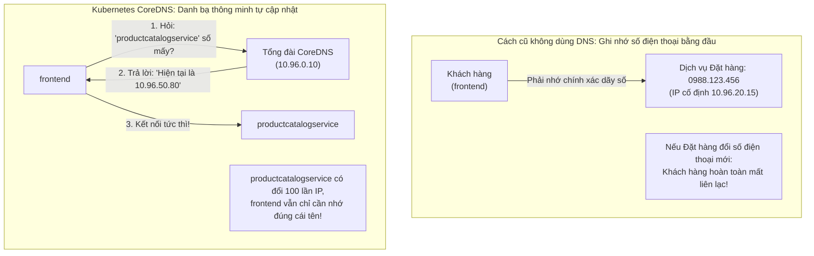
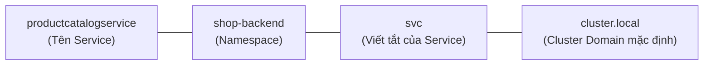
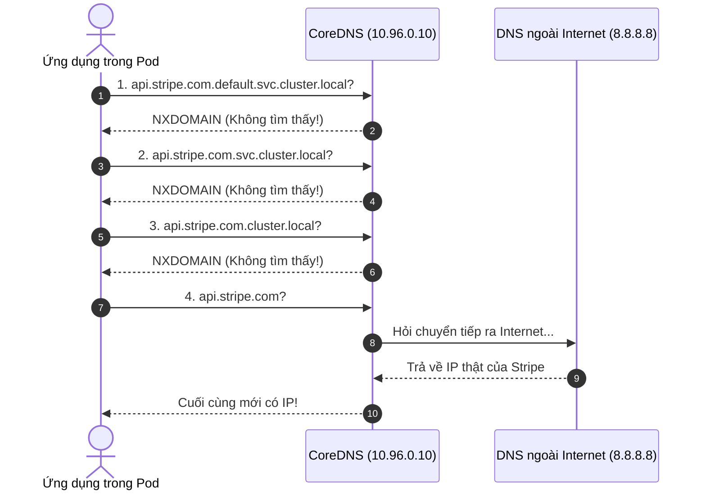

# Bài 19: CoreDNS & Service Discovery nội bộ

## 1. Thông tin bài học
* **Tên bài:** Bài 19: CoreDNS & Service Discovery nội bộ
* **Mục tiêu học:** Làm chủ cơ chế khám phá dịch vụ (Service Discovery) và phân giải tên miền nội bộ của Kubernetes thông qua CoreDNS; mổ xẻ cấu trúc định danh tên miền đầy đủ FQDN (Fully Qualified Domain Name) của Service và Pod; phân tích cặn kẽ tệp cấu hình client `/etc/resolv.conf`, giải mã thông số `ndots:5` và hiện tượng "bão truy vấn DNS" (DNS Query Storm); thành thạo kỹ thuật tùy biến file cấu hình Corefile trong ConfigMap `coredns` (thêm static hosts, rewrite tên miền, chuyển tiếp upstream DNS); thực hành chẩn đoán và khắc phục lỗi phân giải DNS trong cụm kind.
* **Thời lượng ước tính:** 120 phút (60 phút lý thuyết, 60 phút thực hành)
* **Kiến thức cần có trước:** Bài 10 (Service: Cầu nối mạng bền vững), Bài 11 (Namespace: Phân chia không gian làm việc), Bài 17 (Headless Service), Bài 18 (Mô hình mạng phẳng & CNI).
* **Liên quan kỳ thi:** CKA, CKAD (Trọng tâm cấu hình mạng chiếm 10–12% bài thi CKA: kiểm tra và debug Pod CoreDNS trong namespace `kube-system`, tra cứu bản ghi DNS cho Service/Pod bằng `nslookup`/`dig`, tùy biến ConfigMap `coredns`, gỡ lỗi Pod không kết nối được dịch vụ do sai lệch cấu hình DNS).

---

## 2. Bảng thuật ngữ

| Thuật ngữ | Giải thích đơn giản | Ví dụ / Ẩn dụ đời thường |
| :--- | :--- | :--- |
| **Service Discovery (Khám phá dịch vụ)** | Cơ chế tự động giúp các ứng dụng tìm thấy địa chỉ mạng của nhau thông qua tên gọi định danh thay vì phải nhớ địa chỉ IP cố định. | Ứng dụng danh bạ trên điện thoại: bạn chỉ cần bấm tìm tên "Mẹ" là máy tự kết nối, không cần phải nhớ chuỗi 10 chữ số điện thoại. |
| **CoreDNS** | Hệ thống máy chủ DNS linh hoạt, hiệu năng cao được cài sẵn làm máy chủ phân giải tên miền mặc định cho toàn bộ cụm Kubernetes. | Tổng đài viên trung tâm của thành phố: chịu trách nhiệm tra cứu sổ danh bạ và chỉ đường cho mọi cư dân khi cần tìm bất kỳ cơ quan nào. |
| **FQDN (Fully Qualified Domain Name)** | Tên miền đầy đủ và tuyệt đối của một tài nguyên trong Kubernetes, có cấu trúc: `<service>.<namespace>.svc.cluster.local`. | Địa chỉ bưu chính đầy đủ cấp quốc gia: Số nhà 10, Phường Bến Nghé, Quận 1, TP. Hồ Chí Minh, Việt Nam. |
| **`/etc/resolv.conf`** | Tệp tin cấu hình mạng chuẩn Linux nằm bên trong mỗi container, chỉ định địa chỉ máy chủ DNS và danh sách hậu tố tìm kiếm mặc định. | Tấm danh thiếp cài sẵn trong túi áo nhân viên: ghi rõ số điện thoại phòng tổng đài nội bộ và quy tắc bấm số máy nhánh. |
| **`ndots:5`** | Quy định của trình giải mã DNS Linux: nếu tên miền được truy vấn có ít hơn 5 dấu chấm, hệ thống sẽ tự động ghép thêm các hậu tố tìm kiếm nội bộ trước khi hỏi DNS bên ngoài. | Quy tắc tìm người: khi bạn gọi "Nguyễn Văn A", ban quản lý sẽ tìm trong danh sách nhân viên công ty trước, nếu không có mới tìm trên toàn quốc. |
| **Corefile** | Tệp tin cấu hình chính của CoreDNS (được lưu trong ConfigMap `coredns`), quy định các plugin xử lý gói tin DNS. | Sổ tay quy chế làm việc của tổng đài: quy định cuộc gọi nào chuyển cho bộ phận kỹ thuật, cuộc gọi nào chuyển ra bưu điện quốc tế. |
| **NodeLocal DNSCache** | Giải pháp kiến trúc nâng cao chạy một bộ đệm DNS cục bộ (DaemonSet) trên từng Worker Node để giảm tải cho CoreDNS trung tâm và triệt tiêu độ trễ mạng. | Chiếc két giữ nhiệt mini đặt ngay tại bàn làm việc: bạn lấy nước uống ngay tại chỗ thay vì mỗi lần uống nước phải chạy lên căng-tin tầng 10. |

---

## 3. Bức tranh lớn: Vấn đề thực tế và ẩn dụ đời thường

### Nhắc lại bài trước
Ở Bài 18, chúng ta đã khám phá mô hình mạng phẳng và CNI. Bạn đã biết rằng mỗi Pod khi sinh ra đều nhận một địa chỉ IP riêng biệt và có thể trò chuyện trực tiếp với nhau không qua NAT. Ở Bài 10, chúng ta cũng đã biết Service cung cấp một địa chỉ IP ảo cố định (`ClusterIP`) để đại diện cho một nhóm Pod. Tuy nhiên, một câu hỏi hóc búa được đặt ra: **Làm thế nào để dịch vụ `frontend` biết được địa chỉ IP ảo của dịch vụ `productcatalogservice`?** Bạn không thể ghi cứng IP ảo (ví dụ `10.96.152.40`) vào mã nguồn hoặc file cấu hình của `frontend`, bởi vì mỗi lần bạn xóa Service đi tạo lại hoặc triển khai sang một môi trường khác (Dev sang Staging/Prod), địa chỉ IP ảo này sẽ thay đổi ngẫu nhiên! Đây chính là sứ mệnh sống còn của **CoreDNS** và cơ chế **Service Discovery nội bộ**.

### Tại sao cần cái này ở production? (Vấn đề thực tế)

1. **Sự biến động liên tục trong môi trường Cloud-Native:**
   Trong Kubernetes, các Pod sinh ra và chết đi liên tục (Ephemeral). Địa chỉ IP của Pod thay đổi từng phút. Kể cả Service IP cũng không nên bị ghi cứng. Nếu không có hệ thống phân giải tên miền nội bộ tự động, lập trình viên sẽ phải liên tục cập nhật IP thủ công vào ConfigMap và khởi động lại toàn bộ ứng dụng mỗi khi có sự thay đổi hạ tầng.
2. **Cơn ác mộng "Bão truy vấn DNS" (DNS Query Storm) và độ trễ 5 giây:**
   Một trong những sự cố kinh điển nhất khiến các kỹ sư Platform đau đầu ở môi trường production là: Ứng dụng gọi các API bên ngoài internet (như cổng thanh toán Stripe, dịch vụ gửi email SendGrid) bỗng nhiên bị chậm bất thường hoặc bị timeout đúng 5 giây! Nguyên nhân sâu xa nằm ở cơ chế `ndots:5` mặc định của Linux trong Pod: mỗi khi ứng dụng truy vấn `api.stripe.com`, nó vô tình tạo ra tới 4 truy vấn DNS thừa thãi bắn phá vào CoreDNS trước khi thực sự hỏi ra ngoài internet!
3. **CoreDNS là "Trái tim" của mọi luồng giao tiếp:**
   Hãy nhớ rằng: Trong kiến trúc microservices, gần như 100% các cuộc gọi REST API, gRPC, database connection giữa các dịch vụ đều sử dụng tên miền (Domain Name). Nếu cụm CoreDNS bị nghẽn mạng hoặc thiếu RAM dẫn đến CrashLoop, **toàn bộ hệ thống microservices sẽ tê liệt hoàn toàn trong tích tắc**, dù tất cả các Pod ứng dụng của bạn vẫn đang hiển thị trạng thái `Running`!

### Ẩn dụ đời thường: Danh bạ điện thoại thông minh và Trí nhớ thủ công



1. **Không có CoreDNS giống như phải thuộc lòng số điện thoại của từng đối tác:**
   * Bạn muốn gọi cho anh Nam, chị Lan, bạn phải ghi chép dãy số `0912.345.678` vào sổ tay.
   * Nếu ngày mai anh Nam đổi nhà mạng và đổi sim mới, bạn hoàn toàn mất liên lạc cho đến khi anh Nam gửi thư thông báo số mới cho bạn.
2. **Có CoreDNS giống như Danh bạ điện thoại thông minh đồng bộ Cloud:**
   * Trong máy bạn chỉ lưu tên danh bạ: `"productcatalogservice"`.
   * Khi bạn bấm nút gọi, điện thoại tự động hỏi máy chủ danh bạ đám mây (CoreDNS): *"Cho tôi biết số hiện tại của anh này"*.
   * Dù dịch vụ có bị xóa đi tạo lại bao nhiêu lần, CoreDNS luôn cập nhật số mới nhất trong 0.001 giây, và bạn luôn kết nối thành công mà không cần sửa bất kỳ dòng code nào!

---

## 4. Giải thích khái niệm theo từng bước

### Bước 1: Cấu trúc định danh tên miền đầy đủ (FQDN) trong Kubernetes

Trong một cụm Kubernetes, mọi Service đều được CoreDNS tự động cấp phát một tên miền đầy đủ FQDN (Fully Qualified Domain Name) theo quy chuẩn nghiêm ngặt:

$$\mathbf{<\text{tên-service}>.<\text{namespace}>.\text{svc}.\text{cluster}.\text{local}}$$



#### Quy tắc gọi tên miền linh hoạt giữa các Pod:
Giả sử bạn có Service `productcatalogservice` nằm trong namespace `shop-backend`:

1. **Gọi từ một Pod nằm trong CÙNG namespace `shop-backend`:**
   * Bạn chỉ cần dùng tên ngắn nhất: `http://productcatalogservice`
   * *(Trình phân giải DNS sẽ tự động điền phần đuôi còn lại giúp bạn).*
2. **Gọi từ một Pod nằm ở KHÁC namespace (ví dụ từ namespace `default`):**
   * Bạn cần chỉ định rõ namespace: `http://productcatalogservice.shop-backend`
3. **Gọi chuẩn mực tuyệt đối (Khuyên dùng cho production):**
   * Sử dụng đầy đủ FQDN: `http://productcatalogservice.shop-backend.svc.cluster.local`
   * *(Loại bỏ hoàn toàn độ trễ tìm kiếm và tránh nhầm lẫn).*

---

### Bước 2: Bí mật bên trong tệp `/etc/resolv.conf` của Pod

Mỗi khi một Pod được Kubelet khởi tạo, Kubelet sẽ tự động tạo một file cấu hình DNS client tại `/etc/resolv.conf` bên trong mọi container của Pod. Hãy cùng mổ xẻ nội dung thực tế của file này:

```text
nameserver 10.96.0.10
search default.svc.cluster.local svc.cluster.local cluster.local
options ndots:5
```

#### Phân tích chi tiết từng tham số:

1. **`nameserver 10.96.0.10`:**
   * Đây chính là địa chỉ IP ảo (`ClusterIP`) của Service `kube-dns` trong namespace `kube-system`. Mọi truy vấn DNS xuất phát từ container này sẽ được gửi thẳng tới địa chỉ này để CoreDNS xử lý.
2. **`search default.svc.cluster.local svc.cluster.local cluster.local`:**
   * Danh sách các "hậu tố tìm kiếm" (search path). Khi bạn gõ một tên miền chưa đầy đủ, hệ thống sẽ lần lượt ghép từng hậu tố này vào đuôi tên miền để truy vấn.
3. **`options ndots:5` - Nguồn gốc của mọi rắc rối:**
   * Thuộc tính `ndots:5` là tiêu chuẩn của thư viện phân giải tên miền Linux (GNU C Library - glibc).
   * **Quy tắc:** Nếu tên miền được truy vấn có **ÍT HƠN 5 DẤU CHẤM (`.`)**, hệ thống sẽ coi đó là một tên miền cục bộ (relative domain) và **BẮT BUỘC phải ghép lần lượt với toàn bộ danh sách `search` trước**, nếu tất cả đều thất bại thì cuối cùng mới truy vấn tên miền gốc ra Internet!

#### Ví dụ minh họa thảm họa `ndots:5`:
Khi ứng dụng trong Pod chạy lệnh `curl api.stripe.com` (tên miền chỉ có đúng **2 dấu chấm** $\rightarrow$ nhỏ hơn 5):


*Kết quả:* Một truy vấn gọi ra bên ngoài đã bị nhân bản thành **4 truy vấn mạng liên tiếp**, gây lãng phí băng thông và làm quá tải CoreDNS!

---

### Bước 3: Cấu trúc file cấu hình CoreDNS (Corefile)

Toàn bộ logic xử lý của CoreDNS được định nghĩa trong một ConfigMap mang tên `coredns` nằm trong namespace `kube-system`. Cấu hình này sử dụng ngôn ngữ khai báo Corefile gồm các khối plugin:

```text
.:53 {
    errors                   # In lỗi ra stdout để quản trị viên debug
    health {                 # Cung cấp endpoint kiểm tra sức khỏe tại http://localhost:8080/health
       lameduck 5s
    }
    ready                    # Báo trạng thái sẵn sàng cho Kubernetes Probe tại cổng 8181
    kubernetes cluster.local in-addr.arpa ip6.arpa {  # Plugin xử lý toàn bộ tên miền Kubernetes
       pods insecure
       fallthrough in-addr.arpa ip6.arpa
       ttl 30
    }
    prometheus :9153         # Xuất số liệu thống kê (metrics) cho hệ thống Prometheus giám sát
    forward . /etc/resolv.conf {  # Nếu không phải tên miền .cluster.local -> chuyển tiếp ra ngoài
       max_concurrent 1000
    }
    cache 30                 # Lưu đệm kết quả phân giải trong 30 giây để tăng tốc
    loop                     # Phát hiện và ngăn chặn vòng lặp DNS vô tận (DNS Loop)
    reload                   # Tự động nạp lại cấu hình khi ConfigMap thay đổi mà không cần restart Pod!
    loadbalance              # Cân bằng tải vòng tròn (Round-Robin) giữa các bản ghi A
}
```

---

## 5. Thực hành (Lab)

* **Môi trường:** Cụm kind (`k8s\kind-config.yaml`) gồm 1 control-plane và 1 worker.
* **Mức RAM ước tính:** ~120 MB (chỉ chạy 1 Service Nginx và 1 Pod alpine công cụ mạng).

### Kịch bản thực hành:
1. Khám phá máy chủ CoreDNS đang chạy ngầm trong cluster.
2. Tạo một Service đại diện cho `productcatalogservice` nằm trong một namespace riêng biệt `boutique-backend`.
3. Triển khai một Pod kiểm tra trong namespace `default`.
4. Thực hành phân giải tên miền theo 3 cấp độ: tên ngắn, tên kèm namespace, và FQDN đầy đủ.
5. Tùy biến Corefile trong ConfigMap `coredns`: Bổ sung một bản ghi tên miền tĩnh `my-legacy-db.internal` trỏ tới IP tĩnh và kiểm chứng Pod nhận diện được ngay lập tức mà không cần khởi động lại CoreDNS!

---

### Bước 1: Khám phá hệ thống CoreDNS trên cụm kind

```powershell
# 1. Kiểm tra Service kube-dns trong namespace kube-system
kubectl get svc kube-dns -n kube-system

# 2. Kiểm tra các Pod CoreDNS đang chạy
kubectl get pods -n kube-system -l k8s-app=kube-dns -o wide
```

#### Kết quả mong đợi (Expected Output):
```text
NAME       TYPE        CLUSTER-IP   EXTERNAL-IP   PORT(S)                  AGE
kube-dns   ClusterIP   10.96.0.10   <none>        53/UDP,53/TCP,9153/TCP   2h

NAME                       READY   STATUS    RESTARTS   AGE   IP           NODE
coredns-77ccd57875-abcde   1/1     Running   0          2h    10.244.0.2   lab-control-plane
coredns-77ccd57875-xyz12   1/1     Running   0          2h    10.244.0.3   lab-control-plane
```
*Nhận xét:* Service `kube-dns` luôn sở hữu IP cố định là `10.96.0.10` trên cụm kind, phục vụ cả giao thức UDP và TCP trên cổng chuẩn `53`.

---

### Bước 2: Thiết lập môi trường thử nghiệm đa Namespace

Chúng ta sẽ tạo một namespace riêng cho backend mang tên `boutique-backend`, dựng một Service `product-service` bên trong, và một Pod kiểm tra ở namespace `default`:

```powershell
# Tạo namespace backend
kubectl create namespace boutique-backend

# Tạo Deployment và Service Nginx giả lập product-service trong namespace boutique-backend
kubectl create deployment product-service --image=nginx:alpine -n boutique-backend
kubectl expose deployment product-service --port=80 --target-port=80 -n boutique-backend

# Tạo Pod công cụ mạng trong namespace default
@'
apiVersion: v1
kind: Pod
metadata:
  name: dns-tester
  namespace: default
spec:
  containers:
    - name: tester
      image: alpine:latest
      # Cài đặt sẵn bind-tools (chứa nslookup, dig) và curl
      command: ["sh", "-c"]
      args:
        - |
          apk add --no-cache bind-tools curl
          sleep 3600
'@ | Set-Content -Path .\dns-tester.yaml -Encoding UTF8

kubectl apply -f .\dns-tester.yaml
kubectl wait --for=condition=Ready pod/dns-tester --timeout=60s
```

---

### Bước 3: Kiểm chứng quy tắc phân giải FQDN

Bây giờ chúng ta sẽ vào bên trong Pod `dns-tester` (đang ở namespace `default`) để kiểm tra khả năng tìm kiếm `product-service` (ở namespace `boutique-backend`):

#### 1. Thử nghiệm 1: Gọi tên ngắn `product-service`
```powershell
kubectl exec dns-tester -- nslookup product-service
```
Kết quả:
```text
** server can't find product-service: NXDOMAIN
```
> ❌ **Thất bại đúng như lý thuyết!** Vì Pod `dns-tester` ở namespace `default`, hậu tố tìm kiếm mặc định của nó là `default.svc.cluster.local`. Nó không thể tự tìm thấy service ở namespace khác nếu bạn chỉ gọi tên ngắn!

#### 2. Thử nghiệm 2: Gọi tên kèm namespace `product-service.boutique-backend`
```powershell
kubectl exec dns-tester -- nslookup product-service.boutique-backend
```
Kết quả:
```text
Server:         10.96.0.10
Address:        10.96.0.10#53

Name:   product-service.boutique-backend.svc.cluster.local
Address: 10.96.220.145
```
✅ **Thành công rực rỡ!** CoreDNS đã nhận diện được namespace và trả về chính xác IP ảo của Service.

#### 3. Thử nghiệm 3: Kiểm tra tệp `/etc/resolv.conf` của Pod
```powershell
kubectl exec dns-tester -- cat /etc/resolv.conf
```
Output:
```text
nameserver 10.96.0.10
search default.svc.cluster.local svc.cluster.local cluster.local
options ndots:5
```

---

### Bước 4: Tùy biến Corefile để bổ sung tên miền tùy biến

Giả sử doanh nghiệp có một cơ sở dữ liệu cũ (Legacy Oracle DB) chạy bên ngoài Kubernetes tại địa chỉ IP tĩnh `192.168.1.99`, và bạn muốn các Pod trong cluster có thể gọi nó qua tên miền `my-legacy-db.internal`. Chúng ta sẽ thêm plugin `hosts` vào ConfigMap `coredns`:

```powershell
# Lấy cấu hình ConfigMap coredns hiện tại và xem trước
kubectl get configmap coredns -n kube-system -o yaml
```

Sử dụng lệnh `kubectl patch` để tiêm khối cấu hình `hosts` vào Corefile:
```powershell
$customCorefile = @"
.:53 {
    errors
    health {
       lameduck 5s
    }
    ready
    hosts {
       192.168.1.99 my-legacy-db.internal
       fallthrough
    }
    kubernetes cluster.local in-addr.arpa ip6.arpa {
       pods insecure
       fallthrough in-addr.arpa ip6.arpa
       ttl 30
    }
    prometheus :9153
    forward . /etc/resolv.conf
    cache 30
    loop
    reload
    loadbalance
}
"@

# Cập nhật ConfigMap
kubectl create configmap coredns -n kube-system --from-literal=Corefile="$customCorefile" --dry-run=client -o yaml | kubectl apply -f -
```

Đợi khoảng 5 đến 10 giây để plugin `reload` của CoreDNS tự động nạp cấu hình mới. Bây giờ, hãy kiểm tra ngay từ bên trong Pod `dns-tester`:
```powershell
kubectl exec dns-tester -- nslookup my-legacy-db.internal
```

#### Kết quả mong đợi:
```text
Server:         10.96.0.10
Address:        10.96.0.10#53

Name:   my-legacy-db.internal
Address: 192.168.1.99
```
🎉 **Kỳ diệu!** CoreDNS đã phân giải thành công tên miền tùy biến `my-legacy-db.internal` về đúng địa chỉ `192.168.1.99` mà không hề phải khởi động lại bất kỳ Pod CoreDNS nào!

---

### Bước 5: Dọn dẹp tài nguyên (Cleanup)
Khôi phục lại Corefile nguyên bản và xóa các tài nguyên lab:

```powershell
# 1. Khôi phục Corefile mặc định cho kind
$defaultCorefile = @"
.:53 {
    errors
    health {
       lameduck 5s
    }
    ready
    kubernetes cluster.local in-addr.arpa ip6.arpa {
       pods insecure
       fallthrough in-addr.arpa ip6.arpa
       ttl 30
    }
    prometheus :9153
    forward . /etc/resolv.conf
    cache 30
    loop
    reload
    loadbalance
}
"@
kubectl create configmap coredns -n kube-system --from-literal=Corefile="$defaultCorefile" --dry-run=client -o yaml | kubectl apply -f -

# 2. Xóa các tài nguyên đã tạo
kubectl delete pod dns-tester
kubectl delete namespace boutique-backend
Remove-Item .\dns-tester.yaml
```

---

## 6. Lỗi thường gặp và cách debug

### Lỗi 1: Pod CoreDNS dính `CrashLoopBackOff` do lỗi DNS Loop
* **Dấu hiệu:** Cụm vừa dựng xong nhưng 2 Pod CoreDNS liên tục bị Crash. Log của CoreDNS in ra thông báo: `plugin/loop: Loop (127.0.0.1:53 -> :53) detected for zone ".", see https://coredns.io/plugins/loop#troubleshooting`.
* **Nguyên nhân cốt lõi:** Máy chủ Node sử dụng dịch vụ `systemd-resolved` của Ubuntu, trỏ DNS máy chủ về địa chỉ loopback nội bộ `127.0.0.53`. Kubelet copy file `/etc/resolv.conf` của máy chủ này đưa vào container CoreDNS. Khi CoreDNS nhận truy vấn chuyển tiếp (`forward . /etc/resolv.conf`), nó lại gửi ngược lại cho chính nó tại cổng 53, tạo ra vòng lặp vô tận!
* **Cách sửa dứt điểm:**
  1. Cấu hình Kubelet trỏ tới file resolv thực của hệ thống: thêm cờ `--resolv-conf=/run/systemd/resolve/resolv.conf` trong cấu hình Kubelet.
  2. Hoặc sửa Corefile, thay dòng `forward . /etc/resolv.conf` bằng địa chỉ DNS ngoài cụ thể, ví dụ: `forward . 8.8.8.8 1.1.1.1`.

### Lỗi 2: Trễ mạng 5 giây khi gọi dịch vụ bên ngoài (Do `ndots:5`)
* **Dấu hiệu:** Ứng dụng gọi API ra ngoài internet thỉnh thoảng bị đơ đúng 5 giây trước khi có phản hồi.
* **Nguyên nhân:** Do quy tắc `ndots:5`, các truy vấn ra internet bị gửi kèm các hậu tố tìm kiếm cục bộ (`.cluster.local`). Khi gặp tường lửa hoặc máy chủ DNS upstream trả lời chậm đối với các bản ghi không tồn tại (NXDOMAIN), thư viện client sẽ bị timeout chờ đợi đúng 5 giây.
* **Cách khắc phục ở cấp độ Pod:**
  Trong manifest của Pod, cấu hình đè thông số `dnsConfig` để giảm giá trị `ndots` xuống 2:
  ```yaml
  spec:
    dnsConfig:
      options:
        - name: ndots
          value: "2"
  ```
  *(Lưu ý: Nếu giảm xuống 2, bạn bắt buộc phải gọi tên miền nội bộ kèm namespace, ví dụ `service.namespace` thay vì chỉ gọi tên ngắn).*

### Lỗi 3: Lỗi CoreDNS bị OOMKilled do không đặt giới hạn bộ nhớ hợp lý
* **Dấu hiệu:** Khi hệ thống có lượng request tăng đột biến, toàn bộ cluster bị lỗi DNS hàng loạt. Chạy `kubectl get pods -n kube-system` thấy Pod CoreDNS bị restart với mã lỗi `OOMKilled` (Exit Code 137).
* **Nguyên nhân:** CoreDNS mặc định chỉ được cấp khoảng 70Mi đến 170Mi RAM. Dưới tải lớn với hàng triệu truy vấn DNS mỗi phút, bộ đệm (cache plugin) phình to làm vượt quá memory limit.
* **Cách sửa:** Tăng `resources.limits.memory` cho Deployment `coredns` lên 512Mi và triển khai **NodeLocal DNSCache**.

---

## 7. Góc nhìn Senior

### 1. Sự đánh đổi (Trade-offs): CoreDNS tập trung vs NodeLocal DNSCache

| Tiêu chí | Mô hình CoreDNS tập trung (Mặc định) | Mô hình NodeLocal DNSCache (Khuyên dùng Production) |
| :--- | :--- | :--- |
| **Kiến trúc** | Chạy 2-3 Pod CoreDNS trung tâm phục vụ toàn bộ hàng trăm Worker Node trong cluster. | Chạy một Pod DaemonSet nhẹ nhàng trên **TỪNG Worker Node**, lắng nghe tại IP ảo cục bộ (ví dụ `169.254.20.10`). |
| **Giao thức mạng** | Sử dụng UDP qua iptables/conntrack, dễ dính lỗi race-condition làm mất gói tin DNS. | Giao tiếp cục bộ qua loopback; chuyển tiếp lên CoreDNS bằng **TCP** giúp triệt tiêu hoàn toàn rủi ro rớt gói tin! |
| **Tải lên CoreDNS** | Rất cao: Mọi truy vấn từ mọi container đều dồn thẳng vào CoreDNS. | Giảm tới **80% - 90%** tải cho CoreDNS vì đa số truy vấn được giải quyết ngay tại cache của Node. |
| **Độ trễ (Latency)** | Khoảng 1 - 3 ms (phụ thuộc vào mạng giữa các node). | Dưới **0.2 ms** (tốc độ đọc bộ nhớ RAM cục bộ). |
| **Độ phức tạp** | Rất đơn giản, không cần cấu hình thêm gì. | Cần cài đặt thêm DaemonSet và điều chỉnh Kubelet cluster-dns IP. |

### 2. Best practices tại production

1. **Thêm dấu chấm tuyệt đối (`.`) vào đuôi tên miền trong mã nguồn:**
   Đây là mẹo tối ưu hóa kinh điển của các kỹ sư Senior! Trong mã nguồn ứng dụng (ví dụ file cấu hình gọi Stripe hay AWS S3), thay vì viết `api.stripe.com`, hãy viết là:  
   `https://api.stripe.com./v1/charges`  
   *(Có dấu chấm ở cuối)*. Dấu chấm này báo hiệu cho trình phân giải Linux biết rằng đây là một **Fully Qualified Domain Name tuyệt đối**. Hệ thống sẽ **bỏ qua hoàn toàn quy tắc `ndots:5`** và không ghép bất kỳ hậu tố tìm kiếm nội bộ nào, gửi thẳng truy vấn ra Internet trong 1 mili-giây!
2. **Kích hoạt tự động co giãn CoreDNS theo quy mô cụm (Autoscaling):**
   Đừng để cố định 2 bản sao CoreDNS cho một cụm có 50 Worker Node! Hãy cài đặt công cụ `cluster-proportional-autoscaler`. Công cụ này sẽ tự động tăng số lượng bản sao CoreDNS theo tỷ lệ: cứ mỗi 250 lõi CPU hoặc mỗi 10 Worker Node thêm vào cluster, hệ thống sẽ tự động scale thêm 1 Pod CoreDNS.
3. **Giám sát số lượng truy vấn NXDOMAIN bằng Prometheus:**
   Thiết lập cảnh báo nếu số lượng phản hồi `NXDOMAIN` (tên miền không tồn tại) chiếm tỷ lệ quá cao trong tổng số truy vấn của CoreDNS. Tỷ lệ NXDOMAIN cao là dấu hiệu cho thấy ứng dụng đang bị dính bão truy vấn do `ndots:5` hoặc có một service đang cấu hình sai địa chỉ và liên tục thử lại (retry storm).

### 3. Câu hỏi phỏng vấn Senior

* **Câu hỏi 1:** *"Hãy giải thích tại sao tham số `options ndots:5` trong `/etc/resolv.conf` lại có thể gây suy giảm hiệu năng nghiêm trọng cho các ứng dụng có lưu lượng gọi ra bên ngoài (Egress Traffic) lớn? Bạn đề xuất những giải pháp nào để xử lý triệt để vấn đề này?"*
* **Gợi ý trả lời chuẩn:**
  1. **Nguyên nhân:** Thuộc tính `ndots:5` quy định mọi tên miền có ít hơn 5 dấu chấm (hầu hết các tên miền internet như `api.github.com` chỉ có 2 dấu chấm) đều bị coi là tên miền nội bộ chưa hoàn chỉnh. Do đó, trước khi truy vấn ra ngoài internet, hệ thống bắt buộc phải tuần tự thử ghép với danh sách `search` (`.default.svc.cluster.local`, `.svc.cluster.local`, `.cluster.local`). Mỗi lần thử đều nhận về mã lỗi `NXDOMAIN`. Điều này làm tăng gấp 4 lần số lượng truy vấn mạng, gây lãng phí CPU của CoreDNS và tăng độ trễ mạng lên đáng kể.
  2. **Các giải pháp xử lý:**
     * *Cấp độ ứng dụng:* Thêm dấu chấm tuyệt đối vào cuối tên miền (ví dụ `api.github.com.`).
     * *Cấp độ Pod manifest:* Cấu hình khối `dnsConfig.options` để hạ giá trị `ndots` xuống 2 đối với các Pod chuyên gọi ra ngoài.
     * *Cấp độ hạ tầng:* Triển khai **NodeLocal DNSCache** để lưu đệm các phản hồi NXDOMAIN ngay trên node máy chủ và chuyển tiếp truy vấn thông qua kết nối TCP bền vững.

* **Câu hỏi 2:** *"Sự cố DNS Conntrack Race Condition kinh điển của nhân Linux là gì, và tại sao việc triển khai NodeLocal DNSCache lại giải quyết triệt để được sự cố này?"*
* **Gợi ý trả lời chuẩn:**
  * **Sự cố Linux Conntrack:** Theo cơ chế của thư viện glibc, một tiến trình thường gửi đồng thời hai truy vấn DNS dạng UDP (một truy vấn bản ghi IPv4 A và một truy vấn IPv6 AAAA) cùng một lúc từ cùng một cổng socket. Khi hai gói tin UDP này đi qua bảng theo dõi kết nối `netfilter/conntrack` của nhân Linux để thực hiện Source NAT/Destination NAT (do iptables điều khiển), một cuộc đua tranh chấp tài nguyên (Race Condition) sẽ diễn ra để chèn bản ghi vào bảng conntrack. Kết quả là một trong hai gói tin bị kernel Linux âm thầm vứt bỏ (Drop), khiến ứng dụng bị treo và phải chờ timeout đúng 5 giây để thử lại!
  * **Cách NodeLocal DNSCache khắc phục:** NodeLocal DNSCache là một tiến trình chạy ngay trên loopback của Worker Node. Pod gửi gói tin tới NodeLocal DNSCache qua giao tiếp cục bộ không cần đi qua bảng conntrack của mạng bên ngoài. Sau đó, NodeLocal DNSCache gom các truy vấn và chuyển tiếp lên cụm CoreDNS thông qua **kết nối TCP** có kiểm soát luồng và chống mất gói tin, triệt tiêu hoàn toàn hiện tượng race condition của UDP.

---

## 8. Tóm tắt bài học

* 📌 **1. Bản chất Service Discovery:** Cho phép các microservices kết nối với nhau thông qua tên miền ổn định mà không cần quan tâm đến sự thay đổi địa chỉ IP bên dưới.
* 📌 **2. Cấu trúc FQDN chuẩn:** `<service>.<namespace>.svc.cluster.local`; trong cùng namespace có thể gọi tên ngắn, khác namespace cần kèm tên namespace.
* 📌 **3. Bí mật `/etc/resolv.conf`:** Kubelet tự động cấu hình trỏ về IP của Service `kube-dns` (`10.96.0.10`) kèm theo danh sách tìm kiếm hậu tố và quy tắc `ndots:5`.
* 📌 **4. Tùy biến linh hoạt với Corefile:** CoreDNS quản lý logic qua ConfigMap `coredns`, hỗ trợ plugin `reload` tự động cập nhật cấu hình mà không cần khởi động lại Pod.
* 📌 **5. Chuẩn mực Production:** Tối ưu hóa `ndots:5` bằng dấu chấm cuối FQDN, tự động co giãn CoreDNS theo quy mô cụm và bắt buộc triển khai NodeLocal DNSCache cho các hệ thống lớn.

---

## 9. Bài tập tự làm

* 🟢 **Mức Dễ:** Khởi tạo một Pod `alpine` tạm thời bằng lệnh `kubectl run test-dns --image=alpine:latest -it --rm -- sh`. Kiểm tra nội dung tệp `/etc/resolv.conf` và sử dụng lệnh `nslookup kubernetes.default` để xác nhận địa chỉ IP của API Server nội bộ.
* 🟡 **Mức Vừa (Tùy biến Rewrite DNS):** Chỉnh sửa ConfigMap `coredns` trong namespace `kube-system` để bổ sung plugin `rewrite`. Cấu hình sao cho mọi truy vấn gửi tới tên miền `google.internal` sẽ được CoreDNS tự động viết lại thành `google.com` trước khi gửi ra Internet. Kiểm tra tính năng bằng `nslookup google.internal` từ bên trong một Pod.
* 🔴 **Mức Khó (Tối ưu hóa ndots cho Pod):** Viết một manifest Pod chạy image có công cụ `curl`. Cấu hình khối `dnsConfig` để đặt `ndots: 1`. Đăng nhập vào Pod, chứng minh rằng Pod vẫn phân giải được tên miền ngoài internet `google.com` cực nhanh mà không bị thừa thãi truy vấn nội bộ, nhưng giải thích tại sao lệnh `nslookup kubernetes` (tên ngắn) lúc này lại bị thất bại.

---

## 10. Câu hỏi tự kiểm tra

1. Địa chỉ FQDN đầy đủ của một Service tên là `cart-service` nằm trong namespace `online-boutique` là gì?
2. Nếu hai Pod nằm trong cùng một namespace, Pod này có thể gọi Pod kia bằng tên ngắn của Service (không cần kèm tên namespace) được không? Tại sao?
3. Tham số `options ndots:5` trong file `/etc/resolv.conf` của Pod có ý nghĩa kỹ thuật cụ thể là gì?
4. Tại sao một truy vấn DNS gọi ra tên miền ngoài internet như `api.stripe.com` lại có thể làm tăng tải cho máy chủ CoreDNS nội bộ của cluster?
5. Để bổ sung một bản ghi tên miền tĩnh (Static Host Mapping) cho một máy chủ cơ sở dữ liệu bên ngoài vào CoreDNS mà không cần tạo ExternalName Service, bạn sử dụng plugin nào trong Corefile?
6. Lợi ích lớn nhất của việc triển khai giải pháp kiến trúc NodeLocal DNSCache trong môi trường production quy mô lớn là gì?

<details>
<summary>👉 Bấm vào đây để xem đáp án câu hỏi tự kiểm tra</summary>

* **Đáp án 1:** Là: **`cart-service.online-boutique.svc.cluster.local`**.
* **Đáp án 2:** **ĐƯỢC**. Vì trong file `/etc/resolv.conf` của Pod có khai báo sẵn hậu tố tìm kiếm `<tên-namespace>.svc.cluster.local`, hệ thống sẽ tự động ghép phần đuôi này vào tên ngắn để truy vấn thành công.
* **Đáp án 3:** Có nghĩa là: Nếu tên miền được truy vấn có **ít hơn 5 dấu chấm**, trình phân giải sẽ tự động ghép tên miền đó với toàn bộ danh sách hậu tố tìm kiếm nội bộ (`search path`) trước, nếu không tìm thấy mới gửi truy vấn nguyên bản ra ngoài.
* **Đáp án 4:** Vì `api.stripe.com` chỉ có 2 dấu chấm (< 5), nên hệ thống bị buộc phải gửi 3 truy vấn thử nghiệm kèm các hậu tố `.cluster.local` vào máy chủ CoreDNS nội bộ trước khi thực sự hỏi ra ngoài internet.
* **Đáp án 5:** Sử dụng plugin **`hosts`** bên trong khối cấu hình Corefile của ConfigMap `coredns`.
* **Đáp án 6:** Giúp **giảm tới 90% lưu lượng truy vấn dồn về CoreDNS**, giảm độ trễ phân giải xuống dưới 0.2ms nhờ cache cục bộ trên từng Node, và chuyển đổi kết nối từ UDP sang TCP để triệt tiêu hoàn toàn lỗi rớt gói tin DNS do Linux Conntrack race condition.
</details>

---

## 11. Tài liệu đọc thêm và bài tiếp theo

### Tài liệu tham khảo
* [Tài liệu chính thức Kubernetes: DNS for Services and Pods](https://kubernetes.io/docs/concepts/services-networking/dns-pod-service/)
* [Tài liệu tùy biến DNS: Customizing DNS Service in Kubernetes](https://kubernetes.io/docs/tasks/administer-cluster/dns-custom-nameservers/)
* [Kiến trúc NodeLocal DNSCache](https://kubernetes.io/docs/tasks/administer-cluster/nodelocaldns/)
* [Tài liệu chính thức CoreDNS: Plugins and Corefile configuration](https://coredns.io/manual/toc/)

### Bài tiếp theo
👉 **Bài 20: Ingress & Ingress Controller: Mở cửa đón lưu lượng HTTP/HTTPS**

---

## PHỤ LỤC: ĐÁP ÁN GỢI Ý BÀI TẬP TỰ LÀM (MỤC 9)

### Đáp án Mức Dễ
```powershell
# Chạy Pod kiểm tra nhanh
kubectl run test-dns --image=alpine:latest -i --tty --rm -- sh -c "cat /etc/resolv.conf; nslookup kubernetes.default"
```

### Đáp án Mức Vừa
```powershell
# 1. Chèn cấu hình rewrite vào Corefile của ConfigMap coredns
$rewriteCorefile = @"
.:53 {
    errors
    health {
       lameduck 5s
    }
    ready
    rewrite name google.internal google.com
    kubernetes cluster.local in-addr.arpa ip6.arpa {
       pods insecure
       fallthrough in-addr.arpa ip6.arpa
       ttl 30
    }
    prometheus :9153
    forward . /etc/resolv.conf
    cache 30
    loop
    reload
    loadbalance
}
"@
kubectl create configmap coredns -n kube-system --from-literal=Corefile="$rewriteCorefile" --dry-run=client -o yaml | kubectl apply -f -

# 2. Đợi 5 giây rồi kiểm tra từ Pod
Start-Sleep -Seconds 5
kubectl run test-rewrite --image=alpine:latest -i --tty --rm -- sh -c "apk add --no-cache bind-tools >/dev/null 2>&1; nslookup google.internal"

# Khôi phục lại coredns mặc định sau khi test xong
```

### Đáp án Mức Khó
```powershell
# 1. Tạo Pod có ndots: 1
@'
apiVersion: v1
kind: Pod
metadata:
  name: low-ndots-pod
spec:
  dnsConfig:
    options:
      - name: ndots
        value: "1"
  containers:
    - name: tester
      image: alpine:latest
      command: ["sh", "-c", "apk add --no-cache bind-tools >/dev/null 2>&1; sleep 3600"]
'@ | kubectl apply -f -

kubectl wait --for=condition=Ready pod/low-ndots-pod --timeout=30s

# 2. Kiểm tra gọi tên miền ngoài: Cực nhanh vì ndots: 1 thỏa mãn google.com (có 1 dấu chấm >= 1)
kubectl exec low-ndots-pod -- nslookup google.com

# 3. Thử gọi tên ngắn nội bộ: Bị lỗi NXDOMAIN!
kubectl exec low-ndots-pod -- nslookup kubernetes
# Giải thích: Vì tên 'kubernetes' có 0 dấu chấm (< 1), hệ thống không tự động nối search path nếu không cấu hình!
# Muốn thành công, phải gọi đầy đủ: nslookup kubernetes.default.svc.cluster.local

# Dọn dẹp
kubectl delete pod low-ndots-pod
```

