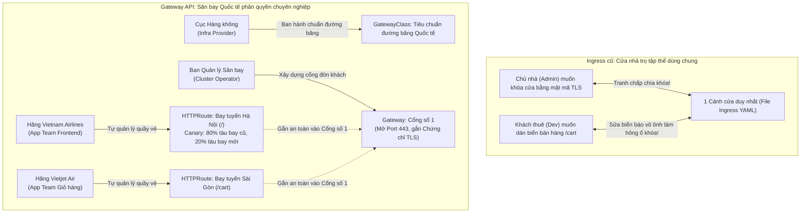
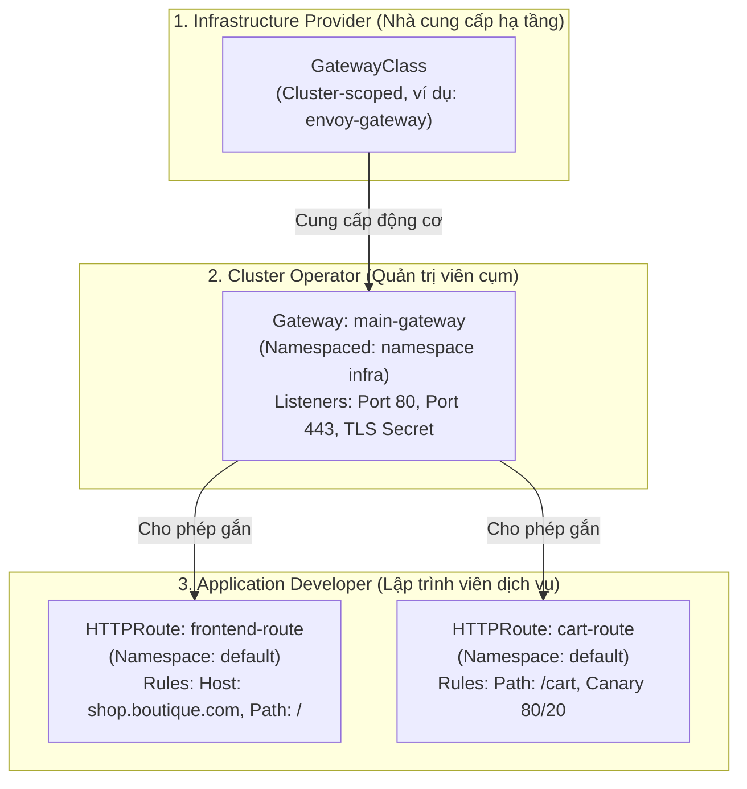

# Bài 21: Gateway API: Chuẩn mực định tuyến thế hệ mới

## 1. Thông tin bài học
* **Tên bài:** Bài 21: Gateway API: Chuẩn mực định tuyến thế hệ mới
* **Mục tiêu học:** Hiểu sâu sắc lý do tại sao Kubernetes Gateway API được phát triển để thay thế Ingress truyền thống; làm chủ kiến trúc hướng vai trò (Role-oriented Architecture) phân chia quyền hạn rạch ròi giữa 3 thực thể: Nhà cung cấp hạ tầng (`GatewayClass`), Quản trị viên cụm (`Gateway`), và Lập trình viên dịch vụ (`HTTPRoute`, `GRPCRoute`); thuần thục các tính năng định tuyến Layer 7 cao cấp được chuẩn hóa trực tiếp vào schema mà không cần dùng annotation (Canary Traffic Splitting theo trọng số `weight`, Khớp tiêu đề HTTP Header Matching, Viết lại URL); hiểu cơ chế kiểm soát bảo mật xuyên Namespace (`ReferenceGrant`); thực hành cài đặt CRD và triển khai kịch bản Canary Deployment chia tải thông minh cho dịch vụ Online Boutique trên cụm kind.
* **Thời lượng ước tính:** 150 phút (75 phút lý thuyết, 75 phút thực hành)
* **Kiến thức cần có trước:** Bài 07 (Labels, Selectors & Annotations), Bài 09 (Deployment: Quản lý triển khai & Rollback), Bài 10 (Service: Cầu nối mạng bền vững), Bài 20 (Ingress & Ingress Controller).
* **Liên quan kỳ thi:** Nâng cao, CKA/CKAD thế hệ mới (Gateway API đã chính thức đạt chuẩn GA v1.0+ và là chuẩn mực định tuyến tương lai của SIG-Network; các kỳ thi chứng chỉ đang tích hợp dần GatewayClass, Gateway và HTTPRoute vào phần thi thực hành mạng nâng cao).

---

## 2. Bảng thuật ngữ

| Thuật ngữ | Giải thích đơn giản | Ví dụ / Ẩn dụ đời thường |
| :--- | :--- | :--- |
| **Gateway API** | Bộ đặc tả API thế hệ mới của Kubernetes dành cho việc định tuyến, cân bằng tải và quản lý lưu lượng Layer 4 đến Layer 7, thay thế Ingress truyền thống. | Hệ thống đường sắt cao tốc thông minh đa làn với hệ thống điều khiển tự động, thay thế cho con đường liên tỉnh một làn xe chật hẹp cũ kỹ. |
| **Role-oriented Architecture** | Mô hình kiến trúc phân quyền rạch ròi theo vai trò công việc: hạ tầng, vận hành cụm và phát triển ứng dụng hoạt động trên các tài nguyên độc lập. | Quy trình vận hành sân bay quốc tế: Cục Hàng không quản lý đường băng, Ban quản lý sân bay kiểm soát nhà ga và cổng, các Hãng hàng không quản lý quầy vé và chuyến bay riêng. |
| **`GatewayClass`** | Tài nguyên cấp Cụm (Cluster-scoped) do Nhà cung cấp hạ tầng tạo ra, chỉ định bộ điều khiển (Controller) chịu trách nhiệm vận hành (Envoy, Istio, Cilium). | Chủng loại đường băng sân bay (Đường băng bê tông tiêu chuẩn quốc tế có khả năng tiếp nhận máy bay thân rộng Boeing 777 / Airbus A350). |
| **`Gateway`** | Tài nguyên cấp Namespace đại diện cho một điểm tiếp nhận lưu lượng mạng cụ thể (Cổng, Giao thức, Chứng chỉ TLS, địa chỉ IP). | Chiếc Cổng số 1 (Gate 1) tại nhà ga quốc tế: có nhân viên an ninh gác cửa, có hệ thống soi chiếu và đón khách tại cửa vào. |
| **`HTTPRoute`** | Tài nguyên cấp Namespace do Lập trình viên tạo ra để định nghĩa các luật định tuyến lưu lượng HTTP/HTTPS chi tiết vào các Service backend. | Bản kế hoạch phân bổ chuyến bay của Hãng hàng không: chuyến bay lúc 8h sáng đón khách tại Cổng số 1 bay đi Tokyo, chia 20% ghế cho khách VIP. |
| **Traffic Splitting (Canary)** | Kỹ thuật chia tách lưu lượng theo tỷ lệ phần trăm (trọng số `weight`) giữa các phiên bản ứng dụng mà không cần dùng bất kỳ annotation nào. | Ngã ba đường có biển chỉ dẫn: 80% xe tải nặng đi vào cầu cạn cũ, 20% xe con đi vào tuyến đường hầm mới thử nghiệm. |
| **`ReferenceGrant`** | Đối tượng bảo mật cho phép một tài nguyên ở Namespace này được quyền tham chiếu an toàn sang một tài nguyên ở Namespace khác. | Giấy ủy quyền có công chứng cho phép nhân viên chi nhánh A được quyền vào kho hàng của chi nhánh B để lấy hàng xuất khẩu. |

---

## 3. Bức tranh lớn: Vấn đề thực tế và ẩn dụ đời thường

### Nhắc lại bài trước
Ở Bài 20, chúng ta đã nắm vững cách Ingress và Ingress Controller mở cửa đón nhận lưu lượng HTTP/HTTPS từ ngoài Internet vào các Service nội bộ. Ingress đã giải quyết được bài toán tiết kiệm chi phí Load Balancer và hỗ trợ định tuyến theo Host/Path. Tuy nhiên, Ingress được thiết kế từ năm 2015 – thời điểm ban sơ của Kubernetes – với một cấu trúc rất sơ sài. Khi các doanh nghiệp lớn áp dụng microservices ở quy mô hàng trăm nhóm kỹ sư, Ingress bộc lộ những nhược điểm chí mạng khiến cộng đồng Kubernetes buộc phải xây dựng một chuẩn mực hoàn toàn mới: **Gateway API**.

### Tại sao cần cái này ở production? (Vấn đề thực tế của Ingress)

1. **Thảm họa "Rừng Annotation" (Annotation Spaghetti) và Mất tính di động:**
   Tài nguyên Ingress truyền thống chỉ có 2 trường nghèo nàn là `host` và `path`. Khi doanh nghiệp muốn các tính năng cao cấp mà hệ thống nào cũng cần (như Canary Deployment chia % traffic, Header Matching, URL Rewriting, CORS, Rate Limiting), Ingress hoàn toàn không hỗ trợ!
   Hậu quả là mỗi hãng Reverse Proxy tự phát minh ra hàng trăm Annotation riêng biệt:
   * Trên Nginx: Dùng `nginx.ingress.kubernetes.io/canary: "true"` và `canary-weight: "20"`.
   * Trên Traefik: Dùng `traefik.ingress.kubernetes.io/router.middlewares: ...`.
   * Trên HAProxy: Dùng `haproxy.org/server-weight: ...`.
   Khi doanh nghiệp quyết định chuyển đổi hạ tầng từ Nginx sang Envoy Gateway hoặc Istio, **toàn bộ hàng ngàn file Ingress YAML phải đập đi viết lại**, biến tính di động (Portability) – giá trị cốt lõi của Kubernetes – thành con số không!
2. **Vi phạm nguyên tắc phân quyền và bảo mật (Monolithic Resource):**
   Trong Ingress, **mọi thứ bị nhồi nhét vào DUY NHẤT MỘT FILE MANIFEST**: Cổng mạng (Port 80/443), Chứng chỉ số TLS (`tls-secret`), Tên miền (`shop.com`), và Đường dẫn dịch vụ (`/cart`).
   Điều này dẫn đến xung đột quyền hạn nghiêm trọng trong doanh nghiệp:
   * Quản trị viên hạ tầng (Sysadmin) muốn kiểm soát cổng và chứng chỉ SSL công ty.
   * Lập trình viên backend (Developer) chỉ muốn đổi đường dẫn URL API của dịch vụ giỏ hàng.
   * Nhưng vì Ingress là một file duy nhất, Quản trị viên buộc phải cấp quyền chỉnh sửa Ingress cho Developer. Một lập trình viên mới vào nghề sơ suất xóa nhầm khối `tls:` trong Ingress có thể **làm sập toàn bộ cổng ra vào của toàn bộ tập đoàn**!
3. **Thiếu hỗ trợ cho các giao thức hiện đại (gRPC, TCP, UDP):**
   Ingress chỉ phục vụ giao thức HTTP/HTTPS. Nó hoàn toàn bất lực trước các giao thức microservices hiệu năng cao như **gRPC** (phục vụ giao tiếp giữa các service), hoặc lưu lượng TCP/UDP thuần túy (như cụm cơ sở dữ liệu phân tán, máy chủ game, streaming video).

**Sứ mệnh của Gateway API:**
> **"Gateway API không chỉ là một sự nâng cấp, mà là một cuộc cách mạng: Tách rời quyền hạn theo 3 vai trò độc lập, chuẩn hóa 100% tính năng định tuyến Layer 7 vào cấu trúc YAML không cần annotation, và mở rộng hỗ trợ xuyên suốt từ TCP, UDP, HTTP đến gRPC!"**

### Ẩn dụ đời thường: Cửa nhà trọ tập thể và Sân bay Quốc tế



1. **Ingress cũ giống như Chiếc cửa nhà trọ tập thể:**
   * Cả dãy nhà trọ chỉ có duy nhất một cánh cửa sắt.
   * Chủ nhà (Admin) muốn khóa cổng lúc 11h đêm bằng khóa số vân tay (TLS Secret). Khách thuê phòng số 3 (Dev) muốn dán tấm biển quảng cáo bán trà sữa trước cửa (`/bubble-tea`).
   * Cả hai người phải cùng cầm chung chiếc chìa khóa và sửa chung một cánh cửa. Khách thuê đi ra đi vào vô tình làm kẹt ổ khóa vân tay, khiến cả khu nhà trọ bị nhốt bên ngoài.
2. **Gateway API giống như Sân bay Quốc tế hiện đại:**
   * **Cục Hàng không (`GatewayClass`):** Quy định tiêu chuẩn thiết kế hạ tầng sân bay quốc tế.
   * **Ban Quản lý Sân bay (`Gateway`):** Quản lý nhà ga T2, lắp đặt Cổng số 1, kiểm soát an ninh cửa khẩu, kiểm tra thẻ căn cước và chứng chỉ bay (Cổng 443, TLS Secret). Ban quản lý không cần biết máy bay bên trong chở ai hay bán món ăn gì.
   * **Các Hãng Hàng không (`HTTPRoute`):** Hãng bay chỉ cần đăng ký: *"Cho tôi thuê Cổng số 1 để đón khách bay chuyến `/hanoi`"*. Hãng bay toàn quyền quyết định chia 80% khách đi máy bay thông thường và 20% khách VIP đi máy bay hạng sang (Canary 80/20) mà **tuyệt đối không thể can thiệp hay làm hỏng hệ thống an ninh cửa khẩu** của sân bay!

---

## 4. Giải thích khái niệm theo từng bước

### Bước 1: Ba vai trò độc lập trong Kiến trúc Gateway API

Gateway API chia việc quản lý mạng thành 3 lớp tài nguyên độc lập tương ứng với 3 vai trò (Persona) thực tế trong một tổ chức:



1. **`GatewayClass` (Tài nguyên cấp Cluster):**
   * Do đội ngũ Platform/Cloud Provider tạo ra.
   * Chỉ định bộ điều khiển (Controller Implementation) đứng sau điều phối lưu lượng (ví dụ: `gateway.envoyproxy.io/gatewayclass-controller`, `cilium.io/gateway-controller`).
2. **`Gateway` (Tài nguyên cấp Namespace):**
   * Do Quản trị viên cụm (SRE / Platform Engineer) quản lý.
   * Khai báo các điểm tiếp nhận lưu lượng mạng (`listeners`): cổng mạng nào được mở (80, 443), sử dụng giao thức nào (HTTP, HTTPS, TLS, TCP), chứng chỉ SSL nào được áp dụng, và **những Namespace nào được phép gắn Route vào Cổng này** (`allowedRoutes`).
3. **`HTTPRoute` (Tài nguyên cấp Namespace):**
   * Do Lập trình viên ứng dụng (Developer / Product Team) toàn quyền quản lý.
   * Khai báo cổng đích cần gắn vào (`parentRefs: main-gateway`), tên miền (`hostnames`), các điều kiện khớp (`rules.matches`), và danh sách Service backend nhận lưu lượng (`rules.backendRefs`).

---

### Bước 2: Bảng so sánh trực diện: Ingress vs Gateway API

| Tiêu chí so sánh | Kubernetes Ingress (Cũ) | Kubernetes Gateway API (Chuẩn mực mới) |
| :--- | :--- | :--- |
| **Mô hình tài nguyên** | Đơn khối (Monolithic): Một tài nguyên Ingress chứa toàn bộ cấu hình. | Hướng vai trò (Role-oriented): Tách làm `GatewayClass`, `Gateway`, `HTTPRoute`. |
| **Tính năng Canary (Traffic Splitting)** | ❌ Phải dùng Annotation riêng biệt của từng hãng Proxy (`canary-weight`). | ✅ **Chuẩn hóa 100% trong schema YAML** thông qua thuộc tính `weight`. |
| **Khớp tiêu đề HTTP (Header Matching)** | ❌ Phải viết mã Lua hoặc Annotation phức tạp. | ✅ **Chuẩn hóa native** qua khối `matches.headers`. |
| **Giao thức hỗ trợ** | Chỉ hỗ trợ HTTP và HTTPS. | Hỗ trợ đa dạng: **HTTP, HTTPS, gRPC (`GRPCRoute`), TCP (`TCPRoute`), UDP (`UDPRoute`)**. |
| **Định tuyến xuyên Namespace** | ❌ Rất hạn chế và tiềm ẩn lỗ hổng bảo mật. | ✅ Hỗ trợ cực mạnh và an toàn tuyệt đối thông qua `ReferenceGrant`. |
| **Khả năng di động (Portability)** | Kém (đổi hãng proxy là phải viết lại annotation). | **Tuyệt đối (100% Portable)** giữa mọi nhà cung cấp (Envoy, Istio, Cilium, Nginx, Traefik). |

---

### Bước 3: Các tính năng Layer 7 chuẩn hóa trong `HTTPRoute`

#### 1. Chia tách lưu lượng theo trọng số (Canary / Traffic Splitting)
Không cần một dòng annotation nào! Bạn chỉ cần khai báo thuộc tính `weight` trong `backendRefs`:

```yaml
rules:
  - backendRefs:
      - name: frontend-v1-svc
        port: 80
        weight: 80  # 80% lưu lượng đi vào phiên bản ổn định v1
      - name: frontend-v2-svc
        port: 80
        weight: 20  # 20% lưu lượng đi vào phiên bản thử nghiệm v2
```

#### 2. Khớp tiêu đề HTTP (Header Matching)
Chỉ chuyển hướng các lập trình viên hoặc người dùng thử nghiệm nội bộ vào phiên bản Beta khi họ mang Header `X-Beta-Tester: true`:

```yaml
rules:
  - matches:
      - headers:
          - name: X-Beta-Tester
            value: "true"
    backendRefs:
      - name: frontend-v2-svc  # 100% người dùng Beta vào thẳng v2!
        port: 80
```

#### 3. Viết lại đường dẫn URL (URL Rewriting) chuẩn hóa
Thay thế cho annotation `rewrite-target` dễ gây lỗi của Ingress, Gateway API cung cấp bộ lọc `filters` chuẩn hóa:

```yaml
rules:
  - matches:
      - path:
          type: PathPrefix
          value: /api/v1
    filters:
      - type: URLRewrite
        urlRewrite:
          path:
            type: ReplacePrefixMatch
            replacePrefixMatch: /  # Tự động cắt bỏ /api/v1 khi gửi tới backend
    backendRefs:
      - name: catalog-svc
        port: 80
```

---

### Bước 4: Bảo mật định tuyến xuyên Namespace với `ReferenceGrant`

Trong mô hình Gateway API, `Gateway` có thể nằm ở namespace trung tâm `infra-gateway`, trong khi `HTTPRoute` nằm ở namespace `online-boutique`. Làm thế nào để ngăn chặn một lập trình viên ở namespace `hacker` tự ý gắn Route vào Gateway để đánh cắp lưu lượng, hoặc tự ý trỏ vào Secret chứng chỉ TLS của công ty?

Câu trả lời là **`ReferenceGrant`**:
* Ban quản trị hạ tầng tạo một `ReferenceGrant` tại namespace `infra-gateway`.
* `ReferenceGrant` đóng vai trò là "chiếc khóa bảo mật": nó tuyên bố rõ ràng: *"Chỉ có các HTTPRoute xuất phát từ namespace `online-boutique` mới được phép tham chiếu tới Gateway của tôi!"*. Mọi nỗ lực tham chiếu trái phép từ các namespace khác đều bị từ chối thẳng thừng!

---

## 5. Thực hành (Lab)

* **Môi trường:** Cụm kind (`k8s\kind-config.yaml`) gồm 1 control-plane và 1 worker.
* **Mức RAM ước tính:** ~120 MB (chỉ cài CRDs chuẩn và 2 bản sao Nginx mô phỏng Frontend v1 và Frontend v2).

### Kịch bản thực hành:
1. Cài đặt bộ Custom Resource Definitions (CRDs) chính thức của **Kubernetes Gateway API v1.1.0** vào cụm kind.
2. Triển khai 2 phiên bản của dịch vụ Online Boutique Frontend:
   * Phiên bản ổn định: `frontend-v1` (giao diện cổ điển).
   * Phiên bản thử nghiệm: `frontend-v2` (giao diện mới 2026).
3. Định nghĩa một `GatewayClass` và một `Gateway` mở cổng tiếp nhận lưu lượng HTTP cổng 80.
4. Xây dựng một `HTTPRoute` thông minh thực hiện hai nhiệm vụ:
   * **Nhiệm vụ 1 (Header Matching):** Nếu request gửi tới có HTTP Header `X-User-Type: beta`, chuyển thẳng 100% lưu lượng vào `frontend-v2`.
   * **Nhiệm vụ 2 (Canary Splitting):** Toàn bộ người dùng thông thường còn lại sẽ được chia tải theo tỷ lệ **80% vào `frontend-v1`** và **20% vào `frontend-v2`**.
5. Kiểm tra và xác nhận cấu hình tài nguyên Gateway API.
6. Dọn dẹp tài nguyên (Cleanup).

---

### Bước 1: Cài đặt Gateway API Standard CRDs

Gateway API là một dự án mở chính thức của Kubernetes SIG-Network. Để cụm kind hiểu được các đối tượng mới (`GatewayClass`, `Gateway`, `HTTPRoute`, `ReferenceGrant`), chúng ta áp dụng gói CRD chuẩn (dung lượng cực nhẹ, chỉ định nghĩa schema cấu trúc dữ liệu):

```powershell
# Áp dụng gói cài đặt CRD chuẩn thức v1.1.0
kubectl apply -f https://github.com/kubernetes-sigs/gateway-api/releases/download/v1.1.0/standard-install.yaml
```

Kiểm tra xác nhận các CRD đã sẵn sàng trong cluster:
```powershell
kubectl get crd | Select-String "gateway.networking.k8s.io"
```

#### Kết quả mong đợi (Expected Output):
```text
gatewayclasses.gateway.networking.k8s.io      2026-10-09T04:30:00Z
gateways.gateway.networking.k8s.io            2026-10-09T04:30:00Z
httproutes.gateway.networking.k8s.io          2026-10-09T04:30:00Z
referencegrants.gateway.networking.k8s.io     2026-10-09T04:30:00Z
```

---

### Bước 2: Triển khai 2 phiên bản Frontend V1 và V2

Tạo file `frontend-versions.yaml` chứa 2 Deployment và 2 Service riêng biệt:

```powershell
@'
# 1. Phiên bản ổn định V1
apiVersion: apps/v1
kind: Deployment
metadata:
  name: frontend-v1
  namespace: default
spec:
  replicas: 1
  selector:
    matchLabels:
      app: frontend
      version: v1
  template:
    metadata:
      labels:
        app: frontend
        version: v1
    spec:
      containers:
        - name: web
          image: nginx:alpine
          command: ["sh", "-c"]
          args:
            - |
              echo "<h1>[Online Boutique V1] Giao dien On dinh Cung cap!</h1>" > /usr/share/nginx/html/index.html
              nginx -g "daemon off;"
---
apiVersion: v1
kind: Service
metadata:
  name: frontend-v1-svc
  namespace: default
spec:
  selector:
    app: frontend
    version: v1
  ports:
    - port: 80
      targetPort: 80
---
# 2. Phiên bản thử nghiệm mới V2
apiVersion: apps/v1
kind: Deployment
metadata:
  name: frontend-v2
  namespace: default
spec:
  replicas: 1
  selector:
    matchLabels:
      app: frontend
      version: v2
  template:
    metadata:
      labels:
        app: frontend
        version: v2
    spec:
      containers:
        - name: web
          image: nginx:alpine
          command: ["sh", "-c"]
          args:
            - |
              echo "<h1>[Online Boutique V2] Giao dien Moi Tinh 2026 (Beta)!</h1>" > /usr/share/nginx/html/index.html
              nginx -g "daemon off;"
---
apiVersion: v1
kind: Service
metadata:
  name: frontend-v2-svc
  namespace: default
spec:
  selector:
    app: frontend
    version: v2
  ports:
    - port: 80
      targetPort: 80
'@ | Set-Content -Path .\frontend-versions.yaml -Encoding UTF8

kubectl apply -f .\frontend-versions.yaml
kubectl wait --for=condition=Ready pod -l app=frontend --timeout=60s
```

---

### Bước 3: Định nghĩa GatewayClass và Gateway

Tạo file `gateway-infra.yaml`:

```powershell
@'
# 1. Tầng 1: Infrastructure Provider tạo GatewayClass
apiVersion: gateway.networking.k8s.io/v1
kind: GatewayClass
metadata:
  name: boutique-gateway-class
spec:
  controllerName: example.com/gateway-controller
  description: "GatewayClass tieu chuan cho Online Boutique"
---
# 2. Tầng 2: Cluster Operator tạo Gateway tiếp nhận lưu lượng
apiVersion: gateway.networking.k8s.io/v1
kind: Gateway
metadata:
  name: boutique-external-gateway
  namespace: default
spec:
  gatewayClassName: boutique-gateway-class
  listeners:
    - name: http-external
      port: 80
      protocol: HTTP
      # Cho phép các Route cùng nằm trong namespace default được gắn vào
      allowedRoutes:
        namespaces:
          from: Same
'@ | Set-Content -Path .\gateway-infra.yaml -Encoding UTF8

kubectl apply -f .\gateway-infra.yaml
```

Kiểm tra Gateway vừa tạo:
```powershell
kubectl get gatewayclass
kubectl get gateway
```

#### Kết quả mong đợi:
```text
NAME                     CONTROLLER                            ACCEPTED   AGE
boutique-gateway-class   example.com/gateway-controller        True       5s

NAME                        CLASS                    ADDRESS   PROGRAMMED   AGE
boutique-external-gateway   boutique-gateway-class             Unknown      5s
```

---

### Bước 4: Định nghĩa HTTPRoute với Canary Splitting và Header Matching

Tạo file `canary-httproute.yaml` thể hiện toàn bộ sức mạnh định hướng Layer 7 chuẩn mực của Gateway API:

```powershell
@'
# 3. Tầng 3: Application Developer tạo HTTPRoute
apiVersion: gateway.networking.k8s.io/v1
kind: HTTPRoute
metadata:
  name: frontend-canary-route
  namespace: default
spec:
  # Gắn Route này vào Gateway đã tạo ở Tầng 2
  parentRefs:
    - name: boutique-external-gateway
  hostnames:
    - "boutique.company.com"
  rules:
    # QUY TẮC 1: Khớp Header đặc biệt dành riêng cho người dùng Beta tester
    - matches:
        - headers:
            - name: X-User-Type
              value: beta
      backendRefs:
        - name: frontend-v2-svc
          port: 80

    # QUY TẮC 2: Phân bổ lưu lượng người dùng phổ thông theo tỷ lệ (Canary 80/20)
    - backendRefs:
        - name: frontend-v1-svc
          port: 80
          weight: 80  # 80% lưu lượng
        - name: frontend-v2-svc
          port: 80
          weight: 20  # 20% lưu lượng
'@ | Set-Content -Path .\canary-httproute.yaml -Encoding UTF8

kubectl apply -f .\canary-httproute.yaml
```

---

### Bước 5: Kiểm tra và phân tích chi tiết tài nguyên HTTPRoute

```powershell
# Xem tóm tắt đối tượng HTTPRoute
kubectl get httproute frontend-canary-route

# Xem cấu trúc chi tiết và các trạng thái điều kiện
kubectl describe httproute frontend-canary-route
```

#### Kết quả phân tích chi tiết:
```text
Name:         frontend-canary-route
Namespace:    default
Spec:
  Hostnames:
    boutique.company.com
  Parent Refs:
    Name:  boutique-external-gateway
  Rules:
    Matches:
      Headers:
        Name:   X-User-Type
        Value:  beta
    Backend Refs:
      Name:    frontend-v2-svc
      Port:    80
    Backend Refs:
      Name:    frontend-v1-svc
      Port:    80
      Weight:  80
      Name:    frontend-v2-svc
      Port:    80
      Weight:  20
```

> 🎯 **Quan sát đỉnh cao:**  
> Bạn hãy nhìn vào sự trong sáng và chuẩn mực của file cấu hình:
> 1. Không có bất kỳ dòng `annotation` bí hiểm nào của Nginx hay Traefik!
> 2. Khối chia tải `Weight: 80` và `Weight: 20` được định nghĩa một cách tự nhiên và mạch lạc trực tiếp trong chuẩn Kubernetes API.
> 3. Cùng một file cấu hình này, bạn có thể đem chạy trên cụm Google Cloud (GKE Gateway Controller), Amazon AWS (AWS Gateway API Controller) hay cụm On-premise dùng Envoy Gateway mà **không cần sửa đổi một ký tự nào**!

---

### Bước 6: Dọn dẹp tài nguyên (Cleanup)

```powershell
kubectl delete -f .\canary-httproute.yaml
kubectl delete -f .\gateway-infra.yaml
kubectl delete -f .\frontend-versions.yaml
Remove-Item .\canary-httproute.yaml, .\gateway-infra.yaml, .\frontend-versions.yaml

# Xóa CRD nếu muốn hoàn trả cụm về trạng thái ban đầu
kubectl delete -f https://github.com/kubernetes-sigs/gateway-api/releases/download/v1.1.0/standard-install.yaml
```

---

## 6. Lỗi thường gặp và cách debug

### Lỗi 1: Lỗi `no matches for kind "Gateway" in version "gateway.networking.k8s.io/v1"`
* **Dấu hiệu:** Khi áp dụng file manifest Gateway hoặc HTTPRoute, lệnh `kubectl apply` báo lỗi cú pháp từ chối: `error: unable to recognize "...": no matches for kind "Gateway" in version "gateway.networking.k8s.io/v1"`.
* **Nguyên nhân cốt lõi:** Cụm Kubernetes chưa được cài đặt bộ Custom Resource Definitions (CRDs) của Gateway API. Khác với Ingress có sẵn trong nhân K8s, Gateway API được phát hành dưới dạng gói CRDs độc lập để đảm bảo tốc độ cập nhật tính năng nhanh chóng.
* **Cách sửa:** Chạy lệnh cài đặt bộ CRD tiêu chuẩn:  
  `kubectl apply -f https://github.com/kubernetes-sigs/gateway-api/releases/download/v1.1.0/standard-install.yaml`.

### Lỗi 2: HTTPRoute không tiếp nhận lưu lượng, trạng thái báo `Accepted: False`
* **Dấu hiệu:** `HTTPRoute` được tạo thành công nhưng không hoạt động. Chạy `kubectl describe httproute <tên-route>` thấy phần Status báo: `Accepted: False` với lý do `NotAllowedByListeners`.
* **Nguyên nhân:** Gateway mà Route trỏ tới (`parentRefs`) đang cấu hình cấm hoặc giới hạn namespace gắn kết (ví dụ Gateway để `allowedRoutes.namespaces.from: Same`, nhưng `HTTPRoute` lại nằm ở một namespace khác).
* **Cách sửa:** Kiểm tra khối `listeners.allowedRoutes` trong manifest của Gateway, sửa thành `from: All` hoặc sử dụng `selector` để cho phép namespace của Route được tham chiếu.

### Lỗi 3: Tham chiếu xuyên Namespace bị từ chối do thiếu `ReferenceGrant`
* **Dấu hiệu:** `HTTPRoute` ở namespace `app` muốn trỏ tới một Service hoặc Secret TLS ở namespace `infra`, nhưng Gateway báo lỗi: `RefNotPermitted`.
* **Nguyên nhân:** Vi phạm ranh giới bảo mật đa người dùng (Multi-tenancy). Mặc định, việc trỏ chéo tài nguyên giữa các namespace bị cấm hoàn toàn.
* **Cách sửa:** Tạo một đối tượng `ReferenceGrant` tại namespace đích (nơi chứa Service hoặc Secret) để chính thức ủy quyền cho namespace `app` được phép tham chiếu.

---

## 7. Góc nhìn Senior

### 1. Sự đánh đổi (Trade-offs): Di chuyển từ Ingress sang Gateway API

| Tiêu chí | Tiếp tục dùng Ingress truyền thống | Chuyển dịch lên Gateway API (Khuyên dùng) |
| :--- | :--- | :--- |
| **Độ hoàn thiện công cụ** | Rất cao; toàn bộ các hệ thống CI/CD, Helm chart cũ đều hỗ trợ sẵn Ingress. | Đang bùng nổ; các công cụ hiện đại (ArgoCD, Helm, cert-manager) đều đã hỗ trợ đầy đủ Gateway API v1.0+. |
| **Độ phức tạp ban đầu** | Đơn giản hơn cho các dự án nhỏ cá nhân (chỉ cần viết 1 file YAML duy nhất). | Đòi hỏi tư duy phân quyền; cần hiểu mối quan hệ giữa 3 đối tượng `GatewayClass`, `Gateway`, `HTTPRoute`. |
| **Khả năng mở rộng (Scalability)** | Rất kém khi có nhiều đội nhóm (dễ dính xung đột quyền hạn và ghi đè cấu hình). | **Vô song**: Mỗi đội nhóm tự quản lý `HTTPRoute` trong namespace riêng mà không sợ ảnh hưởng lẫn nhau. |
| **Định hướng tương lai** | Đã bước vào giai đoạn bảo trì (Maintenance Mode), không có tính năng mới. | **Chuẩn mực chính thức thế hệ mới**, toàn bộ tính năng tiên tiến (Canary, eBPF, gRPC) đều tập trung ở đây. |

### 2. Best practices tại production

1. **Thiết lập mô hình Namespace phân cấp rõ ràng:**
   * Tạo riêng một namespace chuyên trách hạ tầng mang tên `infra-gateways`. Toàn bộ các đối tượng `Gateway` và chứng chỉ số công ty được đặt tại đây và chỉ có đội ngũ Platform/SRE có quyền can thiệp.
   * Các đội ngũ phát triển sản phẩm (Product Teams) được cấp quyền hạn chế chỉ được tạo và sửa đối tượng `HTTPRoute` trong namespace nghiệp vụ của chính họ (ví dụ namespace `boutique-prod`).
2. **Luôn sử dụng `weight` thay cho việc chạy nhiều Service song song:**
   Khi triển khai chiến lược Canary Release hoặc A/B Testing, hãy tận dụng thuộc tính `weight` của `HTTPRoute` kết hợp với hệ thống đo lường chất lượng (Prometheus metrics) để tự động tăng dần tỷ lệ lưu lượng từ 5% $\rightarrow$ 20% $\rightarrow$ 50% $\rightarrow$ 100% thay vì can thiệp thủ công vào số lượng Pod replica.
3. **Giám sát trạng thái `Programmed` của Gateway trong CI/CD pipeline:**
   Trong quy trình triển khai tự động (GitOps / CI-CD), luôn thêm bước kiểm tra điều kiện (Condition Check):
   `kubectl wait --for=condition=Programmed gateway/my-gateway --timeout=60s`. Điều này đảm bảo hạ tầng mạng thực tế đã được nhà cung cấp cấu hình thành công trước khi bắt đầu triển khai các ứng dụng nghiệp vụ phía sau.

### 3. Câu hỏi phỏng vấn Senior

* **Câu hỏi 1:** *"Hãy phân tích triết lý thiết kế Role-oriented Architecture trong Gateway API. Tại sao kiến trúc này lại giải quyết triệt để được bài toán bảo mật đa người dùng (Multi-tenancy) và phân quyền doanh nghiệp mà Ingress hoàn toàn bất lực?"*
* **Gợi ý trả lời chuẩn:**
  1. **Hạn chế của Ingress:** Ingress là một cấu trúc nguyên khối (Monolithic). Cấu hình hạ tầng (cổng, giao thức, TLS) và cấu hình ứng dụng (path, service) bị trộn lẫn trong một đối tượng API duy nhất. Do đó, hệ thống RBAC của Kubernetes không thể phân chia quyền hạn: hoặc là bạn cấp toàn quyền chỉnh sửa Ingress cho developer, hoặc là mọi thay đổi nhỏ của developer đều phải phiền đến admin.
  2. **Giải pháp của Gateway API:** Tách rời cấu trúc thành 3 tài nguyên độc lập tương ứng với 3 ranh giới trách nhiệm:
     * `GatewayClass` dành riêng cho **Infra Provider**.
     * `Gateway` thuộc quyền kiểm soát của **Cluster Operator/SRE** – nơi quản lý cổng, TLS và các chính sách bảo mật mạng cấp cao.
     * `HTTPRoute` thuộc quyền sở hữu của **Application Developer** – nơi lập trình viên tự do định tuyến URL của mình.
  3. Bằng cách tách rời này, doanh nghiệp có thể áp dụng chính sách RBAC nghiêm ngặt: Developer hoàn toàn tự chủ triển khai dịch vụ và canary release trong namespace của mình thông qua `HTTPRoute`, nhưng **không có quyền chạm vào `Gateway` hay đọc trộm chứng chỉ TLS**, loại bỏ hoàn toàn nguy cơ một nhóm vô tình làm sập cửa ngõ của nhóm khác!

* **Câu hỏi 2:** *"Đối tượng `ReferenceGrant` trong Gateway API được thiết kế để giải quyết lỗ hổng bảo mật nào trong môi trường Multi-tenant? Hãy mô tả kịch bản tấn công chiếm đoạt lưu lượng (Traffic Hijacking) nếu không có `ReferenceGrant`."*
* **Gợi ý trả lời chuẩn:**
  * **Kịch bản tấn công:** Giả sử công ty có một `Gateway` mở cổng tiếp nhận lưu lượng tại namespace `tenant-vip` chứa một Secret chứng chỉ TLS rất nhạy cảm của ngân hàng. Nếu Kubernetes cho phép các tài nguyên tham chiếu tự do xuyên namespace mà không có cơ chế kiểm soát, một người dùng độc hại ở namespace `tenant-untrusted` có thể tạo một `HTTPRoute` trỏ `parentRefs` sang `Gateway` của `tenant-vip` hoặc tham chiếu trực tiếp tới Secret của ngân hàng để giải mã lưu lượng, từ đó chiếm đoạt quyền điều khiển tên miền (Domain Hijacking) và đánh cắp dữ liệu khách hàng.
  * **Cơ chế bảo vệ của `ReferenceGrant`:** `ReferenceGrant` thiết lập nguyên tắc **"Được cho phép mới được lấy" (Explicit Opt-in)**. Mặc định trong Gateway API, mọi tham chiếu chéo xuyên namespace đều bị cấm tuyệt đối. Để `HTTPRoute` ở namespace này gắn được vào `Gateway` ở namespace khác, chủ sở hữu của namespace đích bắt buộc phải chủ động tạo một `ReferenceGrant` chỉ định đích danh namespace nào được phép tham chiếu tới tài nguyên nào. Nếu không có `ReferenceGrant` này, nỗ lực tham chiếu sẽ bị hủy bỏ ngay lập tức.

---

## 8. Tóm tắt bài học

* 📌 **1. Bản chất Gateway API:** Là chuẩn mực mạng thế hệ mới chính thức của Kubernetes thay thế Ingress, giải quyết triệt để vấn đề rác annotation và thiếu phân quyền.
* 📌 **2. Ba trụ cột hướng vai trò:** `GatewayClass` (cho Nhà cung cấp hạ tầng) $\rightarrow$ `Gateway` (cho Quản trị viên cụm) $\rightarrow$ `HTTPRoute` (cho Lập trình viên ứng dụng).
* 📌 **3. Chuẩn hóa tính năng Layer 7:** Canary Traffic Splitting (theo `weight`), Header Matching và URL Rewrite được tích hợp 100% native trong cú pháp YAML.
* 📌 **4. Hỗ trợ đa giao thức:** Mở rộng linh hoạt không chỉ HTTP/HTTPS mà còn hỗ trợ mạnh mẽ gRPC, TCP và UDP.
* 📌 **5. An toàn xuyên Namespace:** Sử dụng `allowedRoutes` và `ReferenceGrant` để thiết lập cơ chế bảo mật Zero Trust tuyệt đối giữa các đội nhóm trong cùng một cluster.

---

## 9. Bài tập tự làm

* 🟢 **Mức Dễ:** Sử dụng lệnh `kubectl get crd` để liệt kê toàn bộ các Custom Resource Definitions thuộc nhóm `gateway.networking.k8s.io`. Sử dụng lệnh `kubectl explain httproute.spec.rules` để xem tài liệu hướng dẫn trực tiếp các trường cấu hình của một HTTPRoute.
* 🟡 **Mức Vừa (Canary Release 50/50):** Viết manifest một `HTTPRoute` chia đều lưu lượng truy cập tên miền `store.local` theo tỷ lệ cân bằng **50% cho Service `service-red`** và **50% cho Service `service-blue`**. Kiểm tra cấu hình bằng `kubectl describe httproute`.
* 🔴 **Mức Khó (Khớp phương thức HTTP và Query Param):** Tìm hiểu tài liệu `kubectl explain httproute.spec.rules.matches`. Viết một `HTTPRoute` có quy tắc: Chỉ chuyển tiếp các request có phương thức **`POST`** VÀ có tham số đường dẫn (Query Param) `version=test` vào dịch vụ `backend-experimental-svc`, các request thông thường khác chuyển vào `backend-stable-svc`.

---

## 10. Câu hỏi tự kiểm tra

1. Ba hạn chế lớn nhất của tài nguyên Ingress truyền thống khiến cộng đồng Kubernetes phải phát triển Gateway API là gì?
2. Ba vai trò người dùng (Personas) trong kiến trúc Role-oriented của Gateway API tương ứng với ba tài nguyên API nào?
3. Trong Gateway API, tính năng Canary Deployment (chia tải theo tỷ lệ phần trăm giữa hai phiên bản) được cấu hình thông qua thuộc tính nào trong `HTTPRoute`? Có cần dùng annotation của Nginx nữa không?
4. Nếu bạn muốn cấu hình một Gateway chỉ cho phép các `HTTPRoute` nằm trong cùng một namespace với nó được phép kết nối, bạn cấu hình trường nào trong listener của Gateway?
5. Đối tượng `ReferenceGrant` đóng vai trò gì trong việc bảo vệ an toàn cho các tài nguyên khi có sự tham chiếu xuyên qua các Namespace khác nhau?
6. Ngoài giao thức HTTP và HTTPS, Gateway API còn cung cấp các loại Route chuyên dụng nào khác cho các ứng dụng hiện đại?

<details>
<summary>👉 Bấm vào đây để xem đáp án câu hỏi tự kiểm tra</summary>

* **Đáp án 1:** Ba hạn chế: (1) Lạm dụng "rừng annotation" không chuẩn hóa làm mất tính di động; (2) Cấu trúc đơn khối (Monolithic) không phân chia được quyền hạn RBAC giữa Admin và Dev; (3) Không hỗ trợ các giao thức hiện đại như gRPC, TCP, UDP.
* **Đáp án 2:** Ba vai trò: (1) Infrastructure Provider tương ứng với **`GatewayClass`**; (2) Cluster Operator tương ứng với **`Gateway`**; (3) Application Developer tương ứng với **`HTTPRoute`** (hoặc GPRCRoute, TCPRoute).
* **Đáp án 3:** Được cấu hình trực tiếp thông qua thuộc tính **`weight`** trong danh sách `backendRefs`; **hoàn toàn KHÔNG cần** và không sử dụng bất kỳ annotation nào!
* **Đáp án 4:** Cấu hình khối: `listeners[*].allowedRoutes.namespaces.from: Same`.
* **Đáp án 5:** Đóng vai trò là **giấy ủy quyền bảo mật** bắt buộc phải có tại namespace đích, cho phép chủ sở hữu tài nguyên (như Secret hoặc Service) kiểm soát và cấp phép đích danh namespace nào bên ngoài được quyền tham chiếu vào, ngăn chặn tấn công chiếm đoạt lưu lượng (Traffic Hijacking).
* **Đáp án 6:** Cung cấp thêm các loại Route: **`GRPCRoute`** (cho gRPC microservices), **`TCPRoute`** (cho lưu lượng TCP như Database), **`UDPRoute`** (cho lưu lượng UDP như DNS, Game, Media Streaming), và **`TLSRoute`** (cho SNI passthrough).
</details>

---

## 11. Tài liệu đọc thêm và bài tiếp theo

### Tài liệu tham khảo
* [Trang chủ chính thức Kubernetes Gateway API](https://gateway-api.sigs.k8s.io/)
* [Tài liệu khái niệm Gateway API: Concepts and Roles](https://gateway-api.sigs.k8s.io/concepts/roles-and-personas/)
* [Hướng dẫn cài đặt Gateway API Standard Install](https://gateway-api.sigs.k8s.io/guides/)
* [Tài liệu đặc tả HTTPRoute Specification](https://gateway-api.sigs.k8s.io/reference/spec/#gateway.networking.k8s.io/v1.HTTPRoute)

### Bài tiếp theo
👉 **Bài 22: NetworkPolicy: Tường lửa cô lập mạng nội bộ theo Zero Trust**

---

## PHỤ LỤC: ĐÁP ÁN GỢI Ý BÀI TẬP TỰ LÀM (MỤC 9)

### Đáp án Mức Dễ
```powershell
# Xem danh sách CRD Gateway API
kubectl get crd -l gateway.networking.k8s.io/crds=standard

# Tra cứu trực tiếp tài liệu hướng dẫn cấu hình của trường rules
kubectl explain httproute.spec.rules
```

### Đáp án Mức Vừa
```powershell
@'
apiVersion: gateway.networking.k8s.io/v1
kind: HTTPRoute
metadata:
  name: store-50-50-route
  namespace: default
spec:
  parentRefs:
    - name: boutique-external-gateway
  hostnames:
    - "store.local"
  rules:
    - backendRefs:
        - name: service-red
          port: 80
          weight: 50
        - name: service-blue
          port: 80
          weight: 50
'@ | kubectl apply -f -

kubectl describe httproute store-50-50-route
kubectl delete httproute store-50-50-route
```

### Đáp án Mức Khó
```powershell
@'
apiVersion: gateway.networking.k8s.io/v1
kind: HTTPRoute
metadata:
  name: advanced-match-route
  namespace: default
spec:
  parentRefs:
    - name: boutique-external-gateway
  rules:
    # Quy tắc nâng cao: Khớp phương thức POST và query param
    - matches:
        - method: POST
          queryParams:
            - name: version
              value: test
      backendRefs:
        - name: backend-experimental-svc
          port: 80

    # Quy tắc mặc định cho các request còn lại
    - backendRefs:
        - name: backend-stable-svc
          port: 80
'@ | kubectl apply -f -

kubectl describe httproute advanced-match-route
kubectl delete httproute advanced-match-route
```

