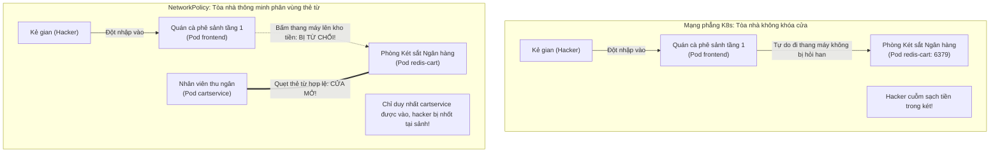
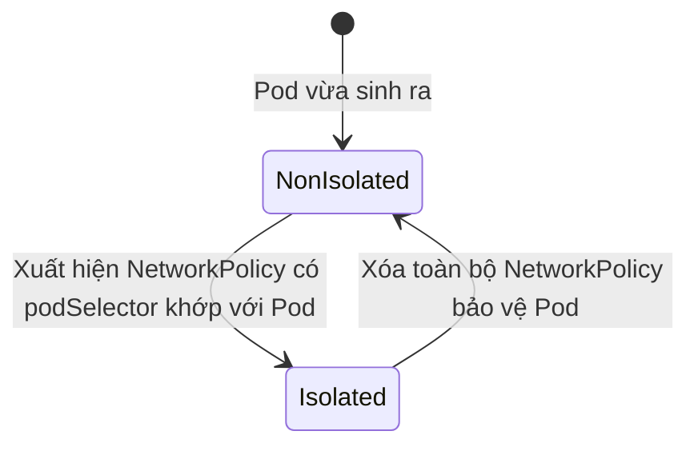

# Bài 22: NetworkPolicy: Tường lửa cô lập mạng nội bộ theo Zero Trust

## 1. Thông tin bài học
* **Tên bài:** Bài 22: NetworkPolicy: Tường lửa cô lập mạng nội bộ theo Zero Trust
* **Mục tiêu học:** Hiểu sâu sắc triết lý an ninh mạng Zero Trust ("Không tin tưởng bất kỳ ai, luôn luôn xác thực và kiểm soát"); nhận diện lỗ hổng bảo mật chết người của mô hình mạng phẳng mặc định trong Kubernetes; làm chủ đối tượng tài nguyên `NetworkPolicy` để thiết lập tường lửa phân vùng vi mô (Micro-segmentation); phân biệt rạch ròi hai chiều lưu lượng `Ingress` (chiều vào) và `Egress` (chiều ra); thành thạo 3 loại bộ chọn lọc (`podSelector`, `namespaceSelector`, `ipBlock`) và phân biệt chính xác logic AND / OR trong YAML; thực hành xây dựng chính sách phòng thủ bảo vệ cơ sở dữ liệu `redis-cart` của Online Boutique: chỉ cho phép duy nhất `cartservice` truy cập, chặn đứng 100% các cuộc tấn công di chuyển ngang (Lateral Movement) từ `frontend`.
* **Thời lượng ước tính:** 150 phút (75 phút lý thuyết, 75 phút thực hành)
* **Kiến thức cần có trước:** Bài 07 (Labels, Selectors & Annotations), Bài 10 (Service: Cầu nối mạng bền vững), Bài 11 (Namespace: Phân chia không gian làm việc), Bài 18 (Mô hình mạng phẳng & CNI).
* **Liên quan kỳ thi:** CKA, CKAD, CKS (Trọng tâm bảo mật mạng tối cao: chiếm 15–20% đề thi CKS và thường xuyên xuất hiện trong CKA/CKAD với các yêu cầu: viết NetworkPolicy cô lập namespace, tạo chính sách Default Deny, cho phép truy cập DNS CoreDNS trên cổng UDP 53, và mở luồng giao tiếp có điều kiện giữa các dịch vụ).

---

## 2. Bảng thuật ngữ

| Thuật ngữ | Giải thích đơn giản | Ví dụ / Ẩn dụ đời thường |
| :--- | :--- | :--- |
| **NetworkPolicy (netpol)** | Đối tượng API đóng vai trò như một chiếc tường lửa ảo (Firewall) kiểm soát luồng gói tin ra/vào giữa các Pod dựa trên IP và nhãn Labels. | Chốt bảo vệ an ninh và cổng quét thẻ từ đặt trước cửa từng phòng ban trong một tòa nhà bí mật. |
| **Zero Trust Architecture** | Triết lý bảo mật hiện đại: mặc định không tin tưởng bất kỳ thiết bị hay tiến trình nào, kể cả khi chúng đang chạy chung trong mạng nội bộ. | Quy chế ngân hàng: nhân viên dù đã bước qua cửa chính của tòa nhà thì khi vào kho tiền vẫn phải quét vân tay và xuất trình giấy phép riêng. |
| **Non-isolated (Chưa cô lập)** | Trạng thái mặc định của Pod khi chưa có NetworkPolicy nào áp dụng: Pod chấp nhận 100% mọi kết nối từ bất kỳ đâu gửi tới. | Căn nhà mở toang cửa chính, ai đi ngang qua cũng có thể bước vào phòng khách mà không bị hỏi han. |
| **Isolated (Bị cô lập)** | Trạng thái của Pod ngay khi có ít nhất một NetworkPolicy chọn trúng nó: Pod lập tức đóng toàn bộ cửa và chỉ mở cho các nguồn được liệt kê tường minh. | Căn nhà khóa trái cửa sắt 24/7, chỉ mở cửa cho những người thân có tên trong danh sách khách mời. |
| **Ingress Traffic (Mạng)** | Toàn bộ luồng dữ liệu mạng **đi vào** Pod (từ client, từ Pod khác hoặc từ internet). | Khách bấm chuông xin vào thăm nhà bạn. |
| **Egress Traffic (Mạng)** | Toàn bộ luồng dữ liệu mạng **đi ra** từ Pod (kết nối ra cơ sở dữ liệu, ra CoreDNS hoặc gọi API bên ngoài). | Bạn mở cửa bước chân ra khỏi nhà để đi chợ. |
| **Lateral Movement (Di chuyển ngang)** | Kỹ thuật của hacker: sau khi chiếm được một Pod ít quan trọng (như frontend), hacker dùng nó làm bàn đạp để tấn công sang cơ sở dữ liệu nội bộ. | Kẻ trộm đột nhập vào quán cà phê ở tầng trệt, sau đó cạy cửa thang máy để lẻn lên phòng tài vụ ở tầng thượng. |
| **CNI Enforcer** | Plugin CNI có hỗ trợ thực thi NetworkPolicy bằng cách dịch các quy tắc thành iptables, IP sets hoặc eBPF trên máy chủ (như Calico, Cilium). | Đội ngũ vệ sĩ tuần tra thực tế kiểm tra thẻ căn cước tại từng cửa ra vào. |

---

## 3. Bức tranh lớn: Vấn đề thực tế và ẩn dụ đời thường

### Nhắc lại bài trước
Ở Bài 21, chúng ta đã nắm vững Gateway API để định tuyến lưu lượng từ bên ngoài vào các microservices nội bộ. Tuy nhiên, khi một gói tin đã vượt qua cửa ngõ Gateway và đặt chân vào bên trong cluster, nó sẽ đối mặt với mô hình mạng phẳng của Kubernetes (Bài 18). Ở Bài 18, chúng ta biết rằng: **Mọi Pod đều có một IP riêng và mọi Pod có thể kết nối trực tiếp với nhau mà không qua NAT**. Tiện lợi này lại chính là cơn ác mộng bảo mật tồi tệ nhất!

### Tại sao cần cái này ở production? (Vấn đề thực tế)

1. **Lỗ hổng chết người của Mạng phẳng mặc định:**
   Mặc định trong Kubernetes, **hoàn toàn KHÔNG CÓ bất kỳ rào chắn mạng nội bộ nào**! Một Pod chứa mã nguồn `frontend` có thể thoải mái gửi gói tin tới Pod chứa cơ sở dữ liệu `redis-cart` hay cơ sở dữ liệu thanh toán `payment-db`.
2. **Kịch bản tấn công di chuyển ngang (Lateral Movement Attack):**
   Trong thực tế, dịch vụ `frontend` là nơi hứng chịu nhiều rủi ro nhất vì nó mở cửa đón nhận hàng triệu người dùng từ Internet. Nếu một hacker tìm ra một lỗ hổng bảo mật (ví dụ: lỗi Remote Code Execution trong thư viện Node.js/PHP của frontend) và chiếm quyền điều khiển container frontend:
   * Nếu không có NetworkPolicy: Hacker sẽ mở terminal bên trong Pod frontend, cài đặt công cụ quét cổng mạng (`nmap`), quét toàn bộ dải mạng phẳng `10.244.0.0/16` của cluster, tìm thấy cổng `6379` của `redis-cart` và cổng `5432` của Postgres, sau đó đánh cắp toàn bộ cơ sở dữ liệu thẻ tín dụng của khách hàng!
   * Có NetworkPolicy: Khi hacker thử kết nối từ frontend sang `redis-cart`, gói tin bị kernel Linux âm thầm vứt bỏ (Drop) ngay lập tức! Cuộc tấn công bị chặn đứng tại chỗ và hacker bị cô lập hoàn toàn.
3. **Tiêu chuẩn an toàn thông tin bắt buộc (PCI-DSS / HIPAA / ISO 27001):**
   Mọi hệ thống thanh toán tài chính xử lý thẻ tín dụng đều bắt buộc phải tuân thủ tiêu chuẩn **PCI-DSS Mục 1.3**: *"Nghiêm cấm các máy chủ giao tiếp trực tiếp từ Internet được kết nối trực tiếp vào cơ sở dữ liệu lưu trữ thông tin chủ thẻ"*. Nếu bạn không cấu hình NetworkPolicy trong Kubernetes, hệ thống của bạn sẽ trượt kỳ đánh giá bảo mật ngay từ vòng đầu tiên!

**Triết lý Zero Trust trong Kubernetes:**
> **"Không tin tưởng bất kỳ ai, kể cả khi chúng chạy chung một máy chủ! Mặc định chặn đứng toàn bộ lưu lượng mạng nội bộ (Default Deny), chỉ mở đúng cổng và đúng Pod có thẩm quyền nghiệp vụ hợp lệ!"**

### Ẩn dụ đời thường: Tòa nhà văn phòng mở và Tòa nhà thông minh có thẻ từ



1. **Mạng phẳng Kubernetes giống như Tòa nhà mở toang cửa:**
   * Một tòa nhà văn phòng cao 20 tầng không có bất kỳ cánh cửa khóa nào.
   * Khách vãng lai bước vào uống cà phê ở tầng 1 (frontend). Uống xong, người này tự ý đi thang máy lên tầng 15, đẩy cửa bước vào phòng Kế toán và mở két sắt xem sổ sách mà không có ai ngăn cản.
2. **NetworkPolicy giống như Khách sạn 5 sao có thẻ từ phân tầng thang máy:**
   * Khách thuê phòng ở tầng 3 quẹt thẻ từ chỉ có thể bấm thang máy lên đúng tầng 3. Thang máy từ chối nhận lệnh lên tầng khác.
   * Cửa phòng server và phòng két sắt có đầu đọc thẻ sinh trắc học riêng. Chỉ có đúng thẻ của nhân viên quản trị (`cartservice`) mới mở được cửa vào phòng `redis-cart`. Kẻ trộm ở quán cà phê tầng 1 hoàn toàn bất lực!

---

## 4. Giải thích khái niệm theo từng bước

### Bước 1: Trạng thái của Pod: Non-isolated vs Isolated

Cơ chế kích hoạt tường lửa của Kubernetes hoạt động theo nguyên lý "Công tắc an toàn":



1. **Khi chưa có NetworkPolicy:** Pod ở trạng thái **Non-isolated**. Tất cả mọi lưu lượng Ingress và Egress đều được cho phép tự do.
2. **Ngay khi có NetworkPolicy đầu tiên chọn trúng Pod:** Pod lập tức chuyển sang trạng thái **Isolated**. 
   * Toàn bộ lưu lượng mạng chiều Ingress (hoặc Egress tùy khai báo) sẽ bị **CHẶN ĐỨNG HOÀN TOÀN (Drop)**!
   * Chỉ những gói tin nào thỏa mãn danh sách cho phép (Allowlist) được định nghĩa trong khối `ingress:` mới được phép đi qua!

> ⚠️ **ĐẶC ĐIỂM SỐNG CÒN:** NetworkPolicy hoạt động theo cơ chế **Danh sách trắng (Allowlist / Additive)**, KHÔNG PHẢI Danh sách đen (Denylist). Bạn không thể tạo một quy tắc "chặn riêng Pod A", mà bạn tạo quy tắc "chỉ cho phép Pod B, tất cả những ai khác ngoài B đều bị chặn"!

---

### Bước 2: Cấu trúc của một NetworkPolicy Manifest chuẩn

Một tài nguyên `NetworkPolicy` thuộc nhóm API `networking.k8s.io/v1` và là tài nguyên cấp **Không gian tên (Namespaced)**:

```yaml
apiVersion: networking.k8s.io/v1
kind: NetworkPolicy
metadata:
  name: secure-redis-cart-netpol
  namespace: default
spec:
  # 1. Chọn nhóm Pod đích chịu sự bảo vệ của chính sách này
  podSelector:
    matchLabels:
      app: redis-cart

  # 2. Xác định phạm vi bảo vệ: Chiều vào (Ingress), Chiều ra (Egress) hoặc cả hai
  policyTypes:
    - Ingress
    - Egress

  # 3. Danh sách cho phép Chiều vào (Ingress Rules)
  ingress:
    - from:
        # Chỉ chấp nhận gói tin từ các Pod mang nhãn app=cartservice
        - podSelector:
            matchLabels:
              app: cartservice
      ports:
        - protocol: TCP
          port: 6379  # Chỉ mở đúng cổng Redis

  # 4. Danh sách cho phép Chiều ra (Egress Rules)
  egress:
    - to:
        # Cho phép gửi dữ liệu ra bên ngoài dải mạng sao lưu (ví dụ máy chủ backup)
        - ipBlock:
            cidr: 192.168.1.0/24
      ports:
        - protocol: TCP
          port: 8080
```

---

### Bước 3: Ba loại bộ chọn trong `from` và `to`

Một quy tắc Ingress/Egress có thể xác định nguồn gửi/đích đến bằng 3 công cụ lọc:

1. **`podSelector`:** Lọc các Pod theo nhãn Labels nằm trong **CÙNG Namespace** với NetworkPolicy.
2. **`namespaceSelector`:** Lọc toàn bộ các Pod nằm trong các Namespace có nhãn Labels chỉ định.
3. **`ipBlock`:** Lọc theo dải địa chỉ IP thực tế (CIDR), thường dùng để kiểm soát lưu lượng đi ra Internet hoặc kết nối tới các máy chủ On-premise ngoài cluster. Có thể dùng thuộc tính `except` để loại trừ các IP nhạy cảm.

---

### Bước 4: Bẫy cú pháp YAML kinh điển: Phân biệt AND vs OR

Đây là câu hỏi bẫy xuất hiện trong 100% các kỳ thi CKS và phỏng vấn Platform Engineer:

#### 1. Logic OR (Hai phần tử mảng riêng biệt có dấu gạch ngang `-`):
```yaml
from:
  - namespaceSelector:
      matchLabels:
        env: prod
  - podSelector:
      matchLabels:
        app: frontend
```
* **Ý nghĩa (OR):** Cho phép gói tin đến từ:  
  **BẤT KỲ Pod nào** nằm trong namespace có nhãn `env=prod` **HOẶC**  
  Bất kỳ Pod nào có nhãn `app=frontend` nằm trong **namespace hiện tại**!

#### 2. Logic AND (Cùng nằm trong MỘT phần tử mảng duy nhất):
```yaml
from:
  - namespaceSelector:
      matchLabels:
        env: prod
    podSelector:
      matchLabels:
        app: frontend
```
* **Ý nghĩa (AND):** Chỉ cho phép gói tin đến từ:  
  Các Pod mang nhãn `app=frontend` **VÀ ĐỒNG THỜI** phải nằm trong namespace mang nhãn `env=prod`!

---

### Bước 5: Mẫu thiết kế chuẩn: "Default Deny All" và Quy tắc cứu rỗi CoreDNS

Ở môi trường production bảo mật cao, các kỹ sư thường áp dụng chính sách khóa chặt toàn bộ cửa trước khi mở từng dịch vụ:

#### 1. Khóa toàn bộ chiều vào và chiều ra của Namespace (Default Deny All):
```yaml
apiVersion: networking.k8s.io/v1
kind: NetworkPolicy
metadata:
  name: default-deny-all
  namespace: default
spec:
  podSelector: {} # Chọn toàn bộ mọi Pod trong namespace!
  policyTypes:
    - Ingress
    - Egress
```
*(Không khai báo khối `ingress:` và `egress:`, đồng nghĩa với việc chặn sạch 100% mọi gói tin!)*

#### 2. Cứu rỗi CoreDNS (Cho phép Egress tới cổng 53):
Khi bạn khóa Egress bằng Default Deny, các Pod sẽ bị **mất hoàn toàn khả năng phân giải DNS** (Bài 19) và không thể gọi được bất kỳ tên miền nào! Bạn bắt buộc phải tạo một chính sách cho phép Egress ra CoreDNS:

```yaml
apiVersion: networking.k8s.io/v1
kind: NetworkPolicy
metadata:
  name: allow-dns-egress
  namespace: default
spec:
  podSelector: {}
  policyTypes:
    - Egress
  egress:
    - to:
        - namespaceSelector: {}
          podSelector:
            matchLabels:
              k8s-app: kube-dns
      ports:
        - protocol: UDP
          port: 53
        - protocol: TCP
          port: 53
```

---

## 5. Thực hành (Lab)

* **Môi trường:** Cụm kind (`k8s\kind-config.yaml`) gồm 1 control-plane và 1 worker.
* **Mức RAM ước tính:** ~130 MB (chạy 1 Redis và 2 Pod công cụ alpine siêu nhẹ).

### Kịch bản thực hành:
1. Triển khai 3 dịch vụ mô phỏng luồng thương mại điện tử Online Boutique trong namespace `default`:
   * `redis-cart` (Database giỏ hàng, lắng nghe cổng 6379, mang nhãn `app: redis-cart`).
   * `cartservice` (Dịch vụ giỏ hàng hợp lệ, mang nhãn `app: cartservice`).
   * `frontend` (Giao diện web người dùng, mang nhãn `app: frontend`).
2. Kiểm tra khi chưa có tường lửa: Cả `cartservice` và `frontend` đều kết nối thành công vào cổng 6379 của `redis-cart` (Lỗ hổng mạng phẳng!).
3. Áp dụng NetworkPolicy `isolate-redis-cart`: Thiết lập Zero Trust chỉ cho phép duy nhất các Pod có nhãn `app: cartservice` được gửi gói tin vào cổng 6379 của `redis-cart`.
4. Kiểm chứng tính năng:
   * `cartservice` kết nối thành công vào Redis trong 0.1 giây!
   * `frontend` bị tường lửa chặn đứng hoàn toàn (Connection timed out)!
5. Dọn dẹp tài nguyên (Cleanup).

---

### Bước 1: Khởi tạo 3 Pod mô phỏng hệ thống Online Boutique

Tạo file manifest `boutique-netpol-pods.yaml`:

```powershell
@'
# 1. Cơ sở dữ liệu giỏ hàng Redis
apiVersion: v1
kind: Pod
metadata:
  name: redis-cart
  namespace: default
  labels:
    app: redis-cart
spec:
  containers:
    - name: redis
      image: redis:7-alpine
      ports:
        - containerPort: 6379
---
# 2. Dịch vụ hợp lệ: Cartservice
apiVersion: v1
kind: Pod
metadata:
  name: cartservice-client
  namespace: default
  labels:
    app: cartservice
spec:
  containers:
    - name: client
      image: alpine:latest
      command: ["sh", "-c", "apk add --no-cache redis >/dev/null 2>&1; sleep 3600"]
---
# 3. Dịch vụ có nguy cơ: Frontend
apiVersion: v1
kind: Pod
metadata:
  name: frontend-attacker
  namespace: default
  labels:
    app: frontend
spec:
  containers:
    - name: client
      image: alpine:latest
      command: ["sh", "-c", "apk add --no-cache redis >/dev/null 2>&1; sleep 3600"]
'@ | Set-Content -Path .\boutique-netpol-pods.yaml -Encoding UTF8

kubectl apply -f .\boutique-netpol-pods.yaml
kubectl wait --for=condition=Ready pod/redis-cart pod/cartservice-client pod/frontend-attacker --timeout=60s
```

Lấy địa chỉ IP của Pod `redis-cart`:
```powershell
$redisIP = (kubectl get pod redis-cart -o jsonpath='{.status.podIP}')
Write-Output "Địa chỉ IP của redis-cart là: $redisIP"
```

---

### Bước 2: Kiểm chứng hiện trạng Mạng phẳng (Chưa có tường lửa)

Thử kết nối từ `cartservice-client` tới `redis-cart`:
```powershell
kubectl exec cartservice-client -- redis-cli -h $redisIP ping
```
Output: `PONG` (Thành công!).

Thử kết nối từ `frontend-attacker` tới `redis-cart`:
```powershell
kubectl exec frontend-attacker -- redis-cli -h $redisIP ping
```
Output: `PONG` (Thành công!).

> ⚠️ **BÁO ĐỘNG AN NINH:** Cả `frontend` cũng truy cập được thẳng vào cơ sở dữ liệu giỏ hàng! Đây chính là lỗ hổng mạng phẳng nghiêm trọng cần khắc phục.

---

### Bước 3: Áp dụng NetworkPolicy bảo vệ `redis-cart`

Tạo file manifest `secure-redis-policy.yaml`:

```powershell
@'
apiVersion: networking.k8s.io/v1
kind: NetworkPolicy
metadata:
  name: allow-only-cartservice-to-redis
  namespace: default
spec:
  # Áp dụng chính sách này riêng cho Pod redis-cart
  podSelector:
    matchLabels:
      app: redis-cart
  policyTypes:
    - Ingress
  ingress:
    # Chỉ cho phép duy nhất các Pod có nhãn app=cartservice
    - from:
        - podSelector:
            matchLabels:
              app: cartservice
      ports:
        - protocol: TCP
          port: 6379
'@ | Set-Content -Path .\secure-redis-policy.yaml -Encoding UTF8

kubectl apply -f .\secure-redis-policy.yaml
```

Kiểm tra NetworkPolicy vừa tạo:
```powershell
kubectl get networkpolicy allow-only-cartservice-to-redis
```

#### Kết quả mong đợi (Expected Output):
```text
NAME                              POD-SELECTOR     AGE
allow-only-cartservice-to-redis   app=redis-cart   5s
```

---

### Bước 4: Kiểm chứng hiệu lực Tường lửa Zero Trust

Bây giờ chúng ta sẽ thực hiện lại bài kiểm tra kết nối từ cả hai Pod:

#### 1. Kiểm tra từ Pod hợp lệ (`cartservice-client`):
```powershell
kubectl exec cartservice-client -- redis-cli -h $redisIP ping
```
#### Kết quả mong đợi:
```text
PONG
```
✅ **Thành công rực rỡ:** `cartservice` vẫn kết nối bình thường, độ trễ không hề suy giảm!

#### 2. Kiểm tra từ Pod `frontend-attacker` (Giả lập hacker):
```powershell
kubectl exec frontend-attacker -- redis-cli -h $redisIP --connect-timeout 3 ping
```
#### Kết quả mong đợi:
```text
Could not connect to Redis at 10.244.1.25:6379: Connection timed out
```
🎉 **Chiến thắng bảo mật tuyệt đối!**  
Lệnh kết nối từ `frontend` lập tức bị treo và báo lỗi `Connection timed out`! Gói tin TCP SYN gửi đi từ frontend đã bị nhân Linux âm thầm vứt bỏ (Drop) ngay tại cửa ngõ của `redis-cart`. Cuộc tấn công di chuyển ngang đã bị chặn đứng hoàn toàn!

---

### Bước 5: Dọn dẹp tài nguyên (Cleanup)

```powershell
kubectl delete -f .\secure-redis-policy.yaml
kubectl delete -f .\boutique-netpol-pods.yaml
Remove-Item .\secure-redis-policy.yaml, .\boutique-netpol-pods.yaml
```

---

## 6. Lỗi thường gặp và cách debug

### Lỗi 1: Áp dụng NetworkPolicy thành công nhưng không có bất kỳ tác dụng nào!
* **Dấu hiệu:** Bạn đã viết NetworkPolicy đúng 100% cú pháp, nhưng Pod bị chặn vẫn gửi gói tin và kết nối vào ầm ầm như chưa từng có tường lửa!
* **Nguyên nhân cốt lõi (Cực kỳ phổ biến):** **Plugin CNI đang cài đặt trong cluster HOÀN TOÀN KHÔNG HỖ TRỢ NetworkPolicy!** Như đã học ở Bài 18, các CNI siêu nhẹ như Flannel thuần túy hoặc một số CNI mặc định không tích hợp bộ thực thi tường lửa (NetworkPolicy Enforcer). Kubernetes API Server vẫn vui vẻ tiếp nhận manifest NetworkPolicy của bạn và lưu vào etcd, nhưng không có ai ở máy chủ đứng ra thực thi các quy tắc đó!
* **Cách khắc phục:** Cài đặt hoặc chuyển đổi sang các CNI plugin có hỗ trợ đầy đủ NetworkPolicy chuẩn CKA/CKS như **Calico**, **Cilium**, hoặc **Kube-router**.

### Lỗi 2: Pod bị tê liệt hoàn toàn (Không gọi được API nào) sau khi áp dụng Default Deny Egress
* **Dấu hiệu:** Ứng dụng đột ngột không thể kết nối tới bất kỳ đâu, các lệnh `curl` báo lỗi `Could not resolve host` hoặc `i/o timeout`.
* **Nguyên nhân:** Khi bạn khóa chiều Egress, bạn đã vô tình chặn đứng luôn cổng `53 UDP/TCP` dẫn tới CoreDNS (Bài 19)! Ứng dụng không thể phân giải tên miền nên toàn bộ hệ thống bị sập.
* **Cách sửa:** Luôn tạo kèm một chính sách Egress mở cổng 53 tới các Pod mang nhãn `k8s-app: kube-dns` trong namespace `kube-system`.

### Lỗi 3: Khớp nhầm toàn bộ namespace do quên thụt lề YAML (Lỗi OR thay vì AND)
* **Dấu hiệu:** Bạn chỉ muốn cho phép Pod `frontend` trong namespace `prod` kết nối, nhưng thực tế toàn bộ mọi Pod trong namespace `prod` (kể cả Pod test bừa bãi) đều kết nối được.
* **Nguyên nhân:** Bạn đặt dấu gạch ngang `-` trước cả `namespaceSelector` và `podSelector`, biến điều kiện logic từ phép VÀ (**AND**) thành phép HOẶC (**OR**)!

---

## 7. Góc nhìn Senior

### 1. Sự đánh đổi (Trade-offs): NetworkPolicy vs Service Mesh AuthorizationPolicy

| Tiêu chí | Kubernetes Native NetworkPolicy | Service Mesh (Istio / Linkerd AuthorizationPolicy) |
| :--- | :--- | :--- |
| **Tầng mạng kiểm soát** | **Layer 3 và Layer 4** (Chỉ kiểm tra IP, Port, Giao thức TCP/UDP). | **Layer 7** (Kiểm tra sâu HTTP Method GET/POST, URL Path `/api/pay`, Header, JWT Claims). |
| **Xác thực danh tính** | Dựa trên Labels của Pod và Namespace (có thể bị giả mạo nếu gán nhầm nhãn). | Dựa trên mã hóa **mTLS (Mutual TLS) và Chứng chỉ số X.509** gắn với ServiceAccount. |
| **Tài nguyên tiêu tốn** | Cực kỳ nhẹ; thực thi trực tiếp bằng iptables/eBPF trong nhân Linux, không tốn RAM. | Nặng hơn; đòi hỏi chạy Sidecar Proxy (Envoy) bên cạnh từng Pod, tốn RAM và tăng độ trễ 1-2ms. |
| **Khuyến nghị kiến trúc** | **Lớp phòng thủ vòng ngoài bắt buộc** cho mọi cụm Kubernetes production. | Lớp phòng thủ vòng trong bổ sung cho các ứng dụng yêu cầu phân quyền chi tiết tới từng API endpoint. |

### 2. Best practices tại production

1. **Chiến lược áp dụng Zero Trust 3 bước an toàn:**
   Đừng bao giờ nhảy vào cụm production đang chạy và đập ngay chính sách `Default Deny`! Bạn sẽ làm sập toàn bộ dịch vụ của công ty trong 1 giây! Hãy làm theo 3 bước:
   * **Bước 1 (Giám sát / Audit):** Sử dụng các công cụ quan sát mạng eBPF (như Cilium Hubble) để vẽ sơ đồ toàn bộ các luồng mạng thực tế đang chạy giữa các microservices trong 1 tuần.
   * **Bước 2 (Viết chính sách Allowlist):** Viết NetworkPolicy cấp phép đầy đủ cho các luồng mạng đã được kiểm chứng ở Bước 1.
   * **Bước 3 (Khóa cửa / Deny All):** Áp dụng `Default Deny Ingress/Egress` để khóa chặt toàn bộ các luồng giao thông rác còn lại.
2. **Luôn đặt nhãn (Labels) chuẩn hóa cho Namespace:**
   Trong Kubernetes 1.21+, Kubernetes tự động gắn nhãn mặc định cho mọi namespace: `kubernetes.io/metadata.name: <tên-ns>`. Hãy tận dụng nhãn mặc định này trong `namespaceSelector` để viết quy tắc tường lửa chính xác mà không cần phải tự tay gắn nhãn cho namespace.
3. **Quản lý NetworkPolicy tập trung qua GitOps:**
   Toàn bộ file NetworkPolicy phải được lưu trữ trong Git repository và kiểm duyệt chặt chẽ (Pull Request có ít nhất 2 Security Engineer phê duyệt). Nghiêm cấm mọi hành vi gõ lệnh `kubectl edit netpol` trực tiếp trên môi trường production.

### 3. Câu hỏi phỏng vấn Senior

* **Câu hỏi 1:** *"Tại sao Kubernetes lại thiết kế NetworkPolicy theo mô hình Danh sách trắng (Allowlist / Additive) thay vì Danh sách đen (Denylist / Drop rules)? Nguyên lý thiết kế này mang lại lợi thế gì khi nhiều NetworkPolicy cùng áp dụng lên một Pod?"*
* **Gợi ý trả lời chuẩn:**
  1. **Tránh xung đột quy tắc (No Order-dependency):** Trong các tường lửa truyền thống sử dụng Denylist (như iptables cổ điển), thứ tự sắp xếp của các dòng quy tắc từ trên xuống dưới mang tính sống còn (First-match wins). Khi có hàng chục kỹ sư cùng chỉnh sửa tường lửa, việc thêm một quy tắc Deny ở sai vị trí có thể vô tình ghi đè và làm hỏng toàn bộ các quy tắc khác.
  2. **Cơ chế cộng gộp an toàn (Additive / Union):** Với mô hình Allowlist của Kubernetes, **quy tắc chỉ có mở thêm, không có đóng bớt**. Nếu Pod A chịu sự chi phối của 3 NetworkPolicy khác nhau:
     * Policy 1 cho phép lưu lượng từ `cartservice`.
     * Policy 2 cho phép lưu lượng từ `paymentservice`.
     * Policy 3 cho phép lưu lượng từ cổng giám sát Prometheus.
     Kubernetes sẽ thực hiện **phép HỢP (Union)** của cả 3 chính sách: Pod A sẽ chấp nhận lưu lượng từ cả 3 nguồn trên! Các đội nhóm phát triển có thể độc lập viết policy cho dịch vụ của mình mà không sợ chính sách của mình vô tình chặn mất lưu lượng của đội nhóm khác.

* **Câu hỏi 2:** *"Một lập trình viên phàn nàn rằng sau khi áp dụng chính sách NetworkPolicy Deny Egress, ứng dụng của họ bị lỗi CrashLoopBackOff vì không thể kết nối tới cơ sở dữ liệu AWS RDS nằm ngoài cụm. Hãy phân tích các nguyên nhân tiềm ẩn và hướng xử lý chuẩn mực?"*
* **Gợi ý trả lời chuẩn:**
  1. **Nguyên nhân 1 (DNS bị chặn):** Ứng dụng kết nối tới RDS qua tên miền endpoint (ví dụ `mydb.xxxx.us-east-1.rds.amazonaws.com`). Vì Egress bị chặn, Pod không thể gửi gói tin tới CoreDNS (Port 53) để giải mã tên miền, dẫn đến lỗi kết nối ngay từ bước đầu tiên.
  2. **Nguyên nhân 2 (Chưa mở luồng ra IP của RDS):** Dù đã mở DNS, gói tin TCP gửi tới cổng 5432 của máy chủ RDS vẫn bị chặn vì nằm ngoài cụm.
  3. **Hướng xử lý chuẩn mực:** Cấu hình một NetworkPolicy bổ sung cho Pod:
     * Khối Egress 1: Mở cổng 53 UDP/TCP tới namespace `kube-system` (cho CoreDNS).
     * Khối Egress 2: Sử dụng `ipBlock` khai báo dải CIDR của VPC chứa AWS RDS (ví dụ `10.0.0.0/16`) trên cổng `5432` của PostgreSQL.

---

## 8. Tóm tắt bài học

* 📌 **1. Triết lý Zero Trust:** Xóa bỏ sự ngây thơ của mạng phẳng; mặc định coi mọi Pod nội bộ đều có nguy cơ bị xâm nhập và cần được cô lập.
* 📌 **2. Công tắc an toàn Isolated:** Pod chuyển sang trạng thái bị cô lập ngay khi có ít nhất một NetworkPolicy chọn trúng nó; toàn bộ lưu lượng không được phép sẽ bị vứt bỏ (Drop).
* 📌 **3. Mô hình Allowlist cộng gộp:** Mọi quy tắc trong NetworkPolicy đều mang tính chất "mở thêm quyền"; nhiều policy cùng chọn một Pod sẽ được hợp nhất danh sách cho phép.
* 📌 **4. Ba công cụ lọc linh hoạt:** `podSelector` (trong cùng NS), `namespaceSelector` (lọc theo nhãn NS), và `ipBlock` (lọc dải IP bên ngoài).
* 📌 **5. Quy tắc vàng Production:** Khóa toàn bộ bằng Default Deny, luôn mở Egress cổng 53 cho CoreDNS, và thực thi kiểm soát chặt chẽ qua CNI hỗ trợ (Calico/Cilium).

---

## 9. Bài tập tự làm

* 🟢 **Mức Dễ:** Viết một NetworkPolicy mang tên `deny-all-ingress` áp dụng cho toàn bộ các Pod trong namespace `test-isolation` để chặn đứng toàn bộ lưu lượng chiều vào, nhưng cho phép toàn bộ lưu lượng chiều ra hoạt động bình thường.
* 🟡 **Mức Vừa (Bảo vệ Database có kiểm soát DNS):** Tạo một Pod chạy `postgres:alpine` mang nhãn `app: secure-db`. Viết NetworkPolicy sao cho: (1) Chỉ cho phép Ingress cổng 5432 từ các Pod có nhãn `role: backend`; (2) Khóa toàn bộ Egress ngoại trừ việc gửi gói tin UDP/TCP cổng 53 tới CoreDNS.
* 🔴 **Mức Khó (Lọc chéo Namespace với logic AND):** Tạo 2 namespace: `app-frontend` và `app-backend`. Viết NetworkPolicy đặt tại `app-backend` sao cho chỉ cho phép các Pod có nhãn `tier: web` VÀ ĐỒNG THỜI phải nằm trong namespace `app-frontend` mới được phép kết nối tới cổng 8080 của backend. Dùng lệnh `kubectl exec` từ cả 2 namespace để chứng minh tính đúng đắn của logic AND.

---

## 10. Câu hỏi tự kiểm tra

1. Nếu một cụm Kubernetes hoàn toàn chưa được cấu hình bất kỳ NetworkPolicy nào, hành vi mạng mặc định giữa hai Pod bất kỳ trong cluster là gì?
2. Khi một Pod được chọn bởi ít nhất một NetworkPolicy, trạng thái mạng của nó chuyển từ gì sang gì?
3. Tại sao nói NetworkPolicy hoạt động theo cơ chế Danh sách trắng (Allowlist) chứ không phải Danh sách đen (Denylist)?
4. Trong cú pháp YAML của NetworkPolicy, làm thế nào để phân biệt giữa điều kiện logic "Pod A HOẶC Namespace B" so với điều kiện "Pod A VÀ Namespace B"?
5. Nếu bạn áp dụng một chính sách chặn toàn bộ chiều ra (Default Deny Egress) cho một Pod, tại sao Pod đó lại bị mất khả năng gọi tới các tên miền dịch vụ nội bộ?
6. Yêu cầu tiên quyết về mặt hạ tầng (Infrastructure Requirement) để NetworkPolicy có thể hoạt động thực tế trên cụm Kubernetes là gì?

<details>
<summary>👉 Bấm vào đây để xem đáp án câu hỏi tự kiểm tra</summary>

* **Đáp án 1:** Là **hoàn toàn mở tự do (Non-isolated)**; bất kỳ Pod nào cũng có thể gửi và nhận gói tin trực tiếp tới bất kỳ Pod nào khác trong toàn bộ cluster.
* **Đáp án 2:** Chuyển từ trạng thái **Non-isolated** sang trạng thái **Isolated (Bị cô lập)**; toàn bộ lưu lượng không được khai báo tường minh trong danh sách cho phép sẽ bị chặn ngay lập tức.
* **Đáp án 3:** Vì Kubernetes mặc định chặn mọi thứ khi Pod bị cô lập và chỉ cho phép những gì được liệt kê; nhiều policy cùng chọn một Pod sẽ cộng gộp các quyền cho phép lại với nhau (Union), không có quy tắc nào mang tính chất "chặn phủ quyết".
* **Đáp án 4:** Đặt ở hai phần tử mảng riêng biệt có dấu gạch ngang `-` là phép **HOẶC (OR)**; đặt cùng trong một phần tử mảng duy nhất (cùng thụt lề dưới 1 dấu `-`) là phép **VÀ (AND)**.
* **Đáp án 5:** Vì cổng `53 UDP/TCP` dẫn tới máy chủ CoreDNS cũng là lưu lượng chiều Egress; khi bị chặn, Pod không thể gửi truy vấn DNS để giải mã tên miền.
* **Đáp án 6:** Cụm Kubernetes **bắt buộc phải cài đặt một CNI plugin có hỗ trợ thực thi NetworkPolicy** (như Calico, Cilium, Kube-router); nếu dùng CNI không hỗ trợ (như Flannel thuần túy), NetworkPolicy sẽ vô hiệu hoàn toàn.
</details>

---

## 11. Tài liệu đọc thêm và bài tiếp theo

### Tài liệu tham khảo
* [Tài liệu chính thức Kubernetes: Network Policies](https://kubernetes.io/docs/concepts/services-networking/network-policies/)
* [Tài liệu thực hành: Declare Network Policy](https://kubernetes.io/docs/tasks/administer-cluster/declare-network-policy/)
* [Công cụ trực quan hóa Network Policy: Kubernetes Network Policy Editor (Cilium)](https://editor.networkpolicy.io/)
* [Bảo mật Zero Trust trong Kubernetes](https://kubernetes.io/docs/concepts/security/multi-tenancy/)

### Bài tiếp theo
👉 **Bài 23: Debug sự cố mạng: Phương pháp luận từ Pod đến Node**

---

## PHỤ LỤC: ĐÁP ÁN GỢI Ý BÀI TẬP TỰ LÀM (MỤC 9)

### Đáp án Mức Dễ
```powershell
@'
apiVersion: networking.k8s.io/v1
kind: NetworkPolicy
metadata:
  name: deny-all-ingress
  namespace: test-isolation
spec:
  podSelector: {} # Áp dụng cho mọi Pod trong namespace test-isolation
  policyTypes:
    - Ingress
  # Bỏ trống khối ingress đồng nghĩa với việc chặn 100% chiều vào!
'@ | kubectl apply -f -
```

### Đáp án Mức Vừa
```powershell
@'
apiVersion: networking.k8s.io/v1
kind: NetworkPolicy
metadata:
  name: secure-postgres-policy
  namespace: default
spec:
  podSelector:
    matchLabels:
      app: secure-db
  policyTypes:
    - Ingress
    - Egress
  ingress:
    - from:
        - podSelector:
            matchLabels:
              role: backend
      ports:
        - protocol: TCP
          port: 5432
  egress:
    # Mở riêng cổng DNS để Pod phân giải tên miền
    - to:
        - namespaceSelector: {}
          podSelector:
            matchLabels:
              k8s-app: kube-dns
      ports:
        - protocol: UDP
          port: 53
        - protocol: TCP
          port: 53
'@ | kubectl apply -f -
```

### Đáp án Mức Khó
```powershell
# Gắn nhãn cho namespace app-frontend trước
kubectl label namespace app-frontend ns-name=frontend --overwrite

@'
apiVersion: networking.k8s.io/v1
kind: NetworkPolicy
metadata:
  name: allow-frontend-tier-web-only
  namespace: app-backend
spec:
  podSelector:
    matchLabels:
      app: backend-api
  policyTypes:
    - Ingress
  ingress:
    # Logic AND: Cùng nằm trong 1 phần tử mảng duy nhất!
    - from:
        - namespaceSelector:
            matchLabels:
              ns-name: frontend
          podSelector:
            matchLabels:
              tier: web
      ports:
        - protocol: TCP
          port: 8080
'@ | kubectl apply -f -
```

