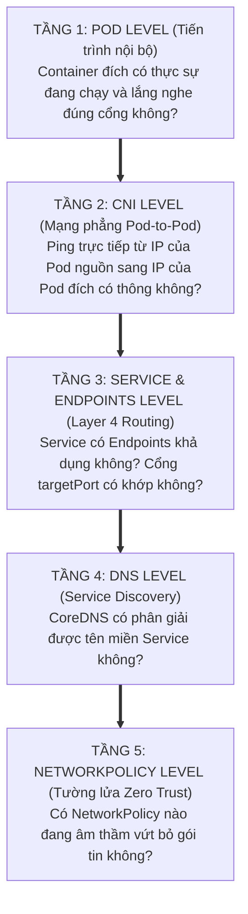

# Bài 23: Debug sự cố mạng: Phương pháp luận từ Pod đến Node

## 1. Thông tin bài học
* **Tên bài:** Bài 23: Debug sự cố mạng: Phương pháp luận từ Pod đến Node
* **Mục tiêu học:** Xây dựng tư duy và phương pháp luận chẩn đoán sự cố mạng có hệ thống (Systematic Network Troubleshooting) từ thấp lên cao; làm chủ phác đồ kiểm tra 5 tầng mạng Kubernetes: Pod $\rightarrow$ CNI $\rightarrow$ Service/Endpoints $\rightarrow$ CoreDNS $\rightarrow$ NetworkPolicy; thành thạo kỹ thuật sử dụng Ephemeral Debug Container (`kubectl debug`) để "tiêm" công cụ phân tích mạng (`curl`, `tcpdump`, `dig`, `nc`) vào các container đóng gói bảo mật (Distroless / Scratch Images); phân biệt rạch ròi bản chất giao thức TCP giữa lỗi `Connection Refused` và `Connection Timed Out`; thực hành giải cứu kịch bản sự cố "đứt kết nối mạng bí ẩn" giả lập trên cụm kind.
* **Thời lượng ước tính:** 180 phút (90 phút lý thuyết, 90 phút thực hành)
* **Kiến thức cần có trước:** Bài 10 (Service: Cầu nối mạng bền vững), Bài 18 (Mô hình mạng phẳng & CNI), Bài 19 (CoreDNS & Service Discovery), Bài 20 (Ingress), Bài 22 (NetworkPolicy: Tường lửa Zero Trust).
* **Liên quan kỳ thi:** CKA, CKS (Kỹ năng sinh tử chiếm 20–25% tổng số điểm trong bài thi CKA và CKS: đề thi luôn có các câu hỏi tình huống thực tế đưa ra một cụm Kubernetes bị tê liệt kết nối mạng và yêu cầu thí sinh điều tra nguyên nhân gốc rễ, sửa lỗi và khôi phục hoạt động trong vòng 10–15 phút).

---

## 2. Bảng thuật ngữ

| Thuật ngữ | Giải thích đơn giản | Ví dụ / Ẩn dụ đời thường |
| :--- | :--- | :--- |
| **Systematic Troubleshooting** | Phương pháp chẩn đoán sự cố có hệ thống theo từng lớp logic, loại trừ dần các khả năng thay vì đoán mò hú họa. | Quy trình khám bệnh chuẩn của bác sĩ: đo huyết áp $\rightarrow$ xét nghiệm máu $\rightarrow$ chụp X-quang $\rightarrow$ nội soi để tìm chính xác ổ bệnh. |
| **Ephemeral Container (`kubectl debug`)** | Container tạm thời được gắn thêm vào Network và Process Namespace của một Pod đang chạy để phục vụ việc chẩn đoán mà không cần restart Pod. | Chiếc xe cứu thương chuyên dụng chở đầy đủ máy móc y tế đỗ sát cạnh hiện trường tai nạn để cấp cứu trực tiếp. |
| **Distroless Image** | Container image siêu tối giản chỉ chứa đúng file nhị phân của ứng dụng, hoàn toàn KHÔNG có shell (`sh`, `bash`), trình quản lý gói (`apt`, `apk`) hay công cụ mạng (`curl`, `ping`). | Một chiếc đồng hồ đeo tay cơ học được niêm phong kín mít: chỉ làm đúng một việc là chạy kim giờ, không thể nhét thêm dụng cụ mở ốc vít vào trong. |
| **`Connection Refused` (RST)** | Phản hồi từ đích đến báo hiệu: Máy chủ vẫn sống, mạng thông suốt, nhưng **KHÔNG CÓ tiến trình nào đang lắng nghe trên cổng mạng đó**. | Bạn đến đúng địa chỉ nhà bạn bè, bấm chuông cửa nhưng người trong nhà mở cửa ra và bảo: "Ở đây không có ai tên như vậy cả!". |
| **`Connection Timed Out` (DROP)** | Hiện tượng gói tin bị rơi vào "hố đen" không có hồi âm: do tường lửa chặn đứng (Drop) hoặc đứt đường truyền vật lý. | Bạn gửi một bức thư nhưng thư bị rơi xuống sông hoặc bị bảo vệ ném vào thùng rác; bạn ngồi chờ mãi mà không bao giờ có hồi âm. |
| **Endpoints / EndpointSlices** | Danh sách địa chỉ IP thực tế và cổng của các Pod đang ở trạng thái sẵn sàng (Ready) được gắn sau một Service. | Bảng danh sách các bác sĩ đang ngồi trực tại các phòng khám; Service là quầy tiếp đón chuyển bệnh nhân vào các phòng này. |
| **Packet Capture (PCAP / tcpdump)** | Kỹ thuật "bắt" và ghi lại toàn bộ các gói tin nhị phân đang chạy qua card mạng để soi chi tiết từng byte dữ liệu. | Máy ghi âm gắn kín ghi lại toàn bộ cuộc hội thoại của hai điệp viên để đem về phòng thí nghiệm phân tích. |

---

## 3. Bức tranh lớn: Vấn đề thực tế và ẩn dụ đời thường

### Nhắc lại bài trước
Ở Bài 22, chúng ta đã học cách thiết lập tường lửa NetworkPolicy để cô lập mạng nội bộ theo triết lý Zero Trust. Tuy nhiên, trong môi trường sản xuất (Production), mạng là thành phần dễ phát sinh sự cố nhất và cũng khó phát hiện nguyên nhân nhất. Khi một lập trình viên hốt hoảng mở ticket khẩn cấp lúc nửa đêm: *"Dịch vụ `frontend` bỗng nhiên không thể gọi sang `cartservice`!"*, bạn sẽ làm gì? 

### Tại sao cần cái này ở production? (Vấn đề thực tế)

1. **Cơn ác mộng "Đoán mò lúc 3 giờ sáng":**
   Các kỹ sư thiếu phương pháp luận thường phản ứng trong hoảng loạn: restart Pod bừa bãi, xóa Service tạo lại, reboot Worker Node... Kết quả: lỗi vẫn hoàn lỗi, dữ liệu có thể bị rách và thời gian gián đoạn dịch vụ (Downtime) kéo dài hàng tiếng đồng hồ làm thiệt hại doanh thu hàng tỷ đồng!
2. **Rào cản của Container hiện đại (Distroless Images):**
   Ở các công ty chuyên nghiệp, toàn bộ Dockerfile đều được đóng gói theo tiêu chuẩn Distroless hoặc Scratch để vượt qua các bài quét mã độc bảo mật (Trivy/Snyk). Hậu quả là khi bạn gõ:  
   `kubectl exec -it <pod-name> -- sh`  
   Hệ thống sẽ lập tức báo lỗi: `OCI runtime exec failed: exec: "sh": executable file not found in $PATH`!  
   Bạn hoàn toàn không có `curl`, `ping`, `nslookup` hay bất kỳ công cụ nào để kiểm tra. Nếu không biết dùng `kubectl debug`, bạn sẽ hoàn toàn "mù chữ" trước hệ thống!
3. **Mạng Kubernetes là một hệ thống phân tán đa tầng phức tạp:**
   Một yêu cầu HTTP gửi từ Pod A tới Pod B phải vượt qua ít nhất **6 chặng trung chuyển**:
   * Chặng 1: Ứng dụng trong Pod A mở kết nối TCP socket.
   * Chặng 2: CoreDNS giải mã tên miền Service thành IP ảo (`ClusterIP`).
   * Chặng 3: Gói tin đi qua Network Namespace và chui qua `veth pair` ra Node (Bài 18).
   * Chặng 4: Tường lửa NetworkPolicy kiểm tra gói tin có được phép Egress/Ingress không (Bài 22).
   * Chặng 5: kube-proxy / iptables dịch chuyển IP ảo thành IP thực tế của Pod B (DNAT).
   * Chặng 6: Ứng dụng trong Pod B tiếp nhận gói tin tại cổng đích.
   Chỉ cần **MỘT TRONG SÁU CHẶNG TRÊN** gặp trục trặc, ứng dụng sẽ chỉ in ra một dòng lỗi cụt ngủn: `Failed to connect`. Bạn bắt buộc phải có phác đồ phân tầng để bắt đúng bệnh!

### Ẩn dụ đời thường: Lang băm bốc thuốc và Bác sĩ chuyên khoa chẩn đoán hình ảnh

```mermaid
flowchart TD
    subgraph GuessworkApproach ["Cách đoán mò: Lang băm chữa bệnh"]
        M1["Bệnh nhân kêu đau bụng\n(frontend không gọi được cartservice)"] --> M2["Uống thuốc đau đầu!\n(Restart bừa bãi Pod)"]
        M2 --> M3["Uống tiếp thuốc đau khớp!\n(Xóa Service tạo lại)"]
        M3 --> M4["Bệnh nhân nguy kịch!\n(Hỏng luôn cả hệ thống)"]
    end

    subgraph SystematicApproach ["Phương pháp SRE chuẩn: Phác đồ 5 tầng loại trừ"]
        S1["Đo huyết áp tầng Pod: Container có listen đúng cổng không?"] --> S2["Chụp X-quang tầng CNI: Ping trực tiếp Pod IP có thông không?"]
        S2 --> S3["Xét nghiệm máu tầng Service: Endpoints có rỗng không?"]
        S3 --> S4["Khám tai mũi họng tầng DNS: nslookup có ra IP không?"]
        S4 --> S5["Nội soi tầng NetworkPolicy: Tường lửa có đang DROP gói tin?"]
        S5 ==> S6["Bắt đúng 100% ổ bệnh và chữa dứt điểm trong 5 phút!"]
    end
```



1. **Kỹ sư đoán mò giống như Lang băm bốc thuốc:**
   * Thấy bệnh nhân kêu sốt thì cho uống thuốc hạ sốt, thấy kêu đau thì xoa dầu. Thử vận may hú họa, nếu may mắn khỏi bệnh thì không hiểu tại sao khỏi, còn nếu không may thì đưa hệ thống vào chỗ chết.
2. **Platform Engineer chuyên nghiệp giống như Bác sĩ phẫu thuật:**
   * Không bao giờ kết luận vội vã. Bác sĩ đi theo phác đồ từng bước một: Kiểm tra sinh hiệu cơ bản $\rightarrow$ Chụp cắt lớp vi tính $\rightarrow$ Định vị chính xác khối u nằm ở đốt sống nào rồi mới ra quyết định cầm dao mổ. Mọi hành động đều dựa trên chứng cứ dữ liệu đo lường cụ thể!

---

## 4. Giải thích khái niệm theo từng bước: Phác đồ 5 tầng chẩn đoán mạng

Khi có sự cố mất kết nối mạng giữa hai microservices trong Kubernetes, hãy luôn tuân thủ nguyên tắc: **Đi từ thấp lên cao (Bottom-up) theo 5 tầng nghiêm ngặt sau:**



---

### Tầng 1: Kiểm tra Pod đích (Target Pod Level)
Trước khi đổ lỗi cho mạng, hãy kiểm tra xem **đích đến có thực sự mở cửa hay không**:
1. Pod đích có đang ở trạng thái `Running` không? Hay đang bị `CrashLoopBackOff`?
2. Tiến trình bên trong Pod đích có thực sự đang lắng nghe (Listen) trên cổng mong đợi không?  
   *Ví dụ:* Ứng dụng Node.js lắng nghe trên cổng `8080`, nhưng bạn lại tưởng là cổng `80`.
3. Kiểm tra log của Pod đích: `kubectl logs <target-pod>`. Có lỗi nạp database hay lỗi thiếu biến môi trường khiến server không thể mở cổng không?

---

### Tầng 2: Kiểm tra CNI và Mạng phẳng (Pod IP to Pod IP)
Bỏ qua toàn bộ Service và DNS, thử kết nối **trực tiếp bằng IP của Pod đích**:
1. Lấy IP của Pod đích: `kubectl get pod <target-pod> -o wide`.
2. Từ Pod nguồn, thực hiện kiểm tra kết nối trực tiếp tới IP đó:
   ```bash
   nc -zv <target-pod-ip> <port>
   # hoặc:
   curl -v http://<target-pod-ip>:<port>
   ```
* **Nếu THẤT BẠI ở bước này:** Vấn đề nằm ở tầng **CNI** (veth pair bị lỗi, routing table của Node bị thiếu dòng định tuyến như đã học ở Bài 18) hoặc do **NetworkPolicy** chặn ngay từ tầng IP.
* **Nếu THÀNH CÔNG ở bước này:** Chúc mừng bạn! Mạng phẳng CNI hoạt động hoàn hảo 100%. Lỗi chắc chắn nằm ở tầng Service hoặc DNS phía trên!

---

### Tầng 3: Kiểm tra Service và Endpoints (Layer 4)
Nếu kết nối trực tiếp vào IP Pod thành công nhưng kết nối vào Service IP thất bại:
1. **Kiểm tra Endpoints của Service:**
   ```powershell
   kubectl get endpoints <service-name>
   ```
   * **Nếu cột `ENDPOINTS` hiển thị `<none>`:** Đây là lỗi phổ biến nhất! Service không tìm thấy Pod nào. Nguyên nhân: `spec.selector` trong file Service YAML không khớp chính xác với `metadata.labels` của Pod!
2. **Kiểm tra sự sai lệch giữa `port` và `targetPort`:**
   * `port`: Cổng của Service mà client gọi vào.
   * `targetPort`: Cổng mà container thực tế đang lắng nghe.  
   Nếu container lắng nghe ở cổng `8080` nhưng `targetPort` bạn khai báo là `80`, kết nối sẽ bị đứt gãy!
3. **Kiểm tra tính sẵn sàng (Readiness Probe):**
   Nếu Pod có nhãn khớp nhưng Pod chưa vượt qua bài kiểm tra Readiness Probe, Kubernetes sẽ tự động gỡ IP của Pod ra khỏi Endpoints!

---

### Tầng 4: Kiểm tra DNS (CoreDNS & Service Discovery)
Nếu kết nối bằng IP của Service thành công nhưng kết nối bằng tên miền `http://cartservice` thất bại:
1. Đăng nhập vào Pod nguồn và tra cứu tên miền:
   ```bash
   nslookup <service-name>
   # Hoặc FQDN đầy đủ:
   nslookup <service-name>.<namespace>.svc.cluster.local
   ```
2. Nếu lệnh báo lỗi `NXDOMAIN` hoặc `i/o timeout`:
   * Kiểm tra xem 2 Pod có nằm khác namespace không (Bài 19).
   * Kiểm tra tệp `/etc/resolv.conf` của Pod xem có trỏ đúng vào IP `10.96.0.10` của `kube-dns` không.
   * Kiểm tra xem các Pod CoreDNS trong namespace `kube-system` có đang bị sập hay quá tải không:
     `kubectl get pods -n kube-system -l k8s-app=kube-dns`.

---

### Tầng 5: Kiểm tra NetworkPolicy (Tường lửa)
Nếu DNS phân giải đúng, Endpoints có đủ, nhưng kết nối bị treo và báo lỗi `Connection Timed Out`:
1. Kiểm tra danh sách NetworkPolicy đang hoạt động trong namespace:
   ```powershell
   kubectl get networkpolicy
   ```
2. Kiểm tra xem có NetworkPolicy nào có `podSelector` khớp với Pod nguồn hoặc Pod đích không.
3. Kiểm tra xem chiều `Ingress` của Pod đích đã cho phép Pod nguồn chưa, và chiều `Egress` của Pod nguồn có bị chặn hay không (Bài 22).

---

### Phân biệt sống còn: `Connection Refused` vs `Connection Timed Out`

Trong các cuộc phỏng vấn SRE cấp cao, nhà tuyển dụng sẽ hỏi bạn câu này đầu tiên:

```mermaid
flowchart LR
    subgraph RefusedScene ["1. Lỗi Connection Refused (Gói tin RST)"]
        C1["Client gửi TCP SYN"] -->|Mạng thông suốt| S1["Server nhận được SYN"]
        S1 -->|Nhưng KHÔNG CÓ tiến trình nào nghe cổng này!| R1["Server lập tức đáp trả TCP RST (Reset)"]
        R1 -->|0.001 giây| C1
        NoteR["Ý nghĩa: Mạng HOÀN TOÀN KHÔNG BỊ CHẶN!\nLỗi do ứng dụng chưa chạy hoặc sai targetPort!"]
    end

    subgraph TimeoutScene ["2. Lỗi Connection Timed Out (Bị DROP)"]
        C2["Client gửi TCP SYN"] -->|Gói tin bay vào không gian| FW["Tường lửa NetworkPolicy / iptables"]
        FW -->|Âm thầm tiêu diệt gói tin (DROP)| HOLE["Hố đen (Không trả lời gì cả!)"]
        C2 -.->|Ngồi chờ mòn mỏi 30s - 60s...| T2["Báo lỗi Connection Timed Out!"]
        NoteT["Ý nghĩa: Lỗi chắc chắn do MẠNG hoặc TƯỜNG LỬA!"]
    end
```

| Dấu hiệu mã lỗi | Phản ứng mạng của giao thức TCP | Nguyên nhân gốc rễ | Hướng xử lý |
| :--- | :--- | :--- | :--- |
| **`Connection Refused`** | Nhận được cờ **`TCP RST`** lập tức trong vòng 1ms. | Gói tin đã đến được đích, nhưng **không có tiến trình nào đang mở cổng** đó. Mạng và tường lửa hoàn toàn thông suốt! | Kiểm tra lại cấu hình ứng dụng trong container, kiểm tra `targetPort` của Service. |
| **`Connection Timed Out`** | Gửi nhiều lần gói tin **`TCP SYN`** nhưng không nhận được bất kỳ phản hồi nào, phải chờ timeout (30-60s). | Gói tin đã bị **tường lửa âm thầm vứt bỏ (DROP)** hoặc đứt đường truyền CNI giữa 2 máy chủ. | Kiểm tra ngay NetworkPolicy, bảng iptables của Node, hoặc lỗi MTU của CNI. |

---

## 5. Thực hành (Lab): Bắt bệnh và Giải cứu kịch bản sự cố mạng

* **Môi trường:** Cụm kind (`k8s\kind-config.yaml`) gồm 1 control-plane và 1 worker.
* **Mức RAM ước tính:** ~130 MB (chạy 2 microservices Nginx/Alpine nhẹ nhàng).

### Kịch bản sự cố thực chiến:
Chúng ta sẽ triển khai dịch vụ `cartservice` và `frontend`. Tuy nhiên, trong file triển khai bị cài sẵn **2 lỗi mạng bí ẩn**:
1. Lập trình viên cấu hình nhầm `targetPort` trong Service `cartservice`.
2. Một NetworkPolicy vô tình chặn đứng lưu lượng từ `frontend`.

Nhiệm vụ của bạn: Sử dụng phác đồ 5 tầng và kỹ thuật `kubectl debug` để truy vết, xác định chính xác từng lỗi và khôi phục kết nối thành công!

---

### Bước 1: Khởi tạo hiện trường sự cố mạng

Tạo file `broken-network-lab.yaml`:

```powershell
@'
# 1. Dịch vụ Cartservice (Lắng nghe thực tế trên cổng 8080)
apiVersion: apps/v1
kind: Deployment
metadata:
  name: cartservice-backend
  namespace: default
spec:
  replicas: 1
  selector:
    matchLabels:
      app: cartservice
  template:
    metadata:
      labels:
        app: cartservice
    spec:
      containers:
        - name: cart-app
          image: nginx:alpine
          command: ["sh", "-c"]
          args:
            - |
              # Cấu hình Nginx cố tình lắng nghe trên cổng 8080
              sed -i 's/listen       80;/listen       8080;/g' /etc/nginx/conf.d/default.conf
              echo "{\"cart\": [\"Product-A\", \"Product-B\"], \"status\": \"OK\"}" > /usr/share/nginx/html/index.html
              nginx -g "daemon off;"
          ports:
            - containerPort: 8080
---
# 2. Service của Cartservice (BỊ CÀI LỖI 1: Cấu hình targetPort sai!)
apiVersion: v1
kind: Service
metadata:
  name: cartservice
  namespace: default
spec:
  type: ClusterIP
  selector:
    app: cartservice
  ports:
    - port: 80
      targetPort: 80  # LỖI: Container lắng nghe cổng 8080 nhưng ở đây lại ghi 80!
---
# 3. Dịch vụ Frontend (Client gọi sang Cartservice)
apiVersion: v1
kind: Pod
metadata:
  name: frontend-client
  namespace: default
  labels:
    app: frontend
spec:
  containers:
    - name: web
      image: alpine:latest
      command: ["sh", "-c", "apk add --no-cache curl bind-tools >/dev/null 2>&1; sleep 3600"]
---
# 4. NetworkPolicy (BỊ CÀI LỖI 2: Chặn mất frontend!)
apiVersion: networking.k8s.io/v1
kind: NetworkPolicy
metadata:
  name: isolate-cart-policy
  namespace: default
spec:
  podSelector:
    matchLabels:
      app: cartservice
  policyTypes:
    - Ingress
  ingress:
    # Cố tình chỉ cho phép các Pod có nhãn role=payment (frontend mang nhãn app=frontend sẽ bị DROP!)
    - from:
        - podSelector:
            matchLabels:
              role: payment
      ports:
        - protocol: TCP
          port: 8080
'@ | Set-Content -Path .\broken-network-lab.yaml -Encoding UTF8

kubectl apply -f .\broken-network-lab.yaml
kubectl wait --for=condition=Ready pod/frontend-client --timeout=60s
kubectl wait --for=condition=Ready pod -l app=cartservice --timeout=60s
```

---

### Bước 2: Bắt đầu điều tra từ Pod nguồn (`frontend-client`)

Đăng nhập vào `frontend-client` và thực hiện cuộc gọi sang `cartservice`:

```powershell
kubectl exec frontend-client -- curl -v --connect-timeout 3 http://cartservice/
```

#### Triệu chứng lâm sàng:
```text
* Host cartservice:80 was resolved.
* IPv4: 10.96.180.22
* Trying 10.96.180.22:80...
* After 3001ms, connect to 10.96.180.22 port 80 failed: Connection timed out
* Closing connection
curl: (28) Failed to connect to cartservice port 80 after 3001 ms: Couldn't connect to server
```

> 🔍 **PHÂN TÍCH TRIỆU CHỨNG BƯỚC ĐẦU:**
> 1. Dòng `Host cartservice:80 was resolved. IPv4: 10.96.180.22` $\rightarrow$ **CoreDNS (Tầng 4) HOÀN TOÀN KHỎE MẠNH!** Nó đã phân giải tên miền thành công sang IP của Service.
> 2. Dòng lỗi: `Connection timed out` sau đúng 3 giây!  
>    Dựa vào bảng phân biệt ở trên: `Connection Timed Out` đồng nghĩa với việc **gói tin đã bị DROP âm thầm bởi Tường lửa hoặc CNI**!

---

### Bước 3: Điều tra Tầng 5 - Kiểm tra Tường lửa NetworkPolicy

Kiểm tra xem có NetworkPolicy nào đang chi phối `cartservice` hay không:

```powershell
kubectl get networkpolicy -l ''
kubectl describe networkpolicy isolate-cart-policy
```

#### Kết quả phân tích:
```text
Spec:
  PodSelector:     app=cartservice
  Allowing ingress traffic:
    To Port: 8080/TCP
    From:
      PodSelector: role=payment
```
🎯 **BẮT ĐƯỢC THỦ PHẠM THỨ NHẤT:**  
Chính sách `isolate-cart-policy` đang bảo vệ `app=cartservice` và **chỉ cho phép nguồn gửi có nhãn `role=payment`**! Trong khi đó, Pod `frontend-client` của chúng ta lại mang nhãn `app=frontend`. Toàn bộ gói tin từ frontend gửi sang đã bị vứt bỏ vào thùng rác ngay tại cửa!

#### Khắc phục Lỗi 1: Cập nhật NetworkPolicy mở quyền cho `frontend`
```powershell
@'
apiVersion: networking.k8s.io/v1
kind: NetworkPolicy
metadata:
  name: isolate-cart-policy
  namespace: default
spec:
  podSelector:
    matchLabels:
      app: cartservice
  policyTypes:
    - Ingress
  ingress:
    - from:
        - podSelector:
            matchLabels:
              app: frontend  # Sửa thành cho phép app=frontend!
      ports:
        - protocol: TCP
          port: 8080
'@ | kubectl apply -f -
```

---

### Bước 4: Kiểm tra lại và đối mặt với Lỗi thứ hai (`Connection Refused`)

Sau khi đã sửa xong tường lửa NetworkPolicy, hãy chạy lại lệnh `curl` từ `frontend-client`:

```powershell
kubectl exec frontend-client -- curl -v http://cartservice/
```

#### Triệu chứng mới xuất hiện:
```text
* Trying 10.96.180.22:80...
* connect to 10.96.180.22 port 80 failed: Connection refused
* Failed to connect to cartservice port 80: Connection refused
```

> 🎯 **QUAN SÁT BƯỚC NGOẶT:**  
> Mã lỗi đã chuyển từ `Connection timed out` (3 giây) sang **`Connection refused` (ngay lập tức trong 0.001 giây)**!  
> Điều này khẳng định: **Tường lửa NetworkPolicy đã mở cửa thành công 100%!** Gói tin đã chui vào được bên trong, nhưng bị từ chối với cờ TCP RST. Chúng ta phải kiểm tra Tầng 3 (Service & Endpoints)!

---

### Bước 5: Điều tra Tầng 3 - Kiểm tra Service & Endpoints

```powershell
# 1. Kiểm tra Endpoints của cartservice
kubectl get endpoints cartservice

# 2. Kiểm tra cấu hình cổng của Service cartservice
kubectl get svc cartservice -o yaml
```

#### Kết quả phân tích:
```text
NAME          ENDPOINTS          AGE
cartservice   10.244.1.35:80     10m
```
*Nhận xét:* Service có Endpoints trỏ vào `10.244.1.35:80`.  
Bây giờ hãy kiểm tra xem container `cartservice-backend` thực tế đang mở cổng mấy:
```powershell
$cartPodName = (kubectl get pods -l app=cartservice -o jsonpath='{.items[0].metadata.name}')
kubectl get pod $cartPodName -o jsonpath='{.spec.containers[0].ports}'
```
Output: `[{"containerPort":8080,"protocol":"TCP"}]`.

🎯 **BẮT ĐƯỢC THỦ PHẠM THỨ HAI:**  
Container thực tế đang chạy trên cổng **`8080`**, nhưng trong Service YAML, trường `targetPort` lại được cấu hình là cổng **`80`**! Gói tin gửi vào cổng 80 của container hoàn toàn không có tiến trình nào lắng nghe, nên nhân Linux đã lập tức trả về cờ `TCP RST` (`Connection refused`)!

#### Khắc phục Lỗi 2: Sửa lại `targetPort` thành 8080
```powershell
kubectl patch svc cartservice --type='merge' -p='{"spec":{"ports":[{"port":80,"targetPort":8080}]}}'
```

---

### Bước 6: Kiểm chứng chiến thắng rực rỡ!

Bây giờ chúng ta thực hiện lại lệnh `curl` từ `frontend-client`:

```powershell
kubectl exec frontend-client -- curl -s http://cartservice/
```

#### Kết quả mong đợi (Expected Output):
```json
{"cart": ["Product-A", "Product-B"], "status": "OK"}
```
🎉 **CHIẾN THẮNG TUYỆT ĐỐI!**  
Nhờ phác đồ 5 tầng logic và việc phân biệt chính xác hai trạng thái lỗi `Timed Out` và `Refused`, chúng ta đã bóc tách và giải quyết sạch sẽ cả 2 sự cố mạng chỉ trong vài phút ngắn ngủi!

---

### Bước 7: Kỹ thuật nâng cao: Sử dụng Ephemeral Debug Container (`kubectl debug`)

Giả sử Pod `cartservice-backend` là một image Distroless hoàn toàn không có shell, làm sao bạn nhảy vào để bắt gói tin mạng? Hãy dùng `kubectl debug`:

```powershell
# Gắn một debug container có sẵn công cụ mạng vào Pod cartservice-backend
kubectl debug -it $cartPodName --image=nicolaka/netshoot --target=cart-app -- sh
```
*(Bên trong debug container, bạn có đầy đủ `tcpdump`, `netstat`, `curl` để soi trực tiếp Network Namespace của ứng dụng!)*

Dọn dẹp môi trường lab:
```powershell
kubectl delete -f .\broken-network-lab.yaml
Remove-Item .\broken-network-lab.yaml
```

---

## 6. Lỗi thường gặp và cách debug

### Lỗi 1: Service có IP ảo nhưng ping không bao giờ phản hồi (Ping ClusterIP bị treo)
* **Dấu hiệu:** Bạn chạy lệnh `ping <ClusterIP-của-Service>` và thấy 100% gói tin bị timeout, dù gọi `curl` cổng 80 vẫn trả về dữ liệu bình thường.
* **Nguyên nhân:** **ClusterIP là một địa chỉ IP ảo (Virtual IP) do kube-proxy và iptables điều khiển, nó KHÔNG PHẢI là một card mạng vật lý!** iptables chỉ bắt và dịch chuyển các gói tin TCP/UDP theo số cổng được chỉ định. Gói tin ICMP (Ping) không có số cổng nên bị bỏ qua hoàn toàn!
* **Cách debug chuẩn:** Tuyệt đối không dùng lệnh `ping` để kiểm tra Service! Luôn sử dụng các công cụ kiểm tra cổng TCP như `curl -v http://<IP>:<port>`, `nc -zv <IP> <port>`, hoặc `telnet <IP> <port>`.

### Lỗi 2: Endpoint của Service bị mất kết nối ngẫu nhiên (Flapping Endpoints)
* **Dấu hiệu:** Ứng dụng thỉnh thoảng gọi được, thỉnh thoảng báo lỗi kết nối. Kiểm tra `kubectl get endpoints -w` thấy danh sách IP liên tục xuất hiện rồi biến mất.
* **Nguyên nhân:** Cấu hình **Readiness Probe** của Pod quá khắt khe (ví dụ `timeoutSeconds: 1` hoặc `periodSeconds: 2`). Khi ứng dụng bị nghẽn nhẹ, bài kiểm tra sức khỏe bị trượt, Kubernetes lập tức gỡ Pod khỏi Endpoints. Sau vài giây ứng dụng hồi phục, K8s lại thêm vào Endpoints, tạo ra vòng lặp chập chờn!
* **Cách sửa:** Điều chỉnh tăng `timeoutSeconds` và `failureThreshold` của Readiness Probe để tạo khoảng đệm an toàn cho ứng dụng khi chịu tải.

### Lỗi 3: Lỗi cạn kiệt bảng theo dõi kết nối Linux (`nf_conntrack: table full`)
* **Dấu hiệu:** Máy chủ Worker Node từ chối tiếp nhận kết nối mạng mới, `dmesg` trên node in ra hàng loạt cảnh báo: `nf_conntrack: table full, dropping packet`.
* **Nguyên nhân:** Số lượng kết nối mạng ngắn hạn (Short-lived TCP connections) vượt quá ngưỡng dung lượng bảng conntrack của nhân Linux trên node.
* **Cách sửa:** Tăng dung lượng `sysctl -w net.netfilter.nf_conntrack_max` trên Node và bật tính năng tái sử dụng socket `net.ipv4.tcp_tw_reuse = 1`.

---

## 7. Góc nhìn Senior

### 1. Sự đánh đổi (Trade-offs): Debug thủ công vs Hệ thống giám sát eBPF tự động

| Tiêu chí | Sử dụng công cụ dòng lệnh truyền thống (`kubectl debug`, `tcpdump`) | Giám sát luồng mạng bằng eBPF (Cilium Hubble, Pixie) |
| :--- | :--- | :--- |
| **Chi phí triển khai** | **0 đồng**; có sẵn trong mọi cụm Kubernetes chuẩn, không cần cài thêm công cụ. | Cần cài đặt hệ thống quan sát eBPF phức tạp vào cluster. |
| **Tốc độ định vị sự cố** | Phụ thuộc vào kỹ năng và kinh nghiệm phân tích của từng kỹ sư. | **Tức thì**: Giao diện trực quan vẽ biểu đồ luồng mạng và đánh dấu đỏ ngay lập tức luồng gói tin bị Drop! |
| **Tác động hiệu năng** | `kubectl debug` và `tcpdump` có thể làm tăng nhẹ CPU của container đang chạy. | eBPF chạy trực tiếp trong nhân Linux với hao tổn tài nguyên gần như bằng 0 (< 1% CPU). |
| **Khuyến nghị sử dụng** | Bắt buộc phải thành thạo cho các kỳ thi chứng chỉ CKA/CKS và khi xử lý sự cố khẩn cấp độc lập. | Chuẩn mực vận hành hiện đại cho các hệ thống ngân hàng và thương mại điện tử lớn. |

### 2. Best practices tại production

1. **Xây dựng sẵn "Golden Netshoot Image" nội bộ của doanh nghiệp:**
   Đừng phụ thuộc vào việc tải image công cộng `nicolaka/netshoot` từ Docker Hub khi xảy ra sự cố! Ở production có tường lửa chặn internet, việc tải image từ bên ngoài sẽ bị chặn. Hãy build sẵn một image nội bộ chứa đầy đủ `curl`, `bind-tools`, `jq`, `tcpdump`, `openssl` và lưu vào Private Registry nội bộ của công ty.
2. **Thiết lập bộ tứ cảnh báo mạng (Golden Network Alerts) trên Prometheus:**
   Cài đặt cảnh báo tự động gửi về Slack/PagerDuty khi:
   * Tỷ lệ rớt gói tin DNS (CoreDNS NXDOMAIN / Server Failure) > 2%.
   * Tỷ lệ truyền lại gói tin TCP (TCP Retransmission Rate) > 1.5%.
   * Số lượng Endpoint khả dụng của bất kỳ Service nào giảm về 0 (`kube_endpoint_address_available == 0`).
   * Dung lượng bảng theo dõi kết nối conntrack của Node > 75%.
3. **Luôn sử dụng `curl -v` hoặc `curl -w` để phân tích độ trễ từng chặng:**
   Sử dụng lệnh kiểm tra mạng chuyên sâu để biết chính xác độ trễ nằm ở DNS, bắt tay TCP hay thời gian xử lý của backend:
   ```bash
   curl -w "DNS: %{time_namelookup}s | Connect: %{time_connect}s | TTFB: %{time_starttransfer}s | Total: %{time_total}s\n" -o /dev/null -s http://service-name/
   ```

### 3. Câu hỏi phỏng vấn Senior

* **Câu hỏi 1:** *"Khi kiểm tra kết nối giữa hai dịch vụ, sự khác biệt giữa hai phản hồi 'Connection Refused' và 'Connection Timed Out' có ý nghĩa gì về mặt bắt tay 3 bước của giao thức TCP (TCP 3-way Handshake)? Dựa vào đó, bạn khoanh vùng phạm vi lỗi ở đâu trong cụm Kubernetes?"*
* **Gợi ý trả lời chuẩn:**
  1. **Về mặt giao thức TCP:**
     * `Connection Refused`: Client gửi gói tin `TCP SYN` tới cổng đích. Kernel của máy chủ đích nhận được gói tin, kiểm tra bảng socket nhưng thấy **không có tiến trình nào đang ở trạng thái LISTEN** trên cổng đó. Kernel lập tức gửi ngược lại gói tin `TCP RST/ACK` để thông báo từ chối kết nối.
     * `Connection Timed Out`: Client gửi gói tin `TCP SYN` nhiều lần theo thuật toán backoff (sau 1s, 2s, 4s...) nhưng **không nhận được bất kỳ phản hồi nào từ đầu kia**, dẫn đến việc hết hạn thời gian chờ của client.
  2. **Về mặt khoanh vùng lỗi trong Kubernetes:**
     * Với `Connection Refused`: Tuyến đường mạng CNI và tường lửa NetworkPolicy **hoàn toàn thông suốt 100%**. Lỗi chắc chắn nằm ở tầng ứng dụng (tiến trình bị crash, chưa khởi động xong, hoặc Service khai báo sai `targetPort`).
     * Với `Connection Timed Out`: Gói tin đã bị chặn đứng hoặc rơi rụng trên đường truyền. Lỗi chắc chắn nằm ở tầng hạ tầng mạng (NetworkPolicy chặn DROP, CNI mất định tuyến giữa 2 node, lỗi MTU mismatch, hoặc bảng conntrack bị đầy).

* **Câu hỏi 2:** *"Làm thế nào để bắt gói tin mạng (Packet Capture - PCAP) của một container đang chạy bằng Distroless image trên production mà không được phép khởi động lại Pod và không được phép cài thêm bất kỳ công cụ nào vào image gốc?"*
* **Gợi ý trả lời chuẩn:**
  Ta có 2 giải pháp chuẩn mực cấp độ Senior:
  * **Giải pháp 1 (Sử dụng `kubectl debug`):**  
    Chạy lệnh: `kubectl debug -it <pod-name> --image=nicolaka/netshoot --target=<container-name> -- tcpdump -i eth0 -w /tmp/traffic.pcap`.  
    Vì debug container được tiêm thẳng vào cùng Network Namespace với container ứng dụng, nó có thể lắng nghe toàn bộ lưu lượng của card mạng `eth0` mà không ảnh hưởng tới container gốc. Sau đó, dùng `kubectl cp` để kéo file `.pcap` về máy phân tích bằng Wireshark.
  * **Giải pháp 2 (Bắt gói tin trực tiếp từ Worker Node host):**  
    Đăng nhập vào máy chủ Worker Node nơi Pod đang cư trú. Tìm chỉ số định danh `veth pair` của Pod ngoài máy chủ host (như đã học ở Bài 18) và chạy lệnh `tcpdump -i vethxxxxxx -nn -w traffic.pcap` trực tiếp trên nhân Linux của Node mà không cần can thiệp bất kỳ thứ gì vào bên trong Kubernetes cluster!

---

## 8. Tóm tắt bài học

* 📌 **1. Phác đồ 5 tầng bất biến:** Luôn điều tra tuần tự từ Pod đích $\rightarrow$ CNI (IP-to-IP) $\rightarrow$ Service/Endpoints $\rightarrow$ CoreDNS $\rightarrow$ NetworkPolicy; tuyệt đối không đoán mò.
* 📌 **2. Phân biệt Refused vs Timed Out:** `Connection Refused` là lỗi ứng dụng/targetPort (mạng thông); `Connection Timed Out` là lỗi tường lửa/CNI (bị DROP).
* 📌 **3. Đỉnh cao của `kubectl debug`:** Cho phép gắn Ephemeral Container đầy đủ công cụ vào chung Network Namespace để cứu hộ các container Distroless đóng kín.
* 📌 **4. Kiểm tra Endpoints đầu tiên:** 80% sự cố Service xuất phát từ việc Selector không khớp nhãn khiến danh sách Endpoints bị rỗng `<none>`.
* 📌 **5. Khép lại Giai đoạn 4 Mạng:** Bạn đã làm chủ toàn bộ bức tranh mạng Kubernetes: từ CNI mạng phẳng (B18), CoreDNS (B19), Ingress (B20), Gateway API (B21), NetworkPolicy Zero Trust (B22) đến Phương pháp luận Debug thực chiến (B23)!

---

## 9. Bài tập tự làm

* 🟢 **Mức Dễ:** Khởi tạo một Service Nginx nhưng cố tình gõ sai Selector thành `app: wrong-label`. Chạy lệnh `kubectl get endpoints` để ghi nhận danh sách IP rỗng. Sau đó dùng lệnh `kubectl patch svc` để sửa lại Selector và quan sát IP Pod xuất hiện trở lại.
* 🟡 **Mức Vừa (Bắt gói tin bằng tcpdump qua kubectl debug):** Triển khai một Pod Nginx. Sử dụng lệnh `kubectl debug` gắn container `nicolaka/netshoot` vào Pod đó và chạy lệnh `tcpdump -i eth0 -c 5 -nn`. Từ một terminal khác, gửi vài request `curl` vào Pod và quan sát các gói tin TCP bắt tay 3 bước hiển thị trên màn hình.
* 🔴 **Mức Khó (Truy vết mất kết nối liên Node):** Tạo 2 Pod trên 2 Node khác nhau của cụm kind. Cố tình sử dụng lệnh `iptables` trên Worker Node để DROP toàn bộ gói tin đến từ dải `podCIDR` của Control Plane Node. Sử dụng phác đồ 5 tầng đã học để xác định chính xác tại sao lệnh `curl` bị timeout và dọn dẹp quy tắc iptables để hồi phục kết nối.

---

## 10. Câu hỏi tự kiểm tra

1. Tại sao việc chạy lệnh `ping` tới địa chỉ `ClusterIP` của một Service luôn luôn bị thất bại (100% packet loss) kể cả khi Service đó đang hoạt động hoàn hảo?
2. Khi ứng dụng client in ra thông báo lỗi `connect: Connection refused`, bạn có thể kết luận rằng mạng CNI và tường lửa NetworkPolicy đang hoạt động bình thường không? Tại sao?
3. Nếu lệnh `kubectl get endpoints my-service` hiển thị kết quả là `<none>`, có những nguyên nhân phổ biến nào dẫn đến tình trạng này?
4. Kỹ thuật Ephemeral Container (`kubectl debug`) giải quyết bài toán hóc búa gì khi cần xử lý sự cố trên các container Distroless ở môi trường production?
5. Sự khác biệt căn bản giữa hai trường `port` và `targetPort` trong đặc tả kỹ thuật của đối tượng Service là gì?
6. Khi một Pod bị áp dụng chính sách `Default Deny Egress`, tại sao lệnh `curl http://my-service` lại bị lỗi ngay từ bước phân giải địa chỉ IP?

<details>
<summary>👉 Bấm vào đây để xem đáp án câu hỏi tự kiểm tra</summary>

* **Đáp án 1:** Vì `ClusterIP` là một địa chỉ IP ảo do kube-proxy/iptables quản lý; nó chỉ bắt và chuyển tiếp các gói tin giao thức **TCP và UDP** theo cổng; nó hoàn toàn không phản hồi các gói tin giao thức **ICMP (Ping)**.
* **Đáp án 2:** **HOÀN TOÀN CÓ THỂ KẾT LUẬN MẠNG BÌNH THƯỜNG**. Vì lỗi `Connection Refused` đồng nghĩa với việc gói tin đã đi xuyên qua CNI và tường lửa để đến tận máy chủ đích, và chính kernel của đích đến đã trả lời cờ `TCP RST` do không có tiến trình nào lắng nghe trên cổng đó.
* **Đáp án 3:** Các nguyên nhân: (1) `spec.selector` của Service không khớp với nhãn `metadata.labels` của bất kỳ Pod nào; (2) Toàn bộ các Pod con đang bị sập (CrashLoopBackOff) hoặc chưa sẵn sàng; (3) Các Pod con chưa vượt qua bài kiểm tra sức khỏe `readinessProbe`.
* **Đáp án 4:** Giúp "tiêm" một container chứa đầy đủ công cụ chẩn đoán (như `netshoot` có curl, dig, tcpdump) vào chạy chung Network và Process Namespace với container Distroless đang chạy mà không cần phải restart Pod hay sửa Dockerfile.
* **Đáp án 5:** `port` là số cổng mà Service lắng nghe và tiếp nhận từ client; còn `targetPort` là số cổng thực tế mà ứng dụng bên trong container đang mở và lắng nghe.
* **Đáp án 6:** Vì giao thức phân giải DNS (CoreDNS) hoạt động trên cổng `53 UDP/TCP` cũng là một luồng lưu lượng chiều Egress; khi Egress bị chặn hoàn toàn, Pod không thể gửi gói tin hỏi DNS để dịch tên miền thành IP.
</details>

---

## 11. Tài liệu đọc thêm và bài tiếp theo

### Tài liệu tham khảo
* [Tài liệu chính thức Kubernetes: Troubleshoot Applications](https://kubernetes.io/docs/tasks/debug/debug-application/)
* [Hướng dẫn chẩn đoán sự cố Service: Debug Services](https://kubernetes.io/docs/tasks/debug/debug-application/debug-service/)
* [Tài liệu Ephemeral Containers](https://kubernetes.io/docs/concepts/workloads/pods/ephemeral-containers/)
* [Công cụ phân tích mạng mạng lừng danh: Nicolaka Netshoot](https://github.com/nicolaka/netshoot)

### Bài tiếp theo
👉 **Bài 24: Resource Requests & Limits, QoS Classes**

---

## PHỤ LỤC: ĐÁP ÁN GỢI Ý BÀI TẬP TỰ LÀM (MỤC 9)

### Đáp án Mức Dễ
```powershell
# 1. Tạo Pod Nginx
kubectl run nginx-pod --image=nginx:alpine --labels="app=my-web"

# 2. Tạo Service với Selector cố tình viết sai
@'
apiVersion: v1
kind: Service
metadata:
  name: broken-selector-svc
spec:
  selector:
    app: wrong-label  # Sai nhãn!
  ports:
    - port: 80
      targetPort: 80
'@ | kubectl apply -f -

# 3. Quan sát Endpoints bị trống
kubectl get endpoints broken-selector-svc
# Output: broken-selector-svc   <none>

# 4. Sửa lại Selector cho khớp
kubectl patch svc broken-selector-svc --type='merge' -p='{"spec":{"selector":{"app":"my-web"}}}'

# 5. Quan sát IP Pod xuất hiện ngay lập tức!
kubectl get endpoints broken-selector-svc

# Dọn dẹp
kubectl delete pod nginx-pod
kubectl delete svc broken-selector-svc
```

### Đáp án Mức Vừa
```powershell
# 1. Tạo Pod Nginx
kubectl run web-target --image=nginx:alpine --expose --port=80

# 2. Sử dụng kubectl debug gắn Netshoot vào pod
kubectl debug -it web-target --image=nicolaka/netshoot -- target-web -- tcpdump -i eth0 -c 4 -nn

# 3. Mở một cửa sổ PowerShell khác và gửi request
kubectl run curl-sender --image=curlimages/curl:latest -it --rm -- curl -s http://web-target/

# Dọn dẹp
kubectl delete pod web-target
kubectl delete svc web-target
```

### Đáp án Mức Khó
```powershell
# 1. Kiểm tra dải podCIDR của control-plane
$cpCIDR = (kubectl get node lab-control-plane -o jsonpath='{.spec.podCIDR}')
Write-Output "Dải IP của Control Plane là: $cpCIDR"

# 2. Cố tình đặt luật DROP trên worker node
docker exec lab-worker iptables -I INPUT -s $cpCIDR -j DROP

# 3. Thử ping hoặc curl từ Pod trên control-plane sang Pod trên worker -> Bị Timed Out!
# 4. Điều tra iptables trên worker node
docker exec lab-worker iptables -L INPUT -v -n | Select-String "$cpCIDR"

# 5. Xóa luật để khôi phục
docker exec lab-worker iptables -D INPUT -s $cpCIDR -j DROP
```

