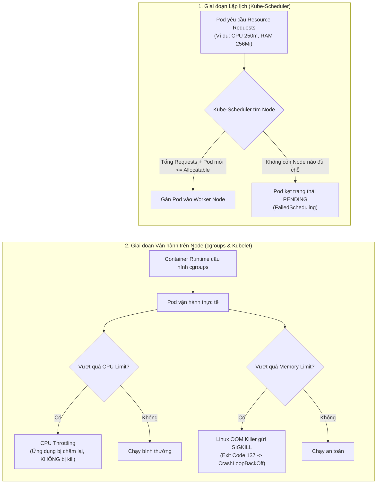

# Bài 24: Resource Requests & Limits, QoS Classes

## 1. Thông tin bài học
* **Tên bài:** Bài 24: Resource Requests & Limits, QoS Classes
* **Mục tiêu học:** Nắm vững bản chất cơ chế cấp phát tài nguyên tính toán trong Kubernetes; phân biệt rạch ròi vai trò của `requests` (cam kết tối thiểu phục vụ lập lịch) và `limits` (trần tối đa siết bằng Linux cgroups); hiểu sâu sự khác nhau giữa tài nguyên nén được (Compressible - CPU) và tài nguyên không thể nén (Incompressible - Memory); nhận diện nguồn gốc của hiện tượng CPU Throttling và tai nạn `OOMKilled` (Exit Code 137); làm chủ 3 cấp độ chất lượng dịch vụ QoS (Guaranteed, Burstable, BestEffort) cùng quy luật trục xuất (Eviction) khi Worker Node cạn kiệt tài nguyên; thực hành cấu hình chuẩn xác cho microservice Online Boutique trên cụm kind.
* **Thời lượng ước tính:** 150 phút (75 phút lý thuyết, 75 phút thực hành)
* **Kiến thức cần có trước:** Bài 01 (Linux cgroups), Bài 05 (Kiến trúc Kubernetes: Kube-Scheduler & Kubelet), Bài 06 (Pod spec & containers), Bài 09 (Deployment).
* **Liên quan kỳ thi:** CKAD, CKA (Trọng tâm cốt lõi chiếm 15–20% tổng điểm: bài thi luôn yêu cầu cấu hình requests/limits chính xác cho container, chẩn đoán nguyên nhân Pod dính lỗi `OOMKilled` hoặc `CrashLoopBackOff`, và điều tra vì sao Pod bị kẹt ở trạng thái `Pending` do thiếu tài nguyên).

---

## 2. Bảng thuật ngữ

| Thuật ngữ | Giải thích đơn giản | Ví dụ / Ẩn dụ đời thường |
| :--- | :--- | :--- |
| **Resource Requests** | Lượng tài nguyên (CPU, RAM) tối thiểu mà container yêu cầu để có thể hoạt động; được Kube-Scheduler dùng làm căn cứ chọn Node. | Vé đặt cọc chỗ ngồi trên xe khách: bạn đăng ký giữ trước 1 ghế, bác tài bắt buộc phải còn ghế trống mới cho bạn lên xe. |
| **Resource Limits** | Trần tài nguyên tối đa mà container được phép tiêu thụ; do nhân Linux (cgroups) cưỡng chế siết chặt lúc chạy. | Chiếc vòng đeo cổ co giãn tối đa của thú cưng: nếu cố phình to vượt quá chu vi vòng, nó sẽ bị siết nghẹt thở. |
| **Compressible Resource (CPU)** | Tài nguyên có thể "nén" hoặc điều tiết tốc độ được; khi vượt mức cho phép, tiến trình chỉ bị chạy chậm lại chứ không bị khai tử. | Vòi nước rửa xe: khi người khác dùng chung, vòi của bạn chảy yếu đi, bạn phải rửa xe lâu hơn chứ không bị mất vòi. |
| **Incompressible Resource (Memory)** | Tài nguyên không thể nén được; một khi bộ nhớ vật lý đã hết, hệ thống không thể co giãn dữ liệu trong RAM mà buộc phải tiêu diệt tiến trình. | Chiếc vali hành lý xách tay: thể tích cố định, nếu bạn cố nhét thêm đồ vượt quá sức chứa, khóa vali sẽ bung và đồ đạc bị vứt bỏ. |
| **CPU Throttling** | Cơ chế nhân Linux (CFS Bandwidth Control) tạm ngắt chu kỳ cấp phát CPU của container khi nó chạm tới CPU Limit trong chu kỳ đánh giá (thường là 100ms). | Đèn giao thông thông minh: cứ mỗi 1 phút đèn xanh cho xe chạy 20 giây, 40 giây còn lại bắt buộc xe phải dừng bánh chờ nhịp tiếp theo. |
| **OOMKilled (Exit Code 137)** | Tiến trình bị nhân Linux (Out-Of-Memory Killer) gửi tín hiệu `SIGKILL` (tín hiệu 9) để tiêu diệt ngay lập tức do sử dụng RAM vượt quá Limit hoặc Node hết RAM vật lý (\(128 + 9 = 137\)). | Trọng tài rút thẻ đỏ trực tiếp đuổi cầu thủ ra khỏi sân vì phạm lỗi quá giới hạn, không có cơ hội thanh minh. |
| **QoS Classes (Guaranteed, Burstable, BestEffort)** | Phân hạng ưu tiên sinh tồn do Kubernetes tự động gán cho Pod dựa trên cách khai báo requests và limits; quyết định thứ tự Pod nào bị "hi sinh" trước khi Node thiếu RAM. | Các hạng vé máy bay: Hạng Thương gia (Guaranteed), Hạng Phổ thông linh hoạt (Burstable), Hạng Vé vớt giá 0 đồng (BestEffort). |
| **`oom_score_adj`** | Chỉ số điểm số (từ -1000 đến 1000) gán cho tiến trình trong Linux; điểm càng cao thì nguy cơ bị OOM Killer "trảm" đầu tiên càng lớn. | Điểm phạt trừ trên bằng lái: tài xế có điểm phạt cao nhất sẽ bị tịch thu bằng lái đầu tiên khi cảnh sát mở đợt thanh tra. |

---

## 3. Bức tranh lớn: Vấn đề thực tế và ẩn dụ đời thường

### Nhắc lại bài trước
Ở Bài 23, chúng ta đã xây dựng tư duy chẩn đoán sự cố mạng phân tầng từ Pod lên Node và sử dụng ephemeral debug container để bóc tách các điểm nghẽn kết nối. Tuy nhiên, trong môi trường vận hành thực tế, một dịch vụ bị "chết" hoặc phản hồi chậm chạp thường không chỉ do mạng, mà phần lớn bắt nguồn từ việc quản trị tài nguyên tính toán (Compute Resources) thiếu khoa học.

### Tại sao cần cái này ở production? (Vấn đề thực tế)

Hãy tưởng tượng bạn đang vận hành một cụm Kubernetes phục vụ ngày hội mua sắm Mega Sale:
1. **Thảm họa "Hàng xóm ồn ào" (Noisy Neighbor):**
   Nếu bạn không đặt `limits`, một container chứa mã nguồn bị lỗi rò rỉ bộ nhớ (Memory Leak) hoặc một vòng lặp vô tận (Infinite Loop) của đội phát triển A có thể "ăn sạch" 100% CPU và RAM của cả Worker Node. Hậu quả là toàn bộ các microservice quan trọng khác của đội B, đội C chạy chung trên Node đó đều bị chết chùm!
2. **Ảo tưởng về năng lực phần cứng (Resource Overcommit):**
   Nếu không cấu hình `requests`, Kube-Scheduler sẽ coi như Pod đó "không cần tài nguyên nào cả" và thản nhiên nhồi nhét 50 Pod vào một Node chỉ có 4GB RAM. Khi khách hàng đồng loạt ùa vào mua sắm, các Pod đồng loạt ngốn RAM khiến Node bị sập hoàn toàn (Node NotReady).
3. **Hiện tượng giật lag bí ẩn (Silent Latency Spikes):**
   Nhiều kỹ sư cấu hình CPU Limit quá thấp. Kết quả là ứng dụng Java hoặc NodeJS liên tục bị CPU Throttling. Khách hàng bấm thanh toán phải chờ tới 5–10 giây, trong khi nhìn vào biểu đồ giám sát tổng thể CPU của Node thì thấy máy chủ vẫn đang... "rảnh rỗi" ở mức 30%!

### Ẩn dụ đời thường: Đặt bàn tiệc và Cân hành lý sân bay

Hãy hình dung việc quản lý tài nguyên trong Kubernetes giống hệt quy trình đi máy bay:
* **Resource Requests = Đặt chỗ hành lý ký gửi:** Khi mua vé, bạn khai báo trước: *"Tôi chắc chắn mang 20kg hành lý"*. Hãng bay (Kube-Scheduler) sẽ tính toán tổng trọng lượng khoang hàng. Nếu chuyến bay còn đủ chỗ chứa 20kg đó, họ mới bán vé và xếp bạn lên máy bay (Node). Ngay cả khi bạn chưa chất hành lý lên, 20kg đó đã được "khoanh vùng" dành riêng cho bạn.
* **Resource Limits = Cân kiểm tra tại cửa khởi hành:** Khi bạn ra cửa máy bay, nhân viên cân lại vali. Nếu vali của bạn nặng 20.1kg trong khi quy định tối đa (Limit) là 20kg:
  * Nếu là **CPU (tài nguyên nén):** Nhân viên bắt bạn đi bộ chậm lại ở ống lồng, đi từng bước một để giãn mật độ người (Throttling). Bạn vẫn được bay, nhưng mất thời gian hơn.
  * Nếu là **RAM (tài nguyên không nén):** Nhân viên an ninh lập tức ném thẳng chiếc vali đó vào thùng rác (OOMKilled - SIGKILL)! Bạn không có bất kỳ cơ hội nào để năn nỉ hay dọn bớt đồ ra ngoài.

---

## 4. Giải thích khái niệm theo từng bước

### 4.1. Đơn vị đo lường trong Kubernetes

Kubernetes quản lý hai loại tài nguyên tính toán chính: **CPU** và **Memory**.

#### 1. Đơn vị CPU (Tính theo số lượng nhân xử lý):
* `1` CPU trong Kubernetes tương đương với **1 vCPU/Core** trên Cloud (AWS vCPU, GCP vCPU) hoặc **1 Hyperthread core** trên chip vật lý.
* CPU có thể chia nhỏ tới hàng phần nghìn, gọi là **millicores** (hoặc `milliCPU`), ký hiệu là chữ `m`.
  * `1000m` = `1` CPU Core.
  * `500m` = `0.5` CPU Core (nửa nhân).
  * `100m` = `0.1` CPU Core (1/10 nhân).
* *Lưu ý:* Tuyệt đối không viết `0.5m` vì không có đơn vị nửa millicore. Hãy viết `500m` hoặc `0.5`.

#### 2. Đơn vị Memory (Tính theo byte):
* Kubernetes chấp nhận các hậu tố nhị phân (tiêu chuẩn IEC: lũy thừa của 2) hoặc thập phân (tiêu chuẩn SI: lũy thừa của 10).
* Trong thực tế vận hành production, chúng ta **luôn luôn dùng đơn vị nhị phân**:
  * `Ki` (Kibibyte) = $2^{10} = 1024$ bytes.
  * `Mi` (Mebibyte) = $2^{20} = 1024 \times 1024$ bytes ($\approx 1.048$ Megabytes).
  * `Gi` (Gibibyte) = $2^{30} = 1024$ Mi.
* *Cảnh báo kinh điển:* Tránh nhầm lẫn giữa `M` (Megabyte = 1,000,000 bytes) và `Mi` (Mebibyte = 1,048,576 bytes). Hầu hết các hệ điều hành Linux và Kubernetes đo bộ nhớ thực tế theo lũy thừa 2 (`Mi`, `Gi`).

---

### 4.2. Cơ chế Requests: Lập lịch (Scheduling)

Khi bạn khai báo `resources.requests` trong Pod spec:
1. **Ai quan tâm đến Requests?** Duy nhất thành phần **Kube-Scheduler** trên Control Plane quan tâm.
2. **Quy tắc lập lịch:**
   * Mỗi Node có một dung lượng bộ nhớ và CPU có thể cấp phát cho Pod, gọi là **Allocatable Capacity** (Tổng dung lượng Node trừ đi phần dự phòng cho OS và Kubelet).
   * Kube-Scheduler theo dõi tổng giá trị `requests` của tất cả các Pod đang chạy trên Node đó.
   * Một Pod mới chỉ được xếp vào Node nếu:
     $$\sum \text{Requests của các Pod hiện tại} + \text{Requests của Pod mới} \le \text{Allocatable của Node}$$
3. **Bản chất của Requests:**
   * Requests là **lời cam kết trên giấy tờ**. Nó không phản ánh mức tiêu thụ thực tế (actual usage) tại thời điểm đó!
   * Cho dù một Pod đang nhàn rỗi và ăn 0% CPU, lượng CPU request của nó vẫn bị "chiếm chỗ" vĩnh viễn trên Node đó.

---

### 4.3. Cơ chế Limits: Cưỡng chế bằng Linux cgroups

Khi bạn khai báo `resources.limits`:
1. **Ai thực thi Limits?** Kubelet chuyển thông số này xuống Container Runtime (containerd), và containerd thiết lập trực tiếp vào hệ thống **Linux Control Groups (cgroups)** của nhân Linux (đã học ở Bài 01).
2. **CPU Limit hoạt động ra sao (CFS Bandwidth Control):**
   * Linux chia thời gian CPU thành các chu kỳ (CFS Period, mặc định là 100ms = 100,000 microseconds).
   * Nếu bạn đặt `limits.cpu: "500m"`, cgroups sẽ cấp hạn ngạch (CFS Quota) là $500/1000 \times 100\text{ms} = 50\text{ms}$.
   * Nếu trong chu kỳ 100ms đó, container của bạn chạy hết 50ms thời gian CPU, nhân Linux sẽ **treo (throttle)** các luồng của container đó lại. Container phải đợi chu kỳ 100ms tiếp theo mới được CPU phục vụ tiếp.
   * **Hệ quả:** Ứng dụng không chết, nhưng thời gian phản hồi (latency) bị kéo dài lê thê!
3. **Memory Limit hoạt động ra sao (cgroup memory limit):**
   * Nhân Linux theo dõi sát sao số trang bộ nhớ (page cache, anonymous memory) mà tiến trình chiếm giữ.
   * Khi tiến trình xin thêm bộ nhớ vượt quá ngưỡng `limits.memory`:
     * Nhân Linux sẽ cố gắng giải phóng bộ nhớ đệm (page cache).
     * Nếu vẫn không đủ chỗ, **OOM Killer (Out-Of-Memory Killer)** lập tức được kích hoạt. Nó gửi tín hiệu `SIGKILL` (signal 9) thẳng tới tiến trình mẹ trong container.
     * Container bị tắt ngay tắp lự. Kubelet ghi nhận trạng thái kết thúc là `OOMKilled` với mã thoát `Exit Code 137`.



---

### 4.4. Ba cấp độ QoS Classes (Quality of Service)

Dựa trên mối tương quan giữa `requests` và `limits` của **toàn bộ các container** bên trong Pod, Kubernetes tự động phân loại Pod vào một trong 3 nhóm QoS:

| Cấp độ QoS | Điều kiện cấu hình | Mức độ ưu tiên | Ẩn dụ |
| :--- | :--- | :--- | :--- |
| **1. Guaranteed** (Được bảo đảm 100%) | Mọi container trong Pod đều có cả CPU và Memory; đồng thời **`requests == limits`** trên cả 2 thông số. | Cao nhất (Được bảo vệ tối đa, chỉ bị kill khi cả node sập). | Khách VIP hạng Nhất: Luôn có phòng nghỉ riêng, không bao giờ bị đuổi. |
| **2. Burstable** (Co giãn linh hoạt) | Có ít nhất 1 container có `requests` khác `limits`, hoặc chỉ khai báo `requests` mà không khai báo `limits`. | Trung bình (Được cam kết mức request tối thiểu, cho phép dùng vượt trần khi node rảnh). | Khách vé Phổ thông linh hoạt: Có chỗ ngồi cố định, được phép ngả ghế nếu hàng sau trống. |
| **3. BestEffort** (Cố gắng hết sức) | Pod hoàn toàn **KHÔNG khai báo bất kỳ requests hay limits nào** (cả CPU lẫn Memory). | Thấp nhất (Là đối tượng đầu tiên bị "hi sinh" khi Node thiếu thốn tài nguyên). | Khách đi vé vớt 0 đồng: Ngồi ghế phụ, khi hết chỗ là người đầu tiên bị mời xuống xe. |

#### Cơ chế Trục xuất khi Node cạn kiệt tài nguyên (Node Eviction):
Khi Worker Node rơi vào trạng thái nguy cấp về RAM (`MemoryPressure`), Kubelet phải chủ động trục xuất (evict) bớt các Pod để cứu sống hệ điều hành. Thứ tự "chém đầu" được quyết định bằng chỉ số **`oom_score_adj`**:
1. **BestEffort (`oom_score_adj = 1000`):** Bị trục xuất đầu tiên, không cần thương tiếc.
2. **Burstable (`oom_score_adj` từ 2 đến 999):** Bị trục xuất tiếp theo nếu nhóm BestEffort đã chết hết. Pod nào đang dùng vượt quá tỷ lệ request của nó càng nhiều thì điểm số càng cao và bị trảm trước.
3. **Guaranteed (`oom_score_adj = -997`):** Bị trục xuất cuối cùng, trừ phi chính bản thân nó tiêu thụ vượt quá Limit của nó.

---

## 5. Thực hành (Lab)

* **Môi trường:** Cluster kind 2 node (`lab-control-plane`, `lab-worker`).
* **Mức RAM ước tính:** ~350 MB (an toàn tuyệt đối cho giới hạn 4GB WSL 2).
* **Mục tiêu thực hành:** 
  1. Kiểm tra năng lực phân bổ tài nguyên của Node (Node Allocatable).
  2. Tạo 3 Pod tương ứng 3 cấp độ QoS và quan sát hệ thống tự phân loại.
  3. Cố tình kích hoạt lỗi `OOMKilled` (Exit Code 137) bằng cách ép container ăn vượt Memory Limit.
  4. Cấu hình requests/limits chuẩn cho dịch vụ `cartservice` của Google Online Boutique.

---

### Bước 1: Kiểm tra dung lượng Allocatable trên các Node

Trước khi lập lịch cho Pod, hãy xem Worker Node của chúng ta có bao nhiêu tài nguyên thực tế để cấp phát:

```powershell
kubectl get nodes lab-worker -o custom-columns=NAME:.metadata.name,CPU_CAPACITY:.status.capacity.cpu,CPU_ALLOCATABLE:.status.allocatable.cpu,MEM_CAPACITY:.status.capacity.memory,MEM_ALLOCATABLE:.status.allocatable.memory
```

**Kết quả mong đợi:**
```text
NAME         CPU_CAPACITY   CPU_ALLOCATABLE   MEM_CAPACITY   MEM_ALLOCATABLE
lab-worker   6              6                 4015844Ki      4015844Ki
```
*(Số liệu CPU và Memory sẽ tương ứng với cấu hình máy host của bạn; ở đây RAM Allocatable đã được Kubelet trừ đi phần dự phòng hệ thống).*

---

### Bước 2: Tạo Pod kiểm chứng 3 cấp độ QoS (Guaranteed, Burstable, BestEffort)

Tạo file manifest `qos-demo.yaml` chứa 3 Pod đại diện cho 3 cấp độ:

```powershell
@'
apiVersion: v1
kind: Pod
metadata:
  name: pod-best-effort
  labels:
    app: qos-demo
spec:
  containers:
  - name: app
    image: busybox:1.36
    command: ["sleep", "3600"]
    # Không khai báo bất kỳ resources nào -> BestEffort
---
apiVersion: v1
kind: Pod
metadata:
  name: pod-burstable
  labels:
    app: qos-demo
spec:
  containers:
  - name: app
    image: busybox:1.36
    command: ["sleep", "3600"]
    resources:
      requests:
        cpu: "50m"
        memory: "64Mi"
      limits:
        # limits lớn hơn requests -> Burstable
        cpu: "200m"
        memory: "128Mi"
---
apiVersion: v1
kind: Pod
metadata:
  name: pod-guaranteed
  labels:
    app: qos-demo
spec:
  containers:
  - name: app
    image: busybox:1.36
    command: ["sleep", "3600"]
    resources:
      requests:
        cpu: "100m"
        memory: "128Mi"
      limits:
        # limits BẰNG requests trên cả CPU lẫn Memory -> Guaranteed
        cpu: "100m"
        memory: "128Mi"
'@ | Set-Content -Encoding utf8 qos-demo.yaml

kubectl apply -f qos-demo.yaml
```

**Kiểm tra kết quả phân hạng QoS tự động:**
```powershell
kubectl get pods -l app=qos-demo -o custom-columns=NAME:.metadata.name,STATUS:.status.phase,QOS_CLASS:.status.qosClass
```

**Kết quả mong đợi:**
```text
NAME              STATUS    QOS_CLASS
pod-best-effort   Running   BestEffort
pod-burstable     Running   Burstable
pod-guaranteed    Running   Guaranteed
```
> [!NOTE]
> Bạn hoàn toàn không thể gán thủ công trường `status.qosClass`. Chính Kubelet tự tính toán và điền trường này vào trạng thái của Pod khi tiếp nhận manifest!

---

### Bước 3: Cố tình kích hoạt hiện tượng OOMKilled (Exit Code 137)

Bây giờ chúng ta sẽ viết một manifest giới hạn nghiêm ngặt bộ nhớ ở mức `50Mi`, sau đó cho một tiến trình bên trong container cấp phát `100MB` RAM để chứng kiến Linux OOM Killer "trảm" container:

```powershell
@'
apiVersion: v1
kind: Pod
metadata:
  name: oom-victim-pod
spec:
  restartPolicy: Never
  containers:
  - name: memory-hog
    image: polinux/stress
    command: ["stress"]
    # Ép tiến trình cấp phát 100MB RAM ảo (vượt ngưỡng 50Mi của limit)
    args: ["--vm", "1", "--vm-bytes", "100M", "--vm-hang", "1"]
    resources:
      requests:
        memory: "30Mi"
      limits:
        memory: "50Mi"
'@ | Set-Content -Encoding utf8 oom-victim.yaml

kubectl apply -f oom-victim.yaml
```

Chờ khoảng 5–10 giây, sau đó kiểm tra trạng thái Pod:

```powershell
kubectl get pod oom-victim-pod
```

**Kết quả mong đợi:**
```text
NAME             READY   STATUS      RESTARTS   AGE
oom-victim-pod   0/1     OOMKilled   0          12s
```

Hãy dùng lệnh `kubectl describe` để xem chi tiết bản án tử hình mà Linux OOM Killer đã thực thi:

```powershell
kubectl describe pod oom-victim-pod
```

**Đoạn Output quan trọng cần quan sát:**
```text
    State:          Terminated
      Reason:       OOMKilled
      Exit Code:    137
      Started:      Thu, 09 Oct 2026 11:45:02 +0700
      Finished:     Thu, 09 Oct 2026 11:45:03 +0700
```
> [!IMPORTANT]
> **Giải mã mã thoát (Exit Code 137):**
> Trong Linux, khi một tiến trình bị tắt bởi một tín hiệu hệ thống (Signal), mã thoát sẽ bằng $128 + \text{Signal Number}$.  
> Tín hiệu `SIGKILL` có mã là `9`.  
> Do đó: $128 + 9 = 137$! Mỗi khi bạn nhìn thấy Exit Code 137, chắc chắn tiến trình đã bị xử tử bằng `SIGKILL`, và nguyên nhân hàng đầu trên Kubernetes chính là `OOMKilled`.

---

### Bước 4: Áp dụng cấu hình chuẩn vào microservice cartservice (Online Boutique)

Trong hệ thống Online Boutique, `cartservice` là dịch vụ viết bằng .NET chạy trên Worker Node. Nếu không đặt requests/limits, nó có thể phình to RAM hoặc bị scheduler đẩy sang Node quá tải.

Tạo manifest chuẩn hóa `cartservice-resources.yaml`:

```powershell
@'
apiVersion: apps/v1
kind: Deployment
metadata:
  name: cartservice-tuned
  labels:
    app: cartservice-tuned
spec:
  replicas: 1
  selector:
    matchLabels:
      app: cartservice-tuned
  template:
    metadata:
      labels:
        app: cartservice-tuned
    spec:
      containers:
      - name: server
        image: gcr.io/google-samples/microservices-demo/cartservice:v0.10.1
        ports:
        - containerPort: 7070
        env:
        - name: REDIS_ADDR
          value: "127.0.0.1:6379" # Chạy giả lập trong bài học này
        resources:
          requests:
            cpu: "100m"          # Cam kết 0.1 CPU core cho cartservice
            memory: "64Mi"        # Cam kết 64Mi bộ nhớ
          limits:
            cpu: "250m"          # Cho phép burst tối đa lên 0.25 core lúc bận
            memory: "128Mi"       # Khống chế trần không cho vượt quá 128Mi
'@ | Set-Content -Encoding utf8 cartservice-resources.yaml

kubectl apply -f cartservice-resources.yaml
```

**Xác nhận trạng thái phân bổ:**
```powershell
kubectl get pods -l app=cartservice-tuned -o custom-columns=NAME:.metadata.name,QOS:.status.qosClass,CPU_REQ:.spec.containers[0].resources.requests.cpu,MEM_LIMIT:.spec.containers[0].resources.limits.memory
```

**Kết quả mong đợi:**
```text
NAME                                  QOS         CPU_REQ   MEM_LIMIT
cartservice-tuned-578b97d84f-x2m9q    Burstable   100m      128Mi
```

---

### Bước 5: Dọn dẹp tài nguyên (Cleanup)

Giải phóng toàn bộ các Pod thí nghiệm để trả lại RAM cho WSL:

```powershell
kubectl delete -f qos-demo.yaml
kubectl delete -f oom-victim.yaml
kubectl delete -f cartservice-resources.yaml
Remove-Item qos-demo.yaml, oom-victim.yaml, cartservice-resources.yaml -ErrorAction SilentlyContinue
```

---

## 6. Lỗi thường gặp và cách debug

### Lỗi 1: Pod dính trạng thái `Pending` với thông điệp `0/2 nodes are available: insufficient cpu/memory`
* **Dấu hiệu:** Bạn tạo Pod nhưng `kubectl get pod` mãi mãi hiển thị `Pending`. Chạy `kubectl describe pod <name>` thấy dòng Event: `FailedScheduling: 0/2 nodes are available: 1 Insufficient cpu, 1 node(s) had untolerated taint`.
* **Nguyên nhân:** Tổng `requests.cpu` hoặc `requests.memory` bạn khai báo vượt quá dung lượng Allocatable còn lại của các Node. Kube-Scheduler không thể tìm thấy bất kỳ máy chủ nào có đủ "khoảng trống trên giấy tờ" để chứa Pod.
* **Cách debug và sửa:**
  1. Kiểm tra tài nguyên đã được request trên từng Node bằng lệnh:
     ```powershell
     kubectl describe node lab-worker
     ```
     Soi mục `Allocated resources` ở cuối output để thấy phần trăm `% CPU Requests` và `% Memory Requests`.
  2. Điều chỉnh giảm mức `requests` trong Pod spec xuống mức thực tế hơn, hoặc mở rộng thêm Worker Node (scale out cluster).

---

### Lỗi 2: Ứng dụng rơi vào vòng xoáy `CrashLoopBackOff` do OOMKilled lặp đi lặp lại
* **Dấu hiệu:** `kubectl get pod` hiển thị trạng thái `CrashLoopBackOff`, cột `RESTARTS` tăng liên tục (1, 2, 3, 4...).
* **Nguyên nhân:** Ứng dụng khi khởi động cần tải nhiều thư viện, cache dữ liệu vượt quá `limits.memory`. Container bị cgroup kill ngay khi vừa bật, Kubelet tự động restart lại Pod theo `restartPolicy: Always`, và chu kỳ lặp lại vô tận.
* **Cách debug và sửa:**
  1. Dùng lệnh kiểm tra trạng thái của lần chạy trước đó (Previous Container):
     ```powershell
     kubectl get pod <pod-name> -o jsonpath='{.status.containerStatuses[0].lastState.terminated.reason}'
     ```
     Nếu trả về `OOMKilled`, chắc chắn nguyên nhân là tràn RAM.
  2. Tăng `limits.memory` lên (ví dụ từ `128Mi` lên `256Mi` hoặc `512Mi`), hoặc tối ưu hóa mã nguồn (kiểm tra memory leak, heap dump của ứng dụng).

---

### Lỗi 3: CPU Throttling làm trễ phản hồi (Response Latency) nhưng CPU Usage rất thấp
* **Dấu hiệu:** Ứng dụng phục vụ web phản hồi rất chậm chạp trong giờ cao điểm. Giám sát tổng thể CPU usage chỉ báo 30–40% nhưng người dùng liên tục phàn nàn bị timeout.
* **Nguyên nhân:** Đặt `limits.cpu` quá nhỏ trên ứng dụng đa luồng (Multi-threaded như Java Spring Boot, Go, .NET). Khi có 8 luồng chạy đồng thời, mỗi luồng ăn một ít CPU khiến tổng thời gian CPU vượt quá hạn ngạch CFS Quota chỉ trong 10ms đầu của chu kỳ 100ms. Trong 90ms còn lại, toàn bộ tiến trình bị cgroups đóng băng!
* **Cách debug và sửa:**
  1. Kiểm tra số chu kỳ bị throttle trên Linux node hoặc qua Prometheus metric:
     `container_cpu_cfs_throttled_periods_total / container_cpu_cfs_periods_total`
  2. Tăng trần `limits.cpu`, hoặc áp dụng quy chuẩn nâng cao "Không đặt CPU Limit" (No CPU Limits) nếu cluster đã có chính sách quản lý Requests vững vàng.

---

## 7. Góc nhìn Senior

### 1. Sự đánh đổi (Trade-offs): Overcommit vs Resource Guarantees

| Tiêu chí | Cấu hình Guaranteed (`requests == limits`) | Cấu hình Burstable (`requests < limits`) |
| :--- | :--- | :--- |
| **Mật độ Pod (Density)** | Thấp: Mỗi Node chỉ chứa được ít Pod vì dung lượng đã bị giữ chỗ cứng. | Rất cao: Tận dụng được tối đa tài nguyên nhàn rỗi (Overcommit). |
| **Chi phí hạ tầng ($)** | Đắt đỏ: Cần nhiều máy chủ ảo (VMs) hơn để chạy cùng số lượng dịch vụ. | Rẻ hơn: Tiết kiệm từ 30% đến 50% chi phí hóa đơn đám mây (Cloud bill). |
| **Độ ổn định / Cách ly** | Cực cao: Hoàn toàn miễn nhiễm với hiện tượng Noisy Neighbor và OOM Eviction. | Tiềm ẩn rủi ro: Khi nhiều Pod cùng lúc burst lên đỉnh tải, Node có thể bị quá tải RAM. |
| **Trường hợp sử dụng** | Các ứng dụng tài chính cốt lõi, Database, Payment Service, StatefulSet. | Hầu hết các ứng dụng Web API, Microservices phi trạng thái (Stateless). |

---

### 2. Best practices tại production

1. **BẮT BUỘC luôn luôn khai báo Memory Request và Memory Limit:**
   * Không bao giờ để Pod ở dạng `BestEffort` trên môi trường Production!
   * Khuyến nghị: Đặt `limits.memory` bằng hoặc nhỉnh hơn một chút so với `requests.memory` (ví dụ: limit = 1.2x request). Vì RAM là tài nguyên không thể nén được, việc cho phép container burst quá nhiều RAM là nguyên nhân hàng đầu dẫn đến thảm họa sập cả Node!
2. **Quy chuẩn về CPU Limit (Tranh luận "No CPU Limit"):**
   * Trong cộng đồng Platform/SRE thế giới (được khởi xướng bởi Tim Hockin - một trong các tác giả sáng lập Kubernetes), nhiều hệ thống lớn khuyến nghị: **Khai báo `requests.cpu` cẩn thận nhưng KHÔNG đặt `limits.cpu`** cho các ứng dụng web thông thường.
   * *Lý do:* CPU là tài nguyên nén được. Khi Node bận, nhân Linux tự chia sẻ CPU theo tỷ lệ Requests. Khi Node rảnh, container được quyền sử dụng hết năng lực tính toán nhàn rỗi mà không bao giờ bị dính CPU Throttling vô lý!
3. **Áp dụng LimitRange cho từng Namespace:**
   * Để ngăn ngừa việc lập trình viên quên khai báo tài nguyên, hãy tạo đối tượng `LimitRange` tại mỗi namespace. Bất kỳ Pod nào không có `resources` sẽ tự động được gán giá trị mặc định (Default Request & Limit).
4. **Giám sát tỷ lệ Request so với Thực tế (Resource Right-sizing):**
   * Dùng công cụ như Kubecost hoặc Goldilocks/VPA để soi độ lệch giữa dung lượng bạn request và dung lượng ứng dụng thực sự ăn. Nếu bạn request 2 CPU nhưng app chỉ chạy 50m, bạn đang lãng phí hàng ngàn USD ngân sách mỗi tháng!

---

### 3. Câu hỏi phỏng vấn Senior

* **Câu hỏi 1:** *Khi Kubelet tính toán xem Node có đủ chỗ để nhận một Pod mới hay không, Kubelet và Kube-Scheduler căn cứ vào mức tiêu thụ CPU/RAM thực tế (Actual Usage) hay căn cứ vào Requests? Điều gì xảy ra nếu Node còn trống 80% RAM thực tế nhưng Scheduler từ chối nhận thêm Pod?*
* **Gợi ý trả lời chuẩn:**
  * Kube-Scheduler **chỉ căn cứ vào tổng Resource Requests** đã cấp phát trên Node, hoàn toàn KHÔNG quan tâm đến mức tiêu thụ thực tế (Actual Usage) tại thời điểm đó.
  * Nếu Node có 8GB RAM, thực tế các ứng dụng chỉ đang tiêu thụ 1.5GB (trống hơn 80%), nhưng tổng `requests.memory` của các Pod trên Node đã chạm mốc 7.5GB, thì Kube-Scheduler vẫn coi Node đó là đã "chật cứng". Mọi Pod mới yêu cầu thêm RAM sẽ bị từ chối và rơi vào trạng thái `Pending` (`Insufficient memory`). Đây là cơ chế bảo vệ có chủ đích nhằm đảm bảo khi tất cả các ứng dụng đồng loạt đạt đỉnh tải (Peak Load), hệ thống vẫn giữ đúng cam kết tài nguyên đã hứa.

* **Câu hỏi 2:** *Tại sao Exit Code khi một container bị OOMKilled luôn là 137? Bạn phân biệt thế nào giữa việc container bị OOMKilled do vượt Limit của chính nó và việc container bị Kubelet Evict do cả Node bị tràn bộ nhớ?*
* **Gợi ý trả lời chuẩn:**
  * Trong Linux, khi tiến trình bị kết thúc bởi tín hiệu (Signal), mã thoát trả về là $128 + \text{Signal Number}$. Tín hiệu `SIGKILL` có giá trị là 9, do đó mã thoát là $128 + 9 = 137$.
  * Để phân biệt:
    * **Bị OOMKilled do vượt Limit của chính nó:** Xem `kubectl describe pod <name>`, trường `Last State -> Reason` ghi rõ `OOMKilled`, nhưng trạng thái chung của Pod vẫn giữ nguyên (hoặc Pod restart nếu restartPolicy cho phép). Trạng thái của Node vẫn hoàn toàn khỏe mạnh (`MemoryPressure = False`).
    * **Bị Kubelet Evict do cả Node tràn bộ nhớ:** Toàn bộ Node sẽ bật cảnh báo `NodeCondition: MemoryPressure = True`. Kubelet sẽ gửi thông báo và chuyển `status.phase` của Pod thành `Failed`, trường Reason ghi nhận là `Evicted` (chứ không chỉ là khởi động lại container). Các Pod có QoS `BestEffort` sẽ bị dọn dẹp hàng loạt trước.

---

## 8. Tóm tắt bài học
* 📌 **1. Requests vs Limits:** Requests dành cho Kube-Scheduler tính toán chọn Node (lời hứa tối thiểu); Limits dành cho nhân Linux cgroups siết chặt lúc vận hành (trần tối đa).
* 📌 **2. Bản chất CPU vs RAM:** CPU là tài nguyên nén được (vượt limit chỉ bị CPU Throttling làm chậm lại); RAM là tài nguyên không thể nén (vượt limit lập tức bị OOM Killer bắn hạ bằng `SIGKILL`, Exit Code 137).
* 📌 **3. Đơn vị đo lường:** `1000m` CPU tương đương 1 vCPU; luôn dùng đơn vị nhị phân `Mi`, `Gi` cho bộ nhớ để tránh sai số so với hệ điều hành Linux.
* 📌 **4. Ba cấp độ QoS:** `Guaranteed` (requests == limits trên mọi container, an toàn nhất); `Burstable` (requests < limits, linh hoạt, phổ biến nhất); `BestEffort` (không khai báo gì, nguy hiểm nhất, bị khai tử đầu tiên).
* 📌 **5. Quy tắc vàng Production:** Không bao giờ để Pod chạy dạng BestEffort; luôn luôn đặt cả Request và Limit cho Memory; cân nhắc cẩn trọng việc có nên siết CPU Limit hay không để tránh hiện tượng CPU Throttling làm tăng đột biến độ trễ ứng dụng.

---

## 9. Bài tập tự làm

* 🟢 **Mức Dễ:** Viết một Pod manifest chạy image `nginx:alpine` với `requests.cpu: "50m"`, `requests.memory: "64Mi"` và `limits.cpu: "100m"`, `limits.memory: "128Mi"`. Triển khai lên cluster và dùng lệnh `kubectl` kiểm tra xem Pod đó được xếp vào cấp độ QoS nào.
* 🟡 **Mức Vừa:** Tạo một Pod có 2 container chạy song song:
  * Container 1 (`web`): image `nginx:alpine`, có đầy đủ CPU/RAM request và limit bằng nhau (`100m` / `128Mi`).
  * Container 2 (`logger`): image `busybox:1.36`, command `sleep 3600`, không khai báo bất kỳ tài nguyên nào.  
  Hãy dự đoán cấp độ QoS của Pod này trước khi apply, sau đó kiểm tra thực tế xem kết quả là `Guaranteed` hay `Burstable` và giải thích lý do.
* 🔴 **Mức Khó:** Viết một script PowerShell tạo ra một Pod yêu cầu `requests.cpu: "10"` (10 cores CPU, vượt quá dung lượng 6 cores của máy host). Quan sát trạng thái của Pod, trích xuất sự kiện cảnh báo từ Kube-Scheduler bằng `kubectl get events`, sau đó cập nhật lại tài nguyên để giải cứu Pod về trạng thái `Running` mà không cần xóa Pod tạo lại.

---

## 10. Câu hỏi tự kiểm tra

1. Nếu một Pod có `requests.memory: "256Mi"` và `limits.memory: "512Mi"`, điều gì sẽ xảy ra nếu ứng dụng bên trong container xin cấp phát 600Mi bộ nhớ?
2. Sự khác biệt cốt lõi giữa CPU Throttling và OOMKilled là gì? Vì sao CPU vượt limit không làm container bị restart?
3. Một Pod không khai báo `requests.cpu` nhưng có khai báo `limits.cpu: "500m"`. Kubernetes sẽ tự động gán giá trị `requests.cpu` bằng bao nhiêu? Cấp độ QoS của Pod này là gì?
4. Tại sao Kube-Scheduler lại từ chối xếp lịch cho một Pod mới lên Node khi tổng RAM thực tế đang dùng trên Node mới chỉ có 20%?
5. Trong tình huống Worker Node bị cạn kiệt RAM vật lý (MemoryPressure), giữa một Pod QoS `Burstable` đang dùng vượt 150% so với mức Request của nó và một Pod QoS `BestEffort`, Pod nào sẽ bị Kubelet trục xuất (Evict) trước?

<details>
<summary>👉 Bấm vào đây để xem đáp án câu hỏi tự kiểm tra</summary>

* **Câu 1:** Ngay khi ứng dụng vượt qua ngưỡng `512Mi` (ngưỡng Limit), nhân Linux cgroups sẽ kích hoạt Out-Of-Memory Killer. Tiến trình sẽ bị gửi tín hiệu `SIGKILL` và container kết thúc với mã lỗi `Exit Code 137 (OOMKilled)`. Nếu `restartPolicy` là `Always`, Kubelet sẽ tự động khởi động lại container.
* **Câu 2:** CPU là tài nguyên nén được (Compressible), nhân Linux có thể điều tiết chia nhỏ thời gian phục vụ bằng bộ điều phối CFS Quota, do đó ứng dụng chỉ bị chạy chậm lại chứ không bị hủy diệt. Ngược lại, Memory là tài nguyên không thể nén (Incompressible), một byte dữ liệu đã ghi vào RAM không thể tự co lại, nên khi hết dung lượng, hệ thống bắt buộc phải tiêu diệt tiến trình để bảo vệ tính toàn vẹn của cả hệ điều hành.
* **Câu 3:** Nếu bạn chỉ khai báo `limits` mà bỏ trống `requests`, Kubernetes sẽ **tự động gán `requests` bằng đúng giá trị `limits`** đó (tức là `requests.cpu = 500m`). Tuy nhiên, để đạt cấp độ `Guaranteed`, quy tắc này phải áp dụng cho CẢ CPU VÀ MEMORY trên TẤT CẢ các container. Nếu memory không khai báo, Pod sẽ bị xếp vào nhóm `Burstable`.
* **Câu 4:** Kube-Scheduler chỉ làm việc dựa trên số liệu "cam kết trên giấy tờ" (Resource Requests). Việc Node đang nhàn rỗi ở mức 20% chỉ là trạng thái nhất thời. Nếu Scheduler nhồi thêm Pod vào, khi các Pod cũ đồng loạt tăng tải lên mức 100% Request mà chúng đã được cam kết, Node sẽ lập tức bị quá tải sập nguồn. Do đó Scheduler từ chối để bảo vệ cam kết tài nguyên.
* **Câu 5:** Pod QoS **`BestEffort`** sẽ luôn luôn bị Kubelet trục xuất (Evict) trước! Pod BestEffort có điểm `oom_score_adj = 1000` (mức độ ưu tiên sinh tồn thấp nhất trong toàn bộ hệ thống). Chỉ khi toàn bộ các Pod BestEffort đã bị dọn sạch mà Node vẫn thiếu RAM thì Kubelet mới bắt đầu xem xét trục xuất các Pod Burstable đang dùng lố dung lượng.
</details>

---

## 11. Tài liệu đọc thêm và bài tiếp theo

### Tài liệu tham khảo
* [Kubernetes Documentation: Resource Management for Pods and Containers](https://kubernetes.io/docs/concepts/configuration/manage-resources-containers/)
* [Kubernetes Documentation: Configure Quality of Service for Pods](https://kubernetes.io/docs/tasks/configure-pod-container/quality-of-service-pod/)
* [Kubernetes Documentation: Node-pressure Eviction](https://kubernetes.io/docs/concepts/scheduling-eviction/node-pressure-eviction/)
* [Linux Kernel Documentation: CFS Bandwidth Control](https://www.kernel.org/doc/Documentation/scheduler/sched-bwc.txt)

### Bài tiếp theo
👉 **Bài 25: Kube-Scheduler: Thuật toán lọc (Filter) và chấm điểm (Score)**

---

## PHỤ LỤC: ĐÁP ÁN GỢI Ý BÀI TẬP TỰ LÀM (MỤC 9)

### Đáp án Mức Dễ
Tạo file manifest `easy-qos.yaml`:
```yaml
apiVersion: v1
kind: Pod
metadata:
  name: easy-qos-pod
spec:
  containers:
  - name: nginx
    image: nginx:alpine
    resources:
      requests:
        cpu: "50m"
        memory: "64Mi"
      limits:
        cpu: "100m"
        memory: "128Mi"
```
Triển khai và kiểm tra:
```powershell
kubectl apply -f easy-qos.yaml
kubectl get pod easy-qos-pod -o jsonpath='{.status.qosClass}'
# Kết quả in ra: Burstable (vì requests < limits)
kubectl delete -f easy-qos.yaml
```

---

### Đáp án Mức Vừa
Tạo file manifest `multi-container-qos.yaml`:
```yaml
apiVersion: v1
kind: Pod
metadata:
  name: multi-container-qos
spec:
  containers:
  - name: web
    image: nginx:alpine
    resources:
      requests:
        cpu: "100m"
        memory: "128Mi"
      limits:
        cpu: "100m"
        memory: "128Mi"
  - name: logger
    image: busybox:1.36
    command: ["sleep", "3600"]
```
**Giải thích & Kiểm tra:**
* Dự đoán: Cấp độ là **`Burstable`**!
* Lý do: Để đạt được `Guaranteed`, quy tắc `requests == limits` phải thỏa mãn trên **TẤT CẢ các container** bên trong Pod. Container `logger` không khai báo gì (tương đương BestEffort), nên nó kéo tụt cấp độ của toàn bộ Pod xuống thành `Burstable`.
```powershell
kubectl apply -f multi-container-qos.yaml
kubectl get pod multi-container-qos -o jsonpath='{.status.qosClass}'
# Kết quả: Burstable
kubectl delete -f multi-container-qos.yaml
```

---

### Đáp án Mức Khó
Thực thi tuần tự bằng PowerShell:
```powershell
# 1. Tạo Pod đòi 10 Core CPU (vượt quá CPU thực tế của máy host)
@'
apiVersion: v1
kind: Pod
metadata:
  name: oversized-pod
spec:
  containers:
  - name: app
    image: busybox:1.36
    command: ["sleep", "3600"]
    resources:
      requests:
        cpu: "10"
'@ | Set-Content -Encoding utf8 oversized-pod.yaml

kubectl apply -f oversized-pod.yaml

# 2. Quan sát trạng thái: Pod bị kẹt ở PENDING
kubectl get pod oversized-pod

# 3. Trích xuất sự kiện FailedScheduling từ Kube-Scheduler
kubectl get events --field-selector involvedObject.name=oversized-pod

# Output mong đợi:
# Reason: FailedScheduling, Message: 0/2 nodes are available: 1 Insufficient cpu...

# 4. Giải cứu Pod: Sửa lại request về mức hợp lý (100m) bằng kubectl patch hoặc replace
# Vì spec.containers là immutable trên một số trường của Pod đang chạy, ta dùng patch:
# Đối với Pod chưa được scheduled (Pending), ta có thể patch trực tiếp:
kubectl patch pod oversized-pod --type='json' -p='[{"op": "replace", "path": "/spec/containers/0/resources/requests/cpu", "value": "100m"}]'

# 5. Quan sát Pod lập tức được Kube-Scheduler chuyển sang Running!
kubectl get pod oversized-pod

# Dọn dẹp
kubectl delete pod oversized-pod
Remove-Item oversized-pod.yaml -ErrorAction SilentlyContinue
```

