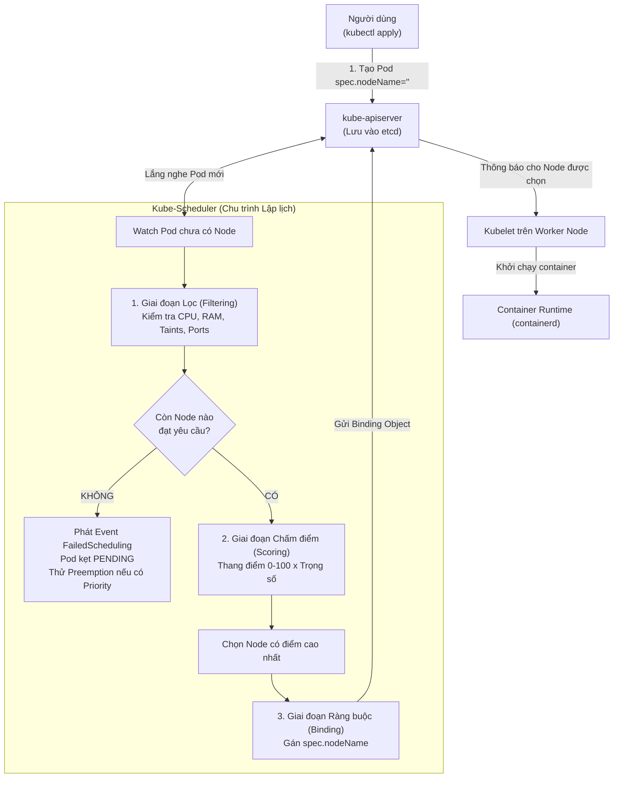

# Bài 25: Kube-Scheduler: Thuật toán lọc (Filter) và chấm điểm (Score)

## 1. Thông tin bài học
* **Tên bài:** Bài 25: Kube-Scheduler: Thuật toán lọc (Filter) và chấm điểm (Score)
* **Mục tiêu học:** Nắm vững cơ chế vận hành bên trong của Kube-Scheduler – "bộ não điều phối vị trí" của cụm Kubernetes; hiểu sâu hai giai đoạn sống còn của chu trình lập lịch: Giai đoạn Lọc (Filtering / Predicates) và Giai đoạn Chấm điểm (Scoring / Priorities); làm chủ quá trình Ràng buộc (Binding) gán `spec.nodeName`; giải mã bản chất các nguyên nhân khiến Pod bị kẹt ở trạng thái `Pending` (`FailedScheduling`); thực hành điều khiển ưu tiên lập lịch với `PriorityClass` và cơ chế Cướp chỗ (Preemption); hiểu rõ cách thức can thiệp gán Node thủ công để phục vụ cứu hộ cluster.
* **Thời lượng ước tính:** 120 phút (60 phút lý thuyết, 60 phút thực hành)
* **Kiến thức cần có trước:** Bài 05 (Kiến trúc Kubernetes: Control Plane & Worker Node), Bài 06 (Pod spec & lifecycle), Bài 24 (Resource Requests & Limits, QoS Classes).
* **Liên quan kỳ thi:** CKA (Trọng tâm cấu phần Cluster Architecture & Scheduling chiếm 15% tổng điểm: bài thi thường xuyên yêu cầu khắc phục sự cố Pod Pending do thiếu tài nguyên, cấu hình Pod vào đúng Node được chỉ định, và quản lý độ ưu tiên PriorityClass).

---

## 2. Bảng thuật ngữ

| Thuật ngữ | Giải thích đơn giản | Ví dụ / Ẩn dụ đời thường |
| :--- | :--- | :--- |
| **Kube-Scheduler** | Thành phần Control Plane chuyên quan sát các Pod chưa có Node và quyết định đưa Pod đó về chạy trên Worker Node nào tối ưu nhất. | Người quản lý lễ tân khách sạn: nhận danh sách khách mới đến và quyết định xếp từng khách vào số phòng nào phù hợp nhất. |
| **Scheduling Queue** | Hàng đợi chứa các Pod mới được tạo hoặc chưa được gán Node, chờ Kube-Scheduler xử lý theo thứ tự ưu tiên. | Hàng người xếp hàng chờ làm thủ tục check-in tại quầy vé sân bay. |
| **Filtering (Predicates)** | Giai đoạn 1 của lập lịch: Loại bỏ thẳng tay các Node không đủ điều kiện (thiếu RAM, thiếu CPU, sai nhãn, bị khóa). | Vòng sơ tuyển: Loại bỏ những ứng viên không đủ chiều cao hoặc không có bằng cấp tối thiểu theo yêu cầu. |
| **Scoring (Priorities)** | Giai đoạn 2 của lập lịch: Chấm điểm thang điểm 0–100 cho các Node đã vượt qua vòng lọc để tìm ra Node tốt nhất. | Vòng phỏng vấn chấm điểm: Các ứng viên qua vòng hồ sơ được chấm điểm kỹ năng; ai điểm cao nhất sẽ được tuyển dụng. |
| **Binding** | Giai đoạn cuối: Kube-Scheduler ghi tên Node được chọn vào trường `spec.nodeName` của Pod và gửi về API Server để lưu vào etcd. | Lễ tân viết số phòng lên bao đựng thẻ từ rồi trao chìa khóa chính thức cho khách. |
| **`FailedScheduling`** | Sự kiện (Event) do Kube-Scheduler phát ra khi toàn bộ Node trong cụm đều bị trượt vòng Filtering; Pod sẽ kẹt ở trạng thái `Pending`. | Thông báo: "Rất tiếc hiện tại tất cả các phòng trong khách sạn đều đã kín chỗ, quý khách vui lòng ngồi chờ ở sảnh". |
| **PriorityClass & Preemption** | Cơ chế gán điểm ưu tiên cho Pod; khi hết chỗ, Pod có điểm ưu tiên cao được phép "đuổi" (Preempt) Pod ưu tiên thấp hơn để lấy chỗ. | Xe cứu thương bật còi ưu tiên: các phương tiện giao thông thông thường phải tấp vào lề nhường đường ngay lập tức. |
| **Bypass Scheduler (`nodeName`)** | Kỹ thuật điền cứng tên Node vào `spec.nodeName` ngay từ đầu, khiến Kube-Scheduler hoàn toàn bỏ qua Pod này. | Khách VIP bao trọn phòng tổng thống: đi thẳng lên phòng mà không cần qua quầy lễ tân xếp chỗ. |

---

## 3. Bức tranh lớn: Vấn đề thực tế và ẩn dụ đời thường

### Nhắc lại bài trước
Ở Bài 24, chúng ta đã hiểu sâu về `requests` và `limits`. Chúng ta biết rằng `requests` chính là lời cam kết tài nguyên tối thiểu được dùng để "đặt cọc chỗ". Nhưng ai là người đọc lời cam kết đó để ra quyết định xếp Pod vào máy chủ nào? Đó chính là **Kube-Scheduler** – đối tượng nghiên cứu trọng tâm của bài học hôm nay.

### Tại sao cần cái này ở production? (Vấn đề thực tế)

Trong một trung tâm dữ liệu thực tế, cụm Kubernetes của bạn có thể chứa từ vài chục đến hàng ngàn máy chủ vật lý:
1. **Sự mất cân bằng chết người (Resource Imbalance):**
   Nếu phân bổ ngẫu nhiên hoặc xếp tuần tự, có thể 10 Pod nặng ký đều bị dồn vào Node 1 khiến nó nóng ran, cạn kiệt băng thông mạng và đơ lag; trong khi Node 2, Node 3 có cấu hình cực mạnh lại đang ngủ đông lãng phí tiền bạc.
2. **Cơn ác mộng Pod bị "bỏ rơi" (`Pending` lúc nửa đêm):**
   Bạn tiến hành triển khai phiên bản mới của hệ thống lúc 2 giờ sáng. Lệnh deploy chạy xong nhưng hệ thống không có Pod nào mới hoạt động, khách hàng không truy cập được. Bạn gõ `kubectl get pods` và chết lặng khi thấy toàn bộ các Pod đều đứng im ở trạng thái `Pending`! Nếu không hiểu cơ chế lọc (Filter) của Scheduler, bạn sẽ không biết bắt đầu điều tra từ đâu: do thiếu CPU, do thiếu RAM, do lỗi gắn ổ đĩa (Volume), hay do Node bị dính Taint?
3. **Bài toán ứng cứu sự cố khẩn cấp (Emergency Workloads):**
   Khi hệ thống bị quá tải, bạn cần đẩy gấp một Pod xử lý thanh toán (Payment Service) lên chạy ngay lập tức. Nhưng tất cả các Node đều đã hết chỗ. Làm thế nào để Kubernetes tự động biết "đuổi" các Pod quét rác, Pod batch job không quan trọng xuống để nhường chỗ cho dịch vụ thanh toán sống sót? Đó là nhiệm vụ của PriorityClass và Preemption.

### Ẩn dụ đời thường: Lễ tân khách sạn thông minh

Hãy hình dung Kube-Scheduler giống như một người quản lý lễ tân tại một khách sạn quốc tế lớn:
1. **Khách hàng bước vào (Pod được tạo):** Trên tờ khai của khách ghi rõ: *"Tôi cần phòng có điều hòa, giường đôi (Requests), và không hút thuốc (NodeSelector)"*.
2. **Vòng 1 - Lọc phòng (Filtering):** Lễ tân mở danh sách tất cả các phòng trong khách sạn ra và gạch tên:
   * Phòng 101: Đang sửa chữa (Node NotReady) $\rightarrow$ **Loại!**
   * Phòng 102: Giường đơn, không đủ chỗ cho 2 người (Insufficient CPU/Memory) $\rightarrow$ **Loại!**
   * Phòng 103: Cho phép hút thuốc $\rightarrow$ **Loại!**
   * Phòng 201 và 202: Thỏa mãn mọi yêu cầu $\rightarrow$ **Giữ lại vòng sau!**
3. **Vòng 2 - Chấm điểm (Scoring):** Trong hai phòng 201 và 202, phòng nào tốt hơn?
   * Lễ tân tính toán: Phòng 201 tầng thấp đi lại tiện hơn (được 80 điểm); Phòng 202 vừa dọn dẹp sạch tinh tươm và cân bằng điện nước tốt hơn (được 95 điểm).
   * **Quyết định:** Chọn phòng 202!
4. **Vòng 3 - Trao chìa khóa (Binding):** Lễ tân viết số "202" vào phiếu đặt phòng. Nhân viên phục vụ tầng 2 (Kubelet trên Worker Node 202) nhìn thấy số phòng liền dẫn khách vào mở cửa.

---

## 4. Giải thích khái niệm theo từng bước

### 4.1. Vòng đời lập lịch của một Pod (Scheduling Lifecycle)

Khi bạn chạy lệnh `kubectl apply -f pod.yaml`, quy trình diễn ra chính xác theo các bước sau:
1. **Tạo Pod:** API Server ghi thông tin Pod vào etcd. Lúc này, trường `spec.nodeName` của Pod là **chuỗi rỗng `""`**. Trạng thái của Pod là `Pending`.
2. **Kube-Scheduler phát hiện:** Scheduler liên tục lắng nghe (Watch) API Server. Ngay khi thấy một Pod mới có `spec.nodeName == ""`, nó nhặt Pod đó đưa vào **Scheduling Queue**.
3. **Chu trình lập lịch (Scheduling Cycle):**
   * **Giai đoạn Filtering (Lọc):** Chạy danh sách các thuật toán kiểm tra để tìm ra tập hợp các Node khả thi (Feasible Nodes).
   * **Giai đoạn Scoring (Chấm điểm):** Chấm điểm các Node khả thi và chọn ra Node có tổng điểm cao nhất.
4. **Chu trình liên kết (Binding Cycle):**
   * Scheduler tạo một đối tượng API gọi là `Binding` (chứa tên Pod và tên Node trúng tuyển).
   * API Server cập nhật trường `spec.nodeName = "lab-worker"` vào etcd.
5. **Kubelet tiếp quản:** Kubelet chạy trên Node `lab-worker` phát hiện có Pod được gán cho chính nó. Kubelet gọi Container Runtime (containerd) để kéo image và khởi chạy container.



---

### 4.2. Giai đoạn 1: Thuật toán Lọc (Filtering / Predicates)

Ở giai đoạn này, Scheduler chạy một loạt các bộ lọc (Plugins). Một Node chỉ cần trượt **MỘT** bộ lọc duy nhất là bị loại ngay lập tức:

1. **`NodeResourcesFit`:** Kiểm tra xem Node có đủ CPU và RAM khả dụng (Allocatable trừ đi tổng Requests hiện tại) để đáp ứng `requests` của Pod hay không.
2. **`NodeName`:** Kiểm tra xem Pod có yêu cầu đích danh một Node cụ thể nào không (qua trường `spec.nodeName`).
3. **`NodePorts`:** Kiểm tra xem cổng mạng mà Pod yêu cầu mở trực tiếp trên Node (`spec.containers[*].ports[*].hostPort`) có bị trùng với Pod nào đang chạy trên Node đó chưa.
4. **`NodeAffinity`:** Kiểm tra xem Node có khớp với các nhãn (Labels) yêu cầu trong `spec.affinity.nodeAffinity` hay không.
5. **`NodeUntoleratedTaint`:** Kiểm tra xem Node có mang "vết nhơ" (Taint) nào mà Pod không thể "dung thứ" (Tolerate) hay không (sẽ học kỹ ở Bài 27).
6. **`VolumeBinding` / `NoVolumeZoneConflict`:** Kiểm tra xem các ổ đĩa PersistentVolume (PV) mà Pod cần gắn có nằm cùng Zone/Node với máy chủ hay không.

> [!IMPORTANT]
> **Hiện tượng `FailedScheduling`:**  
> Nếu sau khi chạy hết danh sách bộ lọc mà **số lượng Node còn lại bằng 0**, Scheduler sẽ dừng lại, không chuyển sang vòng chấm điểm. Nó phát ra sự kiện cảnh báo `FailedScheduling` và ghi rõ lý do chi tiết (ví dụ: `0/2 nodes available: 1 Insufficient cpu, 1 node(s) had untolerated taint`). Pod tiếp tục đứng ở trạng thái `Pending` cho đến khi có tài nguyên mới được giải phóng!

---

### 4.3. Giai đoạn 2: Thuật toán Chấm điểm (Scoring / Priorities)

Nếu có nhiều hơn một Node vượt qua vòng lọc, Scheduler sẽ chấm điểm từng Node theo thang điểm từ `0` đến `100`. Mỗi tiêu chí chấm điểm có một trọng số (Weight):
$$\text{Tổng điểm của Node} = \sum (\text{Điểm tiêu chí}_i \times \text{Trọng số}_i)$$

Các tiêu chí chấm điểm quan trọng trong Kubernetes:
1. **`NodeResourcesBalancedAllocation` (Cân bằng tài nguyên):**
   * Chấm điểm cao cho Node nào mà sau khi nhận Pod, tỷ lệ sử dụng CPU và tỷ lệ sử dụng RAM đạt mức **cân bằng nhau nhất** (tránh tình trạng một Node hết sạch CPU nhưng RAM thừa 90%).
2. **`ImageLocality` (Vị trí Image):**
   * Node nào đã tải sẵn container image của Pod đó về ổ cứng cục bộ rồi thì được cộng thêm điểm. Việc này giúp Pod khởi động thần tốc mà không mất thời gian kéo image qua mạng.
3. **`NodeResourcesLeastAllocated` vs `MostAllocated`:**
   * Mặc định K8s ưu tiên rải đều tải (Spread strategy - chọn Node còn trống nhiều tài nguyên nhất). Tuy nhiên, trên môi trường Cloud, ta có thể cấu hình gom cụm (Binpack strategy - dồn Pod vào ít Node nhất có thể để các Node rỗng tự tắt đi tiết kiệm tiền).

*Nếu hai hoặc nhiều Node có tổng điểm bằng nhau tuyệt đối, Kube-Scheduler sẽ chọn ngẫu nhiên theo thuật toán Round-Robin giữa các Node đó.*

---

### 4.4. Cơ chế PriorityClass và Cướp chỗ (Preemption)

Điều gì xảy ra khi vòng Filter bị thất bại vì cụm hết tài nguyên, nhưng Pod vừa tạo là một dịch vụ tối quan trọng (Critical Service)?  
Kubernetes cung cấp giải pháp: **PriorityClass** và **Preemption (Cướp chỗ)**.

1. **PriorityClass:** Đối tượng định nghĩa mức độ ưu tiên bằng một con số nguyên 32-bit (từ 0 đến 1,000,000,000). Số càng lớn, ưu tiên càng cao.
2. **Quy trình Preemption:**
   * Khi một Pod ưu tiên cao không tìm được Node nào qua vòng Filter.
   * Scheduler sẽ kích hoạt thuật toán **Preemption Logic**: Nó quét qua các Node để tìm xem: *"Nếu ta đuổi (evict) một vài Pod ưu tiên thấp hơn trên Node này, Node này có đủ chỗ cho Pod VIP không?"*
   * Nếu tìm thấy, Scheduler sẽ gửi lệnh chấm dứt (Graceful Termination) tới các Pod ưu tiên thấp đó, giải phóng tài nguyên và xếp Pod VIP vào vị trí vừa trống!

---

## 5. Thực hành (Lab)

* **Môi trường:** Cluster kind 2 node (`lab-control-plane`, `lab-worker`).
* **Mức RAM ước tính:** ~300 MB.
* **Mục tiêu thực hành:**
  1. Điều tra quy trình Scheduler gán node cho một Pod thông thường.
  2. Cố tình tạo Pod quá tải tài nguyên để bắt quả tang sự kiện `FailedScheduling` và phân tích lý do trượt vòng Filter.
  3. Tạo `PriorityClass` và chứng kiến Pod ưu tiên cao cướp chỗ (Preempt) Pod ưu tiên thấp.
  4. Thực hiện kỹ thuật Bypass Kube-Scheduler bằng cách gán cứng `nodeName`.

---

### Bước 1: Khám phá cách Kube-Scheduler ghi nhận gán Node

Tạo một Pod tiêu chuẩn và quan sát trường `spec.nodeName`:

```powershell
kubectl run test-scheduler-pod --image=nginx:alpine
```

Kiểm tra xem ai đã gán Node cho Pod này:

```powershell
kubectl get pod test-scheduler-pod -o jsonpath='{.spec.nodeName}'
```
**Kết quả mong đợi:**
```text
lab-worker
```

Bây giờ hãy soi các Sự kiện (Events) của Pod để thấy Kube-Scheduler làm việc:

```powershell
kubectl describe pod test-scheduler-pod
```

**Đoạn Event cốt lõi cần quan sát:**
```text
Events:
  Type    Reason     Age   From               Message
  ----    ------     ----  ----               -------
  Normal  Scheduled  15s   default-scheduler  Successfully assigned default/test-scheduler-pod to lab-worker
  Normal  Pulling    14s   kubelet            Pulling image "nginx:alpine"
  Normal  Pulled     12s   kubelet            Successfully pulled image "nginx:alpine"
  Normal  Created    12s   kubelet            Created container nginx
  Normal  Started    12s   kubelet            Started container nginx
```
> [!NOTE]
> Nhìn vào cột `From`: `default-scheduler` chính là tác nhân ghi nhận dòng `Successfully assigned ... to lab-worker`. Sau thời điểm đó, quyền điều khiển mới chuyển giao sang cho `kubelet`!

Xóa Pod nháp:
```powershell
kubectl delete pod test-scheduler-pod
```

---

### Bước 2: Giả lập sự cố cạn tài nguyên và giải mã lỗi `FailedScheduling`

Chúng ta sẽ tạo một Pod đòi hỏi tới `100 CPU Cores` (vượt xa năng lực của bất kỳ máy tính cá nhân nào):

```powershell
@'
apiVersion: v1
kind: Pod
metadata:
  name: impossible-pod
spec:
  containers:
  - name: heavy-app
    image: busybox:1.36
    command: ["sleep", "3600"]
    resources:
      requests:
        cpu: "100" # Đòi 100 Cores CPU!
'@ | Set-Content -Encoding utf8 impossible-pod.yaml

kubectl apply -f impossible-pod.yaml
```

Kiểm tra trạng thái Pod:
```powershell
kubectl get pod impossible-pod
```
**Kết quả mong đợi:**
```text
NAME             READY   STATUS    RESTARTS   AGE
impossible-pod   0/1     Pending   0          8s
```

Hãy đóng vai trò một SRE điều tra nguyên nhân vì sao Pod bị kẹt `Pending`:

```powershell
kubectl describe pod impossible-pod
```

**Đoạn Output quan trọng:**
```text
Events:
  Type     Reason            Age   From               Message
  ----     ------            ----  ----               -------
  Warning  FailedScheduling  12s   default-scheduler  0/2 nodes are available: 1 Insufficient cpu, 1 node(s) had untolerated taint {node-role.kubernetes.io/control-plane: }. preemption: 0/2 nodes are available: 2 Preemption is not helpful for scheduling.
```

> [!TIP]
> **Giải mã thông điệp của Kube-Scheduler:**
> * `0/2 nodes are available`: Trong cụm có tổng cộng 2 node, nhưng cả 2 đều trượt vòng Lọc (Filtering)!
> * `1 Insufficient cpu`: 1 node (worker) bị trượt vì không đủ CPU đáp ứng mức request 100 Cores (`NodeResourcesFit` plugin đánh rớt).
> * `1 node(s) had untolerated taint`: 1 node (control-plane) bị trượt vì có Taint cấm chạy tải thông thường (`NodeUntoleratedTaint` plugin đánh rớt).
> * `preemption: 0/2 nodes are available: Preemption is not helpful`: Scheduler đã thử tính toán cướp chỗ, nhưng nhận ra dù có đuổi hết tất cả các Pod trên node thì vẫn không gom đủ 100 Cores!

Dọn dẹp Pod lỗi:
```powershell
kubectl delete -f impossible-pod.yaml
Remove-Item impossible-pod.yaml -ErrorAction SilentlyContinue
```

---

### Bước 3: Thực hành PriorityClass và cơ chế Cướp chỗ (Preemption)

Chúng ta sẽ tạo 2 lớp ưu tiên: Lớp thấp (`low-priority`) và Lớp cao (`high-priority`).

```powershell
@'
apiVersion: scheduling.k8s.io/v1
kind: PriorityClass
metadata:
  name: low-priority
value: 1000
globalDefault: false
description: "Dành cho các tác vụ phụ không quan trọng"
---
apiVersion: scheduling.k8s.io/v1
kind: PriorityClass
metadata:
  name: high-priority
value: 1000000
globalDefault: false
description: "Dành cho dịch vụ quan trọng cần ưu tiên sống còn"
'@ | Set-Content -Encoding utf8 priorities.yaml

kubectl apply -f priorities.yaml
```

Bây giờ, tạo một Pod có mức ưu tiên thấp, chiếm gần như toàn bộ CPU có sẵn của Worker Node (ví dụ `5500m` CPU trên máy 6 nhân):

```powershell
@'
apiVersion: v1
kind: Pod
metadata:
  name: low-pri-pod
spec:
  priorityClassName: low-priority
  containers:
  - name: filler
    image: busybox:1.36
    command: ["sleep", "3600"]
    resources:
      requests:
        cpu: "5500m" # Chiếm chỗ hầu hết CPU của worker node
'@ | Set-Content -Encoding utf8 low-pod.yaml

kubectl apply -f low-pod.yaml
```

Kiểm tra thấy `low-pri-pod` đang chạy:
```powershell
kubectl get pod low-pri-pod
```

Bây giờ, tạo tiếp một Pod quan trọng có `priorityClassName: high-priority` cũng đòi `2000m` CPU. Node hiện tại không còn đủ $5500m + 2000m = 7500m$ CPU:

```powershell
@'
apiVersion: v1
kind: Pod
metadata:
  name: vip-boutique-pod
spec:
  priorityClassName: high-priority
  containers:
  - name: payment
    image: busybox:1.36
    command: ["sleep", "3600"]
    resources:
      requests:
        cpu: "2000m"
'@ | Set-Content -Encoding utf8 vip-pod.yaml

kubectl apply -f vip-pod.yaml
```

Quan sát điều kỳ diệu xảy ra:
```powershell
kubectl get pods
```

**Kết quả mong đợi:**
```text
NAME               READY   STATUS        RESTARTS   AGE
low-pri-pod        0/1     Terminating   0          45s
vip-boutique-pod   1/1     Running       0          5s
```
*`low-pri-pod` lập tức bị Kube-Scheduler trục xuất (Terminating / Preempted) để nhường toàn bộ tài nguyên cho `vip-boutique-pod` chạy!*

Xem sự kiện Preemption trên VIP Pod:
```powershell
kubectl describe pod vip-boutique-pod
```
**Thông điệp quan trọng trong Events:**
```text
Normal  Preempted  10s  default-scheduler  by default/vip-boutique-pod on node lab-worker
Normal  Scheduled  8s   default-scheduler  Successfully assigned default/vip-boutique-pod to lab-worker
```

Dọn dẹp:
```powershell
kubectl delete -f vip-pod.yaml
kubectl delete -f low-pod.yaml -ErrorAction SilentlyContinue
kubectl delete -f priorities.yaml
Remove-Item priorities.yaml, low-pod.yaml, vip-pod.yaml -ErrorAction SilentlyContinue
```

---

### Bước 4: Kỹ thuật Bypass Scheduler bằng `spec.nodeName`

Trong các tình huống cứu hộ khẩn cấp (khi Kube-Scheduler bị sập hoặc gặp lỗi), làm sao để chạy một Pod trực tiếp lên một Node mà không cần thông qua Scheduler?  
Hãy điền trực tiếp tên Node vào `spec.nodeName`:

```powershell
@'
apiVersion: v1
kind: Pod
metadata:
  name: direct-assigned-pod
spec:
  nodeName: lab-worker # Điền cứng tên Node ngay từ lúc khai báo!
  containers:
  - name: nginx
    image: nginx:alpine
'@ | Set-Content -Encoding utf8 direct-pod.yaml

kubectl apply -f direct-pod.yaml
```

Kiểm tra sự kiện của Pod này:
```powershell
kubectl describe pod direct-pod.yaml
kubectl describe pod direct-assigned-pod
```

**Điểm bất ngờ trong Events:**
```text
Events:
  Type    Reason   Age   From     Message
  ----    ------   ----  ----     -------
  Normal  Scheduled 10s           Successfully assigned default/direct-assigned-pod to lab-worker
  Normal  Pulling   9s    kubelet  Pulling image "nginx:alpine"
  Normal  Pulled    7s    kubelet  Successfully pulled image "nginx:alpine"
  Normal  Created   7s    kubelet  Created container nginx
  Normal  Started   7s    kubelet  Started container nginx
```
> [!IMPORTANT]
> Bạn sẽ thấy **HOÀN TOÀN KHÔNG CÓ sự xuất hiện của `default-scheduler`**! Cột `From` của event `Scheduled` để trống.  
> Pod đã bỏ qua 100% vòng lọc và chấm điểm của Kube-Scheduler. Ngay khi API Server ghi nhận `nodeName: lab-worker`, Kubelet trên máy đó lập tức bắt tay vào kéo image và chạy container!

Dọn dẹp:
```powershell
kubectl delete pod direct-assigned-pod
Remove-Item direct-pod.yaml -ErrorAction SilentlyContinue
```

---

## 6. Lỗi thường gặp và cách debug

### Lỗi 1: Pod kẹt ở `Pending` với thông điệp `0/X nodes available: X node(s) had untolerated taint`
* **Dấu hiệu:** Pod không thể chạy, `kubectl describe pod` báo toàn bộ node đều dính taint.
* **Nguyên nhân:** Thường xảy ra trong các cụm nhỏ (1 node hoặc cụm vừa cài đặt xong). Node duy nhất trong cụm là Control Plane mang Taint `node-role.kubernetes.io/control-plane:NoSchedule`, trong khi Pod của bạn không có cấu hình `tolerations` để chạy trên Control Plane.
* **Cách debug và sửa:**
  1. Kiểm tra các taint đang có trên node:
     ```powershell
     kubectl get nodes -o custom-columns=NAME:.metadata.name,TAINTS:.spec.taints
     ```
  2. Bổ sung Worker Node vào cụm, hoặc gỡ bỏ Taint trên Control Plane (nếu là cụm lab 1 node duy nhất):
     `kubectl taint nodes <node-name> node-role.kubernetes.io/control-plane:NoSchedule-`

---

### Lỗi 2: Pod bị kẹt vĩnh viễn ở `Pending` do `0/X nodes available: X node(s) didn't have free ports for the requested pod ports`
* **Dấu hiệu:** `kubectl describe pod` thông báo lỗi thiếu cổng trống (Free ports).
* **Nguyên nhân:** Khai báo trường `spec.containers[*].ports[*].hostPort`. Khi bạn dùng `hostPort: 80`, mỗi Worker Node vật lý chỉ có DUY NHẤT một cổng 80. Nếu có 1 Pod đang chiếm cổng 80 trên Node đó rồi, Pod thứ hai yêu cầu cùng cổng 80 sẽ bị bộ lọc `NodePorts` gạch tên ngay lập tức!
* **Cách debug và sửa:**
  1. Không sử dụng `hostPort` trong Kubernetes trừ các trường hợp đặc biệt như Ingress Controller hoặc CNI DaemonSet.
  2. Thay thế bằng đối tượng `Service` (ClusterIP hoặc NodePort) đã học ở Bài 10.

---

### Lỗi 3: Vòng xoáy cướp chỗ liên hoàn (Preemption Thrashing / Storm)
* **Dấu hiệu:** Các Pod liên tục bị giết rồi tạo lại, hệ thống hỗn loạn, CPU của Kube-Scheduler tăng vọt lên 100%.
* **Nguyên nhân:** Lập trình viên đặt `PriorityClass` cao cho hai Deployment khác nhau mà tổng tài nguyên của cả hai vượt quá năng lực của cluster. Deployment A cướp chỗ Deployment B $\rightarrow$ Deployment B được ReplicaSet tạo lại và lại đi cướp chỗ Deployment A $\rightarrow$ vòng lặp vô tận.
* **Cách debug và sửa:**
  1. Giới hạn quyền tạo `PriorityClass` bằng cơ chế RBAC (chỉ cấp cho Quản trị viên cụm Platform/SRE).
  2. Thiết lập `preemptionPolicy: Never` trên PriorityClass nếu muốn Pod ưu tiên cao chỉ xếp hàng trước chứ không chủ động đuổi người khác (Non-preempting PriorityClass).

---

## 7. Góc nhìn Senior

### 1. Sự đánh đổi (Trade-offs): Phân tán (Spread) vs Gom cụm (Binpacking)

| Chiến lược | Thuật toán Scheduler áp dụng | Ưu điểm | Nhược điểm | Trường hợp sử dụng |
| :--- | :--- | :--- | :--- | :--- |
| **Phân tán (Spread)** | `NodeResourcesLeastAllocated` & `PodTopologySpread` | Tính sẵn sàng cao (High Availability): nếu một Node bị cháy phần cứng, chỉ một phần nhỏ bản sao bị ảnh hưởng. | Lãng phí tiền bạc: các Node đều có tải lơ lửng ở mức 40–50%, khó gom gọn để tắt bớt máy chủ. | Môi trường Production cho các dịch vụ phục vụ người dùng cuối. |
| **Gom cụm (Binpacking)** | `NodeResourcesMostAllocated` (Custom scheduler profile) | Tiết kiệm chi phí tối đa: dồn kín Pod vào ít Node nhất, giúp Cluster Autoscaler dễ dàng thu hồi các Node trống. | Rủi ro nổ dây chuyền cao: khi một Node sập, một lượng lớn Pod bị chết cùng lúc. | Môi trường kiểm thử (Dev/Staging), các cụm chạy Batch Job xử lý dữ liệu lớn (BigData/AI). |

---

### 2. Best practices tại production

1. **Luôn cấu hình PodDisruptionBudget (PDB) đi kèm với PriorityClass:**
   * Khi cơ chế Preemption diễn ra, Scheduler có thể đuổi các Pod đang chạy. Để bảo vệ các dịch vụ không bị cướp chỗ sạch bách đến mức không còn Pod nào phục vụ, bắt buộc phải tạo `PodDisruptionBudget` (ví dụ: `minAvailable: 1` hoặc `maxUnavailable: 20%`).
2. **Quản trị chặt chẽ PriorityClass:**
   * Trong một tổ chức lớn, không được để các đội phát triển tùy tiện tạo `PriorityClass: 1000000000` (ai cũng nhận mình là VIP).
   * Phân cấp rõ ràng:
     * `system-cluster-critical` / `system-node-critical`: Chỉ dành cho CoreDNS, CNI, kube-proxy.
     * `production-high`: Dành cho Gateway API, Ingress, Auth, Payment.
     * `production-medium`: Dành cho các microservice nội bộ.
     * `batch-low` (hoặc mặc định): Dành cho cronjob, data pipeline, reporting.
3. **Phân tích nhật ký (Logs) của Kube-Scheduler khi gặp lỗi khó hiểu:**
   * Trong các tình huống lập lịch kỳ lạ, hãy tăng mức log của kube-scheduler lên `v=4` hoặc `v=5` trên Control Plane để xem bảng chấm điểm chi tiết của từng Node:
     `kubectl logs -n kube-system kube-scheduler-lab-control-plane`

---

### 3. Câu hỏi phỏng vấn Senior

* **Câu hỏi 1:** *Kiến trúc Kube-Scheduler hiện đại (Scheduling Framework) mở rộng như thế nào? Sự khác biệt giữa Scheduling Cycle và Binding Cycle là gì?*
* **Gợi ý trả lời chuẩn:**
  * Từ Kubernetes v1.18+, Kube-Scheduler được tái cấu trúc thành **Scheduling Framework** dạng plugin cắm vào các điểm mở rộng (Extension Points) như: `PreFilter`, `Filter`, `PostFilter`, `PreScore`, `Score`, `Reserve`, `Permit`, `PreBind`, `Bind`, `PostBind`.
  * Sự khác biệt cốt lõi:
    * **Scheduling Cycle (Đơn luồng - Serial):** Chạy từ Filter đến Score để chọn ra Node duy nhất cho một Pod. Giai đoạn này chạy tuần tự cho từng Pod để tránh xung đột tài nguyên giữa hai Pod cùng chọn một Node.
    * **Binding Cycle (Đa luồng - Parallel):** Thực hiện công việc gọi API Server để ghi `nodeName` và chờ hoàn tất. Giai đoạn này tốn thời gian I/O nên được tách riêng và có thể chạy bất đồng bộ đa luồng cho nhiều Pod cùng lúc để tối ưu hiệu năng thông lượng của cụm.

* **Câu hỏi 2:** *Sự khác nhau cơ bản giữa việc Pod bị Evict bởi Kubelet (Node-pressure Eviction) và việc Pod bị Preempt bởi Kube-Scheduler (Scheduler Preemption) là gì?*
* **Gợi ý trả lời chuẩn:**
  * **Chủ thể thực hiện:** Eviction do **Kubelet** chạy cục bộ trên Worker Node quyết định; Preemption do **Kube-Scheduler** chạy tập trung trên Control Plane điều phối.
  * **Thời điểm kích hoạt:** Eviction xảy ra lúc **Vận hành (Runtime)** khi tài nguyên thực tế của Node (RAM/Disk) bị cạn kiệt; Preemption xảy ra lúc **Lập lịch (Scheduling)** khi một Pod mới có độ ưu tiên cao cần tìm chỗ đứng nhưng không có Node nào đủ Resource Requests.
  * **Tiêu chí loại bỏ:** Eviction căn cứ vào **QoS Class** (`BestEffort` chết trước, dựa theo `oom_score_adj`) và dung lượng tiêu thụ thực tế; Preemption căn cứ vào **`PriorityClass`** (con số priority value, Pod điểm thấp bị đuổi để nhường cho Pod điểm cao).

---

## 8. Tóm tắt bài học
* 📌 **1. Bản chất Kube-Scheduler:** Là thành phần Control Plane quan sát các Pod có `spec.nodeName == ""` và tìm Worker Node phù hợp nhất để gán cho Pod.
* 📌 **2. Hai giai đoạn cốt lõi:** Giai đoạn Lọc (`Filtering` - loại bỏ Node không đủ điều kiện theo các tiêu chí cứng) và Giai đoạn Chấm điểm (`Scoring` - cho điểm 0–100 theo tiêu chí mềm để chọn Node điểm cao nhất).
* 📌 **3. Dấu hiệu `Pending` & `FailedScheduling`:** Khi toàn bộ các Node trong cụm đều rớt ở vòng Filtering, Pod sẽ bị treo ở trạng thái `Pending`. Dùng `kubectl describe pod` để đọc chính xác bộ lọc nào đã đánh rớt Node.
* 📌 **4. PriorityClass & Preemption:** Giải pháp cho các tác vụ quan trọng; khi thiếu tài nguyên, Pod có Priority cao được phép trục xuất các Pod có Priority thấp để cướp chỗ chạy.
* 📌 **5. Gán Node thủ công:** Bằng cách điền trực tiếp `spec.nodeName`, bạn sẽ hoàn toàn bypass Kube-Scheduler; Pod được gán thẳng vào Node mà không cần qua bất kỳ vòng lọc hay chấm điểm nào.

---

## 9. Bài tập tự làm

* 🟢 **Mức Dễ:** Khởi tạo một Deployment `web-spread` gồm 4 bản sao nginx. Sử dụng `kubectl get pods -o wide` để quan sát xem Kube-Scheduler đã phân bổ các Pod này lên 2 node của cụm kind như thế nào.
* 🟡 **Mức Vừa:** Tạo một Pod yêu cầu mở `hostPort: 8080`. Sau đó tạo tiếp một Pod thứ hai cũng yêu cầu `hostPort: 8080` trên cùng một Worker Node. Hãy quan sát trạng thái của Pod thứ hai, trích xuất sự kiện lỗi và giải thích bộ lọc nào của Scheduler đã ngăn chặn Pod thứ hai.
* 🔴 **Mức Khó:** Viết file cấu hình tạo ra một `PriorityClass` có tên `non-preempting-vip` với mức ưu tiên `500000` nhưng có cấu hình `preemptionPolicy: Never`. Kiểm chứng xem khi cluster hết CPU, Pod mang PriorityClass này có đuổi các Pod khác hay không, và thứ tự xếp hàng của nó trong hàng đợi Scheduling Queue khác gì so với Pod thông thường.

---

## 10. Câu hỏi tự kiểm tra

1. Nếu một Pod được tạo ra nhưng Kube-Scheduler bị tắt (CrashLoopBackOff trên Control Plane), Pod đó sẽ ở trạng thái nào? Kubelet có tự kéo image về chạy không?
2. Điều gì xảy ra nếu sau vòng Chấm điểm (Scoring), có 3 Worker Node cùng đạt điểm số cao nhất là 95 điểm?
3. Khi Kube-Scheduler tính toán bộ lọc `NodeResourcesFit`, nó dựa vào mức sử dụng CPU/RAM thực tế hay dựa vào mức Resource Requests đã cam kết?
4. Một Pod có trường `spec.nodeName: "lab-worker"` được apply vào cluster. Kube-Scheduler có can thiệp vào quá trình này không?
5. Điểm khác biệt cốt lõi giữa `PriorityClass` và `QoS Class` (Guaranteed/Burstable/BestEffort) là gì?

<details>
<summary>👉 Bấm vào đây để xem đáp án câu hỏi tự kiểm tra</summary>

* **Câu 1:** Pod sẽ mãi mãi kẹt ở trạng thái `Pending` với trường `spec.nodeName` trống rỗng. Kubelet trên các Worker Node sẽ hoàn toàn không biết đến sự tồn tại của Pod này, do Kubelet chỉ lắng nghe các Pod có `nodeName` khớp với chính nó.
* **Câu 2:** Kube-Scheduler sẽ sử dụng thuật toán chọn vòng tròn ngẫu nhiên (Round-Robin) giữa các Node có cùng điểm số tối đa đó để quyết định chọn ra 1 Node cuối cùng.
* **Câu 3:** Kube-Scheduler chỉ dựa vào mức **Resource Requests** đã cam kết trên giấy tờ (Allocatable Capacity trừ đi tổng Requests của các Pod đang chạy), hoàn toàn không phụ thuộc vào CPU/RAM thực tế đang ăn ít hay nhiều.
* **Câu 4:** Kube-Scheduler **HOÀN TOÀN KHÔNG can thiệp**! Pod này sẽ bỏ qua toàn bộ chu trình lọc và chấm điểm của Scheduler. API Server ghi nhận luôn `nodeName` và Kubelet tại node đó sẽ tiếp quản trực tiếp.
* **Câu 5:** `PriorityClass` là số điểm ưu tiên do con người cấu hình để điều khiển Kube-Scheduler trong giai đoạn **Lập lịch (Scheduling)** và cướp chỗ (Preemption); trong khi `QoS Class` là phân hạng do Kubernetes tự động suy luận từ tỷ lệ Requests/Limits để Kubelet xử lý khi xảy ra cạn kiệt tài nguyên ở giai đoạn **Vận hành (Runtime Eviction)**.
</details>

---

## 11. Tài liệu đọc thêm và bài tiếp theo

### Tài liệu tham khảo
* [Kubernetes Documentation: Kubernetes Scheduler](https://kubernetes.io/docs/concepts/scheduling-eviction/kube-scheduler/)
* [Kubernetes Documentation: Pod Priority and Preemption](https://kubernetes.io/docs/concepts/scheduling-eviction/pod-priority-preemption/)
* [Kubernetes Documentation: Scheduling Framework](https://kubernetes.io/docs/concepts/scheduling-eviction/scheduling-framework/)

### Bài tiếp theo
👉 **Bài 26: Node Affinity & Pod Anti-Affinity: Điều khiển phân bố Pod**

---

## PHỤ LỤC: ĐÁP ÁN GỢI Ý BÀI TẬP TỰ LÀM (MỤC 9)

### Đáp án Mức Dễ
```powershell
# 1. Tạo Deployment 4 bản sao
kubectl create deployment web-spread --image=nginx:alpine --replicas=4

# 2. Quan sát phân bố Pod qua các Node
kubectl get pods -l app=web-spread -o wide

# Bạn sẽ thấy Scheduler tự động phân tán các bản sao:
# Control-plane có taint nên toàn bộ 4 pod sẽ nằm trên lab-worker (nếu lab có 1 worker).
# Nếu cụm có nhiều worker, Scheduler sẽ rải đều 2 pod mỗi worker nhờ plugin PodTopologySpread/BalancedAllocation.

# Dọn dẹp
kubectl delete deployment web-spread
```

---

### Đáp án Mức Vừa
```powershell
# 1. Tạo Pod thứ nhất chiếm hostPort 8080 trên lab-worker
@'
apiVersion: v1
kind: Pod
metadata:
  name: hostport-pod-1
spec:
  nodeName: lab-worker
  containers:
  - name: nginx
    image: nginx:alpine
    ports:
    - containerPort: 80
      hostPort: 8080
'@ | Set-Content -Encoding utf8 hp1.yaml
kubectl apply -f hp1.yaml

# 2. Tạo Pod thứ hai cũng đòi hostPort 8080 và để Scheduler tự xếp
@'
apiVersion: v1
kind: Pod
metadata:
  name: hostport-pod-2
spec:
  containers:
  - name: nginx
    image: nginx:alpine
    ports:
    - containerPort: 80
      hostPort: 8080
'@ | Set-Content -Encoding utf8 hp2.yaml
kubectl apply -f hp2.yaml

# 3. Quan sát: hostport-pod-2 bị Pending!
kubectl get pod hostport-pod-2

# 4. Trích xuất sự kiện lỗi
kubectl describe pod hostport-pod-2
# Output: 0/2 nodes are available: 1 node(s) didn't have free ports for the requested pod ports...
# Giải thích: Bộ lọc NodePorts đã đánh rớt lab-worker vì cổng 8080 đã bị chiếm dụng!

# Dọn dẹp
kubectl delete -f hp1.yaml, hp2.yaml
Remove-Item hp1.yaml, hp2.yaml -ErrorAction SilentlyContinue
```

---

### Đáp án Mức Khó
```powershell
# 1. Tạo PriorityClass với chính sách preemptionPolicy: Never
@'
apiVersion: scheduling.k8s.io/v1
kind: PriorityClass
metadata:
  name: non-preempting-vip
value: 500000
preemptionPolicy: Never
description: "Ưu tiên cao nhưng không cướp chỗ ai"
'@ | Set-Content -Encoding utf8 non-preempt.yaml
kubectl apply -f non-preempt.yaml

# 2. Tạo Pod sử dụng PriorityClass này khi node đầy
# Pod này sẽ được đứng ở đầu hàng đợi (Scheduling Queue) vượt mặt các Pod priority 0,
# nhưng nó sẽ kiên nhẫn ngồi chờ tài nguyên tự giải phóng chứ KHÔNG gửi lệnh Terminate tới bất kỳ Pod nào!

# Dọn dẹp
kubectl delete -f non-preempt.yaml
Remove-Item non-preempt.yaml -ErrorAction SilentlyContinue
```

