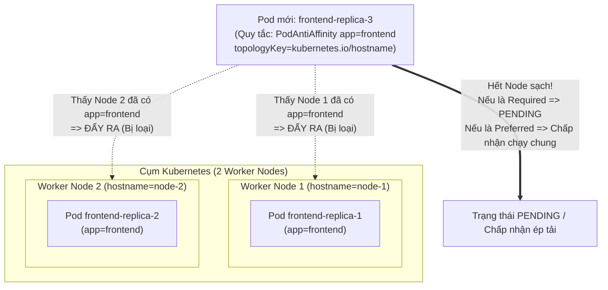

# Bài 26: Node Affinity & Pod Anti-Affinity: Điều khiển phân bố Pod

## 1. Thông tin bài học
* **Tên bài:** Bài 26: Node Affinity & Pod Anti-Affinity: Điều khiển phân bố Pod
* **Mục tiêu học:** Làm chủ các cơ chế điều hướng vị trí Pod nâng cao trong Kubernetes; phân biệt sự khác nhau giữa `nodeSelector` sơ khai và `Node Affinity` hiện đại; nắm vững hai cấp độ ràng buộc sống còn: Ràng buộc Cứng (`requiredDuringSchedulingIgnoredDuringExecution`) và Ràng buộc Mềm (`preferredDuringSchedulingIgnoredDuringExecution`); hiểu sâu cơ chế "hút nhau" (`Pod Affinity`) và "đẩy nhau" (`Pod Anti-Affinity`) giữa các Pod dựa trên `topologyKey`; áp dụng Pod Anti-Affinity phân tán các bản sao của microservice `frontend` (Online Boutique) qua các Node khác nhau để triệt tiêu điểm lỗi đơn lẻ (Single Point of Failure - SPOF).
* **Thời lượng ước tính:** 150 phút (75 phút lý thuyết, 75 phút thực hành)
* **Kiến thức cần có trước:** Bài 07 (Labels, Selectors & Annotations), Bài 09 (Deployment), Bài 25 (Kube-Scheduler: Thuật toán lọc và chấm điểm).
* **Liên quan kỳ thi:** CKAD, CKA (Chủ đề trọng tâm trong phần Scheduling: chiếm 10–15% điểm thi, thí sinh thường xuyên gặp các bài toán yêu cầu gán Pod vào nhóm Node có nhãn chuyên biệt bằng Node Affinity hoặc dùng Pod Anti-Affinity để các replica không nằm chung máy chủ).

---

## 2. Bảng thuật ngữ

| Thuật ngữ | Giải thích đơn giản | Ví dụ / Ẩn dụ đời thường |
| :--- | :--- | :--- |
| **`nodeSelector`** | Cách đơn giản nhất để gán Pod vào Node bằng cách so khớp chính xác cặp nhãn `key: value`. | Quy định học sinh lớp 12A bắt buộc phải vào đúng phòng học có gắn biển "Lớp 12A". |
| **Node Affinity** | Cơ chế gán Pod vào Node nâng cao, hỗ trợ biểu thức logic phong phú (In, NotIn, Exists...) và phân biệt điều kiện bắt buộc vs ưu tiên. | Tiêu chuẩn chọn nhà: Bắt buộc phải có chỗ đỗ ô tô (Hard), nếu gần công viên thì càng tốt (Soft). |
| **RequiredDuringScheduling...** | Ràng buộc **CỨNG (Hard)**: Nếu không có Node nào thỏa mãn, Pod sẽ kiên quyết từ chối chạy và bị kẹt ở trạng thái `Pending`. | Điều kiện thi tuyển phi công: Thị lực bắt buộc phải 10/10; nếu mắt cận thì bị loại ngay lập tức không có ngoại lệ. |
| **PreferredDuringScheduling...** | Ràng buộc **MỀM (Soft)**: Scheduler sẽ cố gắng tìm Node thỏa mãn nhất (chấm điểm cộng), nhưng nếu không có thì vẫn cho Pod chạy trên Node khác. | Nguyện vọng đi ăn trưa: Ưu tiên quán phở bò, nhưng nếu quán phở đóng cửa thì ăn cơm tấm tạm cũng được chứ không nhịn đói. |
| **IgnoredDuringExecution** | Nếu nhãn của Node bị thay đổi sau khi Pod đã khởi chạy thành công, Kubernetes sẽ **bỏ qua** và tiếp tục để Pod chạy chứ không đuổi Pod đi. | Quy chế chuyển trường: Khi vào trường bạn đủ điểm chuẩn; dù sau này trường có tăng điểm chuẩn lên thì bạn vẫn không bị đuổi học. |
| **Pod Affinity** | Quy tắc "hút nhau": Đặt Pod này chạy chung Node hoặc chung Zone với các Pod khác có nhãn tương ứng (để giảm độ trễ mạng). | Đôi bạn thân đi xem phim: Bắt buộc phải mua vé hai ghế ngồi sát cạnh nhau. |
| **Pod Anti-Affinity** | Quy tắc "đẩy nhau": Ngăn cấm không cho các Pod chạy chung Node hoặc chung Zone với nhau (để đảm bảo tính sẵn sàng cao). | Lãnh đạo cấp cao đi công tác: Chủ tịch và Phó chủ tịch không bao giờ đi chung một chuyến bay để tránh rủi ro mất cả hai. |
| **`topologyKey`** | Tên nhãn của Node dùng để định nghĩa phạm vi không gian phân bố (ví dụ: cùng một máy vật lý, cùng một rack tủ mạng, hoặc cùng một Data Center Zone). | Phạm vi địa lý: "Cùng một tòa nhà", "Cùng một quận", hay "Cùng một thành phố". |

---

## 3. Bức tranh lớn: Vấn đề thực tế và ẩn dụ đời thường

### Nhắc lại bài trước
Ở Bài 25, chúng ta đã nắm được hai giai đoạn của Kube-Scheduler: Lọc (Filtering) và Chấm điểm (Scoring). Scheduler mặc định sẽ cố gắng rải đều Pod dựa trên dung lượng tài nguyên. Nhưng trong thực tế, các máy chủ không hề giống nhau, và các Pod cũng có những "mối quan hệ" đặc thù với nhau!

### Tại sao cần cái này ở production? (Vấn đề thực tế)

1. **Sự không đồng nhất của phần cứng (Hardware Heterogeneity):**
   Trong một cụm hạ tầng lớn, bạn có nhiều loại máy chủ:
   * Node có gắn card đồ họa GPU đắt tiền (dành cho AI / Deep Learning).
   * Node có ổ cứng thể rắn siêu tốc SSD NVMe (dành cho Database MongoDB, Redis).
   * Node dùng chip CPU ARM giá rẻ (dành cho các tác vụ nền nhẹ nhàng).
   Nếu để Scheduler tự do xếp chỗ, một container cronjob quét rác vớ vẩn có thể "chiếm đoạt" mất chiếc máy chủ GPU tiền tỷ, trong khi Pod huấn luyện mô hình AI lại bị kẹt vì thiếu phần cứng! Bạn bắt buộc phải có **Node Affinity** để phân loại luồng công việc vào đúng phần cứng.
2. **Nguy cơ sụp đổ toàn bộ hệ thống (Single Point of Failure):**
   Bạn triển khai dịch vụ `frontend` với 3 bản sao (`replicas: 3`) để dự phòng rủi ro. Tuy nhiên, vì Worker Node 1 đang rất rảnh rỗi, Kube-Scheduler thản nhiên gom cả 3 bản sao này đặt lên cùng một Node 1! Lúc 3 giờ sáng, thanh RAM của Node 1 bị chập cháy, máy chủ khởi động lại. Kết quả: **Cả 3 bản sao frontend chết sạch cùng một lúc!** Dịch vụ sập hoàn toàn trong 15 phút. Đây là thảm họa kinh điển nếu không dùng **Pod Anti-Affinity**.
3. **Bài toán tối ưu độ trễ microservices (Data Locality):**
   Dịch vụ `cartservice` gọi Redis hàng chục ngàn lần mỗi giây để lưu giỏ hàng. Nếu `cartservice` nằm ở Datacenter Zone A, còn `redis` nằm ở Zone B, mỗi gói tin phải chạy vòng qua cáp quang mất 5ms. Bằng cách dùng **Pod Affinity**, bạn ép `cartservice` phải nằm "chung một phòng" với Pod Redis, ép độ trễ mạng về mức gần bằng 0ms!

### Ẩn dụ đời thường: Nam châm và Quy tắc sắp xếp văn phòng

Hãy tưởng tượng bạn là người phân bổ chỗ ngồi trong một tòa cao ốc văn phòng:
* **Node Affinity = Tiêu chuẩn chọn văn phòng:**
  * *"Tôi bắt buộc phải ngồi phòng có máy tính cấu hình đồ họa mạnh"* (Hard Node Affinity).
  * *"Tôi thích ngồi phòng có cửa sổ nhìn ra vườn hoa, nhưng nếu hết chỗ thì ngồi phòng kín cũng được"* (Soft Node Affinity).
* **Pod Affinity = Hút nhau (Bạn thân ngồi cùng bàn):**
  * Nhân viên Kế toán và nhân viên Thủ quỹ cần ngồi sát vách nhau (Pod Affinity) để mỗi khi ký duyệt hóa đơn chỉ cần chuyển giấy qua bàn là xong, không phải chạy thang máy giữa các tầng.
* **Pod Anti-Affinity = Đẩy nhau (Cùng cực nam châm):**
  * Hai bạn nhân viên trực tổng đài hỗ trợ sự cố khẩn cấp (Frontend Replicas) không bao giờ được ngồi cùng một phòng. Một bạn ngồi Tầng 1, một bạn ngồi Tầng 2. Nếu lỡ Tầng 1 bị mất điện, bạn ở Tầng 2 vẫn tiếp tục nghe máy phục vụ khách hàng bình thường!

---

## 4. Giải thích khái niệm theo từng bước

### 4.1. Sự tiến hóa: Từ `nodeSelector` lên `Node Affinity`

Ở Bài 07, chúng ta đã biết `nodeSelector`. Hãy so sánh hai cách tiếp cận:

```yaml
# Cách cũ: nodeSelector (Quá đơn giản, chỉ hỗ trợ dấu BẰNG)
spec:
  nodeSelector:
    disktype: ssd

# Cách mới: Node Affinity (Linh hoạt, mạnh mẽ vượt trội)
spec:
  affinity:
    nodeAffinity:
      requiredDuringSchedulingIgnoredDuringExecution:
        nodeSelectorTerms:
        - matchExpressions:
          - key: disktype
            operator: In
            values:
            - ssd
            - nvme
```

Node Affinity mang lại 3 ưu thế vượt trội:
1. **Toán tử logic đa dạng:** Không chỉ có dấu bằng (`=`), mà còn có `In` (nằm trong danh sách), `NotIn` (không nằm trong danh sách), `Exists` (chỉ cần có nhãn đó, không quan tâm giá trị), `DoesNotExist`, `Gt` (lớn hơn), `Lt` (nhỏ hơn).
2. **Hỗ trợ điều kiện mềm (Soft Rule):** Nếu không tìm được Node hoàn hảo, vẫn có thể chạy trên Node thay thế.
3. **Phối hợp nhiều điều kiện:** Cho phép kết hợp các mệnh đề logic VÀ (AND) và HOẶC (OR).

---

### 4.2. Giải mã cú pháp: Hai vế của Affinity

Cái tên dài dòng của Kubernetes thực chất được ghép từ hai vế rất rõ ràng:

$$\underbrace{\text{required} \text{ / } \text{preferred}}_{\text{Vế 1: Lúc Lập lịch (Scheduling)}} \quad + \quad \underbrace{\text{DuringScheduling}} \quad + \quad \underbrace{\text{IgnoredDuringExecution}}_{\text{Vế 2: Lúc Đang chạy (Execution)}}$$

#### Vế 1: Thời điểm lập lịch (`DuringScheduling`)
* **`requiredDuringScheduling...` (Ràng buộc CỨNG):**
  * Tương đương giai đoạn **Lọc (Filtering)** của Kube-Scheduler.
  * Node nào không khớp biểu thức sẽ bị gạch tên ngay lập tức.
  * Nếu không còn Node nào khớp: Pod kẹt ở `Pending`!
* **`preferredDuringScheduling...` (Ràng buộc MỀM):**
  * Tương đương giai đoạn **Chấm điểm (Scoring)** của Kube-Scheduler.
  * Đi kèm với một con số **`weight` (từ 1 đến 100)**.
  * Scheduler sẽ cộng thêm điểm `weight` cho những Node thỏa mãn điều kiện này. Node nào nhiều điểm nhất sẽ trúng tuyển. Nếu không có Node nào thỏa mãn, Pod vẫn vui vẻ chạy trên bất kỳ Node nào còn trống.

#### Vế 2: Thời điểm đang chạy (`IgnoredDuringExecution`)
* Sau khi Pod đã được gán vào Node và đang chạy (`Running`), nếu người quản trị cụm dùng lệnh xóa nhãn hoặc đổi nhãn của Node đó, Kubernetes sẽ **LỜ ĐI (Ignore)** và để Pod tiếp tục chạy cho đến khi Pod tự kết thúc.

---

### 4.3. Pod Affinity và Pod Anti-Affinity: Tương tác giữa các Pod

Khác với Node Affinity (so sánh Pod với nhãn của Node), Pod Affinity và Pod Anti-Affinity **so sánh Pod với nhãn của CÁC POD KHÁC đang chạy trên hệ thống**!

Để làm được việc này, cấu hình cần 3 thông tin quan trọng:
1. **`labelSelector`:** Nhãn của những Pod mục tiêu mà ta muốn "hút" hoặc "đẩy" (ví dụ: `app: redis` hoặc `app: frontend`).
2. **`topologyKey`:** Nhãn của Node xác định phạm vi biên giới địa lý:
   * Nếu dùng `topologyKey: kubernetes.io/hostname`: Biên giới là **từng máy chủ Worker Node riêng lẻ**. (Hai Pod có Anti-Affinity sẽ không được nằm chung một Node).
   * Nếu dùng `topologyKey: topology.kubernetes.io/zone`: Biên giới là **từng Data Center Zone**. (Hai Pod có Anti-Affinity sẽ không được nằm chung một Zone, kể cả ở khác Node).
3. **`namespaces` (tùy chọn):** Phạm vi tìm kiếm Pod mục tiêu (mặc định là cùng namespace hiện tại).



---

## 5. Thực hành (Lab)

* **Môi trường:** Cluster kind 2 node (`lab-control-plane`, `lab-worker`).
* **Mức RAM ước tính:** ~300 MB.
* **Mục tiêu thực hành:**
  1. Gán nhãn môi trường và phần cứng lên Worker Node.
  2. Thực hành Node Affinity cứng (`required`) và mềm (`preferred`).
  3. Cố tình đưa ra điều kiện Node Affinity không thể đáp ứng để chứng kiến Pod bị `Pending`.
  4. Triển khai dịch vụ `frontend` (Online Boutique) áp dụng `podAntiAffinity` để phân tán bản sao.

---

### Bước 1: Gán nhãn cho Worker Node

Xem danh sách nhãn hiện tại của worker node:
```powershell
kubectl get nodes lab-worker --show-labels
```

Bây giờ, chúng ta đóng vai trò kỹ sư hạ tầng gắn thêm 2 nhãn chuyên biệt cho `lab-worker`:
* `hardware=gpu` (máy chủ có gắn card đồ họa)
* `zone=zone-a` (vị trí địa lý tại Zone A)

```powershell
kubectl label nodes lab-worker hardware=gpu zone=zone-a
```

Xác nhận nhãn đã được gắn thành công:
```powershell
kubectl get nodes lab-worker --show-labels | Select-String "hardware=gpu"
```

---

### Bước 2: Triển khai Pod sử dụng Node Affinity Cứng (Required)

Tạo file manifest `node-affinity-hard.yaml`:
Pod này yêu cầu **BẮT BUỘC** phải chạy trên Node có nhãn `hardware` nằm trong danh sách `[gpu, tpu]`:

```powershell
@'
apiVersion: v1
kind: Pod
metadata:
  name: ai-model-pod
spec:
  affinity:
    nodeAffinity:
      requiredDuringSchedulingIgnoredDuringExecution:
        nodeSelectorTerms:
        - matchExpressions:
          - key: hardware
            operator: In
            values:
            - gpu
            - tpu
  containers:
  - name: model-worker
    image: busybox:1.36
    command: ["sleep", "3600"]
'@ | Set-Content -Encoding utf8 node-affinity-hard.yaml

kubectl apply -f node-affinity-hard.yaml
```

Kiểm tra xem Pod đã được đưa về đúng `lab-worker` hay chưa:
```powershell
kubectl get pod ai-model-pod -o wide
```
**Kết quả mong đợi:**
```text
NAME           READY   STATUS    RESTARTS   AGE   IP           NODE         NOMINATED NODE   READINESS GATES
ai-model-pod   1/1     Running   0          10s   10.244.1.X   lab-worker   <none>           <none>
```

---

### Bước 3: Thử nghiệm Node Affinity Cứng thất bại và quan sát `Pending`

Bây giờ tạo một Pod đòi hỏi nhãn `hardware: quantum-chip` (chip lượng tử - điều kiện mà không có bất kỳ Node nào trong cụm đáp ứng được):

```powershell
@'
apiVersion: v1
kind: Pod
metadata:
  name: quantum-pod
spec:
  affinity:
    nodeAffinity:
      requiredDuringSchedulingIgnoredDuringExecution:
        nodeSelectorTerms:
        - matchExpressions:
          - key: hardware
            operator: In
            values:
            - quantum-chip
  containers:
  - name: quantum-worker
    image: busybox:1.36
    command: ["sleep", "3600"]
'@ | Set-Content -Encoding utf8 quantum-pod.yaml

kubectl apply -f quantum-pod.yaml
```

Kiểm tra trạng thái của Pod:
```powershell
kubectl get pod quantum-pod
```
**Kết quả mong đợi:**
```text
NAME          READY   STATUS    RESTARTS   AGE
quantum-pod   0/1     Pending   0          6s
```

Điều tra nhật ký sự kiện của Kube-Scheduler:
```powershell
kubectl describe pod quantum-pod
```
**Đoạn Event cốt lõi:**
```text
Events:
  Type     Reason            Age   From               Message
  ----     ------            ----  ----               -------
  Warning  FailedScheduling  12s   default-scheduler  0/2 nodes are available: 1 node(s) didn't match Pod's node affinity/selector, 1 node(s) had untolerated taint.
```
> [!NOTE]
> Thông điệp chỉ rõ: 1 node (`lab-worker`) bị trượt vì không khớp Node Affinity (`didn't match Pod's node affinity/selector`), node còn lại (`lab-control-plane`) bị trượt vì có Taint. Do là điều kiện `required`, Pod chấp nhận đứng chờ mãi mãi chứ không chạy trên máy chủ sai tiêu chuẩn!

Dọn dẹp:
```powershell
kubectl delete -f quantum-pod.yaml
Remove-Item quantum-pod.yaml -ErrorAction SilentlyContinue
```

---

### Bước 4: Triển khai Pod Anti-Affinity cho microservice frontend (Online Boutique)

Trong môi trường thực tế, chúng ta muốn các bản sao `frontend` không bao giờ nằm chung trên một Worker Node vật lý. Nhưng nếu cụm chỉ có ít Node hơn số lượng bản sao thì sao?  
Giải pháp chuẩn mực của Platform SRE là sử dụng **`preferredDuringSchedulingIgnoredDuringExecution` (Ràng buộc mềm)** với trọng số tối đa `weight: 100`.

Tạo file manifest `frontend-ha.yaml`:

```powershell
@'
apiVersion: apps/v1
kind: Deployment
metadata:
  name: frontend-ha
  labels:
    app: frontend-ha
spec:
  replicas: 2
  selector:
    matchLabels:
      app: frontend-ha
  template:
    metadata:
      labels:
        app: frontend-ha
    spec:
      affinity:
        podAntiAffinity:
          preferredDuringSchedulingIgnoredDuringExecution:
          - weight: 100
            podAffinityTerm:
              labelSelector:
                matchExpressions:
                - key: app
                  operator: In
                  values:
                  - frontend-ha
              # Phân tán dựa trên từng máy chủ riêng lẻ
              topologyKey: kubernetes.io/hostname
      containers:
      - name: server
        image: gcr.io/google-samples/microservices-demo/frontend:v0.10.1
        ports:
        - containerPort: 8080
        env:
        - name: PORT
          value: "8080"
        resources:
          requests:
            cpu: "50m"
            memory: "64Mi"
          limits:
            cpu: "150m"
            memory: "128Mi"
'@ | Set-Content -Encoding utf8 frontend-ha.yaml

kubectl apply -f frontend-ha.yaml
```

Quan sát quá trình lập lịch của 2 bản sao:
```powershell
kubectl get pods -l app=frontend-ha -o wide
```

**Phân tích kết quả thực tế trên cụm Kind (1 worker):**
Vì cụm lab của chúng ta chỉ có duy nhất 1 worker node (`lab-worker`), còn `lab-control-plane` mang Taint `NoSchedule`.  
Nhờ cấu hình **`preferred`**, Kube-Scheduler sẽ:
1. Bản sao thứ nhất xếp vào `lab-worker`.
2. Bản sao thứ hai: Scheduler thấy `lab-worker` đã có Pod `app=frontend-ha` nên trừ điểm. Nhưng vì không còn Node nào khác có thể chạy được, quy tắc mềm cho phép nó **vẫn được xếp vào `lab-worker` để ứng dụng tiếp tục hoạt động** thay vì bị chết treo ở `Pending`!
> [!TIP]
> Đây chính là sự vượt trội của `preferred` so với `required`. Nếu bạn dùng `required`, bản sao thứ 2 sẽ bị dính `Pending` vĩnh viễn và bạn chỉ chạy được đúng 1 bản sao, làm lãng phí năng lực tính toán!

---

### Bước 5: Dọn dẹp tài nguyên (Cleanup)

Xóa toàn bộ các tài nguyên và gỡ bỏ nhãn thí nghiệm trên Node:

```powershell
kubectl delete -f node-affinity-hard.yaml
kubectl delete -f frontend-ha.yaml

# Gỡ nhãn trên lab-worker bằng cách thêm dấu trừ (-) vào sau tên nhãn
kubectl label nodes lab-worker hardware- zone-

# Xóa các file manifest tạm
Remove-Item node-affinity-hard.yaml, frontend-ha.yaml -ErrorAction SilentlyContinue
```

Xác nhận nhãn đã sạch sẽ:
```powershell
kubectl get nodes lab-worker --show-labels | Select-String "hardware"
```
*(Không có kết quả trả về tức là nhãn đã được gỡ bỏ hoàn toàn).*

---

## 6. Lỗi thường gặp và cách debug

### Lỗi 1: Pod bị kẹt `Pending` do sai cú pháp toán tử hoặc gõ nhầm tên nhãn
* **Dấu hiệu:** Pod không chịu chạy, `kubectl describe pod` báo `0/X nodes available: X node(s) didn't match Pod's node affinity/selector`.
* **Nguyên nhân:**
  * Nhãn trong Kubernetes **phân biệt chữ hoa - chữ thường (Case-sensitive)**. Ví dụ: Node mang nhãn `Zone: Zone-A` nhưng manifest lại tìm `zone: zone-a`.
  * Dùng toán tử `Exists` nhưng lại khai báo thêm mảng `values: [...]` (toán tử `Exists` không chấp nhận `values`).
* **Cách debug và sửa:**
  1. Kiểm tra chính xác nhãn thực tế của Node:
     `kubectl get node <name> --show-labels`
  2. Rà soát kỹ trường `operator` trong YAML. Nếu dùng `Exists` hoặc `DoesNotExist`, hãy bỏ hẳn khối `values`.

---

### Lỗi 2: Pod Anti-Affinity dạng `required` làm cản trở quá trình Rolling Update hoặc Auto-scaling
* **Dấu hiệu:** Bạn có 3 Worker Node. Deployment có `replicas: 3` chạy bình thường với `podAntiAffinity: required`. Khi bạn cập nhật phiên bản mới (Rolling Update), Deployment cố gắng tạo Pod thứ 4 (theo cơ chế `maxSurge: 25%`) nhưng Pod mới bị kẹt ở `Pending`!
* **Nguyên nhân:** Vì cả 3 Node hiện tại đều đã chứa sẵn một Pod của Deployment đó rồi. Pod thứ 4 không thể chui vào bất kỳ Node nào vì bị quy tắc CỨNG (Required Anti-Affinity) chặn lại.
* **Cách debug và sửa:**
  1. Chuyển sang dùng `preferredDuringSchedulingIgnoredDuringExecution` với trọng số cao (`weight: 100`).
  2. Hoặc cấu hình Rolling Update strategy với `maxSurge: 0` và `maxUnavailable: 1` (chấp nhận tắt 1 Pod cũ trước để giải phóng chỗ cho Pod mới).

---

### Lỗi 3: Kube-Scheduler bị chậm đơ và ngốn 100% CPU do lạm dụng Pod Affinity
* **Dấu hiệu:** Khi triển khai hàng trăm Deployment trong cụm lớn, thời gian lập lịch cho một Pod mới tăng từ vài mili-giây lên tới vài chục giây.
* **Nguyên nhân:** Thuật toán tính toán `Pod Affinity` và `Pod Anti-Affinity` có độ phức tạp thuật toán là $\mathcal{O}(N \times M)$ (trong đó $N$ là số lượng Node và $M$ là tổng số Pod hiện có trong cụm). Kube-Scheduler phải duyệt qua toàn bộ từng Pod trên từng Node để kiểm tra nhãn!
* **Cách debug và sửa:**
  1. Hạn chế tối đa việc dùng Pod Affinity bừa bãi; chỉ áp dụng cho các dịch vụ thực sự cần thiết.
  2. Luôn thu hẹp phạm vi tìm kiếm bằng cách chỉ định rõ trường `namespaces: ["production"]` thay vì để Scheduler quét toàn bộ cluster.

---

## 7. Góc nhìn Senior

### 1. Sự đánh đổi (Trade-offs): Hard Constraint vs Soft Constraint

| Tiêu chí | Cấu hình CỨNG (`required...`) | Cấu hình MỀM (`preferred...`) |
| :--- | :--- | :--- |
| **Mức độ bảo đảm** | Tuyệt đối 100%: Đúng tiêu chuẩn mới chạy. | Tương đối: Cố gắng hết sức theo nguyên tắc Best-effort. |
| **Tính linh hoạt khi có sự cố** | Rất kém: Khi một Node bị hỏng, Pod không thể chạy dồn sang Node khác $\rightarrow$ Gây gián đoạn dịch vụ. | Rất cao: Tự động dồn tải sang các Node còn lại để giữ cho hệ thống sống sót. |
| **Rủi ro vận hành** | Dễ gây kẹt `Pending` hàng loạt nếu hạ tầng không mở rộng kịp. | Có thể vô tình làm giảm tính sẵn sàng cao (nếu các replica bị dồn chung 1 node). |
| **Khuyến nghị sử dụng** | Bắt buộc cho Node Affinity phần cứng (ví dụ: cần GPU thì bắt buộc phải là Node có GPU). | Khuyến nghị cho Pod Anti-Affinity (rải đều bản sao dự phòng). |

---

### 2. Best practices tại production

1. **Chuẩn hóa hệ thống nhãn Node (Node Labeling Governance):**
   * Sử dụng nhãn chuẩn do Kubernetes tự động sinh ra:
     * `kubernetes.io/hostname`: Tên máy chủ.
     * `topology.kubernetes.io/zone`: Tên Zone (ví dụ: `ap-southeast-1a`).
     * `topology.kubernetes.io/region`: Tên Region (ví dụ: `ap-southeast-1`).
     * `kubernetes.io/arch`: Kiến trúc CPU (`amd64`, `arm64`).
   * Tuyệt đối không tự bịa ra các nhãn lung tung gây khó khăn cho việc tự động hóa CI/CD.
2. **Quy tắc vàng cho Pod Anti-Affinity:**
   * **99% trường hợp thực tế nên dùng `preferred` với `weight: 100`** thay vì `required`. Điều này giúp cụm của bạn vừa đạt được mục tiêu phân tán rủi ro trong điều kiện bình thường, vừa không làm chết ứng dụng khi gặp sự cố thiếu Node hoặc trong quá trình bảo trì Node (Drain Node).
3. **Hiện đại hóa với `Topology Spread Constraints`:**
   * Trong các phiên bản Kubernetes mới, chuẩn mực công nghiệp đang chuyển dịch từ Pod Anti-Affinity sang **`topologySpreadConstraints`**. Tính năng này cho phép bạn định nghĩa độ lệch tối đa (`maxSkew: 1`) giữa các Zone/Node, giúp phân bổ tải đều tuyệt đối mà không bị các tác dụng phụ của Anti-Affinity.

---

### 3. Câu hỏi phỏng vấn Senior

* **Câu hỏi 1:** *Hãy giải thích ý nghĩa tường minh của cụm từ `requiredDuringSchedulingIgnoredDuringExecution`. Nếu trong tương lai Kubernetes bổ sung thêm tính năng `requiredDuringSchedulingRequiredDuringExecution`, điều gì sẽ xảy ra khi quản trị viên xóa nhãn của một Node đang chạy?*
* **Gợi ý trả lời chuẩn:**
  * `requiredDuringScheduling`: Tại thời điểm lập lịch, điều kiện này là **bắt buộc**. Nếu không có Node nào thỏa mãn, Pod sẽ không được gán vào Node và chuyển sang `Pending`.
  * `IgnoredDuringExecution`: Sau khi Pod đã chạy (`Running`), mọi thay đổi về nhãn trên Node sẽ bị **bỏ qua**. Pod tiếp tục chạy mà không bị ảnh hưởng.
  * Nếu có `RequiredDuringExecution`: Khi một Node đang chạy một Pod khớp nhãn, nếu ai đó xóa hoặc sửa nhãn của Node khiến nó không còn thỏa mãn điều kiện nữa, Kubelet hoặc Controller sẽ **ngay lập tức trục xuất (Evict/Terminate) Pod đó ra khỏi Node** để chuyển đi nơi khác.

* **Câu hỏi 2:** *Khi nào ta nên sử dụng `podAffinity` và khi nào nên tránh dùng? Đưa ra một ví dụ kiến trúc microservice cụ thể.*
* **Gợi ý trả lời chuẩn:**
  * **Nên dùng:** Khi hai dịch vụ có sự phụ thuộc lẫn nhau rất lớn về mặt lưu lượng mạng và độ trễ (Heavy Network Coupling).  
    * *Ví dụ:* Dịch vụ `cartservice` và in-memory cache `redis-cart`. Bằng cách cấu hình `podAffinity` với `topologyKey: kubernetes.io/hostname`, hai Pod này sẽ luôn được Scheduler đặt lên cùng một Worker Node vật lý. Giao tiếp giữa chúng chỉ đi qua card mạng ảo loopback/veth pair của máy, loại bỏ hoàn toàn độ trễ switch mạng vật lý giữa các máy chủ (từ 2–3ms xuống dưới 0.1ms).
  * **Tránh dùng:** Khi cụm có quy mô lớn (hàng ngàn Pod) vì làm suy giảm nghiêm trọng hiệu năng của Kube-Scheduler; hoặc khi hai dịch vụ đều tiêu thụ tài nguyên cực lớn (ví dụ hai Pod ăn 90% RAM của node), việc ép chúng nằm chung một node sẽ dẫn đến nguy cơ OOM sập node.

---

## 8. Tóm tắt bài học
* 📌 **1. Node Affinity:** Sự nâng cấp vượt bậc của `nodeSelector`, hỗ trợ toán tử phong phú (`In`, `NotIn`, `Exists`...) để lái Pod vào đúng phần cứng mong muốn.
* 📌 **2. Cứng (Required) vs Mềm (Preferred):** `Required` là điều kiện tiên quyết (không có thì `Pending`); `Preferred` đi kèm `weight` (cố gắng tìm nhưng nếu không có thì vẫn chấp nhận chạy trên Node khác).
* 📌 **3. Ý nghĩa `IgnoredDuringExecution`:** Thay đổi nhãn Node lúc runtime sẽ không làm gián đoạn các Pod đang chạy.
* 📌 **4. Pod Affinity & Anti-Affinity:** Điều khiển quan hệ giữa các Pod với nhau; Pod Affinity để kéo các dịch vụ gần nhau giảm latency; Pod Anti-Affinity để rải các bản sao ra các Node/Zone khác nhau nhằm chống sập dây chuyền.
* 📌 **5. Khuyến nghị thực tế:** Luôn ưu tiên `preferredDuringScheduling` cho Pod Anti-Affinity trên môi trường sản xuất để hệ thống giữ được tính co giãn linh hoạt.

---

## 9. Bài tập tự làm

* 🟢 **Mức Dễ:** Gán nhãn `env=production` cho node `lab-worker`. Viết một Pod manifest chạy `nginx:alpine` sử dụng `nodeAffinity` dạng `required` yêu cầu `env In [production]`. Kiểm tra xem Pod có chạy trên `lab-worker` hay không.
* 🟡 **Mức Vừa:** Tạo một Deployment có tên `cache-cluster` gồm 2 replica Redis. Cấu hình `podAntiAffinity` dạng `required` với `topologyKey: kubernetes.io/hostname`. Triển khai lên cụm kind hiện tại (1 worker node) và quan sát: Tại sao replica thứ nhất chạy được nhưng replica thứ hai bị kẹt `Pending`? Dùng `kubectl describe` để đọc thông báo lỗi.
* 🔴 **Mức Khó:** Viết một Pod manifest cho dịch vụ web sao cho nó thỏa mãn đồng thời 2 yêu cầu:
  1. Bắt buộc phải chạy trên Node có nhãn `zone In [zone-a, zone-b]`.
  2. Ưu tiên cao nhất (`weight: 80`) chạy trên Node có nhãn `disktype: ssd`, nhưng nếu không có SSD thì ưu tiên nhì (`weight: 20`) chạy trên Node có nhãn `disktype: hdd`.

---

## 10. Câu hỏi tự kiểm tra

1. Nếu bạn khai báo nhiều phần tử trong mảng `nodeSelectorTerms`, Kube-Scheduler sẽ xử lý theo logic VÀ (AND) hay HOẶC (OR)?
2. Trong một `matchExpressions`, nếu bạn liệt kê nhiều biểu thức kiểm tra, Scheduler sẽ xử lý theo logic VÀ (AND) hay HOẶC (OR)?
3. `topologyKey` trong Pod Anti-Affinity có vai trò gì? Điều gì xảy ra nếu bạn đặt một `topologyKey` không tồn tại trên bất kỳ Node nào?
4. Tại sao người ta lại khuyến nghị dùng `preferredDuringScheduling` thay vì `requiredDuringScheduling` cho Pod Anti-Affinity của các Deployment web thông thường?
5. Nếu một Pod đang chạy trên Worker Node A nhờ nhãn `hardware=gpu`, sau đó kỹ sư hạ tầng xóa nhãn `hardware` trên Node A đi, Pod đó có bị Kubelet tắt đi hay không? Vì sao?

<details>
<summary>👉 Bấm vào đây để xem đáp án câu hỏi tự kiểm tra</summary>

* **Câu 1:** Xử lý theo logic **HOẶC (OR)**! Chỉ cần Node thỏa mãn BẤT KỲ một `nodeSelectorTerm` nào trong danh sách là Node đó đã vượt qua bài kiểm tra.
* **Câu 2:** Xử lý theo logic **VÀ (AND)**! Một Node bắt buộc phải thỏa mãn TẤT CẢ các `matchExpressions` bên trong cùng một `nodeSelectorTerm` thì mới được tính là hợp lệ.
* **Câu 3:** `topologyKey` xác định phạm vi biên giới mà quy tắc đẩy nhau được áp dụng (ví dụ: máy chủ, rack, hay zone). Nếu `topologyKey` không tồn tại trên Node, Kube-Scheduler sẽ coi như không có Node nào thỏa mãn và Pod (nếu là required) sẽ bị kẹt ở trạng thái `Pending`.
* **Câu 4:** Vì nếu dùng `required`, số lượng bản sao tối đa của bạn sẽ bị giới hạn cứng bằng đúng số lượng Node vật lý trong cụm. Khi cần scale-out vượt quá số Node, hoặc trong lúc Rolling Update (`maxSurge`), các Pod mới sẽ bị dính lỗi `Pending` làm tê liệt việc triển khai.
* **Câu 5:** Pod **KHÔNG bị tắt đi**! Lý do nằm ở vế `IgnoredDuringExecution`: Kubernetes quy định việc kiểm tra chỉ diễn ra ở thời điểm lập lịch (`DuringScheduling`); khi Pod đã chạy thì mọi thay đổi về nhãn sau đó đều bị bỏ qua.
</details>

---

## 11. Tài liệu đọc thêm và bài tiếp theo

### Tài liệu tham khảo
* [Kubernetes Documentation: Assigning Pods to Nodes](https://kubernetes.io/docs/concepts/scheduling-eviction/assign-pod-node/)
* [Kubernetes Documentation: Pod Topology Spread Constraints](https://kubernetes.io/docs/concepts/scheduling-eviction/topology-spread-constraints/)
* [Kubernetes Documentation: Well-Known Labels, Annotations and Taints](https://kubernetes.io/docs/reference/labels-annotations-taints/)

### Bài tiếp theo
👉 **Bài 27: Taints & Tolerations: Xua đuổi và dung thứ trên Node**

---

## PHỤ LỤC: ĐÁP ÁN GỢI Ý BÀI TẬP TỰ LÀM (MỤC 9)

### Đáp án Mức Dễ
```powershell
# 1. Gán nhãn cho node
kubectl label node lab-worker env=production

# 2. Tạo file manifest
@'
apiVersion: v1
kind: Pod
metadata:
  name: easy-nginx-pod
spec:
  affinity:
    nodeAffinity:
      requiredDuringSchedulingIgnoredDuringExecution:
        nodeSelectorTerms:
        - matchExpressions:
          - key: env
            operator: In
            values:
            - production
  containers:
  - name: nginx
    image: nginx:alpine
'@ | Set-Content -Encoding utf8 easy-nginx.yaml

kubectl apply -f easy-nginx.yaml
kubectl get pod easy-nginx-pod -o wide

# Dọn dẹp
kubectl delete -f easy-nginx.yaml
kubectl label node lab-worker env-
Remove-Item easy-nginx.yaml -ErrorAction SilentlyContinue
```

---

### Đáp án Mức Vừa
```powershell
# Tạo deployment Redis với Required Anti-Affinity
@'
apiVersion: apps/v1
kind: Deployment
metadata:
  name: cache-cluster
spec:
  replicas: 2
  selector:
    matchLabels:
      app: cache-cluster
  template:
    metadata:
      labels:
        app: cache-cluster
    spec:
      affinity:
        podAntiAffinity:
          requiredDuringSchedulingIgnoredDuringExecution:
          - labelSelector:
              matchExpressions:
              - key: app
                operator: In
                values:
                - cache-cluster
            topologyKey: kubernetes.io/hostname
      containers:
      - name: redis
        image: redis:alpine
'@ | Set-Content -Encoding utf8 cache-cluster.yaml

kubectl apply -f cache-cluster.yaml

# Kiểm tra trạng thái:
kubectl get pods -l app=cache-cluster
# Kết quả: 1 Pod Running, 1 Pod Pending!

# Đọc nguyên nhân:
# kubectl describe pod <pending-pod-name>
# Event: 0/2 nodes are available: 1 node(s) had untolerated taint, 1 node(s) didn't match pod anti-affinity rules.
# Giải thích: Cụm chỉ có 1 worker node, bản sao 1 đã chiếm node đó rồi, bản sao 2 bị luật CỨNG đuổi ra nên không còn node nào khác để chạy.

# Dọn dẹp
kubectl delete -f cache-cluster.yaml
Remove-Item cache-cluster.yaml -ErrorAction SilentlyContinue
```

---

### Đáp án Mức Khó
File cấu hình hoàn chỉnh kết hợp cả Required và đa tầng Preferred có trọng số:
```yaml
apiVersion: v1
kind: Pod
metadata:
  name: complex-web-pod
spec:
  affinity:
    nodeAffinity:
      # 1. Yêu cầu CỨNG: Bắt buộc thuộc zone-a hoặc zone-b
      requiredDuringSchedulingIgnoredDuringExecution:
        nodeSelectorTerms:
        - matchExpressions:
          - key: zone
            operator: In
            values:
            - zone-a
            - zone-b
      # 2. Yêu cầu MỀM: Ưu tiên SSD (weight 80), nhì là HDD (weight 20)
      preferredDuringSchedulingIgnoredDuringExecution:
      - weight: 80
        preference:
          matchExpressions:
          - key: disktype
            operator: In
            values:
            - ssd
      - weight: 20
        preference:
          matchExpressions:
          - key: disktype
            operator: In
            values:
            - hdd
  containers:
  - name: web
    image: nginx:alpine
```

