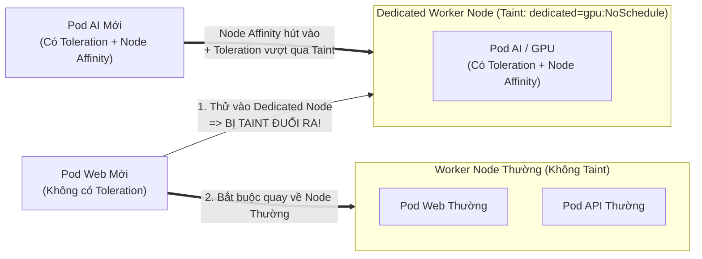

# Bài 27: Taints & Tolerations: Xua đuổi và dung thứ trên Node

## 1. Thông tin bài học
* **Tên bài:** Bài 27: Taints & Tolerations: Xua đuổi và dung thứ trên Node
* **Mục tiêu học:** Nắm vững cơ chế "xua đuổi" (Taints) trên máy chủ và "giấy thông hành dung thứ" (Tolerations) trên Pod; hiểu sâu 3 hiệu ứng sống còn: `NoSchedule`, `PreferNoSchedule` và `NoExecute`; làm chủ công thức phối hợp kinh điển giữa Taints, Tolerations và Node Affinity để tạo ra các nhóm máy chủ chuyên dụng (Dedicated Nodes) an toàn tuyệt đối; giải mã cơ chế Kubelet tự động di tản Pod khi phần cứng gặp sự cố thông qua các Taint hệ thống mặc định (`not-ready`, `unreachable`); thực hành áp dụng trên cụm kind và bảo vệ các microservice nhạy cảm của Online Boutique.
* **Thời lượng ước tính:** 120 phút (60 phút lý thuyết, 60 phút thực hành)
* **Kiến thức cần có trước:** Bài 05 (Kiến trúc Control Plane & Worker Node), Bài 25 (Kube-Scheduler: Lọc và Chấm điểm), Bài 26 (Node Affinity & Pod Anti-Affinity).
* **Liên quan kỳ thi:** CKAD, CKA (Trọng tâm cấu phần Scheduling chiếm 15% tổng điểm thi CKA/CKAD: đề thi luôn có các câu hỏi bắt buộc thí sinh đặt Taint lên node để cấm tải thường, cấp Toleration cho Pod đặc quyền, và giải cứu các Pod bị Pending do dính lỗi `untolerated taint`).

---

## 2. Bảng thuật ngữ

| Thuật ngữ | Giải thích đơn giản | Ví dụ / Ẩn dụ đời thường |
| :--- | :--- | :--- |
| **Taint** | "Vết nhơ" hoặc thuộc tính xua đuổi được đặt lên Node; khiến Node chủ động từ chối không cho các Pod thông thường đặt chân vào. | Biển cảnh báo: "Khu vực nguy hiểm có hóa chất độc hại, người không phận sự cấm vào". |
| **Toleration** | "Sự dung thứ" hoặc "giấy thông hành" được khai báo trong Pod spec; cho phép Pod chịu đựng được vết nhơ và được phép chạy trên Node đó. | Bộ quần áo bảo hộ chuyên dụng hoặc thẻ ra vào đặc biệt cho phép kỹ sư bước qua cửa khu vực hóa chất. |
| **`NoSchedule`** | Hiệu ứng Taint cứng: Scheduler tuyệt đối không xếp các Pod mới vào Node này nếu Pod không có Toleration. Các Pod đang chạy sẵn không bị đuổi. | Quy định đóng cửa kiểm soát: Từ chối nhận khách mới, nhưng những vị khách đã vào bên trong từ trước vẫn được ở lại. |
| **`PreferNoSchedule`** | Hiệu ứng Taint mềm: Scheduler sẽ cố gắng tránh xếp Pod vào Node này, nhưng nếu toàn bộ cụm hết sạch chỗ thì vẫn đành chấp nhận cho vào. | Khách sạn khuyến cáo: "Tầng này đang sơn lại hơi có mùi", nhưng nếu cháy phòng thì khách vẫn chấp nhận ở tạm. |
| **`NoExecute`** | Hiệu ứng Taint nghiêm khắc nhất: Không cho Pod mới vào, và **TRỤC XUẤT (Evict) ngay lập tức** các Pod đang chạy sẵn nếu chúng không có Toleration. | Tiếng chuông báo cháy reo: Toàn bộ cư dân trong tòa nhà bị bảo vệ sơ tán ra ngoài ngay tức khắc. |
| **`tolerationSeconds`** | Khoảng thời gian (tính bằng giây) mà một Pod được phép nán lại trên Node sau khi Node bị dính Taint `NoExecute` trước khi chính thức bị đuổi. | Thời gian ân hạn 15 phút để thu dọn hành lý trước khi bảo vệ khóa cửa tòa nhà. |
| **Dedicated Node** | Máy chủ được cấu hình dành riêng 100% cho một nhóm ứng dụng đặc thù (như Database, AI/GPU), cách ly hoàn toàn khỏi các ứng dụng khác. | Khu vực phòng VIP chuyên biệt tại sân bay chỉ dành riêng cho khách hàng mua vé hạng thương gia. |

---

## 3. Bức tranh lớn: Vấn đề thực tế và ẩn dụ đời thường

### Nhắc lại bài trước
Ở Bài 26, chúng ta đã học về **Node Affinity** – cơ chế mà ở đó **Pod chủ động chọn Node** (Pod nói: *"Tôi thích chạy trên Node có gắn nhãn SSD"*). Nhưng Node Affinity có một điểm yếu chí mạng: nó chỉ hút Pod mong muốn, chứ **KHÔNG HỀ NGĂN CẢN** các Pod linh tinh khác nhảy vào tranh chỗ! Nếu bạn có một máy chủ gắn card GPU đắt tiền, dù bạn đã đặt Node Affinity cho Pod AI, thì các Pod web thông thường vẫn có thể thản nhiên chui vào chiếm hết RAM của máy chủ đó. Hôm nay, chúng ta sẽ học cơ chế ngược lại: **Node chủ động xua đuổi Pod** thông qua **Taints & Tolerations**.

### Tại sao cần cái này ở production? (Vấn đề thực tế)

1. **Bảo vệ phần cứng chuyên dụng (Dedicated Infrastructure):**
   Một Node GPU phục vụ mô hình học máy (Machine Learning) có giá thuê hàng ngàn USD mỗi tháng. Nếu lập trình viên vô tình deploy một ứng dụng quét rác hoặc ghi log không đặt giới hạn tài nguyên vào Node này, toàn bộ tiến trình huấn luyện AI sẽ bị tắc nghẽn hoặc sập do thiếu tài nguyên. Ta bắt buộc phải đặt một "hàng rào bảo vệ" (Taint) để chặn đứng mọi Pod bình thường.
2. **Bảo vệ sự sống còn của Control Plane (Master Node Isolation):**
   Tại sao các Pod ứng dụng của bạn không bao giờ bị xếp vào chạy chung trên các máy chủ Control Plane (nơi chạy `etcd`, `apiserver`)? Chính là nhờ Kubernetes tự động gắn Taint `node-role.kubernetes.io/control-plane:NoSchedule` lên các Node quản trị. Nếu không có Taint này, một container ứng dụng bị rò rỉ RAM có thể "bóp nghẹt" `etcd`, làm sập toàn bộ hệ điều hành của cả cụm!
3. **Tự động sơ tán Pod khi phần cứng gặp sự cố (Node Evacuation):**
   Khi một Worker Node bị đứt dây mạng hoặc ổ cứng bị lỗi, Kubelet sẽ tự động đóng dấu Taint `node.kubernetes.io/unreachable:NoExecute` lên Node đó. Nhờ cơ chế này, toàn bộ các Pod đang chạy trên máy chủ hỏng sẽ tự động bị trục xuất và được ReplicaSet/Deployment hồi sinh trên các máy chủ khỏe mạnh khác một cách hoàn toàn tự động!

### Ẩn dụ đời thường: Biển cấm và Bộ đồ bảo hộ

Hãy hình dung Worker Node giống như một căn phòng trong nhà máy:
* **Taint = Mùi sơn mới nồng nặc trong phòng:** Cửa phòng treo biển cảnh báo: `mui-son=nang:NoSchedule`.
* **Pod thông thường:** Người bình thường đi ngang qua ngửi thấy mùi sơn sẽ lập tức quay xe bỏ đi (Scheduler gạch tên Node này trong vòng Lọc).
* **Toleration = Mặt nạ phòng độc:** Một người thợ sơn (Pod chuyên dụng) có trang bị mặt nạ phòng độc ghi rõ: *"Tôi chịu được `mui-son=nang`"*. Người thợ này thản nhiên bước vào phòng làm việc bình thường.
* **Lưu ý tối quan trọng:** Chiếc mặt nạ phòng độc (Toleration) chỉ giúp người thợ **không bị ngạt thở khi vào phòng sơn**, chứ nó **KHÔNG ÉP BUỘC** người thợ nhất định phải vào phòng đó! Người thợ vẫn có thể đi sang các căn phòng sạch sẽ khác để ngồi. Muốn bắt buộc người thợ phải vào đúng phòng sơn, bạn phải kết hợp thêm mệnh lệnh phân công công việc (Node Affinity)!

---

## 4. Giải thích khái niệm theo từng bước

### 4.1. Cấu trúc của một Taint

Một Taint được đặt lên Node luôn bao gồm 3 thành phần theo cú pháp:
$$\text{key}=\text{value}:\text{effect}$$
* **`key`:** Tên định danh của vết nhơ (ví dụ: `hardware`, `environment`, `dedicated`).
* **`value`:** Giá trị đi kèm (ví dụ: `gpu`, `production`, `database`). *Lưu ý: value có thể để trống.*
* **`effect`:** Mức độ trừng phạt / xua đuổi đối với các Pod không có giấy thông hành.

Có đúng **3 loại Effect** được Kubernetes hỗ trợ:

| Taint Effect | Khi lập lịch (Scheduling) | Khi đang chạy (Runtime) | Mức độ nghiêm khắc |
| :--- | :--- | :--- | :--- |
| **`NoSchedule`** | Chặn đứng hoàn toàn. Pod mới không thể được xếp vào Node. | Bỏ qua. Các Pod cũ đang chạy từ trước vẫn tiếp tục sống an toàn. | Nghiêm ngặt (Phổ biến nhất). |
| **`PreferNoSchedule`** | Cố gắng tránh. Scheduler chỉ xếp Pod vào nếu không còn bất kỳ Node nào khác. | Bỏ qua. Không ảnh hưởng các Pod đang chạy. | Cảnh báo / Linh hoạt. |
| **`NoExecute`** | Chặn đứng hoàn toàn. | **Trục xuất ngay lập tức!** Các Pod cũ không có Toleration sẽ bị giết. | Nghiêm ngặt tuyệt đối (Dùng khi cứu hộ / lỗi phần cứng). |

---

### 4.2. Khai báo Toleration trong Pod spec

Một Pod muốn được phép chạy trên Node có Taint thì trong `pod.spec` phải có khối `tolerations`.

Có hai cách so khớp Toleration thông qua toán tử **`operator`**:

#### Cách 1: So khớp chính xác (`operator: Equal`)
Yêu cầu khớp chính xác cả `key`, `value` và `effect`:
```yaml
tolerations:
- key: "dedicated"
  operator: "Equal"
  value: "cartservice"
  effect: "NoSchedule"
```

#### Cách 2: So khớp theo sự tồn tại (`operator: Exists`)
Chỉ cần Node có Taint mang `key` đó (không quan tâm `value` là gì):
```yaml
tolerations:
- key: "dedicated"
  operator: "Exists"
  effect: "NoSchedule"
```
*Đặc biệt:* Nếu bạn bỏ trống cả `key` lẫn `effect` và chỉ khai báo `operator: Exists`, Pod đó sẽ trở thành "siêu nhân" – có khả năng dung thứ cho **MỌI Taint** trên đời (thường chỉ dùng cho DaemonSet của hệ thống mạng/giám sát như Calico, Prometheus Node Exporter).

---

### 4.3. Công thức vàng cho Dedicated Nodes (Cách ly máy chủ 100%)

Nhiều kỹ sư mới thường mắc sai lầm: Đặt Taint lên Node, gán Toleration vào Pod và nghĩ rằng bài toán đã xong.  
**Thực tế:** Pod đó hoàn toàn có thể bị Scheduler xếp sang các Worker Node bình thường khác!

Để đạt được trạng thái **Cách ly hai chiều hoàn hảo (Bi-directional Isolation)**:
1. **Chiều 1 (Cấm người lạ vào):** Đặt **Taint** lên Dedicated Node để xua đuổi tất cả các Pod khác.
2. **Chiều 2 (Cấp quyền vào):** Gán **Toleration** vào Pod chuyên dụng để nó được phép bước qua rào chắn.
3. **Chiều 3 (Bắt buộc phải vào đây):** Gán **Node Affinity** vào Pod chuyên dụng để nó KHÔNG BAO GIỜ chạy lạc sang các Node thông thường!



---

### 4.4. Taints tự động của hệ thống (Built-in Node Taints)

Kubernetes liên tục theo dõi sức khỏe phần cứng thông qua Node Controller. Khi phát hiện bất thường, hệ thống tự động dán các Taint sau lên Node:
* `node.kubernetes.io/not-ready`: Node đang ở trạng thái không sẵn sàng (Kubelet mất kết nối).
* `node.kubernetes.io/unreachable`: Node không thể liên lạc được qua mạng.
* `node.kubernetes.io/memory-pressure`: Node bị cạn kiệt bộ nhớ RAM.
* `node.kubernetes.io/disk-pressure`: Node bị đầy ổ cứng.
* `node.kubernetes.io/pid-pressure`: Bị cạn kiệt Process ID trong Linux.

Mặc định, Kubernetes tự động tiêm thêm 2 Toleration vào **TẤT CẢ các Pod** khi tạo ra:
```yaml
tolerations:
- key: "node.kubernetes.io/not-ready"
  operator: "Exists"
  effect: "NoExecute"
  tolerationSeconds: 300
- key: "node.kubernetes.io/unreachable"
  operator: "Exists"
  effect: "NoExecute"
  tolerationSeconds: 300
```
> [!IMPORTANT]
> **Giải mã con số 300 giây (`tolerationSeconds: 300`):**
> Khi một máy chủ bị chập chờn mạng và rơi vào trạng thái `NotReady`, Kubelet sẽ **chờ đúng 5 phút (300 giây)**. Nếu sau 5 phút mà Node vẫn không phục hồi, Pod mới chính thức bị khai tử (`Terminated`) và chuyển sang Node khác! Nếu ứng dụng của bạn là dịch vụ quan trọng cần chuyển vùng tức thì (Failover nhanh), bạn phải chủ động giảm `tolerationSeconds` xuống mức 10–30 giây.

---

## 5. Thực hành (Lab)

* **Môi trường:** Cluster kind 2 node (`lab-control-plane`, `lab-worker`).
* **Mức RAM ước tính:** ~300 MB.
* **Mục tiêu thực hành:**
  1. Điều tra Taint có sẵn trên Node Control Plane để hiểu vì sao Pod bình thường không bao giờ chạy trên đó.
  2. Đặt Taint `tier=payment:NoSchedule` lên `lab-worker`.
  3. Kiểm chứng Pod thông thường bị kẹt `Pending` do không có Toleration.
  4. Cấp Toleration cho Pod để giải cứu và đưa Pod vào trạng thái `Running`.
  5. Thử nghiệm Taint `NoExecute` trục xuất tức thì một Pod đang chạy.
  6. Gỡ bỏ Taint để khôi phục trạng thái nguyên bản cho cluster.

---

### Bước 1: Điều tra Taint mặc định trên Control Plane

Chạy lệnh kiểm tra Taint hiện có trên các Node trong cụm kind:

```powershell
kubectl get nodes -o custom-columns=NAME:.metadata.name,TAINTS:.spec.taints
```

**Kết quả mong đợi:**
```text
NAME                 TAINTS
lab-control-plane    [map[effect:NoSchedule key:node-role.kubernetes.io/control-plane]]
lab-worker           <none>
```
> [!NOTE]
> Bạn thấy rõ: `lab-control-plane` đang mang Taint `node-role.kubernetes.io/control-plane:NoSchedule`, trong khi `lab-worker` hoàn toàn sạch sẽ (`<none>`). Đó chính là lý do từ Bài 01 đến giờ, toàn bộ các Pod bạn tạo ra đều tự động chạy trên `lab-worker`!

---

### Bước 2: Đặt Taint lên Worker Node

Bây giờ hãy biến `lab-worker` thành một máy chủ chuyên biệt chỉ dành cho các giao dịch thanh toán (`tier=payment`):

```powershell
kubectl taint nodes lab-worker tier=payment:NoSchedule
```

Kiểm tra lại xem Taint đã được ghi nhận vào `lab-worker` chưa:
```powershell
kubectl get nodes lab-worker -o jsonpath='{.spec.taints}'
```
**Kết quả mong đợi:**
```text
[{"effect":"NoSchedule","key":"tier","value":"payment"}]
```

---

### Bước 3: Thử tạo Pod thông thường và quan sát `Pending`

Bây giờ cả hai Node trong cụm đều đã bị Taint! Hãy thử tạo một Pod thông thường (không có Toleration):

```powershell
kubectl run regular-pod --image=nginx:alpine
```

Kiểm tra trạng thái của Pod:
```powershell
kubectl get pod regular-pod
```
**Kết quả mong đợi:**
```text
NAME          READY   STATUS    RESTARTS   AGE
regular-pod   0/1     Pending   0          8s
```

Hãy trích xuất sự kiện để xem Kube-Scheduler giải thích nguyên nhân:
```powershell
kubectl describe pod regular-pod
```
**Đoạn Output quan trọng:**
```text
Events:
  Type     Reason            Age   From               Message
  ----     ------            ----  ----               -------
  Warning  FailedScheduling  10s   default-scheduler  0/2 nodes are available: 1 node(s) had untolerated taint {node-role.kubernetes.io/control-plane: }, 1 node(s) had untolerated taint {tier: payment}.
```
> [!TIP]
> Kube-Scheduler giải thích cực kỳ minh bạch:
> * Node `lab-control-plane` bị loại vì có taint hệ thống.
> * Node `lab-worker` bị loại vì dính taint `{tier: payment}` mà Pod không thể dung thứ (`untolerated taint`)!

Xóa Pod nháp:
```powershell
kubectl delete pod regular-pod
```

---

### Bước 4: Tạo Pod đặc quyền có Toleration phù hợp

Tạo file manifest `payment-pod.yaml` chứa cấu hình dung thứ cho vết nhơ `tier=payment:NoSchedule`:

```powershell
@'
apiVersion: v1
kind: Pod
metadata:
  name: payment-service-pod
spec:
  tolerations:
  - key: "tier"
    operator: "Equal"
    value: "payment"
    effect: "NoSchedule"
  containers:
  - name: server
    image: busybox:1.36
    command: ["sleep", "3600"]
'@ | Set-Content -Encoding utf8 payment-pod.yaml

kubectl apply -f payment-pod.yaml
```

Kiểm tra xem Pod đã được lên lịch thành công chưa:
```powershell
kubectl get pod payment-service-pod -o wide
```
**Kết quả mong đợi:**
```text
NAME                  READY   STATUS    RESTARTS   AGE   IP           NODE         NOMINATED NODE   READINESS GATES
payment-service-pod   1/1     Running   0          12s   10.244.1.X   lab-worker   <none>           <none>
```
*Nhờ có chiếc "thẻ thông hành" Toleration, Pod đã vượt qua hàng rào kiểm soát và chạy an toàn trên `lab-worker`!*

---

### Bước 5: Thử nghiệm Taint `NoExecute` trục xuất tức thì

Bây giờ `payment-service-pod` đang chạy vui vẻ trên `lab-worker`.  
Chúng ta sẽ dán thêm một Taint thứ hai lên `lab-worker` với mức độ nghiêm khắc nhất: `danger=fire:NoExecute`:

```powershell
kubectl taint nodes lab-worker danger=fire:NoExecute
```

Ngay lập tức quan sát số phận của `payment-service-pod`:
```powershell
kubectl get pod payment-service-pod
```
**Kết quả mong đợi:**
```text
NAME                  READY   STATUS        RESTARTS   AGE
payment-service-pod   0/1     Terminating   0          45s
```
Chờ thêm vài giây, gõ lại lệnh trên:
```text
Error from server (NotFound): pods "payment-service-pod" not found
```
> [!IMPORTANT]
> **Hiện tượng trục xuất (Eviction) của `NoExecute`:**
> Mặc dù `payment-service-pod` dung thứ được `tier=payment`, nhưng nó **KHÔNG HỀ có Toleration** cho `danger=fire:NoExecute`.  
> Do đó, Node Controller lập tức gửi tín hiệu `SIGTERM` và trục xuất Pod ra khỏi Node ngay tức khắc!

---

### Bước 6: Dọn dẹp tài nguyên và khôi phục cụm (Cleanup)

Để trả cụm kind về trạng thái bình thường, chúng ta phải gỡ bỏ toàn bộ các Taint đã gắn lên `lab-worker`.  
*Cú pháp gỡ Taint:* Thêm dấu trừ (`-`) vào cuối định dạng taint.

```powershell
# Gỡ taint NoSchedule
kubectl taint nodes lab-worker tier=payment:NoSchedule-

# Gỡ taint NoExecute
kubectl taint nodes lab-worker danger=fire:NoExecute-

# Xóa file YAML tạm
Remove-Item payment-pod.yaml -ErrorAction SilentlyContinue
```

Kiểm tra lại để đảm bảo `lab-worker` đã sạch sẽ hoàn toàn:
```powershell
kubectl get nodes lab-worker -o jsonpath='{.spec.taints}'
```
**Kết quả mong đợi:**
(Không in ra gì cả hoặc trả về giá trị trống `null`).

---

## 6. Lỗi thường gặp và cách debug

### Lỗi 1: Pod bị kẹt `Pending` do cấu hình sai sót nhỏ trong Toleration
* **Dấu hiệu:** Bạn chắc chắn đã viết Toleration nhưng `kubectl describe pod` vẫn báo `had untolerated taint`.
* **Nguyên nhân:**
  * Dùng `operator: Equal` nhưng lại gõ sai giá trị `value` (ví dụ: Node là `tier=payment` nhưng manifest lại ghi `value: Payment` viết hoa).
  * Khai báo sai `effect` (Node là `NoSchedule` nhưng manifest lại ghi `effect: NoExecute`).
* **Cách debug và sửa:**
  1. Lấy thông tin Taint chuẩn từ Node dưới dạng JSON:
     `kubectl get node <name> -o jsonpath='{.spec.taints}'`
  2. Copy chính xác từng ký tự của `key`, `value` và `effect` sang Pod manifest.
  3. Hoặc chuyển sang dùng `operator: Exists` nếu không muốn phụ thuộc vào giá trị `value`.

---

### Lỗi 2: Pod bị đột ngột trục xuất sau đúng 5 phút khi Worker Node chập chờn mạng
* **Dấu hiệu:** Một Pod cơ sở dữ liệu (StatefulSet) đang chạy ngon lành thì đột nhiên bị chết và khởi động lại sau 300 giây khi mạng nội bộ bị lag nhẹ.
* **Nguyên nhân:** Khi Node mất kết nối tạm thời với API Server, Node Controller gắn Taint `node.kubernetes.io/unreachable:NoExecute`. Vì Pod sử dụng toleration mặc định với `tolerationSeconds: 300`, hết 300 giây hệ thống sẽ cưỡng chế giết Pod.
* **Cách debug và sửa:**
  * Đối với các cơ sở dữ liệu quan trọng không muốn bị di tản bừa bãi khi mạng chập chờn nhẹ, hãy chủ động tăng thời gian chịu đựng lên trong Pod spec:
    ```yaml
    tolerations:
    - key: "node.kubernetes.io/unreachable"
      operator: "Exists"
      effect: "NoExecute"
      tolerationSeconds: 900 # Tăng lên 15 phút
    ```

---

### Lỗi 3: Lầm tưởng rằng có Toleration là Pod sẽ tự động chạy vào Dedicated Node
* **Dấu hiệu:** Bạn tạo một Pod có Toleration cho Node GPU. Nhưng khi kiểm tra, Pod lại chạy trên Node thông thường CPU rẻ tiền!
* **Nguyên nhân:** Toleration chỉ là **sự cho phép (Permission)**, hoàn toàn **không phải là mệnh lệnh bắt buộc (Affinity)**. Kube-Scheduler thấy Node thông thường cũng rảnh rỗi nên tiện tay xếp vào đó!
* **Cách debug và sửa:**
  * Luôn luôn áp dụng nguyên tắc phối hợp 3 thành phần: Bổ sung thêm `nodeSelector` hoặc `nodeAffinity` vào Pod để ép Pod phải hướng về đúng Dedicated Node!

---

## 7. Góc nhìn Senior

### 1. Sự đánh đổi (Trade-offs): Dedicated Nodes vs Multi-tenant Cluster

| Tiêu chí | Cụm phân chia Dedicated Nodes (Dùng Taints) | Cụm dùng chung hoàn toàn (Shared Multi-tenant) |
| :--- | :--- | :--- |
| **Mức độ an toàn / Cách ly** | Cực cao: Workload nhạy cảm được bảo vệ tuyệt đối trên phần cứng riêng biệt. | Trung bình: Dễ bị ảnh hưởng bởi lỗi rò rỉ tài nguyên của các dịch vụ khác. |
| **Hiệu suất sử dụng tài nguyên (Utilization)** | Thấp: Các Dedicated Node có thể bị thừa CPU/RAM mà không cho Pod khác dùng ké. | Rất cao: Tận dụng triệt để từng millicore CPU nhàn rỗi. |
| **Chi phí hóa đơn đám mây ($)** | Đắt đỏ hơn do phải duy trì nhiều nhóm máy chủ riêng biệt. | Tiết kiệm tối đa chi phí hạ tầng. |
| **Trường hợp áp dụng** | Hệ thống tài chính ngân hàng, Tuân thủ bảo mật PCI-DSS, Máy chủ gắn GPU/FPGA. | Môi trường Dev/Staging, các ứng dụng Web Microservices thông thường. |

---

### 2. Best practices tại production

1. **Chuẩn hóa công thức cô lập tải (Standard Isolation Pattern):**
   * Trong thực tế tại các công ty lớn, quy chuẩn để tạo một nhóm Node chuyên dụng (ví dụ cho đội Data Science) luôn là:
     * **Node Taint:** `workload=datascience:NoSchedule`
     * **Node Label:** `workload=datascience`
     * **Pod Toleration:** Khớp chính xác `workload=datascience:NoSchedule`
     * **Pod NodeSelector:** Khớp chính xác `workload: datascience`
2. **Quy trình bảo trì máy chủ an toàn (`kubectl drain`):**
   * Lệnh `kubectl drain <node-name>` mà các Platform Engineer hay dùng trước khi tắt máy chủ thực chất hoạt động bằng cách:
     * Đánh dấu cấm nhận Pod mới (`kubectl cordon` $\rightarrow$ Taint `node.kubernetes.io/unschedulable:NoSchedule`).
     * Trục xuất toàn bộ các Pod đang chạy sang Node khác một cách êm ái (Graceful Eviction).
3. **Quản trị Toleration bằng Kyverno hoặc OPA Gatekeeper:**
   * Không cho phép lập trình viên tùy tiện viết `operator: Exists` (dung thứ mọi thứ) vào manifest để "vượt rào" sang các Node đặc quyền. Hãy sử dụng Admission Controller để chặn đứng các Pod manifest vi phạm chính sách bảo mật này!

---

### 3. Câu hỏi phỏng vấn Senior

* **Câu hỏi 1:** *Làm thế nào để cấu hình một nhóm Worker Node đặc quyền trong cụm sao cho: CHỈ CÓ microservice `cartservice` được phép chạy trên đó, không bất kỳ Pod nào khác được vào, và BẢN THÂN `cartservice` cũng không bao giờ được chạy sang các Node thông thường khác?*
* **Gợi ý trả lời chuẩn:**
  * Đây là bài toán kinh điển đòi hỏi sự phối hợp chặt chẽ giữa 3 yếu tố:
    1. **Trên nhóm Node đặc quyền:**
       * Đặt **Taint:** `dedicated=cartservice:NoSchedule` (để xua đuổi toàn bộ các Pod khác trong cụm).
       * Gắn **Label:** `dedicated=cartservice` (để phục vụ việc nhận diện vị trí).
    2. **Trên Pod manifest của `cartservice`:**
       * Thêm **Toleration:** `key: dedicated, operator: Equal, value: cartservice, effect: NoSchedule` (để vượt qua hàng rào Taint của Node đặc quyền).
       * Thêm **Node Affinity (hoặc nodeSelector):** Bắt buộc `dedicated In [cartservice]` dạng `requiredDuringSchedulingIgnoredDuringExecution` (để ngăn không cho `cartservice` bị Scheduler xếp sang các Node thông thường).

* **Câu hỏi 2:** *Khi một Worker Node bị mất kết nối mạng và rơi vào trạng thái `NotReady`, cơ chế nào đứng sau việc di tản Pod? Sự khác biệt giữa `NoSchedule` và `NoExecute` trong kịch bản này là gì?*
* **Gợi ý trả lời chuẩn:**
  * **Cơ chế di tản:** Node Controller chạy trên Control Plane định kỳ kiểm tra heartbeat của Node. Khi Node quá hạn báo cáo (mặc định sau 40 giây), Node Controller sẽ dán Taint `node.kubernetes.io/unreachable:NoExecute` và `node.kubernetes.io/not-ready:NoExecute` lên Node đó.
  * **Sự khác biệt:**
    * Nếu chỉ dùng `NoSchedule`: Các Pod đang chạy trên Node hỏng sẽ **tiếp tục đứng im ở đó** mà không bao giờ bị đuổi đi, dẫn đến việc dịch vụ bị gián đoạn vĩnh viễn cho đến khi Node được sửa xong.
    * Nhờ dùng **`NoExecute`**: Node Controller sẽ kích hoạt cơ chế trục xuất. Các Pod có toleration mặc định (`tolerationSeconds: 300`) sẽ bị xóa sau 300 giây. Khi Pod bị xóa, Deployment/ReplicaSet tương ứng sẽ lập tức tạo ra Pod thay thế trên một Worker Node khỏe mạnh khác, khôi phục lại dịch vụ!

---

## 8. Tóm tắt bài học
* 📌 **1. Taint vs Toleration:** Taint đặt lên Node để xua đuổi Pod; Toleration đặt trên Pod để làm giấy thông hành cho phép chịu đựng được vết nhơ của Node.
* 📌 **2. Ba hiệu ứng Taint:** `NoSchedule` (chặn Pod mới, không ảnh hưởng Pod cũ); `PreferNoSchedule` (cố gắng tránh xếp vào, nhưng linh hoạt khi hết chỗ); `NoExecute` (chặn Pod mới và TRỤC XUẤT ngay các Pod cũ).
* 📌 **3. Toleration không phải là Affinity:** Có Toleration chỉ mang ý nghĩa "được phép vào", chứ không đảm bảo Pod "chắc chắn sẽ vào".
* 📌 **4. Công thức Dedicated Node:** Bắt buộc phải kết hợp bộ ba: `Node Taint` (chặn người lạ) + `Pod Toleration` (mở cửa) + `Pod Node Affinity` (bắt buộc bước vào).
* 📌 **5. Taints hệ thống tự động:** Kubernetes tự động dùng Taint `NoExecute` kèm `tolerationSeconds: 300` để tự động sơ tán Pod sang máy chủ khác khi Node gặp sự cố phần cứng.

---

## 9. Bài tập tự làm

* 🟢 **Mức Dễ:** Đặt Taint `app=frontend:NoSchedule` lên node `lab-worker`. Viết một Pod manifest chạy `nginx:alpine` có Toleration khớp chính xác với Taint này. Triển khai và xác nhận Pod chuyển sang trạng thái `Running`.
* 🟡 **Mức Vừa:** Tạo một Deployment gồm 2 replica đang chạy trên `lab-worker`. Sau đó, đặt Taint `maintenance=true:NoExecute` lên `lab-worker`. Hãy quan sát điều gì xảy ra với 2 replica này và trạng thái của chúng trên `kubectl get pods`.
* 🔴 **Mức Khó:** Viết một file YAML hoàn chỉnh áp dụng công thức "Dedicated Node" cho microservice `redis-cart`:
  1. Giả định node mang Taint `database=only:NoSchedule` và Label `database=only`.
  2. Viết Pod `redis-cart` vừa có Toleration để vào được node này, vừa có Node Affinity để không bao giờ bị xếp nhầm sang node khác.

---

## 10. Câu hỏi tự kiểm tra

1. Nếu một Node có 2 Taint: `key1=val1:NoSchedule` và `key2=val2:NoSchedule`. Một Pod chỉ có Toleration cho `key1` thì có được xếp vào Node này không?
2. Sự khác biệt cốt lõi giữa toán tử `operator: Equal` và `operator: Exists` trong Toleration là gì?
3. Nếu bạn đặt Taint dạng `NoSchedule` lên một Node đang chạy 10 Pod, 10 Pod đó có bị tắt đi không?
4. Điều gì sẽ xảy ra nếu một Pod khai báo `tolerations: [{operator: "Exists"}]` (hoàn toàn không ghi key và effect)?
5. Tại sao khi Worker Node bị rút dây mạng (`NotReady`), các Pod trên Node đó không bị xóa ngay lập tức mà phải đợi khoảng 5 phút sau mới bị tạo mới ở Node khác?

<details>
<summary>👉 Bấm vào đây để xem đáp án câu hỏi tự kiểm tra</summary>

* **Câu 1:** **KHÔNG ĐƯỢC!** Để được xếp vào một Node, Pod bắt buộc phải có Toleration cho **TẤT CẢ** các Taint đang có trên Node đó. Chỉ cần sót một Taint không được dung thứ là Pod sẽ bị Scheduler loại ngay.
* **Câu 2:** `Equal` yêu cầu phải khớp chính xác cả `key`, `value` và `effect`. Trong khi `Exists` chỉ cần Node có xuất hiện `key` đó (hoàn toàn không quan tâm `value` mang giá trị gì).
* **Câu 3:** **KHÔNG BỊ TẮT!** Hiệu ứng `NoSchedule` chỉ có tác dụng ngăn cản các Pod mới tại thời điểm lập lịch. Các Pod đang chạy sẵn từ trước sẽ tiếp tục hoạt động bình thường.
* **Câu 4:** Pod đó sẽ có khả năng dung thứ cho **MỌI Taint** trên tất cả các Node trong toàn bộ cụm Kubernetes (kể cả Taint của Control Plane hay Taint sự cố phần cứng).
* **Câu 5:** Vì Kubernetes mặc định gán sẵn cho mọi Pod một Toleration cho `not-ready:NoExecute` với thời gian ân hạn `tolerationSeconds: 300` (5 phút). Khoảng thời gian đệm này nhằm tránh việc di tản Pod hàng loạt một cách vội vàng khi mạng chỉ bị gián đoạn chập chờn trong chốc lát.
</details>

---

## 11. Tài liệu đọc thêm và bài tiếp theo

### Tài liệu tham khảo
* [Kubernetes Documentation: Taints and Tolerations](https://kubernetes.io/docs/concepts/scheduling-eviction/taint-and-toleration/)
* [Kubernetes Documentation: Safely Drain a Node](https://kubernetes.io/docs/tasks/administer-cluster/safely-drain-node/)
* [Kubernetes Documentation: Node-pressure Eviction](https://kubernetes.io/docs/concepts/scheduling-eviction/node-pressure-eviction/)

### Bài tiếp theo
👉 **Bài 28: Horizontal Pod Autoscaler (HPA): Tự động co giãn số lượng Pod**

---

## PHỤ LỤC: ĐÁP ÁN GỢI Ý BÀI TẬP TỰ LÀM (MỤC 9)

### Đáp án Mức Dễ
```powershell
# 1. Đặt taint lên node
kubectl taint nodes lab-worker app=frontend:NoSchedule

# 2. Tạo pod có toleration
@'
apiVersion: v1
kind: Pod
metadata:
  name: easy-toleration-pod
spec:
  tolerations:
  - key: "app"
    operator: "Equal"
    value: "frontend"
    effect: "NoSchedule"
  containers:
  - name: nginx
    image: nginx:alpine
'@ | Set-Content -Encoding utf8 easy-tol.yaml

kubectl apply -f easy-tol.yaml
kubectl get pod easy-toleration-pod

# Dọn dẹp
kubectl delete -f easy-tol.yaml
kubectl taint nodes lab-worker app=frontend:NoSchedule-
Remove-Item easy-tol.yaml -ErrorAction SilentlyContinue
```

---

### Đáp án Mức Vừa
```powershell
# 1. Tạo Deployment
kubectl create deployment test-evict --image=busybox:1.36 --replicas=2 -- sleep 3600

# 2. Đặt Taint NoExecute
kubectl taint nodes lab-worker maintenance=true:NoExecute

# 3. Quan sát:
kubectl get pods -l app=test-evict
# Cả 2 pod lập tức bị Terminating!
# Vì không còn worker node nào sạch, deployment sẽ cố gắng tạo lại pod nhưng pod mới dính Pending!

# Dọn dẹp
kubectl delete deployment test-evict
kubectl taint nodes lab-worker maintenance=true:NoExecute-
```

---

### Đáp án Mức Khó
File manifest chuẩn mực cho kiến trúc Dedicated Database Node:
```yaml
apiVersion: v1
kind: Pod
metadata:
  name: redis-cart-dedicated
  labels:
    app: redis-cart
spec:
  # 1. Giấy thông hành vượt qua Taint của Dedicated Node
  tolerations:
  - key: "database"
    operator: "Equal"
    value: "only"
    effect: "NoSchedule"

  # 2. Mệnh lệnh bắt buộc chỉ được chạy trên Dedicated Node
  affinity:
    nodeAffinity:
      requiredDuringSchedulingIgnoredDuringExecution:
        nodeSelectorTerms:
        - matchExpressions:
          - key: database
            operator: In
            values:
            - only

  containers:
  - name: redis
    image: redis:alpine
    ports:
    - containerPort: 6379
    resources:
      requests:
        cpu: "100m"
        memory: "128Mi"
      limits:
        cpu: "200m"
        memory: "256Mi"
```

