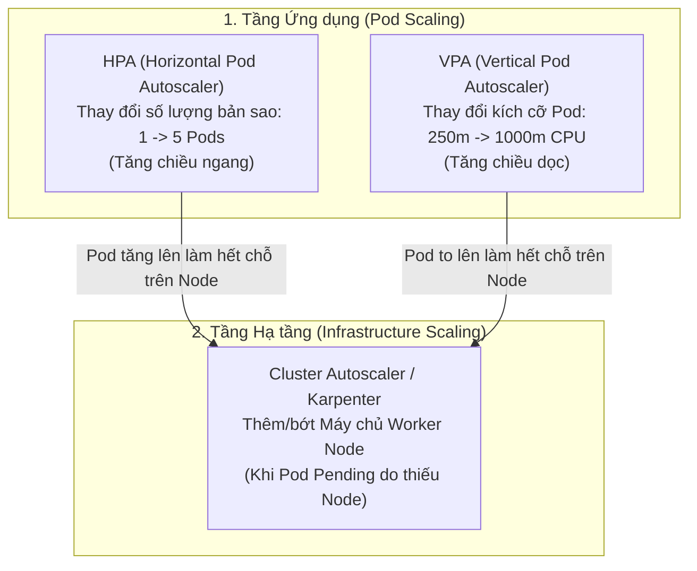
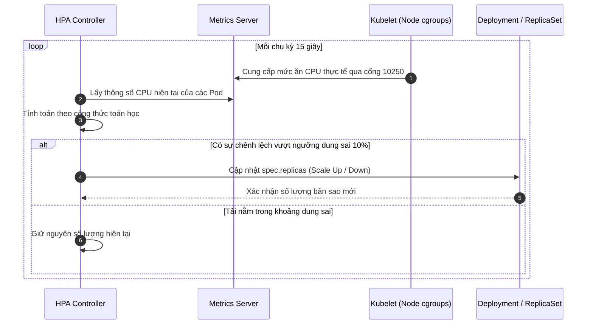

# Bài 28: Horizontal Pod Autoscaler (HPA): Tự động co giãn số lượng Pod

## 1. Thông tin bài học
* **Tên bài:** Bài 28: Horizontal Pod Autoscaler (HPA): Tự động co giãn số lượng Pod
* **Mục tiêu học:** Nắm vững cơ chế tự động co giãn theo chiều ngang (Horizontal Pod Autoscaling) của Kubernetes; hiểu sâu vòng lặp điều khiển HPA Control Loop và công thức toán học tính toán số lượng bản sao mục tiêu; phân biệt vai trò của Metrics Server và API `metrics.k8s.io`; giải mã điều kiện tiên quyết sống còn vì sao HPA bắt buộc phải có `resources.requests`; cấu hình tinh chỉnh chính sách co giãn linh hoạt (`behavior`: scale-up thần tốc vs scale-down êm ái) để triệt tiêu hiện tượng rung lắc (Flapping/Thrashing); thực hành cài đặt Metrics Server trên cụm kind, bơm tải HTTP vào microservice `frontend` (Online Boutique) và chứng kiến hệ thống tự động nhân bản từ 1 lên nhiều Pod trong thời gian thực.
* **Thời lượng ước tính:** 150 phút (75 phút lý thuyết, 75 phút thực hành)
* **Kiến thức cần có trước:** Bài 09 (Deployment & ReplicaSet), Bài 24 (Resource Requests & Limits), Bài 25 (Kube-Scheduler).
* **Liên quan kỳ thi:** CKAD, CKA (Trọng tâm cấu phần Application Deployment & Scaling: chiếm 12–15% điểm thi, thí sinh luôn phải thực hiện các bài lab cài đặt Metrics Server, tạo đối tượng HPA với `kubectl autoscale` hoặc file YAML phiên bản `autoscaling/v2`, và điều tra vì sao HPA dính lỗi hiển thị `<unknown>`).

---

## 2. Bảng thuật ngữ

| Thuật ngữ | Giải thích đơn giản | Ví dụ / Ẩn dụ đời thường |
| :--- | :--- | :--- |
| **Horizontal Pod Autoscaler (HPA)** | Bộ tự động co giãn Pod theo chiều ngang: Tự động tăng hoặc giảm **số lượng Pod** (Replicas) dựa trên mức tiêu thụ tải thực tế. | Khi quán ăn đông khách, chủ quán gọi thêm nhiều nhân viên phục vụ bàn đến làm việc cùng lúc. |
| **Vertical Pod Autoscaler (VPA)** | Bộ tự động co giãn Pod theo chiều dọc: Giữ nguyên số lượng Pod nhưng tự động tăng/giảm **dung lượng CPU/RAM** của từng Pod (sẽ học ở Bài 29). | Thay vì thuê thêm nhân viên, chủ quán cho một nhân viên uống nước tăng lực để làm việc nhanh gấp đôi. |
| **Cluster Autoscaler (CA)** | Bộ tự động co giãn hạ tầng: Tự động bật thêm hoặc tắt bớt **máy chủ vật lý/máy ảo (Nodes)** khi các Node hiện tại bị hết hoặc thừa chỗ. | Khách sạn thuê thêm nguyên một tòa nhà mới khi toàn bộ các phòng hiện có đều đã kín chỗ. |
| **Metrics Server** | Thành phần mở rộng trong cụm, thu thập thông số CPU/RAM thực tế từ Kubelet của từng Node và cung cấp qua API `metrics.k8s.io`. | Thiết bị đo nhịp tim và huyết áp tự động gửi dữ liệu định kỳ về màn hình trung tâm của bác sĩ. |
| **Target Utilization** | Tỷ lệ phần trăm mục tiêu của mức tiêu thụ CPU so với mức `requests` đã cam kết mà HPA cố gắng duy trì ổn định. | Tốc độ chạy xe máy lý tưởng: Giữ tay ga ở mức 60% công suất để máy vừa bốc vừa tiết kiệm xăng. |
| **Stabilization Window (Cool-down)** | Khoảng thời gian "làm nguội" bắt buộc trước khi cho phép giảm số lượng Pod, nhằm tránh tình trạng vừa giảm xong tải lại vọt lên. | Khi khách ăn xong ra về, chủ quán vẫn giữ nhân viên lại thêm 10 phút để dọn dẹp và phòng ngừa đợt khách mới ùa vào. |
| **Flapping / Thrashing** | Hiện tượng rung lắc: Số lượng Pod tăng lên rồi giảm xuống liên tục trong thời gian ngắn do co giãn quá vội vã. | Bật tắt công tắc đèn liên tục làm cháy bóng đèn. |

---

## 3. Bức tranh lớn: Vấn đề thực tế và ẩn dụ đời thường

### Nhắc lại bài trước
Ở Bài 27, chúng ta đã nắm vững cách dùng Taints & Tolerations để phân nhóm máy chủ và bảo vệ phần cứng chuyên dụng. Tuy nhiên, lưu lượng truy cập của người dùng trên Internet không bao giờ bằng phẳng suốt 24 giờ. Một hệ thống vận hành thực tế luôn biến động dữ dội giữa ngày và đêm!

### Tại sao cần cái này ở production? (Vấn đề thực tế)

Hãy tưởng tượng bạn đang quản trị trang thương mại điện tử Google Online Boutique:
1. **Thảm họa "Cháy vé lúc nửa đêm":**
   Lúc 0h00, sự kiện Flash Sale diễn ra, hàng chục ngàn khách hàng đồng loạt bấm vào xem giỏ hàng và thanh toán. Lượng request tăng vọt gấp 50 lần. Nếu bạn trông chờ vào việc kỹ sư trực NOC nhận cảnh báo qua Slack, bật laptop lên, kết nối VPN rồi gõ lệnh `kubectl scale deployment frontend --replicas=30` bằng tay, thì trang web đã bị sập (Downtime) từ 10 phút trước và công ty mất hàng trăm ngàn USD doanh thu!
2. **Cơn đau đầu "Đốt tiền hạ tầng đám mây":**
   Để an toàn, bạn quyết định cấu hình cố định 50 bản sao `frontend` chạy liên tục 24/7. Nhưng từ 2h sáng đến 6h sáng, hầu như không có khách truy cập nào, 50 Pod đó chỉ ăn 1% CPU nhàn rỗi. Hóa đơn điện toán đám mây (AWS/GCP) cuối tháng gửi về báo giá tăng vọt, sếp của bạn chắc chắn sẽ không hài lòng về việc lãng phí tài nguyên!
3. **Giải pháp tự động hóa hoàn hảo:**
   Hệ thống cần có khả năng tự động "hít thở" theo nhịp điệu của thị trường: Khi đông khách thì tự động nhân bản thêm Pod để chia tải; khi vắng khách thì tự động thu dọn bớt Pod để tiết kiệm ngân sách. Đó chính là sứ mệnh của **Horizontal Pod Autoscaler (HPA)**.

### Ẩn dụ đời thường: Trạm thu phí cao tốc thông minh

Hãy hình dung dịch vụ của bạn giống như một trạm thu phí trên đường cao tốc:
* **Ngày thường vắng xe:** Trạm chỉ cần mở **1 làn thu phí** (`minReplicas: 1`). Một nhân viên thu phí là đủ giải quyết cho vài chiếc xe qua lại.
* **Chiều Chủ Nhật xe cộ đổ về nườm nượp:** Hàng xe xếp hàng dài, cảm biến đo mật độ giao thông (Metrics Server) báo hiệu: *"Mức độ bận rộn đã vượt ngưỡng 70%!"*. Trạm trưởng (HPA) lập tức bấm chuông gọi thêm nhân viên, mở liên tiếp **làn số 2, làn số 3, làn số 4** (`scale-up`). Giao thông lại thông suốt!
* **Đêm muộn hết xe:** Xe thưa thớt dần, nhưng trạm trưởng không vội vã đóng làn ngay. Ông quan sát thêm 5 phút (Stabilization Window). Sau 5 phút thấy đường phố thực sự vắng lặng, ông mới cho các nhân viên đóng bớt các làn phụ và quay về nghỉ ngơi (`scale-down`).

---

## 4. Giải thích khái niệm theo từng bước

### 4.1. Kiến trúc phân tầng của hệ thống Autoscaling

Kubernetes chia bài toán co giãn thành 3 tầng độc lập nhưng phối hợp nhịp nhàng với nhau:



> [!NOTE]
> Trong 95% kiến trúc Microservices hiện đại không trạng thái (Stateless), **HPA là lựa chọn mặc định hàng đầu**.

---

### 4.2. Vòng lặp điều khiển HPA (Control Loop)

HPA không phải là một tiến trình chạy độc lập trong container, mà là một bộ điều khiển (Controller) nằm bên trong **`kube-controller-manager`** (Control Plane).

Cứ mỗi **15 giây một lần** (chu kỳ mặc định `--horizontal-pod-autoscaler-sync-period=15s`), HPA Controller sẽ thực hiện 4 bước:
1. **Truy vấn Metric:** Gọi đến API `metrics.k8s.io` để lấy mức sử dụng CPU/Memory thực tế của tất cả các Pod thuộc Deployment mục tiêu.
2. **Tính toán số lượng Pod:** Áp dụng công thức toán học để tính ra số bản sao mong muốn (`desiredReplicas`).
3. **Kiểm tra giới hạn & Làm nguội:** Đối chiếu với `minReplicas`, `maxReplicas` và thời gian trễ ổn định (Stabilization Window).
4. **Cập nhật ReplicaSet:** Nếu số lượng có thay đổi, HPA gửi yêu cầu cập nhật trường `spec.replicas` của Deployment mục tiêu. Kube-Scheduler và Kubelet sẽ tự động tạo thêm hoặc xóa bớt Pod!



---

### 4.3. Công thức toán học của HPA

Công thức nền tảng được định nghĩa chính thức trong mã nguồn Kubernetes:

$$\text{Desired Replicas} = \left\lceil \text{Current Replicas} \times \left( \frac{\text{Current Metric Value}}{\text{Target Metric Value}} \right) \right\rceil$$

*(Trong đó $\lceil \dots \rceil$ là hàm làm tròn lên số nguyên gần nhất).*

#### Ví dụ minh họa bằng số thực tế:
* Bạn có một Deployment đang chạy **1 bản sao** (`Current Replicas = 1`).
* Bạn cấu hình CPU Request là `100m`.
* Bạn đặt mục tiêu `targetAverageUtilization: 50%` (tức là mỗi Pod ăn trung bình $50\% \times 100\text{m} = 50\text{m}$ CPU là lý tưởng).
* Đột nhiên lượng truy cập ùa vào, đo được Pod đó đang ăn **200m CPU** (`Current Metric Value = 200m` $\rightarrow$ tương đương $200\%$).
* **HPA tính toán:**
  $$\text{Desired Replicas} = \left\lceil 1 \times \left( \frac{200\%}{50\%} \right) \right\rceil = \lceil 1 \times 4 \rceil = 4 \text{ Pods}$$
* **Hành động:** HPA lập tức ra lệnh cho Deployment tăng từ 1 Pod lên **4 Pods** ngay lập tức! Khi 4 Pod cùng chia sẻ tải, mức CPU trung bình của mỗi Pod sẽ tụt về đúng mức $200\text{m} / 4 = 50\text{m}$ (đạt ngưỡng mục tiêu 50%).

> [!IMPORTANT]
> **Ngưỡng dung sai 10% (Tolerance):**  
> Để tránh việc hệ thống bị co giãn liên tục chỉ vì một biến động tải nhỏ, HPA áp dụng một ngưỡng dung sai mặc định là **0.1 (10%)**.  
> Nếu tỷ lệ $\frac{\text{Current}}{\text{Target}}$ nằm trong khoảng từ **0.9 đến 1.1**, HPA sẽ coi như hệ thống đang cân bằng và **KHÔNG THỰC HIỆN BẤT KỲ CO GIÃN NÀO**!

---

### 4.4. Điều kiện tiên quyết: Tại sao BẮT BUỘC phải có `resources.requests`?

Một trong những lỗi kinh điển nhất của người mới học Kubernetes là tạo HPA xong thì thấy cột `TARGETS` hiển thị:
```text
NAME           REFERENCE                 TARGETS         MINPODS   MAXPODS   REPLICAS
frontend-hpa   Deployment/frontend-app   <unknown>/50%   1         5         1
```
Chữ `<unknown>` xuất hiện vì:
* HPA đo CPU Utilization theo tỷ lệ:
  $$\text{Utilization \%} = \frac{\text{CPU Tiêu thụ thực tế}}{\text{CPU Request}} \times 100\%$$
* Nếu container của bạn **KHÔNG khai báo `resources.requests.cpu`**, mẫu số của phép chia bằng **0 (hoặc không tồn tại)**!
* Phép chia không thể thực hiện $\rightarrow$ HPA "mù chữ" hoàn toàn, không biết tính toán ra sao và từ chối hoạt động!
* **Kết luận:** Muốn dùng HPA, **100% container trong Pod BẮT BUỘC phải được khai báo `resources.requests`**!

---

### 4.5. Tinh chỉnh chính sách co giãn (`behavior` trong `autoscaling/v2`)

Trong phiên bản API `autoscaling/v2`, Kubernetes cho phép bạn kiểm soát tốc độ co giãn chi tiết qua khối `behavior`:

```yaml
spec:
  behavior:
    scaleUp:
      stabilizationWindowSeconds: 0 # Phản ứng NGAY LẬP TỨC khi có tải
      policies:
      - type: Percent
        value: 100 # Cho phép nhân đôi số lượng Pod (tăng tối đa 100%)
        periodSeconds: 15
    scaleDown:
      stabilizationWindowSeconds: 300 # Chờ 5 PHÚT quan sát trước khi giảm Pod
      policies:
      - type: Percent
        value: 50 # Mỗi lần giảm tối đa 50% số Pod để tránh hụt hơi
        periodSeconds: 60
```
* **Chiến lược Scale Up:** Cần cực kỳ nhạy bén (thời gian chờ = 0) để cứu sống ứng dụng trước đợt sóng traffic.
* **Chiến lược Scale Down:** Cần cực kỳ thận trọng và điềm tĩnh (chờ 300 giây) để tránh tình trạng vừa giảm Pod xong thì đợt sóng traffic thứ hai lại ập đến làm sập hệ thống.

---

## 5. Thực hành (Lab)

* **Môi trường:** Cluster kind 2 node (`lab-control-plane`, `lab-worker`).
* **Mức RAM ước tính:** ~350 MB (an toàn tuyệt đối cho WSL 2).
* **Mục tiêu thực hành:**
  1. Cài đặt **Metrics Server** vào cụm kind (với cấu hình bypass TLS certificate đặc thù của kind).
  2. Kiểm tra các lệnh trích xuất tài nguyên thời gian thực (`kubectl top nodes`, `kubectl top pods`).
  3. Triển khai dịch vụ `frontend` (Online Boutique) có đầy đủ `resources.requests`.
  4. Cấu hình HPA mục tiêu 50% CPU với dải co giãn từ 1 đến 5 bản sao.
  5. Bơm tải HTTP liên tục bằng một Pod tạo tải (`load-generator`) và chứng kiến HPA tự động scale-out Pod.
  6. Ngắt tải và quan sát HPA thu gọn số lượng Pod (scale-in).

---

### Bước 1: Cài đặt Metrics Server trên cụm Kind

Trong môi trường Kubernetes chạy trên Kind, chứng chỉ TLS của Kubelet là chứng chỉ tự ký (Self-signed certificate). Do đó, Metrics Server mặc định sẽ báo lỗi không tin cậy chứng chỉ. Chúng ta cần triển khai bản Metrics Server chính thức và thêm cờ cấu hình `--kubelet-insecure-tls`.

Áp dụng manifest Metrics Server đã được tinh chỉnh cho Kind:

```powershell
@'
apiVersion: v1
kind: ServiceAccount
metadata:
  name: metrics-server
  namespace: kube-system
---
apiVersion: rbac.authorization.k8s.io/v1
kind: ClusterRole
metadata:
  name: system:aggregated-metrics-reader
rules:
- apiGroups: ["metrics.k8s.io"]
  resources: ["pods", "nodes"]
  verbs: ["get", "list", "watch"]
---
apiVersion: rbac.authorization.k8s.io/v1
kind: ClusterRole
metadata:
  name: system:metrics-server
rules:
- apiGroups: [""]
  resources: ["nodes/metrics"]
  verbs: ["get"]
- apiGroups: [""]
  resources: ["pods", "nodes"]
  verbs: ["get", "list", "watch"]
---
apiVersion: rbac.authorization.k8s.io/v1
kind: RoleBinding
metadata:
  name: metrics-server-auth-reader
  namespace: kube-system
roleRef:
  apiGroup: rbac.authorization.k8s.io
  kind: Role
  name: extension-apiserver-authentication-reader
subjects:
- kind: ServiceAccount
  name: metrics-server
  namespace: kube-system
---
apiVersion: rbac.authorization.k8s.io/v1
kind: ClusterRoleBinding
metadata:
  name: metrics-server:system:auth-delegator
roleRef:
  apiGroup: rbac.authorization.k8s.io
  kind: ClusterRole
  name: system:auth-delegator
subjects:
- kind: ServiceAccount
  name: metrics-server
  namespace: kube-system
---
apiVersion: rbac.authorization.k8s.io/v1
kind: ClusterRoleBinding
metadata:
  name: system:metrics-server
roleRef:
  apiGroup: rbac.authorization.k8s.io
  kind: ClusterRole
  name: system:metrics-server
subjects:
- kind: ServiceAccount
  name: metrics-server
  namespace: kube-system
---
apiVersion: v1
kind: Service
metadata:
  name: metrics-server
  namespace: kube-system
  labels:
    kubernetes.io/name: "Metrics-server"
spec:
  selector:
    k8s-app: metrics-server
  ports:
  - port: 443
    protocol: TCP
    targetPort: https
---
apiVersion: apps/v1
kind: Deployment
metadata:
  name: metrics-server
  namespace: kube-system
  labels:
    k8s-app: metrics-server
spec:
  selector:
    matchLabels:
      k8s-app: metrics-server
  template:
    metadata:
      labels:
        k8s-app: metrics-server
    spec:
      serviceAccountName: metrics-server
      containers:
      - name: metrics-server
        image: registry.k8s.io/metrics-server/metrics-server:v0.7.2
        args:
        - --cert-dir=/tmp
        - --secure-port=10250
        - --kubelet-preferred-address-types=InternalIP,ExternalIP,Hostname
        - --kubelet-use-node-status-port
        - --metric-resolution=15s
        - --kubelet-insecure-tls # Cờ bắt buộc để chạy được trên cụm kind
        ports:
        - name: https
          containerPort: 10250
          protocol: TCP
        resources:
          requests:
            cpu: 50m
            memory: 64Mi
          limits:
            cpu: 100m
            memory: 128Mi
'@ | Set-Content -Encoding utf8 metrics-server.yaml

kubectl apply -f metrics-server.yaml
```

Chờ khoảng 20–30 giây cho Metrics Server khởi động và thu thập đợt dữ liệu đầu tiên:

```powershell
kubectl rollout status deployment metrics-server -n kube-system
```

---

### Bước 2: Kiểm chứng lệnh `kubectl top`

Bây giờ API `metrics.k8s.io` đã sẵn sàng, hãy kiểm tra mức sử dụng CPU/RAM của Node và Pod:

```powershell
kubectl top nodes
```

**Kết quả mong đợi:**
```text
NAME                 CPU(cores)   CPU%   MEMORY(bytes)   MEMORY%
lab-control-plane    112m         1%     845Mi           21%
lab-worker           45m          0%     420Mi           10%
```
*(Nếu output hiển thị số đo CPU/Memory thực tế, chúc mừng bạn: Metrics Server đã hoạt động hoàn hảo!)*

---

### Bước 3: Triển khai Deployment frontend với Resource Requests

Chúng ta triển khai microservice `frontend` (Online Boutique), cấu hình mức `requests.cpu: 50m` (mức nhỏ để dễ dàng kích hoạt HPA trong lab):

```powershell
@'
apiVersion: apps/v1
kind: Deployment
metadata:
  name: frontend-autoscale
  labels:
    app: frontend-autoscale
spec:
  replicas: 1
  selector:
    matchLabels:
      app: frontend-autoscale
  template:
    metadata:
      labels:
        app: frontend-autoscale
    spec:
      containers:
      - name: server
        image: gcr.io/google-samples/microservices-demo/frontend:v0.10.1
        ports:
        - containerPort: 8080
        env:
        - name: PORT
          value: "8080"
        resources:
          requests:
            cpu: "50m"      # BẮT BUỘC PHẢI CÓ để HPA tính tỷ lệ %
            memory: "64Mi"
          limits:
            cpu: "200m"
            memory: "128Mi"
---
apiVersion: v1
kind: Service
metadata:
  name: frontend-autoscale-svc
spec:
  selector:
    app: frontend-autoscale
  ports:
  - port: 80
    targetPort: 8080
'@ | Set-Content -Encoding utf8 frontend-hpa-demo.yaml

kubectl apply -f frontend-hpa-demo.yaml
```

---

### Bước 4: Tạo Horizontal Pod Autoscaler (HPA)

Sử dụng định dạng chuẩn `autoscaling/v2` để tạo đối tượng HPA:
* Mục tiêu: Giữ mức tiêu thụ CPU trung bình ở mức **50%** so với Request (tức là $50\% \times 50\text{m} = 25\text{m}$ CPU).
* Số bản sao: Tối thiểu 1 Pod, tối đa 5 Pods.

```powershell
@'
apiVersion: autoscaling/v2
kind: HorizontalPodAutoscaler
metadata:
  name: frontend-hpa
spec:
  scaleTargetRef:
    apiVersion: apps/v1
    kind: Deployment
    name: frontend-autoscale
  minReplicas: 1
  maxReplicas: 5
  metrics:
  - type: Resource
    resource:
      name: cpu
      target:
        type: Utilization
        averageUtilization: 50
'@ | Set-Content -Encoding utf8 hpa.yaml

kubectl apply -f hpa.yaml
```

Kiểm tra trạng thái HPA:
```powershell
kubectl get hpa frontend-hpa
```

**Kết quả mong đợi:**
```text
NAME           REFERENCE                       TARGETS         MINPODS   MAXPODS   REPLICAS   AGE
frontend-hpa   Deployment/frontend-autoscale   1% / 50%        1         5         1          18s
```
> [!NOTE]
> Nhìn vào cột `TARGETS`: `1% / 50%` biểu thị mức ăn CPU hiện tại là ~1%, trong khi mục tiêu là 50%. Hiện tại hệ thống hoàn toàn thảnh thơi với 1 replica!

---

### Bước 5: Bơm tải HTTP và quan sát HPA Scale-Out

Bây giờ chúng ta sẽ cho chạy một Pod `load-generator` liên tục gửi các yêu cầu HTTP dồn dập vào Service `frontend-autoscale-svc` để ép CPU tăng vọt:

```powershell
kubectl run load-generator --image=busybox:1.36 --restart=Never -- /bin/sh -c "while true; do wget -q -O- http://frontend-autoscale-svc; done"
```

Bây giờ, hãy mở lệnh theo dõi liên tục HPA (chờ khoảng 30–60 giây):

```powershell
kubectl get hpa frontend-hpa -w
```

**Nhật ký diễn biến thực tế trả về:**
```text
NAME           REFERENCE                       TARGETS     MINPODS   MAXPODS   REPLICAS   AGE
frontend-hpa   Deployment/frontend-autoscale   1%/50%      1         5         1          1m
frontend-hpa   Deployment/frontend-autoscale   120%/50%    1         5         1          1m30s
frontend-hpa   Deployment/frontend-autoscale   184%/50%    1         5         3          1m45s
frontend-hpa   Deployment/frontend-autoscale   62%/50%     1         5         4          2m
```
*(Bấm `Ctrl + C` để thoát khỏi chế độ watch).*

Kiểm tra lại danh sách Pod của Deployment:
```powershell
kubectl get pods -l app=frontend-autoscale
```
**Kết quả mong đợi:**
```text
NAME                                  READY   STATUS    RESTARTS   AGE
frontend-autoscale-6f4b8c9d7-8k2p1    1/1     Running   0          4m
frontend-autoscale-6f4b8c9d7-j9x2m    1/1     Running   0          42s
frontend-autoscale-6f4b8c9d7-m4q5v    1/1     Running   0          42s
frontend-autoscale-6f4b8c9d7-z7w8n    1/1     Running   0          25s
```
*HPA đã tự động nhân bản từ 1 Pod ban đầu lên 4 Pods để san sẻ tải trọng!*

---

### Bước 6: Ngắt tải và quan sát quá trình Scale-In (Làm nguội)

Xóa Pod bơm tải:
```powershell
kubectl delete pod load-generator
```

Kiểm tra lại HPA:
```powershell
kubectl get hpa frontend-hpa
```
Mức CPU sẽ lập tức tụt về `0% / 50%`. Tuy nhiên, số lượng `REPLICAS` vẫn sẽ **giữ nguyên ở mức 4 Pods** trong khoảng 5 phút (mặc định của `scaleDown.stabilizationWindowSeconds = 300s`). Sau 5 phút, HPA sẽ từ từ giảm số bản sao về lại đúng 1 Pod ban đầu.

---

### Bước 7: Dọn dẹp tài nguyên (Cleanup)

Giải phóng tài nguyên để trả lại RAM cho WSL:

```powershell
kubectl delete -f hpa.yaml
kubectl delete -f frontend-hpa-demo.yaml
kubectl delete -f metrics-server.yaml
Remove-Item metrics-server.yaml, frontend-hpa-demo.yaml, hpa.yaml -ErrorAction SilentlyContinue
```

---

## 6. Lỗi thường gặp và cách debug

### Lỗi 1: Cột TARGETS hiển thị `<unknown>/50%` vĩnh viễn
* **Dấu hiệu:** Bạn tạo HPA nhưng sau nhiều phút `kubectl get hpa` vẫn báo `<unknown>/50%`.
* **Nguyên nhân:**
  1. Thiếu khai báo `resources.requests.cpu` trong container spec.
  2. Metrics Server chưa được cài đặt hoặc bị lỗi crash.
* **Cách debug và sửa:**
  1. Kiểm tra lệnh `kubectl top pods`. Nếu lệnh này báo lỗi `error: Metrics API not available`, lỗi nằm ở Metrics Server. Hãy kiểm tra pod của metrics-server:
     `kubectl get pods -n kube-system -l k8s-app=metrics-server`
  2. Nếu `kubectl top pods` chạy bình thường nhưng HPA vẫn `<unknown>`, hãy `kubectl edit deployment <name>` và bổ sung khối `resources.requests.cpu`.

---

### Lỗi 2: Pod liên tục bị tăng giảm bản sao bất thường (Flapping / Rung lắc)
* **Dấu hiệu:** Số lượng Pod vừa tăng lên 5, được 1 phút lại tụt xuống 1, rồi lại vọt lên 5 liên tục.
* **Nguyên nhân:** Đặt ngưỡng `targetAverageUtilization` quá thấp (ví dụ 20%) và không cấu hình `stabilizationWindowSeconds` cho scaleDown. Khi có 1 request lớn, CPU vọt lên $\rightarrow$ scale up $\rightarrow$ chia nhỏ tải CPU tụt xuống dưới 20% $\rightarrow$ lập tức scale down $\rightarrow$ tải lại vọt lên.
* **Cách debug và sửa:**
  1. Đặt ngưỡng mục tiêu thực tế hơn (khoảng 60% – 70%).
  2. Trong `autoscaling/v2`, bổ sung khối `behavior.scaleDown.stabilizationWindowSeconds: 300` để giữ thời gian làm nguội tối thiểu 5 phút.

---

### Lỗi 3: HPA đã scale-out lên `maxReplicas` nhưng người dùng vẫn bị đơ lag
* **Dấu hiệu:** HPA đã tăng kịch trần (ví dụ 10 Pods), nhưng CPU của các Pod vẫn ở mức 100%, thời gian phản hồi cực chậm.
* **Nguyên nhân:** Điểm nghẽn hiệu năng (Bottleneck) thực sự **không nằm ở CPU của Pod web**, mà nằm ở:
  1. Cơ sở dữ liệu backend (Database bị nghẽn kết nối / Lock table). Càng tạo nhiều Pod web thì càng có nhiều kết nối dội vào DB khiến DB chết nhanh hơn!
  2. Cụm hết Worker Node: Các Pod mới được tạo ra bị kẹt ở trạng thái `Pending` do thiếu CPU trên Node (thiếu Cluster Autoscaler).
* **Cách debug và sửa:**
  1. Kiểm tra `kubectl get pods`: Nếu thấy nhiều Pod ở trạng thái `Pending`, hạ tầng cần thêm Node máy chủ.
  2. Điều tra metrics của Database và hạ tầng mạng trước khi quyết định tăng `maxReplicas`.

---

## 7. Góc nhìn Senior

### 1. Sự đánh đổi (Trade-offs): Chi phí vs Độ sẵn sàng khi co giãn

| Tiêu chí | Ngưỡng Target CPU Thấp (Ví dụ: 40% - 50%) | Ngưỡng Target CPU Cao (Ví dụ: 75% - 85%) |
| :--- | :--- | :--- |
| **Tốc độ phản ứng** | Cực kỳ an toàn: Có nhiều "khoảng đệm" (Headroom) để đón nhận đợt sóng traffic đột ngột mà không bị nghẽn. | Nguy hiểm hơn: Nếu tải ùa vào quá nhanh, Pod có thể chạm trần 100% và crash trước khi kịp scale. |
| **Chi phí hóa đơn đám mây ($)** | Tốn kém hơn: Hệ thống luôn duy trì số lượng Pod nhiều hơn mức cần thiết. | Tối ưu chi phí tối đa: Vắt kiệt tài nguyên của từng Pod trước khi xin thêm bản sao mới. |
| **Trường hợp áp dụng** | Các dịch vụ thanh toán quan trọng, cổng API Gateway hướng ra khách hàng (User-facing). | Các dịch vụ xử lý nền (Background Workers), Consumer đọc tin từ Kafka/RabbitMQ. |

---

### 2. Best practices tại production

1. **Luôn phối hợp HPA với PodDisruptionBudget (PDB):**
   * Khi HPA thực hiện Scale Down, nó sẽ xóa bớt Pod. Để đảm bảo trong quá trình xóa Pod dịch vụ của bạn không bao giờ bị gián đoạn, bắt buộc phải có đối tượng `PodDisruptionBudget` (ví dụ: `minAvailable: 2`).
2. **Quy tắc vàng đặt ngưỡng Target CPU (Nguyên tắc 65%):**
   * **Không bao giờ đặt Target CPU ở mức 90%–95%!**  
   * Hãy nhớ rằng: Từ lúc HPA phát hiện tải cao $\rightarrow$ gọi API $\rightarrow$ Scheduler xếp Pod $\rightarrow$ Kubelet kéo image $\rightarrow$ Ứng dụng khởi động xong (Readiness Probe pass) mất từ **30 đến 90 giây**!  
   * Nếu bạn đặt ngưỡng 90%, trong 60 giây chờ Pod mới bật lên, các Pod cũ sẽ chạm mốc 100%, rơi vào trạng thái CPU Throttling hoặc sập nguồn! Ngưỡng lý tưởng nhất cho Production là **60% đến 70%**.
3. **Mở rộng với KEDA (Kubernetes Event-driven Autoscaling):**
   * HPA mặc định của K8s chỉ dựa trên CPU/RAM. Nhưng trong thế giới microservices, tải thường đến từ số lượng tin nhắn trong hàng đợi (Queue Length). Hãy tìm hiểu thêm **KEDA** để có thể scale Pod dựa trên độ dài hàng đợi Kafka, Redis List, hoặc số lượng HTTP request đồng thời!

---

### 3. Câu hỏi phỏng vấn Senior

* **Câu hỏi 1:** *Khi HPA quyết định scale-in (giảm số lượng Pod), nó chọn Pod nào để xóa trước? Kỹ sư SRE có thể can thiệp vào thứ tự xóa Pod này không?*
* **Gợi ý trả lời chuẩn:**
  * HPA không trực tiếp xóa Pod mà nó cập nhật `spec.replicas` trên Deployment. Bộ điều khiển **ReplicaSet Controller** mới là đối tượng trực tiếp chọn Pod để xóa theo thứ tự ưu tiên:
    1. Các Pod đang ở trạng thái `Pending` hoặc `Failed` sẽ bị xóa trước.
    2. Các Pod chưa sẵn sàng (`Ready = False`) bị xóa tiếp theo.
    3. Giữa các Pod đang khỏe mạnh, ReplicaSet sẽ chọn Pod nào đang chạy trên Node có **nhiều Pod của Deployment đó nhất** (để giữ tính phân tán rải đều).
    4. Nếu vẫn bằng nhau, Pod có thời gian sống ngắn nhất (mới tạo nhất) sẽ bị xóa trước.
  * *Can thiệp:* Từ Kubernetes v1.22+, bạn có thể gán nhãn `controller.kubernetes.io/pod-deletion-cost` (số nguyên) lên Pod. ReplicaSet sẽ luôn ưu tiên xóa Pod có chi phí xóa thấp nhất trước!

* **Câu hỏi 2:** *Tại sao việc cấu hình đồng thời cả HPA và VPA trên cùng một chỉ số CPU/Memory của một Deployment được coi là chống chỉ định (Anti-pattern)? Khi nào thì ta có thể kết hợp cả hai?*
* **Gợi ý trả lời chuẩn:**
  * **Tại sao chống chỉ định:** HPA và VPA sẽ rơi vào trạng thái "đánh nhau" (Race Condition). Khi tải tăng, HPA muốn tạo thêm Pod để giảm CPU trung bình; cùng lúc đó VPA lại muốn restart Pod để nâng dung lượng CPU của từng Pod lên to hơn. Hai bộ điều khiển liên tục đưa ra quyết định trái ngược nhau dẫn đến hệ thống bị hỗn loạn và Pod bị restart liên tục!
  * **Cách kết hợp chuẩn:** Ta chỉ có thể kết hợp nếu chúng dựa trên các chỉ số khác nhau:
    * HPA scale số lượng Pod dựa trên **CPU hoặc Custom Metrics (như HTTP Request Rate)**.
    * VPA chỉ quản lý và tối ưu hóa **Memory** (hoặc chạy VPA ở chế độ khuyến nghị `UpdateMode: "Off"` chỉ để ghi nhận số liệu gợi ý).

---

## 8. Tóm tắt bài học
* 📌 **1. Bản chất HPA:** Tự động điều chỉnh số lượng bản sao (Replicas) của Pod theo chiều ngang dựa trên mức tiêu thụ tải thực tế.
* 📌 **2. Điều kiện tiên quyết:** Bắt buộc phải có **Metrics Server** và mọi container trong Pod **phải khai báo `resources.requests`**.
* 📌 **3. Vòng lặp điều khiển:** Mặc định chạy 15 giây một lần; áp dụng công thức tỉ lệ và bỏ qua nếu độ lệch nằm trong ngưỡng dung sai 10%.
* 📌 **4. Kiểm soát co giãn (`behavior`):** Scale-up cần phản ứng ngay lập tức (thời gian chờ = 0); Scale-down cần thời gian làm nguội (`stabilizationWindowSeconds: 300`) để triệt tiêu hiện tượng rung lắc (Flapping).
* 📌 **5. Quy tắc ngưỡng 65%:** Không bao giờ đặt mục tiêu CPU trên 80% để đảm bảo luôn có khoảng đệm an toàn trong thời gian chờ Pod mới khởi động.

---

## 9. Bài tập tự làm

* 🟢 **Mức Dễ:** Sử dụng lệnh ngắn gọn `kubectl autoscale deployment <name> --cpu-percent=60 --min=2 --max=6` để tạo một HPA nhanh cho một Deployment nginx có sẵn. Kiểm tra cấu hình vừa tạo bằng `kubectl get hpa`.
* 🟡 **Mức Vừa:** Viết một file HPA manifest chuẩn `autoscaling/v2` cho dịch vụ `cartservice` (Online Boutique) giám sát đồng thời cả hai chỉ số: **CPU 60%** VÀ **Memory 70%**. Triển khai và giải thích: HPA sẽ hành xử ra sao khi CPU chỉ đạt 30% nhưng Memory vọt lên 85%?
* 🔴 **Mức Khó:** Viết một manifest HPA có cấu hình `behavior` đặc biệt: Khi scale-up, mỗi 30 giây chỉ được phép tăng thêm tối đa **2 Pods** (dùng `type: Pods` thay vì `type: Percent`) để tránh việc tăng Pod quá ồ ạt làm sập cơ sở dữ liệu backend.

---

## 10. Câu hỏi tự kiểm tra

1. Nếu một Deployment có 2 Pods, mức Request CPU là 100m. Một Pod đang ăn 80m, Pod kia đang ăn 120m. Mức tiêu thụ CPU trung bình mà HPA ghi nhận được là bao nhiêu phần trăm?
2. Tại sao sau khi ngừng hoàn toàn lưu lượng tải truy cập, HPA không thu hồi Pod về `minReplicas` ngay lập tức mà lại chờ khoảng 5 phút?
3. Nếu Metrics Server bị crash và ngừng hoạt động, HPA sẽ làm gì? Số lượng Pod hiện tại có bị xóa đi không?
4. Điều gì xảy ra nếu HPA tính toán cần 10 bản sao để đáp ứng tải, nhưng trường `maxReplicas` trong manifest chỉ đặt là 5?
5. Điểm khác biệt cơ bản giữa `Target Utilization` (phần trăm) và `AverageValue` (giá trị tuyệt đối) trong cấu hình HPA metric là gì?

<details>
<summary>👉 Bấm vào đây để xem đáp án câu hỏi tự kiểm tra</summary>

* **Câu 1:** Mức CPU tiêu thụ trung bình là $(80\text{m} + 120\text{m}) / 2 = 100\text{m}$. So với Request 100m, HPA ghi nhận mức sử dụng là đúng **100%**.
* **Câu 2:** Do cơ chế cửa sổ ổn định (Stabilization Window, mặc định 300 giây = 5 phút). Cơ chế này nhằm tránh hiện tượng "rung lắc" (Flapping), phòng trường hợp lưu lượng truy cập chỉ tạm lắng xuống trong giây lát rồi lại bùng lên.
* **Câu 3:** HPA sẽ giữ nguyên số lượng Pod hiện tại, không thực hiện bất kỳ thao tác scale-up hay scale-down nào. Cột TARGETS sẽ chuyển sang `<unknown>` và HPA kiên nhẫn chờ Metrics API phục hồi.
* **Câu 4:** HPA sẽ chỉ tăng số lượng Pod lên tối đa là **5 bản sao** (chạm trần `maxReplicas`). HPA tuyệt đối không bao giờ vượt qua giới hạn trần do người quản trị đặt ra.
* **Câu 5:** `Utilization` tính toán theo tỷ lệ phần trăm so với mức `requests` của container (ví dụ: 60% của 100m); trong khi `AverageValue` so khớp trực tiếp với con số tuyệt đối (ví dụ: trung bình mỗi Pod ăn đúng `200m` CPU hoặc `500Mi` RAM, không cần quy đổi theo request).
</details>

---

## 11. Tài liệu đọc thêm và bài tiếp theo

### Tài liệu tham khảo
* [Kubernetes Documentation: Horizontal Pod Autoscaling](https://kubernetes.io/docs/tasks/run-application/horizontal-pod-autoscale/)
* [Kubernetes Documentation: HPA Walkthrough](https://kubernetes.io/docs/tasks/run-application/horizontal-pod-autoscale-walkthrough/)
* [GitHub: Kubernetes Metrics Server](https://github.com/kubernetes-sigs/metrics-server)

### Bài tiếp theo
👉 **Bài 29: Vertical Pod Autoscaler (VPA) & Tối ưu hóa kích cỡ Pod**

---

## PHỤ LỤC: ĐÁP ÁN GỢI Ý BÀI TẬP TỰ LÀM (MỤC 9)

### Đáp án Mức Dễ
```powershell
# 1. Tạo deployment có request
kubectl create deployment nginx-auto --image=nginx:alpine
kubectl set resources deployment nginx-auto --requests=cpu=50m

# 2. Tạo nhanh HPA bằng lệnh imperatively
kubectl autoscale deployment nginx-auto --cpu-percent=60 --min=2 --max=6

# 3. Kiểm tra
kubectl get hpa nginx-auto

# Dọn dẹp
kubectl delete hpa nginx-auto
kubectl delete deployment nginx-auto
```

---

### Đáp án Mức Vừa
File manifest giám sát đa chỉ số (Multi-metric HPA):
```yaml
apiVersion: autoscaling/v2
kind: HorizontalPodAutoscaler
metadata:
  name: cartservice-dual-hpa
spec:
  scaleTargetRef:
    apiVersion: apps/v1
    kind: Deployment
    name: cartservice
  minReplicas: 1
  maxReplicas: 5
  metrics:
  - type: Resource
    resource:
      name: cpu
      target:
        type: Utilization
        averageUtilization: 60
  - type: Resource
    resource:
      name: memory
      target:
        type: Utilization
        averageUtilization: 70
```
**Giải thích hành vi:**
Khi HPA giám sát nhiều chỉ số, nó sẽ tính toán số lượng Pod mục tiêu cho **TỪNG CHỈ SỐ ĐỘC LẬP**, sau đó **CHỌN CON SỐ LỚN NHẤT**!  
Vì vậy, dù CPU chỉ đạt 30% (chưa cần scale), nhưng Memory vọt lên 85% (yêu cầu scale), HPA vẫn sẽ lập tức tăng số lượng Pod theo chỉ số Memory để cứu ứng dụng!

---

### Đáp án Mức Khó
File manifest tinh chỉnh hành vi khống chế tốc độ Scale Up:
```yaml
apiVersion: autoscaling/v2
kind: HorizontalPodAutoscaler
metadata:
  name: safe-scaleup-hpa
spec:
  scaleTargetRef:
    apiVersion: apps/v1
    kind: Deployment
    name: sensitive-app
  minReplicas: 2
  maxReplicas: 10
  metrics:
  - type: Resource
    resource:
      name: cpu
      target:
        type: Utilization
        averageUtilization: 65
  behavior:
    scaleUp:
      policies:
      - type: Pods
        value: 2          # Mỗi nhịp tăng tối đa 2 Pods
        periodSeconds: 30 # Chu kỳ đánh giá 30 giây
      selectPolicy: Min   # Nếu có nhiều policy, chọn phương án tăng ít nhất
```

