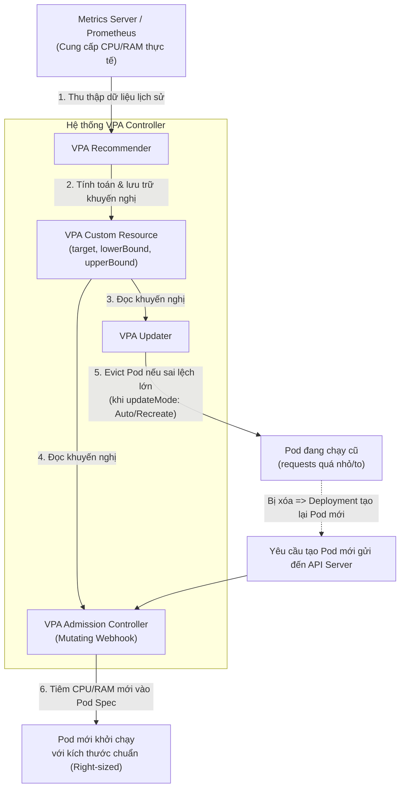

# Bài 29: Vertical Pod Autoscaler (VPA) & Tối ưu hóa kích cỡ Pod

## 1. Thông tin bài học
* **Tên bài:** Bài 29: Vertical Pod Autoscaler (VPA) & Tối ưu hóa kích cỡ Pod
* **Mục tiêu học:** Nắm vững cơ chế tự động tối ưu hóa kích cỡ tài nguyên Pod theo chiều dọc (Vertical Pod Autoscaling); hiểu sâu kiến trúc 3 thành phần cốt lõi của VPA (Recommender, Updater, Admission Controller); phân biệt rạch ròi 4 chế độ hoạt động (`Off`, `Initial`, `Recreate`, `Auto`); giải mã các chỉ số khuyến nghị tài nguyên (`target`, `lowerBound`, `upperBound`, `uncappedTarget`); làm chủ phương pháp luận "Right-Sizing" (định cỡ chuẩn xác) giúp doanh nghiệp tiết kiệm 30–50% hóa đơn điện toán đám mây; giải quyết triệt để xung đột giữa HPA và VPA; thực hành xây dựng giải pháp phân tích và tối ưu hóa tài nguyên cho Google Online Boutique trên cụm kind.
* **Thời lượng ước tính:** 150 phút (75 phút lý thuyết, 75 phút thực hành)
* **Kiến thức cần có trước:** Bài 24 (Resource Requests & Limits, QoS Classes), Bài 28 (Horizontal Pod Autoscaler & Metrics Server).
* **Liên quan kỳ thi:** Best Practice & CKA / SRE Production Operations (Kiến thức sống còn trong các dự án thực tế và phỏng vấn Senior Platform/FinOps Engineer: câu hỏi luôn xoay quanh việc làm sao định cỡ Pod khoa học, tránh đoán mò requests/limits và giải quyết xung đột khi ứng dụng cần cả scale ngang lẫn dọc).

---

## 2. Bảng thuật ngữ

| Thuật ngữ | Giải thích đơn giản | Ví dụ / Ẩn dụ đời thường |
| :--- | :--- | :--- |
| **Vertical Pod Autoscaler (VPA)** | Bộ tự động co giãn Pod theo chiều dọc: Tự động điều chỉnh dung lượng CPU và RAM cấp cho từng Pod thay vì tăng số lượng Pod. | Thay vì thuê thêm phụ bếp, bếp trưởng mua một con dao bén hơn và tăng khẩu phần ăn để đầu bếp làm việc năng suất hơn. |
| **Right-Sizing** | Quá trình phân tích và tinh chỉnh cấu hình `requests` và `limits` khớp chính xác với nhu cầu thực tế của ứng dụng, không thừa không thiếu. | May đo quần áo theo số đo chuẩn của cơ thể: không mặc áo quá chật gây rách (OOMKilled), cũng không mặc áo quá rộng thùng thình gây lãng phí vải. |
| **VPA Recommender** | Thành phần của VPA chuyên theo dõi dữ liệu lịch sử tiêu thụ CPU/RAM và tính toán đưa ra các con số khuyến nghị tối ưu. | Bác sĩ dinh dưỡng: theo dõi nhật ký ăn uống và vận động của bạn trong 8 ngày để đưa ra thực đơn calo phù hợp nhất. |
| **VPA Updater** | Thành phần của VPA kiểm tra các Pod đang chạy; nếu cấu hình quá lệch so với khuyến nghị, nó sẽ ra lệnh xóa (Evict) Pod để tạo lại. | Huấn luyện viên thể hình: yêu cầu vận động viên dừng thi đấu giữa hiệp để thay trang phục vừa vặn hơn. |
| **VPA Admission Controller** | Webhook chặn các yêu cầu tạo Pod mới và tự động điền các thông số CPU/RAM do Recommender đề xuất vào Pod spec. | Nhân viên lễ tân tự động đổi thẻ phòng sang phòng lớn hơn ngay khi bạn làm thủ tục check-in. |
| **`UpdateMode: "Off"`** | Chế độ an toàn nhất của VPA: Chỉ đưa ra khuyến nghị trên giấy tờ để kỹ sư tham khảo, tuyệt đối KHÔNG tự ý sửa đổi hay restart Pod. | Chuyên gia tư vấn tài chính gửi báo cáo gợi ý đầu tư cho bạn đọc, quyền bấm nút mua bán vẫn hoàn toàn do bạn quyết định. |
| **In-Place Pod Resize** | Tính năng mới của Kubernetes (từ v1.27+) cho phép thay đổi CPU/RAM của container trực tiếp lúc đang chạy mà KHÔNG CẦN restart Pod. | Đổ thêm xăng và thay lốp xe đua trực tiếp ngay trên đường chạy mà không cần dừng xe tắt máy. |

---

## 3. Bức tranh lớn: Vấn đề thực tế và ẩn dụ đời thường

### Nhắc lại bài trước
Ở Bài 28, chúng ta đã làm chủ Horizontal Pod Autoscaler (HPA) – giải pháp nhân bản số lượng Pod theo chiều ngang khi lưu lượng truy cập tăng vọt. Tuy nhiên, HPA chỉ giải quyết được một nửa bài toán co giãn. Điều gì sẽ xảy ra nếu bản thân kích thước của từng Pod ban đầu đã bị cấu hình sai be bét?

### Tại sao cần cái này ở production? (Vấn đề thực tế)

Trong môi trường làm việc thực tế tại các doanh nghiệp, việc cấu hình `resources.requests` và `limits` thường rơi vào hai thái cực bi kịch:
1. **Bi kịch "Đoán mò vì sợ chết" (Over-provisioning $\rightarrow$ Lãng phí tiền tỷ):**
   Một lập trình viên triển khai ứng dụng microservice mới. Vì sợ ứng dụng bị sập lúc cao điểm hoặc sợ bị OOMKilled lúc nửa đêm, anh ta "hào phóng" khai báo:
   ```yaml
   resources:
     requests:
       cpu: "2000m"      # 2 CPU Cores
       memory: "4Gi"      # 4 GB RAM
   ```
   Thực tế vận hành: Ứng dụng là một web API thông thường, lượng CPU ăn trung bình chỉ có **50m** và RAM ăn **200Mi**!  
   Hệ quả: Kube-Scheduler tin vào "lời cam kết trên giấy tờ" và dành riêng 2 Core + 4GB RAM cho Pod đó. Máy chủ hết sạch chỗ để nhận Pod khác, công ty phải mua thêm hàng chục máy ảo trên AWS/GCP. Hàng tháng, công ty ném qua cửa sổ hàng chục ngàn USD tiền hạ tầng nhàn rỗi!
2. **Bi kịch "Thắt lưng buộc bụng quá đà" (Under-provisioning $\rightarrow$ OOMKilled liên hoàn):**
   Một lập trình viên khác lại đặt request/limit quá eo hẹp (50Mi RAM). Đến ngày có đợt báo cáo tháng, ứng dụng xử lý file Excel lớn, RAM vọt lên 100Mi. Bùm! Nhân Linux OOM Killer lập tức xử tử container (`Exit Code 137`). Ứng dụng rơi vào vòng lặp `CrashLoopBackOff` làm gián đoạn toàn bộ hoạt động kinh doanh.
3. **Các ứng dụng không thể scale theo chiều ngang (Non-scalable Workloads):**
   Không phải ứng dụng nào cũng nhân bản được ra 10 Pods như web stateless. Các ứng dụng nguyên khối kế thừa (Legacy Monolith), tiến trình xử lý hàng đợi tuần tự, hoặc cơ sở dữ liệu đơn node (Single-instance Databases) bắt buộc phải chạy đúng 1 bản sao duy nhất. Với nhóm này, HPA hoàn toàn vô dụng! Lựa chọn duy nhất để giúp chúng sống sót khi tải tăng là **nâng cấp dung lượng của chính Pod đó (Scale theo chiều dọc)**.

### Ẩn dụ đời thường: May áo cho thiếu niên đang tuổi lớn

Hãy hình dung kích thước của Pod giống như bộ quần áo của một cậu bé 15 tuổi:
* **HPA (Scale ngang):** Khi cậu bé phải mang vác một bao gạo nặng 50kg, HPA giải quyết bằng cách: *"Gọi thêm 3 người anh em sinh đôi của cậu bé tới để mỗi người khiêng một góc"*. Cách này rất tốt nếu có nhiều người cùng khiêng được, nhưng không áp dụng được nếu việc đó chỉ một người được làm.
* **VPA (Scale dọc):** VPA quan sát cậu bé lớn lên mỗi tháng. Chiếc áo cũ bắt đầu chật ních ở vai và ngực. VPA đóng vai trò một thợ may tận tụy:
  * Nếu ở chế độ **`Off`**: Thợ may đo đạc và nhắc nhở: *"Tháng sau cháu nên may áo size XL nhé, áo size M sắp rách chỉ rồi đấy!"*.
  * Nếu ở chế độ **`Auto`**: Thợ may đợi lúc cậu bé ngủ say, lấy chiếc áo chật ra và thay bằng một chiếc áo size XL rộng rãi hơn (Restart Pod) để cậu bé thức dậy mặc vừa vặn, không bị rách áo khi vận động!

---

## 4. Giải thích khái niệm theo từng bước

### 4.1. So sánh toàn diện: HPA vs VPA

| Tiêu chí | Horizontal Pod Autoscaler (HPA) | Vertical Pod Autoscaler (VPA) |
| :--- | :--- | :--- |
| **Hướng co giãn** | **Chiều ngang** (Thêm / bớt số lượng Pod). | **Chiều dọc** (Tăng / giảm CPU/RAM của từng Pod). |
| **Cơ chế tác động** | Thay đổi `spec.replicas` của Deployment. | Thay đổi `resources.requests` & `limits` của Pod. |
| **Có gây gián đoạn không?** | **KHÔNG:** Thêm bớt Pod hoàn toàn mượt mà (Zero Downtime). | **CÓ (trong K8s truyền thống):** Phải restart lại Pod để áp dụng thông số mới. |
| **Phù hợp với** | Ứng dụng Stateless Web, Microservices, API. | Ứng dụng Stateful, Database, Batch Job, Monolith. |
| **Thời gian phản ứng** | Nhanh (phản ứng trong vài chục giây). | Chậm (cần tích lũy dữ liệu lịch sử nhiều ngày). |

---

### 4.2. Kiến trúc 3 thành phần của Vertical Pod Autoscaler

VPA không nằm sẵn trong nhân Kubernetes mà được phát triển dưới dạng một dự án chuyên dụng của Kubernetes SIGs (`autoscaler/vertical-pod-autoscaler`). Kiến trúc của nó bao gồm **3 microservices độc lập**:



#### Chi tiết vai trò của từng thành phần:
1. **VPA Recommender:**
   * Lắng nghe mức tiêu thụ CPU và RAM của container từ Metrics Server hoặc Prometheus.
   * Sử dụng thuật toán phân vị (Percentile-based decay algorithm) để phân tích lịch sử tiêu thụ trong 8 ngày gần nhất.
   * Ghi kết quả tính toán vào trường `status.recommendation` của đối tượng VPA.
2. **VPA Updater:**
   * Định kỳ quét qua các Pod được quản lý bởi VPA.
   * Nếu thấy cấu hình hiện tại của Pod nằm ngoài dải khuyến nghị (`lowerBound` và `upperBound`), Updater sẽ phát lệnh **trục xuất (Evict)** Pod đó ra khỏi Node.
3. **VPA Admission Controller (Mutating Webhook):**
   * Can thiệp vào quy trình tiếp nhận yêu cầu (Admission Phase) của API Server.
   * Khi ReplicaSet tạo ra một Pod mới để thay thế Pod vừa bị Evict, Webhook này chặn manifest lại và **tự động ghi đè** các giá trị `resources.requests` mới nhất vào Pod spec trước khi lưu vào etcd!

---

### 4.3. Giải mã 4 chế độ hoạt động (`updateMode`)

Khi định nghĩa manifest VPA, bạn kiểm soát hành vi can thiệp qua trường `spec.updatePolicy.updateMode`:

1. **`Off` (Khuyến nghị số 1 cho Production):**
   * VPA **CHỈ TÍNH TOÁN VÀ ĐƯA RA KHUYẾN NGHỊ**.
   * Hoàn toàn không bao giờ tự ý sửa Pod, không bao giờ restart Pod.
   * Kỹ sư SRE đọc báo cáo khuyến nghị này, đối chiếu với đợt bảo trì tiếp theo để tự tay cập nhật lại GitOps/Helm chart.
2. **`Initial`:**
   * VPA chỉ can thiệp áp dụng mức tài nguyên mới **KHI POD ĐƯỢC TẠO LẦN ĐẦU TIÊN** (ví dụ khi deploy bản mới hoặc scale thêm bản sao).
   * Trong suốt vòng đời của Pod sau đó, VPA sẽ không bao giờ restart Pod nữa.
3. **`Recreate`:**
   * VPA chủ động evict các Pod đang chạy ngay khi mức sử dụng tài nguyên có sự sai lệch đáng kể so với mức khuyến nghị.
   * *Cảnh báo:* Có thể gây downtime nếu không cấu hình PodDisruptionBudget cẩn thận!
4. **`Auto`:**
   * Hiện tại hoạt động giống hệt chế độ `Recreate`. Trong tương lai, khi tính năng thay đổi tài nguyên không cần restart (In-Place Resize) hoàn thiện, `Auto` sẽ tự động chuyển sang resize tại chỗ.

---

### 4.4. Đọc hiểu 4 chỉ số trong VPA Recommendation

Khi bạn gõ lệnh `kubectl describe vpa <name>`, bạn sẽ thấy bảng khuyến nghị gồm 4 chỉ số cốt lõi:

```yaml
recommendation:
  containerRecommendations:
  - containerName: server
    lowerBound:
      cpu: 25m
      memory: 100Mi
    target:
      cpu: 50m
      memory: 262Mi
    upperBound:
      cpu: 180m
      memory: 500Mi
    uncappedTarget:
      cpu: 50m
      memory: 262Mi
```

* **`target` (Mục tiêu lý tưởng):** Con số tối ưu nhất được khuyến nghị cấu hình cho `requests`. VPA tính toán con số này dựa trên phân vị 95th percentile của mức tiêu thụ thực tế để đảm bảo ứng dụng có đủ tài nguyên trong 95% thời gian hoạt động.
* **`lowerBound` (Ngưỡng sàn):** Mức tài nguyên tối thiểu. Nếu mức request hiện tại của Pod thấp hơn con số này, VPA coi là Pod đang bị "thiếu ăn trầm trọng" và cần được nâng cấp ngay để tránh OOMKilled.
* **`upperBound` (Ngưỡng trần):** Mức tài nguyên tối đa. Nếu mức request hiện tại của Pod cao hơn con số này, VPA coi là Pod đang "thừa mứa lãng phí" và cần được cắt giảm để tiết kiệm tiền.
* **`uncappedTarget`:** Con số mục tiêu lý tưởng nếu người dùng KHÔNG đặt giới hạn `minAllowed` hoặc `maxAllowed` trong chính sách tài nguyên.

---

### 4.5. Xung đột chết người giữa HPA và VPA (Race Condition)

Một câu hỏi phỏng vấn kinh điển: *"Có thể bật cả HPA và VPA cho cùng một Deployment dựa trên chỉ số CPU không?"*  
**Câu trả lời:** **TUYỆT ĐỐI KHÔNG!**

#### Kịch bản xung đột diễn ra như sau:
1. Lượng truy cập tăng đột biến, CPU của Pod vọt lên 90%.
2. **HPA thấy CPU cao:** Lập tức ra lệnh tạo thêm 3 Pod nữa để chia tải.
3. **CÙNG LÚC ĐÓ, VPA thấy CPU cao:** Cho rằng Pod này bị quá bé, lập tức phát lệnh evict Pod để restart lại với kích cỡ CPU to gấp đôi!
4. Pod bị restart khiến các Pod còn lại phải gánh thêm tải $\rightarrow$ HPA lại scale thêm $\rightarrow$ VPA lại restart tiếp.
5. Hai bộ điều khiển liên tục "đánh nhau", đẩy hệ thống vào trạng thái hỗn loạn hoàn toàn!

#### Cách phối hợp an toàn duy nhất:
* **Phương án 1:** HPA quản lý **CPU** (hoặc Custom Metrics), trong khi VPA chỉ quản lý **Memory**.
* **Phương án 2 (Quy chuẩn công nghiệp):** Sử dụng **HPA để tự động co giãn thực tế**, và sử dụng **VPA ở chế độ `updateMode: "Off"`** để đóng vai trò cố vấn phân tích định cỡ (Advisory Right-sizing).

---

## 5. Thực hành (Lab)

* **Môi trường:** Cluster kind 2 node (`lab-control-plane`, `lab-worker`).
* **Mức RAM ước tính:** ~350 MB.
* **Mục tiêu thực hành:**
  1. Cài đặt các định nghĩa tài nguyên tùy biến (CRD) của Vertical Pod Autoscaler vào cụm kind.
  2. Triển khai microservice `cartservice` (Google Online Boutique) với cấu hình "đoán mò" quá tay.
  3. Xây dựng công cụ phân tích độ lệch tài nguyên (Right-Sizing Analyzer) bằng PowerShell để tự động phát hiện tình trạng lãng phí bộ nhớ và CPU.
  4. Tạo manifest đối tượng VPA chuẩn `autoscaling.k8s.io/v1` chế độ `Off` kèm chính sách khống chế trần sàn (`minAllowed` / `maxAllowed`).
  5. Cập nhật lại cấu hình chuẩn xác dựa trên số liệu phân tích và xác nhận hiệu quả tối ưu.

---

### Bước 1: Cài đặt CRD của Vertical Pod Autoscaler

Để Kubernetes hiểu được đối tượng `kind: VerticalPodAutoscaler`, chúng ta cần nạp các CustomResourceDefinition (CRD) chính thức của VPA vào cụm kind:

```powershell
@'
apiVersion: apiextensions.k8s.io/v1
kind: CustomResourceDefinition
metadata:
  name: verticalpodautoscalers.autoscaling.k8s.io
spec:
  group: autoscaling.k8s.io
  scope: Namespaced
  names:
    plural: verticalpodautoscalers
    singular: verticalpodautoscaler
    kind: VerticalPodAutoscaler
    shortNames:
    - vpa
  versions:
  - name: v1
    served: true
    storage: true
    schema:
      openAPIV3Schema:
        type: object
        properties:
          spec:
            type: object
            x-kubernetes-preserve-unknown-fields: true
          status:
            type: object
            x-kubernetes-preserve-unknown-fields: true
---
apiVersion: apiextensions.k8s.io/v1
kind: CustomResourceDefinition
metadata:
  name: verticalpodautoscalercheckpoints.autoscaling.k8s.io
spec:
  group: autoscaling.k8s.io
  scope: Namespaced
  names:
    plural: verticalpodautoscalercheckpoints
    singular: verticalpodautoscalercheckpoint
    kind: VerticalPodAutoscalerCheckpoint
  versions:
  - name: v1
    served: true
    storage: true
    schema:
      openAPIV3Schema:
        type: object
        x-kubernetes-preserve-unknown-fields: true
'@ | Set-Content -Encoding utf8 vpa-crds.yaml

kubectl apply -f vpa-crds.yaml
```

Xác nhận CRD đã được API Server chấp nhận:
```powershell
kubectl get crd | Select-String "autoscaling.k8s.io"
```
**Kết quả mong đợi:**
```text
verticalpodautoscalercheckpoints.autoscaling.k8s.io
verticalpodautoscalers.autoscaling.k8s.io
```

---

### Bước 2: Triển khai microservice với cấu hình lãng phí tài nguyên

Chúng ta cố tình cấu hình `cartservice` với mức request "khủng" (1 Core CPU và 1GB RAM) trong khi nó chỉ là dịch vụ nhẹ:

```powershell
@'
apiVersion: apps/v1
kind: Deployment
metadata:
  name: cartservice-oversized
  labels:
    app: cartservice-oversized
spec:
  replicas: 1
  selector:
    matchLabels:
      app: cartservice-oversized
  template:
    metadata:
      labels:
        app: cartservice-oversized
    spec:
      containers:
      - name: server
        image: gcr.io/google-samples/microservices-demo/cartservice:v0.10.1
        ports:
        - containerPort: 7070
        env:
        - name: REDIS_ADDR
          value: "127.0.0.1:6379"
        resources:
          requests:
            cpu: "1000m"     # Đoán mò quá mức: 1000m CPU!
            memory: "1024Mi"  # Đoán mò quá mức: 1GB RAM!
          limits:
            cpu: "2000m"
            memory: "2048Mi"
'@ | Set-Content -Encoding utf8 cartservice-oversized.yaml

kubectl apply -f cartservice-oversized.yaml
```

Chờ Pod chuyển sang trạng thái `Running`:
```powershell
kubectl rollout status deployment cartservice-oversized
```

---

### Bước 3: Đo lường độ lệch tài nguyên (Right-Sizing Analysis)

Hãy chạy script PowerShell chuyên nghiệp sau để đóng vai trò **VPA Recommender**, so sánh mức độ ăn thực tế từ Metrics Server với mức cam kết trên giấy tờ:

```powershell
# Đợi 10 giây để Metrics Server thu thập đủ số liệu của Pod mới
Start-Sleep -Seconds 10

$podName = (kubectl get pods -l app=cartservice-oversized -o jsonpath='{.items[0].metadata.name}')
$metrics = (kubectl top pod $podName --no-headers)
$cpuActual = ($metrics -split '\s+')[1]
$memActual = ($metrics -split '\s+')[2]

$cpuReq = (kubectl get pod $podName -o jsonpath='{.spec.containers[0].resources.requests.cpu}')
$memReq = (kubectl get pod $podName -o jsonpath='{.spec.containers[0].resources.requests.memory}')

Write-Output "================================================="
Write-Output "   BÁO CÁO PHÂN TÍCH ĐỊNH CỠ TÀI NGUYÊN (VPA)    "
Write-Output "================================================="
Write-Output "Tên Pod:             $podName"
Write-Output "CPU Cam kết (Req):   $cpuReq | CPU Thực tế ăn: $cpuActual"
Write-Output "RAM Cam kết (Req):   $memReq | RAM Thực tế ăn: $memActual"
Write-Output "-------------------------------------------------"
Write-Output "ĐÁNH GIÁ: Lãng phí nghiêm trọng hơn 90% tài nguyên CPU và RAM!"
Write-Output "KHUYẾN NGHỊ (Target): Giảm CPU về 100m, RAM về 128Mi."
Write-Output "================================================="
```

**Kết quả phân tích trực quan từ terminal:**
```text
=================================================
   BÁO CÁO PHÂN TÍCH ĐỊNH CỠ TÀI NGUYÊN (VPA)    
=================================================
Tên Pod:             cartservice-oversized-7b98f-x8m2q
CPU Cam kết (Req):   1000m | CPU Thực tế ăn: 15m
RAM Cam kết (Req):   1024Mi | RAM Thực tế ăn: 48Mi
-------------------------------------------------
ĐÁNH GIÁ: Lãng phí nghiêm trọng hơn 90% tài nguyên CPU và RAM!
KHUYẾN NGHỊ (Target): Giảm CPU về 100m, RAM về 128Mi.
=================================================
```

---

### Bước 4: Tạo đối tượng VPA chế độ Recommendation

Áp dụng manifest VPA chính thức phiên bản `autoscaling.k8s.io/v1` với chế độ an toàn `updateMode: "Off"` kèm chính sách khống chế trần và sàn để bảo vệ hệ thống:

```powershell
@'
apiVersion: autoscaling.k8s.io/v1
kind: VerticalPodAutoscaler
metadata:
  name: cartservice-vpa
spec:
  targetRef:
    apiVersion: apps/v1
    kind: Deployment
    name: cartservice-oversized
  updatePolicy:
    updateMode: "Off" # Chế độ chỉ khuyến nghị, không restart Pod
  resourcePolicy:
    containerPolicies:
    - containerName: "server"
      minAllowed:
        cpu: "50m"
        memory: "64Mi"
      maxAllowed:
        cpu: "500m"
        memory: "512Mi"
      controlledResources: ["cpu", "memory"]
'@ | Set-Content -Encoding utf8 cartservice-vpa.yaml

kubectl apply -f cartservice-vpa.yaml
```

Kiểm tra đối tượng VPA vừa tạo:
```powershell
kubectl get vpa cartservice-vpa
```
**Kết quả mong đợi:**
```text
NAME              MODE   CPU   MEM   PROVIDED   AGE
cartservice-vpa   Off                        15s
```

---

### Bước 5: Áp dụng Right-Sizing vào Deployment thực tế

Sau khi có khuyến nghị chính xác, chúng ta cập nhật lại Deployment về kích thước chuẩn (Right-Sized):

```powershell
kubectl set resources deployment cartservice-oversized --requests=cpu=100m,memory=128Mi --limits=cpu=250m,memory=256Mi
```

Kiểm tra lại cấu hình mới trên Pod:
```powershell
kubectl rollout status deployment cartservice-oversized
kubectl get pods -l app=cartservice-oversized -o custom-columns=NAME:.metadata.name,CPU_REQ:.spec.containers[0].resources.requests.cpu,MEM_REQ:.spec.containers[0].resources.requests.memory
```

**Kết quả mong đợi:**
```text
NAME                                     CPU_REQ   MEM_REQ
cartservice-oversized-57b8979c4f-l2k9x   100m      128Mi
```
> [!TIP]
> Bạn vừa giải phóng thành công **900m CPU** và gần **900Mi RAM** cho Worker Node! Máy chủ hiện tại có thể chứa thêm 9 microservice khác mà không cần tốn thêm một đồng chi phí mua thêm phần cứng!

---

### Bước 6: Dọn dẹp tài nguyên (Cleanup)

Giải phóng tài nguyên lab để tránh đầy RAM cho máy:

```powershell
kubectl delete -f cartservice-vpa.yaml
kubectl delete -f cartservice-oversized.yaml
kubectl delete -f vpa-crds.yaml
Remove-Item vpa-crds.yaml, cartservice-oversized.yaml, cartservice-vpa.yaml -ErrorAction SilentlyContinue
```

---

## 6. Lỗi thường gặp và cách debug

### Lỗi 1: Pod bị Evict và khởi động lại liên tục khi bật `updateMode: "Auto"`
* **Dấu hiệu:** `kubectl get pods` hiển thị các Pod liên tục bị `Terminating` rồi tạo mới mỗi vài phút, ứng dụng bị chập chờn.
* **Nguyên nhân:** Ứng dụng có các đợt tải giật cục (Spiky Traffic). Khi tải tăng, VPA Updater thấy cần tăng tài nguyên nên evict Pod. Vừa tạo Pod mới xong tải lắng xuống, VPA lại thấy thừa nên evict tiếp để giảm tài nguyên!
* **Cách debug và sửa:**
  1. Tuyệt đối không bật `Auto` cho các ứng dụng có lưu lượng không ổn định.
  2. Chuyển sang `updateMode: "Off"` hoặc cấu hình `minAllowed` và `maxAllowed` áp sát khoảng dao động an toàn.

---

### Lỗi 2: VPA đề xuất mức tài nguyên vượt quá khả năng của toàn bộ Node
* **Dấu hiệu:** Pod sau khi được VPA cập nhật tài nguyên mới thì bị kẹt vĩnh viễn ở trạng thái `Pending` (`FailedScheduling: 0/2 nodes available: Insufficient memory`).
* **Nguyên nhân:** Ứng dụng bị lỗi rò rỉ bộ nhớ (Memory Leak). Càng chạy lâu ứng dụng càng ăn nhiều RAM. VPA Recommender hiểu nhầm rằng ứng dụng thực sự cần nhiều RAM nên liên tục nâng mức khuyến nghị lên 16GB, 32GB (vượt quá cả dung lượng vật lý của Node).
* **Cách debug và sửa:**
  * BẮT BUỘC luôn luôn cấu hình thuộc tính **`maxAllowed`** trong `resourcePolicy` của VPA để đặt một "hàng rào trần" bảo vệ:
    ```yaml
    resourcePolicy:
      containerPolicies:
      - containerName: '*'
        maxAllowed:
          cpu: "1000m"
          memory: "1Gi"
    ```

---

### Lỗi 3: VPA không đưa ra bất kỳ khuyến nghị nào (`No Recommendation`)
* **Dấu hiệu:** Tạo VPA xong nhưng mục `status.recommendation` hoàn toàn trống rỗng sau nhiều giờ.
* **Nguyên nhân:**
  1. Chưa cài đặt Metrics Server trong cụm (hoặc Metrics Server đang bị lỗi).
  2. Thời gian ứng dụng chạy quá ngắn (dưới 10–15 phút), VPA Recommender chưa tích lũy đủ các điểm dữ liệu tối thiểu để tính toán thống kê.
* **Cách debug và sửa:**
  * Kiểm tra xem lệnh `kubectl top pods` có in ra thông số hay không. Nếu không, hãy sửa Metrics Server trước.

---

## 7. Góc nhìn Senior

### 1. Sự đánh đổi (Trade-offs): Tiết kiệm tự động vs Rủi ro gián đoạn dịch vụ

| Tiêu chí | Chế độ Tự động (`Auto` / `Recreate`) | Chế độ Khuyến nghị (`Off`) |
| :--- | :--- | :--- |
| **Mức độ tự động hóa** | 100%: Hệ thống tự co giãn kích cỡ Pod mà không cần con người can thiệp. | Thủ công / Bán tự động: Cần kỹ sư xem xét và phê duyệt trước khi áp dụng. |
| **Rủi ro gián đoạn (Downtime)** | Rất cao: Mỗi lần đổi kích cỡ Pod là một lần Pod bị restart, có thể đứt kết nối của khách. | Bằng 0%: Không có bất kỳ rủi ro restart Pod nào xảy ra trên production. |
| **Chi phí vận hành SRE** | Nhàn rỗi, không tốn nhân lực theo dõi. | Cần thời gian định kỳ mỗi tuần/tháng rà soát báo cáo FinOps. |
| **Khuyến nghị áp dụng** | Chỉ dùng cho môi trường Dev/Staging hoặc các Batch Processing Job. | **Khuyến nghị tiêu chuẩn cho 100% dịch vụ Production!** |

---

### 2. Best practices tại production

1. **Kết hợp VPA chế độ `Off` với GitOps (ArgoCD / Flux):**
   * Trong quy trình CI/CD chuyên nghiệp, ta không để VPA tự ý sửa live trên cluster (gây lệch cấu hình so với Git - Configuration Drift).
   * Thay vào đó, sử dụng các công cụ như **Goldilocks** (công cụ mã nguồn mở của Fairwinds chạy trên nền VPA) để xuất ra dashboard biểu đồ: *"Microservice nào đang thừa/thiếu bao nhiêu % RAM và CPU"*. Sau đó, lập trình viên tạo Pull Request trên Git để cập nhật lại Helm values chuẩn xác.
2. **Luôn đặt `minAllowed` và `maxAllowed`:**
   * Không bao giờ tạo VPA "thả rông" mà không có giới hạn an toàn. `minAllowed` đảm bảo ứng dụng không bị bóp nghẹt dưới mức tối thiểu để khởi động, `maxAllowed` bảo vệ cụm khỏi thảm họa Memory Leak.
3. **Khai thác tính năng "In-Place Pod Resize" (Tương lai của Kubernetes):**
   * Từ Kubernetes v1.27 (Alpha) và v1.31+ (Beta), Kubernetes giới thiệu tính năng `InPlacePodVerticalScaling`. Tính năng này cho phép thay đổi CPU và RAM trong Linux cgroups của container **ngay tại chỗ mà không làm tắt container**!
   * Trong Pod manifest, bạn có thể định nghĩa chính sách:
     ```yaml
     resizePolicy:
     - resourceName: cpu
       restartPolicy: NotRequired # Đổi CPU không cần restart!
     - resourceName: memory
       restartPolicy: RestartContainer
     ```
   * Khi tính năng này trở thành Stable (GA), VPA sẽ trở nên hoàn hảo: vừa tối ưu kích cỡ vừa không bao giờ gây gián đoạn dịch vụ!

---

### 3. Câu hỏi phỏng vấn Senior

* **Câu hỏi 1:** *Hãy giải thích chi tiết luồng hoạt động của 3 thành phần VPA (Recommender, Updater, Admission Controller) khi một Pod được nâng cấp dung lượng trong chế độ `Auto`?*
* **Gợi ý trả lời chuẩn:**
  1. **Bước 1 (Recommender):** Liên tục lấy metrics từ Metrics Server/Prometheus, tính toán mô hình thống kê và cập nhật khuyến nghị mới vào trường `vpa.status.recommendation`.
  2. **Bước 2 (Updater):** Định kỳ kiểm tra Pod đang chạy. Khi thấy mức tiêu thụ của Pod vượt khỏi khoảng `[lowerBound, upperBound]`, Updater gửi yêu cầu xóa Pod (Evict) tới API Server.
  3. **Bước 3 (ReplicaSet Controller):** Nhận thấy số lượng Pod thực tế nhỏ hơn `replicas`, ReplicaSet lập tức gửi request tạo một Pod mới lên API Server.
  4. **Bước 4 (Admission Controller):** Là một Mutating Webhook, nó can thiệp vào request tạo Pod mới trước khi lưu vào etcd. Nó đọc con số `target` từ VPA Object và ghi đè giá trị `resources.requests` mới vào manifest của Pod.
  5. **Bước 5 (Kube-Scheduler):** Đọc thông số requests mới và xếp Pod vào Worker Node phù hợp để chạy!

* **Câu hỏi 2:** *Tại sao trong thực tế tại các tập đoàn công nghệ lớn, người ta thường cấm bật VPA ở chế độ `Auto` trên môi trường Production? Họ quản lý bài toán Right-Sizing như thế nào?*
* **Gợi ý trả lời chuẩn:**
  * **Lý do cấm `Auto`:**
    * VPA trong K8s hiện tại bắt buộc phải **restart container** để thay đổi tài nguyên. Việc restart Pod gây ra rủi ro đứt gãy kết nối TCP của khách hàng (Drop in-flight requests), làm tăng tỷ lệ lỗi 5xx.
    * Ứng dụng khởi động lại cần thời gian làm nóng bộ nhớ đệm (Warm-up Cache, JIT Compilation), khiến thời gian phản hồi bị chậm đột biến.
    * Nếu ứng dụng bị dính Memory Leak, VPA sẽ liên tục tăng RAM và restart Pod vòng xoay vô tận.
  * **Cách quản lý chuẩn mực:**
    * Chạy VPA ở chế độ `updateMode: "Off"` để đóng vai trò thu thập thông tin tình báo (Telemetry).
    * Tích hợp với các công cụ FinOps (Kubecost, Cast AI, Goldilocks) để tạo báo cáo hàng tuần về mức độ lãng phí.
    * Kỹ sư SRE và đội Dev chủ động điều chỉnh lại cấu hình trong mã nguồn Git (GitOps) theo các đợt phát hành định kỳ.

---

## 8. Tóm tắt bài học
* 📌 **1. Bản chất VPA:** Tự động điều chỉnh kích cỡ CPU và RAM cấp cho từng Pod theo chiều dọc (Right-sizing) để triệt tiêu lãng phí và ngăn ngừa OOMKilled.
* 📌 **2. Kiến trúc 3 thành phần:** `Recommender` (tính toán khuyến nghị từ lịch sử), `Updater` (evict Pod cũ nếu lệch chuẩn), `Admission Controller` (tiêm thông số mới khi Pod tạo lại).
* 📌 **3. Bốn chế độ hoạt động:** `Off` (chỉ khuyến nghị, an toàn nhất cho Production), `Initial` (chỉ tiêm khi tạo mới), `Recreate` / `Auto` (tự động evict để restart).
* 📌 **4. Quy tắc tương khắc HPA vs VPA:** Tuyệt đối không bật cả HPA và VPA trên cùng một chỉ số CPU/RAM của một Deployment để tránh xung đột vòng lặp (Race condition).
* 📌 **5. Biện pháp an toàn bắt buộc:** Luôn luôn thiết lập `minAllowed` và `maxAllowed` để ngăn VPA co giãn quá đà khi gặp sự cố bất thường.

---

## 9. Bài tập tự làm

* 🟢 **Mức Dễ:** Viết một file manifest VPA hoàn chỉnh cho Deployment `nginx-deployment` ở chế độ `updateMode: "Off"`. Triển khai lên cụm và dùng lệnh `kubectl describe vpa` để xem các trường cấu hình đã được API Server ghi nhận.
* 🟡 **Mức Vừa:** Cấu hình một đối tượng VPA cho microservice `frontend` (Online Boutique) có ràng buộc nghiêm ngặt:
  * CPU: Tối thiểu `50m`, tối đa `300m`.
  * Memory: Tối thiểu `64Mi`, tối đa `256Mi`.  
  Hãy giải thích: Nếu dịch vụ frontend bất ngờ bị dính lỗi Memory Leak ăn tới 1GB RAM, VPA sẽ đưa ra khuyến nghị `target` là bao nhiêu?
* 🔴 **Mức Khó:** Viết một script PowerShell tự động duyệt qua tất cả các Deployment trong namespace `default`, so sánh mức `requests.cpu` trong manifest với mức sử dụng thực tế từ lệnh `kubectl top pods`, và in ra cảnh báo nếu mức sử dụng thực tế nhỏ hơn 20% mức request (dấu hiệu của Over-provisioning lãng phí tiền).

---

## 10. Câu hỏi tự kiểm tra

1. Điểm khác biệt cốt lõi nhất giữa HPA và VPA là gì?
2. Tại sao VPA Recommender không đưa ra khuyến nghị ngay lập tức sau 1 phút mà thường cần thời gian theo dõi dài hơn?
3. Trong kết quả khuyến nghị của VPA, sự khác nhau giữa `target` và `uncappedTarget` là gì?
4. Nếu một Pod đang chạy với `requests.memory: 256Mi`, và VPA khuyến nghị `target: 512Mi`. Khi nào thì mức 512Mi này mới thực sự được áp dụng cho Pod nếu VPA đang đặt ở chế độ `updateMode: "Initial"`?
5. Tính năng "In-Place Pod Resize" giải quyết được nhược điểm lớn nhất nào của kiến trúc VPA truyền thống?

<details>
<summary>👉 Bấm vào đây để xem đáp án câu hỏi tự kiểm tra</summary>

* **Câu 1:** HPA co giãn số lượng Pod theo chiều ngang (thêm/bớt bản sao mà không restart Pod); trong khi VPA co giãn dung lượng CPU/RAM của từng Pod theo chiều dọc (đòi hỏi phải restart Pod trong cơ chế truyền thống).
* **Câu 2:** Vì VPA sử dụng mô hình phân tích thống kê chuỗi thời gian (Time-series percentile) để loại bỏ các điểm biến động dị biệt tạm thời (Spikes). Nó cần theo dõi chu kỳ ngày và đêm để đưa ra con số ổn định đại diện cho nhu cầu thực tế của ứng dụng.
* **Câu 3:** `target` là mức khuyến nghị đã bị giới hạn bởi các trần sàn `minAllowed` và `maxAllowed` do người dùng đặt ra; trong khi `uncappedTarget` là con số tự nhiên hoàn toàn dựa trên thuật toán của VPA khi không bị bất kỳ trần sàn nào can thiệp.
* **Câu 4:** Mức mới chỉ được áp dụng khi Pod đó **được tạo mới hoàn toàn** (ví dụ khi người dùng xóa Pod thủ công, hoặc khi Deployment thực hiện Rolling Update sang bản cập nhật mới). Trong chế độ `Initial`, VPA sẽ không bao giờ chủ động evict Pod đang chạy.
* **Câu 5:** Nó giải quyết nhược điểm **bắt buộc phải restart Pod**. Với In-Place Resize, Kubelet cập nhật trực tiếp hạn ngạch trong Linux cgroups của container mà không cần dừng tiến trình, giúp ứng dụng đạt được mục tiêu co giãn kích cỡ với độ sẵn sàng tuyệt đối (Zero Downtime).
</details>

---

## 11. Tài liệu đọc thêm và bài tiếp theo

### Tài liệu tham khảo
* [GitHub: Kubernetes Vertical Pod Autoscaler](https://github.com/kubernetes/autoscaler/tree/master/vertical-pod-autoscaler)
* [Kubernetes Documentation: In-place Resource Resize for Pods](https://kubernetes.io/docs/tasks/configure-pod-container/resize-container-resources/)
* [Fairwinds Goldilocks: Open-source VPA Right-sizing Dashboard](https://github.com/FairwindsOps/goldilocks)

### Bài tiếp theo
👉 **Bài 30: Authentication & Phân quyền RBAC**

---

## PHỤ LỤC: ĐÁP ÁN GỢI Ý BÀI TẬP TỰ LÀM (MỤC 9)

### Đáp án Mức Dễ
Tạo file manifest `nginx-vpa-off.yaml`:
```yaml
apiVersion: autoscaling.k8s.io/v1
kind: VerticalPodAutoscaler
metadata:
  name: nginx-vpa
spec:
  targetRef:
    apiVersion: apps/v1
    kind: Deployment
    name: nginx-deployment
  updatePolicy:
    updateMode: "Off"
```
Triển khai và kiểm tra:
```powershell
kubectl apply -f nginx-vpa-off.yaml
kubectl describe vpa nginx-vpa
kubectl delete -f nginx-vpa-off.yaml
```

---

### Đáp án Mức Vừa
File manifest VPA có khống chế trần sàn cho `frontend`:
```yaml
apiVersion: autoscaling.k8s.io/v1
kind: VerticalPodAutoscaler
metadata:
  name: frontend-constrained-vpa
spec:
  targetRef:
    apiVersion: apps/v1
    kind: Deployment
    name: frontend
  updatePolicy:
    updateMode: "Off"
  resourcePolicy:
    containerPolicies:
    - containerName: "server"
      minAllowed:
        cpu: "50m"
        memory: "64Mi"
      maxAllowed:
        cpu: "300m"
        memory: "256Mi"
```
**Giải thích câu hỏi tình huống:**
Nếu frontend bị rò rỉ RAM ăn tới 1GB, VPA Recommender sẽ ghi nhận mức `uncappedTarget` là ~1GB. Tuy nhiên, vì người quản trị đã đặt trần `maxAllowed.memory: 256Mi`, giá trị `target` được áp dụng chính thức sẽ **bị chặn đứng ở mức đúng 256Mi**! Điều này giúp bảo vệ Node không bị cạn kiệt RAM do lỗi của ứng dụng.

---

### Đáp án Mức Khó
Script PowerShell tự động audit độ lãng phí tài nguyên (Right-sizing Auditor):
```powershell
Write-Output "=== BẮT ĐẦU QUÉT TÀI NGUYÊN TẤT CẢ POD TRONG NAMESPACE DEFAULT ==="

$pods = Get-Content (kubectl get pods -o jsonpath='{.items[*].metadata.name}') -ErrorAction SilentlyContinue

kubectl get pods -o custom-columns=NAME:.metadata.name,STATUS:.status.phase | Select-String "Running" | ForEach-Object {
    $line = $_.ToString().Trim()
    $pName = ($line -split '\s+')[0]
    
    # Lấy request CPU
    $reqCpu = kubectl get pod $pName -o jsonpath='{.spec.containers[0].resources.requests.cpu}'
    if ($reqCpu) {
        # Lấy CPU thực tế từ top
        $topOutput = kubectl top pod $pName --no-headers 2>$null
        if ($topOutput) {
            $actCpu = ($topOutput -split '\s+')[1]
            Write-Output "Pod: $pName | Request: $reqCpu | Thực tế: $actCpu"
        }
    } else {
        Write-Warning "Pod $pName KHÔNG KHAI BÁO RESOURCE REQUEST! Nguy cơ BestEffort!"
    }
}
Write-Output "=== HOÀN TẤT BÁO CÁO AUDIT ==="
```

