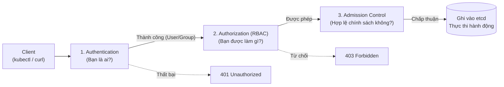
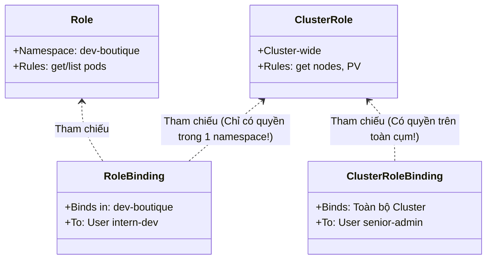

# Bài 30: Authentication & Phân quyền RBAC

## 1. Thông tin bài học
* **Tên bài:** Bài 30: Authentication & Phân quyền RBAC
* **Mục tiêu học:** Nắm vững hai bức tường lửa kiểm soát truy cập đầu tiên của API Server: Xác thực danh tính (Authentication - AuthN) và Phân quyền hành vi (Authorization - AuthZ); hiểu sâu bản chất vì sao Kubernetes không lưu trữ người dùng người thật (Users) trong etcd; làm chủ "bộ tứ nguyên tử" của cơ chế RBAC (`Role`, `ClusterRole`, `RoleBinding`, `ClusterRoleBinding`); giải mã cấu trúc một bộ quy tắc phân quyền (apiGroups, resources, verbs); thành thạo công cụ kiểm tra quyền tức thì `kubectl auth can-i`; thực hành cấp phát danh tính bằng chứng chỉ X.509 và thiết lập chính sách phân quyền tối thiểu (Principle of Least Privilege) cho nhân sự mới trong namespace `dev-boutique`.
* **Thời lượng ước tính:** 180 phút (90 phút lý thuyết, 90 phút thực hành)
* **Kiến thức cần có trước:** Bài 05 (Kiến trúc Control Plane & API Server), Bài 11 (Namespace: Phân chia không gian làm việc).
* **Liên quan kỳ thi:** CKA, CKS (Trọng tâm bảo mật tối quan trọng chiếm 20% tổng số điểm trong cả hai kỳ thi CKA và CKS: đề thi luôn yêu cầu tạo tài khoản mới bằng chứng chỉ CSR, tạo Role hạn chế quyền đọc/ghi trong một namespace, và bind quyền cho User hoặc ServiceAccount).

---

## 2. Bảng thuật ngữ

| Thuật ngữ | Giải thích đơn giản | Ví dụ / Ẩn dụ đời thường |
| :--- | :--- | :--- |
| **Authentication (AuthN)** | Quá trình xác minh: "Bạn là ai?" (Kiểm tra xem danh tính người gọi API có hợp lệ không). | Trình thẻ căn cước công dân hoặc hộ chiếu tại quầy lễ tân để chứng minh bạn là công dân hợp pháp. |
| **Authorization (AuthZ)** | Quá trình kiểm tra: "Bạn được phép làm gì?" (Kiểm tra xem danh tính đó có quyền thực hiện hành động này không). | Kiểm tra xem trên thẻ của bạn có dấu mộc "Được phép vào kho bảo mật" hay chỉ được ngồi ở phòng khách. |
| **RBAC (Role-Based Access Control)** | Cơ chế phân quyền dựa trên vai trò: Gán quyền hạn vào các "Vai trò" (Roles), sau đó gán vai trò đó cho người dùng. | Thay vì cấp chìa khóa từng phòng cho từng cá nhân, ban quản lý tạo ra vai trò "Bác sĩ" (có quyền vào mọi phòng mổ) và trao chức danh đó cho người được tuyển dụng. |
| **Role** | Tập hợp các quyền (đọc, ghi, xóa) đối với các tài nguyên **trong phạm vi một Namespace duy nhất**. | Nội quy phòng Kế toán: Chỉ có giá trị áp dụng đối với các tài liệu và két sắt nằm bên trong phòng Kế toán. |
| **ClusterRole** | Tập hợp các quyền áp dụng trên **toàn bộ cụm (Cluster-wide)** hoặc trên các tài nguyên không thuộc namespace nào (như Node, PV). | Nội quy toàn bộ tòa nhà: Áp dụng cho thang máy chung, sảnh chính và bãi đỗ xe của tòa nhà. |
| **RoleBinding** | Cây cầu liên kết một Role (hoặc ClusterRole) với một User/Group/ServiceAccount **trong một Namespace**. | Quyết định bổ nhiệm: Trao quyền "Trưởng phòng" cho anh An, nhưng chỉ áp dụng trong phạm vi phòng Kế toán. |
| **ClusterRoleBinding** | Cây cầu liên kết một ClusterRole với một User/Group/ServiceAccount **trên phạm vi toàn cụm**. | Quyết định bổ nhiệm: Trao quyền "Tổng giám đốc" cho chị Bình, có hiệu lực trên tất cả các phòng ban trong toàn công ty. |
| **Verbs** | Các động từ đại diện cho hành động thao tác với API (`get`, `list`, `watch`, `create`, `update`, `patch`, `delete`). | Các hành động pháp lý: Đọc hồ sơ, sửa hồ sơ, xé hồ sơ, nộp hồ sơ mới. |

---

## 3. Bức tranh lớn: Vấn đề thực tế và ẩn dụ đời thường

### Nhắc lại bài trước
Ở Bài 29, chúng ta đã kết thúc Giai đoạn 5 bằng việc làm chủ cơ chế tối ưu hóa tài nguyên Vertical Pod Autoscaler (VPA). Bước sang Giai đoạn 6, chúng ta bước vào thế giới **Bảo mật và An ninh cụm (Security & Hardening)**. Trước khi nói đến việc chống mã độc hay khóa chặt container, câu hỏi đầu tiên đặt ra là: *Làm thế nào để kiểm soát ai được phép gõ lệnh tương tác với cụm Kubernetes của bạn?*

### Tại sao cần cái này ở production? (Vấn đề thực tế)

1. **Hiểm họa "Tài khoản thần thánh" (Cluster-Admin cho tất cả mọi người):**
   Trong các dự án khởi nghiệp thiếu kinh nghiệm, khi một lập trình viên mới (Intern/Junior) vào công ty và phàn nàn: *"Em không xem được log Pod"*, người quản trị liền vội vã đưa cho anh ta file `kubeconfig` chứa quyền `cluster-admin`. Một tuần sau, trong lúc dọn dẹp nhầm, anh ta gõ:
   `kubectl delete pods --all --all-namespaces`  
   Toàn bộ cơ sở dữ liệu, dịch vụ thanh toán, website bán hàng bị xóa sạch trong 3 giây! Nếu không có phân quyền RBAC, bất kỳ một sai lầm ngớ ngẩn nào của con người cũng có thể biến thành thảm họa phá hủy cả công ty.
2. **Sự thật gây sốc về tài khoản người dùng trong Kubernetes:**
   Nếu bạn tìm kiếm đối tượng User trong Kubernetes bằng lệnh: `kubectl get users`, hệ thống sẽ báo lỗi `the server doesn't have a resource type "users"`.  
   **Kubernetes hoàn toàn KHÔNG CÓ đối tượng User trong cơ sở dữ liệu etcd!** Kubernetes thiết kế theo triết lý mở: Việc quản lý người dùng thuộc về các hệ thống định danh bên ngoài (như Active Directory, Okta, Keycloak, Google Workspace hoặc Chứng chỉ số X.509). Kubernetes chỉ làm duy nhất một việc: Đọc chứng chỉ/token để biết tên bạn là ai, rồi tra cứu trong bảng RBAC xem bạn được làm gì!
3. **Tuân thủ tiêu chuẩn an ninh và kiểm toán (Compliance & Least Privilege):**
   Các tiêu chuẩn an ninh quốc tế (như SOC2, ISO 27001, PCI-DSS) bắt buộc hệ thống phải tuân thủ **Nguyên tắc quyền tối thiểu (Principle of Least Privilege)**: Một người chỉ được cấp đúng những quyền hạn tối thiểu vừa đủ để hoàn thành công việc của họ, không thừa một quyền nào. Một thực tập sinh chỉ cần xem log của `frontend` thì tuyệt đối không được phép xem Secret chứa mật khẩu cơ sở dữ liệu!

### Ẩn dụ đời thường: Khách sạn quốc tế và Thẻ từ phòng

Hãy hình dung quá trình tương tác với Kubernetes API Server giống hệt như một vị khách bước vào khách sạn 5 sao:
1. **Giai đoạn Xác thực (Authentication):**
   * Bạn đến quầy lễ tân (API Server), xuất trình Hộ chiếu có dán ảnh và dấu giáp lai của cơ quan công an (Chứng chỉ số X.509 có chữ ký của Kubernetes CA).
   * Lễ tân kiểm tra con dấu: *"Hộ chiếu thật, thông tin hợp lệ. Chào anh Nguyễn Văn A, thuộc nhóm `developers`!"*. Đây là **Authentication**.
2. **Giai đoạn Phân quyền (Authorization - RBAC):**
   * Lễ tân mở cuốn sổ phân quyền (Role & RoleBinding) ra xem:
     * Khách tên Nguyễn Văn A chỉ đặt phòng loại Standard tại Tầng 3 (Namespace `dev-boutique`).
     * Trong phòng, anh A được phép bật tivi và mở tủ lạnh (`verbs: get, list`), nhưng không được phép tháo điều hòa mang về (`verbs: delete`).
   * Lễ tân nạp quyền đó vào thẻ từ và trao cho bạn.
3. **Thao tác thực tế:**
   * Bạn quẹt thẻ vào phòng Tầng 3 $\rightarrow$ Cửa mở (**200 OK**).
   * Bạn tò mò quẹt thẻ vào thang máy lên Phòng Tổng thống Tầng Penthouse (Namespace `kube-system`) $\rightarrow$ Chuông reo cảnh báo (**403 Forbidden**)!

---

## 4. Giải thích khái niệm theo từng bước

### 4.1. Luồng xử lý một yêu cầu tại API Server

Mọi lệnh `kubectl` hoặc lời gọi HTTP gửi đến Kubernetes API Server đều phải vượt qua **3 trạm kiểm soát nghiêm ngặt** theo đúng thứ tự:



1. **Trạm 1: Authentication (AuthN):** Kiểm tra chữ ký số X.509, Bearer Token hoặc OIDC token. Nếu thất bại $\rightarrow$ Trả về mã lỗi `401 Unauthorized`.
2. **Trạm 2: Authorization (AuthZ - RBAC):** Kiểm tra xem User đó có Role nào cho phép thực hiện hành động trên tài nguyên đích không. Nếu không $\rightarrow$ Trả về mã lỗi `403 Forbidden`.
3. **Trạm 3: Admission Control:** Kiểm tra các chính sách nâng cao (như Pod Security Standards, ResourceQuota). Nếu vượt qua, yêu cầu mới chính thức được ghi vào etcd!

---

### 4.2. Cấu trúc của một quy tắc phân quyền (RBAC Rule)

Một quy tắc (Rule) bên trong Role được định nghĩa bởi một bộ ba thành phần:

```yaml
rules:
- apiGroups: [""]           # 1. Nhóm API
  resources: ["pods", "pods/log"] # 2. Tài nguyên
  verbs: ["get", "list"]    # 3. Hành động được phép
```

#### 1. `apiGroups` (Nhóm API):
* Nhóm rỗng `[""]`: Đại diện cho **Core API Group** (chứa các tài nguyên nền tảng đời đầu: `pods`, `services`, `configmaps`, `secrets`, `namespaces`, `nodes`).
* Nhóm có tên: `["apps"]` (chứa `deployments`, `statefulsets`, `daemonsets`), `["batch"]` (`jobs`, `cronjobs`), `["networking.k8s.io"]` (`ingresses`, `networkpolicies`).

#### 2. `resources` (Loại tài nguyên):
* Tên tài nguyên luôn viết ở dạng **số nhiều (Plural)** và chữ thường: `pods`, `deployments`, `services`.
* **Sub-resources (Tài nguyên phụ):** Rất nhiều tài nguyên có thành phần con, ví dụ:
  * `pods/log`: Quyền chỉ được xem log của Pod (không đồng nghĩa với việc sửa Pod).
  * `pods/exec`: Quyền nhảy vào bên trong container chạy lệnh.
  * `pods/status`: Quyền cập nhật trạng thái Pod.

#### 3. `verbs` (Hành vi):
* Thao tác đọc: `get` (lấy 1 đối tượng cụ thể), `list` (lấy danh sách nhiều đối tượng), `watch` (lắng nghe thay đổi liên tục).
* Thao tác ghi: `create` (tạo mới), `update` (sửa toàn bộ), `patch` (sửa một phần), `delete` (xóa 1 đối tượng), `deletecollection` (xóa hàng loạt).

---

### 4.3. Phân biệt "Bộ tứ nguyên tử" RBAC

Đây là ma trận phân biệt sống còn mà mọi kỹ sư cần khắc sâu:

| Đối tượng | Phạm vi áp dụng | Đối tượng được cấp quyền | Tác dụng |
| :--- | :--- | :--- | :--- |
| **`Role`** | Cục bộ trong 1 Namespace | Không có (chỉ là bản thiết kế quyền) | Định nghĩa danh sách quyền trong 1 namespace. |
| **`ClusterRole`** | Toàn bộ cụm (Cluster-wide) | Không có (chỉ là bản thiết kế quyền) | Định nghĩa quyền trên toàn cụm hoặc tài nguyên cấp cụm (Node, PV). |
| **`RoleBinding`** | Cục bộ trong 1 Namespace | User, Group, hoặc ServiceAccount | Cấp quyền của Role (hoặc ClusterRole) **chỉ bên trong namespace đó**. |
| **`ClusterRoleBinding`** | Toàn bộ cụm (Cluster-wide) | User, Group, hoặc ServiceAccount | Cấp quyền của ClusterRole **trên toàn bộ mọi namespace trong cụm**. |



> [!IMPORTANT]
> **Mẹo kiến trúc Senior (Tái sử dụng ClusterRole bằng RoleBinding):**  
> Kubernetes có sẵn ClusterRole tên là `view` (chỉ xem) và `edit` (được sửa).  
> Thay vì viết 50 cái `Role` giống hệt nhau cho 50 namespace, bạn chỉ cần tạo một `RoleBinding` trong namespace `dev-boutique` và trỏ vào `roleRef: kind: ClusterRole, name: view`. Khi đó, người dùng sẽ **chỉ có quyền xem bên trong namespace `dev-boutique`** mà không hề xem được các namespace khác! Đây là cách tối ưu hóa vận hành cực kỳ thông minh.

---

## 5. Thực hành (Lab)

* **Môi trường:** Cluster kind 2 node (`lab-control-plane`, `lab-worker`).
* **Mức RAM ước tính:** ~100 MB.
* **Mục tiêu thực hành:**
  1. Tạo namespace mới `dev-boutique`.
  2. Tự tạo một cặp khóa riêng (Private Key) và yêu cầu cấp chứng chỉ (CSR) bằng OpenSSL cho người dùng mới tên là **`intern-dev`**.
  3. Sử dụng Kubernetes Certificates API để phê duyệt (Approve) chứng chỉ cho `intern-dev`.
  4. Tạo một `Role` có tên `pod-log-reader` trong `dev-boutique` (chỉ cho phép `get`, `list` trên `pods` và `pods/log`).
  5. Tạo `RoleBinding` gán Role này cho `intern-dev`.
  6. Kiểm tra quyền hạn bằng công cụ siêu tốc `kubectl auth can-i`.
  7. Dọn dẹp tài nguyên.

---

### Bước 1: Khởi tạo Namespace và tài nguyên thực hành

Tạo namespace `dev-boutique` và chạy một Pod `frontend` nhỏ bên trong:

```powershell
kubectl create namespace dev-boutique
kubectl run test-frontend --image=nginx:alpine -n dev-boutique
kubectl wait --for=condition=Ready pod/test-frontend -n dev-boutique --timeout=60s
```

---

### Bước 2: Tạo Private Key và CSR cho User `intern-dev`

Chúng ta sẽ sử dụng công cụ `openssl` (đã có sẵn trong Windows PowerShell hoặc Git Bash):

```powershell
# 1. Tạo thư mục chứa chứng chỉ
New-Item -ItemType Directory -Force -Path .\certs | Out-Null

# 2. Tạo Private Key cho intern-dev
openssl genrsa -out .\certs\intern-dev.key 2048

# 3. Tạo Certificate Signing Request (CSR) với Common Name (CN) = intern-dev, Organization (O) = developers
openssl req -new -key .\certs\intern-dev.key -out .\certs\intern-dev.csr -subj "/CN=intern-dev/O=developers"
```
> [!NOTE]
> Trong chứng chỉ số X.509:
> * **`CN` (Common Name):** Được Kubernetes ánh xạ thành **Tên người dùng (Username)** $\rightarrow$ `intern-dev`.
> * **`O` (Organization):** Được Kubernetes ánh xạ thành **Nhóm người dùng (Group)** $\rightarrow$ `developers`.

---

### Bước 3: Gửi CSR lên Kubernetes và Phê duyệt (Approve)

Kubernetes có một API nội bộ chuyên để ký duyệt chứng chỉ: `certificates.k8s.io/v1`.  
Đọc nội dung file CSR và chuyển thành chuỗi Base64:

```powershell
$csrBase64 = [Convert]::ToBase64String([IO.File]::ReadAllBytes("$PWD\certs\intern-dev.csr")).Trim()

@'
apiVersion: certificates.k8s.io/v1
kind: CertificateSigningRequest
metadata:
  name: intern-dev-csr
spec:
  request: CSR_PLACEHOLDER
  signerName: kubernetes.io/kube-apiserver-client
  expirationSeconds: 86400 # Có hạn 1 ngày
  usages:
  - client auth
'@.Replace("CSR_PLACEHOLDER", $csrBase64) | Set-Content -Encoding utf8 .\certs\k8s-csr.yaml

kubectl apply -f .\certs\k8s-csr.yaml
```

Kiểm tra trạng thái CSR:
```powershell
kubectl get csr intern-dev-csr
```
**Kết quả mong đợi:**
```text
NAME             AGE   SIGNERNAME                            REQUESTOR   REQUESTEDDURATION   CONDITION
intern-dev-csr   5s    kubernetes.io/kube-apiserver-client   kubernetes-admin   24h          Pending
```

Là Quản trị viên cụm (Admin), hãy phê duyệt chứng chỉ này:
```powershell
kubectl certificate approve intern-dev-csr
```

Trích xuất chứng chỉ đã được Kubernetes CA ký số ra file:
```powershell
kubectl get csr intern-dev-csr -o jsonpath='{.status.certificate}' | ForEach-Object {
    [System.Text.Encoding]::UTF8.GetString([System.Convert]::FromBase64String($_))
} | Set-Content -Encoding utf8 .\certs\intern-dev.crt
```

---

### Bước 4: Tạo Role phân quyền đọc Pod và xem Log

Tạo file manifest `rbac-rules.yaml` chứa `Role` và `RoleBinding` trong namespace `dev-boutique`:

```powershell
@'
apiVersion: rbac.authorization.k8s.io/v1
kind: Role
metadata:
  name: pod-log-reader
  namespace: dev-boutique
rules:
- apiGroups: [""]
  resources: ["pods", "pods/log"]
  verbs: ["get", "list", "watch"]
---
apiVersion: rbac.authorization.k8s.io/v1
kind: RoleBinding
metadata:
  name: intern-dev-read-binding
  namespace: dev-boutique
subjects:
- kind: User
  name: intern-dev
  apiGroup: rbac.authorization.k8s.io
roleRef:
  kind: Role
  name: pod-log-reader
  apiGroup: rbac.authorization.k8s.io
'@ | Set-Content -Encoding utf8 rbac-rules.yaml

kubectl apply -f rbac-rules.yaml
```

---

### Bước 5: Kiểm chứng quyền hạn bằng `kubectl auth can-i`

Lệnh `kubectl auth can-i` cho phép bạn giả lập (Impersonate) bất kỳ người dùng nào bằng cờ `--as` để kiểm tra phân quyền mà không cần phải chuyển đổi cấu hình kubeconfig phức tạp!

#### 1. Kiểm tra quyền được phép trong namespace `dev-boutique`:
```powershell
# intern-dev có được xem danh sách Pod không?
kubectl auth can-i list pods --as intern-dev -n dev-boutique

# intern-dev có được xem log Pod không?
kubectl auth can-i get pods/log --as intern-dev -n dev-boutique
```
**Kết quả mong đợi:**
```text
yes
yes
```

#### 2. Kiểm tra các hành vi BỊ CẤM trong namespace `dev-boutique`:
```powershell
# intern-dev có được xóa Pod không?
kubectl auth can-i delete pods --as intern-dev -n dev-boutique

# intern-dev có được tạo Deployment không?
kubectl auth can-i create deployments --as intern-dev -n dev-boutique

# intern-dev có được đọc Secret mật khẩu không?
kubectl auth can-i get secrets --as intern-dev -n dev-boutique
```
**Kết quả mong đợi:**
```text
no
no
no
```

#### 3. Kiểm tra xem có bị rò rỉ quyền sang Namespace khác (`default`) không:
```powershell
kubectl auth can-i list pods --as intern-dev -n default
```
**Kết quả mong đợi:**
```text
no
```
> [!TIP]
> Toàn bộ các bài kiểm tra đều khớp chính xác 100% với mong đợi! Người dùng `intern-dev` đã bị khóa chặt an toàn: chỉ được đọc Pod và xem log trong đúng namespace `dev-boutique`, hoàn toàn không thể phá hoại hay nhìn trộm dữ liệu ở nơi khác!

---

### Bước 6: Dọn dẹp tài nguyên (Cleanup)

Giải phóng các tài nguyên đã tạo trong buổi thực hành:

```powershell
kubectl delete -f rbac-rules.yaml
kubectl delete csr intern-dev-csr
kubectl delete namespace dev-boutique
Remove-Item -Recurse -Force .\certs, rbac-rules.yaml -ErrorAction SilentlyContinue
```

---

## 6. Lỗi thường gặp và cách debug

### Lỗi 1: `User "system:anonymous" cannot get path "/"` hoặc lỗi 401 Unauthorized
* **Dấu hiệu:** Chạy lệnh gọi API bằng `curl` hoặc `kubectl` thì bị từ chối với thông báo `system:anonymous`.
* **Nguyên nhân:** Yêu cầu gửi tới API Server nhưng không mang theo bất kỳ chứng chỉ (Certificate) hoặc Token hợp lệ nào. API Server tự động gán danh tính của bạn là `system:anonymous`. Vì người ẩn danh mặc định không có bất kỳ quyền nào, yêu cầu bị từ chối ngay ở trạm Authentication.
* **Cách debug và sửa:**
  * Kiểm tra lại file `kubeconfig` xem phần `users[*].user.client-certificate-data` hoặc `token` có bị trống hay hết hạn không.

---

### Lỗi 2: Sai sót `apiGroups` khiến Role không có tác dụng
* **Dấu hiệu:** Bạn đã tạo Role cho phép thao tác trên `deployments` nhưng khi chạy lệnh vẫn bị `403 Forbidden`.
* **Nguyên nhân:** Khai báo sai nhóm API. Rất nhiều người quen tay ghi `apiGroups: [""]` cho Deployment. Tuy nhiên, Deployment thuộc nhóm `apps` (`apiVersion: apps/v1`). Nhóm `[""]` chỉ dành riêng cho Core API (Pod, Service, Secret, ConfigMap).
* **Cách debug và sửa:**
  * Dùng lệnh sau để tra cứu chính xác nhóm API của một tài nguyên:
    `kubectl api-resources | Select-String "deployments"`
    Cột `APIVERSION` hiển thị `apps/v1` $\rightarrow$ `apiGroups` bắt buộc phải là `["apps"]`.

---

### Lỗi 3: Tạo `RoleBinding` nhưng nhầm lẫn giữa User và ServiceAccount trong `subjects`
* **Dấu hiệu:** Ứng dụng chạy trong Pod dùng ServiceAccount nhưng không gọi được API Server, mặc dù RoleBinding đã được tạo.
* **Nguyên nhân:** Khai báo sai trường `kind` trong khối `subjects`:
  ```yaml
  # SAI: Gán cho ServiceAccount nhưng ghi nhầm kind là User
  subjects:
  - kind: User
    name: my-service-account
  ```
* **Cách debug và sửa:**
  * Nếu cấp quyền cho Pod/Ứng dụng, BẮT BUỘC ghi `kind: ServiceAccount` và phải chỉ định rõ `namespace` của ServiceAccount đó.
  * Nếu cấp quyền cho con người bằng chứng chỉ X.509, ghi `kind: User`.

---

## 7. Góc nhìn Senior

### 1. Sự đánh đổi (Trade-offs): Phân quyền chi tiết (Fine-grained) vs Gánh nặng quản trị

| Tiêu chí | Phân quyền siêu chi tiết (Fine-grained RBAC) | Phân quyền nhóm lớn (Coarse-grained RBAC) |
| :--- | :--- | :--- |
| **Mức độ an toàn** | Cực cao: Mỗi vai trò chỉ có vài quyền cụ thể, hạn chế tối đa rủi ro lộ quyền. | Trung bình: Dễ xảy ra tình trạng cấp thừa quyền (Over-privileged). |
| **Độ phức tạp quản trị** | Rất cao: Cụm có hàng trăm Role/RoleBinding, khó bảo trì, dễ sai sót khi cập nhật. | Thấp: Chỉ duy trì vài Role chuẩn (Admin, Developer, Viewer). |
| **Khuyến nghị vận hành** | Áp dụng cho các hệ thống ngân hàng, tài chính, môi trường Production quan trọng. | Áp dụng cho môi trường Dev/Staging nội bộ nhằm tăng tốc độ phát triển. |

---

### 2. Best practices tại production

1. **Tuyệt đối không cấp quyền sử dụng ký tự đại diện `*` (Wildcards):**
   * Trong file YAML, không bao giờ viết:
     ```yaml
     verbs: ["*"]
     resources: ["*"]
     ```
   * Viết `*` tương đương với việc trao quyền tối thượng. Kẻ tấn công nếu chiếm được quyền này có thể leo thang đặc quyền (Privilege Escalation) để chiếm quyền kiểm soát toàn bộ cụm.
2. **Cảnh giác tối cao với các quyền nguy hiểm tiềm ẩn:**
   * **`secrets` (get/list):** Có thể đọc toàn bộ mật khẩu cơ sở dữ liệu và token API.
   * **`pods/exec` (create):** Cho phép mở shell vào Pod, từ đó đánh cắp token của ServiceAccount trong Pod.
   * **`rolebindings` (create):** Cho phép tự bind thêm quyền admin cho chính mình.
   * **`certificatesigningrequests` (approve):** Cho phép tự ký chứng chỉ admin mới.
3. **Không dùng chứng chỉ X.509 cho con người trong môi trường Enterprise:**
   * Một nhược điểm chết người của X.509 Client Certificate trong Kubernetes là: **Kubernetes KHÔNG HỖ TRỢ danh sách thu hồi chứng chỉ (CRL - Certificate Revocation List)**!
   * Nếu một nhân viên nghỉ việc hoặc bị lộ Private Key, chứng chỉ đó sẽ tiếp tục hợp lệ cho đến tận ngày hết hạn (Expiration date), bạn không thể thu hồi quyền của anh ta trừ phi đập đi xây lại toàn bộ Cluster CA!
   * **Chuẩn mực Enterprise:** Bắt buộc tích hợp **OIDC (OpenID Connect)** với Keycloak, Okta, Microsoft Entra ID hoặc Google Workspace. Khi nhân viên nghỉ việc, ta chỉ cần vô hiệu hóa tài khoản trên Okta là toàn bộ quyền truy cập Kubernetes bị cắt đứt tức thì!

---

### 3. Câu hỏi phỏng vấn Senior

* **Câu hỏi 1:** *Khi nào ta nên dùng `RoleBinding` để liên kết một `ClusterRole`? Điểm khác biệt giữa cách này và việc dùng `ClusterRoleBinding` là gì?*
* **Gợi ý trả lời chuẩn:**
  * **RoleBinding trỏ tới ClusterRole:**
    * Được dùng để **tái sử dụng (Reuse)** một tập hợp quyền đã được định nghĩa sẵn ở cấp Cluster (ví dụ ClusterRole chuẩn `edit` hoặc `view`) nhưng **CHỈ GIỚI HẠN quyền hạn đó bên trong một Namespace cụ thể**.
    * *Ví dụ:* Bạn có 100 namespace. Thay vì tạo 100 cái Role `view` trong từng namespace, bạn chỉ cần tạo 1 ClusterRole `view` chung cho toàn cụm, rồi tạo các `RoleBinding` ở từng namespace trỏ tới ClusterRole đó. Người dùng chỉ có quyền xem trong namespace được bind, không xem được namespace khác.
  * **ClusterRoleBinding trỏ tới ClusterRole:**
    * Cấp quyền hạn đó trên **TOÀN BỘ CỤM** và trên **TẤT CẢ các Namespaces** hiện tại cũng như các namespace được tạo ra trong tương lai.

* **Câu hỏi 2:** *Làm thế nào để kiểm toán (Audit) và phát hiện các quyền hạn bị cấp thừa hoặc các lỗ hổng RBAC rủi ro cao trong một cụm Kubernetes có hàng ngàn đối tượng?*
* **Gợi ý trả lời chuẩn:**
  * Để kiểm toán RBAC ở quy mô lớn, một Senior SRE sẽ không kiểm tra thủ công từng file YAML mà sử dụng các công cụ tự động hóa:
    1. **`kubectl auth can-i --list --as=<user>`:** Liệt kê toàn bộ bảng ma trận quyền hạn thực tế của một đối tượng cụ thể.
    2. **`rakkess` (Review Access):** Plugin của `kubectl` (Krew) hiển thị bảng ma trận trực quan so khớp giữa User với toàn bộ tài nguyên trong cụm.
    3. **`kubectl-who-can`:** Truy vấn ngược: *"Ai trong cụm có quyền xóa namespace?"* (`kubectl who-can delete namespaces`).
    4. **Công cụ bảo mật chuyên dụng:** Triển khai **Popeye**, **Kube-bench** hoặc **Krane** (của App-Via) để quét tự động toàn bộ RBAC graph, phát hiện các đường dẫn leo thang đặc quyền (Privilege Escalation Paths).

---

## 8. Tóm tắt bài học
* 📌 **1. AuthN vs AuthZ:** Authentication xác minh danh tính người gọi API (Bạn là ai?); Authorization xác minh quyền hạn thực hiện hành vi (Bạn được làm gì?).
* 📌 **2. Không có đối tượng User trong etcd:** Kubernetes chỉ xác thực User thông qua chứng chỉ bên ngoài (X.509) hoặc Identity Provider (OIDC/Token).
* 📌 **3. Bộ tứ nguyên tử RBAC:** `Role` (quyền trong namespace), `ClusterRole` (quyền toàn cụm), `RoleBinding` (gán quyền trong namespace), `ClusterRoleBinding` (gán quyền toàn cụm).
* 📌 **4. Cấu trúc một Rule:** Luôn gồm 3 phần: `apiGroups` (nhóm API), `resources` (loại tài nguyên), và `verbs` (hành động được phép).
* 📌 **5. Công cụ kiểm tra `kubectl auth can-i`:** Cứu cánh số 1 để kiểm tra và debug phân quyền thần tốc bằng cờ `--as` mà không cần đổi kubeconfig.

---

## 9. Bài tập tự làm

* 🟢 **Mức Dễ:** Viết một `ClusterRole` có tên `node-inspector` cho phép người dùng chỉ được `get` và `list` trên tài nguyên `nodes`. Kiểm tra quyền hạn bằng lệnh `kubectl auth can-i`.
* 🟡 **Mức Vừa:** Trong namespace `default`, hãy tạo một `Role` có tên `secret-manager` cho phép người dùng `dev-admin` có toàn quyền (`create`, `get`, `update`, `delete`) trên `secrets`, nhưng TUYỆT ĐỐI KHÔNG ĐƯỢC thao tác trên bất kỳ tài nguyên nào khác (như `pods`, `configmaps`).
* 🔴 **Mức Khó:** Viết file manifest cấu hình một `Role` tinh vi chỉ cho phép sửa đúng **một Pod duy nhất có tên là `payment-gateway`** trong namespace `production`, không được phép sửa bất kỳ Pod nào khác (gợi ý: sử dụng trường `resourceNames`).

---

## 10. Câu hỏi tự kiểm tra

1. Nếu một người dùng có 2 RoleBinding: Role A cho phép `get pods`, Role B cấm (Deny) `get pods`. Người dùng đó cuối cùng có được xem Pod không?
2. Tại sao ta không thể dùng `Role` để cấp quyền xem danh sách các `Node` máy chủ trong cụm?
3. Điều gì sẽ xảy ra nếu bạn tạo một `RoleBinding` trong namespace `dev` nhưng lại trỏ tới một `Role` nằm ở namespace `prod`?
4. Quyền `pods/exec` thuộc loại tài nguyên nào trong Kubernetes? Tại sao việc cấp quyền này lại nguy hiểm tương đương với việc cấp quyền Root trên máy chủ?
5. Điểm yếu lớn nhất của việc sử dụng X.509 Client Certificate để định danh người dùng trong Kubernetes là gì?

<details>
<summary>👉 Bấm vào đây để xem đáp án câu hỏi tự kiểm tra</summary>

* **Câu 1:** Người dùng **VẪN ĐƯỢC XEM POD!** Bởi vì hệ thống RBAC của Kubernetes là cơ chế **Purely Additive (Chỉ cộng thêm quyền, KHÔNG CÓ luật cấm Deny)**! Chỉ cần có ít nhất một Rule cho phép hành động là yêu cầu được chấp thuận.
* **Câu 2:** Vì tài nguyên `Node` là tài nguyên cấp cụm (Cluster-scoped resource), không thuộc về bất kỳ namespace nào. Do đó, chỉ có `ClusterRole` mới có thể định nghĩa quyền hạn trên `nodes`.
* **Câu 3:** Lệnh sẽ báo lỗi hoặc không hoạt động! Một `RoleBinding` chỉ có thể tham chiếu tới một `Role` nằm trong **CÙNG MỘT NAMESPACE** với chính nó (hoặc tham chiếu tới một `ClusterRole`).
* **Câu 4:** `pods/exec` là một tài nguyên phụ (Sub-resource). Cấp quyền này cho phép người dùng mở một terminal tương tác trực tiếp bên trong container, từ đó họ có thể đọc file cấu hình, đánh cắp token của ServiceAccount và thực hiện các cuộc tấn công di chuyển ngang trong mạng.
* **Câu 5:** Không thể thu hồi (Revoke) chứng chỉ trước thời hạn do Kubernetes không hỗ trợ CRL (Certificate Revocation List). Nếu nhân viên nghỉ việc hoặc lộ khóa riêng, bạn buộc phải đổi toàn bộ Cluster CA hoặc xóa bỏ các RoleBinding liên quan.
</details>

---

## 11. Tài liệu đọc thêm và bài tiếp theo

### Tài liệu tham khảo
* [Kubernetes Documentation: Using RBAC Authorization](https://kubernetes.io/docs/reference/access-authn-authz/rbac/)
* [Kubernetes Documentation: Authenticating](https://kubernetes.io/docs/reference/access-authn-authz/authentication/)
* [Kubernetes Documentation: Certificate Signing Requests](https://kubernetes.io/docs/reference/access-authn-authz/certificate-signing-requests/)

### Bài tiếp theo
👉 **Bài 31: ServiceAccount & Projected Tokens**

---

## PHỤ LỤC: ĐÁP ÁN GỢI Ý BÀI TẬP TỰ LÀM (MỤC 9)

### Đáp án Mức Dễ
```powershell
# Tạo ClusterRole
@'
apiVersion: rbac.authorization.k8s.io/v1
kind: ClusterRole
metadata:
  name: node-inspector
rules:
- apiGroups: [""]
  resources: ["nodes"]
  verbs: ["get", "list"]
'@ | Set-Content -Encoding utf8 node-inspector.yaml
kubectl apply -f node-inspector.yaml

# Dọn dẹp
kubectl delete -f node-inspector.yaml
Remove-Item node-inspector.yaml -ErrorAction SilentlyContinue
```

---

### Đáp án Mức Vừa
```powershell
@'
apiVersion: rbac.authorization.k8s.io/v1
kind: Role
metadata:
  name: secret-manager
  namespace: default
rules:
- apiGroups: [""]
  resources: ["secrets"]
  verbs: ["get", "list", "create", "update", "delete"]
---
apiVersion: rbac.authorization.k8s.io/v1
kind: RoleBinding
metadata:
  name: dev-admin-secrets
  namespace: default
subjects:
- kind: User
  name: dev-admin
  apiGroup: rbac.authorization.k8s.io
roleRef:
  kind: Role
  name: secret-manager
  apiGroup: rbac.authorization.k8s.io
'@ | Set-Content -Encoding utf8 secret-manager.yaml
kubectl apply -f secret-manager.yaml

# Dọn dẹp
kubectl delete -f secret-manager.yaml
Remove-Item secret-manager.yaml -ErrorAction SilentlyContinue
```

---

### Đáp án Mức Khó
Sử dụng trường `resourceNames` để khóa cứng đích danh tên đối tượng:
```yaml
apiVersion: rbac.authorization.k8s.io/v1
kind: Role
metadata:
  name: payment-pod-modifier
  namespace: production
rules:
- apiGroups: [""]
  resources: ["pods"]
  resourceNames: ["payment-gateway"] # CHỈ áp dụng riêng cho Pod có tên này!
  verbs: ["get", "update", "patch"]
```
*(Lưu ý: Khi sử dụng `resourceNames`, các verbs không được chứa `list` hoặc `watch` vì hai hành vi này đòi hỏi quét toàn bộ namespace).*

