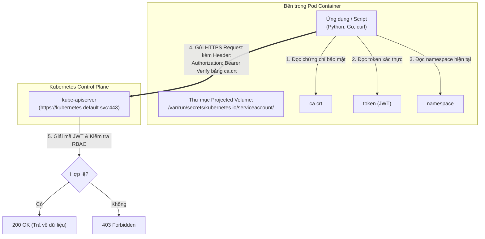
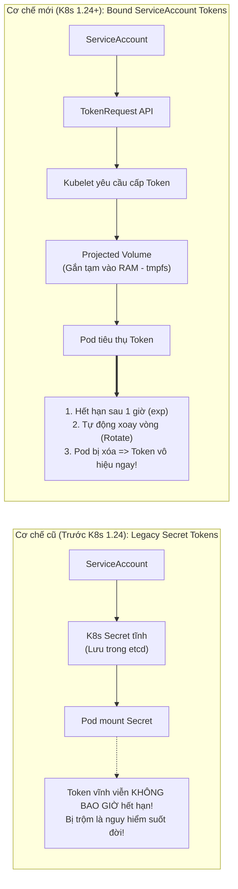

# Bài 31: ServiceAccount & Projected Tokens

## 1. Thông tin bài học
* **Tên bài:** Bài 31: ServiceAccount & Projected Tokens
* **Mục tiêu học:** Nắm vững cơ chế cấp phát danh tính cho ứng dụng và tiến trình tự động (Machine-to-Machine / Workload Identity); phân biệt rạch ròi giữa tài khoản con người (User) và tài khoản ứng dụng (`ServiceAccount`); giải mã sự tiến hóa mang tính bước ngoặt từ Legacy Secret Token (token vĩnh viễn) sang Bound ServiceAccount Token (token có hạn, tự xoay vòng gắn chặt với vòng đời của Pod qua Projected Volume); hiểu rõ cấu trúc và cách giải mã JWT Token trong thư mục `/var/run/secrets/kubernetes.io/serviceaccount/`; áp dụng quy tắc vàng vô hiệu hóa tự động mount token (`automountServiceAccountToken: false`) để triệt tiêu bề mặt tấn công; thực hành phân quyền cho Pod truy vấn trực tiếp API Server nội bộ trong Google Online Boutique.
* **Thời lượng ước tính:** 150 phút (75 phút lý thuyết, 75 phút thực hành)
* **Kiến thức cần có trước:** Bài 05 (Kiến trúc Control Plane & API Server), Bài 06 (Pod spec & Volumes), Bài 30 (Authentication & Phân quyền RBAC).
* **Liên quan kỳ thi:** CKA, CKS (Trọng tâm cấu phần Bảo mật ứng dụng: đề thi CKA luôn có bài tạo ServiceAccount và gán cho Pod; đề thi CKS khai thác sâu về việc siết chặt token, tắt automountServiceAccountToken và điều tra rủi ro lộ lọt JWT token).

---

## 2. Bảng thuật ngữ

| Thuật ngữ | Giải thích đơn giản | Ví dụ / Ẩn dụ đời thường |
| :--- | :--- | :--- |
| **ServiceAccount (SA)** | Đối tượng tài khoản định danh dành riêng cho các tiến trình chạy bên trong Pod, do Kubernetes trực tiếp quản lý trong etcd. | Thẻ từ ra vào nội bộ cấp riêng cho chiếc xe robot hút bụi tự động của tòa nhà văn phòng. |
| **Default ServiceAccount** | Tài khoản mặc định được Kubernetes tự động tạo ra trong mỗi Namespace và tự động gán vào bất kỳ Pod nào nếu người dùng không chỉ định. | Thẻ khách vãng lai mặc định phát cho bất kỳ ai bước vào cổng mà không đăng ký trước. |
| **Bound ServiceAccount Token** | Loại token thế hệ mới (chuẩn từ K8s v1.24+), có thời hạn sử dụng ngắn, tự động xoay vòng, và gắn chặt (bound) với sự tồn tại của Pod cụ thể. | Mã OTP mở cửa khách sạn trên điện thoại: Chỉ có hiệu lực trong 1 giờ và tự động hủy ngay khi bạn trả phòng. |
| **Legacy Secret Token** | Cơ chế cũ (trước K8s v1.24): Token được lưu cố định trong một Secret và KHÔNG BAO GIỜ hết hạn (vĩnh viễn). | Chìa khóa cơ đúc bằng đồng: Nếu bị trộm sao chép, kẻ trộm có thể dùng nó suốt đời mà chủ nhà không hay biết. |
| **Projected Volume** | Cơ chế gom nhiều nguồn dữ liệu (Secret, ConfigMap, DownwardAPI, ServiceAccountToken) để gắn (mount) vào cùng một thư mục trong container. | Chiếc ví đa năng đựng cả căn cước, vé xe buýt và tiền lẻ vào cùng một ngăn nhỏ tiện lợi. |
| **`automountServiceAccountToken`** | Cờ bật/tắt (Boolean) cho phép hoặc cấm Kubelet tự động nhét token vào thư mục của container. | Công tắc bật/tắt quyền mang theo chìa khóa cơ quan khi ra ngoài. |
| **Audience (`aud`)** | Khán giả hoặc hệ thống đích mà Token đó được tạo ra để phục vụ; ngăn chặn việc lấy token của hệ thống A đem đi lừa hệ thống B. | Tấm vé xem phim ghi rõ "Rạp số 3": Bạn không thể cầm tấm vé đó để vào xem phim ở "Rạp số 5". |

---

## 3. Bức tranh lớn: Vấn đề thực tế và ẩn dụ đời thường

### Nhắc lại bài trước
Ở Bài 30, chúng ta đã nắm vững nguyên lý hoạt động của RBAC để cấp quyền cho **người dùng con người (Human Users)** thông qua chứng chỉ số X.509. Tuy nhiên, trong một hệ thống phân tán, không chỉ có con người mới cần gọi API Server. Các công cụ giám sát (Prometheus), công cụ sao lưu (Velero), Ingress Controller, hoặc chính các microservice nội bộ cũng liên tục cần "nói chuyện" với API Server!

### Tại sao cần cái này ở production? (Vấn đề thực tế)

1. **Hiểm họa từ "Chìa khóa vĩnh cửu" (Legacy Secret Tokens):**
   Trong các phiên bản Kubernetes cũ (trước v1.24), mỗi khi một ServiceAccount được tạo ra, hệ thống tự động sinh một `Secret` chứa chuỗi JWT Token không có hạn sử dụng. Kubelet thản nhiên nhét token này vào mọi Pod. Nếu kẻ tấn công khai thác được một lỗ hổng RCE (Remote Code Execution) trên trang web và đọc được file token này, hắn có thể lưu về máy cá nhân và âm thầm điều khiển cụm Kubernetes của bạn trong suốt 3 năm trời mà không có cách nào thu hồi!
2. **Lỗ hổng "Mặc định mở toang cửa" (Default Automounting):**
   Theo mặc định, Kubernetes tự động gắn token của `default` ServiceAccount vào **100% các Pod** tại đường dẫn `/var/run/secrets/kubernetes.io/serviceaccount/token`.  
   Tuy nhiên, 99% các ứng dụng web thông thường (như `frontend`, `cartservice` của Online Boutique) chỉ làm nhiệm vụ phục vụ khách hàng mua sắm, chúng **HOÀN TOÀN KHÔNG CÓ NHU CẦU** gọi API Server! Việc để sẵn một chiếc token xác thực ngay trong container chẳng khác nào bạn để ví tiền và chìa khóa nhà hớ hênh trên bàn ăn cho kẻ trộm lấy đi!
3. **Nền tảng của kiến trúc Zero-Trust (Workload Identity Federation):**
   Khi microservice của bạn chạy trên Kubernetes (EKS/GKE/AKS) muốn gọi sang các dịch vụ đám mây như AWS S3 bucket hay Google Cloud SQL, làm thế nào để nó xác thực mà không phải nhét Access Key / Secret Key cứng vào file cấu hình? Đó chính là nhờ cơ chế ServiceAccount Token thế hệ mới: Kubernetes ký số token, Cloud Provider xác thực chữ ký số đó qua chuẩn OIDC để cấp quyền tức thời (Workload Identity). Không có một dòng mật khẩu nào bị lộ!

### Ẩn dụ đời thường: Thẻ ra vào nhân viên và Chìa khóa xe tự hành

Hãy phân biệt rõ rệt hai đối tượng định danh trong đời sống:
* **User (Con người - Bài 30):** Giống như Thẻ căn cước công dân gắn chip cấp cho anh kỹ sư tên An. Anh An dùng thẻ này để đi qua cổng bảo vệ lúc 8h sáng. Danh tính này gắn liền với con người cụ thể.
* **ServiceAccount (Máy móc - Bài 31):** Giống như một chiếc vé cầu đường điện tử (VETC/ePass) dán trên kính của chiếc xe tải chở hàng nội bộ của công ty:
  * Chiếc xe tải (Pod) không phải là con người, nó không có căn cước công dân.
  * Chiếc xe mang định danh ServiceAccount `truck-delivery`.
  * Mỗi khi xe chạy qua trạm thu phí tự động (API Server), trạm quét mã chip dán trên xe. Nếu mã chip hợp lệ và xe có quyền đi vào làn ưu tiên (RBAC Role), thanh chắn tự động mở ra.
  * Nếu chiếc xe tải bị tháo dỡ (Pod bị xóa), chiếc vé điện tử đó lập tức bị hủy hiệu lực vĩnh viễn (Bound Token)!

---

## 4. Giải thích khái niệm theo từng bước

### 4.1. Sự khác biệt cốt lõi: User vs ServiceAccount

| Tiêu chí | Người dùng con người (User) | Tài khoản ứng dụng (`ServiceAccount`) |
| :--- | :--- | :--- |
| **Đối tượng đại diện** | Lập trình viên, Quản trị viên SRE, Con người thật. | Tiến trình chạy trong Container, Pod, Controller. |
| **Vị trí lưu trữ** | **KHÔNG lưu trong K8s etcd** (Dùng X.509, LDAP, Okta, OIDC). | **Lưu trực tiếp trong etcd** dưới dạng Kubernetes API Resource. |
| **Phạm vi tồn tại** | Toàn bộ cụm (Cluster-wide). | Nằm trong một **Namespace cụ thể**. |
| **Mục đích chính** | Phục vụ con người gõ lệnh `kubectl`, truy cập Dashboard. | Phục vụ ứng dụng tự động gọi Kubernetes REST API. |

---

### 4.2. Cấu trúc thư mục bí mật trong Pod

Khi Kubelet khởi chạy một Pod có gắn ServiceAccount, nó tự động tạo một Projected Volume và gắn vào đường dẫn:
```text
/var/run/secrets/kubernetes.io/serviceaccount/
```

Thư mục này luôn chứa đúng **3 file thiết yếu**:
1. **`ca.crt` (Root CA Certificate):** Chứng chỉ số của Certificate Authority nội bộ cụm. Ứng dụng dùng file này để xác minh rằng API Server (`https://kubernetes.default.svc`) là máy chủ thật, chống tấn công giả mạo Man-In-The-Middle.
2. **`namespace` (Plaintext string):** Chứa chuỗi văn bản ghi rõ tên Namespace mà Pod này đang cư ngụ (ví dụ: `default` hoặc `dev-boutique`). Ứng dụng đọc file này để biết mình đang ở đâu mà không cần cấu hình cứng.
3. **`token` (JSON Web Token - JWT):** Chuỗi ký tự mã hóa Base64 được ký số mật mã. Đây chính là "giấy thông hành" để ứng dụng đính kèm vào tiêu đề HTTP `Authorization: Bearer <token>` khi gọi API Server.



---

### 4.3. Sự tiến hóa: Legacy Secret Token vs Bound Projected Token

Đây là một trong những bước tiến bảo mật vĩ đại nhất của Kubernetes trong 5 năm qua:



#### So sánh kỹ thuật chi tiết:
1. **Cơ chế cấp phát:**
   * *Cũ:* Controller tạo một Secret tĩnh trong etcd.
   * *Mới:* Sử dụng **TokenRequest API**. Kubelet trực tiếp xin API Server một token ngắn hạn cho riêng Pod đó. Không có Secret nào bị lưu vào etcd!
2. **Thời hạn (Expiration):**
   * *Cũ:* Không có hạn (Never Expire).
   * *Mới:* Có trường `exp` trong JWT (mặc định là 1 giờ). Kubelet âm thầm xin token mới và cập nhật lại file `token` khi token cũ đã đi qua 80% thời gian sống mà ứng dụng không hề bị gián đoạn!
3. **Ràng buộc đối tượng (Bound Object):**
   * *Cũ:* Không ràng buộc.
   * *Mới:* Token bị khóa chặt vào `UID` của Pod đó. Nếu Pod bị xóa hoặc khởi động lại, token cũ lập tức bị từ chối ngay cả khi nó chưa hết hạn 1 giờ!

---

### 4.4. Giải mã cấu trúc JSON Web Token (JWT)

Khi bạn mở file `/var/run/secrets/kubernetes.io/serviceaccount/token` ra, nó có dạng 3 đoạn mã hóa Base64 ngăn cách bởi dấu chấm (`Header.Payload.Signature`).

Giải mã phần **Payload**, bạn sẽ thấy thông tin an ninh cực kỳ chặt chẽ:
```json
{
  "iss": "https://kubernetes.default.svc.cluster.local",
  "sub": "system:serviceaccount:dev-boutique:boutique-auditor",
  "aud": ["https://kubernetes.default.svc.cluster.local"],
  "exp": 1728567890,
  "nbf": 1728564290,
  "kubernetes.io": {
    "namespace": "dev-boutique",
    "serviceaccount": {
      "name": "boutique-auditor",
      "uid": "a1b2c3d4-..."
    },
    "pod": {
      "name": "auditor-pod-7b98f-x2m9q",
      "uid": "f9e8d7c6-..."
    }
  }
}
```
* **`sub` (Subject):** Định danh chuẩn của ServiceAccount: `system:serviceaccount:<namespace>:<tên-sa>`. RBAC dùng chuỗi này để kiểm tra quyền!
* **`aud` (Audience):** Đối tượng tiếp nhận hợp lệ.
* **`exp` (Expiration Time):** Thời điểm tính bằng giây Unix mà sau đó token trở thành giấy vụn.
* **`kubernetes.io/pod/uid`:** Khóa chặt token vào đúng thực thể Pod đang chạy.

---

### 4.5. Quy tắc vàng bảo mật: `automountServiceAccountToken: false`

Theo khuyến nghị an ninh của CIS Kubernetes Benchmark và NSA/CISA Hardening Guide:  
**Bất kỳ Pod nào không cần tương tác với Kubernetes API Server đều PHẢI TẮT tính năng tự động mount token!**

Có hai cấp độ để tắt:
1. **Tắt trên toàn bộ ServiceAccount:** Bất kỳ Pod nào dùng ServiceAccount này đều mặc định không bị nhét token vào:
   ```yaml
   apiVersion: v1
   kind: ServiceAccount
   metadata:
     name: non-api-sa
   automountServiceAccountToken: false
   ```
2. **Tắt trực tiếp trên từng Pod:**
   ```yaml
   apiVersion: v1
   kind: Pod
   metadata:
     name: secure-frontend
   spec:
     automountServiceAccountToken: false # Không mount bất kỳ token nào vào Pod!
     containers:
     - name: frontend
       image: nginx:alpine
   ```

---

## 5. Thực hành (Lab)

* **Môi trường:** Cluster kind 2 node (`lab-control-plane`, `lab-worker`).
* **Mức RAM ước tính:** ~200 MB.
* **Mục tiêu thực hành:**
  1. Tạo namespace `dev-boutique` và ServiceAccount `boutique-auditor`.
  2. Dùng RBAC cấp quyền chỉ đọc danh sách Pod cho `boutique-auditor`.
  3. Triển khai một Pod chạy ServiceAccount này và soi trực tiếp thư mục mount bí mật.
  4. Thực hiện cuộc gọi HTTPS REST API thực thụ từ bên trong Pod tới API Server nội bộ.
  5. Thử nghiệm cờ `automountServiceAccountToken: false` để triệt tiêu bề mặt tấn công.
  6. Dọn dẹp tài nguyên.

---

### Bước 1: Khởi tạo Namespace, ServiceAccount và RBAC

Chúng ta tạo ServiceAccount và cấp quyền `get`, `list` trên tài nguyên `pods`:

```powershell
@'
apiVersion: v1
kind: Namespace
metadata:
  name: dev-boutique
---
apiVersion: v1
kind: ServiceAccount
metadata:
  name: boutique-auditor
  namespace: dev-boutique
---
apiVersion: rbac.authorization.k8s.io/v1
kind: Role
metadata:
  name: pod-reader-role
  namespace: dev-boutique
rules:
- apiGroups: [""]
  resources: ["pods"]
  verbs: ["get", "list"]
---
apiVersion: rbac.authorization.k8s.io/v1
kind: RoleBinding
metadata:
  name: auditor-binding
  namespace: dev-boutique
subjects:
- kind: ServiceAccount
  name: boutique-auditor
  namespace: dev-boutique
roleRef:
  kind: Role
  name: pod-reader-role
  apiGroup: rbac.authorization.k8s.io
'@ | Set-Content -Encoding utf8 sa-rbac.yaml

kubectl apply -f sa-rbac.yaml
```

Kiểm tra ServiceAccount vừa tạo:
```powershell
kubectl get sa boutique-auditor -n dev-boutique
```

---

### Bước 2: Triển khai Pod sử dụng ServiceAccount `boutique-auditor`

Tạo một Pod có cài sẵn công cụ mạng (`curlimages/curl`) để thực nghiệm gọi API:

```powershell
@'
apiVersion: v1
kind: Pod
metadata:
  name: auditor-agent
  namespace: dev-boutique
spec:
  serviceAccountName: boutique-auditor # Gán ServiceAccount chuyên dụng!
  containers:
  - name: inspector
    image: curlimages/curl:latest
    command: ["sleep", "3600"]
'@ | Set-Content -Encoding utf8 auditor-pod.yaml

kubectl apply -f auditor-pod.yaml
kubectl wait --for=condition=Ready pod/auditor-agent -n dev-boutique --timeout=60s
```

---

### Bước 3: Khám phá thư mục Secret Mount bên trong Pod

Hãy nhảy vào bên trong container để xem Kubelet đã tự động chuẩn bị những gì:

```powershell
kubectl exec -it auditor-agent -n dev-boutique -- ls -la /var/run/secrets/kubernetes.io/serviceaccount/
```

**Kết quả mong đợi:**
```text
drwxrwxrwt    3 root     root           140 Oct 09 11:45 .
drwxr-xr-x    3 root     root          4096 Oct 09 11:45 ..
lrwxrwxrwx    1 root     root            13 Oct 09 11:45 ca.crt -> ..data/ca.crt
lrwxrwxrwx    1 root     root            16 Oct 09 11:45 namespace -> ..data/namespace
lrwxrwxrwx    1 root     root            12 Oct 09 11:45 token -> ..data/token
```
> [!NOTE]
> Đúng như lý thuyết: Ba file `ca.crt`, `namespace`, và `token` đã xuất hiện! Cả 3 file đều là symbolic link trỏ vào thư mục `..data` của cơ chế Projected Volume.

Kiểm tra nội dung file `namespace`:
```powershell
kubectl exec -it auditor-agent -n dev-boutique -- cat /var/run/secrets/kubernetes.io/serviceaccount/namespace
```
**Output in ra:**
`dev-boutique`

---

### Bước 4: Gọi REST API Server nội bộ từ bên trong Container

Trong Kubernetes, địa chỉ dịch vụ của API Server luôn được CoreDNS phân giải nội bộ qua tên miền chuẩn:  
`https://kubernetes.default.svc:443`

Bây giờ, hãy dùng `curl` thực hiện một cuộc gọi API chính thống:

```powershell
kubectl exec -it auditor-agent -n dev-boutique -- /bin/sh -c '
  TOKEN=$(cat /var/run/secrets/kubernetes.io/serviceaccount/token)
  CACERT=/var/run/secrets/kubernetes.io/serviceaccount/ca.crt
  
  curl -s --cacert $CACERT \
       --header "Authorization: Bearer $TOKEN" \
       https://kubernetes.default.svc/api/v1/namespaces/dev-boutique/pods
'
```

**Kết quả mong đợi:**
Hệ thống trả về một cấu trúc JSON hoàn chỉnh (`kind: "PodList"`) chứa danh sách toàn bộ các Pod đang chạy trong namespace `dev-boutique`!

Bây giờ hãy thử kiểm tra quyền hạn ngoài luồng: Liệu Pod này có đọc được **Secret** không?

```powershell
kubectl exec -it auditor-agent -n dev-boutique -- /bin/sh -c '
  TOKEN=$(cat /var/run/secrets/kubernetes.io/serviceaccount/token)
  CACERT=/var/run/secrets/kubernetes.io/serviceaccount/ca.crt
  
  curl -s --cacert $CACERT \
       --header "Authorization: Bearer $TOKEN" \
       https://kubernetes.default.svc/api/v1/namespaces/dev-boutique/secrets
'
```

**Kết quả mong đợi:**
```json
{
  "kind": "Status",
  "apiVersion": "v1",
  "status": "Failure",
  "message": "secrets is forbidden: User \"system:serviceaccount:dev-boutique:boutique-auditor\" cannot list resource \"secrets\" in API group \"\" in the namespace \"dev-boutique\"",
  "reason": "Forbidden",
  "code": 403
}
```
*API Server lập tức trả về mã lỗi **403 Forbidden**! ServiceAccount đã được khống chế quyền lực chuẩn xác tuyệt đối.*

---

### Bước 5: Thử nghiệm vô hiệu hóa tự động Mount Token (`automountServiceAccountToken: false`)

Bây giờ chúng ta tạo một Pod web thông thường (như frontend của Online Boutique), áp dụng triết lý Hardening bảo mật: **Tắt hoàn toàn việc mount token**:

```powershell
@'
apiVersion: v1
kind: Pod
metadata:
  name: hardened-frontend-pod
  namespace: dev-boutique
spec:
  automountServiceAccountToken: false # KHÓA CHẶT: Không cấp bất kỳ token nào!
  containers:
  - name: web
    image: busybox:1.36
    command: ["sleep", "3600"]
'@ | Set-Content -Encoding utf8 hardened-pod.yaml

kubectl apply -f hardened-pod.yaml
kubectl wait --for=condition=Ready pod/hardened-frontend-pod -n dev-boutique --timeout=60s
```

Hãy thử kiểm tra xem thư mục `/var/run/secrets/` có tồn tại bên trong Pod này không:

```powershell
kubectl exec -it hardened-frontend-pod -n dev-boutique -- ls /var/run/secrets/
```

**Kết quả mong đợi:**
```text
ls: /var/run/secrets/: No such file or directory
```
> [!TIP]
> Thư mục hoàn toàn không tồn tại! Cho dù ứng dụng web của bạn có bị hacker chiếm quyền shell (RCE), hacker cũng hoàn toàn "trắng tay", không thể tìm thấy bất kỳ JWT token nào để tấn công sang Control Plane!

---

### Bước 6: Dọn dẹp tài nguyên (Cleanup)

Giải phóng toàn bộ tài nguyên lab:

```powershell
kubectl delete -f hardened-pod.yaml
kubectl delete -f auditor-pod.yaml
kubectl delete -f sa-rbac.yaml
Remove-Item sa-rbac.yaml, auditor-pod.yaml, hardened-pod.yaml -ErrorAction SilentlyContinue
```

---

## 6. Lỗi thường gặp và cách debug

### Lỗi 1: `403 Forbidden: User "system:serviceaccount:..." cannot list resource in API group`
* **Dấu hiệu:** Ứng dụng ghi log báo lỗi 403 khi cố gắng tương tác với cụm.
* **Nguyên nhân:**
  * Bạn chưa tạo `RoleBinding` cho ServiceAccount đó.
  * Tên namespace của ServiceAccount bị khai báo sai trong phần `subjects` của RoleBinding:
    ```yaml
    subjects:
    - kind: ServiceAccount
      name: my-sa
      namespace: default # SAI: ServiceAccount nằm ở dev-boutique nhưng lại ghi default!
    ```
* **Cách debug và sửa:**
  1. Kiểm tra quyền của ServiceAccount bằng lệnh:
     `kubectl auth can-i list pods --as=system:serviceaccount:dev-boutique:boutique-auditor -n dev-boutique`
  2. Sửa lại trường `namespace` trong `RoleBinding` cho khớp hoàn toàn với vị trí của ServiceAccount.

---

### Lỗi 2: Lỗi chứng chỉ TLS `curl: (60) SSL certificate problem: unable to get local issuer certificate`
* **Dấu hiệu:** Khi viết script trong container gọi API Server, lệnh `curl` văng lỗi chứng chỉ SSL không tin cậy.
* **Nguyên nhân:** Lệnh `curl` theo mặc định sẽ tìm chứng chỉ CA công cộng của hệ điều hành, trong khi API Server sử dụng CA tự sinh nội bộ của Kubernetes Cluster.
* **Cách debug và sửa:**
  * Luôn truyền thêm tham số `--cacert /var/run/secrets/kubernetes.io/serviceaccount/ca.crt` vào câu lệnh `curl`.
  * Tuyệt đối không dùng cờ `-k` / `--insecure` trên môi trường Production vì sẽ làm mất khả năng chống tấn công Man-In-The-Middle.

---

### Lỗi 3: Pod không tìm thấy thư mục `/var/run/secrets/...` khiến app crash
* **Dấu hiệu:** Ứng dụng Java/Go khi khởi động báo lỗi `FileNotFoundException: /var/run/secrets/kubernetes.io/serviceaccount/token`.
* **Nguyên nhân:** Ai đó đã đặt `automountServiceAccountToken: false` trên ServiceAccount hoặc trên Pod spec, trong khi ứng dụng (ví dụ: Prometheus Client, Kubernetes Operator SDK) bắt buộc cần token để chạy.
* **Cách debug và sửa:**
  * Kiểm tra xem Pod hoặc ServiceAccount có đang bị tắt automount không:
    `kubectl get sa <name> -o yaml | Select-String "automountServiceAccountToken"`
  * Đổi lại thành `true` nếu ứng dụng thực sự là một Kubernetes Controller/Client hợp lệ.

---

## 7. Góc nhìn Senior

### 1. Sự đánh đổi (Trade-offs): Tự động Mount Token vs Bảo mật triệt để

| Tiêu chí | Bật Automount Token mặc định (Default) | Tắt Automount Token (`automount: false`) |
| :--- | :--- | :--- |
| **Độ thuận tiện** | Cực kỳ tiện lợi: Lập trình viên không cần quan tâm cấu hình, mọi SDK K8s đều chạy ngay. | Cần khai báo rõ ràng: Pod nào cần gọi API mới bật, tốn thêm công viết YAML. |
| **Bề mặt tấn công (Attack Surface)** | Rất rộng: 100% container đều chứa token, bất kỳ lỗ hổng RCE nào cũng có thể dẫn tới rò rỉ token. | Cực kỳ hẹp: Triệt tiêu nguy cơ đánh cắp token trên 95% các microservice thông thường. |
| **Khuyến nghị vận hành** | Chỉ nên chấp nhận trên môi trường Dev/Test. | **Bắt buộc áp dụng cho 100% ứng dụng Production theo chuẩn NSA/CKS!** |

---

### 2. Best practices tại production

1. **Khóa chặt tài khoản `default` ServiceAccount trong mọi Namespace:**
   * Trong thực tế, không bao giờ để ứng dụng chạy với tài khoản `default`. Hãy chủ động vô hiệu hóa tự động mount token trên tài khoản mặc định này ngay khi vừa tạo Namespace:
     ```powershell
     kubectl patch serviceaccount default -p '{"automountServiceAccountToken": false}'
     ```
   * Bất kỳ microservice nào cần danh tính riêng bắt buộc phải tự tạo một ServiceAccount mới có tên tuổi rõ ràng (ví dụ: `cartservice-sa`, `payment-sa`).
2. **Quy tắc "Một Microservice - Một ServiceAccount":**
   * Không dùng chung một ServiceAccount cho nhiều Deployment khác nhau.
   * Nếu `cartservice` và `orderservice` dùng chung một ServiceAccount, khi một bên bị lộ quyền thì bên kia cũng bị ảnh hưởng lây, vi phạm nguyên tắc cách ly (Blast Radius Reduction).
3. **Hiện đại hóa với Cloud Workload Identity (AWS IRSA, GCP Workload Identity):**
   * Trong môi trường Cloud Enterprise, tuyệt đối **không tạo IAM User và lưu AWS Access Key / Secret Key vào Kubernetes Secret**!
   * Thay vào đó, hãy kích hoạt OIDC Provider trên cluster:
     * Pod dùng ServiceAccount Kubernetes có gắn Annotation:
       `eks.amazonaws.com/role-arn: arn:aws:iam::123456789012:role/MyS3ReaderRole`
     * AWS IAM sẽ đọc Bound ServiceAccount Token của Pod, xác thực với Kubernetes OIDC Issuer, và cấp quyền tạm thời (STS AssumeRole) cho Pod truy cập S3 trong 15 phút mà không cần bất kỳ mật khẩu nào!

---

### 3. Câu hỏi phỏng vấn Senior

* **Câu hỏi 1:** *Hãy giải thích cơ chế kỹ thuật đứng sau "Bound ServiceAccount Token" trong Kubernetes v1.24+? Làm thế nào mà token có thể tự động xoay vòng (Rotate) mà không làm gián đoạn tiến trình đang chạy trong container?*
* **Gợi ý trả lời chuẩn:**
  * **Cơ chế kỹ thuật:** Thay vì dùng Secret tĩnh, Kubelet sử dụng **TokenRequest API** để yêu cầu API Server cấp phát một JWT token ngắn hạn (mặc định 1 giờ). Token này được Kubelet đưa vào container dưới dạng **Projected Volume** gắn trên bộ nhớ RAM tạm thời (`tmpfs`), chứ không ghi xuống ổ cứng vật lý.
  * **Cơ chế xoay vòng êm ái (Smooth Rotation):**
    * Kubelet liên tục theo dõi thời gian sống của token. Khi token đã trải qua hơn 80% thời hạn (khoảng phút thứ 48), Kubelet chủ động gọi API Server để xin một token mới.
    * Kubelet ghi đè nội dung file `/var/run/secrets/.../token` bằng token mới.
    * Hầu hết các thư viện Client SDK chuẩn của Kubernetes (như client-go, python-kubernetes, java-client) đều được thiết kế để **đọc lại file token từ đĩa định kỳ** hoặc đọc lại mỗi khi gặp lỗi 401. Do đó, ứng dụng tự động nhận diện token mới mà không cần phải khởi động lại (Zero-downtime rotation).

* **Câu hỏi 2:** *Nếu một hacker xâm nhập được vào một Pod có quyền cao và lấy cắp file JWT token mang về máy cá nhân bên ngoài Internet, hắn có thể sử dụng token đó để gọi API Server của bạn không? Làm thế nào để phòng thủ trước kịch bản này?*
* **Gợi ý trả lời chuẩn:**
  * **Khả năng tấn công:** Về mặt lý thuyết, nếu API Server của bạn mở cổng công khai ra Internet (Public API Endpoint), hacker **CÓ THỂ** sử dụng token đó bằng lệnh `curl -H "Authorization: Bearer <stolen-token>" https://<api-server-public-ip>` cho đến khi token hết hạn (trong vòng 1 giờ).
  * **Biện pháp phòng thủ đa tầng (Defense in Depth):**
    1. **Khóa API Server ở chế độ Private:** Không bao giờ mở cổng API Server ra Internet công cộng; chỉ cho phép truy cập qua VPN nội bộ hoặc Bastion Host.
    2. **Ràng buộc Khán giả (Audience Restriction):** Sử dụng cờ cấu hình Audience khi cấp token, đảm bảo token chỉ được chấp nhận bởi đúng dịch vụ đích nội bộ.
    3. **Ràng buộc IP nguồn (Node-restricted tokens):** Kết hợp các chính sách kiểm soát truy cập mạng để API Server từ chối các token gửi từ các IP nằm ngoài dải IP của cụm.
    4. **Giảm thiểu Expiration:** Thu hẹp thời hạn sống của Projected Token xuống mức 10–15 phút thay vì 1 giờ.

---

## 8. Tóm tắt bài học
* 📌 **1. ServiceAccount là danh tính của máy móc:** Được lưu trong etcd và cấp phát riêng cho các tiến trình chạy trong Pod để tương tác với API Server.
* 📌 **2. Ba file thiết yếu trong Pod:** `/var/run/secrets/kubernetes.io/serviceaccount/` chứa `ca.crt` (chứng chỉ CA), `namespace` (tên namespace) và `token` (chuỗi JWT xác thực).
* 📌 **3. Bước tiến Bound ServiceAccount Token:** Từ K8s v1.24+, token có hạn ngắn (1 giờ), tự động xoay vòng, gắn chặt với vòng đời Pod qua Projected Volume, khai tử hoàn toàn rủi ro của Legacy Secret Token vĩnh viễn.
* 📌 **4. Quy tắc vàng `automountServiceAccountToken: false`:** Bắt buộc tắt tính năng tự động mount token trên mọi microservice thông thường không có nhu cầu gọi API Server.
* 📌 **5. Chuẩn mực Cloud Workload Identity:** Sử dụng ServiceAccount kết hợp OIDC để cấp quyền truy cập dịch vụ đám mây (AWS/GCP/Azure) mà không bao giờ lưu trữ Access Key tĩnh trong cụm.

---

## 9. Bài tập tự làm

* 🟢 **Mức Dễ:** Tạo một ServiceAccount có tên `monitoring-agent` trong namespace `default`. Viết một Pod manifest chạy `busybox:1.36` sử dụng ServiceAccount này và kiểm tra xem thư mục `/var/run/secrets/.../token` có xuất hiện không.
* 🟡 **Mức Vừa:** Viết một file manifest Pod hoàn chỉnh chạy image `nginx:alpine` với cấu hình bảo mật `automountServiceAccountToken: false`. Sau khi Pod chạy, dùng lệnh `kubectl exec` xác nhận rằng thư mục `/var/run/secrets/` hoàn toàn không tồn tại.
* 🔴 **Mức Khó:** Viết một script PowerShell trích xuất chuỗi JWT token từ Pod `auditor-agent` (trong bài lab), sau đó giải mã phần Base64 Payload để in ra màn hình thời điểm hết hạn (`exp`) và tên Pod (`kubernetes.io/pod/name`) được ghi bên trong token.

---

## 10. Câu hỏi tự kiểm tra

1. Điểm khác biệt cơ bản nhất về nơi lưu trữ giữa `User` và `ServiceAccount` trong Kubernetes là gì?
2. Tại sao từ Kubernetes v1.24 trở đi, lệnh `kubectl create serviceaccount my-sa` không còn tự động tạo ra một Secret tương ứng nữa?
3. File `ca.crt` bên trong thư mục ServiceAccount của Pod dùng để làm gì? Điều gì xảy ra nếu ứng dụng gọi API Server mà bỏ qua file này?
4. Nếu một Pod đang chạy bị xóa đi (`kubectl delete pod`), chuỗi JWT token của Pod đó có còn sử dụng được nữa không? Vì sao?
5. Nếu bạn cấu hình `automountServiceAccountToken: false` trên ServiceAccount, nhưng trong Pod spec bạn lại ghi `automountServiceAccountToken: true`, Pod cuối cùng có được mount token hay không?

<details>
<summary>👉 Bấm vào đây để xem đáp án câu hỏi tự kiểm tra</summary>

* **Câu 1:** `ServiceAccount` được lưu trữ trực tiếp dưới dạng một đối tượng API trong cơ sở dữ liệu etcd của Kubernetes; trong khi `User` hoàn toàn không được lưu trong etcd mà được quản lý bởi các hệ thống bên ngoài (chứng chỉ X.509, LDAP, OIDC).
* **Câu 2:** Nhằm triệt tiêu rủi ro an ninh của Legacy Secret Token (token vĩnh viễn không hết hạn). Kubernetes chuyển sang sử dụng TokenRequest API để tạo token ngắn hạn theo nhu cầu thực tế của Pod qua Projected Volume.
* **Câu 3:** `ca.crt` dùng để xác thực danh tính của API Server qua giao thức HTTPS. Nếu bỏ qua, ứng dụng sẽ không thể kiểm tra được máy chủ API có bị giả mạo hay không (nguy cơ tấn công Man-In-The-Middle).
* **Câu 4:** **KHÔNG CÒN SỬ DỤNG ĐƯỢC NỮA!** Trong cơ chế Bound Token, token được liên kết chặt chẽ với `UID` của Pod. Khi Pod bị xóa, API Server sẽ lập tức từ chối token đó ngay cả khi thời hạn 1 giờ của nó vẫn chưa hết.
* **Câu 5:** **POD VẪN ĐƯỢC MOUNT TOKEN!** Cấu hình ở cấp độ Pod spec luôn có mức độ ưu tiên cao hơn (Override) so với cấu hình mặc định ở cấp độ ServiceAccount.
</details>

---

## 11. Tài liệu đọc thêm và bài tiếp theo

### Tài liệu tham khảo
* [Kubernetes Documentation: Managing Service Accounts](https://kubernetes.io/docs/tasks/configure-pod-container/configure-service-account/)
* [Kubernetes Documentation: Service Account Token Volume Projection](https://kubernetes.io/docs/tasks/configure-pod-container/configure-service-account/#service-account-token-volume-projection)
* [NSA & CISA Kubernetes Hardening Guidance (Section: Service Account Tokens)](https://www.nsa.gov/Press-Room/News-Highlights/Article/Article/2716980/kubernetes-hardening-guidance/)

### Bài tiếp theo
👉 **Bài 32: Pod Security Standards (PSS) & Admission (PSA)**

---

## PHỤ LỤC: ĐÁP ÁN GỢI Ý BÀI TẬP TỰ LÀM (MỤC 9)

### Đáp án Mức Dễ
```powershell
# 1. Tạo ServiceAccount
kubectl create serviceaccount monitoring-agent

# 2. Tạo Pod sử dụng SA
@'
apiVersion: v1
kind: Pod
metadata:
  name: test-sa-pod
spec:
  serviceAccountName: monitoring-agent
  containers:
  - name: app
    image: busybox:1.36
    command: ["sleep", "3600"]
'@ | Set-Content -Encoding utf8 test-sa.yaml
kubectl apply -f test-sa.yaml

# 3. Kiểm tra file token
kubectl exec test-sa-pod -- ls /var/run/secrets/kubernetes.io/serviceaccount/

# Dọn dẹp
kubectl delete -f test-sa.yaml
kubectl delete sa monitoring-agent
Remove-Item test-sa.yaml -ErrorAction SilentlyContinue
```

---

### Đáp án Mức Vừa
File manifest chuẩn vô hiệu hóa mount token:
```yaml
apiVersion: v1
kind: Pod
metadata:
  name: secured-web-pod
spec:
  automountServiceAccountToken: false # Khóa chặt hoàn toàn
  containers:
  - name: web
    image: nginx:alpine
```
Xác nhận bằng lệnh:
```powershell
kubectl apply -f secured-web.yaml
kubectl exec secured-web-pod -- ls /var/run/secrets/
# Kết quả: No such file or directory
kubectl delete -f secured-web.yaml
```

---

### Đáp án Mức Khó
Script PowerShell giải mã JWT Token (lấy trực tiếp từ Pod đang chạy):
```powershell
# 1. Lấy token thô từ pod
$rawToken = kubectl exec auditor-agent -n dev-boutique -- cat /var/run/secrets/kubernetes.io/serviceaccount/token

# 2. Tách phần Payload (phần thứ 2 của JWT)
$payloadBase64 = $rawToken.Split('.')[1]

# 3. Bù thêm padding Base64 nếu thiếu
while ($payloadBase64.Length % 4 -ne 0) { $payloadBase64 += '=' }

# 4. Giải mã chuỗi JSON
$jsonText = [System.Text.Encoding]::UTF8.GetString([System.Convert]::FromBase64String($payloadBase64))
$jwt = $jsonText | ConvertFrom-Json

# 5. In ra kết quả
Write-Output "=== THÔNG TIN AN NINH CỦA BOUND TOKEN ==="
Write-Output "Subject (SA):        $($jwt.sub)"
Write-Output "Pod Name liên kết:   $($jwt.'kubernetes.io'.pod.name)"
Write-Output "Thời hạn Expire:     $(Get-Date (Get-Date '1970-01-01').AddSeconds($jwt.exp))"
Write-Output "Audience:            $($jwt.aud)"
```

