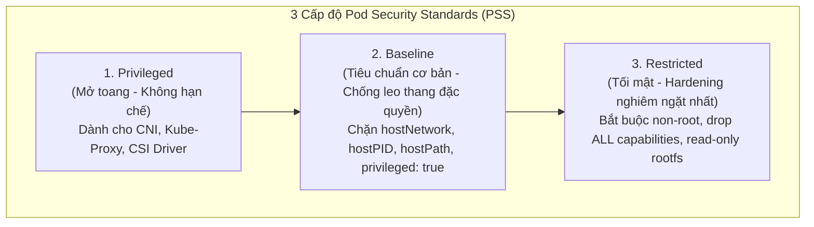
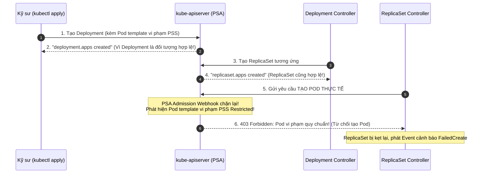

# Bài 32: Pod Security Standards (PSS) & Admission (PSA)

## 1. Thông tin bài học
* **Tên bài:** Bài 32: Pod Security Standards (PSS) & Admission (PSA)
* **Mục tiêu học:** Làm chủ khung kiến trúc an toàn Pod hiện đại của Kubernetes; hiểu sâu lý do PodSecurityPolicy (PSP) bị khai tử và sự thay thế chuẩn mực bởi Pod Security Standards (PSS) & Pod Security Admission (PSA); phân biệt rạch ròi 3 cấp độ bảo mật (`Privileged`, `Baseline`, `Restricted`) và 3 chế độ kiểm soát (`enforce`, `audit`, `warn`); nắm vững kỹ thuật kích hoạt PSA ở cấp Namespace bằng nhãn; nhận diện và xử lý lỗi khi Deployment tạo thành công nhưng ReplicaSet bị PSA chặn đứng; thực hành áp dụng chuẩn `Restricted` cho namespace của Google Online Boutique trên cụm kind.
* **Thời lượng ước tính:** 150 phút (75 phút lý thuyết, 75 phút thực hành)
* **Kiến thức cần có trước:** Bài 01 (Linux Namespaces & Cgroups), Bài 11 (Namespace), Bài 30 (RBAC), Bài 31 (ServiceAccount).
* **Liên quan kỳ thi:** CKS (Trọng tâm cấu phần Cluster Hardening & System Hardening: chiếm 15–20% điểm thi CKS, bài thi luôn yêu cầu thí sinh cấu hình nhãn PSS trên namespace, điều tra các Pod bị từ chối do vi phạm Baseline/Restricted, và sửa đổi manifest cho hợp chuẩn).

---

## 2. Bảng thuật ngữ

| Thuật ngữ | Giải thích đơn giản | Ví dụ / Ẩn dụ đời thường |
| :--- | :--- | :--- |
| **PodSecurityPolicy (PSP)** | Cơ chế bảo vệ Pod thế hệ cũ của Kubernetes, rất phức tạp, dễ gây lỗi và đã bị **khai tử hoàn toàn** từ Kubernetes v1.25. | Bộ luật giao thông cổ xưa với hàng trăm điều khoản chồng chéo, cảnh sát giao thông đọc cũng không hiểu hết. |
| **Pod Security Standards (PSS)** | Bộ tiêu chuẩn an toàn định nghĩa 3 cấp độ bảo mật cho Pod (`Privileged`, `Baseline`, `Restricted`) do Kubernetes chuẩn hóa. | Bảng phân loại mức độ rủi ro của hàng hóa vận chuyển: Hàng thông thường, Hàng dễ vỡ, Hàng nguy hiểm cấm bay. |
| **Pod Security Admission (PSA)** | Bộ điều khiển tiếp nhận (Admission Controller) tích hợp sẵn trong API Server, tự động kiểm tra và thực thi các tiêu chuẩn PSS thông qua nhãn của Namespace. | Nhân viên hải quan tại cửa khẩu kiểm tra hành lý của hành khách trước khi cho phép nhập cảnh. |
| **`Privileged` Profile** | Cấp độ bảo mật mở toang: Cho phép Pod có toàn quyền can thiệp vào máy chủ (tương đương quyền root trên Node vật lý). | Cửa kỹ thuật đặc biệt dành cho đội cứu hỏa và sửa chữa đường hầm, không bị kiểm tra đồ đạc. |
| **`Baseline` Profile** | Cấp độ bảo mật cơ bản: Ngăn ngừa các lỗ hổng leo thang đặc quyền phổ biến nhất, phù hợp với hầu hết các ứng dụng thông thường. | Cửa an ninh thông thường tại rạp chiếu phim: Cấm mang vũ khí, cấm mang đồ ăn có mùi nồng. |
| **`Restricted` Profile** | Cấp độ bảo mật tối đa: Khóa chặt mọi ngóc ngách, bắt buộc Pod phải chạy quyền non-root, cấm leo thang đặc quyền, gỡ bỏ toàn bộ Linux Capabilities. | Cửa kiểm soát an ninh tối mật tại ngân hàng trung ương: Tháo giày, soi vân tay, cởi bỏ toàn bộ vật dụng kim loại. |
| **`enforce` Mode** | Chế độ cưỡng chế: Từ chối thẳng thừng và báo lỗi ngay lập tức nếu Pod vi phạm tiêu chuẩn an toàn. | Nhân viên bảo vệ kiên quyết không cho khách vào cửa nếu không mặc áo sơ mi đúng quy định. |
| **`warn` Mode** | Chế độ cảnh báo: Vẫn cho phép tạo Pod, nhưng in một dòng cảnh báo màu vàng ra màn hình terminal của người gõ lệnh. | Biển nhắc nhở: "Trời sắp mưa, quý khách nên mang theo ô", nhưng khách không mang ô thì vẫn được đi. |
| **`audit` Mode** | Chế độ kiểm toán: Vẫn cho phép tạo Pod, nhưng âm thầm ghi lại vi phạm vào file Audit Log để đội bảo mật điều tra sau. | Camera an ninh ghi hình người đi sai làn đường để gửi giấy phạt nguội về nhà. |

---

## 3. Bức tranh lớn: Vấn đề thực tế và ẩn dụ đời thường

### Nhắc lại bài trước
Ở Bài 30 và Bài 31, chúng ta đã xây dựng hai bức tường thành vững chắc kiểm soát **Ai được gọi API Server**: Người thật thì dùng RBAC, ứng dụng thì dùng ServiceAccount với Bound Token. Nhưng giả sử một lập trình viên có quyền tạo Pod hợp pháp, anh ta lại viết một Pod manifest như sau:
```yaml
spec:
  hostNetwork: true
  hostPID: true
  containers:
  - name: evil
    image: alpine
    securityContext:
      privileged: true
```
Khi Pod này được tạo ra, nó sẽ lập tức "thoát cũi sổ lồng" (Container Breakout), đọc trộm toàn bộ lưu lượng mạng của máy chủ, nhìn thấy mọi tiến trình của các ứng dụng khác, và nắm quyền điều khiển toàn bộ Worker Node vật lý! RBAC hoàn toàn bất lực trước kịch bản này vì lập trình viên đó có quyền tạo Pod hợp lệ. Ta bắt buộc phải có một người gác cổng kiểm tra **nội dung bảo mật của Pod** trước khi cho phép nó ra đời: Đó là sứ mệnh của **Pod Security Standards (PSS)** và **Pod Security Admission (PSA)**.

### Tại sao cần cái này ở production? (Vấn đề thực tế)

1. **Cơn ác mộng thoát khỏi Container (Container Breakout):**
   Mặc định trong Kubernetes, nếu không có chính sách kiểm soát, một container hoàn toàn có thể chạy với quyền `root` (UID 0). Nếu ứng dụng bị dính lỗ hổng tràn bộ đệm hoặc lỗ hổng thực thi mã từ xa (RCE), hacker sẽ có quyền root ngay trong container. Từ đó, hắn dễ dàng tấn công hạt nhân Linux kernel để chiếm đoạt máy chủ vật lý.
2. **Khai tử PodSecurityPolicy (PSP) - Nhu cầu chuẩn hóa:**
   Trước bản K8s v1.25, Kubernetes từng sử dụng PSP. Nhưng PSP nổi tiếng là "cơn ác mộng" của giới SRE vì cấu hình cực kỳ rắc rối, kết hợp lằng nhằng với RBAC khiến việc phân quyền rất dễ bị lỗi bất ngờ, thậm chí khóa nhầm chính cả cụm quản trị. Cộng đồng Kubernetes đã quyết định khai tử PSP và thay thế bằng **PSA (Pod Security Admission)**: Cực kỳ đơn giản, không cần viết manifest dài dòng, chỉ cần dán một chiếc **Nhãn (Label)** lên Namespace là xong!
3. **Mô hình bảo vệ đa tầng cho doanh nghiệp:**
   * Các dịch vụ hạ tầng mạng (CNI Calico, Flannel, kube-proxy) nằm ở namespace `kube-system` cần quyền can thiệp card mạng $\rightarrow$ Cấp độ `Privileged`.
   * Các microservice thông thường chạy ở namespace `staging` $\rightarrow$ Cấp độ `Baseline`.
   * Các ứng dụng tài chính, cổng thanh toán chạy ở namespace `production` $\rightarrow$ Cấp độ `Restricted`.

### Ẩn dụ đời thường: Cổng kiểm soát an ninh tại Sân bay quốc tế

Hãy hình dung việc một Pod xin vào chạy trong Kubernetes giống như một hành khách chuẩn bị bước lên máy bay:
* **Cấp độ `Privileged` = Cửa dành cho Đội cơ động đặc biệt:** Nhân viên cứu hỏa, cảnh sát vũ trang được phép mang theo súng, bình oxy, rìu phá cửa lên máy bay để làm nhiệm vụ đặc biệt.
* **Cấp độ `Baseline` = Cửa kiểm tra an ninh tiêu chuẩn:** Tất cả hành khách bình thường đều phải đi qua đây. Bạn được mang theo túi xách, quần áo, nhưng **tuyệt đối cấm mang theo súng, lựu đạn, dao găm** (cấm `privileged: true`, cấm chia sẻ `hostNetwork`, `hostPID` với máy chủ).
* **Cấp độ `Restricted` = Chuyến bay chuyên cơ ngoại giao VIP:** Quy định siết chặt tối đa. Hành khách không chỉ bị cấm mang vũ khí, mà còn phải cởi bỏ thắt lưng da, bỏ giày, không được mặc đồ có túi giấu kín, và phải qua cổng quét sinh trắc học toàn thân (bắt buộc chạy tài khoản `non-root`, cấm toàn bộ Linux Capabilities, khóa bộ nhớ ở chế độ chỉ đọc).

---

## 4. Giải thích khái niệm theo từng bước

### 4.1. Ba cấp độ bảo mật của Pod Security Standards (PSS)

Kubernetes phân loại an ninh thành 3 cấp độ (Profiles) tăng dần từ lỏng lẻo đến cực kỳ nghiêm ngặt:



#### Chi tiết bảng so sánh 3 cấp độ:

| Tiêu chuẩn an ninh | `Privileged` | `Baseline` | `Restricted` |
| :--- | :---: | :---: | :---: |
| Chạy chế độ đặc quyền (`privileged: true`) | Cho phép | **CẤM** | **CẤM** |
| Dùng chung mạng với Host (`hostNetwork: true`) | Cho phép | **CẤM** | **CẤM** |
| Dùng chung tiến trình Host (`hostPID: true`) | Cho phép | **CẤM** | **CẤM** |
| Gắn thư mục trực tiếp máy chủ (`hostPath`) | Cho phép | **CẤM** | **CẤM** |
| Mở cổng trực tiếp trên Host (`hostPorts`) | Cho phép | **CẤM** | **CẤM** |
| Chạy dưới quyền Root (`runAsNonRoot`) | Cho phép | Cho phép | **BẮT BUỘC PHẢI NON-ROOT** |
| Leo thang quyền hạn (`allowPrivilegeEscalation`) | Cho phép | Cho phép | **BẮT BUỘC LÀ FALSE** |
| Giữ lại Linux Capabilities | Toàn bộ | Một số cơ bản | **BẮT BUỘC DROP ALL** |
| Loại Volume được phép dùng | Mọi loại | Hầu hết | Chỉ cho phép Secret, ConfigMap, PVC, EmptyDir |

---

### 4.2. Ba chế độ kiểm soát của Pod Security Admission (PSA Modes)

Để áp dụng các cấp độ PSS ở trên vào thực tế, PSA cung cấp **3 chế độ can thiệp**:

1. **`enforce` (Cưỡng chế):**
   * Nếu Pod vi phạm tiêu chuẩn $\rightarrow$ API Server **TỪ CHỐI THẲNG THỪNG** và ném ra lỗi. Pod không bao giờ được tạo ra.
2. **`audit` (Kiểm toán):**
   * Nếu Pod vi phạm $\rightarrow$ API Server **VẪN CHO PHÉP TẠO POD**, nhưng âm thầm gắn cờ ghi chú vào hệ thống Audit Log của cụm để đội An ninh mạng rà soát.
3. **`warn` (Cảnh báo người dùng):**
   * Nếu Pod vi phạm $\rightarrow$ API Server **VẪN CHO PHÉP TẠO POD**, nhưng ngay trên terminal của người gõ lệnh `kubectl apply` sẽ xuất hiện một dòng cảnh báo màu vàng chỉ rõ Pod đang vi phạm điều khoản nào.

---

### 4.3. Cú pháp kích hoạt PSA bằng nhãn trên Namespace

Bạn hoàn toàn không cần cài đặt thêm bất kỳ phần mềm nào! Kể từ Kubernetes v1.23+, tính năng PSA đã được kích hoạt mặc định trong API Server. Bạn chỉ cần gắn nhãn lên Namespace theo mẫu chuẩn:

```text
pod-security.kubernetes.io/<MODE>: <LEVEL>
pod-security.kubernetes.io/<MODE>-version: <VERSION>
```

#### Ví dụ thực tế trên Namespace `production`:
```yaml
apiVersion: v1
kind: Namespace
metadata:
  name: production
  labels:
    # 1. Cưỡng chế chặn đứng mọi Pod vi phạm chuẩn Restricted
    pod-security.kubernetes.io/enforce: restricted
    pod-security.kubernetes.io/enforce-version: latest

    # 2. Đồng thời in cảnh báo nếu có vi phạm
    pod-security.kubernetes.io/warn: restricted
    pod-security.kubernetes.io/warn-version: latest

    # 3. Ghi vết vào Audit Log
    pod-security.kubernetes.io/audit: restricted
    pod-security.kubernetes.io/audit-version: latest
```

---

### 4.4. Hiện tượng bẫy ngầm: Deployment thành công nhưng Pod biến mất!

Đây là tình huống "hại não" bậc nhất đối với các kỹ sư mới làm quen với PSA:
* Bạn gõ lệnh: `kubectl apply -f deployment.yaml`
* Màn hình báo: `deployment.apps/my-app created` (Thành công mỹ mãn!).
* Nhưng khi bạn gõ: `kubectl get pods`, danh sách lại **HOÀN TOÀN TRỐNG RỖNG**!



> [!CRITICAL]
> **Bản chất vấn đề:**  
> PSA **chỉ kiểm tra đối tượng Pod**, nó không trực tiếp kiểm tra đối tượng Deployment hay ReplicaSet! Khi bạn tạo Deployment, Deployment và ReplicaSet được tạo thành công. Nhưng khi ReplicaSet cố gắng sinh ra Pod con, PSA lập tức chặn đứng ReplicaSet lại!  
> Để tìm ra nguyên nhân, bạn **không thể describe Pod** (vì Pod chưa bao giờ tồn tại). Bạn bắt buộc phải gõ:  
> `kubectl describe replicaset <tên-replicaset>`!

---

## 5. Thực hành (Lab)

* **Môi trường:** Cluster kind 2 node (`lab-control-plane`, `lab-worker`).
* **Mức RAM ước tính:** ~150 MB.
* **Mục tiêu thực hành:**
  1. Tạo namespace `boutique-secure` và gắn nhãn PSA ở cấp độ cao nhất: `enforce: restricted`.
  2. Cố tình triển khai một Pod "nguy hiểm" vi phạm quy chuẩn (chạy `privileged: true`) để chứng kiến PSA chặn đứng ngay tại cổng vào.
  3. Triển khai một Pod thông thường nhưng thiếu cấu hình an toàn non-root và giải mã thông điệp lỗi của PSA.
  4. Soạn thảo một Pod chuẩn chỉ thỏa mãn 100% tiêu chuẩn `Restricted` và triển khai thành công.
  5. Thử nghiệm chế độ `warn` trên namespace `boutique-warning`.
  6. Dọn dẹp tài nguyên.

---

### Bước 1: Tạo Namespace và bật PSA cấp độ Restricted

Tạo namespace `boutique-secure` được bảo vệ nghiêm ngặt:

```powershell
@'
apiVersion: v1
kind: Namespace
metadata:
  name: boutique-secure
  labels:
    pod-security.kubernetes.io/enforce: restricted
    pod-security.kubernetes.io/enforce-version: latest
    pod-security.kubernetes.io/warn: restricted
    pod-security.kubernetes.io/warn-version: latest
'@ | Set-Content -Encoding utf8 secure-ns.yaml

kubectl apply -f secure-ns.yaml
```

Kiểm tra nhãn đã được gắn thành công:
```powershell
kubectl get ns boutique-secure --show-labels
```

---

### Bước 2: Cố tình tạo Pod nguy hiểm và quan sát PSA từ chối

Chúng ta viết một manifest `bad-pod.yaml` cố tình đòi quyền `privileged: true` (chế độ đặc quyền xâm nhập máy chủ):

```powershell
@'
apiVersion: v1
kind: Pod
metadata:
  name: malicious-pod
  namespace: boutique-secure
spec:
  containers:
  - name: attacker
    image: busybox:1.36
    command: ["sleep", "3600"]
    securityContext:
      privileged: true # Vi phạm nghiêm trọng tiêu chuẩn an toàn!
'@ | Set-Content -Encoding utf8 bad-pod.yaml

kubectl apply -f bad-pod.yaml
```

**Kết quả mong đợi:**
Lệnh apply **THẤT BẠI NGAY LẬP TỨC** với thông báo lỗi đỏ từ API Server:
```text
Error from server (Forbidden): error when creating "bad-pod.yaml": pods "malicious-pod" is forbidden: violates PodSecurity "restricted:latest": privileged (container "attacker" must not set securityContext.privileged=true)
```
*PSA đã hoạt động như một nhân viên hải quan mẫu mực: Phát hiện vi phạm `privileged=true` và từ chối ghi vào etcd!*

---

### Bước 3: Thử nghiệm Pod thông thường nhưng thiếu SecurityContext

Nhiều người nghĩ: *"Tôi không bật privileged, tôi chỉ chạy nginx bình thường thì chắc là được?"*. Hãy kiểm chứng với `nginx-default.yaml`:

```powershell
@'
apiVersion: v1
kind: Pod
metadata:
  name: plain-nginx
  namespace: boutique-secure
spec:
  containers:
  - name: web
    image: nginx:alpine
'@ | Set-Content -Encoding utf8 nginx-default.yaml

kubectl apply -f nginx-default.yaml
```

**Kết quả mong đợi:**
Lệnh tiếp tục **BỊ TỪ CHỐI** với danh sách các lỗi bảo mật chi tiết:
```text
Error from server (Forbidden): error when creating "nginx-default.yaml": pods "plain-nginx" is forbidden: violates PodSecurity "restricted:latest": 
allowPrivilegeEscalation != false (container "web" must set securityContext.allowPrivilegeEscalation=false), 
unrestricted capabilities (container "web" must set securityContext.capabilities.drop=["ALL"]), 
runAsNonRoot != true (pod or container "web" must set securityContext.runAsNonRoot=true)
```
> [!NOTE]
> Thông điệp chỉ ra rõ ràng 3 tiêu chí mà tiêu chuẩn **Restricted** đòi hỏi:
> 1. Phải khai báo `allowPrivilegeEscalation: false`.
> 2. Phải gỡ bỏ toàn bộ capabilities bằng `capabilities.drop: ["ALL"]`.
> 3. Phải cấm chạy quyền root bằng `runAsNonRoot: true`.

---

### Bước 4: Soạn thảo Pod hoàn toàn tuân thủ chuẩn PSS Restricted

Bây giờ, chúng ta sẽ soạn thảo một Pod mẫu mực đáp ứng đầy đủ tất cả các yêu cầu khắt khe của chuẩn `Restricted`:

```powershell
@'
apiVersion: v1
kind: Pod
metadata:
  name: compliant-boutique-pod
  namespace: boutique-secure
spec:
  # Cấu hình bảo mật cấp Pod
  securityContext:
    runAsNonRoot: true      # Bắt buộc: Không được chạy root
    runAsUser: 10001        # Bắt buộc: Chỉ định rõ UID non-root
    runAsGroup: 10001
    seccompProfile:
      type: RuntimeDefault  # Bắt buộc: Sử dụng bộ lọc seccomp mặc định của hệ điều hành
  containers:
  - name: microservice
    image: busybox:1.36
    command: ["sleep", "3600"]
    # Cấu hình bảo mật cấp Container
    securityContext:
      allowPrivilegeEscalation: false # Bắt buộc: Cấm leo thang đặc quyền
      capabilities:
        drop:
        - ALL                         # Bắt buộc: Vứt bỏ toàn bộ quyền Linux kernel thừa thãi
      readOnlyRootFilesystem: true    # Khuyến nghị cao: Khóa cứng hệ thống file chỉ đọc
'@ | Set-Content -Encoding utf8 compliant-pod.yaml

kubectl apply -f compliant-pod.yaml
```

Kiểm tra trạng thái của Pod mẫu mực:
```powershell
kubectl get pod compliant-boutique-pod -n boutique-secure
```
**Kết quả mong đợi:**
```text
NAME                     READY   STATUS    RESTARTS   AGE
compliant-boutique-pod   1/1     Running   0          12s
```
*Pod đã vượt qua bài kiểm tra an ninh cấp cao nhất và khởi chạy an toàn tuyệt đối!*

---

### Bước 5: Thử nghiệm chế độ Cảnh báo (`warn` Mode)

Bây giờ chúng ta tạo một namespace khác có tên `boutique-warning`, nhưng chỉ bật chế độ `warn` (không bật `enforce`):

```powershell
@'
apiVersion: v1
kind: Namespace
metadata:
  name: boutique-warning
  labels:
    pod-security.kubernetes.io/warn: restricted
    pod-security.kubernetes.io/warn-version: latest
'@ | Set-Content -Encoding utf8 warning-ns.yaml

kubectl apply -f warning-ns.yaml
```

Thử deploy lại file `nginx-default.yaml` vào namespace `boutique-warning`:

```powershell
kubectl apply -f nginx-default.yaml -n boutique-warning
```

**Kết quả mong đợi:**
```text
Warning: would violate PodSecurity "restricted:latest": allowPrivilegeEscalation != false, unrestricted capabilities, runAsNonRoot != true
pod/plain-nginx created
```
> [!TIP]
> Bạn thấy rõ sự khác biệt: Dòng chữ **Warning** màu vàng xuất hiện cảnh báo lập trình viên rằng cấu hình này chưa an toàn, nhưng Pod **VẪN ĐƯỢC TẠO THÀNH CÔNG** (`pod/plain-nginx created`)! Đây là chế độ lý tưởng để áp dụng vào các namespace đang chạy để nhắc nhở các đội phát triển sửa dần mà không làm sập ứng dụng đang hoạt động.

---

### Bước 6: Dọn dẹp tài nguyên (Cleanup)

Xóa bỏ toàn bộ các namespace thí nghiệm:

```powershell
kubectl delete namespace boutique-secure boutique-warning
Remove-Item secure-ns.yaml, bad-pod.yaml, nginx-default.yaml, compliant-pod.yaml, warning-ns.yaml -ErrorAction SilentlyContinue
```

---

## 6. Lỗi thường gặp và cách debug

### Lỗi 1: Deployment tạo thành công nhưng ReplicaSet không sinh ra được Pod
* **Dấu hiệu:** Chạy `kubectl apply -f deployment.yaml` báo thành công, nhưng `kubectl get pods` không thấy có Pod nào.
* **Nguyên nhân:** Namespace đang bật `enforce: restricted`, trong khi Pod template trong Deployment không thỏa mãn các điều kiện bảo mật.
* **Cách debug và sửa:**
  1. Kiểm tra trạng thái của ReplicaSet:
     `kubectl get rs -n <namespace>` (sẽ thấy cột `DESIRED: 1`, nhưng `READY: 0`).
  2. Đọc sự kiện lỗi chi tiết bị PSA chặn:
     `kubectl describe rs <replicaset-name> -n <namespace>`
     Mục Events sẽ ghi rõ: `FailedCreate ... violates PodSecurity "restricted:latest"`.
  3. Bổ sung khối `securityContext` hợp chuẩn vào phần `spec.template.spec` của Deployment.

---

### Lỗi 2: Bật nhãn PSA `enforce: restricted` nhầm vào namespace `kube-system`
* **Dấu hiệu:** Toàn bộ các dịch vụ hệ thống như CoreDNS, CNI (Kindnet/Calico) bị chết hoặc không thể khởi động lại khi node reboot.
* **Nguyên nhân:** Các tiến trình hệ thống cấp thấp bắt buộc cần quyền `hostNetwork`, `hostPath` và một số capabilities đặc quyền. Việc ép chuẩn `Restricted` lên `kube-system` sẽ làm tê liệt toàn bộ cụm Kubernetes!
* **Cách debug và sửa:**
  * Namespace `kube-system` BẮT BUỘC phải để ở cấp độ **`Privileged`**:
    `kubectl label ns kube-system pod-security.kubernetes.io/enforce=privileged --overwrite`

---

### Lỗi 3: Không khai báo nhãn phiên bản (`-version`) dẫn đến hành vi không nhất quán
* **Dấu hiệu:** Khi nâng cấp cụm Kubernetes lên phiên bản mới hơn, các Pod cũ đang chạy bình thường bỗng nhiên bị từ chối khi restart.
* **Nguyên nhân:** Bạn chỉ đặt nhãn `pod-security.kubernetes.io/enforce: restricted` mà bỏ quên nhãn phiên bản. Mặc định Kubernetes sẽ dùng phiên bản mới nhất (`latest`). Nếu bản K8s mới bổ sung thêm quy tắc siết chặt hơn, Pod cũ sẽ bị đánh rớt.
* **Cách debug và sửa:**
  * Luôn ghim cố định phiên bản cụm hiện tại, ví dụ:
    `pod-security.kubernetes.io/enforce-version: v1.30`

---

## 7. Góc nhìn Senior

### 1. Sự đánh đổi (Trade-offs): An toàn tối đa vs Tốc độ phát triển

| Tiêu chí | Cấp độ `Restricted` | Cấp độ `Baseline` |
| :--- | :--- | :--- |
| **Mức độ an ninh** | Cực cao: Triệt tiêu 95% nguy cơ thoát container và leo thang đặc quyền. | Vừa phải: Chặn các lỗ hổng thô thiển, vẫn cho phép chạy root bên trong container. |
| **Độ phức tạp viết manifest** | Khá cao: Developer bắt buộc phải hiểu về UID, GID, Capabilities, Seccomp, ReadOnlyRootfs. | Thấp: Đa số các container image công cộng (Docker Hub) đều chạy được ngay. |
| **Tương thích Container Image** | Kén chọn: Nhiều image cũ viết cẩu thả (đòi ghi file vào thư mục `/`, chạy user root) sẽ bị crash ngay. | Rất cao: Chạy tốt với hầu hết các image mã nguồn mở. |
| **Môi trường khuyến nghị** | **Bắt buộc cho Production** chứa dữ liệu khách hàng. | Phù hợp cho môi trường Dev, Sandbox thử nghiệm. |

---

### 2. Best practices tại production

1. **Chiến lược áp dụng PSA theo lộ trình 3 giai đoạn (Rollout Strategy):**
   * Tuyệt đối không bao giờ bật ngay lập tức `enforce: restricted` trên một cụm đang chạy nhiều dịch vụ thực tế!
   * **Giai đoạn 1 (Tuần 1–2):** Chỉ bật `warn: restricted` và `audit: restricted`. Theo dõi các thông báo cảnh báo và kiểm tra Audit Log để lập danh sách toàn bộ các microservice đang vi phạm.
   * **Giai đoạn 2 (Tuần 3):** Phối hợp với đội ngũ lập trình viên cập nhật Dockerfile (tạo user non-root) và bổ sung `securityContext` vào Helm charts/GitOps.
   * **Giai đoạn 3 (Tuần 4):** Sau khi 100% dịch vụ đã tuân thủ, chính thức kích hoạt `enforce: restricted` để khóa chốt an toàn vĩnh viễn.
2. **Luôn cấu hình `readOnlyRootFilesystem: true`:**
   * Đây là vũ khí tối thượng ngăn chặn mã độc. Khi hacker khai báo mã độc tải về container qua lệnh `curl malicious.sh -o /tmp/evil`, lệnh sẽ lập tức báo lỗi `Read-only file system`!
   * Nếu ứng dụng cần ghi file tạm, hãy cấp phát một volume loại `emptyDir` gắn riêng vào thư mục `/tmp`.
3. **Khi nào PSA là chưa đủ? (Cần đến Kyverno / OPA Gatekeeper):**
   * PSA là giải pháp "mì ăn liền" tuyệt vời được tích hợp sẵn, nhưng nó có các hạn chế:
     * Chỉ có 3 cấp độ cứng, không tùy biến linh hoạt từng quy tắc nhỏ được.
     * Không thể kiểm tra các trường ngoài Pod (như bắt buộc Ingress phải có TLS, bắt buộc Service không được mở NodePort).
     * Không có tính năng tự động sửa lỗi (Mutation).
   * Khi tổ chức của bạn đạt quy mô Enterprise cần các chính sách tùy biến phức tạp, hãy kết hợp PSA với **Kyverno** hoặc **OPA Gatekeeper**.

---

### 3. Câu hỏi phỏng vấn Senior

* **Câu hỏi 1:** *Khi kích hoạt PSA `enforce: restricted` trên một namespace, tại sao lệnh `kubectl apply -f deployment.yaml` vẫn thông báo thành công nhưng thực tế ứng dụng lại không chạy? Là một Senior SRE, bạn sẽ dùng lệnh gì để phát hiện nguyên nhân gốc rễ trong 10 giây?*
* **Gợi ý trả lời chuẩn:**
  * **Giải thích bản chất:** API Server tiếp nhận Deployment thông qua Deployment Controller. Deployment Controller chỉ tạo ra ReplicaSet. Đến lượt ReplicaSet Controller cố gắng tạo Pod con thì **Pod Security Admission Controller** mới chặn Pod lại. Do đó lệnh tạo Deployment vẫn trả về `200 OK` (vì đối tượng Deployment không vi phạm gì), nhưng Pod thì không thể ra đời.
  * **Lệnh chẩn đoán trong 10 giây:**
    1. Kiểm tra ReplicaSet: `kubectl get rs -n <namespace>` (thấy `DESIRED = 1` nhưng `CURRENT = 0`).
    2. Đọc sự kiện chặn của PSA: `kubectl describe rs <tên-rs> -n <namespace>`  
       Dòng Event cuối cùng sẽ hiển thị chi tiết: `FailedCreate ... violates PodSecurity "restricted:latest"` kèm danh sách chính xác các trường `securityContext` mà Pod đang thiếu sót.

* **Câu hỏi 2:** *Tại sao Kubernetes lại quyết định khai tử hoàn toàn PodSecurityPolicy (PSP) ở bản v1.25 để thay bằng Pod Security Admission (PSA)? Điểm khác biệt cốt lõi về mặt vận hành giữa hai cơ chế này là gì?*
* **Gợi ý trả lời chuẩn:**
  * **Lý do PSP bị khai tử:**
    * **Quá phức tạp và khó đoán:** PSP phụ thuộc chặt chẽ vào RBAC (phải tạo PSP, gán vào Role, bind vào ServiceAccount của Pod). Thứ tự ưu tiên giữa nhiều PSP rất khó dự đoán, dẫn đến việc Pod vô tình chọn nhầm chính sách lỏng lẻo hơn.
    * **Rủi ro sập cụm cao:** Một lỗi nhỏ trong việc bind PSP có thể khiến toàn bộ các Pod hệ thống không thể khởi động lại.
    * **Tính năng Mutation ngầm:** PSP tự ý sửa đổi Pod spec mà người dùng không hay biết, gây khó khăn cho việc debug.
  * **Điểm khác biệt cốt lõi của PSA:**
    * **Đơn giản hóa tuyệt đối:** Quản trị hoàn toàn bằng **Nhãn trên Namespace**, không cần định nghĩa tài nguyên CRD hay cấu hình RBAC phức tạp.
    * **Phân tầng rõ ràng:** Chuẩn hóa sẵn 3 cấp độ bảo vệ (`Privileged`, `Baseline`, `Restricted`) được cộng đồng an ninh quốc tế công nhận.
    * **An toàn khi triển khai:** Hỗ trợ 2 chế độ `warn` và `audit` giúp doanh nghiệp đánh giá rủi ro trước khi thực sự bấm nút cưỡng chế (`enforce`).

---

## 8. Tóm tắt bài học
* 📌 **1. Khung kiến trúc PSS & PSA:** PSS định nghĩa các tiêu chuẩn an toàn; PSA là bộ điều khiển tích hợp trong API Server thực thi các tiêu chuẩn đó thông qua nhãn của Namespace.
* 📌 **2. Ba cấp độ PSS:** `Privileged` (mở toang cho hệ thống), `Baseline` (chuẩn cơ bản cho app thường), `Restricted` (chuẩn siết chặt tối đa cho production).
* 📌 **3. Ba chế độ PSA:** `enforce` (chặn đứng vi phạm), `warn` (in cảnh báo ra terminal), `audit` (ghi vết vào nhật ký kiểm toán).
* 📌 **4. Quy tắc chuẩn Restricted:** Bắt buộc phải có `runAsNonRoot: true`, `allowPrivilegeEscalation: false`, và `capabilities.drop: ["ALL"]`.
* 📌 **5. Kỹ thuật Debug ReplicaSet:** Khi Deployment không sinh ra Pod trong namespace có bật PSA, luôn dùng `kubectl describe rs` để đọc nguyên nhân từ chối.

---

## 9. Bài tập tự làm

* 🟢 **Mức Dễ:** Tạo một namespace có tên `app-baseline`. Gán nhãn kích hoạt PSA ở cấp độ `Baseline` với chế độ `enforce`. Kiểm tra xem một Pod nginx thông thường có chạy được trong namespace này hay không.
* 🟡 **Mức Vừa:** Trong namespace `app-baseline`, hãy cố tình tạo một Pod yêu cầu chia sẻ tiến trình với máy chủ (`hostPID: true`). Quan sát lỗi trả về từ API Server và giải thích vì sao cấp độ Baseline lại cấm thuộc tính này.
* 🔴 **Mức Khó:** Viết một file manifest Deployment hoàn chỉnh cho microservice `cartservice` (Online Boutique) gồm 2 replica sao cho Deployment này khởi chạy thành công 100% trong một namespace đang bật `enforce: restricted` (đảm bảo đầy đủ securityContext cho cả Pod lẫn container, volume an toàn, non-root UID 10001).

---

## 10. Câu hỏi tự kiểm tra

1. PodSecurityPolicy (PSP) đã bị loại bỏ hoàn toàn khỏi Kubernetes từ phiên bản nào? Cơ chế nào thay thế PSP?
2. Sự khác nhau cơ bản giữa cấp độ `Baseline` và `Restricted` là gì?
3. Nếu một namespace được gắn nhãn `pod-security.kubernetes.io/enforce: baseline`, một Pod có `privileged: true` có được phép tạo ra không?
4. Chế độ `warn` khác gì so với chế độ `enforce` trong Pod Security Admission?
5. Tại sao ta không nên áp dụng nhãn `enforce: restricted` lên namespace `kube-system`?

<details>
<summary>👉 Bấm vào đây để xem đáp án câu hỏi tự kiểm tra</summary>

* **Câu 1:** PSP đã bị gỡ bỏ chính thức từ **Kubernetes v1.25**. Cơ chế thay thế chính thức là **Pod Security Standards (PSS)** kết hợp với **Pod Security Admission (PSA)**.
* **Câu 2:** `Baseline` chỉ ngăn chặn các lỗ hổng leo thang đặc quyền thô thiển (như hostNetwork, hostPID, privileged container) nhưng vẫn cho phép container chạy quyền root bên trong; trong khi `Restricted` bắt buộc container phải chạy với tài khoản **non-root**, phải drop toàn bộ Linux capabilities và khóa chặt leo thang quyền hạn.
* **Câu 3:** **KHÔNG ĐƯỢC PHÉP!** Cấp độ Baseline cấm hoàn toàn thuộc tính `securityContext.privileged: true`. Yêu cầu sẽ bị API Server từ chối ngay lập tức.
* **Câu 4:** Chế độ `enforce` sẽ từ chối thẳng thừng yêu cầu tạo Pod nếu có vi phạm; trong khi chế độ `warn` vẫn cho phép Pod được tạo thành công nhưng sẽ in ra thông báo cảnh báo màu vàng cho người dùng.
* **Câu 5:** Vì các thành phần hệ thống trong `kube-system` (như CNI DaemonSet, Kube-Proxy) bắt buộc phải có các quyền can thiệp phần cứng mạng cấp cao (`hostNetwork`, `privileged`). Nếu áp dụng `Restricted`, các Pod hạ tầng này sẽ bị chặn và làm sập toàn bộ kết nối mạng của cụm.
</details>

---

## 11. Tài liệu đọc thêm và bài tiếp theo

### Tài liệu tham khảo
* [Kubernetes Documentation: Pod Security Standards](https://kubernetes.io/docs/concepts/security/pod-security-standards/)
* [Kubernetes Documentation: Pod Security Admission](https://kubernetes.io/docs/concepts/security/pod-security-admission/)
* [Kubernetes Documentation: Enforce Pod Security Standards with Namespace Labels](https://kubernetes.io/docs/tasks/configure-pod-container/enforce-security-pod-security-standards/)

### Bài tiếp theo
👉 **Bài 33: SecurityContext: Siết chặt an toàn tiến trình cấp Linux Kernel**

---

## PHỤ LỤC: ĐÁP ÁN GỢI Ý BÀI TẬP TỰ LÀM (MỤC 9)

### Đáp án Mức Dễ
```powershell
# 1. Tạo namespace và gắn nhãn Baseline
kubectl create namespace app-baseline
kubectl label namespace app-baseline pod-security.kubernetes.io/enforce=baseline

# 2. Chạy thử nginx
kubectl run test-nginx --image=nginx:alpine -n app-baseline

# 3. Kiểm tra: Pod chạy thành công vì nginx alpine đáp ứng được chuẩn Baseline!
kubectl get pod test-nginx -n app-baseline

# Dọn dẹp
kubectl delete namespace app-baseline
```

---

### Đáp án Mức Vừa
Tạo Pod vi phạm hostPID:
```powershell
kubectl create namespace app-baseline
kubectl label namespace app-baseline pod-security.kubernetes.io/enforce=baseline

@'
apiVersion: v1
kind: Pod
metadata:
  name: hostpid-violator
  namespace: app-baseline
spec:
  hostPID: true # Vi phạm tiêu chuẩn Baseline!
  containers:
  - name: app
    image: busybox:1.36
    command: ["sleep", "3600"]
'@ | Set-Content -Encoding utf8 hostpid.yaml

kubectl apply -f hostpid.yaml
# Kết quả: Bị từ chối với lỗi violates PodSecurity "baseline:latest": hostPID
# Giải thích: hostPID cho phép container nhìn thấy toàn bộ tiến trình của hệ điều hành Node (bao gồm cả tiến trình của kubelet), gây nguy cơ rò rỉ dữ liệu nghiêm trọng nên Baseline cấm triệt để!

# Dọn dẹp
kubectl delete namespace app-baseline
Remove-Item hostpid.yaml -ErrorAction SilentlyContinue
```

---

### Đáp án Mức Khó
File manifest Deployment chuẩn Restricted hoàn hảo cho `cartservice`:
```yaml
apiVersion: apps/v1
kind: Deployment
metadata:
  name: cartservice-restricted
  labels:
    app: cartservice-restricted
spec:
  replicas: 2
  selector:
    matchLabels:
      app: cartservice-restricted
  template:
    metadata:
      labels:
        app: cartservice-restricted
    spec:
      # 1. Cấu hình bảo mật cấp Pod
      securityContext:
        runAsNonRoot: true
        runAsUser: 10001
        runAsGroup: 10001
        seccompProfile:
          type: RuntimeDefault
      containers:
      - name: server
        image: gcr.io/google-samples/microservices-demo/cartservice:v0.10.1
        ports:
        - containerPort: 7070
        env:
        - name: REDIS_ADDR
          value: "127.0.0.1:6379"
        # 2. Cấu hình bảo mật cấp Container
        securityContext:
          allowPrivilegeEscalation: false
          capabilities:
            drop:
            - ALL
          readOnlyRootFilesystem: true
        resources:
          requests:
            cpu: 50m
            memory: 64Mi
          limits:
            cpu: 100m
            memory: 128Mi
```

