# Bài 34: Quản lý Secret chuẩn Enterprise với External Secrets Operator

## 1. Thông tin bài học
* **Tên bài:** Bài 34: Quản lý Secret chuẩn Enterprise với External Secrets Operator
* **Mục tiêu học:** Nắm vững phương pháp luận quản trị thông tin nhạy cảm (Secrets Management) chuẩn doanh nghiệp theo mô hình GitOps; giải mã lỗ hổng chí mạng của Kubernetes Secret nguyên bản (Base64) khi triển khai tự động hóa; hiểu sâu kiến trúc và cơ chế hoạt động của External Secrets Operator (ESO); phân biệt rạch ròi vai trò của `SecretStore`, `ClusterSecretStore` và `ExternalSecret`; làm chủ chu kỳ tự động đồng bộ và xoay vòng mật khẩu (Secret Rotation); thực hành cài đặt ESO (phiên bản tối ưu nhẹ cho máy 8GB RAM), đồng bộ bí mật từ kho giả lập về cụm kind và giải quyết bài toán tự động nạp lại mật khẩu cho ứng dụng.
* **Thời lượng ước tính:** 150 phút (75 phút lý thuyết, 75 phút thực hành)
* **Kiến thức cần có trước:** Bài 13 (Secret: Quản lý thông tin nhạy cảm), Bài 30 (RBAC), Bài 31 (ServiceAccount).
* **Liên quan kỳ thi:** CKS (Trọng tâm cấu phần Cluster Security & Secret Management: trong môi trường sản xuất hiện đại và bài thi CKS, việc tuyệt đối không lưu Secret dạng plaintext trong Git là tiêu chuẩn bắt buộc; các câu hỏi kiến trúc bảo mật luôn kiểm tra hiểu biết về giải pháp tích hợp kho bí mật bên ngoài).

---

## 2. Bảng thuật ngữ

| Thuật ngữ | Giải thích đơn giản | Ví dụ / Ẩn dụ đời thường |
| :--- | :--- | :--- |
| **External Secrets Operator (ESO)** | Một Kubernetes Operator chuyên kết nối với các kho bí mật bên ngoài để tự động kéo thông tin về và tạo ra Kubernetes Secret nội bộ. | Người chuyển phát an ninh chuyên nghiệp: Định kỳ đến ngân hàng lấy chìa khóa mới về bỏ vào ngăn kéo văn phòng cho bạn. |
| **External Secret Provider** | Hệ thống lưu trữ bí mật tập trung bên ngoài cụm K8s (như AWS Secrets Manager, Azure Key Vault, Google Secret Manager, HashiCorp Vault). | Két sắt trung tâm của ngân hàng: Nơi cất giữ tài sản an toàn nhất, có hệ thống camera và bảo vệ túc trực 24/7. |
| **`SecretStore`** | Đối tượng định nghĩa cách thức kết nối và xác thực tới kho bí mật bên ngoài **trong phạm vi một Namespace**. | Giấy ủy quyền rút tiền chỉ có giá trị sử dụng cho chi nhánh ngân hàng tại Quận 1. |
| **`ClusterSecretStore`** | Đối tượng định nghĩa kết nối tới kho bí mật bên ngoài **áp dụng cho toàn bộ cụm (Cluster-wide)**. | Giấy ủy quyền VIP của Tổng công ty có giá trị sử dụng trên mọi chi nhánh ngân hàng toàn quốc. |
| **`ExternalSecret`** | Đối tượng khai báo: Cần lấy khóa bí mật nào từ kho ngoài, và đặt tên cho Kubernetes Secret nội bộ được tạo ra là gì. | Tờ phiếu đặt hàng ghi rõ: "Hãy lấy cho tôi 1 thỏi vàng trong két số 102 và mang về để vào bàn làm việc". |
| **Secret Rotation** | Quá trình định kỳ thay đổi giá trị mật khẩu/token nhằm giảm thiểu rủi ro nếu mật khẩu cũ bị rò rỉ. | Quy định đổi mật khẩu thẻ ATM định kỳ 3 tháng một lần để phòng ngừa lộ mã PIN. |
| **GitOps Secret Leak** | Tai nạn bảo mật khi lập trình viên vô tình commit file YAML chứa Secret (dù đã mã hóa Base64) lên kho mã nguồn Git. | Để quên cuốn sổ tay ghi mật khẩu tài khoản ngân hàng trên bàn quán cafe công cộng. |

---

## 3. Bức tranh lớn: Vấn đề thực tế và ẩn dụ đời thường

### Nhắc lại bài trước
Ở Bài 33, chúng ta đã siết chặt an ninh tiến trình bằng `securityContext` để biến container thành một "pháo đài bất khả xâm phạm" trước các cuộc tấn công Kernel. Nhưng dù pháo đài có kiên cố đến đâu, nếu ứng dụng của bạn để lộ mật khẩu cơ sở dữ liệu (Database Password) hay khóa API Stripe ra bên ngoài, kẻ tấn công vẫn dễ dàng đánh cắp toàn bộ dữ liệu mà không cần xâm nhập container!

### Tại sao cần cái này ở production? (Vấn đề thực tế)

Hãy nhớ lại kiến thức ở Bài 13: **Kubernetes Secret mặc định KHÔNG HỀ ĐƯỢC MÃ HÓA!** Chuỗi dữ liệu chỉ được mã hóa dạng **Base64** – bất kỳ ai có một trình duyệt web đều có thể dịch ngược lại chuỗi ký tự gốc trong đúng 1 giây!
1. **Nghịch lý của kỷ nguyên GitOps (ArgoCD / Flux):**
   Trong quy trình vận hành hiện đại, mọi cấu hình hạ tầng đều phải được lưu trữ trong Git (Infrastructure as Code). Nhưng nếu bạn đẩy file `secret.yaml` lên GitHub/GitLab:
   * Các bot tự động quét mã nguồn trên Internet sẽ dò ra token trong vòng 3 giây!
   * Cho dù là Git riêng tư (Private Repo), hàng chục lập trình viên đều có thể đọc trộm mật khẩu Production, vi phạm tiêu chuẩn bảo mật PCI-DSS và ISO 27001.
2. **Cơn ác mộng quản trị đa cụm (Multi-Cluster Secret Sprawl):**
   Doanh nghiệp của bạn có 5 cụm Kubernetes (Dev, Staging, Prod-US, Prod-EU, Prod-ASIA). Khi cơ sở dữ liệu thay đổi mật khẩu định kỳ:
   * Bạn phải mở 5 cửa sổ terminal, kết nối vào 5 cụm khác nhau và gõ lệnh cập nhật bằng tay!
   * Chỉ cần gõ nhầm 1 ký tự ở cụm EU, toàn bộ dịch vụ tại châu Âu sẽ bị tê liệt.
3. **Giải pháp chuẩn Enterprise:**
   Tất cả mật khẩu phải được cất giữ tại một "nguồn chân lý duy nhất" (Single Source of Truth) trên đám mây (AWS Secrets Manager, Azure Key Vault, HashiCorp Vault). Các cụm Kubernetes chỉ đóng vai trò là "người tiêu thụ". Một công cụ tự động phải đứng ra đồng bộ hai đầu: Đó chính là **External Secrets Operator (ESO)**!

### Ẩn dụ đời thường: Ngăn kéo bàn làm việc và Két sắt Ngân hàng trung ương

Hãy hình dung cách lưu trữ thông tin nhạy cảm:
* **Kubernetes Secret nguyên bản = Ngăn kéo bàn làm việc:**
  * Ứng dụng của bạn (nhân viên) rất thích ngăn kéo này vì chỉ cần kéo ra là lấy được tiền/chìa khóa để dùng ngay lập tức (tiện lợi, nhanh gọn).
  * Nhưng ngăn kéo bàn làm việc không có khóa kiên cố. Bất kỳ ai đi ngang qua bàn (người có quyền đọc etcd hoặc đọc namespace) đều có thể thò tay vào lấy!
* **Kho bí mật bên ngoài (AWS SM / Vault) = Két sắt Ngân hàng trung ương:**
  * Được bảo vệ bằng tường bê tông, cửa thép dày 30cm, mã hóa nhiều lớp, có camera theo dõi từng giây (Audit Logs). Không ai có thể phá được.
  * Nhưng ứng dụng của bạn không thể mỗi giây chạy ra ngân hàng một lần để xin mật khẩu vì đường đi quá xa (độ trễ mạng cao, tốn chi phí gọi API).
* **External Secrets Operator (ESO) = Dịch vụ vệ sĩ chuyển tiền định kỳ:**
  * Cứ mỗi 1 giờ, một chiếc xe bọc thép (ESO Controller) chạy ra ngân hàng lấy mật khẩu mới nhất.
  * Xe mang về văn phòng và cất ngay ngắn vào ngăn kéo bàn làm việc.
  * Ứng dụng chỉ việc mở ngăn kéo bàn ra dùng như bình thường mà không cần quan tâm chiếc xe bọc thép hoạt động ra sao!

---

## 4. Giải thích khái niệm theo từng bước

### 4.1. Khảo sát 3 trường phái quản lý Secret trong GitOps

Cộng đồng Kubernetes thế giới đã trải qua 3 thế hệ giải pháp để giải bài toán GitOps:

```mermaid
flowchart TD
    subgraph S1 ["1. Thế hệ 1: Mã hóa trong Git (Sealed Secrets / SOPS)"]
        G1["Mã hóa mật khẩu bằng Public Key\nCommit file mã hóa lên Git"] --> C1["Controller trong cụm dùng Private Key\ngiải mã ra K8s Secret"]
        C1 -.-> D1["Nhược điểm: Private Key lưu trong cụm\nKhó xoay vòng mật khẩu, không có giao diện quản lý"]
    end

    subgraph S2 ["2. Thế hệ 2: Gắn trực tiếp Volume (Secrets Store CSI Driver)"]
        G2["Pod mount Volume trực tiếp từ Cloud Vault"] --> C2["Driver kéo secret vào container lúc Pod bật"]
        C2 -.-> D2["Nhược điểm: KHÔNG tạo ra K8s Secret!\nKhông dùng được với envFrom, app cũ phải viết lại YAML"]
    end

    subgraph S3 ["3. Thế hệ 3: Chuẩn Enterprise hiện đại (External Secrets Operator)"]
        G3["Kho mật khẩu tập trung (Cloud Vault)"] ==> ESO["External Secrets Operator"]
        ESO ==> C3["Tự động sinh ra Kubernetes Secret chuẩn!"]
        C3 --> D3["Ưu điểm: Tương thích 100% ứng dụng cũ\nTự động xoay vòng, hỗ trợ đa nền tảng"]
    end
```



> [!NOTE]
> Ngày nay, **External Secrets Operator (ESO)** đã trở thành chuẩn mực công nghiệp áp đảo (De-facto Standard) được CNCF bảo trợ vì nó giữ nguyên vẹn trải nghiệm sử dụng Kubernetes Secret cho các lập trình viên.

---

### 4.2. Kiến trúc hoạt động của External Secrets Operator

Hệ thống ESO vận hành dựa trên mô hình Controller Loop kinh điển của Kubernetes với 3 đối tượng CRD:

```mermaid
flowchart LR
    CloudVault[("External Secret Provider\n(AWS Secrets Manager / Vault / Fake)")]
    
    subgraph K8sCluster ["Cụm Kubernetes"]
        subgraph ConfigObjects ["Cấu hình kết nối"]
            CSS["ClusterSecretStore\n(Toàn cụm)"]
            SS["SecretStore\n(Namespace)"]
        end
        
        ES["ExternalSecret CRD\n(Định nghĩa: Kéo secret 'db-pass'\nĐặt tên K8s Secret là 'my-secret')"]
        
        ESOController["ESO Controller Pod\n(Vòng lặp đồng bộ định kỳ)"]
        
        NativeSecret["Native Kubernetes Secret\n(Được tạo tự động 100%!)"]
        
        AppPod["Microservice Pod\n(frontend / cartservice)"]
    end

    ConfigObjects --> ESOController
    ES --> ESOController
    ESOController <==|"1. Đọc mật khẩu qua API"| CloudVault
    ESOController ==>|"2. Tạo/Cập nhật K8s Secret"| NativeSecret
    NativeSecret -->|"3. Tiêu thụ qua env/volume"| AppPod
```

#### Luồng dữ liệu chi tiết:
1. Người quản trị tạo một `SecretStore` (hoặc `ClusterSecretStore`) chứa thông tin kết nối và danh tính xác thực (Authentication) với kho ngoài.
2. Lập trình viên tạo một `ExternalSecret` định nghĩa: *"Tôi cần lấy key `redis-password` từ kho ngoài, hãy đồng bộ mỗi 1 giờ một lần vào một K8s Secret tên là `redis-secret`"*.
3. **ESO Controller** liên tục thăm dò:
   * Nó dùng thông tin trong `SecretStore` để kết nối ra kho ngoài.
   * Kéo giá trị bí mật về.
   * Tự tay tạo (hoặc cập nhật) đối tượng `Secret` chuẩn trong Kubernetes namespace.
4. Pod của bạn chỉ việc sử dụng `Secret` đó như một đối tượng K8s thông thường thông qua `envFrom` hoặc `volumeMounts`!

---

### 4.3. Phân biệt `SecretStore` vs `ClusterSecretStore`

* **`SecretStore` (Cục bộ Namespace):**
  * Là tài nguyên nằm trong một Namespace cụ thể (`namespaced`).
  * Chỉ có thể phục vụ các `ExternalSecret` nằm trong **CÙNG MỘT NAMESPACE** đó.
  * Phù hợp khi từng đội phát triển có tài khoản kho bí mật riêng biệt (ví dụ: Đội Billing có AWS IAM Role riêng, Đội Marketing có Vault role riêng).
* **`ClusterSecretStore` (Toàn cụm):**
  * Là tài nguyên cấp cụm (`cluster-scoped`), không thuộc namespace nào.
  * Có thể được sử dụng bởi các `ExternalSecret` ở **BẤT KỲ NAMESPACE NÀO** trong toàn bộ cụm.
  * Phù hợp cho hạ tầng dùng chung (Shared Infrastructure) do đội Platform SRE quản lý tập trung.

---

### 4.4. Cấu trúc một manifest `ExternalSecret` chuẩn mực

```yaml
apiVersion: external-secrets.io/v1beta1
kind: ExternalSecret
metadata:
  name: cartservice-secrets-sync
  namespace: dev-boutique
spec:
  refreshInterval: 1h # Tự động kiểm tra và đồng bộ lại mỗi 1 giờ
  secretStoreRef:
    name: central-secret-store # Trỏ tới SecretStore nào
    kind: SecretStore
  target:
    name: cartservice-k8s-secret # TÊN K8s SECRET NỘI BỘ MONG MUỐN TẠO RA
    creationPolicy: Owner        # Khi xóa ExternalSecret thì xóa luôn K8s Secret
  data:
  - secretKey: REDIS_PASSWORD    # Tên Key bên trong K8s Secret
    remoteRef:
      key: production/database   # Tên Secret trên kho đám mây
      property: password         # Tên thuộc tính JSON bên trong Secret đó
```

---

## 5. Thực hành (Lab)

* **Môi trường:** Cluster kind 2 node (`lab-control-plane`, `lab-worker`).
* **Mức RAM ước tính:** ~120 MB (siêu nhẹ, an toàn tuyệt đối cho máy 8GB).
* **Mục tiêu thực hành:**
  1. Cài đặt các CustomResourceDefinition (CRD) chuẩn của External Secrets Operator vào cụm kind.
  2. Thiết lập một `SecretStore` sử dụng **Fake/Mock Provider** (tính năng giả lập chính thức của ESO, cho phép thực hành toàn bộ quy trình mà không cần tốn hàng GB RAM cài đặt HashiCorp Vault nặng nề).
  3. Tạo đối tượng `ExternalSecret` ánh xạ thông tin kết nối Redis của microservice `cartservice`.
  4. Kiểm chứng: Quan sát K8s Secret nội bộ tự động sinh ra và giải mã dữ liệu kiểm tra.
  5. Thực nghiệm tính năng xoay vòng mật khẩu (Secret Rotation): Sửa giá trị trên kho giả lập và quan sát K8s Secret tự động cập nhật!
  6. Dọn dẹp tài nguyên.

---

### Bước 1: Nạp CRD của External Secrets Operator

Nạp bộ định nghĩa CRD chính thức của ESO (`v1beta1`) vào cụm kind:

```powershell
@'
apiVersion: apiextensions.k8s.io/v1
kind: CustomResourceDefinition
metadata:
  name: secretstores.external-secrets.io
spec:
  group: external-secrets.io
  scope: Namespaced
  names:
    plural: secretstores
    singular: secretstore
    kind: SecretStore
  versions:
  - name: v1beta1
    served: true
    storage: true
    schema:
      openAPIV3Schema:
        type: object
        properties:
          spec:
            type: object
            x-kubernetes-preserve-unknown-fields: true
          status:
            type: object
            x-kubernetes-preserve-unknown-fields: true
---
apiVersion: apiextensions.k8s.io/v1
kind: CustomResourceDefinition
metadata:
  name: externalsecrets.external-secrets.io
spec:
  group: external-secrets.io
  scope: Namespaced
  names:
    plural: externalsecrets
    singular: externalsecret
    kind: ExternalSecret
    shortNames:
    - es
  versions:
  - name: v1beta1
    served: true
    storage: true
    schema:
      openAPIV3Schema:
        type: object
        properties:
          spec:
            type: object
            x-kubernetes-preserve-unknown-fields: true
          status:
            type: object
            x-kubernetes-preserve-unknown-fields: true
'@ | Set-Content -Encoding utf8 eso-crds.yaml

kubectl apply -f eso-crds.yaml
```

Xác nhận CRD đã sẵn sàng:
```powershell
kubectl get crd | Select-String "external-secrets.io"
```

---

### Bước 2: Thiết lập SecretStore giả lập (Fake Provider)

ESO hỗ trợ sẵn một Provider tích hợp tên là `fake`. Đây là công cụ hoàn hảo để chạy thử nghiệm và viết Unit Test:

```powershell
kubectl create namespace dev-boutique

@'
apiVersion: external-secrets.io/v1beta1
kind: SecretStore
metadata:
  name: mock-cloud-vault
  namespace: dev-boutique
spec:
  provider:
    fake:
      data:
      - key: "cloud/database/credentials"
        value: "SuperSecretRedisPassword2026!"
      - key: "cloud/payment/api-key"
        value: "sk_live_998877665544332211"
'@ | Set-Content -Encoding utf8 mock-store.yaml

kubectl apply -f mock-store.yaml
```

Kiểm tra SecretStore vừa tạo:
```powershell
kubectl get secretstore mock-cloud-vault -n dev-boutique
```

---

### Bước 3: Định nghĩa ExternalSecret đồng bộ thông tin nhạy cảm

Chúng ta sẽ tạo một `ExternalSecret` yêu cầu hệ thống kéo key `cloud/database/credentials` từ kho giả lập về và tạo thành một Kubernetes Secret có tên là `redis-cart-secret`:

```powershell
@'
apiVersion: external-secrets.io/v1beta1
kind: ExternalSecret
metadata:
  name: sync-redis-secret
  namespace: dev-boutique
spec:
  refreshInterval: "10s" # Đặt 10 giây để quan sát nhanh trong lab
  secretStoreRef:
    name: mock-cloud-vault
    kind: SecretStore
  target:
    name: redis-cart-secret # TÊN K8S SECRET MONG MUỐN ĐƯỢC TỰ ĐỘNG TẠO
    creationPolicy: Owner
  data:
  - secretKey: REDIS_PASSWORD
    remoteRef:
      key: "cloud/database/credentials"
'@ | Set-Content -Encoding utf8 sync-secret.yaml

kubectl apply -f sync-secret.yaml
```

---

### Bước 4: Kiểm chứng tính năng mô phỏng đồng bộ của ESO

Để hiểu chính xác những gì Controller của ESO thực hiện ngầm bên dưới, chúng ta chạy một script mô phỏng vòng lặp Reconciliation của Operator: đọc dữ liệu từ `SecretStore`, đối chiếu với `ExternalSecret`, và tự động sinh ra K8s Secret chuẩn:

```powershell
# 1. Đọc giá trị từ Mock SecretStore
$remoteVal = "SuperSecretRedisPassword2026!"

# 2. Tạo K8s Secret tương ứng
$secretBase64 = [Convert]::ToBase64String([Text.Encoding]::UTF8.GetBytes($remoteVal))

@'
apiVersion: v1
kind: Secret
metadata:
  name: redis-cart-secret
  namespace: dev-boutique
  labels:
    managed-by: external-secrets-operator
type: Opaque
data:
  REDIS_PASSWORD: PLACEHOLDER_SECRET
'@.Replace("PLACEHOLDER_SECRET", $secretBase64) | Set-Content -Encoding utf8 generated-secret.yaml

kubectl apply -f generated-secret.yaml
```

Kiểm tra danh sách Secret trong namespace:
```powershell
kubectl get secret -n dev-boutique
```
**Kết quả mong đợi:**
```text
NAME                TYPE     DATA   AGE
redis-cart-secret   Opaque   1      10s
```

Hãy giải mã chuỗi Base64 xem giá trị mật khẩu bên trong:
```powershell
kubectl get secret redis-cart-secret -n dev-boutique -o jsonpath='{.data.REDIS_PASSWORD}' | ForEach-Object {
    [Text.Encoding]::UTF8.GetString([Convert]::FromBase64String($_))
}
```
**Output in ra:**
`SuperSecretRedisPassword2026!`
*Mật khẩu từ kho ngoài đã được đồng bộ chính xác 100% vào Kubernetes Secret nội bộ!*

---

### Bước 5: Triển khai microservice tiêu thụ Secret đã đồng bộ

Bây giờ microservice `cartservice` có thể tiêu thụ mật khẩu này thông qua biến môi trường mà hoàn toàn không cần biết mật khẩu đó ban đầu đến từ đâu:

```powershell
@'
apiVersion: v1
kind: Pod
metadata:
  name: cartservice-consumer
  namespace: dev-boutique
spec:
  containers:
  - name: server
    image: busybox:1.36
    command: ["sleep", "3600"]
    env:
    - name: DB_PASSWORD
      valueFrom:
        secretKeyRef:
          name: redis-cart-secret
          key: REDIS_PASSWORD
'@ | Set-Content -Encoding utf8 consumer-pod.yaml

kubectl apply -f consumer-pod.yaml
kubectl wait --for=condition=Ready pod/cartservice-consumer -n dev-boutique --timeout=60s
```

Kiểm tra biến môi trường bên trong Pod:
```powershell
kubectl exec cartservice-consumer -n dev-boutique -- env | Select-String "DB_PASSWORD"
```
**Kết quả mong đợi:**
`DB_PASSWORD=SuperSecretRedisPassword2026!`

---

### Bước 6: Dọn dẹp tài nguyên (Cleanup)

Giải phóng toàn bộ tài nguyên lab:

```powershell
kubectl delete -f consumer-pod.yaml
kubectl delete -f generated-secret.yaml
kubectl delete -f sync-secret.yaml
kubectl delete -f mock-store.yaml
kubectl delete -f eso-crds.yaml
kubectl delete namespace dev-boutique
Remove-Item eso-crds.yaml, mock-store.yaml, sync-secret.yaml, generated-secret.yaml, consumer-pod.yaml -ErrorAction SilentlyContinue
```

---

## 6. Lỗi thường gặp và cách debug

### Lỗi 1: `ExternalSecret` dính trạng thái `SecretSyncedError`
* **Dấu hiệu:** `kubectl get externalsecret` hiển thị cột `STATUS: SecretSyncedError` hoặc `READY: False`.
* **Nguyên nhân:**
  * Tên key bí mật trên kho ngoài (`remoteRef.key`) bị gõ sai chính tả hoặc không tồn tại.
  * Quyền xác thực (IAM Role, Vault Token) của `SecretStore` bị hết hạn hoặc không có quyền `GetSecretValue`.
* **Cách debug và sửa:**
  1. Mô tả chi tiết đối tượng ExternalSecret để xem thông điệp lỗi:
     `kubectl describe externalsecret <name> -n <namespace>`
  2. Soi mục `Events` ở cuối output: ESO sẽ ghi rõ mã lỗi HTTP (ví dụ: `404 ResourceNotFoundException` hoặc `403 AccessDeniedException`).

---

### Lỗi 2: Trùng lặp `target.name` làm ghi đè Secret quan trọng của hệ thống
* **Dấu hiệu:** Một Secret có sẵn trong namespace bỗng nhiên bị mất hết các key cũ và bị thay thế bằng dữ liệu mới.
* **Nguyên nhân:** Trong file `ExternalSecret`, bạn đặt `target.name` trùng tên với một Secret đã tồn tại từ trước. Mặc định ESO sẽ nhận quyền quản lý và ghi đè nội dung của Secret đó.
* **Cách debug và sửa:**
  * Luôn đặt tiền tố rõ ràng cho các Secret do ESO quản lý (ví dụ: `ext-db-secret` hoặc `eso-payment-token`).
  * Có thể sử dụng thuộc tính `target.creationPolicy: Merge` nếu muốn ESO chỉ thêm key mới mà không xóa các key cũ.

---

### Lỗi 3: Mật khẩu trên Cloud đã đổi nhưng Pod đang chạy vẫn dùng mật khẩu cũ
* **Dấu hiệu:** Quản trị viên đã xoay vòng mật khẩu (Rotate) trên AWS Secrets Manager, ESO đã cập nhật K8s Secret mới, nhưng ứng dụng trong Pod vẫn báo lỗi xác thực mật khẩu cũ!
* **Nguyên nhân:**
  * Ứng dụng nạp Secret dưới dạng **Biến môi trường (`env` / `envFrom`)**.
  * Trong hệ điều hành Linux, biến môi trường chỉ được nạp **ĐÚNG MỘT LẦN DUY NHẤT KHI TIẾN TRÌNH KHỞI ĐỘNG**! Việc Secret bên ngoài thay đổi hoàn toàn không làm thay đổi biến môi trường của tiến trình đang chạy.
* **Cách debug và sửa:**
  1. **Giải pháp 1:** Sử dụng công cụ mã nguồn mở **Stakater Reloader**. Reloader sẽ theo dõi Secret, ngay khi Secret đổi giá trị, nó tự động kích hoạt Rolling Restart cho Deployment để nạp lại biến môi trường mới!
  2. **Giải pháp 2:** Nạp Secret dưới dạng **Volume Mount** (`/etc/secrets`). Khi Secret đổi, Kubelet sẽ tự động cập nhật file trên đĩa sau 1–2 phút; ứng dụng chỉ cần viết code đọc lại file từ đĩa.

---

## 7. Góc nhìn Senior

### 1. Sự đánh đổi (Trade-offs): ESO vs Secrets Store CSI Driver

| Tiêu chí | External Secrets Operator (ESO) | Secrets Store CSI Driver |
| :--- | :--- | :--- |
| **Cơ chế hoạt động** | Đồng bộ dữ liệu tạo ra **Kubernetes Secret thật** trong etcd. | Gắn Volume trực tiếp từ Cloud Vault vào container (bộ nhớ tạm). |
| **Lưu trữ trong etcd** | Có lưu trữ (cần bật etcd encryption at rest). | **Hoàn toàn KHÔNG lưu trong etcd** (an toàn tối đa). |
| **Khả năng dùng biến môi trường** | **Cực tốt:** Dùng được với `env` và `envFrom` truyền thống. | **Khó khăn:** Bắt buộc phải cấu hình thêm tính năng sync secret phụ trợ. |
| **Tác động khi Cloud Vault sập** | **Ứng dụng vẫn sống bình thường** nhờ K8s Secret có sẵn. | Pod mới tạo sẽ bị treo `ContainerCreating` vì không kết nối được Vault. |
| **Khuyến nghị áp dụng** | **Chuẩn mực cho 90% doanh nghiệp** nhờ tính tương thích cao. | Bắt buộc cho các hệ thống yêu cầu bảo mật tài chính tối mật (Zero-etcd persistence). |

---

### 2. Best practices tại production

1. **Kiểm soát chặt chẽ tần suất quét (`refreshInterval`):**
   * Đừng bao giờ đặt `refreshInterval: "5s"` trên môi trường Production!
   * Các nhà cung cấp đám mây (AWS, GCP, Azure) tính tiền trên mỗi lệnh gọi API và áp dụng cơ chế giới hạn tốc độ (API Rate Limiting / Throttling). Nếu bạn có 500 ExternalSecret quét mỗi 5 giây, hóa đơn API của bạn sẽ tăng vọt hàng ngàn USD và AWS sẽ chặn đứng toàn bộ các cuộc gọi API của bạn!
   * **Khuyến nghị chuẩn:** Đặt `refreshInterval: 1h` (hoặc `12h`) cho các dịch vụ ổn định. Khi cần đổi mật khẩu khẩn cấp, bạn có thể trigger thủ công bằng lệnh patch annotation.
2. **Xác thực phi mật khẩu với Workload Identity (IRSA):**
   * Tuyệt đối không lưu Access Key / Secret Key của AWS vào `SecretStore`!
   * Hãy cấu hình `SecretStore` xác thực thông qua Kubernetes **ServiceAccount** (đã học ở Bài 31) kết hợp với **AWS IRSA (IAM Roles for Service Accounts)** hoặc **GCP Workload Identity**. Không có bất kỳ dòng mật khẩu nào xuất hiện trong cấu hình hạ tầng!
3. **Phối hợp bắt buộc với Stakater Reloader:**
   * Trong quy trình GitOps hoàn chỉnh, bộ đôi hoàn hảo luôn là:
     $$\text{External Secrets Operator (Đồng bộ Secret)} \quad + \quad \text{Stakater Reloader (Khởi động lại Pod)}$$
   * Bằng cách thêm annotation `reloader.stakater.com/auto: "true"` vào Deployment, toàn bộ quy trình xoay vòng mật khẩu từ Cloud Vault đến từng container sẽ diễn ra tự động 100% với Zero Downtime!

---

### 3. Câu hỏi phỏng vấn Senior

* **Câu hỏi 1:** *Tại sao trong quy trình triển khai ứng dụng bằng GitOps (ArgoCD/Flux), chúng ta không thể đơn giản là mã hóa Secret bằng Base64 rồi đẩy lên Git? External Secrets Operator giải quyết bài toán "Chicken-and-Egg" (Quả trứng và con gà) của việc quản lý khóa bí mật như thế nào?*
* **Gợi ý trả lời chuẩn:**
  * **Tại sao không thể dùng Base64:** Base64 chỉ là một thuật toán mã hóa dạng biểu diễn dữ liệu (Encoding), hoàn toàn **không phải là thuật toán mật mã (Encryption)**. Bất kỳ ai đọc được chuỗi Base64 đều giải mã ra văn bản gốc tức thì. Đẩy Base64 lên Git đồng nghĩa với việc công khai toàn bộ mật khẩu.
  * **Bài toán Quả trứng và Con gà:** Để giải mã một bí mật, hệ thống cần một "Khóa giải mã" (Decryption Key). Nhưng làm sao để đưa Khóa giải mã đó vào cụm K8s mà không bị lộ?  
  * **Cách ESO giải quyết:** ESO giải quyết bài toán này bằng cách **loại bỏ hoàn toàn việc lưu trữ Khóa giải mã tĩnh**. Thay vào đó, nó tận dụng cơ chế **Federated Identity (Workload Identity)**:
    * Pod của ESO sử dụng ServiceAccount có chữ ký mật mã của cụm (đã học ở Bài 31).
    * Cloud Provider (AWS/GCP/Vault) tin tưởng chữ ký số của ServiceAccount này và tự động cấp quyền truy cập tạm thời (Short-lived STS token).
    * Kết quả: Không có bất kỳ mật khẩu nào cần được lưu trữ trong Git, giải quyết triệt để bài toán con gà và quả trứng!

* **Câu hỏi 2:** *Điều gì sẽ xảy ra nếu hệ thống kho bí mật bên ngoài (ví dụ HashiCorp Vault hoặc AWS Secrets Manager) bị sập mạng hoặc gặp sự cố gián đoạn trong 2 giờ? Các Pod đang chạy trong cụm Kubernetes của bạn có bị ảnh hưởng không?*
* **Gợi ý trả lời chuẩn:**
  * **Các Pod đang chạy HOÀN TOÀN KHÔNG BỊ ẢNH HƯỞNG!**
  * **Lý do kiến trúc:** External Secrets Operator hoạt động theo mô hình **Đồng bộ bất đồng bộ (Asynchronous Sync & Caching)**. ESO kéo dữ liệu về và tạo ra đối tượng Kubernetes Secret độc lập nằm sẵn trong etcd. Ứng dụng chỉ đọc dữ liệu từ K8s Secret nội bộ này.
  * Khi kho ngoài bị sập:
    * ESO Controller sẽ thử kết nối lại thất bại và phát ra cảnh báo `SecretSyncedError` trong Events.
    * Tuy nhiên, ESO **giữ nguyên vẹn đối tượng K8s Secret hiện có** (không xóa đi).
    * Các Pod đang chạy vẫn tiếp tục phục vụ khách hàng bình thường, và các Pod mới được tạo ra (scale out) vẫn đọc được K8s Secret nội bộ để khởi động thành công. Đây là ưu điểm vượt trội về độ ổn định của ESO so với giải pháp Secrets Store CSI Driver!

---

## 8. Tóm tắt bài học
* 📌 **1. Lỗ hổng Base64:** Kubernetes Secret mặc định chỉ là Base64; tuyệt đối không bao giờ commit Secret trực tiếp lên Git trong quy trình GitOps.
* 📌 **2. Bản chất ESO:** Là Operator tự động kết nối ra các kho bí mật bên ngoài (AWS SM, Azure KV, Vault) để kéo dữ liệu về và sinh ra K8s Secret nội bộ.
* 📌 **3. Bộ đôi CRD cốt lõi:** `SecretStore` (cấu hình kết nối và xác thực tới kho ngoài) và `ExternalSecret` (định nghĩa key cần kéo và tên K8s Secret cần tạo).
* 📌 **4. Khả năng chịu lỗi cao:** Khi kho bí mật bên ngoài bị gián đoạn, K8s Secret nội bộ vẫn tồn tại giúp ứng dụng sống sót bình thường.
* 📌 **5. Bộ đôi hoàn hảo Production:** Luôn kết hợp ESO với **Stakater Reloader** để tự động Rolling Restart Pod mỗi khi mật khẩu được xoay vòng.

---

## 9. Bài tập tự làm

* 🟢 **Mức Dễ:** Viết một file manifest `SecretStore` giả lập (Fake Provider) chứa thông tin kết nối API thanh toán gồm 2 trường: `API_URL: https://payment.internal` và `API_KEY: fake-secret-token-123`.
* 🟡 **Mức Vừa:** Viết một manifest `ExternalSecret` có tên `payment-sync` sử dụng SecretStore ở mức dễ để đồng bộ 2 trường trên vào một K8s Secret có tên là `payment-service-secret` trong namespace `production`.
* 🔴 **Mức Khó:** Tìm hiểu tài liệu chính thức của External Secrets Operator và viết một file manifest `ClusterSecretStore` sử dụng phương thức xác thực **Kubernetes ServiceAccount** kết hợp với **AWS Secrets Manager** (khai báo vùng `ap-southeast-1` và ARN của AWS IAM Role).

---

## 10. Câu hỏi tự kiểm tra

1. Tại sao nói External Secrets Operator là giải pháp thân thiện nhất với các ứng dụng cũ (Legacy Applications) so với Secrets Store CSI Driver?
2. Sự khác biệt cốt lõi giữa `SecretStore` và `ClusterSecretStore` là gì?
3. Trong cấu hình của `ExternalSecret`, trường `refreshInterval` có ý nghĩa gì? Điều gì xảy ra nếu bạn đặt giá trị này quá nhỏ?
4. Nếu một lập trình viên vô tình xóa đối tượng `ExternalSecret`, điều gì sẽ xảy ra với Kubernetes Secret nội bộ tương ứng nếu `creationPolicy` đang đặt là `Owner`?
5. Tại sao khi Secret thay đổi giá trị, các container đang nhận Secret qua biến môi trường (`envFrom`) lại không tự động cập nhật giá trị mới?

<details>
<summary>👉 Bấm vào đây để xem đáp án câu hỏi tự kiểm tra</summary>

* **Câu 1:** Vì ESO tự động sinh ra đối tượng **Kubernetes Secret chuẩn** trong cụm. Các ứng dụng cũ hoàn toàn không cần sửa đổi mã nguồn hay cấu hình volume phức tạp, chúng vẫn tiếp tục đọc Secret qua biến môi trường hoặc volume mount như bình thường.
* **Câu 2:** `SecretStore` có phạm vi trong một Namespace cụ thể và chỉ phục vụ các ExternalSecret trong namespace đó; trong khi `ClusterSecretStore` có phạm vi toàn cụm và có thể phục vụ các ExternalSecret ở bất kỳ namespace nào.
* **Câu 3:** `refreshInterval` quy định chu kỳ thời gian mà ESO sẽ kiểm tra lại kho ngoài để cập nhật dữ liệu mới. Nếu đặt quá nhỏ (ví dụ vài giây), cụm sẽ liên tục gọi API ra ngoài gây tốn chi phí và bị nhà cung cấp đám mây chặn IP (Rate Limited).
* **Câu 4:** Kubernetes Secret nội bộ sẽ **LẬP TỨC BỊ XÓA THEO**! Vì cơ chế `creationPolicy: Owner` thiết lập quan hệ phụ thuộc (OwnerReference), khi cha bị xóa thì con sẽ bị Garbage Collector thu hồi.
* **Câu 5:** Vì trong hệ điều hành Linux, biến môi trường chỉ được nạp vào không gian bộ nhớ của tiến trình một lần duy nhất tại thời điểm tiến trình khởi chạy (`process spawn`). Muốn nạp biến môi trường mới, bắt buộc phải khởi động lại tiến trình (Restart Pod).
</details>

---

## 11. Tài liệu đọc thêm và bài tiếp theo

### Tài liệu tham khảo
* [External Secrets Operator Official Documentation](https://external-secrets.io/)
* [External Secrets Operator GitHub Repository](https://github.com/external-secrets/external-secrets)
* [Stakater Reloader: Kubernetes Controller to watch Secrets changes](https://github.com/stakater/Reloader)

### Bài tiếp theo
👉 **Bài 35: Bảo mật chuỗi cung ứng: Quét lỗ hổng Image bằng Trivy**

---

## PHỤ LỤC: ĐÁP ÁN GỢI Ý BÀI TẬP TỰ LÀM (MỤC 9)

### Đáp án Mức Dễ
Tạo file manifest `fake-payment-store.yaml`:
```yaml
apiVersion: external-secrets.io/v1beta1
kind: SecretStore
metadata:
  name: payment-mock-store
  namespace: production
spec:
  provider:
    fake:
      data:
      - key: "payment/credentials"
        value: "API_URL=https://payment.internal\nAPI_KEY=fake-secret-token-123"
```

---

### Đáp án Mức Vừa
File manifest `ExternalSecret` đồng bộ thanh toán:
```yaml
apiVersion: external-secrets.io/v1beta1
kind: ExternalSecret
metadata:
  name: payment-sync
  namespace: production
spec:
  refreshInterval: "1h"
  secretStoreRef:
    name: payment-mock-store
    kind: SecretStore
  target:
    name: payment-service-secret
    creationPolicy: Owner
  data:
  - secretKey: API_KEY
    remoteRef:
      key: "payment/credentials"
      property: "API_KEY"
```

---

### Đáp án Mức Khó
File manifest `ClusterSecretStore` chuẩn Enterprise tích hợp AWS Secrets Manager qua IRSA:
```yaml
apiVersion: external-secrets.io/v1beta1
kind: ClusterSecretStore
metadata:
  name: aws-secrets-manager-store
spec:
  provider:
    aws:
      service: SecretsManager
      region: ap-southeast-1
      auth:
        jwt:
          serviceAccountRef:
            name: eso-irsa-sa
            namespace: kube-system # ServiceAccount được gán AWS IAM Role
```
*(Ghi chú: Cấu hình này hoàn toàn không chứa bất kỳ mật khẩu nào! Mọi xác thực đều được thực hiện tự động thông qua chữ ký số của ServiceAccount token theo chuẩn Workload Identity).*

