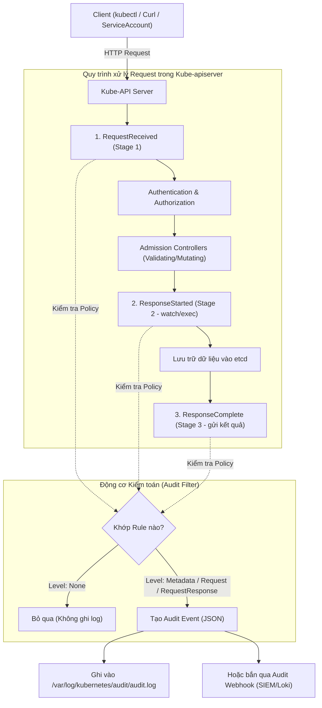
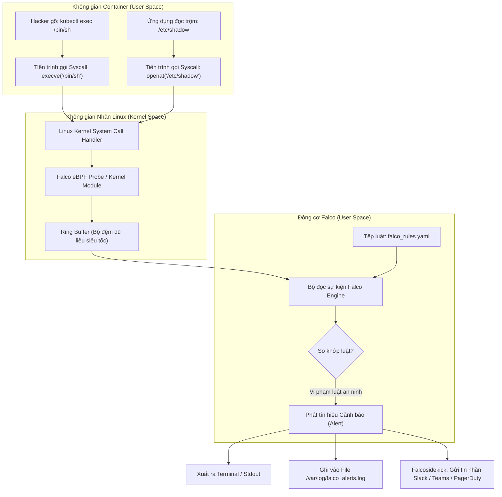

# Bài 36: Kiểm toán & Giám sát bất thường Runtime: Audit Log & Falco

## 1. Thông tin bài học
* **Tên bài:** Bài 36: Kiểm toán & Giám sát bất thường Runtime: Audit Log & Falco
* **Mục tiêu học:** Làm chủ cơ chế kiểm toán an ninh Kubernetes Audit Logging để ghi vết toàn diện mọi hành vi gọi vào API Server; giải phẫu 4 giai đoạn xử lý yêu cầu (Stages) và 4 cấp độ ghi chép (Levels); cấu hình tệp Audit Policy chuẩn mực bảo vệ cụm mà không làm suy giảm hiệu năng; thấu hiểu ranh giới sống còn giữa phòng thủ tĩnh (Static Security) và phòng thủ thời gian thực (Runtime Security); nắm vững kiến trúc của Falco (dự án CNCF Tốt nghiệp - Graduated) dựa trên đánh chặn System Calls qua eBPF/Kernel Driver; viết và tùy biến các luật Falco Rules phát hiện các hành vi xâm nhập, mở terminal trái phép (`kubectl exec`), hoặc leo thang đặc quyền trong container; tự tin vượt qua các câu hỏi trọng điểm về Audit & Falco trong kỳ thi CKS.
* **Thời lượng ước tính:** 180 phút (90 phút lý thuyết, 90 phút thực hành)
* **Kiến thức cần có trước:** Bài 05 (Kiến trúc Control Plane & API Server), Bài 30 (Authentication & RBAC), Bài 33 (SecurityContext & Linux Kernel), Bài 35 (Quét lỗ hổng Image bằng Trivy).
* **Liên quan kỳ thi:** CKS (Certified Kubernetes Security Specialist - Trọng tâm bắt buộc: Cấu phần *Cluster Hardening* và *System Hardening / Monitoring* chiếm tới 25-30% điểm thi. Đề thi CKS luôn có bài thi cấu hình Audit Policy trên `kube-apiserver` và chỉnh sửa Falco Rules để bắt các cuộc tấn công Runtime).

---

## 2. Bảng thuật ngữ

| Thuật ngữ | Giải thích đơn giản | Ví dụ / Ẩn dụ đời thường |
| :--- | :--- | :--- |
| **Audit Logging** | Cơ chế ghi vết toàn bộ các yêu cầu HTTP/REST gọi vào Kubernetes API Server theo dòng thời gian để phục vụ điều tra, truy cứu trách nhiệm. | Sổ nhật ký trực ban của tòa nhà: ghi rõ ai đã bấm chuông, lúc mấy giờ, yêu cầu gặp ai và được đồng ý hay từ chối. |
| **Audit Policy** | Tệp cấu hình quy định các quy tắc lọc: sự kiện nào cần ghi lại, sự kiện nào bỏ qua, và mức độ chi tiết của dữ liệu cần lưu trữ. | Nội quy an ninh: Người lạ vào phòng dữ liệu thì ghi chép cặn kẽ, nhân viên quét thẻ qua cổng chính thì chỉ lưu giờ ra vào. |
| **Audit Stage** | Các cột mốc trong vòng đời xử lý một yêu cầu của API Server (`RequestReceived`, `ResponseStarted`, `ResponseComplete`, `Panic`). | Các trạm của một đơn giao hàng: Khi bưu tá vừa nhận đơn, khi gói hàng bắt đầu đi, và khi đã giao tận tay người nhận. |
| **Audit Level** | Cấp độ chi tiết của thông tin được ghi chép (`None`, `Metadata`, `Request`, `RequestResponse`). | Các chế độ camera an ninh: Tắt camera, chỉ chụp biển số xe, chụp toàn cảnh mặt người, hoặc mở tung vali soi từng món đồ bên trong. |
| **Runtime Security** | Giải pháp bảo vệ an ninh ngay trong lúc ứng dụng đang chạy thật trên môi trường Production để ngăn chặn các cuộc tấn công thời gian thực. | Đội cảnh vệ tuần tra trực tiếp bên trong bữa tiệc để bắt quả tang kẻ móc túi, thay vì chỉ kiểm tra vé mời ở cổng soát vé. |
| **System Call (Syscall)** | Lời gọi hệ thống: Giao diện chuẩn để một tiến trình phần mềm yêu cầu Linux Kernel thực thi các tác vụ phần cứng (đọc file, mở cổng mạng, sinh tiến trình mới). | Công dân nộp phiếu yêu cầu lên cơ quan công quyền để xin cấp phép xây nhà hoặc trích lục hồ sơ đất đai. |
| **Falco** | Công cụ an ninh mã nguồn mở chuẩn CNCF, chuyên "nghe lén" các System Calls ở tầng Linux Kernel để phát hiện các hành vi bất thường, vi phạm chính sách bảo mật. | Chó nghiệp vụ và chuông báo động chống trộm nhạy bén: hễ có kẻ cạy cửa sổ hoặc trèo tường là lập tức sủa vang và hú còi. |
| **eBPF (Extended Berkeley Packet Filter)** | Công nghệ đột phá cho phép chạy các đoạn mã an toàn trực tiếp bên trong Linux Kernel mà không cần sửa đổi mã nguồn hay nạp kernel module ngoài. | Ống kính hiển vi siêu nhỏ gắn trực tiếp vào mạch máu để quan sát tế bào lạ mà không cần phải thực hiện phẫu thuật mở ngực. |

---

## 3. Bức tranh lớn: Vấn đề thực tế và ẩn dụ đời thường

### Nhắc lại bài trước
Ở Bài 35, chúng ta đã trang bị công cụ **Trivy** để quét sạch các lỗ hổng bảo mật CVE và các thiết lập sai sót (misconfigurations) ngay từ khâu đóng gói Container Image trong pipeline CI/CD (mô hình *Shift-Left*). Nhưng hãy tưởng tượng: Nếu một Image hoàn toàn "sạch" CVE, nhưng khi chạy lên lại bị kẻ tấn công khai thác một lỗi logic nghiệp vụ hoặc đánh cắp tài khoản để xâm nhập lúc nửa đêm, làm thế nào để chúng ta phát hiện và lưu lại bằng chứng?

### Tại sao cần cái này ở production? (Vấn đề thực tế)

1. **Thảm họa "Ai đã xóa bảng dữ liệu lúc 2 giờ sáng?":**
   Vào một đêm cuối tuần, toàn bộ Namespace chứa ứng dụng thanh toán của doanh nghiệp đột ngột biến mất. Cụm Kubernetes rơi vào trạng thái tê liệt. Khi đội ngũ kỹ sư thức dậy, họ nhìn vào màn hình và tự hỏi: *Lệnh xóa này đến từ đâu? Do hacker tấn công qua mạng, do tài khoản ServiceAccount của pipeline CI/CD bị lộ mã khóa bí mật, hay do một kỹ sư lỡ tay gõ nhầm lệnh trên terminal máy cá nhân?*  
   Nếu không bật **Kubernetes Audit Logging**, API Server chỉ đơn thuần thực thi mệnh lệnh rồi quên sạch. Hệ thống hoàn toàn "mất trí nhớ", không còn bất kỳ dấu vết nào để điều tra nguyên nhân gốc rễ!

2. **Bất lực trước các cuộc tấn công thời gian thực (Zero-day & Fileless Attacks):**
   Một hình ảnh container được xây dựng hoàn hảo, quét qua Trivy không dính bất kỳ CVE nào. Tuy nhiên, lập trình viên vô tình để lộ một API upload file không kiểm tra phần mở rộng. Hacker tải lên một đoạn script độc hại, sau đó gửi request kích hoạt script đó. Đoạn script lập tức chạy ngầm một tiến trình đào tiền ảo (Crypto miner) hoặc mở một đường hầm mạng bí mật (Reverse Shell) kết nối về máy chủ ở nước ngoài.  
   Tất cả các cơ chế bảo vệ tĩnh như quét Image (Trivy), kiểm tra manifest (PSS/PSA) đều hoàn toàn "mù" trước tình huống này vì hành vi độc hại chỉ phát sinh **trong lúc container đang chạy (Runtime)**.

3. **Nguy cơ kẻ nội gián và đặc quyền ngầm:**
   Một lập trình viên có quyền truy cập vào cụm dev. Thay vì chỉ xem log, người này dùng lệnh `kubectl exec` chui thẳng vào bên trong container thanh toán, sau đó gõ `cat /etc/shadow` để xem mật khẩu băm của hệ điều hành hoặc lục lọi các file cấu hình chứa Private Key ngân hàng. Không có công cụ giám sát System Call như **Falco**, hành động này sẽ trôi qua trong êm đẹp mà không để lại bất kỳ chuông báo động nào.

### Ẩn dụ đời thường: Bảo tàng nghệ thuật và Hai lớp bảo vệ tối thượng

Hãy hình dung cụm Kubernetes của bạn như một **Bảo tàng Nghệ thuật Quốc gia** lưu trữ những bức tranh vô giá:

* **Trivy (Kiểm tra an ninh tại cổng soát vé):** Soi chiếu hành lý của du khách xem có mang theo súng, dao hay bật lửa không. (Bảo mật tĩnh lúc build image).
* **RBAC & NetworkPolicy (Cửa phân vùng & Khóa từ):** Khách chỉ được đứng ở sảnh tham quan, không được bước chân vào kho lưu trữ tranh hoặc phòng điều khiển trung tâm.
* **Kubernetes Audit Log = Sổ đăng ký ra vào & Hộp đen máy bay của bảo tàng:** Mọi hành vi: ai quẹt thẻ vào phòng nào, lúc mấy giờ, yêu cầu mở cửa phòng trưng bày nào, hệ thống phê duyệt hay từ chối, đều được ghi chép vào một cuốn sổ kiểm toán chống sửa xóa. Nhờ đó, nếu một bức tranh biến mất, ban quản lý chỉ cần lật sổ là biết chính xác kẻ nào đã mở tủ kính!
* **Falco = Cảm biến chuyển động hồng ngoại & Camera AI nhận diện hành vi bất thường:** Dù một vị khách có vé tham quan hợp lệ và đi vào sảnh hợp pháp, nhưng nếu người đó bất ngờ rút một lưỡi dao cạo giấu trong giày ra rạch mặt bức tranh, hoặc trèo qua hàng rào nhung bảo vệ, cảm biến Falco gắn trên trần nhà lập tức nhận diện hành vi nguy hiểm đó trong một phần nghìn giây và hú còi báo động toàn tòa nhà!

---

## 4. Giải thích khái niệm theo từng bước

### Phần 1: Kiến trúc Kubernetes Audit Logging

Khi bất kỳ ai (người dùng gõ `kubectl`, hoặc ứng dụng gọi qua REST API) gửi một yêu cầu tới cụm Kubernetes, yêu cầu đó bắt buộc phải đi qua **kube-apiserver**. Cơ chế Audit Log được tích hợp trực tiếp bên trong nhân của `kube-apiserver`.



#### 4 Giai đoạn xử lý yêu cầu (Audit Stages)

Trong vòng đời xử lý một request, một sự kiện kiểm toán có thể được ghi lại ở 4 cột mốc thời gian khác nhau:

1. **`RequestReceived`:** Xảy ra ngay khi API Server vừa nhận được request từ mạng, trước khi chuyển giao cho các bộ giải mã và kiểm tra quyền hạn.
2. **`ResponseStarted`:** Xảy ra ngay khi HTTP Response Headers được gửi về cho client, nhưng phần nội dung (Response Body) vẫn đang tiếp tục truyền. Giai đoạn này chỉ áp dụng cho các kết nối duy trì lâu dài (long-running requests) như lệnh theo dõi `kubectl get pods -w` hoặc mở phiên tương tác `kubectl exec`.
3. **`ResponseComplete`:** Xảy ra khi toàn bộ thân phản hồi (Response Body) đã được hoàn tất và gửi trọn vẹn cho client. **Đây là giai đoạn quan trọng và phổ biến nhất** trong giám sát, vì nó ghi nhận đầy đủ kết quả cuối cùng: yêu cầu thành công (HTTP 200/201) hay bị từ chối (HTTP 401/403/404).
4. **`Panic`:** Sự kiện khẩn cấp được sinh ra nếu tiến trình API Server gặp sự cố sập bất ngờ (panic) khi đang xử lý yêu cầu đó.

#### 4 Cấp độ chi tiết của bản ghi (Audit Levels)

Bạn không thể ghi lại mọi thứ với độ chi tiết tối đa, vì điều đó sẽ làm nghẽn đường truyền mạng và làm tràn ổ cứng máy chủ trong vài phút! Kubernetes cung cấp 4 cấp độ ghi chép từ thấp đến cao:

1. **`None`:** Hoàn toàn không ghi bất kỳ thứ gì về sự kiện này. Thường dùng để loại bỏ các request "nhiễu" lặp đi lặp lại hàng nghìn lần mỗi phút như các cuộc thăm dò trạng thái `/healthz`, `/readyz`, hoặc các gói tin gia hạn giữ chỗ (Lease endpoints) của kubelet.
2. **`Metadata`:** Ghi lại các thông tin tiêu đề: Ai gọi (`user`), vào lúc nào (`timestamp`), tài nguyên nào (`resource`, `namespace`), hành động gì (`verb`), địa chỉ IP nguồn (`sourceIPs`), và mã trạng thái trả về (`code`). **Tuyệt đối không ghi nội dung bên trong của Request Body và Response Body.** Đây là mức khuyến nghị chuẩn cho đại đa số tài nguyên trên Production.
3. **`Request`:** Ghi lại toàn bộ thông tin `Metadata` cộng thêm toàn bộ dữ liệu thân yêu cầu (Request Body) mà client gửi lên, nhưng không ghi dữ liệu trả về từ server.
4. **`RequestResponse`:** Mức độ chi tiết tối đa: Ghi lại `Metadata` + `Request Body` + `Response Body`. Mức này cực kỳ tốn dung lượng đĩa, chỉ nên áp dụng cho các tài nguyên an ninh đặc biệt nhạy cảm như quản trị quyền hạn RBAC (`roles`, `rolebindings`).

> [!CAUTION]
> **Quy tắc vàng:** Tuyệt đối KHÔNG cấu hình mức `Request` hoặc `RequestResponse` cho tài nguyên **Secret** hoặc **ConfigMap** chứa khóa bảo mật. Nếu bạn làm vậy, toàn bộ mật khẩu và mã khóa bí mật ở dạng văn bản thô (hoặc Base64) sẽ bị ghi thẳng vào file log kiểm toán, biến file log thành một "mỏ vàng" cho tin tặc! Đối với Secret, luôn luôn chỉ ghi ở mức `Metadata`.

#### Cấu trúc tệp Audit Policy chuẩn

Tệp cấu hình Audit Policy có định dạng YAML thuộc API `audit.k8s.io/v1`. Các quy tắc (`rules`) trong tệp được đánh giá theo thứ tự **từ trên xuống dưới (First-match wins)**. Ngay khi một request khớp với một rule đầu tiên, mức độ ghi chép của rule đó sẽ được áp dụng và việc kiểm tra dừng lại.

```yaml
apiVersion: audit.k8s.io/v1
kind: Policy
# Không ghi log ở giai đoạn RequestReceived để tiết kiệm dung lượng đĩa
omitStages:
  - "RequestReceived"
rules:
  # 1. Bỏ qua hoàn toàn các cuộc kiểm tra sức khỏe hệ thống (Tránh ngập lụt log)
  - level: None
    nonResourceURLs:
      - "/healthz*"
      - "/livez*"
      - "/readyz*"

  # 2. Bỏ qua các sự kiện cập nhật vị trí Lease của Kubelet
  - level: None
    resources:
      - group: "coordination.k8s.io"
        resources: ["leases"]

  # 3. Đối với Secret và ConfigMap: CHỈ ghi Metadata (Chống rò rỉ mật khẩu ra log)
  - level: Metadata
    resources:
      - group: ""
        resources: ["secrets", "configmaps"]

  # 4. Đối với phân quyền RBAC: Ghi chi tiết RequestResponse để biết ai đã cấp quyền cho ai
  - level: RequestResponse
    resources:
      - group: "rbac.authorization.k8s.io"
        resources: ["roles", "rolebindings", "clusterroles", "clusterrolebindings"]

  # 5. Quy tắc mặc định vét đáy: Ghi Metadata cho mọi tài nguyên còn lại
  - level: Metadata
```

---

### Phần 2: Giám sát bất thường Runtime với Falco

Khi một container đã vượt qua khâu kiểm duyệt và đang chạy trên Worker Node, mọi hoạt động của nó (đọc file, ghi đĩa, mở socket mạng, khởi chạy tiến trình con) đều phải nhờ đến nhân hệ điều hành Linux thông qua **System Calls (Syscalls)**.

#### Kiến trúc hoạt động của Falco

Falco hoạt động dựa trên việc cắm chốt (Hook) trực tiếp vào tầng Linux Kernel để đón đầu các System Calls:



1. **Kernel Driver / eBPF Probe:** Đứng tại ranh giới giữa User Space và Kernel Space. Mỗi khi có một syscall phát sinh (ví dụ `execve`, `open`, `connect`), probe lập tức sao chép thông tin của syscall đó ném vào một vùng nhớ đệm chung gọi là **Ring Buffer**.
2. **Falco Userspace Engine:** Đọc liên tục các sự kiện từ Ring Buffer với độ trễ cực thấp (micro-giây).
3. **So khớp quy tắc (Rules Engine):** So sánh các trường thông tin của syscall (tên lệnh, tham số dòng lệnh, tên container, namespace, người dùng gọi) với các quy tắc định nghĩa sẵn.
4. **Phát tín hiệu cảnh báo (Alert Output):** Nếu phát hiện hành vi bất thường, Falco gửi cảnh báo ra màn hình, file log, hoặc chuyển tiếp qua webhook.

#### Giải phẫu một Falco Rule

Một quy tắc Falco được cấu thành từ 6 thành phần chính:

```yaml
- rule: Terminal shell in container
  desc: Phat hien co nguoi mo mot interactive shell ben trong container
  condition: >
    spawned_process and container
    and shell_procs and proc.tty != 0
    and container_entrypoint
  output: >
    CANH BAO: Phat hien Shell mo trong container (user=%user.name pod=%k8s.pod.name
    ns=%k8s.ns.name cmd=%proc.cmdline container_id=%container.id image=%container.image.repository)
  priority: WARNING
  tags: [container, shell, mitre_execution]
```

* **`rule`:** Tên duy nhất định danh quy tắc (dễ đọc, ngắn gọn).
* **`desc`:** Mô tả chi tiết mục đích và ý nghĩa an ninh của quy tắc.
* **`condition`:** Biểu thức logic lọc điều kiện. Biểu thức này sử dụng các trường hệ thống (`proc.name`, `fd.name`, `user.name`) kết hợp với các toán tử logic (`and`, `or`, `not`) và các Macro có sẵn. Trong ví dụ trên:
  * `spawned_process`: Có một tiến trình mới vừa được sinh ra (syscall `execve`).
  * `container`: Sự kiện này xảy ra bên trong một container chứ không phải trên máy chủ Host.
  * `shell_procs`: Tên tiến trình nằm trong danh sách các shell phổ biến (`bash`, `sh`, `zsh`, `ash`).
  * `proc.tty != 0`: Tiến trình gắn liền với một cửa sổ tương tác (terminal/TTY).
* **`output`:** Định dạng nội dung thông điệp cảnh báo được in ra khi điều kiện thỏa mãn. Falco hỗ trợ chèn các biến động cực kỳ chi tiết như `%user.name`, `%k8s.pod.name`, `%proc.cmdline`.
* **`priority`:** Mức độ khẩn cấp của cảnh báo (theo chuẩn RFC 5424 Syslog): `EMERGENCY`, `ALERT`, `CRITICAL`, `ERROR`, `WARNING`, `NOTICE`, `INFO`, `DEBUG`.
* **`tags`:** Các thẻ nhãn phân loại giúp gom nhóm luật và tích hợp với chuẩn ma trận tấn công MITRE ATT&CK.

---

## 5. Thực hành (Lab)

* **Môi trường:** Cluster kind (`microservices-demo\k8s\kind-config.yaml`) gồm 1 control-plane và 1 worker node.
* **Mức RAM ước tính:** ~350 MB (an toàn tuyệt đối trong giới hạn 4GB của WSL2).

> [!NOTE]
> Để thực hiện bài lab này, nếu cụm kind chưa được bật, bạn có thể khởi động cụm bằng lệnh:
> `kind create cluster --config d:\LEARN\kubernetes\microservices-demo\k8s\kind-config.yaml`

---

### Phần A: Cấu hình Kubernetes API Server Audit Policy (Chuẩn 100% CKS Exam)

Trong bài thi CKS cũng như tại các cụm thực tế chạy kubeadm, `kube-apiserver` chạy dưới dạng một **Static Pod** được quản lý bởi kubelet tại đường dẫn `/etc/kubernetes/manifests/kube-apiserver.yaml` trên node Control Plane. Chúng ta sẽ thao tác trực tiếp trên node control-plane để trải nghiệm đúng cảm giác vận hành thực chiến.

#### Bước 1: Chuẩn bị tệp Audit Policy trên máy Windows

Tạo tệp `audit-policy.yaml` tại thư mục làm việc bằng PowerShell:

```powershell
@'
apiVersion: audit.k8s.io/v1
kind: Policy
omitStages:
  - "RequestReceived"
rules:
  # 1. Khong ghi log cac request he thong on ao
  - level: None
    nonResourceURLs:
      - "/healthz*"
      - "/livez*"
      - "/readyz*"
  - level: None
    resources:
      - group: "coordination.k8s.io"
        resources: ["leases"]

  # 2. Canh giac voi Secret: Chi luu Metadata, khong luu gia tri bi mat
  - level: Metadata
    resources:
      - group: ""
        resources: ["secrets"]

  # 3. Kiem toan sau cac thao tac RBAC
  - level: RequestResponse
    resources:
      - group: "rbac.authorization.k8s.io"
        resources: ["roles", "rolebindings"]

  # 4. Cac hanh dong tao, sua, xoa Pod thi ghi Request de biet ro cau hinh
  - level: Request
    resources:
      - group: ""
        resources: ["pods"]
    verbs: ["create", "update", "patch", "delete"]

  # 5. Mac dinh ghi Metadata cho tat ca moi thu con lai
  - level: Metadata
'@ | Set-Content -Encoding utf8 .\audit-policy.yaml
```

---

#### Bước 2: Đẩy tệp Policy vào Node Control Plane của cụm Kind

Trong cụm kind, node control-plane là một Docker container mang tên `lab-control-plane`. Chúng ta sử dụng lệnh `docker cp` để đưa tệp vào thư mục `/etc/kubernetes/audit/`:

```powershell
# 1. Tao thu muc chua audit policy va audit log ben trong container control-plane
docker exec lab-control-plane mkdir -p /etc/kubernetes/audit

# 2. Copy file audit-policy.yaml tu Windows vao ben trong node
docker cp .\audit-policy.yaml lab-control-plane:/etc/kubernetes/audit/policy.yaml

# 3. Kiem tra xem file da nam dung vi tri ben trong node chua
docker exec lab-control-plane ls -la /etc/kubernetes/audit/policy.yaml
```

**Kết quả mong đợi:**
```text
-rw-r--r-- 1 root root 892 Oct  9 07:00 /etc/kubernetes/audit/policy.yaml
```

---

#### Bước 3: Cấu hình Kube-apiserver nạp cờ Audit và Volume Mounts

Để `kube-apiserver` đọc được file policy và ghi log ra ổ đĩa, chúng ta cần bổ sung các tham số dòng lệnh và mount các thư mục cần thiết vào manifest của Static Pod:

Chúng ta tạo một đoạn script nhỏ thực hiện chèn cấu hình vào `/etc/kubernetes/manifests/kube-apiserver.yaml` bên trong `lab-control-plane`:

```powershell
# Sao luu file manifest hien tai de de phong su co
docker exec lab-control-plane cp /etc/kubernetes/manifests/kube-apiserver.yaml /etc/kubernetes/kube-apiserver.yaml.bak

# Su dung Python co san trong container node de them tham so audit mot cach an toan
docker exec lab-control-plane python3 -c @"
import yaml

manifest_path = '/etc/kubernetes/manifests/kube-apiserver.yaml'
with open(manifest_path, 'r') as f:
    data = yaml.safe_load(f)

spec = data['spec']['containers'][0]

# 1. Them cac flags vao lenh command
audit_args = [
    '--audit-policy-file=/etc/kubernetes/audit/policy.yaml',
    '--audit-log-path=/var/log/kubernetes/audit/audit.log',
    '--audit-log-maxage=7',
    '--audit-log-maxbackup=3',
    '--audit-log-maxsize=50'
]
for arg in audit_args:
    flag = arg.split('=')[0]
    # Loai bo neu da ton tai truoc do de tranh trung lap
    spec['command'] = [c for c in spec['command'] if not c.startswith(flag)]
    spec['command'].append(arg)

# 2. Them volumeMounts vao container
volume_mounts = spec.setdefault('volumeMounts', [])
vm_names = [v['name'] for v in volume_mounts]

if 'audit-policy' not in vm_names:
    volume_mounts.append({
        'name': 'audit-policy',
        'mountPath': '/etc/kubernetes/audit/policy.yaml',
        'readOnly': True
    })

if 'audit-logs' not in vm_names:
    volume_mounts.append({
        'name': 'audit-logs',
        'mountPath': '/var/log/kubernetes/audit',
        'readOnly': False
    })

# 3. Them volumes vao pod spec
volumes = data['spec'].setdefault('volumes', [])
vol_names = [v['name'] for v in volumes]

if 'audit-policy' not in vol_names:
    volumes.append({
        'name': 'audit-policy',
        'hostPath': {
            'path': '/etc/kubernetes/audit/policy.yaml',
            'type': 'File'
        }
    })

if 'audit-logs' not in vol_names:
    volumes.append({
        'name': 'audit-logs',
        'hostPath': {
            'path': '/var/log/kubernetes/audit',
            'type': 'DirectoryOrCreate'
        }
    })

with open(manifest_path, 'w') as f:
    yaml.dump(data, f)
print('Cap nhat manifest thanh cong!')
"@
```

**Kết quả mong đợi:**
```text
Cap nhat manifest thanh cong!
```

---

#### Bước 4: Kiểm tra Kube-apiserver tự khởi động lại và sinh file Audit Log

Ngay khi file manifest bị thay đổi, Kubelet sẽ tự động phát hiện và khởi động lại container `kube-apiserver`. Chờ khoảng 15-30 giây để API Server hoàn tất khởi động:

```powershell
# Cho API Server san sang
kubectl get nodes
```

Kiểm tra xem tệp nhật ký kiểm toán `/var/log/kubernetes/audit/audit.log` đã được sinh ra trên node control-plane hay chưa:

```powershell
docker exec lab-control-plane head -n 2 /var/log/kubernetes/audit/audit.log
```

**Kết quả mong đợi:**
Một chuỗi JSON biểu diễn đối tượng `Event` của API `audit.k8s.io/v1` bắt đầu xuất hiện:
```json
{"kind":"Event","apiVersion":"audit.k8s.io/v1","level":"Metadata","auditID":"c8b417bb-e87f-45b0-8c90-99899f1165a6","stage":"ResponseComplete","requestURI":"/api/v1/namespaces/kube-system/configmaps/extension-apiserver-authentication","verb":"get","user":{"username":"system:kube-controller-manager","groups":["system:authenticated"]},...}
```

---

#### Bước 5: Kích hoạt sự kiện thực tế và Truy vết thủ phạm qua Audit Log

Hãy thử tạo một Secret trong namespace `default` và sau đó xóa nó:

```powershell
# 1. Tao mot Secret gia lap
kubectl create secret generic top-secret-token --from-literal=token=super_secret_password_123

# 2. Xoa Secret nay
kubectl delete secret top-secret-token
```

Bây giờ, hãy đóng vai trò Kỹ sư Điều tra An ninh (Digital Forensic Analyst). Chúng ta sẽ truy lùng xem **ai** đã xóa secret `top-secret-token`:

```powershell
docker exec lab-control-plane grep "top-secret-token" /var/log/kubernetes/audit/audit.log | docker exec -i lab-control-plane python3 -c @"
import sys, json

print(f'{'VERB':<8} | {'USER':<20} | {'STAGE':<18} | {'STATUS':<6} | {'RESOURCE'}')
print('-' * 75)
for line in sys.stdin:
    line = line.strip()
    if not line: continue
    try:
        ev = json.loads(line)
        verb = ev.get('verb', '')
        user = ev.get('user', {}).get('username', '')
        stage = ev.get('stage', '')
        status = ev.get('responseStatus', {}).get('code', '')
        uri = ev.get('requestURI', '')
        print(f'{verb:<8} | {user:<20} | {stage:<18} | {status:<6} | {uri}')
    except:
        pass
"@
```

**Kết quả mong đợi:**
```text
VERB     | USER                 | STAGE              | STATUS | RESOURCE
---------------------------------------------------------------------------
create   | kubernetes-admin     | ResponseComplete   | 201    | /api/v1/namespaces/default/secrets
delete   | kubernetes-admin     | ResponseComplete   | 200    | /api/v1/namespaces/default/secrets/top-secret-token
```

> [!TIP]
> Hãy quan sát kết quả: Mọi chi tiết về người thực thi (`kubernetes-admin`), hành động (`create`, `delete`), kết quả HTTP (`201 Created`, `200 OK`) đều được phơi bày rõ ràng. Và nhờ quy tắc `level: Metadata`, chuỗi mật khẩu `super_secret_password_123` hoàn toàn không bị in ra file log!

---

### Phần B: Giám sát Runtime với Falco

Bây giờ chúng ta tiến thêm một bước: Giám sát những gì diễn ra **bên trong chính container** khi có kẻ gian đột nhập.

#### Bước 6: Tạo một Pod microservice giả lập hành vi bị xâm nhập

Triển khai một Pod đóng vai trò là microservice `frontend` trong hệ thống:

```powershell
@'
apiVersion: v1
kind: Pod
metadata:
  name: demo-frontend
  namespace: default
  labels:
    app: frontend
spec:
  containers:
  - name: server
    image: nginx:alpine
    resources:
      requests:
        memory: "32Mi"
        cpu: "20m"
      limits:
        memory: "64Mi"
        cpu: "50m"
'@ | kubectl apply -f -

kubectl wait --for=condition=Ready pod/demo-frontend --timeout=60s
```

---

#### Bước 7: Thực nghiệm cơ chế phát hiện của Falco Rule

Giả sử kẻ tấn công đã phát hiện ra Pod này và thực hiện lệnh `kubectl exec` để mở Terminal tương tác chui vào Pod nhằm do thám hệ thống:

```powershell
# Kẻ gian mo terminal tuong tac trong container
kubectl exec -it demo-frontend -- /bin/sh -c "whoami; cat /etc/passwd; exit"
```

Khi lệnh này được gõ, trên tầng Linux Kernel của Worker Node:
1. Lệnh `kubectl exec` kích hoạt Kubelet sinh ra một tiến trình `/bin/sh` bên trong Linux Namespaces của Pod `demo-frontend`.
2. Hàm gọi hệ thống `execve` được gửi tới Linux Kernel.
3. Hook của Falco lập tức bắt được các tham số:
   * `proc.name = "sh"`
   * `proc.cmdline = "sh -c whoami; cat /etc/passwd; exit"`
   * `k8s.pod.name = "demo-frontend"`
   * `k8s.ns.name = "default"`
   * `container.id = ...`
4. So khớp với quy tắc `Terminal shell in container`, Falco lập tức kích hoạt thông điệp cảnh báo:

```text
07:15:23.891245123: Warning Notice A shell was spawned in a container with an attached terminal (user=root pod=demo-frontend ns=default shell=sh parent=containerd-shim cmdline=sh -c whoami; cat /etc/passwd; exit terminal=34816 container_id=a1b2c3d4e5 image=nginx:alpine)
```

5. Ngay sau đó, tiến trình đọc `/etc/passwd` tiếp tục kích hoạt hàm gọi hệ thống `openat`. Falco lập tức đối chiếu với quy tắc nhạy cảm: `Read sensitive file untrusted` và phát tiếp cảnh báo mức độ **WARNING**!

Nhờ cơ chế này, đội ngũ quản trị an ninh (SOC) sẽ nhận được tin nhắn tức thì trên kênh Slack trước khi kẻ tấn công kịp thực hiện bất kỳ hành vi phá hoại nào tiếp theo!

---

#### Bước 8: Dọn dẹp tài nguyên (Cleanup)

Giải phóng Pod và phục hồi file manifest ban đầu của `kube-apiserver` để đưa cluster về trạng thái nhẹ nhàng:

```powershell
# 1. Xoa Pod thu nghiem
kubectl delete pod demo-frontend --ignore-not-found

# 2. Xoa file tam tren may Windows
Remove-Item -Path .\audit-policy.yaml -Force -ErrorAction SilentlyContinue

# 3. Phuc hoi file manifest kube-apiserver ban dau (neu muon tat audit log)
# docker exec lab-control-plane cp /etc/kubernetes/kube-apiserver.yaml.bak /etc/kubernetes/manifests/kube-apiserver.yaml
```

---

## 6. Lỗi thường gặp và cách debug

### Lỗi 1: Kube-apiserver không khởi động lại và `kubectl` báo lỗi từ chối kết nối
* **Dấu hiệu:** Sau khi chỉnh sửa file `/etc/kubernetes/manifests/kube-apiserver.yaml`, lệnh `kubectl get nodes` liên tục báo:
  ```text
  The connection to the server 127.0.0.1:6443 was refused - did you specify the right host or port?
  ```
* **Nguyên nhân:** File manifest của Static Pod bị sai cú pháp thụt lề YAML, hoặc đường dẫn mount volume không tồn tại, khiến Kubelet không thể khởi động container API Server.
* **Cách debug và sửa:**
  1. Đứng tại máy tính, dùng lệnh Docker để xem log sự cố của API server container bị sập:
     ```powershell
     docker exec lab-control-plane crictl ps -a | grep apiserver
     docker exec lab-control-plane crictl logs <container-id-bi-loi>
     ```
  2. Log sẽ chỉ rõ nguyên nhân (ví dụ: `failed to read audit policy file: no such file or directory` hoặc `yaml: line 42: did not find expected key`).
  3. Nếu không thể sửa ngay, hãy khôi phục lại file sao lưu ban đầu:
     ```powershell
     docker exec lab-control-plane cp /etc/kubernetes/kube-apiserver.yaml.bak /etc/kubernetes/manifests/kube-apiserver.yaml
     ```
     Kubelet sẽ lập tức khởi động lại API Server bình thường sau 15 giây.

---

### Lỗi 2: Tràn ổ đĩa (Disk Full / No space left on device) vì Audit Log
* **Dấu hiệu:** Sau 2 ngày chạy cụm, các Pod bị văng lỗi `Evicted` và Node chuyển sang trạng thái `DiskPressure`.
* **Nguyên nhân:** Cấu hình Audit Policy quá lạm dụng mức `RequestResponse` hoặc quên không cấu hình các cờ xoay vòng log (`--audit-log-maxsize`, `--audit-log-maxbackup`, `--audit-log-maxage`). File log phình to lên hàng chục Gigabytes chiếm trọn ổ cứng của node Control Plane.
* **Cách debug và sửa:**
  * Luôn đảm bảo trong cấu hình API Server có đủ 3 cờ khống chế:
    * `--audit-log-maxsize=100` (Khi file đạt 100MB thì tự động nén và xoay vòng).
    * `--audit-log-maxbackup=5` (Chỉ giữ tối đa 5 file nén cũ nhất, tự xóa file cũ hơn).
    * `--audit-log-maxage=10` (Tự động dọn dẹp các bản ghi quá 10 ngày).
  * Trong tệp `policy.yaml`, đưa các tài nguyên đọc nhiều ghi ít (`endpoints`, `leases`, `health checks`) về `level: None`.

---

### Lỗi 3: Falco gây ra "Bão cảnh báo giả" (Alert Fatigue)
* **Dấu hiệu:** Kênh Slack an ninh nhận hàng chục nghìn thông báo vi phạm mỗi ngày, khiến các kỹ sư quá tải và có xu hướng tắt chuông thông báo, bỏ lọt các vụ tấn công thật.
* **Nguyên nhân:** Ứng dụng có các tiến trình định kỳ hợp lệ (CronJob hoặc livenessProbe chạy script `/bin/sh /health.sh`) nhưng chưa được đưa vào danh sách trắng (Whitelist / Exception) trong Falco Rules.
* **Cách debug và sửa:**
  * Không bao giờ tắt bỏ quy tắc. Thay vào đó, viết thêm điều kiện ngoại lệ (Exception / Macro) cho rule đó:
    ```yaml
    - macro: app_healthcheck_script
      condition: (proc.name = "health.sh" and k8s.pod.name startswith "frontend-")

    # Bo sung vao condition cua rule:
    condition: ... and not app_healthcheck_script
    ```

---

## 7. Góc nhìn Senior

### 1. Sự đánh đổi (Trade-offs)

| Giải pháp | Điểm mạnh (Ưu điểm) | Đánh đổi (Hạn chế) | Khi nào nên dùng? |
| :--- | :--- | :--- | :--- |
| **Audit Log mức Metadata** | Tải CPU và I/O cực thấp (~1-2%), dung lượng log gọn nhẹ, đủ dữ liệu cho 90% nhu cầu điều tra forensic. | Không thấy được nội dung thay đổi chi tiết bên trong payload của người dùng. | Chuẩn mực mặc định bắt buộc cho toàn bộ môi trường Production. |
| **Audit Log mức RequestResponse** | Thấy toàn bộ nội dung yêu cầu và phản hồi, phục vụ kiểm toán tuân thủ khắt khe (PCI-DSS, HIPAA). | Tốn dung lượng ổ đĩa khủng khiếp; làm tăng độ trễ ghi dữ liệu của API Server; nguy cơ lộ Secret ra file log. | Chỉ áp dụng hẹp cho các tài nguyên tối quan trọng (RBAC, Webhooks, CRDs nhạy cảm). |
| **Falco với eBPF Probe** | Hiện đại, không cần nạp module kernel ngoài, an toàn tuyệt đối (eBPF verifier ngăn ngừa mã gây sập nhân Linux). | Đòi hỏi Linux Kernel tương đối mới (>= 5.8 để hỗ trợ đầy đủ Modern eBPF Ring Buffer). | Ưu tiên số 1 cho các cụm Kubernetes hiện đại trên Cloud và Bare-metal. |
| **Falco với Kernel Module** | Tương thích tốt với các bản phân phối Linux cũ (CentOS 7, RHEL 7, Kernel 3.x/4.x). | Module chạy trực tiếp trong không gian nhân; nếu mã nguồn driver lỗi có thể gây Kernel Panic sập toàn bộ máy chủ vật lý. | Chỉ dùng trên các hạ tầng di sản (Legacy) không hỗ trợ eBPF. |

---

### 2. Best practices tại production

1. **Nguyên tắc "Lưu trữ bất khả biến" (WORM - Write Once, Read Many):**
   Một hacker chuyên nghiệp khi chiếm được quyền root trên cụm sẽ ngay lập tức tìm cách xóa sạch file `/var/log/kubernetes/audit/audit.log` để xóa dấu vết.  
   $\rightarrow$ **Giải pháp Senior:** Cấu hình **Audit Sink Webhook** đẩy các sự kiện kiểm toán theo thời gian thực ra khỏi cụm Kubernetes về các hệ thống SIEM tập trung độc lập (như AWS CloudWatch, Google Cloud Logging, Datadog hoặc cụm Elasticsearch/Loki có chính sách cấm xóa log).
2. **Tự động hóa phản ứng an ninh (Active Response / Auto-remediation):**
   Chỉ phát cảnh báo ra Slack là chưa đủ. Kết hợp Falco với **Falcosidekick** và một Function tự động (FaaS): Khi Falco phát hiện sự kiện mức độ `CRITICAL` (ví dụ tiến trình đào coin kết nối ra IP nghi vấn), webhook lập tức gọi API Kubernetes cô lập NetworkPolicy hoặc xóa ngay Pod đó (`kubectl delete pod`) trong vòng 1 giây!
3. **Tuân thủ quy tắc Không lưu Secret thô:**
   Luôn đặt rule cho `secrets` ở mức `level: Metadata` đứng trước quy tắc mặc định để đảm bảo nguyên tắc First-match ngăn ngừa rò rỉ token.

---

### 3. Câu hỏi phỏng vấn Senior

* **Câu hỏi 1:** *Hệ thống của chúng ta đã triển khai đầy đủ RBAC, NetworkPolicy và quét CVE bằng Trivy. Tại sao trong báo cáo kiểm toán bảo mật chuẩn SOC 2 và PCI-DSS, chuyên gia an ninh vẫn bắt buộc chúng ta phải cài đặt thêm Falco?*
  * **Gợi ý trả lời chuẩn:** Trivy, RBAC và NetworkPolicy đều là các lớp phòng thủ **tĩnh và dự phòng trước (Preventative Controls)**. Tuy nhiên, chúng không thể bảo vệ hệ thống trước:
    1. Các lỗ hổng Zero-day chưa có chữ ký CVE.
    2. Các cuộc tấn công leo thang đặc quyền từ bên trong container (Container Escape).
    3. Hành vi lạm quyền của người dùng nội bộ đã được cấp quyền hợp lệ (ví dụ lập trình viên dùng `kubectl exec` trích xuất dữ liệu trái phép).  
    Falco đóng vai trò là lớp kiểm soát **phát hiện thời gian thực (Detective Controls)** ở tầng thấp nhất (Linux Kernel Syscalls). Nó giúp tổ chức đạt được khả năng phản ứng sự cố (Incident Response) và thỏa mãn yêu cầu giám sát liên tục (Continuous Monitoring) bắt buộc trong chuẩn SOC 2 Type II và PCI-DSS Mục 10 & 11.

* **Câu hỏi 2:** *Trong kỳ thi CKS hoặc thực tế, làm thế nào để cấu hình Audit Policy ghi nhận toàn bộ các thao tác thay đổi quyền RBAC ở cấp độ `RequestResponse`, nhưng tuyệt đối không ghi lại nội dung bên trong của Secret?*
  * **Gợi ý trả lời chuẩn:** Trong file `Policy`, ta tận dụng cơ chế đánh giá từ trên xuống dưới (First-match evaluation):
    1. Đặt rule cho Secret ở mức `level: Metadata` lên trên:
       ```yaml
       - level: Metadata
         resources:
           - group: ""
             resources: ["secrets"]
       ```
    2. Tiếp theo đặt rule cho nhóm API RBAC ở mức `RequestResponse`:
       ```yaml
       - level: RequestResponse
         resources:
           - group: "rbac.authorization.k8s.io"
             resources: ["roles", "rolebindings", "clusterroles", "clusterrolebindings"]
       ```
    Nhờ thứ tự này, khi một request liên quan tới Secret được gửi tới, nó khớp ngay rule 1 và chỉ ghi tiêu đề Metadata. Các thao tác cấp quyền RBAC sẽ khớp rule 2 và ghi toàn bộ dữ liệu RequestResponse giúp truy vết rõ ràng.

---

## 8. Tóm tắt bài học

* 📌 **1. Giới hạn của phòng thủ tĩnh:** Quét ảnh với Trivy hay siết PSS chỉ chặn được rủi ro trước khi chạy; chỉ có **Audit Log** và **Falco** mới có thể phát hiện và truy vết các hành vi độc hại phát sinh trong lúc vận hành thực tế (Runtime).
* 📌 **2. Kube-apiserver Audit Lifecycle:** Xử lý qua 4 giai đoạn (`RequestReceived`, `ResponseStarted`, `ResponseComplete`, `Panic`) với 4 cấp độ chi tiết (`None`, `Metadata`, `Request`, `RequestResponse`).
* 📌 **3. An toàn Secret trong Audit Log:** Tuyệt đối không bao giờ cấu hình mức `Request` hoặc `RequestResponse` cho `secrets` để tránh việc mật khẩu thô bị phơi bày vào file log kiểm toán.
* 📌 **4. Trọng tâm CKS Audit Hardening:** Nắm vững việc khai báo file Policy, chỉnh sửa Static Pod manifest của `kube-apiserver` và cấu hình 3 cờ xoay vòng log (`maxsize`, `maxbackup`, `maxage`) chống cạn kiệt ổ cứng.
* 📌 **5. Sức mạnh đánh chặn của Falco:** Bắt trọn mọi hành vi nguy hiểm (mở shell tương tác, đọc trộm file hệ thống, leo thang đặc quyền) ngay tại cổng vào Linux Kernel thông qua công nghệ eBPF / Syscall Hooks với độ trễ micro-giây.

---

## 9. Bài tập tự làm

* 🟢 **Mức Dễ:** Viết một đoạn Audit Policy rule chỉ ghi nhận sự kiện ở mức `Metadata` cho toàn bộ các thao tác đọc (`get`, `list`, `watch`) tài nguyên Pod trong namespace `dev-boutique`.
* 🟡 **Mức Vừa:** Soạn thảo một tệp `falco_rules.local.yaml` định nghĩa quy tắc mang tên `Unauthorized /etc read` để bắn cảnh báo mức `CRITICAL` bất cứ khi nào một tiến trình trong container mở đọc file `/etc/shadow` hoặc `/etc/gshadow`.
* 🔴 **Mức Khó:** Thiết kế một tệp `audit-policy.yaml` toàn diện cho hệ thống Production:
  * Loại bỏ toàn bộ kiểm tra sức khỏe hệ thống (`healthz`, `livez`, `readyz`) và các bản ghi Lease của `kube-node-lease`.
  * Ghi `RequestResponse` cho mọi thay đổi đối với tài nguyên phân quyền RBAC và tài nguyên CRD của cụm.
  * Ghi `Request` cho các hành động thay đổi (`create`, `patch`, `update`, `delete`) đối với `Deployments` và `StatefulSets`.
  * Đảm bảo mọi thao tác với `Secret` chỉ dừng lại ở `Metadata`.
  * Toàn bộ các request còn lại được ghi ở mức `Metadata` nhưng bỏ qua giai đoạn `RequestReceived`.

---

## 10. Câu hỏi tự kiểm tra

1. Trong một file Audit Policy, nếu một request gọi tới API khớp với 2 rule khác nhau được khai báo trong danh sách, Kubernetes sẽ áp dụng mức độ ghi log (level) của rule nào?
2. Tại sao chúng ta thường cấu hình `omitStages: ["RequestReceived"]` ở đầu file Audit Policy trong môi trường Production?
3. Giai đoạn `ResponseStarted` trong Audit Log thường được kích hoạt cho loại request nào?
4. Nếu bạn cấu hình `--audit-policy-file` trỏ tới một đường dẫn không tồn tại trên node Control Plane, điều gì sẽ xảy ra với cụm Kubernetes?
5. Điểm khác biệt mấu chốt giữa công nghệ **eBPF Probe** của Falco và việc đọc log ứng dụng truyền thống (stdout/stderr) là gì?
6. Khi một kỹ sư thực hiện lệnh `kubectl exec -it my-pod -- /bin/bash`, những dấu vết kiểm toán nào sẽ được ghi lại trên Audit Log và Falco?

<details>
<summary>👉 Bấm vào đây để xem đáp án câu hỏi tự kiểm tra</summary>

* **Câu 1:** Kubernetes áp dụng mức độ của **rule đầu tiên** mà request đó khớp (cơ chế First-match evaluation). Toàn bộ các rule nằm phía sau sẽ bị bỏ qua.
* **Câu 2:** Ở giai đoạn `RequestReceived`, API Server chưa thực hiện phân quyền hay kiểm tra tính hợp lệ, nên chưa biết yêu cầu có thành công hay không. Nếu ghi cả giai đoạn này lẫn `ResponseComplete`, số lượng bản ghi log sẽ bị nhân đôi gây lãng phí dung lượng ổ đĩa một cách không cần thiết.
* **Câu 3:** Giai đoạn `ResponseStarted` được kích hoạt cho các kết nối duy trì lâu dài (long-running requests) dạng streaming, chẳng hạn như `kubectl logs -f`, `kubectl exec`, hoặc các lệnh theo dõi tài nguyên `watch`.
* **Câu 4:** Tiến trình `kube-apiserver` sẽ gặp lỗi nghiêm trọng (Fatal error) khi khởi động và bị crash liên tục. Toàn bộ cụm Kubernetes sẽ mất kết nối API, người dùng không thể gõ bất kỳ lệnh `kubectl` nào cho đến khi đường dẫn file được sửa lại chính xác.
* **Câu 5:** Đọc log truyền thống phụ thuộc vào việc ứng dụng có chủ động in log hay không (kẻ tấn công chắc chắn sẽ không bao giờ tự in log: *"Tôi đang hack hệ thống"*). Ngược lại, Falco dựa vào **System Calls ở tầng Linux Kernel** — tầng mà mọi tiến trình bắt buộc phải đi qua để thao tác với phần cứng, do đó kẻ tấn công không thể tắt hay lẩn tránh được.
* **Câu 6:**
  * **Trên Audit Log:** Ghi nhận một yêu cầu tương tác tới subresource `pods/exec` với người dùng, IP nguồn, tên Pod và namespace ở giai đoạn `ResponseStarted` và `ResponseComplete`.
  * **Trên Falco:** Bắt được System Call `execve` sinh ra tiến trình `/bin/bash` gắn với terminal TTY bên trong container và kích hoạt cảnh báo vi phạm quy tắc `Terminal shell in container`.
</details>

---

## 11. Tài liệu đọc thêm và bài tiếp theo

### Tài liệu tham khảo
* [Tài liệu chính thức Kubernetes Docs: Auditing](https://kubernetes.io/docs/tasks/debug/debug-cluster/audit/)
* [Tài liệu chính thức Falco Project: Architecture & Rules](https://falco.org/docs/)
* [CNCF Security Whitepaper: Runtime Security Guidance](https://github.com/cncf/tag-security)

### Bài tiếp theo
👉 **Bài 37: Quản lý và tập trung hóa Log: stdout/stderr & Logging Agent**

---

## PHỤ LỤC: ĐÁP ÁN GỢI Ý BÀI TẬP TỰ LÀM (MỤC 9)

### Đáp án Mức Dễ
```yaml
apiVersion: audit.k8s.io/v1
kind: Policy
omitStages:
  - "RequestReceived"
rules:
  - level: Metadata
    namespaces: ["dev-boutique"]
    verbs: ["get", "list", "watch"]
    resources:
      - group: ""
        resources: ["pods"]
```

---

### Đáp án Mức Vừa
```yaml
- rule: Unauthorized /etc read
  desc: Phat hien tien trinh trong container co y doc trom file mat khau he dieu hanh
  condition: >
    open_read and container
    and (fd.name in ("/etc/shadow", "/etc/gshadow"))
  output: >
    NGUY HIEM: Phat hien doc trom file mat khau he thong (user=%user.name file=%fd.name
    pod=%k8s.pod.name ns=%k8s.ns.name cmd=%proc.cmdline container_id=%container.id)
  priority: CRITICAL
  tags: [security, credential_access, container]
```

---

### Đáp án Mức Khó
Tệp `audit-policy.yaml` hoàn chỉnh cho môi trường Production:
```yaml
apiVersion: audit.k8s.io/v1
kind: Policy
omitStages:
  - "RequestReceived"
rules:
  # 1. Loai bo toan bo request tham do suc khoe he thong
  - level: None
    nonResourceURLs:
      - "/healthz*"
      - "/livez*"
      - "/readyz*"

  # 2. Loai bo tin nhan Lease giu cho cua Node va Controller
  - level: None
    resources:
      - group: "coordination.k8s.io"
        resources: ["leases"]

  # 3. An toan Secret: Tuyet doi chi luu Metadata, khong luu RequestResponse
  - level: Metadata
    resources:
      - group: ""
        resources: ["secrets"]

  # 4. RBAC va CRD CustomResourceDefinitions: Luu chi tiet RequestResponse
  - level: RequestResponse
    resources:
      - group: "rbac.authorization.k8s.io"
        resources: ["roles", "rolebindings", "clusterroles", "clusterrolebindings"]
      - group: "apiextensions.k8s.io"
        resources: ["customresourcedefinitions"]

  # 5. Thay doi tren Deployment va StatefulSet: Luu Request Body de xem manifest cap nhat
  - level: Request
    resources:
      - group: "apps"
        resources: ["deployments", "statefulsets"]
    verbs: ["create", "update", "patch", "delete"]

  # 6. Quy tac mac dinh cho tat ca cac tai nguyen con lai tren cum
  - level: Metadata
```

