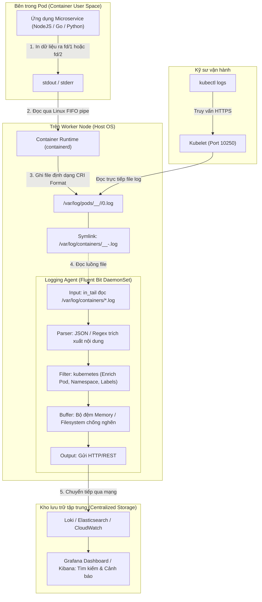

# Bài 37: Quản lý và tập trung hóa Log: stdout/stderr & Logging Agent

## 1. Thông tin bài học
* **Tên bài:** Bài 37: Quản lý và tập trung hóa Log: stdout/stderr & Logging Agent
* **Mục tiêu học:** Nắm vững nguyên lý cốt lõi của kiến trúc ghi nhận nhật ký (Logging) trong Kubernetes theo chuẩn Twelve-Factor App; hiểu cặn kẽ hành trình của một dòng log từ hàm `printf`/`console.log` qua `stdout`/`stderr`, qua Container Runtime (containerd) ghi xuống đĩa cứng của Node theo định dạng CRI Log Format, cho đến khi hiển thị qua lệnh `kubectl logs`; phân biệt và lựa chọn chính xác giữa 3 mô hình logging: Node-level Logging Agent (DaemonSet), Sidecar Streaming Container, và Direct Application Push; làm chủ công cụ **Fluent Bit** (dự án CNCF Tốt nghiệp - Graduated) siêu nhẹ viết bằng C; hiểu cơ chế bộ lọc Kubernetes Filter tự động "làm giàu" dữ liệu (Metadata Enrichment) gắn nhãn Pod/Namespace vào log; thực hành triển khai Fluent Bit thu thập và phân tích log có cấu trúc từ microservice trong Google Online Boutique.
* **Thời lượng ước tính:** 180 phút (90 phút lý thuyết, 90 phút thực hành)
* **Kiến thức cần có trước:** Bài 06 (Pod multi-container), Bài 26 (DaemonSet & Phân bổ Pod trên Node), Bài 36 (Kiểm toán Audit Log & Falco).
* **Liên quan kỳ thi:** CKA, CKAD (Các bài thi luôn yêu cầu thành thạo lệnh `kubectl logs`, xem log container đã chết bằng `kubectl logs -p`, cấu hình Sidecar container để stream file log nội bộ ra stdout, và xử lý sự cố Logging Agent trên Node).

---

## 2. Bảng thuật ngữ

| Thuật ngữ | Giải thích đơn giản | Ví dụ / Ẩn dụ đời thường |
| :--- | :--- | :--- |
| **stdout / stderr** | Luồng xuất chuẩn (Standard Output - kênh 1) và luồng báo lỗi chuẩn (Standard Error - kênh 2) mặc định của mọi tiến trình hệ điều hành. | Ống xả khói chính và ống xả phụ của một cỗ máy: khí thải bình thường đi ống chính, cảnh báo khẩn cấp đi ống phụ. |
| **CRI Log Format** | Định dạng chuẩn hóa mà containerd dùng để đóng gói từng dòng log ghi xuống ổ đĩa của Node (`timestamp stream logtag message`). | Con dấu ngày tháng và tem phân loại dán trên phong bì thư trước khi bỏ vào thùng thư bưu điện. |
| **Node-level Logging Agent** | Một tiến trình chuyên thu gom log chạy nền trên mỗi Node (dưới dạng DaemonSet), đọc toàn bộ file log của mọi Pod trên Node đó rồi đẩy về kho lưu trữ. | Người lao công đi gom toàn bộ thùng rác ở từng căn hộ trên một tầng chung cư mang về xe rác tập trung của thành phố. |
| **Sidecar Streaming** | Container phụ chạy cùng Pod, đọc file log riêng của ứng dụng chính rồi in thẳng ra `stdout` để hệ thống tự thu gom. | Người trợ lý ngồi bên cạnh ghi chép lại lời nói của giám đốc từ cuốn sổ tay rồi đọc to qua loa phóng thanh. |
| **Fluent Bit** | Công cụ thu thập, lọc và chuyển tiếp log mã nguồn mở siêu nhẹ (viết bằng C) của CNCF, tiêu tốn cực ít CPU và RAM (~20-40MB). | Chiếc xe máy tay ga chở hàng siêu tốc, luồn lách tiết kiệm xăng thay vì chiếc xe tải cồng kềnh (Fluentd / Logstash). |
| **Metadata Enrichment** | Quá trình tự động tra cứu và gắn thêm thông tin ngữ cảnh (Pod name, Namespace, Node, Labels) vào từng dòng log thô. | Bưu tá nhìn mã bưu kiện rồi tự tay dán thêm tên người gửi, số căn hộ, số điện thoại lên bưu phẩm trước khi chuyển đi. |
| **Log Rotation** | Cơ chế tự động cắt nhỏ, xoay vòng và xóa bớt các file log cũ khi đạt giới hạn dung lượng để bảo vệ ổ đĩa không bị đầy tràn. | Đổ bớt giấy lộn trong ngăn kéo bàn làm việc khi ngăn kéo đã kẹt cứng không thể nhét thêm. |
| **Structured Logging** | Cách lập trình in log dưới dạng chuỗi JSON có cấu trúc rõ ràng (`{"level":"info","msg":"user login","userId":42}`) thay vì chuỗi văn bản tự do. | Bảng biểu Excel có các cột rõ ràng thay vì một bức thư viết tay nguệch ngoạc. |

---

## 3. Bức tranh lớn: Vấn đề thực tế và ẩn dụ đời thường

### Nhắc lại bài trước
Ở Bài 36, chúng ta đã cấu hình Audit Log để ghi vết mọi hành vi gọi API vào Control Plane và triển khai Falco để phát hiện các mối đe dọa bất thường ở tầng Linux Kernel runtime. Tuy nhiên, Audit Log và Falco chỉ phản ánh góc nhìn bảo mật hạ tầng; khi ứng dụng nghiệp vụ gặp sự cố (ví dụ khách hàng bấm nút "Thanh toán" nhưng bị báo lỗi 500 hoặc giỏ hàng trống trơn), chúng ta cần một lăng kính quan sát trực tiếp bên trong ứng dụng: đó chính là **Hệ thống Quản lý Nhật ký tập trung (Centralized Logging)** - trụ cột đầu tiên của Bộ ba Quan sát hệ thống (Observability: Logs, Metrics, Traces).

### Tại sao cần cái này ở production? (Vấn đề thực tế)

1. **Bản chất "Phù du" của Container (Ephemeral Nature):**
   Trong thế giới ảo hóa truyền thống, máy chủ ảo (VM) sống nhiều năm, file log nằm cố định tại `/var/log/my-app.log`. Nhưng trong Kubernetes, Pod có thể bị sập (CrashLoopBackOff), bị bộ quản lý bộ nhớ tiêu diệt (OOMKilled), hoặc bị HPA tự động xóa bớt (Scale Down) bất kỳ lúc nào. Khi Pod bị hủy, toàn bộ hệ thống tệp tạm thời của container sẽ bốc hơi vĩnh viễn! Nếu log chỉ lưu bên trong container, bạn sẽ hoàn toàn mất trắng dữ liệu hiện trường để điều tra nguyên nhân sự cố.

2. **Thảm họa "Mò kim đáy bể" trên cụm 50 Node:**
   Giả sử cụm Production của bạn có 50 Worker Node chạy 600 Pod của 20 microservices khác nhau. Một khách hàng VIP khiếu nại rằng giao dịch của họ bị trừ tiền 2 lần vào lúc 14:02. Không lẽ bạn phải mở 50 cửa sổ terminal, kết nối SSH vào từng máy chủ vật lý, hoặc gõ 600 lệnh `kubectl logs` vào từng Pod để đoán xem Pod nào đã xử lý giao dịch đó? Điều này là hoàn toàn bất khả thi. Bạn bắt buộc phải có một nơi gom toàn bộ log về một kho dữ liệu duy nhất để tìm kiếm theo `transactionId` chỉ trong 1 giây!

3. **Sự hỗn loạn của Log văn bản thô (Unstructured Logs):**
   Một lập trình viên in: `2026-10-09 INFO: User 123 login success`.  
   Lập trình viên khác in: `[SUCCESS] - Logged in: 123 at 09/10/2026`.  
   Lập trình viên Java in ra cả một đoạn Stack Trace dài 50 dòng vì lỗi NullPointerException.  
   Nếu các dòng log này không được phân tích cú pháp (Parse), gắn nhãn siêu dữ liệu (Namespace, Pod, Service) và gom các dòng lỗi dài lại với nhau, hệ thống giám sát sẽ bị quá tải bởi dữ liệu rác không thể lọc hay vẽ biểu đồ cảnh báo.

### Ẩn dụ đời thường: Khu đô thị thông minh và Quy trình xử lý rác thải

Hãy hình dung cụm Kubernetes như một **Khu đô thị chung cư cao cấp với 1.000 căn hộ**:

* **Mỗi Container ứng dụng = Một căn hộ gia đình:** Hàng ngày, các hoạt động sinh hoạt đều tạo ra rác thải (dòng log).
* **Nguyên tắc Twelve-Factor App = Quy định phân loại rác tại nguồn:** Cư dân không được phép đào hố chôn rác trong phòng ngủ (không tự tạo file log riêng rẽ trên ổ cứng container), mà bắt buộc phải mở nắp họng rác chung của căn hộ và vứt rác xuống (`stdout` và `stderr`).
* **Container Runtime (containerd) & Kubelet = Hệ thống ống dẫn rác tòa nhà:** Mọi túi rác rơi xuống ống dẫn đều được dán sẵn một nhãn niêm phong ghi rõ giờ giấc, và được chứa tạm tại kho tập kết rác dưới tầng hầm của tòa nhà (`/var/log/pods/` trên Worker Node).
* **Lệnh `kubectl logs` = Quản lý tòa nhà xuống kho rác xem tạm:** Bạn gọi ban quản lý yêu cầu mang túi rác của căn hộ số 402 ra xem hôm nay gia đình đó vứt những gì. Nếu căn hộ vừa bị cháy (container crash), bạn xin xem túi rác cũ trước khi cháy (`kubectl logs -p`).
* **Logging Agent (Fluent Bit DaemonSet) = Đội xe vệ sinh môi trường chuyên dụng:** Cứ mỗi tòa nhà luôn có một chiếc xe vệ sinh túc trực. Người công nhân nhặt từng túi rác, đọc mã căn hộ, dán thêm thông tin chủ hộ (Metadata: Tầng 4, Họ tên chủ nhà, Số điện thoại), nghiền nhỏ và phân loại rác (Parsing JSON), rồi chở thẳng về **Nhà máy xử lý rác tập trung của thành phố (Elasticsearch / Loki)**. Tại nhà máy, bất kỳ ai cũng có thể tra cứu lịch sử rác thải của toàn thành phố theo thời gian thực!

---

## 4. Giải thích khái niệm theo từng bước

### Cơ chế hoạt động của một dòng Log trong Kubernetes

Toàn bộ chuỗi vận chuyển log từ mã nguồn ứng dụng đến công cụ phân tích tập trung được mô tả qua sơ đồ sau:



---

### Phân tích chi tiết

#### 1. Định dạng CRI Log Format (Bên dưới nắp ca-pô của Kubelet)
Khi containerd nhận dữ liệu từ `stdout`/`stderr` của container, nó sẽ bọc dòng văn bản đó vào định dạng chuẩn CRI trước khi ghi xuống file:

```text
2026-10-09T07:15:30.123456789Z stdout F {"level":"info","message":"Order checkout completed","userId":9981}
```

Mỗi dòng log bao gồm 4 phần ngăn cách bởi dấu cách:
1. **Timestamp:** Thời gian chính xác đến nano-giây theo chuẩn UTC ISO 8601 (`2026-10-09T07:15:30.123456789Z`).
2. **Stream:** Kênh xuất dữ liệu, nhận giá trị `stdout` hoặc `stderr`.
3. **Log Tag:** Nhãn phân đoạn dòng log:
   * `F` (Full): Dòng log hoàn chỉnh (nằm trọn vẹn trên 1 dòng).
   * `P` (Partial): Dòng log quá dài (vượt quá 16KB), containerd phải cắt nhỏ thành nhiều phần. Dòng cuối cùng của chuỗi dài này sẽ mang nhãn `F`.
4. **Log Content:** Nội dung thực tế mà ứng dụng in ra.

#### 2. Vị trí lưu trữ file log trên Node
Trên mỗi Worker Node, Kubelet và containerd tổ chức lưu trữ log tại hai vị trí:
* **Thư mục gốc:** `/var/log/pods/<namespace>_<pod_name>_<pod_uid>/<container_name>/<restart_count>.log`
* **Thư mục liên kết mềm (Symlink):** `/var/log/containers/<pod_name>_<namespace>_<container_name>-<container_id>.log` trỏ về file thực tế trong `/var/log/pods/`. Các công cụ như Fluent Bit chỉ cần trỏ vào `/var/log/containers/*.log` là có thể quét toàn bộ log của Node một cách dễ dàng.

#### 3. Bí mật đằng sau lệnh `kubectl logs`
* Khi bạn gõ `kubectl logs my-pod`, lệnh này gửi yêu cầu HTTPS tới `kube-apiserver`.
* `kube-apiserver` chuyển tiếp (proxy) yêu cầu tới Kubelet trên Node mà Pod đang cư ngụ (qua cổng `10250`).
* Kubelet mở trực tiếp file `/var/log/pods/.../0.log` trên đĩa cứng của Node, đọc và truyền dữ liệu (stream) ngược về terminal của bạn.
* **Lệnh `kubectl logs -p` (previous):** Khi một Pod bị restart (ví dụ `restartCount = 1`), Kubelet không xóa file log cũ ngay lập tức mà lưu nó thành file trước đó. Khi thêm cờ `-p`, Kubelet sẽ đọc file log của lần chạy trước đó, giúp bạn tìm ra nguyên nhân chính xác vì sao container bị crash!

---

### So sánh 3 Kiến trúc gom Log trong Kubernetes

Có 3 cách chính để đưa log từ ứng dụng ra hệ thống giám sát tập trung. Một Platform Engineer giỏi phải biết rõ ưu/nhược điểm của từng cách:

| Tiêu chí so sánh | 1. Node-level Agent (DaemonSet) | 2. Sidecar Streaming Container | 3. Direct Application Push |
| :--- | :--- | :--- | :--- |
| **Cách hoạt động** | Chạy 1 Pod Logging Agent (Fluent Bit) duy nhất trên mỗi Node, đọc toàn bộ `/var/log/containers/*.log`. | Chạy thêm 1 container phụ bên trong mỗi Pod, dùng lệnh `tail -F` đọc file log riêng của app rồi đẩy ra `stdout`. | Ứng dụng tích hợp SDK (TCP/HTTP) tự gửi log trực tiếp qua mạng về kho Loki/Elasticsearch. |
| **Mức tiêu tốn tài nguyên** | **Cực thấp & Ổn định:** 1 Agent phục vụ hàng chục Pod trên Node. Tiết kiệm RAM/CPU tối đa. | **Tốn kém:** Mỗi Pod phải gánh thêm 1 container sidecar. Nhân đôi số lượng container trong cụm. | **Tiềm ẩn rủi ro:** Ứng dụng phải tốn luồng xử lý (threads) và RAM để đệm và gửi log qua mạng. |
| **Độ trong suốt với App** | Hoàn toàn trong suốt: Lập trình viên chỉ cần in ra `stdout`/`stderr`, không cần cài thêm thư viện. | Phù hợp với các ứng dụng di sản (Legacy) không hỗ trợ in ra `stdout` mà chỉ ghi ra file đĩa. | Phải can thiệp vào mã nguồn, gắn chặt ứng dụng với một công nghệ lưu trữ log cụ thể. |
| **Khi mạng bị nghẽn/đứt** | Không ảnh hưởng đến ứng dụng; Agent tự đệm (buffer) dữ liệu trên đĩa của Node. | Không ảnh hưởng đến luồng chính của ứng dụng. | **Nguy hiểm:** Ứng dụng có thể bị nghẽn (Blocking/Timeout) hoặc sập nếu kho log từ chối kết nối. |
| **Khuyến nghị sử dụng** | ✅ **Chuẩn mực công nghiệp hàng đầu (Best Practice)** cho 95% ứng dụng Cloud Native. | Dùng cho ứng dụng cũ (như Nginx, Tomcat cấu hình ghi nhiều file log riêng biệt). | ❌ Không khuyến nghị cho microservices hiện đại. |

---

### Mổ xẻ Đường ống xử lý 5 pha của Fluent Bit

Fluent Bit trở thành tiêu chuẩn vàng nhờ thiết kế hướng đường ống (Pipeline Architecture) cực kỳ tinh gọn:


1. **INPUT (`in_tail`):** Quét và đọc liên tục các dòng mới xuất hiện trong các file `/var/log/containers/*.log` (hoạt động giống lệnh `tail -f`).
2. **PARSER:** Bóc tách định dạng CRI log để lấy ra nội dung JSON hoặc văn bản thô bên trong.
3. **FILTER (`kubernetes`):** Trái tim của Fluent Bit. Bộ lọc này trích xuất tên Pod, Namespace từ tên file log, sau đó tra cứu vào bộ nhớ đệm (Cache) để bổ sung thêm các trường:
   * `kubernetes.pod_name`
   * `kubernetes.namespace_name`
   * `kubernetes.labels.*`
   * `kubernetes.pod_id`
4. **BUFFER:** Lưu tạm các gói log vào RAM (hoặc đĩa cứng). Nếu kho lưu trữ phía sau bị chậm hoặc mất kết nối, bộ đệm sẽ giữ log lại và thử lại tự động (Retry Mechanism), ngăn chặn tình trạng mất mát dữ liệu.
5. **OUTPUT:** Chuyển tiếp các gói log hoàn chỉnh tới đích đến (Stdout, Grafana Loki, Elasticsearch, OpenSearch, AWS CloudWatch).

---

## 5. Thực hành (Lab)

* **Môi trường:** Cluster kind (`microservices-demo\k8s\kind-config.yaml`) gồm 1 control-plane và 1 worker node.
* **Mức RAM ước tính:** ~120 MB (Cực kỳ nhẹ nhàng, chiếm chưa đầy 3% giới hạn 4GB của WSL2).

---

### Bước 1: Khám phá cách Kubelet lưu trữ Log thật trên Node

Hãy cùng "chui" vào bên trong Worker Node của cụm kind để tận mắt kiểm chứng cách Linux và containerd lưu giữ log:

```powershell
# 1. Liet ke cac file log container tren worker node
docker exec lab-worker ls -la /var/log/containers | Select-Object -First 10
```

**Kết quả mong đợi:**
Bạn sẽ thấy một loạt các liên kết mềm (Symlinks) có định dạng:
```text
lrwxrwxrwx 1 root root  105 Oct  9 07:00 kube-proxy-lab-worker_kube-system_kube-proxy-...log -> /var/log/pods/kube-system_kube-proxy-.../kube-proxy/0.log
```

Xem nội dung thực tế của một file log để thấy định dạng CRI Log Format:
```powershell
docker exec lab-worker head -n 3 /var/log/pods/kube-system_kube-proxy-*/kube-proxy/0.log
```

**Kết quả mong đợi:**
```text
2026-10-09T07:00:15.123456789Z stderr F I1009 07:00:15.123456       1 server.go:498] "Using iptables Proxier"
```

---

### Bước 2: Triển khai Microservice in Log JSON có cấu trúc

Tạo một Namespace `logging-lab` và triển khai một Pod giả lập microservice `checkoutservice` liên tục in các giao dịch thanh toán dạng JSON chuẩn Twelve-Factor ra `stdout`:

```powershell
@'
apiVersion: v1
kind: Namespace
metadata:
  name: logging-lab
---
apiVersion: v1
kind: Pod
metadata:
  name: mock-checkout
  namespace: logging-lab
  labels:
    app: checkoutservice
    tier: backend
    env: production
spec:
  containers:
  - name: checkout
    image: busybox:1.36
    command: ["/bin/sh", "-c"]
    args:
    - |
      while true; do
        ORDER_ID=$(date +%s)
        AMOUNT=$((RANDOM % 500 + 10))
        # In log JSON chuan ra stdout
        echo "{\"level\":\"info\",\"service\":\"checkoutservice\",\"orderId\":$ORDER_ID,\"amount\":$AMOUNT,\"currency\":\"USD\",\"status\":\"SUCCESS\"}"
        sleep 2
      done
    resources:
      requests:
        memory: "16Mi"
        cpu: "10m"
      limits:
        memory: "32Mi"
        cpu: "25m"
'@ | kubectl apply -f -

kubectl wait --for=condition=Ready pod/mock-checkout -n logging-lab --timeout=60s
```

Kiểm tra log của Pod bằng lệnh `kubectl`:
```powershell
kubectl logs mock-checkout -n logging-lab --tail=3
```

**Kết quả mong đợi:**
```text
{"level":"info","service":"checkoutservice","orderId":1760000001,"amount":125,"currency":"USD","status":"SUCCESS"}
{"level":"info","service":"checkoutservice","orderId":1760000003,"amount":340,"currency":"USD","status":"SUCCESS"}
{"level":"info","service":"checkoutservice","orderId":1760000005,"amount":85,"currency":"USD","status":"SUCCESS"}
```

---

### Bước 3: Diễn tập tình huống Container Crash và sử dụng `kubectl logs -p`

Bây giờ, chúng ta sẽ mô phỏng một sự cố kinh điển: Container bị lỗi và tự sập để xem cơ chế lưu log của lần chạy trước:

```powershell
@'
apiVersion: v1
kind: Pod
metadata:
  name: crashing-app
  namespace: logging-lab
spec:
  restartPolicy: Always
  containers:
  - name: app
    image: busybox:1.36
    command: ["/bin/sh", "-c"]
    args:
    - |
      echo "=== [LOG KHOI DONG] Ung dung dang ket noi co so du lieu... ==="
      sleep 2
      echo "=== [LOG NGUY HIEM] LOI KET NOI DATABASE TIMEOUT! TIEN TRINH SAP! ==="
      exit 1
    resources:
      limits:
        memory: "16Mi"
        cpu: "20m"
'@ | kubectl apply -f -

# Cho container crash va restart it nhat 1 lan (khoang 10-15 giay)
Start-Sleep -Seconds 12
kubectl get pod crashing-app -n logging-lab
```

Xem log của phiên bản container vừa bị crash bằng cờ `-p` (`--previous`):
```powershell
kubectl logs crashing-app -n logging-lab -p
```

**Kết quả mong đợi:**
```text
=== [LOG KHOI DONG] Ung dung dang ket noi co so du lieu... ===
=== [LOG NGUY HIEM] LOI KET NOI DATABASE TIMEOUT! TIEN TRINH SAP! ===
```

> [!TIP]
> Cờ `-p` là "bảo bối" không thể thiếu trong túi đồ nghề của một SRE/DevOps. Bất cứ khi nào Pod bị `CrashLoopBackOff` hoặc `Error`, hãy gõ ngay `kubectl logs <pod> -p` để đọc dòng trăn trối cuối cùng của ứng dụng trước khi chết!

---

### Bước 4: Soạn thảo cấu hình Fluent Bit siêu nhẹ (Bản rút gọn cho 8GB RAM)

Chúng ta cấu hình một DaemonSet Fluent Bit cực nhẹ (~30MB RAM). Fluent Bit sẽ:
1. Đọc file log của `mock-checkout` từ `/var/log/containers/mock-checkout*.log`.
2. Sử dụng bộ lọc `kubernetes` để tự động tra cứu nhãn (`labels`) và tên namespace.
3. Xuất log đã được định dạng và làm giàu (Enriched) ra `stdout` của DaemonSet để chúng ta quan sát.

Tạo tệp cấu hình `fluent-bit-config.yaml`:

```powershell
@'
apiVersion: v1
kind: ConfigMap
metadata:
  name: fluent-bit-config
  namespace: logging-lab
data:
  fluent-bit.conf: |
    [SERVICE]
        Flush         1
        Log_Level     info
        Daemon        off
        Parsers_File  parsers.conf

    [INPUT]
        Name              tail
        Tag               kube.*
        Path              /var/log/containers/mock-checkout*.log
        Parser            docker
        DB                /var/log/flb_kube.db
        Mem_Buf_Limit     5MB
        Skip_Long_Lines   On
        Refresh_Interval  2

    [FILTER]
        Name                kubernetes
        Match               kube.*
        Kube_URL            https://kubernetes.default.svc:443
        Kube_CA_File        /var/run/secrets/kubernetes.io/serviceaccount/ca.crt
        Kube_Token_File     /var/run/secrets/kubernetes.io/serviceaccount/token
        Kube_Tag_Prefix     kube.var.log.containers.
        Merge_Log           On
        Merge_Log_Key       log_processed
        Keep_Log            Off
        K8S-Logging.Parser  On
        K8S-Logging.Exclude Off

    [OUTPUT]
        Name   stdout
        Match  kube.*
        Format json_lines

  parsers.conf: |
    [PARSER]
        Name        docker
        Format      json
        Time_Key    time
        Time_Format %Y-%m-%dT%H:%M:%S.%L
        Time_Keep   On
'@ | kubectl apply -f -
```

---

### Bước 5: Triển khai ServiceAccount, RBAC và DaemonSet Fluent Bit

Để Fluent Bit có quyền hỏi API Server về nhãn và namespace của Pod, chúng ta cần cấp quyền `ClusterRole` (áp dụng kiến thức Bài 30 & 31):

```powershell
@'
apiVersion: v1
kind: ServiceAccount
metadata:
  name: fluent-bit
  namespace: logging-lab
---
apiVersion: rbac.authorization.k8s.io/v1
kind: ClusterRole
metadata:
  name: fluent-bit-read
rules:
- apiGroups: [""]
  resources: ["pods", "namespaces"]
  verbs: ["get", "list", "watch"]
---
apiVersion: rbac.authorization.k8s.io/v1
kind: ClusterRoleBinding
metadata:
  name: fluent-bit-read-binding
roleRef:
  apiGroup: rbac.authorization.k8s.io
  kind: ClusterRole
  name: fluent-bit-read
subjects:
- kind: ServiceAccount
  name: fluent-bit
  namespace: logging-lab
---
apiVersion: apps/v1
kind: DaemonSet
metadata:
  name: fluent-bit
  namespace: logging-lab
spec:
  selector:
    matchLabels:
      name: fluent-bit
  template:
    metadata:
      labels:
        name: fluent-bit
    spec:
      serviceAccountName: fluent-bit
      containers:
      - name: fluent-bit
        image: cr.fluentbit.io/fluent/fluent-bit:2.2.2
        resources:
          requests:
            memory: "30Mi"
            cpu: "20m"
          limits:
            memory: "60Mi"
            cpu: "50m"
        volumeMounts:
        - name: varlog
          mountPath: /var/log
        - name: varlibdockercontainers
          mountPath: /var/lib/docker/containers
          readOnly: true
        - name: config
          mountPath: /fluent-bit/etc/
      volumes:
      - name: varlog
        hostPath:
          path: /var/log
      - name: varlibdockercontainers
        hostPath:
          path: /var/lib/docker/containers
      - name: config
        configMap:
          name: fluent-bit-config
'@ | kubectl apply -f -

# Cho Fluent Bit DaemonSet san sang
kubectl rollout status daemonset/fluent-bit -n logging-lab --timeout=90s
```

---

### Bước 6: Kiểm chứng Dữ liệu Log đã được "Làm giàu" (Enriched Metadata)

Xem log của Pod Fluent Bit trên Worker Node để xem thành phẩm cuối cùng:

```powershell
# Lay ten Pod Fluent Bit dang chay tren Worker Node
$flbPod = (kubectl get pods -n logging-lab -l name=fluent-bit -o jsonpath='{.items[0].metadata.name}')

# Xem 2 ban ghi log ma Fluent Bit da xu ly
kubectl logs $flbPod -n logging-lab --tail=2
```

**Kết quả mong đợi:**
Một đối tượng JSON hoàn chỉnh, bao gồm cả nội dung nghiệp vụ lẫn toàn bộ ngữ cảnh Kubernetes:
```json
{
  "date": 1760000010.123,
  "log_processed": {
    "level": "info",
    "service": "checkoutservice",
    "orderId": 1760000010,
    "amount": 250,
    "currency": "USD",
    "status": "SUCCESS"
  },
  "kubernetes": {
    "pod_name": "mock-checkout",
    "namespace_name": "logging-lab",
    "pod_id": "8f3b21-...",
    "labels": {
      "app": "checkoutservice",
      "env": "production",
      "tier": "backend"
    },
    "host": "lab-worker",
    "container_name": "checkout",
    "docker_id": "a98c..."
  }
}
```

> [!NOTE]
> **Điều kỳ diệu ở đây là gì?**  
> Ứng dụng ban đầu chỉ in một dòng ngắn: `{"orderId":1760000010,...}`. Nhưng khi đi qua Fluent Bit, dòng log này đã được tự động gắn thêm:
> * Chạy trên Pod nào? $\rightarrow$ `mock-checkout`
> * Nằm trong Namespace nào? $\rightarrow$ `logging-lab`
> * Node nào đang chứa nó? $\rightarrow$ `lab-worker`
> * Các nhãn phân loại là gì? $\rightarrow$ `app: checkoutservice`, `env: production`  
> Nhờ đó, khi đổ về Grafana hoặc Elasticsearch, bạn có thể dễ dàng truy vấn: *"Lọc tất cả log lỗi của ứng dụng `checkoutservice` trên môi trường `production`"* chỉ bằng một cú click chuột!

---

### Bước 7: Dọn dẹp tài nguyên (Cleanup)

Xóa namespace thực hành để giải phóng hoàn toàn RAM cho máy:

```powershell
kubectl delete namespace logging-lab --ignore-not-found
kubectl delete clusterrole fluent-bit-read --ignore-not-found
kubectl delete clusterrolebinding fluent-bit-read-binding --ignore-not-found
```

Kiểm tra xác nhận tài nguyên đã được giải phóng:
```powershell
kubectl get pods -A | grep logging-lab
```

---

## 6. Lỗi thường gặp và cách debug

### Lỗi 1: Container in log ra file riêng thay vì `stdout`, lệnh `kubectl logs` trả về rỗng
* **Dấu hiệu:** Ứng dụng đang xử lý hàng nghìn request, nhưng khi gõ `kubectl logs <pod>` màn hình hoàn toàn trống không.
* **Nguyên nhân:** Các ứng dụng truyền thống (như cấu hình mặc định của Nginx, Apache, Tomcat) thường ghi nhật ký vào file đĩa cứng như `/var/log/nginx/access.log`. Kubelet chỉ đọc từ luồng `stdout`/`stderr`, nên không hề biết sự tồn tại của file này.
* **Cách debug và sửa:**
  * **Cách chuẩn Twelve-Factor:** Cấu hình ứng dụng in trực tiếp ra `/dev/stdout` và `/dev/stderr`. Trong Dockerfile của Nginx chính thức, họ giải quyết bằng cách tạo symlink:
    ```dockerfile
    RUN ln -sf /dev/stdout /var/log/nginx/access.log \
     && ln -sf /dev/stderr /var/log/nginx/error.log
    ```
  * **Cách Sidecar Streaming (nếu không thể sửa Dockerfile):** Thêm một container phụ nhẹ bên trong Pod chạy lệnh `tail -F /var/log/app.log` để truyền log ra ngoài.

---

### Lỗi 2: Tràn ổ đĩa Worker Node (DiskPressure) do Log tích tụ
* **Dấu hiệu:** Worker Node chuyển sang trạng thái `DiskPressure`, các Pod mới không thể lập lịch được, và một số Pod bị đánh văng trạng thái `Evicted`.
* **Nguyên nhân:** Ứng dụng in log với tần suất quá lớn (hàng triệu dòng lỗi mỗi phút) trong khi cơ chế xoay vòng log (Log Rotation) của Kubelet chưa được cấu hình chặt chẽ.
* **Cách debug và sửa:**
  * Kiểm tra dung lượng thư mục `/var/log/pods` trên Node:
    ```powershell
    docker exec lab-worker du -sh /var/log/pods
    ```
  * Cấu hình tham số xoay vòng log trong tệp cấu hình Kubelet (`/var/lib/kubelet/config.yaml`):
    ```yaml
    containerLogMaxSize: 10Mi    # Cắt file khi đạt 10MB
    containerLogMaxFiles: 5      # Chỉ giữ tối đa 5 file cũ nhất cho mỗi container
    ```

---

### Lỗi 3: Fluent Bit làm quá tải API Server (API Throttling / High CPU)
* **Dấu hiệu:** Control Plane bị chậm, `kube-apiserver` sử dụng CPU tăng đột biến lên 100%, log của `kube-apiserver` xuất hiện hàng loạt lỗi HTTP 429 (Too Many Requests).
* **Nguyên nhân:** Bộ lọc `kubernetes` trong Fluent Bit mặc định phải gọi API Server để tra cứu metadata cho từng container. Khi số lượng Pod tăng cao hoặc Pod liên tục khởi động lại, hàng trăm Logging Agent gửi yêu cầu dồn dập khiến API Server bị nghẽn.
* **Cách debug và sửa:**
  * Luôn bật cơ chế bộ đệm cục bộ (Local Caching) trong cấu hình `[FILTER]` của Fluent Bit:
    ```ini
    [FILTER]
        Name                kubernetes
        Kube_URL_Cache_TTL  60m     # Cache metadata trong 60 phut thay vi goi API lien tuc
        Kube_Meta_Preload   On      # Tai truoc danh sach Pod
    ```

---

## 7. Góc nhìn Senior

### 1. Sự đánh đổi (Trade-offs)

| Chiến lược Logging | Điểm mạnh (Ưu điểm) | Đánh đổi (Hạn chế) | Khi nào nên chọn? |
| :--- | :--- | :--- | :--- |
| **In log dạng JSON (Structured)** | Dễ dàng parse tự động, tìm kiếm cực nhanh, vẽ dashboard biểu đồ chính xác theo từng trường (`userId`, `duration`). | Dung lượng file log tăng khoảng 20-30% so với text thô do phải chứa các cặp key-value; khó đọc bằng mắt thường nếu không có công cụ format. | **Bắt buộc 100%** cho mọi microservices hiện đại chạy trên môi trường Production. |
| **In log dạng Text thô (Unstructured)** | Lập trình viên viết rất nhanh (`printf("User logged in")`), dung lượng nhẹ, dễ đọc lướt bằng mắt thường trên terminal. | Cực khó viết regex để bóc tách; hệ thống tốn nhiều CPU để parse; không thể lọc dữ liệu chính xác ở quy mô lớn. | Chỉ chấp nhận trên môi trường phát triển (Local Dev) hoặc các script chạy một lần. |
| **DaemonSet (Node Agent)** | Tiết kiệm tài nguyên cụm tối đa; quản lý cấu hình tập trung; ứng dụng không bị ảnh hưởng nếu mạng chậm. | Không tùy biến cấu hình riêng cho từng ứng dụng được; phải cấp quyền truy cập file trên Host cho Agent. | Lựa chọn tiêu chuẩn của mọi Platform Team. |
| **Sidecar Pattern** | Cấu hình độc lập cho từng Pod; xử lý tốt ứng dụng cũ ghi nhiều file log riêng rẽ. | Tiêu tốn thêm tài nguyên Pod; quản lý nhiều container hơn. | Chỉ dùng khi ứng dụng bắt buộc phải ghi ra nhiều file log có định dạng khác nhau. |

---

### 2. Best practices tại production

1. **Tuyệt đối không in thông tin PII và Bí mật (Data Masking / Redaction):**
   Mật khẩu, số thẻ tín dụng (CVV, thẻ ngân hàng), số Căn cước công dân hoặc Private Keys không bao giờ được xuất hiện trong log. Sử dụng bộ lọc của Fluent Bit hoặc thư viện ứng dụng để băm hoặc che mờ (masking: `****-****-****-1234`) trước khi đẩy ra `stdout`.
2. **Nguyên tắc In log một dòng (Single-line Logging):**
   Trong môi trường đa luồng (multi-threaded), nếu ứng dụng in một đoạn lỗi (Stack Trace) thành 50 dòng riêng biệt, Kubelet và containerd sẽ coi đó là 50 sự kiện độc lập. Hậu quả là các dòng lỗi của nhiều request khác nhau sẽ bị trộn lẫn vào nhau tạo thành "mớ bòng bong".  
   $\rightarrow$ Luôn cấu hình thư viện ghi log gom toàn bộ Stack Trace thành một chuỗi duy nhất bên trong trường `stack_trace` của JSON object, hoặc dùng bộ lọc `multiline` của Fluent Bit để ghép dòng.
3. **Phân tầng lưu trữ theo vòng đời (Log Tiering & Retention):**
   Không ai có đủ ngân sách để lưu giữ toàn bộ log chi tiết (DEBUG/INFO) trên ổ đĩa SSD đắt đỏ trong 1 năm!  
   * **Hot Storage (0 - 7 ngày):** Lưu trên cụm Loki/Elasticsearch bằng ổ NVMe để kỹ sư tìm kiếm và xử lý sự cố tức thì.
   * **Warm/Cold Storage (8 - 90 ngày):** Tự động nén và đẩy lên Object Storage giá rẻ (AWS S3, Google Cloud Storage, MinIO).
   * **Xóa bỏ (> 90 ngày):** Tự động dọn dẹp các log thông thường, chỉ giữ lại Audit Log phục vụ tuân thủ pháp lý.

---

### 3. Câu hỏi phỏng vấn Senior

* **Câu hỏi 1:** *Trong hệ thống của chúng ta, một container NodeJS thỉnh thoảng bị khởi động lại do lỗi ứng dụng. Kỹ sư trực gõ `kubectl logs` thì chỉ thấy log của lần khởi động mới toanh, không thấy nguyên nhân lỗi khiến container bị sập. Bạn sẽ hướng dẫn kỹ sư đó xử lý thế nào và giải thích bản chất bên dưới?*
  * **Gợi ý trả lời chuẩn:**
    1. **Thao tác ngay:** Hướng dẫn kỹ sư thêm cờ `-p` hoặc `--previous` vào lệnh: `kubectl logs <pod-name> -c <container-name> --previous`.
    2. **Bản chất kỹ thuật:** Kubelet quản lý các container thông qua Container Runtime. Khi một container bị restart, containerd không lập tức xóa file log của phiên bản cũ mà lưu nó lại trên đĩa cứng của Node dưới tên `<restart_count - 1>.log`. Cờ `--previous` ra lệnh cho Kubelet đọc file log của lần chạy liền trước đó, giúp ta xem được dòng log báo lỗi cuối cùng trước khi tiến trình thoát (`exit code != 0`).
    3. **Khuyến nghị kiến trúc:** Về lâu dài, không nên phụ thuộc vào lệnh `kubectl logs` thủ công. Cần triển khai Logging Agent tập trung (như Fluent Bit) để đẩy toàn bộ log về Loki/Elasticsearch theo thời gian thực. Ngay cả khi container bị xóa hoàn toàn khỏi cụm, log vẫn được lưu trữ an toàn để tra cứu sau sự cố.

* **Câu hỏi 2:** *Tại sao trong các cụm Kubernetes quy mô lớn (hàng trăm Node), Fluent Bit lại được ưu tiên lựa chọn hơn rất nhiều so với Fluentd hoặc Logstash?*
  * **Gợi ý trả lời chuẩn:** Sự khác biệt cốt lõi nằm ở **ngôn ngữ lập trình và kiến trúc tiêu tốn tài nguyên**:
    * **Logstash** viết bằng Java/JRuby: Yêu cầu máy ảo JVM, mỗi instance ngốn từ 500MB đến 1GB RAM và tốn nhiều CPU khi khởi động.
    * **Fluentd** viết bằng Ruby/C: Mỗi instance tiêu tốn khoảng 100MB - 200MB RAM.
    * **Fluent Bit** viết hoàn toàn bằng **C thuần túy (Native C)**, không phụ thuộc vào bất kỳ máy ảo nào: Mỗi instance chỉ tiêu tốn từ **15MB đến 40MB RAM** và lượng CPU tối thiểu (~1-2%).  
    Khi chạy ở quy mô 200 Worker Node dưới dạng DaemonSet, nếu dùng Logstash bạn sẽ lãng phí tới 200GB RAM chỉ để... gom log! Trong khi với Fluent Bit, bạn chỉ tốn chưa đầy 6GB RAM cho toàn cụm. Do đó, mô hình chuẩn của CNCF là dùng **Fluent Bit làm Agent thu gom tại biên (Edge Shipper)** trên từng Node, sau đó có thể chuyển tiếp về Fluentd hoặc lưu trực tiếp vào Loki/Elasticsearch.

---

## 8. Tóm tắt bài học

* 📌 **1. Chuẩn mực Twelve-Factor App:** Ứng dụng Cloud Native chỉ in log ra `stdout` và `stderr`; không tự quản lý hay ghi file log riêng rẽ trên ổ cứng của container.
* 📌 **2. Vòng đời của dòng Log:** Ứng dụng in ra `stdout` $\rightarrow$ containerd đọc qua Linux FIFO pipe $\rightarrow$ ghi xuống `/var/log/pods/` theo chuẩn CRI Log Format $\rightarrow$ Kubelet stream về khi gõ `kubectl logs`.
* 📌 **3. "Bảo bối" `--previous`:** Luôn nhớ lệnh `kubectl logs <pod> -p` để xem nguyên nhân khiến container trước đó bị sập khi gặp lỗi `CrashLoopBackOff`.
* 📌 **4. Ba mô hình Logging:** DaemonSet (Node-level Agent) là chuẩn mực tiết kiệm tài nguyên hàng đầu; Sidecar chỉ dùng cho app cũ ghi ra file riêng; Direct Push không nên dùng.
* 📌 **5. Sức mạnh của Fluent Bit:** Siêu nhẹ (viết bằng C, tốn ~30MB RAM), sở hữu pipeline 5 pha linh hoạt, đặc biệt là bộ lọc `kubernetes` tự động gắn nhãn (Metadata Enrichment) biến log thô thành dữ liệu có cấu trúc giá trị.

---

## 9. Bài tập tự làm

* 🟢 **Mức Dễ:** Viết manifest triển khai một Pod Nginx đơn giản. Sử dụng lệnh `kubectl exec` tạo vài lượt truy cập giả lập bằng `curl http://localhost`, sau đó dùng `kubectl logs` kiểm tra log truy cập xem IP client hiển thị ra sao.
* 🟡 **Mức Vừa:** Soạn thảo một Pod gồm 2 containers (Multi-container Pod theo mô hình Sidecar):
  * Container 1 (App): Ghi ngày tháng liên tục vào file cục bộ `/var/log/custom-app.log` trong một `emptyDir` volume.
  * Container 2 (Sidecar): Chạy lệnh `tail -n+1 -F /var/log/custom-app.log` để đưa toàn bộ nội dung file ra `stdout`.
  * Dùng `kubectl logs <pod> -c <sidecar>` kiểm chứng log hiển thị bình thường.
* 🔴 **Mức Khó:** Viết một đoạn cấu hình `[FILTER]` cho Fluent Bit sử dụng plugin `rewrite_tag` hoặc `grep` để:
  * Lọc và chỉ chuyển tiếp những dòng log có chứa trường `"status":"ERROR"` hoặc `"level":"error"`.
  * Loại bỏ hoàn toàn (Drop) các dòng log mang cấp độ `"level":"debug"` để tiết kiệm băng thông và dung lượng lưu trữ.

---

## 10. Câu hỏi tự kiểm tra

1. Nếu một ứng dụng chạy trong Pod ghi nhật ký trực tiếp vào file `/tmp/app.log` thay vì in ra `stdout`, lệnh `kubectl logs` có xem được file đó không? Tại sao?
2. Trong định dạng CRI Log Format (`timestamp stream logtag message`), nhãn `logtag` nhận giá trị `P` nghĩa là gì và xuất hiện trong trường hợp nào?
3. Tại sao các chuyên gia khuyến cáo KHÔNG NÊN để ứng dụng tự kết nối mạng và gửi log trực tiếp về Elasticsearch (Direct Application Push)?
4. Trong kiến trúc Fluent Bit, bộ lọc (Filter) `kubernetes` lấy thông tin về Pod Name, Namespace và Labels từ đâu để gắn vào dòng log?
5. Nếu một Worker Node bị cạn kiệt dung lượng đĩa do file log container quá lớn, bạn cần điều chỉnh những tham số nào trong cấu hình Kubelet để khắc phục dứt điểm?
6. Khi nào bạn bắt buộc phải sử dụng kiến trúc Sidecar Logging Container thay vì chỉ dựa vào Node-level DaemonSet?

<details>
<summary>👉 Bấm vào đây để xem đáp án câu hỏi tự kiểm tra</summary>

* **Câu 1:** Hoàn toàn KHÔNG. Lệnh `kubectl logs` hoạt động bằng cách yêu cầu Kubelet đọc từ các file log mà Container Runtime lưu trữ (vốn chỉ hứng từ file descriptor `1` - stdout và `2` - stderr của container). Kubelet không tự ý quét các file tùy ý bên trong filesystem của container.
* **Câu 2:** Giá trị `P` đại diện cho **Partial** (dòng log chưa hoàn chỉnh). Nó xuất hiện khi ứng dụng in ra một dòng log quá dài (vượt quá giới hạn bộ đệm 16KB của containerd), khiến runtime phải cắt dòng log đó thành nhiều mảnh nhỏ. Mảnh cuối cùng của dòng log dài này sẽ mang nhãn `F` (Full).
* **Câu 3:** Vì 3 lý do nguy hiểm:
  1. Gây nghẽn ứng dụng: Nếu mạng bị chập chờn hoặc cụm Elasticsearch bị quá tải, ứng dụng có thể bị treo (Blocking I/O) hoặc tăng độ trễ xử lý nghiệp vụ.
  2. Nguy cơ mất log: Nếu ứng dụng bị crash đột ngột, toàn bộ log đang nằm trong bộ đệm của ứng dụng chưa kịp gửi đi sẽ mất sạch.
  3. Gắn chặt mã nguồn: Ứng dụng bị phụ thuộc vào SDK của bên thứ ba, vi phạm nguyên tắc Twelve-Factor App.
* **Câu 4:** Fluent Bit trích xuất tên file log (vốn chứa tên Pod và Namespace theo quy ước đặt tên của Kubernetes), sau đó nó truy vấn vào **bộ nhớ đệm cục bộ (Cache)** hoặc gọi API Server của Kubernetes để tra cứu các nhãn (Labels) và Annotations tương ứng của Pod đó.
* **Câu 5:** Cần cấu hình 2 tham số trong `/var/lib/kubelet/config.yaml`:
  * `containerLogMaxSize`: Giới hạn kích thước tối đa của một file log trước khi bị cắt xoay vòng (ví dụ: `10Mi` hoặc `50Mi`).
  * `containerLogMaxFiles`: Số lượng file log xoay vòng tối đa được phép giữ lại cho mỗi container (ví dụ: `3` hoặc `5`).
* **Câu 6:** Khi bạn phải vận hành các **ứng dụng di sản (Legacy Application)** mà không thể chỉnh sửa mã nguồn hoặc Dockerfile, và ứng dụng đó bắt buộc phải ghi dữ liệu ra nhiều file log chuyên biệt trên đĩa (ví dụ một file `access.log` và một file `error.log` riêng biệt) thay vì in chung ra `stdout`.
</details>

---

## 11. Tài liệu đọc thêm và bài tiếp theo

### Tài liệu tham khảo
* [Tài liệu chính thức Kubernetes Docs: Logging Architecture](https://kubernetes.io/docs/concepts/cluster-administration/logging/)
* [Tài liệu chính thức Fluent Bit Docs: Kubernetes Filter & Pipeline](https://docs.fluentbit.io/manual/pipeline/filters/kubernetes)
* [Triết lý The Twelve-Factor App: XI. Logs](https://12factor.net/logs)

### Bài tiếp theo
👉 **Bài 38: Thu thập Metrics: Prometheus & ServiceMonitor**

---

## PHỤ LỤC: ĐÁP ÁN GỢI Ý BÀI TẬP TỰ LÀM (MỤC 9)

### Đáp án Mức Dễ
```powershell
# 1. Chay Pod Nginx
kubectl run test-nginx --image=nginx:alpine --port=80
kubectl wait --for=condition=Ready pod/test-nginx --timeout=30s

# 2. Tao request gia lap
kubectl exec test-nginx -- curl -s http://localhost/

# 3. Kiem tra log
kubectl logs test-nginx --tail=1
```
**Kết quả mong đợi:**
```text
127.0.0.1 - - [09/Oct/2026:07:30:00 +0000] "GET / HTTP/1.1" 200 615 "-" "curl/8.5.0" "-"
```

---

### Đáp án Mức Vừa
Manifest Multi-container Pod với Sidecar Streaming:
```yaml
apiVersion: v1
kind: Pod
metadata:
  name: legacy-app-logging
  namespace: default
spec:
  volumes:
  - name: shared-logs
    emptyDir: {}
  containers:
  # Container ung dung chinh ghi log vao file
  - name: app
    image: busybox:1.36
    command: ["/bin/sh", "-c"]
    args:
    - |
      while true; do
        echo "$(date) - [APP LOG] Giao dich thanh cong" >> /var/log/custom-app.log
        sleep 2
      done
    volumeMounts:
    - name: shared-logs
      mountPath: /var/log

  # Container Sidecar doc file va stream ra stdout
  - name: log-sidecar
    image: busybox:1.36
    command: ["/bin/sh", "-c"]
    args:
    - |
      # Doi file log duoc tao roi bat dau stream
      touch /var/log/custom-app.log
      tail -n+1 -F /var/log/custom-app.log
    volumeMounts:
    - name: shared-logs
      mountPath: /var/log
```
Kiểm tra bằng lệnh: `kubectl logs legacy-app-logging -c log-sidecar`

---

### Đáp án Mức Khó
Đoạn cấu hình lọc log bằng Fluent Bit `grep` Filter:
```ini
[FILTER]
    Name    grep
    Match   kube.*
    # Chi giu lai nhung ban ghi co truong status la ERROR hoac level la error
    Regex   log_processed['status'] ^ERROR$
    # Loai bo tat ca cac ban ghi co level la debug
    Exclude log_processed['level'] ^debug$
```

