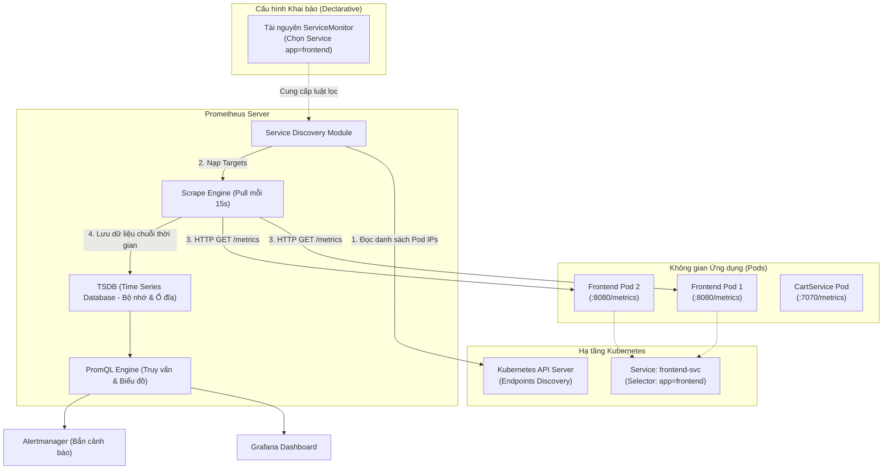

# Bài 38: Thu thập Metrics: Prometheus & ServiceMonitor

## 1. Thông tin bài học
* **Tên bài:** Bài 38: Thu thập Metrics: Prometheus & ServiceMonitor
* **Mục tiêu học:** Thấu hiểu bản chất của Chỉ số định lượng (Metrics) - Trụ cột thứ hai của Bộ ba Quan sát hệ thống (Observability); phân biệt rạch ròi sự khác nhau giữa Log và Metric; giải mã cơ chế Thu thập chủ động (Pull / Scrape Model) của Prometheus và lý do mô hình này thống trị thế giới Cloud Native; làm chủ 4 loại Metric cốt lõi (Counter, Gauge, Histogram, Summary); nắm vững định dạng chuẩn OpenMetrics; hiểu sâu kiến trúc Kubernetes Service Discovery và bước tiến hóa từ file cấu hình tĩnh sang tài nguyên khai báo tự động **ServiceMonitor CRD** của Prometheus Operator; thực hành triển khai Prometheus thu thập số liệu thời gian thực từ microservice trong Google Online Boutique.
* **Thời lượng ước tính:** 180 phút (90 phút lý thuyết, 90 phút thực hành)
* **Kiến thức cần có trước:** Bài 10 (Kubernetes Service & Endpoints), Bài 24 (Resource Requests & Limits), Bài 37 (Quản lý và tập trung hóa Log).
* **Liên quan kỳ thi:** CKA (Hiểu cơ chế giám sát tài nguyên, cấu hình Service Discovery, truy vấn số liệu Pod/Node); CKAD (Khai báo cổng giám sát trong Pod/Service, tích hợp Readiness/Liveness với metrics).

---

## 2. Bảng thuật ngữ

| Thuật ngữ | Giải thích đơn giản | Ví dụ / Ẩn dụ đời thường |
| :--- | :--- | :--- |
| **Metric** | Giá trị số đo lường trạng thái của hệ thống được ghi nhận theo dòng thời gian (Time-series data). | Số đo nhịp tim (80 bpm) hoặc tốc độ xe chạy (60 km/h) đo liên tục mỗi giây. |
| **Pull Model (Scrape)** | Cơ chế máy chủ giám sát chủ động gửi HTTP request định kỳ đến ứng dụng để "cào" (kéo) số liệu về. | Bác sĩ định kỳ 15 phút vào phòng đo huyết áp của bệnh nhân một lần. |
| **Counter** | Loại metric có giá trị chỉ tăng lên (hoặc quay về 0 khi ứng dụng khởi động lại), không bao giờ giảm. | Đồng hồ công-tơ-mét đo tổng số kilomet xe máy đã chạy từ lúc mua. |
| **Gauge** | Loại metric biểu diễn giá trị tức thời có thể tăng lên hoặc hạ xuống bất kỳ lúc nào. | Kim đồng hồ đo lượng xăng trong bình hoặc nhiệt kế đo nhiệt độ phòng. |
| **Histogram** | Loại metric gom các lần đo vào các khoảng (buckets) để tính toán phân phối và độ trễ (P95, P99). | Thùng phân loại bưu phẩm: gói dưới 1kg, gói 1-5kg, gói trên 5kg. |
| **OpenMetrics / Prometheus Format** | Chuẩn định dạng văn bản thô dạng key-value để phơi bày metrics qua giao thức HTTP (thường ở đường dẫn `/metrics`). | Bảng niêm yết tỷ giá ngoại tệ dán trước cửa ngân hàng bằng văn bản rõ ràng. |
| **Prometheus Operator** | Ứng dụng điều hành tự động hóa việc triển khai, cấu hình và quản trị cụm Prometheus bằng các Custom Resource Definitions (CRDs). | Người quản gia tự động đi gắn camera vào mọi phòng mới xây mà chủ nhà không cần nhắc. |
| **ServiceMonitor** | Một Custom Resource (CRD) khai báo cho Prometheus biết cần cào metrics từ những Kubernetes Service nào. | Tấm biển chỉ dẫn ghi: "Xin vui lòng kiểm tra huyết áp cho tất cả bệnh nhân tại Khoa Tim Mạch". |

---

## 3. Bức tranh lớn: Vấn đề thực tế và ẩn dụ đời thường

### Nhắc lại bài trước
Ở Bài 37, chúng ta đã chinh phục trụ cột đầu tiên của Quan sát hệ thống: **Quản lý và tập trung hóa Log** với Fluent Bit. Log ghi lại chi tiết tường tận từng sự kiện đã xảy ra trong quá khứ. Tuy nhiên, nếu bạn muốn biết *"Hệ thống hiện tại đang chịu tải bao nhiêu request mỗi giây?"* hay *"Bộ nhớ RAM của toàn bộ cụm đang tăng hay giảm?"*, việc quét qua hàng triệu dòng log dạng text là một giải pháp cực kỳ chậm chạp và tốn kém. Chúng ta cần một công cụ chuyên biệt để đo lường sức khỏe hệ thống: đó chính là **Metrics**.

### Tại sao cần cái này ở production? (Vấn đề thực tế)

1. **Sự quá tải của Log khi cần cái nhìn toàn cảnh (Aggregated View):**
   Một hệ thống thương mại điện tử lớn xử lý 50.000 request mỗi giây. Nếu mỗi request in ra 1 dòng log, mỗi giây bạn có 50.000 dòng log đổ về đĩa cứng. Để trả lời câu hỏi: *"Tỷ lệ lỗi 5xx trong 5 phút qua là bao nhiêu %?"*, hệ thống ElasticSearch/Loki phải quét qua 15 triệu bản ghi log! Trong khi đó, với Metric, Prometheus chỉ cần lưu đúng một chuỗi số đo kích thước vài bytes: `http_requests_total{status="500"}`. Truy vấn metric chỉ mất **2 mili-giây**, nhanh hơn phân tích log gấp hàng nghìn lần!

2. **Cơn ác mộng "Độ trễ đuôi" (Tail Latency - P99):**
   Khách hàng phàn nàn rằng website thỉnh thoảng bị "quay tròn" mất 5 giây mới load xong trang web. Bạn kiểm tra thời gian đáp ứng trung bình (Average Latency) thì thấy con số rất đẹp: `150ms`.  
   *Tại sao trung bình 150ms mà khách hàng vẫn kêu chậm?*  
   Bởi vì giá trị trung bình đã che giấu đi sự thật: 95% khách hàng chỉ mất 50ms, nhưng 1% khách hàng gặp xui xẻo (gọi là P99) mất tới 5.000ms! Nếu không có loại metric **Histogram** của Prometheus để đo lường các phân vị (Percentiles: P50, P90, P99), bạn sẽ hoàn toàn "mù tịt" trước trải nghiệm tồi tệ của những khách hàng quan trọng nhất.

3. **Cái bẫy của cấu hình tĩnh (Static Configuration Hell):**
   Trong kiến trúc Monolith cổ điển, bạn có 3 máy chủ cố định. Bạn ghi cứng địa chỉ IP của 3 máy này vào file cấu hình giám sát. Nhưng trong Kubernetes, Pod sinh ra và chết đi liên tục; địa chỉ IP của Pod thay đổi sau mỗi lần redeploy hoặc HPA tự co giãn. Nếu mỗi lần Pod đổi IP mà kỹ sư lại phải vào sửa file `prometheus.yml` rồi reload lại server, hệ thống giám sát sẽ gãy đổ ngay lập tức. Chúng ta bắt buộc phải có cơ chế **Service Discovery** và **ServiceMonitor** để Prometheus tự động phát hiện đối tượng cần theo dõi mà không cần con người can thiệp.

### Ẩn dụ đời thường: Nhật ký chuyến bay và Bảng đồng hồ buồng lái

Hãy tưởng tượng bạn là cơ trưởng đang điều khiển một chiếc máy bay chở 300 hành khách:

* **Log (Nhật ký hành trình):** Cuốn sổ ghi lại mọi câu nói của tiếp viên, mọi tiếng chuông gọi phục vụ của hành khách: *"Hành khách ghế 12A xin một cốc nước cam lúc 10:14:02"*, *"Tiếp viên báo cửa sổ hàng 3 đã đóng lúc 10:15:30"*. Đây là thông tin chi tiết vô giá để điều tra sau chuyến bay (Troubleshooting).
* **Metrics (Bảng đồng hồ buồng lái):** Các kim đo tốc độ bay (850 km/h), đồng hồ đo độ cao (10.000m), nhiệt độ động cơ (650°C), lượng nhiên liệu còn lại trong cánh máy bay (4.500 lít).
* **Sự khác biệt sống còn:** Cơ trưởng **không thể và không bao giờ** ngồi đọc cuốn nhật ký tiếp viên để biết máy bay có sắp rơi hay không! Khi đang bay giữa bão, cơ trưởng chỉ cần liếc mắt nhìn vào bảng đồng hồ Metrics trong 0.5 giây là biết ngay máy bay có đang đủ độ cao an toàn hay không.
* **Prometheus = Hệ thống cảm biến tự động quét dữ liệu:** Cứ mỗi 15 giây, máy tính buồng lái lại tự động gửi tín hiệu điện áp tới các cảm biến ở đầu cánh và động cơ (Cơ chế Pull / Scrape) để cập nhật các chỉ số mới nhất lên màn hình.

---

## 4. Giải thích khái niệm theo từng bước

### Cơ chế hoạt động của Prometheus trong Kubernetes

Hệ sinh thái Prometheus hoạt động theo một quy trình khép kín từ ứng dụng đến bộ nhớ chuỗi thời gian:



---

### Phân tích chi tiết

#### 1. Tại sao Prometheus chọn mô hình Pull thay vì Push?
Hầu hết các công nghệ truyền thống dùng mô hình **Push** (ứng dụng tự đẩy dữ liệu lên máy chủ). Tuy nhiên, Prometheus kiên quyết lựa chọn mô hình **Pull (Scrape)** vì các ưu điểm vượt trội trên môi trường phân tán:

* **Bảo vệ hệ thống giám sát khỏi bị "nghẽn mạng" (Overload Protection):** Khi hệ thống gặp sự cố nghẽn mạng hoặc lượng truy cập tăng vọt gấp 10 lần, nếu dùng Push, hàng nghìn container sẽ đồng loạt "dội bom" số liệu vào máy chủ giám sát khiến nó sập theo. Với mô hình Pull, Prometheus tự điều tiết tốc độ cào (ví dụ 15 giây/lần), máy chủ giám sát luôn giữ được sự ổn định tuyệt đối.
* **Tự động phát hiện ứng dụng bị sập (Liveness Detection):** Với mô hình Push, nếu bạn không nhận được số liệu từ một container, bạn không biết nó đã chết hay chỉ do mạng bị chậm. Với mô hình Pull, nếu Prometheus gửi HTTP GET tới `/metrics` mà bị `Connection Refused` hoặc `Timeout`, nó lập tức gán chỉ số `up == 0`, thông báo ngay rằng container đó đã ngừng hoạt động!
* **Đơn giản hóa ứng dụng:** Ứng dụng chỉ cần mở một endpoint HTTP nội bộ trả về văn bản dạng text thuần túy khi có người hỏi. Ứng dụng không cần biết Prometheus nằm ở đâu, không cần cấu hình IP máy chủ giám sát, không cần logic retry khi mạng rớt.

#### 2. Bốn loại Metric cốt lõi trong Prometheus

Mọi hiện tượng vật lý và số liệu trong phần mềm đều có thể quy về 4 dạng chuẩn:

| Loại Metric | Định nghĩa | Hành vi dữ liệu | Cách truy vấn bằng PromQL | Ví dụ thực tế |
| :--- | :--- | :--- | :--- | :--- |
| **Counter** | Đại lượng chỉ tích lũy tăng dần theo thời gian, không bao giờ giảm (chỉ reset về 0 khi app restart). | `0 -> 10 -> 25 -> 100` | Dùng hàm `rate()` hoặc `increase()` để tính vận tốc tăng/giây. | Tổng số lượt khách truy cập, tổng số lỗi 500, tổng byte dữ liệu đã truyền. |
| **Gauge** | Đại lượng phản ánh trạng thái tức thời, có thể tăng lên hoặc hạ xuống bất chợt. | `50 -> 80 -> 20 -> 95` | Xem trực tiếp giá trị hoặc dùng `avg_over_time()`, `delta()`. | Mức chiếm dụng RAM hiện tại, số luồng CPU đang chạy, số kết nối database đang mở. |
| **Histogram** | Chia dải giá trị đo thành nhiều thùng chứa (`buckets`) được định nghĩa trước. | Gom số liệu vào các nhãn `le` (less than or equal). | Dùng `histogram_quantile()` để tính độ trễ phân vị P50, P90, P99. | Thời gian phản hồi của request HTTP (dưới 50ms, dưới 200ms, dưới 1s), kích thước file upload. |
| **Summary** | Tương tự Histogram nhưng việc tính toán quantile được thực hiện trực tiếp trên client app. | Trả về trực tiếp các phân vị `quantile="0.99"`. | Xem trực tiếp giá trị quantile. | Đo đạc độ trễ trên các hệ thống không thể tính toán ở server (ít phổ biến trong K8s do tốn CPU client). |

---

#### 3. Giải phẫu định dạng văn bản OpenMetrics

Khi bạn truy cập vào đường dẫn `http://my-service:8080/metrics`, dữ liệu trả về là văn bản thuần tuý (Plain Text) vô cùng trực quan:

```text
# HELP http_requests_total Tong so request HTTP nhan duoc
# TYPE http_requests_total counter
http_requests_total{method="POST",handler="/checkout",status="200"} 1052
http_requests_total{method="POST",handler="/checkout",status="500"} 14

# HELP memory_usage_bytes Dung luong bo nho RAM dang su dung
# TYPE memory_usage_bytes gauge
memory_usage_bytes{instance="pod-frontend-1"} 45088768

# HELP http_request_duration_seconds Thoi gian xu ly request HTTP
# TYPE http_request_duration_seconds histogram
http_request_duration_seconds_bucket{le="0.1"} 850
http_request_duration_seconds_bucket{le="0.5"} 1020
http_request_duration_seconds_bucket{le="1.0"} 1060
http_request_duration_seconds_bucket{le="+Inf"} 1066
http_request_duration_seconds_sum 142.5
http_request_duration_seconds_count 1066
```

Mỗi dòng metric gồm:
* Tên metric (`http_requests_total`)
* Cặp nhãn bên trong `{}` (`method="POST"`, `status="200"`): Giúp lọc và phân nhóm số liệu.
* Giá trị đo (`1052`).

---

#### 4. Cuộc cách mạng ServiceMonitor của Prometheus Operator

Trong cách làm cũ (Prometheus truyền thống), kỹ sư phải nhét các chú thích (Annotations) vào Pod:
```yaml
annotations:
  prometheus.io/scrape: "true"
  prometheus.io/port: "8080"
```
Cách này có nhược điểm: Thiếu kiểm soát tập trung, không phân quyền chặt chẽ được, không thể cấu hình các thông số nâng cao như TLS, chứng thực, rewrite nhãn theo từng nhóm service.

**Prometheus Operator** mang đến chuẩn mực Cloud Native: Biến việc cấu hình cào số liệu thành các đối tượng Kubernetes chuẩn (**Custom Resources**):

* **`Prometheus` (CRD):** Khai báo cụm Prometheus Server (chạy mấy bản sao, bao nhiêu RAM, ổ đĩa lưu bao nhiêu ngày). Nó chứa trường:
  ```yaml
  serviceMonitorSelector:
    matchLabels:
      team: frontend
  ```
  *(Nghĩa là: Prometheus Server này sẽ tự động nạp mọi ServiceMonitor nào có nhãn `team: frontend`).*
* **`ServiceMonitor` (CRD):** Khai báo quy tắc cào cho một Service:
  ```yaml
  apiVersion: monitoring.coreos.com/v1
  kind: ServiceMonitor
  metadata:
    name: frontend-monitor
    labels:
      team: frontend
  spec:
    selector:
      matchLabels:
        app: frontend       # 1. Tìm Service nào có nhãn app=frontend
    endpoints:
    - port: http-metrics    # 2. Cào tại cổng mang tên http-metrics của Service đó
      path: /metrics        # 3. Đường dẫn cào số liệu
      interval: 15s         # 4. Tần suất cào: 15 giây một lần
  ```

Nhờ kiến trúc này, đội phát triển ứng dụng chỉ cần tạo một file `ServiceMonitor` đi kèm với ứng dụng của họ trong Git. Prometheus Server sẽ tự động phát hiện và bắt đầu cào số liệu mà không cần phải khởi động lại bất kỳ thứ gì!

---

## 5. Thực hành (Lab)

* **Môi trường:** Cluster kind (`microservices-demo\k8s\kind-config.yaml`) gồm 1 control-plane và 1 worker node.
* **Mức RAM ước tính:** ~180 MB (Cực kỳ nhẹ nhàng và an toàn cho giới hạn 4GB của WSL2).

> [!NOTE]
> Để đảm bảo lab chạy mượt mà trên máy 8GB RAM mà không bị tràn bộ nhớ bởi cả bộ `kube-prometheus-stack` nặng nề, chúng ta sẽ triển khai một instance **Prometheus Server độc lập chính thức** cực kỳ tinh gọn, kèm cơ chế tự động khám phá Kubernetes Service Discovery (chuẩn CKA/CKAD).

---

### Bước 1: Khởi tạo Namespace và Microservice `frontend` giả lập

Chúng ta tạo namespace `monitoring-lab` và triển khai một Pod microservice `frontend` có sẵn một web server nhỏ phục vụ cả ứng dụng lẫn trang `/metrics` chuẩn định dạng Prometheus:

```powershell
@'
apiVersion: v1
kind: Namespace
metadata:
  name: monitoring-lab
---
apiVersion: apps/v1
kind: Deployment
metadata:
  name: mock-frontend
  namespace: monitoring-lab
  labels:
    app: frontend
spec:
  replicas: 2
  selector:
    matchLabels:
      app: frontend
  template:
    metadata:
      labels:
        app: frontend
    spec:
      containers:
      - name: frontend
        image: python:3.9-alpine
        command: ["/bin/sh", "-c"]
        args:
        - |
          cat << 'EOF' > /server.py
          import http.server, time, random

          requests_total = 0

          class MetricsHandler(http.server.BaseHTTPRequestHandler):
              def do_GET(self):
                  global requests_total
                  if self.path == '/metrics':
                      requests_total += random.randint(1, 5)
                      mem_usage = 45000000 + random.randint(0, 5000000)
                      output = f"""# HELP http_requests_total Tong so HTTP request
          # TYPE http_requests_total counter
          http_requests_total{{app="frontend",status="200"}} {requests_total}
          # HELP process_resident_memory_bytes Bo nho RAM dang dung
          # TYPE process_resident_memory_bytes gauge
          process_resident_memory_bytes{{app="frontend"}} {mem_usage}
          """
                      self.send_response(200)
                      self.send_header('Content-Type', 'text/plain; version=0.0.4')
                      self.end_headers()
                      self.wfile.write(output.encode('utf-8'))
                  else:
                      self.send_response(200)
                      self.end_headers()
                      self.wfile.write(b"Frontend Homepage OK")
              def log_message(self, format, *args):
                  pass

          server = http.server.HTTPServer(('0.0.0.0', 8080), MetricsHandler)
          server.serve_forever()
          EOF
          python3 /server.py
        ports:
        - name: http-metrics
          containerPort: 8080
        resources:
          requests:
            memory: "32Mi"
            cpu: "20m"
          limits:
            memory: "64Mi"
            cpu: "50m"
---
apiVersion: v1
kind: Service
metadata:
  name: frontend-service
  namespace: monitoring-lab
  labels:
    app: frontend
    monitoring: prometheus
spec:
  selector:
    app: frontend
  ports:
  - name: http-metrics
    port: 8080
    targetPort: http-metrics
'@ | kubectl apply -f -

# Cho Deployment san sang
kubectl rollout status deployment/mock-frontend -n monitoring-lab --timeout=90s
```

---

### Bước 2: Kiểm chứng dữ liệu thô từ endpoint `/metrics`

Kiểm tra xem Service `frontend-service` có trả về số liệu chuẩn OpenMetrics hay không:

```powershell
kubectl run curl-test --image=curlimages/curl:latest --rm -it --restart=Never -n monitoring-lab -- curl -s http://frontend-service:8080/metrics
```

**Kết quả mong đợi:**
```text
# HELP http_requests_total Tong so HTTP request
# TYPE http_requests_total counter
http_requests_total{app="frontend",status="200"} 4
# HELP process_resident_memory_bytes Bo nho RAM dang dung
# TYPE process_resident_memory_bytes gauge
process_resident_memory_bytes{app="frontend"} 48210342
```

---

### Bước 3: Cấu hình Kubernetes Service Discovery cho Prometheus

Để Prometheus tự động tìm thấy các Service có nhãn `monitoring: prometheus` trong cụm (mô phỏng cơ chế cốt lõi của ServiceMonitor), chúng ta soạn thảo tệp cấu hình `prometheus.yml`:

```powershell
@'
apiVersion: v1
kind: ConfigMap
metadata:
  name: prometheus-config
  namespace: monitoring-lab
data:
  prometheus.yml: |
    global:
      scrape_interval: 5s     # Cao so lieu nhanh moi 5s de xem ket qua ngay
      evaluation_interval: 5s

    scrape_configs:
      - job_name: 'kubernetes-services'
        kubernetes_sd_configs:
          - role: endpoints
            namespaces:
              names:
                - monitoring-lab
        relabel_configs:
          # Chi cao nhung service co label monitoring=prometheus
          - source_labels: [__meta_kubernetes_service_label_monitoring]
            action: keep
            regex: prometheus
          # Giu lai ten port la http-metrics
          - source_labels: [__meta_kubernetes_endpoint_port_name]
            action: keep
            regex: http-metrics
          # Gan them thong tin namespace va service name vao metric
          - source_labels: [__meta_kubernetes_namespace]
            target_label: namespace
          - source_labels: [__meta_kubernetes_service_name]
            target_label: service
'@ | kubectl apply -f -
```

---

### Bước 4: Triển khai ServiceAccount, RBAC và Prometheus Server Siêu Nhẹ

Prometheus cần quyền truy vấn Kubernetes API để biết danh sách Pod/Endpoints. Chúng ta cấp quyền `ClusterRole` tối thiểu cho nó:

```powershell
@'
apiVersion: v1
kind: ServiceAccount
metadata:
  name: prometheus-sa
  namespace: monitoring-lab
---
apiVersion: rbac.authorization.k8s.io/v1
kind: ClusterRole
metadata:
  name: prometheus-sd-role
rules:
- apiGroups: [""]
  resources:
  - nodes
  - nodes/metrics
  - services
  - endpoints
  - pods
  verbs: ["get", "list", "watch"]
---
apiVersion: rbac.authorization.k8s.io/v1
kind: ClusterRoleBinding
metadata:
  name: prometheus-sd-binding
roleRef:
  apiGroup: rbac.authorization.k8s.io
  kind: ClusterRole
  name: prometheus-sd-role
subjects:
- kind: ServiceAccount
  name: prometheus-sa
  namespace: monitoring-lab
---
apiVersion: apps/v1
kind: Deployment
metadata:
  name: prometheus-server
  namespace: monitoring-lab
spec:
  replicas: 1
  selector:
    matchLabels:
      app: prometheus
  template:
    metadata:
      labels:
        app: prometheus
    spec:
      serviceAccountName: prometheus-sa
      containers:
      - name: prometheus
        image: prom/prometheus:v2.48.0
        args:
        - "--config.file=/etc/prometheus/prometheus.yml"
        - "--storage.tsdb.path=/prometheus/"
        - "--storage.tsdb.retention.time=2h"
        - "--web.enable-lifecycle"
        ports:
        - containerPort: 9090
        resources:
          requests:
            memory: "80Mi"
            cpu: "30m"
          limits:
            memory: "150Mi"
            cpu: "100m"
        volumeMounts:
        - name: config-volume
          mountPath: /etc/prometheus
        - name: storage-volume
          mountPath: /prometheus
      volumes:
      - name: config-volume
        configMap:
          name: prometheus-config
      - name: storage-volume
        emptyDir: {}
---
apiVersion: v1
kind: Service
metadata:
  name: prometheus-service
  namespace: monitoring-lab
spec:
  selector:
    app: prometheus
  ports:
  - port: 9090
    targetPort: 9090
'@ | kubectl apply -f -

# Cho Prometheus san sang
kubectl rollout status deployment/prometheus-server -n monitoring-lab --timeout=90s
```

---

### Bước 5: Kiểm tra Target và Thực thi truy vấn PromQL

Chờ khoảng 10-15 giây để Prometheus thực hiện vài chu kỳ cào số liệu. Sau đó, dùng `curl` truy vấn trực tiếp API của Prometheus để xác nhận Prometheus đã tự động "bắt sóng" được 2 Pod của `mock-frontend`:

```powershell
# 1. Kiem tra danh sach cac Targets ma Prometheus dang cao
kubectl run curl-targets --image=curlimages/curl:latest --rm -it --restart=Never -n monitoring-lab -- curl -s http://prometheus-service:9090/api/v1/targets | docker exec -i lab-control-plane python3 -c @"
import sys, json

data = json.load(sys.stdin)
active = data.get('data', {}).get('activeTargets', [])
print(f'Tong so Targets dang hoat dong: {len(active)}')
for t in active:
    job = t.get('labels', {}).get('job')
    instance = t.get('labels', {}).get('instance')
    health = t.get('health')
    print(f'-> Job: {job:<20} | Instance: {instance:<22} | Health: {health}')
"@
```

**Kết quả mong đợi:**
```text
Tong so Targets dang hoat dong: 2
-> Job: kubernetes-services  | Instance: 10.244.1.5:8080        | Health: up
-> Job: kubernetes-services  | Instance: 10.244.1.6:8080        | Health: up
```

Bây giờ, hãy thử truy vấn giá trị metric `http_requests_total` bằng biểu thức PromQL:

```powershell
kubectl run curl-promql --image=curlimages/curl:latest --rm -it --restart=Never -n monitoring-lab -- curl -s "http://prometheus-service:9090/api/v1/query?query=http_requests_total" | docker exec -i lab-control-plane python3 -c @"
import sys, json

res = json.load(sys.stdin)
results = res.get('data', {}).get('result', [])
for r in results:
    metric = r.get('metric', {})
    val = r.get('value', [None, None])[1]
    svc = metric.get('service')
    inst = metric.get('instance')
    print(f'Service: {svc} | Instance: {inst} | Tong Request: {val}')
"@
```

**Kết quả mong đợi:**
```text
Service: frontend-service | Instance: 10.244.1.5:8080 | Tong Request: 28
Service: frontend-service | Instance: 10.244.1.6:8080 | Tong Request: 31
```

> [!TIP]
> Bạn có thể mở giao diện Web đồ họa của Prometheus trên trình duyệt Windows bằng cách mở một cửa sổ PowerShell riêng biệt và gõ:
> `kubectl port-forward svc/prometheus-service 9090:9090 -n monitoring-lab`  
> Sau đó truy cập `http://localhost:9090` trên trình duyệt để tự tay nhập các câu lệnh PromQL và xem biểu đồ đường cong thời gian thực!

---

### Bước 6: Dọn dẹp tài nguyên (Cleanup)

Giải phóng toàn bộ tài nguyên để đưa RAM máy về trạng thái thư thái:

```powershell
kubectl delete namespace monitoring-lab --ignore-not-found
kubectl delete clusterrole prometheus-sd-role --ignore-not-found
kubectl delete clusterrolebinding prometheus-sd-binding --ignore-not-found
```

---

## 6. Lỗi thường gặp và cách debug

### Lỗi 1: ServiceMonitor không cào được số liệu, Target không xuất hiện
* **Dấu hiệu:** Sau khi tạo `ServiceMonitor`, truy cập Prometheus Web UI mục *Status $\rightarrow$ Targets* hoàn toàn không thấy target của service đâu.
* **Nguyên nhân phổ biến:**
  1. **Lệch nhãn `serviceMonitorSelector`:** Prometheus Server được cấu hình chỉ tìm các ServiceMonitor có nhãn `release: prometheus`, nhưng file ServiceMonitor bạn tạo lại quên không gắn nhãn này.
  2. **Lệch nhãn `selector` của Service:** Khối `spec.selector.matchLabels` trong ServiceMonitor không trùng khớp với các `metadata.labels` của Kubernetes Service.
  3. **Lệch tên Port:** Tên cổng khai báo trong `endpoints[].port` của ServiceMonitor là `http`, nhưng trong Service cổng đó lại đặt tên là `web` hoặc `http-metrics`.
* **Cách debug và sửa:**
  * Kiểm tra nhãn của Service:
    ```powershell
    kubectl get svc <service-name> --show-labels
    ```
  * So sánh cẩn thận từng ký tự giữa `spec.endpoints[0].port` của ServiceMonitor và `spec.ports[0].name` của Service. Phải khớp chính xác 100%!

---

### Lỗi 2: Prometheus bị sập liên tục vì OOMKilled do "Bùng nổ chiều dữ liệu" (High Cardinality)
* **Dấu hiệu:** Container Prometheus liên tục bị khởi động lại với lý do `OOMKilled` (Exit Code 137), dung lượng RAM nhảy vọt từ vài trăm MB lên hàng chục GB.
* **Nguyên nhân:** Lập trình viên vô tình đưa các giá trị động không giới hạn (Unbounded values) vào làm **Label** của metric.  
  *Ví dụ thảm họa:*
  ```text
  http_requests_total{user_id="user_12345", order_id="ord_99812", timestamp="17600000"} 1
  ```
  Mỗi User ID hay Order ID mới sẽ tạo ra một Time-Series hoàn toàn mới trong RAM của Prometheus. Khi có 1 triệu đơn hàng, Prometheus phải quản lý 1 triệu dòng chuỗi thời gian độc lập, dẫn đến cạn kiệt RAM ngay lập tức!
* **Cách debug và sửa:**
  * **Quy tắc sắt:** Label chỉ được phép chứa các tập giá trị hữu hạn và đếm được (Low Cardinality) như: `status_code` (200, 404, 500), `method` (GET, POST), `environment` (prod, dev), `service_name`.
  * Tuyệt đối không bao giờ đưa `userId`, `email`, `orderId`, `ip_address` vào Metric Labels. Những thông tin chi tiết này phải được ghi trong **Log** (Bài 37) hoặc **Trace** (Bài 40).

---

### Lỗi 3: Lỗi cào dữ liệu `Scrape Failed: Context Deadline Exceeded`
* **Dấu hiệu:** Trong giao diện Targets, service hiển thị màu đỏ với thông báo lỗi `context deadline exceeded`.
* **Nguyên nhân:** Ứng dụng xử lý việc tính toán metric quá chậm, vượt quá thời gian chờ cào mặc định (`scrape_timeout: 10s`), hoặc ứng dụng bị nghẽn CPU dẫn đến không kịp trả lời request HTTP GET `/metrics`.
* **Cách debug và sửa:**
  * Kiểm tra trực tiếp thời gian phản hồi của endpoint:
    ```powershell
    kubectl exec <pod-test> -- time curl -s http://frontend-service:8080/metrics > /dev/null
    ```
  * Tối ưu hóa code sinh metric trong ứng dụng: Tránh việc mỗi lần có request `/metrics` lại đi truy vấn database để đếm số lượng record. Hãy dùng biến đếm trong bộ nhớ RAM (In-memory atomic counter) để trả về kết quả ngay lập tức trong vài mili-giây.

---

## 7. Góc nhìn Senior

### 1. Sự đánh đổi (Trade-offs)

| Quyết định Kiến trúc | Điểm mạnh (Ưu điểm) | Đánh đổi (Hạn chế) | Khi nào nên chọn? |
| :--- | :--- | :--- | :--- |
| **Tần suất cào ngắn (`scrape_interval: 5s - 10s`)** | Độ phân giải cao, phát hiện đột biến lưu lượng (Spikes) và sự cố cực nhanh. | Tốn nhiều CPU của cả ứng dụng lẫn Prometheus; dung lượng đĩa TSDB phình to nhanh gấp 3 lần. | Chỉ áp dụng cho các dịch vụ thanh toán lõi (Core Payment) hoặc trong môi trường diễn tập sự cố. |
| **Tần suất cào dài (`scrape_interval: 30s - 60s`)** | Tiết kiệm CPU và ổ cứng tối đa; cụm Prometheus có thể giám sát hàng vạn container nhẹ nhàng. | Có thể bỏ lọt các đợt tăng đột biến diễn ra chớp nhoáng trong 10-15 giây. | Chuẩn mực hợp lý cho 90% dịch vụ thông thường trên Production. |
| **Prometheus Operator (CRDs)** | Tự động hóa hoàn toàn theo chuẩn GitOps; lập trình viên tự quản lý ServiceMonitor; không sợ lỗi cú pháp file cấu hình chung. | Cài đặt thêm nhiều CRD vào cụm; yêu cầu hiểu biết sâu về Controller pattern. | Tiêu chuẩn bắt buộc cho mọi cụm Kubernetes quy mô doanh nghiệp. |
| **File tĩnh `prometheus.yml`** | Đơn giản, dễ hiểu cho người mới bắt đầu, không cần cài đặt thêm bất kỳ Operator nào. | Quản lý thủ công; khó tự động hóa khi cụm mở rộng quy mô lớn. | Thích hợp cho môi trường Lab, học tập CKA, hoặc các cụm nhỏ dưới 5 node. |

---

### 2. Best practices tại production

1. **Khống chế Dung lượng lưu trữ bằng Kích thước thay vì Thời gian:**
   Mặc định Prometheus cấu hình retention theo thời gian (`--storage.tsdb.retention.time=15d`). Tuy nhiên, nếu một ngày nọ có dịch vụ mới đẩy thêm hàng triệu metric lạ, ổ cứng của bạn có thể bị đầy tràn trước khi hết 15 ngày!  
   $\rightarrow$ Luôn bổ sung thêm cờ giới hạn kích thước dung lượng tối đa:
   `--storage.tsdb.retention.size=50Gi`  
   Khi đạt ngưỡng 50GB, Prometheus sẽ tự động xóa các khối dữ liệu cũ nhất bất kể thời gian lưu trữ đã đạt 15 ngày hay chưa, giữ an toàn tuyệt đối cho đĩa cứng của Node.
2. **Nguyên tắc Phân tầng Kiến trúc (Federation / Thanos / Cortex):**
   Một Prometheus Server duy nhất chỉ nên đảm nhận việc cào dữ liệu ngắn hạn (từ 2 đến 7 ngày) cho một cụm cục bộ. Để lưu trữ dữ liệu lịch sử dài hạn (1 năm phục vụ báo cáo kinh doanh), hãy đẩy dữ liệu ra các giải pháp mở rộng quy mô Cloud Native như **Thanos** hoặc **VictoriaMetrics** sử dụng Object Storage (AWS S3 / GCS).
3. **Áp dụng bộ 4 Tín hiệu Vàng của Google SRE (Four Golden Signals):**
   Khi thiết kế metric cho bất kỳ microservice nào, đừng thu thập lan man. Hãy tập trung đo lường chuẩn 4 tín hiệu vàng:
   * **Latency (Độ trễ):** Thời gian xử lý request (dùng Histogram).
   * **Traffic (Lưu lượng):** Số lượng request/giây mà dịch vụ đang gánh (dùng Counter `rate()`).
   * **Errors (Lỗi):** Tỷ lệ các request bị lỗi (dùng Counter chia tỷ lệ).
   * **Saturation (Độ bão hòa):** Mức độ sử dụng tài nguyên CPU, RAM, Queue, Connection Pool (dùng Gauge).

---

### 3. Câu hỏi phỏng vấn Senior

* **Câu hỏi 1:** *Khi viết câu truy vấn PromQL để tính toán tốc độ tăng trưởng của một Counter (ví dụ số request mỗi giây), bạn sẽ chọn hàm `rate()` hay `irate()`? Hãy phân tích sự khác nhau bản chất và trường hợp sử dụng của từng hàm.*
  * **Gợi ý trả lời chuẩn:**
    * **Bản chất của `rate[range]`:** Tính toán tốc độ trung bình trên toàn bộ khoảng thời gian `range` được chỉ định (bằng cách lấy giá trị đầu trừ giá trị cuối rồi chia cho khoảng thời gian). `rate()` có tác dụng **làm mịn đồ thị (smoothing)**, giúp loại bỏ các dao động tức thời ngắn hạn.  
      $\rightarrow$ **Khi nào dùng:** Luôn dùng `rate()` khi thiết lập các **Quy tắc Cảnh báo (Alerting Rules)** và tính toán SLO/SLA để tránh việc chuông báo động bị kích hoạt giả mạo do một cú nhảy đột biến diễn ra trong vài giây.
    * **Bản chất của `irate[range]` (Instant Rate):** Chỉ tính toán tốc độ dựa trên **2 điểm dữ liệu mới nhất (2 data points gần nhất)** nằm trong khoảng `range`. `irate()` phản ánh cực kỳ nhạy bén và tức thì các biến động tức thời (Spikes).  
      $\rightarrow$ **Khi nào dùng:** Dùng `irate()` khi kỹ sư đang trực tiếp **điều tra sự cố (Troubleshooting)** trên Grafana để nhìn thấy chính xác thời điểm xảy ra cú nhảy vọt lưu lượng bất thường.

* **Câu hỏi 2:** *Tại sao trong cụm Kubernetes, việc sử dụng ServiceMonitor kết hợp Prometheus Operator lại vượt trội hơn so với việc cấu hình thủ công `kubernetes_sd_configs` truyền thống trong file YAML?*
  * **Gợi ý trả lời chuẩn:** Có 3 lý do mang tính chiến lược:
    1. **Tách biệt quyền hạn (Decoupling & Self-service):** Đội Platform chỉ cần dựng sẵn Prometheus Operator. Đội phát triển ứng dụng (Dev) có thể tự viết file `ServiceMonitor` đi kèm mã nguồn của họ mà không cần xin quyền sửa đổi file cấu hình chung của cụm hay can thiệp vào máy chủ Prometheus.
    2. **Khả năng quản trị theo chuẩn Kubernetes Native:** `ServiceMonitor` là một tài nguyên chuẩn Kubernetes, có thể dễ dàng quản lý phiên bản qua GitOps (ArgoCD), kiểm tra tính hợp lệ qua Helm/Kustomize, và tái sử dụng linh hoạt.
    3. **Tự động hóa hoàn toàn (Zero-downtime reconfiguration):** Prometheus Operator tự động theo dõi các thay đổi của ServiceMonitor qua Kubernetes API và gửi tín hiệu HTTP POST `/-/reload` tới Prometheus Server mà không cần khởi động lại container, loại bỏ hoàn toàn rủi ro gián đoạn giám sát.

---

## 8. Tóm tắt bài học

* 📌 **1. Khác biệt Log vs Metric:** Log dùng để điều tra sự cố chi tiết sau khi xảy ra (Deep forensics); Metric dùng để nắm bắt trạng thái tổng quan và vẽ biểu đồ đo lường hiệu năng thời gian thực.
* 📌 **2. Ưu thế của mô hình Pull (Scrape):** Prometheus chủ động kéo số liệu qua HTTP GET `/metrics`, giúp kiểm soát tải, tránh nghẽn mạng và tự động phát hiện tình trạng sống/chết của Pod.
* 📌 **3. Bốn kiểu Metric:** Nắm chắc bản chất của **Counter** (chỉ tăng), **Gauge** (tăng giảm tự do), **Histogram** (phân phối bucket đo P99) và **Summary**.
* 📌 **4. Cạm bẫy High Cardinality:** Tuyệt đối không đưa các giá trị ngẫu nhiên hoặc không giới hạn (như User ID, Order ID) vào làm Labels của metric để tránh làm sập RAM Prometheus.
* 📌 **5. Chuẩn mực ServiceMonitor:** Bước tiến hóa Declarative của Prometheus Operator, cho phép tự động khám phá và cào số liệu từ Kubernetes Service một cách tự động và linh hoạt.

---

## 9. Bài tập tự làm

* 🟢 **Mức Dễ:** Viết một câu truy vấn PromQL tính tổng số lượng request HTTP thành công (`status="200"`) của toàn bộ các Pod thuộc dịch vụ `frontend` trong 5 phút vừa qua bằng hàm `increase()`.
* 🟡 **Mức Vừa:** Soạn thảo một tệp manifest `ServiceMonitor` hoàn chỉnh để cào metrics từ Service `cartservice` trong namespace `default`:
  * Service có nhãn: `app: cartservice`
  * Tên cổng cần cào: `grpc-metrics`
  * Tần suất cào: `10s`
  * Đường dẫn: `/metrics`
* 🔴 **Mức Khó:** Viết một biểu thức PromQL hoàn chỉnh sử dụng `histogram_quantile()` để tính toán thời gian phản hồi ở phân vị 95% (P95 latency) của các HTTP request trong 5 phút gần nhất, phân nhóm theo từng đường dẫn API (`handler`):
  Metric gốc: `http_request_duration_seconds_bucket`.

---

## 10. Câu hỏi tự kiểm tra

1. Nếu một ứng dụng bị sập và khởi động lại, giá trị của một metric kiểu `Counter` sẽ biến đổi như thế nào? Hàm `rate()` của Prometheus xử lý tình huống này ra sao?
2. Điều gì sẽ xảy ra nếu bạn đưa địa chỉ email của người dùng vào làm nhãn (label) của một metric Prometheus?
3. Trong mô hình của Prometheus Operator, thành phần nào chịu trách nhiệm dịch các khai báo trong `ServiceMonitor` thành cấu hình thực tế cho Prometheus Server?
4. Tại sao hàm `rate()` luôn yêu cầu một khoảng thời gian dạng chuỗi (ví dụ `[5m]`) đi kèm với tên metric?
5. Điểm khác biệt cơ bản giữa cách đo lường độ trễ bằng giá trị Trung bình (Average) và bằng Phân vị P99 (Histogram Quantile) là gì?
6. Nếu bạn thay đổi nhãn của một Kubernetes Service nhưng không sửa ServiceMonitor, Prometheus có tiếp tục cào được metrics từ Service đó không? Tại sao?

<details>
<summary>👉 Bấm vào đây để xem đáp án câu hỏi tự kiểm tra</summary>

* **Câu 1:** Khi ứng dụng restart, giá trị Counter sẽ bị reset về `0`. Hàm `rate()` của Prometheus được thiết kế vô cùng thông minh: nó tự động nhận diện hiện tượng giảm đột ngột về 0 (Counter Reset) và bù đắp giá trị thiếu hụt, đảm bảo biểu đồ tốc độ tăng trưởng không bị đứt gãy hoặc hiển thị số âm vô lý.
* **Câu 2:** Gây ra thảm họa **Bùng nổ chiều dữ liệu (High Cardinality)**. Mỗi địa chỉ email duy nhất sẽ sinh ra một Time-Series mới trong cơ sở dữ liệu TSDB của Prometheus. Hàng triệu email sẽ làm cạn kiệt bộ nhớ RAM, dẫn đến việc Prometheus bị `OOMKilled` và toàn bộ hệ thống giám sát bị tê liệt.
* **Câu 3:** Chính là **Prometheus Operator Controller**. Controller này liên tục theo dõi (watch) các tài nguyên `ServiceMonitor` qua Kubernetes API, kiểm tra sự khớp nối với `serviceMonitorSelector` của tài nguyên `Prometheus`, sau đó tự động tái tạo file cấu hình nội bộ và gửi lệnh reload cho Prometheus Server.
* **Câu 4:** Vì bản thân Counter là một đại lượng tích lũy tổng cộng. Để tính được "tốc độ thay đổi trên mỗi giây" (Rate of change), toán học bắt buộc phải lấy hiệu số giữa điểm cuối và điểm đầu trong một khoảng thời gian cụ thể `[range]` rồi chia cho số giây của khoảng thời gian đó.
* **Câu 5:** Giá trị Trung bình (Average) lấy tổng thời gian chia đều cho toàn bộ request, do đó các request cực nhanh sẽ làm mờ đi các request cực chậm. Trong khi đó, phân vị **P99** khẳng định rằng 99% khách hàng có thời gian phản hồi nhỏ hơn hoặc bằng giá trị này, và chỉ chính xác 1% khách hàng gặp độ trễ cao nhất, giúp kỹ sư phát hiện ra các nút thắt cổ chai mà giá trị trung bình hoàn toàn che giấu.
* **Câu 6:** **Không thể cào được nữa.** Bởi vì ServiceMonitor hoạt động dựa trên cơ chế `selector.matchLabels`. Khi nhãn của Service bị thay đổi và không còn khớp với nhãn mà ServiceMonitor đang tìm kiếm, Kubernetes Endpoints Discovery sẽ tự động loại bỏ các Pod của Service đó ra khỏi danh sách Targets của Prometheus.
</details>

---

## 11. Tài liệu đọc thêm và bài tiếp theo

### Tài liệu tham khảo
* [Tài liệu chính thức Prometheus: Concepts & Metric Types](https://prometheus.io/docs/concepts/metric_types/)
* [Tài liệu Prometheus Operator: Getting Started with ServiceMonitor](https://prometheus-operator.dev/docs/operator/getting-started/)
* [Google SRE Book: Monitoring Distributed Systems](https://sre.google/sre-book/monitoring-distributed-systems/)

### Bài tiếp theo
👉 **Bài 39: Cảnh báo chuẩn SRE: Alertmanager & 4 Golden Signals**

---

## PHỤ LỤC: ĐÁP ÁN GỢI Ý BÀI TẬP TỰ LÀM (MỤC 9)

### Đáp án Mức Dễ
Biểu thức PromQL tính tổng số request thành công trong 5 phút qua:
```promql
sum(increase(http_requests_total{app="frontend", status="200"}[5m]))
```
*Giải thích:* Hàm `increase(...[5m])` tính tổng số lượt tăng thêm trong cửa sổ 5 phút; hàm `sum()` gộp số liệu của tất cả các Pod bản sao lại thành một con số duy nhất.

---

### Đáp án Mức Vừa
Manifest `ServiceMonitor` cho CartService:
```yaml
apiVersion: monitoring.coreos.com/v1
kind: ServiceMonitor
metadata:
  name: cartservice-monitor
  namespace: default
  labels:
    release: prometheus
spec:
  selector:
    matchLabels:
      app: cartservice
  endpoints:
  - port: grpc-metrics
    path: /metrics
    interval: 10s
```

---

### Đáp án Mức Khó
Biểu thức PromQL tính P95 Latency phân nhóm theo handler:
```promql
histogram_quantile(
  0.95,
  sum(rate(http_request_duration_seconds_bucket[5m])) by (le, handler)
)
```
*Giải thích:*
1. `rate(...[5m])`: Tính tốc độ tích lũy của từng bucket trong 5 phút.
2. `sum(...) by (le, handler)`: Gom các bản sao Pod lại nhưng **bắt buộc phải giữ lại nhãn `le`** (để hàm histogram tính toán) và nhãn `handler` (để phân loại theo đường dẫn API).
3. `histogram_quantile(0.95, ...)`: Áp dụng thuật toán nội suy tuyến tính để tìm ra mốc thời gian mà 95% request kết thúc nhanh hơn mốc đó.

