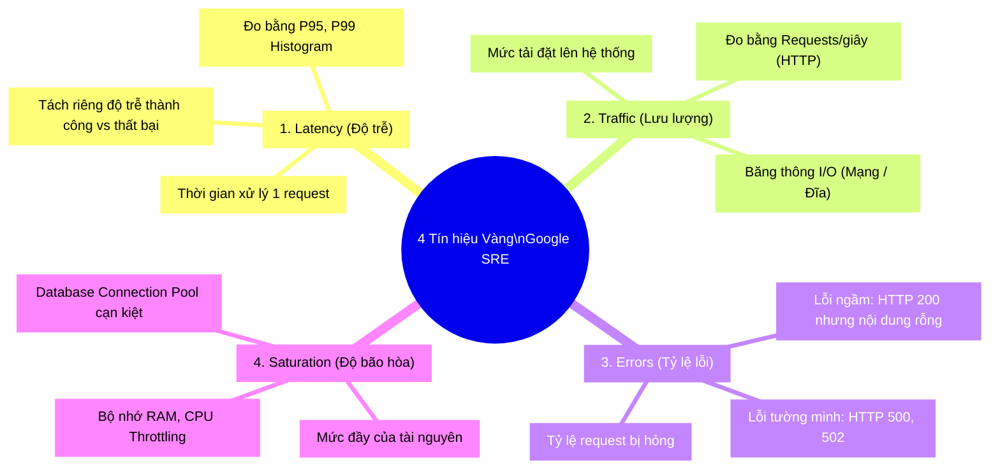
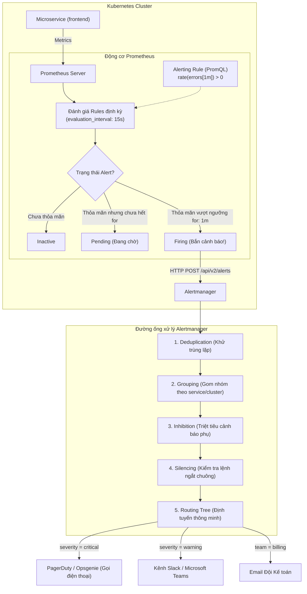

# Bài 39: Cảnh báo chuẩn SRE: Alertmanager & 4 Golden Signals

## 1. Thông tin bài học
* **Tên bài:** Bài 39: Cảnh báo chuẩn SRE: Alertmanager & 4 Golden Signals
* **Mục tiêu học:** Làm chủ tư duy thiết lập cảnh báo chủ động (Proactive Alerting) chuẩn Google Site Reliability Engineering (SRE); hiểu sâu triết lý "Cảnh báo theo Triệu chứng người dùng (Symptoms), không cảnh báo theo Nguyên nhân kỹ thuật (Causes)"; thuần thục Bộ 4 Tín hiệu Vàng (**4 Golden Signals: Latency, Traffic, Errors, Saturation**); nắm vững kiến trúc tách biệt giữa Prometheus (Đánh giá luật) và Alertmanager (Xử lý, định tuyến và khử trùng lặp cảnh báo); làm chủ 4 cơ chế tối thượng của Alertmanager: **Grouping (Gom nhóm)**, **Inhibition (Triệt tiêu)**, **Silencing (Tạm ngắt chuông)**, và **Routing Tree (Cây định tuyến)**; thực hành cấu hình Alertmanager bắn cảnh báo khi microservice trong Google Online Boutique bị lỗi 5xx.
* **Thời lượng ước tính:** 180 phút (90 phút lý thuyết, 90 phút thực hành)
* **Kiến thức cần có trước:** Bài 10 (Kubernetes Service), Bài 24 (Resource Requests & Limits), Bài 38 (Thu thập Metrics với Prometheus).
* **Liên quan kỳ thi:** CKA, CKS (Hiểu cơ chế giám sát sức khỏe cụm, khắc phục sự cố dựa trên cảnh báo tự động, cấu hình thông báo hệ thống); SRE / DevOps Best Practice (Tiêu chuẩn vàng bắt buộc của mọi kỹ sư vận hành Production).

---

## 2. Bảng thuật ngữ

| Thuật ngữ | Giải thích đơn giản | Ví dụ / Ẩn dụ đời thường |
| :--- | :--- | :--- |
| **Alerting** | Cơ chế hệ thống chủ động phát tín hiệu thông báo cho con người khi có điều kiện bất thường xảy ra. | Chuông báo cháy tự động reo lên khi có khói bốc lên trong phòng. |
| **4 Golden Signals** | Bốn chỉ số vàng của Google SRE để đo lường toàn diện sức khỏe hệ thống: Độ trễ (Latency), Lưu lượng (Traffic), Lỗi (Errors), và Độ bão hòa (Saturation). | 4 chỉ số sinh tồn của bệnh nhân trong phòng cấp cứu: Nhịp tim, Huyết áp, Nhịp thở, và Thân nhiệt. |
| **Alertmanager** | Thành phần chuyên biệt quản lý các cảnh báo gửi từ Prometheus: khử trùng lặp, gom nhóm, định tuyến và gửi tới Slack/PagerDuty/Email. | Trực tổng đài cứu hỏa 114: Tiếp nhận hàng trăm cuộc gọi, lọc cuộc gọi trùng, gom tin báo và điều đúng xe chữa cháy đến hiện trường. |
| **Alert Fatigue** | Hội chứng "Mệt mỏi vì bão cảnh báo": Tình trạng kỹ sư nhận quá nhiều cảnh báo rác, dẫn đến chai lì cảm xúc và bỏ lọt sự cố nghiêm trọng thật. | Tiếng chuông báo trộm của chiếc xe ô tô bị hỏng cứ 5 phút lại rú lên vô cớ, khiến hàng xóm bực mình và chẳng ai thèm ngó ngàng. |
| **Grouping** | Khả năng gom nhiều cảnh báo có cùng tính chất hoặc xảy ra cùng lúc thành một tin nhắn duy nhất. | Thay vì gõ cửa 50 lần báo từng chiếc bóng đèn bị hỏng, bảo vệ gửi 1 thông báo: "Khu A bị mất điện toàn bộ". |
| **Inhibition** | Cơ chế tự động tắt chuông các cảnh báo thứ cấp nếu cảnh báo gốc nghiêm trọng hơn đã được kích hoạt. | Nếu cả tòa nhà bị sập, hệ thống tự động tắt cảnh báo "Máy lạnh phòng 302 không chạy" để tránh gây nhiễu. |
| **Silencing** | Tính năng tạm ngắt chuông cảnh báo trong một khoảng thời gian xác định (ví dụ khi đang nâng cấp hệ thống). | Chuyển điện thoại sang chế độ "Không làm phiền" (Do Not Disturb) trong 2 tiếng họp quan trọng. |
| **Runbook / Playbook** | Tài liệu hướng dẫn từng bước cụ thể mà kỹ sư trực phải làm ngay khi nhận được một cảnh báo. | Tờ hướng dẫn thoát hiểm và sử dụng bình chữa cháy dán cạnh cửa ra vào. |

---

## 3. Bức tranh lớn: Vấn đề thực tế và ẩn dụ đời thường

### Nhắc lại bài trước
Ở Bài 38, chúng ta đã biến hệ thống vô hình trở nên hữu hình bằng cách thu thập các chỉ số thời gian thực (Metrics) qua Prometheus và ServiceMonitor. Tuy nhiên, dù dashboard Grafana có đẹp đến đâu, **không một kỹ sư nào có thể ngồi nhìn màn hình suốt 24 giờ một ngày, 7 ngày một tuần** để chờ đợi lỗi xuất hiện. Khi sự cố xảy ra lúc 3 giờ sáng, hệ thống phải tự biết "lay người" đánh thức kỹ sư trực: đó chính là sứ mệnh của **Alertmanager & Hệ thống Cảnh báo chuẩn SRE**.

### Tại sao cần cái này ở production? (Vấn đề thực tế)

1. **Thảm họa "Bão cảnh báo" lúc nửa đêm (Alert Storm & Fatigue):**
   Một switch mạng của trung tâm dữ liệu bị chập chờn trong 10 giây. Hệ thống của bạn chạy 200 microservices. Ngay lập tức, 200 container bị mất kết nối cơ sở dữ liệu.  
   Nếu không có Alertmanager xử lý gom nhóm, **điện thoại của kỹ sư trực sẽ nổ tung với 200 tin nhắn SMS và 500 thông báo Slack chỉ trong 1 phút!** Kỹ sư cuống cuồng, hoảng loạn, không biết đâu là nguyên nhân gốc và đâu là hệ quả dây chuyền. Hậu quả là sau vài tuần bị "tra tấn" bởi chuông báo giả, cả đội sẽ tắt chuông điện thoại, và đúng vào đêm đó, cơ sở dữ liệu bị hỏng thật mà không ai hay biết!

2. **Cái bẫy "Cảnh báo theo Nguyên nhân" (Alerting on Causes):**
   Nhiều đội ngũ chưa chuẩn SRE thường đặt cảnh báo: *"Cảnh báo nếu CPU của Pod vượt quá 85%"*.  
   Vào ban đêm, một CronJob tính toán báo cáo tài chính chạy mất 10 phút, CPU nhảy lên 95%. Hệ thống lập tức gọi điện dựng kỹ sư trực dậy lúc 2 giờ sáng. Khi kỹ sư mở máy tính lên, khách hàng vẫn đang mua sắm bình thường, không có bất kỳ ai bị chậm hay lỗi. Đó là một **Cảnh báo rác (False Positive)**!  
   Ngược lại, ban ngày một lỗi code mới deploy khiến hàm thanh toán bị treo vô tận, CPU chỉ chạy 5% (rất thấp), nhưng 100% khách hàng không thể thanh toán được. Cảnh báo CPU hoàn toàn im lặng! Đó là cái giá phải trả khi không giám sát theo **Triệu chứng người dùng (Symptoms)**.

3. **Thiếu tính hành động (Lack of Actionability):**
   Kỹ sư nhận được một thông báo: `HighLoadAverage on node-3`. Kỹ sư tự hỏi: *Lỗi này có nghiêm trọng không? Cần làm gì bây giờ? Restart node hay kệ nó? Ai là người viết rule này?* Nếu một cảnh báo bắn ra mà người nhận không biết phải làm gì tiếp theo, cảnh báo đó hoàn toàn vô giá trị và chỉ tạo thêm sự căng thẳng độc hại cho đội ngũ vận hành.

### Ẩn dụ đời thường: Trực ban Bệnh viện và Tổng đài Khẩn cấp 115

Hãy hình dung hệ thống cảnh báo giống như **Quy trình Cấp cứu tại một Bệnh viện Đa khoa**:

* **Prometheus = Thiết bị đo sinh tồn (Monitor):** Máy đo điện tim và máy đo oxy liên tục đọc các chỉ số của bệnh nhân (Pull Metrics).
* **Alerting Rules = Ngưỡng báo động:** Khi nhịp tim tụt xuống dưới 40 nhịp/phút trong hơn 1 phút, máy phát tín hiệu khẩn cấp sang tổng đài.
* **Alertmanager = Bác sĩ Trưởng kíp trực:**
  * **Khử trùng lặp (Deduplication):** 3 y tá cùng chạy vào báo "Bệnh nhân phòng 4 đang khó thở", bác sĩ ghi nhận đây là 1 ca duy nhất, không ghi thành 3 ca.
  * **Gom nhóm (Grouping):** Khoa Tim mạch bị chập điện khiến 10 máy đo cùng kêu, bác sĩ không gọi 10 cuộc điện thoại mà gộp lại thành 1 lệnh: *"Đội kỹ thuật khẩn trương kiểm tra nguồn điện Khoa Tim mạch"*.
  * **Triệt tiêu (Inhibition):** Bệnh nhân đã ngừng tim (Nguyên nhân gốc), bác sĩ tắt ngay cảnh báo "Nhiệt độ cơ thể giảm" để tập trung sốc điện cấp cứu quả tim.
  * **Định tuyến (Routing):** Bệnh nhi thì chuyển ngay cho Khoa Nhi; người già thì chuyển Khoa Lão khoa; vết xước nhẹ ngoài da thì gửi giấy hẹn khám sáng mai chứ không bấm còi hú xe cứu thương lúc 2h sáng!

---

## 4. Giải thích khái niệm theo từng bước

### Bộ 4 Tín hiệu Vàng của Google SRE (The Four Golden Signals)

Cuốn sách kinh điển *Site Reliability Engineering* của Google đúc kết rằng: Dù hệ thống của bạn phức tạp đến đâu, bạn chỉ cần nắm chắc 4 chỉ số vàng này là có thể chẩn đoán được 99% sức khỏe của mọi ứng dụng:



1. **Latency (Độ trễ):** Thời gian cần thiết để hoàn thành một tác vụ.
   * *Quy tắc sống còn:* Bắt buộc phải đo riêng độ trễ của request thành công (200 OK) và request thất bại (500 Error). Một trang web trả về lỗi 500 cực nhanh (trong 5ms) có thể làm "kéo tụt" độ trễ trung bình xuống, đánh lừa kỹ sư rằng hệ thống đang rất nhanh!
2. **Traffic (Lưu lượng):** Thước đo nhu cầu của người dùng đang đè lên hệ thống. Đối với web/microservices, đó là số request mỗi giây (`rps`); đối với hệ thống streaming, đó là số byte mạng mỗi giây.
3. **Errors (Tỷ lệ lỗi):** Tỷ lệ phần trăm các yêu cầu kết thúc bằng thất bại. Cần phân biệt lỗi do người dùng (HTTP 4xx - nhập sai mật khẩu) và lỗi do hệ thống (HTTP 5xx - sập database, timeout).
4. **Saturation (Độ bão hòa):** Đo lường mức độ "đầy ứ" của các tài nguyên giới hạn. Hệ thống thường bắt đầu xuống cấp trầm trọng trước khi tài nguyên đạt 100%. Ví dụ: Khi bộ đệm hàng đợi (Queue) đạt 85%, độ trễ sẽ tăng vọt theo hàm mũ.

---

### Kiến trúc phân tách: Prometheus vs Alertmanager

Trong tư tưởng của Kubernetes và Cloud Native, tính độc lập (Decoupling) luôn được đặt lên hàng đầu:



#### Vòng đời của một Cảnh báo trong Prometheus
Một Alert trải qua 3 trạng thái nghiêm ngặt:
1. **`Inactive`:** Biểu thức PromQL không thỏa mãn điều kiện lỗi. Hệ thống hoàn toàn khỏe mạnh.
2. **`Pending`:** Biểu thức PromQL bắt đầu vượt ngưỡng lỗi, nhưng chưa vượt qua khoảng thời gian chờ `for:` (ví dụ `for: 2m`). Điều này giúp lọc sạch các cú "nhấp nháy" tức thời (Spikes) diễn ra trong vài giây, ngăn chặn báo động giả.
3. **`Firing`:** Điều kiện lỗi kéo dài liên tục vượt quá thời gian `for:`. Prometheus chính thức đóng gói dữ liệu và gửi sang Alertmanager.

---

### 4 Vũ khí Tối thượng của Alertmanager

#### 1. Grouping (Gom nhóm thông minh)
Alertmanager gom các cảnh báo có cùng các nhãn định danh (ví dụ cùng `alertname` và `namespace`) thành một lô (batch).
* `group_wait: 10s`: Khi có cảnh báo đầu tiên xuất hiện, Alertmanager nín thở chờ thêm 10 giây xem có các cảnh báo anh em nào khác cùng nổ ra không để gộp lại gửi một thể.
* `group_interval: 5m`: Khi một nhóm đã bắn tin nhắn rồi, nếu có thêm cảnh báo mới nhảy vào nhóm đó, Alertmanager sẽ đợi 5 phút sau mới gửi bản cập nhật, tránh spam liên tục.
* `repeat_interval: 4h`: Nếu sự cố vẫn chưa được sửa và không có gì mới, cứ sau 4 tiếng Alertmanager mới nhắc lại một lần.

#### 2. Inhibition (Triệt tiêu cảnh báo dây chuyền)
Nếu một cảnh báo gốc quan trọng đã nổ ra, Alertmanager tự động "bịt miệng" các cảnh báo phụ:
```yaml
inhibit_rules:
  - source_match:
      severity: 'critical'
      alertname: 'NodeNetworkDown'    # Cảnh báo gốc: Node bị đứt mạng
    target_match:
      severity: 'warning'             # Cảnh báo phụ: Pod trên node đó không phản hồi
    equal: ['node']                   # Triệt tiêu nếu xảy ra trên cùng một node!
```

#### 3. Silencing (Tắt chuông có kế hoạch)
Khi bạn cần nâng cấp cụm lúc 23h, bạn truy cập giao diện Alertmanager hoặc dùng công cụ dòng lệnh `amtool` tạo một **Silence** cho nhãn `environment="staging"` trong vòng 2 giờ. Mọi cảnh báo phát sinh trong thời gian này vẫn được ghi nhận nhưng chuông báo động sẽ hoàn toàn im lặng.

#### 4. Routing Tree (Cây định tuyến)
Cho phép phân luồng cảnh báo theo hình rẽ nhánh của cây thư mục: Cảnh báo thuộc đội nào chuyển về kênh liên lạc của đội đó, cảnh báo nguy cấp mức `critical` thì gửi tin nhắn SMS, cảnh báo mức `warning` thì gửi kênh chat nội bộ.

---

## 5. Thực hành (Lab)

* **Môi trường:** Cluster kind (`microservices-demo\k8s\kind-config.yaml`) gồm 1 control-plane và 1 worker node.
* **Mức RAM ước tính:** ~160 MB (Cực kỳ nhẹ nhàng, chiếm chưa đầy 4% giới hạn 4GB của WSL2).

> [!NOTE]
> Để bảo toàn tuyệt đối tài nguyên 8GB RAM của máy, chúng ta sẽ triển khai **Prometheus kết hợp Alertmanager chính thức** theo kiến trúc tinh gọn, thiết lập một quy tắc cảnh báo chuẩn Golden Signal (**Tỷ lệ lỗi Errors**) và kích hoạt sự cố thực tế để quan sát hành trình chuông báo reo!

---

### Bước 1: Khởi tạo Namespace và triển khai Alertmanager Siêu Nhẹ

Chúng ta tạo namespace `alerting-lab` và triển khai một Pod Alertmanager với cấu hình gom nhóm chuẩn:

```powershell
@'
apiVersion: v1
kind: Namespace
metadata:
  name: alerting-lab
---
apiVersion: v1
kind: ConfigMap
metadata:
  name: alertmanager-config
  namespace: alerting-lab
data:
  alertmanager.yml: |
    global:
      resolve_timeout: 1m

    # Cau hinh cay dinh tuyen mac dinh
    route:
      group_by: ['alertname', 'service', 'severity']
      group_wait: 5s          # Cho 5s de gom cac canh bao cung loai
      group_interval: 10s     # Gui ban tin tiep theo sau 10s neu co them loi
      repeat_interval: 1h      # Nhac lai sau 1 gio neu loi van ton tai
      receiver: 'terminal-logger'

    receivers:
    - name: 'terminal-logger'
      # Trong moi truong lab, Alertmanager se in thong bao ra log cua container
'@ | kubectl apply -f -
```

Triển khai Alertmanager Deployment và Service:

```powershell
@'
apiVersion: apps/v1
kind: Deployment
metadata:
  name: alertmanager
  namespace: alerting-lab
spec:
  replicas: 1
  selector:
    matchLabels:
      app: alertmanager
  template:
    metadata:
      labels:
        app: alertmanager
    spec:
      containers:
      - name: alertmanager
        image: prom/alertmanager:v0.26.0
        args:
        - "--config.file=/etc/alertmanager/alertmanager.yml"
        - "--storage.path=/alertmanager"
        ports:
        - containerPort: 9093
        resources:
          requests:
            memory: "30Mi"
            cpu: "15m"
          limits:
            memory: "60Mi"
            cpu: "50m"
        volumeMounts:
        - name: config
          mountPath: /etc/alertmanager
      volumes:
      - name: config
        configMap:
          name: alertmanager-config
---
apiVersion: v1
kind: Service
metadata:
  name: alertmanager-service
  namespace: alerting-lab
spec:
  selector:
    app: alertmanager
  ports:
  - port: 9093
    targetPort: 9093
'@ | kubectl apply -f -

# Cho Alertmanager san sang
kubectl rollout status deployment/alertmanager -n alerting-lab --timeout=60s
```

---

### Bước 2: Soạn thảo Quy tắc Cảnh báo (Alerting Rules) chuẩn Golden Signal

Chúng ta định nghĩa 2 quy tắc cảnh báo chuẩn SRE:
1. **FrontendHighErrorRate (Tín hiệu Lỗi - Errors):** Kích hoạt khi dịch vụ frontend phát sinh lỗi HTTP 5xx liên tục trong 15 giây.
2. **FrontendHighLatency (Tín hiệu Độ trễ - Latency):** Kích hoạt khi thời gian xử lý request vượt ngưỡng an toàn.

Tạo ConfigMap chứa luật cảnh báo và liên kết Prometheus với Alertmanager:

```powershell
@'
apiVersion: v1
kind: ConfigMap
metadata:
  name: prometheus-alert-rules
  namespace: alerting-lab
data:
  alert_rules.yml: |
    groups:
    - name: golden-signals-alerts
      rules:
      - alert: FrontendHighErrorRate
        expr: http_requests_total{status="500"} > 0
        for: 15s              # Phai bi loi lien tuc 15 giay moi ban canh bao (chong nhap nhay)
        labels:
          severity: critical
          service: frontend
        annotations:
          summary: "Frontend service dang phat sinh loi HTTP 500 nghiem trong!"
          description: "Phat hien loi 5xx tren service frontend tai namespace {{ $labels.namespace }}. Gia tri loi hien tai: {{ $value }}."
          runbook_url: "https://wiki.boutique.internal/ops/runbooks/frontend-500.html"

  prometheus.yml: |
    global:
      scrape_interval: 5s
      evaluation_interval: 5s

    # Lien ket Prometheus toi Alertmanager
    alerting:
      alertmanagers:
      - static_configs:
        - targets: ['alertmanager-service:9093']

    rule_files:
      - /etc/prometheus/alert_rules.yml

    scrape_configs:
      - job_name: 'microservices'
        static_configs:
          - targets: ['mock-app-service:8080']
'@ | kubectl apply -f -
```

---

### Bước 3: Triển khai Ứng dụng giả lập có khả năng "Gây lỗi theo yêu cầu"

Triển khai một microservice `mock-app` bằng Python, cho phép chúng ta chủ động bơm lỗi HTTP 500 bằng một cú gọi API:

```powershell
@'
apiVersion: apps/v1
kind: Deployment
metadata:
  name: mock-app
  namespace: alerting-lab
spec:
  replicas: 1
  selector:
    matchLabels:
      app: mock-app
  template:
    metadata:
      labels:
        app: mock-app
    spec:
      containers:
      - name: app
        image: python:3.9-alpine
        command: ["/bin/sh", "-c"]
        args:
        - |
          cat << 'EOF' > /server.py
          import http.server

          errors_500_count = 0

          class Handler(http.server.BaseHTTPRequestHandler):
              def do_GET(self):
                  global errors_500_count
                  if self.path == '/metrics':
                      output = f"""# TYPE http_requests_total counter\nhttp_requests_total{{status="200"}} 100\nhttp_requests_total{{status="500"}} {errors_500_count}\n"""
                      self.send_response(200)
                      self.send_header('Content-Type', 'text/plain')
                      self.end_headers()
                      self.wfile.write(output.encode('utf-8'))
                  elif self.path == '/trigger-error':
                      errors_500_count += 1
                      self.send_response(500)
                      self.end_headers()
                      self.wfile.write(b"ERROR 500 TRIGGERED!")
                  else:
                      self.send_response(200)
                      self.end_headers()
                      self.wfile.write(b"App OK")
              def log_message(self, format, *args): pass

          http.server.HTTPServer(('0.0.0.0', 8080), Handler).serve_forever()
          EOF
          python3 /server.py
        ports:
        - containerPort: 8080
        resources:
          limits:
            memory: "40Mi"
            cpu: "30m"
---
apiVersion: v1
kind: Service
metadata:
  name: mock-app-service
  namespace: alerting-lab
spec:
  selector:
    app: mock-app
  ports:
  - port: 8080
    targetPort: 8080
'@ | kubectl apply -f -
```

---

### Bước 4: Khởi chạy Prometheus và quan sát trạng thái Ban đầu (Inactive)

Triển khai Prometheus Server gắn với các cấu hình luật cảnh báo:

```powershell
@'
apiVersion: apps/v1
kind: Deployment
metadata:
  name: prometheus
  namespace: alerting-lab
spec:
  replicas: 1
  selector:
    matchLabels:
      app: prometheus
  template:
    metadata:
      labels:
        app: prometheus
    spec:
      containers:
      - name: prometheus
        image: prom/prometheus:v2.48.0
        args:
        - "--config.file=/etc/prometheus/prometheus.yml"
        - "--storage.tsdb.path=/prometheus/"
        - "--web.enable-lifecycle"
        ports:
        - containerPort: 9090
        resources:
          limits:
            memory: "100Mi"
            cpu: "80m"
        volumeMounts:
        - name: config
          mountPath: /etc/prometheus
      volumes:
      - name: config
        configMap:
          name: prometheus-alert-rules
---
apiVersion: v1
kind: Service
metadata:
  name: prometheus-service
  namespace: alerting-lab
spec:
  selector:
    app: prometheus
  ports:
  - port: 9090
    targetPort: 9090
'@ | kubectl apply -f -

# Cho Prometheus san sang
kubectl rollout status deployment/prometheus -n alerting-lab --timeout=90s
```

Kiểm tra trạng thái cảnh báo ban đầu từ Prometheus API:

```powershell
kubectl run curl-chk --image=curlimages/curl:latest --rm -it --restart=Never -n alerting-lab -- curl -s http://prometheus-service:9090/api/v1/alerts | docker exec -i lab-control-plane python3 -c @"
import sys, json
data = json.load(sys.stdin)
alerts = data.get('data', {}).get('alerts', [])
print(f'So luong Alert dang kich hoat: {len(alerts)}')
"@
```

**Kết quả mong đợi:**
```text
So luong Alert dang kich hoat: 0
```
*(Hệ thống đang hoàn toàn khỏe mạnh, không có bất kỳ alert nào kích hoạt).*

---

### Bước 5: Diễn tập Sự cố: Bơm lỗi HTTP 500 và Bắt trọn khoảnh khắc FIRING!

Bây giờ, hãy đóng vai trò kẻ phá hoại hoặc một dòng code lỗi gây sập server: Chúng ta gọi endpoint `/trigger-error` để sinh ra lỗi 500:

```powershell
# 1. Kich hoat loi 500 tren mock-app
kubectl run trigger-err --image=curlimages/curl:latest --rm -it --restart=Never -n alerting-lab -- curl -s http://mock-app-service:8080/trigger-error
```

**Kết quả mong đợi:**
```text
ERROR 500 TRIGGERED!
```

Ngay lập tức, hãy kiểm tra trạng thái Alert trong Prometheus sau 5 giây:
```powershell
kubectl run curl-chk --image=curlimages/curl:latest --rm -it --restart=Never -n alerting-lab -- curl -s http://prometheus-service:9090/api/v1/alerts | docker exec -i lab-control-plane python3 -c @"
import sys, json
data = json.load(sys.stdin)
alerts = data.get('data', {}).get('alerts', [])
for a in alerts:
    print(f'-> Alert: {a.get(\"labels\", {}).get(\"alertname\")} | State: {a.get(\"state\")}')
"@
```

**Kết quả mong đợi (ở giây thứ 5):**
```text
-> Alert: FrontendHighErrorRate | State: pending
```
*(Cảnh báo đang ở trạng thái `pending`! Prometheus chưa vội bắn chuông vì đang đợi xem lỗi có kéo dài quá 15 giây theo khai báo `for: 15s` hay không).*

Chờ thêm 15 giây nữa (đủ thời gian `for: 15s`) và kiểm tra lại:

```powershell
Start-Sleep -Seconds 15
kubectl run curl-chk --image=curlimages/curl:latest --rm -it --restart=Never -n alerting-lab -- curl -s http://prometheus-service:9090/api/v1/alerts | docker exec -i lab-control-plane python3 -c @"
import sys, json
data = json.load(sys.stdin)
alerts = data.get('data', {}).get('alerts', [])
for a in alerts:
    print(f'-> Alert: {a.get(\"labels\", {}).get(\"alertname\")} | State: {a.get(\"state\")} | Severity: {a.get(\"labels\", {}).get(\"severity\")}')
"@
```

**Kết quả mong đợi:**
```text
-> Alert: FrontendHighErrorRate | State: firing | Severity: critical
```
🔥 **CẢNH BÁO ĐÃ CHUYỂN SANG TRẠNG THÁI FIRING!**

---

### Bước 6: Kiểm chứng Alertmanager Tiếp nhận và Định tuyến Cảnh báo

Kiểm tra trực tiếp từ API của Alertmanager xem cảnh báo đã được tiếp nhận và sẵn sàng gửi thông báo chưa:

```powershell
kubectl run curl-am --image=curlimages/curl:latest --rm -it --restart=Never -n alerting-lab -- curl -s http://alertmanager-service:9093/api/v2/alerts | docker exec -i lab-control-plane python3 -c @"
import sys, json
alerts = json.load(sys.stdin)
print(f'Alertmanager da nhan {len(alerts)} canh bao:')
for a in alerts:
    name = a.get('labels', {}).get('alertname')
    svc = a.get('labels', {}).get('service')
    summary = a.get('annotations', {}).get('summary')
    runbook = a.get('annotations', {}).get('runbook_url')
    print(f'Alert: {name} [{svc}]')
    print(f'Summary: {summary}')
    print(f'Huong dan xu ly (Runbook): {runbook}')
"@
```

**Kết quả mong đợi:**
```text
Alertmanager da nhan 1 canh bao:
Alert: FrontendHighErrorRate [frontend]
Summary: Frontend service dang phat sinh loi HTTP 500 nghiem trong!
Huong dan xu ly (Runbook): https://wiki.boutique.internal/ops/runbooks/frontend-500.html
```

> [!TIP]
> Bạn thấy sự chuyên nghiệp ở đây chứ?  
> Cảnh báo bắn ra không chỉ nói chung chung "lỗi rồi", mà còn cung cấp đầy đủ: Mức độ nguy cấp (`critical`), Tên dịch vụ bị ảnh hưởng (`frontend`), và quan trọng nhất là **đường link Runbook** để kỹ sư trực chỉ cần bấm vào là có tài liệu hướng dẫn khắc phục ngay tức thì!

---

### Bước 7: Dọn dẹp tài nguyên (Cleanup)

Xóa toàn bộ tài nguyên lab để giải phóng bộ nhớ RAM:

```powershell
kubectl delete namespace alerting-lab --ignore-not-found
```

---

## 6. Lỗi thường gặp và cách debug

### Lỗi 1: Cảnh báo "nhấp nháy" liên tục (Alert Flapping)
* **Dấu hiệu:** Kênh Slack liên tục nhận tin nhắn `[FIRING] FrontendHighLatency`, rồi 30 giây sau nhận tin `[RESOLVED] FrontendHighLatency`, rồi 1 phút sau lại `[FIRING]`. Kỹ sư bị spam hàng trăm tin nhắn mỗi ngày.
* **Nguyên nhân:**
  1. Thiếu mệnh đề `for:` trong quy tắc cảnh báo. Ngay khi có 1 request bị chậm đột ngột trong 1 giây, cảnh báo lập tức firing.
  2. Dùng khoảng thời gian quá ngắn trong PromQL, ví dụ `rate(metric[30s])`.
* **Cách debug và sửa:**
  * Luôn đặt tham số `for: 2m` đến `for: 5m` để đảm bảo lỗi phải kéo dài thực sự.
  * Tăng cửa sổ tính toán tốc độ lên tối thiểu 4 lần tần suất cào (ví dụ nếu cào mỗi 15s thì dùng `rate(metric[2m])` hoặc `[5m]` để làm mịn đồ thị).

---

### Lỗi 2: Alertmanager không gửi được thông báo ra Slack / Webhook
* **Dấu hiệu:** Trong Prometheus thấy trạng thái `firing`, nhưng kênh Slack hoàn toàn im lặng.
* **Nguyên nhân:**
  1. Sai cú pháp thụt lề YAML trong khối `receivers` của `alertmanager.yml`.
  2. DNS nội bộ của Pod Alertmanager không phân giải được địa chỉ internet của Webhook (ví dụ thiếu cấu hình CoreDNS ra ngoài mạng).
  3. URL Webhook của Slack bị hết hạn hoặc sai mã token.
* **Cách debug và sửa:**
  * Kiểm tra trực tiếp log của Pod Alertmanager:
    ```powershell
    kubectl logs -l app=alertmanager -n alerting-lab --tail=50
    ```
  * Tìm kiếm các từ khóa báo lỗi: `level=error`, `msg="Notify for alerts failed"`, `lookup hooks.slack.com: no such host`.
  * Dùng lệnh `amtool` (công cụ CLI của Alertmanager) để kiểm tra tính hợp lệ của file cấu hình:
    `amtool check-config alertmanager.yml`

---

### Lỗi 3: Kẹt trong vòng lặp câm lặng (Forgotten Silences)
* **Dấu hiệu:** Sự cố sập toàn bộ hệ thống thanh toán đang diễn ra, nhưng không có bất kỳ ai nhận được tin nhắn cảnh báo.
* **Nguyên nhân:** Tuần trước, một kỹ sư thực hiện bảo trì hệ thống đã tạo một lệnh **Silence** trên Alertmanager với điều kiện quá rộng (ví dụ match `severity="critical"`) và đặt thời gian hết hạn là 30 ngày thay vì 2 giờ! Lệnh Silence này đã vô tình dập tắt toàn bộ chuông báo động của cụm Production.
* **Cách debug và sửa:**
  * Định kỳ kiểm tra danh sách các lệnh ngắt chuông đang có hiệu lực trên Alertmanager UI (mục *Silences*) hoặc qua API:
    ```powershell
    kubectl exec <alertmanager-pod> -- amtool silence query
    ```
  * Quy tắc SRE: Tuyệt đối không tạo Silence kéo dài quá 24 giờ. Mọi Silence phải đi kèm ghi chú lý do (`comment`) và tên người tạo (`author`).

---

## 7. Góc nhìn Senior

### 1. Sự đánh đổi (Trade-offs)

| Quyết định Thiết kế | Điểm mạnh (Ưu điểm) | Đánh đổi (Hạn chế) | Khi nào nên chọn? |
| :--- | :--- | :--- | :--- |
| **Ngưỡng nhạy cao (Tight Thresholds: `for: 10s`, `error_rate > 0.1%`)** | Bắt được mọi sự cố tiềm ẩn cực nhanh; thời gian phản hồi (MTTR) rất sớm. | Tỷ lệ báo động giả (False Positives) cao ngất ngưởng; gây mệt mỏi tinh thần (Alert Fatigue) cho kỹ sư. | Chỉ áp dụng cho các hệ thống siêu tối quan trọng (Hàng không, Hệ thống Giao dịch chứng khoán cốt lõi). |
| **Ngưỡng nhạy thực tế (Loose Thresholds: `for: 5m`, `error_rate > 2%`)** | Cực kỳ ổn định; hễ có chuông reo là chắc chắn có sự cố thật 100%; đội ngũ ngủ ngon giấc. | Phát hiện sự cố trễ hơn vài phút so với thời điểm khởi phát. | Lựa chọn chuẩn mực vàng của văn hóa SRE bền vững. |
| **Cảnh báo đa kênh theo mức độ (Tiered Severity)** | P1 (Critical) gọi điện thoại đánh thức; P2 (Warning) chỉ gửi tin nhắn Slack; P3 (Info) chỉ ghi vé Jira. | Phải mất công ngồi phân loại và bảo trì ma trận nhãn cảnh báo. | Bắt buộc 100% cho các tổ chức công nghệ chuyên nghiệp. |

---

### 2. Best practices tại production

1. **Nguyên tắc "Không có Runbook = Không được bắn Alert":**
   Mọi Alerting Rule được merge vào nhánh chính (main branch) của Git bắt buộc phải có annotation `runbook_url`. Link này phải dẫn tới một trang hướng dẫn cụ thể:
   * Ý nghĩa của cảnh báo này là gì?
   * Những lệnh nào cần gõ để kiểm tra ngay?
   * Cách khắc phục tạm thời để cứu khách hàng (Mitigation: rollback, scale pod, restart service).
2. **Cảnh báo dựa trên SLO và Tốc độ tiêu hao (Multi-window Multi-burn-rate Alerting):**
   Thay vì đặt ngưỡng tĩnh (ví dụ lỗi > 1%), Google SRE áp dụng công thức đo lường tốc độ đốt cháy ngân sách lỗi (**Error Budget Burn Rate**):
   * Nếu hệ thống đang tiêu tốn 14.4 lần tốc độ bình thường (nghĩa là sẽ đốt sạch 100% ngân sách lỗi của 30 ngày chỉ trong 2 ngày) $\rightarrow$ **Bắn cảnh báo khẩn cấp (Page ngay lập tức)!**
   * Nếu hệ thống chỉ tiêu tốn 1.2 lần tốc độ bình thường (vẫn còn an toàn trong nhiều tuần) $\rightarrow$ **Chỉ tạo vé việc cho giờ hành chính.**
3. **Thường xuyên "Tỉa cành" Cảnh báo (Alert Gardening):**
   Mỗi quý một lần, đội ngũ SRE phải họp để rà soát: Trong 3 tháng qua, những alert nào reo lên nhiều nhất mà kỹ sư bấm "Acknowledge" rồi không cần làm gì cả? Những alert đó phải bị xóa bỏ hoặc nâng ngưỡng ngay lập tức để giữ cho hệ thống luôn trong sạch.

---

### 3. Câu hỏi phỏng vấn Senior

* **Câu hỏi 1:** *Trong triết lý Google SRE, tại sao họ luôn nhấn mạnh nguyên tắc "Alert on Symptoms, not Causes"? Hãy lấy một ví dụ thực tế trên Kubernetes để chứng minh.*
  * **Gợi ý trả lời chuẩn:**
    * **Triệu chứng (Symptom):** Là những gì người dùng cuối trực tiếp cảm nhận và chịu thiệt hại (ví dụ: Tỷ lệ lỗi thanh toán tăng vọt, thời gian tải trang web chậm hơn 3 giây).
    * **Nguyên nhân (Cause):** Là các sự kiện kỹ thuật bên dưới có thể dẫn đến triệu chứng (ví dụ: CPU của Pod đạt 90%, đĩa cứng đầy 80%, một container bị restart).  
    * **Tại sao chỉ nên Alert on Symptoms:** Một nguyên nhân kỹ thuật chưa chắc đã gây ra thiệt hại kinh doanh. Ví dụ: Một Pod CPU chạy 95% có thể hoàn toàn bình thường vì nó đang chạy một tác vụ tính toán nền, khách hàng vẫn được phục vụ hoàn hảo. Nếu bạn cảnh báo theo CPU, bạn đang đánh thức kỹ sư vô ích (False Alarm). Ngược lại, nếu bạn cảnh báo theo Triệu chứng (Tỷ lệ lỗi 5xx của người dùng > 1%), bạn luôn đảm bảo rằng: **Mỗi khi chuông reo, chắc chắn khách hàng đang gặp nạn và doanh nghiệp đang mất tiền!** Nguyên nhân kỹ thuật (CPU, RAM) chỉ nên dùng làm dashboard hỗ trợ điều tra sau khi đã nhận được cảnh báo triệu chứng.

* **Câu hỏi 2:** *Hãy giải thích cơ chế hoạt động của 3 tham số thời gian trong Alertmanager: `group_wait`, `group_interval`, và `repeat_interval`. Nếu bạn cấu hình `repeat_interval` quá ngắn (ví dụ 1 phút), hậu quả gì sẽ xảy ra?*
  * **Gợi ý trả lời chuẩn:**
    * **`group_wait`:** Thời gian nín thở chờ đợi sau khi phát hiện cảnh báo đầu tiên của một nhóm mới, nhằm gom thêm các cảnh báo khác cùng xảy ra trong sự kiện đó trước khi gửi thông báo đầu tiên đi.
    * **`group_interval`:** Khoảng thời gian giãn cách giữa các lần gửi thông báo bổ sung khi có thêm các cảnh báo mới xuất hiện bên trong một nhóm cảnh báo đã tồn tại.
    * **`repeat_interval`:** Khoảng thời gian định kỳ nhắc lại toàn bộ bản tin cảnh báo nếu sự cố vẫn tiếp diễn và không có thêm bất kỳ cảnh báo mới nào phát sinh.  
    * **Hậu quả nếu đặt `repeat_interval: 1m`:** Kỹ sư sẽ nhận một tin nhắn nhắc lại mỗi phút một lần. Trong một sự cố phức tạp cần 30 phút để điều tra, kỹ sư sẽ bị "dội bom" bởi 30 tin nhắn giống hệt nhau, gây ra sự hoảng loạn tâm lý, chặn nghẽn các kênh thông tin liên lạc khẩn cấp và làm tê liệt khả năng xử lý sự cố của đội ngũ trực ban.

---

## 8. Tóm tắt bài học

* 📌 **1. Triết lý SRE cốt lõi:** Luôn cảnh báo dựa trên **Triệu chứng người dùng (Symptoms)**, không bao giờ cảnh báo dựa trên nguyên nhân kỹ thuật đơn thuần để triệt tiêu báo động giả.
* 📌 **2. Bộ 4 Tín hiệu Vàng:** Luôn bao quát hệ thống bằng 4 thước đo: **Latency** (Độ trễ), **Traffic** (Lưu lượng), **Errors** (Tỷ lệ lỗi), và **Saturation** (Độ bão hòa tài nguyên).
* 📌 **3. Trách nhiệm phân minh:** Prometheus đảm nhận việc đo đạc và đánh giá điều kiện (`PrometheusRule`); Alertmanager đảm nhận việc gom nhóm, lọc trùng, triệt tiêu và định tuyến thông báo.
* 📌 **4. Ba nấc thang của Alert:** Một cảnh báo chuyển dịch tuần tự qua 3 trạng thái: `Inactive` $\rightarrow$ `Pending` (trong khoảng chờ `for:`) $\rightarrow$ `Firing` (khi lỗi thực sự nghiêm trọng và bền bỉ).
* 📌 **5. Tiêu chuẩn vàng Runbook:** Không bao giờ đưa vào production một cảnh báo thiếu link Runbook và các thông tin hướng dẫn hành động cụ thể.

---

## 9. Bài tập tự làm

* 🟢 **Mức Dễ:** Viết một quy tắc cảnh báo mang tên `PodCrashLooping` kích hoạt khi metric `increase(kube_pod_container_status_restarts_total[5m]) > 3` với thời gian chờ `for: 1m` ở mức độ `severity: warning`.
* 🟡 **Mức Vừa:** Soạn thảo một tệp `alertmanager.yml` cấu hình cây định tuyến (Routing Tree):
  * Cảnh báo có nhãn `severity: critical` gửi về webhook `http://ops-pager.internal/alert`.
  * Cảnh báo có nhãn `severity: warning` gửi về webhook `http://slack-bot.internal/warning`.
  * Cảnh báo thuộc `team: database` thì gửi riêng về webhook `http://dba-team.internal/hook`.
* 🔴 **Mức Khó:** Viết một biểu thức PromQL hoàn chỉnh đo lường Tín hiệu Vàng **Errors** theo chuẩn Tỷ lệ phần trăm lỗi (Error Rate Percentage):
  Kích hoạt cảnh báo mức độ `critical` nếu trong 5 phút vừa qua, tỷ lệ các request lỗi (`status=~"5.."`) chiếm hơn **5%** trên tổng số toàn bộ request gửi tới dịch vụ `checkoutservice`, và tổng lưu lượng truy cập tối thiểu phải đạt trên 10 request/giây (để tránh cảnh báo giả khi đêm khuya chỉ có 1 request duy nhất bị lỗi).

---

## 10. Câu hỏi tự kiểm tra

1. Tại sao tham số `for:` trong Prometheus Alerting Rule lại là vũ khí quan trọng nhất để chống lại hiện tượng "Cảnh báo nhấp nháy" (Alert Flapping)?
2. Điều gì sẽ xảy ra nếu bạn không cấu hình `group_by` trong tệp cấu hình của Alertmanager khi xảy ra sự cố sập toàn bộ datacenter?
3. Trong 4 Tín hiệu Vàng, tại sao việc đo đạc Độ trễ (Latency) bắt buộc phải tách riêng request thành công và request thất bại?
4. Cơ chế Inhibition trong Alertmanager giúp giải quyết vấn đề gì trong vận hành thực tế?
5. Một kỹ sư trực nhận được cảnh báo `NodeMemoryHigh` lúc 3h sáng nhưng khi vào kiểm tra thì người dùng không bị ảnh hưởng gì cả. Theo tư duy SRE, đây là loại cảnh báo gì và cần khắc phục thế nào?
6. Khi một cảnh báo đã chuyển sang trạng thái `firing`, nếu người quản trị khắc phục xong lỗi và metric trở về bình thường, Prometheus và Alertmanager xử lý tiếp theo ra sao?

<details>
<summary>👉 Bấm vào đây để xem đáp án câu hỏi tự kiểm tra</summary>

* **Câu 1:** Tham số `for:` đóng vai trò là "bộ đệm thời gian trễ". Nó bắt buộc điều kiện lỗi phải tồn tại liên tục trong suốt khoảng thời gian đó (ví dụ `for: 5m`) thì mới được chuyển sang trạng thái `firing`. Nếu lỗi chỉ xuất hiện đột biến trong vài giây rồi biến mất, trạng thái `pending` sẽ tự động bị hủy bỏ và không có tin nhắn nào bị gửi đi, giúp loại trừ triệt để các báo động giả tức thời.
* **Câu 2:** Nếu không có `group_by`, Alertmanager sẽ coi mỗi cảnh báo phát sinh từ từng Pod riêng lẻ là một sự kiện độc lập hoàn toàn. Hàng nghìn container bị lỗi sẽ kích hoạt hàng nghìn tin nhắn riêng biệt bắn dồn dập vào điện thoại kỹ sư, gây ra cơn bão cảnh báo (Alert Storm).
* **Câu 3:** Bởi vì một request thất bại (ví dụ lỗi HTTP 500 do ngắt kết nối database ngay lập tức) thường kết thúc cực kỳ nhanh chóng (chỉ mất 2-5ms). Nếu gộp chung lại tính trung bình, các request lỗi siêu nhanh này sẽ vô tình kéo độ trễ trung bình của cả hệ thống xuống thấp, che giấu sự thật rằng các request thành công của khách hàng đang bị treo mất hàng chục giây.
* **Câu 4:** Giải quyết vấn đề **Cảnh báo dây chuyền (Cascading Alerts)**. Khi một lỗi gốc nghiêm trọng xảy ra (ví dụ cả Node bị sập nguồn), Inhibition tự động chặn đứng hàng loạt các cảnh báo phụ ăn theo (như Pod bị crash, Service không tìm thấy endpoint trên Node đó), giúp kỹ sư trực tập trung toàn lực vào xử lý đúng nguyên nhân gốc rễ.
* **Câu 5:** Đây là một **Cảnh báo theo Nguyên nhân kỹ thuật (Alerting on Causes)** gây ra tình trạng Báo động giả (False Positive). Cách khắc phục: Xóa bỏ cảnh báo ngưỡng RAM tĩnh của Node; thay thế bằng cảnh báo theo Triệu chứng người dùng: Đo lường tỷ lệ lỗi dịch vụ hoặc đo mức độ CPU/Memory Throttling gây ảnh hưởng tới độ trễ P99 của ứng dụng.
* **Câu 6:** Khi metric trở lại bình thường, Prometheus phát hiện biểu thức PromQL không còn thỏa mãn và chuyển trạng thái về `inactive`. Đồng thời, Prometheus gửi một bản tin đặc biệt sang Alertmanager đánh dấu sự kiện đó là `resolved`. Alertmanager sẽ tự động gửi tiếp một thông báo xanh: `[RESOLVED] FrontendHighErrorRate` tới Slack/PagerDuty để báo cho kỹ sư biết sự cố đã được khắc phục hoàn toàn.
</details>

---

## 11. Tài liệu đọc thêm và bài tiếp theo

### Tài liệu tham khảo
* [Google SRE Book: Chapter 6 - Monitoring Distributed Systems](https://sre.google/sre-book/monitoring-distributed-systems/)
* [Tài liệu chính thức Prometheus: Alerting Rules](https://prometheus.io/docs/prometheus/latest/configuration/alerting_rules/)
* [Tài liệu chính thức Alertmanager: Configuration & Routing](https://prometheus.io/docs/alerting/latest/configuration/)

### Bài tiếp theo
👉 **Bài 40: Distributed Tracing với OpenTelemetry & Jaeger**

---

## PHỤ LỤC: ĐÁP ÁN GỢI Ý BÀI TẬP TỰ LÀM (MỤC 9)

### Đáp án Mức Dễ
Quy tắc cảnh báo `PodCrashLooping`:
```yaml
groups:
- name: pod-health-alerts
  rules:
  - alert: PodCrashLooping
    expr: increase(kube_pod_container_status_restarts_total[5m]) > 3
    for: 1m
    labels:
      severity: warning
    annotations:
      summary: "Pod {{ $labels.pod }} trong namespace {{ $labels.namespace }} dang bi crash lien tuc!"
      description: "Phat hien container khoi dong lai hon 3 lan trong 5 phut qua."
      runbook_url: "https://wiki.boutique.internal/ops/runbooks/crashloop.html"
```

---

### Đáp án Mức Vừa
Cấu hình cây định tuyến `alertmanager.yml`:
```yaml
global:
  resolve_timeout: 5m

route:
  group_by: ['alertname', 'cluster']
  group_wait: 10s
  group_interval: 30s
  repeat_interval: 2h
  receiver: 'default-slack'
  routes:
  # Nhanh 1: Canh bao cua doi Database
  - match:
      team: database
    receiver: 'dba-webhook'

  # Nhanh 2: Canh bao Critical khan cap
  - match:
      severity: critical
    receiver: 'pager-webhook'

  # Nhanh 3: Canh bao Warning thong thuong
  - match:
      severity: warning
    receiver: 'slack-warning-webhook'

receivers:
- name: 'default-slack'
- name: 'dba-webhook'
  webhook_configs:
  - url: 'http://dba-team.internal/hook'
- name: 'pager-webhook'
  webhook_configs:
  - url: 'http://ops-pager.internal/alert'
- name: 'slack-warning-webhook'
  webhook_configs:
  - url: 'http://slack-bot.internal/warning'
```

---

### Đáp án Mức Khó
Biểu thức PromQL đo tỷ lệ phần trăm lỗi chuẩn SRE:
```promql
(
  sum(rate(http_requests_total{app="checkoutservice", status=~"5.."}[5m]))
  /
  sum(rate(http_requests_total{app="checkoutservice"}[5m]))
) * 100 > 5
and
sum(rate(http_requests_total{app="checkoutservice"}[5m])) > 10
```
*Giải thích:*
1. Tử số: Tốc độ sinh lỗi 5xx trong 5 phút qua.
2. Mẫu số: Tổng tốc độ toàn bộ request (cả 2xx, 3xx, 4xx, 5xx) trong 5 phút qua.
3. Chia tử cho mẫu và nhân 100 để ra tỷ lệ phần trăm (ngưỡng `> 5%`).
4. Mệnh đề `and sum(rate(...)) > 10`: Điều kiện lọc lưu lượng tối thiểu, đảm bảo dịch vụ đang gánh trên 10 request/giây thì mới kích hoạt, ngăn chặn triệt để cảnh báo giả lúc đêm khuya.

