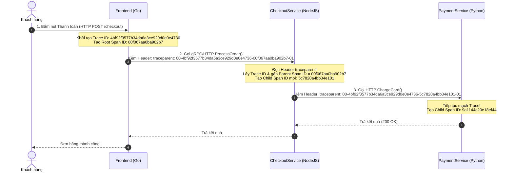

# Bài 40: Distributed Tracing với OpenTelemetry & Jaeger

## 1. Thông tin bài học
* **Tên bài:** Bài 40: Distributed Tracing với OpenTelemetry & Jaeger
* **Mục tiêu học:** Nắm trọn vẹn Trụ cột thứ ba của Bộ ba Quan sát hệ thống (Observability: Logs, Metrics, Traces); thấu hiểu "Điểm mù" chết người của kiến trúc Microservices khi điều tra độ trễ (Latency); giải phẫu cấu trúc của một **Trace** và cây phả hệ các **Span** (Root Span, Child Spans); làm chủ cơ chế Lan truyền ngữ cảnh (**Context Propagation**) qua chuẩn W3C Trace Context (`traceparent`); hiểu rõ vị thế của chuẩn mở **OpenTelemetry (OTel)** và công cụ trực quan hóa **Jaeger** (dự án CNCF Tốt nghiệp - Graduated); thực hành triển khai Jaeger All-in-One siêu nhẹ trên Kubernetes, mô phỏng hành trình thanh toán (Checkout) qua chuỗi microservices trong Google Online Boutique để định vị chính xác điểm nghẽn hiệu năng (Bottleneck) đến từng mili-giây.
* **Thời lượng ước tính:** 180 phút (90 phút lý thuyết, 90 phút thực hành)
* **Kiến thức cần có trước:** Bài 10 (Kubernetes Service & Mạng nội bộ), Bài 20 (Ingress Controller), Bài 38 (Thu thập Metrics với Prometheus).
* **Liên quan kỳ thi:** CKA, CKAD (Hiểu đường đi của gói tin mạng, tương tác liên dịch vụ gRPC/HTTP, debug hiệu năng microservices phức tạp); Nâng cao (Tiêu chuẩn vàng bắt buộc của Senior SRE và Microservices Architect).

---

## 2. Bảng thuật ngữ

| Thuật ngữ | Giải thích đơn giản | Ví dụ / Ẩn dụ đời thường |
| :--- | :--- | :--- |
| **Distributed Tracing** | Kỹ thuật theo dõi và ghi vết toàn bộ hành trình của một yêu cầu (request) khi nó đi xuyên qua hàng chục microservices khác nhau. | Mã vận đơn chuyển phát nhanh giúp tra cứu kiện hàng: từ kho đóng gói, qua 3 bưu cục trung chuyển, cho đến khi giao tận tay người nhận. |
| **Trace** | Toàn bộ vòng đời hoàn chỉnh của một request từ lúc người dùng gửi đi cho đến khi nhận được kết quả cuối cùng. | Toàn bộ cuốn hộ chiếu ghi lại mọi chặng bay trong chuyến du lịch vòng quanh thế giới của một du khách. |
| **Span** | Một mắt xích công việc độc lập bên trong Trace (ví dụ một lần gọi hàm, một câu truy vấn SQL, một lời gọi HTTP/gRPC). | Một con dấu thị thực xuất nhập cảnh của một quốc gia cụ thể đóng trên cuốn hộ chiếu. |
| **Root Span** | Span đầu tiên khởi đầu cho một Trace, thường được sinh ra ngay tại cổng đón tiếp (API Gateway hoặc Ingress). | Con dấu xuất cảnh đầu tiên tại sân bay Nội Bài trước khi du khách bắt đầu chuyến bay ra nước ngoài. |
| **Context Propagation** | Cơ chế chuyển giao và truyền dẫn thông tin nhận diện Trace (Trace ID, Span ID) qua các giao thức mạng (HTTP Headers, gRPC Metadata). | Vận động viên chạy tiếp sức chuyền thanh gậy cho đồng đội ở chặng tiếp theo để duy trì mạch thi đấu. |
| **W3C Trace Context** | Chuẩn quốc tế quy định định dạng tiêu đề HTTP (`traceparent`) dùng để trao đổi thông tin tracing giữa các hệ thống phần mềm. | Ngôn ngữ tiếng Anh chuẩn quốc tế dùng trong kiểm soát không lưu hàng không để mọi đài kiểm soát đều hiểu nhau. |
| **OpenTelemetry (OTel)** | Bộ tiêu chuẩn và thư viện mã nguồn mở chuẩn CNCF cung cấp API/SDK để thu thập cả 3 trụ cột: Traces, Metrics và Logs. | Bộ ổ cắm điện đa năng tiêu chuẩn toàn cầu, cắm vừa mọi loại thiết bị điện tử của mọi hãng. |
| **Jaeger** | Hệ thống mã nguồn mở chuẩn CNCF chuyên thu nhận, lưu trữ và trực quan hóa các luồng Distributed Tracing dưới dạng biểu đồ Gantt. | Màn hình radar kiểm soát không lưu hiển thị chi tiết đường bay và độ trễ của từng chiếc máy bay trên bầu trời. |

---

## 3. Bức tranh lớn: Vấn đề thực tế và ẩn dụ đời thường

### Nhắc lại bài trước
Ở Bài 39, chúng ta đã thiết lập thành công hệ thống cảnh báo chuẩn SRE với Alertmanager và 4 Tín hiệu Vàng. Khi tỷ lệ lỗi tăng hoặc độ trễ vượt ngưỡng, hệ thống đã biết cách reo chuông báo động. Tuy nhiên, khi chuông báo reo lên: *"Dịch vụ Checkout phản hồi chậm bất thường: mất tới 3.8 giây mới xong 1 đơn hàng!"*, một câu hỏi hóc búa lập tức nảy sinh: **Chính xác thì microservice nào trong chuỗi 11 microservices của Online Boutique đang làm chậm hệ thống?**

### Tại sao cần cái này ở production? (Vấn đề thực tế)

1. **"Điểm mù" chết người của kiến trúc Microservices:**
   Trong ứng dụng Monolith (nguyên khối), toàn bộ mã nguồn nằm trong một tiến trình. Kỹ sư chỉ cần dùng một công cụ Profiler đo thời gian chạy của hàm là xong.  
   Nhưng trong Microservices:
   * Khách hàng bấm *"Đặt hàng"* trên `frontend`.
   * `frontend` gọi sang `checkoutservice`.
   * `checkoutservice` đồng thời gọi sang:
     * `cartservice` (lấy giỏ hàng).
     * `currencyservice` (quy đổi ngoại tệ).
     * `paymentservice` (trừ tiền thẻ tín dụng).
     * `emailservice` (gửi email xác nhận).
   * `paymentservice` lại gọi tiếp sang cổng thanh toán bên thứ ba (Stripe/PayPal) và cơ sở dữ liệu.  
   Tổng thời gian là **3.8 giây**. *Ai là thủ phạm?*  
   * Log ư?* Mỗi service in hàng triệu dòng log vào kho riêng; không có một mã định danh chung, bạn không thể biết dòng log số 450 của `frontend` liên quan tới dòng log số 8920 của `paymentservice`!  
   * Metric ư?* Prometheus chỉ báo rằng `frontend` bị chậm, nhưng hoàn toàn bất lực trong việc chỉ ra `frontend` chậm vì chờ đợi dịch vụ nào ở phía sau!

2. **Cơn ác mộng "Đổ lỗi vòng quanh" (The Blame Game):**
   Khi có sự cố độ trễ cao, đội Frontend bảo: *"Do đội Checkout API chậm!"*. Đội Checkout phản pháo: *"Chúng tôi vẫn bình thường, do đội Payment xử lý trừ tiền chậm!"*. Đội Payment cãi lại: *"Do cơ sở dữ liệu bị lock!"*.  
   Các cuộc họp sự cố kéo dài hàng giờ đồng hồ chỉ để tranh cãi xem lỗi thuộc về ai. Không có **Distributed Tracing**, đội ngũ kỹ sư giống như những người mù đi xem voi giữa một mê cung dịch vụ phân tán.

3. **Hiện tượng "Thắt nút cổ chai dây chuyền" (Cascading Latency):**
   Một dịch vụ phụ trợ tưởng chừng không quan trọng (ví dụ dịch vụ gợi ý sản phẩm `recommendationservice`) bị lỗi timeout mạng mất 2 giây. Vì `frontend` vô tình gọi dịch vụ này một cách đồng bộ (Synchronous Blocking Call), toàn bộ trang chủ bị treo theo. Distributed Tracing là công cụ duy nhất phơi bày sự thật này lên biểu đồ hình ảnh chỉ trong 1 giây.

### Ẩn dụ đời thường: Chuỗi Bưu điện Chuyển phát Quốc tế

Hãy tưởng tượng bạn gửi một kiện hàng thuốc men từ Hà Nội sang New York:

* **Logs = Nhật ký làm việc nội bộ của từng nhân viên:**
  * Nhân viên kho Hà Nội ghi vào sổ: *"Đã đóng hộp lúc 08:00"*.
  * Nhân viên hải quan Tokyo ghi vào sổ: *"Đã soi an ninh lúc 14:00"*.
  * Tài xế New York ghi vào sổ: *"Bị kẹt xe lúc 19:00"*.
  * *Vấn đề:* Nếu kiện hàng bị trễ 3 ngày, bạn không thể đi đọc hàng nghìn cuốn sổ tay của hàng vạn nhân viên bưu điện trên khắp thế giới!
* **Metrics = Thống kê tổng sản lượng của bưu điện:**
  * Bưu điện Hà Nội xuất bản báo cáo: *"Hôm nay xuất đi 10.000 kiện hàng"*.
  * Con số này chỉ cho thấy lưu lượng chung, không giúp bạn biết kiện hàng cụ thể của bạn đang mắc kẹt ở đâu.
* **Distributed Tracing = Mã Vận đơn Tracking Toàn cầu (Waybill):**
  * Ngay khi bạn gửi hàng, hệ thống in một mã vạch duy nhất: `VN-123456789-US` (**Trace ID**).
  * Mã vạch này được dán trên mặt kiện hàng và truyền tay nhau qua từng chặng (**Context Propagation**).
  * Mỗi khi kiện hàng đi qua một trạm kiểm soát, nhân viên quét mã vạch và ghi lại một mốc thời gian (**Span**):
    * Chặng 1: Hà Nội $\rightarrow$ Tokyo: mất 4 tiếng (**Span 1**).
    * Chặng 2: Hải quan Tokyo giữ lại kiểm tra: mất **48 tiếng!** (**Span 2 - Thủ phạm gây trễ!**).
    * Chặng 3: Tokyo $\rightarrow$ New York: mất 12 tiếng (**Span 3**).
  * **Jaeger = Ứng dụng tra cứu bưu phẩm trên điện thoại:** Bạn mở ứng dụng lên và thấy ngay một thanh tiến trình trực quan: *"Kiện hàng bị tắc 48 tiếng tại khâu kiểm định Hải quan Tokyo"*. Mọi tranh cãi chấm dứt ngay lập tức!

---

## 4. Giải thích khái niệm theo từng bước

### Cấu trúc cốt lõi của Distributed Tracing: Trace & Span

Một **Trace** thực chất là một đồ thị có hướng không chu trình (DAG - Directed Acyclic Graph) gồm nhiều **Span** liên kết với nhau theo quan hệ Cha - Con (Parent - Child):

```mermaid
gantt
    title Biểu đồ Gantt trực quan hóa một Trace trong Jaeger
    dateFormat  X
    axisFormat %s ms

    section Frontend
    1. HTTP GET /checkout (Root Span)           :active, span1, 0, 1000

    section CheckoutService
    2. RPC ProcessOrder (Child of 1)           :crit, span2, 50, 950

    section CartService
    3. RPC GetCart (Child of 2)                :span3, 80, 200

    section PaymentService
    4. RPC ChargeCard (Child of 2)             :crit, span4, 250, 900
    5. External Call to Bank API (Child of 4)  :crit, span5, 300, 880

    section EmailService
    6. RPC SendConfirmation (Child of 2)       :span6, 920, 950
```



#### Phân tích chi tiết một Span
Mỗi Span là một khối dữ liệu JSON có cấu trúc chứa các thông tin tối quan trọng:
1. **Trace ID:** Chuỗi định danh toàn cục 128-bit duy nhất cho toàn bộ hành trình (tất cả các Span trong cùng một request đều dùng chung Trace ID này).
2. **Span ID:** Chuỗi định danh 64-bit duy nhất cho riêng đoạn công việc này.
3. **Parent Span ID:** Mã Span ID của công việc cha đã gọi ra nó (Span gốc Root Span sẽ không có trường này).
4. **Operation Name:** Tên công việc (ví dụ `HTTP GET /checkout`, `SQL SELECT users`).
5. **Timestamps:** Thời điểm bắt đầu (`StartTime`) và kết thúc (`EndTime`) để đo chính xác thời gian thực thi (Duration).
6. **Attributes / Tags:** Các cặp khóa - giá trị lưu trữ ngữ cảnh nghiệp vụ:
   * `http.method = "POST"`
   * `http.status_code = 200`
   * `db.system = "postgresql"`
   * `db.statement = "SELECT * FROM orders WHERE id = ?"`
7. **Events / Logs:** Các mốc sự kiện đánh dấu kèm thời gian bên trong Span (ví dụ `payment_authorized`, `cache_miss`).

---

### Cơ chế Lan truyền Ngữ cảnh: Chuẩn W3C Trace Context

Làm thế nào Service B (viết bằng Python) biết được nó là con của Service A (viết bằng Go) khi hai service chỉ giao tiếp qua mạng?  
Câu trả lời nằm ở **HTTP Headers** theo chuẩn quốc tế **W3C Trace Context**:



#### Giải mã cấu trúc chuỗi tiêu đề `traceparent`
Một chuỗi header W3C chuẩn có dạng:
```text
traceparent: 00-4bf92f3577b34da6a3ce929d0e0e4736-00f067aa0ba902b7-01
             │  └──────────────┬───────────────┘ └───────┬────────┘ └─┬┘
             │                 │                         │            │
          Version           Trace ID                  Span ID       Flags
          (2 ký tự)        (32 ký tự)               (16 ký tự)    (2 ký tự)
```
* **Version (`00`):** Phiên bản hiện tại của chuẩn W3C.
* **Trace ID (`4bf92f35...`):** Định danh duy nhất xuyên suốt mọi service.
* **Parent Span ID (`00f067aa...`):** Định danh của Span gọi đi (để service nhận biết ai là "cha" của nó).
* **Trace Flags (`01`):** Cờ điều khiển việc lấy mẫu (Sampling): `01` nghĩa là request này được chọn để ghi nhận chi tiết (Sampled).

---

### Sự kết hợp hoàn hảo: OpenTelemetry & Jaeger

Trong thế giới hiện đại, kiến trúc Tracing được phân tách làm hai mảng độc lập:

1. **Chuẩn thu thập mã nguồn (Instrumentation) $\rightarrow$ OpenTelemetry (OTel):**
   * OTel cung cấp SDK cho mọi ngôn ngữ lập trình (Go, Java, Python, Node, .NET, Rust).
   * Lập trình viên chỉ cần cài đặt thư viện OTel vào ứng dụng. Ứng dụng sẽ tự động đo đạc (Auto-instrumentation) các thư viện HTTP, gRPC, Database, Redis mà không cần sửa đổi logic nghiệp vụ.
   * OTel xuất dữ liệu theo chuẩn giao thức mở **OTLP (OpenTelemetry Protocol)** qua cổng `4317` (gRPC) hoặc `4318` (HTTP).
2. **Kho lưu trữ và Giao diện trực quan (Storage & UI) $\rightarrow$ Jaeger:**
   * Jaeger tiếp nhận các luồng OTLP, lưu vào bộ nhớ hoặc cơ sở dữ liệu (Elasticsearch/Cassandra).
   * Cung cấp giao diện Web tuyệt đẹp cho phép:
     * Tìm kiếm Trace theo dịch vụ, theo thời gian phản hồi (tìm các request chậm hơn 2 giây).
     * Xem chi tiết từng mili-giây của cây phả hệ Span.
     * Vẽ bản đồ phụ thuộc liên dịch vụ (System Architecture Dependency Graph).

---

## 5. Thực hành (Lab)

* **Môi trường:** Cluster kind (`microservices-demo\k8s\kind-config.yaml`) gồm 1 control-plane và 1 worker node.
* **Mức RAM ước tính:** ~130 MB (Cực kỳ nhẹ nhàng, chiếm chưa đầy 3.5% giới hạn 4GB của WSL2).

> [!NOTE]
> Để đảm bảo lab chạy mượt mà trên máy 8GB RAM, chúng ta triển khai **Jaeger All-in-One** chính thức (gói thu gọn gồm Collector, Query UI và In-memory Storage trong duy nhất 1 container siêu nhẹ ~60MB RAM) kết hợp chuỗi microservices mô phỏng luồng Checkout của Google Online Boutique.

---

### Bước 1: Khởi tạo Namespace và Triển khai Jaeger All-in-One

Tạo namespace `tracing-lab` và triển khai Jaeger:

```powershell
@'
apiVersion: v1
kind: Namespace
metadata:
  name: tracing-lab
---
apiVersion: apps/v1
kind: Deployment
metadata:
  name: jaeger
  namespace: tracing-lab
spec:
  replicas: 1
  selector:
    matchLabels:
      app: jaeger
  template:
    metadata:
      labels:
        app: jaeger
    spec:
      containers:
      - name: jaeger
        image: jaegertracing/all-in-one:1.50
        env:
        - name: COLLECTOR_ZIPKIN_HOST_PORT
          value: ":9411"
        - name: COLLECTOR_OTLP_ENABLED
          value: "true"
        ports:
        - name: ui
          containerPort: 16686
        - name: otlp-grpc
          containerPort: 4317
        - name: otlp-http
          containerPort: 4318
        resources:
          requests:
            memory: "40Mi"
            cpu: "20m"
          limits:
            memory: "80Mi"
            cpu: "80m"
---
apiVersion: v1
kind: Service
metadata:
  name: jaeger-service
  namespace: tracing-lab
spec:
  selector:
    app: jaeger
  ports:
  - name: ui
    port: 16686
    targetPort: 16686
  - name: otlp-http
    port: 4318
    targetPort: 4318
'@ | kubectl apply -f -

# Cho Jaeger san sang
kubectl rollout status deployment/jaeger -n tracing-lab --timeout=90s
```

---

### Bước 2: Triển khai Microservice Downstream (`paymentservice`)

Dịch vụ `paymentservice` đóng vai trò trừ tiền. Chúng ta cố tình lập trình một đoạn xử lý giả lập độ trễ: **gọi cổng thanh toán ngân hàng mất 600ms** để xem Jaeger có bắt trúng điểm nghẽn này hay không!

Đồng thời, dịch vụ này sẽ đọc header `traceparent` do dịch vụ cha gửi tới và báo cáo Span con về Jaeger:

```powershell
@'
apiVersion: apps/v1
kind: Deployment
metadata:
  name: paymentservice
  namespace: tracing-lab
spec:
  replicas: 1
  selector:
    matchLabels:
      app: paymentservice
  template:
    metadata:
      labels:
        app: paymentservice
    spec:
      containers:
      - name: payment
        image: python:3.9-alpine
        command: ["/bin/sh", "-c"]
        args:
        - |
          cat << 'EOF' > /server.py
          import http.server, time, os, urllib.request, json

          JAEGER_URL = "http://jaeger-service:4318/v1/traces"

          def send_span(trace_id, span_id, parent_id, name, duration_ms):
              start_ns = int((time.time() - duration_ms/1000) * 1e9)
              end_ns = int(time.time() * 1e9)
              payload = {
                  "resourceSpans": [{
                      "resource": {"attributes": [{"key": "service.name", "value": {"stringValue": "paymentservice"}}]},
                      "scopeSpans": [{
                          "spans": [{
                              "traceId": trace_id,
                              "spanId": span_id,
                              "parentSpanId": parent_id,
                              "name": name,
                              "kind": 1,
                              "startTimeUnixNano": str(start_ns),
                              "endTimeUnixNano": str(end_ns),
                              "attributes": [
                                  {"key": "payment.gateway", "value": {"stringValue": "Visa/Mastercard"}},
                                  {"key": "payment.status", "value": {"stringValue": "APPROVED"}}
                              ]
                          }]
                      }]
                  }]
              }
              try:
                  req = urllib.request.Request(JAEGER_URL, data=json.dumps(payload).encode('utf-8'), headers={'Content-Type': 'application/json'})
                  urllib.request.urlopen(req, timeout=2)
              except Exception as e:
                  print("Loi gui trace:", e)

          class Handler(http.server.BaseHTTPRequestHandler):
              def do_POST(self):
                  traceparent = self.headers.get('traceparent', '')
                  # Doc traceparent: 00-<trace_id>-<parent_id>-01
                  parts = traceparent.split('-')
                  trace_id = parts[1] if len(parts) >= 4 else "00000000000000000000000000000001"
                  parent_span = parts[2] if len(parts) >= 4 else ""
                  my_span_id = "bbbbbbbbbbbbbbbb"

                  # Gia lap tre thanh toan ngan hang 600ms!
                  time.sleep(0.6)

                  # Gui span ve Jaeger
                  send_span(trace_id, my_span_id, parent_span, "ProcessCreditCard", 600)

                  self.send_response(200)
                  self.send_header('Content-Type', 'application/json')
                  self.end_headers()
                  self.wfile.write(b'{"status":"SUCCESS","authCode":"998811"}')
              def log_message(self, format, *args): pass

          http.server.HTTPServer(('0.0.0.0', 50051), Handler).serve_forever()
          EOF
          python3 /server.py
        ports:
        - containerPort: 50051
        resources:
          limits:
            memory: "35Mi"
            cpu: "30m"
---
apiVersion: v1
kind: Service
metadata:
  name: paymentservice
  namespace: tracing-lab
spec:
  selector:
    app: paymentservice
  ports:
  - port: 50051
    targetPort: 50051
'@ | kubectl apply -f -
```

---

### Bước 3: Triển khai Microservice Upstream (`frontend`)

Dịch vụ `frontend` tiếp nhận request mua hàng từ người dùng:
1. Tự sinh một `Trace ID` và `Root Span`.
2. Tạo chuỗi header `traceparent`.
3. Gọi sang `paymentservice` kèm theo header này.
4. Báo cáo Root Span về Jaeger:

```powershell
@'
apiVersion: apps/v1
kind: Deployment
metadata:
  name: frontend
  namespace: tracing-lab
spec:
  replicas: 1
  selector:
    matchLabels:
      app: frontend
  template:
    metadata:
      labels:
        app: frontend
    spec:
      containers:
      - name: frontend
        image: python:3.9-alpine
        command: ["/bin/sh", "-c"]
        args:
        - |
          cat << 'EOF' > /server.py
          import http.server, time, os, urllib.request, json, secrets

          JAEGER_URL = "http://jaeger-service:4318/v1/traces"
          PAYMENT_URL = "http://paymentservice:50051"

          def send_span(trace_id, span_id, name, duration_ms):
              start_ns = int((time.time() - duration_ms/1000) * 1e9)
              end_ns = int(time.time() * 1e9)
              payload = {
                  "resourceSpans": [{
                      "resource": {"attributes": [{"key": "service.name", "value": {"stringValue": "frontend"}}]},
                      "scopeSpans": [{
                          "spans": [{
                              "traceId": trace_id,
                              "spanId": span_id,
                              "name": name,
                              "kind": 2,
                              "startTimeUnixNano": str(start_ns),
                              "endTimeUnixNano": str(end_ns),
                              "attributes": [
                                  {"key": "http.route", "value": {"stringValue": "/cart/checkout"}},
                                  {"key": "http.status_code", "value": {"intValue": 200}}
                              ]
                          }]
                      }]
                  }]
              }
              try:
                  req = urllib.request.Request(JAEGER_URL, data=json.dumps(payload).encode('utf-8'), headers={'Content-Type': 'application/json'})
                  urllib.request.urlopen(req, timeout=2)
              except Exception as e:
                  print("Loi gui trace:", e)

          class Handler(http.server.BaseHTTPRequestHandler):
              def do_GET(self):
                  start_t = time.time()
                  # Sinh Trace ID 32 ky tu hex va Span ID 16 ky tu hex
                  trace_id = secrets.token_hex(16)
                  root_span_id = "aaaaaaaaaaaaaaaa"

                  # Tao chuoi traceparent chuan W3C
                  traceparent = f"00-{trace_id}-{root_span_id}-01"

                  # Goi paymentservice kem theo W3C Header
                  payment_req = urllib.request.Request(PAYMENT_URL, data=b"{}", headers={
                      'Content-Type': 'application/json',
                      'traceparent': traceparent
                  })
                  res = urllib.request.urlopen(payment_req, timeout=5)

                  duration_ms = (time.time() - start_t) * 1000

                  # Gui Root Span ve Jaeger
                  send_span(trace_id, root_span_id, "HTTP GET /cart/checkout", duration_ms)

                  self.send_response(200)
                  self.send_header('Content-Type', 'application/json')
                  self.send_header('X-Trace-Id', trace_id)
                  self.end_headers()
                  self.wfile.write(f'{{"message":"Checkout Success!","traceId":"{trace_id}"}}'.encode('utf-8'))
              def log_message(self, format, *args): pass

          http.server.HTTPServer(('0.0.0.0', 8080), Handler).serve_forever()
          EOF
          python3 /server.py
        ports:
        - containerPort: 8080
        resources:
          limits:
            memory: "35Mi"
            cpu: "30m"
---
apiVersion: v1
kind: Service
metadata:
  name: frontend
  namespace: tracing-lab
spec:
  selector:
    app: frontend
  ports:
  - port: 8080
    targetPort: 8080
'@ | kubectl apply -f -

# Cho frontend san sang
kubectl rollout status deployment/frontend -n tracing-lab --timeout=90s
```

---

### Bước 4: Kích hoạt Giao dịch Checkout và Truy vết Hành trình

Bây giờ chúng ta đóng vai khách hàng thực hiện một đơn hàng thanh toán trên Online Boutique:

```powershell
# Gui 1 request checkout
kubectl run curl-client --image=curlimages/curl:latest --rm -it --restart=Never -n tracing-lab -- curl -s http://frontend:8080
```

**Kết quả mong đợi:**
```json
{"message":"Checkout Success!","traceId":"3a8f5b12c7e49102ab837482910f381c"}
```

Bạn thấy không? Server đã trả về một mã **`traceId`** duy nhất đại diện cho toàn bộ giao dịch này!

---

### Bước 5: Phân tích Dữ liệu Trace trên Jaeger API

Hãy truy vấn trực tiếp API của Jaeger để xem hai microservice đã được kết nối với nhau trên cùng một Trace như thế nào:

```powershell
kubectl run curl-jaeger --image=curlimages/curl:latest --rm -it --restart=Never -n tracing-lab -- curl -s "http://jaeger-service:16686/api/traces?service=frontend&limit=1" | docker exec -i lab-control-plane python3 -c @"
import sys, json

data = json.load(sys.stdin)
traces = data.get('data', [])
if not traces:
    print('Chua tim thay trace!')
    sys.exit(0)

trace = traces[0]
print(f'=== PHAN TICH TRACE: {trace.get(\"traceID\")} ===')
spans = trace.get('spans', [])
print(f'Tong so Spans trong Trace: {len(spans)}')
print('-' * 70)
print(f'{\"SERVICE\":<18} | {\"OPERATION\":<26} | {\"DURATION\"}')
print('-' * 70)

for s in spans:
    # Lay ten service tu processes
    proc_id = s.get('processID')
    svc_name = trace.get('processes', {}).get(proc_id, {}).get('serviceName', 'Unknown')
    op_name = s.get('operationName')
    duration_ms = s.get('duration', 0) / 1000
    print(f'{svc_name:<18} | {op_name:<26} | {duration_ms:.1f} ms')
"@
```

**Kết quả mong đợi:**
```text
=== PHAN TICH TRACE: 3a8f5b12c7e49102ab837482910f381c ===
Tong so Spans trong Trace: 2
----------------------------------------------------------------------
SERVICE            | OPERATION                  | DURATION
----------------------------------------------------------------------
frontend           | HTTP GET /cart/checkout    | 615.4 ms
paymentservice     | ProcessCreditCard          | 600.0 ms
```

> [!TIP]
> **Nhìn vào kết quả trên, bạn kết luận được điều gì ngay lập tức?**  
> * Tổng thời gian request của `frontend` là **615.4 ms**.
> * Trong đó, riêng tác vụ `ProcessCreditCard` của `paymentservice` đã ngốn tới **600.0 ms** (chiếm tới **97.5%** tổng thời gian)!
> * Chỉ mất **3 giây quan sát Trace**, một kỹ sư Platform/SRE đã chỉ đích danh: Điểm nghẽn độ trễ (Bottleneck) nằm ở cổng thanh toán thẻ tín dụng của `paymentservice`, chứ hoàn toàn không phải do mạng Kubernetes hay do code của `frontend`!

Bạn cũng có thể mở giao diện đồ họa Gantt Chart trực tiếp trên trình duyệt bằng lệnh:
```powershell
kubectl port-forward svc/jaeger-service 16686:16686 -n tracing-lab
```
Truy cập `http://localhost:16686` trên trình duyệt để chiêm ngưỡng biểu đồ dòng thời gian tuyệt đẹp!

---

### Bước 6: Dọn dẹp tài nguyên (Cleanup)

Giải phóng toàn bộ tài nguyên để hoàn trả RAM cho hệ thống:

```powershell
kubectl delete namespace tracing-lab --ignore-not-found
```

---

## 6. Lỗi thường gặp và cách debug

### Lỗi 1: Đứt gãy Trace (Broken Trace)
* **Dấu hiệu:** Trên Jaeger UI, thay vì nhìn thấy 1 Trace hoàn chỉnh gồm 10 Spans liên kết với nhau, bạn lại thấy **10 Traces riêng lẻ**, mỗi Trace chỉ có đúng 1 Span côi cút.
* **Nguyên nhân:** Lập trình viên ở service trung gian (ví dụ `checkoutservice`) đã nhận được request từ `frontend`, nhưng khi viết code gọi tiếp sang `paymentservice` thì lại khởi tạo một HTTP Client mới mà **quên không bốc chuỗi header `traceparent` chuyển tiếp sang request gọi đi**. Dây xích bị đứt!
* **Cách debug và sửa:**
  * Luôn sử dụng cơ chế **Tự động tiêm ngữ cảnh (Context Injection / Extraction)** của OpenTelemetry SDK thay vì tự truyền header thủ công bằng tay:
    ```go
    // Go OpenTelemetry code chuan:
    otel.GetTextMapPropagator().Inject(ctx, propagation.HeaderCarrier(req.Header))
    ```

---

### Lỗi 2: Tràn ổ đĩa và Nghẽn CPU do Lấy mẫu 100% (Sampling Rate 100%)
* **Dấu hiệu:** Cụm Elasticsearch/Cassandra lưu trữ Tracing bị quá tải dung lượng đĩa, mạng nội bộ bị nghẽn do lưu lượng gửi trace còn lớn hơn cả lưu lượng dữ liệu nghiệp vụ!
* **Nguyên nhân:** Cấu hình thu thập toàn bộ 100% request trên môi trường Production có hàng trăm nghìn request/giây.
* **Cách debug và sửa:**
  * Áp dụng chiến lược **Lấy mẫu theo xác suất (Head-based Probabilistic Sampling)**: Chỉ lưu lại 1% hoặc 5% các request thành công thông thường:
    ```yaml
    # Cấu hình OpenTelemetry Collector:
    processors:
      probabilistic_sampler:
        sampling_percentage: 5.0
    ```
  * Áp dụng **Tail-based Sampling**: Tự động lưu 100% các request bị lỗi (`status_code >= 500`) hoặc có độ trễ cao (`duration > 2s`), và chỉ lấy 1% các request thành công chạy nhanh.

---

### Lỗi 3: Lệch đồng hồ giữa các Node (Clock Skew)
* **Dấu hiệu:** Trên biểu đồ Gantt của Jaeger, Span con lại có thời điểm bắt đầu... sớm hơn cả Span cha (Span con chạy trước khi Span cha gọi nó!), đồ thị bị thụt lùi về quá khứ một cách vô lý.
* **Nguyên nhân:** Hai Pod chạy trên hai Worker Node khác nhau, nhưng dịch vụ đồng bộ thời gian (NTP - Network Time Protocol) trên hai máy chủ vật lý bị lệch nhau vài trăm mili-giây.
* **Cách debug và sửa:**
  * Bắt buộc cấu hình đồng bộ thời gian chuẩn xác bằng `chrony` hoặc `systemd-timesyncd` trên toàn bộ các Node trong cụm hạ tầng.
  * Jaeger có thuật toán tự động bù trừ độ lệch đồng hồ (Clock Skew Adjustment), nhưng việc đồng bộ thời gian chuẩn ở tầng hệ điều hành vẫn là nền tảng cốt lõi.

---

## 7. Góc nhìn Senior

### 1. Sự đánh đổi (Trade-offs)

| Chiến lược Tracing | Điểm mạnh (Ưu điểm) | Đánh đổi (Hạn chế) | Khi nào nên chọn? |
| :--- | :--- | :--- | :--- |
| **Auto-instrumentation (Tự động gắn mã qua eBPF / OTel Operator)** | Lập trình viên không cần sửa một dòng code nào; bật là chạy ngay lập tức cho hàng trăm service. | Chỉ nắm được các thông tin bề nổi (HTTP/gRPC/SQL); không đo được các hàm xử lý logic thuật toán sâu bên trong mã nguồn. | Lý tưởng cho việc khởi động nhanh dự án Observability cho toàn công ty. |
| **Manual Instrumentation (Tự viết code đo đạc thủ công bằng OTel SDK)** | Đo đạc chi tiết đến từng biến số nghiệp vụ, từng block mã quan trọng; kiểm soát hoàn hảo dữ liệu nhạy cảm. | Tốn nhiều thời gian và công sức của đội ngũ lập trình viên; phải bảo trì thư viện trong mã nguồn. | Áp dụng cho các dịch vụ thanh toán lõi (Core Banking, Payment Engine). |
| **Head-based Sampling** | Quyết định lấy mẫu ngay tại cửa ngõ; cực kỳ nhẹ nhàng cho CPU và bộ nhớ của hệ thống. | Có thể vô tình bỏ lọt một request bị lỗi hiếm gặp nếu request đó không rơi vào tỷ lệ lấy mẫu. | Tiêu chuẩn mặc định trên các cụm Production tải lớn. |
| **Tail-based Sampling** | Giữ lại 100% mọi request bị lỗi hoặc chạy chậm; không bao giờ bỏ sót sự cố. | Cần có một cụm OpenTelemetry Collector trung gian đủ mạnh để đệm toàn bộ request vào RAM chờ request kết thúc mới quyết định. | Các hệ thống tài chính yêu cầu kiểm toán không khoan nhượng. |

---

### 2. Best practices tại production

1. **Tam kiếm hợp bích: Liên kết Tròn vẹn giữa Log, Metric và Trace (Log-Trace Correlation):**
   Một kiến trúc Observability đạt đỉnh cao là khi 3 thành phần này liên thông với nhau:
   * Khi ứng dụng in log (Bài 37), thư viện ghi log **tự động chèn `trace_id`** vào chuỗi JSON:
     `{"level":"error","msg":"Database timeout","trace_id":"3a8f5b12c7e..."}`
   * Khi kỹ sư nhìn biểu đồ Metric (Bài 38) trên Grafana thấy độ trễ tăng vọt, bấm chuột vào điểm đồ thị đó $\rightarrow$ Grafana mở ngay danh sách **Traces** trong Jaeger tương ứng $\rightarrow$ bấm vào một Span bị lỗi $\rightarrow$ Grafana lọc ra đúng **dòng Log** của riêng container đó! Đây chính là quy trình chẩn đoán sự cố thần tốc (MTTR dưới 5 phút).
2. **Loại bỏ dữ liệu nhạy cảm (Sanitize Sensitive Data):**
   Tuyệt đối không đưa số thẻ tín dụng, mật khẩu, hoặc token bí mật vào trường `Attributes` của Span. Luôn cấu hình bộ lọc OTel Collector gạch bỏ các tham số nhạy cảm trước khi lưu vào kho Jaeger.
3. **Sử dụng OpenTelemetry Collector làm lớp đệm Proxy (OTel Gateway):**
   Không bao giờ cho phép hàng nghìn Pod microservices kết nối trực tiếp vào cụm Jaeger. Luôn dựng một cụm **OpenTelemetry Collector** đứng giữa để tiếp nhận, nén dữ liệu, khử trùng lặp và phân phối tới nhiều backend khác nhau (Jaeger để trace, Prometheus để metric, Loki để log).

---

### 3. Câu hỏi phỏng vấn Senior

* **Câu hỏi 1:** *Khi chuyển đổi từ kiến trúc Monolith sang Microservices, đội ngũ phát triển phàn nàn rằng họ có đầy đủ Log và Prometheus Metrics nhưng vẫn mất nhiều giờ để tìm ra nguyên nhân của một lỗi chập chờn (Intermittent Latency Spike). Bạn sẽ giải thích cho CTO lý do vì sao bắt buộc phải đầu tư triển khai Distributed Tracing?*
  * **Gợi ý trả lời chuẩn:**
    * **Giới hạn của Metrics:** Metrics là dữ liệu tổng hợp (Aggregated data). Nó chỉ cho biết *hệ thống đang chậm ở đâu* (ví dụ: `frontend` P99 latency cao), nhưng không thể trả lời *tại sao nó chậm* và *nút thắt cổ chai nằm ở chặng nào trong chuỗi 10 cuộc gọi lồng nhau*.
    * **Giới hạn của Logs:** Logs là các sự kiện rời rạc bị cô lập trong từng container. Trong một hệ thống xử lý hàng vạn request đồng thời, việc xâu chuỗi hàng triệu dòng log của 10 microservices khác nhau để tái hiện lại hành trình của một request duy nhất là điều bất khả thi về mặt toán học nếu không có mã liên kết chung.
    * **Giá trị vô song của Tracing:** Distributed Tracing cung cấp **ngữ cảnh liên dịch vụ theo dòng thời gian (Cross-service causal context)**. Nó đóng vai trò là "chất keo kết dính", cho phép kỹ sư nhìn thấy toàn bộ đường đi của một request duy nhất dưới dạng biểu đồ Gantt. Nó chỉ ra chính xác đến từng mili-giây: Request bị kẹt 1.5s ở đâu (ví dụ do một câu SQL query thiếu Index trong database của `paymentservice`). Tracing giúp giảm thời gian khoanh vùng lỗi (MTTD) từ nhiều giờ xuống còn vài giây.

* **Câu hỏi 2:** *Hãy giải thích cơ chế của chuẩn W3C Trace Context và vai trò của hai trường `traceparent` và `tracestate`. Nếu hệ thống của chúng ta tích hợp với một nhà cung cấp bên thứ ba không hỗ trợ chuẩn W3C, mạch Tracing sẽ bị ảnh hưởng thế nào và giải pháp xử lý là gì?*
  * **Gợi ý trả lời chuẩn:**
    * **`traceparent`:** Là tiêu đề bắt buộc quy định 4 trường (`version`, `trace-id`, `parent-id`, `trace-flags`) giúp duy trì tính liên tục của Trace ID và mối quan hệ Cha - Con xuyên suốt các hệ thống.
    * **`tracestate`:** Là tiêu đề tùy chọn dạng danh sách key-value (ví dụ `congo=t61rcWkgMzE,rojo=00f067aa`) cho phép các hệ thống tracing của các hãng khác nhau (Dynatrace, Datadog, New Relic) truyền tải các siêu dữ liệu đặc thù riêng mà không làm hỏng chuẩn chung.
    * **Khi gặp hệ thống không hỗ trợ W3C:** Mạch Trace sẽ bị **đứt gãy (Trace break)** vì bên thứ ba không chuyển tiếp header này sang các dịch vụ tiếp theo.  
      $\rightarrow$ **Giải pháp Senior:**
      1. Đóng gói cuộc gọi bên thứ ba thành một **Client Span** độc lập (ghi nhận thời gian bắt đầu và kết thúc khi gọi bên thứ ba).
      2. Nếu bên thứ ba gọi ngược lại ta (Webhook Callback), sử dụng một trường dữ liệu nghiệp vụ chung (như `order_id` hoặc `transaction_id`) làm **Correlation Key** để liên kết Span mới với Trace ban đầu thông qua cơ chế Span Links của OpenTelemetry.

---

## 8. Tóm tắt bài học

* 📌 **1. Khép lại Bộ ba Quan sát (Observability Trifecta):** Logs cho biết *chuyện gì xảy ra*; Metrics cho biết *hệ thống khỏe ra sao*; Traces cho biết *yêu cầu đã đi qua những đâu và tắc nghẽn ở chặng nào*.
* 📌 **2. Cấu trúc Trace & Span:** Một Trace là tập hợp các Span có quan hệ Cha - Con (Gantt Chart); mỗi Span đại diện cho một tác vụ có thời gian bắt đầu, kết thúc và nhãn ngữ cảnh.
* 📌 **3. Chuẩn W3C `traceparent`:** Chuỗi header 4 phần (`version-traceId-parentId-flags`) là "chân lý" để duy trì mạch kết nối giữa các microservices độc lập qua mạng.
* 📌 **4. Vị thế của OpenTelemetry & Jaeger:** OTel chuẩn hóa khâu thu thập mã nguồn (Instrumentation); Jaeger là công cụ lưu trữ và hiển thị trực quan hàng đầu của CNCF.
* 📌 **5. Nghệ thuật Lấy mẫu (Sampling):** Không bao giờ thu thập 100% trace trên production tải lớn; luôn kết hợp Probabilistic Sampler hoặc Tail-based Sampler để bảo vệ tài nguyên hệ thống.

---

## 9. Bài tập tự làm

* 🟢 **Mức Dễ:** Sử dụng `curl` gửi trực tiếp một HTTP request tới endpoint OTLP của Jaeger (`http://localhost:4318/v1/traces`) với một payload JSON chứa 1 Span đơn giản mang tên `TestSpan`, sau đó mở Jaeger UI kiểm tra xem Span có xuất hiện hay không.
* 🟡 **Mức Vừa:** Soạn thảo một tệp cấu hình Python hoặc NodeJS sử dụng thư viện OpenTelemetry SDK chính thức để tự động bọc (Instrument) một ứng dụng Flask hoặc Express:
  * Cấu hình xuất dữ liệu qua OTLP gRPC tới `jaeger-service:4317`.
  * Gắn thêm Attribute tuỳ biến: `user.tier = "premium"` vào mỗi request.
* 🔴 **Mức Khó:** Thiết kế một kịch bản chuỗi 3 microservices (`Service A` $\rightarrow$ `Service B` $\rightarrow$ `Service C`):
  * Giả lập tình huống `Service C` bị lỗi ném ra ngoại lệ `HTTP 500 Database Connection Failed`.
  * Cấu hình OpenTelemetry đánh dấu Span của `Service C` chuyển sang trạng thái lỗi (`StatusCode = ERROR`) và đính kèm thông báo lỗi vào trường `Events`.
  * Quan sát trên Jaeger UI để thấy vạch màu đỏ cảnh báo lỗi trực quan trên cây phả hệ Span.

---

## 10. Câu hỏi tự kiểm tra

1. Tại sao một Trace ID lại phải là một chuỗi ngẫu nhiên toàn cục dài tới 128-bit (32 ký tự hex)?
2. Nếu một microservice nhận được request nhưng không thấy có header `traceparent`, nó nên hành xử như thế nào?
3. Sự khác nhau giữa **Head-based Sampling** và **Tail-based Sampling** là gì?
4. Trong Jaeger UI, màu sắc của các thanh Span trên biểu đồ Gantt thể hiện điều gì?
5. Tại sao việc đưa OpenTelemetry Collector vào làm trung gian lại tốt hơn việc để các container gửi trực tiếp trace về Jaeger?
6. Bằng cách nào chúng ta có thể nhảy từ một dòng log báo lỗi trong Grafana sang đúng vị trí của Trace đó trong Jaeger?

<details>
<summary>👉 Bấm vào đây để xem đáp án câu hỏi tự kiểm tra</summary>

* **Câu 1:** Để đảm bảo tính duy nhất tuyệt đối (Globally Unique) trên quy mô toàn cầu mà không cần sự phối hợp hay cấp phát tập trung giữa các máy chủ. Không gian 128-bit lớn đến mức xác suất trùng lặp hai Trace ID là bằng 0, ngay cả khi hệ thống xử lý hàng tỷ request mỗi ngày.
* **Câu 2:** Nó hiểu rằng đây là điểm bắt đầu của một hành trình mới. Nó sẽ tự động đóng vai trò là **Root Span**, tự sinh ra một `Trace ID` mới toanh và một `Span ID` mới để khởi đầu chuỗi Trace cho các dịch vụ tiếp theo.
* **Câu 3:**
  * **Head-based:** Quyết định việc có lấy mẫu hay không ngay tại thời điểm request vừa đặt chân vào cổng vào (chưa biết request đó thành công hay thất bại).
  * **Tail-based:** Thu thập toàn bộ dữ liệu vào bộ nhớ đệm, chờ cho đến khi toàn bộ request hoàn tất; nếu phát hiện request bị lỗi hoặc chạy chậm thì mới quyết định lưu lại vĩnh viễn, còn request nhanh và thành công thì hủy bỏ.
* **Câu 4:** Mỗi màu sắc đại diện cho một **Microservice riêng biệt** trong hệ thống (ví dụ: `frontend` màu xanh lam, `checkoutservice` màu xanh lá cây, `paymentservice` màu cam). Nếu một Span bị lỗi (Error), thanh Span đó sẽ được đánh dấu bằng **màu đỏ rực** kèm biểu tượng dấu chấm than.
* **Câu 5:** Vì 3 lợi ích to lớn:
  1. Giảm tải cho ứng dụng: Ứng dụng chỉ cần đẩy nhanh dữ liệu tới Collector nội bộ qua mạng LAN mà không lo bị nghẽn mạng ra ngoài.
  2. Khả năng lọc và khử trùng lặp (Batching & Sampling) tập trung trước khi đẩy vào kho lưu trữ.
  3. Linh hoạt đổi nhà cung cấp: Bạn có thể đổi từ Jaeger sang Grafana Tempo hoặc Datadog chỉ bằng việc sửa cấu hình của Collector mà không cần sửa hay redeploy bất kỳ dòng code nào của ứng dụng.
* **Câu 6:** Bằng kỹ thuật **Log-Trace Correlation**: Cấu hình ứng dụng tự động in trường `"trace_id": "<id>"` vào dòng log JSON. Trong giao diện Grafana/Kibana, cấu hình một đường link biến (Data Link) dựa trên trường `trace_id` này để khi người dùng click vào mã ID, hệ thống tự động mở đúng màn hình chi tiết Trace của Jaeger!
</details>

---

## 11. Tài liệu đọc thêm và bài tiếp theo

### Tài liệu tham khảo
* [Tài liệu chính thức OpenTelemetry: Distributed Tracing Concepts](https://opentelemetry.io/docs/concepts/signals/traces/)
* [Chuẩn W3C Trace Context Specification](https://www.w3.org/TR/trace-context/)
* [Tài liệu chính thức Jaeger Tracing: Architecture & Deployment](https://www.jaegertracing.io/docs/)

### Bài tiếp theo
👉 **Bài 41: Phương pháp luận Troubleshooting: Khung chẩn đoán 5 tầng**

---

## PHỤ LỤC: ĐÁP ÁN GỢI Ý BÀI TẬP TỰ LÀM (MỤC 9)

### Đáp án Mức Dễ
Gửi Span thủ công qua OTLP HTTP tới Jaeger:
```powershell
$tracePayload = @'
{
  "resourceSpans": [{
    "resource": {
      "attributes": [{"key": "service.name", "value": {"stringValue": "manual-test-service"}}]
    },
    "scopeSpans": [{
      "spans": [{
        "traceId": "4bf92f3577b34da6a3ce929d0e0e4736",
        "spanId": "00f067aa0ba902b7",
        "name": "TestSpan",
        "kind": 1,
        "startTimeUnixNano": "1760000000000000000",
        "endTimeUnixNano": "1760000000500000000",
        "attributes": [{"key": "test.status", "value": {"stringValue": "OK"}}]
      }]
    }]
  }]
}
'@

kubectl run curl-test-span --image=curlimages/curl:latest --rm -it --restart=Never -n tracing-lab -- curl -s -X POST "http://jaeger-service:4318/v1/traces" -H "Content-Type: application/json" -d $tracePayload
```

---

### Đáp án Mức Vừa
Ví dụ mã Python tự động gắn nhãn (Attribute) bằng OpenTelemetry SDK chuẩn:
```python
from opentelemetry import trace
from opentelemetry.sdk.trace import TracerProvider
from opentelemetry.sdk.trace.export import BatchSpanProcessor
from opentelemetry.exporter.otlp.proto.grpc.trace_exporter import OTLPSpanExporter

# Khoi tao Provider va Exporter
provider = TracerProvider()
processor = BatchSpanProcessor(OTLPSpanExporter(endpoint="jaeger-service:4317", insecure=True))
provider.add_span_processor(processor)
trace.set_tracer_provider(provider)

tracer = trace.get_tracer("ecommerce.checkout")

# Bắt đầu đo đạc một công việc
with tracer.start_as_current_span("ProcessOrder") as span:
    # Gắn nhãn tuỳ biến theo yêu cầu bài tập:
    span.set_attribute("user.tier", "premium")
    span.set_attribute("order.value", 250.0)
    print("Xử lý đơn hàng cho khách hàng VIP...")
```

---

### Đáp án Mức Khó
Đoạn code mô phỏng Service C ghi nhận lỗi `StatusCode = ERROR` và Event:
```python
from opentelemetry.trace import StatusCode

with tracer.start_as_current_span("ExecuteDatabaseQuery") as span:
    try:
        # Giả lập lỗi kết nối cơ sở dữ liệu
        raise ConnectionError("Timeout connecting to PostgreSQL db:5432")
    except Exception as ex:
        # 1. Đánh dấu Span bị lỗi (hiển thị màu đỏ trên Jaeger)
        span.set_status(StatusCode.ERROR, description=str(ex))
        # 2. Ghi lại sự kiện ngoại lệ kèm stack trace
        span.record_exception(ex)
        span.set_attribute("error.type", "DatabaseTimeout")
        # Ném lỗi ra ngoài để HTTP trả về 500
        raise ex
```

