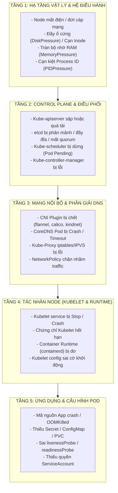
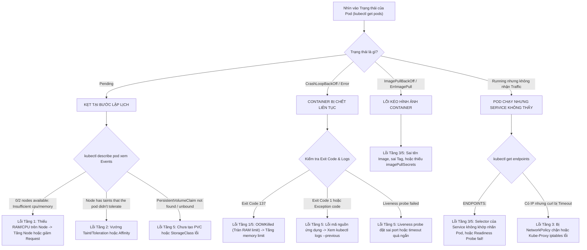

# Bài 41: Phương pháp luận Troubleshooting: Khung chẩn đoán 5 tầng

## 1. Thông tin bài học
* **Tên bài:** Bài 41: Phương pháp luận Troubleshooting: Khung chẩn đoán 5 tầng
* **Mục tiêu học:** Rèn luyện bản lĩnh và tư duy điều tra sự cố có hệ thống (Methodical Troubleshooting) của một Senior Platform/SRE Engineer; xóa bỏ vĩnh viễn thói quen "đoán mò" và restart mù quáng; làm chủ **Khung chẩn đoán 5 tầng** (Node $\rightarrow$ Control Plane $\rightarrow$ Mạng & DNS $\rightarrow$ Kubelet & Runtime $\rightarrow$ Ứng dụng & Pod); thành thạo cây quyết định chẩn đoán (Decision Tree) để khoanh vùng và cô lập điểm lỗi trong vòng 15 phút; nắm vững các công cụ điều tra hiện trường (`kubectl describe`, `journalctl`, `crictl`, `kubectl debug`); thực hành diễn tập xử lý sự cố đa tầng giả lập trên microservice của Google Online Boutique.
* **Thời lượng ước tính:** 180 phút (90 phút lý thuyết, 90 phút thực hành)
* **Kiến thức cần có trước:** Toàn bộ kiến thức nền tảng Giai đoạn 2 đến Giai đoạn 5 (Kiến trúc cụm, Pod, Service, CNI, Lập lịch, Quản lý tài nguyên).
* **Liên quan kỳ thi:** CKA (Trọng tâm cấu phần *Troubleshooting*: chiếm tới 30% tổng số điểm trong kỳ thi CKA; đề thi luôn đưa thí sinh vào các cụm Kubernetes bị cố tình làm hỏng ở nhiều tầng khác nhau và yêu cầu sửa chữa trong thời gian gấp rút).

---

## 2. Bảng thuật ngữ

| Thuật ngữ | Giải thích đơn giản | Ví dụ / Ẩn dụ đời thường |
| :--- | :--- | :--- |
| **Troubleshooting** | Quy trình điều tra có phương pháp nhằm xác định nguyên nhân gốc rễ và khắc phục sự cố hệ thống. | Bác sĩ khám bệnh: Đo nhiệt độ, xét nghiệm máu, chụp X-quang để tìm đúng ổ vi khuẩn thay vì cho uống thuốc bừa bãi. |
| **Shotgun Debugging** | Thói quen xấu: Thử sửa đổi lung tung các thông số hoặc restart bừa bãi với hy vọng may mắn hệ thống sẽ chạy lại. | Bắn một phát súng hoa cải vào bụi rậm với hy vọng trúng chim nhưng lại làm vỡ tan cửa kính nhà hàng xóm. |
| **Root Cause Analysis (RCA)** | Phân tích nguyên nhân gốc rễ: Tìm ra lý do sâu xa nhất tạo nên sự cố để ngăn chặn nó tái diễn vĩnh viễn. | Tìm ra nguyên nhân chập dây điện ngầm trong tường thay vì chỉ thay bóng đèn mới bị cháy. |
| **Node Conditions** | Các cờ trạng thái sức khỏe của Worker Node do Kubelet báo cáo (`DiskPressure`, `MemoryPressure`, `PIDPressure`, `Ready`). | Bảng kết quả xét nghiệm sinh hóa máu: Thiếu máu, men gan cao, huyết áp cao. |
| **Endpoints / EndpointSlice** | Đối tượng Kubernetes lưu trữ danh sách địa chỉ IP thực tế của các Pod đang sẵn sàng đón nhận lưu lượng từ Service. | Danh sách số điện thoại bàn của các nhân viên đang ngồi tại quầy giao dịch sẵn sàng tiếp khách. |
| **Liveness vs Readiness Probe** | Hai bộ kiểm tra sức khỏe của Pod: Liveness kiểm tra Pod có sống không (chết thì restart); Readiness kiểm tra Pod đã sẵn sàng phục vụ chưa (chưa thì ngắt traffic). | Liveness là kiểm tra xem nhân viên còn thở không; Readiness là kiểm tra xem nhân viên đã tỉnh ngủ và sẵn sàng làm việc chưa. |
| **Ephemeral Debug Container** | Container cứu hộ tạm thời được nhúng trực tiếp vào Linux Namespaces của một Pod đang chạy để mượn công cụ debug mạng/tiến trình. | Hộp cứu thương và thang dây của lính cứu hỏa đưa vào tòa nhà đang cháy để cứu nạn mà không cần phá tường. |
| **Blameless Post-mortem** | Văn hóa kiểm điểm sự cố không đổ lỗi: Tập trung sửa đổi quy trình và hệ thống thay vì quy trách nhiệm cá nhân cho kỹ sư gõ nhầm lệnh. | Điều tra tai nạn hàng không: Tìm lỗi thiết kế máy bay hoặc quy trình bay để nâng cấp toàn ngành chứ không phạt cá nhân phi công. |

---

## 3. Bức tranh lớn: Vấn đề thực tế và ẩn dụ đời thường

### Nhắc lại bài trước
Ở Bài 40, chúng ta đã chinh phục Distributed Tracing với OpenTelemetry và Jaeger để truy vết đường đi của request qua chuỗi microservices. Tracing và Metrics giúp chúng ta **nhìn thấy triệu chứng bệnh**. Tuy nhiên, khi một cụm Production gặp sự cố diện rộng: hàng loạt Node chuyển màu đỏ `NotReady`, hàng chục Pod rơi vào trạng thái `CrashLoopBackOff` hoặc `Pending`, công cụ quan sát không thể tự sửa chữa hệ thống. Bạn cần một **Phương pháp luận chẩn đoán khoa học** để cứu sống cụm Kubernetes trong thời gian ngắn nhất!

### Tại sao cần cái này ở production? (Vấn đề thực tế)

1. **Thảm họa "Sửa một đằng, hỏng một nẻo" (Shotgun Debugging):**
   Một kỹ sư mới thấy Pod bị lỗi `CrashLoopBackOff`. Theo phản xạ, kỹ sư gõ `kubectl delete pod` để Kubernetes tự tạo lại. Pod mới sinh ra lại tiếp tục crash. Kỹ sư SSH vào Node gõ `systemctl restart docker`, rồi restart cả máy chủ vật lý.  
   *Hậu quả:* Toàn bộ các Pod khác đang chạy yên ổn trên Node đó bị ngắt kết nối đột ngột, gây ra sự cố dây chuyền cho toàn bộ sàn thương mại điện tử! Trong khi đó, nguyên nhân thực sự chỉ là do... một biến môi trường trong ConfigMap bị viết sai chính tả.

2. **Áp lực ngàn cân lúc nửa đêm (15-Minute Outage Clock):**
   Khi hệ thống Production ngừng hoạt động, mỗi phút trôi qua doanh nghiệp có thể thiệt hại hàng trăm triệu đồng. Giám đốc kỹ thuật (CTO) và đội ngũ kinh doanh liên tục hối thúc trong kênh sự cố khẩn cấp.  
   Nếu bạn không có một **Khung chẩn đoán 5 tầng** đã được rèn luyện thành phản xạ, bạn sẽ rơi vào trạng thái hoảng loạn tâm lý, bấm loạn các câu lệnh và làm mất hoàn toàn dấu vết hiện trường quý giá để điều tra.

3. **Cái bẫy "Lỗi chồng lỗi" (Cascading Failures):**
   Trong Kubernetes, một lỗi ở tầng thấp (ví dụ: CoreDNS bị nghẽn mạng) sẽ biểu hiện ra ngoài bằng hàng loạt triệu chứng ở tầng cao: ứng dụng không kết nối được Database, ReadinessProbe bị thất bại, Kubelet gỡ Pod ra khỏi Service, và Ingress trả về lỗi 503. Nếu bạn chỉ chăm chăm đi debug code ứng dụng ở tầng cao nhất, bạn sẽ mãi mãi không bao giờ tìm ra thủ phạm thực sự đang ẩn náu ở tầng mạng bên dưới!

### Ẩn dụ đời thường: Đội Cứu hộ Tòa nhà Chọc trời

Hãy hình dung một tòa nhà văn phòng hiện đại 80 tầng đột nhiên mất nước toàn bộ:

* **Cách tiếp cận sai lầm (Đoán mò):**
  Nhân viên bảo vệ chạy lên tầng 50 gõ cửa từng phòng, vặn thử vòi nước ở từng bồn rửa mặt, rồi tháo tung đường ống trong nhà vệ sinh của phòng 502 để xem có tắc rác không. Hành động này vừa tốn thời gian, vừa phá hỏng đồ đạc mà không giải quyết được vấn đề!
* **Cách tiếp cận chuẩn SRE (Khung 5 tầng từ Gốc đến Ngọn):**
  1. **Tầng 1 (Nguồn cấp thành phố):** Xuống tầng hầm kiểm tra đồng hồ nước tổng: Nhà máy nước thành phố có đang cấp nước vào tòa nhà không? (Kiểm tra Node & Phần cứng).
  2. **Tầng 2 (Máy bơm trung tâm):** Kiểm tra trạm máy bơm áp lực lớn dưới tầng hầm có đang chạy không, nguồn điện cấp cho máy bơm có bị ngắt không? (Kiểm tra Control Plane & Kube-apiserver).
  3. **Tầng 3 (Trục ống dẫn chính):** Kiểm tra trục ống nước thẳng đứng chạy dọc 80 tầng: Có đoạn nào bị vỡ hoặc van khóa tầng có bị đóng không? (Kiểm tra Mạng CNI & DNS).
  4. **Tầng 4 (Van điều áp từng tầng):** Kiểm tra van giảm áp tại hành lang của tầng: Nước có vào được hành lang không? (Kiểm tra Kubelet & Runtime).
  5. **Tầng 5 (Vòi nước trong phòng):** Nếu nước đã đến tận cửa phòng mà vòi rửa mặt không chảy, lúc này mới kiểm tra van vòi nước của bồn rửa! (Kiểm tra Ứng dụng & Pod Spec).

---

## 4. Giải thích khái niệm theo từng bước

### Khung chẩn đoán 5 tầng trong Kubernetes (The 5-Layer Framework)

Mọi sự cố trong Kubernetes, không có ngoại lệ, đều bắt nguồn từ một trong 5 tầng logic sau đây. Một kỹ sư giỏi luôn điều tra tuần tự từ dưới lên trên:



---

### Mổ xẻ chi tiết từng Tầng và Bộ Lệnh Chẩn đoán

#### Tầng 1: Hạ tầng Vật lý & Worker Node
* **Mục tiêu:** Xác định xem máy chủ vật lý hoặc máy ảo có đang đủ điều kiện sống để chạy container hay không.
* **Các dấu hiệu bất thường:** Node chuyển trạng thái `NotReady`, hoặc xuất hiện cờ cảnh báo `SchedulingDisabled`.
* **Bộ lệnh chẩn đoán nhanh:**
  ```powershell
  # 1. Kiem tra trang thai tong quan va cac Conditions cua Node
  kubectl get nodes -o wide
  kubectl describe node <node-name> | grep -A 5 Conditions

  # 2. Neu co quyen truy cap Host (hoac docker exec vao kind node):
  df -h                  # Kiem tra dung luong o dia con trong
  df -i                  # Kiem tra xem co bi het Inodes khong (o dia chua day nhung het file slot)
  free -m                # Kiem tra RAM con trong
  uptime                 # Kiem tra Load Average cua CPU
  ```

---

#### Tầng 2: Control Plane & Cụm điều khiển
* **Mục tiêu:** Kiểm tra xem "Bộ não" của cụm Kubernetes có đang tỉnh táo để ra quyết định hay không.
* **Các dấu hiệu bất thường:** Lệnh `kubectl` báo lỗi từ chối kết nối (`connection refused`), Pod mới tạo bị kẹt vĩnh viễn ở trạng thái `Pending` mà không có Event nào, hoặc Deployment không tự sinh ra Pod khi tăng replica.
* **Bộ lệnh chẩn đoán nhanh:**
  ```powershell
  # 1. Kiem tra suc khoe cac thanh phan cot loi
  kubectl get componentstatuses       # (Kiem tra nhanh scheduler, controller-manager, etcd)
  kubectl cluster-info

  # 2. Kiem tra cac Static Pod cua Control Plane trong namespace kube-system
  kubectl get pods -n kube-system -l tier=control-plane

  # 3. Kiem tra nhat ky cua Control Plane tren node master
  docker exec lab-control-plane cat /var/log/pods/kube-system_kube-apiserver-*/kube-apiserver/*.log
  ```

---

#### Tầng 3: Mạng nội bộ & Phân giải DNS
* **Mục tiêu:** Đảm bảo luồng giao tiếp giữa Pod với Pod, giữa Pod với Service, và việc phân giải tên miền hoạt động trơn tru.
* **Các dấu hiệu bất thường:** Pod chạy bình thường nhưng báo lỗi `lookup database.internal: no such host`, hoặc Service không định tuyến được gói tin tới Pod.
* **Bộ lệnh chẩn đoán nhanh:**
  ```powershell
  # 1. Kiem tra trang thai CNI va CoreDNS
  kubectl get pods -n kube-system -l k8s-app=kube-dns
  kubectl get pods -n kube-system -l app=kindnet   # (hoac calico/flannel)

  # 2. Kiem tra xem Service co tim thay Pod hay khong (QUAN TRONG NHAT!)
  kubectl get endpoints <service-name>
  kubectl get endpointslices -l kubernetes.io/service-name=<service-name>
  # -> Neu muc ENDPOINTS bi trong rong (<none>), nghia la Selector bi sai hoac Pod chua Ready!

  # 3. Kiem tra phan giai DNS tu ben trong mot Pod bat ky
  kubectl run dns-test --image=busybox:1.36 --rm -it --restart=Never -- nslookup kubernetes.default
  ```

---

#### Tầng 4: Tác nhân quản trị Node (Kubelet & Container Runtime)
* **Mục tiêu:** Xác định Kubelet có nhận lệnh từ API Server và truyền đạt thành công xuống containerd hay không.
* **Các dấu hiệu bất thường:** Node bị `NotReady`, Pod bị kẹt ở trạng thái `ContainerCreating` hàng chục phút, hoặc Kubelet không thể xóa được Pod cũ (`Terminating`).
* **Bộ lệnh chẩn đoán nhanh:**
  ```powershell
  # 1. Kiem tra service Kubelet tren Linux Host
  systemctl status kubelet
  journalctl -u kubelet -n 50 --no-pager

  # 2. Kiem tra Container Runtime (containerd) qua cong cu crictl
  crictl ps
  crictl pods
  crictl info
  ```

---

#### Tầng 5: Ứng dụng & Cấu hình Pod
* **Mục tiêu:** Khám phá nguyên nhân vì sao container cụ thể bị sập, bị thiếu tài nguyên hoặc cấu hình sai lệch.
* **Các dấu hiệu bất thường:** `CrashLoopBackOff`, `OOMKilled`, `ImagePullBackOff`, `CreateContainerConfigError`.
* **Bộ lệnh chẩn đoán nhanh:**
  ```powershell
  # 1. Lenh "Kim chi nam" - Doc toan bo su kien cua Pod
  kubectl describe pod <pod-name>

  # 2. Xem log cua container hien tai va container vua bi crash truoc do
  kubectl logs <pod-name>
  kubectl logs <pod-name> --previous

  # 3. Kiem tra tai nguyen Volume va Secret rang buoc
  kubectl get pvc
  kubectl get secret,configmap
  ```

---

### Cây quyết định Chẩn đoán trong 15 phút (Decision Tree)

Khi nhận tin báo sự cố, hãy nhìn vào **Cột STATUS của `kubectl get pods`** để định vị ngay tầng lỗi:



---

## 5. Thực hành (Lab)

* **Môi trường:** Cluster kind (`microservices-demo\k8s\kind-config.yaml`) gồm 1 control-plane và 1 worker node.
* **Mức RAM ước tính:** ~140 MB (Cực kỳ nhẹ nhàng và an toàn cho giới hạn 4GB của WSL2).

> [!NOTE]
> Trong bài lab này, chúng ta sẽ dàn dựng một **Sự cố Đa tầng thực chiến** trên microservice `frontend`:
> 1. Triệu chứng bên ngoài: Người dùng không thể truy cập vào website của Online Boutique.
> 2. Có tới 2 lỗi ngầm ẩn náu ở các tầng khác nhau (Tầng 5: Thiếu Secret cấu hình; Tầng 3 & 5: Lệch cổng Service và Readiness Probe sai).
> 3. Chúng ta sẽ áp dụng đúng Khung 5 tầng để cô lập và xử lý dứt điểm từng lỗi trong vòng 15 phút!

---

### Bước 1: Dàn dựng Sự cố Đa tầng (Gây lỗi hệ thống)

Tạo namespace `troubleshoot-lab` và triển khai manifest bị cố tình cài lỗi:

```powershell
@'
apiVersion: v1
kind: Namespace
metadata:
  name: troubleshoot-lab
---
apiVersion: apps/v1
kind: Deployment
metadata:
  name: frontend-app
  namespace: troubleshoot-lab
  labels:
    app: boutique-frontend
spec:
  replicas: 1
  selector:
    matchLabels:
      app: boutique-frontend
  template:
    metadata:
      labels:
        app: boutique-frontend
    spec:
      containers:
      - name: server
        image: nginx:alpine
        ports:
        - containerPort: 80
        # LOI 1 (Tang 5): Gan bien moi truong tu mot Secret KHONG HE TON TAI!
        env:
        - name: API_KEY
          valueFrom:
            secretKeyRef:
              name: non-existent-secret
              key: token
        # LOI 2 (Tang 5): Readiness probe go vao duong dan khong ton tai khien Pod khong bao gio Ready
        readinessProbe:
          httpGet:
            path: /healthz-invalid-path
            port: 80
          initialDelaySeconds: 2
          periodSeconds: 3
---
apiVersion: v1
kind: Service
metadata:
  name: frontend-service
  namespace: troubleshoot-lab
spec:
  selector:
    app: boutique-frontend
  ports:
  # LOI 3 (Tang 3): Service tro vao targetPort: 8080 trong khi container chi mo port 80!
  - port: 80
    targetPort: 8080
'@ | kubectl apply -f -
```

---

### Bước 2: Khởi động Quy trình 5 tầng - Điều tra Tầng 1 & Tầng 2

Bắt đầu quy trình chẩn đoán: Kỹ sư trực nhận được tin báo web sập.

```powershell
# 1. Kiem tra Tang 1: Ha tang Node co song sot va khoe manh khong?
kubectl get nodes
```

**Kết quả mong đợi:**
```text
NAME                STATUS   ROLES           AGE   VERSION
lab-control-plane   Ready    control-plane   2d    v1.36.0
lab-worker          Ready    <none>          2d    v1.36.0
```
$\rightarrow$ **Kết luận Tầng 1:** Toàn bộ Node đều `Ready`, CPU và RAM bình thường. Loại trừ Tầng 1!

```powershell
# 2. Kiem tra Tang 2: Control Plane co song khong?
kubectl get pods -n kube-system
```
$\rightarrow$ **Kết luận Tầng 2:** Mọi static pod `kube-apiserver`, `etcd`, `kube-scheduler` đều đang chạy hoàn hảo. Loại trừ Tầng 2!

---

### Bước 3: Điều tra Tầng 5 - Bắt trúng Lỗi thứ nhất (`CreateContainerConfigError`)

Bây giờ chúng ta nhìn vào trạng thái của Pod nghiệp vụ:

```powershell
kubectl get pods -n troubleshoot-lab
```

**Kết quả mong đợi:**
```text
NAME                            READY   STATUS                       RESTARTS   AGE
frontend-app-7984f8db9c-x89zk   0/1     CreateContainerConfigError   0          45s
```

Trạng thái `CreateContainerConfigError` xuất hiện! Ngay lập tức áp dụng câu lệnh thần thánh: `kubectl describe`:

```powershell
kubectl describe pod -l app=boutique-frontend -n troubleshoot-lab | Select-String -Pattern "Events:" -Context 0, 5
```

**Kết quả mong đợi:**
```text
Events:
  Type     Reason     Age               From               Message
  ----     ------     ----              ----               -------
  Normal   Scheduled  50s               default-scheduler  Successfully assigned troubleshoot-lab/frontend-app-... to lab-worker
  Warning  Failed     5s (x8 over 50s)  kubelet            Error: secret "non-existent-secret" not found
```

🎯 **TÌM RA NGUYÊN NHÂN LỖI 1:**  
Log của Kubelet chỉ rõ: `Error: secret "non-existent-secret" not found`. Container thậm chí còn chưa thể khởi chạy vì thiếu Secret phụ thuộc!

**Cách khắc phục Lỗi 1:** Tạo Secret đang bị thiếu:
```powershell
kubectl create secret generic non-existent-secret --from-literal=token=my-super-secret-key-123 -n troubleshoot-lab
```

Chờ khoảng 5-10 giây để Kubelet tự động phát hiện và khởi động container:
```powershell
kubectl get pods -n troubleshoot-lab
```

**Kết quả mong đợi:**
```text
NAME                            READY   STATUS    RESTARTS   AGE
frontend-app-7984f8db9c-x89zk   0/1     Running   0          2m
```
Container đã chuyển sang trạng thái `Running`, nhưng hãy chú ý cột `READY`: **`0/1`**! Pod vẫn chưa sẵn sàng đón nhận khách!

---

### Bước 4: Điều tra Tầng 3 & Tầng 5 - Bắt trúng Lỗi thứ hai (Readiness Probe Fail & Empty Endpoints)

Hãy kiểm tra xem Service có kết nối được tới Pod này hay chưa:

```powershell
kubectl get endpoints frontend-service -n troubleshoot-lab
```

**Kết quả mong đợi:**
```text
NAME               ENDPOINTS   AGE
frontend-service   <none>      3m
```
🔥 **ENDPOINTS BỊ TRỐNG RỖNG (`<none>`)!**  
Đây chính là lý do vì sao người dùng truy cập vào website thì bị lỗi trắng trang hoặc timeout!

Tại sao Pod đang `Running` mà Service lại không thêm nó vào Endpoints?  
Hãy tiếp tục dùng `kubectl describe pod` để xem vì sao Pod không đạt trạng thái `Ready`:

```powershell
kubectl describe pod -l app=boutique-frontend -n troubleshoot-lab | Select-String -Pattern "Readiness probe failed" -Context 0, 2
```

**Kết quả mong đợi:**
```text
Warning  Unhealthy  4s (x15 over 45s)  kubelet  Readiness probe failed: HTTP probe failed with statuscode: 404
```

🎯 **TÌM RA NGUYÊN NHÂN LỖI 2:**  
Kubelet gửi request thăm dò tới `/healthz-invalid-path` và bị Nginx trả về mã lỗi `HTTP 404 Not Found`. Do đó, Kubernetes đánh dấu Pod là chưa sẵn sàng (`NotReady`) và kiên quyết cô lập, không cho Service dẫn khách vào!

Đồng thời, khi kiểm tra manifest của Service, ta phát hiện thêm **Lỗi thứ ba**:
* Service cấu hình: `targetPort: 8080`.
* Trong khi Nginx lắng nghe tại cổng `80`!

---

### Bước 5: Khắc phục Triệt để và Xác nhận Hệ thống Hồi sinh

Chúng ta áp dụng bản vá hoàn chỉnh:
1. Sửa `readinessProbe` trỏ về trang chủ `/` (Nginx trả về 200 OK).
2. Sửa Service trỏ đúng `targetPort: 80`.

Cập nhật lại Deployment và Service:

```powershell
@'
apiVersion: apps/v1
kind: Deployment
metadata:
  name: frontend-app
  namespace: troubleshoot-lab
spec:
  replicas: 1
  selector:
    matchLabels:
      app: boutique-frontend
  template:
    metadata:
      labels:
        app: boutique-frontend
    spec:
      containers:
      - name: server
        image: nginx:alpine
        ports:
        - containerPort: 80
        env:
        - name: API_KEY
          valueFrom:
            secretKeyRef:
              name: non-existent-secret
              key: token
        # SUA DUNG: Tro ve path / hop le cua Nginx
        readinessProbe:
          httpGet:
            path: /
            port: 80
          initialDelaySeconds: 2
          periodSeconds: 3
---
apiVersion: v1
kind: Service
metadata:
  name: frontend-service
  namespace: troubleshoot-lab
spec:
  selector:
    app: boutique-frontend
  ports:
  # SUA DUNG: targetPort tro dung cong 80 cua container
  - port: 80
    targetPort: 80
'@ | kubectl apply -f -

# Cho Deployment rollout hoan tat
kubectl rollout status deployment/frontend-app -n troubleshoot-lab --timeout=60s
```

---

### Bước 6: Kiểm chứng Thành công trên cả 5 Tầng

Kiểm tra lại trạng thái của Pod và Endpoints:

```powershell
# 1. Kiem tra Pod phai dat Ready 1/1
kubectl get pods -n troubleshoot-lab

# 2. Kiem tra Service Endpoints phai co IP cua Pod
kubectl get endpoints frontend-service -n troubleshoot-lab
```

**Kết quả mong đợi:**
```text
NAME                            READY   STATUS    RESTARTS   AGE
frontend-app-676b779ddf-p9m42   1/1     Running   0          25s

NAME               ENDPOINTS         AGE
frontend-service   10.244.1.7:80     6m
```

Gửi một request kiểm tra thực tế tới Service thông qua một Pod thử nghiệm:

```powershell
kubectl run test-curl --image=curlimages/curl:latest --rm -it --restart=Never -n troubleshoot-lab -- curl -s -I http://frontend-service
```

**Kết quả mong đợi:**
```text
HTTP/1.1 200 OK
Server: nginx/1.25.4
Content-Type: text/html
```

🎉 **SỰ CỐ ĐÃ ĐƯỢC CÔ LẬP VÀ GIẢI QUYẾT TRIỆT ĐỂ BẰNG PHƯƠNG PHÁP LUẬN 5 TẦNG!**

---

### Bước 7: Dọn dẹp tài nguyên (Cleanup)

Xóa toàn bộ namespace lab để giải phóng bộ nhớ RAM:

```powershell
kubectl delete namespace troubleshoot-lab --ignore-not-found
```

---

## 6. Lỗi thường gặp và cách debug

### Lỗi 1: Nhầm lẫn giữa lỗi Node (Tầng 1) và lỗi Pod (Tầng 5)
* **Dấu hiệu:** Thấy hàng loạt Pod trên một Node bị chuyển sang trạng thái `Unknown` hoặc `Terminating`, kỹ sư vội vã đi sửa code ứng dụng hoặc xóa Pod.
* **Nguyên nhân:** Bản thân Pod không có lỗi. Nguyên nhân thực sự là do Worker Node chứa các Pod đó bị đứt mạng hoặc tiến trình `kubelet` bị chết (Tầng 1 hoặc Tầng 4), khiến Control Plane không nhận được nhịp tim (Heartbeat) và đánh dấu toàn bộ Pod trên Node đó là mất liên lạc.
* **Cách debug và sửa:**
  * Luôn gõ `kubectl get nodes` đầu tiên trước khi xem Pod! Nếu Node bị `NotReady`, hãy tập trung cứu Node trước, không mất thời gian vô ích vào từng Pod riêng lẻ.

---

### Lỗi 2: "Mù quáng vì Logs" và bỏ qua `kubectl describe`
* **Dấu hiệu:** Pod bị kẹt ở trạng thái `ContainerCreating` hoặc `Pending`. Kỹ sư gõ liên tục `kubectl logs <pod>` nhưng terminal chỉ báo: `container not found` hoặc trống rỗng, khiến kỹ sư bế tắc.
* **Nguyên nhân:** Lệnh `kubectl logs` chỉ có tác dụng khi container **đã được khởi chạy thành công** và in dữ liệu ra `stdout`. Nếu lỗi xảy ra ở khâu lập lịch (Scheduler), kéo ảnh (Docker Pull), hoặc gắn ổ đĩa (Mount Volume PVC), container thậm chí còn chưa được sinh ra thì làm sao có log!
* **Cách debug và sửa:**
  * Bất cứ khi nào Pod chưa đạt trạng thái `Running`, công cụ số 1 bắt buộc phải dùng là:
    `kubectl describe pod <pod-name>`
  * Kéo ngay xuống phần cuối cùng: **`Events:`**. 99% nguyên nhân lỗi sơ khởi sẽ nằm tại đây.

---

### Lỗi 3: Xóa Pod mù quáng làm mất hiện trường điều tra (Evidence Destruction)
* **Dấu hiệu:** Khi gặp sự cố lạ, kỹ sư gõ ngay `kubectl delete pod` với hy vọng may mắn nó sẽ chạy lại. Sau đó Pod vẫn lỗi nhưng kỹ sư không còn file log của lần crash đầu tiên để báo cáo nguyên nhân cho đội phát triển.
* **Nguyên nhân:** Thiếu tư duy pháp y số (Digital Forensics).
* **Cách debug và sửa:**
  * Trước khi xóa hoặc restart bất kỳ thứ gì, luôn chụp lại hiện trường:
    1. Xuất file mô tả: `kubectl describe pod <pod> > pod-error.txt`
    2. Lưu log trước đó: `kubectl logs <pod> --previous > crash.log`
    3. Nếu cần giữ Pod lại để vào bên trong soi xét, dùng lệnh cô lập node: `kubectl cordon <node>` để ngăn Pod mới nhảy vào.

---

## 7. Góc nhìn Senior

### 1. Sự đánh đổi (Trade-offs)

| Chiến lược Khắc phục | Điểm mạnh (Ưu điểm) | Đánh đổi (Hạn chế) | Khi nào nên áp dụng? |
| :--- | :--- | :--- | :--- |
| **Khắc phục tức thời (Mitigation - Rollback / Restart)** | Khôi phục dịch vụ cho khách hàng cực nhanh (giảm thiểu MTTR xuống dưới 2 phút). | Không tìm ra nguyên nhân gốc rễ ngay; sự cố có thể tái phát bất ngờ trong tương lai. | **Ưu tiên số 1** trong lúc sự cố đang diễn ra trên Production để cứu khách hàng trước. |
| **Điều tra tận gốc (Root Cause Analysis - Deep RCA)** | Tìm ra đúng lỗi tiềm ẩn để vá dứt điểm, nâng cao độ bền vững của hệ thống. | Tốn nhiều thời gian và công sức; không thể làm trực tiếp khi khách hàng đang kêu gào. | Thực hiện ngay sau khi đã áp dụng biện pháp giảm thiểu (Post-incident). |
| **Kỹ thuật Ephemeral Debug Container (`kubectl debug`)** | Cực kỳ an toàn; không cần cài sẵn công cụ debug (`curl`, `tcpdump`) vào image production. | Đòi hỏi Kubernetes version hiện đại (>= 1.23); tốn thêm quyền hạn RBAC. | Chuẩn mực vàng để debug các Distroless / Scratch image ở production. |

---

### 2. Best practices tại production

1. **Văn hóa "Kiểm điểm không đổ lỗi" (Blameless Post-mortem):**
   Một sự cố xảy ra là cơ hội vàng để hoàn thiện hệ thống. Trong buổi họp Post-mortem, tuyệt đối không được nói: *"Do bạn A gõ nhầm lệnh nên server sập"*.  
   Câu hỏi Senior luôn là: *"Tại sao hệ thống của chúng ta lại cho phép một câu lệnh sai của bạn A có thể làm sập cả cụm? Tại sao CI/CD không chặn lại? Tại sao RBAC lại cấp quyền xóa đó? Tại sao cảnh báo không reo sớm hơn?"*.
2. **Quy tắc "Không sửa trực tiếp trên cụm" (Immutable Infrastructure & GitOps):**
   Trong lúc sự cố khẩn cấp, bạn có thể dùng `kubectl edit` để sửa tạm cứu hệ thống. Nhưng ngay sau khi hệ thống sống lại, bạn **bắt buộc phải cập nhật bản vá đó vào kho Git (GitOps/Helm/Kustomize)**. Nếu không làm điều này, lần deploy tiếp theo của pipeline CI/CD sẽ ghi đè và làm sự cố tái phát y hệt!
3. **Bộ công cụ Cứu hộ Đa năng (Swiss Army Knife Pod):**
   Luôn chuẩn bị sẵn một image cứu hộ nội bộ chứa đầy đủ các công cụ chẩn đoán mạng và hệ thống: `curl`, `nslookup`, `dig`, `tcpdump`, `iperf`, `jq`, `netcat`. Khi cần, chỉ việc gõ:
   `kubectl run net-shoot --image=nicolaka/netshoot --rm -it -- /bin/bash`
   để chẩn đoán mạng từ bên trong cụm trong 5 giây!

---

### 3. Câu hỏi phỏng vấn Senior

* **Câu hỏi 1:** *Khi bạn nhận được cảnh báo rằng một Pod quan trọng liên tục ở trạng thái `Pending`. Bạn gõ `kubectl describe pod` và thấy thông báo Event: `0/5 nodes available: 5 Insufficient cpu`. Tuy nhiên, khi bạn vào Grafana xem biểu đồ thì CPU thực tế của các Node chỉ đang chạy ở mức 25%. Bạn giải thích thế nào về hiện tượng mâu thuẫn này và cách giải quyết tận gốc là gì?*
  * **Gợi ý trả lời chuẩn:**
    * **Bản chất kỹ thuật:** Kube-scheduler lập lịch phân bổ Pod vào Node dựa trên **Tài nguyên Yêu cầu cam kết (Resource Requests)** chứ **KHÔNG PHẢI** dựa trên mức độ sử dụng CPU thực tế tại thời điểm đó (Usage)!
    * **Nguyên nhân gốc:** Tổng số `cpu requests` của toàn bộ các Pod đã được xếp chỗ trên Node đó đã đạt ngưỡng 100% sức chứa của Node, mặc dù các ứng dụng đó thực tế đang chạy nhàn rỗi (chỉ ăn 25% CPU). Scheduler từ chối nhận thêm Pod để đảm bảo không bị vỡ cam kết tài nguyên nếu các Pod cũ đột ngột tăng tải.
    * **Giải pháp Senior:**
      1. Tối ưu hóa lại thông số `resources.requests.cpu` của các Pod trong cụm cho sát với nhu cầu thực tế (tránh việc khai báo request quá dư thừa gây lãng phí tài nguyên).
      2. Cân nhắc triển khai cơ chế **Cluster Autoscaler** để tự động thêm Node mới khi hàng đợi Pod Pending xuất hiện.
      3. Áp dụng công cụ **Vertical Pod Autoscaler (VPA)** (Bài 29) để tự động điều chỉnh request chuẩn xác theo thời gian thực.

* **Câu hỏi 2:** *Một Service ClusterIP đã được tạo ra, các Pod backend đều đang ở trạng thái `Running 1/1`. Tuy nhiên, khi các Pod khác trong cụm gửi HTTP request tới Service này thì nhận được lỗi `Connection Refused` hoặc `Timeout`. Hãy trình bày quy trình từng bước bạn sẽ thực hiện để khoanh vùng và tìm ra thủ phạm chính xác.*
  * **Gợi ý trả lời chuẩn:** Tôi sẽ áp dụng Khung chẩn đoán theo các bước chuẩn:
    1. **Kiểm tra Endpoints (Tầng 3):** Gõ `kubectl get endpoints <svc-name>`.
       * *Nếu `<none>`:* Lỗi do nhãn của Service không khớp nhãn Pod, hoặc Readiness Probe của Pod bị fail (chuyển sang kiểm tra Pod spec).
    2. **Kiểm tra Port Mapping (Tầng 3/5):** So sánh `port` và `targetPort` của Service với `containerPort` thực tế mà tiến trình ứng dụng đang lắng nghe. Rất nhiều trường hợp Service trỏ vào port 8080 trong khi app thực tế nghe port 80 hoặc 3000.
    3. **Kiểm tra Kube-Proxy & Iptables (Tầng 3):** Kiểm tra xem Pod `kube-proxy` trên Node của client có đang chạy tốt không, các rule `iptables` hoặc `ipvs` đại diện cho Service ClusterIP có được nạp vào nhân Linux không.
    4. **Kiểm tra Tường lửa NetworkPolicy (Tầng 3):** Gõ `kubectl get netpol -n <ns>` xem có NetworkPolicy nào đang vô tình chặn lưu lượng Ingress đi vào Pod backend hoặc chặn Egress từ Pod client hay không.
    5. **Kiểm tra trực tiếp Pod IP:** Bỏ qua Service, dùng `curl <pod-ip>:<container-port>` trực tiếp từ một Pod thử nghiệm. Nếu gọi trực tiếp Pod IP thành công nhưng gọi qua ClusterIP thất bại, thủ phạm 100% nằm ở Service Routing hoặc Kube-Proxy.

---

## 8. Tóm tắt bài học

* 📌 **1. Nguyên tắc Không đoán mò:** Luôn tiếp cận sự cố một cách khoa học từ dưới lên trên theo **Khung chẩn đoán 5 tầng** (Node $\rightarrow$ Control Plane $\rightarrow$ Mạng/DNS $\rightarrow$ Kubelet $\rightarrow$ Pod).
* 📌 **2. Nhìn Status đoán Tầng:** `Pending` $\rightarrow$ Tầng 1/2 (Tài nguyên, Lập lịch); `CrashLoopBackOff` $\rightarrow$ Tầng 5 (Code, OOMKilled); `NotReady` $\rightarrow$ Tầng 1/4 (Kubelet, CNI).
* 📌 **3. "Thần chú" `kubectl describe`:** Trước khi container kịp chạy để in log, mọi biến cố sinh tử (Mount PVC, Secret, Image pull, Lập lịch) đều được ghi lại tại mục **Events** của lệnh describe.
* 📌 **4. Kiểm tra Endpoints là mấu chốt:** Khi Service không gọi được, luôn kiểm tra `kubectl get endpoints`. Nếu trống rỗng (`<none>`), nguyên nhân chắc chắn do sai nhãn Selector hoặc Readiness Probe thất bại.
* 📌 **5. Văn hóa Post-mortem:** Khắc phục sự cố nhanh để cứu khách hàng trước (Mitigation); sau đó điều tra nguyên nhân gốc rễ (RCA) và nâng cấp hệ thống trên tinh thần không đổ lỗi.

---

## 9. Bài tập tự làm

* 🟢 **Mức Dễ:** Sử dụng lệnh `kubectl run` tạo một Pod với một image không tồn tại (ví dụ `nginx:ban-nay-khong-co-that-999`). Sử dụng lệnh `kubectl describe` tìm đúng dòng thông báo lỗi trong mục Events giải thích lý do vì sao Pod bị kẹt ở trạng thái `ImagePullBackOff`.
* 🟡 **Mức Vừa:** Dàn dựng một kịch bản sự cố DNS:
  * Tạo một Pod Busybox cố tình phân giải sai tên miền nội bộ.
  * Sử dụng lệnh `kubectl exec` vào Pod thử nghiệm và dùng lệnh `nslookup` để chẩn đoán xem lỗi do CoreDNS bị chết hay do cấu hình `/etc/resolv.conf` trong Pod bị sai.
* 🔴 **Mức Khó:** Thực hành tình huống sự cố tổng hợp:
  * Khởi tạo một Deployment chạy ứng dụng Java/Python với giới hạn bộ nhớ `limits.memory: "30Mi"`.
  * Viết mã ứng dụng liên tục cấp phát mảng dữ liệu lớn để đẩy Pod vào trạng thái bị tiêu diệt bởi Linux Kernel OOM-Killer.
  * Sử dụng câu lệnh PowerShell trích xuất tự động mã thoát (`exitCode`) và lý do sập (`reason`) từ trường JSON `.status.containerStatuses` của Pod để chứng minh container chết vì `OOMKilled` (Exit Code 137).

---

## 10. Câu hỏi tự kiểm tra

1. Tại sao việc gõ lệnh `kubectl logs` đầu tiên khi một Pod ở trạng thái `Pending` lại là một sai lầm cơ bản của người mới?
2. Nếu một Node bị chuyển sang trạng thái `MemoryPressure`, Kubelet sẽ tiến hành hành động gì đối với các Pod đang chạy trên Node đó?
3. Trạng thái `CreateContainerConfigError` của Pod thường chỉ ra nguyên nhân gốc rễ nằm ở tài nguyên nào?
4. Điểm khác nhau mấu chốt giữa việc thất bại của `livenessProbe` và `readinessProbe` đối với số phận của Pod là gì?
5. Tại sao khi gõ lệnh `kubectl get endpoints my-service` mà thấy hiển thị `<none>`, bạn lại cần phải kiểm tra cả nhãn của Pod lẫn `readinessProbe`?
6. Kỹ thuật "Blameless Post-mortem" mang lại lợi ích gì cho tổ chức công nghệ sau mỗi sự cố nghiêm trọng?

<details>
<summary>👉 Bấm vào đây để xem đáp án câu hỏi tự kiểm tra</summary>

* **Câu 1:** Vì ở trạng thái `Pending`, Pod mới chỉ là một bản ghi khai báo trên API Server và chưa hề được gán vào bất kỳ Node nào (hoặc Kubelet chưa thể khởi chạy container). Container chưa từng tồn tại trên máy chủ thì không thể có bất kỳ dòng log nào để xem. Lệnh đúng phải là `kubectl describe pod` để xem Scheduler đang gặp bế tắc gì tại mục Events.
* **Câu 2:** Khi bị `MemoryPressure`, Kubelet sẽ kích hoạt cơ chế **Trục xuất Pod (Pod Eviction)**. Kubelet sẽ lần lượt chọn và tiêu diệt các Pod có mức độ ưu tiên thấp nhất (QoS Class `BestEffort` trước, sau đó đến `Burstable` đang dùng vượt quá request) để giải phóng RAM, bảo vệ máy chủ Host không bị sập hoàn toàn.
* **Câu 3:** Thường chỉ ra rằng cấu hình khởi tạo của container bị thiếu các tài nguyên phụ thuộc, phổ biến nhất là:
  1. Khai báo nạp biến môi trường từ một **Secret** hoặc **ConfigMap** không tồn tại.
  2. Khai báo mount một volume ConfigMap/Secret bị sai tên hoặc thiếu quyền truy cập.
* **Câu 4:**
  * **Liveness Probe fail:** Kubelet coi như container đã chết lâm sàng và thực hiện **tiêu diệt rồi khởi động lại container** (`Restart`).
  * **Readiness Probe fail:** Kubelet **KHÔNG khởi động lại container**, mà chỉ đánh dấu Pod là chưa sẵn sàng (`NotReady`) và tạm thời **ngắt Pod ra khỏi Endpoints của Service**, ngăn không cho traffic người dùng đi vào Pod đó cho đến khi nó khỏe lại.
* **Câu 5:** Bởi vì Service đưa một Pod vào danh sách Endpoints khi thỏa mãn **CẢ HAI điều kiện**:
  1. Nhãn (`labels`) của Pod phải khớp chính xác với `selector` của Service.
  2. Pod đó phải đang ở trạng thái sẵn sàng (`Ready`). Nếu nhãn hoàn toàn trùng khớp nhưng `readinessProbe` bị thất bại, Kubernetes vẫn sẽ loại bỏ IP của Pod ra khỏi Endpoints!
* **Câu 6:** Giúp xây dựng tâm lý an toàn cho kỹ sư, khuyến khích mọi người dám thẳng thắn chia sẻ chi tiết sự cố mà không sợ bị trừng phạt hay sa thải. Nhờ đó, tổ chức tìm ra được lỗ hổng thực sự trong quy trình, công cụ kiểm thử, và kiến trúc hệ thống để nâng cấp phòng ngừa, biến thất bại thành tài sản tri thức quý báu cho toàn công ty.
</details>

---

## 11. Tài liệu đọc thêm và bài tiếp theo

### Tài liệu tham khảo
* [Tài liệu chính thức Kubernetes Docs: Troubleshoot Applications](https://kubernetes.io/docs/tasks/debug/debug-application/)
* [Tài liệu chính thức Kubernetes Docs: Troubleshoot Clusters](https://kubernetes.io/docs/tasks/debug/debug-cluster/)
* [Google SRE Book: Chapter 12 - Effective Troubleshooting](https://sre.google/sre-book/effective-troubleshooting/)

### Bài tiếp theo
👉 **Bài 42: Khắc phục các sự cố kinh điển: CrashLoopBackOff, OOMKilled, Pending**

---

## PHỤ LỤC: ĐÁP ÁN GỢI Ý BÀI TẬP TỰ LÀM (MỤC 9)

### Đáp án Mức Dễ
Tạo Pod với ảnh không tồn tại và tìm lỗi trong Events:
```powershell
# 1. Chay Pod anh sai
kubectl run bad-image-pod --image=nginx:ban-nay-khong-co-that-999

# 2. Trich xuat Events bao loi ImagePullBackOff
kubectl describe pod bad-image-pod | Select-String -Pattern "Failed to pull image" -Context 0, 2
```
**Kết quả mong đợi:**
```text
Warning  Failed     10s (x2 over 25s)  kubelet  Failed to pull image "nginx:ban-nay-khong-co-that-999": ... not found
Warning  Failed     10s (x2 over 25s)  kubelet  Error: ErrImagePull
```

---

### Đáp án Mức Vừa
Kiểm tra chẩn đoán DNS từ bên trong Pod:
```powershell
# 1. Chay Pod test mang
kubectl run dns-tester --image=busybox:1.36 --rm -it --restart=Never -- sh

# 2. Ben trong container, kiem tra file cau hinh DNS cua Kubelet cap cho Pod:
cat /etc/resolv.conf
# Ket qua phai co: nameserver 10.96.0.10 (IP cua CoreDNS Service)

# 3. Thu truy van dich vu noi bo:
nslookup kubernetes.default.svc.cluster.local
```

---

### Đáp án Mức Khó
Script PowerShell trích xuất tự động nguyên nhân sập OOMKilled từ JSON:
```powershell
# 1. Trien khai Pod ngốn RAM
@'
apiVersion: v1
kind: Pod
metadata:
  name: oom-victim
spec:
  restartPolicy: Never
  containers:
  - name: mem-eater
    image: python:3.9-alpine
    command: ["python3", "-c", "x = ' ' * 100000000"] # Xin cap phat 100MB RAM ngay lap tuc
    resources:
      limits:
        memory: "20Mi"  # Gioi han chi cho 20MB -> Bi OOMKilled chac chan!
'@ | kubectl apply -f -

# Cho Pod bi tieu diet
Start-Sleep -Seconds 5

# 2. Trich xuat thong tin Exit Code va Reason bang PowerShell
$podJson = kubectl get pod oom-victim -o json | ConvertFrom-Json
$state = $podJson.status.containerStatuses[0].state.terminated

Write-Output "=== KET QUA GIAM DINH PHAP Y SO ==="
Write-Output "Trang thai ket thuc: $($state.reason)"
Write-Output "Ma thoat (Exit Code): $($state.exitCode)"

if ($state.exitCode -eq 137 -and $state.reason -eq "OOMKilled") {
    Write-Output "-> XAC NHAN: Container bi Linux Kernel tieu diet vi vuot qua Memory Limit!"
}
```
**Kết quả mong đợi:**
```text
=== KET QUA GIAM DINH PHAP Y SO ===
Trang thai ket thuc: OOMKilled
Ma thoat (Exit Code): 137
-> XAC NHAN: Container bi Linux Kernel tieu diet vi vuot qua Memory Limit!
```

