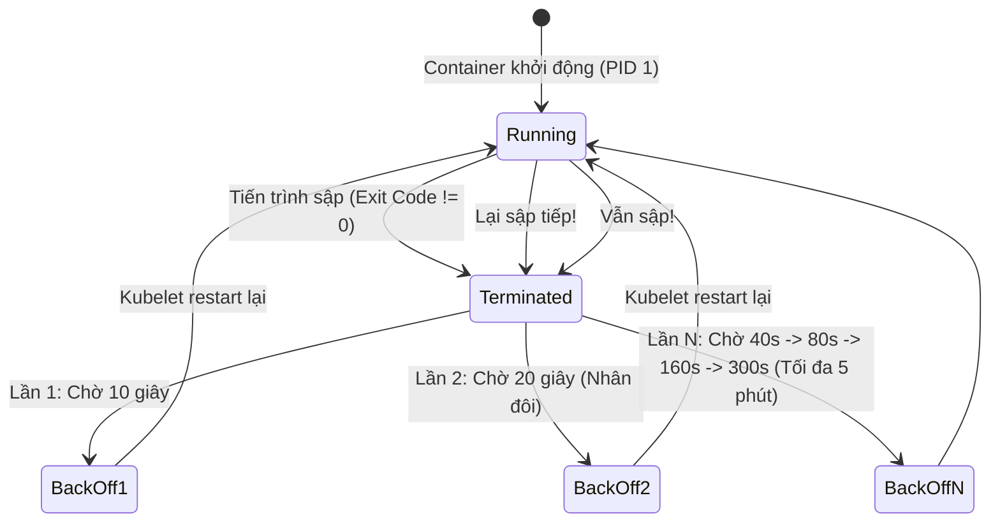
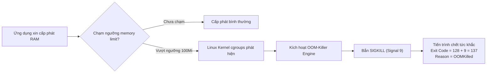

# Bài 42: Khắc phục các sự cố kinh điển: CrashLoopBackOff, OOMKilled, Pending

## 1. Thông tin bài học
* **Tên bài:** Bài 42: Khắc phục các sự cố kinh điển: CrashLoopBackOff, OOMKilled, Pending
* **Mục tiêu học:** Rèn luyện phản xạ thực chiến đỉnh cao của một kỹ sư Platform/SRE để bắt bệnh và tiêu diệt dứt điểm 4 "căn bệnh thế kỷ" phổ biến nhất trong vận hành Kubernetes: **CrashLoopBackOff**, **OOMKilled**, **Pending**, và **ImagePullBackOff**; thấu hiểu bản chất thuật toán Exponential Backoff của Kubelet; phân biệt rạch ròi các mã thoát hệ điều hành (Exit Code 0, 1, 137, 143); giải cứu ứng dụng khởi động chậm bằng vũ khí bí mật `startupProbe`; thực hành cấp cứu trực tiếp 4 ca sự cố giả lập trên các microservices của Google Online Boutique, đưa toàn bộ cụm về trạng thái xanh mượt `Running 1/1`.
* **Thời lượng ước tính:** 180 phút (90 phút lý thuyết, 90 phút thực hành)
* **Kiến thức cần có trước:** Bài 06 (Pod Lifecycle), Bài 24 (Resource Requests & Limits), Bài 25 (Kube-Scheduler), Bài 41 (Khung chẩn đoán 5 tầng).
* **Liên quan kỳ thi:** CKA, CKAD (Trọng tâm cốt lõi tuyệt đối: Cả hai kỳ thi CKA và CKAD đều có từ 3 đến 5 câu hỏi tình huống bắt buộc thí sinh phải sửa lỗi Pod CrashLoopBackOff, điều chỉnh tài nguyên giải phóng Pod Pending, hoặc cấu hình lại probes trong thời gian thực).

---

## 2. Bảng thuật ngữ

| Thuật ngữ | Giải thích đơn giản | Ví dụ / Ẩn dụ đời thường |
| :--- | :--- | :--- |
| **CrashLoopBackOff** | Trạng thái Pod liên tục bị sập ngay sau khi khởi động, khiến Kubelet phải kéo dài thời gian chờ giữa các lần restart để bảo vệ máy chủ. | Người tập xe đạp liên tục bị ngã xe ngay khi vừa ngồi lên yên; sau mỗi lần ngã, người đó phải ngồi thở lâu hơn một chút mới dám leo lên thử lại. |
| **Exponential Backoff** | Thuật toán lùi bước theo cấp số nhân: Kubelet tăng gấp đôi thời gian chờ sau mỗi lần container chết (10s $\rightarrow$ 20s $\rightarrow$ 40s $\rightarrow$ tối đa 300s). | Bạn gọi điện cho ai đó nhưng họ bận: Lần 1 bạn chờ 1 phút gọi lại, lần 2 chờ 2 phút, lần 3 chờ 4 phút, tránh làm phiền liên tục. |
| **OOMKilled (Out Of Memory Killed)** | Cơ chế của Linux Kernel tiêu diệt thẳng tay tiến trình khi tiến trình đó sử dụng RAM vượt quá ngưỡng giới hạn cho phép (`limits.memory`). | Chiếc xe tải chở hàng vượt quá tải trọng của cây cầu, người gác cầu lập tức ra lệnh cẩu hàng vứt bỏ để tránh sập cầu. |
| **Exit Code 137** | Mã thoát đặc trưng của hệ điều hành Linux biểu thị tiến trình bị giết bởi tín hiệu cưỡng chế `SIGKILL` (Signal 9): $128 + 9 = 137$. | Con dấu đỏ "Bị buộc thôi việc ngay lập tức" đóng vào hồ sơ nhân viên vi phạm kỷ luật nghiêm trọng. |
| **Pending** | Trạng thái Pod đã được khai báo thành công nhưng Kube-scheduler chưa thể tìm được Worker Node phù hợp để xếp chỗ. | Hành khách đã mua vé máy bay nhưng phải ngồi ở phòng chờ vì chuyến bay đã hết ghế trống hoặc thời tiết xấu. |
| **ImagePullBackOff** | Kubelet không thể tải hình ảnh container về máy chủ do sai tên, sai tag, không có mạng hoặc thiếu mật khẩu đăng nhập kho ảnh. | Người giao hàng đến lấy kiện hàng tại bưu cục nhưng bị từ chối vì viết sai mã bưu phẩm hoặc không mang theo thẻ căn cước. |
| **Startup Probe** | Bộ kiểm tra thăm dò xem ứng dụng đã khởi động xong hoàn toàn hay chưa, bảo vệ ứng dụng khởi động chậm không bị `livenessProbe` giết oan. | Tấm biển "Đang hâm nóng động cơ" treo trước đầu tàu hỏa trước khi cho phép ban giám khảo chấm điểm chạy. |

---

## 3. Bức tranh lớn: Vấn đề thực tế và ẩn dụ đời thường

### Nhắc lại bài trước
Ở Bài 41, chúng ta đã xây dựng thành công **Khung chẩn đoán 5 tầng** (Node $\rightarrow$ Control Plane $\rightarrow$ Mạng $\rightarrow$ Kubelet $\rightarrow$ Pod) để khoanh vùng sự cố có hệ thống thay vì đoán mò. Khung 5 tầng là chiếc kính hiển vi và bản đồ tác chiến. Hôm nay, chúng ta sẽ bước vào "Phòng cấp cứu bệnh viện" để trực tiếp phẫu thuật và chữa trị dứt điểm 4 căn bệnh kinh điển nhất chiếm tới 90% số lượng sự cố hàng ngày tại các doanh nghiệp vận hành Kubernetes: **CrashLoopBackOff, OOMKilled, Pending và ImagePullBackOff**.

### Tại sao cần cái này ở production? (Vấn đề thực tế)

1. **Vòng lặp bất tận của `CrashLoopBackOff` lúc triển khai phiên bản mới:**
   Một ngày đẹp trời, đội ngũ phát triển đẩy một bản cập nhật mới lên môi trường Production. 5 phút sau, toàn bộ Pod bản sao của dịch vụ thanh toán chuyển sang màu đỏ rực `CrashLoopBackOff`. Khách hàng bị gián đoạn giao dịch.  
   Nếu bạn không biết cách đọc **Exit Code** và không biết lệnh lấy log của phiên bản trước đó (`kubectl logs -p`), bạn sẽ đứng nhìn thời gian lùi bước tăng dần lên 5 phút (300 giây) trong tuyệt vọng mà không hiểu vì sao container vừa bật lên đã chết!

2. **Cái chết bí hiểm mang tên `OOMKilled` (Exit Code 137):**
   Một microservice NodeJS chạy ổn định cả tuần. Đột nhiên vào ngày lễ mua sắm Black Friday, lượng người dùng tăng gấp đôi, container liên tục biến mất và restart mà **không hề in ra bất kỳ dòng log báo lỗi nào**!  
   Lập trình viên thề thốt: *"Code em không có lỗi, log không thấy văng Exception!"*. Đúng vậy, code không có lỗi logic, nhưng nó bị **Linux Kernel OOM-Killer** bắn một phát đạn `SIGKILL` vào đầu từ phía sau vì vượt quá `limits.memory`. Nếu không có phản xạ kiểm tra `Last State: Terminated` và `Exit Code 137`, bạn sẽ mất cả tuần cãi nhau vô ích.

3. **Cơn ác mộng "Đoàn tàu kẹt cứng" (Pending Pods):**
   Hệ thống tự động co giãn (HPA) phát hiện tải cao và quyết định tạo thêm 20 Pod `checkoutservice`. Nhưng cả 20 Pod này đều nằm bất động ở trạng thái `Pending`. Lưu lượng khách hàng ùa vào khiến các Pod cũ bị quá tải và sập theo.  
   Nguyên nhân là do các Pod mới không tìm được Node nào đủ CPU Requests để dung nạp chúng. Việc phân biệt được **Tài nguyên Yêu cầu (Requests)** và **Tài nguyên Thực tế (Usage)** là chìa khóa sống còn để giải phóng đoàn tàu Pending này.

### Ẩn dụ đời thường: Bệnh viện Cấp cứu Đa khoa

Hãy tưởng tượng bạn là Bác sĩ Trưởng kíp trực tại một Bệnh viện Đa khoa tiếp nhận 4 ca bệnh khẩn cấp:

* **Ca 1: Bệnh nhân ngất xỉu liên tục (`CrashLoopBackOff`):** Bệnh nhân vừa tỉnh dậy được 2 giây lại ngất xỉu ngã xuống sàn. Sau mỗi lần ngã, bác sĩ phải để bệnh nhân nằm nghỉ lâu hơn một chút (Exponential Backoff) mới dám đỡ dậy. Bác sĩ phải kiểm tra ngay xem bệnh nhân có bị nghẹn dị vật đường thở hay không (Thiếu biến môi trường hoặc file cấu hình lỗi).
* **Ca 2: Vỡ dạ dày vì ăn quá no (`OOMKilled`):** Bệnh nhân có sức chứa dạ dày tối đa 500ml (`limits.memory`), nhưng lại cố uống hết 1 lít nước trong 10 giây. Dạ dày bị vỡ toác ngay lập tức (Linux Kernel gửi tín hiệu `SIGKILL`). Bác sĩ khám nghiệm tử thi chỉ cần nhìn thấy vết tích là biết ngay bệnh nhân chết vì no quá mức (Exit Code 137).
* **Ca 3: Hành khách kẹt tại cửa nhà ga (`Pending`):** Đoàn khách 50 người có vé nhưng không thể bước lên tàu vì trên các toa tàu không còn ghế nào trống đạt tiêu chuẩn cân nặng của họ (`Insufficient CPU/Memory`), hoặc toa tàu đó chỉ dành riêng cho nhân viên hỏa xa (`Taints & Tolerations`).
* **Ca 4: Bị bảo vệ chặn tại cổng vào (`ImagePullBackOff`):** Vận động viên đến tham gia thi đấu nhưng bị giữ lại ở bốt bảo vệ vì đưa ra thẻ vận động viên rởm hoặc đọc sai tên đội tuyển (`Sai Image Tag hoặc thiếu Secret`).

---

## 4. Giải thích khái niệm theo từng bước

### Phẫu thuật Ca bệnh 1: `CrashLoopBackOff` (Vòng lặp Tử thần)

Khi một container trong Pod bị kết thúc (thường là với mã thoát khác 0), Kubelet sẽ dựa vào chính sách khởi động lại (`restartPolicy: Always`) để cố gắng bật container lên lần nữa.



#### Bảng tra cứu Mã thoát Hệ điều hành (Linux Exit Codes)
Khi gõ `kubectl describe pod`, con số tại trường **`Exit Code`** là manh mối vàng tố cáo tội phạm:

| Exit Code | Tên chuẩn | Ý nghĩa thực tế trong Kubernetes | Nguyên nhân gốc phổ biến |
| :--- | :--- | :--- | :--- |
| **0** | Success | Tiến trình chạy xong và tự nguyện thoát bình thường. | Dùng nhầm Pod thay vì Job/CronJob (Container chạy lệnh `echo` xong tự thoát, nhưng `restartPolicy: Always` khiến Kubelet tưởng bị lỗi nên restart lại vô tận!). |
| **1** | General Error | Lỗi ứng dụng thông thường (Application Exception). | Code bị lỗi cú pháp, thiếu biến môi trường, không tìm thấy file cấu hình, lỗi runtime. |
| **126** | Command Cannot Execute | Lệnh không có quyền thực thi. | Quên cấp quyền `chmod +x /entrypoint.sh` trong Dockerfile. |
| **127** | Command Not Found | Không tìm thấy tệp nhị phân hoặc lệnh cần chạy. | Khai báo `command: ["python3"]` nhưng trong Base Image không hề cài Python. |
| **137** | SIGKILL (128 + 9) | Bị hệ điều hành ép chết ngay lập tức. | **99% là OOMKilled** (Vượt quá RAM Limit); hoặc do người dùng gõ `docker kill`. |
| **143** | SIGTERM (128 + 15) | Nhận tín hiệu yêu cầu dừng êm đẹp (Graceful Shutdown). | Kubernetes đang chủ động tắt Pod (Scale Down, Rolling Update, hoặc Kubelet Preemption). |

---

### Phẫu thuật Ca bệnh 2: `OOMKilled` (Sát thủ thầm lặng)

Cơ chế quản lý bộ nhớ của Linux dựa trên **Control Groups (cgroups)**:
* Khi bạn khai báo `resources.limits.memory: "100Mi"`, Kubelet sẽ ghi con số này vào file `/sys/fs/cgroup/memory/memory.limit_in_bytes` của container.
* Tiến trình bên trong container liên tục cấp phát bộ nhớ (ví dụ mảng dữ liệu, cache).
* Khi dung lượng RAM chạm ngưỡng 100MiB, tiến trình xin thêm 1 byte nữa $\rightarrow$ Linux Kernel từ chối cấp phát và kích hoạt module **OOM-Killer**.
* Kernel không thể thương lượng: Nó bắn tín hiệu **`SIGKILL` (Signal 9)**. Tiến trình chết ngay trong 1 nano-giây, không kịp in log trăn trối hay bắt Exception!



> [!IMPORTANT]
> **Vũ khí cứu mạng cho ứng dụng khởi động chậm: `startupProbe`**  
> Rất nhiều ứng dụng Java (Spring Boot) hoặc NodeJS cần tới 45 giây để nạp các bean và kết nối database. Nếu bạn chỉ đặt `livenessProbe` với `initialDelaySeconds: 10`, sau 10 giây liveness probe gõ cửa $\rightarrow$ app chưa khởi động xong $\rightarrow$ probe fail $\rightarrow$ Kubelet giết chết container $\rightarrow$ rơi vào `CrashLoopBackOff` oan uổng!  
> **Giải pháp chuẩn:** Sử dụng `startupProbe`. Khi `startupProbe` đang chạy, Kubelet sẽ **tạm vô hiệu hóa hoàn toàn** cả `livenessProbe` và `readinessProbe` cho đến khi `startupProbe` thành công!

```yaml
startupProbe:
  httpGet:
    path: /healthz
    port: 8080
  failureThreshold: 30    # Cho phép thử lại 30 lần
  periodSeconds: 2        # Mỗi lần cách nhau 2 giây -> Tổng cộng cho phép khởi động tối đa 60 giây!
livenessProbe:
  httpGet:
    path: /healthz
    port: 8080
  periodSeconds: 10
```

---

### Phẫu thuật Ca bệnh 3: `Pending` (Kẹt tại cửa Lập lịch)

Khi Pod ở trạng thái `Pending`, có nghĩa là **Kube-scheduler không tìm được bến đỗ an toàn cho Pod**. Kube-scheduler áp dụng quy trình 2 giai đoạn: **Lọc (Filtering)** và **Chấm điểm (Scoring)** (Bài 25).

Nếu một Pod bị Pending, lý do luôn nằm ở giai đoạn Lọc (Filtering):
1. **`Insufficient cpu` hoặc `Insufficient memory`:** Tổng `requests` của các Pod cũ trên Node cộng với `requests` của Pod mới vượt quá dung lượng Allocatable của Node.
2. **`MatchNodeSelector` / `NodeAffinity`:** Pod yêu cầu nhãn `disk=ssd` nhưng không có Node nào gắn nhãn này.
3. **`Taints and Tolerations`:** Mọi Node đều có vết dơ (ví dụ `node-role.kubernetes.io/control-plane:NoSchedule`) mà Pod không có tấm bùa dung thứ (Toleration).
4. **`PodTopologySpread / PodAntiAffinity`:** Ràng buộc không cho phép xếp chung Node với Pod khác.
5. **`VolumeBindingPending`:** PVC của Pod sử dụng StorageClass có chế độ `volumeBindingMode: WaitForFirstConsumer` nhưng cơ chế cấp phát đĩa của Cloud bị lỗi.

---

### Phẫu thuật Ca bệnh 4: `ImagePullBackOff` & `ErrImagePull`

Hành trình tải một Image trải qua 3 bước:
1. Phân giải DNS địa chỉ của Container Registry (`docker.io`, `gcr.io`, `quay.io`).
2. Xác thực quyền tải ảnh (Authentication) bằng thông tin bí mật trong `imagePullSecrets`.
3. Tải các Image Layers về đĩa cứng của Worker Node.

Nếu bất kỳ bước nào gãy đổ, Kubelet chuyển trạng thái sang `ErrImagePull`, sau đó áp dụng Exponential Backoff và chuyển thành `ImagePullBackOff`.

---

## 5. Thực hành (Lab)

* **Môi trường:** Cluster kind (`microservices-demo\k8s\kind-config.yaml`) gồm 1 control-plane và 1 worker node.
* **Mức RAM ước tính:** ~160 MB (Cực kỳ nhẹ nhàng và an toàn cho giới hạn 4GB của WSL2).

> [!NOTE]
> Trong bài lab này, chúng ta sẽ mở một "Bệnh viện dã chiến", tiếp nhận và xử lý dứt điểm **4 ca bệnh kinh điển** mô phỏng trên các service của Google Online Boutique:
> * **Ca 1:** `frontend` dính `CrashLoopBackOff` do Liveness Probe quá gắt.
> * **Ca 2:** `cartservice` dính `OOMKilled` (Exit Code 137) do thiếu RAM.
> * **Ca 3:** `checkoutservice` dính `Pending` do đòi hỏi CPU hoang đường.
> * **Ca 4:** `emailservice` dính `ImagePullBackOff` do tag sai ảnh.

---

### Bước 1: Khởi tạo Phòng bệnh Dã chiến và Bơm 4 Ca Sự Cố

Tạo namespace `icu-lab` và triển khai 4 Pod mang đầy mầm bệnh:

```powershell
@'
apiVersion: v1
kind: Namespace
metadata:
  name: icu-lab
---
# CA 1: CrashLoopBackOff do Liveness Probe khong cho app kip khoi dong
apiVersion: apps/v1
kind: Deployment
metadata:
  name: case1-frontend
  namespace: icu-lab
spec:
  replicas: 1
  selector:
    matchLabels:
      app: case1
  template:
    metadata:
      labels:
        app: case1
    spec:
      containers:
      - name: frontend
        image: busybox:1.36
        command: ["/bin/sh", "-c"]
        args:
        - |
          echo "Ung dung bat dau khoi dong..."
          touch /tmp/starting
          sleep 10   # Can 10 giay de khoi dong xong
          rm -f /tmp/starting
          touch /tmp/ready
          echo "Ung dung da khoi dong thanh cong!"
          while true; do sleep 1; done
        # Liveness probe kiem tra qua som (sau 2s da kiem tra file /tmp/ready)
        livenessProbe:
          exec:
            command: ["cat", "/tmp/ready"]
          initialDelaySeconds: 2
          periodSeconds: 2
---
# CA 2: OOMKilled do dat limit qua thap so voi code
apiVersion: apps/v1
kind: Deployment
metadata:
  name: case2-cartservice
  namespace: icu-lab
spec:
  replicas: 1
  selector:
    matchLabels:
      app: case2
  template:
    metadata:
      labels:
        app: case2
    spec:
      containers:
      - name: cart
        image: python:3.9-alpine
        command: ["python3", "-c"]
        args:
        - |
          import time
          print("CartService dang nap du lieu gio hang...")
          # Tao mang du lieu chiem khoang 40MB RAM
          data = bytearray(40 * 1024 * 1024)
          print("Nap du lieu thanh cong!")
          time.sleep(3600)
        resources:
          limits:
            memory: "15Mi"   # Limit chi cho 15MB trong khi app xin 40MB -> OOMKilled!
---
# CA 3: Pending do doi hoi CPU khong tuong
apiVersion: apps/v1
kind: Deployment
metadata:
  name: case3-checkoutservice
  namespace: icu-lab
spec:
  replicas: 1
  selector:
    matchLabels:
      app: case3
  template:
    metadata:
      labels:
        app: case3
    spec:
      containers:
      - name: checkout
        image: busybox:1.36
        command: ["sleep", "3600"]
        resources:
          requests:
            cpu: "99"        # Doi hoi 99 Core CPU trong khi node chi co vai core!
---
# CA 4: ImagePullBackOff do sai tag
apiVersion: apps/v1
kind: Deployment
metadata:
  name: case4-emailservice
  namespace: icu-lab
spec:
  replicas: 1
  selector:
    matchLabels:
      app: case4
  template:
    metadata:
      labels:
        app: case4
    spec:
      containers:
      - name: email
        image: nginx:tag-nay-hoan-toan-khong-ton-tai-999
'@ | kubectl apply -f -
```

---

### Bước 2: Khám tổng quát Hiện trường

Chờ khoảng 20 giây để các triệu chứng bộc lộ rõ ràng, sau đó kiểm tra danh sách bệnh nhân:

```powershell
kubectl get pods -n icu-lab
```

**Kết quả mong đợi:**
```text
NAME                                     READY   STATUS             RESTARTS      AGE
case1-frontend-69666c8b9b-v8qpn          0/1     CrashLoopBackOff   2 (25s ago)   35s
case2-cartservice-5f96bd7d99-k2xql       0/1     CrashLoopBackOff   2 (20s ago)   35s
case3-checkoutservice-5b4cf5998f-zmnql   0/1     Pending            0             35s
case4-emailservice-7c5b7db9b4-w9lqt      0/1     ImagePullBackOff   0             35s
```
Toàn bộ 4 Pod đều đang trong tình trạng nguy kịch! Hãy bắt đầu cấp cứu từng ca một.

---

### Bước 3: Cấp cứu Ca 1 (`case1-frontend` dính `CrashLoopBackOff`)

Kiểm tra chi tiết nguyên nhân sập của Ca 1:

```powershell
kubectl describe pod -l app=case1 -n icu-lab | Select-String -Pattern "Liveness probe failed" -Context 0, 2
```

**Kết quả mong đợi:**
```text
Warning  Unhealthy  12s (x3 over 20s)  kubelet  Liveness probe failed: cat: can't open '/tmp/ready': No such file or directory
Warning  Killing    12s                kubelet  Container frontend failed liveness probe, will be restarted
```

🎯 **Chẩn đoán:** Ứng dụng cần 10 giây để khởi động và tạo file `/tmp/ready`, nhưng Liveness probe đã kiểm tra ngay ở giây thứ 2 (`initialDelaySeconds: 2`) và giết chết container!  
💉 **Đơn thuốc:** Bổ sung `startupProbe` hoặc tăng `initialDelaySeconds: 15` để cho ứng dụng đủ thời gian khởi động:

```powershell
kubectl patch deployment case1-frontend -n icu-lab --type='json' -p='[
  {"op": "replace", "path": "/spec/template/spec/containers/0/livenessProbe/initialDelaySeconds", "value": 15}
]'
```

---

### Bước 4: Cấp cứu Ca 2 (`case2-cartservice` dính `OOMKilled`)

Xem thông tin trạng thái kết thúc (Last State) của Ca 2:

```powershell
kubectl describe pod -l app=case2 -n icu-lab | Select-String -Pattern "Last State:" -Context 0, 4
```

**Kết quả mong đợi:**
```text
    Last State:     Terminated
      Reason:       OOMKilled
      Exit Code:    137
      Started:      Thu, 09 Oct 2026 14:10:00 +0700
      Finished:     Thu, 09 Oct 2026 14:10:01 +0700
```

🎯 **Chẩn đoán:** Bằng chứng không thể chối cãi: `Reason: OOMKilled` và `Exit Code: 137`! Container xin 40MB nhưng limit chỉ cho 15MB.  
💉 **Đơn thuốc:** Tăng `limits.memory` lên `64Mi`:

```powershell
kubectl set resources deployment case2-cartservice -n icu-lab --limits=memory=64Mi
```

---

### Bước 5: Cấp cứu Ca 3 (`case3-checkoutservice` dính `Pending`)

Kiểm tra lý do vì sao Kube-scheduler từ chối xếp chỗ cho Ca 3:

```powershell
kubectl describe pod -l app=case3 -n icu-lab | Select-String -Pattern "Events:" -Context 0, 2
```

**Kết quả mong đợi:**
```text
Events:
  Type     Reason            Age   From               Message
  ----     ------            ----  ----               -------
  Warning  FailedScheduling  50s   default-scheduler  0/2 nodes available: 2 Insufficient cpu. preemption: 0/2 nodes available...
```

🎯 **Chẩn đoán:** `0/2 nodes available: 2 Insufficient cpu`. Pod đòi tới 99 Core CPU, vượt quá tổng năng lực phần cứng của cả cụm!  
💉 **Đơn thuốc:** Hạ `requests.cpu` về mức thực tế `50m` (0.05 core):

```powershell
kubectl set resources deployment case3-checkoutservice -n icu-lab --requests=cpu=50m
```

---

### Bước 6: Cấp cứu Ca 4 (`case4-emailservice` dính `ImagePullBackOff`)

Kiểm tra thông báo lỗi kéo ảnh của Ca 4:

```powershell
kubectl describe pod -l app=case4 -n icu-lab | Select-String -Pattern "Failed to pull image" -Context 0, 1
```

**Kết quả mong đợi:**
```text
Warning  Failed     15s (x2 over 40s)  kubelet  Failed to pull image "nginx:tag-nay-hoan-toan-khong-ton-tai-999": ... not found
```

🎯 **Chẩn đoán:** Tag ảnh sai dẫn đến lỗi 404 Not Found từ Docker Registry.  
💉 **Đơn thuốc:** Đổi tag ảnh về bản chuẩn `nginx:alpine`:

```powershell
kubectl set image deployment case4-emailservice email=nginx:alpine -n icu-lab
```

---

### Bước 7: Kiểm tra Hồi sinh Toàn bộ Bệnh nhân

Chờ khoảng 15-20 giây để Kubernetes hoàn tất cập nhật các Pod mới, sau đó kiểm tra lại:

```powershell
kubectl get pods -n icu-lab
```

**Kết quả mong đợi:**
```text
NAME                                     READY   STATUS    RESTARTS   AGE
case1-frontend-54bf95c9db-z7qpm          1/1     Running   0          25s
case2-cartservice-66d4dbfb5d-8xlwp       1/1     Running   0          20s
case3-checkoutservice-6b4df9d8b7-p4nws   1/1     Running   0          15s
case4-emailservice-7c5bf76899-m5zkq      1/1     Running   0          10s
```

🎉 **100% BỆNH NHÂN ĐÃ ĐƯỢC CỨU SỐNG VÀ ĐẠT TRẠNG THÁI RUNNING 1/1 HOÀN HẢO!**

---

### Bước 8: Dọn dẹp tài nguyên (Cleanup)

Xóa toàn bộ namespace phòng cấp cứu để giải phóng bộ nhớ RAM:

```powershell
kubectl delete namespace icu-lab --ignore-not-found
```

---

## 6. Lỗi thường gặp và cách debug

### Lỗi 1: Tăng Limit bộ nhớ vô tội vạ để chữa OOMKilled thay vì sửa Memory Leak
* **Dấu hiệu:** Container bị OOMKilled ở mức 500MB, kỹ sư nâng lên 1GB $\rightarrow$ 3 ngày sau lại OOMKilled ở mức 1GB $\rightarrow$ kỹ sư nâng tiếp lên 4GB và làm sập cả Worker Node!
* **Nguyên nhân:** Mã nguồn ứng dụng bị **Rò rỉ bộ nhớ (Memory Leak)**: Một mảng tĩnh toàn cục hoặc kết nối không được đóng lại liên tục tích lũy dữ liệu theo thời gian.
* **Cách debug và sửa:**
  * Không tăng limit mù quáng! Hãy quan sát biểu đồ sử dụng RAM trên Prometheus:
    * Nếu RAM tăng dần đều theo một đường thẳng dốc đứng không bao giờ hạ xuống dù không có traffic $\rightarrow$ **100% Memory Leak**. Bắt buộc phải thông báo cho đội Dev phân tích Heap Dump để vá mã nguồn.

---

### Lỗi 2: Nhầm lẫn giữa Exit Code 0 và lỗi CrashLoopBackOff trong Kubernetes
* **Dấu hiệu:** Bạn chạy một Pod để sao lưu dữ liệu hoặc gửi email thông báo. Pod chạy xong, thoát với `Exit Code: 0` (Thành công tuyệt đối). Nhưng chỉ 10 giây sau, Pod lại biến thành `CrashLoopBackOff` và chạy đi chạy lại hàng trăm lần!
* **Nguyên nhân:** Khai báo mặc định của Pod là `restartPolicy: Always`. Kubernetes hiểu rằng Pod đại diện cho một dịch vụ chạy lâu dài (Daemon). Bất kể tiến trình kết thúc với mã nào (kể cả mã 0), Kubelet cũng sẽ tự động khởi động lại nó!
* **Cách debug và sửa:**
  * Đối với các tác vụ chạy một lần rồi dừng (Batch job), chuyển sang sử dụng tài nguyên **Job** hoặc **CronJob** (Bài 06), hoặc cấu hình tường minh:
    ```yaml
    spec:
      restartPolicy: OnFailure    # (Hoac Never)
    ```

---

### Lỗi 3: Chẩn đoán Pod Pending mà chỉ chăm chăm xem CPU/RAM
* **Dấu hiệu:** Pod bị Pending, kỹ sư kiểm tra thấy Node còn thừa tới 80% CPU và RAM nhưng Pod vẫn không chịu chạy.
* **Nguyên nhân:** Bị tắc ở các ràng buộc phi tài nguyên:
  1. Pod yêu cầu gắn một **PersistentVolumeClaim (PVC)** mà PVC đó chưa được tạo hoặc Volume chưa thể gắn kết (`FailedAttachVolume`).
  2. Pod yêu cầu gắn vào một **NodeSelector** mà không node nào có nhãn đó.
* **Cách debug và sửa:**
  * Luôn đọc mục **Events** của `kubectl describe pod` thay vì tự suy đoán. Nếu lỗi do PVC, thông báo sẽ ghi rõ: `pod has unbound immediate PersistentVolumeClaims`.

---

## 7. Góc nhìn Senior

### 1. Sự đánh đổi (Trade-offs)

| Chiến lược Cấu hình | Điểm mạnh (Ưu điểm) | Đánh đổi (Hạn chế) | Khi nào nên chọn? |
| :--- | :--- | :--- | :--- |
| **Không đặt Memory Limits (`limits.memory: null`)** | Container không bao giờ bị OOMKilled riêng lẻ; tận dụng tối đa RAM của Node. | Cực kỳ nguy hiểm! Khi container rò rỉ RAM, nó sẽ "ăn sạch" RAM của Node và kéo sập toàn bộ máy chủ vật lý. | ❌ Tuyệt đối cấm ở môi trường Production. |
| **Đặt Memory Limits bằng Memory Requests (`Guaranteed QoS`)** | Độ ổn định cao nhất; Kubernetes cam kết tài nguyên; không bao giờ bị tranh chấp hoặc trục xuất. | Không tận dụng được tài nguyên nhàn rỗi (Overcommit); chi phí mua máy chủ tăng cao. | ✅ Chuẩn mực bắt buộc cho Database, Redis, và các Core Microservices. |
| **Sử dụng `startupProbe` cho toàn bộ ứng dụng** | Loại bỏ hoàn toàn nguy cơ ứng dụng bị giết oan trong lúc khởi động tải cache. | Phải tốn công đo đạc và cấu hình thêm thông số; tăng độ dài file YAML. | Khuyến nghị cho mọi ứng dụng Java, .NET, NodeJS nặng. |

---

### 2. Best practices tại production

1. **Giám sát chủ động sự kiện OOMKilled qua Alertmanager:**
   Không bao giờ đợi khách hàng phàn nàn mới biết Pod bị OOMKilled. Hãy thiết lập một cảnh báo PromQL chuẩn SRE:
   ```promql
   increase(kube_pod_container_status_last_terminated_reason{reason="OOMKilled"}[5m]) > 0
   ```
   Ngay khi có một container bị Linux Kernel tiêu diệt, tin nhắn cảnh báo sẽ lập tức nổ ra trên kênh Slack của đội ngũ vận hành.
2. **Kỹ thuật Debug Pod Crash mà không bị Restart (Debug Entrypoint Override):**
   Nếu container cứ bật lên là sập ngay khiến bạn không kịp vào xem file log, hãy tạm thời ghi đè lệnh khởi động của container thành một lệnh ngủ vô tận:
   ```yaml
   command: ["/bin/sh", "-c"]
   args: ["sleep 3600"]
   ```
   Container sẽ đứng yên ở trạng thái `Running`. Lúc này, bạn có thể thong thả dùng `kubectl exec -it <pod> -- /bin/sh` để chui vào bên trong kiểm tra file cấu hình, biến môi trường và chạy thử lệnh thủ công bằng tay!
3. **Quy tắc An toàn cho Java Heap trong Container:**
   Khi đóng gói ứng dụng Java chạy trong container, luôn bật các cờ nhận diện cgroup của JVM:
   `-XX:+UseContainerSupport -XX:MaxRAMPercentage=75.0`  
   Không bao giờ để JVM chiếm 100% memory limit, vì ngoài Heap, JVM còn cần bộ nhớ Non-Heap (Metaspace, Thread stack, C libraries). Ngưỡng 75% giúp chừa lại 25% đệm an toàn chống OOMKilled.

---

### 3. Câu hỏi phỏng vấn Senior

* **Câu hỏi 1:** *Khi một container bị chết với Exit Code 137, làm thế nào để bạn phân biệt được chính xác đó là do bản thân container bị OOMKilled vì vượt quá `limits.memory`, hay do toàn bộ Worker Node bị cạn kiệt RAM và Kubelet phải tiêu diệt Pod để giải phóng máy chủ?*
  * **Gợi ý trả lời chuẩn:**
    * **Kiểm tra cấp độ Container:** Gõ `kubectl describe pod <name>`.
      * Nếu trường `Last State.Terminated.Reason` ghi rõ chữ **`OOMKilled`**, điều đó khẳng định chắc chắn 100% container đã sử dụng RAM vượt quá ngưỡng `limits.memory` khai báo trong Pod spec.
    * **Kiểm tra cấp độ Node:** Gõ `kubectl describe node <node-name>`.
      * Kiểm tra mục `Conditions`: Nếu cờ **`MemoryPressure`** hiển thị giá trị `True`, nghĩa là toàn bộ máy chủ vật lý đang cạn kiệt RAM.
      * Kiểm tra mục `Events` của Node và log `dmesg -T` trên máy chủ Host: Nếu Kubelet kích hoạt cơ chế trục xuất (Eviction), lý do sẽ là `Evicted` và thông điệp ghi rõ: `The node had condition: [MemoryPressure]`.

* **Câu hỏi 2:** *Tại sao các chuyên gia Kubernetes lại khuyên rằng: Thay vì tăng thông số `initialDelaySeconds` của `livenessProbe` lên thật cao (ví dụ 120 giây) để chờ ứng dụng khởi động xong, chúng ta bắt buộc phải sử dụng `startupProbe`? Sự khác nhau bản chất giữa hai cách tiếp cận này là gì?*
  * **Gợi ý trả lời chuẩn:**
    * **Hạn chế nghiêm trọng khi chỉ tăng `initialDelaySeconds`:**
      Nếu bạn đặt `initialDelaySeconds: 120s`, trong suốt 2 phút đầu tiên Kubernetes hoàn toàn "mù". Nếu ứng dụng bị Deadlock hoặc lỗi kết nối database ngay ở giây thứ 5, Kubernetes vẫn phải đứng nhìn chờ đủ 120 giây mới phát hiện ra lỗi và restart container, làm tăng thời gian chết (Downtime) không cần thiết! Hơn nữa, nếu sau đó ứng dụng đột nhiên cần 130 giây để khởi động (do tải cao), nó vẫn sẽ bị giết chết.
    * **Ưu việt vượt trội của `startupProbe`:**
      `startupProbe` hoạt động theo cơ chế thăm dò tích cực với tần suất ngắn (ví dụ kiểm tra mỗi 2 giây với `failureThreshold: 30`, cho phép tối đa 60 giây).
      1. **Khởi động nhanh $\rightarrow$ Sẵn sàng ngay:** Nếu ứng dụng khởi động siêu tốc chỉ mất 8 giây, `startupProbe` sẽ pass ngay ở giây thứ 8 và chuyển giao quyền kiểm soát cho `livenessProbe` lập tức, không bắt ứng dụng phải chờ đợi lãng phí!
      2. **Bảo vệ toàn diện:** Trong suốt quá trình `startupProbe` chạy, `livenessProbe` bị đóng băng hoàn toàn. Nhờ đó, ta vừa bảo vệ được ứng dụng khởi động chậm, vừa giữ được cấu hình `livenessProbe` nhạy bén (ví dụ kiểm tra mỗi 5 giây) để phát hiện sự cố treo ứng dụng trong lúc vận hành bình thường.

---

## 8. Tóm tắt bài học

* 📌 **1. Bản chất `CrashLoopBackOff`:** Container chết với Exit Code khác 0; Kubelet áp dụng thuật toán **Exponential Backoff** lùi bước từ 10s đến 300s để bảo vệ máy chủ không bị nghẽn CPU.
* 📌 **2. Nhận diện `OOMKilled`:** Luôn tìm kiếm **Exit Code 137** ($128 + 9$) và `Reason: OOMKilled` trong lệnh `kubectl describe`; nguyên nhân do chạm ngưỡng `limits.memory`.
* 📌 **3. Giải cứu Pod `Pending`:** Bắt nguồn từ việc Kube-scheduler không lọc được Node phù hợp (chủ yếu do `requests` vượt quá năng lực Node, vướng Taints, hoặc PVC chưa Bound).
* 📌 **4. Cứu tinh `startupProbe`:** Tách biệt giai đoạn khởi động nặng nề với giai đoạn chạy ổn định; không bao giờ lạm dụng việc tăng `initialDelaySeconds` của `livenessProbe`.
* 📌 **5. Khép lại Giai đoạn 7:** Chúng ta đã hoàn thành xuất sắc toàn bộ chặng đường Quan sát & Khắc phục sự cố (Logging $\rightarrow$ Metrics $\rightarrow$ Alerting $\rightarrow$ Tracing $\rightarrow$ Troubleshooting Framework $\rightarrow$ Cấp cứu Sự cố kinh điển)!

---

## 9. Bài tập tự làm

* 🟢 **Mức Dễ:** Khởi tạo một Pod chạy lệnh `sh -c "exit 1"`. Sử dụng lệnh `kubectl describe pod` để đọc mã thoát `Exit Code: 1` và quan sát thời gian chờ Backoff tăng dần sau mỗi lần restart.
* 🟡 **Mức Vừa:** Soạn thảo một Pod cấu hình đầy đủ bộ ba probes:
  * `startupProbe`: Cho phép khởi động tối đa 40 giây (thăm dò mỗi 2s, tối đa 20 lần).
  * `livenessProbe`: Thăm dò sức khỏe mỗi 5s sau khi khởi động xong.
  * `readinessProbe`: Thăm dò trạng thái sẵn sàng phục vụ traffic mỗi 3s.
* 🔴 **Mức Khó:** Viết một script PowerShell tự động quét toàn bộ các Pod trong toàn bộ cụm Kubernetes (`-A`):
  * Lọc ra tất cả các Pod đang ở trạng thái bất thường (`CrashLoopBackOff`, `OOMKilled`, `Pending`, `ImagePullBackOff`).
  * In ra màn hình bảng tổng hợp gồm các cột: `NAMESPACE | POD_NAME | STATUS | REASON | RESTART_COUNT | EXIT_CODE` để hỗ trợ kỹ sư trực phát hiện nhanh toàn bộ sự cố trong ca trực.

---

## 10. Câu hỏi tự kiểm tra

1. Thuật ngữ "BackOff" trong `CrashLoopBackOff` có ý nghĩa toán học và kỹ thuật là gì? Thời gian chờ tối đa giữa hai lần restart của Kubelet là bao nhiêu?
2. Nếu một container bị kết thúc với Exit Code 143, điều đó có đồng nghĩa với việc ứng dụng bị lỗi hay không? Giải thích bản chất.
3. Tại sao công thức của Exit Code khi bị OOMKilled lại là $137$? Con số 128 và 9 từ đâu mà ra?
4. Một Pod có trạng thái `Pending` do thông báo `0/1 nodes available: 1 pod has unbound immediate PersistentVolumeClaims`. Bạn cần kiểm tra đối tượng nào tiếp theo?
5. Điểm khác nhau giữa việc Pod bị `OOMKilled` và việc Pod bị `Evicted` là gì?
6. Khi container bị rơi vào `CrashLoopBackOff` và sập ngay trong 1 giây, làm thế nào để bạn giữ container đó đứng yên ở trạng thái `Running` để chui vào bên trong debug?

<details>
<summary>👉 Bấm vào đây để xem đáp án câu hỏi tự kiểm tra</summary>

* **Câu 1:** "BackOff" nghĩa là lùi bước, giảm tần suất thử lại theo cấp số nhân (Exponential Backoff). Kubelet tăng thời gian chờ gấp đôi sau mỗi lần thất bại: $10s \rightarrow 20s \rightarrow 40s \rightarrow 80s \rightarrow 160s \rightarrow 300s$. Thời gian chờ tối đa được giới hạn ở mức **300 giây (5 phút)** để tránh việc container restart liên tục làm quá tải CPU của máy chủ.
* **Câu 2:** **Không hề bị lỗi.** Mã 143 tương ứng với $128 + 15$ (tín hiệu `SIGTERM` - Signal 15). Điều này có nghĩa là tiến trình đã nhận được yêu cầu dừng lại êm đẹp (Graceful Shutdown) từ hệ thống (do người dùng xóa Pod, Deployment đang cập nhật phiên bản mới, hoặc HPA giảm bớt số lượng Pod).
* **Câu 3:** Trong chuẩn POSIX Linux, khi một tiến trình bị kết thúc bởi một tín hiệu (Signal), mã thoát trả về được quy ước bằng: $128 + \text{Mã số tín hiệu (Signal Number)}$. OOM-Killer sử dụng tín hiệu cưỡng chế không thể trì hoãn là `SIGKILL` (Signal 9). Do đó mã thoát là: $128 + 9 = 137$.
* **Câu 4:** Cần kiểm tra đối tượng **PersistentVolumeClaim (PVC)** của Pod bằng lệnh `kubectl get pvc -n <ns>` và `kubectl describe pvc <pvc-name>`. Kiểm tra xem PVC đã được gán vào PersistentVolume (PV) nào chưa (`Status: Bound` hay `Pending`), và kiểm tra xem StorageClass có đang hoạt động tốt trên cụm hay không.
* **Câu 5:**
  * **OOMKilled:** Do **chính container đó** vi phạm giới hạn bộ nhớ `limits.memory` của nó. Linux cgroup tiêu diệt container, Pod có thể tự restart lại trên chính Node đó.
  * **Evicted (Trục xuất):** Do **toàn bộ Node** bị cạn kiệt tài nguyên (Disk/Memory Pressure). Kubelet chủ động xóa bỏ và đuổi Pod ra khỏi Node đó để bảo vệ máy chủ Host.
* **Câu 6:** Bằng kỹ thuật ghi đè lệnh khởi động (Entrypoint Override): Tạm thời chỉnh sửa file YAML của Pod, thêm trường `command: ["sleep", "3600"]`. Khi đó container sẽ chạy lệnh ngủ trong 1 giờ mà không bị crash, cho phép bạn dùng `kubectl exec -it <pod> -- /bin/sh` để vào bên trong điều tra mã nguồn và chạy lệnh thủ công.
</details>

---

## 11. Tài liệu đọc thêm và bài tiếp theo

### Tài liệu tham khảo
* [Tài liệu chính thức Kubernetes Docs: Configure Liveness, Readiness and Startup Probes](https://kubernetes.io/docs/tasks/configure-pod-container/configure-liveness-readiness-startup-probes/)
* [Tài liệu Kubernetes Docs: Assign Memory Resources to Containers and Pods](https://kubernetes.io/docs/tasks/configure-pod-container/assign-memory-resource/)
* [Kubernetes Failure Stories: Real-world post-mortems](https://k8s.af/)

### Bài tiếp theo
👉 **Bài 43: Đóng gói ứng dụng với Helm 3: Chart, Values & Hooks** *(Chính thức bước vào Giai đoạn 8: Vận hành Production!)*

---

## PHỤ LỤC: ĐÁP ÁN GỢI Ý BÀI TẬP TỰ LÀM (MỤC 9)

### Đáp án Mức Dễ
Tạo Pod thoát mã 1 và quan sát BackOff:
```powershell
# 1. Chay Pod thoat ma 1
kubectl run error-exit-pod --image=busybox:1.36 --restart=Always -- /bin/sh -c "exit 1"

# 2. Quan sat thoi gian cho
kubectl describe pod error-exit-pod | Select-String -Pattern "Back-off restarting" -Context 0, 1
```

---

### Đáp án Mức Vừa
Manifest Pod đầy đủ bộ 3 probes chuẩn SRE:
```yaml
apiVersion: v1
kind: Pod
metadata:
  name: robust-service
  namespace: default
spec:
  containers:
  - name: app
    image: nginx:alpine
    ports:
    - containerPort: 80
    # 1. Startup Probe: Cho phep khoi dong toi da 40s
    startupProbe:
      httpGet:
        path: /
        port: 80
      failureThreshold: 20
      periodSeconds: 2
    # 2. Liveness Probe: Kiem tra song con moi 5s
    livenessProbe:
      httpGet:
        path: /
        port: 80
      periodSeconds: 5
      timeoutSeconds: 2
    # 3. Readiness Probe: Kiem tra san sang don traffic moi 3s
    readinessProbe:
      httpGet:
        path: /
        port: 80
      periodSeconds: 3
```

---

### Đáp án Mức Khó
Script PowerShell quét tự động toàn cụm phát hiện các Pod bị bệnh:
```powershell
# Lay danh sach tat ca cac Pod tren cum o dinh dang JSON
$pods = kubectl get pods -A -o json | ConvertFrom-Json

Write-Output ("=" * 95)
Write-Output ("{0,-15} | {1,-30} | {2,-18} | {3,-10} | {4,-8}" -f "NAMESPACE", "POD NAME", "STATUS / REASON", "RESTARTS", "EXIT CODE")
Write-Output ("=" * 95)

foreach ($pod in $pods.items) {
    $ns = $pod.metadata.namespace
    $name = $pod.metadata.name
    $phase = $pod.status.phase

    # Kiem tra container status
    $cStatuses = $pod.status.containerStatuses
    if ($cStatuses) {
        foreach ($cs in $cStatuses) {
            $restarts = $cs.restartCount
            $statusStr = $phase
            $exitCode = "N/A"

            # Kiem tra trang thai cho (Waiting)
            if ($cs.state.waiting) {
                $statusStr = $cs.state.waiting.reason
            }
            # Kiem tra trang thai ket thuc truoc do (Last Terminated)
            if ($cs.lastState.terminated) {
                $exitCode = $cs.lastState.terminated.exitCode
                if ($cs.lastState.terminated.reason) {
                    $statusStr += " (" + $cs.lastState.terminated.reason + ")"
                }
            }

            # Chi in ra nhung Pod co dau hieu bat thuong hoac da bi restart
            if ($statusStr -match "CrashLoop|OOMKilled|ImagePull|Pending|Error" -or $restarts -gt 0) {
                Write-Output ("{0,-15} | {1,-30} | {2,-18} | {3,-10} | {4,-8}" -f $ns, $name, $statusStr, $restarts, $exitCode)
            }
        }
    } elseif ($phase -eq "Pending") {
        Write-Output ("{0,-15} | {1,-30} | {2,-18} | {3,-10} | {4,-8}" -f $ns, $name, "Pending", 0, "N/A")
    }
}
```

