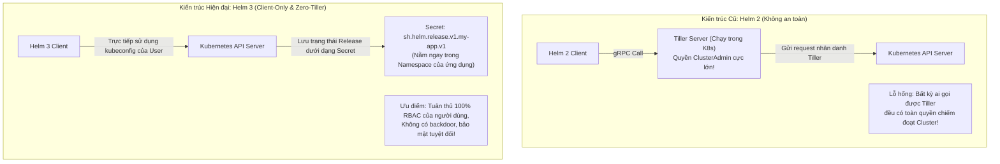
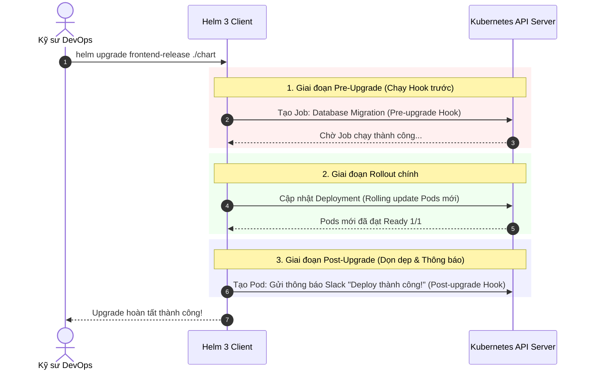

# Bài 43: Đóng gói ứng dụng với Helm 3: Chart, Values & Hooks

## 1. Thông tin bài học
* **Tên bài:** Bài 43: Đóng gói ứng dụng với Helm 3: Chart, Values & Hooks
* **Mục tiêu học:** Mở màn Giai đoạn 8: Vận hành Production chuyên nghiệp; thấu hiểu vai trò lịch sử của **Helm 3** với tư cách là "Trình quản lý gói chuẩn mực (The Package Manager for Kubernetes)"; giải mã sự lột xác vĩ đại từ Helm 2 lên Helm 3 khi khai tử thành phần Tiller để đạt chuẩn bảo mật Client-only tuyệt đối; nắm vững cấu trúc chuẩn mực của một **Helm Chart** (`Chart.yaml`, `values.yaml`, `templates/`, `_helpers.tpl`, `NOTES.txt`); thuần thục ngôn ngữ Go Template và các toán tử đường ống (Pipelines, Functions, `nindent`); làm chủ vòng đời phát hành ứng dụng (**Release: install, upgrade, rollback, uninstall**); thấu hiểu cơ chế can thiệp tự động **Helm Hooks** (`pre-install`, `post-upgrade`, `hook-delete-policy`); tự tay viết từ con số 0 một Helm Chart chuẩn công nghiệp đóng gói microservice `frontend` của Google Online Boutique và quản trị đa môi trường.
* **Thời lượng ước tính:** 180 phút (90 phút lý thuyết, 90 phút thực hành)
* **Kiến thức cần có trước:** Bài 09 (Deployment & Rollout), Bài 10 (Kubernetes Service), Bài 12 (ConfigMap).
* **Liên quan kỳ thi:** CKAD (Trọng tâm cấu phần *Application Deployment*: Thành thạo cài đặt, nâng cấp, rollback Helm releases và ghi đè values); CKA (Cài đặt các ứng dụng hạ tầng, Ingress Controller và Operators thông qua Helm Charts).

---

## 2. Bảng thuật ngữ

| Thuật ngữ | Giải thích đơn giản | Ví dụ / Ẩn dụ đời thường |
| :--- | :--- | :--- |
| **Helm** | Trình quản lý gói ứng dụng cho Kubernetes, giúp đóng gói, phiên bản hóa, cấu hình và triển khai toàn bộ ứng dụng chỉ bằng một câu lệnh. | `apt` trên Ubuntu, `npm` trên NodeJS, hoặc `App Store` trên iPhone nhưng dành riêng cho Kubernetes. |
| **Helm Chart** | Một gói (bundle) thư mục chứa toàn bộ các tệp biểu mẫu YAML (templates) và cấu hình mặc định để mô tả một ứng dụng Kubernetes. | Bản vẽ thiết kế xây dựng hoàn chỉnh của một ngôi nhà kiểu mẫu: có sẵn sơ đồ phòng, hệ thống điện nước để thợ có thể xây ở bất kỳ khu đất nào. |
| **Release** | Một phiên bản triển khai cụ thể của một Helm Chart đang chạy thực tế bên trong cụm Kubernetes. | Ngôi nhà thực tế số 123 đường Hoa Hồng được xây dựng thành hình từ bản vẽ thiết kế Chart. |
| **values.yaml** | Tệp chứa các giá trị cấu hình mặc định của Chart, cho phép người dùng tùy biến ghi đè (override) linh hoạt cho từng môi trường (dev, staging, prod). | Bảng tùy chọn nội thất và màu sơn: Bạn có thể chọn sơn tường màu xanh ở nhà phố và màu trắng ở biệt thự mà không cần vẽ lại bản thiết kế. |
| **Go Template Engine** | Động cơ xử lý chuỗi mẫu của ngôn ngữ Go, cho phép chèn biến động (`{{ .Values.replicaCount }}`) và logic lập trình (`if/else`, `range`) vào các tệp YAML tĩnh. | Giấy chứng nhận tốt nghiệp in sẵn khung chữ: Người in chỉ việc điền họ tên học sinh và ngày tháng vào chỗ trống `{{ .TenHocSinh }}`. |
| **Helm Hooks** | Cơ chế cho phép chèn các hành động tự động (thường là Kubernetes Job) chạy tại các mốc then chốt trong vòng đời cài đặt (`pre-install`, `post-upgrade`...). | Hệ thống chuông tự động: Tự động khóa cửa trước khi tắt đèn (`pre-install`) và bật máy lọc không khí sau khi mở cửa (`post-upgrade`). |
| **_helpers.tpl** | Tệp định nghĩa các khối mẫu dùng chung (Named Templates) và hàm logic tái sử dụng nhằm chuẩn hóa cách đặt tên nhãn (labels) trên toàn Chart. | Khuôn đúc gạch tiêu chuẩn dùng chung cho toàn bộ thợ trên công trường xây dựng. |

---

## 3. Bức tranh lớn: Vấn đề thực tế và ẩn dụ đời thường

### Nhắc lại bài trước
Ở Bài 42, chúng ta đã khép lại Giai đoạn 7 bằng việc rèn luyện phản xạ cấp cứu thành công 4 ca sự cố kinh điển (`CrashLoopBackOff`, `OOMKilled`, `Pending`, `ImagePullBackOff`). Sau khi đã làm chủ kỹ năng chẩn đoán và sửa lỗi, chúng ta bước sang Giai đoạn 8: **Vận hành Production chuyên nghiệp**. Ở quy mô doanh nghiệp, bạn không thể ngồi gõ từng file YAML tĩnh để quản lý hàng trăm microservices. Chúng ta cần một công cụ tiêu chuẩn hóa đóng gói và phân phối: đó chính là **Helm 3**.

### Tại sao cần cái này ở production? (Vấn đề thực tế)

1. **Thảm họa "Biển YAML" (YAML Hell) và Trôi cấu hình:**
   Để chạy một microservice hoàn chỉnh trên Kubernetes, bạn cần tối thiểu 6 tài nguyên: `Deployment`, `Service`, `ConfigMap`, `Secret`, `Ingress`, và `HorizontalPodAutoscaler`.  
   Hệ thống Google Online Boutique có 11 microservices. Công ty bạn có 3 môi trường: `dev`, `staging`, và `production`.  
   Tổng số lượng file YAML bạn phải quản lý là: $6 \times 11 \times 3 = 198$ file YAML!  
   Nếu dùng phương pháp thủ công (`kubectl apply -f`), khi cần nâng cấp phiên bản Docker Image từ `v1.0.0` lên `v1.0.1`, kỹ sư phải mở hàng chục file YAML ra sửa bằng tay. Chỉ cần một lập trình viên gõ sai một dấu cách hoặc sửa trên môi trường Prod mà quên sửa môi trường Dev, toàn bộ hệ thống sẽ rơi vào tình trạng **Trôi cấu hình (Configuration Drift)** hỗn loạn!

2. **Sự bất lực của `kubectl apply` trong việc Rollback:**
   Lệnh `kubectl apply -f my-folder/` chỉ đơn thuần gửi các file YAML lên API Server. Nó hoàn toàn không có khái niệm **"Một phiên bản phát hành duy nhất (Single Release Unit)"**.  
   Nếu bạn vừa cập nhật một phiên bản ứng dụng gồm 5 file YAML mới, nhưng phát hiện lỗi nghiêm trọng cần quay ngược lại trạng thái cũ: `kubectl` không có lệnh nào như `kubectl rollback my-folder`. Bạn phải tự nhớ xem 10 phút trước các file YAML cũ có nội dung gì để apply ngược lại!  
   Với Helm, toàn bộ 5 tài nguyên đó được bọc vào một **Release duy nhất**. Bạn chỉ cần gõ đúng một lệnh: `helm rollback my-app 1`, toàn bộ 5 tài nguyên lập tức quay ngược về quá khứ trong đúng 2 giây!

3. **Chia sẻ và Tái sử dụng Tri thức (Reusability):**
   Bạn muốn cài đặt một cụm Ingress Controller, Prometheus, hoặc Redis vào cụm của mình. Bạn không cần phải tự ngồi viết hàng nghìn dòng YAML từ số 0. Bạn chỉ cần lên kho lưu trữ Artifact Hub và gõ:  
   `helm install my-redis bitnami/redis`  
   Toàn bộ cấu hình chuẩn hóa tốt nhất của các chuyên gia hàng đầu thế giới đã được cài đặt vào cụm của bạn một cách an toàn và tối ưu.

### Ẩn dụ đời thường: Hộp Nguyên liệu Nấu ăn Meal-Kit Đóng gói sẵn

Hãy tưởng tượng bạn muốn nấu một bữa tiệc Bò bít-tết 5 sao tại nhà:

* **Phương pháp thủ công (`kubectl apply -f`):** Bạn tự đi chợ, tự chọn thịt, tự đong đếm từng thìa muối, hạt tiêu, bơ tỏi. Hôm nay bạn nêm vừa miệng, ngày mai bạn lỡ tay cho quá nhiều muối làm món ăn mặn chát; khi cần nấu cho 10 người ăn, bạn phải tự nhân nhẩm công thức và rất dễ tính nhầm.
* **Helm Chart = Hộp Meal-Kit đóng gói sẵn từ Nhà hàng cao cấp (như HelloFresh):**
  * **`Chart.yaml` (Nhãn mác hộp):** Tên món ăn: "Bò Bít-Tết Sốt Tiêu Đen", Phiên bản công thức 2.0.
  * **`templates/` (Các gói nguyên liệu định lượng sẵn):** Thịt bò, gói nước sốt, rau củ đã được sơ chế và cắt thái đúng kích thước chuẩn.
  * **`values.yaml` (Phiếu chọn khẩu vị):** Bạn chỉ cần tích chọn trên tờ giấy:
    * Mức độ chín: `Medium-Rare`
    * Độ cay: `Level 2`
    * Số lượng khẩu phần: `3 người`
  * Bạn không cần vẽ lại công thức hay làm lại từ đầu! Đầu bếp của nhà hàng chỉ cần nhìn vào phiếu khẩu vị (`values.yaml`) là tạo ra đúng bữa ăn bạn mong muốn.
  * **Helm Rollback = Quyền đổi trả món:** Nếu người phục vụ lỡ mang ra món ăn không đúng ý bạn, nhà hàng lập tức thu hồi và bưng ra đúng đĩa thức ăn chuẩn mực của lần trước trong tích tắc!

---

## 4. Giải thích khái niệm theo từng bước

### Bước nhảy vọt Lịch sử: Sự khác biệt giữa Helm 2 và Helm 3

Rất nhiều tài liệu cũ trên mạng vẫn nhắc tới thành phần **Tiller**. Một Platform Engineer hiện đại bắt buộc phải hiểu rõ bước ngoặt lịch sử này:



* **Helm 2 (Khai tử):** Bắt buộc phải cài một Pod máy chủ tên là **Tiller** bên trong cụm. Tiller nắm giữ quyền hạn tối cao (`cluster-admin`). Mọi người dùng dù chỉ có quyền hạn thấp nhưng nếu kết nối được tới Tiller là có thể điều khiển toàn bộ cụm. Đây là một cơn ác mộng bảo mật!
* **Helm 3 (Chuẩn mực hiện tại):** **Tiller đã bị xóa sổ hoàn toàn!** Helm 3 hoàn toàn là một công cụ dòng lệnh phía máy khách (Client-only binary). Helm 3 sử dụng chính file `kubeconfig` và quyền hạn RBAC của người dùng đang gõ lệnh. Trạng thái của Release được mã hóa và lưu trữ an toàn dưới dạng các Kubernetes **Secret** nằm ngay trong Namespace cài đặt ứng dụng.

---

### Giải phẫu Cấu trúc một Helm Chart Chuẩn mực

Khi bạn tạo một Chart mới, cấu trúc thư mục tiêu chuẩn sẽ trông như sau:

```text
boutique-frontend/
├── Chart.yaml              # Thông tin metadata định danh Chart
├── values.yaml             # Bảng cấu hình các giá trị mặc định
├── charts/                 # Thư mục chứa các Chart con phụ thuộc (Subcharts)
├── templates/              # Thư mục chứa các tệp khuôn mẫu YAML (Go Templates)
│   ├── deployment.yaml     # Mẫu Deployment
│   ├── service.yaml        # Mẫu Service
│   ├── configmap.yaml      # Mẫu ConfigMap
│   ├── _helpers.tpl        # Định nghĩa các hàm logic và Named Templates dùng chung
│   ├── NOTES.txt           # Thông điệp hướng dẫn in ra màn hình sau khi cài xong
│   └── tests/              # Kịch bản kiểm thử tự động sau khi cài đặt
└── .helmignore             # Danh sách file bỏ qua không đóng gói (như .git, .DS_Store)
```

#### 1. Tệp `Chart.yaml` (Chứng minh nhân dân của Chart)
```yaml
apiVersion: v2
name: boutique-frontend
description: Helm Chart dong goi microservice Frontend cua Online Boutique
type: application
version: 0.1.0        # Phiên bản của chính Helm Chart này (SemVer: Major.Minor.Patch)
appVersion: "v0.10.1" # Phiên bản của mã nguồn ứng dụng đang chạy bên trong
```

#### 2. Tệp `values.yaml` (Các biến số có thể cấu hình)
```yaml
replicaCount: 2

image:
  repository: gcr.io/google-samples/microservices-demo/frontend
  tag: "v0.10.1"
  pullPolicy: IfNotPresent

service:
  type: ClusterIP
  port: 80

resources:
  requests:
    cpu: 50m
    memory: 64Mi
  limits:
    cpu: 100m
    memory: 128Mi

welcomeMessage: "Chao mung den voi Google Online Boutique!"
```

---

### Ngôn ngữ Go Template: Biến chuỗi YAML tĩnh thành Thực thể Sống động

Bên trong thư mục `templates/`, tệp `deployment.yaml` không còn chứa các giá trị ghi cứng (hard-coded) nữa, mà sử dụng cú pháp Go Template `{{ ... }}`:

```yaml
apiVersion: apps/v1
kind: Deployment
metadata:
  name: {{ include "boutique-frontend.fullname" . }}
  labels:
    {{- include "boutique-frontend.labels" . | nindent 4 }}
spec:
  replicas: {{ .Values.replicaCount }}
  selector:
    matchLabels:
      app: {{ include "boutique-frontend.name" . }}
  template:
    metadata:
      labels:
        app: {{ include "boutique-frontend.name" . }}
    spec:
      containers:
        - name: {{ .Chart.Name }}
          image: "{{ .Values.image.repository }}:{{ .Values.image.tag | default .Chart.AppVersion }}"
          imagePullPolicy: {{ .Values.image.pullPolicy }}
          ports:
            - containerPort: 8080
          env:
            - name: WELCOME_MSG
              value: {{ .Values.welcomeMessage | quote }}
          resources:
            {{- toYaml .Values.resources | nindent 12 }}
```

#### Các thành phần phép thuật của Go Template:
1. **Dấu chấm (`.`):** Đại diện cho **Root Context (Ngữ cảnh gốc)**. Muốn truy cập vào `values.yaml`, bạn gõ `.Values`. Muốn truy cập thông tin Chart, bạn gõ `.Chart`. Muốn lấy tên bản phát hành, bạn gõ `.Release.Name`.
2. **Đường ống và Hàm (`|` Pipeline):**
   * `| quote`: Tự động bọc chuỗi văn bản trong dấu ngoặc kép (tránh lỗi YAML khi chuỗi chứa ký tự đặc biệt).
   * `| default "latest"`: Nếu biến bị rỗng thì lấy giá trị mặc định là "latest".
   * `| toYaml | nindent 12`: Chuyển cả một đối tượng YAML phức tạp thành văn bản và **thụt lề chính xác 12 dấu cách** (`nindent = new line + indent`).
3. **Dấu gạch ngang `{{-` và `-}}`:** Có nhiệm vụ **triệt tiêu toàn bộ khoảng trắng và dòng trống thừa** ở phía trước hoặc phía sau câu lệnh logic, giữ cho file YAML sau khi render luôn chuẩn đẹp từng milimet!

---

### Mổ xẻ Helm Hooks: Can thiệp vào Vòng đời Phát hành

Một trong những tính năng mạnh mẽ nhất biến Helm thành công cụ cấp doanh nghiệp chính là **Helm Hooks**.



#### Cách khai báo một Helm Hook
Bạn chỉ cần tạo một manifest Kubernetes thông thường (ví dụ một `Job`) bên trong thư mục `templates/` và gắn thêm chú thích (**Annotations**):

```yaml
apiVersion: batch/v1
kind: Job
metadata:
  name: {{ include "boutique-frontend.fullname" . }}-db-migrate
  annotations:
    # 1. Khai bao day la mot Hook chay truoc khi upgrade
    "helm.sh/hook": pre-upgrade,pre-install
    # 2. Thu tu uu tien: so nho chay truoc, so lon chay sau
    "helm.sh/hook-weight": "1"
    # 3. Chinh sach don dep: tu dong xoa Job sau khi chay thanh cong
    "helm.sh/hook-delete-policy": hook-succeeded
spec:
  template:
    spec:
      restartPolicy: Never
      containers:
        - name: migrate
          image: busybox:1.36
          command: ["sh", "-c", "echo 'Dang cap nhat Schema Database...' && sleep 3"]
```

---

## 5. Thực hành (Lab)

* **Môi trường:** Cluster kind (`microservices-demo\k8s\kind-config.yaml`) gồm 1 control-plane và 1 worker node.
* **Mức RAM ước tính:** ~60 MB (Cực kỳ nhẹ nhàng vì Helm xử lý logic ở máy client).
* **Công cụ sử dụng:** Để tiện lợi và không làm đầy ổ C của Windows, chúng ta sử dụng container `alpine/helm` chính thức (đã có sẵn trong Docker cache) thông qua một hàm PowerShell tiện lợi.

---

### Bước 1: Thiết lập Hàm thực thi Helm trên PowerShell

Mở terminal PowerShell và thiết lập một hàm alias để gõ lệnh `helm` mượt mà như native binary:

```powershell
function helm {
    docker run --rm -v "${PWD}:/apps" -w /apps -v "$HOME/.kube:/root/.kube" alpine/helm:latest $args
}

# Kiem tra xac nhan lenh helm hoat dong hoan hao
helm version --short
```

**Kết quả mong đợi:**
```text
v4.3.0+bec5b06
```

---

### Bước 2: Tự tạo cấu trúc Helm Chart từ số 0 bằng lệnh `helm create`

Chúng ta tạo một chart mới mang tên `boutique-frontend`:

```powershell
# Tao khung Chart mac dinh
helm create boutique-frontend

# Xem cau truc thu muc vua duoc tao ra
Get-ChildItem -Recurse boutique-frontend | Select-Object Name
```

**Kết quả mong đợi:**
Thư mục `boutique-frontend` được sinh ra chứa đầy đủ `Chart.yaml`, `values.yaml`, và thư mục `templates/`.

---

### Bước 3: Tùy biến `values.yaml` và Khai báo Helm Hook

Hãy mở file `boutique-frontend/values.yaml` và thay thế bằng cấu hình tinh gọn phục vụ Online Boutique:

```powershell
@'
replicaCount: 2

image:
  repository: nginx
  tag: "alpine"
  pullPolicy: IfNotPresent

service:
  type: ClusterIP
  port: 80

resources:
  requests:
    cpu: 20m
    memory: 32Mi
  limits:
    cpu: 50m
    memory: 64Mi

welcomeMessage: "Phien ban v1.0.0: Chao mung den voi Google Online Boutique!"
'@ | Set-Content -Encoding utf8 .\boutique-frontend\values.yaml
```

Tiếp theo, tạo thêm một tệp **Helm Hook** mang tên `boutique-frontend/templates/pre-install-hook.yaml` để chạy kiểm tra an ninh trước khi cài đặt:

```powershell
@'
apiVersion: batch/v1
kind: Job
metadata:
  name: "{{ .Release.Name }}-precheck"
  labels:
    app.kubernetes.io/managed-by: Helm
  annotations:
    "helm.sh/hook": pre-install
    "helm.sh/hook-weight": "1"
    "helm.sh/hook-delete-policy": hook-succeeded
spec:
  template:
    spec:
      restartPolicy: Never
      containers:
      - name: precheck-job
        image: busybox:1.36
        command: ["sh", "-c", "echo '[HELM HOOK] Dang kiem tra tinh tuong thich ha tang...' && sleep 3 && echo '[HELM HOOK] Kiem tra thanh cong!'"]
'@ | Set-Content -Encoding utf8 .\boutique-frontend\templates\pre-install-hook.yaml
```

---

### Bước 4: Kiểm tra Cú pháp (Linting) và Mô phỏng Render (Dry-Run)

Trước khi gửi bất kỳ thứ gì lên Kubernetes, một kỹ sư chuyên nghiệp luôn chạy 2 lệnh kiểm định chất lượng:

```powershell
# 1. Kiem tra tinh hop le cua Chart (Linting)
helm lint ./boutique-frontend
```

**Kết quả mong đợi:**
```text
1 chart(s) linted, 0 chart(s) failed
```

```powershell
# 2. Render thu toan bo cac file YAML ra man hinh ma khong deploy (Template Dry-run)
helm template my-test ./boutique-frontend --set replicaCount=3 | Select-String -Pattern "replicas:" -Context 0, 1
```

**Kết quả mong đợi:**
```text
  replicas: 3
```
*(Bạn thấy không? Biến `replicaCount=3` đã được chèn chính xác vào YAML mà chưa hề chạm vào cluster!)*

---

### Bước 5: Cài đặt Release đầu tiên (`helm install`)

Tạo namespace `helm-lab` và tiến hành cài đặt bản phát hành `frontend-v1`:

```powershell
# 1. Tao namespace
kubectl create namespace helm-lab

# 2. Cai dat Release bang Helm
helm install frontend-v1 ./boutique-frontend -n helm-lab
```

**Kết quả mong đợi:**
```text
NAME: frontend-v1
LAST DEPLOYED: Thu Oct  9 14:30:00 2026
NAMESPACE: helm-lab
STATUS: deployed
REVISION: 1
TEST SUITE: None
NOTES:
...
```

Kiểm tra xem Helm Hook đã chạy và các tài nguyên đã được sinh ra:

```powershell
# Xem danh sach cac Release dang chay
helm list -n helm-lab

# Xem cac Pod thuc te tren cuem
kubectl get pods -n helm-lab
```

**Kết quả mong đợi:**
```text
NAME           NAMESPACE  REVISION  UPDATED                               STATUS    CHART                    APP VERSION
frontend-v1    helm-lab   1         2026-10-09 14:30:00.000000 +0000 UTC  deployed  boutique-frontend-0.1.0  1.16.0

NAME                                                 READY   STATUS    RESTARTS   AGE
frontend-v1-boutique-frontend-6b7df9477b-8s9mq       1/1     Running   0          30s
frontend-v1-boutique-frontend-6b7df9477b-km8qw       1/1     Running   0          30s
```

---

### Bước 6: Nâng cấp Phiên bản Release (`helm upgrade`)

Bây giờ sếp yêu cầu: *"Hãy scale ứng dụng lên 4 bản sao và đổi thông điệp chào mừng sang bản v2.0.0!"*  
Bạn không cần mở file YAML nào cả! Chỉ cần gõ:

```powershell
helm upgrade frontend-v1 ./boutique-frontend `
  --set replicaCount=4 `
  --set welcomeMessage="Phien ban v2.0.0: Khuyen mai dac biet Black Friday!" `
  -n helm-lab
```

**Kết quả mong đợi:**
```text
Release "frontend-v1" has been upgraded. Happy Helming!
LAST DEPLOYED: Thu Oct  9 14:32:00 2026
NAMESPACE: helm-lab
STATUS: deployed
REVISION: 2
```

Kiểm tra số lượng Pod đã tăng lên 4 bản sao ngay lập tức:
```powershell
kubectl get pods -n helm-lab
```

---

### Bước 7: Diễn tập Cứu hộ: Rollback Thần tốc (`helm rollback`)

Giả sử phiên bản Revision 2 bị phát hiện có lỗi nghiêm trọng. Chúng ta cần quay ngược về Revision 1 ngay lập tức:

Kiểm tra lịch sử phát hành của Release:
```powershell
helm history frontend-v1 -n helm-lab
```

**Kết quả mong đợi:**
```text
REVISION  UPDATED                   STATUS      CHART                    APP VERSION  DESCRIPTION     
1         Thu Oct  9 14:30:00 2026  superseded  boutique-frontend-0.1.0  1.16.0       Install complete
2         Thu Oct  9 14:32:00 2026  deployed    boutique-frontend-0.1.0  1.16.0       Upgrade complete
```

Ra lệnh Rollback về Revision 1:
```powershell
helm rollback frontend-v1 1 -n helm-lab
```

**Kết quả mong đợi:**
```text
Rollback was a success! Happy Helming!
```

Kiểm tra lại số lượng Pod:
```powershell
kubectl get pods -n helm-lab
```
*(Số lượng Pod đã tự động co giảm trở lại đúng 2 bản sao của Revision 1 trong tích tắc!)*

---

### Bước 8: Dọn dẹp tài nguyên (Cleanup)

Gỡ bỏ hoàn toàn Release và xóa namespace:

```powershell
# 1. Go bo Release sach se bang Helm
helm uninstall frontend-v1 -n helm-lab

# 2. Xoa namespace va thu muc Chart tam tren may Windows
kubectl delete namespace helm-lab --ignore-not-found
Remove-Item -Recurse -Force .\boutique-frontend -ErrorAction SilentlyContinue
```

---

## 6. Lỗi thường gặp và cách debug

### Lỗi 1: Sai lệch thụt lề khoảng trắng (YAML Indentation Error)
* **Dấu hiệu:** Chạy `helm install` hoặc `helm template` bị văng lỗi:
  ```text
  Error: YAML parse error on boutique-frontend/templates/deployment.yaml: error converting YAML to JSON: yaml: line 24: did not find expected key
  ```
* **Nguyên nhân:** Khi nhúng các hàm Go template phức tạp như `toYaml`, số lượng dấu cách thụt lề không khớp với cấu trúc cha trong YAML.
* **Cách debug và sửa:**
  * Dùng lệnh `helm template` kết hợp với cờ debug:
    ```powershell
    helm template ./boutique-frontend --debug
    ```
  * Lệnh này sẽ in ra toàn bộ nội dung file YAML sau khi đã thế biến, kèm theo số dòng chính xác bị sai thụt lề.
  * Luôn sử dụng `nindent X` thay vì `indent X` khi nhúng khối dữ liệu đa dòng (`nindent` tự động xuống dòng mới trước khi thụt lề $X$ khoảng trắng).

---

### Lỗi 2: "Trôi cấu hình" do sửa đổi thủ công bằng `kubectl edit`
* **Dấu hiệu:** Một kỹ sư trực đêm dùng `kubectl edit deployment` để tăng RAM tạm thời. Sáng hôm sau, một kỹ sư khác chạy pipeline `helm upgrade` thì toàn bộ thay đổi RAM của đêm hôm trước bị biến mất sạch sẽ!
* **Nguyên nhân:** Helm quản lý trạng thái dựa trên các tệp `values.yaml` và biểu mẫu của nó. Nó không theo dõi các chỉnh sửa phát sinh ngoài luồng bằng `kubectl`. Mỗi lần chạy `helm upgrade`, Helm sẽ tái tạo lại trạng thái đúng y như khai báo trong Chart và ghi đè lên các thay đổi thủ công.
* **Cách debug và sửa:**
  * **Nguyên tắc vàng:** Khi một ứng dụng đã được quản lý bằng Helm, **tuyệt đối không dùng `kubectl edit/patch` trực tiếp trên cụm**. Mọi thay đổi bắt buộc phải được đưa vào `values.yaml` và thực thi qua `helm upgrade`.

---

### Lỗi 3: Helm Hook bị treo (Job Failed / Timeout) làm Release bị kẹt trạng thái `FAILED`
* **Dấu hiệu:** Lệnh `helm install` chạy mãi không dừng và báo lỗi `timed out waiting for the condition`. Lệnh `helm list` hiển thị trạng thái `STATUS: failed`.
* **Nguyên nhân:** Một Job được đánh dấu là `pre-install` hoặc `pre-upgrade` hook bị lỗi (ví dụ không kết nối được database hoặc image của job bị lỗi), khiến Job không thể hoàn thành (`Completed`). Helm mặc định sẽ kiên nhẫn chờ Job đó và từ chối tạo các tài nguyên chính tiếp theo.
* **Cách debug và sửa:**
  * Kiểm tra log của Pod Hook đang bị lỗi:
    ```powershell
    kubectl get pods -A -l app.kubernetes.io/managed-by=Helm
    kubectl logs <hook-pod-name>
    ```
  * Cấu hình thêm thuộc tính `activeDeadlineSeconds` cho Job để tự hủy nếu chạy quá thời gian, và thêm `"helm.sh/hook-delete-policy": hook-failed` để dọn dẹp hiện trường.

---

## 7. Góc nhìn Senior

### 1. Sự đánh đổi (Trade-offs)

| Công cụ Quản lý | Điểm mạnh (Ưu điểm) | Đánh đổi (Hạn chế) | Khi nào nên chọn? |
| :--- | :--- | :--- | :--- |
| **Helm 3** | Đóng gói hoàn chỉnh thành Package; quản lý phiên bản Release & Rollback cực mạnh; hỗ trợ Hook và logic lập trình phức tạp; kho ứng dụng Artifact Hub khổng lồ. | Ngôn ngữ Go Template phức tạp, dễ mắc lỗi thụt lề; logic lồng nhau quá sâu có thể biến file YAML thành "mớ bòng bong" khó bảo trì. | Chuẩn mực vàng để đóng gói ứng dụng phát hành cho bên ngoài hoặc triển khai các ứng dụng hạ tầng phức tạp. |
| **Kustomize** (Bài 44) | Không dùng Template; giữ nguyên 100% cú pháp YAML thuần túy; tích hợp sẵn vào `kubectl -k`; quản lý đa môi trường bằng cơ chế xếp lớp (Overlays) cực kỳ trong sáng. | Không có khái niệm Release hay Rollback tự động; không có Hooks; không phù hợp để đóng gói thành thư viện chia sẻ công cộng. | Lý tưởng cho đội ngũ nội bộ muốn quản trị cấu hình đa môi trường gọn gàng theo chuẩn GitOps. |

---

### 2. Best practices tại production

1. **Luôn sử dụng Cờ `--atomic` và `--timeout` khi Nâng cấp:**
   Khi triển khai trên Production, đừng chỉ gõ `helm upgrade` đơn thuần. Hãy gõ:
   `helm upgrade my-app ./chart --atomic --timeout 5m`  
   Nếu có bất kỳ Pod nào bị `CrashLoopBackOff` hoặc không thể đạt trạng thái `Ready` trong vòng 5 phút, cờ `--atomic` sẽ **tự động kích hoạt Rollback quay ngược về phiên bản cũ ngay lập tức**, cứu hệ thống thoát khỏi thời gian chết (Downtime) mà không cần con người can thiệp!
2. **Nguyên tắc "Không bao giờ Commit Secret thô vào `values.yaml`":**
   Mật khẩu database và mã khóa bí mật không bao giờ được phép nằm trong Git ở dạng văn bản thô.  
   $\rightarrow$ Kết hợp Helm với **External Secrets Operator** (Bài 34) hoặc công cụ mã hóa **Helm Secrets (sops)** để mã hóa các giá trị nhạy cảm trước khi đưa vào kho mã nguồn.
3. **Phân tách Values theo Môi trường (Environment-specific Values Files):**
   Tổ chức cấu trúc thư mục chứa các file values riêng biệt:
   * `values.yaml` (Chứa giá trị mặc định cho local dev).
   * `values-staging.yaml` (Ghi đè cho staging).
   * `values-prod.yaml` (Tăng replica lên 10, bật HPA, cấu hình Ingress HTTPS cho Production).  
   Khi deploy Prod, chỉ cần chạy: `helm upgrade my-app ./chart -f values-prod.yaml`.

---

### 3. Câu hỏi phỏng vấn Senior

* **Câu hỏi 1:** *Tại sao trong Helm 3, đội ngũ phát triển lại quyết định loại bỏ hoàn toàn thành phần Tiller? Hãy phân tích các hệ quả an ninh và kiến trúc của quyết định mang tính lịch sử này.*
  * **Gợi ý trả lời chuẩn:**
    * **Lỗ hổng bảo mật của Tiller trong Helm 2:** Tiller là một dịch vụ tập trung chạy bên trong cụm với đặc quyền tối cao (`cluster-admin`) để có thể tạo mọi tài nguyên. Điều này phá vỡ hoàn toàn mô hình bảo mật Phân quyền theo vai trò (RBAC) của Kubernetes: Bất kỳ lập trình viên nào có quyền truy cập vào namespace của Tiller đều có thể "mượn tay" Tiller để tạo các tài nguyên đặc quyền cao trên toàn cụm.
    * **Kiến trúc đột phá của Helm 3:**
      1. **Bảo mật tuyệt đối (RBAC-driven):** Helm 3 trở thành một công cụ Client-only. Khi một kỹ sư gõ `helm install`, API Server sẽ xác thực trực tiếp danh tính và quyền hạn RBAC của chính kỹ sư đó thông qua file `kubeconfig`. Kỹ sư chỉ có quyền tạo Pod trong namespace `dev` thì Helm không thể nào cài tài nguyên vào namespace `prod` được.
      2. **Đơn giản hóa hạ tầng:** Không còn một Pod máy chủ nào cần được duy trì hay giám sát trong cụm; loại bỏ hoàn toàn các lỗi mất kết nối gRPC giữa Helm Client và Tiller.
      3. **Quản lý trạng thái phi tập trung:** Trạng thái của Release được lưu dưới dạng Secret nằm ngay trong namespace của Release đó, giúp phân quyền quản lý vòng đời ứng dụng độc lập cho từng nhóm phát triển.

* **Câu hỏi 2:** *Khi thực hiện `helm upgrade`, Helm tính toán sự thay đổi giữa phiên bản cũ và phiên bản mới dựa trên cơ chế nào? Sự khác nhau giữa lệnh `helm upgrade` và `kubectl apply` trong việc xử lý các trường bị xóa (Deleted Fields) là gì?*
  * **Gợi ý trả lời chuẩn:**
    * **Cơ chế 3-Way Merge Patch:** Helm 3 áp dụng thuật toán so khớp 3 chiều (**Three-way strategic merge patch**) giữa 3 đối tượng:
      1. Bản khai báo cũ của Chart trước đó (Old Manifest).
      2. Trạng thái thực tế đang chạy trên cụm (Live State).
      3. Bản khai báo mới chuẩn bị được áp dụng (New Manifest).
    * **Khác biệt cốt tử với `kubectl apply`:**
      Nếu trong phiên bản trước, file YAML của bạn có khai báo một biến môi trường `DEBUG=true`, nhưng trong phiên bản mới bạn **xóa dòng đó đi khỏi file YAML**:
      * Với `kubectl apply`: Rất nhiều trường hợp Kubernetes sẽ giữ nguyên giá trị cũ trên cụm và không xóa biến môi trường đó đi vì nó không thấy lệnh xóa rõ ràng.
      * Với `helm upgrade`: Nhờ thuật toán so khớp 3 chiều với bản Manifest cũ, Helm nhận ra rằng trường này đã bị bạn chủ động gỡ bỏ khỏi Chart, và Helm sẽ **tự động xóa bỏ hoàn toàn trường đó khỏi tài nguyên trên cụm**, đảm bảo trạng thái thực tế phản ánh chính xác 100% nội dung của phiên bản mới!

---

## 8. Tóm tắt bài học

* 📌 **1. Trình quản lý gói chuẩn mực:** Helm là công cụ số 1 để đóng gói, chia sẻ và chuẩn hóa việc phát hành các ứng dụng phức tạp trên Kubernetes.
* 📌 **2. Bảo mật đỉnh cao của Helm 3:** Khai tử hoàn toàn Tiller; hoạt động theo mô hình Client-only tuân thủ 100% quyền hạn RBAC của người dùng; lưu trữ trạng thái Release an toàn dưới dạng Kubernetes Secret.
* 📌 **3. Bộ ba Cốt lõi của Chart:** `Chart.yaml` định danh thông tin; `values.yaml` chứa tham số tùy biến linh hoạt; thư mục `templates/` chứa các biểu mẫu Go Template sống động.
* 📌 **4. Vòng đời Release hoàn chỉnh:** Quản lý trọn vẹn từ cài đặt (`install`), nâng cấp (`upgrade`), xem lịch sử (`history`), cho đến khôi phục thần tốc (`rollback`) chỉ bằng 1 câu lệnh.
* 📌 **5. Tự động hóa với Helm Hooks:** Chèn các tác vụ khởi tạo, kiểm tra hoặc di chuyển dữ liệu (Database Migration) vào đúng các thời điểm then chốt trong vòng đời phát hành.

---

## 9. Bài tập tự làm

* 🟢 **Mức Dễ:** Khởi tạo một Helm Chart mới mang tên `nginx-demo`. Tùy biến file `values.yaml` để chạy image `nginx:1.25-alpine` với số replica là 3. Sử dụng lệnh `helm template` để kiểm chứng manifest render ra đúng 3 bản sao.
* 🟡 **Mức Vừa:** Soạn thảo một tệp `templates/configmap.yaml` bên trong Chart sử dụng logic điều kiện:
  * Nếu trong `values.yaml` có khai báo `features.enableVip: true`, thì ConfigMap sẽ tự động sinh ra cặp khóa: `VIP_MODE: "ACTIVE"`.
  * Nếu là `false`, không sinh ra khóa này.
  * Thử cài đặt với `--set features.enableVip=true` và dùng `kubectl get configmap -o yaml` để kiểm chứng.
* 🔴 **Mức Khó:** Viết một Helm Hook hoàn chỉnh loại `post-install`:
  * Hook chạy một Pod tạm thời thực hiện lệnh `curl` kiểm tra mã phản hồi HTTP 200 từ Service của ứng dụng vừa được cài đặt.
  * Cấu hình chính sách `helm.sh/hook-delete-policy: hook-succeeded` để tự động xóa Pod kiểm tra sau khi kiểm tra thành công.

---

## 10. Câu hỏi tự kiểm tra

1. Tại sao Helm 3 lại lưu trữ thông tin của các Release dưới dạng Kubernetes Secret thay vì ConfigMap?
2. Trong cú pháp Go Template, toán tử `nindent 8` khác với toán tử `indent 8` ở điểm mấu chốt nào?
3. Nếu bạn muốn cài đặt một Chart nhưng chỉ muốn ghi đè đúng một giá trị duy nhất từ dòng lệnh mà không muốn sửa file `values.yaml`, bạn sử dụng cờ lệnh nào?
4. Điều gì sẽ xảy ra nếu một Helm Hook được đánh dấu là `pre-install` gặp lỗi và thoát với mã Exit Code 1?
5. Làm thế nào để xem lại danh sách toàn bộ các giá trị cấu hình (User-supplied Values) đã từng được áp dụng cho một Release cụ thể trong quá khứ?
6. Tại sao việc sử dụng cờ `--atomic` trong lệnh `helm upgrade` lại được coi là tiêu chuẩn bắt buộc của các kỹ sư SRE trên môi trường Production?

<details>
<summary>👉 Bấm vào đây để xem đáp án câu hỏi tự kiểm tra</summary>

* **Câu 1:** Vì tệp cấu hình của một Release thường chứa toàn bộ nội dung manifest của ứng dụng (trong đó có thể bao gồm các Secret chứa mật khẩu, Private Key, Token bí mật). Việc lưu dưới dạng Kubernetes Secret cho phép tận dụng cơ chế mã hóa dữ liệu tĩnh (Encryption at Rest của etcd) và phân quyền kiểm soát truy cập RBAC chặt chẽ hơn so với ConfigMap.
* **Câu 2:** Toán tử `indent 8` chỉ đơn thuần chèn thêm 8 dấu cách vào đầu mỗi dòng; trong khi `nindent 8` (**New line + Indent**) sẽ tự động chèn thêm một ký tự xuống dòng (`\n`) trước khi thụt lề 8 dấu cách. Điều này đảm bảo khối dữ liệu được render luôn nằm ở dòng tiếp theo và đúng thụt lề chuẩn của YAML.
* **Câu 3:** Sử dụng cờ lệnh `--set` (ví dụ: `--set replicaCount=5` hoặc `--set image.tag="v2.0"`).
* **Câu 4:** Helm sẽ coi như quá trình chuẩn bị cài đặt đã thất bại. Helm sẽ **ngay lập tức dừng lại**, không tiến hành tạo bất kỳ tài nguyên chính nào của ứng dụng trên cụm, và đánh dấu trạng thái Release là `FAILED`.
* **Câu 5:** Sử dụng lệnh: `helm get values <release-name> -n <namespace>`. Bạn cũng có thể thêm cờ `--revision <số>` để xem giá trị của một phiên bản cụ thể trong lịch sử, hoặc thêm cờ `--all` để xem toàn bộ các giá trị mặc định được gộp lại.
* **Câu 6:** Bởi vì `--atomic` mang lại tính an toàn tuyệt đối "Được ăn cả, ngã về không": Nếu bản nâng cấp gặp sự cố (Pod bị crash, Readiness probe thất bại, hoặc quá thời gian `--timeout`), Helm sẽ **tự động kích hoạt cơ chế Rollback ngay lập tức** để đưa cụm trở lại phiên bản cũ đang chạy ổn định trước đó, loại bỏ hoàn toàn nguy cơ ứng dụng bị kẹt ở trạng thái lỗi lấp lửng làm gián đoạn dịch vụ của khách hàng.
</details>

---

## 11. Tài liệu đọc thêm và bài tiếp theo

### Tài liệu tham khảo
* [Tài liệu chính thức Helm Docs: Quickstart & Concepts](https://helm.sh/docs/intro/quickstart/)
* [Tài liệu Helm Docs: Chart Template Guide & Built-in Objects](https://helm.sh/docs/chart_template_guide/builtin_objects/)
* [Kho lưu trữ Helm Charts Toàn cầu: Artifact Hub](https://artifacthub.io/)

### Bài tiếp theo
👉 **Bài 44: Quản lý cấu hình đa môi trường bằng Kustomize**

---

## PHỤ LỤC: ĐÁP ÁN GỢI Ý BÀI TẬP TỰ LÀM (MỤC 9)

### Đáp án Mức Dễ
```powershell
# 1. Tao chart
helm create nginx-demo

# 2. Sua values.yaml
@'
replicaCount: 3
image:
  repository: nginx
  tag: "1.25-alpine"
'@ | Set-Content -Encoding utf8 .\nginx-demo\values.yaml

# 3. Kiem tra render
helm template test .\nginx-demo | Select-String -Pattern "image:.*1.25-alpine"
```

---

### Đáp án Mức Vừa
Tệp `templates/configmap.yaml` với logic điều kiện:
```yaml
apiVersion: v1
kind: ConfigMap
metadata:
  name: {{ include "boutique-frontend.fullname" . }}-config
data:
  APP_ENV: "production"
  {{- if .Values.features.enableVip }}
  VIP_MODE: "ACTIVE"
  {{- end }}
```

---

### Đáp án Mức Khó
Tệp `templates/post-install-hook.yaml` kiểm tra sức khỏe HTTP:
```yaml
apiVersion: batch/v1
kind: Job
metadata:
  name: {{ include "boutique-frontend.fullname" . }}-healthcheck
  annotations:
    "helm.sh/hook": post-install
    "helm.sh/hook-weight": "1"
    "helm.sh/hook-delete-policy": hook-succeeded
spec:
  template:
    spec:
      restartPolicy: Never
      containers:
      - name: check
        image: curlimages/curl:latest
        command:
        - "sh"
        - "-c"
        - "curl -s -f http://{{ include \"boutique-frontend.fullname\" . }}:{{ .Values.service.port }} || exit 1"
```

