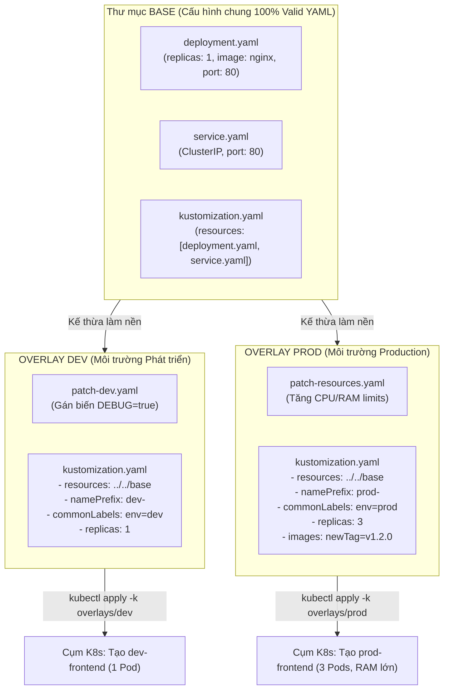

# Bài 44: Quản lý cấu hình đa môi trường bằng Kustomize

## 1. Thông tin bài học
* **Tên bài:** Bài 44: Quản lý cấu hình đa môi trường bằng Kustomize
* **Mục tiêu học:** Làm chủ triết lý "Cấu hình phi biểu mẫu (Template-free Configuration)" của **Kustomize** - công cụ quản trị cấu hình được tích hợp sẵn trực tiếp bên trong `kubectl`; thấu hiểu sự khác biệt bản chất và trường hợp sử dụng giữa Helm và Kustomize; thành thạo kiến trúc **Base (Khai báo gốc)** và **Overlays (Các lớp phủ đè)** để quản trị đa môi trường (dev, staging, production) mà không làm nhân bản mã nguồn; sử dụng thành thạo các bộ biến đổi cốt lõi (`namePrefix`, `commonLabels`, `images`, `replicas`); làm chủ 2 kỹ thuật vá lỗi đỉnh cao: **Strategic Merge Patch** và **JSON 6902 Patch**; khám phá vũ khí bí mật `configMapGenerator` với cơ chế băm nội dung (Hash-based Rolling Update); thực hành xây dựng cấu trúc thư mục Kustomize chuẩn công nghiệp cho microservice `frontend` trong Google Online Boutique.
* **Thời lượng ước tính:** 180 phút (90 phút lý thuyết, 90 phút thực hành)
* **Kiến thức cần có trước:** Bài 09 (Deployment), Bài 10 (Service), Bài 12 (ConfigMap), Bài 43 (Đóng gói ứng dụng với Helm 3).
* **Liên quan kỳ thi:** CKAD (Trọng tâm cấu phần *Application Deployment*: Thành thạo lệnh `kubectl apply -k`, `kubectl kustomize`, cấu hình overlays, tạo ConfigMap/Secret bằng Generator).

---

## 2. Bảng thuật ngữ

| Thuật ngữ | Giải thích đơn giản | Ví dụ / Ẩn dụ đời thường |
| :--- | :--- | :--- |
| **Kustomize** | Công cụ quản lý cấu hình khai báo nguyên bản của Kubernetes, cho phép tùy biến các file YAML mà không cần dùng ngôn ngữ mẫu (Template-free). | Chiếc máy photocopy đa năng: Giữ nguyên văn bản gốc và áp các tấm phim trong suốt lên trên để bổ sung ghi chú mà không làm bẩn bản gốc. |
| **Base** | Thư mục chứa các tệp manifest YAML chuẩn mực, đại diện cho cấu hình chung nhất của ứng dụng mà mọi môi trường đều dùng chung. | Chiếc áo sơ mi trắng trơn tiêu chuẩn xuất xưởng từ nhà máy. |
| **Overlay** | Thư mục đại diện cho một môi trường cụ thể (dev, staging, prod), chứa các bản vá (patches) để tùy biến đè lên Base. | Phụ kiện gắn thêm vào áo: Thêm cà vạt đỏ cho ngày họp trang trọng (prod) hoặc xắn tay áo cho ngày dã ngoại (dev). |
| **Patch (Bản vá)** | Một đoạn cấu hình YAML nhỏ chỉ chứa những phần cần thay đổi, được Kustomize dùng để đắp lên tài nguyên gốc. | Miếng vá xe đạp: Chỉ dán đúng vào vị trí thủng mà không cần thay cả chiếc lốp xe. |
| **Strategic Merge Patch** | Cách vá thông minh của Kubernetes: Tự động so khớp theo tên khóa (key) để ghi đè hoặc bổ sung thuộc tính mà vẫn giữ nguyên các thuộc tính khác. | Điền thêm thông tin vào một biểu mẫu có sẵn: Chỉ ghi đè vào ô "Số điện thoại mới", các ô "Họ tên" giữ nguyên. |
| **JSON 6902 Patch** | Chuẩn vá cấu trúc chính xác theo đường dẫn (`path`) và hành động cụ thể (`op: replace`, `op: add`, `op: remove`). | Phẫu thuật vi phẫu: Bác sĩ dùng dao mổ can thiệp chính xác vào vị trí tọa độ milimet đã định sẵn. |
| **configMapGenerator** | Trình tự động tạo ConfigMap từ file hoặc chuỗi ký tự, tự động gắn mã băm (Hash) nội dung vào đuôi tên ConfigMap. | Dán tem niêm phong chống giả mạo có mã số thay đổi theo từng ngày sản xuất. |

---

## 3. Bức tranh lớn: Vấn đề thực tế và ẩn dụ đời thường

### Nhắc lại bài trước
Ở Bài 43, chúng ta đã tiếp cận Helm 3 - giải pháp đóng gói ứng dụng thành các gói Chart sử dụng ngôn ngữ Go Template. Helm rất tuyệt vời khi bạn cần phân phối một ứng dụng phức tạp cho cộng đồng hoặc cài đặt các Operator bên ngoài. Tuy nhiên, nếu bạn chỉ muốn quản lý các microservice nội bộ của công ty trên 3 môi trường (Dev, Staging, Prod), việc phải chèn hàng trăm thẻ `{{ .Values... }}` vào từng file YAML có thể biến mã nguồn thành một "mớ bòng bong", phá vỡ tính hợp lệ của cú pháp YAML thuần túy. Hôm nay, chúng ta sẽ làm quen với giải pháp tối giản và thanh lịch hơn: **Kustomize**.

### Tại sao cần cái này ở production? (Vấn đề thực tế)

1. **Sự mệt mỏi của Biểu mẫu hóa (Template Fatigue):**
   Khi dùng Helm, file YAML của bạn không còn là YAML thực sự nữa. Nó bị phân mảnh bởi các khối logic `if/else`, `range`, `nindent`. Các công cụ kiểm tra cú pháp (YAML linters) và các tiện ích mở rộng trên IDE (như VS Code Kubernetes extension) sẽ báo lỗi đỏ rực vì không hiểu cú pháp Go Template.  
   Lập trình viên muốn một giải pháp: **File YAML phải là 100% Valid Kubernetes YAML**, có thể mở ra đọc hiểu ngay mà không cần phải "dịch ngược" trong đầu xem biến này lấy từ đâu!

2. **Nguyên tắc DRY (Don't Repeat Yourself) giữa các môi trường:**
   Hãy nhìn vào sự khác biệt thực tế giữa môi trường Dev và Production:
   * **Môi trường Dev:** Cần 1 bản sao (`replicas: 1`), chạy image tag `dev-latest`, tài nguyên RAM nhỏ (`64Mi`), bật cờ `DEBUG=true`.
   * **Môi trường Prod:** Cần 5 bản sao (`replicas: 5`), chạy image tag `v1.2.0`, tài nguyên RAM lớn (`512Mi`), tắt debug.  
   Toàn bộ các phần còn lại: Tên container, cổng Service (`port: 80`), cấu trúc Pod, Healthcheck probes... **hoàn toàn giống nhau 100%**!  
   Nếu bạn copy-paste ra 2 file `deployment-dev.yaml` và `deployment-prod.yaml`, bạn đang vi phạm nghiêm trọng nguyên tắc DRY. Khi ai đó sửa probe ở file Dev, họ sẽ quên sửa ở file Prod. Kustomize giải quyết triệt để vấn đề này bằng cách giữ nguyên một file gốc duy nhất trong thư mục `base/`, và chỉ khai báo vài dòng khác biệt trong `overlays/`!

3. **Vũ khí bí mật kích hoạt Rolling Update khi ConfigMap thay đổi:**
   Trong Kubernetes thuần túy (Bài 12), khi bạn sửa nội dung một ConfigMap, Deployment đang chạy **sẽ không tự động restart Pod** (vì bản thân Pod spec không thay đổi). Rất nhiều kỹ sư phải gõ thủ công `kubectl rollout restart deployment`.  
   Kustomize mang đến một tính năng kỳ diệu: **`configMapGenerator`**. Mỗi khi nội dung cấu hình thay đổi, Kustomize tự động sinh ra một mã băm (Hash) mới ở đuôi tên ConfigMap (ví dụ `app-config-8f92bdc1` $\rightarrow$ `app-config-a3b190f2`). Việc đổi tên ConfigMap này làm thay đổi trực tiếp trường `spec.template` của Deployment, kích hoạt Kubernetes thực hiện **Rolling Update tự động không gián đoạn (Zero-downtime)** ngay tức khắc!

### Ẩn dụ đời thường: Xưởng May Áo Đồng phục và Các Tấm Phim Trong suốt

Hãy tưởng tượng bạn điều hành một xưởng may áo đồng phục cho một tập đoàn đa quốc gia:

* **Phương pháp thủ công (Copy-paste YAML):** Bạn vẽ 3 bản thiết kế riêng biệt cho 3 chi nhánh: Hà Nội, Đà Nẵng, TP.HCM. Mỗi khi tập đoàn đổi mẫu cúc áo, bạn phải ngồi vẽ lại cúc áo trên cả 3 bản thiết kế bằng tay.
* **Phương pháp Helm (Đục lỗ điền từ):** Bạn đục các lỗ thủng trên bản vẽ áo: chỗ cổ áo đục lỗ `{{ .CoAo }}`, chỗ tay áo đục lỗ `{{ .TayAo }}`. Bản vẽ trông nham nhở như tổ ong và không ai hình dung nổi chiếc áo thực tế trông thế nào nếu không có máy tính render.
* **Phương pháp Kustomize (Bản vẽ chuẩn & Tấm phim đè Overlays):**
  * **Bản vẽ Gốc (Base):** Một bản vẽ hoàn chỉnh 100% của chiếc áo sơ mi trắng thanh lịch chuẩn mực: có đủ cổ áo, tay áo, cúc áo. Bất kỳ ai nhìn vào cũng thấy một chiếc áo hoàn chỉnh có thể đem đi may được ngay!
  * **Tấm phim Chi nhánh Dev (Overlay Dev):** Một tấm nhựa trong suốt vẽ thêm chiếc túi áo nhỏ và một chiếc bút cài.
  * **Tấm phim Chi nhánh Prod (Overlay Prod):** Một tấm nhựa trong suốt vẽ thêm chiếc cà vạt lụa sang trọng và logo thêu kim tuyến.
  * **Cách thức hoạt động:** Khi chi nhánh Prod cần may áo, bạn chỉ việc đặt tấm phim Prod đè lên bản vẽ Gốc (`Base + Overlay Prod`). Chiếc máy photocopy (Kustomize) sẽ chụp lại hình ảnh tổng hợp và in ra bản thiết kế hoàn chỉnh cuối cùng mà không làm xước một nét mực nào trên bản vẽ Gốc!

---

## 4. Giải thích khái niệm theo từng bước

### Kiến trúc Base và Overlays trong Kustomize

Một dự án Kustomize được tổ chức thành cấu trúc cây thư mục phân tầng rõ ràng:



---

### Mổ xẻ Tệp `kustomization.yaml`

Trái tim của Kustomize là tệp mang tên `kustomization.yaml`. Tệp này khai báo các chỉ thị (Directives) điều phối việc biến đổi manifest:

#### 1. Các Bộ biến đổi Toàn cục (Transformers)
Kustomize cung cấp các bộ biến đổi cực kỳ mạnh mẽ giúp bạn thay đổi hàng loạt tài nguyên mà không cần chạm vào file YAML gốc:

* **`resources`:** Danh sách các tệp hoặc đường dẫn thư mục mà Kustomize cần nạp vào.
* **`namespace`:** Tự động gán trường `metadata.namespace` cho **TOÀN BỘ** tài nguyên được tạo ra.
* **`namePrefix` / `nameSuffix`:** Tự động thêm tiền tố hoặc hậu tố vào tên của toàn bộ tài nguyên (ví dụ: Service `frontend` biến thành `prod-frontend`).
* **`commonLabels`:** Tự động gắn nhãn vào `metadata.labels` của mọi tài nguyên, đồng thời tự động cập nhật cả `spec.selector.matchLabels` và `spec.template.metadata.labels` của Deployment một cách thông minh!
* **`images`:** Ghi đè tên hoặc phiên bản tag của Docker Image:
  ```yaml
  images:
    - name: nginx                       # Tìm container nào dùng image nginx
      newName: my-registry.io/nginx     # Đổi tên registry
      newTag: 1.25.4-alpine             # Đổi tag cụ thể
  ```
* **`replicas`:** Ghi đè số lượng bản sao của Deployment:
  ```yaml
  replicas:
    - name: frontend
      count: 3
  ```

---

### Hai Tuyệt kỹ Vá lỗi: Strategic Merge Patch vs JSON 6902 Patch

Khi bạn muốn thay đổi một thuộc tính nằm sâu bên trong file YAML của Base, Kustomize cung cấp 2 cơ chế vá:

#### Cách 1: Strategic Merge Patch (Cách tự nhiên nhất)
Bạn tạo một file YAML nhỏ có cấu trúc giống hệt tài nguyên gốc, chỉ giữ lại trường định danh (`apiVersion`, `kind`, `metadata.name`) và những dòng bạn muốn thay đổi hoặc bổ sung:

*Tệp `patch-resources.yaml`:*
```yaml
apiVersion: apps/v1
kind: Deployment
metadata:
  name: frontend
spec:
  template:
    spec:
      containers:
        - name: server
          resources:
            limits:
              cpu: "200m"
              memory: "256Mi"
```
Kustomize sẽ tự động hòa trộn (merge) khối `resources` này vào đúng container mang tên `server` của Deployment `frontend` trong Base!

#### Cách 2: JSON 6902 Patch (Độ chính xác cấp vi phẫu)
Chuẩn RFC 6902 cho phép bạn can thiệp trực tiếp vào từng đường dẫn phần tử (Path) bằng các toán tử `add`, `remove`, `replace`:

```yaml
patches:
  - target:
      kind: Deployment
      name: frontend
    patch: |-
      - op: replace
        path: /spec/replicas
        value: 5
      - op: add
        path: /spec/template/spec/containers/0/env
        value:
          - name: APP_MODE
            value: "PRODUCTION"
```

---

### Phép màu của `configMapGenerator`: Rolling Update Tự động

Hãy xem cách `configMapGenerator` giải quyết triệt để vấn đề "sửa ConfigMap nhưng Pod không chịu restart":

Trong `kustomization.yaml`:
```yaml
configMapGenerator:
  - name: frontend-config
    literals:
      - WELCOME_MSG="Chao mung den voi Online Boutique"
      - ENABLE_CART="true"
```

Khi bạn chạy `kubectl kustomize`, Kustomize sẽ:
1. Đọc nội dung của các giá trị trên.
2. Tính toán một mã băm SHA (Hash 10 ký tự), ví dụ: `d8k72m4g6f`.
3. Tạo ra ConfigMap có tên: `frontend-config-d8k72m4g6f`.
4. Tự động tìm trong Deployment và sửa trường `configMapRef` trỏ đúng vào `frontend-config-d8k72m4g6f`!

**Hệ quả tuyệt vời:** Khi bạn đổi thông điệp thành `"Khuyen mai dac biet"`, mã băm đổi thành `b92m1fa4c1`. Deployment thấy tên ConfigMap bị đổi $\rightarrow$ Deployment tự động kích hoạt **Rolling Update** thay thế Pod cũ bằng Pod mới mang cấu hình mới ngay lập tức mà không cần bất kỳ sự can thiệp thủ công nào!

---

## 5. Thực hành (Lab)

* **Môi trường:** Cluster kind (`microservices-demo\k8s\kind-config.yaml`) gồm 1 control-plane và 1 worker node.
* **Mức RAM ước tính:** ~30 MB (Cực kỳ nhẹ nhàng vì Kustomize đã được tích hợp sẵn 100% bên trong lệnh `kubectl`, không cần cài đặt thêm bất kỳ công cụ nào).

---

### Bước 1: Khởi tạo Cấu trúc Thư mục Base và Overlays

Mở PowerShell và tạo cây thư mục chuẩn mực cho microservice `frontend`:

```powershell
New-Item -ItemType Directory -Force -Path .\kustomize-lab\base | Out-Null
New-Item -ItemType Directory -Force -Path .\kustomize-lab\overlays\dev | Out-Null
New-Item -ItemType Directory -Force -Path .\kustomize-lab\overlays\prod | Out-Null
```

---

### Bước 2: Soạn thảo Thư mục `base` (Cấu hình Nền tảng)

Trong thư mục `base/`, chúng ta tạo một Deployment Nginx chuẩn và một Service ClusterIP:

```powershell
# 1. Tao base/deployment.yaml
@'
apiVersion: apps/v1
kind: Deployment
metadata:
  name: frontend
spec:
  replicas: 1
  selector:
    matchLabels:
      app: frontend
  template:
    metadata:
      labels:
        app: frontend
    spec:
      containers:
      - name: server
        image: nginx
        ports:
        - containerPort: 80
        resources:
          requests:
            cpu: 10m
            memory: 16Mi
          limits:
            cpu: 30m
            memory: 32Mi
'@ | Set-Content -Encoding utf8 .\kustomize-lab\base\deployment.yaml

# 2. Tao base/service.yaml
@'
apiVersion: v1
kind: Service
metadata:
  name: frontend
spec:
  type: ClusterIP
  ports:
  - port: 80
    targetPort: 80
  selector:
    app: frontend
'@ | Set-Content -Encoding utf8 .\kustomize-lab\base\service.yaml

# 3. Tao base/kustomization.yaml ket noi cac tai nguyen
@'
apiVersion: kustomize.config.k8s.io/v1beta1
kind: Kustomization
resources:
  - deployment.yaml
  - service.yaml
'@ | Set-Content -Encoding utf8 .\kustomize-lab\base\kustomization.yaml
```

---

### Bước 3: Soạn thảo Môi trường Phát triển (`overlays/dev`)

Môi trường Dev có đặc thù:
* Thêm tiền tố `dev-` vào tên tất cả tài nguyên.
* Gắn nhãn `environment: dev`.
* Giữ nguyên `replicas: 1`.
* Dùng image tag siêu nhẹ `nginx:alpine`.

```powershell
@'
apiVersion: kustomize.config.k8s.io/v1beta1
kind: Kustomization
resources:
  - ../../base

namePrefix: dev-

commonLabels:
  environment: dev
  team: frontend

images:
  - name: nginx
    newTag: alpine

configMapGenerator:
  - name: frontend-config
    literals:
      - ENV_NAME=DEVELOPMENT
      - DEBUG_MODE=true
'@ | Set-Content -Encoding utf8 .\kustomize-lab\overlays\dev\kustomization.yaml
```

---

### Bước 4: Soạn thảo Môi trường Production (`overlays/prod`)

Môi trường Production yêu cầu khắt khe:
* Thêm tiền tố `prod-`.
* Scale lên `replicas: 3`.
* Gắn nhãn `environment: production`.
* Nâng cấp giới hạn RAM lên `64Mi` bằng Strategic Merge Patch.

Tạo file patch tài nguyên `kustomize-lab/overlays/prod/patch-resources.yaml`:

```powershell
@'
apiVersion: apps/v1
kind: Deployment
metadata:
  name: frontend
spec:
  template:
    spec:
      containers:
      - name: server
        resources:
          limits:
            cpu: 50m
            memory: 64Mi
'@ | Set-Content -Encoding utf8 .\kustomize-lab\overlays\prod\patch-resources.yaml
```

Tạo file `kustomize-lab/overlays/prod/kustomization.yaml`:

```powershell
@'
apiVersion: kustomize.config.k8s.io/v1beta1
kind: Kustomization
resources:
  - ../../base

namePrefix: prod-

commonLabels:
  environment: production
  tier: frontend

replicas:
  - name: frontend
    count: 3

images:
  - name: nginx
    newTag: 1.25-alpine

patches:
  - path: patch-resources.yaml

configMapGenerator:
  - name: frontend-config
    literals:
      - ENV_NAME=PRODUCTION
      - DEBUG_MODE=false
'@ | Set-Content -Encoding utf8 .\kustomize-lab\overlays\prod\kustomization.yaml
```

---

### Bước 5: Kiểm chứng Manifest Render bằng lệnh `kubectl kustomize`

Trước khi áp dụng vào cụm, hãy cùng "soi" thử xem Kustomize tạo ra những gì mà không cần kết nối tới cụm:

Kiểm tra render môi trường Dev:
```powershell
kubectl kustomize .\kustomize-lab\overlays\dev | Select-String -Pattern "name: dev-|image: nginx:"
```

**Kết quả mong đợi:**
```text
  name: dev-frontend
  name: dev-frontend-config-4k56m7g8hf
  name: dev-frontend
        image: nginx:alpine
```

Kiểm tra render môi trường Production:
```powershell
kubectl kustomize .\kustomize-lab\overlays\prod | Select-String -Pattern "name: prod-|replicas:|memory:"
```

**Kết quả mong đợi:**
```text
  name: prod-frontend
  name: prod-frontend-config-h2g7b9m4k1
  name: prod-frontend
  replicas: 3
            memory: 64Mi
```
*(Bạn thấy sự kỳ diệu chứ? Cùng một thư mục Base ban đầu, nhưng môi trường Prod đã tự động biến thành 3 replicas, RAM 64Mi, và tên có tiền tố `prod-` hoàn toàn chuẩn xác!)*

---

### Bước 6: Triển khai Đa môi trường vào Cụm Kubernetes bằng `kubectl apply -k`

Tạo namespace và tiến hành deploy cả 2 môi trường chỉ bằng cờ `-k`:

```powershell
# 1. Tao namespace
kubectl create namespace kustomize-demo

# 2. Deploy ca 2 moi truong vao chung namespace de quan sat su tach biet
kubectl apply -k .\kustomize-lab\overlays\dev -n kustomize-demo
kubectl apply -k .\kustomize-lab\overlays\prod -n kustomize-demo
```

Kiểm tra danh sách Pod và Service được tạo ra:

```powershell
kubectl get pods,svc,configmap -n kustomize-demo
```

**Kết quả mong đợi:**
```text
NAME                                 READY   STATUS    RESTARTS   AGE
pod/dev-frontend-7945d8b85b-z8k9m    1/1     Running   0          30s
pod/prod-frontend-5f4b97d8b5-4x9zq   1/1     Running   0          25s
pod/prod-frontend-5f4b97d8b5-m5klw   1/1     Running   0          25s
pod/prod-frontend-5f4b97d8b5-v7pwq   1/1     Running   0          25s

NAME                    TYPE        CLUSTER-IP     PORT(S)   AGE
service/dev-frontend    ClusterIP   10.96.120.45   80/TCP    30s
service/prod-frontend   ClusterIP   10.96.180.92   80/TCP    25s

NAME                                          DATA   AGE
configmap/dev-frontend-config-4k56m7g8hf      2      30s
configmap/prod-frontend-config-h2g7b9m4k1     2      25s
```

---

### Bước 7: Thử nghiệm Tính năng Đỉnh cao: Hash-based Rolling Update

Bây giờ, hãy thử sửa một giá trị trong ConfigMap của Prod để xem Kustomize kích hoạt Rolling Update như thế nào:

Mở file `kustomize-lab/overlays/prod/kustomization.yaml` và đổi giá trị `ENV_NAME`:
```powershell
(Get-Content .\kustomize-lab\overlays\prod\kustomization.yaml) -replace 'ENV_NAME=PRODUCTION', 'ENV_NAME=PRODUCTION_UPDATED_V2' | Set-Content .\kustomize-lab\overlays\prod\kustomization.yaml
```

Chạy lại lệnh `kubectl apply -k`:
```powershell
kubectl apply -k .\kustomize-lab\overlays\prod -n kustomize-demo
```

Ngay lập tức kiểm tra lại danh sách ConfigMap và trạng thái rollout của Deployment:
```powershell
kubectl get configmap -n kustomize-demo | Select-String -Pattern "prod-frontend-config"
kubectl rollout status deployment/prod-frontend -n kustomize-demo
```

**Kết quả mong đợi:**
Một ConfigMap mới với mã băm hoàn toàn mới được sinh ra:
```text
configmap/prod-frontend-config-99m1fb7d2a   2   5s
deployment "prod-frontend" successfully rolled out
```
🔥 **Deployment `prod-frontend` đã tự động Rolling Update thay thế toàn bộ Pod cũ bằng Pod mới mang mã hash mới mà không cần bất kỳ lệnh restart thủ công nào!**

---

### Bước 8: Dọn dẹp tài nguyên (Cleanup)

Xóa sạch toàn bộ tài nguyên của môi trường bằng lệnh `kubectl delete -k`:

```powershell
# 1. Xoa sach moi thu theo dung khai bao Kustomize
kubectl delete -k .\kustomize-lab\overlays\dev -n kustomize-demo
kubectl delete -k .\kustomize-lab\overlays\prod -n kustomize-demo

# 2. Xoa namespace va thu muc tren Windows
kubectl delete namespace kustomize-demo --ignore-not-found
Remove-Item -Recurse -Force .\kustomize-lab -ErrorAction SilentlyContinue
```

---

## 6. Lỗi thường gặp và cách debug

### Lỗi 1: Sai đường dẫn tương đối trong `resources:`
* **Dấu hiệu:** Chạy `kubectl apply -k` bị báo lỗi:
  ```text
  Error: accumulating resources from '../../base': stat ../../base: no such file or directory
  ```
* **Nguyên nhân:** Đường dẫn tương đối từ tệp `overlays/dev/kustomization.yaml` trỏ về `base/` bị tính nhầm số cấp thư mục (dùng `../base` thay vì `../../base`).
* **Cách debug và sửa:**
  * Luôn đứng tại thư mục overlay và dùng lệnh `Test-Path` trên PowerShell để kiểm tra đường dẫn:
    `Test-Path .\kustomize-lab\overlays\dev\..\..\base` (phải trả về `True`).

---

### Lỗi 2: Tranh chấp Selector do `commonLabels` ghi đè nhãn bất biến
* **Dấu hiệu:** Khi chạy `kubectl apply -k` để cập nhật Deployment đang chạy, Kubernetes báo lỗi từ chối:
  ```text
  The Deployment "prod-frontend" is invalid: spec.selector: Invalid value: field is immutable
  ```
* **Nguyên nhân:** Trong Kubernetes, trường `spec.selector` của một Deployment là **bất biến (Immutable)** sau khi đã tạo. Nếu bạn thêm hoặc sửa một nhãn trong `commonLabels` của Kustomize, Kustomize sẽ cố gắng sửa cả trường `spec.selector` này, dẫn đến việc API Server từ chối cập nhật.
* **Cách debug và sửa:**
  * Không dùng `commonLabels` để thêm nhãn mới vào Deployment đã tồn tại. Thay vào đó, sử dụng thuộc tính `labels` mới của Kustomize v5 (chỉ gắn nhãn vào `metadata.labels` mà không sửa `selector`):
    ```yaml
    labels:
      - pairs:
          version: "v2"
        includeSelectors: false   # Không sửa selector!
    ```

---

### Lỗi 3: Ứng dụng không tự cập nhật khi sửa file cấu hình bên ngoài
* **Dấu hiệu:** Bạn sửa nội dung file cấu hình nhưng khi apply Kustomize thì không có Pod mới nào được tạo ra.
* **Nguyên nhân:** Bạn khai báo ConfigMap bằng file YAML tĩnh trong `resources:` thay vì dùng `configMapGenerator`. Khi nội dung YAML thay đổi, tên ConfigMap không đổi nên Deployment không phát hiện lý do để rollout.
* **Cách debug và sửa:**
  * Luôn chuyển đổi các ConfigMap và Secret có tần suất thay đổi cao sang khai báo bằng `configMapGenerator` và `secretGenerator` để tận dụng cơ chế băm nội dung tự động.

---

## 7. Góc nhìn Senior

### 1. Sự đánh đổi (Trade-offs)

| Tiêu chí | Kustomize | Helm 3 |
| :--- | :--- | :--- |
| **Cú pháp manifest** | **100% Pure YAML:** Đọc hiểu tự nhiên, mọi linter đều kiểm tra được, không cần học cú pháp mới. | **Go Template:** Đầy rẫy thẻ `{{ }}`, dễ sai thụt lề, khó đọc nếu lồng ghép điều kiện quá sâu. |
| **Công cụ yêu cầu** | **Có sẵn trong `kubectl` (`-k`):** Không cần cài thêm bất kỳ binary hay công cụ bên thứ ba nào. | Phải cài đặt `helm` binary ở client, quản lý plugin Helm. |
| **Quản lý Vòng đời (Rollback)** | Không có khái niệm Release hay Rollback tự động; phụ thuộc hoàn toàn vào Git history hoặc GitOps. | **Quản lý Release đỉnh cao:** Xem lịch sử `helm history` và quay ngược `helm rollback` trong 1 giây. |
| **Đóng gói và Chia sẻ** | Không phù hợp để đóng gói thành thư viện công cộng chia sẻ cho bên ngoài. | **Tiêu chuẩn đóng gói số 1:** Đóng gói thành `.tgz` tải lên Artifact Hub cho toàn thế giới dùng. |
| **Trường hợp tối ưu nhất** | ✅ Quản lý cấu hình nội bộ đa môi trường (Dev/Staging/Prod) kết hợp hoàn hảo với **ArgoCD GitOps** (Bài 45). | ✅ Triển khai các ứng dụng hạ tầng bên thứ ba (Prometheus Stack, Ingress Controller, Cert-Manager). |

---

### 2. Best practices tại production

1. **Sự kết hợp hoàn hảo: "Helm Post-rendering with Kustomize":**
   Một kỹ thuật đỉnh cao của Senior DevOps: Bạn tải một Helm Chart của bên thứ ba về dùng, nhưng Chart đó lại thiếu mất một thuộc tính bảo mật mà công ty bạn bắt buộc phải có. Thay vì phải fork mã nguồn Chart đó về sửa (rất mệt mỏi khi nâng cấp), bạn sử dụng cờ `--post-renderer` của Helm:  
   `helm install my-app bitnami/app --post-renderer kustomize`  
   Helm sẽ render Chart ra YAML, sau đó tự động chuyển cho Kustomize áp các bản vá Patch của bạn đè lên trước khi gửi tới Kubernetes! Bạn vừa tận dụng được sức mạnh của Helm, vừa kiểm soát tuyệt đối cấu hình bằng Kustomize.
2. **Cấu trúc Mono-repo chuẩn GitOps:**
   Tổ chức thư mục Git theo chuẩn:
   ```text
   deploy/
   ├── base/               # Chỉ chứa tài nguyên cốt lõi (Core manifests)
   └── environments/
       ├── dev/            # Tự động sync vào cluster Dev
       ├── staging/        # Tự động sync vào cluster Staging
       └── production/     # Yêu cầu Pull Request phê duyệt trước khi sync
   ```
3. **Không lạm dụng Patch quá đà (Tránh Spaghetti Patches):**
   Nếu file patch trong `overlays/prod` dài hơn cả file trong `base/`, điều đó có nghĩa là bản vẽ Gốc của bạn thiết kế chưa tốt. Hãy tinh chỉnh lại Base để nó thực sự chứa những gì chung nhất, giữ cho các file patch trong overlay luôn ngắn gọn dưới 20 dòng.

---

### 3. Câu hỏi phỏng vấn Senior

* **Câu hỏi 1:** *Tại sao trong các hệ thống triển khai theo mô hình GitOps hiện đại (kết hợp với ArgoCD hoặc Flux), Kustomize lại được ưa chuộng hơn rất nhiều so với Helm thuần túy khi quản lý cấu hình đa cụm (Multi-cluster) và đa môi trường?*
  * **Gợi ý trả lời chuẩn:** Có 3 lý do chiến lược:
    1. **Minh bạch và Thẩm định mã nguồn (Auditability & WYSIWYG):** Với Kustomize, toàn bộ manifest là YAML thuần túy. Kỹ sư có thể dùng lệnh `kubectl kustomize` để nhìn thấy chính xác 100% từng dòng code sẽ được áp dụng vào cụm Production ngay trên Pull Request của Git. Với Helm, do có logic ẩn và các hàm tính toán động trong template, bạn rất khó dự đoán chính xác manifest cuối cùng nếu không có máy tính render.
    2. **Kiến trúc Kế thừa Xếp lớp (Layered Inheritance):** Kustomize cho phép tạo nhiều tầng kế thừa (`base` $\rightarrow$ `region-asia` $\rightarrow$ `cluster-prod-1`). Điều này cực kỳ lý tưởng cho các tập đoàn lớn quản lý hàng chục cụm Kubernetes đa vùng địa lý, nơi mỗi cụm chỉ khác nhau một vài thông số mạng nhỏ.
    3. **Không cần công cụ phụ trợ (Zero-tool overhead):** Kustomize được nhúng trực tiếp vào nhân của `kubectl`, giúp các Controller của ArgoCD/Flux thực hiện đồng bộ cực nhanh, không phụ thuộc vào các engine đóng gói phức tạp của bên thứ ba.

* **Câu hỏi 2:** *Hãy giải thích cơ chế hoạt động của `configMapGenerator` trong Kustomize và tại sao nó lại giải quyết triệt để bài toán "Configuration Drift & Zero-downtime Reload" của Kubernetes?*
  * **Gợi ý trả lời chuẩn:**
    * **Vấn đề cốt tử của Kubernetes thuần túy:** Khi cập nhật một ConfigMap bằng `kubectl apply`, nội dung ConfigMap trên etcd bị thay đổi nhưng Pod đang chạy không tự động khởi động lại (vì `spec.template` của Deployment không đổi). Kết quả là container cũ vẫn chạy với cấu hình trong bộ nhớ cũ, trong khi container mới sinh ra lại chạy với cấu hình mới, gây ra hiện tượng **Trôi cấu hình bất đồng bộ (Configuration Drift)**.
    * **Giải pháp của `configMapGenerator`:**
      1. Kustomize tính toán mã băm SHA dựa trên toàn bộ nội dung dữ liệu bên trong ConfigMap và gắn mã băm này vào tên tài nguyên (ví dụ: `my-config-8f92bdc1`).
      2. Kustomize tự động tìm và cập nhật tên mới này vào trường `configMapRef` bên trong Pod template của Deployment.
      3. Vì tên của ConfigMap tham chiếu bị thay đổi, Kubernetes API Server nhận diện đây là một sự thay đổi hợp lệ trong Pod Spec và lập tức kích hoạt cơ chế **Rolling Update chuẩn**: Khởi tạo các Pod mới nạp ConfigMap mới trước, chờ đạt trạng thái `Ready` rồi mới tiêu diệt các Pod cũ mang ConfigMap cũ.
      4. Quá trình chuyển đổi diễn ra hoàn toàn tự động, trơn tru, không gây gián đoạn dịch vụ và đảm bảo 100% các Pod trong cùng một thế hệ luôn chạy chung một phiên bản cấu hình duy nhất.

---

## 8. Tóm tắt bài học

* 📌 **1. Cấu hình Phi biểu mẫu:** Kustomize giữ nguyên 100% cú pháp Kubernetes YAML thuần túy, loại bỏ sự phức tạp của Go Template và được tích hợp sẵn trực tiếp trong `kubectl -k`.
* 📌 **2. Mô hình Base & Overlays:** `base/` chứa cấu hình chung nhất; `overlays/` chứa các bản vá riêng biệt cho từng môi trường (dev, staging, prod), triệt tiêu sự lặp lại mã nguồn (DRY).
* 📌 **3. Bộ biến đổi Thông minh:** Tự động điều chỉnh `namespace`, `namePrefix`, `commonLabels`, `images`, và `replicas` trên quy mô toàn bộ tài nguyên một cách an toàn.
* 📌 **4. Tuyệt kỹ Vá lỗi:** Thành thạo **Strategic Merge Patch** (dễ đọc, trực quan) và **JSON 6902 Patch** (chính xác đến từng tọa độ trường) để tùy biến sâu manifest gốc.
* 📌 **5. Tự động Rolling Update:** Sử dụng `configMapGenerator` để tự động băm nội dung cấu hình, kích hoạt cập nhật Pod không gián đoạn mỗi khi cấu hình thay đổi.

---

## 9. Bài tập tự làm

* 🟢 **Mức Dễ:** Sử dụng thư mục `kustomize-lab/base` đã tạo trong bài thực hành. Tạo thêm một overlay mới mang tên `overlays/staging` với cấu hình:
  * Thêm tiền tố: `staging-`.
  * Gắn nhãn: `environment: staging`.
  * Đặt số bản sao: `replicas: 2`.
  * Chạy lệnh `kubectl kustomize overlays/staging` để kiểm tra kết quả render.
* 🟡 **Mức Vừa:** Soạn thảo một tệp `kustomization.yaml` sử dụng `secretGenerator` để tạo một Secret từ một file văn bản ảo chứa mật khẩu (`password.txt`). Sử dụng `kubectl kustomize` để quan sát mã băm SHA được gắn vào tên Secret và kiểm tra chuỗi mật khẩu được mã hóa Base64 tự động.
* 🔴 **Mức Khó:** Sử dụng kỹ thuật **JSON 6902 Patch**:
  * Viết một patch nhắm vào Deployment trong Base để **bổ sung thêm một biến môi trường mới** (`name: KUSTOMIZE_INJECTED`, `value: "TRUE"`) vào container đầu tiên (`containers/0`).
  * Đồng thời sử dụng toán tử `op: add` để gắn thêm một cổng mạng mới (`containerPort: 8080`) vào danh sách `ports` của container đó.

---

## 10. Câu hỏi tự kiểm tra

1. Tại sao lệnh `kubectl apply -k ./my-dir` không cần cài đặt thêm bất kỳ phần mềm nào khác mà vẫn chạy được Kustomize?
2. Khi khai báo `commonLabels: { app: boutique }` trong Kustomize, những vị trí nào bên trong file Deployment sẽ được tự động cập nhật nhãn này?
3. Sự khác nhau giữa việc sử dụng `patchesStrategicMerge` và việc sửa trực tiếp file YAML trong thư mục `base` là gì?
4. Nếu hai file patch khác nhau trong cùng một overlay cùng sửa đổi một thuộc tính của cùng một Deployment, Kustomize sẽ áp dụng giá trị của file nào?
5. Tại sao cơ chế gắn mã băm (Hash) của `configMapGenerator` lại giúp loại bỏ nguy cơ gián đoạn dịch vụ khi cập nhật cấu hình?
6. Khi nào một kỹ sư nên lựa chọn Kustomize thay vì Helm 3 để quản lý ứng dụng của mình?

<details>
<summary>👉 Bấm vào đây để xem đáp án câu hỏi tự kiểm tra</summary>

* **Câu 1:** Vì từ phiên bản Kubernetes 1.14 trở đi, nhóm phát triển Kubernetes đã chính thức tích hợp trực tiếp mã nguồn của Kustomize vào bên trong công cụ dòng lệnh `kubectl`. Cờ lệnh `-k` (viết tắt của Kustomize) cho phép gọi trực tiếp engine Kustomize nguyên bản mà không cần cài đặt thêm bất kỳ tiện ích mở rộng nào.
* **Câu 2:** Được tự động cập nhật đồng thời ở **3 vị trí then chốt**:
  1. `metadata.labels` của chính Deployment.
  2. `spec.selector.matchLabels` của Deployment (bộ chọn Pod).
  3. `spec.template.metadata.labels` của Pod template (nhãn gắn lên các Pod thực tế).
* **Câu 3:** Sửa trực tiếp trong `base` sẽ làm thay đổi cấu hình nền tảng của **tất cả mọi môi trường** (làm mất tính toàn vẹn của bản vẽ gốc). Trong khi sử dụng `patchesStrategicMerge` chỉ làm thay đổi thuộc tính đó riêng cho **môi trường cụ thể** của overlay đó, giữ cho thư mục `base` luôn trong sạch và tái sử dụng được.
* **Câu 4:** Kustomize sẽ áp dụng theo thứ tự xuất hiện trong danh sách `patches` của file `kustomization.yaml`: File patch nào được khai báo **ở phía sau** sẽ ghi đè lên giá trị của file patch được khai báo ở phía trước (Last patch wins).
* **Câu 5:** Vì mỗi lần cấu hình đổi, một ConfigMap mang tên mới hoàn toàn được sinh ra song song với ConfigMap cũ. Kubernetes sẽ triển khai Pod mới gắn với ConfigMap mới; trong suốt thời gian đó, các Pod cũ vẫn tiếp tục phục vụ người dùng bằng ConfigMap cũ cho đến khi Pod mới đạt trạng thái `Ready` hoàn toàn mới tắt Pod cũ đi, đảm bảo không có bất kỳ khoảnh khắc gián đoạn dịch vụ nào (Zero-downtime).
* **Câu 6:** Khi ứng dụng là do nội bộ công ty tự phát triển, cần quản lý đa môi trường (dev/staging/prod) gọn gàng theo chuẩn GitOps (với ArgoCD/Flux), và đội ngũ muốn giữ nguyên manifest là 100% Valid Kubernetes YAML thuần túy mà không muốn gánh thêm sự phức tạp của ngôn ngữ Go Template.
</details>

---

## 11. Tài liệu đọc thêm và bài tiếp theo

### Tài liệu tham khảo
* [Tài liệu chính thức Kustomize: Declarative Management of Kubernetes Objects](https://kustomize.io/)
* [Tài liệu Kubernetes Docs: Declarative Management of Kubernetes Objects Using Kustomize](https://kubernetes.io/docs/tasks/manage-kubernetes-objects/kustomization/)
* [RFC 6902: JavaScript Object Notation (JSON) Patch Specification](https://datatracker.ietf.org/doc/html/rfc6902)

### Bài tiếp theo
👉 **Bài 45: Vận hành hạ tầng khai báo (GitOps) với ArgoCD**

---

## PHỤ LỤC: ĐÁP ÁN GỢI Ý BÀI TẬP TỰ LÀM (MỤC 9)

### Đáp án Mức Dễ
Tệp `kustomize-lab/overlays/staging/kustomization.yaml`:
```yaml
apiVersion: kustomize.config.k8s.io/v1beta1
kind: Kustomization
resources:
  - ../../base

namePrefix: staging-

commonLabels:
  environment: staging

replicas:
  - name: frontend
    count: 2
```
Kiểm tra: `kubectl kustomize .\kustomize-lab\overlays\staging`

---

### Đáp án Mức Vừa
Tạo Secret bằng `secretGenerator`:
```yaml
apiVersion: kustomize.config.k8s.io/v1beta1
kind: Kustomization
resources:
  - ../../base

secretGenerator:
  - name: db-secret
    literals:
      - DB_PASSWORD=SuperSecretPass123!
```
Khi render, Kustomize tự động mã hóa Base64 và sinh ra: `db-secret-k8b2m194fa`.

---

### Đáp án Mức Khó
JSON 6902 Patch bổ sung biến môi trường và containerPort:
```yaml
apiVersion: kustomize.config.k8s.io/v1beta1
kind: Kustomization
resources:
  - ../../base

patches:
  - target:
      kind: Deployment
      name: frontend
    patch: |-
      - op: add
        path: /spec/template/spec/containers/0/env
        value:
          - name: KUSTOMIZE_INJECTED
            value: "TRUE"
      - op: add
        path: /spec/template/spec/containers/0/ports/-
        value:
          containerPort: 8080
```
*(Lưu ý cú pháp `/ports/-` trong JSON Patch nghĩa là thêm một phần tử mới vào cuối danh sách mảng ports).*

