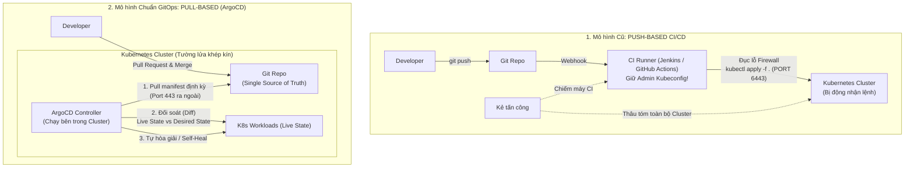
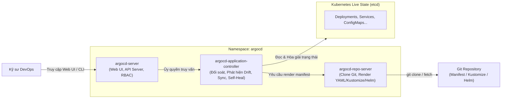

# Bài 45: Vận hành hạ tầng khai báo (GitOps) với ArgoCD

## 1. Thông tin bài học
* **Tên bài:** Bài 45: Vận hành hạ tầng khai báo (GitOps) với ArgoCD
* **Mục tiêu học:** Nắm vững triết lý và 4 nguyên tắc cốt lõi của **GitOps (OpenGitOps)**; hiểu sâu sắc sự khác biệt kiến trúc giữa mô hình truyền thống **Push-based CI/CD** và mô hình hiện đại **Pull-based GitOps**; giải phẫu kiến trúc nội bộ của **ArgoCD** (`argocd-server`, `argocd-repo-server`, `argocd-application-controller`); làm chủ Custom Resource Definition cốt lõi `Application` và `AppProject`; thực hành cơ chế tự động phát hiện và hóa giải trôi cấu hình (**Configuration Drift Detection & Self-Healing**); hiểu chiến lược phân tầng triển khai với **Sync Waves** và **Sync Hooks**; thiết lập lab ArgoCD phiên bản siêu tinh gọn tối ưu hóa cho môi trường RAM 8GB và kiểm chứng quy trình đồng bộ tự động từ Git lên cụm Kubernetes.
* **Thời lượng ước tính:** 210 phút (90 phút lý thuyết, 120 phút thực hành và quan sát)
* **Kiến thức cần có trước:** Bài 09 (Deployment), Bài 10 (Service), Bài 43 (Helm 3), Bài 44 (Kustomize).
* **Liên quan kỳ thi:** Chuẩn vận hành Production & Platform Engineer thực chiến (ArgoCD là công cụ GitOps de-facto trong hệ sinh thái Cloud Native, xuất hiện thường trực trong các bài phỏng vấn Senior SRE / DevOps).

---

## 2. Bảng thuật ngữ

| Thuật ngữ | Giải thích đơn giản | Ví dụ / Ẩn dụ đời thường |
| :--- | :--- | :--- |
| **GitOps** | Mô hình vận hành trong đó Git là "Nguồn chân lý duy nhất" (Single Source of Truth) cho toàn bộ cấu hình hạ tầng và ứng dụng. Mọi thay đổi trên cluster đều bắt nguồn từ một Git commit. | Sổ bộ địa chính của thành phố: Mọi ranh giới đất đai ngoài đời thực bắt buộc phải khớp 100% với bản vẽ lưu trữ trong văn phòng đăng ký đất đai. |
| **ArgoCD** | Một công cụ GitOps mã nguồn mở dạng Pull-based chuyên dụng cho Kubernetes, chạy trực tiếp bên trong cluster để liên tục so khớp trạng thái thực tế với Git. | Nhân viên kiểm toán mẫn cán: Liên tục cầm sổ kế toán (Git) đi rà soát từng kệ hàng trong kho (Cluster), thấy lệch là lập tức sắp xếp lại cho chuẩn. |
| **Desired State (Trạng thái mong muốn)** | Trạng thái hệ thống được khai báo rõ ràng trong các file YAML/Kustomize/Helm lưu trên Git repository. | Bản thiết kế nội thất căn nhà mà kiến trúc sư đã duyệt. |
| **Live State / Actual State (Trạng thái thực tế)** | Trạng thái hiện thời của các tài nguyên đang chạy trong cụm Kubernetes (lưu trữ trong etcd). | Nội thất thực tế đang được bày biện bên trong căn phòng. |
| **Configuration Drift (Trôi cấu hình)** | Hiện tượng trạng thái thực tế của cluster bị lệch khỏi khai báo trên Git (do ai đó sửa tay bằng `kubectl edit` hoặc do sự cố). | Ai đó tự ý kê thêm một chiếc ghế sofa lạ vào phòng khách mà không báo kiến trúc sư. |
| **Reconciliation Loop (Vòng lặp đối soát)** | Quá trình ArgoCD liên tục so sánh Desired State với Live State để phát hiện và khắc phục sai lệch. | Người gác hải đăng cứ 3 phút lại quét ống nhòm kiểm tra bờ biển xem có vật thể lạ trôi dạt vào không. |
| **Self-Healing (Tự chữa lành)** | Tính năng của ArgoCD tự động ghi đè hoặc xóa bỏ các thay đổi thủ công trên cluster để đưa hệ thống quay về đúng trạng thái trên Git. | Hệ thống phao cơ bể nước: Khi nước cạn hay tràn khỏi mức phao quy định, van tự động mở/đóng để đưa mực nước về đúng vạch chuẩn. |
| **Prune (Cắt tỉa)** | Hành động tự động xóa bỏ tài nguyên trên cluster nếu tài nguyên đó đã bị xóa khỏi Git repository. | Dọn rác định kỳ: Bất kỳ món đồ nào không còn tên trong danh mục tài sản sẽ bị dọn khỏi phòng. |
| **Application CRD** | Tài nguyên tùy biến của Kubernetes do ArgoCD định nghĩa (`kind: Application`), kết nối một thư mục Git (Source) với một Namespace trên Cluster (Destination). | Hợp đồng ủy thác: Giao kèo ghi rõ "Hãy lấy hàng từ kho A chuyển đến đặt tại quầy B". |

---

## 3. Bức tranh lớn: Vấn đề thực tế và ẩn dụ đời thường

### Nhắc lại bài trước
Ở Bài 43 và Bài 44, chúng ta đã nắm trong tay hai vũ khí thượng thừa để đóng gói và tùy biến cấu hình: **Helm 3** (mẫu hóa biểu mẫu) và **Kustomize** (lớp phủ cấu hình phi biểu mẫu cho dev/staging/prod). Tuy nhiên, dù manifest có chuẩn đến đâu, câu hỏi hóc búa vẫn còn bỏ ngỏ: **Ai hoặc cái gì sẽ là người gõ lệnh `kubectl apply` để đưa các file YAML đó lên Production?** Nếu vẫn dựa vào con người hay những con bot CI push từ ngoài vào, hệ thống của bạn vẫn đang đứng trước bờ vực hiểm nguy.

### Tại sao cần cái này ở production? (Vấn đề thực tế)

Hãy tưởng tượng bạn đang quản lý một hệ thống thương mại điện tử lớn với 50 microservices và một đội ngũ gồm 30 kỹ sư:

1. **Thảm họa "Sửa tay lúc nửa đêm" (Snowflake Cluster):**
   Lúc 2 giờ sáng, hệ thống thanh toán bị nghẽn mạng. Một kỹ sư On-call nhảy vào cluster, gõ vội lệnh `kubectl edit deployment payment` để tăng RAM từ `256Mi` lên `2Gi` và đổi biến môi trường `TIMEOUT=60s`. Sự cố được cứu vãn!  
   Nhưng sang ngày hôm sau, người kỹ sư đó... quên ghi lại thay đổi vào Git. Ba tuần sau, một lập trình viên khác merge tính năng mới vào nhánh `main`, pipeline CI/CD kích hoạt và chạy lệnh `kubectl apply` đè lại file YAML cũ trên Git. Bùm! RAM bị ép tụt xuống `256Mi`, timeout bị kéo về mặc định, và hệ thống sập toàn diện giữa ban ngày!  
   Đây chính là căn bệnh kinh niên mang tên **Configuration Drift (Trôi cấu hình)**. Cluster dần biến thành một "Bông tuyết độc nhất vô nhị" (Snowflake) - không một ai trên cõi đời này biết chính xác trên cluster đang chạy những gì!

2. **Cơn ác mộng bảo mật của mô hình Push CI/CD truyền thống:**
   Trong mô hình truyền thống (Jenkins, GitLab CI, GitHub Actions runner chạy ngoài cluster):
   * Con bot CI bắt buộc phải giữ file cấu hình bí mật tối cao: `kubeconfig` mang quyền `cluster-admin`!
   * Tường lửa cluster phải đục một lỗ mở port `6443` ra Internet công cộng để con bot CI từ bên ngoài bắn lệnh `kubectl apply` vào.
   * Nếu máy chủ Jenkins hoặc GitHub Actions bị tin tặc tấn công khai thác lỗ hổng chuỗi cung ứng, toàn bộ quyền kiểm soát cụm Production lập tức rơi vào tay kẻ xấu.

3. **Audit Log phân mảnh và quy trình Rollback đau khổ:**
   Khi có sự cố cần rollback, ai nhớ được 10 phút trước cluster đang chạy bản build nào? Nếu dùng `kubectl rollout undo`, trạng thái rollback đó không hề được lưu vết vào Git. Nhóm phát triển nhìn vào Git thấy phiên bản A, nhưng thực tế cluster đang lùi về phiên bản B.

**GitOps sinh ra để xóa sổ vĩnh viễn những vấn nạn trên!**

### Ẩn dụ đời thường: Thủ thư nghiêm khắc và Kho sách quốc gia

Hãy tưởng tượng cụm Kubernetes của bạn là **Kho sách Quốc gia**, các Pod/Deployment là **những cuốn sách trên giá**, và Git Repository là **Cuốn Sổ Mục Lục của thư viện**.

* **Cách làm truyền thống (Push CI/CD):**  
  Bất kỳ độc giả hay nhân viên giao hàng nào cũng có chìa khóa vạn năng để mở cửa kho sách. Họ có thể tự tiện mang sách vào nhét lên giá, hoặc đổi vị trí các cuốn sách mà chẳng buồn ghi chép vào sổ mục lục. Chẳng mấy chốc, kho sách trở thành một bãi chiến trường lộn xộn.
* **Cách làm GitOps với ArgoCD (Thủ thư Pull-based):**  
  Thư viện đóng chặt cửa sắt, niêm phong toàn bộ lối vào. **Không một ai trên đời có chìa khóa vào kho sách** (kể cả Giám đốc kỹ thuật hay lập trình viên)!  
  Bên trong kho sách chỉ có đúng một người duy nhất: **Bác thủ thư ArgoCD**. Bác thủ thư này không nghe lệnh của bất kỳ ai bằng miệng hay tin nhắn. Bác chỉ nhìn qua ô cửa kính nhìn vào **Cuốn Sổ Mục Lục (Git Repository)**:
  * Khi nhóm biên tập muốn thêm sách mới, họ phải gửi một đề xuất chỉnh sửa cuốn sổ (Pull Request). Khi đề xuất được duyệt và ghi vào sổ (Merge to Git), bác thủ thư ArgoCD bên trong kho sách tự động mở sổ ra đọc, đi lấy đúng cuốn sách đó đặt ngay ngắn lên giá (**Sync**).
  * Nếu một kẻ gian lẻn vào kho sách lén đặt một cuốn sách lậu lên giá (sửa tay bằng `kubectl`), bác thủ thư ArgoCD cầm chổi quét cuốn sách đó vứt ngay vào thùng rác (**Self-Healing**)!
  * Nếu cuốn sách bị gạch tên khỏi sổ mục lục, bác thủ thư lập tức hạ sách xuống khỏi giá và tiêu hủy (**Prune**).

Kết quả: **Kho sách ngoài đời luôn luôn là hình ảnh phản chiếu hoàn hảo 100% của cuốn Sổ Mục Lục!**

---

## 4. Giải thích khái niệm theo từng bước

### 4 Nguyên tắc Cốt lõi của GitOps (OpenGitOps Standard)

Mô hình GitOps được chuẩn hóa bởi hiệp hội OpenGitOps (thuộc Linux Foundation / CNCF) dựa trên 4 trụ cột bất di bất dịch:

1. **Declarative (Tính Khai báo):** Toàn bộ hệ thống phải được mô tả bằng cú pháp khai báo (như YAML trong Kubernetes). Bạn mô tả "Tôi muốn có 3 Pod chạy nginx", chứ không viết script mệnh lệnh "Hãy khởi chạy container thứ nhất, rồi khởi chạy container thứ hai".
2. **Versioned and Immutable (Có phiên bản và Bất biến):** Trạng thái mong muốn phải được lưu trữ trong một hệ thống quản lý phiên bản có lịch sử đầy đủ và không thể bị sửa trộm (Git commit SHA, thẻ Tag). Mọi biến động đều được lưu vết ai sửa, sửa lúc nào, vì lý do gì (Commit Message & PR review).
3. **Pulled Automatically (Kéo tự động):** Các phần mềm tác nhân (Software Agents) nằm *bên trong* cluster sẽ tự động chủ động kéo trạng thái khai báo từ kho lưu trữ về. Cluster không bao giờ bị thụ động chờ lệnh từ bên ngoài đẩy vào.
4. **Continuously Reconciled (Liên tục Đối soát & Tự điều chỉnh):** Phần mềm tác nhân liên tục quan sát trạng thái thực tế của cluster. Nếu phát hiện sai lệch (Drift), nó sẽ tự động kích hoạt tiến trình đưa cluster quay về trạng thái mong muốn.

---

### So sánh Kiến trúc: Push-based CI/CD vs. Pull-based GitOps



| Tiêu chí | Push-based CI/CD (Truyền thống) | Pull-based GitOps (ArgoCD) |
| :--- | :--- | :--- |
| **Vị trí thực thi triển khai** | Bên ngoài cluster (Jenkins server, GitHub Runner). | Bên trong cluster (ArgoCD Controller). |
| **Bảo mật Kubeconfig** | Rủi ro cực cao: Kubeconfig lưu trên CI tool bên ngoài, có nguy cơ lộ token. | An toàn tuyệt đối: Không cần đưa Kubeconfig ra ngoài; ArgoCD dùng In-Cluster ServiceAccount nội bộ. |
| **Mở cổng Tường lửa** | Bắt buộc mở cổng API Server (`6443`) cho IP của CI Runner truy cập. | Đóng hoàn toàn chiều Inbound; ArgoCD chỉ cần mở chiều Outbound HTTPS (`443`) để pull code từ Git. |
| **Phát hiện sửa tay (Drift)** | Hoàn toàn mù quáng: Ai sửa tay bằng `kubectl edit` thì CI không hề hay biết cho đến lần deploy kế tiếp. | Phát hiện theo thời gian thực (Real-time Drift Detection) và tự động dập tắt sự trôi dạt. |
| **Quy trình Phục hồi (Disaster Recovery)** | Phức tạp: Phải chạy lại hàng loạt pipeline CI với tham số rườm rà. | Tốc độ ánh sáng: Trỏ ArgoCD vào Git repo cũ trên một cluster mới tinh, toàn bộ hạ tầng được dựng lại trong vài phút! |

---

### Giải phẫu Kiến trúc Bên trong của ArgoCD

ArgoCD được kiến trúc theo dạng mô-đun hóa cao độ gồm 3 thành phần cốt lõi:



1. **`argocd-server`:** Đóng vai trò là cổng giao tiếp (API Server) phục vụ Web UI và ArgoCD CLI. Nó quản lý xác thực người dùng (SSO/OIDC, local users), phân quyền truy cập (RBAC) và cung cấp giao diện trực quan hóa sơ đồ trạng thái ứng dụng.
2. **`argocd-repo-server`:** Đóng vai trò "nhà máy xử lý mã nguồn". Nó chịu trách nhiệm clone hoặc fetch Git repository, sau đó gọi các công cụ kết xuất như Kustomize, Helm, hay JSONNET để biên dịch tất cả thành các manifest YAML thuần túy sẵn sàng áp dụng.
3. **`argocd-application-controller`:** Đây là "bộ não" thực sự của ArgoCD! Nó liên tục chạy vòng lặp hòa giải (**Reconciliation Loop**):
   * Lấy manifest đã biên dịch từ `argocd-repo-server` (Desired State).
   * Đọc danh sách tài nguyên thực tế từ `kube-apiserver` (Live State).
   * Thực hiện so sánh (Diffing Algorithm). Nếu hai trạng thái trùng khớp, đánh dấu ứng dụng là `Synced`. Nếu có sai lệch, đánh dấu là `OutOfSync`.
   * Nếu tính năng `Self-Heal` hoặc `Automated Sync` được bật, controller sẽ ngay lập tức can thiệp để đưa Live State trở về đúng Desired State.

---

### Mổ xẻ Custom Resource: `Application` CRD

ArgoCD không sử dụng cơ sở dữ liệu bên ngoài (như MySQL hay PostgreSQL) để lưu trữ thông tin cấu hình ứng dụng. Toàn bộ thông tin được lưu trữ nguyên bản dưới dạng Kubernetes Custom Resource mang tên **`Application`**:

```yaml
apiVersion: argoproj.io/v1alpha1
kind: Application
metadata:
  name: boutique-frontend        # Tên ứng dụng hiển thị trong ArgoCD
  namespace: argocd             # Nơi lưu trữ tài nguyên Application CRD
  finalizers:
    - resources-finalizer.argocd.argoproj.io # Bảo vệ: Khi xóa Application CRD sẽ tự xóa luôn tài nguyên con trong cluster
spec:
  project: default              # Dự án quản lý phân quyền (AppProject)
  
  # 1. NGUỒN CHÂN LÝ (SOURCE - Nơi lấy Desired State)
  source:
    repoURL: https://github.com/GoogleCloudPlatform/microservices-demo.git # Địa chỉ Git Repo
    targetRevision: HEAD        # Nhánh (branch), tag hoặc commit SHA cần theo dõi
    path: kustomize/components/shopping-assistant # Thư mục chứa YAML/Kustomize/Helm trong repo
    
  # 2. ĐÍCH ĐẾN TRIỂN KHAI (DESTINATION - Nơi triển khai Live State)
  destination:
    server: https://kubernetes.default.svc # URL của cụm K8s đích (đây là cụm local đang chạy chính ArgoCD)
    namespace: demo-production            # Namespace trên K8s sẽ chứa các Pod/Service

  # 3. CHÍNH SÁCH ĐỒNG BỘ (SYNC POLICY)
  syncPolicy:
    automated:                  # Bật tự động hóa hoàn toàn
      prune: true               # TỰ ĐỘNG XÓA tài nguyên trên K8s nếu file YAML bị xóa trên Git
      selfHeal: true            # TỰ ĐỘNG GHI ĐÈ nếu có ai sửa tay trên cluster bằng kubectl
    syncOptions:
      - CreateNamespace=true    # Tự động tạo Namespace đích nếu chưa tồn tại
```

---

### Cơ chế Điều phối Cấp cao: Sync Waves và Sync Phases

Trong một hệ thống microservices phức tạp, bạn không thể tạo đồng loạt mọi thứ cùng một giây. Ví dụ: Cơ sở dữ liệu và Secret phải sẵn sàng *trước khi* Backend khởi động; các bảng database phải được Migration *trước khi* API server mở cổng nhận request.

ArgoCD giải quyết bài toán này bằng **Sync Phases** và **Sync Waves** thông qua các Kubernetes Annotations:

1. **Sync Phases (Các giai đoạn đồng bộ):**
   * `PreSync`: Chạy các Job khởi tạo (ví dụ: Job backup dữ liệu, Job kiểm tra tính khả dụng của hạ tầng).
   * `Sync`: Triển khai các tài nguyên chính (Deployment, Service, ConfigMap).
   * `PostSync`: Chạy các Job dọn dẹp hoặc gửi thông báo Slack / Teams báo cáo deploy thành công.
   * `SyncFail`: Chạy tác vụ xử lý nếu quá trình Sync gặp sự cố.

2. **Sync Waves (Các đợt sóng đồng bộ):**
   Trong cùng một pha, bạn có thể đánh số thứ tự từ bé đến lớn bằng annotation:
   `argocd.argoproj.io/sync-wave: "1"`
   * **Wave 1:** Tạo Namespace, Secret, CustomResourceDefinitions.
   * **Wave 2:** Chạy Database Pod (PostgreSQL/Redis). ArgoCD chờ đến khi Pod này đạt trạng thái `Healthy`.
   * **Wave 3:** Chạy Job Database Migration. ArgoCD chờ Job chạy xong (`Completed`).
   * **Wave 4:** Triển khai Backend API và Frontend.

---

## 5. Thực hành (Lab)

* **Môi trường:** Cụm Kind 2 nodes (`1 control-plane + 1 worker`).
* **Mức RAM ước tính:** ~350 MB - 450 MB (Cực kỳ an toàn trên máy 8GB RAM / WSL 4GB limit).  
  *(Chiến thuật SRE cho máy 8GB: Bản cài đặt mặc định của ArgoCD kéo theo Dex SSO, Redis, ApplicationSet, Notifications Controller tốn gần 1GB RAM. Trong bài lab này, chúng ta sẽ áp dụng **ArgoCD Core/Lightweight Mode**: Vô hiệu hóa các thành phần thừa, chỉ triển khai `argocd-repo-server` và `argocd-application-controller` với giới hạn tài nguyên khắt khe).*

---

### Bước 1: Chuẩn bị Namespace và Manifest ArgoCD Siêu Tinh gọn

Tạo thư mục làm việc và triển khai phiên bản ArgoCD tối giản được tinh chỉnh tài nguyên:

```powershell
# Tạo thư mục thực hành lab
New-Item -ItemType Directory -Force -Path "D:\LEARN\kubernetes\argocd-lab"
Set-Location "D:\LEARN\kubernetes\argocd-lab"

# Tạo namespace chuyên biệt cho ArgoCD
kubectl create namespace argocd
```

Bây giờ, chúng ta áp dụng manifest cài đặt phiên bản ArgoCD Core (gồm Controller, Repo Server và Server cơ bản) trực tiếp từ kho lưu trữ chính thức của dự án ArgoCD, đồng thời gán giới hạn RAM/CPU nhẹ nhàng:

```powershell
# Tải và áp dụng bản cài đặt Core của ArgoCD (Không kèm Dex, không kèm Redis nặng nề)
kubectl apply -n argocd -f https://raw.githubusercontent.com/argoproj/argo-cd/v2.10.4/manifests/core-install.yaml
```

> [!NOTE]
> Phiên bản `core-install.yaml` là phiên bản chính thức được ArgoCD thiết kế riêng cho các hệ thống biên (Edge), IoT hoặc các cụm máy phát triển nhỏ gọn, giữ lại 100% sức mạnh xử lý GitOps cốt lõi nhưng giảm 70% lượng tiêu thụ RAM!

Kiểm tra các Pod của ArgoCD đang khởi động trong namespace `argocd`:

```powershell
kubectl get pods -n argocd
```

### Bước 2: Kết quả mong đợi khi ArgoCD khởi động hoàn tất

```text
NAME                                         READY   STATUS    RESTARTS   AGE
argocd-application-controller-0              1/1     Running   0          45s
argocd-repo-server-7994946654-2qplb          1/1     Running   0          45s
```

Chỉ đúng 2 Pod cốt lõi hoạt động! Tổng mức RAM tiêu thụ của cả 2 Pod này chỉ vỏn vẹn ~220MB.

---

### Bước 3: Tạo Khai báo `Application` GitOps đầu tiên

Chúng ta sẽ khai báo một tài nguyên `Application` để ArgoCD quản lý microservice `guestbook` (một ứng dụng mẫu chuẩn của CNCF được lưu tại kho Git công khai chính thức của ArgoCD: `https://github.com/argoproj/argocd-example-apps.git`).

Tạo file `guestbook-app.yaml` bằng PowerShell Here-String:

```powershell
@'
apiVersion: argoproj.io/v1alpha1
kind: Application
metadata:
  name: guestbook-gitops
  namespace: argocd
spec:
  project: default
  source:
    repoURL: https://github.com/argoproj/argocd-example-apps.git
    targetRevision: HEAD
    path: guestbook
  destination:
    server: https://kubernetes.default.svc
    namespace: demo-gitops
  syncPolicy:
    automated:
      prune: true
      selfHeal: true
    syncOptions:
      - CreateNamespace=true
'@ | Set-Content -Encoding UTF8 guestbook-app.yaml

# Áp dụng khai báo Application lên cụm Kubernetes
kubectl apply -f guestbook-app.yaml
```

---

### Bước 4: Kiểm chứng Quá trình Tự động Đồng bộ (Sync)

Hãy quan sát cách ArgoCD tự động tạo namespace `demo-gitops`, kéo manifest từ GitHub về và khởi tạo Deployment/Service:

```powershell
# Xem trạng thái của Application CRD
kubectl get application guestbook-gitops -n argocd
```

**Kết quả mong đợi:**
```text
NAME               SYNC STATUS   HEALTH STATUS
guestbook-gitops   Synced        Healthy
```

Kiểm tra tài nguyên ứng dụng thực tế được sinh ra trong namespace `demo-gitops`:

```powershell
kubectl get all -n demo-gitops
```

**Kết quả mong đợi:**
```text
NAME                                  READY   STATUS    RESTARTS   AGE
pod/guestbook-ui-85985d774c-4x9zq     1/1     Running   0          30s

NAME                   TYPE        CLUSTER-IP      EXTERNAL-IP   PORT(S)   AGE
service/guestbook-ui   ClusterIP   10.96.142.88    <none>        80/TCP    30s

NAME                           READY   UP-TO-DATE   AVAILABLE   AGE
deployment.apps/guestbook-ui   1/1     1            1           30s
```

Ứng dụng đã được triển khai hoàn toàn tự động mà lập trình viên không hề phải gõ bất kỳ lệnh `kubectl apply` nào cho bản thân Deployment hay Service!

---

### Bước 5: Thí nghiệm Kinh điển: Kiểm chứng Drift Detection & Self-Healing!

Bây giờ, chúng ta sẽ đóng vai một kỹ sư "tự ý sửa tay" trên cluster để xem ArgoCD phản ứng như thế nào!

**Kịch bản phá hoại 1: Cố tình đổi số bản sao (Replicas) trên Cluster**
Theo file khai báo trên Git, `guestbook-ui` chỉ có `replicas: 1`. Chúng ta thử scale nó lên 5:

```powershell
# Cố tình scale lên 5 Pods bằng tay
kubectl scale deployment guestbook-ui -n demo-gitops --replicas=5

# Ngay lập tức kiểm tra lại số lượng Pods!
kubectl get pods -n demo-gitops
```

**Kết quả quan sát kỳ diệu:**
```text
NAME                            READY   STATUS        RESTARTS   AGE
pod/guestbook-ui-85985d774c-4x9zq   1/1     Running       0          2m
pod/guestbook-ui-85985d774c-6j2k1   0/1     Terminating   0          2s
pod/guestbook-ui-85985d774c-9f8l2   0/1     Terminating   0          2s
pod/guestbook-ui-85985d774c-m5n8p   0/1     Terminating   0          2s
pod/guestbook-ui-85985d774c-x7v3q   0/1     Terminating   0          2s
```
Chỉ trong vòng chưa đầy 3 giây, `argocd-application-controller` phát hiện Live State (`5 Pods`) không khớp với Desired State trên Git (`1 Pod`). Nhờ có cơ chế **`selfHeal: true`**, ArgoCD lập tức ra lệnh hạ sát ngay 4 Pod vừa được tạo chui, ép số lượng Pod quay về chính xác số 1!

---

**Kịch bản phá hoại 2: Cố tình xóa luôn Service bằng tay**
Một ai đó vô tình chạy nhầm lệnh xóa Service:

```powershell
# Xóa Service quan trọng
kubectl delete service guestbook-ui -n demo-gitops

# Kiểm tra lại ngay lập tức
kubectl get svc -n demo-gitops
```

**Kết quả mong đợi:**
```text
NAME           TYPE        CLUSTER-IP      EXTERNAL-IP   PORT(S)   AGE
guestbook-ui   ClusterIP   10.96.210.15    <none>        80/TCP    2s
```
Service vừa bị xóa đi đã lập tức **được hồi sinh** chỉ sau 2 giây! Mọi hành vi phá hoại thủ công đều bị vô hiệu hóa hoàn toàn.

---

### Bước 6: Dọn dẹp tài nguyên (Cleanup)

Để giải phóng bộ nhớ RAM quý giá cho hệ thống, chúng ta dọn dẹp các tài nguyên vừa tạo:

```powershell
# Xóa Application (finalizer sẽ tự động dọn dẹp các tài nguyên trong demo-gitops)
kubectl delete -f guestbook-app.yaml

# Xóa namespace demo-gitops nếu còn sót
kubectl delete namespace demo-gitops --ignore-not-found=true

# Xóa toàn bộ ArgoCD
kubectl delete namespace argocd --ignore-not-found=true

# Quay về thư mục gốc
Set-Location "D:\LEARN\kubernetes\microservices-demo\LEARN-KUBERNETES"
Remove-Item -Recurse -Force "D:\LEARN\kubernetes\argocd-lab"
```

Kiểm tra đảm bảo RAM đã được giải phóng hoàn toàn:

```powershell
kubectl get ns
```

---

## 6. Lỗi thường gặp và cách debug

### Lỗi 1: Ứng dụng bị kẹt ở trạng thái `OutOfSync` liên tục do Mutating Webhook
* **Dấu hiệu:** ArgoCD báo trạng thái `OutOfSync`. Khi ấn Sync, nó báo `Synced` trong nửa giây rồi lại lập tức nhảy về `OutOfSync`. Vòng lặp này diễn ra vĩnh viễn khiến CPU của controller tăng vọt.
* **Nguyên nhân:** Một Admission Webhook trong cluster (ví dụ: Istio sidecar injector, hoặc một Operator tự động inject nhãn/annotations mặc định) âm thầm chèn thêm các trường vào Pod sau khi ArgoCD apply. ArgoCD so sánh thấy Live State có thêm trường mới mà trên Git không có, nên kết luận là bị Drift!
* **Cách debug và sửa:** Cấu hình thuộc tính `ignoreDifferences` trong file `Application` CRD để bảo ArgoCD bỏ qua không so sánh những trường do cluster tự sinh:
  ```yaml
  spec:
    ignoreDifferences:
      - group: apps
        kind: Deployment
        jsonPointers:
          - /spec/template/metadata/annotations/sidecar.istio.io~1status
  ```

---

### Lỗi 2: Trạng thái `ComparisonError`: "Authentication failed" hoặc "Repository not found"
* **Dấu hiệu:** `Application` báo lỗi đỏ: `rpc error: code = Unknown desc = Repository not found` hoặc lỗi timeout khi kết nối tới Git.
* **Nguyên nhân:** 
  1. Kho Git là Private nhưng chưa cấu hình SSH Key hoặc Personal Access Token (PAT) trong ArgoCD Secret.
  2. Pod `argocd-repo-server` bị chặn kết nối Internet ra ngoài do NetworkPolicy hoặc proxy nội bộ.
* **Cách debug và sửa:**
  1. Kiểm tra log của repo server:
     ```powershell
     kubectl logs -n argocd -l app.kubernetes.io/name=argocd-repo-server --tail=50
     ```
  2. Thêm Secret định danh kho lưu trữ với nhãn `argocd.argoproj.io/secret-type: repository` theo đúng chuẩn của ArgoCD.

---

### Lỗi 3: Xóa file YAML trên Git nhưng tài nguyên trên Cluster vẫn không bị xóa
* **Dấu hiệu:** Kỹ sư đã xóa file `redis-deployment.yaml` trên Git repo, merge thành công vào `main`. ArgoCD báo trạng thái `Synced`, nhưng trên cluster Pod Redis vẫn ung dung chạy!
* **Nguyên nhân:** Tùy chọn `prune` chưa được kích hoạt trong `syncPolicy`. Mặc định vì lý do an toàn, ArgoCD sẽ không tự động xóa tài nguyên nếu không được chỉ định rõ ràng.
* **Cách sửa:** Bật tính năng Prune trong `syncPolicy`:
  ```yaml
  spec:
    syncPolicy:
      automated:
        prune: true
  ```

---

## 7. Góc nhìn Senior

### 1. Sự đánh đổi (Trade-offs)

| Lợi ích đạt được | Cái giá phải trả (Đánh đổi) |
| :--- | :--- |
| **Loại bỏ hoàn toàn trôi cấu hình:** Cluster luôn khớp 100% với Git. | **Mất đi tính linh động tức thời:** Kỹ sư không thể tùy tiện "hot-fix" nhanh trên production bằng `kubectl edit`. Mọi thay đổi dù là 1 chữ cái đều phải qua quy trình Git commit $\rightarrow$ PR $\rightarrow$ Review $\rightarrow$ Merge. |
| **Audit Log tuyệt đối minh bạch:** Lịch sử Git commit chính là nhật ký kiểm toán bất biến. | **Nguy cơ nghẽn Git (Repo Fatigue):** Khi số lượng microservices lên tới hàng trăm, việc quản lý hàng nghìn commit thay đổi phiên bản image có thể làm loãng lịch sử Git nếu không chia tách repository hợp lý. |
| **Disaster Recovery cực nhanh:** Khôi phục cụm mới trong 5 phút. | **Độ trễ đồng bộ (Sync Delay):** Mặc định ArgoCD quét Git định kỳ mỗi 3 phút (polling). Nếu muốn deploy ngay lập tức khi merge, phải cấu hình thêm Git Webhook bắn tín hiệu về cho ArgoCD. |

---

### 2. Best practices tại production

1. **Chiến lược Tách rời Repository (Repo Separation Strategy):**  
   Tuyệt đối **KHÔNG** để chung mã nguồn ứng dụng (Java, Go, Python) và file manifest hạ tầng Kubernetes trong cùng một Git repository.  
   * **App Repo (`frontend-service`):** Chỉ chứa source code và `Dockerfile`. Khi lập trình viên push code, CI build image xong thì KHÔNG được deploy trực tiếp, mà CI sẽ tạo một PR sang...
   * **Infra/Config Repo (`k8s-manifests-prod`):** Nơi duy nhất chứa Helm Chart / Kustomize của toàn bộ hệ thống. ArgoCD chỉ theo dõi duy nhất repository này. Việc này phân định ranh giới trách nhiệm rõ ràng: Dev quản lý App Repo, SRE/Platform quản lý Config Repo.

2. **Xử lý Bí mật (Secrets) trong GitOps:**  
   Quy tắc vàng: **Không bao giờ commit Kubernetes Secret chứa mật khẩu dạng Base64 trần trụi lên Git!**  
   Tại production, các Senior Platform Engineer áp dụng 2 trường phái hàng đầu:
   * **Trường phái 1: Encrypted in Git:** Dùng **Sealed Secrets** (Bitnami) hoặc **Mozilla SOPS**. Mật khẩu được mã hóa bất đối xứng bằng khóa công khai (Public Key) và lưu an toàn trên Git. Chỉ có controller bên trong cluster mới giữ Private Key để giải mã.
   * **Trường phái 2: External Secrets Operator (Đã học ở Bài 34):** Git chỉ lưu `ExternalSecret` manifest (chỉ định tên secret và đường dẫn). Controller bên trong cluster sẽ tự kéo mật khẩu từ HashiCorp Vault, AWS Secrets Manager hoặc GCP Secret Manager.

3. **Mô hình "App of Apps" (Ứng dụng mẹ quản lý các ứng dụng con):**  
   Khi có 50 microservices, bạn không nên tạo thủ công 50 file `Application` CRD. Thay vào đó, tạo một `Application` gốc duy nhất (Root App). Root App này trỏ tới một thư mục Git chứa danh sách khai báo của 50 `Application` con. Khi cần thêm service mới vào cluster, chỉ việc thêm một file YAML vào thư mục đó!

---

### 3. Câu hỏi phỏng vấn Senior

* **Câu hỏi:** *"Trong hệ thống GitOps sử dụng ArgoCD, nếu cụm Kubernetes bị tấn công hoặc một sự cố mạng nghiêm trọng làm mất kết nối hoàn toàn tới GitHub/GitLab trong 4 tiếng, các ứng dụng đang chạy trên cluster có bị sập không? Và nếu trong thời gian đó có Pod bị crash hoặc Node bị hỏng thì chuyện gì xảy ra?"*
* **Gợi ý trả lời chuẩn:**
  1. **Không hề bị sập:** Kubernetes là hệ thống dựa trên trạng thái (State-based). Một khi manifest đã được ArgoCD nạp thành công vào etcd của Kubernetes, các workload (Deployment, Pods) sẽ tiếp tục chạy độc lập bình thường dưới sự điều khiển của Kubernetes Controller Manager. ArgoCD chỉ là công cụ điều phối đồng bộ, không nằm trên luồng xử lý lưu lượng (Data Plane).
  2. **Pod crash / Node hỏng vẫn tự hồi phục bình thường:** Nếu một Pod bị crash hoặc một Worker Node bị chết trong lúc mất kết nối Git, Kubelet và Deployment Controller nguyên bản của Kubernetes vẫn tự động khởi động lại Pod hoặc tái lập lịch (reschedule) sang Node khác bình thường dựa trên spec đã lưu trong etcd.
  3. **Hạn chế duy nhất:** Trong 4 tiếng mất kết nối Git, hệ thống không thể thực hiện các đợt phát hành mới (No new deployments), và ArgoCD sẽ hiển thị cảnh báo `ComparisonError` do không fetch được commit mới nhất từ Git. Mọi thứ sẽ tự động đồng bộ trở lại ngay khi mạng tới Git phục hồi.

---

## 8. Tóm tắt bài học

* 📌 **1. GitOps là triết lý, ArgoCD là hiện thân:** GitOps lấy Git làm nguồn chân lý duy nhất cho toàn bộ hệ thống; ArgoCD là tác nhân Pull-based chạy bên trong cluster đảm bảo Live State luôn phản chiếu chính xác Desired State trên Git.
* 📌 **2. Bảo mật vượt trội của Pull-based:** Khác với Push CI/CD truyền thống (phải mở port và phơi bày `kubeconfig` ra bên ngoài), ArgoCD đóng chặt cổng vào, tự động kéo manifest từ trong mạng nội bộ bằng ServiceAccount.
* 📌 **3. Trừ tiệt Trôi cấu hình (Anti-Drift):** Với các tính năng tự động hóa `prune: true` (tự dọn rác) và `selfHeal: true` (tự chữa lành), ArgoCD lập tức ghi đè và dập tắt mọi hành vi sửa tay bằng `kubectl edit` trong vài giây.
* 📌 **4. Cấu hình khai báo bằng `Application` CRD:** Toàn bộ quan hệ giữa kho Git (Source) và cụm Kubernetes (Destination) được mô hình hóa tự nhiên thành một Custom Resource của Kubernetes, không cần cơ sở dữ liệu ngoài.
* 📌 **5. Vận hành tinh gọn trên máy 8GB:** ArgoCD hỗ trợ chế độ `core-install.yaml` tối giản, cho phép triển khai đầy đủ năng lực đồng bộ GitOps chỉ với 2 Pod nhẹ nhàng (~220MB RAM).

---

## 9. Bài tập tự làm

* 🟢 **Mức Dễ:** Viết một manifest `Application` CRD mang tên `my-nginx-gitops`, lấy cấu hình từ repo Git cá nhân của bạn (hoặc một thư mục ví dụ công khai), triển khai một Deployment Nginx vào namespace `prod-nginx` với chế độ tự động tạo namespace (`CreateNamespace=true`).
* 🟡 **Mức Vừa:** Thử nghiệm thay đổi cấu hình `syncPolicy` của `Application`: tắt tính năng `selfHeal` (`selfHeal: false`). Sau đó dùng lệnh `kubectl scale` tăng số bản sao lên 3. Quan sát xem trạng thái của ứng dụng trong ArgoCD hiển thị là gì? Sau đó thực hiện đồng bộ thủ công để đưa ứng dụng về trạng thái `Synced`.
* 🔴 **Mức Khó:** Thiết kế một cấu trúc thư mục theo mô hình **App of Apps** cho 3 service của Google Online Boutique (`frontend`, `cartservice`, `productcatalogservice`). Viết một file `root-application.yaml` duy nhất để khi apply vào ArgoCD, cả 3 service trên sẽ tự động được sinh ra thành 3 ứng dụng con độc lập.

---

## 10. Câu hỏi tự kiểm tra

1. Bốn nguyên tắc cốt lõi của OpenGitOps là gì?
2. Tại sao mô hình Pull-based của ArgoCD lại được đánh giá là an toàn hơn mô hình Push-based của Jenkins/GitLab-CI?
3. Tính năng `selfHeal` trong `syncPolicy` của ArgoCD có vai trò gì? Nếu không bật tính năng này thì chuyện gì sẽ xảy ra khi ai đó gõ lệnh `kubectl edit`?
4. Khái niệm "Prune" trong ArgoCD có nghĩa là gì? Nếu xóa một file Deployment khỏi Git mà không bật `prune: true` thì tài nguyên trên cluster sẽ ra sao?
5. Thành phần `argocd-repo-server` đảm nhiệm nhiệm vụ gì trong kiến trúc 3 tầng của ArgoCD?
6. Sync Waves được sử dụng để giải quyết bài toán gì trong các hệ thống triển khai thực tế?

<details>
<summary>👉 Bấm vào đây để xem đáp án câu hỏi tự kiểm tra</summary>

* **Câu 1:** 4 nguyên tắc gồm: (1) Khai báo (Declarative), (2) Có phiên bản và bất biến (Versioned and immutable), (3) Tự động kéo về (Pulled automatically), (4) Liên tục đối soát và tự điều chỉnh (Continuously reconciled).
* **Câu 2:** Vì Pull-based không yêu cầu lưu trữ file chứng chỉ tối cao `kubeconfig` trên các máy chủ CI bên ngoài cluster, đồng thời không cần mở cổng tường lửa `6443` của Kubernetes API Server ra ngoài Internet. Toàn bộ tiến trình chạy từ bên trong cluster ra ngoài qua cổng HTTPS thông thường.
* **Câu 3:** `selfHeal` tự động phát hiện khi Live State bị ai đó can thiệp sửa đổi trực tiếp trên cluster và ngay lập tức ghi đè lại bằng Desired State trên Git. Nếu không bật, ArgoCD chỉ đổi trạng thái sang `OutOfSync` và cảnh báo màu vàng, nhưng không tự ý sửa đổi nếu không có người bấm nút Sync.
* **Câu 4:** "Prune" là hành động tự động xóa bỏ các tài nguyên trên Kubernetes khi định nghĩa của chúng không còn tồn tại trên Git. Nếu không bật `prune: true`, khi bạn xóa file YAML trên Git, tài nguyên tương ứng trên cluster vẫn sẽ tồn tại mãi mãi (trở thành tài nguyên mồ côi / orphaned resources).
* **Câu 5:** `argocd-repo-server` chịu trách nhiệm clone mã nguồn từ kho Git về, sau đó chạy các công cụ render (như Helm, Kustomize) để biên dịch toàn bộ cấu hình thành các manifest YAML thuần túy sẵn sàng cho controller so sánh.
* **Câu 6:** Sync Waves giải quyết bài toán thứ tự phụ thuộc khi triển khai hệ thống (Dependency Ordering). Nó đảm bảo các tài nguyên nền tảng (như Namespace, Secret, Database, Migration Jobs) phải đạt trạng thái khỏe mạnh (Healthy) ở các Wave nhỏ trước khi các ứng dụng ở Wave lớn hơn được phép triển khai.
</details>

---

## 11. Tài liệu đọc thêm và bài tiếp theo

### Tài liệu tham khảo
* [Trang chủ dự án OpenGitOps](https://opengitops.dev/)
* [Tài liệu chính thức ArgoCD Documentation](https://argo-cd.readthedocs.io/)
* [ArgoCD Core Installation Guide](https://argo-cd.readthedocs.io/en/stable/operator-manual/core/)
* [Chiến lược quản lý bí mật trong GitOps (CNCF Blog)](https://www.cncf.io/blog/2022/04/19/how-to-manage-secrets-in-gitops/)

### Bài tiếp theo
👉 **Bài 46: Sao lưu và phục hồi thảm họa etcd (Disaster Recovery)**

---

## PHỤ LỤC: ĐÁP ÁN GỢI Ý BÀI TẬP TỰ LÀM (MỤC 9)

### Đáp án Mức Dễ
File `my-nginx-app.yaml`:
```yaml
apiVersion: argoproj.io/v1alpha1
kind: Application
metadata:
  name: my-nginx-gitops
  namespace: argocd
spec:
  project: default
  source:
    repoURL: https://github.com/argoproj/argocd-example-apps.git
    targetRevision: HEAD
    path: guestbook
  destination:
    server: https://kubernetes.default.svc
    namespace: prod-nginx
  syncPolicy:
    automated:
      prune: true
      selfHeal: true
    syncOptions:
      - CreateNamespace=true
```

---

### Đáp án Mức Vừa
1. Sửa `guestbook-app.yaml` đặt `selfHeal: false`:
```yaml
  syncPolicy:
    automated:
      prune: true
      selfHeal: false
```
2. Gõ `kubectl scale deployment guestbook-ui -n demo-gitops --replicas=3`.
3. Kiểm tra bằng `kubectl get application guestbook-gitops -n argocd`. Bạn sẽ thấy trạng thái chuyển thành:
   `SYNC STATUS: OutOfSync`
   Nhưng 3 Pods vẫn tiếp tục chạy vì ArgoCD không tự động can thiệp (do `selfHeal: false`).
4. Để đồng bộ lại, sử dụng lệnh patch hoặc trigger sync thủ công:
   `kubectl patch application guestbook-gitops -n argocd --type merge -p '{"operation":{"sync":{"prune":true}}}'`

---

### Đáp án Mức Khó
Mô hình **App of Apps**:
Tạo một thư mục trong Git chứa 3 file manifest `Application` đại diện cho 3 service.
File `root-application.yaml` gốc:
```yaml
apiVersion: argoproj.io/v1alpha1
kind: Application
metadata:
  name: root-boutique-apps
  namespace: argocd
  finalizers:
    - resources-finalizer.argocd.argoproj.io
spec:
  project: default
  source:
    repoURL: https://github.com/my-org/boutique-gitops-infra.git
    targetRevision: HEAD
    path: applications # Thư mục chứa frontend-app.yaml, cart-app.yaml, catalog-app.yaml
  destination:
    server: https://kubernetes.default.svc
    namespace: argocd # Bản thân các Application con được sinh ra tại namespace argocd
  syncPolicy:
    automated:
      prune: true
      selfHeal: true
```
Khi áp dụng file này, ArgoCD sẽ quét thư mục `applications/`, tự động sinh ra 3 `Application` con, và mỗi `Application` con lại tiếp tục triển khai các microservice tương ứng vào cluster. Quản lý toàn bộ hệ sinh thái chỉ qua 1 cổng duy nhất!

