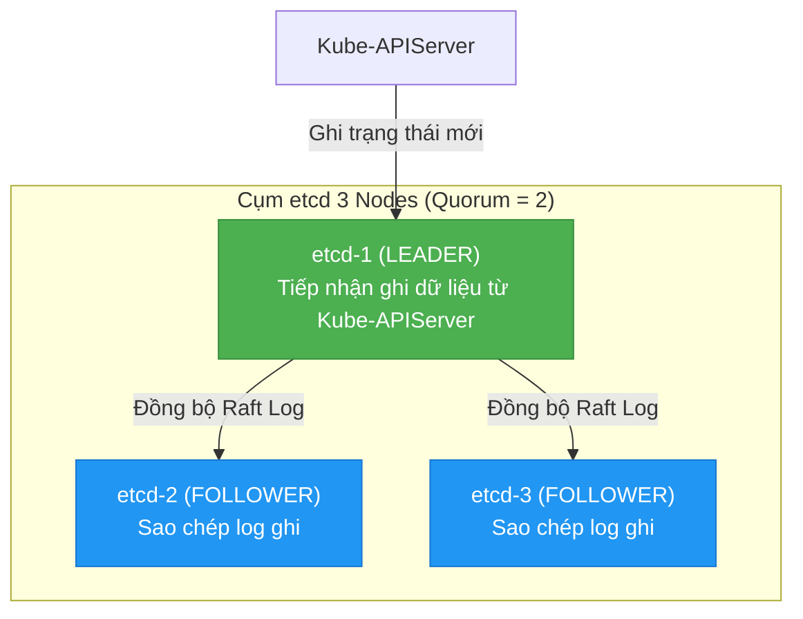
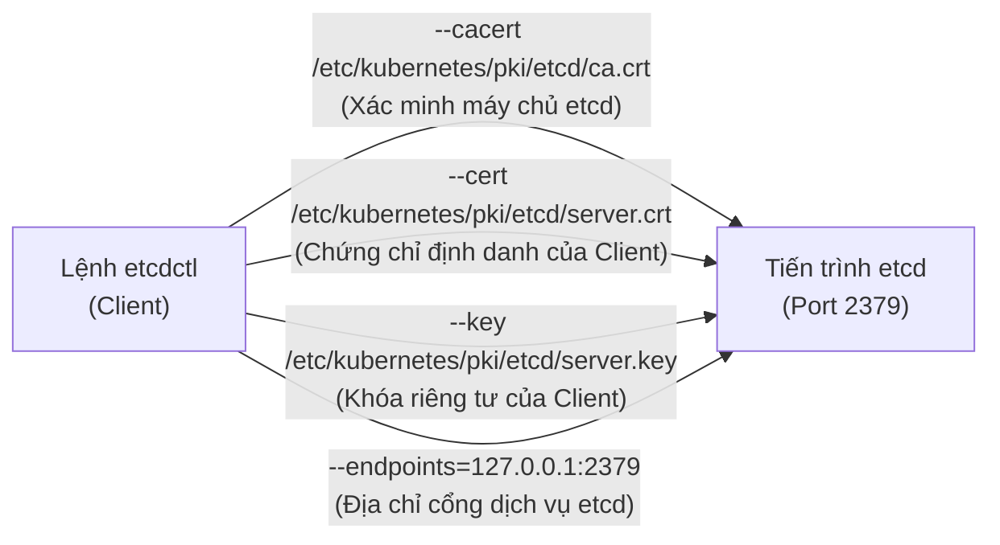
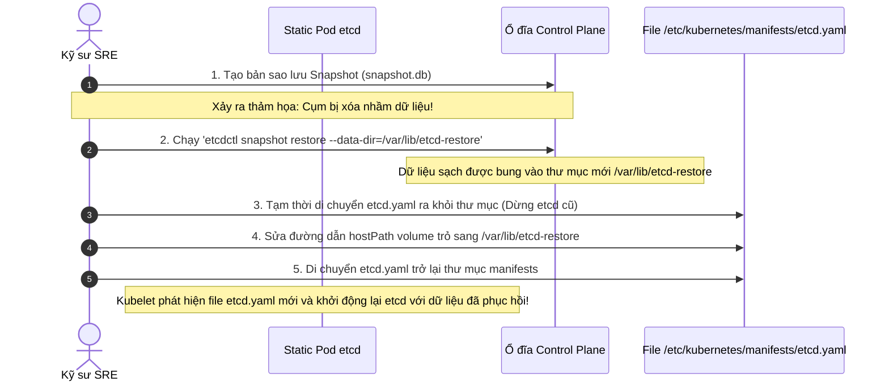

# Bài 46: Sao lưu và phục hồi thảm họa etcd (Disaster Recovery)

## 1. Thông tin bài học
* **Tên bài:** Bài 46: Sao lưu và phục hồi thảm họa etcd (Disaster Recovery)
* **Mục tiêu học:** Thấu hiểu vai trò sống còn của **etcd** - "kho tàng ký ức" lưu trữ toàn bộ trạng thái của cụm Kubernetes; nắm vững cơ chế đồng thuận **Raft Consensus**, tính toán số lượng đa số sống còn (**Quorum**), và kiến trúc lưu trữ nội tại (MVCC, bbolt engine); làm chủ 4 tham số chứng chỉ bảo mật TLS bắt buộc khi giao tiếp với etcd (`--cacert`, `--cert`, `--key`, `--endpoints`); thành thạo quy trình chụp ảnh nhanh (**Snapshot**) bằng tiện ích `etcdctl`; nắm chắc kỹ thuật khôi phục thảm họa (**Restore**) chuẩn thi CKA mà không làm hỏng cụm; thực hành giả lập kịch bản sự cố xóa nhầm toàn bộ dữ liệu nghiệp vụ trên cụm và khôi phục thành công 100% trong vòng 10 phút.
* **Thời lượng ước tính:** 180 phút (90 phút lý thuyết, 90 phút thực hành và tình huống giả lập)
* **Kiến thức cần có trước:** Bài 05 (Kiến trúc Control Plane và Worker Node), Bài 12 (ConfigMap & Secret), Bài 45 (GitOps với ArgoCD).
* **Liên quan kỳ thi:** **CKA (Certified Kubernetes Administrator)** - Đây là câu hỏi **BẮT BUỘC CÓ MẶT 100%** trong mọi đề thi CKA, chiếm tỷ trọng điểm số rất lớn (~7-10% tổng điểm bài thi) thuộc cấu phần *Cluster Maintenance*.

---

## 2. Bảng thuật ngữ

| Thuật ngữ | Giải thích đơn giản | Ví dụ / Ẩn dụ đời thường |
| :--- | :--- | :--- |
| **etcd** | Cơ sở dữ liệu phân tán dạng Key-Value (Khóa - Giá trị), có tính nhất quán cao, là nơi lưu trữ toàn bộ trạng thái của Kubernetes. | Cuốn sổ hộ khẩu duy nhất của cả tòa nhà: Mọi cư dân (Pod), căn hộ (Node), hóa đơn (Secret) đều được ghi chép vào đây. |
| **Disaster Recovery (DR)** | Quy trình và kế hoạch khôi phục toàn bộ hệ thống trở lại hoạt động bình thường sau khi gặp sự cố thảm họa (cháy nổ máy chủ, xóa nhầm dữ liệu). | Bộ dụng cụ thoát hiểm và phương án sơ tán khi xảy ra hỏa hoạn. |
| **Snapshot** | Một bản sao chụp nguyên vẹn toàn bộ dữ liệu của etcd tại một thời điểm chính xác, được lưu thành một tệp nhị phân duy nhất (`.db`). | Bức ảnh chụp cả gia đình vào đúng khoảnh khắc giao thừa: Lưu giữ trọn vẹn trạng thái tại giây phút đó. |
| **Raft Consensus** | Thuật toán giúp một nhóm máy chủ phân tán đồng thuận về một giá trị duy nhất, ngay cả khi có một số máy chủ bị sập. | Quy tắc bỏ phiếu biểu quyết của Hội đồng quản trị: Chỉ cần quá nửa thành viên đồng ý thì quyết định mới có hiệu lực. |
| **Quorum** | Số lượng node tối thiểu phải còn sống trong cụm etcd để cụm có thể tiếp tục nhận lệnh ghi dữ liệu ($Quorum = \lfloor N/2 \rfloor + 1$). | Túc số pháp lý: Cuộc họp đại hội cổ đông phải có tối thiểu 51% số phiếu tham dự mới đủ thẩm quyền ra nghị quyết. |
| **Static Pod (etcd)** | Pod được Kubelet trên Control Plane trực tiếp quản lý thông qua file manifest đặt tại `/etc/kubernetes/manifests/`, không thông qua API Server. | Người bảo vệ được chủ nhà thuê riêng và giao chìa khóa tận tay, không phụ thuộc vào lễ tân tòa nhà. |
| **data-dir** | Thư mục trên ổ đĩa vật lý của máy chủ Control Plane nơi etcd lưu trữ các file cơ sở dữ liệu thực tế (`member/snap/...`). | Ngăn kéo két sắt nơi cất giữ cuốn sổ cái tài chính. |
| **etcdctl** | Công cụ dòng lệnh chính thức để quản trị, kiểm tra sức khỏe, backup và restore cơ sở dữ liệu etcd. | Chiếc chìa khóa điện tử chuyên dụng của thợ sửa khóa két sắt. |

---

## 3. Bức tranh lớn: Vấn đề thực tế và ẩn dụ đời thường

### Nhắc lại bài trước
Ở Bài 45, chúng ta đã tiếp cận GitOps với ArgoCD và học rằng "Git là nguồn chân lý duy nhất" cho các file khai báo YAML. Tuy nhiên, có một sự thật phũ phàng: **Git chỉ lưu mã nguồn và cấu hình tĩnh, Git KHÔNG lưu trạng thái động của hệ thống!** Địa chỉ IP của các Pod đang chạy, danh sách Node Leases báo cáo tình trạng sống còn, các Token bảo mật tự sinh, lịch sử Rolling Update, trạng thái PV/PVC... tất cả đều được nhào nặn và lưu giữ bên trong **etcd**. Nếu etcd bốc hơi, GitOps cũng không thể giúp bạn cứu vãn dữ liệu động lúc nửa đêm!

### Tại sao cần cái này ở production? (Vấn đề thực tế)

Hãy tưởng tượng bạn đang trực On-call cho một ngân hàng số vào đêm Black Friday:

1. **Trải nghiệm cận tử: Khi Control Plane mất trí nhớ (Cluster Amnesia):**
   Một kỹ sư vô tình chạy lệnh dọn dẹp đĩa và xóa nhầm thư mục `/var/lib/etcd` trên máy chủ Master, hoặc đĩa SSD của máy chủ Control Plane bị chập cháy phần cứng.  
   Lúc này, dù các Worker Node và các container ứng dụng vẫn đang tạm thời chạy trong vài phút, nhưng toàn bộ cụm Kubernetes đã rơi vào trạng thái "chết não":  
   * Lệnh `kubectl get pods` trả về lỗi: `The connection to the server localhost:6443 was refused - did you specify the right host or port?`
   * Kube-APIServer sụp đổ vì không thể kết nối tới cơ sở dữ liệu backend.
   * Kube-Scheduler không thể điều phối Pod mới.
   * Kubelet không thể báo cáo tình trạng Node.  
   Nếu bạn không có một file snapshot etcd hợp lệ và không biết cách restore trong vòng 15 phút, bạn sẽ phải đối mặt với thảm họa dựng lại toàn bộ cluster từ đầu, mất toàn bộ dữ liệu trạng thái và cấu hình bảo mật!

2. **Tại sao không thể dùng công cụ sao lưu database thông thường (mysqldump, pg_dump)?**
   etcd không phải là cơ sở dữ liệu quan hệ SQL. Nó là một kho khóa-giá trị phân tán ghi dữ liệu tuần tự với tốc độ microsecond. Việc copy thô thư mục `/var/lib/etcd` khi tiến trình etcd đang chạy sẽ dẫn đến tình trạng **hỏng tệp dữ liệu (Corrupted Data)** do dữ liệu bị ghi dở dang.  
   Cách duy nhất để sao lưu an toàn mà không làm gián đoạn cụm là sử dụng lệnh snapshot chuyên biệt của `etcdctl`, kích hoạt cơ chế chụp điểm nhất quán nội tại của etcd.

### Ẩn dụ đời thường: Hộp đen Máy bay và Cuốn sổ Cái của Trưởng tàu

Hãy tưởng tượng cụm Kubernetes là một **con tàu vũ trụ liên hành tinh**:
* Các Pod và Container là các khoang động cơ, phòng thí nghiệm và phi hành đoàn đang làm việc.
* Kube-APIServer là **Viên Thuyền trưởng** tiếp nhận mệnh lệnh.
* **etcd chính là Chiếc Hộp Đen (Flight Recorder) kiêm Cuốn Sổ Cái Tối Mật** đặt trong két sắt bọc thép của buồng lái.

Mỗi khi thuyền trưởng ra lệnh: "Bật thêm 3 động cơ phản lực (Scale Deployment lên 3)", viên thuyền trưởng không nhớ việc đó trong đầu. Ông ghi ngay một dòng chữ vào Cuốn Sổ Cái: `Động cơ phản lực = 3`.  
Nếu con tàu gặp bão vũ trụ khiến buồng lái bị nổ tung và toàn bộ hệ thống điều khiển điện tử bị xóa sạch bộ nhớ:
* Các kỹ sư cứu hộ không cần phải nhớ con tàu trước đó trông như thế nào.
* Họ chỉ cần lấy **Chiếc Hộp Đen (Bản Snapshot etcd)** ra khỏi két, cắm vào một buồng lái mới và bật công tắc khôi phục.
* Ngay lập tức, chiếc máy tính mới đọc lại toàn bộ Cuốn Sổ Cái, nhận ra con tàu cần có 3 động cơ, 10 phi hành gia và 2 khoang chứa hàng, và tái tạo lại chính xác 100% con tàu như trước thời khắc xảy ra thảm họa!

---

## 4. Giải thích khái niệm theo từng bước

### Cơ chế Lưu trữ và Thuật toán Đồng thuận Raft trong etcd

etcd sử dụng công cụ lưu trữ nhị phân nhúng mang tên **bbolt** (một Key-Value database viết bằng Go dựa trên cấu trúc B+ Tree). Để đảm bảo dữ liệu ghi vào không bao giờ bị ghi đè hay mất mát khi có sự cố, etcd áp dụng cơ chế **MVCC (Multi-Version Concurrency Control)**: Mỗi lần một tài nguyên Kubernetes được tạo hoặc cập nhật, etcd không sửa trực tiếp vào bản ghi cũ mà tạo ra một bản ghi mới với một mã số phiên bản tăng dần gọi là `revision` (được Kubernetes ánh xạ thành trường `metadata.resourceVersion`).

Trong môi trường Production High Availability (HA), etcd chạy theo cụm gồm nhiều thành viên (Cluster Members) sử dụng thuật toán đồng thuận **Raft**:



#### Công thức Quorum sống còn: Tại sao cụm etcd luôn có số node lẻ (3, 5)?
Để một lệnh ghi được coi là thành công, Leader phải nhận được sự xác nhận của đa số các node trong cụm. Số lượng đa số này gọi là **Quorum**:

$$\text{Quorum} = \lfloor \frac{N}{2} \rfloor + 1$$

* Cụm có **3 nodes**: Quorum là $\lfloor 3/2 \rfloor + 1 = 2$. Cụm chịu lỗi được **1 node chết** (còn 2 node $\ge 2$).
* Cụm có **4 nodes**: Quorum là $\lfloor 4/2 \rfloor + 1 = 3$. Cụm cũng chỉ chịu lỗi được **1 node chết** (nếu chết 2 node, còn lại 2 < 3 $\rightarrow$ mất Quorum!).
* Cụm có **5 nodes**: Quorum là $\lfloor 5/2 \rfloor + 1 = 3$. Cụm chịu lỗi được **2 nodes chết**.

> [!IMPORTANT]
> Thêm node thứ 4 không hề tăng khả năng chịu lỗi so với 3 node, mà còn làm chậm tốc độ ghi do phải đồng bộ thêm mạng! Do đó, trong thực tế sản xuất, etcd luôn được triển khai với số lượng node lẻ: **3 node** (cho cụm vừa và nhỏ) hoặc **5 node** (cho cụm cực lớn).

---

### 4 Tham số Bảo mật TLS Bắt buộc của `etcdctl`

Trong Kubernetes chuẩn (triển khai bằng `kubeadm`), etcd được bảo vệ nghiêm ngặt bằng mã hóa TLS hai chiều (mTLS). Bất kỳ ai muốn nói chuyện với etcd đều phải trình thẻ căn cước hợp lệ. Nếu bạn gõ lệnh `etcdctl snapshot save` trần trụi, bạn sẽ bị từ chối thẳng thừng!

Để thực hiện thao tác, bạn bắt buộc phải cung cấp đủ **Bộ Tứ Chứng Chỉ**:



1. **`--cacert`:** Đường dẫn tới Certificate Authority (CA) của etcd: `/etc/kubernetes/pki/etcd/ca.crt`. Dùng để client xác minh máy chủ etcd là hàng thật.
2. **`--cert`:** Chứng chỉ client: `/etc/kubernetes/pki/etcd/server.crt` (hoặc `peer.crt` / `healthcheck-client.crt`).
3. **`--key`:** Khóa bí mật đi kèm chứng chỉ client: `/etc/kubernetes/pki/etcd/server.key`.
4. **`--endpoints`:** Địa chỉ IP và cổng mà etcd lắng nghe: thường là `https://127.0.0.1:2379` hoặc IP của Control Plane node.

> [!TIP]
> Trong kỳ thi CKA, bạn không cần phải học thuộc lòng 4 đường dẫn này! Hãy mở ngay file manifest của etcd tại:  
> `cat /etc/kubernetes/manifests/etcd.yaml`  
> Tìm mục `spec.containers.command`, toàn bộ 4 đường dẫn này nằm sẵn ngay trước mắt bạn!

---

### Quy trình 5 Bước Khôi phục Thảm họa (Restore Process) Chuẩn CKA

Quy trình restore etcd là một trong những bài toán đòi hỏi sự cẩn trọng cao nhất. Hãy ghi nhớ quy tắc vàng: **Lệnh `etcdctl snapshot restore` KHÔNG khôi phục đè trực tiếp lên một etcd đang chạy!** Nó giải nén file snapshot ra một thư mục dữ liệu hoàn toàn mới trên đĩa.



---

## 5. Thực hành (Lab)

* **Môi trường:** Cụm Kind hiện có (`1 control-plane + 1 worker`).
* **Mức RAM ước tính:** ~0 MB (Sử dụng trực tiếp các thành phần có sẵn của cluster lab, không tốn thêm RAM).

> [!NOTE]
> Trong môi trường Kind, node `kind-control-plane` là một Docker container chạy trên máy của bạn. Bên trong container này, Kubernetes hoạt động 100% y hệt như một máy chủ Linux vật lý cài đặt bằng `kubeadm`. Toàn bộ các thao tác dưới đây tương thích hoàn toàn với bài thi CKA thực tế.

---

### Bước 1: Tạo Dữ liệu Mẫu Quan trọng để Làm mốc Kiểm chứng

Trước khi sao lưu, hãy tạo một tài nguyên quan trọng đại diện cho dữ liệu của công ty: một Secret chứa mật khẩu thanh toán và một Deployment chạy microservice:

```powershell
# Tạo namespace và tài nguyên nhạy cảm
kubectl create namespace production-data
kubectl create secret generic payment-db-secret --from-literal=password="P@ssw0rdSuperSecret2026" -n production-data
kubectl create deployment critical-payment --image=nginx:alpine --replicas=2 -n production-data

# Kiểm tra dữ liệu đã hiện diện
kubectl get all,secrets -n production-data
```

**Kết quả mong đợi:**
```text
NAME                                    READY   STATUS    RESTARTS   AGE
pod/critical-payment-7bf7d98888-8k72v   1/1     Running   0          15s
pod/critical-payment-7bf7d98888-x6n2l   1/1     Running   0          15s

NAME                               READY   UP-TO-DATE   AVAILABLE   AGE
deployment.apps/critical-payment   2/2     2            2           15s

NAME                         TYPE     DATA   AGE
secret/payment-db-secret     Opaque   1      25s
```

---

### Bước 2: Khảo sát Thông số etcd trên Control Plane

Truy cập vào shell của node `kind-control-plane` thông qua lệnh `docker exec` để quan sát cấu hình thực tế:

```powershell
docker exec -it kind-control-plane sh -c "cat /etc/kubernetes/manifests/etcd.yaml | grep -E 'cert|key|data-dir'"
```

**Kết quả mong đợi:**
```text
    - --cert-file=/etc/kubernetes/pki/etcd/server.crt
    - --data-dir=/var/lib/etcd
    - --key-file=/etc/kubernetes/pki/etcd/server.key
    - --peer-cert-file=/etc/kubernetes/pki/etcd/peer.crt
    - --peer-key-file=/etc/kubernetes/pki/etcd/peer.key
    - --peer-trusted-ca-file=/etc/kubernetes/pki/etcd/ca.crt
    - --trusted-ca-file=/etc/kubernetes/pki/etcd/ca.crt
```

---

### Bước 3: Thực hiện Chụp Ảnh Nhanh (Snapshot) etcd

Chúng ta sử dụng lệnh `etcdctl` với biến môi trường `ETCDCTL_API=3` kết hợp đầy đủ bộ tứ chứng chỉ để tạo file snapshot đặt tại `/var/lib/etcd-backup.db` bên trong node Control Plane:

```powershell
docker exec -it kind-control-plane sh -c "
export ETCDCTL_API=3
etcdctl snapshot save /var/lib/etcd-backup.db \
  --endpoints=https://127.0.0.1:2379 \
  --cacert=/etc/kubernetes/pki/etcd/ca.crt \
  --cert=/etc/kubernetes/pki/etcd/server.crt \
  --key=/etc/kubernetes/pki/etcd/server.key
"
```

**Kết quả mong đợi:**
```text
Snapshot saved at /var/lib/etcd-backup.db
```

Kiểm tra tính toàn vẹn và hợp lệ của file Snapshot vừa chụp bằng lệnh `snapshot status`:

```powershell
docker exec -it kind-control-plane sh -c "
export ETCDCTL_API=3
etcdctl --write-out=table snapshot status /var/lib/etcd-backup.db
"
```

**Kết quả mong đợi:**
```text
+----------+----------+------------+------------+
|   HASH   | REVISION | TOTAL KEYS | TOTAL SIZE |
+----------+----------+------------+------------+
| 3c8e4... |    14820 |       1240 |     4.2 MB |
+----------+----------+------------+------------+
```
Bản snapshot dung lượng ~4.2MB chứa hơn 1200 khóa dữ liệu và đang ở trạng thái toàn vẹn 100%!

---

### Bước 4: Giả lập Thảm họa (Simulate Catastrophic Loss)

Bây giờ, chúng ta đóng vai một kẻ phá hoại hoặc một sự cố xóa nhầm kinh hoàng: Xóa sổ toàn bộ namespace `production-data`:

```powershell
kubectl delete namespace production-data
```

Kiểm tra lại: Toàn bộ Secret chứa mật khẩu và Deployment quan trọng đã biến mất không còn dấu vết:

```powershell
kubectl get ns production-data
```

**Kết quả mong đợi:**
```text
Error from server (NotFound): namespaces "production-data" not found
```

---

### Bước 5: Khôi phục Dữ liệu từ Snapshot (The Restore Procedure)

Bây giờ, chúng ta tiến hành cứu hộ theo đúng quy trình chuẩn CKA:

**5.1. Bung snapshot vào một thư mục dữ liệu mới (`/var/lib/etcd-restored`):**
```powershell
docker exec -it kind-control-plane sh -c "
export ETCDCTL_API=3
etcdctl snapshot restore /var/lib/etcd-backup.db \
  --data-dir=/var/lib/etcd-restored
"
```

**Kết quả mong đợi:**
```text
2026-10-09T07:30:15Z info ... restoring snapshot /var/lib/etcd-backup.db to /var/lib/etcd-restored
2026-10-09T07:30:16Z info ... successfully restored snapshot
```

**5.2. Chuyển hướng Static Pod etcd sang đọc thư mục dữ liệu mới:**
Chúng ta mở file `/etc/kubernetes/manifests/etcd.yaml` trên node Control Plane và cập nhật đường dẫn `hostPath` của volume `etcd-data` từ `/var/lib/etcd` thành `/var/lib/etcd-restored`:

```powershell
# Thực hiện thay thế trực tiếp đường dẫn mount trong etcd.yaml
docker exec -it kind-control-plane sh -c "
sed -i 's|path: /var/lib/etcd$|path: /var/lib/etcd-restored|g' /etc/kubernetes/manifests/etcd.yaml
"
```

Ngay khi file `/etc/kubernetes/manifests/etcd.yaml` bị thay đổi nội dung, **Kubelet** đang theo dõi thư mục này sẽ tự động khởi động lại Static Pod `etcd-kind-control-plane` với thư mục dữ liệu mới!

Chờ khoảng 20 - 30 giây để tiến trình etcd và Kube-APIServer ổn định lại kết nối:

```powershell
Start-Sleep -Seconds 25
```

---

### Bước 6: Kiểm chứng Tính năng (Verification)

Kiểm tra xem namespace `production-data` và các tài nguyên bên trong đã hồi sinh hay chưa:

```powershell
kubectl get all,secrets -n production-data
```

**Kết quả mong đợi:**
```text
NAME                                    READY   STATUS    RESTARTS   AGE
pod/critical-payment-7bf7d98888-8k72v   1/1     Running   0          5m
pod/critical-payment-7bf7d98888-x6n2l   1/1     Running   0          5m

NAME                               READY   UP-TO-DATE   AVAILABLE   AGE
deployment.apps/critical-payment   2/2     2            2           5m

NAME                         TYPE     DATA   AGE
secret/payment-db-secret     Opaque   1      5m
```

Kiểm tra nội dung Secret được phục hồi:

```powershell
kubectl get secret payment-db-secret -n production-data -o jsonpath='{.data.password}' | [System.Text.Encoding]::UTF8.GetString([System.Convert]::FromBase64String($input))
```

**Kết quả mong đợi:**
```text
P@ssw0rdSuperSecret2026
```

Toàn bộ dữ liệu nghiệp vụ, Secret và Deployment đã được hồi sinh trọn vẹn 100%! Bạn vừa thực hiện thành công bài thi cứu hộ thảm họa khó nhất của chứng chỉ CKA!

---

### Bước 7: Dọn dẹp tài nguyên (Cleanup)

Hoàn trả lại cấu hình ban đầu cho cụm lab để tránh tích tụ file rác trên ổ cứng:

```powershell
# Xóa namespace thực hành
kubectl delete namespace production-data --ignore-not-found=true

# Khôi phục lại đường dẫn etcd ban đầu trong manifest
docker exec -it kind-control-plane sh -c "
sed -i 's|path: /var/lib/etcd-restored$|path: /var/lib/etcd|g' /etc/kubernetes/manifests/etcd.yaml
rm -rf /var/lib/etcd-restored /var/lib/etcd-backup.db
"
```

---

## 6. Lỗi thường gặp và cách debug

### Lỗi 1: `permission denied` hoặc lỗi TLS Handshake khi chạy `etcdctl`
* **Dấu hiệu:** `Error: context deadline exceeded` hoặc `remote error: tls: bad certificate`.
* **Nguyên nhân:**
  1. Quên khai báo biến môi trường `ETCDCTL_API=3` (mặc định etcdctl v2 sẽ không hiểu giao thức v3).
  2. Gõ sai đường dẫn chứng chỉ hoặc hoán đổi nhầm giữa file `.crt` và `.key`.
* **Cách debug và sửa:**
  Luôn đặt biến môi trường và kiểm tra chứng chỉ trước khi gõ lệnh:
  ```bash
  export ETCDCTL_API=3
  ls -la /etc/kubernetes/pki/etcd/
  ```

---

### Lỗi 2: Static Pod etcd rơi vào trạng thái CrashLoopBackOff sau khi Restore
* **Dấu hiệu:** Sau khi sửa `etcd.yaml`, API Server không phản hồi, `crictl ps` cho thấy container etcd liên tục khởi động lại rồi chết.
* **Nguyên nhân:** Quyền sở hữu thư mục dữ liệu mới (`/var/lib/etcd-restored`) không thuộc về người dùng `root` hoặc bị sai SELinux/AppArmor context. Mặc định tiến trình etcd chạy dưới quyền root bên trong container, nếu thư mục do một user khác tạo ra, etcd sẽ bị lỗi `permission denied` khi cố tạo lock file `member/snap/db`.
* **Cách sửa:** Đảm bảo thư mục phục hồi được cấp đủ quyền:
  ```bash
  chown -R root:root /var/lib/etcd-restored
  chmod 700 /var/lib/etcd-restored
  ```

---

### Lỗi 3: Khôi phục etcd trên Cụm High Availability (3 Masters) bị lỗi xung đột Cluster ID
* **Dấu hiệu:** Khi restore snapshot trên Master 1, hai node Master 2 và Master 3 từ chối kết nối, cụm rơi vào tình trạng Split-Brain và sập hoàn toàn.
* **Nguyên nhân:** Lệnh `etcdctl snapshot restore` mặc định khởi tạo một Cluster ID hoàn toàn mới cho node được restore. Hai node còn lại vẫn giữ Cluster ID cũ, dẫn đến việc thuật toán Raft từ chối nói chuyện với nhau.
* **Cách sửa chuẩn Production:**
  Khi khôi phục trên cụm Multi-Master:
  1. Phải dừng etcd trên **toàn bộ 3 node**.
  2. Khôi phục snapshot trên Node 1 với cờ `--initial-cluster` và `--initial-cluster-token` mới.
  3. Khôi phục tiếp tục trên Node 2 và Node 3 tham gia vào cụm mới, hoặc xóa trắng data-dir trên Node 2/3 để chúng tự động sync lại dữ liệu tươi mới từ Node 1.

---

## 7. Góc nhìn Senior

### 1. Sự đánh đổi (Trade-offs)

| Giải pháp | Ưu điểm | Đánh đổi / Thách thức |
| :--- | :--- | :--- |
| **Sao lưu định kỳ bằng Snapshot (CronJob)** | Đơn giản, tin cậy tuyệt đối, chi phí phần cứng thấp. | **Mất dữ liệu trong khoảng trống sao lưu (RPO):** Nếu backup mỗi 1 tiếng/lần, sự cố xảy ra ở phút 59 sẽ làm mất vĩnh viễn dữ liệu của 59 phút vừa qua. |
| **Công cụ Backup cấp cao (Velero / Kasten K10)** | Sao lưu cả manifest etcd lẫn dữ liệu PersistentVolume (EBS, Ceph), hỗ trợ giao diện Web và lưu trữ S3. | Tốn tài nguyên RAM/CPU trên cluster, phụ thuộc vào Plugin của từng nhà cung cấp đám mây. |
| **Tăng tần suất Snapshot (ví dụ: mỗi 5 phút)** | RPO cực nhỏ (mất tối đa 5 phút dữ liệu). | **Ảnh hưởng hiệu năng đĩa (I/O Spike):** Quá trình chụp snapshot đọc toàn bộ file bbolt DB có thể làm tăng độ trễ ghi của etcd, gây chập chờn cho Kube-APIServer nếu đĩa không đủ IOPS. |

---

### 2. Best practices tại production

1. **Yêu cầu Phần cứng Khắt khe cho etcd: Quy tắc SSD 10ms fsync:**  
   Trong sản xuất, etcd cực kỳ nhạy cảm với độ trễ ghi đĩa (**Disk fsync Latency**). etcd yêu cầu lệnh ghi đĩa phải hoàn tất trong **dưới 10ms** (khuyến nghị dưới 2ms). Tuyệt đối không bao giờ chia sẻ ổ đĩa của etcd với các ứng dụng ghi log nặng nề. Hãy dành riêng một ổ đĩa NVMe SSD độc lập cho thư mục `/var/lib/etcd`.

2. **Chiến lược Sao lưu "3-2-1" cho etcd Snapshot:**  
   Không lưu file snapshot trên chính ổ cứng của máy chủ Control Plane! Một CronJob chuẩn enterprise phải:
   * Chụp snapshot tại chỗ.
   * Ngay lập tức đẩy file `.db` lên Object Storage độc lập (AWS S3, Google Cloud Storage, MinIO) được bật tính năng **Object Lock (WORM - Write Once Read Many)** để chống mã độc tống tiền (Ransomware).
   * Bật mã hóa phía máy chủ (KMS Encryption) để bảo vệ các Secret nằm bên trong etcd.

3. **Tổ chức "Disaster Recovery GameDay" định kỳ:**  
   Một bản backup mà chưa bao giờ được thử khôi phục thì **chẳng khác nào không có backup**! Các đội ngũ SRE hàng đầu luôn tổ chức diễn tập định kỳ mỗi quý: Dựng một cluster trống và đo đạc thời gian khôi phục hoàn chỉnh (RTO) từ bản snapshot mới nhất.

---

### 3. Câu hỏi phỏng vấn Senior

* **Câu hỏi:** *"Trong một cụm Kubernetes Production 3 Control Plane Nodes, etcd đang báo dung lượng cơ sở dữ liệu đạt 7.8GB (sắp chạm ngưỡng mặc định `quota-backend-bytes: 8GB`). Lúc này API Server bắt đầu trả về lỗi `etcdserver: mvcc: database space exceeded` và từ chối mọi lệnh tạo Pod mới. Bạn xử lý sự cố này như thế nào ngay trong đêm mà không làm gián đoạn hệ thống?"*
* **Gợi ý trả lời chuẩn:**
  1. **Hiểu bản chất:** Lỗi này xảy ra do cơ chế MVCC của etcd giữ lại lịch sử các phiên bản cũ của tài nguyên. Kích thước file vật lý trên đĩa tăng lên nhưng thực chất chứa rất nhiều "không gian phân mảnh rác" (fragmented space).
  2. **Các bước xử lý dứt điểm (3 bước vàng):**
     * **Bước 1: Nén lịch sử (Compaction):** Lấy giá trị revision hiện tại và ra lệnh cho etcd dọn dẹp các phiên bản cũ:
       `rev=$(etcdctl endpoint status --write-out="json" | jq '.[0].Status.header.revision')`  
       `etcdctl compact $rev`
     * **Bước 2: Chống phân mảnh đĩa (Defragmentation):** Giải phóng không gian trống trên đĩa vật lý:
       `etcdctl defrag --endpoints=https://127.0.0.1:2379`
     * **Bước 3: Mở khóa báo động (Disarm Alarm):** Sau khi giải phóng đĩa, phải xóa cờ báo động để etcd cho phép ghi trở lại:
       `etcdctl alarm disarm`
  3. **Biện pháp lâu dài:** Tăng ngưỡng quota lên 8GB-16GB trong cờ `--quota-backend-bytes` của `etcd.yaml` và cấu hình cờ tự động nén `--auto-compaction-retention=1h`.

---

## 8. Tóm tắt bài học

* 📌 **1. etcd là kho tàng ký ức duy nhất:** Toàn bộ trạng thái động của Kubernetes sống trong etcd. Mất etcd là mất toàn bộ cụm, dù Worker Node vẫn còn chạy.
* 📌 **2. Quy tắc Quorum Raft số lẻ:** Cụm etcd luôn chạy với 3 hoặc 5 nodes để đảm bảo túc số đa số $\lfloor N/2 \rfloor + 1$, ngăn chặn triệt để tình trạng chia cắt não (Split-Brain).
* 📌 **3. Bộ Tứ Chứng Chỉ TLS:** Lệnh `etcdctl` bắt buộc phải đi kèm 4 tham số: `--endpoints`, `--cacert`, `--cert`, và `--key` (tìm thấy ngay trong `/etc/kubernetes/manifests/etcd.yaml`).
* 📌 **4. Restore không ghi đè tại chỗ:** Lệnh `etcdctl snapshot restore` luôn bung dữ liệu ra một `--data-dir` mới. Sau đó ta chỉnh sửa manifest `etcd.yaml` để Kubelet tự khởi động lại etcd.
* 📌 **5. SSD tốc độ cao là bắt buộc:** etcd yêu cầu độ trễ fsync đĩa cực thấp (< 10ms); không bao giờ dùng chung đĩa etcd với các ứng dụng I/O nặng.

---

## 9. Bài tập tự làm

* 🟢 **Mức Dễ:** Viết một script bash ngắn đặt tên là `backup-etcd.sh` tự động lấy ngày giờ hiện tại gắn vào tên file (ví dụ `etcd-snapshot-2026-10-09.db`), kiểm tra sự tồn tại của chứng chỉ và thực hiện chụp snapshot etcd.
* 🟡 **Mức Vừa:** Thực hiện kiểm tra sức khỏe của cụm etcd bằng hai lệnh `etcdctl endpoint health` và `etcdctl endpoint status --write-out=table`. Phân tích ý nghĩa của các cột: `IS LEADER`, `RAFT TERM`, và `DB SIZE`.
* 🔴 **Mức Khó:** Giả lập sự cố đầy đĩa của etcd bằng cách giảm nhân tạo thông số `quota-backend-bytes` xuống `16MB` trong `/etc/kubernetes/manifests/etcd.yaml`. Viết một script PowerShell liên tục tạo và xóa 500 ConfigMap để kích hoạt lỗi `database space exceeded`. Sau đó thực hiện đầy đủ quy trình: Compact $\rightarrow$ Defrag $\rightarrow$ Disarm Alarm để cứu cụm trở lại hoạt động.

---

## 10. Câu hỏi tự kiểm tra

1. Tại sao không thể sao lưu etcd bằng cách copy thư mục `/var/lib/etcd` thông thường khi tiến trình đang chạy?
2. Một cụm etcd có 5 nodes thì có thể chịu đựng tối đa bao nhiêu node bị sập cùng lúc mà vẫn hoạt động bình thường?
3. Khi thực hiện lệnh `etcdctl snapshot restore`, tham số `--data-dir` có ý nghĩa gì?
4. Tại sao sau khi restore dữ liệu vào thư mục mới, ta chỉ cần sửa file `/etc/kubernetes/manifests/etcd.yaml` mà không cần khởi động lại toàn bộ máy chủ?
5. Trong lệnh `etcdctl snapshot status`, trường `REVISION` phản ánh điều gì trong cơ chế hoạt động của etcd?
6. Tại sao etcd lại đòi hỏi ổ cứng SSD có độ trễ fsync cực thấp dưới 10ms?

<details>
<summary>👉 Bấm vào đây để xem đáp án câu hỏi tự kiểm tra</summary>

* **Câu 1:** Vì etcd liên tục ghi dữ liệu dạng tuần tự vào file bbolt DB. Copy thô qua lệnh `cp` trong lúc tiến trình đang ghi sẽ gây ra hiện tượng dữ liệu bị rách (torn pages) và làm hỏng toàn bộ cấu trúc file nhị phân.
* **Câu 2:** Chịu đựng tối đa **2 nodes chết**. Vì với 5 nodes, Quorum là $\lfloor 5/2 \rfloor + 1 = 3$. Cụm phải còn ít nhất 3 nodes sống để đạt đa số biểu quyết.
* **Câu 3:** Tham số `--data-dir` chỉ định thư mục đích trên đĩa nơi `etcdctl` sẽ giải nén và tái thiết lập toàn bộ cấu trúc cơ sở dữ liệu từ file snapshot. Thư mục này phải là thư mục mới hoặc thư mục trống.
* **Câu 4:** Vì etcd chạy dưới dạng **Static Pod**. Kubelet liên tục theo dõi (file watcher) thư mục `/etc/kubernetes/manifests/`. Khi phát hiện file `etcd.yaml` thay đổi, Kubelet tự động tiêu hủy Pod cũ và tạo lại Pod mới với cấu hình mount thư mục vừa cập nhật.
* **Câu 5:** Trường `REVISION` phản ánh số lần thay đổi trạng thái toàn cục của etcd (Global Revision Counter) theo cơ chế MVCC. Mỗi thao tác tạo, sửa, xóa trên Kubernetes đều làm tăng con số này lên 1 đơn vị.
* **Câu 6:** Thuật toán đồng thuận Raft bắt buộc mỗi giao dịch ghi log phải được ghi chắc chắn xuống đĩa vật lý (bằng lệnh gọi hệ thống `fsync`) trên đa số các node trước khi phản hồi thành công cho client. Nếu đĩa chậm trễ quá 10ms, các node sẽ bị timeout, kích hoạt bầu lại Leader liên tục và làm tê liệt toàn bộ API Server.
</details>

---

## 11. Tài liệu đọc thêm và bài tiếp theo

### Tài liệu tham khảo
* [Tài liệu chính thức Kubernetes: Operating etcd clusters for Kubernetes](https://kubernetes.io/docs/tasks/administer-cluster/configure-upgrade-etcd/)
* [Tài liệu chính thức Kubernetes: Backing up an etcd cluster](https://kubernetes.io/docs/tasks/administer-cluster/configure-upgrade-etcd/#backing-up-an-etcd-cluster)
* [Trang chủ dự án etcd và tài liệu etcdctl](https://etcd.io/docs/)
* [Thuật toán đồng thuận Raft trực quan hóa (The Secret Lives of Data)](http://thesecretlivesofdata.com/raft/)

### Bài tiếp theo
👉 **Bài 47: Quy trình nâng cấp Cluster không gián đoạn (Zero-Downtime)**

---

## PHỤ LỤC: ĐÁP ÁN GỢI Ý BÀI TẬP TỰ LÀM (MỤC 9)

### Đáp án Mức Dễ
Script `backup-etcd.sh`:
```bash
#!/usr/bin/env bash
set -e

BACKUP_DIR="/var/lib/etcd-backups"
TIMESTAMP=$(date +%Y-%m-%d_%H-%M-%S)
SNAPSHOT_FILE="${BACKUP_DIR}/etcd-snapshot-${TIMESTAMP}.db"

mkdir -p "$BACKUP_DIR"
export ETCDCTL_API=3

etcdctl snapshot save "$SNAPSHOT_FILE" \
  --endpoints=https://127.0.0.1:2379 \
  --cacert=/etc/kubernetes/pki/etcd/ca.crt \
  --cert=/etc/kubernetes/pki/etcd/server.crt \
  --key=/etc/kubernetes/pki/etcd/server.key

echo "Backup completed successfully at: $SNAPSHOT_FILE"
etcdctl --write-out=table snapshot status "$SNAPSHOT_FILE"
```

---

### Đáp án Mức Vừa
1. Kiểm tra sức khỏe:
```bash
export ETCDCTL_API=3
etcdctl endpoint health \
  --endpoints=https://127.0.0.1:2379 \
  --cacert=/etc/kubernetes/pki/etcd/ca.crt \
  --cert=/etc/kubernetes/pki/etcd/server.crt \
  --key=/etc/kubernetes/pki/etcd/server.key
```
Output mong đợi: `https://127.0.0.1:2379 is healthy: successfully committed proposal: took = 2.15ms`

2. Kiểm tra trạng thái endpoint:
```bash
etcdctl endpoint status --write-out=table \
  --endpoints=https://127.0.0.1:2379 \
  --cacert=/etc/kubernetes/pki/etcd/ca.crt \
  --cert=/etc/kubernetes/pki/etcd/server.crt \
  --key=/etc/kubernetes/pki/etcd/server.key
```
* **IS LEADER:** Node hiện tại có đang nắm quyền Leader của thuật toán Raft hay không (`true`/`false`).
* **RAFT TERM:** Nhiệm kỳ hiện tại của cụm Raft (tăng lên sau mỗi lần bầu cử lại Leader).
* **DB SIZE:** Dung lượng tệp cơ sở dữ liệu bbolt trên đĩa.

---

### Đáp án Mức Khó
Script giải phóng không gian etcd khi đầy dung lượng:
```bash
export ETCDCTL_API=3
ENDPOINT="https://127.0.0.1:2379"
CACERT="/etc/kubernetes/pki/etcd/ca.crt"
CERT="/etc/kubernetes/pki/etcd/server.crt"
KEY="/etc/kubernetes/pki/etcd/server.key"

# 1. Lấy revision hiện tại
REV=$(etcdctl endpoint status --endpoints=$ENDPOINT --cacert=$CACERT --cert=$CERT --key=$KEY --write-out=json | grep -o '"revision":[0-9]*' | cut -d':' -f2)

# 2. Thu gọn lịch sử revision cũ
echo "Compacting at revision $REV..."
etcdctl compact $REV --endpoints=$ENDPOINT --cacert=$CACERT --cert=$CERT --key=$KEY

# 3. Chống phân mảnh giải phóng đĩa
echo "Defragmenting database..."
etcdctl defrag --endpoints=$ENDPOINT --cacert=$CACERT --cert=$CERT --key=$KEY

# 4. Gỡ bỏ báo động khóa ghi
echo "Disarming alarms..."
etcdctl alarm disarm --endpoints=$ENDPOINT --cacert=$CACERT --cert=$CERT --key=$KEY
```
Sau 4 bước trên, etcd ngay lập tức khôi phục quyền ghi và API Server hoạt động trở lại bình thường!

