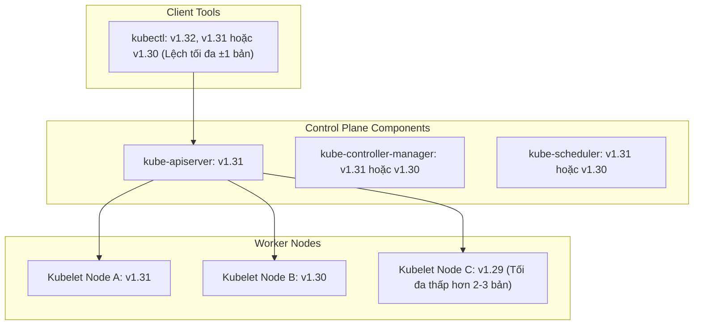
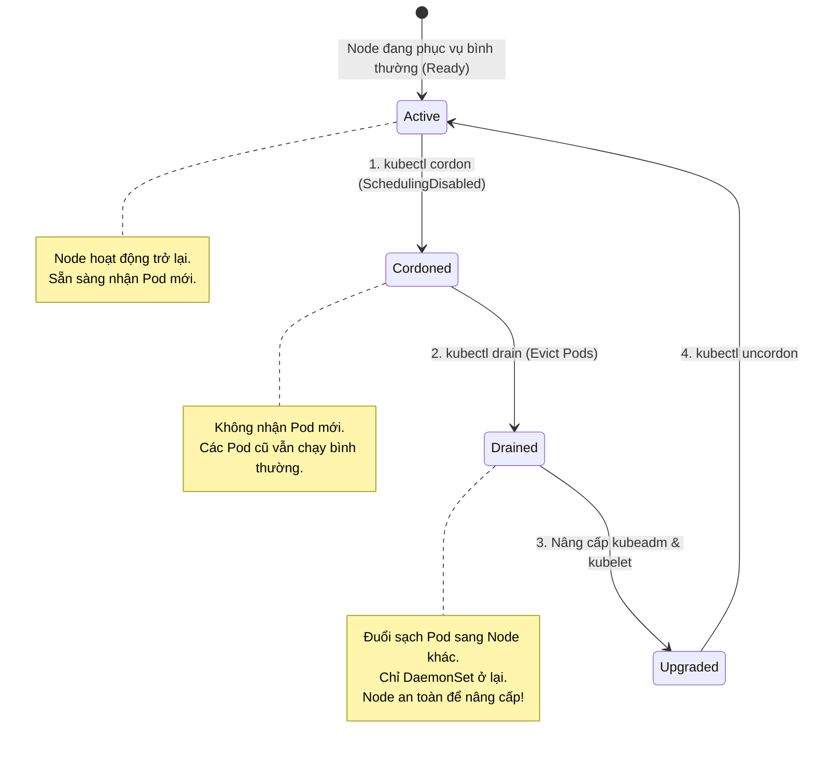
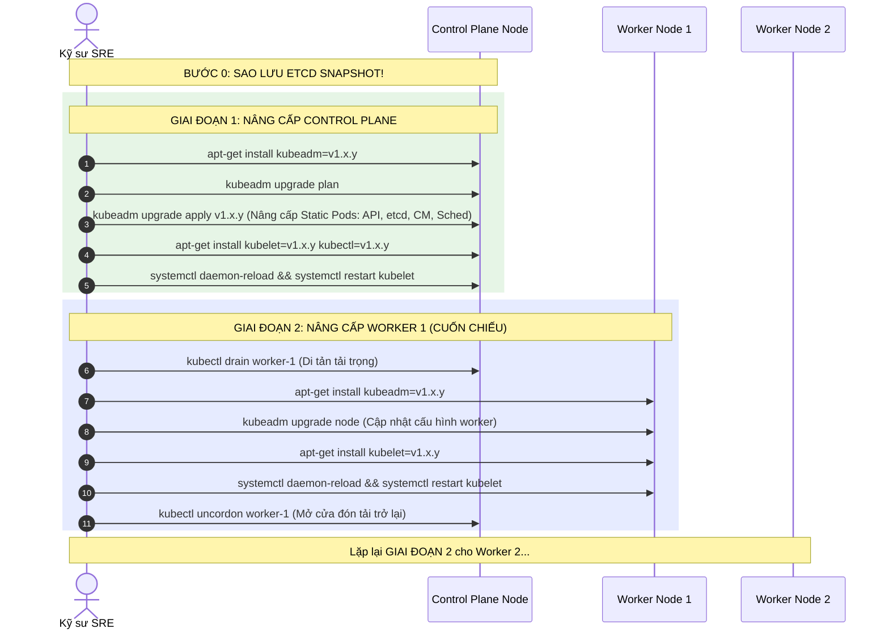

# Bài 47: Quy trình nâng cấp Cluster không gián đoạn (Zero-Downtime)

## 1. Thông tin bài học
* **Tên bài:** Bài 47: Quy trình nâng cấp Cluster không gián đoạn (Zero-Downtime)
* **Mục tiêu học:** Nắm vững quy tắc phát hành phiên bản và chính sách lệch phiên bản (**Kubernetes Version Skew Policy**); hiểu sâu sắc quy luật bất biến: "Không bao giờ nhảy cóc phiên bản Minor"; làm chủ bộ ba công cụ nâng cấp (`kubeadm`, `kubelet`, `kubectl`); thành thạo kỹ thuật bảo vệ ứng dụng bằng **PodDisruptionBudget (PDB)**; làm chủ bộ lệnh cách ly và di tản tải trọng cốt lõi: `kubectl cordon`, `kubectl drain`, và `kubectl uncordon`; thực thi chuẩn chỉ quy trình nâng cấp 2 giai đoạn: Nâng cấp Control Plane trước, nâng cấp Worker Nodes sau theo mô hình cuốn chiếu (Rolling Upgrade); thực hành thao tác drain và bảo trì worker node trực tiếp trên cụm lab mà không làm gián đoạn người dùng.
* **Thời lượng ước tính:** 210 phút (90 phút lý thuyết, 120 phút thực hành và tình huống)
* **Kiến thức cần có trước:** Bài 05 (Kiến trúc Control Plane và Worker Node), Bài 09 (Deployment Rolling Update), Bài 46 (Sao lưu và phục hồi etcd).
* **Liên quan kỳ thi:** **CKA (Certified Kubernetes Administrator)** - Câu hỏi thực hành nâng cấp cụm bằng `kubeadm` kết hợp `drain`/`uncordon` xuất hiện trong **99% đề thi CKA** (chiếm 8-10% điểm số thuộc nhóm *Cluster Architecture, Installation & Configuration*).

---

## 2. Bảng thuật ngữ

| Thuật ngữ | Giải thích đơn giản | Ví dụ / Ẩn dụ đời thường |
| :--- | :--- | :--- |
| **Zero-Downtime Upgrade** | Quá trình nâng cấp phiên bản hệ thống lên bản mới mà các dịch vụ bên dưới vẫn phục vụ người dùng 24/7 không bị ngắt kết nối một giây nào. | Sửa chữa đường ray xe lửa vào ban đêm từng đoạn một trong khi tàu vẫn được chuyển hướng sang ray phụ chạy bình thường. |
| **Version Skew Policy** | Quy tắc quy định khoảng cách chênh lệch phiên bản tối đa cho phép giữa các thành phần khác nhau (Kube-APIServer, Kubelet, Kube-Proxy, Kubectl) trong cùng một cụm. | Quy tắc tương thích thế hệ: Chiếc TV đời 2026 vẫn có thể đọc được tín hiệu từ máy phát đời 2024, nhưng không thể đọc tín hiệu đời 2015. |
| **Minor Version Jump** | Nâng cấp từ phiên bản $1.X$ lên $1.X+1$ (ví dụ: $1.30 \rightarrow 1.31$). Kubernetes cấm tuyệt đối việc nhảy cóc qua một phiên bản Minor (không được nâng từ $1.29 \rightarrow 1.31$). | Đi thang bộ: Bạn bắt buộc phải bước từng bậc một từ tầng 29 lên tầng 30 rồi mới lên 31, không thể nhảy vọt một bước từ tầng 29 lên 31. |
| **Cordon** | Đánh dấu một Node ở trạng thái "Cách ly" (`SchedulingDisabled`), ngăn không cho Scheduler đưa Pod mới tới Node này. | Đặt biển báo "Hết chỗ / Tạm ngừng đón khách" trước cửa một khách sạn đang chuẩn bị sửa chữa. |
| **Drain** | Tiến trình trục xuất (Evict) toàn bộ các Pod đang chạy trên một Node để chuyển chúng sang các Node khác còn chỗ, chuẩn bị đưa Node đó đi bảo trì. | Thông báo di tản nhẹ nhàng: Mời toàn bộ khách hàng sang phòng chờ VIP kế bên để nhân viên tiến hành khử khuẩn phòng cũ. |
| **Uncordon** | Mở lại Node sau khi bảo trì xong, cho phép Scheduler bắt đầu phân bổ Pod mới tới Node bình thường. | Tháo dỡ biển báo cách ly, mở cửa đón khách trở lại. |
| **PodDisruptionBudget (PDB)** | Bản giao kèo bảo vệ ứng dụng: Quy định số lượng Pod tối thiểu phải sống sót khi có hành động bảo trì chủ động (như `drain`). | Hợp đồng an toàn ca trực: Luôn luôn phải có ít nhất 2 bác sĩ túc trực tại phòng cấp cứu, bất kể việc bệnh viện đang sửa chữa khu vực nào. |

---

## 3. Bức tranh lớn: Vấn đề thực tế và ẩn dụ đời thường

### Nhắc lại bài trước
Ở Bài 46, chúng ta đã nắm trong tay "phao cứu sinh tối thượng": Kỹ thuật chụp ảnh nhanh và phục hồi thảm họa etcd. Trước khi bắt đầu bất kỳ ca "đại phẫu" nào trên cơ thể Kubernetes, bước số 0 bất di bất dịch của một kỹ sư SRE luôn là: **Chụp một bản Snapshot etcd!** Nếu quá trình nâng cấp gặp sự cố đứt gãy hoặc không tương thích, snapshot etcd chính là chiếc vé khứ hồi duy nhất đưa bạn trở về trạng thái an toàn. Hôm nay, chúng ta sẽ bước vào thao tác vận hành kinh điển nhất của một Platform Engineer: **Nâng cấp toàn bộ cụm Kubernetes mà không làm rớt một request nào của khách hàng!**

### Tại sao cần cái này ở production? (Vấn đề thực tế)

Mỗi năm, cộng đồng Kubernetes phát hành **3 phiên bản Minor** (chu kỳ khoảng 4 tháng một phiên bản: ví dụ $1.29 \rightarrow 1.30 \rightarrow 1.31$). Mỗi phiên bản chỉ được cộng đồng hỗ trợ bảo mật trong vòng **1 năm (12 tháng)**.  
Nếu doanh nghiệp của bạn không nâng cấp:
1. **Lỗ hổng bảo mật 0-day (CVE) không được vá:** Cụm của bạn rơi vào trạng thái "End of Life" (Hết hạn hỗ trợ). Bất kỳ lỗ hổng bảo mật hạt nhân nào bị phát hiện sẽ không còn bản vá cho phiên bản cũ.
2. **Không dùng được các API thế hệ mới:** Các tính năng mới của Helm, Kustomize, Ingress hoặc Gateway API (Bài 21) sẽ yêu cầu phiên bản Kubernetes tối thiểu. Cụm lỗi thời sẽ biến bạn thành ốc đảo cô lập.
3. **Thảm họa "Sập dịch vụ vì bảo trì thô bạo":**  
   Một kỹ sư thiếu kinh nghiệm nhận lệnh nâng cấp Node. Anh ta liền reboot máy chủ Worker hoặc gõ lệnh tắt ngang Kubelet.  
   Hậu quả: Toàn bộ 50 Pod trên Node đó chết đột ngột. Khách hàng đang thanh toán giỏ hàng bị đứt kết nối HTTP 502 Bad Gateway. Dữ liệu session bị hủy hoại.  
   **Chuẩn vận hành Production đòi hỏi:** Nâng cấp phải là một vũ điệu mượt mà, cuốn chiếu từng node một, các Pod được di tản sang node khác an toàn trước khi node cũ được nâng cấp!

### Ẩn dụ đời thường: Nâng cấp Động cơ Máy bay khi đang Bay

Hãy tưởng tượng cụm Kubernetes của bạn là một **chiếc máy bay chở khách 4 động cơ đang bay ở độ cao 10.000 mét**:
* Hành khách trên máy bay là **người dùng đang mua sắm trên website**.
* Các động cơ là **các Worker Node** đang gánh tải.
* Buồng lái điều khiển là **Control Plane**.

Bạn không thể bảo hành khách: *"Xin quý khách thông cảm, chúng tôi tắt động cơ máy bay trong 30 phút để lên đời động cơ mới, máy bay sẽ rơi tự do một lát rồi bay tiếp!"*

Thay vào đó, phi hành đoàn thực hiện quy trình chuẩn:
1. **Kiểm tra Buồng lái (Control Plane):** Nâng cấp phần mềm buồng lái trước. Các động cơ vẫn tiếp tục quay đều duy trì lực nâng.
2. **Nâng cấp Động cơ số 1 (Worker 1):**
   * **Cordon:** Báo hệ thống không dồn thêm lực đẩy vào động cơ số 1 nữa.
   * **Drain:** Từ từ điều chuyển tải trọng sang 3 động cơ còn lại (2, 3, 4). Khi động cơ số 1 hoàn toàn không còn tải, ta tắt máy và thay thế linh kiện mới (`kubeadm upgrade`).
   * **Khởi động lại:** Cho động cơ số 1 nổ máy (`restart kubelet`).
   * **Uncordon:** Bật lại chế độ hoạt động bình thường cho động cơ số 1.
3. **Lặp lại tuần tự:** Tiếp tục làm tương tự với động cơ số 2, số 3 và số 4.

Hành khách ngồi trong khoang thậm chí **không hề cảm nhận được bất kỳ sự rung lắc nào**, trong khi toàn bộ 4 động cơ đã được nâng cấp lên thế hệ mới nhất! Đó chính là nghệ thuật của **Zero-Downtime Upgrade**.

---

## 4. Giải thích khái niệm theo từng bước

### Chính sách Lệch phiên bản (Kubernetes Version Skew Policy)

Trong một hệ thống phân tán, các thành phần không thể đổi phiên bản cùng một tích tắc. Kubernetes quy định quy tắc tương thích chặt chẽ:



#### Các quy tắc vàng cần khắc cốt ghi tâm:
1. **`kube-apiserver` luôn luôn là thành phần dẫn đầu:** Không một thành phần nào trong cụm được phép có phiên bản cao hơn `kube-apiserver`.
2. **Kubelet trên Worker Node:** Có thể thấp hơn `kube-apiserver` tối đa **3 phiên bản Minor** (trong các bản K8s mới), nhưng trong thực tế sản xuất và thi CKA, khuyến nghị khoảng cách không vượt quá **1 phiên bản Minor** ($N-1$).
3. **Tuyệt đối KHÔNG nhảy cóc (No Minor Skips):**
   * Muốn lên từ $1.29.x \rightarrow 1.31.x$?
   * Bắt buộc phải nâng: $1.29.x \rightarrow 1.30.y \rightarrow 1.31.z$. Nhảy cóc sẽ làm hỏng dữ liệu etcd do các trường API mới/bị xóa đột ngột.
4. **`kubectl`:** Được phép lệch $\pm 1$ phiên bản Minor so với `kube-apiserver`.

---

### Bộ ba Cốt lõi: Cordon, Drain và Uncordon

Trước khi chạm vào một Worker Node, bạn phải đưa Node đó qua chu trình bảo trì 3 bước:



#### Mổ xẻ lệnh `kubectl drain`: 3 lá cờ bắt buộc phải biết trong bài thi CKA!
Nếu bạn chỉ gõ trần trụi `kubectl drain <node>`, 90% trường hợp lệnh sẽ báo lỗi đỏ và từ chối chạy! Bạn cần hiểu rõ tại sao:

1. **`--ignore-daemonsets`:**  
   Trên mỗi Node luôn có các Pod thuộc DaemonSet (như Kube-Proxy, Flannel/Calico CNI, Fluentd logging agent). Bản chất của DaemonSet là **phải chạy trên mọi node**. Bạn không thể "đuổi" DaemonSet sang node khác được. Cờ `--ignore-daemonsets` bảo Kubernetes: *"Hãy để yên các Pod DaemonSet đó trên node, chỉ đuổi các Pod nghiệp vụ thông thường (Deployment, ReplicaSet)"*.
2. **`--delete-emptydir-data`:**  
   Nếu một Pod có gắn ổ đĩa tạm thời `emptyDir` (Bài 14), việc đuổi Pod đồng nghĩa với việc dữ liệu trong `emptyDir` sẽ bị xóa vĩnh viễn. Kubernetes bắt bạn phải xác nhận hiểu rõ rủi ro này bằng cờ `--delete-emptydir-data`.
3. **`--force`:**  
   Bắt buộc nếu trên node có những Pod "mồ côi" (Naked Pods) - tức là các Pod được tạo trực tiếp bằng lệnh `kubectl run` chứ không do Deployment hay ReplicaSet quản lý. Đuổi naked pod nghĩa là nó sẽ chết luôn chứ không được tạo lại ở node khác.

$\Rightarrow$ **Câu lệnh thần chú CKA:**
```bash
kubectl drain <node-name> --ignore-daemonsets --delete-emptydir-data --force
```

---

### Tấm Khiên Bảo Vệ: PodDisruptionBudget (PDB)

Điều gì sẽ xảy ra nếu một Deployment có 3 bản sao (`replicas: 3`), nhưng người quản trị lại vô tình chạy lệnh `drain` trên cả 3 Worker Node cùng một lúc?  
Cả 3 Pod đều bị trục xuất đồng thời $\rightarrow$ Hệ thống sập toàn diện!

Để ngăn chặn tai họa này, Kubernetes cung cấp tài nguyên **PodDisruptionBudget (PDB)**. PDB là một bản cam kết pháp lý giữa người phát triển ứng dụng và người vận hành hạ tầng:

```yaml
apiVersion: policy/v1
kind: PodDisruptionBudget
metadata:
  name: frontend-pdb
  namespace: default
spec:
  minAvailable: 2             # BẮT BUỘC luôn phải có ít nhất 2 Pod sống khỏe mạnh
  # Hoặc dùng: maxUnavailable: 1 (Chỉ cho phép tối đa 1 Pod chết tại một thời điểm)
  selector:
    matchLabels:
      app: frontend
```

Khi có lệnh `kubectl drain`, API Server sẽ kiểm tra PDB. Nếu việc đuổi thêm một Pod làm cho số lượng Pod sống tụt xuống dưới `minAvailable: 2`, lệnh `drain` sẽ **tạm dừng lại và chờ đợi** cho đến khi Pod ở node mới chuyển sang trạng thái `Ready` rồi mới tiếp tục đuổi Pod tiếp theo!

---

### Quy trình Nâng cấp Toàn diện 2 Giai đoạn bằng Kubeadm



---

## 5. Thực hành (Lab)

* **Môi trường:** Cụm Kind hiện có (`1 control-plane + 1 worker`).
* **Mức RAM ước tính:** ~0 MB (Tận dụng cụm có sẵn, không tiêu tốn thêm RAM).

---

### Bước 1: Triển khai Ứng dụng có Bảo vệ bởi PodDisruptionBudget

Chúng ta tạo một Deployment gồm 2 Pod và một chính sách PDB quy định `minAvailable: 1` để quan sát cách Kubernetes bảo vệ ứng dụng khi bảo trì node:

```powershell
# Tạo deployment ứng dụng frontend với 2 bản sao
kubectl create deployment web-app --image=nginx:alpine --replicas=2

# Tạo PodDisruptionBudget bảo vệ web-app (luôn giữ tối thiểu 1 Pod sống)
@'
apiVersion: policy/v1
kind: PodDisruptionBudget
metadata:
  name: web-app-pdb
spec:
  minAvailable: 1
  selector:
    matchLabels:
      app: web-app
'@ | Set-Content -Encoding UTF8 web-app-pdb.yaml

kubectl apply -f web-app-pdb.yaml
```

Kiểm tra trạng thái PDB:

```powershell
kubectl get pdb
```

**Kết quả mong đợi:**
```text
NAME          MIN AVAILABLE   MAX UNAVAILABLE   ALLOWED DISRUPTIONS   AGE
web-app-pdb   1               N/A               1                     10s
```
Trường `ALLOWED DISRUPTIONS: 1` nghĩa là hệ thống cho phép hạ tối đa 1 Pod tại một thời điểm.

---

### Bước 2: Khảo sát Vị trí Phân bổ Pod trên các Node

Xem các Pod của `web-app` đang nằm ở Node nào:

```powershell
kubectl get pods -o wide
```

**Kết quả mong đợi:**
```text
NAME                       READY   STATUS    IP           NODE
web-app-798485cfb4-k2x9m   1/1     Running   10.244.1.5   kind-worker
web-app-798485cfb4-v8p7l   1/1     Running   10.244.1.6   kind-worker
```
*(Trong cụm Kind nhỏ, cả 2 Pod thường được phân bổ về `kind-worker` vì `kind-control-plane` có NoSchedule taint).*

---

### Bước 3: Thực hành Thao tác Cordon (Cách ly Node)

Bây giờ, chúng ta chuẩn bị bảo trì node `kind-worker`. Bước đầu tiên là cách ly nó:

```powershell
# Đặt node vào trạng thái không nhận thêm việc mới
kubectl cordon kind-worker

# Kiểm tra trạng thái của các node
kubectl get nodes
```

**Kết quả mong đợi:**
```text
NAME                 STATUS                     ROLES           AGE   VERSION
kind-control-plane   Ready                      control-plane   2d    v1.31.0
kind-worker          Ready,SchedulingDisabled   <none>          2d    v1.31.0
```
Node `kind-worker` chuyển sang trạng thái **`Ready,SchedulingDisabled`**. Các Pod đang chạy trên đó vẫn sống bình thường, nhưng nếu có Pod mới sinh ra, Scheduler sẽ từ chối đưa về đây!

---

### Bước 4: Thực hành Thao tác Drain (Di tản Tải trọng Chuẩn CKA)

Bây giờ, chúng ta tiến hành di tản các Pod khỏi `kind-worker`.  
> *Lưu ý quan trọng:* Vì cụm lab của chúng ta node `kind-control-plane` đang mang Taint `node-role.kubernetes.io/control-plane:NoSchedule`, nếu ta đuổi Pod khỏi `kind-worker` thì Pod mới sẽ rơi vào trạng thái `Pending` do không còn worker nào khác. Chúng ta hãy tạm gỡ taint trên control-plane để control-plane có thể tiếp nhận Pod di tản:

```powershell
# Cho phép Control Plane tiếp nhận Pod tạm thời
kubectl taint nodes kind-control-plane node-role.kubernetes.io/control-plane:NoSchedule-

# Thực thi lệnh drain chuẩn CKA với đầy đủ các cờ an toàn
kubectl drain kind-worker --ignore-daemonsets --delete-emptydir-data --force
```

**Kết quả mong đợi:**
```text
node/kind-worker already cordoned
evicting pod default/web-app-798485cfb4-k2x9m
evicting pod default/web-app-798485cfb4-v8p7l
pod/web-app-798485cfb4-k2x9m evicted
pod/web-app-798485cfb4-v8p7l evicted
node/kind-worker drained
```

Kiểm tra lại vị trí các Pod:

```powershell
kubectl get pods -o wide
```

**Kết quả mong đợi:**
```text
NAME                       READY   STATUS    IP           NODE
web-app-798485cfb4-a1b2c   1/1     Running   10.244.0.8   kind-control-plane
web-app-798485cfb4-d3e4f   1/1     Running   10.244.0.9   kind-control-plane
```
Toàn bộ các Pod đã được di tản sang `kind-control-plane` an toàn! Node `kind-worker` hiện tại hoàn toàn trống trải, sẵn sàng 100% để kỹ sư thực hiện nâng cấp OS, nâng cấp kernel hoặc nâng cấp Kubelet.

---

### Bước 5: Khảo sát Lệnh `kubeadm upgrade plan` (Bên trong Control Plane)

Hãy truy cập vào Control Plane node để xem công cụ `kubeadm` phân tích kế hoạch nâng cấp như thế nào:

```powershell
docker exec -it kind-control-plane kubeadm upgrade plan
```

**Kết quả mong đợi:**
```text
[upgrade/config] Making sure the configuration is correct:
[upgrade/config] Reading configuration from the cluster...
Components that must be upgraded manually after you have upgraded the control plane with 'kubeadm upgrade apply':
COMPONENT   CURRENT       TARGET
kubelet     v1.31.0       v1.31.0

Upgrade to the latest version in the v1.31 series:
COMPONENT            CURRENT   TARGET
kube-apiserver       v1.31.0   v1.31.0
kube-controller-mgr  v1.31.0   v1.31.0
kube-scheduler       v1.31.0   v1.31.0
kube-proxy           v1.31.0   v1.31.0
CoreDNS              v1.11.3   v1.11.3
etcd                 3.5.15-0  3.5.15-0

You can now apply the upgrade by executing the following command:
        kubeadm upgrade apply <target-version>
```
Lệnh `kubeadm upgrade plan` kiểm tra tính hợp lệ của toàn bộ cấu hình, chứng chỉ, etcd và đưa ra danh sách các phiên bản mục tiêu khả dụng!

---

### Bước 6: Khôi phục và Mở lại Node (Uncordon)

Sau khi công tác bảo trì node hoàn tất, chúng ta mở cửa cho `kind-worker` tiếp nhận công việc trở lại và trả lại taint cho control-plane:

```powershell
# Mở lại node worker
kubectl uncordon kind-worker

# Gắn lại taint bảo vệ cho Control Plane
kubectl taint nodes kind-control-plane node-role.kubernetes.io/control-plane:NoSchedule

# Kiểm tra trạng thái các node
kubectl get nodes
```

**Kết quả mong đợi:**
```text
NAME                 STATUS   ROLES           AGE   VERSION
kind-control-plane   Ready    control-plane   2d    v1.31.0
kind-worker          Ready    <none>          2d    v1.31.0
```
Cụm đã trở lại trạng thái `Ready` hoàn hảo!

---

### Bước 7: Dọn dẹp tài nguyên (Cleanup)

```powershell
# Xóa deployment và PDB thực hành
kubectl delete deployment web-app
kubectl delete pdb web-app-pdb
Remove-Item -Force web-app-pdb.yaml
```

---

## 6. Lỗi thường gặp và cách debug

### Lỗi 1: Lệnh `kubectl drain` bị kẹt vô tận (Hung indefinitely)
* **Dấu hiệu:** Chạy lệnh `drain` nhưng terminal treo cứng hàng chục phút ở dòng: `evicting pod ...`.
* **Nguyên nhân:**
  1. Pod có cơ chế `terminationGracePeriodSeconds` quá lớn (ví dụ: 3600s), hoặc tiến trình ứng dụng phớt lờ tín hiệu `SIGTERM`.
  2. Xung đột với **PodDisruptionBudget**: `minAvailable` đòi hỏi 2 Pod, nhưng cả cụm chỉ còn đúng 1 Pod duy nhất đang sống. API Server kiên quyết từ chối lệnh trục xuất để bảo vệ PDB.
* **Cách debug và sửa:**
  1. Kiểm tra PDB đang chặn:
     ```bash
     kubectl get pdb -A
     ```
  2. Nếu là ca khẩn cấp cần cưỡng chế bảo trì node, sử dụng cờ `--grace-period=30` hoặc `--disable-eviction=true` (bỏ qua API Eviction, xóa thẳng Pod).

---

### Lỗi 2: Quên nâng cấp gói `kubeadm` trước khi chạy `kubeadm upgrade`
* **Dấu hiệu:** Bạn chạy `kubeadm upgrade apply v1.31.0` nhưng nhận được thông báo lỗi: `specified version v1.31.0 is greater than the kubeadm version v1.30.0`.
* **Nguyên nhân:** Công cụ dòng lệnh `kubeadm` của bạn vẫn đang ở bản cũ $1.30$. Bản thân `kubeadm` không thể nâng cấp cluster lên phiên bản cao hơn chính nó.
* **Cách sửa:** Luôn nâng cấp binary `kubeadm` trước tiên qua package manager:
  ```bash
  apt-get update && apt-get install -y --allow-change-held-packages kubeadm=1.31.0-1.1
  ```

---

### Lỗi 3: Nâng cấp xong nhưng `kubectl get nodes` vẫn hiển thị phiên bản cũ!
* **Dấu hiệu:** Bạn đã chạy thành công `kubeadm upgrade apply` và `kubeadm upgrade node`, nhưng khi gõ `kubectl get nodes`, cột `VERSION` của các worker nodes vẫn trơ trơ là bản cũ $v1.30.0$.
* **Nguyên nhân:** Cột `VERSION` trong lệnh `kubectl get nodes` phản ánh **phiên bản của Kubelet**, KHÔNG PHẢI phiên bản của kubeadm! Lệnh `kubeadm upgrade` chỉ cập nhật cấu hình; bạn bắt buộc phải nâng cấp binary `kubelet` và khởi động lại tiến trình bằng `systemctl restart kubelet`.
* **Cách sửa:**
  ```bash
  apt-get install -y --allow-change-held-packages kubelet=1.31.0-1.1
  systemctl daemon-reload && systemctl restart kubelet
  ```

---

## 7. Góc nhìn Senior

### 1. Sự đánh đổi (Trade-offs)

| Chiến lược nâng cấp | Ưu điểm | Đánh đổi / Rủi ro |
| :--- | :--- | :--- |
| **In-Place Rolling Upgrade (Nâng cấp tại chỗ từng node)** | Tiết kiệm chi phí: Không cần cấp phát thêm máy chủ ảo mới. Phù hợp cho cụm Bare-metal vật lý cố định. | **Thời gian kéo dài và rủi ro phần cứng:** Nếu một node nâng cấp dở dang bị hỏng OS/driver card mạng, bạn phải sửa thủ công node đó ngay trong đêm. |
| **Blue/Green Cluster Upgrade (Dựng cụm mới song song)** | An toàn tuyệt đối 100%: Cụm mới được test kỹ càng trước khi trỏ DNS; Rollback tức thì chỉ bằng cách đổi ngược DNS. | **Chi phí phần cứng gấp đôi:** Bạn phải trả tiền cho 2 cụm chạy đồng thời trong suốt giai đoạn chuyển đổi. Khó xử lý dữ liệu Stateful/Storage (PVC). |
| **Node Pool Replacement (Dành cho Managed K8s: EKS/GKE)** | Tự động tạo Node Pool mới với version mới, chuyển tải dần sang và hủy Node Pool cũ. | Phụ thuộc vào API của Cloud Provider, đòi hỏi hạn ngạch (Quota) máy chủ đám mây đủ lớn. |

---

### 2. Best practices tại production

1. **Kiểm tra deprecation API trước khi nâng cấp (Kubent / Pluto):**  
   Mỗi phiên bản Minor của Kubernetes thường khai tử (deprecate) một số API cũ (ví dụ: `extensions/v1beta1` chuyển sang `apps/v1`, hoặc Ingress `networking.k8s.io/v1beta1` chuyển sang `networking.k8s.io/v1`).  
   Trước khi gõ `kubeadm upgrade`, bắt buộc phải dùng các công cụ như **`kubent` (Kube No Trouble)** hoặc **`pluto`** để quét toàn bộ cluster xem có manifest nào đang dùng API sắp bị khai tử hay không. Nếu có, phải cập nhật manifest lên API mới trước!

2. **Khóa gói cập nhật bằng `apt-mark hold`:**  
   Trên các máy chủ Linux production chạy Kubernetes, luôn luôn phải khóa các gói:
   ```bash
   apt-mark hold kubeadm kubelet kubectl
   ```
   Điều này ngăn chặn việc hệ thống Linux tự động chạy `unattended-upgrades` (cập nhật bảo mật tự động của Ubuntu/Debian) tự ý nâng cấp Kubelet làm mất đồng bộ với Control Plane.

3. **Luôn cấu hình PodDisruptionBudget cho mọi dịch vụ Core:**  
   Bất kỳ dịch vụ nào có `replicas >= 2` trên Production đều bắt buộc phải đi kèm một PDB. Đây là điều kiện tiên quyết trong pipeline CI/CD để đảm bảo đội ngũ hạ tầng có thể drain node bảo trì bất kỳ lúc nào mà không cần gọi điện hỏi nhóm ứng dụng.

---

### 3. Câu hỏi phỏng vấn Senior

* **Câu hỏi:** *"Giả sử bạn đang tiến hành nâng cấp cụm Kubernetes Production từ v1.29 lên v1.30. Bạn đã nâng cấp thành công Control Plane. Khi bắt đầu drain Worker Node 1, lệnh drain bị treo cứng suốt 15 phút không hoàn tất. Bạn sẽ điều tra nguyên nhân theo những bước nào, và làm thế nào để đảm bảo người dùng cuối không bị gián đoạn dịch vụ?"*
* **Gợi ý trả lời chuẩn:**
  1. **Bước 1 - Xác định Pod đang gây tắc nghẽn:** Mở một terminal mới, gõ lệnh `kubectl get pods -A -o wide --field-selector spec.nodeName=worker-1`. Quan sát xem Pod nào đang ở trạng thái `Terminating` hoặc chưa chịu rời khỏi node.
  2. **Bước 2 - Kiểm tra PodDisruptionBudget (PDB):** Gõ `kubectl get pdb -A`. Rất có thể một Deployment chỉ có 2 Pods, 1 Pod đã bị evict, và PDB quy định `minAvailable: 2` (hoặc `maxUnavailable: 0`). Lúc này PDB sẽ chặn đứng lệnh evict của Pod thứ hai để bảo vệ SLA ứng dụng.
  3. **Bước 3 - Kiểm tra nguyên nhân Pod mới không khởi động được:** Xem xét lý do tại sao bản sao mới của Pod ở node khác chưa đạt `Ready` (Pending do thiếu CPU/RAM, lỗi ImagePullBackOff, hoặc thiếu PV). Một khi Pod mới ở node khác đạt `Ready`, PDB sẽ tự động giải phóng khóa cho phép drain tiếp tục.
  4. **Bước 4 - Kiểm tra Grace Period & Deadlock:** Nếu Pod bị kẹt vì I/O đĩa hoặc application hook `preStop` chạy quá lâu, kiểm tra `terminationGracePeriodSeconds` và xem log của container để chẩn đoán.

---

## 8. Tóm tắt bài học

* 📌 **1. Không bao giờ nhảy cóc phiên bản Minor:** Luôn nâng cấp tuần tự từng nấc thang phiên bản ($1.29 \rightarrow 1.30 \rightarrow 1.31$) để tránh phá vỡ tương thích etcd và API.
* 📌 **2. Quy luật Control Plane đi trước, Worker theo sau:** Kube-APIServer luôn có phiên bản cao nhất; Kubelet không bao giờ được cao hơn Kube-APIServer.
* 📌 **3. Bộ ba câu thần chú bảo trì:** `cordon` (ngừng nhận Pod mới) $\rightarrow$ `drain` (trục xuất Pod an toàn sang node khác) $\rightarrow$ `uncordon` (mở cửa trở lại sau nâng cấp).
* 📌 **4. 3 cờ sống còn của lệnh Drain:** Luôn ghi nhớ `--ignore-daemonsets`, `--delete-emptydir-data`, và `--force` để vượt qua các cảnh báo chặn của Kubernetes.
* 📌 **5. PDB là hợp đồng bảo vệ Zero-Downtime:** Cấu hình `PodDisruptionBudget` để ngăn chặn việc người quản trị vô tình hạ quá số lượng Pod cho phép khi bảo trì hạ tầng.

---

## 9. Bài tập tự làm

* 🟢 **Mức Dễ:** Viết một lệnh PowerShell một dòng sử dụng `kubectl` để lấy danh sách toàn bộ các Node trong cụm kèm trạng thái Cordon (`SchedulingDisabled`) và phiên bản Kubelet hiện tại.
* 🟡 **Mức Vừa:** Tạo một Deployment Nginx với `replicas: 4`. Viết một manifest PDB sao cho trong mọi tình huống bảo trì, số lượng Pod tối đa được phép chết đồng thời không vượt quá 1 (`maxUnavailable: 1`). Sử dụng lệnh `drain` trên worker node và kiểm chứng xem quá trình trục xuất diễn ra từng Pod một như thế nào.
* 🔴 **Mức Khó:** Giả lập tình huống deadlock PDB: Tạo một Deployment với `replicas: 1` và một PDB với `minAvailable: 1`. Chạy lệnh `kubectl drain` đối với node chứa Pod đó. Quan sát lỗi trả về từ API Server. Sau đó tìm ra cách giải quyết sự cố mà vẫn đảm bảo tính an toàn cho dữ liệu.

---

## 10. Câu hỏi tự kiểm tra

1. Tại sao Kubernetes lại cấm tuyệt đối việc nâng cấp nhảy cóc phiên bản Minor (ví dụ từ $1.29$ nhảy thẳng lên $1.31$)?
2. Sự khác biệt căn bản giữa hai lệnh `kubectl cordon` và `kubectl drain` là gì?
3. Tại sao khi chạy lệnh `kubectl drain`, ta hầu như luôn phải đi kèm cờ `--ignore-daemonsets`?
4. Trong kiến trúc Kubernetes, Kubelet trên Worker Node có thể có phiên bản cao hơn Kube-APIServer trên Control Plane được không? Vì sao?
5. Nếu bạn chạy xong lệnh `kubeadm upgrade node` trên một worker node nhưng chưa nâng cấp gói `kubelet`, phiên bản hiển thị trong cột `VERSION` của `kubectl get nodes` sẽ là phiên bản nào?
6. Mục đích cốt lõi của tài nguyên `PodDisruptionBudget (PDB)` là gì trong chiến lược Zero-Downtime?

<details>
<summary>👉 Bấm vào đây để xem đáp án câu hỏi tự kiểm tra</summary>

* **Câu 1:** Vì mỗi phiên bản Minor thường đi kèm với việc thay đổi schema lưu trữ trong etcd, loại bỏ các trường API lỗi thời (deprecated APIs) và cập nhật quy tắc xác thực. Nhảy cóc sẽ khiến dữ liệu etcd không thể chuyển đổi tương thích ngược (migration), gây hỏng toàn bộ cơ sở dữ liệu cụm.
* **Câu 2:** `cordon` chỉ đơn thuần đánh dấu node không nhận thêm Pod mới, các Pod đang chạy trên node vẫn tiếp tục hoạt động bình thường. Trong khi đó, `drain` vừa thực hiện cordon, vừa chủ động trục xuất (evict) toàn bộ các Pod hiện có để dời chúng sang node khác.
* **Câu 3:** Vì DaemonSet là loại tài nguyên được thiết kế để luôn luôn có mặt trên mọi node (như CNI, log forwarder). Bản chất của DaemonSet không thể di tản sang node khác. Nếu không có cờ `--ignore-daemonsets`, lệnh drain sẽ báo lỗi và dừng lại ngay lập tức.
* **Câu 4:** **Tuyệt đối KHÔNG.** Theo Version Skew Policy, Kubelet không bao giờ được phép có phiên bản cao hơn Kube-APIServer. Kube-APIServer phải luôn là thành phần dẫn đầu về phiên bản trong toàn cụm.
* **Câu 5:** Sẽ vẫn là **phiên bản cũ**. Lệnh `kubectl get nodes` lấy thông tin phiên bản từ báo cáo nhịp tim (heartbeat) của Kubelet gửi về. `kubeadm upgrade node` chỉ cập nhật các tệp cấu hình, bạn phải cập nhật binary `kubelet` và restart tiến trình thì phiên bản mới mới được ghi nhận.
* **Câu 6:** PDB đóng vai trò như một hạn ngạch an toàn, quy định số lượng Pod tối thiểu phải sống (`minAvailable`) hoặc số lượng Pod tối đa được phép gián đoạn (`maxUnavailable`) khi có các tác vụ bảo trì chủ động (như drain node), ngăn chặn việc toàn bộ các bản sao của ứng dụng bị trục xuất cùng lúc gây sập dịch vụ.
</details>

---

## 11. Tài liệu đọc thêm và bài tiếp theo

### Tài liệu tham khảo
* [Tài liệu chính thức Kubernetes: Upgrading kubeadm clusters](https://kubernetes.io/docs/tasks/administer-cluster/kubeadm/kubeadm-upgrade/)
* [Tài liệu chính thức Kubernetes: Version Skew Policy](https://kubernetes.io/releases/version-skew-policy/)
* [Tài liệu chính thức Kubernetes: Specifying a Disruption Budget for your Application](https://kubernetes.io/docs/tasks/run-application/configure-pdb/)
* [Tài liệu chính thức Kubernetes: Safely Drain a Node](https://kubernetes.io/docs/tasks/administer-cluster/safely-drain-node/)

### Bài tiếp theo
👉 **Bài 48: Thiết kế kiến trúc High Availability (HA) & Multi-Cluster**

---

## PHỤ LỤC: ĐÁP ÁN GỢI Ý BÀI TẬP TỰ LÀM (MỤC 9)

### Đáp án Mức Dễ
Lệnh PowerShell một dòng:
```powershell
kubectl get nodes -o custom-columns=NAME:.metadata.name,STATUS:.status.conditions[-1].type,CORDONED:.spec.unschedulable,VERSION:.status.nodeInfo.kubeletVersion
```

---

### Đáp án Mức Vừa
File `nginx-pdb.yaml`:
```yaml
apiVersion: policy/v1
kind: PodDisruptionBudget
metadata:
  name: nginx-pdb
spec:
  maxUnavailable: 1
  selector:
    matchLabels:
      app: nginx-demo
```
Khi chạy `kubectl drain <node> --ignore-daemonsets --delete-emptydir-data --force`, Kubernetes sẽ evict Pod đầu tiên, chờ cho Pod đó được tạo lại và chuyển sang `Ready` ở node khác rồi mới tiến hành evict Pod tiếp theo. Dịch vụ luôn luôn duy trì tối thiểu 3 Pod sống khỏe mạnh tại mọi thời điểm!

---

### Đáp án Mức Khó
1. **Hiện tượng:** Khi chạy `kubectl drain`, API Server trả về lỗi:
   `Cannot evict pod as it would violate the pod's disruption budget.`
   Lệnh drain bị kẹt vĩnh viễn vì Deployment chỉ có 1 Pod, mà PDB đòi hỏi `minAvailable: 1` (tức là không cho phép bất kỳ Pod nào chết).
2. **Cách khắc phục an toàn chuẩn Senior:**
   * **Cách 1 (Khuyến nghị):** Dùng lệnh `kubectl scale deployment <name> --replicas=2` để tạm thời tăng số bản sao lên 2. Chờ Pod thứ 2 chạy trên một node khác đạt `Ready`. Khi đó `drain` sẽ diễn ra thành công mượt mà không gây gián đoạn! Sau khi nâng cấp xong node cũ, có thể scale ngược về 1.
   * **Cách 2 (Nếu bắt buộc phải gián đoạn ngoài giờ cao điểm):** Tạm thời xóa tài nguyên PDB bằng `kubectl delete pdb <name>`, thực hiện drain node, sau đó tạo lại PDB.

