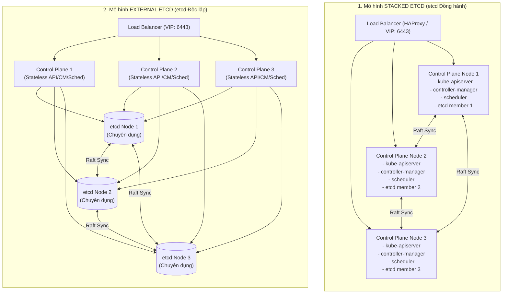
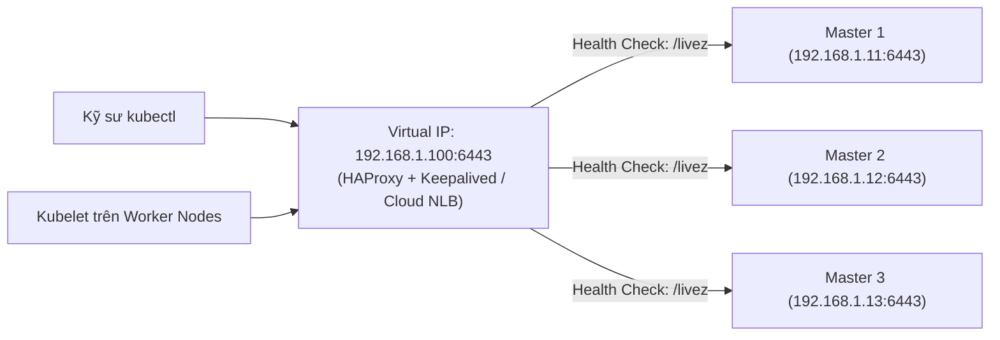
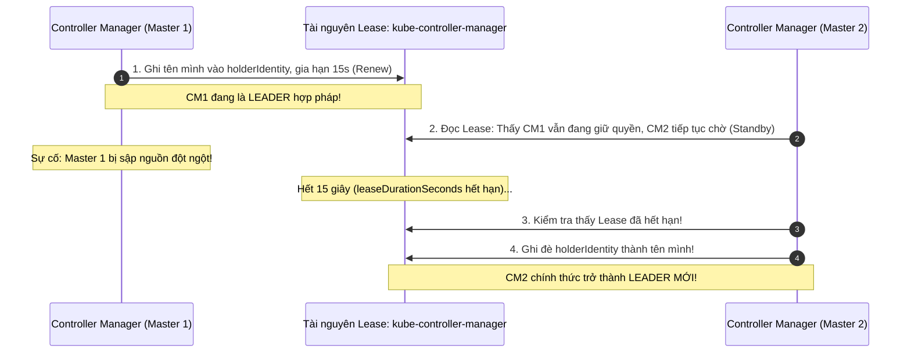
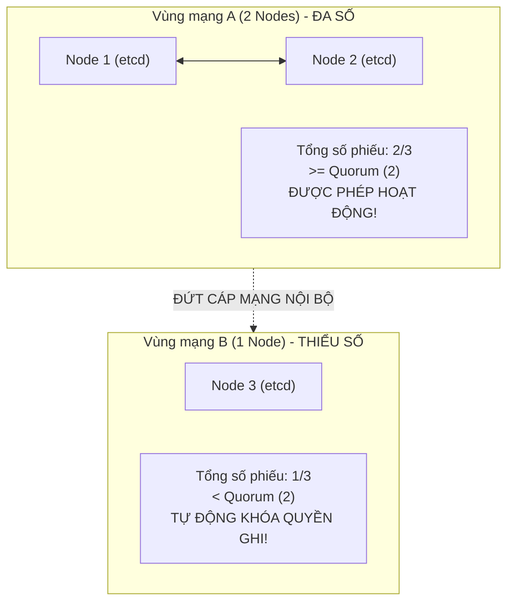
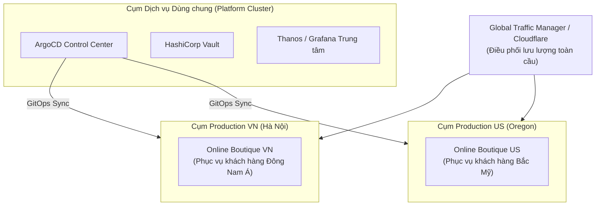

# Bài 48: Thiết kế kiến trúc High Availability (HA) & Multi-Cluster

## 1. Thông tin bài học
* **Tên bài:** Bài 48: Thiết kế kiến trúc High Availability (HA) & Multi-Cluster
* **Mục tiêu học:** Nắm vững nguyên lý loại bỏ "Điểm lỗi đơn lẻ" (Single Point of Failure - SPOF) trong thiết kế hạ tầng Kubernetes cấp Enterprise; phân biệt rạch ròi 2 mô hình cụm HA kinh điển: **Stacked etcd Topology** (etcd đồng hành) và **External etcd Topology** (etcd độc lập); giải phẫu cơ chế hoạt động của tầng cân bằng tải Control Plane (HAProxy, Keepalived, Cloud NLB); hiểu sâu sắc cơ chế bầu chọn lãnh đạo (**Leader Election**) thông qua tài nguyên `Lease` của `kube-controller-manager` và `kube-scheduler`; phân tích kịch bản thảm họa phân liệt não (**Split-Brain**) và cơ chế tự vệ bằng Raft Quorum; nắm bắt chiến lược vận hành Đa Cụm (**Multi-Cluster Strategy**) và thu hẹp bán kính tàn phá (**Blast Radius**); thực hành khảo sát và kiểm chứng cơ chế Leader Election trực tiếp trên cụm lab.
* **Thời lượng ước tính:** 210 phút (90 phút lý thuyết kiến trúc, 120 phút thực hành khảo sát và phân tích tình huống)
* **Kiến thức cần có trước:** Bài 05 (Kiến trúc Control Plane và Worker Node), Bài 46 (Sao lưu etcd và Raft Quorum), Bài 47 (Nâng cấp Zero-Downtime).
* **Liên quan kỳ thi:** **CKA (Certified Kubernetes Administrator)** & **Senior Platform / Cloud Solution Architect** (Trọng tâm thiết kế hạ tầng chịu lỗi đa vùng, cấu hình `kubeadm init --control-plane-endpoint`, câu hỏi phỏng vấn kiến trúc quy mô lớn).

---

## 2. Bảng thuật ngữ

| Thuật ngữ | Giải thích đơn giản | Ví dụ / Ẩn dụ đời thường |
| :--- | :--- | :--- |
| **High Availability (HA)** | Khả năng của hệ thống duy trì hoạt động liên tục, không bị gián đoạn ngay cả khi một hoặc nhiều thành phần phần cứng bị tê liệt hoàn toàn. | Chiếc xe ô tô có 2 bình ắc quy dự phòng và lốp sơ cua: Bình chính hỏng là bình phụ tự kích hoạt ngay trong lúc xe đang chạy trên cao tốc. |
| **SPOF (Single Point of Failure)** | Điểm lỗi đơn lẻ: Một mắt xích duy nhất mà nếu nó đứt, toàn bộ hệ thống sẽ sụp đổ theo. | Cây cầu độc đạo nối hòn đảo với đất liền: Nếu cầu sập, cả hòn đảo lập tức bị cô lập hoàn toàn. |
| **Stacked etcd Topology** | Mô hình HA trong đó các tiến trình etcd chạy đồng hành trực tiếp trên cùng các máy chủ Control Plane. | Cửa hàng bách hóa mà mỗi quản lý đều tự đeo một chiếc túi đựng sổ sách và tiền thối bên mình. |
| **External etcd Topology** | Mô hình HA trong đó cơ sở dữ liệu etcd được tách riêng thành một cụm máy chủ chuyên biệt, độc lập hoàn toàn với các máy chủ Control Plane. | Ngân hàng tách riêng quầy giao dịch (giao tiếp với khách) và kho chứa tiền ngầm kiên cố dưới tầng hầm có bảo vệ riêng. |
| **Leader Election (Bầu cử Lãnh đạo)** | Cơ chế thỏa thuận giữa các tiến trình giống nhau để chọn ra duy nhất một tiến trình đóng vai trò "Chính thức" (Active), các tiến trình còn lại ở trạng thái "Dự phòng" (Standby). | Ban chỉ huy quân sự: Chỉ có một viên tướng phát lệnh tác chiến; các phó tướng túc trực bên cạnh, sẵn sàng thay thế ngay nếu tướng chính hy sinh. |
| **Lease (Bản hợp đồng thuê quyền)** | Một tài nguyên trong Kubernetes (`coordination.k8s.io`) được các tiến trình Controller/Scheduler dùng để "đặt cọc giữ chỗ" làm Leader theo thời hạn vài giây. | Tấm thẻ bài chỉ huy: Vị tướng phải liên tục giơ thẻ bài lên điểm danh mỗi 2 giây; nếu ngất xỉu quá thời hạn, người khác lập tức giật lấy thẻ bài. |
| **Split-Brain (Phân liệt não)** | Tình trạng mạng bị đứt đôi khiến hai nửa của hệ thống tưởng nửa kia đã chết, cùng tự xưng mình là chỉ huy và ra các quyết định xung đột phá hủy dữ liệu. | Hai hoàng tử ở hai miền đất nước mất liên lạc với nhau, cùng tự xưng là vua và cùng ký hai sắc lệnh mâu thuẫn. |
| **Blast Radius (Bán kính tàn phá)** | Phạm vi thiệt hại tối đa mà một sự cố đơn lẻ có thể lan tỏa và ảnh hưởng tới toàn bộ doanh nghiệp. | Khoang chống tràn của tàu thủy: Thủng một khoang thì chỉ khoang đó ngập nước, các khoang khác vẫn an toàn giữ cho tàu nổi. |

---

## 3. Bức tranh lớn: Vấn đề thực tế và ẩn dụ đời thường

### Nhắc lại bài trước
Ở Bài 47, chúng ta đã nắm vững nghệ thuật nâng cấp cụm theo phương pháp cuốn chiếu Zero-Downtime, luân chuyển các Pod an toàn bằng `cordon` và `drain`. Tuy nhiên, trong toàn bộ các bài học từ đầu đến giờ, cụm lab của chúng ta chỉ có **đúng 1 máy chủ Control Plane** (`kind-control-plane`). Nếu trung tâm dữ liệu bị sét đánh trúng máy chủ đó, hoặc thanh RAM của máy chủ đó bị cháy, mọi kỹ thuật drain hay rolling update đều trở nên vô nghĩa: **Cụm Kubernetes của bạn đã chết não hoàn toàn!** Hôm nay, chúng ta sẽ bước lên đỉnh cao của kiến trúc hệ thống: **Thiết kế cụm High Availability bất tử trước mọi sự cố phần cứng.**

### Tại sao cần cái này ở production? (Vấn đề thực tế)

Trong thế giới doanh nghiệp, "thời gian chết" (Downtime) được tính bằng tiền triệu USD:

1. **Cam kết SLA và "Quy tắc các số 9":**
   * **99% Availability (Hai số 9):** Hệ thống được phép sập **3.65 ngày mỗi năm** $\rightarrow$ Doanh nghiệp phá sản!
   * **99.9% Availability (Ba số 9):** Hệ thống được phép sập **8.76 giờ mỗi năm** $\rightarrow$ Tạm chấp nhận cho môi trường thử nghiệm (Staging).
   * **99.99% Availability (Bốn số 9 - Chuẩn Production):** Hệ thống chỉ được phép sập tối đa **52.6 phút trong cả một năm**!  
   Để đạt được con số 99.99% này, việc dựa dẫm vào một chiếc máy chủ Control Plane duy nhất là điều hoàn toàn bất khả thi.

2. **Nghịch lý "Bộ ba Active-Active vs. Active-Passive":**
   * `kube-apiserver` là thành phần phi trạng thái (Stateless). Chúng ta có thể dựng 3 máy chạy song song để cùng tiếp nhận tải (**Active-Active**).
   * Nhưng `kube-controller-manager` và `kube-scheduler` thì khác: Nếu 2 tiến trình Scheduler cùng nhìn thấy một Pod đang Pending và cùng quyết định xếp nó vào 2 Node khác nhau, cụm sẽ rơi vào xung đột hỗn loạn. Chúng bắt buộc phải chạy theo mô hình **Active-Passive** (1 máy làm, 2 máy ngồi chờ).  
   Làm thế nào để các máy tự biết ai làm ai chờ? Ai sẽ là người phát hiện khi máy chính bị chết để thế chỗ chỉ trong 2 giây?

3. **Thảm họa "Bỏ chung trứng vào một giỏ" (The Mega-Cluster Trap):**
   Nhiều công ty gom tất cả mọi thứ: Hệ thống ERP nội bộ, website bán hàng, cổng thanh toán ngân hàng, môi trường Dev/Test vào chung một cụm Kubernetes khổng lồ 500 nodes.  
   Một ngày đẹp trời, một kỹ sư áp dụng nhầm một manifest NetworkPolicy sai, toàn bộ mạng nội bộ bị ngắt kết nối. Từ phòng kế toán đến cổng thanh toán đều tê liệt cùng lúc!  
   Đó là lý do các Senior Architect luôn phải nắm vững chiến lược **Multi-Cluster**: Chia nhỏ hạ tầng để cô lập rủi ro.

### Ẩn dụ đời thường: Bệnh viện Đa khoa Quốc tế và Kíp trực Cấp cứu

Hãy tưởng tượng hệ thống Kubernetes High Availability như một **Bệnh viện Đa khoa Quốc tế 5 sao**:

* **Khu vực Lễ tân tiếp đón bệnh nhân (`kube-apiserver`):**
  Bệnh viện không chỉ bố trí 1 cô lễ tân duy nhất. Họ mở **3 quầy lễ tân hoạt động cùng lúc (Active-Active)**. Trước cửa bệnh viện có một **Bác bảo vệ phân luồng (Load Balancer)**: Xe cấp cứu chạy tới, bác bảo vệ nhìn xem quầy 1, 2 hay 3 đang rảnh thì điều hướng xe vào đó. Nếu cô lễ tân ở quầy 1 đột ngột ngất xỉu, bác bảo vệ lập tức chuyển toàn bộ bệnh nhân sang quầy 2 và quầy 3 mà không làm gián đoạn việc tiếp đón bệnh nhân dù chỉ 1 giây!
* **Bác sĩ Trưởng kíp trực (`kube-controller-manager` & `kube-scheduler`):**
  Trong một ca trực cấp cứu, chỉ có **duy nhất 1 Bác sĩ Trưởng kíp được quyền ký lệnh phẫu thuật (Active)**. Bên cạnh ông luôn có **2 Bác sĩ Phó kíp túc trực (Standby)**. Trên ngực vị Trưởng kíp có gắn một chiếc máy đo nhịp tim điện tử phát tín hiệu mỗi 2 giây (**Lease**). Nếu nhịp tim của vị Trưởng kíp ngừng đập (máy chủ bị sập), chiếc máy lập tức báo động và Bác sĩ Phó kíp số 1 bước lên nhận quyền chỉ huy ngay lập tức!
* **Kho lưu trữ Hồ sơ Bệnh án (`etcd`):**
  Hồ sơ bệnh án được cất giữ trong một mạng lưới gồm **3 thủ thư bảo mật liên kết với nhau bằng bộ đàm (Cụm Raft etcd)**. Bất kỳ đơn thuốc nào được ghi vào sổ đều phải có sự xác nhận của ít nhất 2 thủ thư (**Quorum $\ge 2$**). Nếu một thủ thư bị ốm, hai thủ thư còn lại vẫn duy trì việc mở sổ khám bệnh bình thường!

---

## 4. Giải thích khái niệm theo từng bước

### 2 Mô hình Kiến trúc HA Control Plane: Stacked vs. External etcd

Khi triển khai Kubernetes Production bằng `kubeadm`, bạn phải đưa ra một quyết định kiến trúc mang tính nền tảng:



| Tiêu chí so sánh | Stacked etcd (Mô hình Đồng hành) | External etcd (Mô hình Độc lập) |
| :--- | :--- | :--- |
| **Số lượng máy chủ tối thiểu** | **3 máy chủ** (Chứa cả Control Plane lẫn etcd). | **6 máy chủ** (3 máy Control Plane + 3 máy etcd riêng biệt). |
| **Độ phức tạp triển khai** | Rất đơn giản, tích hợp sẵn hoàn hảo trong lệnh `kubeadm init`. | Phức tạp: Phải tự tạo chứng chỉ mTLS riêng cho etcd, khởi tạo cụm etcd trước rồi mới nối Kube-APIServer vào. |
| **Hiệu năng & Tranh chấp I/O** | Có nguy cơ tranh chấp tài nguyên: Kube-APIServer và etcd dùng chung CPU/RAM và chung ổ đĩa ghi log. | Hiệu năng tuyệt đỉnh: Máy etcd chỉ làm đúng việc ghi đĩa SSD fsync, không bị bất kỳ tiến trình nào khác quấy rầy. |
| **Khả năng mở rộng độc lập** | Không thể: Muốn tăng tải API Server phải thêm cả node etcd (làm chậm tốc độ đồng thuận Raft). | Hoàn hảo: Có thể tăng lên 5 máy API Server mà cụm etcd vẫn giữ nguyên 3 máy. |
| **Trường hợp áp dụng** | Đa số doanh nghiệp vừa và nhỏ, môi trường On-Premises có số lượng máy chủ giới hạn. | Ngân hàng, Viễn thông, các cụm Kubernetes khổng lồ (> 500 nodes) với tần suất request cực lớn. |

---

### Tầng Cân bằng tải Control Plane: Endpoint Ảo (Virtual IP / Load Balancer)

Khi bạn cấu hình một cụm HA, các Worker Node và người dùng gõ lệnh `kubectl` tuyệt đối **không được trỏ thẳng vào IP của bất kỳ máy Control Plane nào**!  
Nếu trỏ vào `192.168.1.10` mà máy đó sập, toàn bộ kết nối sẽ đứt.

Giải pháp bắt buộc là đặt một **Control Plane Endpoint** duy nhất đứng trước:



* **Cơ chế Health Check:** Load Balancer liên tục gửi request HTTP GET tới đường dẫn `https://<ip>:6443/livez`. Nếu Master 1 không phản hồi `200 OK`, Load Balancer lập tức loại Master 1 ra khỏi danh sách điều hướng trong vòng 1 giây!
* Khi khởi tạo cụm bằng `kubeadm`, bạn dùng cờ:
  ```bash
  kubeadm init --control-plane-endpoint "lb.k8s.mycompany.internal:6443" --upload-certs
  ```

---

### Cơ chế Leader Election: Quyền Lực Dựa Trên Tài Nguyên `Lease`

Làm thế nào để các tiến trình `kube-controller-manager` và `kube-scheduler` biết ai là chỉ huy?  
Kubernetes sử dụng một API object mang tên **`Lease`** nằm trong API Group `coordination.k8s.io` tại namespace `kube-system`:



Một đối tượng `Lease` có cấu trúc khai báo như sau:
* **`holderIdentity`:** Tên của Pod hoặc máy chủ đang nắm giữ quyền Leader (ví dụ: `kind-control-plane_c7a1...`).
* **`leaseDurationSeconds`:** Thời gian hiệu lực của quyền lực (mặc định 15 giây).
* **`renewTime`:** Thời điểm Leader vừa ký gia hạn gần nhất.
* **`acquireTime`:** Thời điểm Leader lần đầu tiên giành được quyền lực.

---

### Thảm họa Split-Brain (Phân liệt não) và Cách Raft Dập tắt Xung đột

Hiện tượng **Split-Brain** xảy ra khi sự cố đứt cáp mạng nội bộ (Network Partition) chia cắt một cụm 3 nodes thành 2 nửa cô lập:



1. **Vùng mạng A (Gồm 2 nodes):**  
   Tính toán số phiếu: $2 \ge \lfloor 3/2 \rfloor + 1 = 2$. Đạt chuẩn Quorum! Vùng A tiếp tục bầu Leader và tiếp nhận các thao tác ghi bình thường.
2. **Vùng mạng B (Gồm 1 node):**  
   Tính toán số phiếu: $1 < 2$. Không đạt Quorum! Tiến trình etcd trên Node 3 **tự động chuyển sang trạng thái Read-Only hoặc từ chối kết nối**. Node 3 không bao giờ tự xưng Leader được!  
   Nhờ quy tắc toán học tuyệt đối của thuật toán Raft, tình trạng Split-Brain bị dập tắt ngay từ trong trứng nước, dữ liệu không bao giờ bị ghi đè mâu thuẫn!

---

### Chiến lược Vận hành Đa Cụm (Multi-Cluster Strategy)

Khi quy mô doanh nghiệp vượt quá ngưỡng 1 cụm, một Senior Platform Engineer sẽ không cố mở rộng cụm đó lên vô tận, mà sẽ chuyển dịch sang mô hình **Multi-Cluster**:



#### 3 Lý do Sống còn để triển khai Multi-Cluster:
1. **Thu hẹp Bán kính tàn phá (Blast Radius):** Nếu cụm US gặp sự cố cáp quang biển, cụm VN vẫn hoạt động phục vụ hàng triệu người dùng châu Á bình thường.
2. **Tuân thủ Pháp lý & Dữ liệu (Data Sovereignty):** Luật An ninh mạng yêu cầu dữ liệu thanh toán của công dân nước nào phải lưu trữ trên cụm máy chủ đặt tại nước đó.
3. **Mô hình Quản trị Trung tâm (Hub-and-Spoke với ArgoCD):** Một cụm trung tâm (Management Cluster) chạy ArgoCD (Bài 45) điều phối cấu hình đẩy xuống hàng chục cụm vệ tinh bên dưới thông qua tính năng `ApplicationSet`.

---

## 5. Thực hành (Lab)

* **Môi trường:** Cụm Kind hiện có (`1 control-plane + 1 worker`).
* **Mức RAM ước tính:** ~0 MB (Sử dụng trực tiếp các thành phần có sẵn của cluster lab).

Trong bài lab này, chúng ta sẽ "bắt tận tay, day tận trán" cơ chế **Leader Election** đang vận hành âm thầm từng giây bên trong cụm Kubernetes của bạn!

---

### Bước 1: Khảo sát Danh sách Toàn bộ Hợp đồng Thuê Quyền (Leases) trong Cluster

Kubernetes quản lý quyền lực của các thành phần Control Plane thông qua API resource `leases`:

```powershell
kubectl get leases -n kube-system
```

**Kết quả mong đợi:**
```text
NAME                      HOLDER               AGE
kube-controller-manager   kind-control-plane   2d
kube-scheduler            kind-control-plane   2d
```

---

### Bước 2: Soi chi tiết "Hợp đồng Quyền Lực" của `kube-controller-manager`

Hãy quan sát cách vị "Trưởng kíp trực" liên tục ký gia hạn quyền lực bằng cờ thời gian:

```powershell
kubectl get lease kube-controller-manager -n kube-system -o yaml
```

**Kết quả mong đợi:**
```yaml
apiVersion: coordination.k8s.io/v1
kind: Lease
metadata:
  name: kube-controller-manager
  namespace: kube-system
spec:
  acquireTime: "2026-10-07T08:15:20.123456Z"
  holderIdentity: kind-control-plane_2a58b291-76c2-480c-a982-f81829e198a2
  leaseDurationSeconds: 15
  leaseTransitions: 0
  renewTime: "2026-10-09T07:33:10.987654Z"
```

> [!NOTE]
> Hãy nhìn vào trường `renewTime`! Tiến trình `kube-controller-manager` cứ mỗi **2 giây** lại gửi một HTTP PATCH request lên API Server để cập nhật `renewTime`. Nếu máy chủ bị sập và không gia hạn được trước khi qua mốc 15 giây (`leaseDurationSeconds`), bất kỳ máy Control Plane phụ nào khác đang trực sẽ lập tức giành lấy quyền `holderIdentity`!

---

### Bước 3: Quan sát Nhịp tim Cập nhật Real-time của Scheduler Lease

Hãy chạy lệnh theo dõi liên tục để chứng kiến "nhịp đập trái tim" của Leader Scheduler:

```powershell
# Quan sát renewTime thay đổi theo thời gian thực (chạy trong 6 giây rồi dừng)
1..3 | ForEach-Object {
    $time = (kubectl get lease kube-scheduler -n kube-system -o jsonpath='{.spec.renewTime}')
    Write-Host "Scheduler Leader Heartbeat Renewed at: $time"
    Start-Sleep -Seconds 2
}
```

**Kết quả mong đợi:**
```text
Scheduler Leader Heartbeat Renewed at: 2026-10-09T07:33:40.102934Z
Scheduler Leader Heartbeat Renewed at: 2026-10-09T07:33:42.158291Z
Scheduler Leader Heartbeat Renewed at: 2026-10-09T07:33:44.204812Z
```
Thời gian gia hạn liên tục nhảy số đều đặn cứ sau 2 giây!

---

### Bước 4: Khảo sát Node Leases (Cơ chế Nhịp tim của Kubelet)

Không chỉ Control Plane, từ phiên bản Kubernetes v1.14 trở lên, mọi Worker Node cũng sử dụng tài nguyên `Lease` trong namespace **`kube-node-lease`** để báo cáo tình trạng sống còn cho Master thay vì cập nhật trực tiếp vào Node Status nặng nề:

```powershell
kubectl get leases -n kube-node-lease
```

**Kết quả mong đợi:**
```text
NAME                 HOLDER               AGE
kind-control-plane   kind-control-plane   2d
kind-worker          kind-worker          2d
```
Mỗi khi Kubelet trên `kind-worker` còn sống, nó cập nhật Lease của mình mỗi 10 giây. Nếu Controller Manager thấy một Node không gia hạn Lease quá 40 giây, nó sẽ đánh dấu Node đó là `NotReady`!

---

### Bước 5: Mổ xẻ Cấu hình HAProxy mẫu cho Cụm Production 3 Master

Trong thực tế doanh nghiệp, làm thế nào để cấu hình một bộ Load Balancer HAProxy đứng trước 3 máy Master? Dưới đây là đoạn cấu hình chuẩn production kinh điển:

```powershell
# Tạo file tham khảo cấu hình HAProxy chuẩn enterprise
@'
# Cấu hình HAProxy cân bằng tải cho Kubernetes API Server
frontend k8s-api-frontend
    bind *:6443
    mode tcp
    option tcplog
    default_backend k8s-api-backend

backend k8s-api-backend
    mode tcp
    option tcp-check
    balance roundrobin
    # Kiểm tra sức khỏe thông qua endpoint /livez của API Server
    server master-1 192.168.1.11:6443 check check-ssl verify none inter 2000 fall 2 rise 2
    server master-2 192.168.1.12:6443 check check-ssl verify none inter 2000 fall 2 rise 2
    server master-3 192.168.1.13:6443 check check-ssl verify none inter 2000 fall 2 rise 2
'@ | Set-Content -Encoding UTF8 haproxy-k8s-example.cfg

Get-Content haproxy-k8s-example.cfg
```

---

### Bước 6: Dọn dẹp tài nguyên (Cleanup)

```powershell
Remove-Item -Force haproxy-k8s-example.cfg
```

---

## 6. Lỗi thường gặp và cách debug

### Lỗi 1: Cụm HA bị kẹt sau khi khởi động máy chủ thứ 2 bằng `kubeadm join`
* **Dấu hiệu:** Chạy lệnh `kubeadm join --control-plane` trên Master 2 nhưng lệnh bị treo cứng hoặc báo lỗi: `error execution phase check-etcd: etcd cluster is not healthy`.
* **Nguyên nhân:**
  1. Tường lửa giữa Master 1 và Master 2 đang chặn các cổng giao tiếp nội bộ của etcd: cổng **`2379`** (client) và đặc biệt là cổng **`2380`** (Raft peer-to-peer sync).
  2. Thời gian (NTP clock) giữa 2 máy chủ bị lệch quá nhiều (vượt quá 500ms), khiến giao thức Raft từ chối đồng bộ do nghi ngờ trôi lệch thời gian.
* **Cách debug và sửa:**
  1. Kiểm tra mở cổng trên Linux:
     ```bash
     nc -zvw3 192.168.1.11 2379
     nc -zvw3 192.168.1.11 2380
     ```
  2. Đồng bộ hóa đồng hồ hệ thống bằng Chrony:
     ```bash
     chronyc tracking
     ```

---

### Lỗi 2: API Server báo lỗi "Certificate is valid for IP X, not for Load Balancer IP Y"
* **Dấu hiệu:** `kubectl` kết nối tới IP ảo của Load Balancer (`192.168.1.100:6443`) bị từ chối với lỗi: `x509: certificate is valid for 192.168.1.11, not 192.168.1.100`.
* **Nguyên nhân:** Khi chạy lệnh `kubeadm init` ban đầu, người quản trị quên không khai báo địa chỉ của Load Balancer vào danh sách tên miền thay thế (Subject Alternative Names - SANs) của chứng chỉ TLS.
* **Cách sửa:** Cập nhật lại chứng chỉ API Server bằng lệnh tái tạo chứng chỉ có kèm cờ `--apiserver-cert-extra-sans`:
  ```bash
  kubeadm init phase certs apiserver --apiserver-cert-extra-sans 192.168.1.100,lb.k8s.local
  ```

---

### Lỗi 3: Cụm rơi vào tình trạng "Flickering Leader" (Lãnh đạo đổi ngôi liên tục)
* **Dấu hiệu:** Log của `kube-controller-manager` liên tục ghi nhận dòng thông báo: `leader election lost`, `leader election gained`. Các Pod liên tục bị lập lịch lại bất thường.
* **Nguyên nhân:** Máy chủ Control Plane đang bị quá tải CPU/RAM hoặc độ trễ mạng giữa các Master quá cao. Khi Leader bị quá tải không thể gửi request HTTP PATCH gia hạn `Lease` trong vòng 15 giây, máy phụ tưởng máy chính đã chết nên giật quyền làm Leader. Ngay sau đó máy chính hồi phục lại cố giật lại quyền, tạo ra vòng lặp tranh chấp!
* **Cách sửa:** Kiểm tra giám sát CPU/I/O trên các máy Master; tách riêng etcd ra ổ đĩa NVMe độc lập hoặc tăng nhẹ giá trị `--leader-elect-lease-duration` trong cấu hình component nếu mạng có độ trễ cao.

---

## 7. Góc nhìn Senior

### 1. Sự đánh đổi (Trade-offs)

| Kiến trúc | Ưu điểm | Đánh đổi / Chi phí |
| :--- | :--- | :--- |
| **Single Cluster quy mô lớn (3000 nodes)** | Quản lý tập trung 1 nơi; tận dụng tối đa tài nguyên dư thừa của phần cứng; dễ chia sẻ dịch vụ nội bộ. | **Blast Radius cực đại:** Một lỗi cấu hình CRD hay Admission Webhook có thể đánh sập dịch vụ toàn cầu. Giới hạn etcd (khuyến nghị etcd < 8GB). |
| **Multi-Cluster quy mô nhỏ (Nhiều cụm 50-100 nodes)** | Cô lập lỗi hoàn hảo; dễ dàng nâng cấp rolling cluster mà không sợ ảnh hưởng cụm khác; tuân thủ bảo mật ranh giới cứng. | **Chi phí vận hành tăng vọt:** Phải duy trì nhiều bộ Control Plane; cần công cụ điều phối trung tâm phức tạp (Karmada / ArgoCD / Submariner). |
| **Mô hình 3 Master Nodes vs. 5 Master Nodes** | 3 Nodes chịu lỗi được 1 node; chi phí vừa phải. 5 Nodes chịu lỗi được 2 nodes đồng thời. | **Tốc độ ghi của etcd chậm hơn trên cụm 5 nodes:** Leader phải chờ thêm xác nhận qua mạng từ 3/5 nodes mới được hoàn tất giao dịch. |

---

### 2. Best practices tại production

1. **Quy tắc Vàng về Vùng Sẵn sàng Đa Vùng (Multi-AZ Deployment):**  
   Trong các trung tâm dữ liệu đám mây (AWS, GCP, Azure), một cụm 3 Control Plane **BẮT BUỘC** phải được phân bổ trên **3 Availability Zones (AZ) khác nhau** (ví dụ: `us-east-1a`, `us-east-1b`, `us-east-1c`). Tuyệt đối không bao giờ đặt cả 3 máy Master trong cùng 1 tòa nhà hay cùng 1 tủ rack vật lý!

2. **Cách ly hoàn toàn Tải Nghiệp vụ khỏi Control Plane (Taints Enforcement):**  
   Trên môi trường Production, các máy Control Plane chỉ được phép làm nhiệm vụ điều hành. Luôn đảm bảo Taint `node-role.kubernetes.io/control-plane:NoSchedule` được bật trên mọi Master Node để ngăn chặn các lập trình viên vô tình deploy một ứng dụng ăn ngốn 100% RAM làm nghẽn API Server.

3. **Cơ chế Kiểm soát Bán kính Tàn phá bằng Namespace vs Cluster:**  
   * Dùng **Namespace** để cách ly logic giữa các nhóm phát triển trong cùng một dự án (Ranh giới mềm - Soft Multi-tenancy).
   * Dùng **Cluster riêng biệt** để cách ly giữa môi trường Production và Non-Production, hoặc giữa các khách hàng thanh toán độc lập (Ranh giới cứng - Hard Multi-tenancy).

---

### 3. Câu hỏi phỏng vấn Senior

* **Câu hỏi:** *"Giả sử bạn thiết kế một cụm Kubernetes High Availability trên nền tảng On-Premises với 2 trung tâm dữ liệu vật lý (Data Center A và Data Center B). Giám đốc kỹ thuật đề xuất chia đều: Đặt 2 máy Control Plane ở DC A và 2 máy Control Plane ở DC B (tổng cộng 4 nodes). Bạn có đồng ý với thiết kế này không? Hãy phân tích rủi ro chi tiết và đề xuất giải pháp chuẩn xác."*
* **Gợi ý trả lời chuẩn:**
  1. **Khẳng định dứt khoát:** **Hoàn toàn KHÔNG đồng ý.** Đây là một lỗi thiết kế kiến trúc phân tán kinh điển!
  2. **Phân tích rủi ro sâu sắc (Bẫy Quorum 4 Nodes):**
     * Với 4 nodes etcd, công thức Quorum yêu cầu: $\lfloor 4/2 \rfloor + 1 = 3$ nodes phải còn sống để tiếp tục nhận lệnh ghi.
     * Nếu đường truyền mạng giữa DC A và DC B bị đứt (Network Partition):
       * DC A chỉ có 2 nodes ($2 < 3 \rightarrow$ Mất Quorum, tự động đóng băng!).
       * DC B chỉ có 2 nodes ($2 < 3 \rightarrow$ Mất Quorum, tự động đóng băng!).
     * Kết quả: **Cả 2 Data Center đều tê liệt hoàn toàn**, dù không có bất kỳ máy chủ nào bị hỏng phần cứng!
  3. **Giải pháp kiến trúc chuẩn Senior:**
     * Thuật toán Raft bắt buộc số lượng node phải là số lẻ. Ta phải sử dụng **mô hình 3 Data Centers**: Đặt 1 Master ở DC A, 1 Master ở DC B, và 1 Master (hoặc một node etcd chứng thực - Arbiter / Witness) ở một địa điểm thứ ba độc lập (DC C hoặc một Cloud VPS nhỏ độc lập).
     * Khi đó, nếu DC A bị sập hoàn toàn nguồn điện, DC B kết hợp với DC C vẫn giữ được 2/3 số phiếu ($\ge 2$), cụm Kubernetes vẫn tiếp tục vận hành sống sót bình thường!

---

## 8. Tóm tắt bài học

* 📌 **1. High Availability là triệt tiêu điểm lỗi đơn lẻ (SPOF):** Cụm HA chuẩn mực yêu cầu tối thiểu 3 Control Plane nodes kết hợp với một Load Balancer Endpoint ảo phía trước.
* 📌 **2. Hai mô hình Stacked vs. External etcd:** Stacked tích hợp sẵn, tiết kiệm chi phí; External cách ly tài nguyên đĩa I/O cho etcd, phù hợp cụm quy mô siêu lớn.
* 📌 **3. Kube-APIServer là Active-Active, Controller/Scheduler là Active-Passive:** API Server xử lý song song; Controller Manager và Scheduler dùng cơ chế Lease để bầu duy nhất 1 Leader điều hành.
* 📌 **4. Lease API là nhịp tim quyền lực:** Leader phải gia hạn Lease mỗi 2 giây; quá 15 giây không gia hạn, máy dự phòng sẽ lập tức tiếp quản quyền lực.
* 📌 **5. Multi-Cluster thu hẹp bán kính tàn phá:** Chia nhỏ các cụm theo vùng địa lý hoặc môi trường để tránh thảm họa "sập một cụm, chết toàn bộ doanh nghiệp".

---

## 9. Bài tập tự làm

* 🟢 **Mức Dễ:** Viết một lệnh `kubectl` sử dụng `jsonpath` để trích xuất chính xác tên của máy chủ đang giữ quyền Leader của `kube-controller-manager` từ tài nguyên Lease trong `kube-system`.
* 🟡 **Mức Vừa:** So sánh thời gian cập nhật của hai tài nguyên Lease: `kube-scheduler` (trong `kube-system`) và Lease của chính worker node (`kind-worker` trong `kube-node-lease`). Giải thích tại sao tần suất cập nhật của Node Lease lại thưa hơn (khoảng 10s) so với Control Plane Lease (khoảng 2s).
* 🔴 **Mức Khó:** Viết một bản tài liệu thiết kế kiến trúc hoàn chỉnh (Architecture Design Document) cho một cụm Kubernetes HA 3 Control Plane trên nền tảng AWS: Vẽ sơ đồ luồng dữ liệu qua Network Load Balancer (NLB), phân bổ 3 Master trên 3 Availability Zones, giải thích quy tắc bảo mật Security Groups giữa NLB, Control Plane (ports 6443, 2379, 2380) và Worker Nodes.

---

## 10. Câu hỏi tự kiểm tra

1. Tại sao số lượng node etcd trong một cụm High Availability luôn luôn phải là một số lẻ (3 hoặc 5 nodes)?
2. Sự khác biệt cơ bản giữa cơ chế hoạt động của `kube-apiserver` và `kube-scheduler` trong một cụm Multi-Master là gì?
3. Tại sao Worker Node và người dùng `kubectl` không bao giờ được trỏ trực tiếp vào địa chỉ IP của một máy Master cụ thể?
4. Tài nguyên `Lease` trong namespace `kube-node-lease` có tác dụng gì trong việc giảm tải cho etcd?
5. Nếu một cụm etcd 3 nodes bị đứt kết nối mạng chia thành 2 vùng (vùng 2 nodes và vùng 1 node), điều gì sẽ xảy ra với vùng 1 node?
6. Bán kính tàn phá (Blast Radius) là gì và chiến lược Multi-Cluster giúp giải quyết vấn đề này ra sao?

<details>
<summary>👉 Bấm vào đây để xem đáp án câu hỏi tự kiểm tra</summary>

* **Câu 1:** Vì thuật toán đồng thuận Raft yêu cầu phải đạt được đa số phiếu (Quorum = $\lfloor N/2 \rfloor + 1$). Thêm một node chẵn (như từ 3 lên 4) không hề tăng khả năng chịu lỗi (đều chỉ chịu được 1 node chết) mà còn làm tăng thêm chi phí mạng và nguy cơ chia cắt phiếu bầu.
* **Câu 2:** `kube-apiserver` là stateless và hoạt động theo mô hình **Active-Active** (tất cả các instance đều xử lý request đồng thời). Ngược lại, `kube-scheduler` có trạng thái và hoạt động theo mô hình **Active-Passive** (chỉ 1 Leader thực hiện xếp lịch, các instance khác ở chế độ Standby).
* **Câu 3:** Vì nếu máy Master đó bị mất nguồn hoặc bảo trì, toàn bộ kết nối từ Worker Node và Client sẽ bị gián đoạn. Do đó bắt buộc phải đi qua một Virtual IP / Load Balancer để tự động định tuyến sang các Master còn sống.
* **Câu 4:** Trước khi có Node Lease, mỗi Kubelet phải liên tục cập nhật trạng thái sống còn vào trực tiếp đối tượng `Node`, việc này làm phát sinh các giao dịch ghi rất nặng vào etcd. Node Lease là một đối tượng siêu nhẹ chỉ chứa vài dòng timestamp, giúp giảm hơn 90% tải ghi cho etcd trong các cụm lớn.
* **Câu 5:** Vùng 1 node chỉ có 1 phiếu (< Quorum là 2), do đó nó sẽ không thể bầu Leader và tự động từ chối mọi yêu cầu ghi dữ liệu mới, ngăn chặn triệt để hiện tượng Split-Brain.
* **Câu 6:** Bán kính tàn phá là phạm vi thiệt hại tối đa của một sự cố. Thay vì gom toàn bộ ứng dụng vào một "siêu cụm", chiến lược Multi-Cluster chia nhỏ thành nhiều cụm độc lập, đảm bảo sự cố ở cụm này không làm lan truyền sập toàn bộ hệ thống doanh nghiệp.
</details>

---

## 11. Tài liệu đọc thêm và bài tiếp theo

### Tài liệu tham khảo
* [Tài liệu chính thức Kubernetes: Options for Highly Available topology](https://kubernetes.io/docs/setup/production-environment/tools/kubeadm/ha-topology/)
* [Tài liệu chính thức Kubernetes: Creating Highly Available Clusters with kubeadm](https://kubernetes.io/docs/setup/production-environment/tools/kubeadm/high-availability/)
* [Tài liệu chính thức Kubernetes: Node Heartbeats & Leases](https://kubernetes.io/docs/concepts/architecture/nodes/#heartbeats)
* [Hướng dẫn cân bằng tải HAProxy cho Kubernetes](https://github.com/kubernetes/kubeadm/blob/main/docs/ha-considerations.md)

### Bài tiếp theo
👉 **Bài 49: Quản lý và tối ưu hóa chi phí Kubernetes (FinOps)**

---

## PHỤ LỤC: ĐÁP ÁN GỢI Ý BÀI TẬP TỰ LÀM (MỤC 9)

### Đáp án Mức Dễ
Lệnh trích xuất tên Leader:
```powershell
kubectl get lease kube-controller-manager -n kube-system -o jsonpath='{.spec.holderIdentity}'
```
Output: `kind-control-plane_2a58b291-76c2-480c-a982-f81829e198a2`

---

### Đáp án Mức Vừa
* **Control Plane Lease (`kube-scheduler`):** Cập nhật mỗi **2 giây** với thời hạn thuê là 15 giây. Lý do: Control Plane cần phản ứng cực nhanh (Failover trong vài giây) nếu Leader bị chết để tránh gián đoạn các đợt phát hành Pod mới.
* **Node Lease (`kind-worker`):** Cập nhật mỗi **10 giây** với thời hạn thuê là 40 giây. Lý do: Một cụm có thể có hàng nghìn Worker Nodes. Nếu hàng nghìn node đều gửi nhịp tim mỗi 2 giây, etcd sẽ bị nghẽn mạng và quá tải I/O ghi. Tần suất 10 giây là điểm cân bằng hoàn hảo giữa khả năng phát hiện node chết và hiệu năng của etcd.

---

### Đáp án Mức Khó
**Tóm tắt Thiết kế Kiến trúc HA 3 AZ trên AWS:**
1. **Network Load Balancer (NLB):** Đặt ở tầng Private Subnet trải dài qua 3 AZ (`us-east-1a`, `us-east-1b`, `us-east-1c`), lắng nghe cổng `TCP 6443`, cấu hình Health Check TCP tới port 6443 với khoảng thời gian 5s.
2. **Control Plane Nodes:** 3 máy ảo EC2 c6i.xlarge đặt tại 3 AZ tương ứng.
3. **Security Groups:**
   * `sg-k8s-nlb`: Cho phép Inbound `TCP 6443` từ dải IP nội bộ VPN / Bastion Host và từ Worker Nodes.
   * `sg-k8s-control-plane`: Cho phép Inbound `TCP 6443` từ `sg-k8s-nlb`; cho phép Inbound `TCP 2379-2380` **chỉ giữa chính các máy trong nhóm `sg-k8s-control-plane`**; cho phép Inbound `TCP 10250` từ Kubelet.
   * `sg-k8s-worker`: Cho phép Inbound lưu lượng dịch vụ từ Ingress Controller và NodePort.

