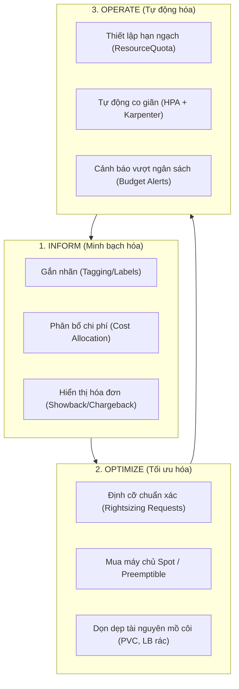
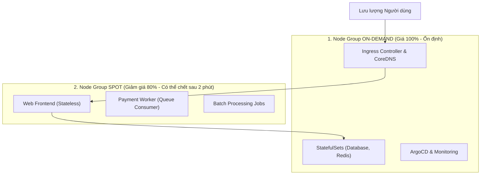
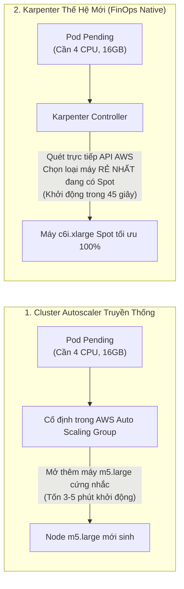

# Bài 49: Quản lý và tối ưu hóa chi phí Kubernetes (FinOps)

## 1. Thông tin bài học
* **Tên bài:** Bài 49: Quản lý và tối ưu hóa chi phí Kubernetes (FinOps)
* **Mục tiêu học:** Thấu hiểu văn hóa và vòng đời 3 giai đoạn của **FinOps** (Inform $\rightarrow$ Optimize $\rightarrow$ Operate) trong hệ sinh thái Cloud Native; nhận diện rõ bản chất của hiện tượng lãng phí tài nguyên (**Resource Slack & Over-provisioning**); làm chủ kỹ thuật định cỡ chuẩn xác (**Rightsizing Pods**) dựa trên phân vị $P_{95}/P_{99}$; thiết kế chiến lược kết hợp thông minh giữa **On-Demand Instances** và **Spot / Preemptible Instances** (giảm tới 70-90% chi phí máy chủ); phân biệt cơ chế co giãn cụm giữa **Cluster Autoscaler** và công cụ thế hệ mới **Karpenter**; thiết lập hệ thống nhãn dán định danh chi phí (**Cost Allocation Tagging**) phục vụ cơ chế minh bạch hóa chi phí (Showback/Chargeback) với công cụ OpenCost; thực hành phân tích mức lãng phí CPU/RAM trực tiếp trên cụm lab và lập phương án cắt giảm chi phí thực chiến.
* **Thời lượng ước tính:** 180 phút (90 phút lý thuyết tư duy tài chính, 90 phút thực hành phân tích và tối ưu)
* **Kiến thức cần có trước:** Bài 24 (Resource Requests, Limits & QoS), Bài 28 (HPA), Bài 29 (VPA), Bài 48 (High Availability & Multi-Cluster).
* **Liên quan kỳ thi:** Chuẩn vận hành Senior Platform / FinOps Certified Practitioner (FOCP) & Kiến trúc sư hạ tầng Cloud (Kỹ năng bắt buộc để bảo vệ ngân sách trước Ban Giám đốc).

---

## 2. Bảng thuật ngữ

| Thuật ngữ | Giải thích đơn giản | Ví dụ / Ẩn dụ đời thường |
| :--- | :--- | :--- |
| **FinOps (Financial Operations)** | Khung văn hóa và thực hành kết hợp giữa Kỹ thuật (DevOps) và Tài chính (Finance) nhằm tối đa hóa giá trị kinh doanh trên từng đồng chi phí đám mây. | Quản lý chi tiêu gia đình thông minh: Không phải là nhịn ăn nhịn mặc, mà là mua đúng thứ mình cần với mức giá ưu đãi nhất. |
| **Over-provisioning (Cấp phát dư thừa)** | Việc lập trình viên khai báo tài nguyên (CPU/RAM Request) quá lớn so với mức tiêu thụ thực tế mà ứng dụng thực sự cần. | Đặt bàn tiệc cho 10 người nhưng chỉ có 2 người đến ăn, trong khi nhà hàng vẫn tính tiền nguyên mâm 10 phần. |
| **Resource Slack (Khoảng đệm lãng phí)** | Khoảng cách chênh lệch giữa tài nguyên đã cam kết giữ chỗ (`requests`) và tài nguyên thực sự đang tiêu thụ (`actual usage`). | Khoảng không gian trống rỗng bên trong một chiếc vali siêu to mà bạn chỉ để vỏn vẹn 2 bộ quần áo. |
| **Rightsizing (Định cỡ tối ưu)** | Hành động điều chỉnh cấu hình CPU/RAM Requests và Limits về mức vừa vặn nhất với hành vi tải thực tế của ứng dụng cộng thêm một biên an toàn nhỏ. | May đo quần áo vừa vặn với số đo cơ thể: Không quá chật làm rách chỉ, không quá rộng làm vướng víu. |
| **Spot Instance (Máy chủ giảm giá chớp nhoáng)** | Máy chủ đám mây dư thừa được nhà cung cấp (AWS, GCP, Azure) bán lại với giá rẻ hơn 70-90%, nhưng có thể bị thu hồi bất kỳ lúc nào sau 2 phút báo trước. | Vé máy bay giờ chót bán tháo với giá 100k: Giá siêu rẻ nhưng bạn phải sẵn sàng nhường ghế nếu có khách mua vé hạng thương gia đến gấp. |
| **Karpenter** | Bộ tự động co giãn Node (Autoscaler) thế hệ mới của Kubernetes, có khả năng phân tích trực tiếp nhu cầu của từng Pod để mua đúng loại máy chủ ảo rẻ nhất trong vài giây. | Nhân viên đặt vé xe thông minh: Nhìn thấy đoàn khách 7 người lập tức gọi ngay xe 7 chỗ rẻ nhất, thay vì gọi xe 45 chỗ rồi để trống ghế. |
| **Showback / Chargeback** | Cơ chế bóc tách hóa đơn tổng của cụm Kubernetes để quy trách nhiệm chi phí về cho từng phòng ban hoặc từng dự án cụ thể. | Chia tiền ăn liên hoan: Bóc tách hóa đơn xem nhóm nào gọi món bò Kobe, nhóm nào chỉ uống trà đá để chia tiền sòng phẳng. |

---

## 3. Bức tranh lớn: Vấn đề thực tế và ẩn dụ đời thường

### Nhắc lại bài trước
Ở Bài 48, chúng ta đã chinh phục đỉnh cao kiến trúc với mô hình High Availability (3 Control Plane Nodes) và chiến lược Multi-Cluster đa vùng địa lý để loại bỏ hoàn toàn điểm lỗi đơn lẻ (SPOF). Tuy nhiên, khi hệ thống đạt độ tin cậy tuyệt đối, một "cơn ác mộng" mới lập tức ập đến phòng làm việc của bạn: **Hóa đơn đám mây (AWS/GCP/Azure) gửi về cuối tháng lên tới $50,000 USD, và Giám đốc Tài chính (CFO) yêu cầu bạn giải trình từng xu!** Nếu không có tư duy FinOps, cụm Kubernetes của bạn sẽ trở thành một "cỗ máy đốt tiền" không đáy.

### Tại sao cần cái này ở production? (Vấn đề thực tế)

Theo báo cáo thường niên của CNCF và tổ chức FinOps Foundation, **trên 68% chi phí máy chủ Kubernetes trên toàn cầu bị lãng phí hoàn toàn** do sự thiếu hiểu biết về cơ chế lập lịch:

1. **"Ảo giác đầy tải" và Cái bẫy của `requests`:**
   Hãy nhớ lại Bài 24 và Bài 25: **Kube-Scheduler phân bổ Pod dựa trên `requests`, KHÔNG DỰA TRÊN mức sử dụng thực tế!**  
   Một lập trình viên sợ ứng dụng bị lag, anh ta hào phóng đặt:
   ```yaml
   resources:
     requests:
       cpu: "2"
       memory: "4Gi"
   ```
   Thực tế lúc chạy bình thường, ứng dụng chỉ ăn đúng `100m` CPU và `300Mi` RAM!  
   Hậu quả: Một máy chủ Worker Node có 8 CPU chỉ chứa được đúng 4 Pod như vậy là Kube-Scheduler đã báo "hết chỗ" (Node 100% Allocated). Hệ thống tự động mua thêm 5 máy chủ mới. Bạn phải trả tiền thuê 5 máy chủ vật lý đắt đỏ chỉ để chúng ngồi chơi xơi nước với mức CPU thực tế chỉ 3-5%!

2. **Căn bệnh "Chạy xong quên tắt" (Orphaned Resources):**
   Một kỹ sư dựng một môi trường Test để thử nghiệm tính năng mới. Thử xong, anh ta xóa Pod, nhưng quên không xóa PersistentVolumeClaim (PVC) loại SSD đắt tiền và LoadBalancer công cộng. Hàng tháng trời trôi qua, các ổ đĩa và IP tĩnh bỏ hoang này vẫn âm thầm trừ tiền vào tài khoản công ty.

3. **Thiếu minh bạch: Ai đang tiêu tiền?**
   Cuối tháng AWS gửi về 1 hóa đơn gộp $30,000 cho cả cụm EKS. Nhóm Marketing bảo họ chỉ chạy vài landing page, nhóm AI bảo họ chỉ train model nhỏ, nhóm Core Backend bảo họ không dùng nhiều. Không ai chịu nhận trách nhiệm vì Kubernetes chia sẻ chung tài nguyên!

**FinOps sinh ra để biến Kubernetes từ một "Hộp đen chi phí" thành một "Hệ thống đầu tư sinh lời minh bạch"!**

### Ẩn dụ đời thường: Chung cư Cao cấp và Đồng hồ Điện Nước Riêng

Hãy tưởng tượng cụm Kubernetes như một **Tòa chung cư cao cấp gồm 100 căn hộ**:
* Mỗi căn hộ là một **Worker Node**.
* Các cư dân thuê phòng là các **Pod microservices**.
* Ban Quản lý chung cư là **Kube-Scheduler và Cluster Autoscaler**.

* **Cách quản lý cũ (Lãng phí vô tội vạ):**  
  Ban Quản lý thu tiền nhà theo diện tích cư dân "đăng ký giữ chỗ" (`requests`). Một người độc thân đăng ký giữ chỗ căn hộ penthouse 5 phòng ngủ nhưng chỉ ngủ ở 1 góc sofa. Ban Quản lý thấy hết phòng trống liền vội vàng xây thêm tòa nhà mới bên cạnh. Cuối tháng, tiền điện chiếu sáng và bảo trì toàn bộ tòa nhà được chia đều cào bằng cho tất cả cư dân. Người ở phòng trọ nhỏ phẫn nộ vì phải gánh tiền điện máy lạnh cho người ở penthouse!
* **Cách quản lý FinOps (Thông minh và Công bằng):**  
  1. **Định cỡ (Rightsizing):** Ban Quản lý lắp camera đo đạc. Thấy anh chàng độc thân kia chỉ dùng đúng 1 phòng ngủ, họ nhẹ nhàng mời anh chuyển sang căn hộ 1 phòng ngủ vừa vặn với anh (**Rightsizing**). Tòa nhà lập tức dư ra phòng cho người khác mà không cần xây nhà mới!
  2. **Tận dụng giờ thấp điểm (Spot Instances):** Ban Quản lý đàm phán với công ty điện lực: Ban đêm điện thừa giá rẻ giảm 80%, họ dùng nguồn điện này để bơm nước và giặt là công cộng. Nếu điện lực cắt điện đột ngột, họ chuyển sang máy phát trong 2 phút.
  3. **Đồng hồ riêng cho từng phòng (Cost Allocation & Showback):** Mỗi căn hộ đều có công tơ điện tử riêng có dán nhãn tên phòng ban. Cuối tháng, hóa đơn in chi tiết: Phòng Marketing dùng hết \$200, phòng AI dùng hết \$3,000. Tiền nong rõ ràng, không ai tị nạnh ai!

---

## 4. Giải thích khái niệm theo từng bước

### Vòng đời 3 Giai đoạn của FinOps (The FinOps Lifecycle)

FinOps không phải là một công việc làm một lần rồi thôi (one-off task), mà là một vòng lặp cải tiến liên tục gồm 3 pha:



1. **Giai đoạn 1: Inform (Minh bạch hóa):** Bạn không thể tối ưu thứ mà bạn không nhìn thấy! Cần gắn nhãn toàn bộ Pod/Namespace và triển khai công cụ giám sát chi phí để biết chính xác từng microservice tiêu tốn bao nhiêu USD mỗi ngày.
2. **Giai đoạn 2: Optimize (Tối ưu hóa):** Cắt giảm phần thừa. Hạ `requests` xuống sát thực tế, đổi các máy chủ đắt tiền sang dạng Spot Instances, mua cam kết sử dụng dài hạn (Savings Plans / Reserved Instances) cho phần tải nền (Base load).
3. **Giai đoạn 3: Operate (Tự động hóa vận hành):** Đưa các quy tắc tài chính vào pipeline CI/CD. Chặn không cho deploy các file YAML thiếu resource limits; tự động tắt toàn bộ môi trường Dev/Staging vào ban đêm và cuối tuần.

---

### Giải phẫu Lãng phí: Phân tích Khoảng đệm Tài nguyên (Resource Slack)

Hãy nhìn vào đồ thị giải phẫu một Pod điển hình trong thực tế:

```
Tài nguyên (CPU/RAM)
  ▲
  │   [ Limit: 4Gi ] ────────────────────────────────────────── (Trần bảo vệ OOMKilled)
  │
  │   [ Request: 2Gi ] ════════════════════════════════════════ (Chỗ đặt cọc trên Node)
  │      ▲
  │      │   ████████████████████████████████████████████████
  │      │   █    KHOẢNG ĐỆM LÃNG PHÍ (RESOURCE SLACK)      █  <-- Tiền bị đốt ở đây!
  │      │   █    (Chiếm dụng nhưng không bao giờ xài)      █
  │      ▼   ████████████████████████████████████████████████
  │   [ P99 Usage: 450Mi ] ~~~~~~~~~~~~~~~~~~~~~~~~~~~~~~~~~~~ (Đỉnh tải thực tế cao nhất)
  │   [ P50 Usage: 200Mi ] ----------------------------------- (Mức tải trung bình ngày thường)
  │
  └─────────────────────────────────────────────────────────────► Thời gian
```

* **Mức sử dụng thực tế ($P_{99}$):** Chỉ đạt `450Mi` RAM.
* **Mức Request đặt cọc:** `2Gi` (2048Mi) RAM.
* **Lượng lãng phí (Slack):** $2048\text{Mi} - 450\text{Mi} = 1598\text{Mi}$ (Lãng phí tới **78%** tài nguyên!).
* **Công thức Rightsizing chuẩn Senior:**
  $$\text{Target Request} = P_{99} \text{ Actual Usage} \times (1 + \text{Buffer Safety } 15\% \text{ đến } 20\%)$$
  Trong ví dụ trên, ta chỉ nên đặt `requests.memory: 550Mi`! Ngay lập tức, 1 máy chủ có thể chứa gấp gần 4 lần số lượng Pod ban đầu, giúp doanh nghiệp cắt giảm ngay 70% số lượng máy chủ ảo!

---

### Chiến lược Kết hợp Spot Instances: Giảm 80% Tiền Thuê Máy

Nhà cung cấp đám mây luôn có một lượng lớn máy chủ nhàn rỗi. Họ bán chúng dưới dạng **Spot Instances** (AWS) hoặc **Spot VMs** (GCP) với giá giảm tới **70% - 90%** so với giá niêm yết (On-Demand).

Tuy nhiên, Spot có một điều kiện khắc nghiệt: **Khi có khách hàng trả giá cao hơn, nhà cung cấp sẽ phát tín hiệu cảnh báo trước 2 phút (Termination Notice) và thu hồi máy chủ ngay lập tức!**

Làm thế nào để ứng dụng Kubernetes sống sót trên các máy chủ có thể bốc hơi bất kỳ lúc nào?



#### Bí quyết sống sót trên Spot Node:
1. **Chia tách Node Pools bằng Taints và Labels:**
   * Gắn nhãn lên Spot nodes: `node.kubernetes.io/instance-type-spot: "true"`.
   * Gắn Taint: `spot-instance=true:PreferNoSchedule` (hoặc `NoSchedule`).
   * Các Pod Stateless sử dụng `nodeAffinity` và `tolerations` để ưu tiên chạy trên Spot Node.
2. **Cấu hình Graceful Shutdown (Bài 09):**
   * Đặt `terminationGracePeriodSeconds: 30` hoặc `60`.
   * Khi Spot Node nhận tín hiệu cảnh báo thu hồi 2 phút, một công cụ giám sát (như AWS Node Termination Handler) sẽ tự động chạy lệnh `kubectl drain` trên node đó. Toàn bộ các Pod có đủ 30-60 giây để hoàn tất các request HTTP dở dang và di tản sang node khác an toàn!

---

### Tiến hóa Co giãn Cụm: Cluster Autoscaler vs. Karpenter

Trong nhiều năm, Kubernetes dựa vào **Cluster Autoscaler** để tự động thêm/bớt máy chủ. Nhưng tại sao các kiến trúc sư FinOps hiện đại lại chuyển dịch ồ ạt sang **Karpenter**?



| Tiêu chí | Cluster Autoscaler (Truyền thống) | Karpenter (Thế hệ mới) |
| :--- | :--- | :--- |
| **Cơ chế cấp phát** | Dựa trên các Node Group cố định (ASG). Bị giới hạn trong các loại máy định sẵn (ví dụ: chỉ toàn `t3.large`). | **Group-less (Phi nhóm):** Tự động chọn linh hoạt trong hàng trăm loại máy ảo EC2 khác nhau tùy theo Pod yêu cầu. |
| **Tốc độ tạo Node mới** | Rất chậm: Mất từ **3 đến 5 phút** để máy chủ gia nhập cụm. | Siêu tốc: Bỏ qua tầng ASG, gọi trực tiếp EC2 Fleet API, Node sẵn sàng trong **40 - 60 giây**. |
| **Tính năng Tự động Gom cụm (Consolidation)** | Kém: Khó dọn dẹp các node đang chạy lèo tèo vài Pod. | **Đỉnh cao FinOps:** Liên tục tính toán xem có thể chuyển các Pod rải rác về chung 1 node rẻ hơn để tắt bớt máy chủ đắt tiền hay không. |

---

### Chuẩn hóa Nhãn dán Phân bổ Chi phí (Cost Allocation Tagging)

Để công cụ như **OpenCost** hoặc **Kubecost** có thể phân bổ chi phí chuẩn xác, toàn bộ manifest của doanh nghiệp phải tuân thủ chuẩn nhãn dán bắt buộc:

```yaml
metadata:
  labels:
    app.kubernetes.io/name: frontend
    company.com/cost-center: "CC-1042"       # Mã trung tâm chi phí kế toán
    company.com/environment: "production"    # Môi trường (prod, staging, dev)
    company.com/owner-team: "checkout-squad" # Nhóm chịu trách nhiệm thanh toán
    company.com/business-unit: "e-commerce"  # Khối nghiệp vụ
```

---

## 5. Thực hành (Lab)

* **Môi trường:** Cụm Kind hiện có (`1 control-plane + 1 worker`).
* **Mức RAM ước tính:** ~0 MB (Tận dụng công cụ `kubectl` và metrics-server có sẵn).

Trong bài lab này, chúng ta sẽ viết một kịch bản phân tích tài nguyên thực tế để vạch trần hiện tượng **Over-provisioning** và tiến hành **Rightsizing** một microservice trong Google Online Boutique!

---

### Bước 1: Giả lập một Deployment Bị Cấp phát Dư thừa Nghiêm trọng

Chúng ta triển khai một Deployment đại diện cho microservice `emailservice`, nhưng cấu hình `requests` bị một lập trình viên đặt phóng đại quá mức:

```powershell
# Tạo deployment với request bị đội khống (250m CPU, 512Mi RAM)
@'
apiVersion: apps/v1
kind: Deployment
metadata:
  name: emailservice-wasteful
  namespace: default
  labels:
    app: emailservice
    cost-center: marketing-ops
spec:
  replicas: 2
  selector:
    matchLabels:
      app: emailservice
  template:
    metadata:
      labels:
        app: emailservice
        cost-center: marketing-ops
    spec:
      containers:
      - name: server
        image: nginx:alpine
        resources:
          requests:
            cpu: "250m"
            memory: "512Mi"
          limits:
            cpu: "500m"
            memory: "1Gi"
'@ | Set-Content -Encoding UTF8 emailservice-wasteful.yaml

kubectl apply -f emailservice-wasteful.yaml
```

Chờ các Pod đạt trạng thái `Running`:

```powershell
kubectl get pods -l app=emailservice
```

---

### Bước 2: Khảo sát Sự Chênh lệch Khổng lồ giữa "Cam kết" (Request) và "Thực tế" (Usage)

Hãy xem các Pod của chúng ta đang thực sự tiêu thụ bao nhiêu tài nguyên:

```powershell
# Xem mức sử dụng thực tế của các Pod
kubectl top pods -l app=emailservice
```

**Kết quả mong đợi:**
```text
NAME                                     CPU(cores)   MEMORY(bytes)
emailservice-wasteful-6d5b94879b-2p4l8   1m           8Mi
emailservice-wasteful-6d5b94879b-7x9kl   1m           8Mi
```

> [!WARNING]
> Hãy nhìn vào con số thực tế đến giật mình!  
> * Mỗi Pod **đăng ký giữ chỗ (Request):** `250m CPU` và `512Mi RAM`!  
> * Nhưng **thực tế tiêu thụ:** chỉ vỏn vẹn **`1m` CPU** và **`8Mi` RAM**!  
> Tỷ lệ lãng phí bộ nhớ RAM là: $(512 - 8) / 512 = \mathbf{98.4\%}$! Bạn đang trả tiền cho 512MB RAM chỉ để dùng 8MB!

---

### Bước 3: Viết Script PowerShell Phân tích Tỷ lệ Lãng phí (FinOps Audit Script)

Hãy chạy đoạn script tự động hóa kiểm tra tỷ lệ lãng phí của các Deployment trong cụm:

```powershell
# Script tính toán mức độ lãng phí tài nguyên
$pods = kubectl get pods -l app=emailservice -o jsonpath='{.items[*].metadata.name}' -split ' '
foreach ($pod in $pods) {
    if ($pod) {
        $reqMem = "512Mi" # Mức đăng ký trong spec
        $topOutput = (kubectl top pod $pod --no-headers) -split '\s+'
        $actualCpu = $topOutput[1]
        $actualMem = $topOutput[2]
        Write-Host "==========================================" -ForegroundColor Cyan
        Write-Host "Phân tích FinOps cho Pod: $pod" -ForegroundColor Yellow
        Write-Host "  - CPU Đăng ký (Request): 250m | Thực tế dùng: $actualCpu"
        Write-Host "  - RAM Đăng ký (Request): $reqMem | Thực tế dùng: $actualMem"
        Write-Host "  => Kết luận: Cấp phát dư thừa > 95%! CẦN RIGHTSIZING NGAY!" -ForegroundColor Red
    }
}
```

---

### Bước 4: Thực hiện Đòn bẩy Rightsizing (Áp dụng Tối ưu Hóa Chi phí)

Dựa trên nguyên lý FinOps, chúng ta điều chỉnh lại `requests` về mức vừa vặn: `20m CPU` và `32Mi RAM` (đã bao gồm biên độ an toàn gấp 4 lần mức sử dụng thực tế), đồng thời hạ `limits` xuống mức an toàn:

```powershell
@'
apiVersion: apps/v1
kind: Deployment
metadata:
  name: emailservice-wasteful
  namespace: default
  labels:
    app: emailservice
    cost-center: marketing-ops
spec:
  replicas: 2
  selector:
    matchLabels:
      app: emailservice
  template:
    metadata:
      labels:
        app: emailservice
        cost-center: marketing-ops
    spec:
      containers:
      - name: server
        image: nginx:alpine
        resources:
          requests:
            cpu: "20m"
            memory: "32Mi"
          limits:
            cpu: "100m"
            memory: "64Mi"
'@ | Set-Content -Encoding UTF8 emailservice-rightsized.yaml

# Áp dụng cấu hình đã tối ưu chi phí
kubectl apply -f emailservice-rightsized.yaml
```

Quan sát Rolling Update diễn ra mượt mà:

```powershell
kubectl rollout status deployment/emailservice-wasteful
```

---

### Bước 5: Kiểm chứng Thành quả Tối ưu Hóa

Kiểm tra lại dung lượng tài nguyên được hoàn trả cho Worker Node:

```powershell
kubectl describe node kind-worker | Select-String -Pattern "Allocated resources:" -Context 0,6
```

**Kết quả quan sát:**
Lượng RAM mà cụm bị chiếm dụng từ `1024Mi` (cho 2 Pod cũ) đã tụt thẳng xuống còn **`64Mi`**!  
Khoảng trống `960Mi` RAM vừa được giải phóng hoàn toàn miễn phí mà không cần bỏ ra một đồng nào mua thêm máy chủ!

---

### Bước 6: Dọn dẹp tài nguyên (Cleanup)

```powershell
kubectl delete -f emailservice-rightsized.yaml
Remove-Item -Force emailservice-wasteful.yaml, emailservice-rightsized.yaml
```

---

## 6. Lỗi thường gặp và cách debug

### Lỗi 1: Cắt giảm `requests` quá đà dẫn đến hiện tượng tranh chấp tài nguyên (CPU Throttling)
* **Dấu hiệu:** Sau khi Rightsizing hạ CPU request và limit xuống, độ trễ API (Latency $P_{99}$) tăng đột biến từ 20ms lên 500ms trong giờ cao điểm.
* **Nguyên nhân:** Lập trình viên hạ CPU limit xuống quá sát với mức trung bình ngày thường. Khi có đợt traffic tăng nhẹ, nhân Linux áp dụng cơ chế cgroups CFS Throttling (Bài 01, Bài 24), bóp nghẹt chu kỳ CPU của container.
* **Cách debug và sửa:**
  1. Kiểm tra số chu kỳ bị bóp bằng Prometheus:
     `rate(container_cpu_cfs_throttled_periods_total[5m])`
  2. **Quy tắc Senior:** Đặt `requests.cpu` dựa trên mức sử dụng trung bình, nhưng **bỏ hẳn `limits.cpu`** (hoặc đặt limits gấp 3-5 lần requests) để cho phép container bứt phá (burstable) trong vài giây khi có đột biến!

---

### Lỗi 2: Ứng dụng bị sập hàng loạt do Spot Node bị thu hồi đồng thời
* **Dấu hiệu:** Trong vòng 2 phút, 80% số Pod của microservice bị biến mất cùng lúc, website hiện lỗi 503 Service Unavailable.
* **Nguyên nhân:** Toàn bộ các bản sao của Deployment đều được xếp vào cùng một Spot Node Pool thuộc cùng một loại máy ảo (ví dụ: toàn bộ chạy trên `c5.large` Spot). Khi thị trường giá của `c5.large` biến động, AWS thu hồi đồng loạt toàn bộ máy thuộc nhóm này!
* **Cách sửa chuẩn Enterprise:**
  1. Sử dụng tính năng **Spot Instance Diversification**: Cấu hình Karpenter hoặc Auto Scaling Group phân bổ dàn trải trên tối thiểu **5 loại máy khác nhau** (ví dụ: `c5.large`, `c5a.large`, `m5.large`, `m5a.large`, `t3.xlarge`). Rất hiếm khi AWS thu hồi đồng loạt 5 loại máy cùng 1 giây!
  2. Bắt buộc kết hợp với **PodDisruptionBudget (Bài 47)**: Đảm bảo tối thiểu `minAvailable: 50%` số Pod luôn sống.

---

### Lỗi 3: ResourceQuota quá chặt chẽ chặn đứng pipeline CI/CD
* **Dấu hiệu:** Pipeline triển khai báo lỗi: `exceeded quota: compute-resources, requested: requests.memory=2Gi, used: 7.5Gi, limited: 8Gi`.
* **Nguyên nhân:** Đội ngũ FinOps áp đặt hạn ngạch bộ nhớ `ResourceQuota` trên namespace nhưng không thông báo cho đội phát triển, khiến các bản build mới không đủ chỗ để thực hiện Rolling Update (vốn cần tạm thời tăng thêm số Pod).
* **Cách sửa:** Luôn tính toán hạn ngạch Namespace có tính thêm biên độ cho Rolling Update:  
  $\text{Quota Limit} = \text{Tổng Requests hiện tại} \times (1 + \text{maxSurge } 25\%)$.

---

## 7. Góc nhìn Senior

### 1. Sự đánh đổi (Trade-offs)

| Chiến lược FinOps | Lợi ích kinh tế | Đánh đổi / Rủi ro kỹ thuật |
| :--- | :--- | :--- |
| **Cắt giảm tối đa Buffer (Aggressive Rightsizing)** | Tiết kiệm tối đa ngân sách (lên tới 60-70%). | **Nguy cơ OOMKilled và giảm khả năng chịu tải đột biến:** Nếu có chiến dịch Flash Sale không báo trước, các Pod có thể bị sập hàng loạt trước khi HPA kịp phản ứng. |
| **Sử dụng 100% Spot Instances** | Chi phí máy chủ rẻ nhất thế giới (giảm 80-90%). | **Độ phức tạp vận hành tăng cao:** Phải viết script bắt sự kiện thu hồi (Termination Notice), ứng dụng phải thiết kế phi trạng thái hoàn toàn (Stateless) và khởi động siêu nhanh (< 15s). |
| **Tự động tắt môi trường Non-Prod ban đêm (Cluster Sleeping)** | Tiết kiệm ngay 65% chi phí của môi trường Dev/Test (chỉ chạy 8 tiếng/ngày thay vì 24 tiếng). | Các kỹ sư làm việc lệch múi giờ (hoặc On-call ban đêm) phải tự bấm nút kích hoạt bật lại môi trường thủ công khi cần kiểm tra lỗi. |

---

### 2. Best practices tại production

1. **Văn hóa "Trách nhiệm Tài chính Gắn liền" (Cost Ownership):**  
   Đừng để phòng Tài chính gánh vác việc cắt giảm chi phí một mình! Hãy tích hợp chi phí vào các buổi họp giao ban kỹ thuật (Sprint Retrospective). Gửi báo cáo hàng tuần qua Slack: *"Tuần này team Checkout đã tối ưu giảm \$1,200 tiền AWS"* $\rightarrow$ Biến việc tiết kiệm chi phí thành thành tích kỹ thuật được biểu dương.

2. **Quy tắc Tự động Dọn dẹp Môi trường Kèm Hạn sử dụng (TTL-based Environments):**  
   Mỗi khi lập trình viên tạo một môi trường kiểm thử (Preview Environment cho Pull Request), hãy gắn nhãn `ttl: 48h`. Một Controller quét định kỳ (hoặc CronJob) sẽ tự động xóa sổ toàn bộ Namespace và các ổ đĩa PVC liên quan sau 48 tiếng, triệt tiêu 100% nguy cơ tài nguyên bỏ hoang tích tụ theo năm tháng.

3. **Tận dụng Savings Plans cho Tải nền (Base Load):**  
   Phân tích biểu đồ sử dụng trong 6 tháng: Nếu hệ thống luôn luôn cần tối thiểu 20 máy chủ chạy 24/7 bất kể ngày đêm, hãy mua **Compute Savings Plans 1 năm hoặc 3 năm** cho 20 máy này (giảm 30-40% so với giá On-Demand). Phần tải trồi sụt vào ban ngày thì dùng Karpenter mở rộng bằng Spot Instances. Đây là công thức phối hợp đỉnh cao của các tập đoàn hàng đầu thế giới!

---

### 3. Câu hỏi phỏng vấn Senior

* **Câu hỏi:** *"Bạn vừa gia nhập một công ty kỳ lân công nghệ với cụm Kubernetes trên AWS có chi phí \$80,000/tháng. Ban Giám đốc đặt KPI cho bạn trong quý đầu tiên phải cắt giảm tối thiểu 30% chi phí mà không được làm suy giảm độ tin cậy và hiệu năng của hệ thống. Bạn sẽ lập kế hoạch hành động 30-60-90 ngày như thế nào?"*
* **Gợi ý trả lời chuẩn:**
  1. **Giai đoạn 30 ngày đầu (Minh bạch & Dọn dẹp rác - Thu hoạch quả chín gần gốc / Low-hanging fruit):**
     * **Cài đặt công cụ giám sát chi phí:** Triển khai **OpenCost** hoặc **Kubecost** để phân loại chi phí theo từng Namespace/Service.
     * **Dọn dẹp tài nguyên mồ côi (Zero-risk cleanup):** Quét và xóa toàn bộ các PersistentVolume không có Pod mount (unattached EBS volumes), các LoadBalancer bị bỏ hoang, các Elastic IP không dùng. Bước này thường giúp giảm ngay 5-10% chi phí mà không chạm vào một dòng code nào.
     * **Thiết lập Cluster Autoscaler / Kube-downscaler:** Tự động tắt các workload môi trường Dev/Staging vào ban đêm (19h - 7h sáng) và 2 ngày cuối tuần.
  2. **Giai đoạn 60 ngày (Rightsizing & Cấu hình Pod thông minh):**
     * Dùng số liệu metrics $P_{95}/P_{99}$ trong 30 ngày qua để lập bảng đề xuất **Rightsizing CPU/RAM requests**.
     * Hợp tác với các Tech Lead ứng dụng điều chỉnh lại requests, giải phóng phần đệm lãng phí (Resource Slack).
     * Bật **Horizontal Pod Autoscaler (HPA)** dựa trên độ trễ hoặc custom metrics thay vì giữ số bản sao cố định cả ngày.
  3. **Giai đoạn 90 ngày (Tối ưu hóa Hạ tầng & Mua sắm thông minh):**
     * Triển khai **Karpenter** thay thế Cluster Autoscaler cũ để tận dụng tính năng gom cụm thông minh (Node Consolidation).
     * Chuyển đổi 60% workload phi trạng thái (Web/Worker) sang chạy trên **Spot Instances** đa dạng hóa chủng loại máy.
     * Đề xuất CFO mua **AWS Savings Plans 1 năm** cho 40% tải nền còn lại.
  * **Tổng kết:** Kế hoạch này thông thường sẽ giúp doanh nghiệp cắt giảm từ **35% đến 50% chi phí**, vượt xa KPI được giao mà độ ổn định của hệ thống thậm chí còn tốt hơn trước!

---

## 8. Tóm tắt bài học

* 📌 **1. FinOps là văn hóa, không chỉ là công cụ:** Kết hợp kỹ thuật và tài chính theo chu trình 3 bước khép kín: Inform (Minh bạch) $\rightarrow$ Optimize (Tối ưu) $\rightarrow$ Operate (Tự động hóa).
* 📌 **2. Kube-Scheduler lập lịch dựa trên Request:** Đặt `requests` quá lớn là nguyên nhân số 1 gây lãng phí chi phí phần cứng (hiện tượng Resource Slack).
* 📌 **3. Rightsizing là chìa khóa vàng:** Định cỡ `requests` bám sát mức sử dụng thực tế $P_{95}/P_{99}$ cộng thêm biên an toàn 15-20% giúp tăng mật độ Pod trên mỗi Node.
* 📌 **4. Spot Instances giảm 80% chi phí máy chủ:** Phù hợp hoàn hảo cho các ứng dụng Stateless; yêu cầu cấu hình đa dạng hóa chủng loại máy và xử lý ngắt kết nối an toàn trong 2 phút.
* 📌 **5. Karpenter thay thế Cluster Autoscaler:** Cơ chế co giãn node phi nhóm thông minh, khởi động máy trong 45 giây và liên tục tự động gom cụm để cắt giảm máy chủ nhàn rỗi.

---

## 9. Bài tập tự làm

* 🟢 **Mức Dễ:** Viết một lệnh `kubectl` sử dụng bộ lọc nhãn (`-l`) để tìm kiếm toàn bộ các Pod trong cụm chưa được gắn nhãn định danh chi phí `cost-center`.
* 🟡 **Mức Vừa:** Triển khai một ứng dụng mẫu, sử dụng lệnh `kubectl top` để đo đạc mức sử dụng CPU/RAM cao nhất trong 5 phút chạy tải. Sau đó viết lại manifest tối ưu `resources.requests` theo công thức $P_{99} \times 1.2$ và kiểm chứng lại trạng thái của Pod.
* 🔴 **Mức Khó:** Viết một bản kế hoạch kiến trúc kết hợp Node Pool trên đám mây: Thiết kế 1 Node Pool On-Demand (chạy System components và Database) và 1 Node Pool Spot (chạy Stateless microservices của Online Boutique). Cấu hình chi tiết `nodeAffinity`, `tolerations` và `podAntiAffinity` để đảm bảo ứng dụng không bao giờ bị sập toàn bộ khi một loại máy Spot bị thu hồi.

---

## 10. Câu hỏi tự kiểm tra

1. Ba giai đoạn chính trong vòng đời FinOps là gì và mục tiêu của từng giai đoạn?
2. Tại sao việc một lập trình viên đặt `requests` CPU/RAM quá cao lại làm tăng hóa đơn tiền điện toán đám mây của công ty, ngay cả khi ứng dụng đó hầu như không sử dụng đến lượng tài nguyên đó?
3. Khái niệm "Rightsizing" trong Kubernetes có nghĩa là gì?
4. Spot Instance là gì và tại sao nó lại rẻ hơn từ 70% đến 90% so với máy chủ thông thường?
5. Điểm khác biệt mang tính cách mạng của công cụ Karpenter so với Cluster Autoscaler truyền thống là gì?
6. Tại sao việc gắn nhãn (Labeling / Tagging) lại là bước bắt buộc đầu tiên trong bất kỳ chiến dịch FinOps nào?

<details>
<summary>👉 Bấm vào đây để xem đáp án câu hỏi tự kiểm tra</summary>

* **Câu 1:** Ba giai đoạn gồm: (1) **Inform** (Minh bạch hóa chi phí, gắn nhãn, phân bổ chi tiêu cho từng nhóm), (2) **Optimize** (Tối ưu hóa: Rightsizing, mua Spot/Savings Plans, dọn rác), và (3) **Operate** (Tự động hóa vận hành, áp dụng chính sách quota, co giãn tự động).
* **Câu 2:** Vì Kube-Scheduler phân bổ vị trí của Pod trên các Node dựa trên giá trị `requests`, chứ không nhìn vào mức sử dụng thực tế. Đặt request quá lớn khiến Node nhanh chóng bị báo "hết chỗ" (đạt 100% cam kết), kích hoạt hệ thống phải mua thêm máy chủ mới ngoài đời thực, gây lãng phí chi phí thuê máy.
* **Câu 3:** Rightsizing là hành động phân tích lịch sử tiêu thụ tài nguyên thực tế của container (thường lấy mốc $P_{95}$ hoặc $P_{99}$) và điều chỉnh lại cấu hình `requests` và `limits` về mức vừa vặn nhất cộng với một biên an toàn nhỏ.
* **Câu 4:** Spot Instance là tài nguyên máy chủ ảo dư thừa nhàn rỗi của nhà cung cấp đám mây được bán thanh lý với giá siêu rẻ. Đổi lại, nhà cung cấp có quyền thu hồi máy chủ này bất kỳ lúc nào sau 2 phút thông báo trước nếu có khách hàng khác sẵn sàng trả giá cao hơn.
* **Câu 5:** Cluster Autoscaler hoạt động thụ động dựa trên các nhóm máy chủ cố định (Node Groups/ASG) và mất 3-5 phút để khởi động máy. Trong khi đó, Karpenter hoạt động phi nhóm (Group-less), phân tích trực tiếp nhu cầu từng Pod để mua ngay loại máy rẻ nhất phù hợp từ hàng trăm mã máy ảo trong 45 giây, đồng thời liên tục tự động dồn dịch chuyển Pod để hủy các máy chủ thừa (Consolidation).
* **Câu 6:** Vì trong Kubernetes, tài nguyên phần cứng được dùng chung giữa nhiều dịch vụ. Nếu không có nhãn dán định danh (như `owner`, `cost-center`, `env`), công cụ kế toán không thể biết ai hoặc phòng ban nào là người đã tiêu thụ số tài nguyên đó, dẫn đến việc không thể quy trách nhiệm và không thể tối ưu hóa.
</details>

---

## 11. Tài liệu đọc thêm và bài tiếp theo

### Tài liệu tham khảo
* [Trang chủ tổ chức FinOps Foundation: Kubernetes FinOps Framework](https://www.finops.org/)
* [Tài liệu chính thức OpenCost (Dự án mã nguồn mở CNCF)](https://www.opencost.io/docs/)
* [Tài liệu chính thức Karpenter Documentation](https://karpenter.sh/)
* [AWS Whitepaper: Cost Optimization on Amazon EKS](https://aws.amazon.com/blogs/containers/cost-optimization-checklist-for-amazon-eks/)

### Bài tiếp theo
👉 **Bài 50: Đào sâu Kube-APIServer & Optimistic Concurrency Control**

---

## PHỤ LỤC: ĐÁP ÁN GỢI Ý BÀI TẬP TỰ LÀM (MỤC 9)

### Đáp án Mức Dễ
Lệnh tìm kiếm Pod thiếu nhãn định danh chi phí `cost-center`:
```powershell
kubectl get pods -A -l '!cost-center' --no-headers
```

---

### Đáp án Mức Vừa
Giả sử kết quả chạy tải `kubectl top pod` cho thấy mức đỉnh tải của ứng dụng là:
* CPU cao nhất: `40m`
* RAM cao nhất: `80Mi`

Áp dụng công thức Rightsizing với biên độ an toàn 20%:
* `Target CPU Request`: $40\text{m} \times 1.2 = 48\text{m}$ (làm tròn lên `50m`).
* `Target RAM Request`: $80\text{Mi} \times 1.2 = 96\text{Mi}$ (làm tròn lên `100Mi`).
* Khai báo cấu hình tối ưu:
```yaml
resources:
  requests:
    cpu: "50m"
    memory: "100Mi"
  limits:
    cpu: "200m"      # Cho phép burst CPU gấp 4 lần
    memory: "150Mi"  # Ngăn chặn memory leak
```

---

### Đáp án Mức Khó
Cấu hình mẫu cho Deployment chạy an toàn trên Spot Node:
```yaml
apiVersion: apps/v1
kind: Deployment
metadata:
  name: boutique-frontend
spec:
  replicas: 4
  template:
    spec:
      terminationGracePeriodSeconds: 60   # Đảm bảo đủ thời gian xử lý khi Spot báo thu hồi trong 2 phút
      tolerations:
        - key: "spot-instance"
          operator: "Exists"
          effect: "NoSchedule"
      affinity:
        nodeAffinity:
          preferredDuringSchedulingIgnoredDuringExecution:
            - weight: 100
              preference:
                matchExpressions:
                  - key: "node.kubernetes.io/capacity-type"
                    operator: In
                    values: ["spot"]       # Ưu tiên tối đa chạy trên Spot để tiết kiệm tiền
        podAntiAffinity:
          preferredDuringSchedulingIgnoredDuringExecution:
            - weight: 100
              podAffinityTerm:
                labelSelector:
                  matchLabels:
                    app: boutique-frontend
                topologyKey: "kubernetes.io/hostname" # Rải đều Pod ra các node khác nhau để tránh chết chùm
```

