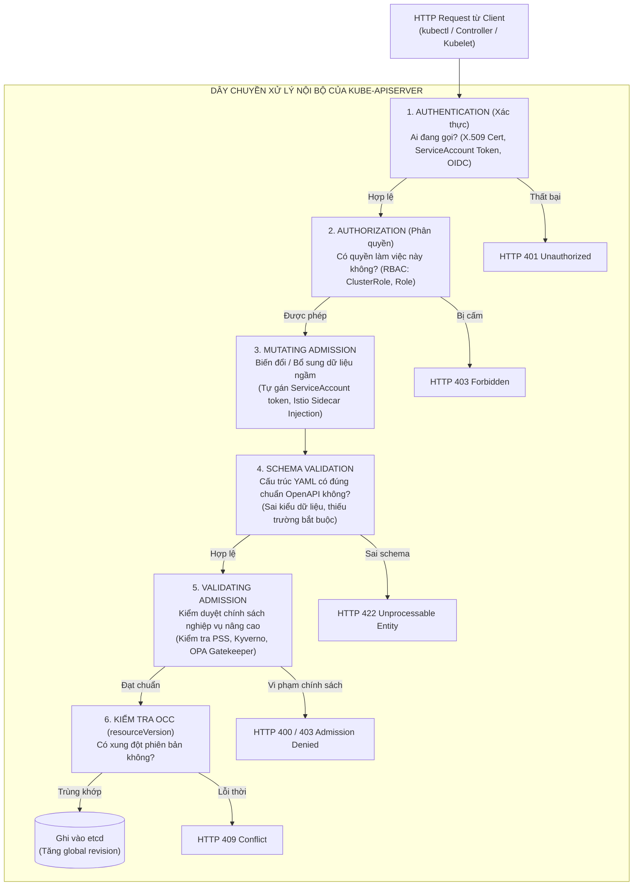
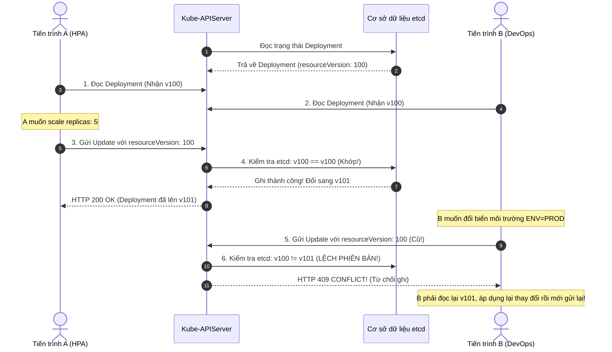
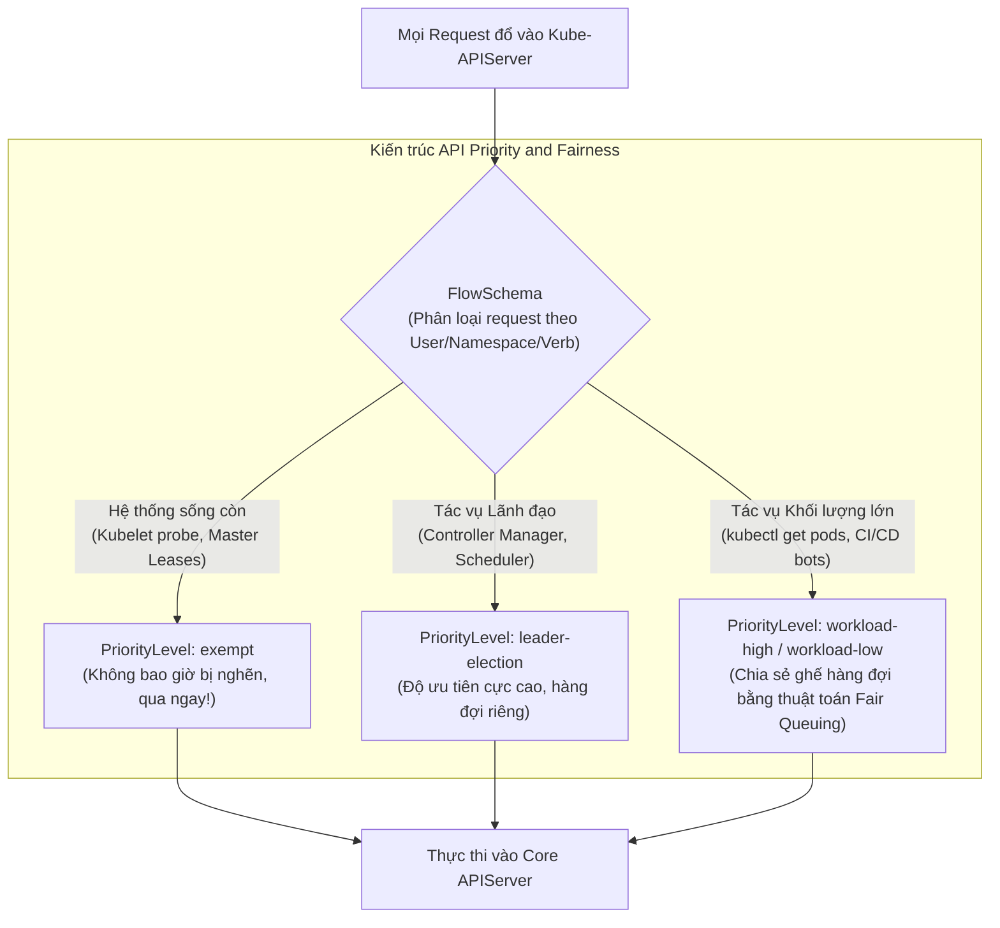

# Bài 50: Đào sâu Kube-APIServer & Optimistic Concurrency Control

## 1. Thông tin bài học
* **Tên bài:** Bài 50: Đào sâu Kube-APIServer & Optimistic Concurrency Control
* **Mục tiêu học:** Mổ xẻ tường tận kiến trúc bên trong và chuỗi xử lý yêu cầu 5 bước của **Kube-APIServer** (Authentication $\rightarrow$ Authorization $\rightarrow$ Mutating Webhook $\rightarrow$ Schema Validation $\rightarrow$ Validating Webhook $\rightarrow$ etcd Storage); thấu hiểu cơ chế kiểm soát đồng thời lạc quan (**Optimistic Concurrency Control - OCC**) và vai trò tối thượng của trường `metadata.resourceVersion`; giải phẫu nguyên nhân gốc rễ và cách xử lý lỗi kinh điển **HTTP 409 Conflict**; khám phá cơ chế bộ nhớ đệm **Watch Cache** và cơ chế bảo vệ máy chủ **API Priority and Fairness (APF)**; thực hành mô phỏng tình huống 2 tiến trình cùng sửa một tài nguyên để tái hiện lỗi 409 và xây dựng cơ chế tự động thử lại (Retry Loop) chuẩn công nghiệp.
* **Thời lượng ước tính:** 180 phút (90 phút lý thuyết chuyên sâu nội hạt, 90 phút thực hành và phân tích)
* **Kiến thức cần có trước:** Bài 05 (Kiến trúc Control Plane), Bài 30 (RBAC), Bài 46 (etcd & MVCC), Bài 49 (FinOps).
* **Liên quan kỳ thi:** Senior Platform Engineer / Kubernetes Core Contributor (Kiến thức bắt buộc để viết Kubernetes Operator, Controller và xử lý các lỗi nghẽn cổ chai API Server ở quy mô hàng ngàn node).

---

## 2. Bảng thuật ngữ

| Thuật ngữ | Giải thích đơn giản | Ví dụ / Ẩn dụ đời thường |
| :--- | :--- | :--- |
| **Kube-APIServer** | Cửa ngõ trung tâm duy nhất của cụm Kubernetes, đóng vai trò tiếp nhận, kiểm duyệt, xử lý logic và điều phối việc đọc/ghi dữ liệu vào etcd. | Bàn tiếp dân tại Ủy ban Nhân dân: Mọi công dân, cán bộ, thanh tra đều phải nộp hồ sơ qua cửa này; không ai được tự ý bước vào kho lưu trữ tài liệu phía sau. |
| **Optimistic Concurrency Control (OCC)** | Phương pháp kiểm soát xung đột dữ liệu: Cho phép nhiều người cùng đọc và sửa tự do, nhưng khi lưu lại thì kiểm tra xem dữ liệu gốc có bị ai sửa trước đó không; nếu có thì từ chối. | Đặt vé máy bay online: Cả 2 người cùng nhìn thấy ghế 12A còn trống, nhưng ai bấm nút thanh toán trước 1 phần nghìn giây sẽ được vé, người bấm sau nhận thông báo "Ghế đã được chọn!". |
| **Pessimistic Locking (Khóa bi quan)** | Phương pháp truyền thống: Khóa chặt bản ghi ngay khi có người mở ra xem, cấm tất cả những người khác đọc/ghi cho đến khi người đó xong việc. | Thư viện chỉ có 1 cuốn sách duy nhất: Người thứ nhất mượn về phòng đọc, tất cả những người khác phải đứng xếp hàng chờ đợi nhiều ngày. |
| **resourceVersion** | Chuỗi ký tự số nguyên định danh phiên bản của một tài nguyên, phản ánh chỉ số `revision` của etcd tại thời điểm tài nguyên đó được tạo hoặc sửa đổi. | Con dấu số thứ tự công văn: Mỗi lần văn bản được sửa đổi, văn thư đóng thêm một con dấu nhảy số tăng dần (V1, V2, V3...). |
| **HTTP 409 Conflict** | Mã lỗi HTTP do Kube-APIServer trả về khi phát hiện `resourceVersion` trong yêu cầu cập nhật cũ hơn `resourceVersion` hiện tại trong cơ sở dữ liệu. | Đổi tiền cũ lấy hàng mới: Bạn đưa biên lai số 10 để nhận hàng, nhưng thủ kho báo biên lai này đã bị hủy vì đã có người dùng biên lai số 11 lấy hàng rồi! |
| **API Priority and Fairness (APF)** | Cơ chế phân luồng và xếp hàng thông minh của Kube-APIServer, ngăn chặn tình trạng một ứng dụng gửi quá nhiều request làm nghẽn toàn bộ máy chủ. | Làn đường ưu tiên tại trạm thu phí: Xe cứu thương và xe công vụ đi làn riêng không bao giờ bị kẹt, các xe tải nặng phải xếp hàng theo lượt công bằng. |
| **Watch Cache** | Bộ nhớ RAM đệm bên trong Kube-APIServer lưu trữ các sự kiện gần nhất, giúp phục vụ các thao tác đọc mà không cần truy vấn trực tiếp vào etcd. | Cuốn sổ ghi nhớ trên bàn làm việc của thư ký: Khách hỏi thông tin quen thuộc thì đọc ngay từ sổ, không cần chạy vào kho lục hồ sơ gốc. |

---

## 3. Bức tranh lớn: Vấn đề thực tế và ẩn dụ đời thường

### Nhắc lại bài trước
Ở Bài 49, chúng ta đã tối ưu hóa chi phí vận hành với FinOps và Rightsizing. Chúng ta đã kết thúc toàn bộ Giai đoạn 8 về Vận hành Production. Hôm nay, chúng ta chính thức bước sang **Giai đoạn 9: Đỉnh cao Nội hàm Kubernetes (Internals, CRD, Operator, Service Mesh)**. Và điểm khởi đầu không gì xứng đáng hơn chính là "trái tim giao tiếp" của toàn bộ hệ thống: **Kube-APIServer**.

### Tại sao cần cái này ở production? (Vấn đề thực tế)

Hãy tưởng tượng bạn đang vận hành một cụm Kubernetes gồm 500 nodes và 10,000 Pods:

1. **Cơn ác mộng "Ghi đè mù quáng" (Lost Updates):**
   Một Deployment đang chạy có `replicas: 3`.
   * Cùng một giây đó, **Horizontal Pod Autoscaler (HPA)** thấy tải tăng cao, quyết định tăng số Pod lên: `replicas: 5`.
   * Đúng tích tắc đó, một **kỹ sư DevOps** nhận lệnh thêm biến môi trường, mở manifest ra sửa và gửi lệnh cập nhật nhưng trong file của anh ta vẫn ghi: `replicas: 3`.  
   Nếu Kubernetes hoạt động theo kiểu "ai ghi sau thì đè lên ai ghi trước", biến môi trường của kỹ sư sẽ đè bẹp quyết định scale của HPA! Số Pod bị ép tụt về 3, hệ thống sập vì quá tải!  
   Làm sao Kube-APIServer biết được và ngăn chặn thảm họa này?

2. **Tại sao không dùng cơ chế Lock bảng (Pessimistic Locking) của MySQL/Postgres?**
   Trong các hệ thống phân tán khổng lồ, nếu mỗi khi Kubelet hay Controller muốn kiểm tra Pod mà APIServer lại "khóa" bản ghi đó lại, hàng ngàn tiến trình khác sẽ bị treo cứng chờ mở khóa. Cơ sở dữ liệu etcd sẽ bị nghẽn cổ chai ngay lập tức và toàn bộ cụm sẽ tê liệt.  
   Kubernetes bắt buộc phải dùng **Optimistic Concurrency Control (OCC)** - không khóa bất kỳ ai, nhưng kiểm soát nghiêm ngặt bằng số phiên bản!

3. **Hiện tượng "Bầy đàn giẫm đạp" (Thundering Herd) và sự sụp đổ của API Server:**
   Khi một cụm bị mất điện rồi có điện trở lại, 500 Kubelet và 100 Controller cùng khởi động lại và đồng loạt dội hàng chục ngàn request `LIST /pods` lên Kube-APIServer. Nếu không có cơ chế **Watch Cache** và **API Priority and Fairness (APF)**, CPU của APIServer sẽ vọt lên 100%, bộ nhớ OOMKilled, và cụm không bao giờ ngóc đầu dậy nổi!

### Ẩn dụ đời thường: Bàn Đấu giá Tranh và Thư ký Nhanh tay

Hãy tưởng tượng Kube-APIServer như một **Nhà Đấu giá Tác phẩm Nghệ thuật Quốc tế**:

* **Cách làm Khóa Bi quan (Pessimistic Locking):**  
  Mỗi khi một vị khách muốn ngắm bức tranh để ra giá, nhân viên bảo vệ đuổi toàn bộ các vị khách khác ra khỏi phòng và khóa trái cửa lại trong 10 phút. Phiên đấu giá kéo dài 3 ngày mới bán được 1 bức tranh vì mọi người phải xếp hàng mòn mỏi bên ngoài!
* **Cách làm Khóa Lạc quan của Kubernetes (Optimistic Concurrency Control):**  
  Cửa phòng mở toang, hàng trăm vị khách cùng vào ngắm tranh tự do. Trên khung tranh có gắn một chiếc **Đồng hồ số điện tử (`resourceVersion: 42`)**:
  * Khách hàng A nhìn thấy số 42, liền viết lên phiếu: *"Tôi trả 5000 USD cho phiên bản số 42"* và chạy lên nộp cho Thư ký.
  * Khách hàng B cũng nhìn thấy số 42, cũng viết: *"Tôi trả 6000 USD cho phiên bản số 42"* và chạy lên nộp.
  * Khách hàng A chạy nhanh hơn, nộp trước nửa giây. Thư ký nhìn thấy đồng hồ trên tranh vẫn là 42, liền gật đầu: *"Chấp nhận!"*, ghi giá 5000 USD vào sổ cái (etcd), và **bấm nút nhảy số đồng hồ lên 43 (`resourceVersion: 43`)**!
  * Nửa giây sau, khách hàng B hớt hải chạy tới nộp phiếu: *"Tôi trả 6000 USD cho bản số 42"*.  
    Thư ký nhìn lên đồng hồ thấy đã là 43, lập tức xua tay từ chối: **"Xung đột rồi! Bản số 42 đã lỗi thời, hiện tại là bản 43! Hãy cầm phiếu về xem lại giá mới rồi nộp lại!"** (**Lỗi HTTP 409 Conflict**).
* Kết quả: Phiên đấu giá diễn ra với tốc độ hàng ngàn lượt xem mỗi giây, không ai bị khóa cửa, và tài sản không bao giờ bị ghi đè nhầm lẫn!

---

## 4. Giải thích khái niệm theo từng bước

### Chuỗi Xử lý Yêu cầu 5 Bước của Kube-APIServer (Request Pipeline)

Mỗi khi một request (ví dụ `kubectl apply` hoặc một lệnh HTTP POST/PUT/PATCH) bay tới Kube-APIServer, nó bắt buộc phải vượt qua một "dây chuyền kiểm duyệt" nghiêm ngặt gồm 5 chốt chặn trước khi được phép chạm vào etcd:



---

### Cơ chế Optimistic Concurrency Control (OCC) và `resourceVersion`

Mọi đối tượng (Object) trong Kubernetes đều chứa một trường siêu dữ liệu tối quan trọng:
```yaml
metadata:
  name: my-config
  resourceVersion: "1849204"  # <-- Khóa lạc quan của Kubernetes
```

#### Quy tắc vận hành của OCC:
1. Khi bạn đọc một đối tượng bằng `GET`, APIServer gửi về đối tượng kèm theo `resourceVersion` hiện thời (ví dụ: `"1849204"`).
2. Khi bạn gửi lệnh sửa đổi toàn phần (`PUT` / `Update`), bạn **bắt buộc phải gửi kèm** đúng chuỗi `resourceVersion: "1849204"` đó trong phần thân (body).
3. Tại Kube-APIServer, trước khi ghi xuống etcd, nó so sánh:
   * Nếu `resourceVersion` gửi lên **==** `resourceVersion` hiện thời trong etcd $\rightarrow$ **Thành công**: etcd ghi dữ liệu, cấp phát một revision mới (ví dụ `"1849205"`), và trả về HTTP `200 OK`.
   * Nếu `resourceVersion` gửi lên **$\ne$** `resourceVersion` hiện thời trong etcd (vì một ai đó đã nhanh chân cập nhật trước bạn một mili-giây) $\rightarrow$ **Xung đột**: APIServer ngay lập tức hủy giao dịch và ném về lỗi:
     ```json
     {
       "kind": "Status",
       "status": "Failure",
       "message": "Operation cannot be fulfilled on configmaps \"my-config\": the object has been modified; please apply your changes to the latest version",
       "reason": "Conflict",
       "code": 409
     }
     ```



---

### Sự Khác Biệt Giữa `Update` (PUT) và `Patch` (PATCH)

Đây là câu hỏi phỏng vấn kinh điển khiến 80% ứng viên bối rối: Tại sao lệnh `kubectl apply` ít khi bị lỗi 409 Conflict, trong khi viết code gọi API lại hay gặp?

1. **`Update` (HTTP PUT):**  
   Gửi **nguyên vẹn toàn bộ đối tượng** lên máy chủ. Bắt buộc phải có `resourceVersion`. Nếu một trường bất kỳ bị người khác sửa trước đó, toàn bộ request sẽ bị dội ngược lại HTTP 409 Conflict.
2. **`Patch` (HTTP PATCH - ví dụ Server-Side Apply):**  
   Chỉ gửi **đúng đoạn thay đổi nhỏ** (ví dụ: chỉ gửi đúng thuộc tính `spec.replicas: 5`).  
   Kube-APIServer sẽ tự động làm nhiệm vụ hòa giải (Merge) thuộc tính này vào đối tượng hiện hành trên etcd mà không bắt buộc client phải gửi kèm `resourceVersion`. Server-Side Apply (SSA) sử dụng cơ chế **Field Management** để biết ai sở hữu trường nào, triệt tiêu gần như toàn bộ lỗi xung đột 409 cho lập trình viên!

---

### Cơ chế Bảo vệ Quá tải: API Priority and Fairness (APF)

Từ phiên bản Kubernetes v1.20 trở lên, tính năng **API Priority and Fairness (APF)** được bật mặc định để thay thế cơ chế giới hạn request tối đa (MaxInFlight) thô sơ trước đây.

APF chia luồng request thành các tầng ưu tiên dựa trên 2 loại tài nguyên:



* **`FlowSchema`:** Bộ lọc quy định request này thuộc về nhóm nào (dựa trên ai gửi, gọi tài nguyên gì, phương thức gì).
* **`PriorityLevelConfiguration`:** Quy định số lượng "ghế ngồi đồng thời" (Concurrency Shares) và kích thước hàng đợi cho từng mức ưu tiên. Nếu bot của nhóm phát triển bắn hàng triệu request, nó chỉ làm nghẹt hàng đợi của riêng nhóm đó (`workload-low`), trong khi Kubelet báo cáo nhịp tim (`exempt`) vẫn lướt êm ru mà không bị ảnh hưởng!

---

## 5. Thực hành (Lab)

* **Môi trường:** Cụm Kind hiện có (`1 control-plane + 1 worker`).
* **Mức RAM ước tính:** ~0 MB (Chỉ sử dụng API Server và PowerShell).

Trong bài lab thực chiến này, chúng ta sẽ tự tay "bẫy" Kube-APIServer trả về lỗi **HTTP 409 Conflict**, chứng minh cơ chế OCC hoạt động bằng mắt thấy tai nghe, sau đó viết hàm xử lý tự động khắc phục xung đột!

---

### Bước 1: Tạo một ConfigMap Làm Đối tượng Nghiên cứu

Tạo một ConfigMap đơn giản mang tên `concurrency-lab`:

```powershell
kubectl create configmap concurrency-lab --from-literal=status="initial-version" --from-literal=counter="0"
```

Xem cấu hình chi tiết và đặc biệt lưu ý trường `resourceVersion`:

```powershell
kubectl get configmap concurrency-lab -o yaml
```

**Kết quả mong đợi:**
```yaml
apiVersion: v1
data:
  counter: "0"
  status: initial-version
kind: ConfigMap
metadata:
  name: concurrency-lab
  namespace: default
  resourceVersion: "15203"   # <-- Con số phiên bản do etcd sinh ra
```

---

### Bước 2: Tái hiện Cố tình Lỗi HTTP 409 Conflict bằng PowerShell

Bây giờ, chúng ta sẽ thực hiện kịch bản:
1. Lấy thông tin ConfigMap và lưu `resourceVersion` hiện tại vào biến `$oldVersion`.
2. Giả lập **Tiến trình A**: Nhanh chân sửa ConfigMap thành công (làm cho `resourceVersion` trong cụm nhảy lên số mới).
3. Giả lập **Tiến trình B**: Vẫn cầm biến `$oldVersion` cũ và cố tình gửi lệnh ghi đè lên APIServer.

Hãy chạy khối mã PowerShell sau:

```powershell
# 1. Đọc đối tượng và lưu phiên bản ban đầu
$cmJson = kubectl get configmap concurrency-lab -o json | ConvertFrom-Json
$oldVersion = $cmJson.metadata.resourceVersion
Write-Host "Phiên bản ban đầu đọc được: $oldVersion" -ForegroundColor Yellow

# 2. TIẾN TRÌNH A: Nhanh chân cập nhật trước!
kubectl patch configmap concurrency-lab --type merge -p '{"data":{"counter":"100"}}'
$currentVersion = (kubectl get configmap concurrency-lab -o jsonpath='{.metadata.resourceVersion}')
Write-Host "Tiến trình A đã sửa thành công! resourceVersion mới trên cluster là: $currentVersion" -ForegroundColor Green

# 3. TIẾN TRÌNH B: Cố tình dùng $oldVersion cũ để ghi đè (qua kubectl replace)
$cmJson.metadata.resourceVersion = $oldVersion
$cmJson.data.counter = "999" # B muốn ghi đè giá trị này
$cmJson | ConvertTo-Json -Depth 5 | Set-Content -Encoding UTF8 stale-cm.json

Write-Host "Tiến trình B đang cố tình ghi đè bằng phiên bản cũ ($oldVersion)..." -ForegroundColor Cyan
kubectl replace -f stale-cm.json
```

---

### Bước 3: Kết quả mong đợi (Quan sát Trực quan Lỗi 409)

Terminal sẽ trả về chính xác dòng lỗi đỏ kinh điển của Kube-APIServer:

```text
The ConfigMap "concurrency-lab" is invalid: metadata.resourceVersion: Invalid value: "15203": must be specified for an update
Error from server (Conflict): Operation cannot be fulfilled on configmaps "concurrency-lab": the object has been modified; please apply your changes to the latest version
```

> [!IMPORTANT]
> **Phân tích:** Kube-APIServer đã phát hiện ra rằng phiên bản gửi lên (`15203`) không còn khớp với phiên bản thực tế đang lưu trong etcd (`15204`). Cơ chế **Optimistic Concurrency Control** lập tức kích hoạt, bảo vệ dữ liệu khỏi bị tiến trình B ghi đè mù quáng!

---

### Bước 4: Viết Hàm Xử lý Xung đột Chuẩn Công nghiệp (Retry with Exponential Backoff)

Khi viết Controller hoặc Kubernetes Operator (Bài 53), làm thế nào để lập trình viên xử lý khi gặp lỗi 409 này?  
Quy tắc vàng: **Không được hoảng sợ! Hãy đọc lại phiên bản mới nhất, gộp lại thay đổi, và thử lại (Retry Loop)!**

Hãy chạy đoạn script mô phỏng cơ chế tự động thử lại:

```powershell
# Mô phỏng vòng lặp Retry khi gặp xung đột 409
$maxRetries = 3
$success = $false

for ($attempt = 1; $attempt -le $maxRetries; $attempt++) {
    Write-Host "Lần thử thứ $attempt: Đang đọc phiên bản mới nhất từ APIServer..." -ForegroundColor Cyan
    $freshCm = kubectl get configmap concurrency-lab -o json | ConvertFrom-Json
    
    # Áp dụng logic nghiệp vụ trên bản mới nhất
    $currentCounter = [int]$freshCm.data.counter
    $freshCm.data.counter = ($currentCounter + 1).ToString()
    $freshCm.data.status = "successfully-updated-via-retry"
    
    # Lưu và thử apply lại
    $freshCm | ConvertTo-Json -Depth 5 | Set-Content -Encoding UTF8 fresh-cm.json
    $result = kubectl replace -f fresh-cm.json 2>&1
    
    if ($LASTEXITCODE -eq 0) {
        Write-Host "THÀNH CÔNG! Đã cập nhật thành công ở lần thử thứ $attempt!" -ForegroundColor Green
        $success = $true
        break
    } else {
        Write-Host "Gặp xung đột! Đang chờ một lát rồi thử lại..." -ForegroundColor Yellow
        Start-Sleep -Milliseconds (200 * $attempt)
    }
}

# Kiểm tra kết quả cuối cùng
kubectl get configmap concurrency-lab -o yaml | Select-String -Pattern "counter:|status:|resourceVersion:"
```

**Kết quả mong đợi:**
```text
Lần thử thứ 1: Đang đọc phiên bản mới nhất từ APIServer...
THÀNH CÔNG! Đã cập nhật thành công ở lần thử thứ 1!
    counter: "101"
    status: successfully-updated-via-retry
    resourceVersion: "15205"
```

---

### Bước 5: Khảo sát Hệ Thống Hàng Đợi API Priority and Fairness (APF)

Hãy xem Kube-APIServer trong cụm của bạn đang chia làn ưu tiên cho các request như thế nào:

```powershell
kubectl get flowschemas
```

**Kết quả mong đợi:**
```text
NAME                           PRIORITYLEVEL     MATCHINGPRECEDENCE   DISTINGUISHERMETHOD   AGE
exempt                         exempt            1                    <none>                2d
probes                         exempt            2                    <none>                2d
system-leader-election         leader-election   100                  ByUser                2d
workload-high                  workload-high     10000                ByNamespace           2d
global-default                 global-default    9900                 ByUser                2d
catch-all                      catch-all         10000                ByUser                2d
```

Hãy quan sát: Các request sống còn như liveness probe (`probes`) và bầu chọn lãnh đạo (`system-leader-election`) luôn được xếp vào các mức ưu tiên tuyệt đối `exempt` và `leader-election` với độ ưu tiên cao nhất, hoàn toàn tách biệt khỏi các request thông thường của người dùng!

---

### Bước 6: Dọn dẹp tài nguyên (Cleanup)

```powershell
kubectl delete configmap concurrency-lab
Remove-Item -Force stale-cm.json, fresh-cm.json -ErrorAction SilentlyContinue
```

---

## 6. Lỗi thường gặp và cách debug

### Lỗi 1: `the object has been modified; please apply your changes to the latest version` trong CI/CD Pipeline
* **Dấu hiệu:** Pipeline GitLab CI hoặc GitHub Actions chạy lệnh `kubectl apply` hoặc script tự động thỉnh thoảng bị fail ngẫu nhiên và in ra lỗi 409 Conflict.
* **Nguyên nhân:** Hai job CI chạy song song cùng lúc tác động vào cùng một tài nguyên (ví dụ: một job đang gắn annotation, một job đang cập nhật tag image), hoặc một Operator đang chạy vòng lặp Reconcile liên tục cập nhật đối tượng đó.
* **Cách debug và sửa:**
  1. Tránh dùng lệnh `kubectl replace`. Chuyển sang sử dụng **Server-Side Apply**:
     ```bash
     kubectl apply --server-side=true -f manifest.yaml
     ```
  2. Server-Side Apply giải quyết xung đột ở cấp độ từng trường (field-level) thay vì cấp độ toàn bộ đối tượng, loại bỏ 99% lỗi 409 Conflict trong CI/CD.

---

### Lỗi 2: API Server phản hồi chậm chạp và trả về lỗi `HTTP 429 Too Many Requests`
* **Dấu hiệu:** Client nhận lỗi: `Error: rate: Wait(n) for client-go exceeded deadline` hoặc HTTP 429.
* **Nguyên nhân:** Một script chạy vòng lặp `for` gõ lệnh `kubectl` liên tục, hoặc một custom controller viết lỗi không dùng cache mà liên tục gửi lệnh `GET /pods` lên APIServer làm cạn kiệt hàng đợi của FlowSchema APF.
* **Cách debug và sửa:**
  Kiểm tra số lượng request bị nghẽn trong hàng đợi APF bằng metric Prometheus:
  ```promql
  sum(apiserver_flowcontrol_rejected_requests_total) by (flow_schema, reason)
  ```
  Xác định FlowSchema đang bị quá tải và điều chỉnh tăng số ghế đồng thời trong tài nguyên `PriorityLevelConfiguration` tương ứng.

---

### Lỗi 3: Lỗi `resourceVersion: Invalid value: ...: must be specified for an update`
* **Dấu hiệu:** Gửi lệnh HTTP PUT lên APIServer nhưng nhận lỗi từ chối ngay lập tức.
* **Nguyên nhân:** Bạn gửi một yêu cầu `Update` (PUT) nhưng trong manifest gửi lên lại vô tình xóa mất trường `metadata.resourceVersion` (hoặc đặt nó bằng chuỗi rỗng `""`).
* **Cách sửa:** Trong phương thức `Update`, `resourceVersion` là trường **bắt buộc 100%**. Nếu không muốn quan tâm đến `resourceVersion`, hãy chuyển sang dùng phương thức HTTP PATCH (Server-Side Apply).

---

## 7. Góc nhìn Senior

### 1. Sự đánh đổi (Trade-offs)

| Chiến lược Đồng thời | Ưu điểm | Đánh đổi / Thách thức |
| :--- | :--- | :--- |
| **Optimistic Concurrency Control (OCC) của K8s** | Thông lượng (Throughput) cực cao; không có tiến trình nào bị treo chờ khóa; thiết kế phi trạng thái hoàn hảo cho hệ thống phân tán. | **Gánh nặng Retry đè lên vai Client:** Khi có tranh chấp cao (High Contention), client phải tự gánh logic đọc lại và thử lại (Exponential Backoff), tốn thêm vòng lặp CPU. |
| **Server-Side Apply (SSA) vs. Client-Side Apply (CSA)** | SSA theo dõi quyền sở hữu từng trường (`managedFields`), thông báo xung đột chính xác ở cấp độ thuộc tính, không cần giữ trạng thái khổng lồ trong annotation. | Kích thước metadata của đối tượng tăng lên do phải lưu thêm khối `managedFields`. Cần hiểu rõ khái niệm "Field Ownership" để tránh tranh chấp quyền sở hữu trường. |
| **Watch Cache trong APIServer** | Giảm tới 95% tải đọc cho etcd; tốc độ phản hồi `GET/LIST` nhanh như chớp. | **Nguy cơ đọc dữ liệu hơi trễ (Stale Reads):** Dữ liệu trong Watch Cache có thể chậm hơn etcd vài mili-giây. Nếu một controller cần dữ liệu nhất quán tuyệt đối 100%, nó phải gửi request kèm `resourceVersion: "0"` hoặc bỏ qua cache. |

---

### 2. Best practices tại production

1. **Quy tắc Vàng cho Lập trình viên Client-Go / Operator (RetryOnConflict):**  
   Khi viết mã nguồn tương tác với Kubernetes API bằng Go, tuyệt đối không bao giờ gọi hàm `client.Update()` trần trụi! Luôn luôn bọc nó trong hàm thư viện chuẩn:
   ```go
   import "k8s.io/client-go/util/retry"

   err := retry.RetryOnConflict(retry.DefaultRetry, func() error {
       // 1. Luôn đọc lại đối tượng mới nhất từ API Server
       obj, err := client.Get(ctx, name)
       if err != nil { return err }

       // 2. Thay đổi giá trị cần sửa
       obj.Spec.Something = "new-value"

       // 3. Thử cập nhật lại
       return client.Update(ctx, obj)
   })
   ```
   Hàm này tự động xử lý lỗi 409 Conflict, tự động đọc lại phiên bản mới và thử lại tối đa 5 lần với thuật toán giãn cách thời gian ngẫu nhiên (Jittered Backoff).

2. **Tối ưu hóa Lệnh `LIST` ở Quy mô Lớn (Tránh OOMKilled APIServer):**  
   Khi một cụm có 50,000 Pods, một lệnh `kubectl get pods -A` ngốn hàng trăm MB RAM của APIServer để gom dữ liệu JSON.  
   Tại môi trường Production, các script tự động hóa bắt buộc phải sử dụng kỹ thuật **Pagination (Phân trang)** với tham số `limit`:
   ```bash
   kubectl get pods -A --chunk-size=500
   ```
   Điều này chia nhỏ truy vấn thành từng trang 500 phần tử, bảo vệ Kube-APIServer không bao giờ bị tràn bộ nhớ.

---

### 3. Câu hỏi phỏng vấn Senior

* **Câu hỏi:** *"Trong Kube-APIServer, trường `metadata.resourceVersion` có giá trị là một số nguyên (ví dụ: '1849204'). Bạn có thể so sánh hai `resourceVersion` bằng phép toán số học lớn hơn/nhỏ hơn (ví dụ: $A > B$) để xác định phiên bản nào mới hơn phiên bản nào được không? Và tại sao tài liệu chính thức của Kubernetes lại khuyến cáo client phải coi `resourceVersion` như một chuỗi mờ ảo (Opaque String)?"*
* **Gợi ý trả lời chuẩn:**
  1. **Khẳng định dứt khoát:** **Tuyệt đối KHÔNG ĐƯỢC.** Client không bao giờ được tự ý parse `resourceVersion` thành số để so sánh lớn hơn/nhỏ hơn!
  2. **Giải thích bản chất sâu xa:**
     * Mặc dù trong phiên bản hiện tại sử dụng etcd v3, `resourceVersion` được sinh ra từ biến đếm `revision` toàn cục của etcd (có dạng số tăng dần), nhưng đây là chi tiết cài đặt nội bộ (Implementation Detail) của Kubernetes, không phải là một cam kết trong hợp đồng API.
     * Trong tương lai hoặc trong các bản phân phối Kubernetes đặc thù (như K3s dùng SQLite, Kine dùng MySQL, hoặc nếu Kubernetes đổi backend lưu trữ), `resourceVersion` hoàn toàn có thể là một chuỗi băm (Hash string), một Vector Clock, hoặc một chuỗi định danh bất kỳ không có tính chất số học!
     * Hợp đồng API của Kubernetes quy định rõ: **Client chỉ được phép thực hiện 2 thao tác với `resourceVersion`:**
       * Kiểm tra bằng nhau/khác nhau ($A == B$ hoặc $A \ne B$).
       * Gửi nguyên vẹn chuỗi đó trở lại máy chủ trong các lệnh `Update` hoặc `Watch`.
  3. **Ý nghĩa của các giá trị đặc biệt:**
     * `resourceVersion=""` (rỗng): Lấy dữ liệu mới nhất trực tiếp từ etcd (Quorum Read).
     * `resourceVersion="0"`: Lấy dữ liệu mới nhất đang có sẵn trong Watch Cache của APIServer (chấp nhận trễ vài mili-giây nhưng cực nhẹ tải).

---

## 8. Tóm tắt bài học

* 📌 **1. Dây chuyền 5 chốt chặn của APIServer:** Mọi request đều phải vượt qua: Authentication $\rightarrow$ Authorization $\rightarrow$ Mutating Admission $\rightarrow$ Schema Validation $\rightarrow$ Validating Admission trước khi chạm vào etcd.
* 📌 **2. OCC loại bỏ điểm nghẽn khóa dữ liệu:** Kubernetes dùng kiểm soát đồng thời lạc quan, cho phép đọc/sửa tự do và kiểm tra tính toàn vẹn tại thời điểm ghi bằng `resourceVersion`.
* 📌 **3. Bản chất lỗi HTTP 409 Conflict:** Xảy ra khi client cố gắng cập nhật một tài nguyên bằng một `resourceVersion` đã lỗi thời; là tính năng an toàn để ngăn chặn ghi đè mất mát dữ liệu (Lost Updates).
* 📌 **4. Server-Side Apply hóa giải xung đột:** SSA theo dõi quyền sở hữu ở cấp độ từng trường (`managedFields`), giúp nhiều tiến trình cùng sửa một đối tượng mà không bị đụng độ 409.
* 📌 **5. APF bảo vệ máy chủ khỏi nghẽn hàng đợi:** Phân luồng request thành các mức ưu tiên độc lập, đảm bảo các tác vụ sống còn của cụm luôn thông suốt ngay cả khi có bão lưu lượng.

---

## 9. Bài tập tự làm

* 🟢 **Mức Dễ:** Viết một lệnh `kubectl` sử dụng `jsonpath` để in ra màn hình `resourceVersion` hiện tại của một Pod bất kỳ đang chạy trong namespace `kube-system`.
* 🟡 **Mức Vừa:** So sánh thời gian phản hồi giữa 2 lệnh: `kubectl get pods -A` (đọc qua cache) và `kubectl get pods -A --cache-between-retries=false` (buộc kiểm tra etcd). Đo đạc thời gian chênh lệch bằng PowerShell `Measure-Command`.
* 🔴 **Mức Khó:** Viết một script PowerShell chạy 2 tiến trình song song (dùng `Start-Job` hoặc `Start-Process`) cùng cố gắng tăng giá trị biến đếm `counter` trong một ConfigMap lên 100 lần. Quan sát số lần xảy ra lỗi 409 Conflict và áp dụng cơ chế Retry with Exponential Backoff để đảm bảo giá trị cuối cùng đạt chính xác 200 mà không bị mất mát bất kỳ bước đếm nào.

---

## 10. Câu hỏi tự kiểm tra

1. Liệt kê tuần tự các bước xử lý của Kube-APIServer khi tiếp nhận một request tạo Pod mới?
2. Tại sao Kubernetes lại chọn cơ chế Optimistic Concurrency Control (OCC) thay vì Pessimistic Locking truyền thống?
3. Khi nhận được lỗi HTTP 409 Conflict từ Kube-APIServer, điều đó có đồng nghĩa với việc cụm Kubernetes đang bị lỗi phần cứng hay không?
4. Tại sao một lập trình viên không được phép so sánh hai chuỗi `resourceVersion` bằng phép toán số học $A > B$?
5. Cơ chế Watch Cache trong Kube-APIServer mang lại lợi ích gì cho hiệu năng của cơ sở dữ liệu etcd?
6. Tính năng API Priority and Fairness (APF) giải quyết vấn đề gì khi cụm gặp tình huống quá tải request?

<details>
<summary>👉 Bấm vào đây để xem đáp án câu hỏi tự kiểm tra</summary>

* **Câu 1:** Các bước gồm: (1) Xác thực danh tính (Authentication), (2) Phân quyền hành động (Authorization/RBAC), (3) Đột biến/Bổ sung dữ liệu (Mutating Admission Webhooks), (4) Kiểm tra tính hợp lệ cấu trúc (Schema Validation), (5) Kiểm duyệt chính sách nghiệp vụ (Validating Admission Webhooks), và cuối cùng là kiểm tra OCC trước khi ghi vào etcd.
* **Câu 2:** Vì Kubernetes là hệ thống phân tán quy mô lớn với hàng ngàn tiến trình hoạt động đồng thời. Nếu dùng Pessimistic Locking (khóa bản ghi khi đọc), hệ thống sẽ bị tắc nghẽn nghiêm trọng, etcd bị quá tải và thông lượng xử lý của toàn cụm sẽ tụt giảm thảm hại.
* **Câu 3:** **Hoàn toàn KHÔNG.** Lỗi 409 Conflict là một cơ chế an toàn hoạt động hoàn toàn chính xác theo thiết kế của Kubernetes để bảo vệ dữ liệu không bị ghi đè mất mát khi có hai tiến trình cùng sửa một tài nguyên. Client chỉ cần đọc lại bản mới nhất và thử lại.
* **Câu 4:** Vì theo hợp đồng API của Kubernetes, `resourceVersion` là một chuỗi mờ ảo (Opaque String). Định dạng số hiện tại chỉ là chi tiết cài đặt của etcd và có thể thay đổi trong tương lai. Client chỉ được phép kiểm tra bằng/khác nhau ($==$ hoặc $\ne$).
* **Câu 5:** Watch Cache lưu trữ trạng thái gần nhất của các đối tượng trong bộ nhớ RAM của APIServer, cho phép phục vụ hàng ngàn yêu cầu đọc (`GET/LIST`) mỗi giây mà không cần truy vấn trực tiếp vào etcd, giúp giảm tới hơn 90% tải đọc và I/O đĩa cho etcd.
* **Câu 6:** APF phân luồng các request thành các hàng đợi ưu tiên độc lập. Khi có một ứng dụng hoặc người dùng gửi quá nhiều request gây quá tải, APF sẽ chỉ làm đầy hàng đợi của riêng đối tượng đó, đảm bảo các tác vụ sống còn của hệ thống (như nhịp tim Kubelet, bầu cử Leader) không bao giờ bị nghẽn (ngăn chặn hiện tượng Starvation).
</details>

---

## 11. Tài liệu đọc thêm và bài tiếp theo

### Tài liệu tham khảo
* [Tài liệu chính thức Kubernetes: API Server Overview & Request Handling](https://kubernetes.io/docs/reference/command-line-tools-reference/kube-apiserver/)
* [Tài liệu chính thức Kubernetes: Concurrency Control and resourceVersion](https://kubernetes.io/docs/reference/using-api/api-concepts/#concurrency-control-and-consistency)
* [Tài liệu chính thức Kubernetes: API Priority and Fairness](https://kubernetes.io/docs/concepts/cluster-administration/flow-control/)
* [Kubernetes Blog: Introducing Server-Side Apply](https://kubernetes.io/blog/2022/09/22/server-side-apply-ga/)

### Bài tiếp theo
👉 **Bài 51: Policy-as-Code với Admission Webhook (Kyverno)**

---

## PHỤ LỤC: ĐÁP ÁN GỢI Ý BÀI TẬP TỰ LÀM (MỤC 9)

### Đáp án Mức Dễ
Lệnh trích xuất `resourceVersion` của Pod CoreDNS:
```powershell
kubectl get pods -n kube-system -l k8s-app=kube-dns -o jsonpath='{.items[0].metadata.resourceVersion}'
```
Output: Một chuỗi số nguyên đại diện cho phiên bản etcd (ví dụ: `14829`).

---

### Đáp án Mức Vừa
Đo thời gian phản hồi:
```powershell
# Đọc qua Watch Cache (mặc định)
$timeCache = Measure-Command { kubectl get pods -A | Out-Null }
Write-Host "Thời gian đọc qua Watch Cache: $($timeCache.TotalMilliseconds) ms" -ForegroundColor Green

# Đọc trực tiếp từ etcd (resourceVersion=0 ép đọc cache, bỏ tham số để lấy bản mới nhất)
$timeDirect = Measure-Command { kubectl get pods -A --chunk-size=0 | Out-Null }
Write-Host "Thời gian đọc có phân trang / trực tiếp: $($timeDirect.TotalMilliseconds) ms" -ForegroundColor Yellow
```
Trên các cụm lớn, việc đọc qua cache thường nhanh hơn từ 3 đến 5 lần so với việc ép APIServer truy vấn toàn phần vào etcd.

---

### Đáp án Mức Khó
Script giải quyết xung đột đồng thời an toàn bằng vòng lặp Retry:
```powershell
# Hàm tăng biến đếm an toàn tuyệt đối trước xung đột OCC 409
function Increment-CounterSafe {
    param([string]$ConfigMapName)
    $success = $false
    while (-not $success) {
        # 1. Đọc bản mới nhất
        $cm = kubectl get configmap $ConfigMapName -o json | ConvertFrom-Json
        $val = [int]$cm.data.counter
        
        # 2. Tăng giá trị
        $cm.data.counter = ($val + 1).ToString()
        
        # 3. Ghi lại
        $cm | ConvertTo-Json -Depth 5 | Set-Content -Encoding UTF8 temp_inc.json
        $out = kubectl replace -f temp_inc.json 2>&1
        if ($LASTEXITCODE -eq 0) {
            $success = $true
        } else {
            # Ngủ ngẫu nhiên 50-150ms để tránh tranh chấp lặp lại (Jitter)
            Start-Sleep -Milliseconds (Get-Random -Minimum 50 -Maximum 150)
        }
    }
}
```
Nhờ cơ chế này, cho dù có 10 tiến trình chạy song song cùng sửa, mọi xung đột 409 đều được tự động hóa giải và biến đếm luôn tăng chính xác 100%!

