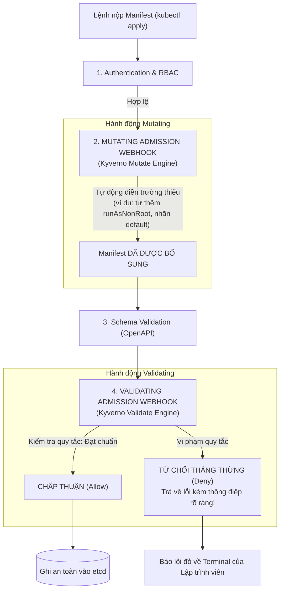
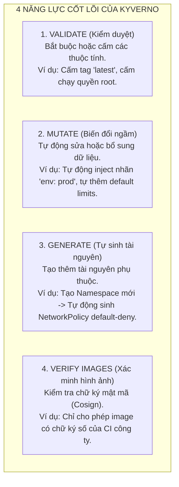

# Bài 51: Policy-as-Code với Admission Webhook (Kyverno)

## 1. Thông tin bài học
* **Tên bài:** Bài 51: Policy-as-Code với Admission Webhook (Kyverno)
* **Mục tiêu học:** Nắm vững triết lý **Policy-as-Code (PaC)** và chiến lược "Dịch trái bảo mật" (Shift-Left Security); thấu hiểu cơ chế hoạt động của 2 chốt chặn **MutatingAdmissionWebhook** và **ValidatingAdmissionWebhook** trong chuỗi xử lý của Kube-APIServer; so sánh chuyên sâu giữa hai trường phái công cụ hàng đầu CNCF: **Kyverno** (Kubernetes-Native YAML) và **OPA Gatekeeper** (ngôn ngữ Rego); làm chủ 4 năng lực cốt lõi của Kyverno: **Validate** (kiểm duyệt), **Mutate** (đột biến/bổ sung), **Generate** (tự sinh tài nguyên) và **Verify Images** (xác thực chữ ký số); thực hành cài đặt Kyverno phiên bản tối ưu tài nguyên cho máy 8GB RAM, cấu hình chính sách bắt buộc mọi Pod phải có nhãn định danh `owner` và giới hạn bộ nhớ `limits.memory`, kiểm chứng khả năng chặn đứng các cấu hình nguy hiểm ngay tại cửa ngõ API Server.
* **Thời lượng ước tính:** 210 phút (90 phút lý thuyết kiến trúc, 120 phút thực hành và thử nghiệm chính sách)
* **Kiến thức cần có trước:** Bài 05 (Kiến trúc Control Plane), Bài 24 (Resource Requests & Limits), Bài 32 (Pod Security Standards & PSA), Bài 50 (Đào sâu Kube-APIServer).
* **Liên quan kỳ thi:** **CKS (Certified Kubernetes Security Specialist)** - Trọng tâm kiểm tra cấu phần *Cluster Hardening & Supply Chain Security* (Sử dụng Admission Controllers để chặn đứng các container chạy quyền root, image tag latest, và thiếu bảo mật).

---

## 2. Bảng thuật ngữ

| Thuật ngữ | Giải thích đơn giản | Ví dụ / Ẩn dụ đời thường |
| :--- | :--- | :--- |
| **Policy-as-Code (PaC)** | Phương pháp định nghĩa các quy chuẩn bảo mật, tuân thủ và vận hành dưới dạng mã nguồn (file YAML/Code) có thể tự động kiểm duyệt và thực thi bằng máy. | Luật giao thông được lập trình vào hệ thống camera phạt nguội: Bất kỳ xe nào vượt đèn đỏ sẽ bị hệ thống tự động ghi lại và xử phạt tức thì. |
| **Admission Webhook** | Điểm mở rộng của Kube-APIServer cho phép gọi ra một dịch vụ HTTP bên ngoài (Webhook) để nhờ kiểm duyệt hoặc chỉnh sửa nội dung request trước khi ghi vào etcd. | Nhân viên kiểm tra an ninh tại sân bay: Hành lý sau khi qua cổng soát vé phải qua máy quét an ninh trước khi được đưa lên máy bay. |
| **Mutating Webhook** | Chốt chặn cho phép tự động sửa đổi hoặc chèn thêm dữ liệu vào manifest (ví dụ: tự động gắn thêm nhãn mặc định, tự động chèn proxy sidecar). | Bác bảo vệ nhắc nhở và tự tay dán tem "Đã kiểm dịch" lên kiện hàng trước khi cho vào kho. |
| **Validating Webhook** | Chốt chặn cho phép phán quyết: Chấp nhận (`Allow`) hoặc Từ chối thẳng thừng (`Deny`) request nếu nó vi phạm các quy tắc đặt ra. | Cảnh sát cửa khẩu kiểm tra hộ chiếu: Hộ chiếu hết hạn hoặc thiếu visa sẽ bị từ chối nhập cảnh ngay lập tức. |
| **Kyverno** | Bộ máy thực thi chính sách (Policy Engine) được thiết kế nguyên bản cho Kubernetes, cho phép viết toàn bộ chính sách bằng cú pháp YAML quen thuộc mà không cần học ngôn ngữ mới. | Cuốn sổ tay nội quy công ty viết bằng tiếng Việt rõ ràng, ai đọc cũng hiểu ngay mà không cần học ngoại ngữ chuyên ngành. |
| **ClusterPolicy** | Tài nguyên tùy biến (Custom Resource) của Kyverno định nghĩa các quy tắc kiểm duyệt áp dụng trên toàn bộ phạm vi cụm Kubernetes. | Quy chế hoạt động toàn quốc: Mọi công dân ở bất kỳ tỉnh thành nào đều phải tuân thủ. |
| **Validation Failure Action** | Hành động của Kyverno khi phát hiện một tài nguyên vi phạm chính sách: `Audit` (cho qua nhưng ghi sổ nhật ký cảnh báo) hoặc `Enforce` (chặn đứng không cho tạo). | Cảnh sát giao thông phạt: `Audit` là nhắc nhở ghi biên bản lưu hồ sơ; `Enforce` là cẩu xe về đồn kiên quyết không cho lưu thông. |

---

## 3. Bức tranh lớn: Vấn đề thực tế và ẩn dụ đời thường

### Nhắc lại bài trước
Ở Bài 50, chúng ta đã thấu hiểu dây chuyền kiểm duyệt 5 bước của Kube-APIServer và biết rằng trước khi một đối tượng được lưu vào etcd, nó bắt buộc phải vượt qua hai cánh cổng: **Mutating Webhook** và **Validating Webhook**. Ở Bài 32, chúng ta đã tiếp cận bộ công cụ tích hợp sẵn mang tên Pod Security Standards (PSS/PSA). Tuy nhiên, PSA có một nhược điểm chí mạng: **Nó quá cứng nhắc và thô sơ!** PSA chỉ có 3 mức định sẵn (Privileged, Baseline, Restricted) và chỉ biết kiểm tra duy nhất đối tượng Pod. Bạn không thể dùng PSA để bắt buộc: *"Mọi Deployment phải có nhãn `team: checkout`"*, hoặc *"Mọi Service không được mở NodePort"*, hoặc *"Mọi ConfigMap phải có hạn sử dụng"*. Hôm nay, chúng ta sẽ mở khóa vũ khí tối thượng của bảo mật Cloud Native: **Kyverno - Policy-as-Code**.

### Tại sao cần cái này ở production? (Vấn đề thực tế)

Hãy tưởng tượng bạn là Trưởng nhóm Nền tảng (Platform Lead) phục vụ 10 nhóm lập trình viên độc lập:

1. **Căn bệnh "Quên giới hạn RAM" và Hậu quả Chết chùm (No Limits Trap):**
   Một lập trình viên mới vào nghề vô tình tạo một Pod không khai báo `resources.limits.memory` (Bài 24). Khi ứng dụng bị rò rỉ bộ nhớ (Memory Leak), Pod đó ăn sạch 100% RAM của Worker Node. Node bị đơ, Kubelet mất nhịp tim, hàng chục Pod quan trọng khác chạy chung trên Node bị vạ lây!  
   Bạn đã gửi email nhắc nhở 10 lần, nhưng tuần nào cũng có người quên. **Bạn không thể dùng lời nói để quản trị hệ thống; bạn phải dùng Chính sách Tự động (Policy-as-Code)!**

2. **Thảm họa "Hình ảnh Container Vô danh" (Image Tag Latest):**
   Lập trình viên deploy container với image `my-app:latest`. Khi có sự cố, không ai biết bản `latest` đó tương ứng với mã nguồn nào, và tính năng Rollback hoàn toàn vô dụng. Bạn cần một quy tắc sắt đá: **Cấm 100% việc dùng tag `:latest` trên Production!**

3. **Cơn ác mộng quản trị nhãn FinOps (Bài 49):**
   Ở bài trước, chúng ta đã học rằng nếu không có nhãn `cost-center`, công cụ FinOps không thể phân bổ chi phí. Nhưng làm sao bắt buộc mọi người phải nhớ gắn nhãn khi viết YAML?  
   Với Kyverno: Nếu ai đó quên gắn nhãn, hệ thống hoặc là **từ chối request ngay tại cửa ngõ**, hoặc là **tự động điền nhãn mặc định vào giúp họ**!

### Ẩn dụ đời thường: Trạm Đăng kiểm Xe Cơ giới Tự động

Hãy tưởng tượng Kube-APIServer là **Cửa khẩu Giao thông**, các Pod/Deployment là **những chiếc xe ô tô muốn lăn bánh vào thành phố**:

* **Cách làm thụ động (Scanning sau khi chạy / Runtime Detection):**  
  Cửa khẩu mở toang, cho mọi loại xe vào thành phố: Xe không phanh, xe chở quá tải, xe không biển số đều được đi qua. Khi xe đã chạy bon bon trên đường cao tốc, một con xe tải bị nổ lốp gây tai nạn liên hoàn. Lúc này cảnh sát mới chạy đến lập biên bản và dọn dẹp hậu quả.
* **Cách làm Policy-as-Code với Kyverno (Trạm Đăng kiểm Nghiêm ngặt tại Cửa ngõ):**  
  Ngay trước cổng vào thành phố, bạn dựng một **Trạm Đăng kiểm Tự động (Kyverno Admission Controller)**:
  1. **Tự động gắn tem phụ (Mutating):** Xe nào quên không dán logo công ty, trạm đăng kiểm tự động in một chiếc logo chuẩn dán lên thân xe (`Mutate`).
  2. **Kiểm duyệt an toàn kiên quyết (Validating):**  
     * Xe không có gương chiếu hậu? $\rightarrow$ **Cổng sắt hạ xuống, từ chối cho vào!** Kèm theo thông báo trên bảng điện tử: *"Xe của bạn thiếu gương chiếu hậu, vui lòng lắp gương rồi quay lại"* (`Validate Enforce`).
     * Xe chở quá tải trọng quy định (thiếu limits)? $\rightarrow$ **Cấm tuyệt đối!**
  3. **Tự cấp biển số (Generate):** Xe tải nào vào thành phố, trạm đăng kiểm tự động cấp cho một bộ đàm cứu hộ và một bình chữa cháy (`Generate`).

Kết quả: **100% những chiếc xe đang lăn bánh trong thành phố đều đạt chuẩn an toàn tuyệt đối! Không một chiếc xe rác nào có cơ hội lọt qua cửa ngõ!**

---

## 4. Giải thích khái niệm theo từng bước

### Vị trí của Admission Webhook trong Luồng Xử lý Kube-APIServer

Hãy nhìn lại sơ đồ mà chúng ta đã tiếp cận ở Bài 50, tập trung vào 2 chốt chặn mở rộng:



---

### Cuộc Chiến Vương Quyền: Kyverno vs. OPA Gatekeeper

Trong cộng đồng Kubernetes, khi nhắc đến Policy-as-Code, người ta luôn nhắc đến hai đối thủ lớn: **Kyverno** và **Open Policy Agent (OPA) Gatekeeper**. Tại sao Kyverno lại trở thành "người tình quốc dân" của các kỹ sư Kubernetes hiện đại?

```mermaid
flowchart LR
    subgraph OPA ["1. OPA GATEKEEPER"]
        OPA_CODE["Ngôn ngữ Rego\npackage k8srequiredlabels\nviolation[{\"msg\": msg}] {\n  provided := {label | input.review.object.metadata.labels[label]}\n  required := {label | label := input.parameters.labels[_]}\n  missing := required - provided\n  count(missing) > 0\n}"]
        OPA_DIFF["- Phức tạp, khó đọc\n- Cần học ngôn ngữ lập trình hàm mới\n- Khó viết logic Mutate & Generate"]
    end

    subgraph KYVERNO ["2. KYVERNO (Kubernetes-Native)"]
        KYV_CODE["100% YAML Thuần Túy\napiVersion: kyverno.io/v1\nkind: ClusterPolicy\nspec:\n  rules:\n    - name: check-labels\n      match:\n        resources:\n          kinds: [Pod]\n      validate:\n        pattern:\n          metadata:\n            labels:\n              team: '?*'"]
        KYV_DIFF["- Dễ học trong 15 phút\n- Cú pháp YAML y hệt Kubernetes\n- Mạnh mẽ cả Validate, Mutate, Generate"]
    end
```

| Tiêu chí | OPA Gatekeeper | Kyverno (CNCF Graduated) |
| :--- | :--- | :--- |
| **Ngôn ngữ định nghĩa** | **Rego** (Một ngôn ngữ truy vấn khai báo chuyên biệt). Đòi hỏi thời gian đào tạo dài. | **YAML thuần túy 100%**. Bất kỳ ai biết viết Kubernetes manifest đều viết được Kyverno policy ngay lập tức! |
| **Môi trường hoạt động** | Đa nền tảng (chạy được trên Linux, Envoy, Terraform, Kubernetes). | Chuyên biệt hóa tuyệt đối cho **Kubernetes (K8s-Native)**. |
| **Năng lực Tự sinh tài nguyên (Generate)** | Rất phức tạp và hạn chế. | Cực kỳ mạnh mẽ: Tự động sinh `NetworkPolicy`, `ResourceQuota`, `Secret` khi có Namespace mới. |
| **Kiểm tra chữ ký số hình ảnh (Cosign)** | Cần tích hợp thêm plugin ngoài. | Tích hợp sẵn trực tiếp bên trong (Native Image Verification). |
| **Khuyến nghị cho K8s Platform** | Phù hợp nếu công ty đã dùng OPA cho nhiều hệ thống ngoài K8s. | **Lựa chọn số 1 thế giới** cho các cụm Kubernetes thuần túy! |

---

### 4 Năng Lực Siêu Đẳng của Kyverno

Kyverno vận hành dựa trên 4 loại quy tắc (Rule Types) cốt lõi:



1. **`validate` (Kiểm duyệt):**
   * Sử dụng cơ chế so khớp mẫu (**Pattern Matching**). Bạn mô tả hình dáng của một file YAML "chuẩn" trông như thế nào. Nếu file YAML gửi lên không khớp với mẫu $\rightarrow$ Bị phạt!
   * Hỗ trợ 2 chế độ:
     * `validationFailureAction: Audit`: Cho phép tạo tài nguyên, nhưng ghi nhận vi phạm vào báo cáo `PolicyReport`.
     * `validationFailureAction: Enforce`: Chặn đứng ngay lập tức, trả về lỗi HTTP 400/403 cho client.

2. **`mutate` (Biến đổi):**
   * Sử dụng Strategic Merge Patch hoặc JSON 6902 Patch (Bài 44). Nếu lập trình viên không khai báo `securityContext.runAsNonRoot`, Kyverno sẽ tự động chèn trường này vào trước khi lưu vào etcd!

3. **`generate` (Tự sinh):**
   * Lắng nghe sự kiện. Khi một Namespace mới được tạo, Kyverno tự động nhân bản một bộ `NetworkPolicy` (Bài 22) và `ResourceQuota` (Bài 11) mẫu sang Namespace đó, giải phóng hoàn toàn sức lao động chân tay cho quản trị viên.

4. **`verifyImages` (Xác thực chữ ký):**
   * Tích hợp với **Sigstore Cosign**. Kyverno kiểm tra xem image container có được ký bởi khóa bí mật của hệ thống CI công ty hay không. Mọi container tải lậu từ ngoài Internet về sẽ bị chặn đứng tại cửa ngõ!

---

### Mổ xẻ Cấu trúc một `ClusterPolicy` YAML

Dưới đây là một bản thiết kế chính sách Kyverno hoàn chỉnh:

```yaml
apiVersion: kyverno.io/v1
kind: ClusterPolicy
metadata:
  name: require-labels-and-limits
spec:
  validationFailureAction: Enforce   # CHẶN ĐỨNG THẲNG THỪNG nếu vi phạm!
  background: true                   # Quét ngầm cả những Pod đã tồn tại từ trước
  rules:
    - name: check-owner-label
      match:
        any:
          - resources:
              kinds:
                - Pod               # Áp dụng cho đối tượng Pod
              namespaces:
                - default           # Chỉ áp dụng trong namespace default
      exclude:
        any:
          - resources:
              namespaces:
                - kube-system       # Miễn trừ cho các thành phần hệ thống
      validate:
        message: "VI PHẠM QUY CHUẨN: Mọi Pod bắt buộc phải có nhãn 'owner' để định danh người chịu trách nhiệm!"
        pattern:
          metadata:
            labels:
              owner: "?*"          # Ký tự '?*' nghĩa là bắt buộc phải có và không được để trống!
```

---

## 5. Thực hành (Lab)

* **Môi trường:** Cụm Kind hiện có (`1 control-plane + 1 worker`).
* **Mức RAM ước tính:** ~180 MB - 220 MB (Rất an toàn trên máy 8GB RAM / WSL 4GB limit).

> [!NOTE]
> Để giữ an toàn tuyệt đối cho giới hạn RAM máy lab (WSL 4GB), chúng ta sẽ cài đặt bản phát hành Kyverno chính thức phiên bản rút gọn tài nguyên (giới hạn memory limit chỉ 256Mi cho controller).

---

### Bước 1: Cài đặt Kyverno Tinh Gọn lên Cụm Lab

Triển khai Kyverno bằng manifest chính thức:

```powershell
# Tạo namespace chuyên biệt cho Kyverno
kubectl create namespace kyverno

# Cài đặt Kyverno controller phiên bản v1.12.5 (Bản ổn định phổ biến)
kubectl apply -f https://github.com/kyverno/kyverno/releases/download/v1.12.5/install.yaml
```

Chờ khoảng 40 - 60 giây để Pod Kyverno khởi động và sẵn sàng tiếp nhận Webhook:

```powershell
kubectl get pods -n kyverno
```

**Kết quả mong đợi:**
```text
NAME                                         READY   STATUS    RESTARTS   AGE
kyverno-admission-controller-74f88b77-k2m8q  1/1     Running   0          45s
kyverno-reports-controller-5c4d6889b-9l2zq   1/1     Running   0          45s
```
Kyverno Admission Controller đã sẵn sàng gác cổng Kube-APIServer!

---

### Bước 2: Thiết lập Chính sách Bắt buộc: Phải có Nhãn `owner` và Giới hạn RAM

Chúng ta sẽ tạo một `ClusterPolicy` với chế độ **`Enforce`** (Chặn đứng vi phạm), quy định 2 điều kiện bắt buộc:
1. Pod phải có nhãn `owner`.
2. Mọi container trong Pod phải có `resources.limits.memory`.

Tạo file `strict-governance-policy.yaml`:

```powershell
@'
apiVersion: kyverno.io/v1
kind: ClusterPolicy
metadata:
  name: enforce-pod-governance
spec:
  validationFailureAction: Enforce
  rules:
    - name: check-pod-owner-and-memory-limit
      match:
        any:
          - resources:
              kinds:
                - Pod
              namespaces:
                - default
      validate:
        message: "BỊ CHẶN BỞI KYVERNO: Pod bắt buộc phải có nhãn 'owner' VÀ phải khai báo 'resources.limits.memory'!"
        pattern:
          metadata:
            labels:
              owner: "?*"
          spec:
            containers:
              - resources:
                  limits:
                    memory: "?*"
'@ | Set-Content -Encoding UTF8 strict-governance-policy.yaml

# Áp dụng chính sách lên cụm
kubectl apply -f strict-governance-policy.yaml
```

Kiểm tra trạng thái sẵn sàng của chính sách:

```powershell
kubectl get clusterpolicy
```

**Kết quả mong đợi:**
```text
NAME                     ADMISSION   BACKGROUND   READY   AGE   MESSAGE
enforce-pod-governance   true        true         true    15s   Ready
```
Trường `READY: true` chứng nhận chính sách đã có hiệu lực trên toàn bộ Kube-APIServer!

---

### Bước 3: Thử nghiệm Vi phạm: Cố tình Triển khai Pod "Ẩu"

Bây giờ, chúng ta đóng vai một lập trình viên cẩu thả, cố tình tạo một Pod không có nhãn `owner` và không khai báo giới hạn RAM:

```powershell
@'
apiVersion: v1
kind: Pod
metadata:
  name: rogue-app
  namespace: default
spec:
  containers:
  - name: web
    image: nginx:alpine
'@ | Set-Content -Encoding UTF8 rogue-app.yaml

# Thử nộp manifest lên Kube-APIServer
kubectl apply -f rogue-app.yaml
```

---

### Bước 4: Kết quả mong đợi (Quan sát Trực quan Cánh Cổng Sắt của Kyverno)

Terminal sẽ lập tức in ra lỗi đỏ từ chối với thông điệp tùy chỉnh do chính chúng ta định nghĩa:

```text
Error from server: error when creating "rogue-app.yaml": admission webhook "validate.kyverno.svc-fail" denied the request: 

resource Pod/default/rogue-app was blocked due to the following policies 

enforce-pod-governance:
  check-pod-owner-and-memory-limit: 'BỊ CHẶN BỞI KYVERNO: Pod bắt buộc phải có nhãn ''owner'' VÀ phải khai báo ''resources.limits.memory''!'
```

Kiểm tra lại cụm:

```powershell
kubectl get pod rogue-app
```

**Kết quả mong đợi:**
```text
Error from server (NotFound): pods "rogue-app" not found
```
Pod hoàn toàn không được tạo ra! Kube-APIServer đã từ chối nạp dữ liệu vào etcd ngay từ chốt chặn Admission Webhook!

---

### Bước 5: Tuân thủ Chính sách: Triển khai Pod Chuẩn Mực

Bây giờ, lập trình viên sửa lại manifest cho đúng quy chuẩn: Bổ sung nhãn `owner: intern-dev` và khai báo `limits.memory: "128Mi"`:

```powershell
@'
apiVersion: v1
kind: Pod
metadata:
  name: compliant-app
  namespace: default
  labels:
    owner: intern-dev
spec:
  containers:
  - name: web
    image: nginx:alpine
    resources:
      limits:
        memory: "128Mi"
'@ | Set-Content -Encoding UTF8 compliant-app.yaml

# Nộp lại manifest đã chuẩn hóa
kubectl apply -f compliant-app.yaml
```

**Kết quả mong đợi:**
```text
pod/compliant-app created
```

Kiểm tra trạng thái Pod:

```powershell
kubectl get pod compliant-app
```

**Kết quả mong đợi:**
```text
NAME            READY   STATUS    RESTARTS   AGE
compliant-app   1/1     Running   0          10s
```
Pod đạt chuẩn đã được Kube-APIServer và Kyverno vui vẻ chào đón vào cụm!

---

### Bước 6: Dọn dẹp tài nguyên (Cleanup)

```powershell
# Xóa Pod và ClusterPolicy
kubectl delete pod compliant-app --ignore-not-found=true
kubectl delete clusterpolicy enforce-pod-governance --ignore-not-found=true

# Xóa toàn bộ Kyverno để giải phóng RAM cho các bài học sau
kubectl delete -f https://github.com/kyverno/kyverno/releases/download/v1.12.5/install.yaml --ignore-not-found=true
kubectl delete namespace kyverno --ignore-not-found=true

# Xóa các file rác
Remove-Item -Force strict-governance-policy.yaml, rogue-app.yaml, compliant-app.yaml -ErrorAction SilentlyContinue
```

Kiểm tra đảm bảo RAM đã được hoàn trả sạch sẽ:

```powershell
kubectl get ns
```

---

## 6. Lỗi thường gặp và cách debug

### Lỗi 1: Kyverno sập khiến TOÀN BỘ CỤM bị tê liệt (Fail-Closed Deadlock)
* **Dấu hiệu:** Pod của Kyverno bị CrashLoop hoặc thiếu RAM. Đột nhiên không một ai gõ được bất kỳ lệnh `kubectl apply` nào nữa! Mọi lệnh đều báo lỗi: `Internal error occurred: failed calling webhook validate.kyverno.svc: context deadline exceeded`.
* **Nguyên nhân:** Cấu hình webhook của Kyverno mặc định đặt thuộc tính `failurePolicy: Fail` (Fail-Closed: thà chặn nhầm còn hơn bỏ sót). Khi chính bản thân Kyverno chết, Kube-APIServer không gọi được webhook nên từ chối luôn toàn bộ request của toàn cụm!
* **Cách cấp cứu khẩn cấp:**
  Xóa tạm thời cấu hình Webhook của Kubernetes để thông tắc cửa ngõ:
  ```bash
  kubectl delete validatingwebhookconfigurations kyverno-resource-validating-webhook-cfg
  kubectl delete mutatingwebhookconfigurations kyverno-resource-mutating-webhook-cfg
  ```

---

### Lỗi 2: Vòng lặp đột biến vô tận giữa Kyverno và GitOps ArgoCD
* **Dấu hiệu:** ArgoCD liên tục báo trạng thái `OutOfSync`. Khi bấm Sync, ứng dụng thành `Synced` rồi nửa giây sau lại nhảy sang `OutOfSync`. CPU của Kyverno tăng vọt.
* **Nguyên nhân:** Bạn viết một rule `mutate` trong Kyverno để tự động chèn thêm một nhãn vào Pod. ArgoCD đọc trên Git không thấy nhãn đó nên cố xóa đi; Kyverno thấy thiếu nhãn lại tự động đắp vào. Hai bên "đánh nhau" vĩnh viễn!
* **Cách sửa:**
  1. Đưa nhãn đột biến đó vào thẳng mã nguồn trên Git repo.
  2. Hoặc cấu hình `spec.ignoreDifferences` trong ArgoCD Application CRD (Bài 45) để bảo ArgoCD bỏ qua không so sánh trường do Kyverno quản lý.

---

### Lỗi 3: Áp dụng nhầm policy chặn luôn cả các Pod hệ thống trong `kube-system`
* **Dấu hiệu:** Sau khi tạo `ClusterPolicy`, các DaemonSet CoreDNS hoặc Flannel/Calico CNI khi khởi động lại bị lỗi không tạo được Pod mới, làm tê liệt mạng toàn cụm.
* **Nguyên nhân:** Quên khai báo khối `exclude` cho namespace `kube-system`. Các Pod hệ thống của Kubernetes vốn dĩ không có nhãn nghiệp vụ `owner` của công ty bạn!
* **Quy tắc vàng:** **Luôn luôn loại trừ `kube-system` trong mọi ClusterPolicy!**

---

## 7. Góc nhìn Senior

### 1. Sự đánh đổi (Trade-offs)

| Giải pháp Kiểm soát | Ưu điểm | Đánh đổi / Rủi ro |
| :--- | :--- | :--- |
| **Chế độ `Enforce` (Chặn đứng)** | Đảm bảo tính tuân thủ 100%; không một cấu hình lỗi nào có thể lọt vào production. | **Nguy cơ làm gãy pipeline CI/CD:** Nếu viết chính sách quá chặt hoặc có lỗi logic, toàn bộ các đợt phát hành mới của công ty sẽ bị chặn đứng lúc nửa đêm. |
| **Chế độ `Audit` (Chỉ cảnh báo)** | Tuyệt đối an toàn; không bao giờ làm gián đoạn việc deploy của lập trình viên; dễ thu thập dữ liệu vi phạm. | **Tính cưỡng chế bằng 0:** Lập trình viên thường phớt lờ các cảnh báo Audit nếu không bị chặn thực tế; rủi ro bảo mật vẫn tồn tại trên cluster. |
| **Kiểm tra trước trên CI (Kyverno CLI)** | "Dịch trái" tối đa: Bắt lỗi ngay trên máy tính của lập trình viên và trên pull request trước khi gửi lên K8s. | Đòi hỏi phải cấu hình thêm bước chạy `kyverno test` trong pipeline CI của tất cả các dự án. |

---

### 2. Best practices tại production

1. **Chiến lược Triển khai Chính sách 3 Bước (Safe Rollout Strategy):**  
   Khi muốn áp dụng một quy chuẩn mới lên Production, một Senior DevSecOps Engineer **TUYỆT ĐỐI KHÔNG BAO GIỜ** đặt ngay `Enforce`! Quy trình chuẩn gồm:
   * **Tuần 1 - Chạy ở chế độ `Audit`:** Bật policy với `validationFailureAction: Audit`. Quan sát tài nguyên `PolicyReport` xem có bao nhiêu microservice đang vi phạm.
   * **Tuần 2 - Thông báo và Hỗ trợ:** Gửi danh sách vi phạm cho các Tech Lead để họ sửa đổi file YAML trên Git.
   * **Tuần 3 - Chuyển sang `Enforce`:** Sau khi tỷ lệ vi phạm giảm về 0%, mới chính thức gạt công tắc sang `Enforce` để khóa cửa vĩnh viễn!

2. **Sử dụng Kyverno CLI trong Git Pipeline (Pre-commit Testing):**  
   Tích hợp công cụ `kyverno-cli` vào GitHub Actions / GitLab CI. Mỗi khi lập trình viên tạo Pull Request, CI sẽ chạy lệnh:
   ```bash
   kyverno apply /policies --resource /manifests
   ```
   Nếu vi phạm chính sách, Pull Request bị đánh dấu đỏ ngay trên GitHub. Lập trình viên sửa lỗi ngay tại chỗ mà không cần phải chờ đến lúc deploy lên cụm mới phát hiện ra!

3. **Cấu hình High Availability cho Kyverno:**  
   Trên Production, Kyverno Admission Controller **bắt buộc phải chạy tối thiểu 3 bản sao (`replicas: 3`)** kết hợp với `PodDisruptionBudget` (Bài 47) rải đều trên 3 Worker Nodes. Tránh tuyệt đối tình trạng Kyverno bị sập làm tê liệt toàn bộ API Server của cụm.

---

### 3. Câu hỏi phỏng vấn Senior

* **Câu hỏi:** *"Trong hệ thống Kubernetes Production, tại sao bạn lại lựa chọn Kyverno thay vì OPA Gatekeeper (hoặc ngược lại)? Và bạn sẽ xử lý như thế nào để đảm bảo việc nâng cấp hoặc sự cố của Kyverno không bao giờ đánh sập quyền truy cập của đội ngũ kỹ sư khẩn cấp (Emergency Break-Glass)?"*
* **Gợi ý trả lời chuẩn:**
  1. **Lý do lựa chọn Kyverno:**
     * **Chi phí học tập thấp (Zero Learning Curve):** Toàn bộ đội ngũ kỹ sư đã thành thạo Kubernetes YAML có thể tự đọc và tự viết policy Kyverno ngay trong ngày đầu tiên mà không cần học ngôn ngữ Rego phức tạp của OPA.
     * **Khả năng Mutate & Generate vượt trội:** Kyverno hỗ trợ tự động bổ sung nhãn và tự sinh tài nguyên phụ thuộc cực kỳ tự nhiên bằng cú pháp YAML bản địa.
     * **Trường hợp chọn OPA:** Chỉ chọn OPA Gatekeeper nếu doanh nghiệp đã có chiến lược đa nền tảng, dùng chung một bộ máy Rego duy nhất cho cả Terraform, Envoy, API Gateway và Kubernetes.
  2. **Chiến lược Break-Glass (Cứu hộ khẩn cấp khi Webhook gặp sự cố):**
     * **Loại trừ User Quản trị khẩn cấp trong Webhook Configuration:** Cấu hình `objectSelector` hoặc `namespaceSelector` trong manifest `ValidatingWebhookConfiguration` để bỏ qua không quét các request đến từ ServiceAccount đặc biệt mang tên `break-glass-admin`.
     * **Thiết lập quyền miễn trừ (Exclusion Rules):** Trong mọi `ClusterPolicy`, luôn luôn có khối `exclude.clusterRoles: ["cluster-admin"]` cho các thao tác cấp cứu lúc nửa đêm.
     * **Quy trình gỡ bỏ Webhook bằng Kubeconfig trực tiếp:** Đội ngũ On-call luôn giữ runbook sẵn sàng: Nếu webhook bị timeout, sử dụng quyền truy cập trực tiếp node Control Plane để xóa nhanh tài nguyên `ValidatingWebhookConfiguration`.

---

## 8. Tóm tắt bài học

* 📌 **1. Policy-as-Code dịch trái bảo mật:** Đưa quy chuẩn bảo mật và vận hành vào các file mã khai báo, kiểm duyệt và chặn đứng lỗi ngay tại cửa ngõ API Server trước khi ghi vào etcd.
* 📌 **2. Hai chốt chặn Webhook:** `Mutating Webhook` tự động sửa đổi và bổ sung dữ liệu; `Validating Webhook` quyết định cho phép (`Allow`) hoặc từ chối (`Deny`) nạp tài nguyên.
* 📌 **3. Kyverno là chuẩn K8s-Native:** Sử dụng 100% YAML thuần túy, loại bỏ rào cản ngôn ngữ phức tạp của Rego (OPA Gatekeeper).
* 📌 **4. 4 Năng lực toàn diện:** Kyverno làm chủ cả Validate (kiểm duyệt), Mutate (đột biến), Generate (tự sinh tài nguyên) và Verify Images (xác thực chữ ký Cosign).
* 📌 **5. Quy tắc chuyển dịch an toàn:** Luôn bắt đầu bằng chế độ `Audit` để thu thập dữ liệu vi phạm trong 1-2 tuần trước khi chính thức kích hoạt `Enforce`.

---

## 9. Bài tập tự làm

* 🟢 **Mức Dễ:** Viết một `ClusterPolicy` Kyverno đơn giản ở chế độ `Enforce` cấm toàn bộ các Pod trong namespace `default` sử dụng container image có tag là `:latest` (gợi ý: dùng toán tử pattern `image: "*:latest"` kết hợp điều kiện phủ định).
* 🟡 **Mức Vừa:** Viết một `ClusterPolicy` sử dụng tính năng **`mutate`**: Nếu một Pod được tạo trong namespace `staging` mà chưa có nhãn `environment`, Kyverno sẽ tự động chèn thêm nhãn `environment: staging` vào metadata của Pod đó trước khi lưu vào etcd.
* 🔴 **Mức Khó:** Viết một `ClusterPolicy` sử dụng tính năng **`generate`**: Mỗi khi một kỹ sư tạo một Namespace mới (ngoại trừ `kube-system` và `kyverno`), Kyverno sẽ tự động sinh ra một tài nguyên `NetworkPolicy` mang tên `default-deny-all` bên trong Namespace đó để cô lập hoàn toàn lưu lượng mạng theo nguyên lý Zero-Trust (Bài 22).

---

## 10. Câu hỏi tự kiểm tra

1. Sự khác biệt căn bản giữa Mutating Admission Webhook và Validating Admission Webhook là gì? Chốt chặn nào được thực thi trước?
2. Tại sao Kyverno lại được đánh giá là dễ tiếp cận hơn OPA Gatekeeper đối với các đội ngũ kỹ sư Kubernetes?
3. Sự khác nhau giữa hai chế độ `Audit` và `Enforce` trong trường `validationFailureAction` của Kyverno là gì?
4. Điều gì sẽ xảy ra với toàn bộ cụm Kubernetes nếu Pod của Kyverno bị sập và cấu hình Webhook đặt `failurePolicy: Fail`?
5. Năng lực `generate` của Kyverno thường được ứng dụng để giải quyết bài toán vận hành nào trong thực tế?
6. Tại sao mọi ClusterPolicy của Kyverno đều bắt buộc phải loại trừ (exclude) namespace `kube-system`?

<details>
<summary>👉 Bấm vào đây để xem đáp án câu hỏi tự kiểm tra</summary>

* **Câu 1:** Mutating Webhook có nhiệm vụ thay đổi hoặc chèn thêm dữ liệu vào manifest; trong khi Validating Webhook chỉ làm nhiệm vụ kiểm tra và phán quyết Chấp nhận hoặc Từ chối. **Mutating Webhook luôn được thực thi trước**, sau đó mới đến Schema Validation và Validating Webhook.
* **Câu 2:** Vì Kyverno sử dụng cú pháp YAML nguyên bản 100% giống hệt như các tài nguyên chuẩn của Kubernetes, trong khi OPA Gatekeeper yêu cầu kỹ sư phải học một ngôn ngữ lập trình hàm phức tạp và khó gỡ lỗi mang tên Rego.
* **Câu 3:** Chế độ `Audit` cho phép tài nguyên vi phạm được tạo bình thường nhưng ghi nhận vi phạm vào báo cáo PolicyReport để theo dõi; trong khi chế độ `Enforce` sẽ chặn đứng request ngay lập tức và ném lỗi đỏ về cho người dùng.
* **Câu 4:** Kube-APIServer sẽ không thể kết nối tới webhook của Kyverno và vì chính sách là `Fail` (thà chặn nhầm còn hơn bỏ sót), APIServer sẽ **từ chối toàn bộ mọi yêu cầu tạo/sửa tài nguyên trên toàn cụm**, làm tê liệt cụm.
* **Câu 5:** Năng lực `generate` dùng để tự động hóa hạ tầng: Tự động nhân bản các tài nguyên nền tảng chuẩn mực (như NetworkPolicy Zero-Trust, LimitRange, ResourceQuota, RoleBinding) vào một Namespace mới ngay khi Namespace đó vừa được tạo ra.
* **Câu 6:** Vì các Pod hệ thống cốt lõi trong `kube-system` (như CoreDNS, CNI, kube-proxy) do Kubernetes tự quản lý và không tuân theo các quy chuẩn nhãn dán nghiệp vụ của công ty bạn. Nếu không loại trừ, các Pod hệ thống có thể bị chặn không khởi động lại được, làm sập toàn bộ mạng và cụm.
</details>

---

## 11. Tài liệu đọc thêm và bài tiếp theo

### Tài liệu tham khảo
* [Trang chủ dự án Kyverno (CNCF Graduated Project)](https://kyverno.io/)
* [Tài liệu chính thức Kyverno Policies Samples Library](https://kyverno.io/policies/)
* [Tài liệu Kubernetes chính thức: Dynamic Admission Control](https://kubernetes.io/docs/reference/access-authn-authz/extensible-admission-controllers/)
* [So sánh chuyên sâu: Kyverno vs OPA Gatekeeper (CNCF Blog)](https://www.cncf.io/blog/2022/07/26/kyverno-vs-gatekeeper-comparison/)

### Bài tiếp theo
👉 **Bài 52: Tự định nghĩa tài nguyên với Custom Resource Definitions (CRD)**

---

## PHỤ LỤC: ĐÁP ÁN GỢI Ý BÀI TẬP TỰ LÀM (MỤC 9)

### Đáp án Mức Dễ
Chính sách cấm image tag `:latest`:
```yaml
apiVersion: kyverno.io/v1
kind: ClusterPolicy
metadata:
  name: disallow-latest-tag
spec:
  validationFailureAction: Enforce
  rules:
    - name: validate-image-tag
      match:
        any:
          - resources:
              kinds:
                - Pod
              namespaces:
                - default
      validate:
        message: "VI PHẠM BẢO MẬT: Tuyệt đối không sử dụng image tag ':latest' trên môi trường này!"
        pattern:
          spec:
            containers:
              - image: "!*:latest"
```

---

### Đáp án Mức Vừa
Chính sách tự động điền nhãn `environment: staging` bằng `mutate`:
```yaml
apiVersion: kyverno.io/v1
kind: ClusterPolicy
metadata:
  name: mutate-staging-environment-label
spec:
  rules:
    - name: inject-env-label
      match:
        any:
          - resources:
              kinds:
                - Pod
              namespaces:
                - staging
      mutate:
        patchStrategicMerge:
          metadata:
            labels:
              +(environment): staging   # Cú pháp '+(key)' nghĩa là: chỉ thêm nếu chưa tồn tại
```

---

### Đáp án Mức Khó
Chính sách tự sinh `NetworkPolicy` cách ly khi có Namespace mới:
```yaml
apiVersion: kyverno.io/v1
kind: ClusterPolicy
metadata:
  name: generate-default-network-policy
spec:
  rules:
    - name: auto-create-netpol
      match:
        any:
          - resources:
              kinds:
                - Namespace
      exclude:
        any:
          - resources:
              names:
                - kube-system
                - kyverno
                - default
      generate:
        apiVersion: networking.k8s.io/v1
        kind: NetworkPolicy
        name: default-deny-ingress
        namespace: "{{request.object.metadata.name}}"
        synchronize: true
        data:
          spec:
            podSelector: {}
            policyTypes:
              - Ingress
```
Khi bất kỳ ai gõ `kubectl create namespace team-alpha`, Kyverno sẽ tự động sinh ngay một NetworkPolicy khóa sạch toàn bộ lưu lượng Inbound vào namespace `team-alpha` đó theo đúng chuẩn Zero-Trust!

